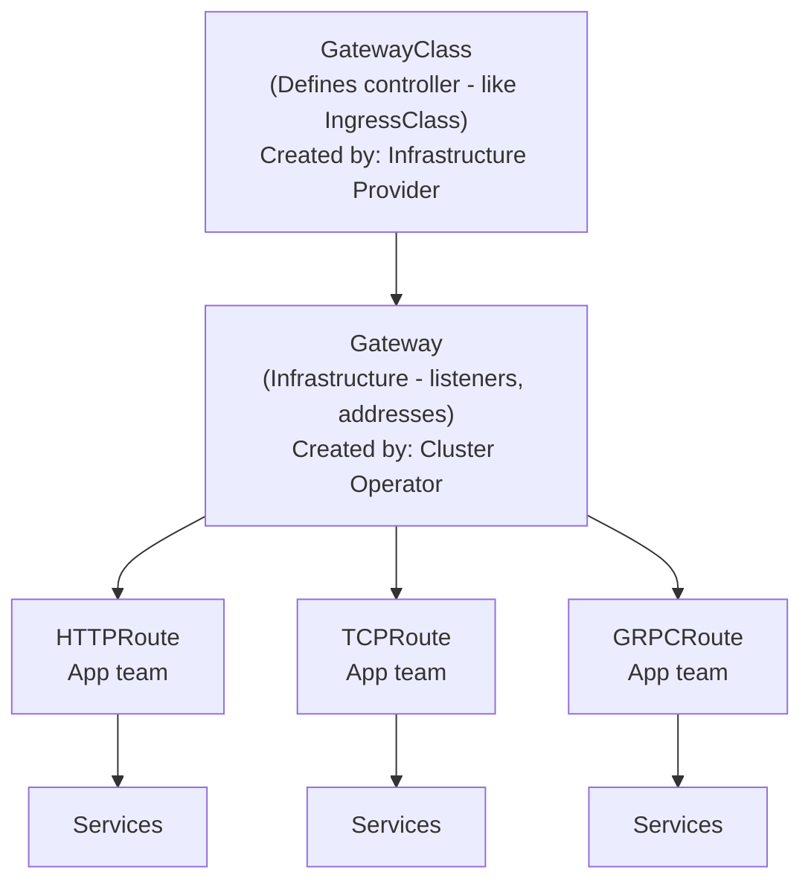
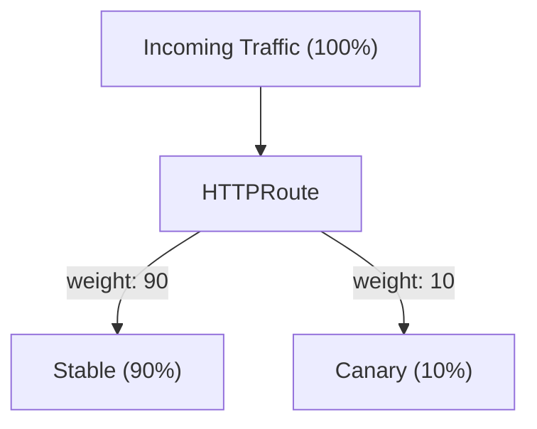
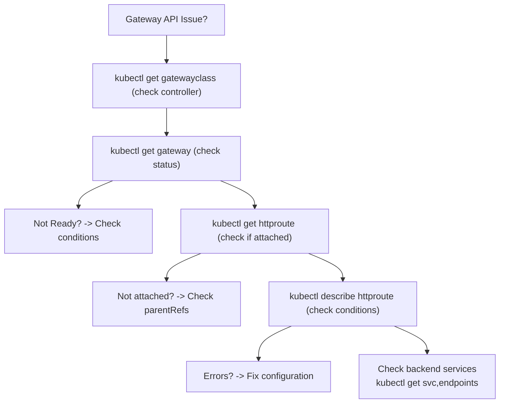

> **Complexity**: `[MEDIUM]` - CKA exam topic
>
> **Time to Complete**: 45-55 minutes
>
> **Prerequisites**: Module 3.4 (Ingress)

---

## What You'll Be Able to Do

After completing this module, you will be able to:

- **Design** a multi-tenant traffic management strategy using Gateway API's role-oriented model.
- **Implement** advanced traffic splitting, header manipulation, and request mirroring using HTTPRoute.
- **Diagnose** routing failures and namespace boundary issues using Gateway and HTTPRoute status conditions.
- **Evaluate** the architectural tradeoffs between the legacy Ingress API and the Gateway API.
- **Compare** the capabilities of standard HTTPRoutes against experimental TCP/UDP routes.

## Why This Module Matters

Hypothetical scenario: your platform team owns the public entry point for a shared cluster, while separate application teams own checkout, reporting, and customer-facing APIs. With a classic Ingress workflow, one team may need controller-specific annotations for rewrites, another may need header routing, and a third may ask for canary traffic. Those requirements often accumulate inside one resource shape, which makes ownership blurry and turns routine application changes into infrastructure-risky edits.

Gateway API exists because Kubernetes networking needed a stronger contract than "put every advanced behavior into an annotation and hope the controller interprets it the same way." It separates infrastructure concerns from routing concerns, so a cluster operator can publish a Gateway while application teams attach routes that fit explicit namespace and listener rules. That separation does not eliminate the need for careful review, but it gives you clearer failure boundaries and better status conditions when something is rejected.

In this module, you will move from the Ingress mental model to the Gateway API model used by modern Kubernetes networking controllers. You will read and write GatewayClass, Gateway, HTTPRoute, GRPCRoute, TLSRoute, and ReferenceGrant manifests, then practice diagnosing attachment and reference failures from status. The goal is not just to memorize new resource names; the goal is to decide where a routing change belongs and prove that the controller accepted the intent.

The airport analogy is still useful if you keep the responsibilities precise. Ingress is like a small terminal where one desk handles runway requests, ticket counter rules, and security exceptions. Gateway API is closer to a modern airport: infrastructure operators manage runways and gates, application teams manage route assignments for their services, and security policy decides which teams can cross shared boundaries. The API is valuable because those roles become visible in Kubernetes objects instead of being hidden in comments and annotations.

## Part 1: Gateway API vs Ingress

Ingress is stable and widely deployed, but it was designed for a narrower problem: expose HTTP and HTTPS services through host and path rules. As soon as teams needed portable header routing, traffic splitting, request rewrites, mirroring, TCP forwarding, or gRPC-aware routing, controllers filled the gap with annotations. Annotations are flexible, but they are also weakly typed and controller-specific, so a manifest that works with one implementation may be silently ignored or interpreted differently by another.

Gateway API takes a different approach by making common routing capabilities part of the API surface. Instead of hiding a canary policy in an ingress-nginx annotation or a provider-specific custom field, you express weighted backends inside an HTTPRoute. Instead of relying on a controller manual for header matching syntax, you use standard match fields. The result is not perfect portability across every feature, because implementations still advertise conformance profiles and optional capabilities, but the baseline contract is much stronger.

| Aspect | Ingress | Gateway API |
|--------|---------|-------------|
| Resources | 1 (Ingress) | Multiple (Gateway, HTTPRoute, etc.) |
| Protocols | HTTP/HTTPS | HTTP, HTTPS, TCP, UDP, TLS, gRPC |
| Role model | Single resource | Separated by role |
| Extensibility | Annotations (non-portable) | Typed extensions (portable) |
| Header routing | Controller-specific | Native support |
| Traffic splitting | Controller-specific | Native support |
| Status | Stable | GA since v1.0 (Oct 2023) |

That comparison explains why Gateway API is not merely a "new Ingress." It is a resource family that models the people and systems involved in traffic management. GatewayClass identifies the controller and implementation family, Gateway describes listeners and addresses, Route resources describe application routing, and ReferenceGrant permits a cross-namespace reference only from the namespace that owns the target object.

The API includes both stable and experimental route types. `HTTPRoute` is a Layer 7 route type with features such as path matching, header matching, and traffic splitting. `TCPRoute` and `UDPRoute` are Experimental Layer 4 route types for forwarding TCP or UDP traffic without HTTP-level inspection, while `TLSRoute` handles SNI-based routing and is Standard as of Gateway API v1.5.0. On Kubernetes 1.35, you should still check which channel your cluster installed before assuming every route kind is available.

The important design habit is to separate "what traffic should do" from "who is allowed to decide that." Ingress usually made the routing author and infrastructure author the same person or at least the same manifest reviewer. Gateway API lets the platform team publish a constrained listener and lets the application team express routing inside those constraints. That split is especially useful when a cluster has many namespaces because the object graph itself shows where authority starts and ends.



Pause and predict: if a large organization lets platform teams manage infrastructure and application teams manage routes, what breaks when both groups edit one shared Ingress object? Think about review ownership, rollback responsibility, and the blast radius of a bad annotation before you read the role table below.

| Role | Resources | Responsibilities |
|------|-----------|-----------------|
| **Infrastructure Provider** | GatewayClass | Defines how gateways are implemented |
| **Cluster Operator** | Gateway, ReferenceGrant | Configures infrastructure, network policies |
| **Application Developer** | HTTPRoute, TCPRoute | Defines routing rules for applications |

This role-oriented design is one of the most important exam points because it changes how you debug. If a Gateway is not programmed, you investigate the controller, GatewayClass, listener, address, and infrastructure side first. If an HTTPRoute is not accepted, you inspect its `parentRefs`, listener compatibility, namespace permissions, and backend references. Those are different failure domains, and Gateway API exposes them through status conditions so you do not need to infer everything from controller logs.

There is also a cultural benefit to this model. A route review can focus on application behavior, such as whether `/api` should point to `api-service` and whether a canary should receive ten percent of requests. A Gateway review can focus on shared infrastructure, such as certificate references, listener hostnames, namespace selectors, and controller class. Those conversations still overlap, but they no longer have to happen inside one overloaded YAML document.

## Part 2: Installing Gateway API

Gateway API is an API project, not a default data plane. Installing the CustomResourceDefinitions only teaches the Kubernetes API server how to store Gateway API objects; it does not create load balancers, Envoy processes, cloud forwarding rules, or listener sockets. A functional setup needs both CRDs and a controller implementation that watches those resources and programs actual traffic handling.

The Gateway API release process is channel-based. Standard channel releases contain APIs with stronger compatibility expectations, while Experimental channel releases carry alpha fields and resource kinds that can change more freely. For a Kubernetes 1.35 cluster, the current supported Gateway API release line is v1.5.x, but the operational habit matters more than the exact tag: always pin the release you install, record whether you chose Standard or Experimental, and check the controller's compatibility matrix.

```bash
# Install Gateway API Standard channel CRDs for the v1.5 release line.
kubectl apply -f https://github.com/kubernetes-sigs/gateway-api/releases/download/v1.5.1/standard-install.yaml

# Verify CRDs are installed.
kubectl get crd | grep gateway
# gatewayclasses.gateway.networking.k8s.io
# gateways.gateway.networking.k8s.io
# httproutes.gateway.networking.k8s.io
```

The historical GA install URL `https://github.com/kubernetes-sigs/gateway-api/releases/download/v1.0.0/standard-install.yaml` is useful when you are reading older examples, but it is not the best default for a Kubernetes 1.35 study cluster. Use a current release unless your controller or managed platform tells you to pin an older version. This is the same discipline you use for Kubernetes manifests in production: examples teach shape, while release notes decide the exact supported version.

If you install the Experimental channel only because one tutorial used it, you may accidentally expose your cluster to APIs your platform team never intended to support. If you install only the Standard channel while copying a TCPRoute example, the API server may reject the resource because the kind is absent. Neither result is mysterious once you remember that the channel choice changes which CRDs exist. Treat the channel as part of the platform contract, not as an incidental download URL.

| Controller | Type | Best For |
|------------|------|----------|
| **Istio** | Service mesh | Full-featured, service mesh users |
| **Contour** | Standalone | Simple, fast |
| **nginx** | Standalone | Familiar to nginx users |
| **Cilium** | CNI-integrated | eBPF performance |
| **Traefik** | Standalone | Dynamic configuration |

Choosing a controller is an implementation decision, not a Gateway API syntax decision. Istio may be attractive when you already use service mesh traffic management. Contour or Envoy Gateway can be simpler for standalone edge routing. Cilium is compelling when the network team already runs eBPF-based datapath tooling. The CKA exam normally emphasizes object relationships and troubleshooting rather than vendor-specific installation, but real clusters fail when the API and controller versions are treated as interchangeable.

Controller choice also affects how quickly status becomes useful. A controller that does not own your GatewayClass will ignore the Gateway entirely, while a controller that owns the class but cannot allocate infrastructure may accept the object and report programming failure. Both situations start with a manifest that applied successfully, so the API server response alone is not enough. Your normal workflow should include checking the GatewayClass, then the Gateway conditions, then the attached routes.

```bash
# Install Istio with Gateway API support.
istioctl install --set profile=minimal

# Or for quick testing with kind/minikube, use Contour.
kubectl apply -f https://projectcontour.io/quickstart/contour-gateway.yaml
```

Before running this in a shared environment, what output do you expect from `kubectl get gatewayclass` after only the CRDs are installed? You should expect the command to work but return no useful implementation until a controller creates or watches a GatewayClass. If you see CRDs but no accepted GatewayClass, your manifests may apply cleanly while no traffic can ever be programmed.

## Part 3: GatewayClass and Gateway

`GatewayClass` is the cluster-scoped resource that names the implementation family. It is similar to `IngressClass`, but it participates in a broader model where infrastructure operators and application developers use different resources. In many real environments, application teams never create GatewayClasses; they select from classes that the platform team has already approved, documented, and wired to a controller.

```yaml
# GatewayClass - created by infrastructure provider
apiVersion: gateway.networking.k8s.io/v1
kind: GatewayClass
metadata:
  name: example-gateway-class
spec:
  controllerName: example.io/gateway-controller
  description: "Example Gateway controller"
```

```bash
# List GatewayClasses.
kubectl get gatewayclass
kubectl get gc
```

The `controllerName` field is not a friendly label; it is the string the controller uses to decide whether it owns this class. If it does not match a running implementation, a Gateway that references the class will remain unprogrammed no matter how correct the listener YAML looks. When you diagnose a Gateway that never becomes ready, start by checking the class and its status before you spend time editing route rules.

Because GatewayClass is cluster-scoped, it is usually part of platform bootstrap rather than application deployment. That does not mean application developers can ignore it. A route that attaches to a Gateway ultimately depends on a chain that begins with the class and ends with backend endpoints. When the chain breaks near the top, route YAML changes will not help, so the first diagnostic question should be whether the infrastructure class exists and is accepted.

```yaml
# Gateway - created by cluster operator
apiVersion: gateway.networking.k8s.io/v1
kind: Gateway
metadata:
  name: example-gateway
  namespace: default
spec:
  gatewayClassName: example-gateway-class
  listeners:
  - name: http
    protocol: HTTP
    port: 80
    allowedRoutes:
      namespaces:
        from: All        # Allow routes from all namespaces
```

A Gateway is the resource where listeners, ports, hostnames, TLS settings, and route attachment rules meet. The listener says what traffic the Gateway accepts, while `allowedRoutes` says which route objects may attach to that listener. This is a powerful boundary because platform teams can expose a shared entry point without granting every namespace equal rights to every hostname and protocol.

```yaml
apiVersion: gateway.networking.k8s.io/v1
kind: Gateway
metadata:
  name: multi-listener-gateway
spec:
  gatewayClassName: example-gateway-class
  listeners:
  - name: http
    protocol: HTTP
    port: 80
    hostname: "*.example.com"
    allowedRoutes:
      namespaces:
        from: All
  - name: https
    protocol: HTTPS
    port: 443
    hostname: "*.example.com"
    tls:
      mode: Terminate
      certificateRefs:
      - name: example-tls
        kind: Secret
    allowedRoutes:
      namespaces:
        from: Same       # Only routes from same namespace
```

The multiple-listener example shows how the operator can publish different attachment policies on the same Gateway. HTTP traffic may accept routes from any namespace for a broad migration period, while HTTPS routes may be restricted to the Gateway namespace until certificate ownership is mature. That design is much clearer than relying on a naming convention or a controller admission rule that application developers cannot see from their route manifest.

Listener design is where many production disagreements should be resolved before they become outages. If a listener accepts every namespace and every hostname pattern, it is easy for a route to attach in a surprising way. If a listener is too narrow, application teams will create duplicate Gateways or ask for exceptions. A good platform design documents which listener names are stable, which hostnames they cover, and which namespaces are expected to attach routes.

```bash
# Get Gateway resources.
kubectl get gateway
kubectl get gtw

# Describe the Gateway and inspect conditions.
kubectl describe gateway example-gateway

# Check whether the Gateway is ready.
kubectl get gateway example-gateway -o jsonpath='{.status.conditions[?(@.type=="Ready")].status}'
```

When the Gateway status is not what you expect, read the condition types and reasons instead of only reading the top-level phase. Controllers commonly report whether a listener was accepted, whether addresses were assigned, and whether the data plane was programmed. These details are the difference between "YAML is wrong" and "the cloud load balancer is still provisioning," which require very different fixes.

That distinction matters during time-sensitive troubleshooting. Editing an HTTPRoute because a cloud address is still pending only adds noise, and restarting a controller because a route references the wrong parent wastes the signal the API already gave you. Gateway API's status model rewards a patient read of conditions. Look for who rejected the object, what relationship failed, and whether the failure is about attachment, reference resolution, listener compatibility, or data-plane programming.

## Part 4: HTTPRoute

`HTTPRoute` is the core route resource for HTTP application traffic. It attaches to one or more parent Gateways, optionally restricts hostnames, then evaluates rules containing matches, filters, and backend references. The key operational shift is that an application team can change path matching, canary weights, or header routing without editing the Gateway object that owns the listener and public address.

```yaml
apiVersion: gateway.networking.k8s.io/v1
kind: HTTPRoute
metadata:
  name: simple-route
spec:
  parentRefs:
  - name: example-gateway       # Attach to this Gateway
  rules:
  - backendRefs:
    - name: web-service         # Target service
      port: 80
```

The simplest HTTPRoute has no explicit match, so it acts as a default rule for traffic that reaches the attached parent and hostname. That simplicity is useful for initial connectivity tests, but production routes usually need explicit host or path boundaries. Without those boundaries, two teams can believe they own the same listener behavior and then discover that rule precedence decides the result.

Parent references are deliberately explicit because one route can target more than one parent in advanced designs. For the CKA level, focus on the normal case: an HTTPRoute names the Gateway it wants to attach to, and the Gateway listener decides whether that attachment is allowed. If the Gateway lives in another namespace, include the parent namespace in the route. If the listener is named and you need that exact listener, use the section reference supported by your controller and API version.

```yaml
apiVersion: gateway.networking.k8s.io/v1
kind: HTTPRoute
metadata:
  name: path-route
spec:
  parentRefs:
  - name: example-gateway
  rules:
  - matches:
    - path:
        type: PathPrefix
        value: /api
    backendRefs:
    - name: api-service
      port: 80
  - matches:
    - path:
        type: PathPrefix
        value: /
    backendRefs:
    - name: web-service
      port: 80
```

Path routing is the first place where rule ordering and specificity matter. A prefix match for `/api` should not be confused with a default prefix match for `/`, and a controller must decide which matching rule wins when several could apply. When you design these routes, write them so a human reviewer can identify the intended default and the intended special cases without reading controller implementation notes.

A reliable review question is whether every request path has an intentional destination or an intentional rejection. The default `/` prefix can be helpful, but it can also mask missing routes by sending unexpected traffic to a frontend. For APIs, teams often prefer explicit prefixes and a clear fallback behavior. Whatever convention you choose, write tests or curl checks that cover the root path, the special prefix, and a path that should not match the special rule.

```yaml
apiVersion: gateway.networking.k8s.io/v1
kind: HTTPRoute
metadata:
  name: host-route
spec:
  parentRefs:
  - name: example-gateway
  hostnames:
  - "api.example.com"
  - "api.example.org"
  rules:
  - backendRefs:
    - name: api-service
      port: 80
```

Hostnames give application teams a clean way to describe ownership of a DNS-facing API. A route with `api.example.com` should not accidentally receive traffic for `www.example.com`, even when both routes attach to the same Gateway. In multi-tenant clusters, hostnames also create a review surface: the operator can decide which namespaces may attach to a listener and which names are valid for that listener.

```yaml
apiVersion: gateway.networking.k8s.io/v1
kind: HTTPRoute
metadata:
  name: header-route
spec:
  parentRefs:
  - name: example-gateway
  rules:
  - matches:
    - headers:
      - name: X-Version
        value: v2
    backendRefs:
    - name: api-v2
      port: 80
  - matches:
    - headers:
      - name: X-Version
        value: v1
    backendRefs:
    - name: api-v1
      port: 80
```

Header-based routing is valuable when the client can intentionally select a version, tenant, or experiment cohort. It is also easy to abuse if the header is not trustworthy, because any client may be able to send the value unless another layer controls it. Treat header matches as routing signals, not authentication signals, unless you have a separate security mechanism that proves who added the header.

For canary and experiment traffic, header routing and weighted routing solve different problems. Header routing is deterministic for clients that carry the header, which makes it good for internal testers, partner integrations, or explicit opt-in flows. Weighted routing is probabilistic across a broader request stream, which makes it good for progressive rollout. Many teams use both: a header match for forced testing and a weighted default rule for gradual exposure.

Pause and predict: you want to roll out a new API version to a small share of users. With Deployments alone, you might adjust replica counts, but that couples capacity and routing. What changes when the HTTPRoute owns the traffic percentage while each Deployment scales independently?

```yaml
apiVersion: gateway.networking.k8s.io/v1
kind: HTTPRoute
metadata:
  name: canary-route
spec:
  parentRefs:
  - name: example-gateway
  rules:
  - backendRefs:
    - name: api-stable
      port: 80
      weight: 90           # 90% to stable
    - name: api-canary
      port: 80
      weight: 10           # 10% to canary
```



Weighted backends are a good example of Gateway API's practical advantage over replica-count canaries. You may want two canary pods for cost reasons but still send enough traffic to validate behavior quickly. You may also want ten stable pods to handle existing load while the canary receives a measured fraction. Routing and scaling are related, but they should not be the same control knob.

Do not treat route weights as a substitute for release safety. A ten percent canary can still hit every high-value customer if the traffic mix is unlucky, and a mirrored request can still overload a downstream dependency. The route gives you control over distribution, but you need metrics, logs, health checks, and rollback authority to make the rollout safe. In practice, the route change should be paired with a short observation plan and a clear revert command.

## Part 5: HTTPRoute Filters

Filters let an HTTPRoute transform or duplicate requests as part of standard routing behavior. In older Ingress deployments, these features often appeared as controller-specific annotations whose meaning changed between nginx, cloud load balancers, and service mesh gateways. Gateway API moves common behaviors into typed fields, which makes review easier and gives controllers a clearer conformance target.

```yaml
apiVersion: gateway.networking.k8s.io/v1
kind: HTTPRoute
metadata:
  name: header-filter-route
spec:
  parentRefs:
  - name: example-gateway
  rules:
  - filters:
    - type: RequestHeaderModifier
      requestHeaderModifier:
        add:
        - name: X-Custom-Header
          value: "added-by-gateway"
        remove:
        - X-Unwanted-Header
    backendRefs:
    - name: web-service
      port: 80
```

Request header modification is useful when you need to add a gateway-controlled marker or remove a header that should not reach the backend. The dangerous version is using header modification to paper over unclear ownership between clients, gateways, and applications. If an application depends on a header for authorization or tenant identity, document exactly which component sets it and how spoofed client-supplied values are handled.

```yaml
apiVersion: gateway.networking.k8s.io/v1
kind: HTTPRoute
metadata:
  name: rewrite-route
spec:
  parentRefs:
  - name: example-gateway
  rules:
  - matches:
    - path:
        type: PathPrefix
        value: /old-api
    filters:
    - type: URLRewrite
      urlRewrite:
        path:
          type: ReplacePrefixMatch
          replacePrefixMatch: /new-api
    backendRefs:
    - name: api-service
      port: 80
```

URL rewrites help during migrations because clients can keep using an old external path while the backend receives a newer internal path. The tradeoff is observability: logs, metrics, and traces may show different paths at different layers. A clean migration plan records both the external contract and the backend contract so troubleshooting does not become a guessing exercise.

```yaml
apiVersion: gateway.networking.k8s.io/v1
kind: HTTPRoute
metadata:
  name: redirect-route
spec:
  parentRefs:
  - name: example-gateway
  rules:
    - matches:
    - path:
        type: PathPrefix
        value: /old-path
    filters:
    - type: RequestRedirect
      requestRedirect:
        scheme: https
        hostname: new.example.com
        statusCode: 301
```

Redirects are client-visible changes, so they should be treated differently from rewrites. A rewrite keeps the browser or client URL stable and changes only what the backend receives. A redirect tells the client to make a new request somewhere else, and a permanent status code can be cached aggressively. For migrations, start with temporary behavior until you are confident that old clients, crawlers, and integrations handle the new URL.

```yaml
apiVersion: gateway.networking.k8s.io/v1
kind: HTTPRoute
metadata:
  name: mirror-route
spec:
  parentRefs:
  - name: example-gateway
  rules:
  - filters:
    - type: RequestMirror
      requestMirror:
        backendRef:
          name: api-canary
          port: 80
    backendRefs:
    - name: api-stable
      port: 80
```

Request mirroring duplicates traffic to another backend without using the mirrored response for the client. It is excellent for validating parsing, latency, and error rates against live-shaped traffic, but it is not harmless by default. The mirrored service must tolerate duplicate reads, avoid side effects, and protect downstream systems from unexpected load. If the mirror writes to a database or sends external notifications, you have built a production incident into your test plan.

Filters are easiest to operate when each route has one clear transformation purpose. A route that rewrites paths, modifies headers, redirects some clients, and mirrors requests at the same time may be valid, but it becomes difficult to reason about during failure. If several transformations are needed for a migration, stage them deliberately and record which layer owns each behavior. The reviewer should be able to predict the incoming request, gateway-transformed request, backend request, and client-visible response.

## Part 6: GRPCRoute and Protocol-Specific Routing

Gateway API provides native support for gRPC traffic through the `GRPCRoute` resource, allowing you to route requests based on gRPC services and methods rather than plain HTTP paths. That distinction matters because gRPC technically uses HTTP/2, but operators usually reason about protobuf service names, method names, and backend ports. A route that speaks the same language as the application protocol is less error-prone than encoding protocol details into generic path rules.

```yaml
apiVersion: gateway.networking.k8s.io/v1
kind: GRPCRoute
metadata:
  name: grpc-route
spec:
  parentRefs:
  - name: example-gateway
  rules:
  - matches:
    - method:
        service: myapp.v1.MyService
        method: MyMethod
    backendRefs:
    - name: grpc-backend
      port: 50051
```

Use a dedicated GRPCRoute when the routing decision is naturally about a gRPC service or method. It lets reviewers see the application-level intent directly and gives the implementation room to validate protocol-specific behavior. You could sometimes approximate this with HTTPRoute behavior, but the result is harder to read and easier to break when service names or generated paths change.

Standard versus Experimental status also affects protocol planning. HTTPRoute, GRPCRoute, and TLSRoute have Standard-channel support in current Gateway API releases, while TCPRoute and UDPRoute remain in the Experimental channel. If a platform team wants Layer 4 forwarding for a critical workload, the right conversation is not only "can the controller do it?" but also "are we comfortable operating an Experimental API here?"

Protocol-specific resources also help avoid false assumptions about what the Gateway can inspect. An HTTPRoute can inspect HTTP request attributes after the gateway understands the HTTP stream. A TLS passthrough design may only inspect SNI before forwarding encrypted bytes. A TCPRoute cannot make decisions based on HTTP headers because it is not operating at that layer. Matching the route kind to the actual protocol keeps your manifests honest and your troubleshooting path shorter.

## Part 7: Cross-Namespace Routing

Cross-namespace references are where Gateway API's security model becomes concrete. A route in one namespace may attach to a Gateway in another namespace if the Gateway listener allows that route kind and namespace. A route may also want to send traffic to a Service in another namespace, but that backend reference requires consent from the namespace that owns the Service. Gateway API makes that consent explicit through ReferenceGrant.

Pause and predict: an HTTPRoute in namespace `team-a` references a Service in namespace `team-b`, but no ReferenceGrant exists in `team-b`. Should the route silently work, route somewhere else, or report an unresolved reference in status? The secure answer is that the target namespace must grant permission, and the route should report a reference-resolution problem instead of guessing.

```yaml
# In the target namespace (where the service lives)
apiVersion: gateway.networking.k8s.io/v1
kind: ReferenceGrant
metadata:
  name: allow-routes-from-default
  namespace: backend-ns
spec:
  from:
  - group: gateway.networking.k8s.io
    kind: HTTPRoute
    namespace: default        # Allow routes from default namespace
  to:
  - group: ""
    kind: Service             # Allow referencing services
```

The ReferenceGrant belongs in the namespace being referenced, not the namespace making the reference. That placement is the security feature. The owner of `backend-ns` decides which source namespace and route kind may point at its Service, so a team cannot expose another team's backend simply by editing its own route manifest.

```yaml
# HTTPRoute in default namespace can now reference backend-ns service
apiVersion: gateway.networking.k8s.io/v1
kind: HTTPRoute
metadata:
  name: cross-ns-route
  namespace: default
spec:
  parentRefs:
  - name: example-gateway
  rules:
  - backendRefs:
    - name: backend-service
      namespace: backend-ns    # Cross-namespace reference
      port: 80
```

When cross-namespace routing fails, avoid starting with packet captures. First inspect the HTTPRoute status and look for accepted parent references and resolved backend references. Then inspect the target namespace for a ReferenceGrant that matches the route group, kind, namespace, and target kind. Most failures are simple mismatches in namespace, kind, or an omitted grant, and the API is designed to expose those as configuration problems.

ReferenceGrant is intentionally narrow. It does not grant broad namespace-to-namespace trust, and it does not let the source namespace decide what it may consume. That design may feel verbose in small labs, but it scales well when teams own different services. A target namespace can permit exactly the route kinds and source namespaces it expects, and future reviewers can understand the permission by reading one object next to the Service being exposed.

## Part 8: TLS Configuration

Gateway listeners can terminate TLS or pass encrypted traffic through depending on the protocol and route type. In termination mode, the Gateway presents a certificate, decrypts the connection, and forwards HTTP traffic to a backend. In passthrough-style designs, the Gateway uses TLS details such as SNI to select a backend while the backend terminates the encrypted connection. Those choices affect certificate ownership, observability, and where policy can inspect traffic.

In Gateway API v1.5.0, several capabilities achieved Standard status, including Gateway client certificate validation, certificate selection for TLS origination, `ListenerSet` support, and `TLSRoute` `v1`, while older `TLSRoute` alpha forms remained strictly experimental. Notably, TLSRoute CEL validation requires a cluster running Kubernetes 1.31 or higher, so a Kubernetes 1.35 cluster is an appropriate baseline for studying the current behavior.

```yaml
apiVersion: gateway.networking.k8s.io/v1
kind: Gateway
metadata:
  name: tls-gateway
spec:
  gatewayClassName: example-gateway-class
  listeners:
  - name: https
    protocol: HTTPS
    port: 443
    hostname: secure.example.com
    tls:
      mode: Terminate
      certificateRefs:
      - name: secure-tls        # TLS secret
        kind: Secret
    allowedRoutes:
      namespaces:
        from: All
```

| Mode | Behavior |
|------|----------|
| `Terminate` | Gateway terminates TLS, sends HTTP to backends |
| `Passthrough` | Gateway passes TLS through, backend handles termination |

Termination is easier to observe because the Gateway can apply HTTP-aware routing and filters after decryption. Passthrough is useful when backend teams must own certificates or when the Gateway should not inspect application traffic. Neither mode is universally better. The correct design depends on who owns certificates, which layer enforces policy, and whether the gateway implementation supports the exact route type and TLS behavior you intend to use.

Certificate references deserve the same ownership review as backend references. If the Gateway terminates TLS, the Gateway namespace usually contains or references the certificate material, and the platform team must define how certificates are rotated. If application teams own certificates, a passthrough or delegated model may fit better, but it changes which route fields are available for HTTP-aware behavior. The TLS decision is therefore both a security decision and a routing-capability decision.

## Part 9: Debugging Gateway API

Gateway API debugging is a dependency walk, not a random sequence of `describe` commands. Start at the class because no Gateway can be programmed by a controller that does not own the referenced GatewayClass. Move to the Gateway because listeners, hostnames, TLS settings, and allowedRoutes determine whether routes may attach. Then inspect the Route because parent acceptance, rule validity, and backend reference resolution decide whether traffic reaches a Service.



Use status conditions as the primary evidence. A Gateway that is accepted but not programmed points you toward infrastructure or controller readiness. An HTTPRoute that is not attached points you toward parent references, listener compatibility, or allowedRoutes. A route with unresolved references points you toward missing Services, wrong ports, or missing ReferenceGrant permissions. This method keeps you from changing three unrelated objects at once and losing the original signal.

```bash
# List all Gateway API resources.
kubectl get gatewayclass,gateway,httproute

# Check Gateway status.
kubectl describe gateway example-gateway

# Check HTTPRoute status.
kubectl describe httproute my-route

# Get HTTPRoute conditions.
kubectl get httproute my-route -o jsonpath='{.status.parents[0].conditions}'
```

| Symptom | Cause | Solution |
|---------|-------|----------|
| Gateway not Ready | No controller | Install Gateway controller |
| HTTPRoute not attached | Wrong parentRefs | Check Gateway name/namespace |
| 404 errors | No matching rule | Check path/host configuration |
| Cross-namespace fails | Missing ReferenceGrant | Create ReferenceGrant |

When a request returns 404, separate routing failure from backend failure. A route that never attached or never matched may produce a gateway-level 404 before the backend sees traffic. A backend Service with no endpoints may produce different errors depending on the controller. Check the route status, then check the Service and EndpointSlice objects, then test the backend directly from inside the cluster if the route looks healthy.

For exam practice, build a short diagnostic script in your head rather than memorizing individual commands. First confirm the CRDs and class exist, then confirm the Gateway is accepted and programmed, then confirm the route is attached to the intended parent, then confirm resolved references, and only then test the backend Service. This order matches the dependency graph. It also prevents a common mistake where learners inspect pods first even though the route never attached.

## Patterns & Anti-Patterns

The strongest Gateway API pattern is to keep infrastructure ownership and application ownership separate. Platform teams should publish a small number of documented Gateways with clear listener names, hostname rules, TLS posture, and namespace attachment policies. Application teams should own HTTPRoutes or GRPCRoutes that attach to those Gateways and describe only their application routing. This reduces surprise because each manifest answers one ownership question.

| Pattern | When to Use It | Why It Works | Scaling Consideration |
|---------|----------------|--------------|-----------------------|
| Shared Gateway, namespace-scoped routes | Many teams share one public entry point | Operators own listeners while app teams own routes | Requires clear allowedRoutes and hostname governance |
| Weighted HTTPRoute canaries | You need controlled rollout without changing replicas | Routing percentage is independent from pod count | Needs metrics per backend and rollback discipline |
| ReferenceGrant for shared backends | A route must point to a Service in another namespace | Target namespace grants explicit consent | Grants should be reviewed like access-control changes |
| Controller compatibility matrix | Platform team supports several environments | API support is checked before manifests ship | Keep Standard and Experimental channel decisions documented |

Another reliable pattern is to make listener names meaningful and stable. Routes can refer to a Gateway as a parent, and in more constrained designs they may target a specific section name. If listener names change casually, application route ownership becomes fragile. Treat listener names like an API contract, especially when multiple teams attach routes to the same Gateway.

| Anti-Pattern | What Goes Wrong | Better Alternative |
|--------------|-----------------|--------------------|
| One giant route owns every path | Reviewers cannot identify ownership or rollback safely | Split routes by application boundary and hostname |
| Experimental routes in production by accident | TCPRoute or UDPRoute behavior changes across releases | Install Experimental CRDs only through an explicit platform decision |
| Cross-namespace references without grants | Routes fail with unresolved references and unclear ownership | Create ReferenceGrant in the target namespace with narrow scope |
| Controller-specific assumptions hidden in routes | Manifests appear portable but depend on one implementation | Check conformance and document implementation-specific features |

The common thread is that Gateway API gives you better primitives, but it does not remove the need for governance. A shared Gateway with `allowedRoutes.namespaces.from: All` can be appropriate in a lab and risky in a production namespace with many tenants. A canary route can be safer than replica-count routing, but only if you monitor the right backend and can revert the weights quickly. The API improves the shape of the decision; it does not make the decision for you.

## Decision Framework

Start by asking what layer of the request you need to inspect. If the decision depends on HTTP path, host, header, query, or request filters, HTTPRoute is the natural tool. If the decision depends on gRPC service and method names, GRPCRoute communicates intent better. If the decision depends on TLS SNI without decrypting application traffic, evaluate TLSRoute and listener TLS mode. If the decision is raw TCP or UDP forwarding, confirm Experimental-channel support before you design around it.

| Decision Point | Choose This | Avoid This When |
|----------------|-------------|-----------------|
| Simple host/path HTTP routing | HTTPRoute | You need raw TCP/UDP forwarding |
| gRPC method-aware routing | GRPCRoute | The controller does not support the needed profile |
| TLS termination at the edge | HTTPS listener with `Terminate` | Backend teams must own end-to-end TLS termination |
| Cross-namespace backend reuse | HTTPRoute plus ReferenceGrant | Target namespace has not granted explicit permission |
| Legacy controller migration | ingress2gateway plus manual review | Provider-specific annotations encode critical behavior |
| Low-risk canary rollout | Weighted backendRefs | You lack backend-specific metrics or rollback authority |

The practical flow is: choose the route kind, choose the parent Gateway, verify the listener allows your namespace and route kind, verify backend references are local or explicitly granted, and then verify controller support for every filter you used. That sequence catches most design mistakes before traffic is involved. It also maps directly to troubleshooting, which is why the same framework helps during both implementation and incident response.

Which approach would you choose here and why: a team wants `/api` and `/admin` on the same hostname, but only the platform team may change TLS settings. The right design is usually a platform-owned Gateway with an HTTPS listener and application-owned HTTPRoutes for path routing. If `/admin` belongs to a different namespace than `/api`, make the ownership explicit with separate routes and avoid hiding both applications inside one oversized manifest.

When comparing Gateway API with alternatives, do not frame the choice as modern versus obsolete. Ingress can still be appropriate for simple, stable HTTP exposure when your controller behavior is well understood and portability is not a priority. Gateway API becomes the better default when several teams share entry points, when advanced routing needs should be typed and reviewable, or when you want status conditions that describe attachment and reference failures directly.

For the CKA exam, practice explaining the tradeoff in operational language. A strong answer says that Gateway API reduces annotation dependence, separates platform and application ownership, supports richer route kinds, and gives clearer status. A weak answer only says that Gateway API is newer. Kubernetes rewards precise reasoning: choose the API because it models the routing problem more accurately, not because a newer resource name sounds more impressive.

## Did You Know?

- Gateway API is purely an API project: like Ingress, it requires a separate controller implementation to process traffic, and Kubernetes does not ship a default Gateway controller.
- Version 1.5.1 is the latest supported v1 API release line as of May 9, 2026, and the v1.5 release moved several previously experimental capabilities into the Standard channel.
- Ingress is stable but frozen for new feature work; the official Kubernetes documentation recommends Gateway API when teams need active development of portable traffic-management features.
- Conformant Gateway implementations must pass core tests and the extended features they claim, which gives platform teams a stronger baseline than annotation-only portability.

## Common Mistakes

| Mistake | Why It Happens | How to Fix It |
|---------|----------------|---------------|
| Missing CRDs | The learner applies Gateway resources before the API server knows their kinds | Install the Gateway API CRDs for the intended release channel first |
| Wrong `gatewayClassName` | The Gateway references a class no running controller owns | Match the GatewayClass name and inspect its accepted status |
| Missing `parentRefs` | The route exists but never attaches to a Gateway listener | Add the correct parent Gateway name, namespace, and section name when needed |
| Namespace mismatch | Cross-namespace routing fails because ownership was assumed | Create a narrow ReferenceGrant in the target namespace |
| Wrong path type | Requests do not match because `Exact`, `PathPrefix`, and regex semantics differ | Choose the match type deliberately and test representative paths |
| Mixing Experimental and Standard CRDs | The cluster rejects or lacks route kinds such as TCPRoute or UDPRoute | Use consistent channel CRDs and document the platform support level |
| Testing routing without a controller | CRDs apply successfully, but no data plane programs traffic | Install Contour, Envoy Gateway, Istio, Cilium, Traefik, or another controller |
| Treating headers as identity | A route trusts a client-supplied header that anyone can send | Use header routing only as a routing signal unless another layer authenticates it |

## Quiz

<details>
<summary>Question 1: Your team is migrating a shared HTTP entry point from Ingress to Gateway API. A colleague asks why you cannot just keep the same Ingress objects and swap controllers. What limitation would you explain first?</summary>

Ingress can remain useful for simple host and path routing, but advanced behavior usually depends on controller-specific annotations. Gateway API makes common features such as weighted backends, header matching, request modification, and cross-namespace reference control part of typed resources. The migration is justified when portability, role separation, and status-driven debugging matter more than preserving a familiar single-object shape. You would also explain that the controller still matters, so migration includes both API design and implementation compatibility checks.
</details>

<details>
<summary>Question 2: A platform team wants only the `payments` namespace to attach HTTPRoutes to the production Gateway, while all namespaces may attach to the staging Gateway. Where should this policy live?</summary>

The policy belongs on the Gateway listeners through `allowedRoutes`, because the Gateway owner controls who may attach routes to each listener. The production listener should use a namespace selector that matches only the approved namespace label, while staging can allow broader attachment. This is better than relying on naming conventions because rejected routes expose status conditions and the permission is visible in the infrastructure resource. Application teams still own their routes, but they cannot bypass listener attachment rules.
</details>

<details>
<summary>Question 3: You shift a canary from 90/10 to 50/50, but you do not want to change the number of stable and canary pods. How does Gateway API support that design?</summary>

Gateway API supports this with weighted `backendRefs` inside an HTTPRoute. You change the weights to represent the traffic split while each Deployment scales according to its own resource needs. That separation is useful because traffic percentage and replica count are not the same operational concern. You should still verify backend metrics separately, because a small canary pool receiving half the traffic may need autoscaling or a temporary capacity increase.
</details>

<details>
<summary>Question 4: An HTTPRoute in `team-a` references a Service in `team-b`, and the route status reports unresolved references. What object is likely missing, and where should it be created?</summary>

A ReferenceGrant is likely missing in `team-b`, the namespace that owns the referenced Service. Gateway API requires the target namespace to grant permission for cross-namespace references, so creating the grant in `team-a` would not prove target-owner consent. The grant should name the source route kind and namespace and allow references to Services in the target namespace. After creating it, re-check the HTTPRoute parent status and resolved-reference condition rather than assuming traffic changed immediately.
</details>

<details>
<summary>Question 5: A developer wants to route API v2 traffic only when `X-Version: v2` is present, with v1 as the default. What makes HTTPRoute a better fit than an annotation-heavy Ingress?</summary>

HTTPRoute has standard header match fields, so the routing intent is visible in the resource schema rather than encoded in a controller-specific annotation. The route can put the header-specific rule before or alongside a default backend rule, depending on the desired match behavior. This makes review and migration easier because a conformant implementation understands the same field shape. You still need to test the controller's behavior, but the configuration is no longer tied to one annotation vocabulary.
</details>

<details>
<summary>Question 6: You apply a TCPRoute manifest after installing only the Standard channel CRDs, and the API server rejects the kind. What should you check before changing the YAML?</summary>

Check whether TCPRoute is available in the installed Gateway API channel and whether your controller supports it. TCPRoute and UDPRoute are Experimental, so they are not present in the Standard-only CRD installation. Installing Experimental CRDs is a platform decision because the compatibility expectations are different from Standard resources. The fix may be to install the appropriate channel, choose an HTTP/TLS design instead, or defer the workload until the platform supports that route kind.
</details>

<details>
<summary>Question 7: A TLSRoute manifest using current validation fields is rejected on an older cluster, but the same manifest works on Kubernetes 1.35. How would you explain the difference?</summary>

Current Gateway API TLSRoute validation relies on Kubernetes API server capabilities that older clusters may not have, including CEL-based CRD validation. Kubernetes 1.35 is new enough for the current v1.5-era CRDs, while older versions can reject fields before a controller ever sees the object. The right response is to align the Gateway API release, Kubernetes version, and controller compatibility matrix. Editing random route fields without checking those versions is likely to hide the actual cause.
</details>

## Hands-On Exercise

This exercise has two phases. The first phase validates object shape with a dummy GatewayClass, which is useful for learning the resource hierarchy but does not create live traffic. The second phase installs Contour so you can see a controller accept the class, program a Gateway, and route an actual request. Keep those phases separate in your mind: API acceptance proves the manifest is valid, while programmed status and curl output prove the data plane is working.

```bash
# Confirm the client is available before starting the lab.
kubectl version --client
```

### Phase 1: Syntax and Structure Validation

In this phase, create a complete Gateway API setup with routing. The dummy controller name is intentional because it lets you practice the object graph even on a cluster that does not have a real Gateway implementation installed yet. You should expect resources to exist, but you should not expect the dummy GatewayClass to program live traffic.

1. Install Gateway API CRDs if they are not already installed:

```bash
kubectl apply -f https://github.com/kubernetes-sigs/gateway-api/releases/download/v1.5.1/standard-install.yaml
```

2. Create backend services:

```bash
kubectl create deployment api --image=nginx
kubectl create deployment web --image=nginx
kubectl expose deployment api --port=80
kubectl expose deployment web --port=80
```

3. Create a simulated GatewayClass:

```bash
cat << 'EOF' | kubectl apply -f -
apiVersion: gateway.networking.k8s.io/v1
kind: GatewayClass
metadata:
  name: example-class
spec:
  controllerName: example.io/gateway-controller
EOF
```

4. Create a Gateway:

```bash
cat << 'EOF' | kubectl apply -f -
apiVersion: gateway.networking.k8s.io/v1
kind: Gateway
metadata:
  name: example-gateway
spec:
  gatewayClassName: example-class
  listeners:
  - name: http
    protocol: HTTP
    port: 80
    allowedRoutes:
      namespaces:
        from: All
EOF

kubectl get gateway
kubectl describe gateway example-gateway
```

5. Create an HTTPRoute with path routing:

```bash
cat << 'EOF' | kubectl apply -f -
apiVersion: gateway.networking.k8s.io/v1
kind: HTTPRoute
metadata:
  name: app-routes
spec:
  parentRefs:
  - name: example-gateway
  rules:
  - matches:
    - path:
        type: PathPrefix
        value: /api
    backendRefs:
    - name: api
      port: 80
  - matches:
    - path:
        type: PathPrefix
        value: /
    backendRefs:
    - name: web
      port: 80
EOF

kubectl get httproute
kubectl describe httproute app-routes
```

6. Create an HTTPRoute with traffic splitting:

```bash
# Create canary deployment.
kubectl create deployment api-canary --image=nginx

kubectl expose deployment api-canary --port=80

cat << 'EOF' | kubectl apply -f -
apiVersion: gateway.networking.k8s.io/v1
kind: HTTPRoute
metadata:
  name: canary-route
spec:
  parentRefs:
  - name: example-gateway
  hostnames:
  - "canary.example.com"
  rules:
  - backendRefs:
    - name: api
      port: 80
      weight: 90
    - name: api-canary
      port: 80
      weight: 10
EOF
```

7. View all resources:

```bash
kubectl get gatewayclass,gateway,httproute
```

8. Cleanup:

```bash
kubectl delete httproute app-routes canary-route
kubectl delete gateway example-gateway
kubectl delete gatewayclass example-class
kubectl delete deployment api web api-canary
kubectl delete svc api web api-canary
```

### Phase 2: Live Traffic Validation with Contour and Curl

Because `example.io/gateway-controller` and `drill.io/controller` are non-functional dummy controllers, the Gateways generated above will sit in a pending or unprogrammed state. To test genuine routing logic, install Contour and create a Gateway that the Contour controller owns. This proves the difference between Kubernetes accepting Gateway API objects and a controller programming a real data plane.

```bash
# 1. Install Contour Gateway Controller.
kubectl apply -f https://projectcontour.io/quickstart/contour-gateway.yaml

# 2. Wait for the Contour GatewayClass to be accepted.
kubectl wait --for=condition=Accepted gatewayclass/contour --timeout=60s

# 3. Create a real Gateway using Contour.
cat << 'EOF' | kubectl apply -f -
apiVersion: gateway.networking.k8s.io/v1
kind: Gateway
metadata:
  name: real-gateway
  namespace: projectcontour
spec:
  gatewayClassName: contour
  listeners:
  - name: http
    protocol: HTTP
    port: 80
    allowedRoutes:
      namespaces:
        from: All
EOF

# 4. Wait for Gateway to be programmed and extract the active IP address.
kubectl wait --for=condition=Programmed gateway/real-gateway -n projectcontour --timeout=120s
export GW_IP=$(kubectl get gateway real-gateway -n projectcontour -o jsonpath='{.status.addresses[0].value}')
echo "Gateway IP: $GW_IP"

# 4b. Recreate backend service if it was cleaned up in Phase 1.
kubectl create deployment api --image=nginx
kubectl expose deployment api --port=80

# 5. Route traffic to the real-gateway.
cat << 'EOF' | kubectl apply -f -
apiVersion: gateway.networking.k8s.io/v1
kind: HTTPRoute
metadata:
  name: live-route
spec:
  parentRefs:
  - name: real-gateway
    namespace: projectcontour
  rules:
  - matches:
    - path:
        type: PathPrefix
        value: /
    backendRefs:
    - name: api
      port: 80
EOF

# 6. Send a live request.
curl -i http://$GW_IP/
```

### Success Criteria

- [ ] Explain the Gateway API resource hierarchy from GatewayClass to Route to Service.
- [ ] Create Gateway and HTTPRoute resources with valid Kubernetes 1.35-compatible manifests.
- [ ] Configure path-based routing for separate API and web backends.
- [ ] Configure weighted traffic splitting without changing Deployment replica counts.
- [ ] Diagnose the difference between an accepted resource and a programmed data plane.
- [ ] Validate active traffic rules using a functional controller like Contour.

### Practice Drills

The following drills test syntax speed with mock controllers. For a complete simulation, repeat the same shapes with Contour and test with `curl`. Treat the mock drills as manifest practice, not proof that traffic is flowing, because a dummy `controllerName` cannot program an address or listener.

#### Drill 1: Check Gateway API Installation

```bash
# Check CRDs.
kubectl get crd | grep gateway

# List GatewayClasses.
kubectl get gatewayclass

# List Gateways.
kubectl get gateway -A

# List HTTPRoutes.
kubectl get httproute -A
```

#### Drill 2: Create Basic Gateway

```bash
# Create GatewayClass.
cat << 'EOF' | kubectl apply -f -
apiVersion: gateway.networking.k8s.io/v1
kind: GatewayClass
metadata:
  name: drill-class
spec:
  controllerName: drill.io/controller
EOF

# Create Gateway.
cat << 'EOF' | kubectl apply -f -
apiVersion: gateway.networking.k8s.io/v1
kind: Gateway
metadata:
  name: drill-gateway
spec:
  gatewayClassName: drill-class
  listeners:
  - name: http
    protocol: HTTP
    port: 80
    allowedRoutes:
      namespaces:
        from: All
EOF

# Verify.
kubectl get gateway drill-gateway
kubectl describe gateway drill-gateway

# Cleanup.
kubectl delete gateway drill-gateway
kubectl delete gatewayclass drill-class
```

#### Drill 3: Path-Based HTTPRoute

```bash
# Create services.
kubectl create deployment svc1 --image=nginx
kubectl create deployment svc2 --image=nginx
kubectl expose deployment svc1 --port=80
kubectl expose deployment svc2 --port=80

# Create Gateway and GatewayClass.
cat << 'EOF' | kubectl apply -f -
apiVersion: gateway.networking.k8s.io/v1
kind: GatewayClass
metadata:
  name: path-class
spec:
  controllerName: path.io/controller
---
apiVersion: gateway.networking.k8s.io/v1
kind: Gateway
metadata:
  name: path-gateway
spec:
  gatewayClassName: path-class
  listeners:
  - name: http
    protocol: HTTP
    port: 80
    allowedRoutes:
      namespaces:
        from: All
EOF

# Create path-based HTTPRoute.
cat << 'EOF' | kubectl apply -f -
apiVersion: gateway.networking.k8s.io/v1
kind: HTTPRoute
metadata:
  name: path-route
spec:
  parentRefs:
  - name: path-gateway
  rules:
  - matches:
    - path:
        type: PathPrefix
        value: /service1
    backendRefs:
    - name: svc1
      port: 80
  - matches:
    - path:
        type: PathPrefix
        value: /service2
    backendRefs:
    - name: svc2
      port: 80
EOF

# Verify.
kubectl describe httproute path-route

# Cleanup.
kubectl delete httproute path-route
kubectl delete gateway path-gateway
kubectl delete gatewayclass path-class
kubectl delete deployment svc1 svc2
kubectl delete svc svc1 svc2
```

#### Drill 4: Traffic Splitting

```bash
# Create stable and canary.
kubectl create deployment stable --image=nginx
kubectl create deployment canary --image=nginx
kubectl expose deployment stable --port=80
kubectl expose deployment canary --port=80

# Create Gateway resources.
cat << 'EOF' | kubectl apply -f -
apiVersion: gateway.networking.k8s.io/v1
kind: GatewayClass
metadata:
  name: split-class
spec:
  controllerName: split.io/controller
---
apiVersion: gateway.networking.k8s.io/v1
kind: Gateway
metadata:
  name: split-gateway
spec:
  gatewayClassName: split-class
  listeners:
  - name: http
    protocol: HTTP
    port: 80
    allowedRoutes:
      namespaces:
        from: All
---
apiVersion: gateway.networking.k8s.io/v1
kind: HTTPRoute
metadata:
  name: split-route
spec:
  parentRefs:
  - name: split-gateway
  rules:
  - backendRefs:
    - name: stable
      port: 80
      weight: 80
    - name: canary
      port: 80
      weight: 20
EOF

# Verify.
kubectl describe httproute split-route

# Cleanup.
kubectl delete httproute split-route
kubectl delete gateway split-gateway
kubectl delete gatewayclass split-class
kubectl delete deployment stable canary
kubectl delete svc stable canary
```

#### Drill 5: Header-Based Routing

```bash
# Create versioned services.
kubectl create deployment v1 --image=nginx
kubectl create deployment v2 --image=nginx
kubectl expose deployment v1 --port=80
kubectl expose deployment v2 --port=80

# Create Gateway resources with header routing.
cat << 'EOF' | kubectl apply -f -
apiVersion: gateway.networking.k8s.io/v1
kind: GatewayClass
metadata:
  name: header-class
spec:
  controllerName: header.io/controller
---
apiVersion: gateway.networking.k8s.io/v1
kind: Gateway
metadata:
  name: header-gateway
spec:
  gatewayClassName: header-class
  listeners:
  - name: http
    protocol: HTTP
    port: 80
    allowedRoutes:
      namespaces:
        from: All
---
apiVersion: gateway.networking.k8s.io/v1
kind: HTTPRoute
metadata:
  name: header-route
spec:
  parentRefs:
  - name: header-gateway
  rules:
  - matches:
    - headers:
      - name: X-Version
        value: v2
    backendRefs:
    - name: v2
      port: 80
  - matches:
    - headers:
      - name: X-Version
        value: v1
    backendRefs:
    - name: v1
      port: 80
EOF

# Verify.
kubectl describe httproute header-route

# Cleanup.
kubectl delete httproute header-route
kubectl delete gateway header-gateway
kubectl delete gatewayclass header-class
kubectl delete deployment v1 v2
kubectl delete svc v1 v2
```

#### Drill 6: Host-Based Routing

```bash
# Create services.
kubectl create deployment api --image=nginx
kubectl create deployment web --image=nginx
kubectl expose deployment api --port=80
kubectl expose deployment web --port=80

# Create Gateway with host routing.
cat << 'EOF' | kubectl apply -f -
apiVersion: gateway.networking.k8s.io/v1
kind: GatewayClass
metadata:
  name: host-class
spec:
  controllerName: host.io/controller
---
apiVersion: gateway.networking.k8s.io/v1
kind: Gateway
metadata:
  name: host-gateway
spec:
  gatewayClassName: host-class
  listeners:
  - name: http
    protocol: HTTP
    port: 80
    allowedRoutes:
      namespaces:
        from: All
---
apiVersion: gateway.networking.k8s.io/v1
kind: HTTPRoute
metadata:
  name: api-route
spec:
  parentRefs:
  - name: host-gateway
  hostnames:
  - "api.example.com"
  rules:
  - backendRefs:
    - name: api
      port: 80
---
apiVersion: gateway.networking.k8s.io/v1
kind: HTTPRoute
metadata:
  name: web-route
spec:
  parentRefs:
  - name: host-gateway
  hostnames:
  - "www.example.com"
  rules:
  - backendRefs:
    - name: web
      port: 80
EOF

# Verify.
kubectl get httproute

# Cleanup.
kubectl delete httproute api-route web-route
kubectl delete gateway host-gateway
kubectl delete gatewayclass host-class
kubectl delete deployment api web
kubectl delete svc api web
```

#### Drill 7: Challenge - Complete Gateway API Setup

Complete this without looking at the solution first. Install Gateway API CRDs if needed, create a GatewayClass named `challenge-class`, create a Gateway named `challenge-gateway` on port 80, create deployments named `frontend`, `backend`, and `admin`, create HTTPRoutes for `/admin`, `/api`, and `/`, verify all resources, and then clean everything up. The purpose is to practice the resource order until it feels natural.

```bash
# YOUR TASK: Complete the challenge in one focused practice session.
```

<details>
<summary>Solution</summary>

```bash
# 1. CRDs if needed.
kubectl apply -f https://github.com/kubernetes-sigs/gateway-api/releases/download/v1.5.1/standard-install.yaml

# 2-3. GatewayClass and Gateway.
cat << 'EOF' | kubectl apply -f -
apiVersion: gateway.networking.k8s.io/v1
kind: GatewayClass
metadata:
  name: challenge-class
spec:
  controllerName: challenge.io/controller
---
apiVersion: gateway.networking.k8s.io/v1
kind: Gateway
metadata:
  name: challenge-gateway
spec:
  gatewayClassName: challenge-class
  listeners:
  - name: http
    protocol: HTTP
    port: 80
    allowedRoutes:
      namespaces:
        from: All
EOF

# 4. Create deployments and services.
kubectl create deployment frontend --image=nginx
kubectl create deployment backend --image=nginx
kubectl create deployment admin --image=nginx
kubectl expose deployment frontend --port=80
kubectl expose deployment backend --port=80
kubectl expose deployment admin --port=80

# 5. Create HTTPRoutes.
cat << 'EOF' | kubectl apply -f -
apiVersion: gateway.networking.k8s.io/v1
kind: HTTPRoute
metadata:
  name: challenge-routes
spec:
  parentRefs:
  - name: challenge-gateway
  rules:
  - matches:
    - path:
        type: PathPrefix
        value: /admin
    backendRefs:
    - name: admin
      port: 80
  - matches:
    - path:
        type: PathPrefix
        value: /api
    backendRefs:
    - name: backend
      port: 80
  - matches:
    - path:
        type: PathPrefix
        value: /
    backendRefs:
    - name: frontend
      port: 80
EOF

# 6. Verify.
kubectl get gatewayclass,gateway,httproute

# 7. Cleanup.
kubectl delete httproute challenge-routes
kubectl delete gateway challenge-gateway
kubectl delete gatewayclass challenge-class
kubectl delete deployment frontend backend admin
kubectl delete svc frontend backend admin
```

</details>

## Sources

- [Gateway API FAQ](https://gateway-api.sigs.k8s.io/faq/)
- [Ingress | Kubernetes](https://kubernetes.io/docs/concepts/services-networking/ingress/)
- [Gateway API Overview](https://gateway-api.sigs.k8s.io/concepts/api-overview/)
- [Migrating from Ingress - Kubernetes Gateway API](https://gateway-api.sigs.k8s.io/guides/getting-started/migrating-from-ingress/)
- [Gateway API Versioning](https://gateway-api.sigs.k8s.io/concepts/versioning/)
- [Gateway API Conformance](https://gateway-api.sigs.k8s.io/concepts/conformance/)
- [GatewayClass API type](https://gateway-api.sigs.k8s.io/api-types/gatewayclass/)
- [Gateway API type](https://gateway-api.sigs.k8s.io/api-types/gateway/)
- [HTTPRoute API type](https://gateway-api.sigs.k8s.io/api-types/httproute/)
- [GRPCRoute API type](https://gateway-api.sigs.k8s.io/api-types/grpcroute/)
- [TLSRoute API type](https://gateway-api.sigs.k8s.io/api-types/tlsroute/)
- [ReferenceGrant API type](https://gateway-api.sigs.k8s.io/api-types/referencegrant/)
- [Gateway API v1.5.0 release notes](https://github.com/kubernetes-sigs/gateway-api/releases/tag/v1.5.0)
- [Gateway API v1.5.1 release](https://github.com/kubernetes-sigs/gateway-api/releases/tag/v1.5.1)
- [Gateway API v1.5 announcement on Kubernetes Blog](https://kubernetes.io/blog/2026/04/21/gateway-api-v1-5/)
- https://github.com/kubernetes-sigs/gateway-api/releases/download/v1.0.0/standard-install.yaml

## Next Module

[Module 3.6: Network Policies](../module-3.6-network-policies/) - Controlling pod-to-pod communication.
