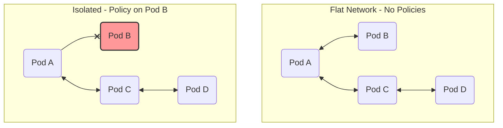
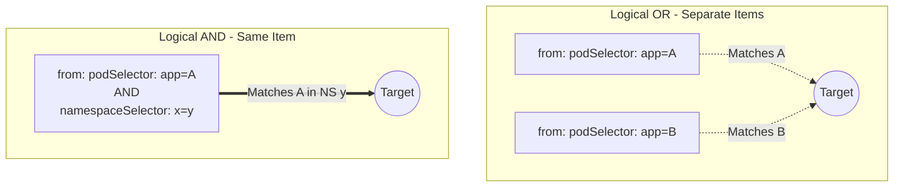
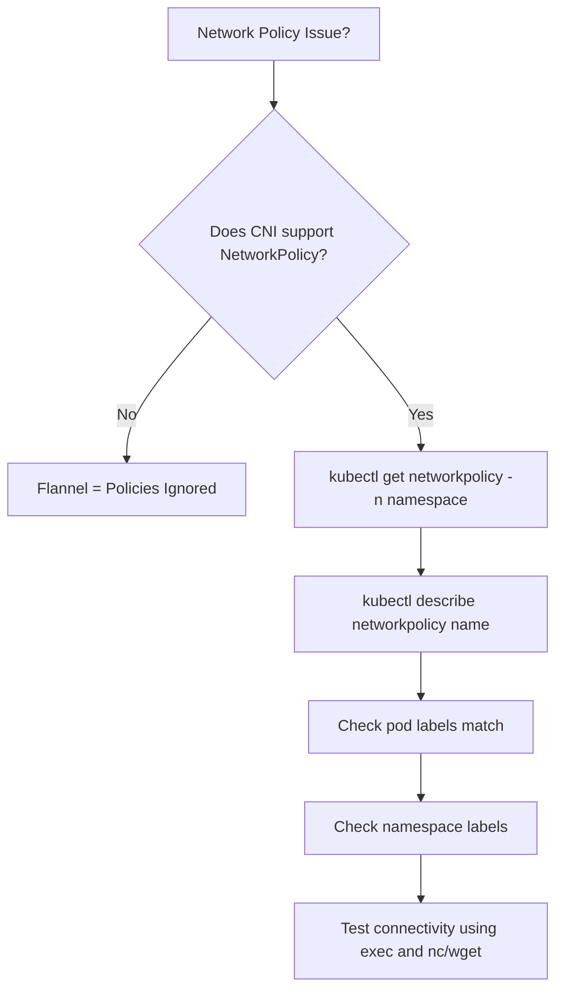
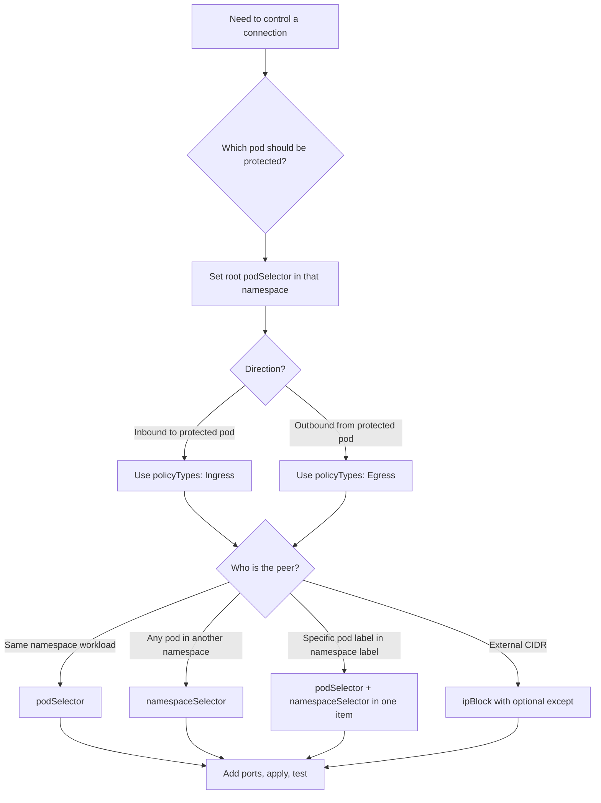

> **Complexity**: `[MEDIUM]` - Pod-level firewalling
>
> **Time to Complete**: 45-55 minutes
>
> **Prerequisites**: Module 3.1 (Services), Module 2.1 (Pods)

---

## What You'll Be Able to Do

After completing this module, you will be able to:
- **Design** a namespace-level network segmentation strategy for a multi-tier Kubernetes application using default-deny baselines and targeted allow policies.
- **Implement** ingress and egress NetworkPolicies that authorize only the required pod, namespace, IP block, and port combinations.
- **Evaluate** selector logic across `podSelector`, `namespaceSelector`, and `ipBlock` rules so you can distinguish OR behavior from AND behavior before applying a manifest.
- **Diagnose** blocked or unexpectedly open connectivity by checking CNI support, policy selection, labels, DNS egress, and reciprocal ingress or egress rules.
- **Compare** Kubernetes NetworkPolicy enforcement with traditional firewall expectations, including additive rules, asynchronous enforcement, CNI differences, and layer 3/layer 4 limits.

## Why This Module Matters

Hypothetical scenario: your team runs a three-tier application in one namespace. The web pod receives public traffic through an ingress controller, the app pod talks to the database, and a batch worker occasionally calls an external API. During a dependency vulnerability response, the security team asks whether a compromised web pod could connect directly to the database, query cluster DNS, or call private infrastructure endpoints. Without NetworkPolicies, the honest answer is uncomfortable: in the default Kubernetes networking model, pods are normally allowed to communicate freely unless a policy-enforcing CNI plugin and matching policy objects say otherwise.

NetworkPolicies are Kubernetes' built-in way to express pod-level traffic intent at layer 3 and layer 4. They do not replace authentication, TLS, admission control, or runtime detection, but they reduce the blast radius when one workload behaves badly. Think of a namespace as an apartment building where every apartment starts with an unlocked door and an unlocked lobby exit. A NetworkPolicy does not move the apartments or change who lives there; it adds rules about which doors accept visitors and which exits each resident may use.

This matters on the CKA because the exam expects you to reason from first principles rather than memorize one manifest. You must know when a policy isolates a pod, when an empty object means "everything," when an empty list means "nothing," and why an egress lockdown breaks service discovery unless DNS is explicitly allowed. The operational habit is just as important as the YAML: design the intended flow, apply the smallest useful baseline, add one allow rule at a time, and verify the result with labels and connectivity tests instead of assuming the manifest says what you meant.

## NetworkPolicy Mental Model

NetworkPolicy is an application-centered firewall model. Traditional firewall rules often start with IP ranges because servers used to be long-lived and manually assigned. Kubernetes pods are the opposite: they are created, deleted, rescheduled, and replaced constantly, so a useful policy must follow labels and namespaces rather than individual pod IP addresses. A policy selects destination pods with `spec.podSelector`, then defines which ingress sources or egress destinations are allowed for those selected pods.

The most important default is easy to say but easy to forget under pressure: a pod is non-isolated until a NetworkPolicy selects it for a direction. If no ingress policy selects a pod, inbound traffic is allowed. If no egress policy selects a pod, outbound traffic is allowed. Once at least one policy selects the pod for ingress, only allowed ingress flows are accepted; once at least one policy selects it for egress, only allowed egress flows are accepted.



The diagram shows the first mental split. Policies are not global firewall objects floating above the whole cluster; they apply to selected pods in the namespace where the policy object exists. The selected pod is the protected object, and the policy direction determines whether you are controlling traffic coming into it or traffic leaving it. If a different pod is not selected by any policy, that different pod remains non-isolated for the relevant direction even though another workload in the same namespace may be tightly locked down.

| Concept | Description |
|---------|-------------|
| **Ingress** | Traffic coming INTO the pod from another endpoint |
| **Egress** | Traffic going OUT from the pod to another endpoint |
| **podSelector** | The criteria defining which pods the policy applies to |
| **Isolated pods** | Pods actively selected by any NetworkPolicy |
| **Additive rules** | Multiple policies = union of all rules; there is no explicit deny |

Read "additive" literally. Kubernetes NetworkPolicy does not have an explicit deny rule that wins over an allow rule, and there is no rule ordering like you may have seen in perimeter firewalls. If two policies select the same pod for ingress, the pod receives the union of both policies' allowed ingress traffic. If one policy allows frontend pods and another allows monitoring pods, both sources are allowed; deleting or tightening one policy does not erase traffic allowed by the other.

```yaml
# This policy makes pods with app=web isolated for INGRESS
# (they can still make outbound connections)
apiVersion: networking.k8s.io/v1
kind: NetworkPolicy
metadata:
  name: isolate-ingress
spec:
  podSelector:
    matchLabels:
      app: web         # Selects these pods
  policyTypes:
  - Ingress            # Only ingress is affected
```

Pause and predict: you create a NetworkPolicy that selects pods with label `app: web`, includes `policyTypes: [Ingress]`, and has no ingress rules. Can anything reach those pods? Now change only one line so the policy contains `ingress: [{}]`. Before reading on, decide whether that single pair of braces creates a narrower rule, an identical deny, or a wildcard allow.

The answer turns on the difference between an empty list and an empty rule object. A selected pod with `policyTypes: [Ingress]` and no ingress rules is ingress-isolated with no allowed sources, so inbound traffic is denied by default. A rule entry of `{}` is different: it is an allow rule with no source or port restrictions, so it allows all ingress for the selected pods. In other words, `ingress: []` means "allow nothing," while `ingress: [{}]` means "allow everything for this direction."

## Default-Deny and Allow Rules

Default-deny is the foundation of practical NetworkPolicy design because it changes the namespace from "everything talks unless stopped" to "nothing talks unless intended." In Kubernetes, the usual ingress baseline is a NetworkPolicy with `podSelector: {}`, `policyTypes: [Ingress]`, and no `ingress` rules. The empty root `podSelector` selects all pods in that policy's namespace, and the absence of ingress rules means those selected pods have no allowed inbound sources until later allow policies add them.

```yaml
# Deny all incoming traffic to pods in namespace
apiVersion: networking.k8s.io/v1
kind: NetworkPolicy
metadata:
  name: deny-all-ingress
  namespace: production
spec:
  podSelector: {}        # Empty = select ALL pods
  policyTypes:
  - Ingress              # No ingress rules = deny all ingress
```

Egress default-deny works the same way, but the operational consequences are often more surprising. When you isolate egress, you are not only stopping calls to outside systems; you are also stopping calls to internal platform services unless you explicitly allow them. DNS is the classic example. A pod may still be able to reach a database pod by direct IP if you allow that IP or pod path, but `db-service` resolution fails unless the pod can send DNS queries to CoreDNS.

```yaml
# Deny all outgoing traffic from pods in namespace
apiVersion: networking.k8s.io/v1
kind: NetworkPolicy
metadata:
  name: deny-all-egress
  namespace: production
spec:
  podSelector: {}        # All pods
  policyTypes:
  - Egress               # No egress rules = deny all egress
```

For high-risk namespaces, teams sometimes begin with a total lockdown and then add explicit flows. This is powerful, but it is also easy to deploy too early. If you apply both ingress and egress deny-all policies before you have mapped DNS, metrics scraping, readiness probes, webhook calls, and database paths, you can create a clean security posture and an outage at the same time. Use default-deny deliberately, and verify each required path as you restore it.

```yaml
# Complete lockdown
apiVersion: networking.k8s.io/v1
kind: NetworkPolicy
metadata:
  name: deny-all
spec:
  podSelector: {}
  policyTypes:
  - Ingress
  - Egress
```

Sometimes you need an explicit allow-all policy, usually during a controlled rollback or a short diagnostic window. The important point is that the wildcard lives inside the `ingress` or `egress` list, not in the root selector. A root `podSelector: {}` chooses all pods in the namespace; an item `- {}` inside a rule list allows all peers and ports for that direction. Those two empty objects look similar, but they answer different questions.

```yaml
# Explicitly allow all ingress (useful to override deny policies)
apiVersion: networking.k8s.io/v1
kind: NetworkPolicy
metadata:
  name: allow-all-ingress
spec:
  podSelector: {}
  policyTypes:
  - Ingress
  ingress:
  - {}                   # Empty rule = allow all
```

```yaml
# Explicitly allow all egress
apiVersion: networking.k8s.io/v1
kind: NetworkPolicy
metadata:
  name: allow-all-egress
spec:
  podSelector: {}
  policyTypes:
  - Egress
  egress:
  - {}                   # Empty rule = allow all
```

If `policyTypes` is omitted, the API server infers `Ingress`, and it infers `Egress` only when an `egress` block exists. That inference is valid Kubernetes behavior, but it is not a great habit for exam work or production reviews. Explicit `policyTypes` make your intent visible to the next reader and prevent a small YAML edit from silently changing which direction is isolated.

## Selectors, Logic, and Ports

Selectors are where most NetworkPolicy mistakes hide. A `podSelector` in the root of the policy chooses the destination pods to which the policy applies. A `podSelector` under `from` chooses source pods for ingress, while a `podSelector` under `to` chooses destination pods for egress. A `namespaceSelector` chooses namespaces by labels, not by namespace names written as strings, and an `ipBlock` chooses CIDR ranges rather than Kubernetes objects.

```yaml
# Allow traffic from pods with label app=frontend
apiVersion: networking.k8s.io/v1
kind: NetworkPolicy
metadata:
  name: allow-frontend
spec:
  podSelector:
    matchLabels:
      app: backend         # This policy applies to backend pods
  policyTypes:
  - Ingress
  ingress:
  - from:
    - podSelector:
        matchLabels:
          app: frontend    # Allow traffic from frontend pods
```

```mermaid
graph LR
    subgraph Allowed
        P1(Pod app: frontend) --✓--> P2(Pod app: backend)
    end
    subgraph Blocked
        P3(Pod app: other) --x--> P4(Pod app: backend)
    end
```

In the same namespace, this policy is straightforward: backend pods are selected, frontend pods are allowed as sources, and other pods are not allowed by this policy. The phrase "by this policy" matters because policies are additive. If another policy also selects the backend pods and allows `app: other`, the connection from the "other" pod becomes allowed even though this specific policy does not mention it.

```yaml
# Allow traffic from all pods in namespace "monitoring"
apiVersion: networking.k8s.io/v1
kind: NetworkPolicy
metadata:
  name: allow-monitoring
spec:
  podSelector:
    matchLabels:
      app: backend
  policyTypes:
  - Ingress
  ingress:
  - from:
    - namespaceSelector:
        matchLabels:
          name: monitoring    # Namespace must have this label
```

Namespaces need labels, and that is not just a style preference. The `namespaceSelector` in a NetworkPolicy does not match a namespace by its displayed name unless that name is represented as a label. Modern Kubernetes namespaces receive the stable `kubernetes.io/metadata.name` label, which is useful for exact name targeting, but custom labels such as `name: monitoring` or `env: production` still need to exist before a selector can match them.

```bash
kubectl label namespace monitoring name=monitoring
```

The `ipBlock` selector is for CIDR-based traffic, especially traffic entering from or leaving to addresses outside the cluster object model. Its `except` field is a subtraction mechanism, but the exception CIDRs must be contained inside the parent CIDR. A policy that allows `192.168.1.0/24` except `192.168.1.100/32` is valid; a policy that allows `192.168.0.0/16` except `10.0.0.0/24` is invalid because the exception is not inside the allowed range.

```yaml
# Allow traffic from specific IP ranges
apiVersion: networking.k8s.io/v1
kind: NetworkPolicy
metadata:
  name: allow-external
spec:
  podSelector:
    matchLabels:
      app: web
  policyTypes:
  - Ingress
  ingress:
  - from:
    - ipBlock:
        cidr: 192.168.1.0/24      # Allow this range
        except:
        - 192.168.1.100/32        # Except this IP
```

Ports narrow a selected peer set to a layer 4 protocol and port. If you specify peers but omit ports, all ports are allowed from those peers. If you specify ports but omit peers, those ports are allowed from any source for ingress or to any destination for egress. That behavior is useful when it is intentional, but it can accidentally create a broad policy when a learner focuses on the port list and forgets that the peer field is empty.

```yaml
# Allow HTTP and HTTPS only
apiVersion: networking.k8s.io/v1
kind: NetworkPolicy
metadata:
  name: allow-web-ports
spec:
  podSelector:
    matchLabels:
      app: web
  policyTypes:
  - Ingress
  ingress:
  - from:
    - podSelector: {}            # From any pod
    ports:
    - protocol: TCP
      port: 80
    - protocol: TCP
      port: 443
```

Pause and predict: if the policy above changed `from` to an empty `from: []`, would it allow HTTP from every pod, no pod, or the same namespace only? Then compare that answer with `from: - podSelector: {}`. This is the kind of tiny YAML difference that shows up in real reviews because both versions look short and both seem plausible at a glance.

## AND, OR, and Multi-Rule Evaluation

The highest-value syntax lesson in this module is the difference between separate list items and combined selector fields. Separate entries under `from` or `to` behave like OR. A single entry containing both `podSelector` and `namespaceSelector` behaves like AND. The visual clue is indentation and dashes: if the selectors sit under different `-` list items, they are alternatives; if they sit in the same list item, both must match.

```yaml
# OR logic: from frontend pods OR from monitoring namespace
ingress:
- from:
  - podSelector:
      matchLabels:
        app: frontend
- from:
  - namespaceSelector:
      matchLabels:
        name: monitoring
```

```yaml
# AND logic: from frontend pods IN monitoring namespace
ingress:
- from:
  - podSelector:
      matchLabels:
        app: frontend
    namespaceSelector:
      matchLabels:
        name: monitoring
```



This distinction is not academic. Suppose your policy should allow only Prometheus pods in the monitoring namespace to scrape an API. If you accidentally write two entries, one for `podSelector: app=prometheus` and another for `namespaceSelector: name=monitoring`, you have allowed all Prometheus-labeled pods in the policy namespace and all pods in monitoring. The corrected version puts both selectors in one peer item, which means the source pod must have the label and must live in a matching namespace.

The same logic combines with ports and multiple rules. Within a single rule, a peer must match the peer constraints and the connection must match the port constraints. Across multiple rules, any matching rule can allow the connection. Across multiple policies that select the same pod and direction, any policy can contribute an allowed path. When debugging, you are always asking whether at least one selected policy permits the exact source, destination, protocol, and port.

```yaml
apiVersion: networking.k8s.io/v1
kind: NetworkPolicy
metadata:
  name: complex-policy
spec:
  podSelector:
    matchLabels:
      app: api
  policyTypes:
  - Ingress
  - Egress
  ingress:
  # Rule 1: Allow from frontend in same namespace
  - from:
    - podSelector:
        matchLabels:
          app: frontend
    ports:
    - port: 8080
  # Rule 2: Allow from any pod in monitoring namespace
  - from:
    - namespaceSelector:
        matchLabels:
          name: monitoring
    ports:
    - port: 9090
  egress:
  # Rule 1: Allow to database pods
  - to:
    - podSelector:
        matchLabels:
          app: database
    ports:
    - port: 5432
  # Rule 2: Allow DNS
  - to:
    - namespaceSelector: {}
    ports:
    - port: 53
      protocol: UDP
    - port: 53
      protocol: TCP
```

For traffic between two isolated pods, think about both sides of the conversation. The source pod's egress policy must allow the destination, and the destination pod's ingress policy must allow the source. A backend pod can be perfectly authorized to send to the database, but the database can still reject the connection if its ingress policy does not accept traffic from the backend. This reciprocal check is one reason NetworkPolicy troubleshooting often requires inspecting both workloads rather than staring at one manifest.

Before running this in a cluster, what output do you expect if the API pod can egress to `app=database` on 5432 but the database pod has a deny-all ingress policy with no allow rule? Predict whether the TCP connection fails at name resolution, at connection establishment, or at the application layer. Then verify by checking DNS separately from the target port, because different failures point to different missing rules.

## Egress, DNS, and External Destinations

Egress policy is where NetworkPolicy becomes more than simple "who can call my service" segmentation. It controls what selected pods are allowed to contact, which means it can block data exfiltration paths, accidental calls to private infrastructure, and unexpected dependency drift. It also means you are responsible for every platform dependency the workload uses. If a pod needs DNS, metrics, a cloud metadata endpoint, an internal API, or a database, those flows need to be represented deliberately.

```yaml
# Backend can only talk to database
apiVersion: networking.k8s.io/v1
kind: NetworkPolicy
metadata:
  name: backend-egress
spec:
  podSelector:
    matchLabels:
      app: backend
  policyTypes:
  - Egress
  egress:
  - to:
    - podSelector:
        matchLabels:
          app: database
    ports:
    - port: 5432
```

This policy is intentionally incomplete for most real applications because it omits DNS. Kubernetes Services are normally discovered through DNS names, and those names resolve through cluster DNS pods, commonly CoreDNS in `kube-system`. If egress is isolated and no DNS rule exists, `curl db-service` can fail even while direct traffic to a known pod IP or allowed endpoint succeeds. That is not a contradiction; it is evidence that the name lookup path is blocked while the data path may be allowed.

```yaml
# Allow DNS to kube-system
apiVersion: networking.k8s.io/v1
kind: NetworkPolicy
metadata:
  name: allow-dns
spec:
  podSelector: {}
  policyTypes:
  - Egress
  egress:
  - to:
    - namespaceSelector:
        matchLabels:
          kubernetes.io/metadata.name: kube-system
    ports:
    - port: 53
      protocol: UDP
    - port: 53
      protocol: TCP
```

What would happen if you apply a deny-all egress policy to backend pods but forget this DNS exception? The pods may still reach the database by direct IP if another rule permits that destination, but service-name access fails because the pod cannot query DNS on TCP or UDP port 53. This is the most useful NetworkPolicy debugging split: test name resolution and raw connectivity separately so you know whether you are missing DNS egress, application egress, destination ingress, or all three.

External egress is usually expressed with `ipBlock`, but you need to be careful about what IP the CNI sees. Service routing, NAT, node-level forwarding, and cloud networking can change whether policy evaluation observes the original destination or a translated address. For exam work, understand the manifest shape; for production work, confirm behavior with your CNI documentation and a packet-level test when the destination path crosses cluster boundaries.

```yaml
# Allow egress to external IPs
apiVersion: networking.k8s.io/v1
kind: NetworkPolicy
metadata:
  name: allow-external
spec:
  podSelector:
    matchLabels:
      app: web
  policyTypes:
  - Egress
  egress:
  - to:
    - ipBlock:
        cidr: 0.0.0.0/0        # All IPs
        except:
        - 10.0.0.0/8           # Except private ranges
        - 172.16.0.0/12
        - 192.168.0.0/16
```

The example allows public internet destinations while carving out common private address ranges. That pattern can be a useful guardrail for workloads that need vendor APIs but should not reach internal networks. It is not a complete data-loss prevention strategy, and it does not understand HTTP hosts or TLS SNI because the standard NetworkPolicy API operates at layer 3 and layer 4. If you need layer 7 policy, you are looking at CNI-specific extensions, service mesh policy, gateway policy, or application authorization.

## CNI Enforcement and Debugging

NetworkPolicy is an API contract, not a guarantee that every cluster enforces it. The Kubernetes API server will accept a valid NetworkPolicy object even when the installed CNI plugin does not implement policy enforcement. That is why a policy can look correct in `kubectl describe` while traffic still flows freely. The first debugging question is not "which selector did I miss?" but "does this cluster's network plugin actually enforce NetworkPolicy?"

Network policy handling is also asynchronous. Creating, deleting, or changing policies can take a short time to propagate into the dataplane, and established connections may behave differently across CNI implementations when a policy changes mid-stream. Traditional firewalls often invite a mental model of immediate ordered rule evaluation; Kubernetes NetworkPolicy is a declarative desired state reconciled by the networking implementation. For CKA tasks, wait briefly and retest; for production rollouts, stage policy changes and watch both connectivity and application health.



When you debug, work from the outside inward. Confirm the CNI, list policies in the right namespace, describe the policy to see how Kubernetes interpreted it, check labels on selected pods and namespaces, and then test a single connection with a clear source and destination. Avoid testing through a Service name first when egress policies are involved, because a failed Service name can mean DNS is blocked before the request ever reaches the intended destination.

```bash
# List network policies
kubectl get networkpolicy
kubectl get netpol                 # Short form

# Describe policy
kubectl describe networkpolicy <name>

# Check pod labels
kubectl get pods --show-labels

# Check namespace labels
kubectl get namespaces --show-labels

# Test connectivity
kubectl exec <pod> -- nc -zv target-service 80
kubectl exec <pod> -- wget --spider --timeout=1 http://target-service
kubectl exec <pod> -- curl -s --max-time 1 http://target-service
```

| Symptom | Cause | Solution |
|---------|-------|----------|
| Policy not enforced | CNI doesn't support | Use Calico, Cilium, or Weave |
| Can't resolve DNS | DNS egress blocked | Add egress rule for port 53 |
| Cross-namespace blocked | namespaceSelector wrong | Label namespaces, check selector |
| All traffic blocked | Empty podSelector in deny | Create allow rules for needed traffic |
| Pods can still communicate | Labels don't match | Verify podSelector matches pod labels |

Several edge cases are worth remembering because they explain confusing test results. NetworkPolicy behavior for pods using `hostNetwork: true` is implementation-defined, and many CNIs treat those workloads as node-network traffic rather than normal pod traffic. The standard API does not express explicit deny actions, Service-name targets, node identity restrictions, TLS requirements, or HTTP path rules. The `endPort` field is stable for port ranges, but support can still depend on the policy implementation behind the API.

Kubernetes 1.35 continues to use `networking.k8s.io/v1` for NetworkPolicy. Older manifests using `extensions/v1beta1` should be updated instead of carried forward, and the basic schema for ordinary policies is usually recognizable after that API group change. The practical lesson is that NetworkPolicy knowledge stays useful across supported releases, but you must still check CNI capability and API version compatibility before assuming a manifest will both apply and enforce.

## Worked Reference Policies

A useful way to internalize NetworkPolicy is to translate application architecture into a small set of protected destinations. Do not begin by asking, "Which pods can send traffic?" Begin by asking, "Which pod should be protected from receiving traffic?" That framing keeps the root `podSelector` honest. Once you know the protected destination, you can add the minimum source selector and port list that represents the intended flow. The examples in this section preserve the common policy shapes you will reuse under time pressure.

The database protection pattern is the simplest serious example. A database pod should usually receive traffic only from the application tier, not from the web tier, not from monitoring unless explicitly needed, and not from arbitrary debug pods. The policy below selects database pods as the protected destination and allows only backend pods on the database port. If you later discover that migrations run from a separate job label, add a second narrow allow policy rather than widening this one to the whole namespace.

```yaml
# Only allow backend pods to access database
apiVersion: networking.k8s.io/v1
kind: NetworkPolicy
metadata:
  name: db-protection
  namespace: production
spec:
  podSelector:
    matchLabels:
      app: database
  policyTypes:
  - Ingress
  ingress:
  - from:
    - podSelector:
        matchLabels:
          app: backend
    ports:
    - port: 5432
```

Notice what this policy does not say. It does not grant backend pods permission to egress anywhere, and it does not protect a database pod if the database label is missing or different. It also does not mention a Service, because the standard API selects pods and peers, not Service names. In a cluster with an egress lockdown, the backend tier still needs an egress rule to the database and likely a DNS rule if it connects by Service name. Treat ingress and egress as two halves of the same request path.

For a three-tier application, write the policies in the same order you would draw the architecture: traffic enters the web tier, the web tier calls the app tier, and the app tier calls the database tier. This is easier to review than one giant policy because each object has a single protected destination. Smaller policy objects also make additive behavior less surprising. When a future reviewer asks why the database accepts traffic, they can inspect the database policy instead of scanning an all-purpose manifest with many unrelated rules.

```yaml
# Web tier - only from ingress controller
apiVersion: networking.k8s.io/v1
kind: NetworkPolicy
metadata:
  name: web-policy
spec:
  podSelector:
    matchLabels:
      tier: web
  ingress:
  - from:
    - namespaceSelector:
        matchLabels:
          name: ingress-nginx
  policyTypes:
  - Ingress
```

The web policy is deliberately based on the ingress controller's namespace, not on a client IP range. In many clusters, traffic reaching a pod through an ingress controller arrives from controller pods, node-local paths, or implementation-specific addresses rather than from the original internet client. NetworkPolicy is usually the wrong place to express browser identity or HTTP route rules. Let the ingress layer handle HTTP routing and authentication, then let NetworkPolicy express which cluster components may reach the web pods at all.

```yaml
# App tier - only from web tier
apiVersion: networking.k8s.io/v1
kind: NetworkPolicy
metadata:
  name: app-policy
spec:
  podSelector:
    matchLabels:
      tier: app
  ingress:
  - from:
    - podSelector:
        matchLabels:
          tier: web
  policyTypes:
  - Ingress
```

The app policy uses a same-namespace pod selector because the web and app workloads are often deployed together. If your platform splits web and app workloads into different namespaces, combine a `namespaceSelector` with the web pod label in the same peer item. Do not write two separate peer entries unless you really mean "any web pod in the current namespace or any pod in the selected namespace." The difference is small in YAML, but it changes the security boundary.

```yaml
# DB tier - only from app tier
apiVersion: networking.k8s.io/v1
kind: NetworkPolicy
metadata:
  name: db-policy
spec:
  podSelector:
    matchLabels:
      tier: db
  ingress:
  - from:
    - podSelector:
        matchLabels:
          tier: app
    ports:
    - port: 5432
  policyTypes:
  - Ingress
```

The database policy narrows both source and port, which is the right default for sensitive stateful workloads. If the database exposes a metrics port, add a separate monitoring allow rule that names the monitoring namespace and metrics port. Keeping operational access separate from application access helps reviews because each rule answers a different question. It also lets you remove one access path without accidentally breaking the other, which matters during incident response.

Comprehensive namespace isolation is a different pattern. It says that selected pods may communicate only inside the namespace, with a DNS exception so Service discovery still works. This pattern can be useful for training labs, tenant-like namespaces, or environments where workloads inside the namespace are trusted together but should not initiate arbitrary cross-namespace connections. It is not a substitute for tier policies when different pods in the same namespace have different sensitivity.

```yaml
# Default deny all, then allow within namespace only
apiVersion: networking.k8s.io/v1
kind: NetworkPolicy
metadata:
  name: namespace-isolation
spec:
  podSelector: {}
  policyTypes:
  - Ingress
  - Egress
  ingress:
  - from:
    - podSelector: {}      # Same namespace only
  egress:
  - to:
    - podSelector: {}      # Same namespace only
  - to:                    # Plus DNS
    - namespaceSelector: {}
    ports:
    - port: 53
      protocol: UDP
```

This policy is compact, but it deserves careful review. The ingress and first egress rules use `podSelector: {}`, which means any pod in the same namespace. The DNS rule uses `namespaceSelector: {}`, which means any namespace, but it narrows the port to 53. In a production cluster you may prefer to target the DNS namespace more precisely with `kubernetes.io/metadata.name: kube-system` and include TCP 53 as well as UDP 53. The broader example remains useful because it exposes the selector mechanics.

When you build your own policies, write a one-sentence contract above each manifest before you write YAML. For example: "Database pods accept TCP 5432 only from app pods in this namespace." Then check every field against that sentence. The root selector should identify database pods, the ingress source should identify app pods, and the port should be 5432. If any field cannot be traced back to the sentence, you are probably encoding an assumption rather than a requirement.

There is also a rollout lesson here. Applying a default-deny policy before allow policies gives immediate protection but risks a short interruption. Applying allow policies first and default-deny second reduces outage risk but leaves the old broad reachability in place until the final step. In a lab, either order is acceptable if you understand the transient behavior. In production, choose the order deliberately, announce the expected symptoms, and keep a rollback manifest ready that is narrower than a permanent wildcard.

Finally, make negative tests part of your definition of done. A successful frontend-to-app request only proves that one allowed path works; it does not prove that the database is protected from the frontend. For each sensitive destination, test at least one intended source and one unintended source. If the unintended source succeeds, inspect additive policies first, then selector labels, then CNI enforcement. That diagnosis order prevents you from rewriting correct YAML while a broader policy or unsupported dataplane is the real cause.

## Patterns & Anti-Patterns

Patterns are useful because they keep policy authoring from becoming a pile of one-off YAML. The best patterns start with a default posture, add explicit business flows, and leave enough observability to debug without disabling everything. They also treat labels as part of the contract: if `tier=app` drives network access, then that label needs the same care as a Service selector or Deployment template label.

| Pattern | When to Use It | Why It Works | Scaling Considerations |
|---------|----------------|--------------|------------------------|
| Namespace default-deny ingress | Any shared namespace containing workloads with different trust levels | It prevents accidental inbound reachability and forces explicit allow rules | Apply during maintenance or with staged allow policies to avoid surprising existing traffic |
| Tier-to-tier allow policies | Web, app, and database workloads with predictable request direction | It maps application architecture directly to labels and ports | Keep tier labels stable and review additive policies that may widen access |
| DNS plus service egress bundle | Workloads under egress isolation that still use Kubernetes Services | It separates name resolution from application data paths | Target `kube-system` by stable namespace label and include both UDP and TCP port 53 |
| Namespace-labeled platform access | Monitoring, ingress, or logging namespaces need controlled access | It avoids copying individual pod labels across platform components | Use `kubernetes.io/metadata.name` or managed namespace labels consistently |

Anti-patterns usually come from treating NetworkPolicy as a last-minute YAML patch instead of a design artifact. A team applies a deny-all policy, discovers an application outage, adds `ingress: [{}]` or `egress: [{}]` to get green health checks, and accidentally returns to a flat network. Another team copies a namespace selector from a blog post but never labels the namespace, so the policy looks precise and matches nothing. These are not syntax problems as much as workflow problems.

| Anti-Pattern | What Goes Wrong | Better Alternative |
|--------------|-----------------|--------------------|
| Relying on default cluster reachability | A compromised low-value pod can probe or contact sensitive pods | Start sensitive namespaces with default-deny and add reviewed allows |
| Using wildcard rules as a permanent fix | `ingress: [{}]` or `egress: [{}]` cancels the isolation you meant to create | Add narrowly scoped peers and ports, then test the exact flow |
| Writing selectors before labels are owned | Policies silently miss namespaces or pods when labels drift | Treat network labels as stable API and validate them in review |
| Assuming one-sided policy is enough | Source egress may allow a flow while destination ingress blocks it, or the reverse | Check both selected source egress and selected destination ingress |
| Expecting layer 7 filtering | HTTP paths, methods, and SNI are not part of standard NetworkPolicy | Use CNI extensions, mesh policy, ingress controls, or app authorization for layer 7 |

## Decision Framework

Use a decision framework when you are staring at a blank file or a broken connection. Start by identifying the protected pod, because the root `podSelector` answers "which pods does this policy isolate?" Next decide the direction, because ingress and egress are independent. Then choose the smallest peer type that represents the flow: pod labels for same-namespace workloads, namespace labels for cross-namespace groups, combined selectors for a labeled pod inside a labeled namespace, and `ipBlock` for CIDR-based external paths.



| Decision | Choose This | Avoid This |
|----------|-------------|------------|
| You need to block all inbound traffic by default | `podSelector: {}` with `policyTypes: [Ingress]` and no ingress rules | A wildcard `ingress: [{}]`, which allows all inbound traffic |
| You need same-namespace app-to-db access | Destination policy on DB pods, source `podSelector` for app pods, database port | A namespace-wide allow that lets every pod reach the database |
| You need monitoring from a platform namespace | `namespaceSelector` using a real namespace label, optionally combined with monitoring pod labels | Assuming namespace names are selectors without labels |
| You need external API egress | `ipBlock` for vendor ranges plus DNS egress when names are used | Opening `0.0.0.0/0` without exceptions or review |
| You need HTTP path filtering | A higher-layer control outside standard NetworkPolicy | Trying to express paths, hosts, or TLS policy in `networking.k8s.io/v1` |

The order of applying policies does not change the final additive result, but rollout order still matters operationally. If you apply deny-all before the matching allow rules, there may be a short outage. If you apply allow rules before deny-all, there may be a short period where both the old flat access and the intended new access are available. In production, use a staging namespace or a controlled window; in the exam, be ready to apply, test, and adjust quickly.

One practical review method is to write a traffic matrix before writing manifests. Put protected destinations down one side, source identities across the top, and ports in the cells. The matrix does not need to be fancy; it only needs to force a clear yes or no for each relationship. When a cell is blank, the policy should not accidentally allow it through a wildcard selector. When a cell is allowed, you should be able to point to the exact policy that grants it.

For example, a web-to-app-to-database system has at least three important negative cells: web-to-database, database-to-app, and random-debug-pod-to-database. Many teams test only the positive path because it feels like proof that the system works. NetworkPolicy validation needs the opposite habit as well. A passing negative test gives confidence that a broad selector, a copied wildcard, or an additive legacy policy has not quietly undone the design.

The matrix also helps with egress, where hidden dependencies are common. A pod that calls an external API may need DNS, a proxy, a certificate revocation endpoint, and the actual vendor API. If you forget those support flows, the policy may be secure but unusable. If you allow all egress to make the app work, the policy may be usable but weak. The engineering task is to identify each dependency and decide whether it belongs in Kubernetes NetworkPolicy, a proxy rule, or the application configuration.

Another useful habit is to separate platform access from application access. Ingress controllers, monitoring systems, log collectors, and scanners often need cross-namespace reachability that application pods should not have. If those flows are mixed into app policies without clear labels, later reviewers cannot tell whether a broad namespace rule supports production traffic or a platform tool. Dedicated policies named for the platform function make the additive model easier to audit and safer to change.

Label ownership deserves explicit attention because NetworkPolicy depends on labels as security inputs. A Deployment label used only for grouping can sometimes be casual; a label used by NetworkPolicy decides who can reach a sensitive workload. That label should be stable, reviewed, and difficult to spoof through uncontrolled workload creation. In stricter environments, admission policy can enforce allowed label keys or prevent untrusted teams from assigning labels that grant privileged network access.

Do not assume that a Service selector and a NetworkPolicy selector should always be identical. A Service selector decides which pods receive traffic through that Service, while a NetworkPolicy selector decides which pods are isolated or allowed. They often overlap, but they answer different questions. If a rollout temporarily includes old and new pods behind one Service, you may still want the policy to protect both versions. Conversely, an admin or migration pod might share a Service label but should not receive the same inbound access.

When troubleshooting, keep a short sequence in mind: selected destination, isolated direction, allowed peer, allowed port, reciprocal side, infrastructure dependency. This sequence prevents random edits. If the destination pod is not selected, the policy cannot protect it. If the direction is not isolated, the rule may be irrelevant. If the peer or port does not match, the flow is blocked. If the source egress or destination ingress is missing, only one side of the conversation is authorized.

Established connections can make policy tests look inconsistent if you reuse the same long-lived client process. Some CNIs may allow an existing connection to continue until it closes, while new connections follow the updated policy. For clean tests, start a fresh command after each policy change and use short timeouts. This is why the lab examples use one-shot `wget` calls rather than a persistent shell connection as the only evidence. Fresh tests reduce ambiguity when the dataplane is reconciling.

Finally, remember that NetworkPolicy is a boundary, not a proof of application identity. If two pods share a label and namespace, the policy treats them the same even if one runs a different image or code path. Authentication between services, least-privilege credentials, and application authorization still matter. NetworkPolicy reduces which network paths exist; it does not prove that every allowed caller is safe, patched, or authorized to perform every business action exposed by the destination.

For CKA preparation, practice saying the allow decision out loud in both directions. "The backend can receive from frontend on port 80" is an ingress statement about backend pods, while "the frontend can send to backend on port 80" is an egress statement about frontend pods. Many wrong answers come from mixing those viewpoints. If a problem gives you only one side, ask whether the other side is isolated. If it is not isolated, one policy may be enough; if it is isolated, the reciprocal allow must exist too. This habit also protects you from overfitting to examples that show only ingress policy, because real locked-down namespaces often combine both directions and require a complete path analysis. It also gives you a quick sanity check when an answer choice sounds secure but authorizes the wrong endpoint quickly and reliably.

## Did You Know?

- Kubernetes NetworkPolicy has been stable in `networking.k8s.io/v1` since Kubernetes 1.8, while the old `extensions/v1beta1` NetworkPolicy API was removed from served APIs long before Kubernetes 1.35.
- The `endPort` field for contiguous port ranges reached stable status in Kubernetes 1.25, which matters when you need a range without writing many individual port entries.
- Standard NetworkPolicy targets TCP, UDP, and SCTP behavior; ICMP and other protocol handling is not fully specified by the Kubernetes NetworkPolicy API and depends on the plugin.
- Kubernetes 1.35 is one of the currently tracked release branches in the upstream release process, so CKA-oriented manifests should use stable APIs and avoid removed beta forms.

## Common Mistakes

| Mistake | Why It Happens | How to Fix It |
|---------|----------------|---------------|
| Using unsupported CNI | The API accepts policies even when the dataplane does not enforce them | Verify the CNI supports NetworkPolicy and use capable implementations such as Calico, Cilium, or Weave Net |
| Forgetting DNS egress | Egress default-deny blocks CoreDNS queries before the app can resolve Service names | Add UDP and TCP port 53 egress to the DNS namespace, commonly `kube-system` |
| Leaving namespaces unlabeled | `namespaceSelector` matches labels, not the visible namespace name by itself | Add stable namespace labels or use `kubernetes.io/metadata.name` where appropriate |
| Confusing OR with AND selector logic | Separate YAML list items look visually close to combined selector fields | Put `podSelector` and `namespaceSelector` in the same peer item when both must match |
| Writing `ingress: [{}]` when intending deny-all | An empty rule object is a wildcard allow, not an empty allow list | Use no `ingress` rules or `ingress: []` for deny-all on selected pods |
| Omitting `policyTypes` in reviewed manifests | API inference hides which directions were meant to be isolated | Declare `Ingress`, `Egress`, or both explicitly in every teaching or production manifest |
| Expecting host-networked pods to behave like normal pods | `hostNetwork: true` can move traffic outside pod-centric enforcement paths | Avoid relying on standard NetworkPolicy for host-networked workloads without CNI-specific proof |

## Quiz

<details>
<summary>1. Your team applies a namespace-wide deny-all ingress policy, but Prometheus can still scrape every pod. What do you check first, and why?</summary>

First check whether the cluster CNI actually enforces NetworkPolicy. The API server can store valid NetworkPolicy objects even when the network plugin ignores them, so a correct-looking policy does not prove enforcement. This is a diagnosis of blocked or unexpectedly open connectivity by checking CNI support before selector details. If the CNI is capable, then check whether Prometheus is using `hostNetwork: true`, whether another additive policy allows the traffic, and whether the deny-all policy exists in the same namespace as the protected pods.

</details>

<details>
<summary>2. Backend pods can connect to a database pod by IP, but `curl db-service` fails after an egress lockdown. Which rule is missing?</summary>

The missing rule is DNS egress, usually UDP and TCP port 53 to the namespace that runs CoreDNS. Direct IP access bypasses name resolution, so it can succeed while Service-name access fails before the application connection starts. Add a DNS allow rule that targets `kube-system` by a real namespace label such as `kubernetes.io/metadata.name: kube-system`, then keep the database egress rule narrow. This fixes discovery without opening all outbound traffic.

</details>

<details>
<summary>3. A policy was intended to allow only frontend pods inside the monitoring namespace, but every pod in monitoring can connect. What is the likely YAML bug?</summary>

The likely bug is that `podSelector` and `namespaceSelector` were written as separate list items under `from`, which creates OR behavior. Separate peer entries mean "frontend pods" or "anything in monitoring," so every monitoring pod becomes allowed. Put both selectors in the same peer item to require AND behavior: the source must have the frontend label and live in a namespace matching the monitoring label. This is an indentation and dash placement issue, not a Kubernetes scheduling issue.

</details>

<details>
<summary>4. You need web pods to call a public payment API, app pods to call the database, and no other egress. How would you design the policies?</summary>

Start with default-deny egress for the namespace or for the selected tiers that need control. Add a DNS egress rule for pods that use names, because both the payment API and internal Services may require resolution. For web pods, add an `ipBlock` egress rule for the payment API ranges and the required port, usually TCP 443. For app pods, add an egress rule to database pods on the database port, and confirm the database ingress policy also allows app pods.

</details>

<details>
<summary>5. A production policy uses `namespaceSelector: {matchLabels: {env: production}}`, but it matches nothing. What do you verify?</summary>

Verify the labels on the namespace itself with `kubectl get namespace production --show-labels`. Namespace selectors match namespace labels, and Kubernetes does not invent arbitrary labels such as `env: production` just because the namespace is named production. Add the intended label or change the policy to use a label that already exists and is stable. After that, describe the policy and retest from a pod in the selected namespace.

</details>

<details>
<summary>6. A legacy manifest uses `apiVersion: extensions/v1beta1` for NetworkPolicy and is rejected by a Kubernetes 1.35 API server. What is the fix?</summary>

Update the manifest to `apiVersion: networking.k8s.io/v1`. NetworkPolicy has been stable in that API group for many releases, and removed beta APIs should not be used in Kubernetes 1.35-oriented material. For ordinary policies, the surrounding schema is usually similar enough that the API version is the main change, but you should still apply with server-side validation. The underlying issue is API lifecycle removal, not a failure of the policy concept.

</details>

<details>
<summary>7. You allow `192.168.0.0/16` with an `except` value of `10.0.0.0/24`, and the API server rejects it. Why?</summary>

The `except` CIDR must be contained inside the parent `cidr` block. `10.0.0.0/24` is not part of `192.168.0.0/16`, so Kubernetes rejects the policy as invalid. Use an exception such as `192.168.1.0/24` if that is the range you need to subtract, or create separate rules for unrelated ranges. This validation prevents mathematically meaningless exceptions from entering the policy.

</details>

## Hands-On Exercise

Exercise scenario: you will build a small three-tier namespace and move it from default Kubernetes reachability to explicit tier-to-tier access. The goal is not only to apply manifests, but to observe the transition: first everything can talk, then deny-all blocks the backend, then a frontend-to-backend allow restores only the intended path, and finally a backend-to-database allow completes the application chain. Use a cluster with a CNI that enforces NetworkPolicy, otherwise the policy objects will apply but the connectivity tests will not show isolation.

### Task 1: Create the test pods

```bash
# Create pods with different roles
kubectl run frontend --image=nginx --labels="tier=frontend"
kubectl run backend --image=nginx --labels="tier=backend"
kubectl run database --image=nginx --labels="tier=database"

# Wait for pods to be ready
kubectl wait --for=condition=ready pod/frontend pod/backend pod/database --timeout=60s
```

<details>
<summary>What this proves</summary>

The pods give you three stable labels for policy selection. They are intentionally simple because the learning target is network isolation, not application deployment. If your cluster pulls images slowly, wait until all pods are ready before testing, because a failed readiness state can look like a network failure. Keep the labels visible in your notes because each later policy depends on matching them exactly.

</details>

### Task 2: Verify default connectivity

```bash
BACKEND_IP=$(kubectl get pod backend -o jsonpath='{.status.podIP}')
kubectl exec frontend -- wget --spider --timeout=1 http://$BACKEND_IP
# Should succeed
```

<details>
<summary>What this proves</summary>

This confirms the starting point: without an ingress policy selecting the backend pod, the backend is non-isolated for ingress. If this test fails before any policy is applied, fix the pod readiness or cluster networking problem first. Do not continue into NetworkPolicy debugging until the flat-network baseline works, because otherwise you will misattribute an unrelated failure to policy logic.

</details>

### Task 3: Create an immediate deny-all ingress policy

```bash
cat << 'EOF' | kubectl apply -f -
apiVersion: networking.k8s.io/v1
kind: NetworkPolicy
metadata:
  name: deny-all
spec:
  podSelector: {}
  policyTypes:
  - Ingress
EOF
```

<details>
<summary>What this proves</summary>

The empty root `podSelector` selects all pods in the current namespace, and `policyTypes: [Ingress]` isolates inbound traffic. Because the policy has no ingress rules, no inbound sources are allowed for the selected pods. This is the clean default-deny baseline you will relax with targeted allow policies. It should not block pod egress, so commands started from a pod may still leave unless a separate egress policy exists.

</details>

### Task 4: Confirm the backend is blocked

```bash
kubectl exec frontend -- wget --spider --timeout=1 http://$BACKEND_IP
# Should timeout if the CNI supports NetworkPolicy
```

<details>
<summary>What this proves</summary>

If the connection still succeeds, check CNI enforcement before rewriting the policy. A cluster without NetworkPolicy enforcement will store this object and still allow traffic. If the connection times out, the backend pod is now ingress-isolated and no allow rule currently permits frontend traffic. That is the expected state before the next task.

</details>

### Task 5: Allow frontend to backend on HTTP

```bash
cat << 'EOF' | kubectl apply -f -
apiVersion: networking.k8s.io/v1
kind: NetworkPolicy
metadata:
  name: allow-frontend-to-backend
spec:
  podSelector:
    matchLabels:
      tier: backend
  policyTypes:
  - Ingress
  ingress:
  - from:
    - podSelector:
        matchLabels:
          tier: frontend
    ports:
    - port: 80
EOF
```

<details>
<summary>What this proves</summary>

This policy selects only backend pods as protected destinations and allows sources with `tier=frontend` on port 80. It does not allow database pods, random pods, or other ports. Because policies are additive, this policy does not remove the deny-all baseline; it adds one allowed ingress path for the backend pods. Describe both policies if the behavior surprises you, because Kubernetes will show the selected pods and rule shape.

</details>

### Task 6: Test allowed and blocked paths

```bash
kubectl exec frontend -- wget --spider --timeout=1 http://$BACKEND_IP
# Should succeed now

# But database to backend should still fail
DATABASE_IP=$(kubectl get pod database -o jsonpath='{.status.podIP}')
kubectl exec database -- wget --spider --timeout=1 http://$BACKEND_IP
# Should fail
```

<details>
<summary>What this proves</summary>

The first test confirms the intended allow path, while the second test confirms the policy did not reopen backend ingress to every pod. This paired testing habit is important: a policy is not validated just because the allowed client works. You also need at least one negative test showing an unintended source remains blocked. If both tests succeed, inspect whether another policy selects backend pods or whether your CNI is not enforcing policy.

</details>

### Task 7: Allow backend to database

```bash
cat << 'EOF' | kubectl apply -f -
apiVersion: networking.k8s.io/v1
kind: NetworkPolicy
metadata:
  name: allow-backend-to-database
spec:
  podSelector:
    matchLabels:
      tier: database
  policyTypes:
  - Ingress
  ingress:
  - from:
    - podSelector:
        matchLabels:
          tier: backend
    ports:
    - port: 80
EOF
```

<details>
<summary>What this proves</summary>

This mirrors the previous allow rule but protects database pods and allows only backend sources. The example uses port 80 because the test pod is nginx; a real database would use its actual port, such as 5432 for PostgreSQL. The important design point is that the database policy should not mention frontend pods at all. Frontend reaches backend, backend reaches database, and the database remains unreachable from the frontend unless you explicitly add that path.

</details>

### Task 8: Review active enforcement policies

```bash
kubectl get networkpolicy
kubectl describe networkpolicy
```

<details>
<summary>What this proves</summary>

The describe output is your audit view. It helps you verify which pod selector each policy uses, which ingress rules exist, and whether the generated interpretation matches your YAML. For exam practice, become comfortable reading this output quickly. For production practice, compare the output with the intended architecture rather than treating the mere existence of policy objects as proof of safety.

</details>

### Task 9: Teardown and cluster sanitation

```bash
kubectl delete networkpolicy deny-all allow-frontend-to-backend allow-backend-to-database
kubectl delete pod frontend backend database --force
```

<details>
<summary>Why cleanup matters</summary>

NetworkPolicies are namespace-scoped and additive, so leftover policies can confuse later labs. Deleting the pods and policies returns the namespace to its previous state. If you created extra namespaces or labels while experimenting, remove those as well. Clean teardown is part of reliable troubleshooting because it prevents yesterday's policy from becoming today's mystery.

</details>

### Success Criteria

- [ ] You verified default-allow behavior before applying any policy.
- [ ] You implemented a namespace-wide deny-all ingress baseline with `podSelector: {}`.
- [ ] You restored frontend-to-backend access without allowing database-to-backend access.
- [ ] You added a backend-to-database policy and explained why the database should not accept frontend traffic directly.
- [ ] You used `kubectl describe networkpolicy` and at least one negative connectivity test to validate policy logic.

### Practice Drills

These drills preserve the same exam muscle memory as the main lab while giving you smaller repetitions. Run them only in a disposable namespace or a local practice cluster, and keep using full `kubectl` commands so the snippets work when pasted into a non-interactive shell. The target times are suggestions for fluency, not grading requirements.

#### Drill 1: Deny All Ingress

```bash
# Create pod
kubectl run test-pod --image=nginx --labels="app=test"

# Create deny-all ingress
cat << 'EOF' | kubectl apply -f -
apiVersion: networking.k8s.io/v1
kind: NetworkPolicy
metadata:
  name: deny-ingress
spec:
  podSelector:
    matchLabels:
      app: test
  policyTypes:
  - Ingress
EOF

# Verify
kubectl describe networkpolicy deny-ingress

# Cleanup
kubectl delete networkpolicy deny-ingress
kubectl delete pod test-pod --force
```

#### Drill 2: Allow from Specific Pod

```bash
# Create pods
kubectl run server --image=nginx --labels="role=server"
kubectl run client --image=nginx --labels="role=client"
kubectl run other --image=nginx --labels="role=other"

# Create policy allowing only client
cat << 'EOF' | kubectl apply -f -
apiVersion: networking.k8s.io/v1
kind: NetworkPolicy
metadata:
  name: allow-client
spec:
  podSelector:
    matchLabels:
      role: server
  policyTypes:
  - Ingress
  ingress:
  - from:
    - podSelector:
        matchLabels:
          role: client
    ports:
    - port: 80
EOF

# Verify policy
kubectl describe networkpolicy allow-client

# Cleanup
kubectl delete networkpolicy allow-client
kubectl delete pod server client other --force
```

#### Drill 3: Allow from Namespace

```bash
# Create namespace with label
kubectl create namespace allowed
kubectl label namespace allowed name=allowed

# Create pods
kubectl run target --image=nginx --labels="app=target"
kubectl run source --image=nginx -n allowed

# Create policy
cat << 'EOF' | kubectl apply -f -
apiVersion: networking.k8s.io/v1
kind: NetworkPolicy
metadata:
  name: allow-namespace
spec:
  podSelector:
    matchLabels:
      app: target
  policyTypes:
  - Ingress
  ingress:
  - from:
    - namespaceSelector:
        matchLabels:
          name: allowed
EOF

# Verify
kubectl describe networkpolicy allow-namespace

# Cleanup
kubectl delete networkpolicy allow-namespace
kubectl delete pod target --force
kubectl delete namespace allowed
```

#### Drill 4: Egress with DNS

```bash
# Create pod
kubectl run egress-test --image=nginx --labels="app=egress"

# Create egress policy with DNS
cat << 'EOF' | kubectl apply -f -
apiVersion: networking.k8s.io/v1
kind: NetworkPolicy
metadata:
  name: egress-dns
spec:
  podSelector:
    matchLabels:
      app: egress
  policyTypes:
  - Egress
  egress:
  # Allow DNS
  - to:
    - namespaceSelector: {}
    ports:
    - port: 53
      protocol: UDP
    - port: 53
      protocol: TCP
  # Allow HTTPS
  - to: []
    ports:
    - port: 443
EOF

# Verify
kubectl describe networkpolicy egress-dns

# Cleanup
kubectl delete networkpolicy egress-dns
kubectl delete pod egress-test --force
```

#### Drill 5: Port-Specific Ingress

```bash
# Create pod
kubectl run web --image=nginx --labels="app=web"

# Allow only ports 80 and 443
cat << 'EOF' | kubectl apply -f -
apiVersion: networking.k8s.io/v1
kind: NetworkPolicy
metadata:
  name: web-ports
spec:
  podSelector:
    matchLabels:
      app: web
  policyTypes:
  - Ingress
  ingress:
  - ports:
    - port: 80
      protocol: TCP
    - port: 443
      protocol: TCP
EOF

# Verify
kubectl describe networkpolicy web-ports

# Cleanup
kubectl delete networkpolicy web-ports
kubectl delete pod web --force
```

#### Drill 6: IP Block Policy

```bash
# Create pod
kubectl run ip-test --image=nginx --labels="app=ip-test"

# Create policy with IP block
cat << 'EOF' | kubectl apply -f -
apiVersion: networking.k8s.io/v1
kind: NetworkPolicy
metadata:
  name: ip-block
spec:
  podSelector:
    matchLabels:
      app: ip-test
  policyTypes:
  - Ingress
  ingress:
  - from:
    - ipBlock:
        cidr: 10.0.0.0/8
        except:
        - 10.0.1.0/24
EOF

# Verify
kubectl describe networkpolicy ip-block

# Cleanup
kubectl delete networkpolicy ip-block
kubectl delete pod ip-test --force
```

#### Drill 7: Combined AND Selector

```bash
# Create namespace
kubectl create namespace restricted
kubectl label namespace restricted name=restricted

# Create pod
kubectl run secure --image=nginx --labels="app=secure"

# Create policy with AND logic
cat << 'EOF' | kubectl apply -f -
apiVersion: networking.k8s.io/v1
kind: NetworkPolicy
metadata:
  name: and-policy
spec:
  podSelector:
    matchLabels:
      app: secure
  policyTypes:
  - Ingress
  ingress:
  - from:
    # AND: must be frontend pod IN restricted namespace
    - podSelector:
        matchLabels:
          role: frontend
      namespaceSelector:
        matchLabels:
          name: restricted
EOF

# Verify
kubectl describe networkpolicy and-policy

# Cleanup
kubectl delete networkpolicy and-policy
kubectl delete pod secure --force
kubectl delete namespace restricted
```

#### Drill 8: Challenge - Complete Network Isolation

Without looking at the solution, create a namespace named `secure`, label it with `zone=secure`, run two pods named `app` and `db`, deny all ingress, allow the app pod to receive cluster traffic, allow the database to receive only app traffic on 5432, verify with `kubectl describe`, and clean up everything. The challenge is not speed alone; the goal is to keep the selector logic explainable while you type. If you cannot say which pod is selected by the root `podSelector`, pause before applying.

```bash
# YOUR TASK: Complete in under 7 minutes
```

<details>
<summary>Solution</summary>

```bash
# 1. Create namespace
kubectl create namespace secure
kubectl label namespace secure zone=secure

# 2. Create pods
kubectl run app -n secure --image=nginx --labels="tier=app"
kubectl run db -n secure --image=nginx --labels="tier=db"

# 3. Deny all ingress
cat << 'EOF' | kubectl apply -f -
apiVersion: networking.k8s.io/v1
kind: NetworkPolicy
metadata:
  name: deny-all
  namespace: secure
spec:
  podSelector: {}
  policyTypes:
  - Ingress
EOF

# 4. Allow app from anywhere
cat << 'EOF' | kubectl apply -f -
apiVersion: networking.k8s.io/v1
kind: NetworkPolicy
metadata:
  name: allow-app
  namespace: secure
spec:
  podSelector:
    matchLabels:
      tier: app
  policyTypes:
  - Ingress
  ingress:
  - from:
    - namespaceSelector: {}
EOF

# 5. Allow db from app only
cat << 'EOF' | kubectl apply -f -
apiVersion: networking.k8s.io/v1
kind: NetworkPolicy
metadata:
  name: allow-db
  namespace: secure
spec:
  podSelector:
    matchLabels:
      tier: db
  policyTypes:
  - Ingress
  ingress:
  - from:
    - podSelector:
        matchLabels:
          tier: app
    ports:
    - port: 5432
EOF

# 6. Verify
kubectl get networkpolicy -n secure
kubectl describe networkpolicy -n secure

# 7. Cleanup
kubectl delete namespace secure
```

</details>

## Sources

- [Kubernetes Releases](https://kubernetes.io/releases/)
- [Deprecated API Migration Guide](https://kubernetes.io/docs/reference/using-api/deprecation-guide/)
- [Network Policies](https://kubernetes.io/docs/concepts/services-networking/network-policies/)
- [Flannel](https://github.com/flannel-io/flannel)
- [Declare Network Policy](https://kubernetes.io/docs/tasks/administer-cluster/declare-network-policy/)
- [DNS for Services and Pods](https://kubernetes.io/docs/concepts/services-networking/dns-pod-service/)
- [Kubernetes Labels and Selectors](https://kubernetes.io/docs/concepts/overview/working-with-objects/labels/)
- [Kubernetes Namespaces](https://kubernetes.io/docs/concepts/overview/working-with-objects/namespaces/)
- [Cilium Network Policy](https://docs.cilium.io/en/stable/network/kubernetes/policy/)
- [Calico NetworkPolicy](https://docs.tigera.io/calico/latest/network-policy/get-started/kubernetes-policy/kubernetes-policy)
- [Weave Net Network Policy](https://rajch.github.io/weave/kubernetes/kube-addon.html#npc)

## Next Module

[Module 3.7: CNI & Cluster Networking](../module-3.7-cni/) - Take your knowledge of Network Policies to the next tier by tearing down the abstraction layer and discovering how different Container Network Interfaces physically manipulate IP tables and eBPF filters to implement these logical configurations under the hood.
