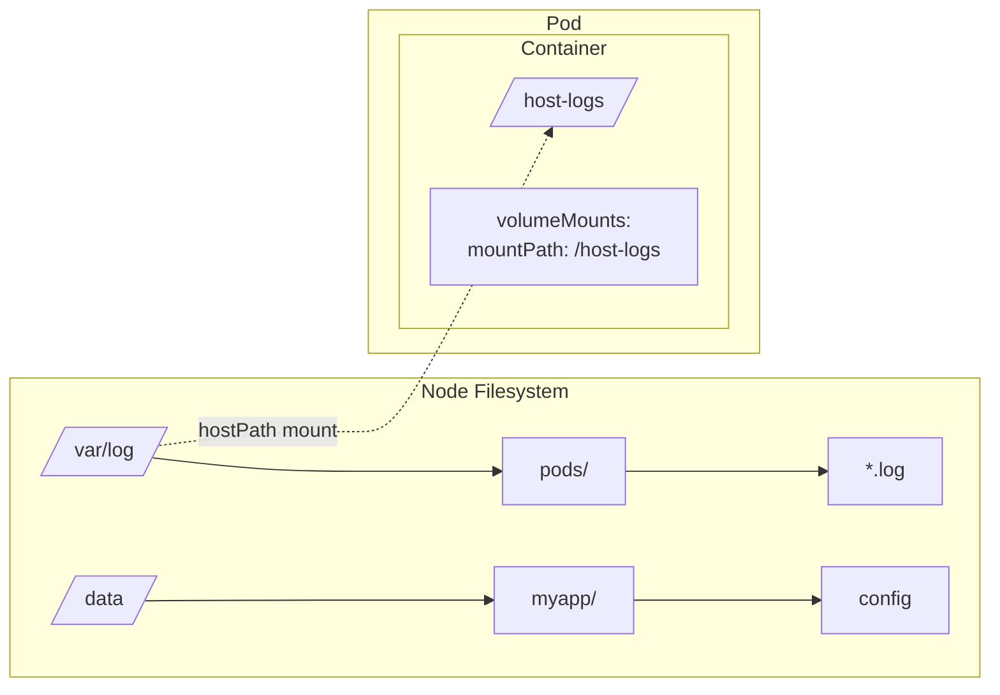
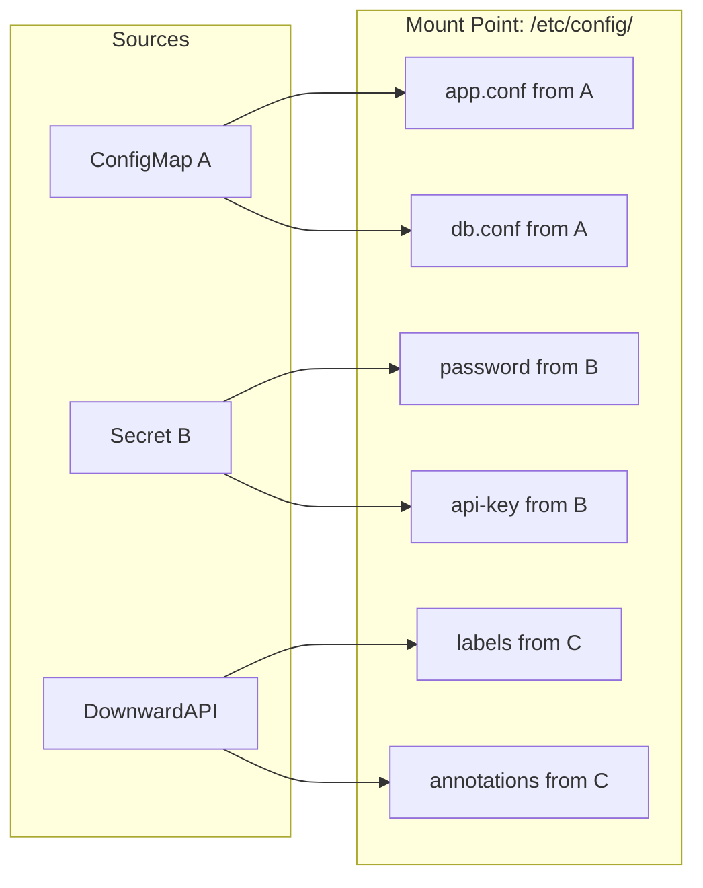
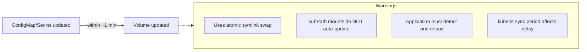
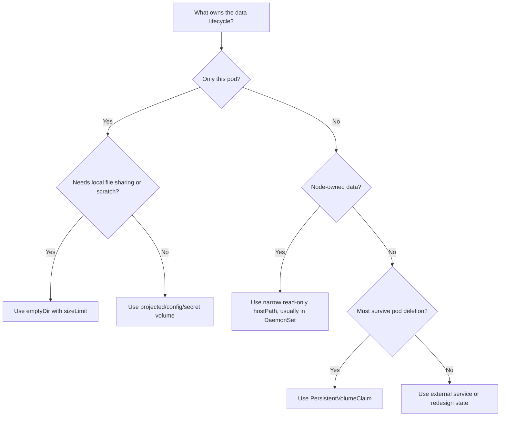

> **Complexity**: `[MEDIUM]` - Foundation for all storage concepts
>
> **Time to Complete**: 35-45 minutes
>
> **Prerequisites**: Module 2.1 (Pods), Module 2.7 (ConfigMaps & Secrets)

## What You'll Be Able to Do

After completing this module, you will be able to:

- **Design** pod-scoped ephemeral volume layouts with `emptyDir`, projected volumes, and read-only mounts that support multi-container application patterns.
- **Implement** secure `hostPath`, ConfigMap, Secret, and `subPath` mounts with explicit paths, permissions, and lifecycle expectations.
- **Evaluate** volume lifecycle boundaries so you can predict what data survives a container restart, pod deletion, node drain, or reschedule.
- **Diagnose** `FailedMount`, `ContainerCreating`, and stale-configuration symptoms by reading pod events, mount definitions, and kubelet behavior.
- **Compare** ephemeral volume choices with PersistentVolumeClaim-based persistence before choosing storage for stateful workloads.

## Why This Module Matters

Hypothetical scenario: your team ships a small API that caches user session summaries in the container filesystem because the cache is "only temporary." The application works during a demo, passes the first smoke test, and even survives a process crash because the deployment controller quickly starts another container. Then a node drain reschedules the pod, the replacement pod starts on a different node, and the entire cache disappears because the data was never stored outside the pod's local lifecycle boundary.

That scenario is not an exotic storage failure; it is the default consequence of treating a container filesystem like a durable disk. Containers are designed to be replaceable processes. Their writable layers are implementation details of the runtime, not an application storage contract. Kubernetes volumes give you that contract, but each volume type draws the boundary in a different place: some survive a container restart, some survive a pod restart on the same node, some expose node files directly, and some simply project API objects into a directory tree.

This distinction matters on the CKA exam because storage questions often hide inside ordinary pod troubleshooting. A pod stuck in `ContainerCreating` may have a missing Secret, a bad `hostPath` type, an unbound PVC, or a ConfigMap key that was mounted with the wrong path. A running application may still be wrong because a `subPath` mount froze a configuration file that the operator expected to update dynamically. You do not need to memorize every storage feature, but you do need to reason clearly about lifecycle, mount behavior, security scope, and the operational blast radius of each choice.

Think of a container as a desk with drawers that are cleaned whenever the desk is replaced. A pod-scoped volume is a filing cabinet assigned to that desk group: it remains while the pod remains, and multiple containers in the pod can open the same drawer. A `hostPath` mount is more like handing the desk worker a key to the building's maintenance room, which is sometimes necessary for building staff but dangerous for ordinary office work. A PersistentVolumeClaim is a leased storage unit outside the room entirely, and the next module goes deep on that longer-lived contract.

## Container Filesystems and Pod-Scoped Storage

When a process writes into a normal container path, it is writing into the container runtime's writable layer, usually an overlay on top of the image layers. That layer is convenient because it makes immutable images feel writable at runtime, but it is not meant for meaningful application state. It is tied to the specific container instance, can be inefficient for heavy I/O, and disappears when the container is replaced. Before you design any volume, pause on that first principle: the image is the recipe, the container filesystem is the scratch counter, and a volume is the place where you deliberately decide data should live.

```mermaid
flowchart LR
    subgraph ContainerA[Container A]
        A[/app] --> B[config.yml]
        A --> C[data/]
        C --> D[cache]
    end
    subgraph ContainerB[Container B after restart]
        E[/app] --> F[config.yml<br/>from image]
        E --> G[data/]
        G --> H[empty!]
    end
    ContainerA -- Restart = Data Loss --> ContainerB
```

Kubernetes volumes solve this by decoupling selected directories from the individual container lifecycle. A pod declares a volume under `spec.volumes`, and each container that needs it declares a `volumeMount` with a mount path. The kubelet prepares the volume on the node before starting the container, then asks the container runtime to mount that prepared directory or file into the container namespace. The important boundary is that most basic volumes are tied to the pod, not to one container, so a restarted container sees the same mounted directory while the pod still exists.

```mermaid
flowchart TD
    subgraph Pod
        subgraph ContainerA[Container A]
            A[/app] --> B[config.yml]
            A --> C[data/]
        end
        subgraph ContainerB[Container B after restart]
            E[/app] --> F[config.yml]
            E --> G[data/]
        end
        V[(Volume shared)]
        C --> V
        G --> V
        V --> cache[cache still here!]
    end
```

That pod boundary is powerful, but it is easy to overread. If one container in a pod crashes and restarts, an `emptyDir` volume remains. If the pod is deleted, evicted, or rescheduled onto another node, the `emptyDir` disappears because the old pod instance is gone. If your design needs to survive pod replacement, use a PersistentVolumeClaim or an external service instead of hoping that a pod-scoped volume behaves like a durable disk. Pause and predict: if a writer container stores 200Mi of cache in a shared `emptyDir`, then only that container restarts, what should the reader container see, and why?

Kubernetes offers many volume types because "storage" covers several different jobs. Some volumes provide scratch space, some inject configuration, some expose node files for system agents, and some connect pods to durable storage. The table below is a practical first-pass map, not a substitute for reading the exact lifecycle rules before you deploy a workload.

| Volume Type | Lifetime | Use Case | Data Persistence |
|-------------|----------|----------|------------------|
| emptyDir | Pod lifetime | Temp storage, inter-container sharing | Lost when pod deleted |
| hostPath | Node lifetime | Node-level data, DaemonSets | Persists on node |
| configMap | ConfigMap lifetime | Config files | Managed by ConfigMap |
| secret | Secret lifetime | Credentials | Managed by Secret |
| projected | Source lifetime | Multiple sources in one mount | Depends on sources |
| persistentVolumeClaim | PV lifetime | Persistent data | Survives pod deletion |
| image | Image lifetime | OCI image content as read-only volume | Read-only, pulled from registry |

The table is also a reminder that two volumes can look identical inside a container while having completely different ownership outside it. A file at `/etc/app/config.yaml` might come from a ConfigMap, a projected volume, a `subPath` bind mount, or an ordinary image layer. The application path alone does not tell you what Kubernetes will do during an update, restart, or deletion. When troubleshooting, always trace from the mount path back to `volumeMounts`, then back to `volumes`, then back to the Kubernetes object or node path that supplies the content.

This tracing habit is useful because volume bugs often masquerade as application bugs. A process that says "file not found" may be missing a ConfigMap key, but it may also be reading a path hidden by a directory mount. A process that says "permission denied" may be running as a non-root user against a Secret file mode that only root can read. A process that starts correctly and later becomes stale may have a reload problem rather than a Kubernetes mount problem. The CKA exam expects you to separate those layers quickly instead of changing YAML blindly.

The `image` volume type is worth calling out because it changes how some teams distribute read-only assets. Instead of baking a model file, rules bundle, or static asset tree into the main application image, a pod can mount an OCI image or artifact as a read-only volume. That keeps application images smaller and makes large read-only content independently versioned. As of the Kubernetes 1.35 target for this curriculum, you should treat this as a modern volume option that is useful for immutable content, not as a replacement for writable application storage.

```yaml
volumes:
- name: model-data
  image:
    reference: registry.example.com/ml-models/bert:v2
    pullPolicy: IfNotPresent
```

The broader storage ecosystem has also moved away from in-tree cloud-provider volume plugins. Historically, Kubernetes carried drivers such as cloud disks directly in core, which made every storage vendor change a Kubernetes release concern. The Container Storage Interface separates that responsibility: Kubernetes defines the interface, while storage vendors ship CSI drivers. In Kubernetes 1.35, modern clusters should rely on CSI for advanced storage behavior, and old in-tree specifications are either migrated, deprecated, or maintained only for compatibility with older manifests.

## EmptyDir and Other Ephemeral Volume Choices

The `emptyDir` volume is the simplest useful volume because it begins empty when the pod is assigned to a node and remains available until that pod leaves the node. It is excellent for shared scratch data, sidecar handoff, temporary downloads, local sort space, and caches where losing the data is acceptable. It is not excellent for databases, message queues, user uploads, or anything whose loss becomes an incident. The question to ask is not "will this be fast," but "what is the exact event after which this data may vanish?"

```yaml
apiVersion: v1
kind: Pod
metadata:
  name: shared-data
spec:
  containers:
  - name: writer
    image: busybox:latest
    command: ['sh', '-c', 'echo "Hello from writer" > /data/message; sleep 3600']
    volumeMounts:
    - name: shared-storage
      mountPath: /data
  - name: reader
    image: busybox:latest
    command: ['sh', '-c', 'sleep 5; cat /data/message; sleep 3600']
    volumeMounts:
    - name: shared-storage
      mountPath: /data
  volumes:
  - name: shared-storage
    emptyDir: {}
```

This example shows the classic sidecar pattern. The writer and reader are separate containers, but both mount the same volume name, so `/data` points to the same pod-scoped directory for both of them. The reader does not need a network call or a shared external service to consume a file from the writer. That simplicity is useful for log shippers, content preprocessors, local adapters, and small coordination files, provided the team accepts that deleting the pod deletes the shared directory.

The sidecar pattern works best when the shared files are an implementation detail of one pod rather than a coordination mechanism for the whole service. If several replicas need to share the same file, `emptyDir` is the wrong abstraction because each pod receives its own independent directory. If a controller replaces one replica, the new pod receives a new directory even when the pod has the same labels and serves the same traffic. That separation is usually good because replicas should be disposable, but it surprises teams that use local files as hidden cluster-wide state.

You can ask the kubelet to back an `emptyDir` with memory by setting `medium: Memory`. That creates a tmpfs-backed volume, which is fast and keeps sensitive temporary material off physical disk. The tradeoff is that tmpfs usage is memory usage. If a container uses 350Mi of heap and writes 200Mi into a memory-backed `emptyDir`, the workload's effective memory pressure is the sum of those two numbers, and the pod can be killed even though the application heap alone looked reasonable.

```yaml
apiVersion: v1
kind: Pod
metadata:
  name: memory-backed
spec:
  containers:
  - name: app
    image: busybox:latest
    command: ['sh', '-c', 'sleep 3600']
    volumeMounts:
    - name: tmpfs-volume
      mountPath: /cache
  volumes:
  - name: tmpfs-volume
    emptyDir:
      medium: Memory        # Uses RAM instead of disk
      sizeLimit: 100Mi      # Important! Limit memory usage
```

Disk-backed `emptyDir` also needs boundaries. Without a size limit, a noisy pod can consume local node storage and force unrelated workloads into eviction pressure. A `sizeLimit` gives the kubelet a concrete line to enforce and gives the platform team a way to reason about worst-case node usage. It does not make the data durable; it only makes the temporary storage safer to share on a multi-tenant node.

```yaml
volumes:
- name: cache
  emptyDir:
    sizeLimit: 500Mi    # Limit disk usage
```

Generic ephemeral volumes and CSI inline ephemeral volumes extend this idea for drivers that can provision storage dynamically for a pod. A generic ephemeral volume creates a per-pod PVC behind the scenes and deletes it when the pod is deleted, which gives temporary workloads access to storage-class behavior without making the claim a long-lived application object. CSI inline ephemeral volumes depend on driver support and can be useful for specialized local or network-backed temporary storage. The design judgment remains the same: ephemeral means the data belongs to the pod's temporary lifecycle, even when the implementation looks more sophisticated than `emptyDir`.

One practical way to evaluate ephemeral storage is to write the cleanup rule in plain language before writing YAML. For example, "this cache may disappear whenever the pod disappears" points toward `emptyDir`, while "this generated report must be available to the replacement pod" points away from it. The rule should also name the rebuild cost. A cache that takes two seconds to repopulate is different from a search index that takes several hours, even if both are technically derivable from another system.

Resource accounting should be part of that same evaluation. Disk-backed `emptyDir` consumes node ephemeral storage, which competes with logs, image layers, and other pods. Memory-backed `emptyDir` consumes memory, which competes with process heap and page cache. Generic ephemeral volumes may consume backend storage provisioned by a CSI driver. The word "temporary" does not mean "free"; it means the platform is allowed to remove the data when the owner lifecycle ends.

Before running the next example in a real cluster, predict the result of each lifecycle event. A container restart should preserve the shared directory, a pod delete should remove it, and a node reschedule should not carry it to the new node. If your expected behavior differs from those three statements, the workload is asking for persistence and should move to a PVC-backed design in the next module.

## HostPath for Node Filesystems

A `hostPath` volume mounts a path from the node's filesystem directly into the pod. That is a very different trust model from `emptyDir`. Instead of giving the pod a scratch directory prepared for that pod, you are exposing a piece of the node itself. For logging agents, monitoring agents, CNI tools, CSI components, and tightly controlled debug pods, this can be the correct tool. For ordinary application pods, it is usually a security smell and a scheduling trap.



The first operational risk is placement. A pod that needs `/data/myapp` can only run correctly on nodes where that path exists with the expected type and permissions. The scheduler does not inspect arbitrary node directories before assigning the pod. If the path is missing or wrong, the pod can end up stuck while the kubelet reports mount errors. You can reduce ambiguity by setting the `type` field, but you still need node preparation, node labels, affinity, or a DaemonSet pattern when the workload genuinely depends on local node files.

```yaml
apiVersion: v1
kind: Pod
metadata:
  name: hostpath-example
spec:
  containers:
  - name: app
    image: busybox:latest
    command: ['sh', '-c', 'ls -la /host-data; sleep 3600']
    volumeMounts:
    - name: host-volume
      mountPath: /host-data
      readOnly: true           # Good practice for security
  volumes:
  - name: host-volume
    hostPath:
      path: /var/log           # Path on the node
      type: Directory          # Must be a directory
```

The `type` field tells the kubelet what it should require before mounting. An empty type performs no validation, which makes failures harder to diagnose and can hide dangerous assumptions. `DirectoryOrCreate` and `FileOrCreate` are convenient, but they can also create root-owned paths with permissions that surprise an application. In a security-sensitive design, prefer exact existing paths, read-only mounts, and a narrow directory tree over broad filesystem access.

| Type | Behavior |
|------|----------|
| `""` (empty) | No checks before mount |
| `DirectoryOrCreate` | Create directory if missing |
| `Directory` | Must exist, must be directory |
| `FileOrCreate` | Create file if missing |
| `File` | Must exist, must be file |
| `Socket` | Must exist, must be UNIX socket |
| `CharDevice` | Must exist, must be char device |
| `BlockDevice` | Must exist, must be block device |

The second operational risk is privilege. A writable `hostPath` to a sensitive directory can turn a container compromise into a node compromise because the attacker is no longer confined to files inside the container. Mounting `/`, kubelet directories, container runtime sockets, or host credential paths gives the pod access to resources that platform teams normally protect carefully. Pod Security Admission profiles commonly restrict `hostPath` for that reason, and managed clusters may add additional policy controls.

```yaml
# DANGEROUS - Never do this in production!
volumes:
- name: root-access
  hostPath:
    path: /                    # Access to entire node filesystem!
    type: Directory
```

A legitimate `hostPath` design narrows the path to the minimum useful directory, marks mounts read-only when possible, and runs in a namespace governed by explicit platform policy. A log collector is a good example because the data exists on the node and the agent's job is to read it. Even there, the mount should be targeted. A DaemonSet that mounts `/var/log` read-only is easier to defend than one that mounts `/` and promises to behave.

DaemonSets are a natural fit for many `hostPath` cases because they make the node relationship explicit. A Deployment asks the scheduler for some suitable node, but a DaemonSet says the workload belongs on every matching node. That model fits log collection, node metrics, local security scanning, and storage-node helpers better than a random replica set. If only a subset of nodes has the required path or hardware, combine the DaemonSet with labels, tolerations, and node selectors so the scheduling contract matches the filesystem contract.

During review, ask whether the `hostPath` path is an input, an output, or both. A read-only input path for logs is much safer than a writable output path where the application stores business data on whichever node happened to run the pod. Node-local output also creates backup and migration questions that Kubernetes cannot answer for you. If the business cares about the data, a node path is usually the wrong place to leave it because node replacement, autoscaling, and repair workflows can remove that state outside the pod's awareness.

```yaml
apiVersion: apps/v1
kind: DaemonSet
metadata:
  name: log-collector
spec:
  selector:
    matchLabels:
      name: log-collector
  template:
    metadata:
      labels:
        name: log-collector
    spec:
      containers:
      - name: collector
        image: fluentd:latest
        volumeMounts:
        - name: varlog
          mountPath: /var/log
          readOnly: true          # Read-only for safety
        - name: containers
          mountPath: /var/lib/docker/containers
          readOnly: true
      volumes:
      - name: varlog
        hostPath:
          path: /var/log
          type: Directory
      - name: containers
        hostPath:
          path: /var/lib/docker/containers
          type: Directory
```

Stop and think before approving a `hostPath` pull request: does this pod truly need node files, or is it using the node as a shortcut around proper storage and permissions? If a developer proposes mounting a container runtime socket into a CI pod, the risk is not merely "the build can read some files." The pod may be able to control the runtime, start privileged containers, or access host resources indirectly. Safer alternatives include rootless builders, purpose-built build services, remote builders, or tightly scoped platform-owned build nodes.

## Projected, ConfigMap, and Secret Volumes

Configuration volumes solve a different problem from scratch storage. Applications need files such as `nginx.conf`, TLS material, feature flags, service account tokens, and pod metadata, but baking every value into an image makes releases slow and brittle. Kubernetes lets you store non-sensitive configuration in ConfigMaps, sensitive values in Secrets, selected pod metadata through the Downward API, and short-lived service account tokens through token projection. A projected volume combines several of those sources into one directory tree so the application sees a clean filesystem layout.



Use a projected volume when the application wants one coherent directory, but the source data belongs to multiple Kubernetes objects. The pod specification lists each source under `projected.sources`, and each source can map keys to paths. This is cleaner than scattering four mounts across four directories and then teaching the application to search all of them. It also makes the security review easier because one read-only mount point can contain the exact files the process needs.

```yaml
apiVersion: v1
kind: Pod
metadata:
  name: projected-volume-demo
  labels:
    app: demo
    version: current
spec:
  containers:
  - name: app
    image: busybox:latest
    command: ['sh', '-c', 'ls -la /etc/config; sleep 3600']
    volumeMounts:
    - name: all-config
      mountPath: /etc/config
      readOnly: true
  volumes:
  - name: all-config
    projected:
      sources:
      # Source 1: ConfigMap
      - configMap:
          name: app-config
          items:
          - key: app.properties
            path: app.conf
      # Source 2: Secret
      - secret:
          name: app-secrets
          items:
          - key: password
            path: credentials/password
      # Source 3: Downward API
      - downwardAPI:
          items:
          - path: labels
            fieldRef:
              fieldPath: metadata.labels
          - path: cpu-limit
            resourceFieldRef:
              containerName: app
              resource: limits.cpu
```

Projected service account tokens are especially important for modern clusters. Legacy long-lived tokens are a poor default for pods because they can outlive the workload and may be useful to an attacker after compromise. A projected `serviceAccountToken` can be audience-bound and time-bound, with a default expiration of 3600 seconds and automatic kubelet rotation. The file path still looks simple to the application, but the credential lifecycle is much better aligned with the pod.

```yaml
apiVersion: v1
kind: Pod
metadata:
  name: service-account-projection
spec:
  serviceAccountName: my-service-account
  containers:
  - name: app
    image: myapp:latest
    volumeMounts:
    - name: token
      mountPath: /var/run/secrets/tokens
      readOnly: true
  volumes:
  - name: token
    projected:
      sources:
      - serviceAccountToken:
          path: token
          expirationSeconds: 3600     # Short-lived token
          audience: api               # Intended audience
```

ConfigMap volumes are the usual choice for non-confidential files. Mounting a ConfigMap as a directory works well for applications that read structured configuration from disk, such as web server fragments or application property files. This is often better than environment variables when the value is multi-line, when the application already expects a file, or when operators need to update the data without rebuilding an image. The application still needs a reload strategy because Kubernetes can update the file on disk without forcing the process to reread it.

```yaml
apiVersion: v1
kind: ConfigMap
metadata:
  name: nginx-config
data:
  nginx.conf: |
    server {
      listen 80;
      location / {
        root /usr/share/nginx/html;
      }
    }
```

The matching pod can mount the ConfigMap at the directory where the application expects configuration. The `items` list lets you select specific keys and rename them on disk, which is useful when the ConfigMap key name differs from the application filename. Be careful when mounting an entire directory over an existing path, because the mount hides files from the image at that path. If the image already contains required defaults in the same directory, consider a dedicated mount point or a carefully chosen `subPath`.

Directory shadowing is one of the easiest configuration mistakes to miss in review. Suppose an image contains `/etc/myapp/defaults.yaml` and `/etc/myapp/plugins.yaml`, and you mount a ConfigMap at `/etc/myapp` containing only `app.yaml`. Inside the container, the mounted directory hides the image's original files at that path, so the application may fail because its defaults vanished. Kubernetes did exactly what you requested; the design failed because the mount point was broader than the intended change.

```yaml
apiVersion: v1
kind: Pod
metadata:
  name: nginx
spec:
  containers:
  - name: nginx
    image: nginx:1.27
    volumeMounts:
    - name: config
      mountPath: /etc/nginx/conf.d
      readOnly: true
  volumes:
  - name: config
    configMap:
      name: nginx-config
      # Optional: select specific keys
      items:
      - key: nginx.conf
        path: default.conf     # Rename the file
```

Secret volumes behave similarly from the pod's perspective, but they carry a different security expectation. Kubernetes Secrets are not a complete secret-management system by themselves; they still require RBAC, encryption at rest where appropriate, and careful access control. However, mounting a Secret as a volume is often preferable to putting secret values in environment variables because file permissions can be restricted, the content can be rotated on disk, and the kubelet stores the material in a memory-backed filesystem for the pod.

```yaml
apiVersion: v1
kind: Secret
metadata:
  name: tls-certs
type: kubernetes.io/tls
data:
  tls.crt: <base64-encoded-cert>
  tls.key: <base64-encoded-key>
```

Use restrictive file modes for Secret material and keep the mount read-only. The `defaultMode` field is written in YAML as an integer, and examples commonly use octal-looking values such as `0400`. The exact application user must still be able to read the file, so test the effective permissions with the image's runtime user rather than assuming root-like behavior. A secure mount that the process cannot read will fail just as surely as an insecure mount that auditors reject.

Secret volume design should also include rotation behavior. If the kubelet updates the mounted Secret file but the application opens the credential only at startup, the old credential may remain in use until the pod restarts. If the application watches the file and reconnects cleanly, the same Secret volume can support smoother rotation. Neither behavior is automatic from the Secret object alone. The storage layer can deliver bytes to disk, but the process still controls when it reads them and what it does after the value changes.

```yaml
apiVersion: v1
kind: Pod
metadata:
  name: tls-app
spec:
  containers:
  - name: app
    image: nginx:1.27
    volumeMounts:
    - name: certs
      mountPath: /etc/tls
      readOnly: true
  volumes:
  - name: certs
    secret:
      secretName: tls-certs
      defaultMode: 0400       # Restrictive permissions
```

The kubelet updates mounted ConfigMap and Secret volumes by using an atomic symlink swap. That means the application should never see a half-written file during the update. It also means the process must either watch the file, poll the file, or be restarted to load the new value into memory. The volume update and the application reload are separate steps, and many production bugs come from proving the file changed while forgetting the process still holds old configuration in memory.



The `subPath` feature is a precise tool for mounting one file from a volume into an existing directory without hiding the rest of that directory. It is useful when an image already contains a directory full of defaults and you only want to replace one file. Its major trap is update behavior: a `subPath` bind mount does not follow the kubelet's atomic symlink swap, so a ConfigMap or Secret update will not appear in the mounted file. Pause and predict: if `/etc/config/app.conf` is a full ConfigMap directory mount, then you update the ConfigMap and wait for the kubelet sync period, what should `cat` show; now what changes if that file was mounted through `subPath`?

The tradeoff makes `subPath` neither good nor bad by itself. It is good when the file should be fixed for the life of the pod, when replacing an entire directory would hide image content, or when a rollout restart is the intended reload mechanism. It is bad when operators expect a live configuration pipeline and never document that pod recreation is required. A mature module template or Helm chart should make that reload contract visible so future maintainers do not infer the wrong behavior from the filename.

```yaml
volumeMounts:
- name: config
  mountPath: /etc/nginx/nginx.conf    # Single file
  subPath: nginx.conf                  # Key from ConfigMap
  readOnly: true
```

Projected volume sources continue to evolve. Kubernetes documentation for current releases includes advanced projection sources such as cluster trust bundles and pod certificates behind their respective feature states. For the CKA, the everyday skills matter more: combine ConfigMap, Secret, Downward API, and service account token sources correctly; mount them read-only; understand automatic update limits; and recognize stale `subPath` behavior during troubleshooting.

| Use Case | Sources Combined |
|----------|------------------|
| App config bundle | configMap + secret |
| Pod identity | serviceAccountToken + downwardAPI |
| Full config injection | configMap + secret + downwardAPI |
| Sidecar config | Multiple configMaps |

## From Ephemeral Volumes to Persistent Storage

Ephemeral volumes are not inferior; they are scoped. A cache, scratch directory, token projection, or sidecar handoff should often be ephemeral because durability would add cost and cleanup complexity without improving the application. Persistent storage becomes necessary when the data has value after pod replacement: database files, queue state, uploaded content, indexes that are expensive to rebuild, and any state that defines the service rather than accelerates it. The mistake is not using `emptyDir`; the mistake is using it after the recovery requirement says the data must outlive the pod.

PersistentVolumes and PersistentVolumeClaims introduce a storage object that can survive pod deletion and, depending on the backend, node failure. A PersistentVolume represents storage in the cluster, while a PersistentVolumeClaim is a namespaced request for storage by a workload. Access modes such as ReadWriteOnce, ReadOnlyMany, ReadWriteMany, and ReadWriteOncePod describe how the volume may be mounted, but they do not magically make every backend support every access pattern. ReadWriteOncePod is the strictest single-pod option and is useful when accidental multi-pod attachment would corrupt state.

StorageClasses handle dynamic provisioning. With `volumeBindingMode: WaitForFirstConsumer`, Kubernetes delays provisioning and binding until a pod using the claim is scheduled, which helps avoid creating a volume in a zone where the pod cannot run. Setting `storageClassName: ""` on a PVC opts out of default dynamic provisioning and asks Kubernetes to match an existing PV. These details belong mainly to the next module, but they explain why the decision between `emptyDir` and PVC is an architectural decision, not just a YAML edit.

Advanced persistent-storage features such as expansion, snapshots, cloning, volume populators, and VolumeAttributesClass depend heavily on CSI drivers and cluster controllers. They are powerful when you operate databases and stateful services, but they do not change the foundation from this module. First decide the lifecycle boundary. Then decide whether the node, pod, API object, or external storage backend owns the data. Only after that should you choose a feature such as snapshotting, cloning, or dynamic IOPS changes.

Hardware and cloud limits still matter. Cloud block volumes often have per-node attachment caps, and the scheduler needs accurate driver information to avoid placing too many volume-using pods on the same node. Storage capacity tracking, dynamic volume limits, and newer CSI node allocatable count behavior exist because storage is a physical resource even when Kubernetes presents it through clean API objects. This is why a storage incident can look like scheduling, security, and application failure all at once.

For this introductory volumes module, you do not need to implement every persistent-storage feature yet. You do need to recognize when a problem statement crosses the boundary from pod-scoped data into durable state. Phrases such as "after rescheduling," "after node replacement," "during a rolling update," and "after deleting the pod" are signals that the examiner or incident report is testing storage lifecycle thinking. If the data must remain valid across those events, an ephemeral volume may still be useful for scratch work, but it cannot be the source of truth.

The reverse mistake is also common: teams sometimes put disposable cache data on expensive durable volumes because persistence feels safer. That can slow scheduling, consume attach slots, complicate cleanup, and make recovery procedures harder than necessary. A durable cache may also preserve corrupted or stale derived data longer than intended. Good design is not maximum persistence everywhere; it is matching persistence to recovery value, rebuild cost, and operational ownership.

## Diagnosing Volume Mount Failures

Volume failures usually surface as pods stuck in `ContainerCreating`, application containers that start without expected files, or workloads that keep using stale configuration. The fastest diagnostic path starts with `kubectl describe pod` because the Events section usually names the failing volume and reports whether the kubelet could not find a ConfigMap, mount a Secret, validate a `hostPath`, attach a CSI volume, or bind a PVC. Read those events slowly; the useful clue is often the exact volume name rather than the top-level pod phase.

When `hostPath` is involved, always connect the event to the specific node where the pod landed. A path existing on your laptop, on one worker, or in a previous cluster image does not prove it exists on the scheduled node. If the type is `Directory`, the kubelet requires an existing directory. If the type is `DirectoryOrCreate`, the kubelet may create a path that then has ownership or permission details the app did not expect. Node-specific problems require node-specific evidence.

For ConfigMap and Secret mounts, separate mount failure from application reload failure. A missing object or missing key can block startup. A successful mount followed by a later ConfigMap update may update files on disk without changing process behavior. A `subPath` mount may never update at all until the pod is restarted. Which approach would you choose for an application that must reload TLS certificates without restarting, and what application behavior would you verify before trusting that design in production?

If pod events are vague, inspect kubelet logs on the node and the relevant CSI driver components for lower-level errors. Permission denied messages, timeout errors, attach-limit failures, and driver-specific mount responses may never appear cleanly in the application logs because the application has not started. A good troubleshooting habit is to trace the storage path from API object to kubelet preparation to container mount to process read. Skipping a layer often leads to confident but wrong fixes.

A useful debug sequence is to name the failing volume, then name the source object or path, then name the consumer path. For a ConfigMap, that means checking the object, the selected key, and the mount path. For a Secret, add RBAC and file mode to the checklist. For `hostPath`, add the scheduled node and path type. For PVCs, add claim phase, storage class, events, and CSI driver health. The sequence keeps you from jumping straight to application logs when the container never had a valid filesystem view.

You should also distinguish one-time mount errors from later drift. A missing ConfigMap key prevents a pod from starting. A changed ConfigMap that the process does not reload creates stale behavior after a healthy start. A `hostPath` directory removed from one node may only break pods scheduled to that node. A node reaching disk pressure may evict pods that use local ephemeral storage heavily. These cases all involve volumes, but they require different fixes, so the timeline of the symptom matters as much as the YAML.

## Patterns & Anti-Patterns

Good storage design starts by naming the lifecycle owner. If the pod owns the data, use pod-scoped ephemeral volumes. If the node owns the data, restrict `hostPath` to platform workloads and enforce policy. If the Kubernetes API owns the data, use ConfigMap, Secret, Downward API, or projected volumes. If the business process owns the data, use a PVC or an external managed service. This framing prevents the common habit of choosing a volume type because it is familiar rather than because it matches the failure model.

| Pattern | When to Use | Why It Works | Scaling Consideration |
|---------|-------------|--------------|-----------------------|
| Shared `emptyDir` sidecar handoff | Two containers in one pod need fast local file exchange | The pod owns the shared directory and both containers see the same files | Keep size limits small enough to protect node storage |
| Read-only projected config bundle | An app needs config, identity, and metadata in one directory | Multiple API-backed sources appear as a single mount tree | Define reload behavior and avoid `subPath` for live updates |
| Narrow read-only `hostPath` DaemonSet | A platform agent must read node logs or sockets | A DaemonSet aligns one pod with each node and the path is node-owned | Use policy, node labels, and exact path types |
| PVC for durable state | Data must survive pod deletion or rescheduling | Storage lifecycle is decoupled from workload lifecycle | Choose access mode, reclaim policy, and binding mode deliberately |

Anti-patterns usually appear when a team reaches for storage to bypass another design problem. A writable `hostPath` can bypass RBAC and node isolation. An `emptyDir` can hide the absence of a backup or persistence plan. A Secret environment variable can be easy to set but hard to rotate safely. A `subPath` mount can preserve image defaults but silently defeat live configuration updates. Each anti-pattern starts with a convenience and ends with a lifecycle or security surprise.

| Anti-Pattern | What Goes Wrong | Better Alternative |
|--------------|-----------------|--------------------|
| Database files on `emptyDir` | Pod replacement deletes the database state | Use a StatefulSet with PVC templates |
| Broad writable `hostPath` | Container compromise can become node compromise | Use narrow read-only paths or a platform-owned agent |
| No `emptyDir.sizeLimit` | One pod can exhaust node ephemeral storage | Set explicit limits and monitor eviction signals |
| `subPath` for live config | Source updates do not reach the mounted file | Mount the directory or restart the pod intentionally |
| Secret values in casual env vars | Rotation and exposure are harder to control | Mount Secret files with restrictive permissions |
| PVC used for disposable cache | Durable storage cost and cleanup increase unnecessarily | Use bounded `emptyDir` or external cache semantics |

## Decision Framework

Choose the volume type by walking from consequence to implementation. First ask what happens if the container restarts, then what happens if the pod is deleted, then what happens if the node is drained, and finally who is allowed to read or write the data. That order matters because a command that makes the pod start is not the same as a design that meets the recovery objective. In exam conditions, this framework also helps you eliminate attractive but wrong answers quickly.



The framework should be paired with a security review. If the mount exposes credentials, set read-only mounts, restrictive modes, and an application reload plan. If the mount exposes node files, require a platform-owned namespace and a clear reason ordinary Kubernetes APIs cannot solve the problem. If the data is large or expensive to rebuild, ask whether a PVC is sufficient or whether the application also needs backups, snapshots, and restore tests. Storage correctness is not only about mounting the right path; it is about knowing what failure you can tolerate.

| Requirement | Prefer | Avoid | Reason |
|-------------|--------|-------|--------|
| Share scratch files between sidecar containers | `emptyDir` | Container writable layer | The pod, not one container, owns the files |
| Inject app config and labels together | `projected` | Many unrelated mount points | One directory gives a clearer contract |
| Read node logs from every worker | `hostPath` in DaemonSet | App deployment with broad paths | The node owns the files and one agent should run per node |
| Persist database state | PVC | `emptyDir` or `hostPath` | The data must outlive pod and node placement |
| Live-update ConfigMap directory | Full ConfigMap mount | `subPath` | Full mounts follow kubelet update mechanics |
| Mount one file over image defaults | `subPath` with restart plan | Whole directory mount | The design trades live update for surgical placement |

## Did You Know?

- Kubernetes 1.35 keeps the CSI model as the modern storage extension path, so current storage learning should center on CSI behavior rather than old in-tree cloud volume plugins.
- A projected `serviceAccountToken` defaults to an expiration of 3600 seconds, and the kubelet can rotate the mounted token file while the pod continues running.
- Generic ephemeral volumes have been stable since Kubernetes 1.23, and they create a per-pod PVC that is garbage collected with the pod.
- CSI inline ephemeral volumes have been stable since Kubernetes 1.25, but their resource accounting depends on driver behavior, so operators must monitor them deliberately.

## Common Mistakes

| Mistake | Why It Happens | How to Fix It |
|---------|----------------|---------------|
| Using `emptyDir` for persistent data | It survives container restarts, so teams overgeneralize that behavior to pod replacement | Use a PersistentVolumeClaim for data that must survive pod deletion or rescheduling |
| Mounting broad writable `hostPath` paths | It is a fast way to reach node files during debugging | Restrict the path, set `readOnly: true`, use explicit `type`, and keep it to platform workloads |
| Omitting `emptyDir.sizeLimit` | Temporary storage feels harmless until load or a bug creates unbounded files | Set a size limit and monitor node ephemeral storage pressure |
| Expecting `subPath` mounts to auto-update | The file looks like it came from a ConfigMap or Secret | Use a full directory mount for live updates or restart pods deliberately |
| Using memory-backed `emptyDir` without memory planning | Teams count only application heap usage | Include tmpfs usage in memory limits and set a conservative `sizeLimit` |
| Leaving `hostPath.type` empty | Examples often omit validation for brevity | Use `Directory`, `File`, or another explicit type so kubelet failures are clear |
| Confusing `ReadWriteOnce` with `ReadWriteOncePod` | The names sound like the same single-writer guarantee | Use `ReadWriteOncePod` when the requirement is strict single-pod access |
| Treating file update as application reload | Operators see the mounted file change and assume the process changed behavior | Verify the application watches files, reloads on signal, or restarts cleanly |

## Quiz

<details>
<summary>Question 1: A developer has a sidecar logging pod with two containers sharing an `emptyDir`; the writer crashes but the pod stays running. Are the logs gone, and what changes if the pod is rescheduled?</summary>

The logs are not gone after only the writer container crashes because the `emptyDir` lifecycle is tied to the pod, not to one container. The restarted writer and the still-running reader see the same pod-scoped directory. If the pod is deleted, evicted, or rescheduled to a different node, the `emptyDir` is removed with the old pod instance. Logs that must survive that boundary should be shipped externally or stored through persistent storage rather than kept only in `emptyDir`.

</details>

<details>
<summary>Question 2: A pod uses `emptyDir.medium: Memory` with a 256Mi size limit and a container memory limit of 512Mi. The app heap is 350Mi, the tmpfs data is 200Mi, and the pod is OOM-killed. What happened?</summary>

The tmpfs-backed `emptyDir` counted toward memory pressure, so the effective usage was roughly the application heap plus the memory-backed files. The size limit constrained the volume size, but it did not make those bytes free from the container's memory budget. The fix is to raise memory limits to include expected tmpfs use, reduce the volume size, or switch to disk-backed `emptyDir` if the data does not need memory backing. This is an evaluate-lifecycle question because the storage medium changes the failure mode.

</details>

<details>
<summary>Question 3: A log collector DaemonSet mounts `hostPath: /` with an empty type and no `readOnly`. The team says it only reads `/var/log`. Why should the design be rejected?</summary>

The declared mount gives the pod access to the entire node filesystem, not just the directory the application promises to read. An empty `type` skips useful kubelet validation, and a missing `readOnly` flag leaves the host path writable from the container. The safer design mounts only required paths such as `/var/log`, uses `type: Directory`, and marks each mount read-only. Because this is node-owned data, the workload should also be a platform-controlled DaemonSet with policy around who can deploy it.

</details>

<details>
<summary>Question 4: An application needs `app.conf`, a database password, pod labels, and a short-lived service account token under `/etc/app`. What volume design would you implement?</summary>

Use a projected volume mounted read-only at `/etc/app`. The sources would be a ConfigMap for `app.conf`, a Secret for the password, a Downward API source for labels, and a `serviceAccountToken` source for the short-lived token. This design is better than four unrelated mount points because it gives the process one directory contract and keeps each source managed by the appropriate Kubernetes API. It also supports modern token rotation semantics instead of relying on long-lived credentials.

</details>

<details>
<summary>Question 5: A ConfigMap directory mount shows new file content after an update, but the application still serves old behavior; a separate `subPath` mount never shows the new content. Explain both symptoms.</summary>

The full ConfigMap directory mount can update on disk through the kubelet's atomic symlink swap, but the application may have loaded the old value into memory and never reloaded it. That fix is an application reload, signal, or rollout restart depending on the process. The `subPath` case is different because the bind-mounted file does not follow the updated symlink target, so the mounted file remains stale until the pod is recreated. The correct design depends on whether the team needs live file updates or surgical placement of one file.

</details>

<details>
<summary>Question 6: A StatefulSet keeps losing database files because the template uses `emptyDir` for the data directory. What should you compare and change before approving the fix?</summary>

Compare the lifecycle requirement with the volume lifecycle. Database files must survive pod deletion and rescheduling, while `emptyDir` belongs to one pod instance on one node. The fix is to use PVC-backed storage, typically through `volumeClaimTemplates` in the StatefulSet so each replica receives its own claim. You should also evaluate access mode, reclaim policy, storage class binding mode, backup expectations, and whether the application can tolerate the selected backend's semantics.

</details>

<details>
<summary>Question 7: A pod is stuck in `ContainerCreating` after adding a Secret volume. The Secret exists, but one selected key name is wrong. Where do you diagnose it, and what correction do you make?</summary>

Start with `kubectl describe pod` and read the Events section because the kubelet usually reports the volume name and missing key or object. Then compare the pod's `secret.items` entries with the actual Secret keys rather than guessing from application logs, since the container may not have started. The correction is to fix the key name, update the Secret, or change the pod spec to mount the key that exists. This is a mount failure, not an application runtime failure.

</details>

## Hands-On Exercise: Multi-Container Volume Sharing

Exercise scenario: create a functional Kubernetes pod with two containers that share data through an `emptyDir`. One container writes application log lines, and the second container reads them from a read-only mount. The goal is not just to make the pod run; it is to observe the lifecycle contract by checking that both containers see the same files and by reasoning about what would happen after a pod deletion.

### Setup

```bash
# Create namespace
kubectl create namespace volume-lab

# Create the multi-container pod
cat <<EOF | kubectl apply -f -
apiVersion: v1
kind: Pod
metadata:
  name: log-processor
  namespace: volume-lab
spec:
  containers:
  # Writer container - generates logs
  - name: writer
    image: busybox:1.36
    command:
    - sh
    - -c
    - |
      i=0
      while true; do
        echo "\$(date): Log entry \$i" >> /logs/app.log
        i=\$((i+1))
        sleep 5
      done
    volumeMounts:
    - name: log-volume
      mountPath: /logs
  # Reader container - processes logs
  - name: reader
    image: busybox:1.36
    command:
    - sh
    - -c
    - |
      echo "Waiting for logs..."
      sleep 10
      tail -f /logs/app.log
    volumeMounts:
    - name: log-volume
      mountPath: /logs
      readOnly: true
  volumes:
  - name: log-volume
    emptyDir:
      sizeLimit: 50Mi
EOF
```

### Task 1: Verify the pod is running

```bash
kubectl get pod log-processor -n volume-lab
```

<details>
<summary>Solution</summary>

The pod should eventually show `Running` with both containers ready. If it remains in `ContainerCreating`, describe the pod and inspect Events for image pull, volume, or scheduling errors before continuing.

</details>

### Task 2: Check that the writer creates logs

```bash
kubectl exec -n volume-lab log-processor -c writer -- cat /logs/app.log
```

<details>
<summary>Solution</summary>

You should see timestamped log entries appended by the writer container. If the file is missing, wait a few seconds and rerun the command because the writer loop creates entries over time.

</details>

### Task 3: Check that the reader sees the same logs

```bash
kubectl logs -n volume-lab log-processor -c reader
```

<details>
<summary>Solution</summary>

The reader should print the same log stream because its `/logs` path is the same `emptyDir` volume mounted read-only. This confirms cross-container sharing inside one pod.

</details>

### Task 4: Verify shared writes and reads

```bash
# Write from writer
kubectl exec -n volume-lab log-processor -c writer -- sh -c 'echo "TEST MESSAGE" >> /logs/app.log'

# Read from reader
kubectl exec -n volume-lab log-processor -c reader -- tail -1 /logs/app.log
```

<details>
<summary>Solution</summary>

The final line should be `TEST MESSAGE`. The reader can read the file even though its mount is read-only because the volume permissions affect writes from that container, not visibility of data written by the other container.

</details>

### Task 5: Locate the node and reason about where `emptyDir` lives

```bash
kubectl get pod log-processor -n volume-lab -o jsonpath='{.status.hostIP}'
# emptyDir is at /var/lib/kubelet/pods/<pod-uid>/volumes/kubernetes.io~empty-dir/log-volume
```

<details>
<summary>Solution</summary>

The host IP tells you which node currently owns the pod-scoped volume. The path shown in the comment is useful for understanding kubelet layout, but do not build application behavior that depends on reading that path directly.

</details>

### Success Criteria

- [ ] Pod is currently running with both containers active and healthy.
- [ ] Writer is successfully creating log entries every 5 seconds.
- [ ] Reader can clearly see logs written by the writer container.
- [ ] Data persists across a writer container restart, such as `kubectl exec -n volume-lab log-processor -c writer -- kill 1`, while the pod remains the same.

### Bonus Challenge

Architect a third container in the pod that continuously monitors disk usage of the shared volume and writes warnings when usage exceeds 80 percent. Keep the monitor read-only if it only reads file sizes, and explain whether its warning file should live in the same volume or in a separate path.

### Cleanup

```bash
kubectl delete namespace volume-lab
```

## Practice Drills

Use these drills to build speed after you understand the lifecycle rules. They are intentionally short because the exam rewards clean YAML edits under time pressure, but do not treat them as a replacement for the reasoning above.

### Drill 1: Create emptyDir Pod

```bash
# Task: Create a pod with emptyDir volume mounted at /cache
# Hint: kubectl run cache-pod --image=busybox --dry-run=client -o yaml > pod.yaml
# Then add volumes section
```

### Drill 2: Memory-Backed emptyDir

```bash
# Task: Create emptyDir backed by RAM with 64Mi limit
# Key fields: emptyDir.medium: Memory, emptyDir.sizeLimit: 64Mi
```

### Drill 3: hostPath Read-Only

```bash
# Task: Mount /var/log from host as read-only volume
# Important: Always use readOnly: true for hostPath when possible
```

### Drill 4: Projected Volume

```bash
# Task: Create projected volume combining:
# - ConfigMap "app-config"
# - Secret "app-secrets"
# Mount at /etc/app
```

### Drill 5: ConfigMap Volume with Items

```bash
# Task: Mount only "app.conf" key from ConfigMap as "config.yaml"
# Use configMap.items to select and rename
```

### Drill 6: subPath Mount

```bash
# Task: Mount single file from ConfigMap into /etc/myapp/config.yaml
# Without overwriting other files in /etc/myapp
```

### Drill 7: Volume Sharing Between Containers

```bash
# Task: Create pod with 2 containers sharing emptyDir
# Container 1 writes to /shared/data.txt
# Container 2 reads from /shared/data.txt
```

### Drill 8: Debug Volume Mount Issues

```bash
# Given: Pod stuck in ContainerCreating
# Task: Identify if it is a volume mount issue
# Commands: kubectl describe pod, check Events section
```

## Sources

- https://kubernetes.io/docs/concepts/storage/volumes/
- https://kubernetes.io/docs/concepts/storage/ephemeral-volumes/
- https://kubernetes.io/docs/concepts/storage/persistent-volumes/
- https://kubernetes.io/docs/concepts/storage/storage-classes/
- https://kubernetes.io/docs/concepts/configuration/configmap/
- https://kubernetes.io/docs/concepts/configuration/secret/
- https://kubernetes.io/docs/tasks/configure-pod-container/configure-projected-volume-storage/
- https://kubernetes.io/docs/tasks/configure-pod-container/configure-service-account/
- https://kubernetes.io/docs/concepts/security/pod-security-standards/
- https://kubernetes.io/docs/concepts/storage/volume-snapshots/
- https://kubernetes.io/docs/concepts/storage/volume-attributes-classes/

## Next Module

Continue to [Module 4.2: PersistentVolumes & PersistentVolumeClaims](../module-4.2-pv-pvc/) to dive deeply into storage classes, claims, access modes, and lifecycle management that survives pod and node deletion.
