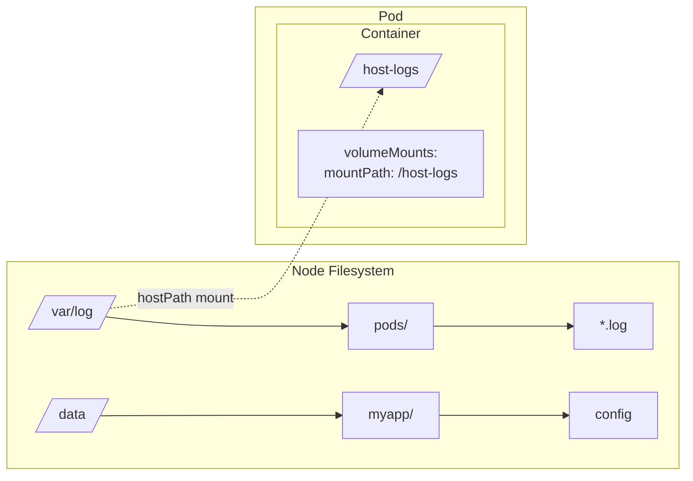
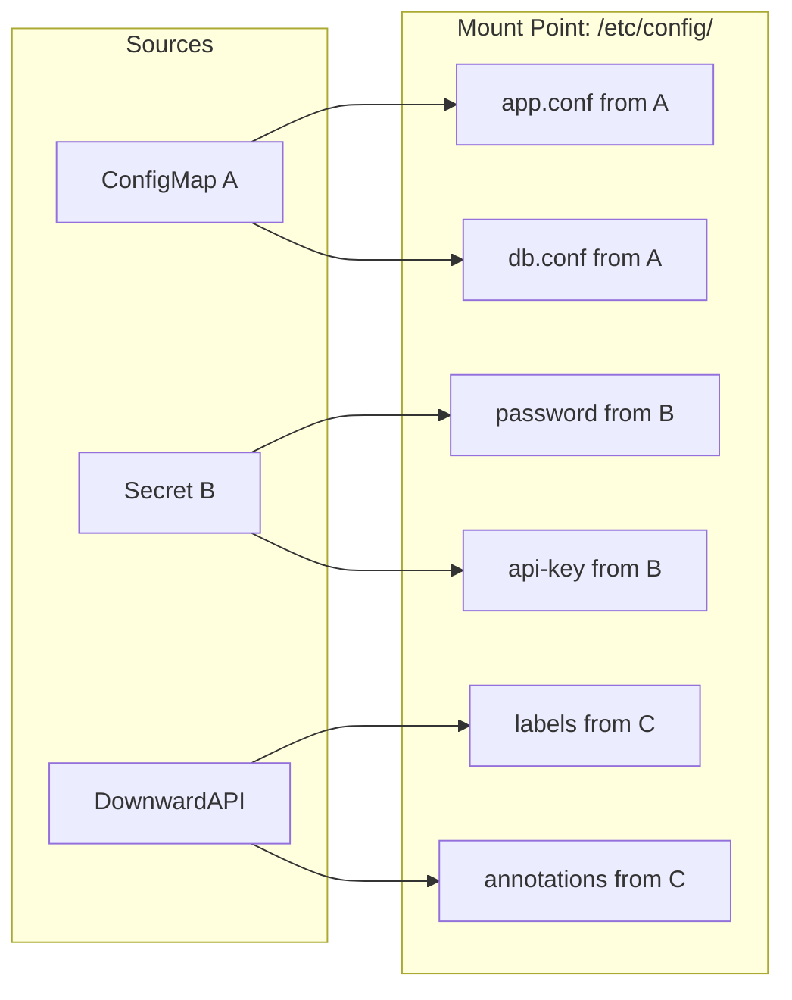
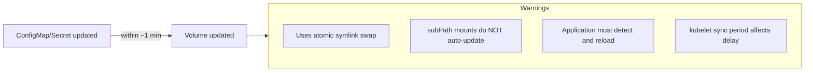

> **Complexity**: `[MEDIUM]` - Foundation for all storage concepts
>
> **Time to Complete**: 35-45 minutes
>
> **Prerequisites**: Module 2.1 (Pods), Module 2.7 (ConfigMaps & Secrets)

## What You'll Be Able to Do

After completing this comprehensive module, you will be able to:
- **Design** resilient storage architectures using emptyDir, hostPath, and projected volumes to satisfy strict distributed application requirements.
- **Implement** precision volume mounts for containers by specifying paths, sub-paths, and restrictive access constraints correctly.
- **Evaluate** the distinct lifecycle characteristics of various ephemeral volumes to prevent unintended data loss in production environments.
- **Diagnose** complex volume mount failures by thoroughly analyzing pod events, inspecting node paths, and understanding low-level kubelet behaviors.
- **Compare** ephemeral storage strategies against persistent volume capabilities to select the right tool for stateful workloads.

## Why This Module Matters

A major financial services company once deployed a critical caching service using containers without properly configured volumes. To optimize for speed, the application wrote gigabytes of active financial session data directly to its local ephemeral container filesystem. During a routine node memory pressure event, the kubelet evicted several pods to preserve overall system stability. 

Because the container runtime immediately destroyed those evicted containers, and because the critical session data resided entirely within the ephemeral container overlay layers, all active user sessions were instantly wiped out. Millions of authenticated users were forcefully logged out in the middle of transactions, resulting in a severe drop in active trading volume, massive customer complaints, and significant, measurable revenue loss. The outage required hours of manual database reconciliation.

This disaster could have been prevented entirely by understanding the fundamentals of Kubernetes volumes. Containers are strictly ephemeral by design; their filesystems are tied directly to their specific, temporary runtime instances. When a container crashes, the kubelet restarts it, but the new container starts with a clean slate identical to the base image artifact. Kubernetes volumes solve this by abstracting storage away from the individual container lifecycle, allowing data to persist across process restarts and be shared securely among multiple containers within the same pod.

For the Certified Kubernetes Administrator (CKA) exam, mastering these volume concepts is absolutely not optional. You will be explicitly required to configure ephemeral storage for high-speed caching, inject configuration data securely, and troubleshoot complex mount failures under intense time pressure. The concepts learned here form the absolute foundation for advanced persistent storage, which heavily dictates the reliability of stateful applications in production environments. Without a robust understanding of both ephemeral mounts and the underlying mechanisms of persistence, designing highly available microservices is virtually impossible.

> **The Filing Cabinet Analogy**
>
> Think of a container as a desk with drawers that get emptied every time you leave work. A volume is like a filing cabinet in the corner - it keeps your files even when you're gone. Some cabinets are shared between desks (emptyDir), some are building-wide storage (PV), and some are just mirrors of the company directory (configMap/secret projected volumes).

## Did You Know?

- The current stable Kubernetes release is v1.35, and while legacy in-tree plugins exist in older documentation, all major cloud provider volume plugins have completed their Container Storage Interface (CSI) migrations unconditionally.
- A `serviceAccountToken` projected volume source defaults to a token expiration of 3600 seconds, ensuring that long-lived static tokens are no longer the default security risk.
- *Note: Historical records indicate* generic ephemeral volumes reached stable status historically in Kubernetes v1.23, automatically creating a per-Pod PersistentVolumeClaim that is garbage collected when the pod is deleted.
- *Note: Historical records indicate* CSI inline ephemeral volumes, which reached stable historically in v1.25, are completely exempt from storage resource usage limits enforced by the kubelet.

## Section 1: The Container Storage Problem

When building cloud-native applications, you must constantly and proactively design for failure. Containers are not full virtual machines; they are ephemeral processes running in a tightly isolated execution environment provided by the Linux kernel. This isolation extends deeply into the filesystem layer. When your application writes a file inside a running container, you are actually writing to a writable "upper" layer overlaid on top of the read-only container image layers. This overlay filesystem is notoriously inefficient for heavy I/O operations and fundamentally volatile.

More importantly, if the application process crashes, or if the kubelet decides to restart the container due to a failing liveness probe, that writable layer is entirely discarded without warning. The replacement container boots up with the exact filesystem state defined by the original, pristine image artifact. All previous state is lost.

```mermaid
flowchart LR
    subgraph ContainerA[Container A]
        A[/app] --> B[config.yml]
        A --> C[data/]
        C --> D[cache]
    end
    subgraph ContainerB[Container B after restart]
        E[/app] --> F[config.yml<br/>from image]
        E --> G[data/]
        G --> H[empty!]
    end
    ContainerA -- Restart = Data Loss --> ContainerB
```

This default behavior makes standard container filesystems fundamentally unsuitable for storing any data that must survive an application crash. Whether it is an application log file, a downloaded machine learning dataset, or a temporary session cache, the data is entirely dependent on the continuous execution of that specific container instance. When the container dies, the data dies with it.

## Section 2: How Volumes Solve This

Kubernetes volumes explicitly solve the ephemeral data problem by aggressively decoupling storage lifecycle from the container lifecycle. A volume is an explicit directory, possibly pre-populated with initial data, which is accessible to all the containers within a pod. The exact medium that backs it, how it is provisioned, and its lifecycle rules are determined by the particular volume type used in the Pod specification.

Crucially, a volume is tied directly to the lifecycle of the **Pod**, not the individual container. This architectural distinction means that if a container crashes and is subsequently restarted by the kubelet, the volume remains completely intact. The newly started container can immediately access the exact same data left behind by its predecessor. 

```mermaid
flowchart TD
    subgraph Pod
        subgraph ContainerA[Container A]
            A[/app] --> B[config.yml]
            A --> C[data/]
        end
        subgraph ContainerB[Container B after restart]
            E[/app] --> F[config.yml]
            E --> G[data/]
        end
        V[(Volume shared)]
        C --> V
        G --> V
        V --> cache[cache still here!]
    end
```

By defining a volume in the pod specification and mounting it into the container's filesystem, administrators gain precise control over what data is ephemeral and what data persists across immediate process crashes. This is the cornerstone of state management in Kubernetes.

## Section 3: Volume Types Overview

Kubernetes offers numerous volume types to solve radically different architectural challenges. Some are backed by local node disks, others by network-attached storage arrays, and some are populated directly by Kubernetes API objects. Understanding the distinctions is paramount.

| Volume Type | Lifetime | Use Case | Data Persistence |
|-------------|----------|----------|------------------|
| emptyDir | Pod lifetime | Temp storage, inter-container sharing | Lost when pod deleted |
| hostPath | Node lifetime | Node-level data, DaemonSets | Persists on node |
| configMap | ConfigMap lifetime | Config files | Managed by ConfigMap |
| secret | Secret lifetime | Credentials | Managed by Secret |
| projected | Source lifetime | Multiple sources in one mount | Depends on sources |
| persistentVolumeClaim | PV lifetime | Persistent data | Survives pod deletion |
| image | Image lifetime | OCI image content as read-only volume | Read-only, pulled from registry |

In modern architectures, Kubernetes has continuously expanded the types of ephemeral storage available. The `image` volume type allows mounting files directly from OCI images or artifacts as read-only volumes. No init containers or complex bootstrap scripts are needed. This is perfect for distributing ML models, massive config bundles, or static web assets. *Note: Historical sources indicate the image volume type (OCI artifact / container image as volume) reached beta in Kubernetes v1.33.*

```yaml
volumes:
- name: model-data
  image:
    reference: registry.example.com/ml-models/bert:v2
    pullPolicy: IfNotPresent
```

### The Shift to CSI and Deprecations

Historically, Kubernetes included storage drivers directly within its core codebase (known as "in-tree" plugins). As the storage ecosystem rapidly expanded, this tightly coupled architecture became impossible to maintain. To resolve this, Kubernetes introduced the Container Storage Interface (CSI), standardizing how storage vendors develop plugins independently.

All major in-tree cloud volume plugin CSI migrations are complete and unconditional as of Kubernetes v1.35. If you attempt to use the old in-tree specifications, the kubelet will transparently translate them to their corresponding CSI drivers. Furthermore, older native volume types are obsolete. The `gcePersistentDisk` in-tree volume plugin is deprecated. The `gitRepo` volume type is deprecated. The `portworxVolume` in-tree volume type is deprecated. Finally, `flexVolume` is deprecated. *Note: Historical records suggest CSI volume plugin migration for vSphere (vsphereVolume) reached GA historically in v1.26 and the feature gate was removed in v1.28.* Modern clusters rely exclusively on CSI drivers for advanced storage operations.

## Section 4: Ephemeral Volumes In-Depth

### What Is emptyDir?

The `emptyDir` volume type is the most fundamental and heavily utilized Kubernetes ephemeral volume. It is created exactly when a pod is assigned to a node. As the name explicitly implies, it begins its life entirely empty. 

The lifetime of an `emptyDir` is strictly bound to the pod. As long as that pod continues to run on that specific node, the `emptyDir` exists. Consequently, `emptyDir` volumes survive container crashes but are deleted permanently when a Pod is removed from a node (e.g., during scale-down, eviction, or manual deletion).

### Basic emptyDir Usage

The most common architectural pattern for an `emptyDir` is sharing data between two containers running in the exact same pod (often referred to as the classic sidecar pattern). For instance, one container might continually fetch new data from an external API and write it to disk, while a second container reads that data and serves it to clients.

```yaml
apiVersion: v1
kind: Pod
metadata:
  name: shared-data
spec:
  containers:
  - name: writer
    image: busybox:latest
    command: ['sh', '-c', 'echo "Hello from writer" > /data/message; sleep 3600']
    volumeMounts:
    - name: shared-storage
      mountPath: /data
  - name: reader
    image: busybox:latest
    command: ['sh', '-c', 'sleep 5; cat /data/message; sleep 3600']
    volumeMounts:
    - name: shared-storage
      mountPath: /data
  volumes:
  - name: shared-storage
    emptyDir: {}
```

In the robust example above, the `writer` container creates a text file, and the `reader` container accesses it. Because they both mount the exact same `emptyDir` volume definition (`shared-storage`), they effectively share a local directory.

### emptyDir with Memory Backing

By default, an `emptyDir` volume is backed by whatever storage medium is backing the node's local container runtime storage—usually a standard spinning disk or local SSD. However, Kubernetes allows you to instruct the kubelet to back the volume explicitly with RAM.

```yaml
apiVersion: v1
kind: Pod
metadata:
  name: memory-backed
spec:
  containers:
  - name: app
    image: busybox:latest
    command: ['sh', '-c', 'sleep 3600']
    volumeMounts:
    - name: tmpfs-volume
      mountPath: /cache
  volumes:
  - name: tmpfs-volume
    emptyDir:
      medium: Memory        # Uses RAM instead of disk
      sizeLimit: 100Mi      # Important! Limit memory usage
```

**When to definitively use Memory-backed emptyDir**:
- Storing temporary cryptographic credentials that should never touch physical disk.
- High-speed caching where I/O latency must be microsecond-level.
- Scratch space for intensive computation like sorting large datasets.

It is crucial to understand that `emptyDir` with `medium: Memory` is backed by a RAM-based filesystem (tmpfs) and counts against the container's memory limit. If you store too much data in a memory-backed `emptyDir`, the kubelet will calculate that usage as part of the container's overall memory footprint, potentially resulting in a catastrophic Out Of Memory (OOM) kill.

### emptyDir Size Limits

To prevent a single runaway pod from exhausting the node's local disk space and causing a node-wide outage, you should always configure a `sizeLimit` for your `emptyDir` volumes.

```yaml
volumes:
- name: cache
  emptyDir:
    sizeLimit: 500Mi    # Limit disk usage
```

If the pod exceeds this hard limit, the kubelet will actively evict the pod from the node. This is a vital defensive mechanism in multi-tenant clusters to ensure noisy neighbors do not compromise node stability.

> **Pause and predict**: A pod has two containers sharing an `emptyDir` volume. Container A writes 200Mi of cache data, then crashes. The kubelet restarts Container A on the same node. Is the 200Mi of data still there? What if the entire pod gets evicted?

### Generic and CSI Ephemeral Volumes

Beyond `emptyDir`, Kubernetes supports advanced ephemeral paradigms. Generic ephemeral volumes reached stable (GA) historically in v1.23. These generic ephemeral volumes automatically create a per-Pod PVC that is exclusively owned by the Pod and deleted when the Pod is deleted, bringing dynamic provisioning capabilities to temporary storage.

Additionally, CSI inline ephemeral volumes reached stable (GA) historically in v1.25. A unique characteristic of these volumes is that CSI ephemeral volumes are not subject to storage resource usage limits enforced by the kubelet, making them powerful but potentially risky if unmonitored. 

## Section 5: hostPath Volumes

### What Is hostPath?

A `hostPath` volume mounts a file or directory from the host node's underlying filesystem directly into your pod. Unlike an `emptyDir`, the data already exists on the node (or will be created there), and it survives the deletion of the pod.



While undeniably powerful, `hostPath` presents severe security and scheduling challenges. If your pod relies on a specific file path on the node, it can only run successfully on nodes where that precise file path exists. If the scheduler places the pod on a node lacking the required directory structure, the pod will fail to start and remain pending or crashlooping.

### hostPath Configuration

When defining a `hostPath`, you specify the exact path on the node and optionally a type that validates the target before mounting. It is strongly recommended to mount these volumes as read-only whenever technically possible to drastically reduce the attack surface.

```yaml
apiVersion: v1
kind: Pod
metadata:
  name: hostpath-example
spec:
  containers:
  - name: app
    image: busybox:latest
    command: ['sh', '-c', 'ls -la /host-data; sleep 3600']
    volumeMounts:
    - name: host-volume
      mountPath: /host-data
      readOnly: true           # Good practice for security
  volumes:
  - name: host-volume
    hostPath:
      path: /var/log           # Path on the node
      type: Directory          # Must be a directory
```

### hostPath Types

The `type` field allows the kubelet to strictly verify the node's filesystem before attempting to start the pod.

| Type | Behavior |
|------|----------|
| `""` (empty) | No checks before mount |
| `DirectoryOrCreate` | Create directory if missing |
| `Directory` | Must exist, must be directory |
| `FileOrCreate` | Create file if missing |
| `File` | Must exist, must be file |
| `Socket` | Must exist, must be UNIX socket |
| `CharDevice` | Must exist, must be char device |
| `BlockDevice` | Must exist, must be block device |

### hostPath Security Risks

Because `hostPath` provides direct, unfiltered access to the underlying node filesystem, it is an enormous security risk. If a container is compromised, a writable `hostPath` mount can easily allow the attacker to break out of the container boundary, modify node configuration files, and take over the entire node.

```yaml
# DANGEROUS - Never do this in production!
volumes:
- name: root-access
  hostPath:
    path: /                    # Access to entire node filesystem!
    type: Directory
```

Most managed Kubernetes clusters and strict Pod Security Admission profiles actively ban the use of `hostPath` for standard application workloads.

**Safe uses of hostPath**:
- DaemonSets that need explicit node access (log collectors, monitoring agents).
- Node-level debugging (temporary troubleshooting only).
- Docker socket access for CI/CD (use with extreme caution, often replaced by rootless builds).

> **Stop and think**: A developer proposes mounting `hostPath: /var/run/docker.sock` into their CI/CD pod to build container images. What specific security risks does this create, and what alternative approaches would you recommend?

### hostPath in DaemonSets

The primary legitimate use case for `hostPath` is within system administration tools deployed as DaemonSets. For instance, a logging agent needs to read the container logs produced by the container runtime. These logs exist exclusively on the node's filesystem, making `hostPath` the correct technical choice.

```yaml
apiVersion: apps/v1
kind: DaemonSet
metadata:
  name: log-collector
spec:
  selector:
    matchLabels:
      name: log-collector
  template:
    metadata:
      labels:
        name: log-collector
    spec:
      containers:
      - name: collector
        image: fluentd:latest
        volumeMounts:
        - name: varlog
          mountPath: /var/log
          readOnly: true          # Read-only for safety
        - name: containers
          mountPath: /var/lib/docker/containers
          readOnly: true
      volumes:
      - name: varlog
        hostPath:
          path: /var/log
          type: Directory
      - name: containers
        hostPath:
          path: /var/lib/docker/containers
          type: Directory
```

## Section 6: Projected Volumes

### What Are Projected Volumes?

Often, a single microservice application requires configuration data from multiple distinct sources. For example, you might need an application properties file (`app.conf`) from a ConfigMap, a database password from a Secret, and the pod's own metadata from the Downward API.

Historically, this required declaring multiple individual volumes and mounting them into completely different directories within the container. A `projected` volume solves this architectural hurdle elegantly by mapping several existing volume sources into a single, unified directory tree inside the container. You can combine resources listed under `projected.sources` seamlessly.



### Projected Volume Configuration

To configure a projected volume, you comprehensively list the individual sources under the `projected.sources` array.

```yaml
apiVersion: v1
kind: Pod
metadata:
  name: projected-volume-demo
  labels:
    app: demo
    version: current
spec:
  containers:
  - name: app
    image: busybox:latest
    command: ['sh', '-c', 'ls -la /etc/config; sleep 3600']
    volumeMounts:
    - name: all-config
      mountPath: /etc/config
      readOnly: true
  volumes:
  - name: all-config
    projected:
      sources:
      # Source 1: ConfigMap
      - configMap:
          name: app-config
          items:
          - key: app.properties
            path: app.conf
      # Source 2: Secret
      - secret:
          name: app-secrets
          items:
          - key: password
            path: credentials/password
      # Source 3: Downward API
      - downwardAPI:
          items:
          - path: labels
            fieldRef:
              fieldPath: metadata.labels
          - path: cpu-limit
            resourceFieldRef:
              containerName: app
              resource: limits.cpu
```

### Secure Token Projection

One of the most absolutely critical uses of projected volumes is securely injecting service account tokens into pods. Modern Kubernetes clusters heavily use projected service account tokens to ensure tokens are time-bound, audience-restricted, and strictly tied to the pod lifecycle.

```yaml
apiVersion: v1
kind: Pod
metadata:
  name: service-account-projection
spec:
  serviceAccountName: my-service-account
  containers:
  - name: app
    image: myapp:latest
    volumeMounts:
    - name: token
      mountPath: /var/run/secrets/tokens
      readOnly: true
  volumes:
  - name: token
    projected:
      sources:
      - serviceAccountToken:
          path: token
          expirationSeconds: 3600     # Short-lived token
          audience: api               # Intended audience
```

The `serviceAccountToken` projected volume token expiration defaults to 3600 seconds (1 hour) with a minimum of 600 seconds (10 minutes). If the pod lives longer than the token's lifespan, the kubelet automatically rotates it in the background by securely updating the projected file. 

Furthermore, Kubernetes is introducing advanced projection sources. *Note: Historical tracking suggests the `clusterTrustBundle` projected volume source is beta in Kubernetes v1.33 and disabled by default. Similarly, the `podCertificate` projected volume source is beta in Kubernetes v1.35 and disabled by default.*

### Projected Volume Use Cases

| Use Case | Sources Combined |
|----------|------------------|
| App config bundle | configMap + secret |
| Pod identity | serviceAccountToken + downwardAPI |
| Full config injection | configMap + secret + downwardAPI |
| Sidecar config | Multiple configMaps |

## Section 7: ConfigMap and Secret Volumes

### ConfigMap as Volume

ConfigMaps store non-confidential data in standard key-value pairs. While you can inject them as simple environment variables, mounting them as a volume is generally preferred for sophisticated applications because it inherently supports automatic dynamic updates and allows for injecting complex, multi-line configuration file structures (like an `nginx.conf`).

```yaml
apiVersion: v1
kind: ConfigMap
metadata:
  name: nginx-config
data:
  nginx.conf: |
    server {
      listen 80;
      location / {
        root /usr/share/nginx/html;
      }
    }
```

```yaml
apiVersion: v1
kind: Pod
metadata:
  name: nginx
spec:
  containers:
  - name: nginx
    image: nginx:1.27
    volumeMounts:
    - name: config
      mountPath: /etc/nginx/conf.d
      readOnly: true
  volumes:
  - name: config
    configMap:
      name: nginx-config
      # Optional: select specific keys
      items:
      - key: nginx.conf
        path: default.conf     # Rename the file
```

### Secret as Volume

Secrets function nearly identically to ConfigMaps but are intended exclusively for highly sensitive data like database passwords, API keys, or TLS certificates. When mounted as a volume, they are written to a `tmpfs` file system by the kubelet, meaning the highly sensitive data is stored directly in memory and never written to the node's physical disk storage.

```yaml
apiVersion: v1
kind: Secret
metadata:
  name: tls-certs
type: kubernetes.io/tls
data:
  tls.crt: <base64-encoded-cert>
  tls.key: <base64-encoded-key>
```

```yaml
apiVersion: v1
kind: Pod
metadata:
  name: tls-app
spec:
  containers:
  - name: app
    image: nginx:1.27
    volumeMounts:
    - name: certs
      mountPath: /etc/tls
      readOnly: true
  volumes:
  - name: certs
    secret:
      secretName: tls-certs
      defaultMode: 0400       # Restrictive permissions
```

### Auto-Updates for ConfigMap/Secret Volumes

A massive operational advantage of mounting ConfigMaps and Secrets as directories rather than environment variables is that the kubelet updates them automatically when the underlying Kubernetes API object changes.



The kubelet achieves this robust update process via an atomic symlink swap, ensuring the application never accidentally reads a partially updated or corrupt file. However, the application process must be explicitly written to detect file changes (via inotify or polling); otherwise, it will blindly continue using the configuration it loaded into memory at startup.

### subPath Mounts (No Auto-Update)

Sometimes, you need to mount a single file into a directory that already contains other vital files, without overshadowing the entire directory contents. The `subPath` property allows this surgical injection.

```yaml
volumeMounts:
- name: config
  mountPath: /etc/nginx/nginx.conf    # Single file
  subPath: nginx.conf                  # Key from ConfigMap
  readOnly: true
```

While incredibly useful, you must deeply understand a critical architectural limitation: files mounted via `subPath` are fundamentally isolated from the kubelet's atomic update mechanism. Because the container runtime bind-mounts the specific file descriptor directly, the bind-mounted files cannot follow the symlink swaps occurring on the host. They will never automatically reflect changes made to the source ConfigMap or Secret.

> **Pause and predict**: You mount a ConfigMap as a volume at `/etc/config` (without subPath). You then update the ConfigMap with `kubectl edit`. After a minute, you `exec` into the pod and `cat /etc/config/app.conf`. Do you see the old or new content? Now imagine you used a `subPath` mount instead -- does your answer change?

## Section 8: Transitioning to Persistent Storage

While the volume types discussed above handle ephemeral storage exceptionally well, enterprise applications inevitably require robust, persistent data storage that outlives both the pod and the node it is running on. A PersistentVolume represents a piece of storage in the cluster that has been provisioned by an administrator or dynamically provisioned using a StorageClass. Kubernetes PersistentVolumes support four access modes: ReadWriteOnce, ReadOnlyMany, ReadWriteMany, and ReadWriteOncePod. 

*Note: Historical documentation suggests the `ReadWriteOncePod` (RWOP) access mode reached GA historically in v1.29, strictly preventing more than one pod from accessing a volume simultaneously across the entire cluster.* 

Furthermore, a PersistentVolume passes through four lifecycle phases: Available, Bound, Released, Failed. Administrators also dictate what happens to the data when the claim is removed. PersistentVolume reclaim policies are Delete (default), Retain, and Recycle. Be aware that the Recycle reclaim policy is deprecated and only supported by NFS and HostPath volume types. Kubernetes also supports two volume modes for PersistentVolumes: Filesystem (default) and Block. When working with stateful persistence, PVC and PV deletion protection uses finalizers (`kubernetes.io/pvc-protection` and `kubernetes.io/pv-protection`) to actively prevent accidental deletion of volumes currently in use.

### StorageClasses and Provisioning

Dynamic provisioning is handled seamlessly by StorageClasses. Setting StorageClass `volumeBindingMode: WaitForFirstConsumer` delays PV binding and provisioning until a Pod using the PVC is successfully scheduled. This brilliantly prevents a volume from being created in a specific availability zone where the pending pod cannot ultimately be scheduled due to CPU or memory constraints. If multiple default StorageClasses exist, the most recently created one is used.

Conversely, setting `storageClassName: ""` on a PVC explicitly opts out of dynamic provisioning from the default StorageClass, forcing the claim to seek an existing, manually created PV that meets its criteria. The older `volume.beta.kubernetes.io/storage-class` annotation on PVCs is entirely deprecated; the `storageClassName` field should always be used instead. Note that NFS volumes have no built-in dynamic provisioner in Kubernetes; an external provisioner is strictly required for dynamic provisioning.

## Section 9: Advanced Storage Capabilities and Limits

Modern Kubernetes clusters (v1.35+) provide advanced mechanisms to augment persistent storage behavior dynamically. These operations usually require highly capable Container Storage Interface (CSI) drivers.

### Expansion, Cloning, and Snapshots

Volume expansion via `allowVolumeExpansion` only supports safely growing a volume, not shrinking it. *Note: Historical context indicates volume expansion via CSI requires Kubernetes v1.24 or later.*

Snapshotting relies heavily on external controllers. VolumeSnapshot objects use a stable v1 API (`snapshot.storage.k8s.io/v1`). However, VolumeSnapshot support is only available for clusters leveraging CSI drivers. A common misconception is who exactly manages this; the VolumeSnapshot controller (snapshot controller) is installed by the Kubernetes distribution or cluster administrator, not automatically by the CSI driver itself.

PVC cloning (using a PVC as a volume data source) is only available for CSI drivers and only with dynamic provisioners. Furthermore, PVC cloning requires the source PVC and the clone to be in the exact same namespace, and PVC cloning requires the VolumeMode of both the source and destination to match perfectly. Once completed, PVC cloning produces a wholly independent copy of the source PVC; the source can be freely modified or deleted after cloning. Advanced use cases like the `CrossNamespaceVolumeDataSource` feature gate (cross-namespace PVC cloning) is alpha since v1.26 and remains disabled by default in v1.35. Extending data sources even further, Volume Populators reached GA historically in v1.33.

### Attributes and Hardware Limits

CSI drivers can dynamically adjust underlying volume capabilities. `VolumeAttributesClass` requires a CSI driver that implements the `ModifyVolume` API. `VolumeAttributesClass` parameters are immutable after creation, and a PVC's `volumeAttributesClassName` field is mutable, allowing seamless live updates to underlying storage IOPS and throughput without remounting. According to the `VolumeAttributesClass` concept page, it reached stable in Kubernetes v1.34; however, the v1.33 release blog credits it as reaching GA in v1.33. Due to this conflict, the exact minor version marking stability may vary depending on the authoritative source consulted. We maintain v1.35 as our primary focus.

Finally, cluster operators must be acutely aware of hard attachment limits. Dynamic volume limits (scheduler awareness of per-node volume count caps) reached stable historically in v1.17. Storage capacity tracking reached GA historically in v1.24, but storage capacity tracking requires `WaitForFirstConsumer` volume binding mode and `CSIDriver.StorageCapacity: true`.

Hardware constraints vary wildly by cloud provider:
- The default per-node Amazon EBS volume attachment limit is roughly 39 volumes.
- The default per-node Google Persistent Disk volume limit is 16 volumes (up to 127 depending tightly on node instance type).
- The default per-node Azure Disk volume limit is 16 volumes (up to 64 depending on node size).

To provide vital flexibility against these strict hardcaps, Mutable CSI Node Allocatable Count (allowing CSI drivers to dynamically adjust max attachable volume counts) is beta in Kubernetes v1.35 and enabled by default.

## Section 10: Diagnosing Volume Mount Failures

When a volume mount fails, the pod will typically be stuck indefinitely in the `ContainerCreating` state. To accurately diagnose the root failure, you must methodically analyze the pod's events, the node's filesystem state, and the kubelet's internal behavior.

1. **Check Pod Events:** Use `kubectl describe pod <pod-name>` and look intensely at the `Events` section at the bottom. You will often see `FailedMount` warnings. These text events clearly indicate whether the exact issue is a missing ConfigMap/Secret, an unprovisioned PersistentVolumeClaim, or a hostPath directory that literally doesn't exist on the assigned node.
2. **Verify Node Paths:** If utilizing `hostPath`, ensure the requested directory actually exists on the specific worker node where the pod was scheduled. The kube-scheduler does not verify hostPath directories before assignment unless specific node affinity rules are manually applied.
3. **Inspect Kubelet Logs:** If the pod events are vague or unhelpful, the kubelet logs on the node (accessible via `journalctl -u kubelet`) will provide low-level debug details about exactly why the bind mount or volume attachment failed, such as obscure permission denied errors, timeout issues, or CSI driver crashes.

## Common Mistakes

| Mistake | Problem | Solution |
|---------|---------|----------|
| emptyDir for persistent data | Data lost when pod deleted | Use PersistentVolumeClaim |
| hostPath in production | Security vulnerability | Use PVC or avoid entirely |
| No sizeLimit on emptyDir | Pod can fill node disk | Always set sizeLimit |
| subPath expecting updates | Config changes not reflected | Use full mount or restart pod |
| Memory emptyDir without limit | OOM kills | Set sizeLimit, count against memory |
| hostPath type: `""` | No validation, silent failures | Use explicit type like Directory |
| Confusing `ReadWriteOnce` with `ReadWriteOncePod` | `ReadWriteOnce` allows multiple pods on the same node to write | Use `ReadWriteOncePod` for strict single-pod isolation |
| Relying on `subPath` for live config updates | `subPath` bypasses symlink swaps, never auto-updates | Mount whole directories or handle application restarts gracefully |

## Quiz

### Q1: Data Loss Investigation
A developer has a sidecar logging pod with two containers: a `writer` that produces logs to `/logs/app.log` and a `reader` that tails the log file. They use an `emptyDir` volume. The writer container crashes due to an OOM kill, but the pod stays running. The developer panics and says all logs are gone. Are they correct? What if the node itself reboots and the pod is rescheduled to a different node?

<details>
<summary>Answer</summary>

The developer is wrong about the first scenario. When a container crashes but the pod stays running, emptyDir data **persists** because emptyDir lifetime is tied to the pod, not individual containers. The kubelet restarts the container, and `/logs/app.log` is still there. However, if the node reboots and the pod is rescheduled to a different node, the emptyDir data **is lost** because emptyDir storage lives on the original node's filesystem (or RAM). For logs that must survive pod rescheduling, they should use a PersistentVolumeClaim instead.

</details>

### Q2: Memory Pressure Mystery
A team deploys a pod with `emptyDir.medium: Memory` and `sizeLimit: 256Mi`. The pod's container has `resources.limits.memory: 512Mi`. During a load test, the container writes 200Mi of temp data to the emptyDir. Shortly after, the pod gets OOM-killed despite the application itself only using 350Mi of heap memory. What happened?

<details>
<summary>Answer</summary>

Memory-backed emptyDir counts against the container's memory limit. The container was using 350Mi of heap memory **plus** 200Mi of tmpfs data in the emptyDir, totaling 550Mi -- which exceeds the 512Mi memory limit. The kubelet saw total memory usage exceed the limit and OOM-killed the pod. The fix is to either increase the memory limit to account for emptyDir usage (e.g., `768Mi`), reduce the sizeLimit on the emptyDir, or switch to disk-backed emptyDir if the data is not sensitive and speed is not critical.

</details>

### Q3: Security Audit Failure
During a security audit, a DaemonSet for log collection is flagged. It mounts `hostPath: /` with type `""` (empty string) and no `readOnly` setting. The team argues they only read `/var/log`. Why did the auditor flag this, and how should the DaemonSet be reconfigured?

<details>
<summary>Answer</summary>

The auditor correctly flagged this configuration due to three severe security violations. First, mounting `/` gives the pod unfiltered access to the **entire node filesystem**, exposing highly sensitive files like `/etc/shadow` and kubelet credentials. Second, using an empty string `""` for the type performs no validation, meaning the mount could traverse malicious symlinks or attach to unexpected paths. Third, omitting `readOnly: true` allows the container to freely **write** to the host filesystem, providing a trivial vector for container escape attacks and node takeover. To remediate this, the team must restrict the mount paths to exactly what is needed (`/var/log` and `/var/lib/docker/containers`), explicitly set the type to `Directory`, and enforce `readOnly: true` on all mounts.

</details>

### Q4: Config Injection Architecture
Your application needs its config file (`app.conf`), a database password, the pod's own labels, and a short-lived service account token -- all in `/etc/app/`. A junior developer creates four separate volume mounts. What single Kubernetes feature replaces all four, and what are the four source types it combines?

<details>
<summary>Answer</summary>

A **projected volume** combines all four sources into a single mount point. The four source types are: (1) **configMap** for the `app.conf` file, (2) **secret** for the database password, (3) **downwardAPI** for the pod's labels, and (4) **serviceAccountToken** for a short-lived, audience-scoped token. This is cleaner than four separate mounts because it presents a unified `/etc/app/` directory and simplifies the pod spec. Projected service account tokens are also more secure than legacy tokens because they are time-limited and audience-bound.

</details>

### Q5: Rolling Config Update Gone Wrong
A team mounts a ConfigMap as a volume at `/etc/nginx/conf.d/`. They update the ConfigMap with a new `nginx.conf`. After 2 minutes, they exec into the pod and see the new config file. But nginx is still serving the old configuration. Separately, another team member used `subPath` to mount a single ConfigMap key as `/etc/app/settings.yaml`. After the same ConfigMap update, that file still shows the old content. Explain both behaviors and the fix for each.

<details>
<summary>Answer</summary>

For the nginx case: Kubernetes **did** auto-update the mounted files (within ~1 minute via atomic symlink swap), but nginx does not watch for file changes -- it loads config at startup. The fix is to either restart the pod (`kubectl rollout restart`) or send nginx a reload signal (`nginx -s reload`). For the subPath case: subPath mounts **never auto-update** when the source ConfigMap changes -- this is a fundamental limitation. The kubelet's symlink-swap mechanism only works for full directory mounts. The fix is to either use a full directory mount instead of subPath, or restart the pod to pick up changes. This is a common exam trap -- knowing the subPath update limitation is critical.

</details>

### Q6: Choosing the Right Volume Type
A StatefulSet's pods keep losing their data on restart. The developer used `emptyDir` volumes for the database data directory. What is wrong with this design, what volume type should they use instead, and what Kubernetes resources need to be created to support it?

<details>
<summary>Answer</summary>

`emptyDir` is tied to the pod's lifecycle -- when the pod is deleted or rescheduled, the data is gone. For a database that needs persistent data, they should use a **PersistentVolumeClaim** instead. For StatefulSets specifically, they should use `volumeClaimTemplates` in the StatefulSet spec, which automatically creates a unique PVC for each replica. The required resources are: a **StorageClass** (or use the cluster default) to enable dynamic provisioning, and the **volumeClaimTemplates** section in the StatefulSet spec. Each pod will get its own PV that persists across restarts and rescheduling. The reclaim policy should be set to `Retain` for production databases to prevent accidental data loss.

</details>

## Hands-On Exercise: Multi-Container Volume Sharing

### Scenario
Create a functional Kubernetes pod with two distinct containers that share stateful data through ephemeral volumes. One container actively writes application logs, and the second container continuously processes them.

### Setup

```bash
# Create namespace
k create ns volume-lab

# Create the multi-container pod
cat <<EOF | k apply -f -
apiVersion: v1
kind: Pod
metadata:
  name: log-processor
  namespace: volume-lab
spec:
  containers:
  # Writer container - generates logs
  - name: writer
    image: busybox:1.36
    command:
    - sh
    - -c
    - |
      i=0
      while true; do
        echo "\$(date): Log entry \$i" >> /logs/app.log
        i=\$((i+1))
        sleep 5
      done
    volumeMounts:
    - name: log-volume
      mountPath: /logs
  # Reader container - processes logs
  - name: reader
    image: busybox:1.36
    command:
    - sh
    - -c
    - |
      echo "Waiting for logs..."
      sleep 10
      tail -f /logs/app.log
    volumeMounts:
    - name: log-volume
      mountPath: /logs
      readOnly: true
  volumes:
  - name: log-volume
    emptyDir:
      sizeLimit: 50Mi
EOF
```

### Tasks

1. **Verify the pod is running**:
```bash
k get pod log-processor -n volume-lab
```

2. **Check writer is creating logs**:
```bash
k exec -n volume-lab log-processor -c writer -- cat /logs/app.log
```

3. **Check reader can see the logs**:
```bash
k logs -n volume-lab log-processor -c reader
```

4. **Verify volume sharing**:
```bash
# Write from writer
k exec -n volume-lab log-processor -c writer -- sh -c 'echo "TEST MESSAGE" >> /logs/app.log'

# Read from reader
k exec -n volume-lab log-processor -c reader -- tail -1 /logs/app.log
```

5. **Check emptyDir location on node** (for deep understanding):
```bash
k get pod log-processor -n volume-lab -o jsonpath='{.status.hostIP}'
# emptyDir is at /var/lib/kubelet/pods/<pod-uid>/volumes/kubernetes.io~empty-dir/log-volume
```

### Success Criteria
- [ ] Pod is currently running with both containers active and healthy.
- [ ] Writer is successfully creating log entries every 5 seconds.
- [ ] Reader can clearly see logs written by the writer container.
- [ ] Data fully persists across container restarts (test by running `k exec -n volume-lab log-processor -c writer -- kill 1`).

### Bonus Challenge

Architect a third container in the pod that continuously monitors the disk usage of the shared volume and safely writes warnings when usage exceeds 80%.

### Cleanup

```bash
k delete ns volume-lab
```

## Practice Drills

Practice these critical scenarios for exam readiness:

### Drill 1: Create emptyDir Pod (2 min)
```bash
# Task: Create a pod with emptyDir volume mounted at /cache
# Hint: k run cache-pod --image=busybox --dry-run=client -o yaml > pod.yaml
# Then add volumes section
```

### Drill 2: Memory-Backed emptyDir (2 min)
```bash
# Task: Create emptyDir backed by RAM with 64Mi limit
# Key fields: emptyDir.medium: Memory, emptyDir.sizeLimit: 64Mi
```

### Drill 3: hostPath Read-Only (2 min)
```bash
# Task: Mount /var/log from host as read-only volume
# Important: Always use readOnly: true for hostPath when possible
```

### Drill 4: Projected Volume (3 min)
```bash
# Task: Create projected volume combining:
# - ConfigMap "app-config"
# - Secret "app-secrets"
# Mount at /etc/app
```

### Drill 5: ConfigMap Volume with Items (2 min)
```bash
# Task: Mount only "app.conf" key from ConfigMap as "config.yaml"
# Use configMap.items to select and rename
```

### Drill 6: subPath Mount (2 min)
```bash
# Task: Mount single file from ConfigMap into /etc/myapp/config.yaml
# Without overwriting other files in /etc/myapp
```

### Drill 7: Volume Sharing Between Containers (3 min)
```bash
# Task: Create pod with 2 containers sharing emptyDir
# Container 1 writes to /shared/data.txt
# Container 2 reads from /shared/data.txt
```

### Drill 8: Debug Volume Mount Issues (2 min)
```bash
# Given: Pod stuck in ContainerCreating
# Task: Identify if it's a volume mount issue
# Commands: k describe pod, check Events section
```

## Next Module

Continue to [Module 4.2: PersistentVolumes & PersistentVolumeClaims](../module-4.2-pv-pvc/) to dive deeply into persistent storage architectures, storage classes, and lifecycle management that survives pod and node deletion.