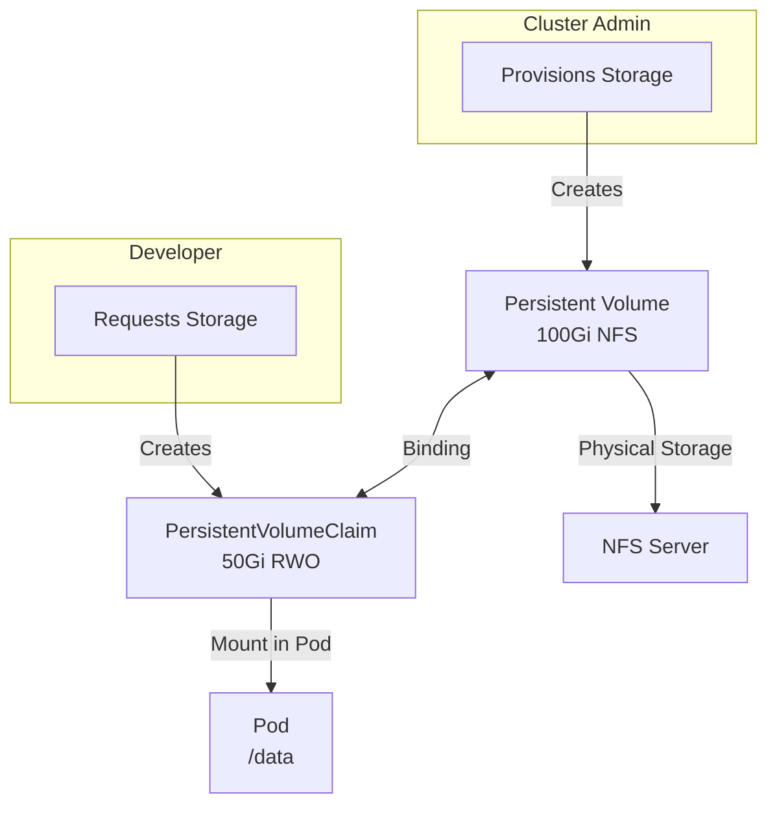
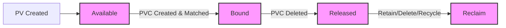
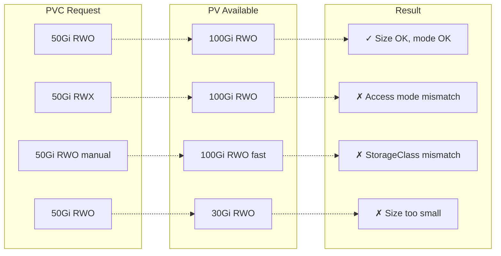
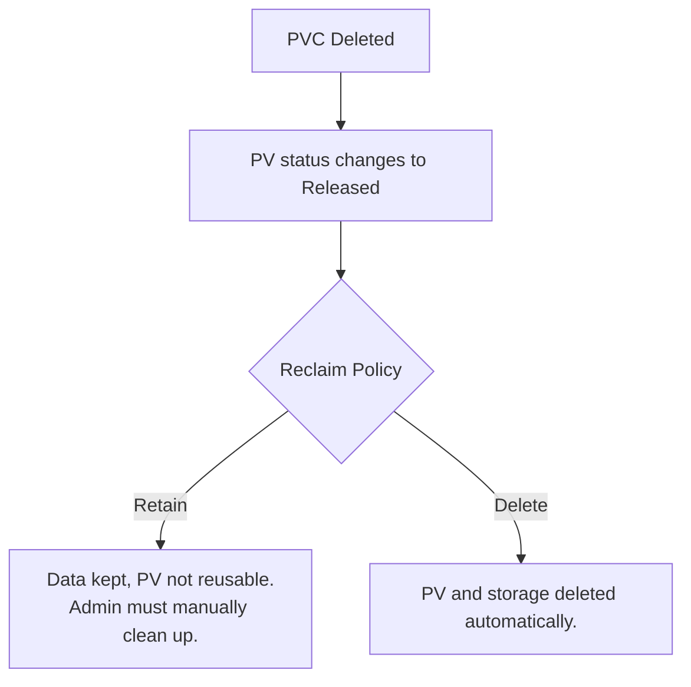

> **Complexity**: `[MEDIUM]` - Core storage abstraction
>
> **Time to Complete**: 40-50 minutes
>
> **Prerequisites**: Module 4.1 (Volumes), Module 1.2 (CSI)

---

## What You'll Be Able to Do

After this module, you will be able to:
- **Design** storage architectures that firmly decouple storage provisioning from application consumption.
- **Diagnose** volume binding failures by analyzing access modes, capacities, selectors, and StorageClass configurations.
- **Implement** static provisioning for local storage and trigger dynamic provisioning using StorageClasses.
- **Evaluate** reclaim policies to select the most appropriate data retention strategies for production workloads.
- **Compare** filesystem and block volume modes for specialized applications such as high-performance databases.

---

## Why This Module Matters

In 2021, a Site Reliability Engineer at CloudRetail Inc. encountered a seemingly routine task: tearing down a deprecated namespace that housed legacy testing applications. Because the PersistentVolumeClaims (PVCs) within that namespace were dynamically provisioned using a default `Delete` reclaim policy, removing the PVCs instantly triggered the automated deletion of the underlying cloud disks. Unbeknownst to the admin, a critical production database had been temporarily cross-mounted to one of those volumes for a migration task. The resulting data loss cost the company over $400,000 in downtime and engineering recovery efforts.

This incident highlights a fundamental Kubernetes concept: the absolute decoupling of the storage lifecycle from the workload lifecycle. PersistentVolumes (PVs) and PersistentVolumeClaims (PVCs) act as an indispensable abstraction layer. They shield developers from the mechanics of block storage provisioning while granting administrators granular control over storage capacity, performance tiers, and data retention policies. 

By mastering PVs and PVCs, you ensure that ephemeral pod restarts never lead to permanent data loss, and that critical state is preserved regardless of application or node failures. The Certified Kubernetes Administrator (CKA) exam heavily emphasizes these mechanics, testing your ability to manually bind volumes, troubleshoot pending claims, and architect resilient persistent storage solutions.

> **The Apartment Rental Analogy**
>
> Think of storage like renting an apartment. The **PersistentVolume** is the actual apartment - it exists whether anyone lives there or not. The **PersistentVolumeClaim** is like a tenant's application form specifying their needs: "I need 2 bedrooms, central location, parking spot." The building manager (Kubernetes) matches applications to available apartments. The tenant (pod) doesn't need to know which specific apartment they got - just that it meets their requirements.

---

## Did You Know?

- **Fact 1:** The in-tree AWS Elastic Block Store and Azure Disk plugins were officially deprecated in Kubernetes v1.19 and entirely removed in v1.27 in favor of CSI drivers.
- **Fact 2:** Volume expansion has been a stable feature since Kubernetes v1.24, allowing administrators to resize existing XFS, Ext3, and Ext4 volumes dynamically without creating new PVs.
- **Fact 3:** Cross-namespace volume data source support, which allows cloning a PVC from an object in another namespace, was introduced as an alpha feature gated in Kubernetes v1.26.
- **Fact 4:** A stable v1.33 feature introduced explicitly robust PV deletion-protection finalizers to prevent the deletion of CSI volumes before the backend cleanup is fully complete.

---

## Part 1: The Storage Abstraction Model

### Concept: The Abstraction Layer

A PersistentVolume (PV) is a cluster-scoped API resource that abstracts storage from workloads and is independent of any individual Pod. It represents a piece of physical storage in the cluster, provisioned either manually by a cluster administrator or dynamically by a provisioner. Because PVs are cluster-scoped, they do not belong to any specific namespace.

A PersistentVolumeClaim (PVC) is a request for storage (including size and access mode) and is the user-facing object that consumes PV resources. Developers create PVCs to request storage without needing to understand the underlying infrastructure. Crucially, PersistentVolumeClaims are namespaced objects; this limits multi-claim access mode use to within a namespace. A Pod can only mount a PVC if both the Pod and the PVC reside in the exact same namespace.



### Concept: Separation of Concerns

This decoupled architecture clearly separates administrative duties from development workflows.

| Concern | Who Handles It | Resource |
|---------|---------------|----------|
| What storage is available? | Admin | PersistentVolume |
| How much storage is needed? | Developer | PersistentVolumeClaim |
| Where to mount it? | Developer | Pod spec |
| Storage backend details | Admin | PV + StorageClass |

---

## Part 2: PV/PVC Lifecycle & Reclaim Policies

### Concept: Volume Phases

The lifecycle of a PV involves several distinct phases:
- **Available:** The PV is ready to be bound to a PVC.
- **Bound:** The PV is successfully linked to a specific PVC.
- **Released:** The PVC was deleted, but the PV still holds the data and is awaiting administrative reclaim.
- **Failed:** The automated reclamation process has failed.



### Concept: Reclaim Policies and Protection

When a PVC is deleted, the cluster looks at the PV's `persistentVolumeReclaimPolicy` to determine what to do with the underlying data. Current PV reclaim policies are Retain, Recycle, and Delete. 

In Kubernetes 1.35, only `nfs` and `hostPath` volume types support the Recycle reclaim policy, which performs a basic scrub, though it is largely deprecated in modern clusters. The Retain policy preserves the data for manual recovery, while Delete immediately destroys the backend storage.

| Policy | Behavior | Use Case |
|--------|----------|----------|
| Retain | PV preserved after PVC deletion | Production data, manual cleanup |
| Delete | PV and underlying storage deleted | Dynamic provisioning, dev/test |
| Recycle | Basic scrub (`rm -rf /data/*`) | **Deprecated** - don't use |

To prevent accidental data loss while workloads are still running, Storage Object in Use Protection delays deletion of an actively used PVC or bound PV until usage ends. Furthermore, PV deletion-protection finalizers include a stable v1.33 feature for preventing deletion of CSI volumes before backend cleanup has successfully executed, preventing orphaned disks in cloud environments.

> **Stop and think**: A junior admin creates a PV with `reclaimPolicy: Delete` for a production PostgreSQL database. A developer accidentally deletes the PVC. What happens to the data? What reclaim policy should have been used, and what additional steps would be needed to reuse that PV after a PVC deletion?

---

## Part 3: PersistentVolume Specification

### Defining a PV

Kubernetes currently lists `csi`, `fc`, `hostPath`, `iscsi`, `local`, and `nfs` as supported PV plugins, and marks several in-tree drivers as deprecated. The storage docs explicitly state that AWS Elastic Block Store and Azure Disk in-tree drivers were deprecated in v1.19 and removed in v1.27; these in-tree types are not included in Kubernetes 1.35 docs. You must use the Container Storage Interface (CSI) for modern cloud integrations.

```yaml
apiVersion: v1
kind: PersistentVolume
metadata:
  name: pv-nfs-data
  labels:
    type: nfs
    environment: production
spec:
  capacity:
    storage: 100Gi                    # Size of the volume
  volumeMode: Filesystem              # Filesystem or Block
  accessModes:
    - ReadWriteMany                   # Can be mounted by multiple nodes
  persistentVolumeReclaimPolicy: Retain   # What happens when released
  storageClassName: manual            # Must match PVC (or empty)
  mountOptions:
    - hard
    - nfsvers=4.1
  nfs:                                # Backend-specific configuration
    path: /exports/data
    server: nfs-server.example.com
```

### Volume Modes

Kubernetes supports both `Filesystem` and `Block` volume modes; Filesystem is the default when `volumeMode` is omitted. Block mode is utilized by specific databases that require raw, unformatted block devices to optimize their own internal file management.

```yaml
spec:
  volumeMode: Filesystem    # Default - mounted as directory
  # OR
  volumeMode: Block         # Raw block device (for databases)
```

### Access Modes

PVC access modes include RWO, ROX, RWX, and RWOP; RWOP restricts access to a single Pod and is supported only for CSI volumes. Note that a PVC can claim only one access mode at a time.

| Mode | Abbreviation | Description |
|------|--------------|-------------|
| ReadWriteOnce | RWO | Single node read-write |
| ReadOnlyMany | ROX | Multiple nodes read-only |
| ReadWriteMany | RWX | Multiple nodes read-write |
| ReadWriteOncePod | RWOP | Single pod read-write (Supported via CSI) |

**Backend support varies** (applicable to both in-tree and CSI drivers):
- **NFS**: RWO, ROX, RWX
- **AWS EBS**: RWO only
- **GCE PD**: RWO, ROX
- **Azure Disk**: RWO only
- **Local**: RWO only

### Common PV Types

**hostPath PV** (testing only):
```yaml
apiVersion: v1
kind: PersistentVolume
metadata:
  name: pv-hostpath
spec:
  capacity:
    storage: 10Gi
  accessModes:
    - ReadWriteOnce
  persistentVolumeReclaimPolicy: Delete
  storageClassName: manual
  hostPath:
    path: /mnt/data
    type: DirectoryOrCreate
```

**NFS PV**:
```yaml
apiVersion: v1
kind: PersistentVolume
metadata:
  name: pv-nfs
spec:
  capacity:
    storage: 50Gi
  accessModes:
    - ReadWriteMany
  persistentVolumeReclaimPolicy: Retain
  storageClassName: nfs
  nfs:
    server: 192.168.1.100
    path: /exports/share
```

**Local PV** (node-specific):
```yaml
apiVersion: v1
kind: PersistentVolume
metadata:
  name: pv-local
spec:
  capacity:
    storage: 200Gi
  accessModes:
    - ReadWriteOnce
  persistentVolumeReclaimPolicy: Retain
  storageClassName: local-storage
  local:
    path: /mnt/disks/ssd1
  nodeAffinity:                        # Required for local volumes!
    required:
      nodeSelectorTerms:
      - matchExpressions:
        - key: kubernetes.io/hostname
          operator: In
          values:
          - worker-node-1
```

---

## Part 4: PersistentVolumeClaims & Binding Rules

### Defining a PVC

```yaml
apiVersion: v1
kind: PersistentVolumeClaim
metadata:
  name: data-claim
  namespace: production              # PVCs are namespaced!
spec:
  accessModes:
    - ReadWriteOnce                  # Must match or be subset of PV
  volumeMode: Filesystem
  resources:
    requests:
      storage: 50Gi                  # Minimum size needed
  storageClassName: manual           # Match PV's storageClassName
  selector:                          # Optional: target specific PVs
    matchLabels:
      type: nfs
      environment: production
```

### Binding Mechanics

PV–PVC binding is exclusive and one-to-one, with ClaimRef linking both resources bi-directionally. A PVC binds to a PV when:
1. **storageClassName** matches (or both empty)
2. **accessModes** requested are available in PV
3. **resources.requests.storage** <= PV capacity
4. **selector** (if specified) matches PV labels. 



A PVC can explicitly bind to a specific PV using `volumeName`, and if that PV is already bound to another PVC, binding remains pending.

### Creating PVC via kubectl

```bash
# Quick way to create a PVC (limited options)
cat <<EOF | k apply -f -
apiVersion: v1
kind: PersistentVolumeClaim
metadata:
  name: my-claim
spec:
  accessModes:
    - ReadWriteOnce
  resources:
    requests:
      storage: 10Gi
  storageClassName: standard
EOF
```

### Checking PVC Status

```bash
# List PVCs
k get pvc
# NAME       STATUS   VOLUME   CAPACITY   ACCESS MODES   STORAGECLASS
# my-claim   Bound    pv-001   10Gi       RWO            standard

# Detailed view
k describe pvc my-claim

# Check which PV it bound to
k get pvc my-claim -o jsonpath='{.spec.volumeName}'
```

---

## Part 5: StorageClasses & Dynamic Provisioning

If no matching static PV exists, Kubernetes may dynamically provision a PV from StorageClass when the PVC requests a class; if a PV is dynamically provisioned for that PVC, it is bound to that PVC. 

A StorageClass object includes fields such as `provisioner`, `reclaimPolicy`, `parameters`, `allowVolumeExpansion`, and `volumeBindingMode`.

If the DefaultStorageClass admission controller is enabled, a PVC without `storageClassName` may receive the default class; if it is absent, PVCs without a class are not automatically defaulted until one is available. When more than one StorageClass is marked as default, Kubernetes uses the most recently created default. 

Crucially, a PVC using `storageClassName: ""` is explicitly treated as a request for a no-class PV and does not trigger class defaulting in the same way as an unset `storageClassName`.

### Volume Binding Modes

If unset, StorageClass `volumeBindingMode` defaults to Immediate, while `WaitForFirstConsumer` delays binding/provisioning until a consuming Pod is scheduled. For topology-aware provisioners, using Immediate mode can create unschedulable Pods; using WaitForFirstConsumer lets scheduling constraints participate in PV selection. In Kubernetes 1.35, local volume types do not support dynamic provisioning; a StorageClass with `WaitForFirstConsumer` is still used to delay binding.

---

## Part 6: Expansion, Snapshots, and Cloning

The default PVC expansion capability is stable since Kubernetes v1.24, and PVC expansion resizes the existing volume rather than creating a new PV. Kubernetes does not support shrinking PVCs below their current size; expansion of filesystem-backed volumes applies to XFS, Ext3, and Ext4.

VolumeSnapshot and VolumeSnapshotContent are CRDs (not core API objects), and snapshot support is available only for out-of-tree CSI volume plugins. Snapshots can be provisioned either pre-provisioned or dynamically, and a PVC can be created from a VolumeSnapshot via `dataSource`.

CSI volume cloning uses an existing PVC as `dataSource`, only supports dynamic CSI provisioners, and requires source/destination PVCs to be in the same namespace. `dataSourceRef` and `dataSource` cannot be independently divergent after creation; when cross-namespace mode is enabled, `dataSourceRef` can reference objects in other namespaces with feature-gate + ReferenceGrant requirements. Cross-namespace volume data source support is an alpha feature gated at v1.26 and requires enabling `AnyVolumeDataSource` and `CrossNamespaceVolumeDataSource` in control-plane components and csi-provisioner.

---

## Part 7: Using PVCs in Pods

### Basic Pod with PVC

```yaml
apiVersion: v1
kind: Pod
metadata:
  name: app-with-storage
spec:
  containers:
  - name: app
    image: nginx:1.25
    volumeMounts:
    - name: data
      mountPath: /usr/share/nginx/html
  volumes:
  - name: data
    persistentVolumeClaim:
      claimName: my-claim              # Reference the PVC name
```

### PVC in Deployments

```yaml
apiVersion: apps/v1
kind: Deployment
metadata:
  name: web-app
spec:
  replicas: 3
  selector:
    matchLabels:
      app: web
  template:
    metadata:
      labels:
        app: web
    spec:
      containers:
      - name: web
        image: nginx:1.25
        volumeMounts:
        - name: shared-data
          mountPath: /data
      volumes:
      - name: shared-data
        persistentVolumeClaim:
          claimName: shared-pvc        # Must be RWX for multi-replica
```

**Important**: For Deployments with multiple replicas, you need:
- A PVC with `ReadWriteMany` access mode, OR
- A StatefulSet with volumeClaimTemplates (each replica gets its own PVC)

> **Pause and predict**: You create a Deployment with 3 replicas, each mounting the same PVC with access mode `ReadWriteOnce`. Replica 1 starts fine on node-1. What happens when replica 2 gets scheduled to node-2? Would changing to `ReadWriteOncePod` (RWOP) make things better or worse?

### Read-Only PVC Mount

```yaml
volumes:
- name: data
  persistentVolumeClaim:
    claimName: my-claim
    readOnly: true                     # Mount as read-only
```

---

## Part 8: Selectors and Volume Matching

You can strictly govern which static PVs your PVC is allowed to bind to by utilizing label selectors. Both `matchLabels` and `matchExpressions` are supported. 

```yaml
# PV with labels
apiVersion: v1
kind: PersistentVolume
metadata:
  name: pv-fast-ssd
  labels:
    type: ssd
    speed: fast
    region: us-east
spec:
  capacity:
    storage: 100Gi
  accessModes:
    - ReadWriteOnce
  storageClassName: ""                # Empty for manual binding
  hostPath:
    path: /mnt/ssd
```

```yaml
# PVC selecting specific PV
apiVersion: v1
kind: PersistentVolumeClaim
metadata:
  name: fast-storage-claim
spec:
  accessModes:
    - ReadWriteOnce
  resources:
    requests:
      storage: 50Gi
  storageClassName: ""                # Must match PV
  selector:
    matchLabels:
      type: ssd
      speed: fast
    matchExpressions:
    - key: region
      operator: In
      values:
        - us-east
        - us-west
```

### Direct Volume Selection

Force a PVC to bind to a specific PV by name:

```yaml
apiVersion: v1
kind: PersistentVolumeClaim
metadata:
  name: specific-pv-claim
spec:
  accessModes:
    - ReadWriteOnce
  resources:
    requests:
      storage: 10Gi
  storageClassName: ""
  volumeName: pv-fast-ssd             # Bind to this specific PV
```

---

## Part 9: PV Release and Cleanup

When a PVC is deleted, the status of the bounded PV changes immediately to `Released`. 



### Reclaiming a Released PV

```bash
# Check PV status
k get pv pv-data
# NAME      CAPACITY   ACCESS MODES   RECLAIM POLICY   STATUS     CLAIM
# pv-data   100Gi      RWO            Retain           Released   default/old-claim

# Remove the claim reference to make PV available again
k patch pv pv-data -p '{"spec":{"claimRef": null}}'

# Verify it's Available
k get pv pv-data
# STATUS: Available
```

### Manually Deleting Data

For Retain policy, data remains on the storage. Clean up steps:
1. Back up data if needed
2. Delete data from underlying storage
3. Remove claimRef (as above) or delete/recreate PV

> **Pause and predict**: You have a PV in `Released` state after its PVC was deleted. You patch the PV to remove the `claimRef`, making it `Available` again. A new PVC binds to it. Will the new PVC see the old data that was on the volume, or will it be empty?

---

## Common Mistakes

| Mistake | Problem | Solution |
|---------|---------|----------|
| PVC stuck in Pending | No matching PV available | Check storageClassName, size, access modes |
| Access mode mismatch | PVC requesting RWX, PV only has RWO | Use compatible access modes |
| StorageClass mismatch | PVC and PV have different storageClassName | Align storageClassName or use "" for both |
| Deleted PVC, lost data | Reclaim policy was Delete | Use Retain for important data |
| Can't reuse Released PV | claimRef still set | Patch PV to remove claimRef |
| Local PV missing nodeAffinity | Pod can't find volume | Add required nodeAffinity section |
| PVC in wrong namespace | Pod can't reference it | PVCs must be in same namespace as pod |

---

## Quiz

### Q1: Cross-Namespace Storage Mystery
A developer in the `frontend` namespace creates a PVC requesting 10Gi with `storageClassName: manual`. An admin has created a 50Gi PV with `storageClassName: manual` in the cluster. The PVC binds successfully. But when the developer tries to reference this PVC from a pod in the `backend` namespace, the pod fails. Why does the pod fail, and what is the correct approach?

<details>
<summary>Answer</summary>

PersistentVolumes are **cluster-scoped** (no namespace), so the PV itself is visible everywhere. However, PersistentVolumeClaims are **namespaced** -- the PVC `my-claim` in `frontend` cannot be referenced by a pod in `backend`. The pod fails because it cannot find a PVC with that name in its own namespace. The correct approach is to create a separate PVC in the `backend` namespace. Note that the 50Gi PV is already bound to the `frontend` PVC exclusively, so the `backend` PVC would need its own PV or dynamic provisioning.

</details>

### Q2: Wasted Storage Investigation
Your cluster has three PVs: 10Gi, 50Gi, and 100Gi, all with `storageClassName: standard` and `accessModes: [ReadWriteOnce]`. A developer creates a PVC requesting 20Gi with the same StorageClass. After binding, they complain that `kubectl get pvc` shows 50Gi capacity, not 20Gi. They ask: "Where did the extra 30Gi go? Can another PVC use it?"

<details>
<summary>Answer</summary>

Kubernetes selects the **smallest PV that satisfies the request** -- the 10Gi PV is too small, so the 50Gi PV binds. The binding is exclusive: the entire 50Gi PV is reserved for this PVC, even though only 20Gi was requested. No other PVC can use the remaining 30Gi -- it is effectively wasted. This is a key reason dynamic provisioning (via StorageClasses) is preferred in production: it creates PVs sized exactly to the request. To avoid waste with static provisioning, admins should create PVs that closely match expected PVC sizes.

</details>

### Q3: Multi-Replica Deployment Failure
A team deploys a 3-replica Deployment where each pod mounts the same PVC (access mode `ReadWriteOnce`). Replica 1 starts on node-A. Replica 2 is scheduled to node-B but gets stuck in `ContainerCreating` with a Multi-Attach error. What is the root cause, and what are two different solutions?

<details>
<summary>Answer</summary>

`ReadWriteOnce` (RWO) means the volume can only be mounted by a **single node** at a time. Replica 2 on node-B cannot attach the volume that is already mounted on node-A. Two solutions: (1) Switch to a storage backend that supports `ReadWriteMany` (RWX) like NFS, and change the PVC access mode to RWX so all replicas on different nodes can mount it simultaneously. (2) Convert the Deployment to a **StatefulSet** with `volumeClaimTemplates`, which gives each replica its own independent PVC and PV -- this is the correct pattern for stateful workloads like databases where each replica needs its own storage.

</details>

### Q4: Released PV Recovery
A production PostgreSQL PVC was accidentally deleted. The PV has `reclaimPolicy: Retain` and now shows status `Released`. The team needs to recover the data. They try creating a new PVC with the same name and spec, but it stays `Pending` instead of binding to the Released PV. What is blocking the binding, and what are the exact steps to recover?

<details>
<summary>Answer</summary>

A Released PV still has a `claimRef` pointing to the old, deleted PVC. Even though a new PVC has the same name, the PV controller will not rebind it automatically because the UID in the claimRef does not match. The recovery steps are: (1) Verify the PV still has data: `kubectl get pv <name> -o yaml` and check the backend path. (2) Remove the stale claimRef: `kubectl patch pv <name> -p '{"spec":{"claimRef": null}}'`. This changes the PV status to `Available`. (3) Create the new PVC with matching storageClassName, access modes, and optionally `volumeName: <pv-name>` to force binding to that specific PV. The data on the underlying storage is preserved throughout this process because the Retain policy prevents deletion.

</details>

### Q5: Static Binding Trap
A developer creates a PVC without specifying `storageClassName`. The cluster has a default StorageClass. Meanwhile, an admin has manually created a PV with `storageClassName: ""`. The PVC never binds to the manual PV and instead triggers dynamic provisioning. Why, and how should the PVC be configured for manual binding?

<details>
<summary>Answer</summary>

When `storageClassName` is **omitted** from a PVC, Kubernetes uses the cluster's **default StorageClass**, which triggers dynamic provisioning -- it does not look for PVs with empty storageClassName. To explicitly opt out of dynamic provisioning and bind to the manual PV, the PVC must set `storageClassName: ""` (empty string). This tells Kubernetes: "only bind to PVs that also have no StorageClass, and do not trigger any provisioner." Both the PV and PVC must have `storageClassName: ""` for manual binding to work. This distinction between "omitted" and "empty string" is a common exam gotcha.

</details>

### Q6: Local PV Scheduling Failure
A team creates a local PV backed by an SSD at `/mnt/disks/ssd1` on `worker-node-1`, but forgets to add `nodeAffinity`. A pod using this PV gets scheduled to `worker-node-2` and fails with a mount error. Explain why the nodeAffinity is required for local PVs (but not for NFS or cloud PVs), and write the nodeAffinity section needed.

<details>
<summary>Answer</summary>

Local PVs reference storage that is **physically attached to a specific node** -- the path `/mnt/disks/ssd1` only exists on `worker-node-1`. Without nodeAffinity, the scheduler does not know which node has the storage and may schedule the pod anywhere. NFS and cloud PVs do not need this because NFS is network-accessible from all nodes, and cloud PVs are attached dynamically by the CSI driver. The required nodeAffinity section constrains the scheduler to place pods on the correct node:

```yaml
nodeAffinity:
  required:
    nodeSelectorTerms:
    - matchExpressions:
      - key: kubernetes.io/hostname
        operator: In
        values:
        - worker-node-1
```

This ensures pods using the local PV are only scheduled to `worker-node-1` where the disk exists.

</details>

### Q7: Snapshot Restoration Failure
A team wants to restore a database from a snapshot using dynamic provisioning. They create a PVC with a `dataSource` pointing to a VolumeSnapshot, but the PVC remains in a Pending state indefinitely. What is the most likely cause related to the volume plugin being used?

<details>
<summary>Answer</summary>

VolumeSnapshot and VolumeSnapshotContent are CRDs, and snapshot support is available only for out-of-tree CSI volume plugins. If the cluster is still utilizing a legacy in-tree volume plugin (or an external provisioner that lacks snapshot capabilities), the dynamic provisioner will fail to process the `dataSource` request. You must verify that the StorageClass and the backend rely exclusively on a CSI driver that implements the snapshotting API features.

</details>

### Q8: Volume Expansion Limitation
An administrator attempts to reduce cluster storage costs by shrinking a dynamically provisioned 500Gi PVC down to 100Gi. They successfully edit the PVC manifest and apply it, but the volume size does not change on the storage backend. Why did this operation fail, and what are the specific rules regarding volume resizing?

<details>
<summary>Answer</summary>

Kubernetes emphatically does not support shrinking PVCs below their current size. The volume expansion feature, which has been stable since Kubernetes v1.24, strictly allows resizing the existing volume upwards. It seamlessly applies to filesystem-backed volumes (such as XFS, Ext3, and Ext4) without creating a new PV, but reducing capacity is fundamentally unsafe for the integrity of the underlying data and is explicitly blocked by the Kubernetes API.

</details>

---

## Hands-On Exercise: Static PV Provisioning

### Scenario
Create a PV and PVC, then use the storage in a pod. Verify data persists across pod deletion.

### Setup

```bash
# Create namespace
k create ns pv-lab
```

### Task 1: Create a PersistentVolume

```bash
cat <<EOF | k apply -f -
apiVersion: v1
kind: PersistentVolume
metadata:
  name: lab-pv
  labels:
    lab: storage
spec:
  capacity:
    storage: 1Gi
  accessModes:
    - ReadWriteOnce
  persistentVolumeReclaimPolicy: Retain
  storageClassName: manual
  hostPath:
    path: /tmp/lab-pv-data
    type: DirectoryOrCreate
EOF
```

Verify:
```bash
k get pv lab-pv
# STATUS should be "Available"
```

### Task 2: Create a PersistentVolumeClaim

```bash
cat <<EOF | k apply -f -
apiVersion: v1
kind: PersistentVolumeClaim
metadata:
  name: lab-pvc
  namespace: pv-lab
spec:
  accessModes:
    - ReadWriteOnce
  resources:
    requests:
      storage: 500Mi
  storageClassName: manual
  selector:
    matchLabels:
      lab: storage
EOF
```

Verify binding:
```bash
k get pvc -n pv-lab
# STATUS should be "Bound"

k get pv lab-pv
# CLAIM should show "pv-lab/lab-pvc"
```

### Task 3: Use PVC in a Pod

```bash
cat <<EOF | k apply -f -
apiVersion: v1
kind: Pod
metadata:
  name: storage-pod
  namespace: pv-lab
spec:
  containers:
  - name: writer
    image: busybox:1.36
    command: ['sh', '-c', 'echo "Data written at \$(date)" > /data/timestamp.txt; sleep 3600']
    volumeMounts:
    - name: storage
      mountPath: /data
  volumes:
  - name: storage
    persistentVolumeClaim:
      claimName: lab-pvc
EOF
```

Verify pod is running:
```bash
k wait --for=condition=Ready pod/storage-pod -n pv-lab --timeout=60s
```

### Task 4: Verify Data Persistence

```bash
# Check the written data
k exec -n pv-lab storage-pod -- cat /data/timestamp.txt

# Delete the pod
k delete pod -n pv-lab storage-pod

# Recreate pod
cat <<EOF | k apply -f -
apiVersion: v1
kind: Pod
metadata:
  name: storage-pod-v2
  namespace: pv-lab
spec:
  containers:
  - name: reader
    image: busybox:1.36
    command: ['sh', '-c', 'cat /data/timestamp.txt; sleep 3600']
    volumeMounts:
    - name: storage
      mountPath: /data
  volumes:
  - name: storage
    persistentVolumeClaim:
      claimName: lab-pvc
EOF

# Wait for pod to be ready
k wait --for=condition=Ready pod/storage-pod-v2 -n pv-lab --timeout=60s

# Verify data persisted
k logs -n pv-lab storage-pod-v2
# Should show the original timestamp
```

### Task 5: Test Released State

```bash
# Delete the PVC (pod must be deleted first)
k delete pod -n pv-lab storage-pod-v2
k delete pvc -n pv-lab lab-pvc

# Check PV status
k get pv lab-pv
# STATUS should be "Released" (because of Retain policy)

# Make PV available again
k patch pv lab-pv -p '{"spec":{"claimRef": null}}'

k get pv lab-pv
# STATUS should be "Available"
```

### Success Criteria
- [ ] PV created and shows "Available"
- [ ] PVC created and binds to PV
- [ ] Pod can write data to mounted volume
- [ ] Data persists after pod deletion
- [ ] PV shows "Released" after PVC deletion
- [ ] PV can be made "Available" again

### Cleanup

```bash
k delete ns pv-lab
k delete pv lab-pv
```

---

## Practice Drills

### Drill 1: Create PV (2 min)
```bash
# Task: Create 5Gi PV with RWO access, Retain policy, storageClassName "slow"
# Backend: hostPath /mnt/data
```

### Drill 2: Create PVC (1 min)
```bash
# Task: Create PVC requesting 2Gi with RWO, storageClassName "slow"
```

### Drill 3: Check Binding (1 min)
```bash
# Task: Verify PVC bound to correct PV
# Commands: k get pvc, k get pv, check CLAIM column
```

### Drill 4: PVC Selector (2 min)
```bash
# Task: Create PVC that only binds to PVs with label "tier: gold"
# Use selector.matchLabels
```

### Drill 5: Pod with PVC (2 min)
```bash
# Task: Create pod mounting PVC "data-pvc" at /app/data
# Image: nginx
```

### Drill 6: Troubleshoot Pending PVC (2 min)
```bash
# Given: PVC stuck in Pending
# Task: Identify why it won't bind
# Check: k describe pvc, look at Events
```

### Drill 7: Reclaim Released PV (1 min)
```bash
# Task: Make a "Released" PV available again
# Command: k patch pv <name> -p '{"spec":{"claimRef": null}}'
```

### Drill 8: Local PV with nodeAffinity (3 min)
```bash
# Task: Create local PV that only works on node "worker-1"
# Include required nodeAffinity section
```

---

## Next Module

Continue to [Module 4.3: StorageClasses & Dynamic Provisioning](../module-4.3-storageclasses/) to learn how to move past manual volume matching and enable fully automated, on-demand storage provisioning for your workloads.