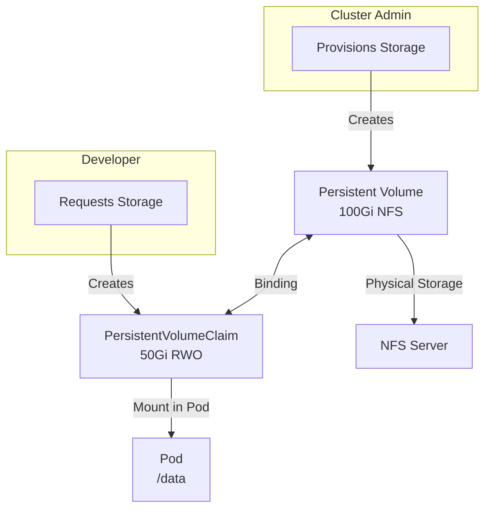
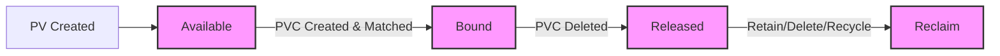
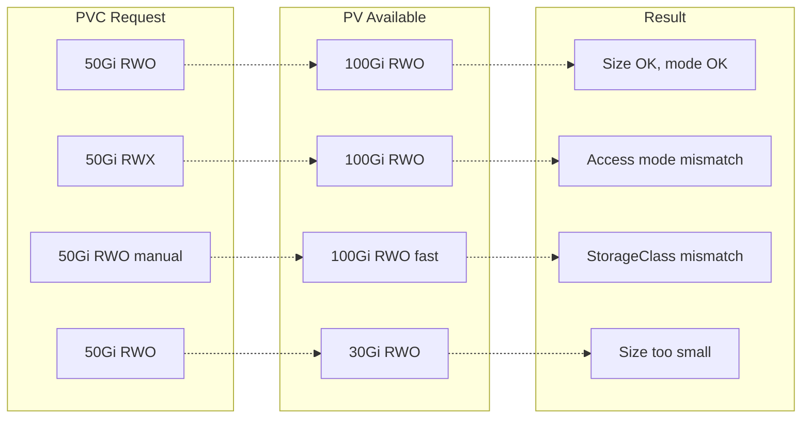
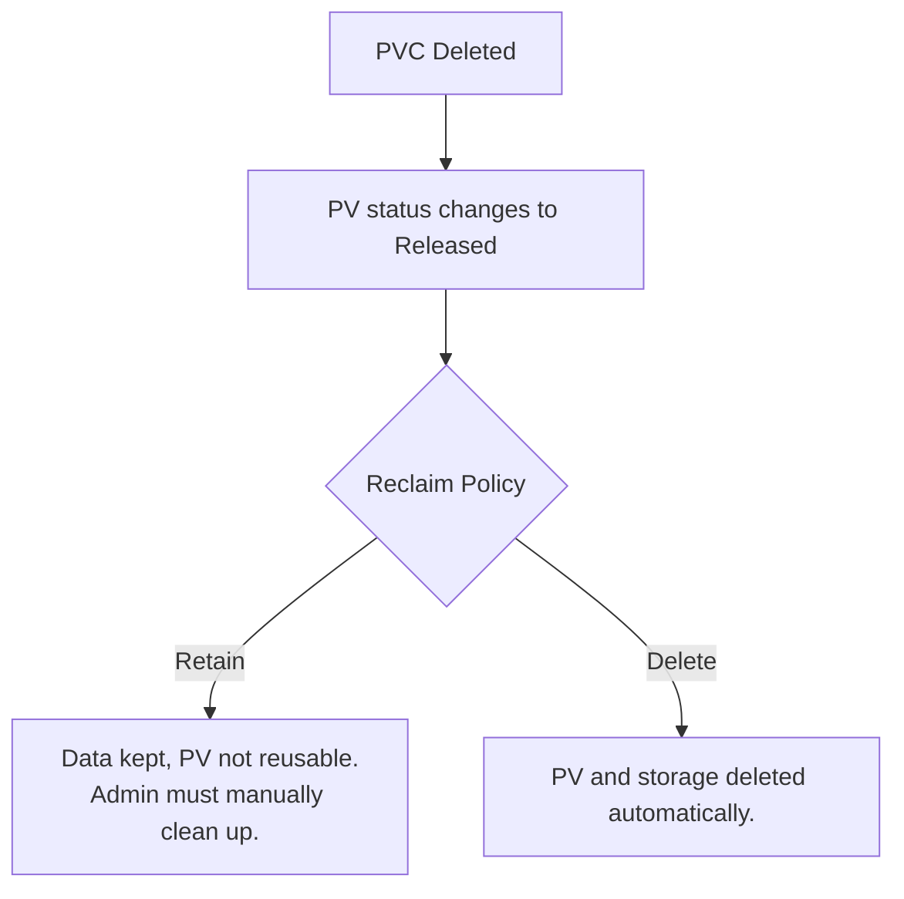

> **Complexity**: `[MEDIUM]` - Core storage abstraction
>
> **Time to Complete**: 40-50 minutes
>
> **Prerequisites**: Module 4.1 (Volumes), Module 1.2 (CSI)

---

## What You'll Be Able to Do

After this module, you will be able to:

- **Design** storage architectures that decouple storage provisioning from application consumption.
- **Diagnose** volume binding failures by analyzing access modes, capacity, selectors, namespace scope, and StorageClass configuration.
- **Implement** static provisioning with PersistentVolumes and PersistentVolumeClaims, then consume the claim from a Pod.
- **Evaluate** reclaim policies and finalizers to choose safer data retention behavior for production workloads.
- **Compare** filesystem and block volume modes, single-node and multi-node access modes, and static and dynamic provisioning tradeoffs.

## Why This Module Matters

Hypothetical scenario: a team migrates a stateful reporting application from a single virtual machine into Kubernetes. The container starts cleanly, writes reports to `/data`, and passes the first smoke test, but the team used an `emptyDir` volume because it was quick to define. The next node drain recreates the Pod somewhere else, the reports vanish with the old Pod sandbox, and the team learns the uncomfortable difference between "the application is running" and "the application state survived a normal cluster operation."

PersistentVolumes and PersistentVolumeClaims exist because storage has a different lifecycle from compute. A Pod is deliberately replaceable; a database file, uploaded document, queue checkpoint, or audit archive often is not. Kubernetes therefore splits the storage conversation into two API objects: an administrator or provisioner makes capacity available as a PersistentVolume, and a workload owner asks for capacity through a PersistentVolumeClaim. That split lets application YAML stay portable while storage policy remains under cluster control.

The CKA exam expects you to reason through this split under time pressure. You may be asked to create a manual `hostPath` PV, bind a PVC by class and label, diagnose why a claim remains `Pending`, or recover a retained volume after a PVC was deleted. The commands are not the hard part; the hard part is reading the relationship between PV, PVC, StorageClass, Pod, access mode, volume mode, and reclaim policy without assuming that Kubernetes will guess the intent you forgot to encode.

Think of storage like renting an apartment. The PersistentVolume is the actual apartment: it has a size, location, building rules, and an owner even when no tenant lives there. The PersistentVolumeClaim is the application form: "I need at least this much space, with these access rules, from this class of apartments." The Pod is the tenant moving in after the claim is approved. The tenant should not need to know every detail of the building, but the application form must still match an apartment that really exists.

## The PV/PVC Contract

A PersistentVolume is a cluster-scoped API resource that represents storage available to the cluster. It may point at NFS, local disk, Fibre Channel, iSCSI, a CSI-backed cloud disk, or another supported backend. The key idea is scope: a PV does not live in a namespace, and it is not owned by a single Pod. It is a durable storage object with its own status, capacity, access modes, reclaim policy, and backend-specific configuration.

A PersistentVolumeClaim is a namespaced request for storage. Developers create PVCs because they should not have to encode cloud disk IDs or NFS export paths in every Pod template. The PVC describes the required size, access mode, volume mode, StorageClass, and optional selectors. Kubernetes then binds the claim to a compatible PV, either one that already exists or one created dynamically by a provisioner.

The binding is intentionally exclusive. Once a PVC is bound to a PV, that PV is reserved for that claim and cannot be split across other claims, even when the claim requested less space than the PV provides. This exclusivity surprises learners who expect Kubernetes to carve a 20Gi slice out of a 50Gi PV, but Kubernetes treats the PV as the allocation unit. If the cluster needs fine-grained sizing, dynamic provisioning is usually the better operational model.



The diagram shows the main responsibility boundary. Administrators care about what storage exists and what policy applies to it. Developers care about how much storage an application needs and where that storage appears inside a container. The Kubernetes control plane sits between those roles and performs matching, but it only matches on declared properties. If the PVC asks for `ReadWriteMany` and all available PVs offer only `ReadWriteOnce`, there is no hidden negotiation.

| Concern | Who Handles It | Resource |
|---------|---------------|----------|
| What storage is available? | Admin | PersistentVolume |
| How much storage is needed? | Developer | PersistentVolumeClaim |
| Where to mount it? | Developer | Pod spec |
| Storage backend details | Admin | PV + StorageClass |

The resource chain is easiest to debug when you keep the objects in order. A StorageClass describes how dynamic storage should be created. A PV represents actual capacity. A PVC requests capacity. A Pod references the PVC by name. If the Pod cannot mount storage, you should not start by editing the container image; first inspect whether the PVC is bound, which PV it selected, and whether the selected backend can be attached to the node where the Pod landed.

+-------------------+      +-------------------+      +-------------------+
| StorageClass      | ---> | PersistentVolume  | ---> | Backend storage   |
| policy + driver   |      | capacity + mode   |      | disk, NFS, local  |
+-------------------+      +-------------------+      +-------------------+
          ^                         ^
          |                         |
+-------------------+      +-------------------+
| PersistentVolume  | ---> | Pod volume mount  |
| Claim request     |      | container path    |
+-------------------+      +-------------------+

Pause and predict: if a PVC is created in the `frontend` namespace and a Pod in the `backend` namespace uses the same claim name, what object lookup does the kubelet attempt? The PV is cluster-scoped, but the Pod never mounts a PV directly. It references a PVC in its own namespace, so the namespace boundary remains part of the storage contract even after a cluster-scoped PV has been bound.

## Defining Volumes, Claims, and Binding Rules

A PV specification begins with capacity, access modes, volume mode, reclaim policy, class, optional mount options, and backend details. The backend section is the part that changes between NFS, local disk, CSI, and test-only `hostPath`, but the contract fields stay recognizable. Treat those contract fields as the part that Kubernetes can reason about; the backend-specific fields tell a plugin or kubelet how to reach the storage after a match has been made.

```yaml
apiVersion: v1
kind: PersistentVolume
metadata:
  name: pv-nfs-data
  labels:
    type: nfs
    environment: production
spec:
  capacity:
    storage: 100Gi                    # Size of the volume
  volumeMode: Filesystem              # Filesystem or Block
  accessModes:
    - ReadWriteMany                   # Can be mounted by multiple nodes
  persistentVolumeReclaimPolicy: Retain   # What happens when released
  storageClassName: manual            # Must match PVC (or empty)
  mountOptions:
    - hard
    - nfsvers=4.1
  nfs:                                # Backend-specific configuration
    path: /exports/data
    server: nfs-server.example.com
```

`volumeMode` answers a different question from access mode. `Filesystem` means Kubernetes mounts a filesystem at a directory inside the container, which is the default and the right choice for most application data paths. `Block` exposes a raw block device to the container, which is useful for software that manages its own disk layout. A database using raw block mode is not "more persistent" than filesystem mode; it is simply receiving a different interface.

```yaml
spec:
  volumeMode: Filesystem    # Default - mounted as directory
  # OR
  volumeMode: Block         # Raw block device (for databases)
```

Access modes describe how the volume may be mounted by nodes or, for `ReadWriteOncePod`, by a single Pod. They are used during PV/PVC matching, and in some cases they constrain attachment, but they are not a complete permission system. For example, `ReadOnlyMany` in the API does not magically make a misconfigured backend immutable after mount; the storage implementation still matters. For exam work, use the access mode to explain scheduling and binding behavior, then verify the backend supports the mode you selected.

| Mode | Abbreviation | Description |
|------|--------------|-------------|
| ReadWriteOnce | RWO | Single node read-write |
| ReadOnlyMany | ROX | Multiple nodes read-only |
| ReadWriteMany | RWX | Multiple nodes read-write |
| ReadWriteOncePod | RWOP | Single pod read-write, supported through CSI |

Backend support varies. NFS commonly supports RWO, ROX, and RWX, making it useful for shared content. Cloud block disks such as AWS EBS and Azure Disk are usually RWO because a single disk attachment is coordinated to one node at a time. GCE Persistent Disk supports RWO and ROX in common Kubernetes tables. Local PVs are RWO because the path exists on one node, and `ReadWriteOncePod` is a CSI-oriented mode for enforcing a single writer Pod across the cluster.

A `hostPath` PV is acceptable for a local learning lab, but it is not a production pattern for a multi-node cluster. It stores data on a node filesystem path, so the data is tied to that node and not protected by an external storage system. The Kubernetes storage docs call out `hostPath` as single-node testing material; when you need node-local production storage, use local PVs with explicit node affinity and a clear failure-domain story.

```yaml
apiVersion: v1
kind: PersistentVolume
metadata:
  name: pv-hostpath
spec:
  capacity:
    storage: 10Gi
  accessModes:
    - ReadWriteOnce
  persistentVolumeReclaimPolicy: Delete
  storageClassName: manual
  hostPath:
    path: /mnt/data
    type: DirectoryOrCreate
```

An NFS PV demonstrates a shared network filesystem. Multiple nodes can reach the same export, so RWX becomes possible when the NFS server and export permissions are configured correctly. The tradeoff is that the NFS server becomes part of the application dependency chain. A Kubernetes manifest can request RWX, but it cannot make a slow, unavailable, or incorrectly exported NFS server behave like resilient storage.

```yaml
apiVersion: v1
kind: PersistentVolume
metadata:
  name: pv-nfs
spec:
  capacity:
    storage: 50Gi
  accessModes:
    - ReadWriteMany
  persistentVolumeReclaimPolicy: Retain
  storageClassName: nfs
  nfs:
    server: 192.168.1.100
    path: /exports/share
```

A local PV is different from `hostPath` because it is an explicit PersistentVolume object with scheduling information. The required `nodeAffinity` tells Kubernetes where the storage exists, allowing the scheduler to place consuming Pods on the correct node. Without that affinity, a Pod could be scheduled to a node that does not have `/mnt/disks/ssd1`, and the mount failure would look like a storage problem even though the real issue is missing topology metadata.

```yaml
apiVersion: v1
kind: PersistentVolume
metadata:
  name: pv-local
spec:
  capacity:
    storage: 200Gi
  accessModes:
    - ReadWriteOnce
  persistentVolumeReclaimPolicy: Retain
  storageClassName: local-storage
  local:
    path: /mnt/disks/ssd1
  nodeAffinity:                        # Required for local volumes!
    required:
      nodeSelectorTerms:
      - matchExpressions:
        - key: kubernetes.io/hostname
          operator: In
          values:
          - worker-node-1
```

The lifecycle of a PV is short to name but important to interpret. `Available` means the PV can still bind. `Bound` means it is linked to one PVC. `Released` means the PVC was deleted, but the PV still remembers that old claim and may still contain data. `Failed` means automated reclamation did not complete. The `Released` phase is the one that catches administrators, because a retained volume is not automatically safe for a new claim.



A PVC is smaller and more application-facing. It names the namespace, access mode, volume mode, requested capacity, StorageClass, and optional selectors. The `resources.requests.storage` value is a minimum, not an exact partition request, so a 50Gi claim can bind to a 100Gi PV. The `storageClassName` field is exact, including the important difference between an omitted field and an explicit empty string.

```yaml
apiVersion: v1
kind: PersistentVolumeClaim
metadata:
  name: data-claim
  namespace: production              # PVCs are namespaced!
spec:
  accessModes:
    - ReadWriteOnce                  # Must match or be subset of PV
  volumeMode: Filesystem
  resources:
    requests:
      storage: 50Gi                  # Minimum size needed
  storageClassName: manual           # Match PV's storageClassName
  selector:                          # Optional: target specific PVs
    matchLabels:
      type: nfs
      environment: production
```

Kubernetes binds a PVC to a PV when the class, requested access mode, volume mode, capacity, and selector constraints are compatible. A selector can narrow the eligible PV set by label, and `volumeName` can ask for one PV by name. If the requested PV is already bound to another claim, the new claim remains pending because PV/PVC binding is one-to-one. Kubernetes will not steal a PV just because a newer claim is more specific.



Before running this, what output do you expect from `kubectl get pvc` if no compatible PV exists and no dynamic provisioner can satisfy the claim? The claim should remain `Pending`, and `kubectl describe pvc` should show events that explain the missing match. Those events are often more useful than the YAML because they tell you which controller decision failed.

```bash
# Quick way to create a PVC with explicit YAML.
cat <<EOF | kubectl apply -f -
apiVersion: v1
kind: PersistentVolumeClaim
metadata:
  name: my-claim
spec:
  accessModes:
    - ReadWriteOnce
  resources:
    requests:
      storage: 10Gi
  storageClassName: standard
EOF
```

After creating a claim, inspect it from both directions. The PVC status tells you whether the claim is bound, and the PV `CLAIM` column tells you which namespace and claim consumed the volume. If you only inspect the Pod, you may miss that the Pod is waiting on a claim that never bound. If you only inspect the PV, you may miss that the Pod is in the wrong namespace for the PVC it references.

```bash
# List PVCs
kubectl get pvc
# NAME       STATUS   VOLUME   CAPACITY   ACCESS MODES   STORAGECLASS
# my-claim   Bound    pv-001   10Gi       RWO            standard

# Detailed view
kubectl describe pvc my-claim

# Check which PV it bound to
kubectl get pvc my-claim -o jsonpath='{.spec.volumeName}'
```

## StorageClasses, Dynamic Provisioning, and Data Sources

Static provisioning is explicit: someone creates the PV before the claim arrives. Dynamic provisioning is demand-driven: a PVC references a StorageClass, and the provisioner creates a PV that satisfies that claim. Dynamic provisioning is the normal production path for many cloud and CSI-backed clusters because it avoids maintaining piles of pre-sized PV objects and reduces wasted capacity from oversized static volumes.

A StorageClass contains a `provisioner`, optional backend `parameters`, a `reclaimPolicy`, `allowVolumeExpansion`, and `volumeBindingMode`. The reclaim policy on dynamically created PVs comes from the StorageClass, so a StorageClass is also a data-retention policy surface. If the class says `Delete`, then deleting the PVC normally leads to deletion of the dynamically provisioned backend storage after protection and finalizer rules are satisfied.

Defaulting behavior is a frequent exam trap. If a PVC omits `storageClassName` and a default StorageClass exists, the admission controller may assign the default class and trigger dynamic provisioning. If a PVC sets `storageClassName: ""`, it is asking for a no-class PV and should not be defaulted to the cluster default. The empty string is not decoration; it is how you opt into manual no-class binding.

`volumeBindingMode` controls when binding or provisioning happens. The default `Immediate` mode binds or provisions as soon as the claim is created, before a consuming Pod is scheduled. `WaitForFirstConsumer` delays binding until a Pod exists, allowing node selectors, affinity, taints, topology zones, and local volume constraints to influence the decision. For local PVs and topology-aware CSI drivers, this delay can be the difference between a schedulable workload and a perfectly valid volume created in the wrong place.

Snapshots and cloning extend the same claim model rather than replacing it. VolumeSnapshot and VolumeSnapshotContent are CustomResourceDefinitions served by the CSI snapshot ecosystem, not core PV objects. A PVC can be created from a snapshot through `dataSource` when the CSI driver and snapshot controller support it. A clone can use another PVC as a data source, with namespace and provisioner limitations. In Kubernetes 1.35, cross-namespace data sources remain a feature that requires explicit enablement and supporting objects such as ReferenceGrant, so do not design around it as a default assumption.

Expansion is safer than shrinking because the API permits growth but not reduction below the current size. Stable PVC expansion has been available since Kubernetes v1.24 for supported drivers, and filesystem expansion applies to filesystems such as XFS, Ext3, and Ext4 when the storage backend allows it. Shrinking would require proving that every byte above the new boundary is unused and that the filesystem can contract safely, so Kubernetes does not offer it as a normal PVC edit.

Which approach would you choose here and why: a manually created `Retain` PV for a database migration window, or a dynamically provisioned `Delete` PV from a default StorageClass? The answer depends on whether deletion safety or automation matters more for that workload. For production data migration, deliberate retention usually beats convenience. For disposable test data, dynamic provisioning with automatic cleanup may be the correct operational choice.

## Consuming Claims from Pods and Workloads

A Pod consumes storage by naming a PVC in `spec.volumes`, then mounting that volume into one or more containers. The Pod does not name the PV, the backend disk, or the StorageClass. This indirection is what lets application YAML remain stable while the cluster changes storage implementation. If the claim name is wrong or the namespace differs, the Pod cannot resolve the claim even if a matching cluster-scoped PV exists.

```yaml
apiVersion: v1
kind: Pod
metadata:
  name: app-with-storage
spec:
  containers:
  - name: app
    image: nginx:1.25
    volumeMounts:
    - name: data
      mountPath: /usr/share/nginx/html
  volumes:
  - name: data
    persistentVolumeClaim:
      claimName: my-claim              # Reference the PVC name
```

Deployments add a scaling question. Multiple replicas can reference the same PVC, but the backend and access mode decide whether that is actually usable. A three-replica Deployment mounting one RWO block disk may work while all Pods happen to land on one node, then fail with a multi-attach error when another replica lands elsewhere. If all replicas must read and write the same files, use RWX-capable storage. If each replica needs its own stable disk, use a StatefulSet with `volumeClaimTemplates`.

```yaml
apiVersion: apps/v1
kind: Deployment
metadata:
  name: web-app
spec:
  replicas: 3
  selector:
    matchLabels:
      app: web
  template:
    metadata:
      labels:
        app: web
    spec:
      containers:
      - name: web
        image: nginx:1.25
        volumeMounts:
        - name: shared-data
          mountPath: /data
      volumes:
      - name: shared-data
        persistentVolumeClaim:
          claimName: shared-pvc        # Must be RWX for multi-replica
```

Read-only mounting is a Pod-level consumption choice. The PVC and PV still declare access modes for matching and attachment, but a Pod can request a read-only mount when it should not write to a shared dataset. This is useful for shared content, model files, or configuration snapshots where the storage administrator controls updates separately from application runtime behavior.

```yaml
volumes:
- name: data
  persistentVolumeClaim:
    claimName: my-claim
    readOnly: true                     # Mount as read-only
```

Pause and predict: you create a Deployment with three replicas, each mounting the same PVC with access mode `ReadWriteOnce`. Replica one starts on `node-1`. What happens when replica two is scheduled to `node-2`, and would `ReadWriteOncePod` make the sharing problem better or worse? RWO permits one node, while RWOP intentionally narrows the writer to one Pod, so RWOP is stricter and does not make a shared multi-replica writer design work.

Selectors make static binding more deliberate. A PVC selector is not a scheduling selector and does not choose a node; it chooses eligible PV objects by label. This is useful when an administrator publishes several manual PVs with different performance or environment labels. The claim can then request `type: ssd` and `speed: fast` without hard-coding the PV name, preserving some flexibility while avoiding accidental binding to cheaper storage.

```yaml
# PV with labels
apiVersion: v1
kind: PersistentVolume
metadata:
  name: pv-fast-ssd
  labels:
    type: ssd
    speed: fast
    region: us-east
spec:
  capacity:
    storage: 100Gi
  accessModes:
    - ReadWriteOnce
  storageClassName: ""                # Empty for manual binding
  hostPath:
    path: /mnt/ssd
```

When you combine `matchLabels` and `matchExpressions`, all constraints must be satisfied. That makes selectors powerful but easy to overconstrain. A typo in `region`, a class mismatch, or an access-mode mismatch all produce the same visible symptom at first: the PVC stays `Pending`. The fix is not to delete and recreate objects randomly; describe the PVC, inspect the events, then compare each declared constraint against the candidate PVs.

```yaml
# PVC selecting specific PV
apiVersion: v1
kind: PersistentVolumeClaim
metadata:
  name: fast-storage-claim
spec:
  accessModes:
    - ReadWriteOnce
  resources:
    requests:
      storage: 50Gi
  storageClassName: ""                # Must match PV
  selector:
    matchLabels:
      type: ssd
      speed: fast
    matchExpressions:
    - key: region
      operator: In
      values:
        - us-east
        - us-west
```

Direct binding with `volumeName` is sharper. It tells Kubernetes which PV the claim wants, and it is valuable during recovery or carefully controlled migrations. It is also less flexible because a typo, incompatible field, or already-bound PV leaves the claim waiting. Use it when you need deterministic binding to a known retained volume, not as a default replacement for labels and StorageClasses.

```yaml
apiVersion: v1
kind: PersistentVolumeClaim
metadata:
  name: specific-pv-claim
spec:
  accessModes:
    - ReadWriteOnce
  resources:
    requests:
      storage: 10Gi
  storageClassName: ""
  volumeName: pv-fast-ssd             # Bind to this specific PV
```

## Diagnosing Pending Claims and Mount Failures

Storage troubleshooting becomes much easier when you separate binding problems from mounting problems. A binding problem happens before a Pod can use the volume: the PVC is not `Bound`, so there is no selected PV to mount. A mounting problem happens after binding: the PVC is bound, but the kubelet or storage plugin cannot attach, stage, publish, or mount the backend on the chosen node. The visible symptom may still be a stuck Pod, but the object to inspect first is different.

Start with the PVC status and events. If the claim is `Pending`, Kubernetes has not found or created compatible storage. Compare `storageClassName`, requested capacity, access mode, volume mode, selector labels, and `volumeName` if present. Do not assume that a larger PV always matches; the class and access mode still have to line up. Also check whether the cluster defaulted the StorageClass, because an omitted class can silently turn a manual-binding exercise into a dynamic-provisioning request.

Next inspect the PV candidates. A PV in `Available` can bind if its fields satisfy the claim. A PV in `Bound` is already reserved, even if the workload that originally used it is gone. A PV in `Released` is especially deceptive because it looks close to usable, yet the old `claimRef` usually prevents normal binding. If a learner sees `Released` and immediately patches away the reference, they may recover data correctly, or they may expose another workload's old files. That is why the data decision comes before the API cleanup.

Then inspect the Pod only after you know the claim is bound. If the Pod is stuck in `Pending`, scheduling constraints may not be satisfiable with the selected volume. Local PVs and zonal disks make this common because the scheduler must place the Pod where the storage can be reached. If the Pod is stuck in `ContainerCreating`, look for attach and mount events. A multi-attach error points toward access mode or backend attachment limits, while a permission or path error points toward the storage backend or mount options.

Namespace mistakes deserve their own mental check because they are easy to miss in a fast exam environment. `kubectl get pvc` without `-n` shows claims in the current namespace, not every namespace. A Pod in `backend` that references `claimName: data` is not asking for a PVC called `data` anywhere in the cluster; it is asking for `backend/data`. The PV may show `frontend/data` in its claim column and still be perfectly healthy. The Pod is failing because it is looking in the wrong namespace.

Capacity mismatch is also more nuanced than "too small or big enough." The PVC request is a lower bound, so a larger PV may bind. However, once it binds, the entire PV is consumed by that claim. This matters when teams statically pre-create a few large PVs and then wonder why many small claims cannot share them. If the cluster needs many precisely sized volumes, dynamic provisioning is not just convenient; it is a capacity-management tool that reduces stranded space.

Access mode mismatch often appears during scaling rather than during the first deployment. A single RWO claim may bind and mount successfully for one Pod, which makes the YAML look correct during a smoke test. The failure appears when the controller creates another replica on a different node and the storage backend refuses a second writer attachment. The fix is not to keep deleting Pods until they co-locate. The fix is to choose storage semantics that match the controller pattern: RWX for shared files, or per-replica claims for independent state.

Volume mode mismatch is rarer in beginner labs but important in real systems. A claim requesting `Block` will not bind to a PV offering `Filesystem` mode, and a Pod that expects a mounted directory is not the same as a Pod that expects a raw device. When diagnosing specialized databases, look for the volume mode before assuming the access mode is the only interesting field. A correct block-mode claim can be essential for software that formats and manages the device internally, while a normal web application usually wants filesystem mode.

StorageClass problems divide into three groups. The first is an exact-name mismatch between PV and PVC, which blocks static binding. The second is default class assignment when the PVC omitted `storageClassName`, which may create a different dynamic PV than expected. The third is provisioner failure, where the claim names a class correctly but the external provisioner cannot create storage because of quota, credentials, topology, missing driver components, or invalid parameters. The PVC events usually distinguish those cases if you read them closely.

Selectors should be treated as filters, not preferences. If a PVC selector asks for `type: ssd` and `region In [us-east, us-west]`, a PV missing either label is invisible to that claim even if every other field matches. This is useful for guardrails, but it can produce frustrating pending claims when labels drift or when administrators rename label keys. In static storage pools, standardize label keys and document them the same way you document StorageClass names.

Reclaim-policy diagnosis begins after deletion. If a dynamically provisioned PV disappears after the claim is deleted, inspect the StorageClass that created it and check whether `Delete` was expected. If a retained PV remains, inspect whether the backend asset still exists and whether the PV is meant for recovery or disposal. If finalizers keep an object in terminating state, do not remove them casually. Finalizers are usually telling you that a controller still needs to finish cleanup, and bypassing them can leave real storage in an uncertain state.

For CKA-style work, practice stating the likely failure in one sentence before editing anything. "This claim is pending because it asks for RWX but only RWO PVs match the class." "This Pod is stuck because the RWO disk is already attached to another node." "This retained PV cannot rebind because the stale claim reference remains." That habit keeps troubleshooting grounded in Kubernetes object state instead of guesswork. It also makes your exam answer faster because each sentence maps directly to a command you can run and a field you can verify.

There is one more practical habit that separates reliable storage debugging from random edits: always preserve the current object evidence before replacing manifests. A PVC event message can disappear after a successful bind, and a Pod mount error can change after the controller retries. Reading the current events, selected PV name, claim reference, StorageClass name, and node assignment gives you a timeline. That timeline matters when several controllers are acting at once, especially with dynamic provisioning where a PVC, PV, external provisioner, scheduler, attacher, and kubelet all participate.

This timeline also helps you decide whether a problem belongs to Kubernetes matching logic or to the storage system outside Kubernetes. If the PVC never binds, stay inside the API fields and controller events. If the PVC binds and the Pod cannot mount, move outward toward node placement, CSI driver health, backend reachability, permissions, and mount options. A good administrator changes one layer at a time because storage failures often have multiple tempting symptoms and only one root cause.

## Reclaim Policy, Protection, and Recovery

Reclaim policy is where storage lifecycle becomes a business decision. `Retain` preserves the backend data after the PVC is deleted and requires an administrator to decide what happens next. `Delete` allows the PV and backing storage to be deleted automatically, which is convenient for dynamically provisioned ephemeral environments. `Recycle` performs a basic scrub for limited plugin types and is effectively a legacy option that modern clusters should avoid.

| Policy | Behavior | Use Case |
|--------|----------|----------|
| Retain | PV preserved after PVC deletion | Production data, manual cleanup |
| Delete | PV and underlying storage deleted | Dynamic provisioning, dev/test |
| Recycle | Basic scrub (`rm -rf /data/*`) | Deprecated pattern, avoid for new designs |

In Kubernetes 1.35, only `nfs` and `hostPath` volume types support the Recycle reclaim policy, and even there it is not the design you should reach for. The modern choice is usually between `Retain` and `Delete`. Select `Retain` when accidental deletion would be worse than manual cleanup. Select `Delete` when the storage is disposable or when the provisioner owns the full lifecycle and cleanup is part of the expected workflow.

Storage object protection and finalizers reduce timing hazards, but they do not replace good policy. Kubernetes delays deletion of actively used PVCs and bound PVs until they are no longer in use. PersistentVolume deletion-protection finalizers became stable in v1.33 and help ensure PVs with a `Delete` reclaim policy are removed only after backing storage cleanup completes. That protects against orphaned or prematurely removed storage in supported paths, but it does not mean a deleted PVC with a `Delete` policy is recoverable by default.



The `Released` state is deliberately cautious. A retained PV still contains the previous claimant's data and still has a `claimRef` pointing at the old PVC identity. That old identity includes more than the human-readable claim name, so creating a new PVC with the same name is not enough. The administrator must either delete and recreate the PV around the same backend storage after cleanup, or intentionally clear the old claim reference when reuse is safe.

```bash
# Check PV status
kubectl get pv pv-data
# NAME      CAPACITY   ACCESS MODES   RECLAIM POLICY   STATUS     CLAIM
# pv-data   100Gi      RWO            Retain           Released   default/old-claim

# Remove the claim reference to make PV available again
kubectl patch pv pv-data -p '{"spec":{"claimRef": null}}'

# Verify it's Available
kubectl get pv pv-data
# STATUS: Available
```

If you patch away `claimRef` without cleaning the backend, the next claim that binds can see the old data. Sometimes that is the goal, such as recovering a deleted database claim. Sometimes it is a data exposure incident waiting to happen, such as binding a new development workload to an old production export. Treat reclaim as a controlled procedure: identify the backend, decide whether to preserve or scrub, then make the API object reusable only after the data decision is complete.

## Patterns & Anti-Patterns

Good PV/PVC design starts by separating workload intent from storage implementation. The workload should ask for durability, capacity, and access semantics; the cluster should decide how those requirements map to provisioners and backend systems. When those concerns are mixed, application teams start depending on cloud disk IDs, administrators lose policy control, and recovery procedures become a hunt through unrelated manifests.

| Pattern | When to Use It | Why It Works |
|---------|----------------|--------------|
| Dynamic provisioning with a named StorageClass | Most cloud or CSI-backed application storage | Claims create right-sized PVs and inherit provisioner policy consistently |
| Static `Retain` PV for controlled migration or recovery | Importing existing data or protecting production datasets | The backend survives PVC deletion and can be recovered deliberately |
| `WaitForFirstConsumer` for topology-aware storage | Local PVs and zonal CSI drivers | Pod scheduling constraints participate before binding or provisioning |
| RWX backend for shared writer workloads | Multiple replicas need the same mounted filesystem | The storage backend, not just the manifest, supports multi-node access |

The matching anti-pattern is treating PVCs as magic shared folders. A PVC does not make an RWO disk safe for three writers across three nodes. A StorageClass does not guarantee that retained data will be safe after someone deletes a claim. A selector does not fix a class mismatch. The API is precise, and most storage failures are caused by asking for a property the backend does not actually provide.

| Anti-Pattern | What Goes Wrong | Better Alternative |
|--------------|-----------------|--------------------|
| One RWO PVC mounted by a scaled Deployment | Multi-attach errors or accidental single-node coupling | Use RWX storage or StatefulSet `volumeClaimTemplates` |
| Omitted `storageClassName` for manual binding | Default class may trigger dynamic provisioning | Set `storageClassName: ""` on both no-class PV and PVC |
| `Delete` reclaim policy on valuable data | Claim deletion can remove the backend storage | Use `Retain` and document the recovery workflow |
| Local PV without node affinity | Pod can schedule where the disk does not exist | Declare required node affinity and prefer `WaitForFirstConsumer` |

Scaling considerations follow directly from these patterns. Shared filesystems simplify multi-reader or multi-writer workloads, but they centralize performance and availability around a network service. Block volumes deliver strong performance for a single writer, but they rarely solve shared write semantics. Local disks can be fast, but they tie data availability to node health. A strong design names the tradeoff instead of hiding it behind a generic claim.

## Decision Framework

When storage design feels unclear, begin with the workload's data shape. Ask whether the data is disposable, reconstructable, or authoritative. Then ask whether one Pod writes it, many Pods read it, or many Pods write it. Finally, ask whether the storage may be created on demand or must point at existing data. These questions usually choose the PV/PVC pattern before you write any YAML.

| Decision Point | Choose This | When the Answer Is |
|----------------|-------------|--------------------|
| Provisioning model | Dynamic StorageClass | The cluster may create new backend storage per claim |
| Provisioning model | Static PV | Storage already exists or must be curated manually |
| Reclaim policy | Retain | Data must survive accidental claim deletion |
| Reclaim policy | Delete | Data is disposable or owned by automated lifecycle |
| Access mode | RWO or RWOP | A single node or a single Pod should write |
| Access mode | RWX | Multiple nodes must read and write the same filesystem |
| Binding mode | WaitForFirstConsumer | Topology affects where storage can be attached |
| Volume mode | Block | The application expects a raw device and manages layout |

Use this mental flow during troubleshooting as well as design. If a claim is `Pending`, compare class, capacity, access mode, volume mode, selector, and binding mode. If a Pod is stuck in `ContainerCreating`, check attachment and mount events, especially for RWO disks used by multiple replicas. If a PV is `Released`, stop and decide whether you are recovering data or scrubbing data before you make the PV available again.

## Did You Know?

- **Fact 1:** The in-tree AWS Elastic Block Store and Azure Disk plugins were deprecated in Kubernetes v1.19, and their migration path moved production use toward CSI drivers rather than new in-tree plugins.
- **Fact 2:** PVC expansion has been stable since Kubernetes v1.24 for supported drivers and filesystems such as XFS, Ext3, and Ext4, but Kubernetes does not support shrinking an existing PVC.
- **Fact 3:** Cross-namespace volume data sources were introduced as an alpha feature in Kubernetes v1.26 and require explicit feature gates plus ReferenceGrant-style permission controls.
- **Fact 4:** PersistentVolume deletion-protection finalizers reached stable status in Kubernetes v1.33, helping coordinate `Delete` reclaim policy cleanup with backend storage deletion.

## Common Mistakes

| Mistake | Why It Happens | How to Fix It |
|---------|----------------|---------------|
| PVC stays `Pending` even though a PV exists | The class, access mode, volume mode, capacity, or selector does not actually match | Run `kubectl describe pvc`, inspect Events, then compare every matching field against candidate PVs |
| Manual PV ignored by a PVC | The claim omitted `storageClassName`, so the default StorageClass was applied | Set `storageClassName: ""` on the PVC and on the no-class PV |
| Multi-replica Deployment fails with one RWO claim | RWO permits one node, not a shared multi-node writer design | Use RWX-capable storage or give each replica its own claim through a StatefulSet |
| Valuable data disappears after claim deletion | The dynamically provisioned PV inherited `Delete` reclaim policy from the StorageClass | Use `Retain` for data that requires manual recovery, and document cleanup steps |
| Released PV cannot bind to a new claim | The old `claimRef` still points at the deleted PVC identity | Verify data handling, then remove `claimRef` or recreate the PV around the backend |
| Local PV causes mount failures on another node | The PV did not declare required node affinity for the physical disk location | Add `nodeAffinity` and use a StorageClass with `WaitForFirstConsumer` when appropriate |
| Pod cannot find a claim that already exists elsewhere | PVCs are namespaced, while PVs are cluster-scoped | Create the Pod and PVC in the same namespace or create a separate claim for that namespace |

## Quiz

<details>
<summary>Question 1: A developer creates a PVC in `frontend`, then mounts the same claim name from a Pod in `backend`. The PV is cluster-scoped and already bound. Why does the Pod fail, and what should you change?</summary>

The Pod fails because it resolves the PVC name inside its own namespace. The PV being cluster-scoped does not let a Pod bypass the namespaced PVC lookup. Create the consuming Pod in the same namespace as the claim, or create a separate PVC in `backend` that can bind to its own compatible PV. This tests the design boundary between cluster-scoped storage capacity and namespaced storage consumption.

</details>

<details>
<summary>Question 2: A claim requests 20Gi from three static PVs sized 10Gi, 50Gi, and 100Gi, all with the same class and RWO mode. It binds to the 50Gi PV. Can another claim use the remaining 30Gi?</summary>

No. Kubernetes binds the entire PV to one PVC, even when the claim requested less than the PV capacity. The 10Gi PV is too small, and the 50Gi PV is the smallest compatible match, but the unused capacity is not split for another claim. Dynamic provisioning avoids much of this waste by creating a PV sized for the request.

</details>

<details>
<summary>Question 3: A three-replica Deployment mounts one RWO PVC. One Pod runs on `node-a`, and another Pod on `node-b` reports a multi-attach error. What is the root cause, and what are two valid fixes?</summary>

The root cause is that the selected backend and RWO access mode do not support simultaneous read-write attachment from multiple nodes. One fix is to use storage that supports RWX, such as an appropriate shared filesystem, and request `ReadWriteMany`. Another fix is to redesign the workload as a StatefulSet with `volumeClaimTemplates` so each replica receives its own PVC and PV. `ReadWriteOncePod` would be stricter, not a solution for shared writers.

</details>

<details>
<summary>Question 4: A production PVC is deleted, and its PV shows `Released` with `persistentVolumeReclaimPolicy: Retain`. A new claim with the same name remains `Pending`. What blocks recovery?</summary>

The retained PV still has a `claimRef` to the old PVC identity, so it is not treated as freely available for the new claim. First verify whether the data should be preserved or scrubbed, because the backend still contains the old data. For recovery, remove the stale `claimRef` or recreate the PV around the same backend storage, then create a compatible PVC, often with `volumeName` to force the intended bind. The Retain policy preserved the data, but it did not automatically approve reuse.

</details>

<details>
<summary>Question 5: A cluster has a default StorageClass. An administrator creates a manual PV with `storageClassName: ""`, but a developer's PVC omits `storageClassName` and triggers dynamic provisioning. Why?</summary>

Omitting `storageClassName` lets defaulting assign the cluster's default StorageClass when that admission behavior is enabled. An explicit empty string is different: it requests a no-class PV and prevents default class assignment. To bind to the manual PV, set `storageClassName: ""` on the PVC as well. This is one of the highest-value CKA storage distinctions because both manifests can look superficially reasonable.

</details>

<details>
<summary>Question 6: A local PV points at `/mnt/disks/ssd1` on `worker-node-1`, but the Pod schedules to `worker-node-2` and fails to mount. What field is missing, and why is it not needed for NFS?</summary>

The local PV is missing required node affinity that tells the scheduler where the physical disk exists. NFS is network-accessible when correctly configured, so the storage path is not tied to one Kubernetes node in the same way. Add node affinity for `kubernetes.io/hostname=worker-node-1`, and prefer `WaitForFirstConsumer` for local storage classes so scheduling and binding happen with topology in mind.

```yaml
nodeAffinity:
  required:
    nodeSelectorTerms:
    - matchExpressions:
      - key: kubernetes.io/hostname
        operator: In
        values:
        - worker-node-1
```

</details>

<details>
<summary>Question 7: A team creates a PVC from a VolumeSnapshot, but the claim remains `Pending`. The StorageClass uses an old in-tree style volume plugin. What should you investigate first?</summary>

Investigate whether the workload is actually using a CSI driver with snapshot support and the required snapshot CRDs and controllers installed. VolumeSnapshot support is part of the CSI snapshot ecosystem, not a universal feature of every legacy plugin. The PVC may be valid YAML while the provisioner cannot satisfy the `dataSource`. The fix is to use a supported CSI driver and snapshot setup, not to keep recreating the same claim.

</details>

<details>
<summary>Question 8: An administrator tries to shrink a 500Gi PVC to 100Gi to save cost. The edit is accepted by their local file but the cluster does not reduce the backend volume. What rule explains this?</summary>

Kubernetes supports expanding PVCs for supported drivers, but it does not support shrinking an existing PVC below its current size. Shrinking can corrupt filesystems and application data because the platform cannot safely know what data lives beyond the smaller boundary. To reduce size, create a new smaller PVC, migrate the data deliberately, verify the application, and then clean up the old volume according to its reclaim policy.

</details>

## Hands-On Exercise: Static PV Provisioning

Exercise scenario: you will create a manual PV and PVC, mount the claim into a Pod, prove that data survives Pod deletion, and then observe the `Released` state after deleting the claim. The backend uses `hostPath` because it runs in simple lab clusters, but the operational lessons are the same for safer backends: class matching matters, claim namespace matters, and retained data remains on the backend until someone deliberately handles it.

### Setup

Create a namespace for the lab so the claim and Pod are isolated from the rest of the cluster. The PV remains cluster-scoped, which lets you see the namespace boundary clearly when the PV `CLAIM` column later shows `pv-lab/lab-pvc`.

```bash
# Create namespace
kubectl create ns pv-lab
```

### Task 1: Create a PersistentVolume

Create a 1Gi manual PV with a `Retain` reclaim policy and a label that the PVC can select. The `hostPath` backend is intentionally simple for a lab, but do not treat it as a multi-node production storage design. Your goal is to observe matching and lifecycle behavior, not to build resilient storage on `/tmp`.

```bash
cat <<EOF | kubectl apply -f -
apiVersion: v1
kind: PersistentVolume
metadata:
  name: lab-pv
  labels:
    lab: storage
spec:
  capacity:
    storage: 1Gi
  accessModes:
    - ReadWriteOnce
  persistentVolumeReclaimPolicy: Retain
  storageClassName: manual
  hostPath:
    path: /tmp/lab-pv-data
    type: DirectoryOrCreate
EOF
```

Verify that the PV exists before creating the claim. If it is not `Available`, inspect the manifest and events before continuing, because a claim cannot bind to a PV that is already reserved or invalid.

```bash
kubectl get pv lab-pv
# STATUS should be "Available"
```

### Task 2: Create a PersistentVolumeClaim

Create a namespaced PVC that requests 500Mi, matches `storageClassName: manual`, and selects the `lab: storage` label. The claim requests less than the PV capacity, which demonstrates that Kubernetes can bind a smaller request to a larger PV while still reserving the whole PV.

```bash
cat <<EOF | kubectl apply -f -
apiVersion: v1
kind: PersistentVolumeClaim
metadata:
  name: lab-pvc
  namespace: pv-lab
spec:
  accessModes:
    - ReadWriteOnce
  resources:
    requests:
      storage: 500Mi
  storageClassName: manual
  selector:
    matchLabels:
      lab: storage
EOF
```

Verify binding from both the namespaced claim and the cluster-scoped volume. The PVC should show `Bound`, and the PV should show a claim reference of `pv-lab/lab-pvc`.

```bash
kubectl get pvc -n pv-lab
# STATUS should be "Bound"

kubectl get pv lab-pv
# CLAIM should show "pv-lab/lab-pvc"
```

### Task 3: Use the PVC in a Pod

Create a small BusyBox Pod that writes a timestamp into `/data/timestamp.txt`. The Pod references the PVC by claim name, not by PV name, because Pods consume claims. If the Pod stays pending or cannot mount, describe the Pod and PVC rather than changing the container command first.

```bash
cat <<EOF | kubectl apply -f -
apiVersion: v1
kind: Pod
metadata:
  name: storage-pod
  namespace: pv-lab
spec:
  containers:
  - name: writer
    image: busybox:1.36
    command: ['sh', '-c', 'echo "Data written at \$(date)" > /data/timestamp.txt; sleep 3600']
    volumeMounts:
    - name: storage
      mountPath: /data
  volumes:
  - name: storage
    persistentVolumeClaim:
      claimName: lab-pvc
EOF
```

Wait for readiness before checking the file. A mount failure usually appears before the container reaches Ready, so this command gives you a clean signal that the PVC was usable by the Pod.

```bash
kubectl wait --for=condition=Ready pod/storage-pod -n pv-lab --timeout=60s
```

### Task 4: Verify Data Persistence

Read the timestamp, delete the Pod, then recreate a second Pod that mounts the same claim. The original timestamp should still be present because the data lives on the PV backend, not in the old container filesystem. This is the practical difference between a persistent volume and ephemeral container storage.

```bash
# Check the written data
kubectl exec -n pv-lab storage-pod -- cat /data/timestamp.txt

# Delete the pod
kubectl delete pod -n pv-lab storage-pod

# Recreate pod
cat <<EOF | kubectl apply -f -
apiVersion: v1
kind: Pod
metadata:
  name: storage-pod-v2
  namespace: pv-lab
spec:
  containers:
  - name: reader
    image: busybox:1.36
    command: ['sh', '-c', 'cat /data/timestamp.txt; sleep 3600']
    volumeMounts:
    - name: storage
      mountPath: /data
  volumes:
  - name: storage
    persistentVolumeClaim:
      claimName: lab-pvc
EOF

# Wait for pod to be ready
kubectl wait --for=condition=Ready pod/storage-pod-v2 -n pv-lab --timeout=60s

# Verify data persisted
kubectl logs -n pv-lab storage-pod-v2
# Should show the original timestamp
```

### Task 5: Test Released State

Delete the Pod before deleting the PVC, then observe that the PV moves to `Released` because its reclaim policy is `Retain`. Clearing `claimRef` makes the PV available again, but remember what the lab just proved: the backend data remains unless you remove it yourself.

```bash
# Delete the PVC (pod must be deleted first)
kubectl delete pod -n pv-lab storage-pod-v2
kubectl delete pvc -n pv-lab lab-pvc

# Check PV status
kubectl get pv lab-pv
# STATUS should be "Released" (because of Retain policy)

# Make PV available again
kubectl patch pv lab-pv -p '{"spec":{"claimRef": null}}'

kubectl get pv lab-pv
# STATUS should be "Available"
```

### Success Criteria

- [ ] PV created and shows `Available`.
- [ ] PVC created in `pv-lab` and binds to `lab-pv`.
- [ ] Pod can write data to the mounted claim.
- [ ] Data persists after deleting and recreating the Pod.
- [ ] PV shows `Released` after PVC deletion because the reclaim policy is `Retain`.
- [ ] PV can be made `Available` again after deliberately clearing `claimRef`.

### Cleanup

Clean up the namespace and PV after the lab. In a real retained-storage workflow, you would also inspect and clean the backend data path before reuse or final removal.

```bash
kubectl delete ns pv-lab
kubectl delete pv lab-pv
```

### Practice Drills

Use these short drills to build speed after you complete the full lab. They are intentionally framed as tasks rather than full solutions so you practice translating storage requirements into manifests and inspection commands.

```bash
# Task: Create a 5Gi PV with RWO access, Retain policy, storageClassName "slow".
# Backend: hostPath /mnt/data
```

```bash
# Task: Create a PVC requesting 2Gi with RWO and storageClassName "slow".
```

```bash
# Task: Verify the PVC bound to the correct PV.
# Commands to consider: kubectl get pvc, kubectl get pv, and the CLAIM column.
```

```bash
# Task: Create a PVC that only binds to PVs with label "tier: gold".
# Use selector.matchLabels.
```

```bash
# Task: Create a Pod mounting PVC "data-pvc" at /app/data.
# Image: nginx:1.25
```

```bash
# Given: a PVC is stuck in Pending.
# Task: identify why it will not bind.
# Check: kubectl describe pvc, then read the Events section.
```

```bash
# Task: Make a Released PV available again after you have handled the data.
# Command shape: kubectl patch pv <name> -p '{"spec":{"claimRef": null}}'
```

```bash
# Task: Create a local PV that only works on node "worker-1".
# Include the required nodeAffinity section.
```

## Sources

- https://kubernetes.io/docs/concepts/storage/persistent-volumes/
- https://v1-35.docs.kubernetes.io/docs/concepts/storage/persistent-volumes/
- https://kubernetes.io/docs/concepts/storage/storage-classes/
- https://kubernetes.io/docs/concepts/storage/volumes/
- https://kubernetes.io/docs/concepts/storage/dynamic-provisioning/
- https://kubernetes.io/docs/concepts/storage/volume-snapshots/
- https://kubernetes.io/docs/concepts/storage/volume-pvc-datasource/
- https://kubernetes.io/docs/tasks/administer-cluster/change-pv-reclaim-policy/
- https://kubernetes.io/docs/tasks/administer-cluster/change-pv-access-mode-readwriteoncepod/
- https://kubernetes.io/docs/tasks/configure-pod-container/configure-volume-storage/
- https://kubernetes-csi.github.io/docs/
- https://github.com/container-storage-interface/spec/blob/master/spec.md

## Next Module

Continue to [Module 4.3: StorageClasses & Dynamic Provisioning](../module-4.3-storageclasses/) to learn how to move past manual volume matching and enable automated, on-demand storage provisioning for your workloads.
