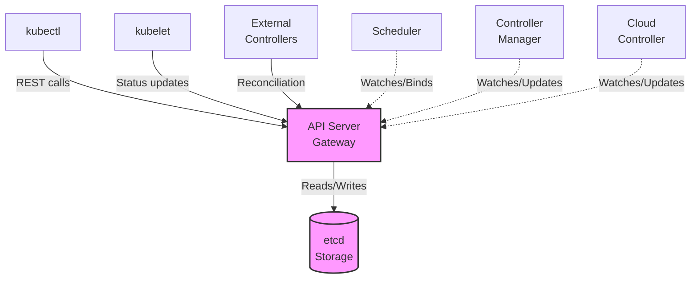
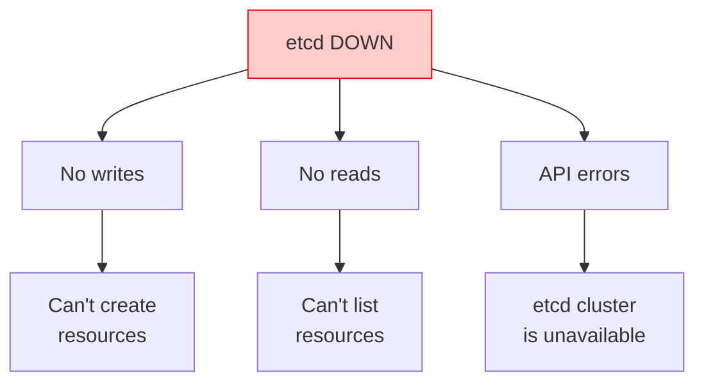
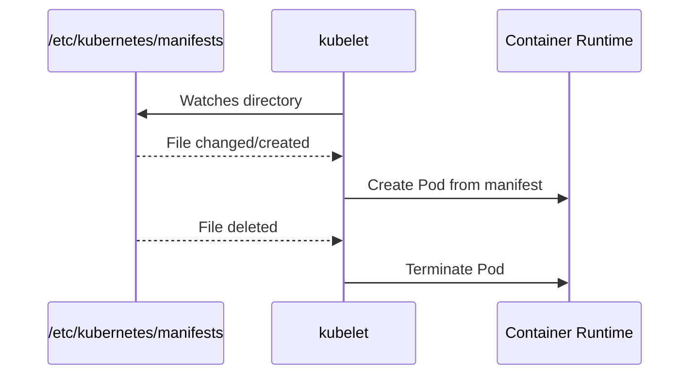

> **Complexity**: `[COMPLEX]` - Critical infrastructure troubleshooting
>
> **Time to Complete**: 50-60 minutes
>
> **Prerequisites**: Module 5.1 (Methodology), Module 1.1 (Control Plane Deep-Dive)

---

## What You'll Be Able to Do

After completing this module, you will transition from basic debugging to advanced cluster rescue operations. Specifically, you will be able to:
- **Diagnose** complex control plane failures by cross-referencing static pod manifests, container runtime events, and kubelet logs.
- **Implement** restorative actions for critical components including etcd quorum loss, API server certificate expiration, and scheduler crashes.
- **Evaluate** the systemic impact of specific component failures to rapidly isolate the root cause of cluster-wide freezes.
- **Design** safe troubleshooting workflows that preserve forensic evidence while returning the cluster to a healthy state.

---

## Why This Module Matters

When the control plane fails, your entire platform teeters on the edge of catastrophe. The API server down means zero visibility and zero control. The scheduler down means auto-scaling is dead in the water. The controller manager down means self-healing mechanisms cease to exist. These are the most critical, high-pressure incidents an infrastructure engineer will face, and the mean time to recovery directly impacts business survival.

Consider the highly publicized outage of a major global retailer in May 2018. During a critical promotional event, their primary Kubernetes clusters went entirely dark. No deployments could roll out, no crashed pods were replaced, and the engineering team lost all `kubectl` access. The root cause? A control plane certificate had expired exactly 365 days after initial cluster bootstrapping. The API server static pods failed to start, causing a complete management plane blackout.

This single failure caused an estimated $12 million in lost transaction revenue over an eight-hour recovery window. If the engineers had known how to manually verify static pod logs using `crictl` and immediately renew certificates via `kubeadm`, the downtime could have been restricted to fifteen minutes. Mastery of control plane troubleshooting separates the novice operators from the true Kubernetes experts.

> **The Air Traffic Control Analogy**
>
> The control plane is exactly like air traffic control for your cluster. The API server is the radio tower; if it goes down, absolutely no communication occurs. The scheduler is the flight planner; without it, new flights (pods) cannot take off and remain stranded at the gate. The controller manager is the monitoring system; it ensures all planes follow their assigned routes and handles emergencies. Finally, etcd is the flight record database; if it corrupts, the entire airport forgets what planes exist. When any of these systems fail, you must act decisively.

---

## Did You Know?

- **Static Pod Exclusivity**: In standard kubeadm deployments, control plane components do not run as standard deployments; they run as static pods managed directly by the local kubelet bypassing the scheduler entirely.
- **Certificate Default Lifespans**: By default, Kubernetes internal certificates generated by kubeadm are configured to expire in exactly 365 days, which is the most common cause of "sudden" control plane deaths on a cluster's first anniversary.
- **Port Allocations**: Since 2015, etcd has exclusively utilized port 2379 for client API requests and port 2380 for internal peer-to-peer cluster communication.
- **Data Capacity Limits**: A single etcd database cluster defaults to a maximum storage space quota of 2 gigabytes; if this limit is breached without compaction, the entire cluster enters a read-only state.

---

## Part 1: Control Plane Architecture Review

To effectively troubleshoot, you must first understand the architectural flow and dependencies. 

### 1.1 Component Dependencies

The control plane is not a monolith; it is a collection of highly interdependent microservices. The API server acts as the sole gateway. No other component speaks directly to the database (etcd). 

Here is the dynamic architectural flow:



For reference when viewing legacy terminal documentation, this relationship is often mapped conceptually as follows:

```text
┌──────────────────────────────────────────────────────────────┐
│                 CONTROL PLANE DEPENDENCIES                    │
│                                                               │
│                      ┌─────────────┐                         │
│                      │    etcd     │                         │
│                      │  (storage)  │                         │
│                      └──────┬──────┘                         │
│                             │                                │
│                             ▼                                │
│                      ┌─────────────┐                         │
│                      │ API Server  │◄──── kubectl            │
│                      │  (gateway)  │◄──── kubelet            │
│                      └──────┬──────┘◄──── controllers        │
│                             │                                │
│              ┌──────────────┼──────────────┐                 │
│              │              │              │                 │
│              ▼              ▼              ▼                 │
│       ┌───────────┐  ┌───────────┐  ┌───────────┐           │
│       │ Scheduler │  │ Controller│  │   Cloud   │           │
│       │           │  │  Manager  │  │ Controller│           │
│       └───────────┘  └───────────┘  └───────────┘           │
│                                                               │
│   If etcd fails     → Everything fails                       │
│   If API server     → Nothing can communicate                │
│   If scheduler      → New pods won't be scheduled            │
│   If controller-mgr → Resources won't reconcile              │
│                                                               │
└──────────────────────────────────────────────────────────────┘
```

### 1.2 Static Pods Overview

The core components are deployed as static pods. The local kubelet daemon constantly monitors a specific directory on the host machine. 

```bash
# Static pod manifest location
/etc/kubernetes/manifests/
├── etcd.yaml
├── kube-apiserver.yaml
├── kube-controller-manager.yaml
└── kube-scheduler.yaml

# kubelet watches this directory
# Changes to these files = automatic restart of component
```

### 1.3 Baseline Health Verification

Before diving into logs, always check the high-level status of the control plane. While the `componentstatuses` endpoint is deprecated, it is still occasionally used for rapid triage.

```bash
# Quick health check (deprecated but useful)
k get componentstatuses

# Check control plane pods
k -n kube-system get pods | grep -E 'etcd|api|controller|scheduler'

# Verify all components are running
k -n kube-system get pods -o wide | grep -E 'kube-'
```

---

## Part 2: API Server Troubleshooting

The API server is the heart of the cluster. If it fails, `kubectl` becomes useless, and you must rely on node-level tools like `crictl` and `journalctl`.

### 2.1 Failure Symptoms

When the API server experiences degradation, the symptoms are immediate and severe. 

```text
┌──────────────────────────────────────────────────────────────┐
│                API SERVER FAILURE SYMPTOMS                    │
│                                                               │
│   Symptom                        Indicates                    │
│   ─────────────────────────────────────────────────────────  │
│   kubectl hangs/times out        API server unreachable       │
│   "connection refused"           API server not listening     │
│   "unable to connect to server"  Network/firewall issue       │
│   "Unauthorized"                 Auth/cert issue              │
│   "etcd cluster is unavailable"  API can't reach etcd         │
│   Very slow responses            Overloaded or etcd slow      │
│                                                               │
└──────────────────────────────────────────────────────────────┘
```

> **Stop and think**: If your API server is down, how will you find out *why* it is down if you cannot run `kubectl logs`? You must SSH into the control plane node and use the container runtime interface.

### 2.2 Diagnosing Issues at the Node Level

**Step 1: Check if the API server pod is running**
```bash
# From a control plane node
crictl ps | grep kube-apiserver

# Or check static pod status
ls -la /etc/kubernetes/manifests/kube-apiserver.yaml
```

If it is not in the running list, check if it recently crashed:
```bash
crictl ps -a | grep kube-apiserver  # See if it exists but stopped
journalctl -u kubelet | grep apiserver  # Check kubelet logs
```

**Step 2: Inspecting the logs natively**
```bash
# If running as pod
k -n kube-system logs kube-apiserver-<node>

# If pod is down, use crictl
crictl logs $(crictl ps -a | grep apiserver | awk '{print $1}')

# Or check kubelet logs for why it's not starting
journalctl -u kubelet | grep apiserver
```

Sometimes, `crictl` will show you multiple stopped containers. Just grab the latest one:
```bash
crictl ps | grep kube-apiserver
```

**Step 3: Validating Cryptographic Health**
Certificate issues are the number one cause of API failures.
```bash
# Verify certificates
openssl x509 -in /etc/kubernetes/pki/apiserver.crt -text -noout | grep -A 2 "Validity"

# Check if certs are expired
kubeadm certs check-expiration
```

### 2.3 Remediation Workflows

Here is a mapping of common API server issues and their respective fixes:

| Issue | Symptom | Fix |
|-------|---------|-----|
| Certificate expired | "x509: certificate has expired" | `kubeadm certs renew all` |
| etcd unreachable | "etcd cluster is unavailable" | Check etcd health, fix etcd |
| Wrong etcd endpoints | Startup failure | Check `--etcd-servers` in manifest |
| Port conflict | "bind: address already in use" | Find and kill conflicting process |
| Out of memory | OOMKilled, slow responses | Increase node resources |
| Incorrect flags | Won't start | Check manifest YAML syntax |

If certificates are the culprit, execution is straightforward:
```bash
# Check certificate status
kubeadm certs check-expiration

# Renew all certificates
kubeadm certs renew all

# Restart control plane pods
# kubelet automatically restarts static pods when manifests change
```

If the manifest configuration is damaged, you must edit it directly. The local kubelet will instantly notice the file hash change and restart the container.
```bash
# Edit static pod manifest
sudo vim /etc/kubernetes/manifests/kube-apiserver.yaml

# Common fixes:
# - Fix typos in flags
# - Correct certificate paths
# - Fix etcd endpoints

# kubelet automatically detects changes and restarts the pod
```

---

## Part 3: Scheduler Troubleshooting

The scheduler's only job is finding a suitable home for incoming pods. When it breaks, your existing infrastructure hums along perfectly, but scaling up becomes impossible.

### 3.1 Failure Symptoms

```text
┌──────────────────────────────────────────────────────────────┐
│               SCHEDULER FAILURE SYMPTOMS                      │
│                                                               │
│   Symptom                           Check                     │
│   ─────────────────────────────────────────────────────────  │
│   All new pods stuck Pending        Scheduler not running     │
│   "no nodes available to schedule"  All nodes unschedulable   │
│   Pods not being distributed        Scheduler misconfigured   │
│   Very slow scheduling              Scheduler overloaded      │
│                                                               │
│   Remember: Existing pods keep running when scheduler fails!  │
│   Only NEW pods are affected.                                 │
│                                                               │
└──────────────────────────────────────────────────────────────┘
```

### 3.2 Diagnosing Placement Issues

You can trace scheduling logic by looking at cluster events.
```bash
# Check scheduler pod status
k -n kube-system get pod -l component=kube-scheduler

# Check scheduler logs
k -n kube-system logs kube-scheduler-<node>

# Check for scheduling events
k get events -A --field-selector reason=FailedScheduling

# Describe pending pod for scheduling failure reason
k describe pod <pending-pod> | grep -A 10 Events
```

| Issue | Symptom | Fix |
|-------|---------|-----|
| Scheduler not running | All new pods Pending | Check static pod manifest |
| Can't connect to API | "connection refused" | Check kubeconfig, certs |
| Leader election failed | Scheduler not active | Check `--leader-elect` flag |
| No nodes available | Scheduling failures | Check node taints, resources |

### 3.3 Fixing the Scheduler

Usually, scheduler failures stem from a corrupted kubeconfig path or invalid YAML indentation in the manifest.
```bash
# Check manifest exists
cat /etc/kubernetes/manifests/kube-scheduler.yaml

# Check for YAML errors
cat /etc/kubernetes/manifests/kube-scheduler.yaml | python3 -c "import yaml,sys; yaml.safe_load(sys.stdin)"

# Common fixes in manifest:
# --kubeconfig=/etc/kubernetes/scheduler.conf
# --leader-elect=true

# Verify kubeconfig exists
ls -la /etc/kubernetes/scheduler.conf
```

**War Story Incident:** If you face a severe outage and cannot wait for the scheduler pod to recover, you can perform manual scheduling by directly mutating the `nodeName` field. This bypasses the scheduler entirely.
```bash
# If scheduler is down, you can manually schedule pods
k patch pod <pod> -p '{"spec":{"nodeName":"worker-1"}}'
```

---

## Part 4: Controller Manager Troubleshooting

The controller manager contains dozens of individual control loops (ReplicaSet, Node, Endpoints). If it dies, the cluster loses its ability to self-heal.

### 4.1 Failure Symptoms

```text
┌──────────────────────────────────────────────────────────────┐
│            CONTROLLER MANAGER FAILURE SYMPTOMS                │
│                                                               │
│   Symptom                           Affected Controller       │
│   ─────────────────────────────────────────────────────────  │
│   Pods not created from Deployment  ReplicaSet controller     │
│   Deleted pods not replaced         ReplicaSet controller     │
│   PVCs stay Pending                 PV controller             │
│   Services have no endpoints        Endpoints controller      │
│   Nodes stay NotReady forever       Node controller           │
│   Jobs don't complete               Job controller            │
│   No automatic cleanup              GC controller             │
│                                                               │
│   The cluster "freezes" in current state - no reconciliation │
│                                                               │
└──────────────────────────────────────────────────────────────┘
```

### 4.2 Diagnostic Workflow

First, verify if the pod is crash-looping or throwing fatal authentication errors.
```bash
# Check controller manager pod
k -n kube-system get pod -l component=kube-controller-manager

# Check logs
k -n kube-system logs kube-controller-manager-<node>

# Check for specific controller issues
k -n kube-system logs kube-controller-manager-<node> | grep -i error

# Verify controllers are working
# Create a deployment and verify ReplicaSet is created
k create deployment test --image=nginx
k get rs | grep test
```

| Issue | Symptom | Fix |
|-------|---------|-----|
| Not running | No reconciliation | Check static pod manifest |
| Service account missing | Can't create pods | Check service-account-private-key-file |
| Can't connect to API | All controllers fail | Check kubeconfig path |
| Cluster-signing-cert missing | CSR not approved | Check cert paths in manifest |

### 4.3 Correcting Configurations

The controller manager requires access to multiple certificates to sign tokens and communicate with the API. A simple typo in the volume mounts can cause permanent failure.
```bash
# Check manifest
cat /etc/kubernetes/manifests/kube-controller-manager.yaml

# Key flags to verify:
# --kubeconfig=/etc/kubernetes/controller-manager.conf
# --service-account-private-key-file=/etc/kubernetes/pki/sa.key
# --cluster-signing-cert-file=/etc/kubernetes/pki/ca.crt
# --root-ca-file=/etc/kubernetes/pki/ca.crt

# Verify files exist
ls -la /etc/kubernetes/pki/
```

---

## Part 5: etcd Troubleshooting

If etcd is corrupted, you have no cluster. All states, secrets, and configurations live here.

### 5.1 Systemic Impact



*Legacy Terminal View:*
```text
┌──────────────────────────────────────────────────────────────┐
│                   ETCD FAILURE IMPACT                         │
│                                                               │
│   ┌─────────────────────────────────────────────────────┐    │
│   │                    etcd DOWN                         │    │
│   └────────────────────────┬────────────────────────────┘    │
│                            │                                  │
│              ┌─────────────┼─────────────┐                   │
│              ▼             ▼             ▼                   │
│         No writes      No reads     API errors               │
│              │             │             │                   │
│              ▼             ▼             ▼                   │
│         Can't create   Can't list  "etcd cluster            │
│         resources      resources    is unavailable"          │
│                                                               │
│   Note: Existing pods keep running (kubelet is independent)  │
│   But no new changes can be made to the cluster              │
│                                                               │
└──────────────────────────────────────────────────────────────┘
```

### 5.2 Diagnosing Quorum Health

Because etcd is highly secure, you must pass full cryptographic credentials to use its native command-line tool, `etcdctl`.

```bash
# Check etcd pod status
k -n kube-system get pod -l component=etcd

# Check etcd logs
k -n kube-system logs etcd-<node>

# Check etcd health with etcdctl
ETCDCTL_API=3 etcdctl \
  --endpoints=https://127.0.0.1:2379 \
  --cacert=/etc/kubernetes/pki/etcd/ca.crt \
  --cert=/etc/kubernetes/pki/etcd/server.crt \
  --key=/etc/kubernetes/pki/etcd/server.key \
  endpoint health

# Check etcd member list
ETCDCTL_API=3 etcdctl \
  --endpoints=https://127.0.0.1:2379 \
  --cacert=/etc/kubernetes/pki/etcd/ca.crt \
  --cert=/etc/kubernetes/pki/etcd/server.crt \
  --key=/etc/kubernetes/pki/etcd/server.key \
  member list
```

Here is a duplicate of the health command that you should drill into memory, as it is tested heavily:
```bash
ETCDCTL_API=3 etcdctl endpoint health \
  --endpoints=https://127.0.0.1:2379 \
  --cacert=/etc/kubernetes/pki/etcd/ca.crt \
  --cert=/etc/kubernetes/pki/etcd/server.crt \
  --key=/etc/kubernetes/pki/etcd/server.key
```

If you have environment variables set up previously in your shell profile, you can simplify this drastically:
```bash
etcdctl endpoint health
```

| Issue | Symptom | Fix |
|-------|---------|-----|
| Data directory corrupt | Won't start | Restore from backup |
| Certificate expired | TLS errors | Renew certificates |
| Disk full | Write failures | Free disk space |
| Member not reachable | Cluster unhealthy | Check network, restart member |
| Clock skew | Raft failures | Sync NTP |

### 5.3 Backup and Restore Procedures

Taking snapshots safely prevents total data loss.

```bash
ETCDCTL_API=3 etcdctl snapshot save /tmp/etcd-backup.db \
  --endpoints=https://127.0.0.1:2379 \
  --cacert=/etc/kubernetes/pki/etcd/ca.crt \
  --cert=/etc/kubernetes/pki/etcd/server.crt \
  --key=/etc/kubernetes/pki/etcd/server.key

# Verify backup
ETCDCTL_API=3 etcdctl snapshot status /tmp/etcd-backup.db
```

To restore from a snapshot, you must prevent the API server from writing new data during the process.
```bash
# Stop API server first
mv /etc/kubernetes/manifests/kube-apiserver.yaml /tmp/

# Restore snapshot
ETCDCTL_API=3 etcdctl snapshot restore /tmp/etcd-backup.db \
  --data-dir=/var/lib/etcd-restored

# Update etcd manifest to use new data dir
# Move API server manifest back
```

---

## Part 6: Static Pod Troubleshooting Deep Dive

To master control plane restoration, you must intimately understand the static pod lifecycle.

### 6.1 How Static Pods Work



*Legacy Terminal View:*
```text
┌──────────────────────────────────────────────────────────────┐
│                    STATIC POD LIFECYCLE                       │
│                                                               │
│   /etc/kubernetes/manifests/           kubelet               │
│   ┌───────────────────────┐           ┌──────────────────┐  │
│   │ kube-apiserver.yaml   │◄─ watch ──│                  │  │
│   │ kube-scheduler.yaml   │           │  Creates pods    │  │
│   │ controller-manager... │──────────▶│  from manifests  │  │
│   │ etcd.yaml             │           │                  │  │
│   └───────────────────────┘           └──────────────────┘  │
│                                              │               │
│   File changed/created ─────────────────────▶│               │
│   File deleted ─────────────────────────────▶│               │
│                                              ▼               │
│                                     Pod created/deleted      │
│                                                               │
│   Naming: <name>-<node-name> (e.g., kube-apiserver-master)  │
│                                                               │
└──────────────────────────────────────────────────────────────┘
```

> **Pause and predict**: If you edit a live pod via `kubectl edit pod kube-apiserver-master -n kube-system`, what will happen when the node reboots? The changes will be destroyed because the source of truth is the manifest file on disk, not the API database.

### 6.2 Validating the Kubelet Engine

If you place a manifest in the directory and nothing happens, the kubelet might be configured to look elsewhere, or the YAML is broken.
```bash
# Check kubelet is configured to watch manifests dir
cat /var/lib/kubelet/config.yaml | grep staticPodPath

# Check manifest syntax
cat /etc/kubernetes/manifests/kube-apiserver.yaml | head -20

# Common issues:
# - YAML syntax errors (tabs instead of spaces)
# - Wrong file extension (must be .yaml or .yml)
# - Wrong file permissions (must be readable)
# - Missing required fields
```

### 6.3 Lower-Level Debugging

When `kubectl` fails, `journalctl` is your best friend.
```bash
# If static pod won't start, check kubelet logs
journalctl -u kubelet -f

# Look for errors about specific manifest
journalctl -u kubelet | grep -i "kube-apiserver\|error\|failed"

# Check if container exists but unhealthy
crictl ps -a | grep kube-

# Get container logs directly
crictl logs <container-id>
```

---

## Common Mistakes

When stress levels are high, engineers frequently make these critical errors:

| Mistake | Problem | Solution |
|---------|---------|----------|
| Editing pods instead of manifests | Changes lost on restart | Edit `/etc/kubernetes/manifests/` files |
| Using kubectl when API is down | Commands fail | Use crictl for container management |
| Not checking kubelet logs | Miss root cause | Always check `journalctl -u kubelet` |
| Forgetting cert dependencies | Components can't communicate | Verify all cert paths exist |
| Not checking etcd first | Miss storage-level issues | etcd problems affect everything |
| Restarting before diagnosing | Lose evidence | Gather logs first, then restart |
| Assuming API server holds state | Wasting time backing up API pods | Always target etcd for backups; API is stateless |

---

## Quiz

Evaluate your deep understanding of control plane mechanisms with these scenario-based challenges.

### Q1: API Silence Scenario
You are paged at 2:00 AM. `kubectl get nodes` returns a "connection refused" error. You SSH into the master node. What is your very first diagnostic action to isolate the failure layer?

<details>
<summary>[QUIZ-1] Answer</summary>
You must verify if the API server container is actively running using the local container runtime interface. Run `crictl ps | grep kube-apiserver`. If it is missing from the active list, you immediately know the pod has crashed and should proceed to check `journalctl -u kubelet` to find out why the kubelet cannot start the static manifest.
</details>

### Q2: The Phantom Replicas
A developer complains that they deleted several crashing pods in their namespace, but no new pods are spinning up to replace them. The Deployment resource shows 5 desired replicas, but only 2 currently exist. The API server is fully responsive. Diagnose the failing component.

<details>
<summary>[QUIZ-2] Answer</summary>
The Controller Manager is failing or dead. The API server is responsive (hence you can query the Deployment), but the reconciliation loop responsible for noticing the discrepancy between desired state (5) and actual state (2) is broken. The ReplicaSet controller lives inside the `kube-controller-manager` pod, which needs immediate inspection.
</details>

### Q3: Permanent Pending State
You successfully deploy a new DaemonSet. You can see the pods created via `kubectl get pods`, but they are all stuck in a `Pending` state indefinitely. The cluster has plenty of CPU and memory available. Which control plane component requires investigation?

<details>
<summary>[QUIZ-3] Answer</summary>
The Scheduler is failing or crashed. When a pod is created via the API, it enters the `Pending` state by default. It is the sole responsibility of the `kube-scheduler` to evaluate node resources, assign a `nodeName` to the pod specification, and update the API. If the scheduler is dead, pods remain pending forever, even if resources are abundant.
</details>

### Q4: Storage Layer Validation
During a major cluster upgrade, the API server begins throwing intermittent "etcd cluster is unavailable" errors. You need to verify the cryptographically secure health of the database layer. Implement the exact command string required.

<details>
<summary>[QUIZ-4] Answer</summary>
You must invoke the etcdctl tool while passing the correct PKI paths for authentication. The command is:
```bash
ETCDCTL_API=3 etcdctl endpoint health \
  --endpoints=https://127.0.0.1:2379 \
  --cacert=/etc/kubernetes/pki/etcd/ca.crt \
  --cert=/etc/kubernetes/pki/etcd/server.crt \
  --key=/etc/kubernetes/pki/etcd/server.key
```
This bypasses the API server entirely and queries the storage layer directly.
</details>

### Q5: Anniversary Outage
Exactly one year after bootstrapping a new production cluster, the entire control plane drops offline simultaneously. No configuration changes were made. Diagnose the root cause and identify the remediation command.

<details>
<summary>[QUIZ-5] Answer</summary>
The internal TLS certificates generated by kubeadm have hit their default 365-day expiration limit. All components instantly lose the ability to mutually authenticate, causing systemic collapse. You must run `kubeadm certs renew all` on the control plane nodes, then wait for the kubelet to restart the static pods with the fresh certificates.
</details>

### Q6: The Restart Fallacy
A junior engineer notices the scheduler pod is failing to elect a leader. They immediately run `kubectl delete pod -n kube-system kube-scheduler-master` hoping it will restart and fix itself. Evaluate why this action is ineffective and what will actually happen.

<details>
<summary>[QUIZ-6] Answer</summary>
Deleting a static pod via the API server is an illusion. The API server will mark it for deletion, but the local kubelet is the ultimate source of truth because it is watching the physical YAML file in `/etc/kubernetes/manifests/`. The kubelet will instantly notice the pod is gone and recreate it using the exact same broken configuration from the disk, solving nothing while erasing the old container logs.
</details>

---

## Hands-On Exercise: Control Plane Troubleshooting

### Scenario

You have been granted access to a sandbox cluster. Your objective is to practice diagnosing and intentionally manipulating control plane components to observe failure modes firsthand.

### Prerequisites

This exercise requires a kubeadm-based cluster with SSH access to control plane nodes.

### Setup

Log in to the primary management node to begin your forensics.
```bash
# Verify you have control plane access
ssh <control-plane-node>
sudo ls /etc/kubernetes/manifests/
```

### Task 1: Explore Control Plane Components

Examine the physical files that dictate the control plane's existence.
```bash
# List all static pod manifests
ls -la /etc/kubernetes/manifests/

# Check current control plane pod status
k -n kube-system get pods | grep -E 'etcd|api|scheduler|controller'

# View API server configuration
cat /etc/kubernetes/manifests/kube-apiserver.yaml | grep -A 5 "command:"
```

### Task 2: Validate Cryptographic Health

Check the expiration dates of the core certificates to ensure the cluster isn't a ticking time bomb.
```bash
# Use kubeadm to check all certificates
sudo kubeadm certs check-expiration

# Manually check a specific certificate
sudo openssl x509 -in /etc/kubernetes/pki/apiserver.crt -text -noout | grep -A 2 Validity
```

### Task 3: Check etcd Health

Configure an alias to make interacting with the secure database easier, then interrogate its status.
```bash
# Use etcdctl to check health
# First, set up an alias for convenience
alias etcdctl='ETCDCTL_API=3 etcdctl --endpoints=https://127.0.0.1:2379 --cacert=/etc/kubernetes/pki/etcd/ca.crt --cert=/etc/kubernetes/pki/etcd/server.crt --key=/etc/kubernetes/pki/etcd/server.key'

# Check health
etcdctl endpoint health

# Check member list
etcdctl member list

# Check cluster status
etcdctl endpoint status --write-out=table
```

### Task 4: Simulate Scheduler Failure (Careful!)

We will intentionally break the scheduler to observe the exact symptoms when attempting to deploy workloads.

```bash
# First, note a pending pod's behavior
k run test-scheduler --image=nginx
k get pods test-scheduler

# Temporarily rename scheduler manifest (this stops it)
sudo mv /etc/kubernetes/manifests/kube-scheduler.yaml /tmp/

# Wait 30 seconds, try to create another pod
sleep 30
k run test-scheduler-2 --image=nginx

# Check status - should be Pending
k get pods test-scheduler-2
k describe pod test-scheduler-2 | grep -A 5 Events

# Restore scheduler
sudo mv /tmp/kube-scheduler.yaml /etc/kubernetes/manifests/

# Wait for scheduler to restart
sleep 30
k get pods -w
```

### Cleanup

Remove the test artifacts to return the environment to a clean state.
```bash
k delete pod test-scheduler test-scheduler-2
```

### Success Criteria

- [ ] Listed all static pod manifests physically residing on disk.
- [ ] Verified etcd health using strict PKI authentication flags.
- [ ] Successfully simulated and observed a scheduler outage.
- [ ] Verified certificate expiration horizons using kubeadm.

---

## Practice Drills: Rapid Incident Response

When the pager goes off, muscle memory saves time. Use these rapid-fire drills to memorize the exact commands needed to diagnose different layers of the control plane stack.

### Drill 1: Control Plane Pod Status (30 sec)
Objective: Quickly isolate which major component is crashing from a high level.
```bash
# Task: Show all control plane pods status
k -n kube-system get pods | grep -E 'etcd|api|scheduler|controller'
```

### Drill 2: Check Component Logs (1 min)
Objective: Extract the immediate failure reason from a looping container.
```bash
# Task: View last 50 lines of API server logs
k -n kube-system logs kube-apiserver-<node> --tail=50
```

### Drill 3: Static Pod Manifest Check (30 sec)
Objective: Inspect the configuration source-of-truth for typos or bad flags.
```bash
# Task: View scheduler configuration
cat /etc/kubernetes/manifests/kube-scheduler.yaml
```

### Drill 4: Deep etcd Health Verification (1 min)
Objective: Bypass the API completely and ensure the storage quorum is intact.
```bash
# Task: Check etcd endpoint health
ETCDCTL_API=3 etcdctl endpoint health \
  --endpoints=https://127.0.0.1:2379 \
  --cacert=/etc/kubernetes/pki/etcd/ca.crt \
  --cert=/etc/kubernetes/pki/etcd/server.crt \
  --key=/etc/kubernetes/pki/etcd/server.key
```

### Drill 5: Preventative Certificate Maintenance (30 sec)
Objective: Audit the cluster for impending cryptographic doom.
```bash
# Task: Check all certificate expiration dates
kubeadm certs check-expiration
```

### Drill 6: The Kubelet Engine Logs (1 min)
Objective: Discover why a static pod manifest is being rejected by the local node daemon.
```bash
# Task: Check kubelet logs for control plane errors
journalctl -u kubelet --since "10 minutes ago" | grep -i "error\|failed"
```

### Drill 7: Container Runtime Forensics (30 sec)
Objective: Check the actual running processes when `kubectl` is completely unresponsive.
```bash
# Task: List all control plane containers
crictl ps | grep kube
```

### Drill 8: API Server Network Test (30 sec)
Objective: Verify if the API server is rejecting traffic at the network/socket level.
```bash
# Task: Test API server endpoint
curl -k https://localhost:6443/healthz
```

---

## Next Module

Now that you can resurrect a dead control plane, it is time to look at the other half of the cluster architecture. Continue to [Module 5.4: Worker Node Failures](../module-5.4-worker-nodes/) to learn how to diagnose and resolve massive node evictions, container runtime crashes, and kubelet communication blackouts.