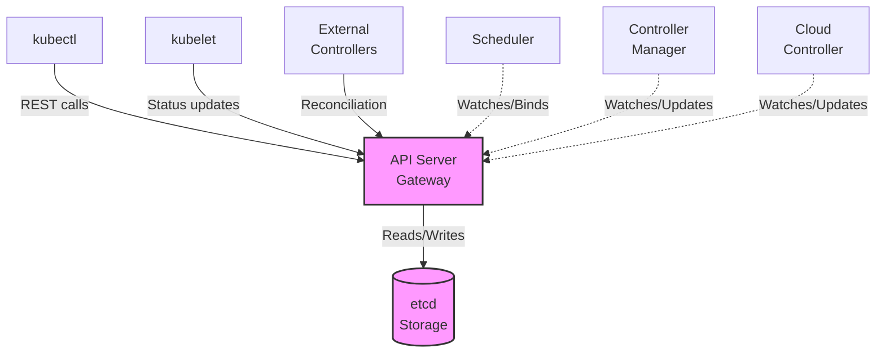
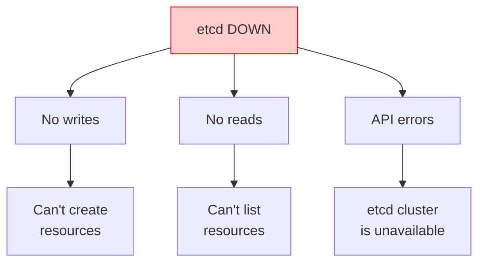
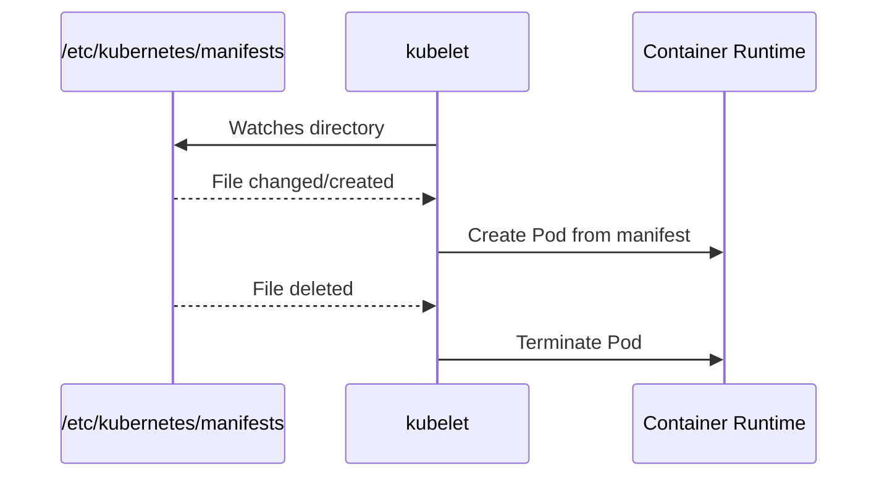

> **Complexity**: `[COMPLEX]` - Critical infrastructure troubleshooting
>
> **Time to Complete**: 50-60 minutes
>
> **Prerequisites**: Module 5.1 (Methodology), Module 1.1 (Control Plane Deep-Dive)

---

## What You'll Be Able to Do

After completing this module, you will be able to move from ordinary workload debugging into cluster rescue work where the API may be slow, unavailable, or misleading. The goal is not to memorize a pile of commands; it is to diagnose the failing layer, choose the least destructive next action, and protect evidence while you bring the Kubernetes 1.35 control plane back to a trustworthy state.

- **Diagnose API server and static pod failures** by cross-referencing manifests, container runtime state, and kubelet journal evidence.
- **Implement certificate and manifest recovery** for kubeadm-managed control plane components without relying on fragile shell aliases.
- **Evaluate etcd quorum and storage health** before restarting stateless components that only report the downstream failure.
- **Design recovery workflows** that preserve forensic evidence, isolate blast radius, and restore scheduling and reconciliation safely.

## Why This Module Matters

Hypothetical scenario: your on-call rotation receives a cluster-wide page because `kubectl get nodes` hangs, new deployments are not rolling out, and the application team is asking whether they should restart every workload. A rushed operator might keep deleting pods, reboot worker nodes, or restart random system services because those actions feel active under pressure. A disciplined control plane responder first asks which component is failing, which dependencies still work, and which evidence will disappear if they restart the wrong thing.

The Kubernetes control plane is the management nervous system for the cluster. The API server is the front desk where every legitimate request is authenticated, authorized, validated, and recorded. The scheduler assigns newly created pods to nodes, the controller manager drives reconciliation loops, and etcd stores the durable truth that all of those components coordinate around. When one piece fails, the symptoms can look similar from a distance, so your first responsibility is to separate "the cluster cannot accept requests" from "the cluster accepts requests but cannot schedule" and from "the cluster accepts requests but cannot reconcile desired state."

This module teaches that separation through the same assets you will use during a real incident: static pod manifests under `/etc/kubernetes/manifests`, the kubelet journal, CRI-level inspection with `crictl`, kubeadm certificate tooling, API health endpoints, and native etcd commands. You will see why existing workloads often keep running even while control plane writes are frozen, why deleting a static pod usually does not fix a broken manifest, and why API server logs that say `etcd cluster is unavailable` point you toward storage rather than toward a bigger API server restart.

> **The Air Traffic Control Analogy**
>
> The control plane is exactly like air traffic control for your cluster. The API server is the central radio tower; if it goes down, communication between pilots and ground crew stops. The scheduler is the flight planner; without it, new flights cannot be assigned a runway and remain stranded at the gate. The controller manager is the automated monitoring system; it keeps aircraft following assigned routes and notices when expected movement has stopped. Finally, etcd is the authoritative flight record database; if it corrupts or loses quorum, the airport may still have aircraft on runways, but the tower no longer has a reliable operational record.

## Control Plane Dependency Map

Control plane troubleshooting starts with dependency order, not with the loudest error message. Kubernetes deliberately makes the API server the only supported gateway to etcd for normal clients and controllers, which means `kubectl`, kubelets, schedulers, controller managers, cloud controllers, and extension controllers all converge on the same API surface. That design gives Kubernetes a consistent authorization and admission path, but it also means a storage or certificate failure can appear as an API outage from the user side.

In kubeadm-style clusters, the core control plane components are static pods supervised by the local kubelet on each control plane node. That detail matters during outages because the API server does not need to be healthy for the kubelet to read files from disk and start containers. It also means the source of truth for many emergency fixes is the host filesystem, not an object returned by `kubectl edit`, and your recovery workflow must include local node access.



The diagram shows why a simple "control plane is down" statement is too vague to be useful. If etcd is unhealthy, the API server cannot reliably read or write state, and every higher-level controller eventually feels the pain. If the API server is down while etcd is healthy, controllers and users cannot reach the gateway, but local runtime inspection can still tell you whether static pods are running. If the scheduler is down, existing pods continue running because kubelets already have their assignments, while new pods remain pending until scheduling resumes.

That distinction also explains why users can report contradictory symptoms during the same incident. One team may say their application is still serving traffic, another may say their rollout is frozen, and a platform engineer may see `kubectl` timing out from a laptop. Those reports are not mutually exclusive. Existing containers continue doing work because kubelets and container runtimes do not need a constant API connection for every CPU cycle, while new desired-state changes need the control plane to accept, store, schedule, and reconcile them.

When you interview the cluster during an outage, ask questions in dependency order. Can the API server answer a cheap health request? Can it read and write through etcd? Can the scheduler observe unscheduled pods and bind them? Can the controller manager create the secondary objects that desired state requires? Each answer narrows the search space, and each "no" tells you which commands still have value. A failed API query does not make scheduler events useful, while a healthy API with pending pods makes scheduler events extremely useful.

```text
┌──────────────────────────────────────────────────────────────┐
│                 CONTROL PLANE DEPENDENCIES                   │
│                                                              │
│                      ┌─────────────┐                         │
│                      │    etcd     │                         │
│                      │  (storage)  │                         │
│                      └──────┬──────┘                         │
│                             │                                │
│                             ▼                                │
│                      ┌─────────────┐                         │
│                      │ API Server  │◄──── kubectl            │
│                      │  (gateway)  │◄──── kubelet            │
│                      └──────┬──────┘◄──── controllers        │
│                             │                                │
│              ┌──────────────┼──────────────┐                 │
│              │              │              │                 │
│              ▼              ▼              ▼                 │
│       ┌───────────┐  ┌───────────┐  ┌───────────┐           │
│       │ Scheduler │  │ Controller│  │   Cloud   │           │
│       │           │  │  Manager  │  │ Controller│           │
│       └───────────┘  └───────────┘  └───────────┘           │
│                                                              │
│   If etcd fails     -> Everything that needs state fails     │
│   If API server     -> Nothing can communicate through API   │
│   If scheduler      -> New pods will not be scheduled        │
│   If controller-mgr -> Resources will not reconcile          │
│                                                              │
└──────────────────────────────────────────────────────────────┘
```

Static pod supervision is the practical bridge between architecture and recovery. The kubelet watches a configured directory, reads pod manifests from disk, and asks the local container runtime to create the control plane containers. If a manifest is moved away, the kubelet stops the static pod; if a corrected manifest returns, the kubelet starts it again. That behavior is useful, but it is unforgiving: a YAML indentation error, wrong certificate path, or misspelled flag can keep the component in a crash loop until the file is corrected.

Static pods also create a useful mental boundary between "Kubernetes object" and "node-local instruction." The mirrored pod object shown by the API is a report from the kubelet, not the primary configuration. If you delete that mirrored pod, kubelet notices that its local manifest still exists and asks the runtime to create the pod again. If you edit the disk manifest, kubelet changes the real instruction. That is why control plane repair usually involves SSH, root privileges, and disciplined file handling rather than only API operations.

```bash
# Static pod manifest location
/etc/kubernetes/manifests/
├── etcd.yaml
├── kube-apiserver.yaml
├── kube-controller-manager.yaml
└── kube-scheduler.yaml

# kubelet watches this directory
# Changes to these files = automatic restart of component
```

Before you dig through logs, establish a baseline with the least invasive checks available. In a healthy API path, `kubectl` can show whether the mirrored static pods appear in `kube-system`; in a broken API path, you should not waste minutes waiting for `kubectl` timeouts. The deprecated `componentstatuses` API still appears in older training material, but modern Kubernetes 1.35 troubleshooting should prefer pod status, component logs, `/readyz` and `/livez` endpoints, and direct node-level inspection when the API is unavailable.

Baseline checks are most valuable when you write down both the command and the interpretation. "API timeout from my laptop" could mean a local kubeconfig issue, a firewall problem, a load balancer problem, or a dead API server. "API timeout from a control plane node, no API server container in `crictl ps`, kubelet log shows bad certificate path" is a diagnosis. The second statement is slower by a minute, but it is dramatically safer because it identifies the component boundary and the first broken dependency.

```bash
# Quick legacy health check; deprecated and not sufficient by itself
kubectl get componentstatuses

# Check control plane pods through the API when the API is reachable
kubectl -n kube-system get pods | grep -E 'etcd|api|controller|scheduler'

# Verify all mirrored static pods are reporting from expected nodes
kubectl -n kube-system get pods -o wide | grep -E 'kube-'
```

Pause and predict: if `kubectl -n kube-system get pods` hangs, but `crictl ps` on the control plane node shows the API server container repeatedly restarting, which layer are you actually observing? You are no longer testing workload scheduling or controller reconciliation; you are testing whether the local kubelet can keep a static pod alive from its manifest and dependencies.

## Diagnosing API Server and Certificate Failures

The API server is the public gateway for Kubernetes state. It authenticates clients, applies authorization, runs admission plugins, validates objects, and persists accepted changes to etcd. When it is unavailable, `kubectl` becomes a symptom generator rather than a complete diagnostic tool, because the client can only tell you that the gateway did not answer. The next useful evidence usually comes from the control plane node itself.

It helps to think of the API server as a strict clerk rather than as the warehouse. The clerk checks identity, validates forms, applies policy, and records approved transactions in the warehouse, but the clerk does not personally hold the durable inventory. If the clerk cannot reach the warehouse, customers experience a front-desk failure even though the root problem is behind the desk. This analogy keeps you from overfitting on the first command that fails and pushes you to test whether the API process, its certificates, and its storage client are each healthy.

```text
┌──────────────────────────────────────────────────────────────┐
│                API SERVER FAILURE SYMPTOMS                   │
│                                                              │
│   Symptom                        Indicates                   │
│   ─────────────────────────────────────────────────────────  │
│   kubectl hangs/times out        API server unreachable      │
│   "connection refused"           API server not listening    │
│   "unable to connect to server"  Network/firewall issue      │
│   "Unauthorized"                 Auth/cert issue             │
│   "etcd cluster is unavailable"  API can't reach etcd        │
│   Very slow responses            Overloaded or etcd slow     │
│                                                              │
└──────────────────────────────────────────────────────────────┘
```

Treat API outage triage as a layer-by-layer reduction. First prove whether the process exists, then whether it is repeatedly crashing, then whether the kubelet rejects the manifest, then whether the process fails because of certificates, flags, ports, or etcd. This order protects time during an exam and protects evidence during an incident, because you inspect before you restart.

The most common mistake in this phase is treating all connection failures as equivalent. `connection refused` means something actively declined the TCP connection or nothing is listening where you expected. A TLS error means the process may be listening but trust failed. A timeout can mean routing, firewalling, overload, or a hung endpoint. Those differences change the next diagnostic step. Good responders read the exact error string aloud, then choose the command that tests the next smallest assumption.

```bash
# From a control plane node, check whether the static pod container is running.
sudo crictl ps | grep kube-apiserver

# Confirm the manifest exists at the expected kubeadm path.
sudo ls -la /etc/kubernetes/manifests/kube-apiserver.yaml
```

If the API server is not present in the running container list, widen the view to stopped containers and kubelet logs. A crash-looping API server may leave several recent container attempts behind, and those previous logs are often more useful than the current empty attempt. The kubelet journal explains manifest parsing errors, missing host paths, failed image pulls, and lifecycle failures that `kubectl logs` cannot show when the API is offline.

```bash
sudo crictl ps -a | grep kube-apiserver
sudo journalctl -u kubelet --since "20 minutes ago" | grep -i apiserver
```

When the pod exists, inspect logs through the most reliable path for the current failure mode. If the API is healthy enough, `kubectl logs` is convenient. If the API is not healthy, use `crictl logs` against the container ID so you are talking directly to the runtime. This is the difference between asking the front desk why the front desk is closed and walking into the server room to read the process output.

```bash
# If the API is reachable enough for Kubernetes logs.
kubectl -n kube-system logs kube-apiserver-<node>

# If the API is down, use the container runtime directly.
sudo crictl logs "$(sudo crictl ps -a | grep apiserver | awk 'NR==1 {print $1}')"

# Check kubelet's view of why the static pod is not starting.
sudo journalctl -u kubelet --since "20 minutes ago" | grep -i apiserver
```

Multiple stopped containers usually mean the kubelet is doing its job by retrying, while the component is rejecting its environment. In that situation, do not keep moving the manifest in and out of the directory hoping the next restart will be different. Capture the latest container ID, read the logs, and connect the error to a concrete dependency such as a certificate file, a bind address, an etcd endpoint, or a command-line flag.

This is where timestamps matter. A control plane node may have several failed API server containers from previous experiments, automated restarts, or another responder's actions. Always look for the newest relevant container attempt and correlate it with the kubelet journal window around the same time. If the container log says a certificate file cannot be read and the kubelet journal says a hostPath volume was mounted successfully, your next check is file existence and permissions inside the host path. If both logs are silent, the runtime or kubelet may be failing before the component process starts.

```bash
sudo crictl ps -a | grep kube-apiserver | head
```

Certificates deserve special attention because kubeadm-managed non-CA control plane certificates have short enough lifetimes to create predictable maintenance incidents. Mutual TLS is not decorative in Kubernetes; it is how the API server trusts kubelets, clients, and peer components. An expired API server serving certificate, client certificate, or etcd client certificate can make a previously stable control plane fail without any workload deployment or manifest change.

Certificate failures often feel mysterious because they can appear suddenly after months of normal operation. Nothing changed in Git, no one edited a manifest, and the same automation that worked yesterday now fails with `x509` errors. That is exactly why expiration checks belong in routine maintenance rather than only in incident response. During an outage, the certificate dates help you decide whether the failure is time-driven or whether the TLS error is caused by wrong file paths, wrong certificate authorities, or a component presenting the wrong identity.

```bash
# Inspect the API server certificate validity window.
sudo openssl x509 -in /etc/kubernetes/pki/apiserver.crt -text -noout | grep -A 2 "Validity"

# Let kubeadm summarize certificate expiration for the cluster.
sudo kubeadm certs check-expiration
```

Certificate remediation should be deliberate. `kubeadm certs renew all` can refresh kubeadm-managed certificates, but the renewed files are only useful after affected static pods restart and reload them. In an incident, record the expiration output first, renew only when certificate failure matches the symptoms, then watch the kubelet restart the relevant static pods rather than deleting mirrored pods through the API.

```bash
# Check certificate status before changing anything.
sudo kubeadm certs check-expiration

# Renew kubeadm-managed certificates when expiration is the verified fault.
sudo kubeadm certs renew all

# kubelet restarts static pods when their manifests are touched or components restart.
```

Manifest damage is the other common API server failure class. A human may edit the wrong flag, break a volume mount, point `--etcd-servers` at a dead endpoint, or leave a command line in a state that the binary rejects. Static pod manifests are ordinary YAML files, so your correction path is local and fast, but you should still make a timestamped copy before editing because the broken version is evidence.

The backup copy is not bureaucracy. It lets you compare the exact before-and-after change, revert if your hypothesis is wrong, and explain the incident later without relying on memory. If two engineers are responding together, one should own observation and notes while the other edits, because simultaneous edits to static pod manifests create confusing restart storms. A calm workflow is slower than frantic typing for the first minute and faster for every minute after that.

```bash
# Edit static pod manifest after taking a backup copy.
sudo cp /etc/kubernetes/manifests/kube-apiserver.yaml /tmp/kube-apiserver.yaml.before-fix
sudo vim /etc/kubernetes/manifests/kube-apiserver.yaml

# Common fixes:
# - Fix typos in flags.
# - Correct certificate paths.
# - Fix etcd endpoints.

# kubelet automatically detects changes and restarts the pod.
```

```yaml
apiVersion: v1
kind: Pod
metadata:
  name: kube-apiserver
  namespace: kube-system
spec:
  containers:
  - command:
    - kube-apiserver
    - --advertise-address=10.0.0.10
    - --etcd-servers=https://127.0.0.1:2379
    image: registry.k8s.io/kube-apiserver:v1.35.0
```

| Issue | Symptom | Fix |
|-------|---------|-----|
| Certificate expired | `x509: certificate has expired` | Run `kubeadm certs check-expiration`, renew verified expired certs, restart affected static pods |
| etcd unreachable | `etcd cluster is unavailable` | Check etcd health directly before changing API server flags |
| Wrong etcd endpoints | Startup failure or repeated backend errors | Check `--etcd-servers` in the API server manifest |
| Port conflict | `bind: address already in use` | Identify the process holding TCP 6443 before restarting services |
| Out of memory | OOMKilled or very slow responses | Preserve logs, check node pressure, then increase resources or reduce load |
| Incorrect flags | Component exits immediately | Compare manifest flags with the Kubernetes 1.35 component reference |

Before running the renewal or manifest edit commands, ask yourself which evidence would prove your hypothesis wrong. If certificate dates are still valid and the API server log says it cannot reach `127.0.0.1:2379`, renewing every certificate is not a careful fix; the better move is to interrogate etcd directly.

## Restoring Scheduling and Reconciliation

The scheduler and controller manager are easier to confuse than they should be because both failures often show up as application teams saying, "Kubernetes is not doing anything." The difference is precise. The scheduler assigns a node to newly created pods, while the controller manager creates and updates objects so actual state converges on desired state. If pods are created but never assigned, think scheduler; if expected pods or endpoints are not created at all, think controller manager.

```text
┌──────────────────────────────────────────────────────────────┐
│               SCHEDULER FAILURE SYMPTOMS                     │
│                                                              │
│   Symptom                           Check                    │
│   ─────────────────────────────────────────────────────────  │
│   All new pods stuck Pending        Scheduler not running    │
│   "no nodes available to schedule"  All nodes unschedulable  │
│   Pods not being distributed        Scheduler misconfigured  │
│   Very slow scheduling              Scheduler overloaded     │
│                                                              │
│   Remember: Existing pods keep running when scheduler fails! │
│   Only NEW pods are affected.                                │
│                                                              │
└──────────────────────────────────────────────────────────────┘
```

Scheduler investigation should start with pending pods and events because the scheduler is usually explicit about why it rejected nodes. Taints, node selectors, topology spread constraints, insufficient CPU, and unschedulable nodes are ordinary placement failures, not scheduler outages. A true scheduler outage is more likely when all new pods remain pending even though resources are available and scheduler logs or static pod status show a crash, authentication failure, or leader election problem.

The word Pending is therefore not a diagnosis. A pod can be Pending because the scheduler never saw it, because the scheduler saw it and rejected every node, because the pod references an unavailable volume, or because admission allowed a spec that cannot be satisfied by current nodes. Your job is to distinguish "no scheduling decision happened" from "a scheduling decision failed for known reasons." Events are the cheapest way to make that distinction when the API is available, and scheduler logs are the next layer when events stop updating or look inconsistent.

```bash
# Check scheduler pod status.
kubectl -n kube-system get pod -l component=kube-scheduler

# Check scheduler logs.
kubectl -n kube-system logs kube-scheduler-<node>

# Check for scheduling events.
kubectl get events -A --field-selector reason=FailedScheduling

# Describe a pending pod for the specific scheduling reason.
kubectl describe pod <pending-pod> | grep -A 10 Events
```

| Issue | Symptom | Fix |
|-------|---------|-----|
| Scheduler not running | All new pods Pending | Check `/etc/kubernetes/manifests/kube-scheduler.yaml` and kubelet logs |
| Cannot connect to API | Scheduler logs show connection refused or TLS errors | Check `scheduler.conf`, client certificates, and API health |
| Leader election failed | Scheduler running but not active | Check Lease access, clocks, and `--leader-elect` settings |
| No nodes available | FailedScheduling events list constraints | Fix taints, selectors, resources, or node readiness rather than the scheduler |

The scheduler static pod has fewer moving parts than the API server, but a wrong kubeconfig path or broken YAML file is enough to stop it. Use the manifest and kubeconfig as your source of truth, then validate with logs and a small test workload. Avoid treating every pending pod as a scheduler crash; the event stream tells you whether Kubernetes made a placement decision and rejected all nodes for understandable reasons.

Leader election adds one more wrinkle in highly available control planes. Multiple scheduler instances may run, but only the active leader should bind pods. If leader election fails, you may see a healthy-looking container that is not actually doing useful scheduling work. Check whether the scheduler can read and update its Lease object, whether clocks are sane, and whether API connectivity is stable enough for lease renewal. A process can be alive and still fail its responsibility.

```bash
# Check manifest exists.
sudo cat /etc/kubernetes/manifests/kube-scheduler.yaml

# Check for obvious YAML and command issues without relying on API availability.
sudo grep -n -- "--kubeconfig\\|--leader-elect" /etc/kubernetes/manifests/kube-scheduler.yaml

# Common flags to verify:
# --kubeconfig=/etc/kubernetes/scheduler.conf
# --leader-elect=true

# Verify kubeconfig exists.
sudo ls -la /etc/kubernetes/scheduler.conf
```

Hypothetical scenario: the scheduler pod is crash-looping during a lab, and one critical pod already exists in the API but has no `nodeName`. Manual scheduling by patching `spec.nodeName` can be used as an emergency exercise to demonstrate what the scheduler normally writes, but it is not a routine production fix. You bypass filtering and scoring when you do this, so you must be certain the target node can run the pod and that you are not hiding the real scheduler failure.

```bash
# If the scheduler is down in a controlled lab, you can manually bind a pod.
kubectl patch pod <pod> -p '{"spec":{"nodeName":"worker-1"}}'
```

Controller manager failures have a different signature. The API may accept a Deployment object, but the ReplicaSet or Pods may not appear. A Node may remain NotReady without normal eviction behavior. A Service may lack endpoints even though matching pods exist. These symptoms mean the watchers and reconciliation loops that continuously repair the cluster have stopped making progress.

The controller manager is easy to underestimate because it is a single pod name hiding many separate controllers. ReplicaSets, Jobs, Nodes, endpoints, service accounts, certificates, garbage collection, and other cluster behaviors depend on loops inside that binary. A failure may be broad, where the whole component cannot authenticate to the API, or narrow, where one controller lacks a key file or permission it needs. Broad failures usually produce many stale resources at once; narrow failures require matching a symptom to the specific controller responsible for that resource family.

```text
┌──────────────────────────────────────────────────────────────┐
│            CONTROLLER MANAGER FAILURE SYMPTOMS               │
│                                                              │
│   Symptom                           Affected Controller      │
│   ─────────────────────────────────────────────────────────  │
│   Pods not created from Deployment  ReplicaSet controller    │
│   Deleted pods not replaced         ReplicaSet controller    │
│   PVCs stay Pending                 PV controller            │
│   Services have no endpoints        Endpoints controller     │
│   Nodes stay NotReady forever       Node controller          │
│   Jobs don't complete               Job controller           │
│   No automatic cleanup              GC controller            │
│                                                              │
│   The cluster freezes in current state: no reconciliation.   │
│                                                              │
└──────────────────────────────────────────────────────────────┘
```

Diagnosing the controller manager starts with confirming the static pod and then proving at least one reconciliation loop works. A tiny test Deployment is useful only when the API server and scheduler are already healthy enough to support it; otherwise, the test will mix several failure domains. In a real outage, read the controller manager logs first, then run the smallest functional probe that answers your specific question.

For example, if Deployments create ReplicaSets but Services do not receive endpoints, you do not need to test every controller. You need to inspect the endpoint-related path, matching labels, pod readiness, and controller logs for that family. If no secondary resources appear from any desired object, the controller manager's API access or process health becomes more likely. This habit of choosing a probe that matches one controller keeps the incident from turning into a random walk through cluster features.

```bash
# Check controller manager pod.
kubectl -n kube-system get pod -l component=kube-controller-manager

# Check logs.
kubectl -n kube-system logs kube-controller-manager-<node>

# Check for specific controller issues.
kubectl -n kube-system logs kube-controller-manager-<node> | grep -i error

# Verify a reconciliation loop after API and scheduler health are known.
kubectl create deployment test --image=nginx
kubectl get rs | grep test
```

| Issue | Symptom | Fix |
|-------|---------|-----|
| Not running | No reconciliation progresses | Check static pod manifest and kubelet logs |
| Service account key missing | Controllers cannot create or authenticate work | Verify `--service-account-private-key-file` and mounted files |
| Cannot connect to API | Most controllers fail together | Check `controller-manager.conf`, API health, and TLS errors |
| Cluster signing cert missing | CSRs are not approved or signed | Check `--cluster-signing-cert-file` and related CA paths |

The controller manager carries several certificate and key paths because different controllers need to sign, identify, and trust different pieces of cluster state. A typo in a volume mount can break broad automation while leaving the API server responsive, which is why "kubectl works" is not proof that reconciliation works. Compare the manifest flags with the files on disk, and remember that static pod manifest changes restart the component automatically through the kubelet.

```bash
# Check manifest.
sudo cat /etc/kubernetes/manifests/kube-controller-manager.yaml

# Key flags to verify:
# --kubeconfig=/etc/kubernetes/controller-manager.conf
# --service-account-private-key-file=/etc/kubernetes/pki/sa.key
# --cluster-signing-cert-file=/etc/kubernetes/pki/ca.crt
# --root-ca-file=/etc/kubernetes/pki/ca.crt

# Verify files exist.
sudo ls -la /etc/kubernetes/pki/
```

Which approach would you choose here and why: testing reconciliation by creating a Deployment, or reading controller manager logs first? If you do not yet know whether the API and scheduler are healthy, logs are the cleaner first step because a failed test Deployment could be caused by several layers at once.

## Evaluating etcd and Static Pod Recovery

etcd is the durable backing store for Kubernetes, so it deserves a slower and more respectful workflow than stateless components. Restarting the API server may clear a stale connection, but it cannot repair lost etcd quorum, disk exhaustion, data directory corruption, bad member peer configuration, or TLS failure between API server and etcd. When the API server reports storage errors, treat it as a witness pointing toward the database, not as the prime suspect.



```text
┌──────────────────────────────────────────────────────────────┐
│                   ETCD FAILURE IMPACT                        │
│                                                              │
│   ┌─────────────────────────────────────────────────────┐    │
│   │                    etcd DOWN                        │    │
│   └────────────────────────┬────────────────────────────┘    │
│                            │                                  │
│              ┌─────────────┼─────────────┐                   │
│              ▼             ▼             ▼                   │
│         No writes      No reads     API errors               │
│              │             │             │                   │
│              ▼             ▼             ▼                   │
│         Can't create   Can't list  "etcd cluster             │
│         resources      resources    is unavailable"          │
│                                                              │
│   Note: Existing pods keep running because kubelet is local.  │
│   New cluster changes cannot be made until storage recovers. │
│                                                              │
└──────────────────────────────────────────────────────────────┘
```

etcd health checks require the same TLS seriousness as the rest of the control plane. In kubeadm clusters, the local etcd static pod commonly exposes a secure endpoint on `127.0.0.1:2379`, and `etcdctl` needs the etcd CA, server certificate, and key to authenticate. If you omit those flags, a failure may only prove that your diagnostic command is incomplete, not that etcd is down.

Quorum is the core concept behind etcd recovery decisions. In a multi-member cluster, etcd must have enough healthy members to agree on state changes before it can safely accept writes. Losing one member in an appropriately sized cluster may be survivable, while losing too many members turns the database into a system that cannot make progress. That is why member removal, snapshot restore, and data directory replacement must be planned carefully; the wrong action can turn a degraded cluster into a cluster with no agreed history.

```bash
# Check etcd pod status through the API if the API is reachable.
kubectl -n kube-system get pod -l component=etcd

# Check etcd logs through the API if available.
kubectl -n kube-system logs etcd-<node>

# Check etcd health with etcdctl from the control plane node.
sudo ETCDCTL_API=3 etcdctl \
  --endpoints=https://127.0.0.1:2379 \
  --cacert=/etc/kubernetes/pki/etcd/ca.crt \
  --cert=/etc/kubernetes/pki/etcd/server.crt \
  --key=/etc/kubernetes/pki/etcd/server.key \
  endpoint health

# Check etcd member list.
sudo ETCDCTL_API=3 etcdctl \
  --endpoints=https://127.0.0.1:2379 \
  --cacert=/etc/kubernetes/pki/etcd/ca.crt \
  --cert=/etc/kubernetes/pki/etcd/server.crt \
  --key=/etc/kubernetes/pki/etcd/server.key \
  member list
```

The endpoint health command is worth drilling because it bypasses the API and asks the storage layer to prove it can serve a serialized write. In multi-member clusters, pair it with endpoint status and member list so you can distinguish a local endpoint issue from a quorum problem. etcd also has health endpoint support in modern releases, but the authenticated command remains a practical CKA-grade tool because it exercises the same certificates used by Kubernetes.

A healthy response from one local endpoint is encouraging, but it is not the whole story in a distributed etcd topology. You still need to know whether the member list matches the intended cluster, whether peer URLs are reachable, and whether any alarms indicate backend quota or corruption risk. During practice, run health, status, and member list together so you build the habit of seeing both liveness and membership. During production response, record the exact endpoint set you queried so other responders do not confuse a local check with a full quorum assessment.

```bash
sudo ETCDCTL_API=3 etcdctl endpoint health \
  --endpoints=https://127.0.0.1:2379 \
  --cacert=/etc/kubernetes/pki/etcd/ca.crt \
  --cert=/etc/kubernetes/pki/etcd/server.crt \
  --key=/etc/kubernetes/pki/etcd/server.key
```

Environment variables can make repeated etcd commands less noisy during a controlled practice session, but avoid hiding the TLS context from yourself while learning. In incident notes and runbooks, the fully expanded command is easier for another engineer to audit. If you use a shell variable wrapper interactively, write down exactly which endpoint and certificates it includes before taking recovery actions.

```bash
export ETCDCTL_API=3
export ETCDCTL_ENDPOINTS=https://127.0.0.1:2379
export ETCDCTL_CACERT=/etc/kubernetes/pki/etcd/ca.crt
export ETCDCTL_CERT=/etc/kubernetes/pki/etcd/server.crt
export ETCDCTL_KEY=/etc/kubernetes/pki/etcd/server.key

sudo --preserve-env=ETCDCTL_API,ETCDCTL_ENDPOINTS,ETCDCTL_CACERT,ETCDCTL_CERT,ETCDCTL_KEY etcdctl endpoint health
```

| Issue | Symptom | Fix |
|-------|---------|-----|
| Data directory corrupt | etcd will not start or panics on backend data | Stop writers and restore from a verified snapshot |
| Certificate expired | TLS errors from API server or etcdctl | Check etcd certificates and renew the verified expired chain |
| Disk full | Writes fail or backend quota alarms appear | Free disk, compact or defragment when appropriate, and clear alarms carefully |
| Member not reachable | Cluster unhealthy or no quorum | Check peer networking, member list, and node health before removing members |
| Clock skew | Raft instability and election churn | Fix time synchronization before blaming Kubernetes components |

Snapshots are the boundary between inconvenience and disaster. A consistent etcd snapshot gives you a point-in-time copy of cluster state, including Secrets, ConfigMaps, workload specs, RBAC, and topology metadata. The snapshot does not save container logs or node-local runtime state, so it is not a complete incident archive, but it is the artifact that lets you rebuild the Kubernetes state store when the data directory is no longer trustworthy.

Snapshot discipline includes verification, storage, and rehearsal. A backup file that no one has restored is only a hopeful artifact. You should know where snapshots are stored, how they are protected, which encryption and access controls apply, and which Kubernetes version and etcd version produced them. Because Secrets live in etcd, snapshot handling is also credential handling. Treat the file as sensitive data, and avoid moving it through casual channels just because the extension looks like an ordinary database dump.

```bash
sudo ETCDCTL_API=3 etcdctl snapshot save /tmp/etcd-backup.db \
  --endpoints=https://127.0.0.1:2379 \
  --cacert=/etc/kubernetes/pki/etcd/ca.crt \
  --cert=/etc/kubernetes/pki/etcd/server.crt \
  --key=/etc/kubernetes/pki/etcd/server.key

# Verify backup metadata before trusting it.
sudo ETCDCTL_API=3 etcdctl snapshot status /tmp/etcd-backup.db
```

Restore workflows are version-sensitive, so verify whether your environment expects `etcdutl` for offline snapshot restore. The key operational idea is stable across versions: stop API writes before replacing the data directory, restore into a clean directory, update the etcd manifest to point to the restored data, and only then bring the API server back. Do not restore over a live database while the API server is still writing new state.

The hardest part of restore is often deciding that restore is actually required. Disk pressure, certificate expiration, and peer network failure can all make etcd look unhealthy without requiring data replacement. A snapshot restore is appropriate when the data directory is lost, corrupt, or intentionally being rolled back under a controlled recovery plan. If the failure is a bad certificate or broken disk mount, restore may add risk without addressing the root cause. Evaluate reversible fixes before crossing into state replacement.

```bash
# Stop API server first by moving its static pod manifest away.
sudo mv /etc/kubernetes/manifests/kube-apiserver.yaml /tmp/kube-apiserver.yaml.restore-hold

# Restore snapshot into a fresh data directory.
sudo etcdutl snapshot restore /tmp/etcd-backup.db \
  --data-dir=/var/lib/etcd-restored

# Update etcd manifest to use the new data dir, then return the API server manifest.
sudo mv /tmp/kube-apiserver.yaml.restore-hold /etc/kubernetes/manifests/kube-apiserver.yaml
```

Static pod mechanics explain why the restore sequence works. The kubelet is continuously watching a local directory, so moving a manifest is a controlled way to stop a component without needing the API. When you return or modify the manifest, the kubelet asks the runtime to create the pod again, and the mirrored pod object in the API follows only after the API path is healthy enough to report it.



```text
┌──────────────────────────────────────────────────────────────┐
│                    STATIC POD LIFECYCLE                      │
│                                                              │
│   /etc/kubernetes/manifests/           kubelet               │
│   ┌───────────────────────┐           ┌──────────────────┐  │
│   │ kube-apiserver.yaml   │◄─ watch ──│                  │  │
│   │ kube-scheduler.yaml   │           │  Creates pods    │  │
│   │ controller-manager... │──────────▶│  from manifests  │  │
│   │ etcd.yaml             │           │                  │  │
│   └───────────────────────┘           └──────────────────┘  │
│                                              │               │
│   File changed/created ─────────────────────▶│               │
│   File deleted ─────────────────────────────▶│               │
│                                              ▼               │
│                                     Pod created/deleted      │
│                                                              │
│   Naming: <name>-<node-name>, such as kube-apiserver-master  │
│                                                              │
└──────────────────────────────────────────────────────────────┘
```

Pause and predict: if you edit a mirrored static pod through `kubectl edit pod kube-apiserver-master -n kube-system`, what happens after the node restarts? The kubelet recreates the pod from the file on disk, so the API-side edit disappears because the manifest, not the mirrored object, is the durable source of truth.

If a manifest sits in the watch directory and nothing changes, inspect the kubelet itself. The kubelet may be watching a different `staticPodPath`, rejecting the YAML before it reaches the runtime, lacking permission to read a mounted host path, or failing because the container runtime is unhealthy. This is why control plane recovery crosses Kubernetes, Linux service management, and container runtime inspection rather than staying inside `kubectl`.

Kubelet logs are especially useful because they connect the file world to the runtime world. They can tell you that the kubelet noticed a manifest update, rejected a pod spec, failed to mount a host path, or asked the runtime to start a container that then exited. That sequence matters. If kubelet never notices the file, check configuration and file naming. If kubelet notices the file but the runtime cannot start the container, read container logs and runtime status. If the container starts and the process exits, inspect component arguments and dependencies.

```bash
# Check kubelet is configured to watch the expected manifests directory.
sudo grep staticPodPath /var/lib/kubelet/config.yaml

# Inspect the first lines of the API server manifest for obvious damage.
sudo head -20 /etc/kubernetes/manifests/kube-apiserver.yaml

# Common issues:
# - YAML syntax errors, especially tabs instead of spaces.
# - Wrong file extension, because manifests must be .yaml or .yml.
# - Wrong file permissions, because kubelet must read the file.
# - Missing required pod fields or broken hostPath mounts.
```

Lower-level debugging closes the loop when both the API and component logs are unavailable. `journalctl` shows kubelet behavior, `crictl ps -a` shows containers the runtime knows about, and `crictl logs` shows stdout and stderr for a specific container attempt. Together they let you diagnose a dead control plane from the node where it is supposed to run.

```bash
# If a static pod will not start, follow kubelet logs.
sudo journalctl -u kubelet -f

# Look for errors about specific manifests.
sudo journalctl -u kubelet --since "20 minutes ago" | grep -i "kube-apiserver\\|error\\|failed"

# Check if containers exist but are unhealthy.
sudo crictl ps -a | grep kube-

# Get container logs directly.
sudo crictl logs <container-id>
```

## Patterns & Anti-Patterns

Good control plane troubleshooting feels conservative because the blast radius is high. The winning pattern is to narrow the failing layer before mutating it, prefer read-only evidence first, and use static pod mechanics intentionally instead of fighting them. A strong responder can explain not only which command they will run, but what result would make them stop and change hypotheses.

This discipline is useful beyond the CKA exam because real incidents involve coordination costs. Every restart, file move, certificate renewal, or snapshot restore affects the next responder's evidence. If your team uses an incident channel, post concise observations such as "API server container crash-looping on cp-1; latest crictl log shows missing `/etc/kubernetes/pki/apiserver-etcd-client.crt`; no manifest edit yet." That style gives others enough context to challenge or confirm your next action without slowing recovery.

| Pattern | When to Use | Why It Works | Scaling Consideration |
|---------|-------------|--------------|-----------------------|
| Node-level first response | API calls hang, timeout, or return connection refused | `crictl` and `journalctl` bypass the API server and inspect the actual static pod lifecycle | In HA clusters, repeat on each control plane node before assuming one node represents the whole plane |
| Dependency-ordered triage | Multiple components report failures at once | Checking etcd, API, scheduler, and controller manager in dependency order avoids fixing downstream symptoms | Document the order in runbooks so several responders do not restart different layers at once |
| Evidence before restart | A component is crash-looping or unreachable | Logs, manifests, certificate dates, and runtime state may disappear or rotate after restarts | Capture timestamps and commands in the incident channel so recovery remains auditable |
| Small functional probes | API is responsive but behavior is suspicious | A tiny Deployment or Pending pod can prove whether reconciliation or scheduling is working | Clean up probes and avoid noisy tests during production pressure |

Anti-patterns usually come from treating the control plane like an ordinary application Deployment. Static pods do not behave like ReplicaSets, etcd is not stateless, and the API server is often a messenger for dependency failures. The safer alternative is to identify whether you are changing a process, a manifest, a certificate, or durable state, then pick the recovery action that matches that layer.

Another anti-pattern is skipping cleanup after a successful recovery. Temporary manifest moves, copied certificate files, test pods, and exported etcd environment variables can confuse later work if they remain undocumented. After the cluster is healthy, close the loop by restoring file names, removing test workloads, preserving the incident artifacts in the expected location, and writing the root cause in terms of the failed dependency rather than the first symptom. Recovery is not complete until the next engineer can understand what changed.

| Anti-Pattern | What Goes Wrong | Better Alternative |
|--------------|-----------------|--------------------|
| Deleting mirrored static pods repeatedly | Kubelet recreates the same broken pod from disk, and older logs may become harder to find | Fix the manifest or dependency that the kubelet is using |
| Restarting API server for every storage error | Stateless restart does not repair lost quorum, disk exhaustion, or corrupt etcd data | Run authenticated `etcdctl endpoint health` and inspect etcd logs |
| Editing live pod objects for static pod fixes | Changes are lost when kubelet reconciles from the local file | Edit `/etc/kubernetes/manifests/*.yaml` after taking a backup copy |
| Hiding critical command context behind aliases | Runbooks become hard to audit and copy-paste behavior differs across shells | Use explicit `kubectl`, `etcdctl`, certificates, endpoints, and file paths |

## Decision Framework

Use this framework when the symptoms are broad and the pressure is high. The first useful decision is whether the API is trustworthy enough for cluster-level queries. If it is not, shift to the control plane node. If it is, use Kubernetes objects and events to separate scheduling, reconciliation, and storage symptoms before changing anything.

| Observation | First Diagnostic Path | Likely Layer | Avoid |
|-------------|----------------------|--------------|-------|
| `kubectl` connection refused or times out | SSH to control plane, run `crictl ps -a`, read kubelet logs | API server static pod, kubelet, runtime, certificates, or etcd dependency | Waiting on repeated `kubectl` commands |
| API works, all new pods stay Pending | Inspect FailedScheduling events and scheduler logs | Scheduler, node constraints, taints, resources, or leader election | Restarting controller manager first |
| API works, desired objects do not appear | Inspect controller manager logs and run a tiny reconciliation probe | Controller manager, credentials, or controller-specific failure | Assuming scheduler is responsible for object creation |
| API reports `etcd cluster is unavailable` | Run authenticated etcd health and member checks | etcd quorum, TLS, disk, member network, or backend state | Restarting API server before checking storage |
| Static pod manifests changed recently | Compare backups, kubelet logs, and component flags | Human manifest error or bad file path | Editing mirrored pods through the API |

```text
START
  |
  v
Can kubectl reach the API?
  |-- no --> SSH to control plane node
  |          |
  |          v
  |       crictl + journalctl + manifests
  |
  |-- yes --> Are new pods Pending?
             |-- yes --> events + scheduler logs
             |
             |-- no --> Are desired objects reconciling?
                        |-- no --> controller manager logs
                        |
                        |-- yes --> Check etcd warnings, latency, and certificates
```

The framework is intentionally boring because boring is recoverable. It helps you avoid action bias, where the need to do something becomes stronger than the evidence for doing the right thing. In an exam, this saves time; in production, it prevents a partial outage from becoming a data-loss event.

Use the framework as a loop, not a one-time checklist. After each action, retest the smallest observable behavior that should have changed. If you renew certificates, check certificate dates and component logs before declaring victory. If you restore the scheduler manifest, create or observe one pending pod until it binds. If you repair etcd health, verify API reads and writes before allowing broader deployment work to resume. This feedback loop keeps recovery tied to evidence instead of optimism.

## Did You Know?

- **Kubernetes Version Strategy:** Kubernetes 1.35 is the version target for this curriculum, so troubleshooting examples should use current APIs and avoid relying on deprecated health checks as the primary signal.
- **Certificate Default Lifespans:** Control plane client certificates generated by `kubeadm`, excluding CA certificates, expire after one year by default, while kubeadm-generated CA certificates default to ten years.
- **Port Allocations:** The `kube-apiserver` listens on TCP port 6443 by default, while etcd commonly uses TCP port 2379 for client traffic and TCP port 2380 for peer traffic.
- **API Deprecations:** The `v1 ComponentStatus` API was deprecated in Kubernetes v1.19, so `kubectl get componentstatuses` should be treated as a legacy clue rather than a modern health strategy.

## Common Mistakes

| Mistake | Why It Happens | How to Fix It |
|---------|----------------|---------------|
| Editing mirrored pods instead of manifests | The pod appears in the API, so it looks like a normal object | Edit `/etc/kubernetes/manifests/` files and let kubelet recreate the static pod |
| Using `kubectl` when the API is down | Habit makes the familiar tool feel like the only diagnostic surface | SSH to the control plane node and use `crictl`, `journalctl`, and local files |
| Restarting before diagnosing | Pressure rewards visible action, even when evidence is still available | Capture runtime state, logs, certificate dates, and manifest backups before mutation |
| Treating every Pending pod as a scheduler crash | Placement failures and scheduler outages both surface as Pending pods | Read FailedScheduling events before changing scheduler manifests |
| Ignoring etcd until the end | API server errors can distract responders from the storage dependency | Check authenticated etcd health when API logs mention storage or writes fail broadly |
| Forgetting certificate dependencies | TLS failures look like generic connectivity or authorization failures | Run `kubeadm certs check-expiration` and inspect component-specific certificate paths |
| Assuming the API server stores state | The API server is prominent, so it feels like the database | Back up and restore etcd for cluster state; treat the API server as stateless gateway logic |

## Quiz

Evaluate each scenario by naming the failing layer, the next diagnostic command or file, and the reason that action is safer than a broad restart.

<details>
<summary>Question 1: Diagnose API server failure when `kubectl get nodes` returns connection refused. What do you check first from the control plane node?</summary>

Start by checking whether the API server static pod container exists through the local runtime: `sudo crictl ps -a | grep kube-apiserver`. This directly tests whether kubelet and the runtime are creating the component, while `kubectl` cannot help if the gateway itself is unavailable. If the container is crash-looping, read `sudo crictl logs <container-id>` and `sudo journalctl -u kubelet` before restarting anything, because those logs point to bad manifests, missing certificates, port conflicts, or etcd dependency errors.
</details>

<details>
<summary>Question 2: Implement certificate and manifest recovery after kubeadm reports expired API server certificates. What sequence avoids hiding the original evidence?</summary>

Record `sudo kubeadm certs check-expiration` output first, then renew only when the expiration matches the observed TLS failure with `sudo kubeadm certs renew all`. After renewal, let affected static pods restart through kubelet or trigger a controlled static pod restart by touching or carefully moving the relevant manifest. This sequence preserves the original diagnosis, uses the kubeadm-supported recovery path, and avoids deleting mirrored pods as if they were ordinary Deployment replicas.
</details>

<details>
<summary>Question 3: Evaluate etcd quorum when API server logs say `etcd cluster is unavailable`. Why is restarting the API server not the first fix?</summary>

The API server is reporting that its storage dependency is unhealthy, so a stateless restart may only remove useful logs while leaving the database failure intact. Use authenticated etcd diagnostics such as `sudo ETCDCTL_API=3 etcdctl endpoint health --endpoints=https://127.0.0.1:2379 --cacert=/etc/kubernetes/pki/etcd/ca.crt --cert=/etc/kubernetes/pki/etcd/server.crt --key=/etc/kubernetes/pki/etcd/server.key`. If health or member checks fail, investigate quorum, disk, TLS, peer networking, and recent data-directory changes before modifying the API server.
</details>

<details>
<summary>Question 4: Design recovery workflows for a scheduler outage where existing pods run but new pods stay Pending. What evidence separates scheduler failure from normal placement rejection?</summary>

Read FailedScheduling events and scheduler logs before touching the static pod manifest. If events list taints, insufficient resources, or node selectors, the scheduler is working and rejecting nodes for policy reasons. If all new pods stay Pending while scheduler logs show crash loops, API connection failures, or leader election errors, then inspect `/etc/kubernetes/manifests/kube-scheduler.yaml`, `scheduler.conf`, and the kubelet journal on the control plane node.
</details>

<details>
<summary>Question 5: A Deployment shows desired replicas, but deleted pods are not replaced while the API server responds normally. Which component do you diagnose, and why?</summary>

Diagnose the controller manager because the API is accepting and reporting desired state, but reconciliation is not turning that desired state into actual pods. The ReplicaSet controller that replaces deleted pods runs inside `kube-controller-manager`, not inside the scheduler. Check the controller manager static pod, its logs, kubeconfig, service account key path, and certificate mounts before testing with a small Deployment.
</details>

<details>
<summary>Question 6: Someone runs `kubectl delete pod -n kube-system kube-scheduler-master` to fix leader election errors. Why is this ineffective for static pods?</summary>

Deleting the mirrored pod object does not change the local file that kubelet watches under `/etc/kubernetes/manifests`. The kubelet will recreate the same scheduler pod from the same manifest, including the same broken flags or kubeconfig path. The effective fix is to inspect leader election errors, validate the scheduler manifest and kubeconfig, and correct the source file or dependency that kubelet uses.
</details>

<details>
<summary>Question 7: You need to design recovery workflows after suspected etcd data corruption. What must happen before restoring a snapshot?</summary>

Stop API writes before replacing the etcd data directory, usually by moving the API server static pod manifest away in a controlled manner. Restore the snapshot into a clean data directory with the version-appropriate tool, update the etcd manifest, verify health, and only then return the API server manifest. This order prevents the API server from writing conflicting state during restore and keeps the recovery auditable.
</details>

## Hands-On Exercise: Control Plane Troubleshooting

This exercise is designed for a kubeadm-based sandbox where you have root access to a control plane node. Do not run the destructive portions on a shared production cluster. The goal is to connect symptoms to layers: static pod files, certificates, scheduler behavior, etcd health, and cleanup discipline.

### Setup

Log in to the primary control plane node and confirm that this is a kubeadm-style environment. If the manifest directory does not exist, stop and adapt the exercise to your distribution's control plane management model rather than inventing paths.

<details>
<summary>View Setup Instructions</summary>

```bash
# Verify you have control plane access.
ssh <control-plane-node>
sudo ls /etc/kubernetes/manifests/
```
</details>

### Task 1: Diagnose API server and static pod files

Examine the physical files on disk that dictate the control plane's existence and configuration, then compare those files with the mirrored pods reported through the API.

<details>
<summary>View Solution</summary>

```bash
# List all static pod manifests.
sudo ls -la /etc/kubernetes/manifests/

# Check current control plane pod status.
kubectl -n kube-system get pods | grep -E 'etcd|api|scheduler|controller'

# View API server configuration.
sudo grep -A 5 "command:" /etc/kubernetes/manifests/kube-apiserver.yaml
```
</details>

### Task 2: Implement certificate inspection

Check the internal expiration dates of the core certificates so you can recognize a certificate-driven control plane outage before it happens.

<details>
<summary>View Solution</summary>

```bash
# Use kubeadm to check all certificates.
sudo kubeadm certs check-expiration

# Manually check a specific certificate.
sudo openssl x509 -in /etc/kubernetes/pki/apiserver.crt -text -noout | grep -A 2 Validity
```
</details>

### Task 3: Evaluate etcd health

Run etcd health checks with explicit TLS flags. The point is to practice the full command so you can reproduce it from incident notes without relying on shell-specific shortcuts.

<details>
<summary>View Solution</summary>

```bash
# Use etcdctl to check health with explicit authentication.
sudo ETCDCTL_API=3 etcdctl \
  --endpoints=https://127.0.0.1:2379 \
  --cacert=/etc/kubernetes/pki/etcd/ca.crt \
  --cert=/etc/kubernetes/pki/etcd/server.crt \
  --key=/etc/kubernetes/pki/etcd/server.key \
  endpoint health

# Check member list.
sudo ETCDCTL_API=3 etcdctl \
  --endpoints=https://127.0.0.1:2379 \
  --cacert=/etc/kubernetes/pki/etcd/ca.crt \
  --cert=/etc/kubernetes/pki/etcd/server.crt \
  --key=/etc/kubernetes/pki/etcd/server.key \
  member list

# Check cluster status.
sudo ETCDCTL_API=3 etcdctl \
  --endpoints=https://127.0.0.1:2379 \
  --cacert=/etc/kubernetes/pki/etcd/ca.crt \
  --cert=/etc/kubernetes/pki/etcd/server.crt \
  --key=/etc/kubernetes/pki/etcd/server.key \
  endpoint status --write-out=table
```
</details>

### Task 4: Design recovery workflows by simulating scheduler failure

Intentionally stop the scheduler in the sandbox, create a test pod, and observe how scheduling failure differs from API failure. Restore the manifest promptly so the cluster returns to a healthy state.

<details>
<summary>View Solution</summary>

```bash
# First, note a normal pod's behavior.
kubectl run test-scheduler --image=nginx
kubectl get pods test-scheduler

# Temporarily rename scheduler manifest; this stops the static pod.
sudo mv /etc/kubernetes/manifests/kube-scheduler.yaml /tmp/kube-scheduler.yaml.hold

# Wait 30 seconds, then create another pod.
sleep 30
kubectl run test-scheduler-2 --image=nginx

# Check status; it should remain Pending while the scheduler is absent.
kubectl get pods test-scheduler-2
kubectl describe pod test-scheduler-2 | grep -A 5 Events

# Restore scheduler.
sudo mv /tmp/kube-scheduler.yaml.hold /etc/kubernetes/manifests/kube-scheduler.yaml

# Wait for scheduler to restart and bind the pod.
sleep 30
kubectl get pods test-scheduler-2
```
</details>

### Cleanup

Remove the test artifacts and confirm that the scheduler has resumed normal operation before leaving the lab.

<details>
<summary>View Solution</summary>

```bash
kubectl delete pod test-scheduler test-scheduler-2
```
</details>

### Practice Drills: Rapid Incident Response

Use these drills to build command fluency after you finish the main exercise. They are intentionally short because incident response depends on reliable muscle memory, but each drill should still be tied to a hypothesis rather than run blindly.

<details>
<summary>Drill 1: Control Plane Pod Status, 30 sec</summary>

```bash
# Task: Show all control plane pods status.
kubectl -n kube-system get pods | grep -E 'etcd|api|scheduler|controller'
```
</details>

<details>
<summary>Drill 2: Check Component Logs, 1 min</summary>

```bash
# Task: View last 50 lines of API server logs.
kubectl -n kube-system logs kube-apiserver-<node> --tail=50
```
</details>

<details>
<summary>Drill 3: Static Pod Manifest Check, 30 sec</summary>

```bash
# Task: View scheduler configuration.
sudo cat /etc/kubernetes/manifests/kube-scheduler.yaml
```
</details>

<details>
<summary>Drill 4: Deep etcd Health Verification, 1 min</summary>

```bash
# Task: Check etcd endpoint health.
sudo ETCDCTL_API=3 etcdctl endpoint health \
  --endpoints=https://127.0.0.1:2379 \
  --cacert=/etc/kubernetes/pki/etcd/ca.crt \
  --cert=/etc/kubernetes/pki/etcd/server.crt \
  --key=/etc/kubernetes/pki/etcd/server.key
```
</details>

<details>
<summary>Drill 5: Preventative Certificate Maintenance, 30 sec</summary>

```bash
# Task: Check all certificate expiration dates.
sudo kubeadm certs check-expiration
```
</details>

<details>
<summary>Drill 6: The Kubelet Engine Logs, 1 min</summary>

```bash
# Task: Check kubelet logs for control plane errors.
sudo journalctl -u kubelet --since "10 minutes ago" | grep -i "error\\|failed"
```
</details>

<details>
<summary>Drill 7: Container Runtime Forensics, 30 sec</summary>

```bash
# Task: List all control plane containers.
sudo crictl ps | grep kube
```
</details>

<details>
<summary>Drill 8: API Server Network Test, 30 sec</summary>

```bash
# Task: Test API server live endpoint.
curl -k https://localhost:6443/livez
```
</details>

### Success Criteria

- [ ] Diagnose API server and static pod state by listing manifests and comparing mirrored control plane pods.
- [ ] Implement certificate inspection with `kubeadm certs check-expiration` and direct `openssl` validation.
- [ ] Evaluate etcd quorum and member health using explicit authenticated `etcdctl` commands.
- [ ] Design recovery workflows by simulating scheduler failure and restoring the manifest safely.

## Sources

- [Certificate Management with kubeadm](https://kubernetes.io/docs/tasks/administer-cluster/kubeadm/kubeadm-certs/)
- [Kubernetes ports and protocols](https://kubernetes.io/docs/reference/networking/ports-and-protocols/)
- [ComponentStatus v1 API reference](https://kubernetes.io/docs/reference/kubernetes-api/cluster-resources/component-status-v1/)
- [Kubernetes API deprecation policy](https://kubernetes.io/docs/reference/using-api/deprecation-policy/)
- [Cloud controller manager architecture](https://kubernetes.io/docs/concepts/architecture/cloud-controller/)
- [kubeadm implementation details](https://kubernetes.io/docs/reference/setup-tools/kubeadm/implementation-details/)
- [Debugging Kubernetes nodes with crictl](https://kubernetes.io/docs/tasks/debug/debug-cluster/crictl/)
- [kube-scheduler command reference](https://kubernetes.io/docs/reference/command-line-tools-reference/kube-scheduler)
- [Operating etcd clusters for Kubernetes](https://kubernetes.io/docs/tasks/administer-cluster/configure-upgrade-etcd/)
- [Static Pods](https://kubernetes.io/docs/tasks/configure-pod-container/static-pod/)
- [Debug clusters](https://kubernetes.io/docs/tasks/debug/debug-cluster/)
- [etcd disaster recovery](https://etcd.io/docs/v3.6/op-guide/recovery/)

## Next Module

Now that you can resurrect a damaged control plane, continue to [Module 5.4: Worker Node Failures](../module-5.4-worker-nodes/) to diagnose node evictions, container runtime crashes, and kubelet communication failures from the other side of the cluster architecture.
