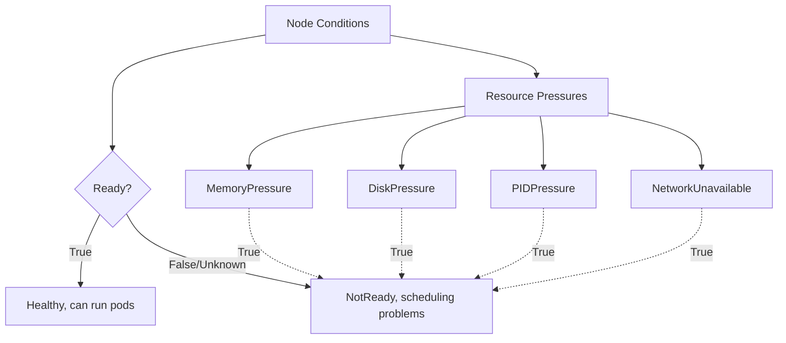
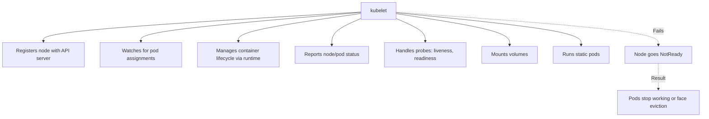
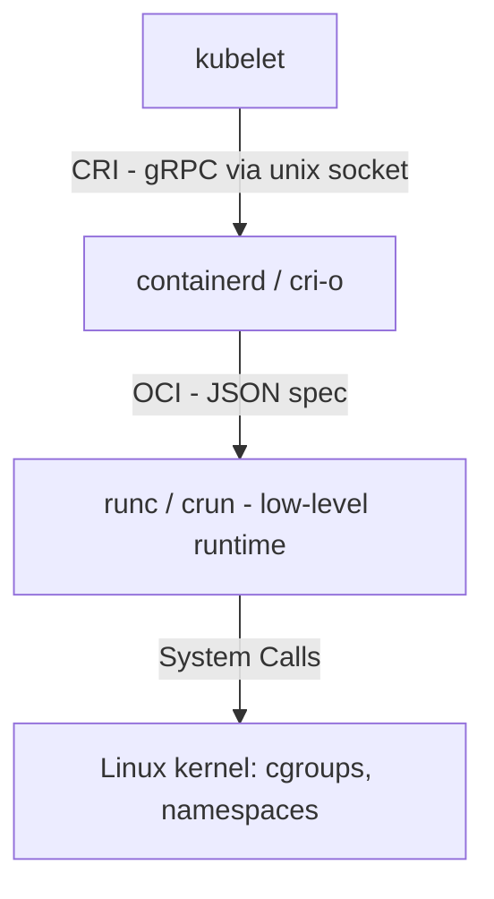
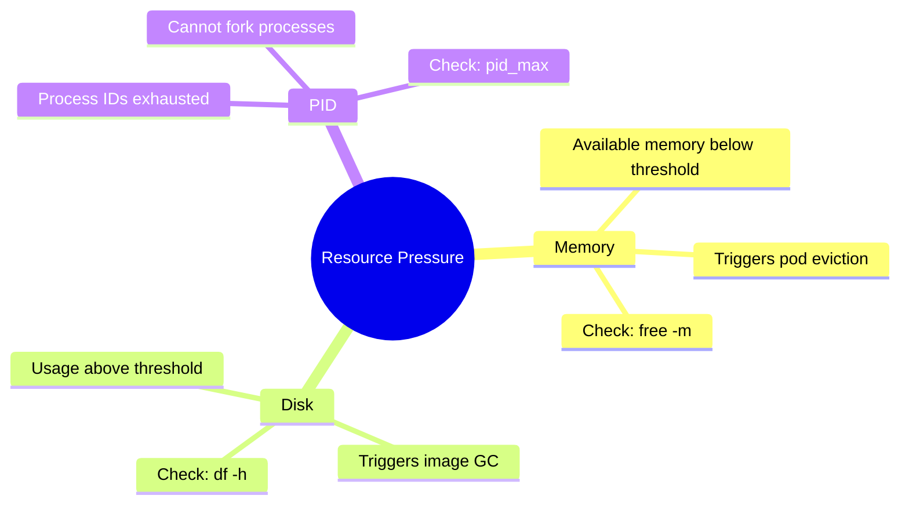
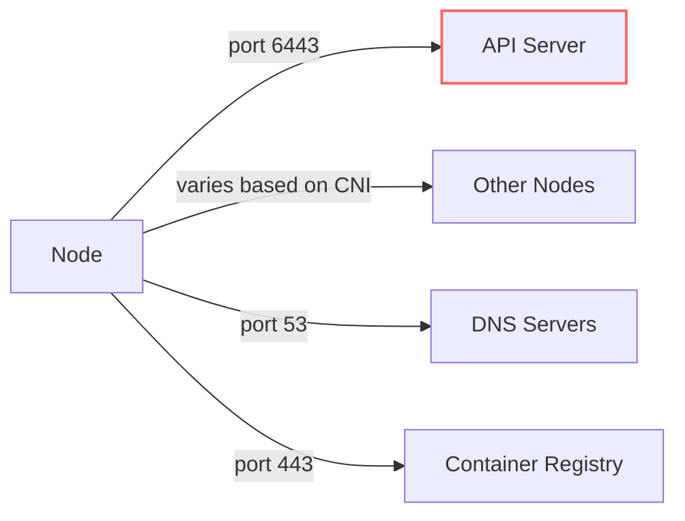
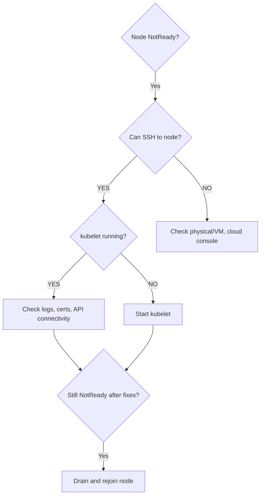

> **Complexity**: `[MEDIUM]` - Critical for cluster operations
>
> **Time to Complete**: 45-55 minutes
>
> **Prerequisites**: Module 5.1 (Methodology), Module 1.1 (Cluster Architecture)

## Why This Module Matters

In 2018, a major online retailer experienced a catastrophic global outage during their peak holiday sales event. The root cause was not a complex network intrusion or a database corruption, but a simple memory leak in a third-party logging daemon deployed across their worker nodes. As the daemon consumed RAM, individual worker nodes sequentially exhausted their memory capacities. Each node hit `MemoryPressure`, stopped accepting new pods, and began aggressively evicting existing workloads. 

Because the underlying issue was not immediately diagnosed, the Kubernetes scheduler desperately scrambled to place the newly evicted pods onto the remaining healthy nodes. This cascading failure created a massive "thundering herd" effect. The surviving worker nodes were instantaneously overwhelmed by the flood of rescheduled pods, causing them to run out of memory as well. Within minutes, the entire e-commerce platform collapsed, resulting in six hours of downtime and an estimated $15 million in lost revenue. This incident underscores a brutal truth in distributed systems: a localized node failure, if left unchecked, can quickly metastasize into a global cluster outage.

Worker nodes are the fundamental workhorses of your Kubernetes cluster. They are where your applications actually execute. When a node fails, the applications running on it suffer immediately. Understanding how to definitively diagnose and fix worker node issues—whether it is a crashed kubelet agent, an unresponsive container runtime, or critical resource exhaustion—is essential for maintaining cluster health. This module prepares you to jump into a failing node, interpret the low-level system signals, and confidently restore service before the cascading effects take hold of your infrastructure.

> **The Factory Floor Analogy**
>
> If the control plane is management, worker nodes are the factory floor. The kubelet is the floor supervisor - if they're out, nothing gets done. The container runtime is the machinery - if it breaks, production stops. Node resources (CPU, memory, disk) are the raw materials - run out, and the factory grinds to a halt.

## What You'll Learn

- **Diagnose** the root cause of `NotReady` and `Unknown` node states using systematic debugging techniques and system logs.
- **Evaluate** node resource pressure conditions and implement immediate remediation strategies to prevent cascading failures across the cluster.
- **Debug** kubelet and container runtime integration failures by analyzing systemd service states, journalctl logs, and CRI socket configurations.
- **Implement** safe node recovery and maintenance procedures, including cordoning, draining, and component restarts while respecting workload disruption budgets.

## What You'll Be Able to Do

- **Diagnose** worker node NotReady status by checking kubelet, container runtime, and network
- **Fix** kubelet failures caused by configuration errors, certificate expiry, and resource pressure
- **Recover** a node from disk pressure, memory pressure, and PID pressure conditions
- **Drain** and cordon nodes safely during maintenance while respecting PodDisruptionBudgets

## Did You Know?

- **10-second heartbeats**: The kubelet reports its node status to the API server every 10 seconds. If 40 seconds pass without a heartbeat, the node is marked `Unknown`.
- **5-minute eviction threshold**: By default, pods running on a `NotReady` node are tolerated for exactly 300 seconds (5 minutes) before the control plane initiates eviction.
- **15 percent disk threshold**: The kubelet automatically triggers `DiskPressure` and begins garbage collecting unused container images when the node's root filesystem drops below 15% available space.
- **65536 PID limit**: In many default Linux distributions configured for Kubernetes, the `pid_max` limit is historically set to 32768, which can easily be exhausted by rogue microservices, causing `PIDPressure`.

---

## Part 1: Node Status Overview

Before diving into the command line, it is critical to understand how Kubernetes thinks about node health. The Kubernetes control plane does not actively poll the worker nodes; instead, it relies on a push-based mechanism. The `kubelet` agent running on each worker node is responsible for periodically evaluating the node's health and pushing a status update (a heartbeat) back to the API server. The Node Controller, running inside the `kube-controller-manager` on the control plane, monitors these heartbeats. If the heartbeats stop, or if the kubelet explicitly reports a problem, the Node Controller changes the node's status to reflect the failure.

The node's status is expressed through a set of **Node Conditions**. These conditions are boolean flags that describe specific aspects of the node's health. 

```text
┌──────────────────────────────────────────────────────────────┐
│                    NODE CONDITIONS                            │
│                                                               │
│   Condition          Healthy    Meaning                       │
│   ─────────────────────────────────────────────────────────  │
│   Ready              True       Node is healthy, can run pods │
│   MemoryPressure     False      Memory is sufficient          │
│   DiskPressure       False      Disk space is sufficient      │
│   PIDPressure        False      Process IDs are available     │
│   NetworkUnavailable False      Network is configured         │
│                                                               │
│   Any unhealthy condition → scheduling problems               │
│   Ready=False or Unknown → node is NotReady                   │
│                                                               │
└──────────────────────────────────────────────────────────────┘
```

Architecturally, we can visualize the relationship between these conditions and the overall node readiness as follows:



To diagnose a node, you must first interrogate the API server to see what it believes the node's state is. You can start with a broad overview and then drill down into the specific conditions of a problematic node.

```bash
# Quick status
k get nodes

# Detailed conditions
k describe node <node-name> | grep -A 10 Conditions

# All nodes with conditions
k get nodes -o custom-columns='NAME:.metadata.name,READY:.status.conditions[?(@.type=="Ready")].status,REASON:.status.conditions[?(@.type=="Ready")].reason'

# Check for resource pressure
k describe node <node-name> | grep -E "MemoryPressure|DiskPressure|PIDPressure"
```

When you query the node status, you will typically see one of the following states. Understanding the distinction between `NotReady` and `Unknown` is particularly important for troubleshooting.

| Status | Meaning | Common Causes |
|--------|---------|---------------|
| Ready | Healthy and accepting pods | Normal operation |
| NotReady | Unhealthy | kubelet down, network issues |
| Unknown | No heartbeat received | Node unreachable, kubelet crashed |
| SchedulingDisabled | Cordoned | Manual cordon or maintenance |

> **Stop and think**: If a node transitions to the `Unknown` state, does that mean the applications running on it have crashed? 
> *Think about the separation of concerns between the control plane and the runtime before moving on.*

---

## Part 2: kubelet Troubleshooting

The `kubelet` is the most critical Kubernetes component running on a worker node. It is the primary node agent, the direct representative of the control plane on the factory floor. If the kubelet is not functioning, the node is effectively severed from the cluster, regardless of whether the physical server is perfectly healthy.

```text
┌──────────────────────────────────────────────────────────────┐
│                    KUBELET RESPONSIBILITIES                   │
│                                                               │
│   ┌──────────────────────────────────────────────────────┐   │
│   │                      kubelet                          │   │
│   │                                                       │   │
│   │  • Registers node with API server                    │   │
│   │  • Watches for pod assignments                       │   │
│   │  • Manages container lifecycle (via runtime)         │   │
│   │  • Reports node/pod status                           │   │
│   │  • Handles probes (liveness, readiness)              │   │
│   │  • Mounts volumes                                    │   │
│   │  • Runs static pods                                  │   │
│   │                                                       │   │
│   └──────────────────────────────────────────────────────┘   │
│                                                               │
│   If kubelet fails → Node goes NotReady → Pods stop working  │
│                                                               │
└──────────────────────────────────────────────────────────────┘
```

Here is a structural view of the kubelet's responsibilities and the consequences of its failure:



When a node is `NotReady`, your very first step should be to bypass Kubernetes entirely, SSH directly into the affected node, and check the health of the kubelet service using the Linux system manager, `systemd`.

```bash
# SSH to the node first
ssh <node-name>

# Check kubelet service status
sudo systemctl status kubelet

# Check if kubelet is running
ps aux | grep kubelet

# Check kubelet logs
sudo journalctl -u kubelet -f

# Check recent kubelet errors
sudo journalctl -u kubelet --since "10 minutes ago" | grep -i error
```

Based on the output of the commands above, you can categorize the failure into one of several common buckets. 

| Issue | Symptom | Diagnosis | Fix |
|-------|---------|-----------|-----|
| kubelet stopped | Node NotReady | `systemctl status kubelet` | `systemctl start kubelet` |
| kubelet crash loop | Node flapping | `journalctl -u kubelet` | Fix config, check logs |
| Wrong config | Can't start | Error in logs | Fix `/var/lib/kubelet/config.yaml` |
| Can't reach API | NotReady | Network timeout in logs | Check network, firewall |
| Certificate issues | TLS errors | Cert errors in logs | Renew certs |
| Container runtime down | Can't create pods | Runtime errors | Fix containerd/docker |

If the kubelet is simply stopped (perhaps due to an accidental administrative command or an abrupt system restart where the service wasn't enabled), starting it is straightforward:

```bash
# Start kubelet
sudo systemctl start kubelet

# Enable on boot
sudo systemctl enable kubelet

# Check status
sudo systemctl status kubelet
```

More often, the kubelet is in a crash loop due to a configuration error. The kubelet's configuration is typically split between a YAML file and a set of systemd drop-in arguments. A typo in either will prevent the daemon from starting.

```bash
# Check kubelet config file
cat /var/lib/kubelet/config.yaml

# Check kubelet flags
cat /etc/systemd/system/kubelet.service.d/10-kubeadm.conf

# After fixing config, reload and restart
sudo systemctl daemon-reload
sudo systemctl restart kubelet
```

Another pernicious issue is certificate expiration. The kubelet authenticates to the API server using client certificates. If these expire (usually after one year in a kubeadm-provisioned cluster), the API server will reject the kubelet's heartbeats, and the node will drop offline silently.

```bash
# Check certificate paths
cat /var/lib/kubelet/config.yaml | grep -i cert

# Verify certificates exist
ls -la /var/lib/kubelet/pki/

# For expired certs, may need to rejoin node
# On control plane: kubeadm token create --print-join-command
# On worker: kubeadm reset && kubeadm join ...
```

---

## Part 3: Container Runtime Troubleshooting

The kubelet does not actually run containers itself; it delegates that responsibility to a Container Runtime via the Container Runtime Interface (CRI). If the container runtime crashes, hangs, or corrupts its local storage, the kubelet will be unable to spin up new pods or retrieve the status of existing ones.

```text
┌──────────────────────────────────────────────────────────────┐
│                CONTAINER RUNTIME STACK                        │
│                                                               │
│   kubelet                                                     │
│      │                                                        │
│      │ CRI (Container Runtime Interface)                     │
│      ▼                                                        │
│   containerd (or docker, cri-o)                              │
│      │                                                        │
│      │ OCI (Open Container Initiative)                       │
│      ▼                                                        │
│   runc (low-level runtime)                                   │
│      │                                                        │
│      ▼                                                        │
│   Linux kernel (cgroups, namespaces)                         │
│                                                               │
└──────────────────────────────────────────────────────────────┘
```

The flow of instructions down the stack looks like this:



To troubleshoot the runtime, we use `crictl`, a CLI tool specifically designed for CRI-compatible runtimes. It is invaluable because it allows you to inspect the state of containers directly on the node without needing the Kubernetes API server to be reachable.

```bash
# Check containerd (most common)
sudo systemctl status containerd
sudo crictl info

# Check container runtime socket
ls -la /run/containerd/containerd.sock

# List containers with crictl
sudo crictl ps

# List images
sudo crictl images
```

Runtime issues often manifest as pods stuck in the `ContainerCreating` state, or as cryptic CRI integration errors inside the kubelet logs.

| Issue | Symptom | Diagnosis | Fix |
|-------|---------|-----------|-----|
| containerd stopped | Pods ContainerCreating | `systemctl status containerd` | `systemctl start containerd` |
| Socket missing | kubelet errors | Check socket path | Restart containerd |
| Disk full | Container create fails | `df -h` | Clean up disk |
| Image pull fails | ImagePullBackOff | Check registry access | Fix registry auth |
| Resource exhausted | Random container failures | Check cgroups | Increase resources |

If containerd has crashed, restarting it via systemd is the immediate remediation:

```bash
# Start containerd
sudo systemctl start containerd

# Check status
sudo systemctl status containerd

# Check logs for issues
sudo journalctl -u containerd --since "10 minutes ago"
```

If you need to dig deeper into why a specific container is failing to start, configuring and using `crictl` is your best path forward. Ensure `crictl` knows where your CRI socket is located by writing a quick config file.

```bash
# Configure crictl for containerd
cat <<EOF | sudo tee /etc/crictl.yaml
runtime-endpoint: unix:///run/containerd/containerd.sock
image-endpoint: unix:///run/containerd/containerd.sock
timeout: 10
debug: false
EOF

# List all containers (including stopped)
sudo crictl ps -a

# Get container logs
sudo crictl logs <container-id>

# Inspect container
sudo crictl inspect <container-id>
```

---

## Part 4: Node Resource Exhaustion

Worker nodes possess finite physical resources. When a node begins to run out of memory, disk space, or process IDs, the kubelet detects this via `cAdvisor` (Container Advisor, which is embedded in the kubelet) and asserts a resource pressure condition.

```text
┌──────────────────────────────────────────────────────────────┐
│                 RESOURCE PRESSURE TYPES                       │
│                                                               │
│   MEMORY PRESSURE                                             │
│   • Available memory below threshold                          │
│   • Triggers pod eviction                                     │
│   • Check: free -m, cat /proc/meminfo                        │
│                                                               │
│   DISK PRESSURE                                               │
│   • Disk usage above threshold                                │
│   • Triggers image garbage collection                        │
│   • Check: df -h                                              │
│                                                               │
│   PID PRESSURE                                                │
│   • Process IDs exhausted                                     │
│   • Can't fork new processes                                 │
│   • Check: cat /proc/sys/kernel/pid_max                      │
│                                                               │
│   When any pressure is True, node may not accept new pods     │
│                                                               │
└──────────────────────────────────────────────────────────────┘
```



When diagnosing resource exhaustion, you must check both the Kubernetes API's view of the node and the raw operating system metrics.

```bash
# Check node conditions
k describe node <node> | grep -A 10 Conditions

# On the node - check memory
free -m
cat /proc/meminfo | grep -E "MemTotal|MemFree|MemAvailable"

# Check disk
df -h
du -sh /var/lib/containerd/*  # Container storage
du -sh /var/log/*             # Log storage

# Check PIDs
cat /proc/sys/kernel/pid_max
ps aux | wc -l
```

The kubelet determines when a node is under pressure based on configured eviction thresholds. These are defined in the kubelet's configuration YAML.

```yaml
evictionHard:
  memory.available: "100Mi"
  nodefs.available: "10%"
  nodefs.inodesFree: "5%"
  imagefs.available: "15%
```

When these thresholds are crossed, the kubelet acts defensively:
1. Node condition set to True (e.g., `MemoryPressure=True`).
2. The scheduler stops assigning new pods to the node.
3. The kubelet begins evicting existing pods to reclaim resources, starting with `BestEffort` pods.

> **Pause and predict**: If a runaway pod is consuming all the memory on a node, and the kubelet decides to evict it, what happens to the pod's data if it was using an `emptyDir` volume? 
> *Think about the ephemeral nature of local storage before proceeding.*

To fix memory pressure, you need to identify the culprit and intervene:

```bash
# Find memory-hungry processes
ps aux --sort=-%mem | head -20

# Find pods using most memory
k top pods -A --sort-by=memory

# Options:
# 1. Kill unnecessary processes
# 2. Evict low-priority pods
# 3. Add more memory to node
```

For disk pressure, the solution is aggressive cleanup. A node with a completely full disk will often completely freeze up, requiring a hard reboot.

```bash
# Find large files
sudo find / -type f -size +100M -exec ls -lh {} \;

# Clean up container images
sudo crictl rmi --prune

# Clean up old logs
sudo journalctl --vacuum-time=3d

# Clean up unused containers
sudo crictl rm $(sudo crictl ps -a -q --state exited)
```

PID pressure is an insidious problem. The Linux kernel limits the maximum number of Process IDs that can exist simultaneously. If a container forks processes rapidly without cleaning them up (a fork bomb), the node will hit its PID limit, preventing any new processes (including basic shell commands) from running.

```bash
# Check current PID limit
cat /proc/sys/kernel/pid_max

# Increase limit temporarily
echo 65536 | sudo tee /proc/sys/kernel/pid_max

# Find processes by count
ps aux | awk '{print $1}' | sort | uniq -c | sort -rn | head
```

---

## Part 5: Node Network Issues

Even if the kubelet is healthy and resources are abundant, a node must have robust network connectivity to function within the cluster. It must be able to reach the API server to send heartbeats, reach other nodes for overlay networking, and reach container registries to pull images.

```text
┌──────────────────────────────────────────────────────────────┐
│                NODE NETWORK REQUIREMENTS                      │
│                                                               │
│   Node needs connectivity to:                                 │
│   ┌─────────────────────────────────────────────────────┐    │
│   │ API Server     (port 6443)    - Required            │    │
│   │ Other nodes    (varies)       - For pod networking  │    │
│   │ DNS servers    (port 53)      - For name resolution │    │
│   │ Registry       (port 443)     - For pulling images  │    │
│   └─────────────────────────────────────────────────────┘    │
│                                                               │
│   Network failures → Node NotReady or Unknown                │
│                                                               │
└──────────────────────────────────────────────────────────────┘
```



When diagnosing a network partition, use standard Linux networking tools directly from the affected worker node to trace the connection failure.

```bash
# Check basic connectivity
ping <api-server-ip>

# Check API server reachability
curl -k https://<api-server>:6443/healthz

# Check DNS
nslookup kubernetes.default.svc.cluster.local
cat /etc/resolv.conf

# Check firewall
sudo iptables -L -n
sudo firewall-cmd --list-all  # If using firewalld

# Check network interfaces
ip addr
ip route
```

Common network issues range from aggressive firewall rules dropping packets to asymmetric routing configurations causing silent timeouts.

| Issue | Symptom | Diagnosis | Fix |
|-------|---------|-----------|-----|
| Firewall blocking | Can't reach API | `telnet api-server 6443` | Open firewall ports |
| DNS failure | Name resolution fails | `nslookup` | Fix /etc/resolv.conf |
| IP address change | Node NotReady | Check IP in node spec | Reconfigure or rejoin |
| CNI plugin issues | Pod networking fails | Check CNI pods | Restart CNI, fix config |
| MTU mismatch | Intermittent failures | Check MTU settings | Align MTU values |

Familiarize yourself with the default ports required for Kubernetes components to communicate securely.

| Port | Protocol | Component | Purpose |
|------|----------|-----------|---------|
| 6443 | TCP | API Server | Kubernetes API |
| 10250 | TCP | kubelet | kubelet API |
| 10259 | TCP | kube-scheduler | Scheduler metrics |
| 10257 | TCP | kube-controller-manager | Controller metrics |
| 2379-2380 | TCP | etcd | Client and peer |
| 30000-32767 | TCP | NodePort | Service NodePorts |

---

## Part 6: Node Recovery Procedures

When you have exhausted your troubleshooting options and need to perform deep maintenance on a node, you must follow safe recovery procedures. A chaotic recovery approach causes more downtime than the initial failure.

```text
┌──────────────────────────────────────────────────────────────┐
│                  NODE RECOVERY DECISION TREE                  │
│                                                               │
│   Node NotReady?                                              │
│        │                                                      │
│        ├── Can SSH to node?                                   │
│        │        │                                             │
│        │        ├── YES → Check kubelet, runtime, network     │
│        │        │                                             │
│        │        └── NO  → Check physical/VM, cloud console    │
│        │                                                      │
│        ├── kubelet running?                                   │
│        │        │                                             │
│        │        ├── YES → Check logs, certs, API connectivity │
│        │        │                                             │
│        │        └── NO  → Start kubelet                       │
│        │                                                      │
│        └── Still NotReady after fixes?                        │
│                 │                                             │
│                 └── Drain and rejoin node                     │
│                                                               │
└──────────────────────────────────────────────────────────────┘
```



Before rebooting a node or ripping out its configuration, you must safely remove the workloads it is hosting. The `cordon` command marks the node as unschedulable, and the `drain` command safely evicts all running pods (respecting PodDisruptionBudgets and graceful termination periods).

```bash
# Drain node (evicts pods safely)
k drain <node-name> --ignore-daemonsets --delete-emptydir-data

# Cordon only (prevent new pods)
k cordon <node-name>

# Uncordon (allow scheduling again)
k uncordon <node-name>
```

If the node's local configuration is entirely corrupted (e.g., messed up certificates or network configurations), the fastest path to recovery is often to wipe the node's Kubernetes state and rejoin it to the cluster from scratch.

```bash
# On the worker node
sudo kubeadm reset

# On control plane - generate new join token
kubeadm token create --print-join-command

# On worker - rejoin
sudo kubeadm join <api-server>:6443 --token <token> --discovery-token-ca-cert-hash <hash>
```

If a node has suffered catastrophic hardware failure and will never return, you must clean it out of the API server to prevent the cluster from waiting for it forever.

```bash
# Drain first
k drain <node> --ignore-daemonsets --delete-emptydir-data

# Delete node from cluster
k delete node <node-name>

# On the node itself
sudo kubeadm reset
```

---

## Common Mistakes

When troubleshooting worker nodes, panic often leads to rushed commands that exacerbate the problem. Avoid these common pitfalls:

| Mistake | Why | Fix |
|---------|-----|-----|
| Not checking kubelet first | Miss obvious issue | Always start with `systemctl status kubelet` |
| Ignoring node conditions | Miss resource pressure | Check all conditions, not just Ready |
| Deleting node before drain | Pod disruption | Always drain before delete |
| Forgetting DaemonSet pods | Drain fails | Use `--ignore-daemonsets` |
| Not checking runtime | Blame kubelet | Check containerd status too |
| Ignoring disk usage | Node degradation | Monitor disk, clean regularly |
| Restarting without reload | Changes to systemd drop-ins do not take effect | Always run `systemctl daemon-reload` before restart |
| Skipping CNI checks | Assume node is broken when only pod networking is down | Verify CNI binary paths and configurations |

---

## Quiz

### Q1: Node Heartbeat
You receive an alert that a production worker node has transitioned to the `Unknown` state. The node was perfectly healthy a minute ago. Based on the Kubernetes node controller architecture, how many consecutive seconds of missed heartbeats does this state represent, and what happens next?

<details>
<summary>Answer</summary>

It represents **40 seconds** of missed heartbeats. The kubelet sends heartbeats to the API server every 10 seconds. After 4 missed heartbeats (40s), the node-controller marks the node as Unknown. After 5 minutes (by default) in this state, pods on that node are forcefully scheduled for eviction to ensure application availability.

</details>

### Q2: kubelet vs Static Pods
You discover a critical control plane component is failing on a master node, but when you run `crictl ps`, you see the container still running. You then check `systemctl status kubelet` and see it has crashed. What is the key difference between how the kubelet and control plane components run that explains this?

<details>
<summary>Answer</summary>

The **kubelet** runs as a **systemd service** directly on the host OS, while **control plane components** (API server, scheduler, etc.) run as **static pods** managed by the kubelet. If the kubelet crashes, the container runtime (containerd) keeps the existing static pods running independently. However, the kubelet is no longer around to report their status or apply updates, meaning Kubernetes loses management visibility over them.

</details>

### Q3: MemoryPressure
A node in your cluster is marked with `MemoryPressure=True`. A developer complains that their newly deployed pod is stuck in the `Pending` state. How does the node's condition directly affect the scheduler's behavior regarding new workloads?

<details>
<summary>Answer</summary>

New pods will **not be scheduled** to this node. The kube-scheduler actively filters out nodes that have resource pressure conditions set to True during its predicate evaluation phase. Additionally, the kubelet on that node will begin actively **evicting** existing pods to free up memory, starting with BestEffort pods, to prevent the entire node from freezing.

</details>

### Q4: crictl vs kubectl
During a severe API server outage, you need to inspect the logs of a failing ingress controller pod on a worker node. `kubectl` commands are timing out globally. What is the most effective approach to retrieve these logs?

<details>
<summary>Answer</summary>

You should use **crictl** directly on the worker node. Use `crictl ps` to find the container ID, and `crictl logs <container-id>` to view the output. Because crictl communicates directly with the container runtime (containerd) over the local Unix socket, it bypasses the Kubernetes API entirely, allowing you to debug even when the control plane is unreachable.

</details>

### Q5: Drain vs Cordon
You need to perform emergency kernel patching on a worker node. You execute `kubectl cordon <node-name>`. Five minutes later, you notice that all the original pods are still running on the node, blocking your maintenance window. What operational misunderstanding caused this delay?

<details>
<summary>Answer</summary>

The **cordon** command only marks the node as unschedulable (preventing new pods from arriving); it does not stop or move existing workloads. To properly clear a node for maintenance, you must use the **drain** command. Draining will cordon the node AND safely evict all existing pods (except DaemonSets, which you ignore with a flag) while respecting PodDisruptionBudgets.

</details>

### Q6: Container Runtime Socket
A worker node's kubelet fails to start, throwing errors in `journalctl` about missing files in `/run/containerd/`. You suspect the container runtime interface socket is unavailable. Where exactly should you look to verify the socket's existence?

<details>
<summary>Answer</summary>

You should check for the socket at `/run/containerd/containerd.sock`. This Unix socket is created and listened on by the containerd systemd service. If it is missing, it typically means containerd has crashed or failed to start, which subsequently prevents the kubelet from initializing because it cannot connect via the CRI.

</details>

### Q7: Certificate Expiration
You notice a node flipping between `Ready` and `NotReady` states every few minutes. Upon inspecting the kubelet logs, you see repeated TLS handshake timeouts. The cluster was provisioned exactly one year ago. What is the most highly probable root cause of this flapping behavior?

<details>
<summary>Answer</summary>

The most highly probable root cause is an expired kubelet client certificate. By default, kubeadm-provisioned clusters issue kubelet client certificates with a one-year validity period. When the certificate expires, the kubelet can no longer authenticate with the API server to send heartbeats, causing total communication failure until the certificate is rotated or the node is rejoined.

</details>

---

## Hands-On Exercise: Node Troubleshooting Simulation

### Scenario

You are the on-call engineer. Monitoring has alerted you that a critical worker node is experiencing intermittent instability and resource spikes. You need to log into the environment, systematically diagnose the health of the node, inspect its core services, evaluate its resources, and safely prepare it for maintenance.

### Prerequisites

- Access to a Kubernetes cluster
- SSH access to at least one worker node

### Task 1: Node Health Assessment

Begin by evaluating the cluster-wide state from the perspective of the control plane. Identify the node you want to investigate.

<details>
<summary>Solution</summary>

```bash
# Check all nodes
k get nodes -o wide

# Get detailed node information
k describe node <node-name>

# Check node conditions specifically
k get node <node-name> -o jsonpath='{.status.conditions[*].type}' | tr ' ' '\n'
```
</details>

### Task 2: kubelet Investigation

Assume the node is showing signs of distress. SSH directly into the node and interrogate the primary agent.

<details>
<summary>Solution</summary>

```bash
# SSH to a worker node
ssh <node>

# Check kubelet status
sudo systemctl status kubelet

# View recent kubelet logs
sudo journalctl -u kubelet --since "5 minutes ago" | tail -50

# Check kubelet configuration
cat /var/lib/kubelet/config.yaml | head -30
```
</details>

### Task 3: Container Runtime Check

The kubelet relies entirely on the container runtime. Verify that containerd is healthy and properly managing containers.

<details>
<summary>Solution</summary>

```bash
# Check containerd status
sudo systemctl status containerd

# List running containers
sudo crictl ps

# Check container runtime info
sudo crictl info

# List images on node
sudo crictl images
```
</details>

### Task 4: Resource Assessment

The node is healthy at the service level, but it might be starving for resources. Check the physical resource consumption.

<details>
<summary>Solution</summary>

```bash
# Check memory
free -m

# Check disk
df -h

# Check what's using resources
k top node <node-name>

# See allocated resources
k describe node <node-name> | grep -A 10 "Allocated resources"
```
</details>

### Task 5: Cordon and Uncordon (Safe)

You have decided the node needs a reboot to clear a suspected memory leak. Safely cordon the node and verify that the scheduler respects your command.

<details>
<summary>Solution</summary>

```bash
# Cordon a node (prevents new scheduling)
k cordon <node-name>

# Verify it's unschedulable
k get node <node-name>

# Try to schedule a pod
k run test-pod --image=nginx
k get pods test-pod -o wide  # Should NOT be on cordoned node

# Uncordon
k uncordon <node-name>

# Cleanup
k delete pod test-pod
```
</details>

### Success Criteria

- [ ] Checked node conditions for all nodes using jsonpath.
- [ ] Verified kubelet is running and inspected the systemd logs.
- [ ] Verified containerd is running and used crictl to list images.
- [ ] Assessed node resource usage at both the OS and cluster levels.
- [ ] Successfully cordoned a node, tested scheduler avoidance, and uncordoned it.

### Cleanup

Ensure the node is uncordoned and the test pod is deleted after completing the exercise.

---

## Practice Drills

Develop muscle memory for node troubleshooting by executing these rapid-fire drills.

### Drill 1: Node Status Check (30 sec)
```bash
# Task: List all nodes with their status
k get nodes
```

### Drill 2: Node Conditions (1 min)
```bash
# Task: Check all conditions for a specific node
k describe node <node> | grep -A 10 Conditions
```

### Drill 3: kubelet Status (30 sec)
```bash
# Task: Check if kubelet is running (on node)
sudo systemctl status kubelet
```

### Drill 4: kubelet Logs (1 min)
```bash
# Task: View last 20 lines of kubelet logs
sudo journalctl -u kubelet -n 20
```

### Drill 5: Container Runtime Status (30 sec)
```bash
# Task: Check containerd and list containers
sudo systemctl status containerd
sudo crictl ps
```

### Drill 6: Resource Usage (1 min)
```bash
# Task: Check node resource usage
k top nodes
k describe node <node> | grep -A 5 "Allocated resources"
```

### Drill 7: Drain Node (1 min)
```bash
# Task: Safely drain a node
k drain <node> --ignore-daemonsets --delete-emptydir-data
```

### Drill 8: Disk Usage (30 sec)
```bash
# Task: Check disk usage on node
df -h
du -sh /var/lib/containerd/
```

---

## Next Module

Continue to [Module 5.5: Network Troubleshooting](../module-5.5-networking/) to learn how to diagnose and fix pod-to-pod, pod-to-service, and external connectivity issues that plague distributed systems.