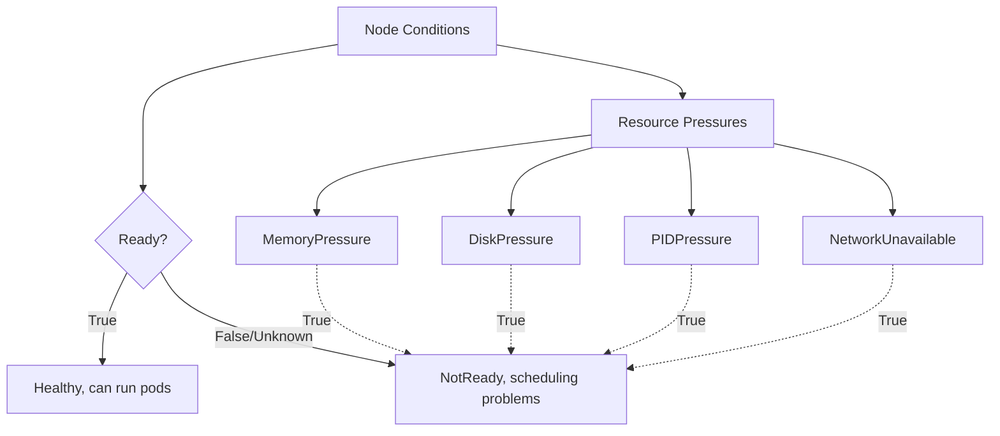
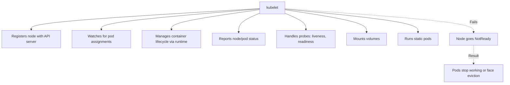
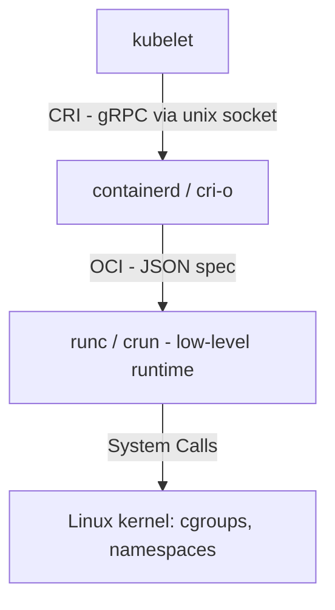
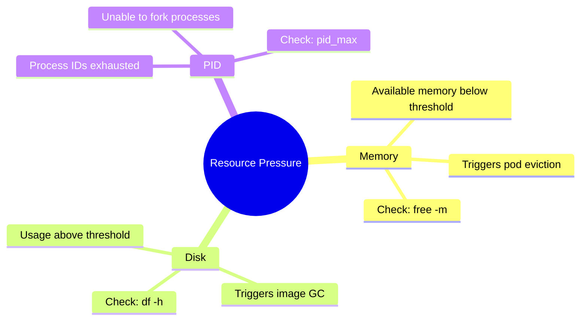
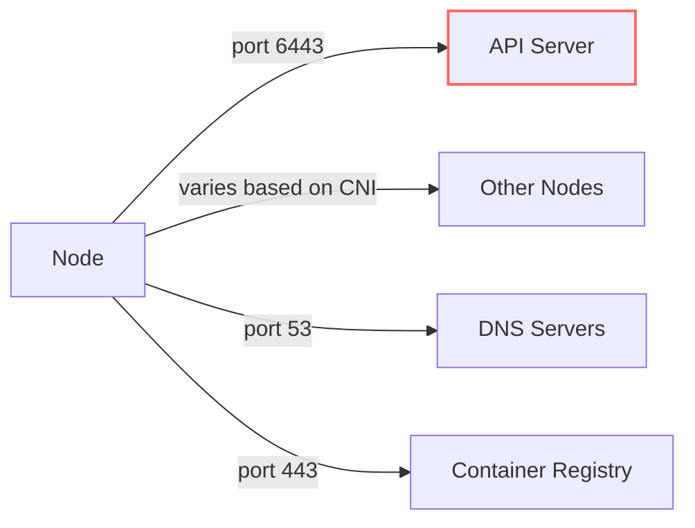
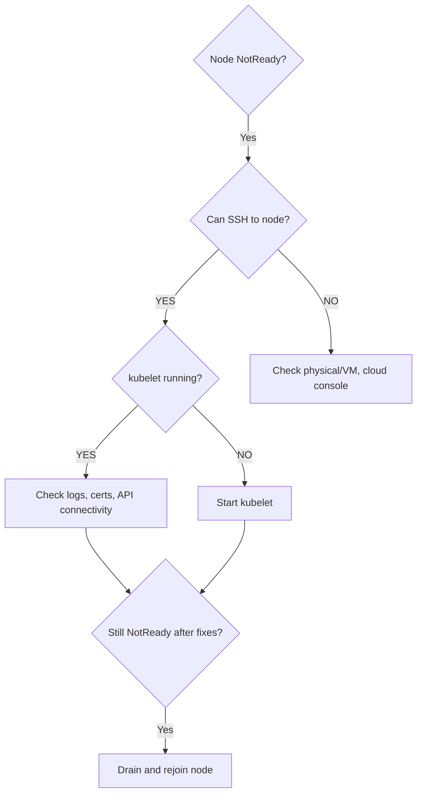
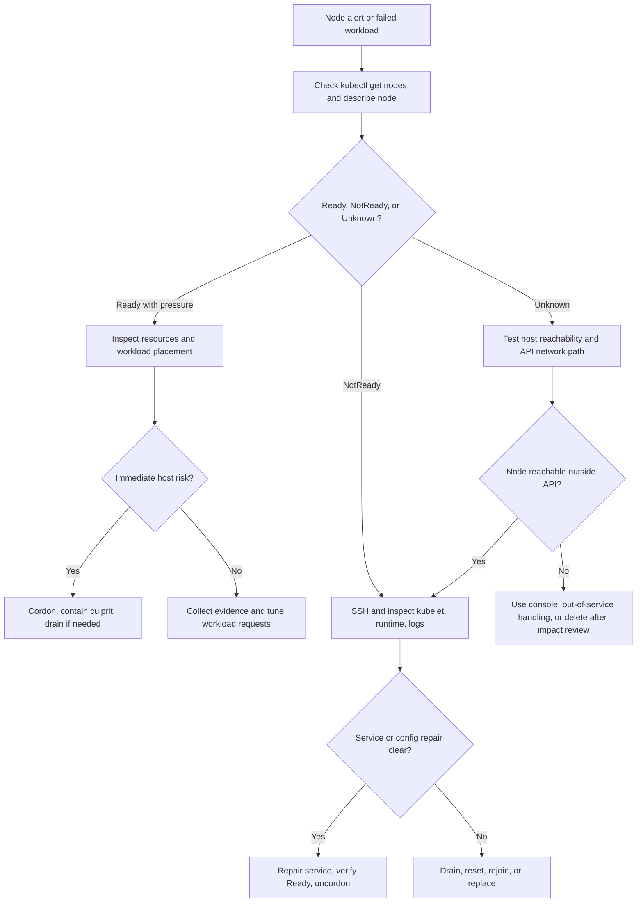

> **Complexity**: `[MEDIUM]` - Critical for cluster operations
>
> **Time to Complete**: 45-55 minutes
>
> **Prerequisites**: Module 5.1 (Methodology), Module 1.1 (Cluster Architecture)

---

## What You'll Be Able to Do

- **Diagnose** `NotReady` and `Unknown` worker node states by correlating Kubernetes node conditions, kubelet heartbeats, systemd service health, and node-local logs.
- **Evaluate** `MemoryPressure`, `DiskPressure`, and `PIDPressure` conditions and choose immediate containment steps that reduce cascading workload failures.
- **Debug** kubelet and container runtime integration failures with `journalctl`, `systemctl`, CRI socket checks, and `crictl` inspection.
- **Implement** safe node recovery procedures with cordon, drain, restart, reset, rejoin, and deletion workflows while respecting disruption constraints.
- **Design** a worker-node eviction and maintenance response that accounts for taint-based eviction, node-pressure thresholds, graceful shutdown, and Kubernetes 1.35 behavior.

## Why This Module Matters

Hypothetical scenario: a host-wide monitoring agent starts leaking memory after a routine rollout. At first only one worker node reports higher memory usage, but the DaemonSet runs everywhere, so the same failure pattern begins appearing across the node pool. The kubelet starts asserting `MemoryPressure`, new pods stop landing on affected nodes, and evicted workloads move onto the remaining healthy nodes, increasing their pressure as well. The outage is not caused by a single broken application; it is caused by the node layer losing the capacity and control loops that every application depends on.

Worker nodes are the factory floor of a Kubernetes cluster. The control plane can schedule, observe, and reconcile, but the actual containers run on machines with finite memory, disks, network paths, process IDs, certificates, and local services. The kubelet acts like the floor supervisor, the container runtime is the heavy machinery, and node resources are the raw materials. If the supervisor is unable to report status, the machinery is unable to start containers, or the raw materials run out, the scheduler's best intentions do not matter until the node is recovered or isolated.

This module teaches a practical sequence for diagnosing worker node failures without guessing. You will start from the API server's view, move to the node's local operating system evidence, inspect kubelet and container runtime integration, evaluate resource pressure, distinguish network partitions from local crashes, and then choose a recovery path. The exam value is obvious because CKA troubleshooting tasks often present a node that is unhealthy for one concrete reason. The production value is larger: calm node diagnosis prevents a local failure from becoming a fleet-wide incident.

The habit you are building is evidence ordering. Kubernetes exposes many symptoms, and several of them can be true at the same time during a node incident. A pod may be `Pending` because the node is under pressure, because the scheduler is honoring a cordon, because the runtime is unavailable, or because the control plane has stopped trusting the node heartbeat. If you collect those signals in a stable order, the failure usually narrows quickly; if you jump straight to repair commands, you may change the system before you understand the fault.

## Reading Node Status Like an Operator

Kubernetes does not continuously log into worker nodes to see if they are alive. Instead, the kubelet on each node publishes status updates and Lease heartbeats back to the API server, and the node controller interprets missed or unhealthy updates. That distinction matters because the control plane's view is always a report, not the node itself. A node can be running containers while the API server sees it as `Unknown`, and a node can be reachable by SSH while the kubelet is failing to authenticate or post status.

The first diagnostic question is therefore not "what is broken?" but "which observer says it is broken?" `kubectl get nodes` tells you what the API server currently believes. `kubectl describe node` shows conditions, recent events, addresses, capacity, allocatable resources, and taints. SSH, `systemctl`, `journalctl`, `df`, `free`, and `crictl` tell you what is happening locally. A good troubleshooter deliberately switches between those viewpoints instead of trusting one command as the whole truth.

Think of the node object as a dashboard fed by field reports. It is authoritative for scheduling decisions, but it is still a summary of messages that had to travel from the node to the API server. When the reporting path is damaged, the dashboard can be stale, incomplete, or conservative. That is why `Unknown` is not the same as "everything on the host has died," and why a reachable host is not automatically a healthy Kubernetes node.



The `Ready` condition summarizes whether the node can accept and run ordinary workloads, but it should never be read alone. `MemoryPressure=True` tells you the kubelet is protecting the host from low memory. `DiskPressure=True` indicates local storage or inode exhaustion may block image pulls, logs, or container creation. `PIDPressure=True` means the node is running out of Linux process identifiers. `NetworkUnavailable=True` usually points toward CNI or routing readiness rather than kubelet liveness alone.

Events add time and texture to those conditions. A condition tells you the current or recently observed state, while events often reveal the transition path: image garbage collection failed, eviction thresholds were met, kubelet stopped posting status, or the scheduler avoided the node because of taints. In a timed exam, scan events for the newest repeated warning. In production, preserve those events in incident notes because they explain why a later repair worked and whether the same failure is likely to repeat.

| Status | Meaning | Common Causes |
|--------|---------|---------------|
| Ready | Healthy and accepting pods | Normal operation |
| NotReady | Unhealthy | kubelet down, network issues |
| Unknown | No heartbeat received | Node unreachable, kubelet crashed |
| SchedulingDisabled | Cordoned | Manual cordon or maintenance |

Use the control plane view to classify the failure before touching the node. A `NotReady` node with recent kubelet events is different from an `Unknown` node that has stopped posting heartbeats. A `Ready,SchedulingDisabled` node may be healthy but deliberately cordoned. A node that is `Ready` but has repeated image pull or runtime events may have a local container runtime, registry, DNS, or disk problem that has not yet crossed the threshold into node-level failure.

```bash
# Quick status
kubectl get nodes

# Detailed conditions
kubectl describe node <node-name> | grep -A 10 Conditions

# All nodes with Ready condition reason
kubectl get nodes -o custom-columns='NAME:.metadata.name,READY:.status.conditions[?(@.type=="Ready")].status,REASON:.status.conditions[?(@.type=="Ready")].reason'

# Check for resource pressure
kubectl describe node <node-name> | grep -E "MemoryPressure|DiskPressure|PIDPressure"
```

Under default controller-manager behavior, node health is monitored frequently, and missed heartbeats eventually turn into `Ready=Unknown`. Kubernetes also uses taints such as `node.kubernetes.io/not-ready` and `node.kubernetes.io/unreachable` to influence scheduling and eviction. The important operational lesson is that Kubernetes intentionally delays some reactions because short network blips are common. Immediate eviction on every missed heartbeat would create more disruption than it solves.

Pause and predict: if a node becomes `Unknown`, do the containers that were already running on that machine immediately stop? Think about which component starts containers, which component reports status, and which component can still be alive when the API server loses contact with the node.

The answer is usually no. Existing containers may continue running if the node and runtime are alive, even while the control plane lacks confirmed status. The scheduler will avoid placing new work on the unhealthy node, and eviction logic may eventually replace pods elsewhere, but that is a control-plane decision. This is why node troubleshooting always separates application liveness, container runtime state, kubelet reporting, and API visibility.

This distinction also explains why application owners may report mixed symptoms. A user request routed to a still-running pod can succeed while `kubectl get pods` shows stale information. A replacement pod can start elsewhere only after controller logic decides the old pod should no longer count. A log command can fail through the API while the container's local stdout file still exists on the node. Worker-node troubleshooting is the practice of reconciling those perspectives without assuming they should all change at the same instant.

## Taints, Evictions, and Node Failure Timing

When a node is not ready or unreachable, Kubernetes does not simply flip a status label and hope people notice. The control plane adds taints that shape two behaviors: new pods should not be scheduled there, and existing pods may eventually be evicted if their tolerations expire. The default toleration for ordinary pods on the not-ready and unreachable taints is `tolerationSeconds: 300`, which is why pods can appear to linger on an unhealthy node during the first minutes of a failure.

That delay is a feature, not negligence. Distributed systems experience transient packet loss, routing convergence, maintenance windows, cloud host pauses, and overloaded API paths. If Kubernetes immediately rescheduled every workload after a brief node heartbeat interruption, it would amplify noise into churn. The default behavior gives the node a chance to recover, then moves work only after the failure appears sustained enough to justify disruption.

From Kubernetes v1.29 onward, taint-based eviction is handled by the `taint-eviction-controller`, and Kubernetes 1.35 clusters continue to rely on that control-plane behavior unless operators explicitly change the controller set. For day-to-day troubleshooting, you do not usually tune this controller during an incident. You identify whether the observed pod delay is expected toleration behavior, a PodDisruptionBudget constraint, a zone-wide eviction throttle, or a sign that a controller is not running.

The eviction system also has throttles to avoid overwhelming the rest of the cluster during broad failures. Defaults such as `node-eviction-rate`, `secondary-node-eviction-rate`, unhealthy-zone thresholds, and large-cluster thresholds exist because mass node failure is different from single-node failure. If a whole zone goes dark, evicting everything at full speed can stampede the surviving nodes, trigger image pulls, overload storage, and turn recovery into a second outage.

The practical implication is that "why are pods still there?" is not a single question. They may still be there because the node toleration has not expired, because a custom toleration permits longer residence, because an eviction throttle slowed replacement, because the controller manager is unhealthy, or because the pod is managed by a controller that must create a replacement before traffic recovers. Before changing flags or deleting pods, inspect taints, tolerations, controller ownership, and cluster capacity. These small checks prevent you from mistaking deliberate safety behavior for a stuck control plane.

| Failure Signal | Kubernetes Reaction | Why It Matters During Diagnosis |
|----------------|---------------------|---------------------------------|
| `Ready=False` | Node is known unhealthy | The kubelet is still reporting a problem, so inspect recent conditions and events. |
| `Ready=Unknown` | Node heartbeat is missing | The control plane lacks trustworthy pod status, so inspect network reachability and node-local services. |
| `not-ready` taint | New scheduling is blocked and existing pods may tolerate briefly | Delayed replacement can be normal, not a scheduler bug. |
| `unreachable` taint | Existing pods may be evicted after toleration expiry | Workloads with custom tolerations can stay longer than expected. |
| Node-pressure condition | Kubelet may evict locally | These evictions are emergency host protection, not voluntary disruption. |

Before running this, what output do you expect from a node that is reachable but under memory pressure? You should expect `Ready` may still be `True` or may be degraded depending on severity, while `MemoryPressure` is the decisive condition to inspect. If you only look at the first column of `kubectl get nodes`, you may miss the pressure signal that explains pending pods and local evictions.

The CKA exam tends to reward this timing awareness. A candidate who deletes pods immediately after seeing `Unknown` may create unnecessary noise, while a candidate who checks node conditions, taints, kubelet state, and pod tolerations can explain why workloads have or have not moved. In production, the same discipline prevents false conclusions such as "Kubernetes failed to reschedule" when Kubernetes is deliberately waiting for a toleration window or throttling evictions across an unhealthy zone.

Eviction timing also affects communication. If a service is degraded because one node is unreachable, telling the team "pods should move in five minutes" may be accurate for ordinary pods, but it is incomplete for StatefulSets, local storage, strict PodDisruptionBudgets, custom tolerations, and capacity-constrained clusters. A better incident update names the mechanism: the node is tainted unreachable, ordinary pods have default tolerations, the controller is expected to create replacements after the window, and we are verifying spare capacity before forcing anything.

## Debugging kubelet and Runtime Integration

The kubelet is the most important Kubernetes process on a worker node because it turns desired pod state into local container actions and reports reality back to the API server. It registers the node, watches for assigned pods, asks the runtime to create or remove containers, mounts volumes, runs probes, reports pod status, and manages static pods. If kubelet is down, misconfigured, or unable to authenticate, the node becomes operationally detached even when the underlying operating system is still running.



The kubelet does not run containers directly. It talks to a Container Runtime Interface implementation such as containerd or CRI-O over a local socket, and that runtime uses an OCI runtime such as `runc` or `crun` to create Linux namespaces, cgroups, and processes. This layered design is useful because each layer has a narrow job, but it also means a worker-node failure can appear as a kubelet problem while the actual fault is a missing socket, a stopped runtime, corrupted runtime storage, or kernel-level resource exhaustion.

Use the layer model to read error messages. If kubelet reports authentication failure, the path between kubelet and the API server is suspect. If kubelet reports CRI connection failure, the runtime layer is suspect. If the runtime reports cgroup or mount errors, the operating system and kernel configuration are suspect. If the container starts but readiness probes fail, the workload or pod network may be the better focus. This prevents the common habit of restarting whichever component printed the most recent error.



Start kubelet debugging from the node, not from another pod. SSH to the affected host, inspect the systemd unit, then read recent logs before restarting anything. A restart can temporarily clear symptoms and erase useful timing, especially when the real issue is configuration, certificate expiry, API reachability, or runtime socket failure. Your goal is to identify the first error in the chain, not just the loudest error repeated during a crash loop.

```bash
# SSH to the node first
ssh <node-name>

# Check kubelet service status
sudo systemctl status kubelet

# Check if kubelet is running
ps aux | grep kubelet

# Check kubelet logs
sudo journalctl -u kubelet -f

# Check recent kubelet errors
sudo journalctl -u kubelet --since "10 minutes ago" | grep -i error
```

| Issue | Symptom | Diagnosis | Fix |
|-------|---------|-----------|-----|
| kubelet stopped | Node NotReady | `systemctl status kubelet` | `systemctl start kubelet` |
| kubelet crash loop | Node flapping | `journalctl -u kubelet` | Fix config, check logs |
| Wrong config | Fails to start | Error in logs | Fix `/var/lib/kubelet/config.yaml` |
| API unreachable | NotReady | Network timeout in logs | Check network, firewall |
| Certificate issues | TLS errors | Cert errors in logs | Renew certs |
| Container runtime down | Fails to create pods | Runtime errors | Fix containerd/docker |

If kubelet is simply stopped, starting it is reasonable, but verify that the service is enabled for the next boot and that the node returns to a healthy state. If it immediately fails again, stop treating the restart as the fix and move back to logs and configuration. Many kubelet failures are deterministic: a bad flag, missing file, wrong CRI endpoint, invalid certificate, or unreachable API server will reproduce every time.

```bash
# Start kubelet
sudo systemctl start kubelet

# Enable on boot
sudo systemctl enable kubelet

# Check status
sudo systemctl status kubelet
```

Kubelet configuration is often split between `/var/lib/kubelet/config.yaml` and systemd drop-ins created by kubeadm or the node image. A damaged YAML file can prevent startup. A changed systemd drop-in will not be used until `systemctl daemon-reload` runs. A stale `--container-runtime-endpoint` can point kubelet at the wrong socket after a runtime migration. These are boring details, but they are exactly where many node repairs succeed.

```bash
# Check kubelet config file
cat /var/lib/kubelet/config.yaml

# Check kubelet flags
cat /etc/systemd/system/kubelet.service.d/10-kubeadm.conf

# After fixing config, reload and restart
sudo systemctl daemon-reload
sudo systemctl restart kubelet
sudo systemctl status kubelet  # Verify service started
```

Certificate problems deserve special attention in kubeadm-style clusters. Kubelet authenticates to the API server with client certificates, and expired or damaged material can look like intermittent node failure, TLS errors, or repeated authentication failures. If the cluster was created about a year ago, or if certificate rotation was disabled or interrupted, check the kubelet PKI directory and the logs before deciding the node itself is broken.

Do not confuse certificate expiry with generic network loss. A network failure usually produces connection timeouts, refused connections, or routing symptoms from many tools. A certificate failure often shows TLS handshake, authorization, or client certificate messages while basic connectivity to the API endpoint may still work. That difference matters because opening firewall ports will not fix an expired certificate, and rejoining a node is excessive if the only fault is a temporary route change.

```bash
# Check certificate paths
cat /var/lib/kubelet/config.yaml | grep -i cert

# Verify certificates exist
ls -la /var/lib/kubelet/pki/

# For expired certs, may need to rejoin node
# On control plane: kubeadm token create --print-join-command
# On worker: kubeadm reset && kubeadm join ...
```

The runtime side of the investigation begins with containerd or CRI-O service health, then moves to the socket and finally to direct CRI inspection. `crictl` is valuable because it talks to the local runtime rather than the Kubernetes API. When the API server is unreachable, `kubectl logs` may fail globally, but `sudo crictl logs <container-id>` can still show what is happening on that host.

```bash
# Check containerd (most common)
sudo systemctl status containerd
sudo crictl info

# Check container runtime socket
ls -la /run/containerd/containerd.sock

# List containers with crictl
sudo crictl ps

# List images
sudo crictl images
```

| Issue | Symptom | Diagnosis | Fix |
|-------|---------|-----------|-----|
| containerd stopped | Pods ContainerCreating | `systemctl status containerd` | `systemctl start containerd` |
| Socket missing | kubelet errors | Check socket path | Restart containerd |
| Disk full | Container create fails | `df -h` | Clean up disk |
| Image pull fails | ImagePullBackOff | Check registry access | Fix registry auth |
| Resource exhausted | Random container failures | Check cgroups | Increase resources |

If containerd has crashed, restart it, then check both runtime and kubelet logs. A runtime restart does not automatically fix disk exhaustion, corrupt images, registry DNS failures, or cgroup problems. Treat the restart as a test that tells you whether the runtime can come back cleanly. If it remains unhealthy, the error messages after the restart are often more useful than the stale errors before it.

```bash
# Start containerd
sudo systemctl start containerd

# Check status
sudo systemctl status containerd

# Check logs for issues
sudo journalctl -u containerd --since "10 minutes ago"
```

Configure `crictl` explicitly if the host does not already point it at the correct CRI socket. This avoids confusing failures where `crictl` is healthy but looking at the wrong endpoint. After configuration, inspect containers, logs, and metadata directly. In a node outage, this can confirm whether the application container is still running, whether it exited locally, or whether the kubelet only lost the ability to report its state.

```bash
# Configure crictl for containerd
cat <<EOF | sudo tee /etc/crictl.yaml
runtime-endpoint: unix:///run/containerd/containerd.sock
image-endpoint: unix:///run/containerd/containerd.sock
timeout: 10
debug: false
EOF

# List all containers (including stopped)
sudo crictl ps -a

# Get container logs
sudo crictl logs <container-id>

# Inspect container
sudo crictl inspect <container-id>
```

Worked example: suppose `kubectl describe node worker-a` shows `Ready=False`, and SSH still works. `systemctl status kubelet` reports active, but `journalctl -u kubelet` repeatedly shows connection refused for `unix:///run/containerd/containerd.sock`. At that point, restarting kubelet first is a weak move because kubelet is only reporting that its dependency is missing. Check `systemctl status containerd`, verify the socket path, inspect containerd logs, and then restart or repair the runtime before returning to kubelet.

## Resource Pressure, Local Evictions, and Host Survival

Worker nodes are finite Linux machines. They can run out of memory, disk space, free inodes, process identifiers, or practical I/O capacity long before the cluster as a whole looks full. The kubelet watches several resource signals and asserts node-pressure conditions when thresholds are crossed. That behavior protects the host from total lockup, but it also means pods can be killed locally even when no human issued a drain and no PodDisruptionBudget allowed voluntary disruption.

Resource pressure is often the point where scheduling theory becomes hardware reality. A deployment may request modest resources, but the node also runs the kubelet, runtime, logging agents, CNI components, storage plugins, kernel work, and every DaemonSet placed on that host. Overcommitment can be reasonable when workloads are bursty, yet it becomes dangerous when many containers peak together or a host-level agent consumes resources outside normal pod expectations. During an incident, compare desired allocation with actual consumption so you know whether the fix belongs in workload sizing, node capacity, daemon behavior, or emergency cleanup.



Node-pressure eviction is different from control-plane eviction after node failure. Taint-based eviction handles pods on nodes the control plane considers unhealthy or unreachable. Node-pressure eviction is performed by the kubelet on the node to reclaim resources before the operating system collapses. Because this is emergency host protection, it can bypass PodDisruptionBudgets and may shorten graceful termination behavior under severe pressure. That is surprising only if you treat all pod movement as the same kind of eviction.

This difference changes how you explain impact to a team. A planned drain is a voluntary disruption and gives controllers, disruption budgets, and graceful termination a chance to shape the move. A pressure eviction is a local survival decision made under stress, and its priority is keeping the host alive enough to continue managing critical processes. If a database pod was evicted by memory pressure, the right question is not only "why did Kubernetes move it?" but also "why was this node allowed to reach an emergency threshold with that workload mix?"

```bash
# Check node conditions
kubectl describe node <node> | grep -A 10 Conditions

# On the node - check memory
free -m
cat /proc/meminfo | grep -E "MemTotal|MemFree|MemAvailable"

# Check disk
df -h
du -sh /var/lib/containerd/*  # Container storage
du -sh /var/log/*             # Log storage

# Check PIDs
cat /proc/sys/kernel/pid_max
ps aux | wc -l
```

Default hard eviction thresholds cover low available memory, low node filesystem capacity, low image filesystem capacity, and inode exhaustion. The exact values are kubelet configuration, not magic constants embedded in your applications. You should inspect the local kubelet config when the behavior does not match your expectations. Customizing thresholds can be valid for specialized nodes, but tuning them during an outage is risky unless you understand whether the host is truly near failure.

```yaml
evictionHard:
  memory.available: "100Mi"
  nodefs.available: "10%"
  nodefs.inodesFree: "5%"
  imagefs.available: "15%"
```

When a threshold is crossed, the kubelet sets the relevant node condition, the scheduler avoids assigning new pods to the node, and the kubelet chooses pods to evict based on quality of service, priority, and resource usage relative to requests. `BestEffort` pods are usually most exposed because they have no requests. Overcommitted `Burstable` pods can also be evicted before `Guaranteed` pods. This is why resource requests are not just scheduling hints; they become evidence during node survival decisions.

Pause and predict: if a pod using an `emptyDir` volume is evicted because the node is under memory or disk pressure, what happens to data stored in that volume? The important clue is in the name. `emptyDir` is local ephemeral storage tied to the pod's life on that node, so eviction can destroy local contents even if the replacement pod starts cleanly elsewhere.

Memory pressure troubleshooting starts by proving whether the pressure is container-driven, host-driven, or an accounting problem. Compare `kubectl top` with OS-level process lists, then inspect the workload that changed recently. If a single pod is consuming far beyond its request, eviction or deletion may be a containment step. If the pressure is caused by host daemons, logging agents, kernel memory, or a DaemonSet, rescheduling the application pods will not fix the node pool because the culprit follows every node.

QoS class is the bridge between manifest design and node behavior. `Guaranteed` pods have equal memory requests and limits for every container, so they represent a stronger scheduling promise. `Burstable` pods have at least some request, but they may be using more than requested when pressure arrives. `BestEffort` pods have no requests or limits, so they are easy for the kubelet to sacrifice first. This does not make `BestEffort` wrong for every workload, but it makes it a poor choice for anything you expect to survive node stress.

```bash
# Find memory-hungry processes
ps aux --sort=-%mem | head -20

# Find pods using most memory
kubectl top pods -A --sort-by=memory

# Options:
# 1. Kill unnecessary processes
# 2. Evict low-priority pods
# 3. Add more memory to node
```

Disk pressure often requires faster action because a full root filesystem can break logs, image pulls, container creation, kubelet state writes, and even interactive repair commands. Start with filesystem utilization, then identify whether image storage, container writable layers, journald, application logs, or unrelated host files are responsible. Avoid deleting directories blindly under `/var/lib/containerd`; use runtime-aware cleanup first when possible, and preserve evidence when the root cause is unclear.

Disk diagnosis should include both bytes and inodes. A filesystem can have free gigabytes but no available inodes, which means new small files still fail. Container image layers, unpacked files, log fragments, and application scratch data all contribute differently depending on the node image and runtime configuration. If your cluster separates `nodefs` and `imagefs`, pressure on one filesystem may trigger different reclaim behavior than pressure on the other. Kubernetes 1.35 documentation also describes `containerfs` signal handling in supported layouts, so read the node's actual runtime layout before assuming every disk warning points to the same directory.

```bash
# Find large files
sudo find / -type f -size +100M -exec ls -lh {} \;

# Clean up container images
sudo crictl rmi --prune

# Clean up old logs
sudo journalctl --vacuum-time=3d

# Clean up unused containers
sudo crictl rm $(sudo crictl ps -a -q --state exited)
```

PID pressure is less visible than memory or disk pressure, but it can be just as severe. Linux needs a free process ID to start a shell, run a probe, fork a helper, or create a new application process. A fork-heavy bug can make a node look haunted because even simple commands fail intermittently. Check the actual `pid_max`, count processes, and identify the user or container family generating most of them before raising limits. Raising the limit buys time; it does not correct runaway process creation.

Treat emergency relief and permanent prevention as separate work items. Killing a runaway process, deleting a low-priority pod, pruning images, or raising a temporary PID limit may restore enough room for the node to respond. The permanent fix may be a workload limit, a log rotation policy, a DaemonSet rollback, a larger node shape, or fewer pods per node. If you stop at relief, the same pressure condition will return when the workload pattern repeats.

```bash
# Check current PID limit
cat /proc/sys/kernel/pid_max

# Increase limit temporarily
echo 65536 | sudo tee /proc/sys/kernel/pid_max

# Find processes by count
ps aux | awk '{print $1}' | sort | uniq -c | sort -rn | head
```

Which approach would you choose here and why: delete the largest pod, drain the node, or cordon the node and collect evidence first? The best answer depends on blast radius. If the node is minutes from lockup, containment comes first. If the cluster has enough spare capacity and the cause is not obvious, cordon plus evidence collection can prevent new workload placement while preserving data for diagnosis. If a known low-priority workload is the culprit, targeted eviction may restore the node without moving unrelated pods.

## Network, Shutdown, and Recovery Paths

A worker node can have healthy services and plenty of resources while still failing cluster duties because the network path is broken. The node must reach the API server for heartbeats and pod updates, DNS for name resolution, registries for image pulls, other nodes for pod networking, and sometimes cloud or storage endpoints for volumes. Node network failures are especially confusing because application traffic, SSH, and API reachability can fail independently.

Separate the network paths by purpose. API server reachability keeps kubelet status and pod assignment flowing. Registry reachability determines whether new images can be pulled. Cluster DNS affects workloads that need service discovery. Pod overlay or routing paths determine whether pods can talk across nodes. SSH only proves a management path exists. A node can pass one of these tests and fail another, so a single successful ping should never end a node network investigation.



Begin network diagnosis from the affected node, then compare with a healthy node. If only one node is unable to reach the API server, suspect host firewall rules, routes, interface addressing, node security groups, or local DNS configuration. If many nodes fail at once, look for shared control-plane reachability, network policy mistakes, CNI failure, or infrastructure routing. A single command rarely proves the cause; you need the pattern across nodes and destinations.

```bash
# Check basic connectivity
ping <api-server-ip>

# Check API server reachability
curl -k https://<api-server>:6443/healthz

# Check DNS
nslookup kubernetes.default.svc.cluster.local
cat /etc/resolv.conf

# Check firewall
sudo iptables -L -n
sudo firewall-cmd --list-all  # If using firewalld

# Check network interfaces
ip addr
ip route
```

| Issue | Symptom | Diagnosis | Fix |
|-------|---------|-----------|-----|
| Firewall blocking | API unreachable | `telnet api-server 6443` | Open firewall ports |
| DNS failure | Name resolution fails | `nslookup` | Fix /etc/resolv.conf |
| IP address change | Node NotReady | Check IP in node spec | Reconfigure or rejoin |
| CNI plugin issues | Pod networking fails | Check CNI pods | Restart CNI, fix config |
| MTU mismatch | Intermittent failures | Check MTU settings | Align MTU values |

| Port | Protocol | Component | Purpose |
|------|----------|-----------|---------|
| 6443 | TCP | API Server | Kubernetes API |
| 10250 | TCP | kubelet | kubelet API |
| 10259 | TCP | kube-scheduler | Scheduler metrics |
| 10257 | TCP | kube-controller-manager | Controller metrics |
| 2379-2380 | TCP | etcd | Client and peer |
| 30000-32767 | TCP | NodePort | Service NodePorts |

Recovery begins once you know whether the node is reachable, whether kubelet can run, and whether the workload should be moved. If the node is healthy enough to participate, cordon first to stop new assignments, drain when you need to clear existing workloads, perform maintenance, and then uncordon after validation. If the node is not reachable, you may need infrastructure console access, forced power recovery, out-of-service taints for storage detachment behavior, or eventual node deletion.

The safest recovery action is the one that matches the node's current ability to cooperate. A responsive node with a running kubelet can drain ordinary pods and report progress. A partially responsive node may need cordon plus targeted service repair before a drain will complete. A powered-off node is unable to evict anything locally, so the control plane and storage system must handle replacement and detachment according to their rules. Matching the action to node cooperation prevents commands from hanging and prevents accidental data-loss decisions.



Graceful node shutdown is a Kubernetes feature path that lets kubelet react when the operating system is shutting down, mark the node appropriately, and terminate pods in an orderly way when configured. Linux support has existed for multiple releases, Windows support is documented for newer releases, and Kubernetes 1.35 operators should still inspect actual kubelet configuration because default shutdown grace values can be zero. Do not assume a reboot is graceful just because Kubernetes supports the feature.

Non-graceful shutdown is a different story. If a VM disappears, the kubelet has no chance to update pod status or detach volumes cleanly. Kubernetes has documented mechanisms such as out-of-service taints to help operators handle stuck workloads and storage detachment, but those mechanisms are not casual cleanup tools. Use them when you have confirmed the node is truly gone or unsafe to wait for, and record why the normal graceful path was unavailable.

Drain and cordon solve different problems. `cordon` prevents new pods from landing on the node, but it does not move existing pods. `drain` cordons the node and evicts eligible pods, while respecting PodDisruptionBudgets for voluntary disruptions and requiring explicit handling for DaemonSets and `emptyDir` data. In an exam, using the wrong one wastes time. In production, using the wrong one can either fail to clear the node or disrupt more workloads than intended.

```bash
# Drain node (evicts pods safely)
kubectl drain <node-name> --ignore-daemonsets --delete-emptydir-data

# Cordon only (prevent new pods)
kubectl cordon <node-name>

# Uncordon (allow scheduling again)
kubectl uncordon <node-name>
```

If a node's Kubernetes state is corrupted beyond quick repair, rejoining may be faster and safer than hand-editing every damaged file. This is common after certificate problems, bad kubelet bootstrapping, or broken local configuration. Treat `kubeadm reset` as destructive for the node's Kubernetes membership, not for the entire cluster. Generate a fresh join command from the control plane, reset the worker, rejoin, then verify node readiness, labels, taints, and workload placement.

```bash
# On the worker node
sudo kubeadm reset -f

# On control plane - generate new join token
kubeadm token create --print-join-command

# On worker - rejoin
sudo kubeadm join <api-server>:6443 --token <token> --discovery-token-ca-cert-hash <hash>
```

If the hardware or VM will never return, remove the node object so the cluster stops carrying stale state. Drain first when possible, because deletion alone does not magically move running containers from a dead machine; it only removes the API object. If the node is already gone and a drain is impossible, document the storage and application consequences before deleting it. Stateful workloads and local persistent volumes require extra care because the cluster may not be able to safely detach or replace data without operator action.

After recovery, validate more than `Ready=True`. Check that expected labels, taints, runtime versions, CNI files, kubelet configuration, and node allocatable resources match the rest of the pool. Confirm DaemonSets have returned, storage plugins are healthy, and a small test pod can schedule and reach cluster DNS. Many node repairs fail at this last step because the machine rejoins but lacks a label or daemon required by production workloads.

```bash
# Drain first
kubectl drain <node> --ignore-daemonsets --delete-emptydir-data

# Delete node from cluster
kubectl delete node <node-name>
kubectl get nodes  # Verify node is removed

# On the node itself
sudo kubeadm reset -f
```

## Patterns & Anti-Patterns

Worker node repair works best when the team has repeatable habits rather than heroic improvisation. The patterns below are useful because they preserve evidence, reduce blast radius, and align with how Kubernetes actually moves from observation to scheduling and eviction. They also scale from a single CKA lab node to a production pool with autoscaling, maintenance windows, and multiple workload priorities.

| Pattern | When to Use | Why It Works | Scaling Considerations |
|---------|-------------|--------------|------------------------|
| Control-plane view first | Any node alert or CKA troubleshooting task | It classifies `Ready`, `Unknown`, pressure, taints, events, and scheduling state before local changes | Automate snapshots of `kubectl get nodes`, conditions, and events during incidents. |
| Node-local evidence second | The API reports unhealthy status but the host may still be reachable | `systemctl`, `journalctl`, `crictl`, and OS metrics reveal causes hidden from the API | Standardize SSH access, log retention, and host diagnostics across node images. |
| Cordon before uncertain repair | You need time to inspect a node without receiving new pods | It reduces new workload placement while preserving existing evidence | Pair with alerts for long-cordoned nodes so maintenance state does not linger. |
| Drain before planned maintenance | You need to reboot, patch, reset, or remove a node | It uses Kubernetes eviction logic rather than killing workloads blindly | Check PodDisruptionBudgets and cluster spare capacity before draining many nodes. |
| Runtime-aware cleanup | Disk pressure is tied to images, stopped containers, or logs | `crictl` and journald cleanup avoid random deletion under runtime directories | Use image garbage collection settings and log rotation to prevent repeated pressure. |

The anti-patterns are tempting because they feel fast. Restarting every service may temporarily hide a symptom. Deleting a node object may make a red status disappear. Raising PID or disk thresholds may delay an alert. Those actions are not inherently forbidden, but they become dangerous when they happen before classification, containment, and evidence collection.

Patterns also need boundaries. A drain is excellent for planned maintenance, but it may hang or cause excess disruption if the cluster lacks spare capacity or has strict disruption budgets. Runtime cleanup is helpful for disk pressure, but it is not a substitute for fixing log growth or image churn. Cordon is useful while investigating, but a forgotten cordon silently reduces cluster capacity. The best operators pair every pattern with a verification step that proves the node and the cluster returned to the intended state.

| Anti-Pattern | What Goes Wrong | Better Alternative |
|--------------|-----------------|--------------------|
| Restarting kubelet before reading logs | You lose timing clues and may chase a dependency failure as a kubelet failure | Capture `systemctl status` and recent `journalctl` output first. |
| Treating `cordon` as workload evacuation | Existing pods keep running and maintenance remains blocked | Use `drain` when the goal is to clear workloads from the node. |
| Deleting a `NotReady` node immediately | You remove API state without understanding storage, workload, or recovery impact | Drain when possible, investigate reachability, then delete only when replacement is intended. |
| Ignoring resource pressure conditions | Pending pods and evictions look mysterious even though kubelet is protecting the host | Inspect `MemoryPressure`, `DiskPressure`, `PIDPressure`, and OS metrics together. |
| Cleaning runtime storage with `rm -rf` | You can corrupt runtime state or remove evidence needed for root cause | Prefer `crictl rmi --prune`, journald vacuuming, and targeted log cleanup. |
| Assuming all pod movement respects PodDisruptionBudgets | Node-pressure evictions are local emergency actions and can bypass voluntary disruption protections | Distinguish node-pressure eviction from `kubectl drain` and controller replacement. |

## Decision Framework

The fastest safe response comes from asking four questions in order. First, can the API server still see recent node status? Second, can you reach the host by SSH or infrastructure console? Third, are kubelet and the container runtime healthy locally? Fourth, is the node safe to keep in service, or should it be isolated and repaired? This sequence avoids jumping from symptom to destructive action.

Use the framework as a decision tree, not a checklist to finish mechanically. If `kubectl describe node` already shows `DiskPressure=True` and image garbage collection failures, you do not need to spend ten minutes proving that kubelet exists before checking disk. If SSH is dead and the cloud console shows the instance powered off, local `journalctl` commands are impossible until the host returns. The value of the framework is that it keeps your next command tied to the strongest current signal.



| Situation | First Move | Next Check | Avoid |
|-----------|------------|------------|-------|
| `Ready=Unknown` and SSH fails | Check infrastructure console or VM health | Network path to API server and node power state | Restarting workloads from the API without knowing where they run. |
| `NotReady` but SSH works | Inspect kubelet and container runtime with systemd and logs | Certificate, CRI socket, API reachability, kubelet config | Blind node deletion. |
| `MemoryPressure=True` | Identify top memory users and workload QoS | Requests, limits, DaemonSets, host daemons | Increasing eviction thresholds during active pressure. |
| `DiskPressure=True` | Check filesystem, inodes, image storage, logs | Runtime cleanup, log rotation, container writable layers | Random deletion under `/var/lib/containerd`. |
| Planned reboot | Cordon, drain, reboot, validate, uncordon | PodDisruptionBudgets and DaemonSet behavior | Using cordon alone and assuming pods moved. |
| Irrecoverable host | Drain if possible, delete node, replace capacity | Stateful storage and local volume impact | Leaving stale nodes indefinitely. |

For CKA practice, keep the framework compact in your head: API view, node access, kubelet, runtime, resources, network, safe isolation, recovery. In real operations, add communication and blast-radius controls around the same sequence. Tell application owners when a drain might be delayed by PodDisruptionBudgets. Watch cluster capacity before moving pods. Confirm that DaemonSets and node labels return after replacement, because a recovered node that lacks the right labels or taints can be just as disruptive as a failed one.

Finally, decide what evidence proves completion. For a kubelet repair, completion is not merely `systemctl restart kubelet`; it is the node returning to `Ready=True`, pressure conditions staying false, and recent kubelet logs showing stable status updates. For a drain, completion is not the command returning; it is workload replacement, no unintended pods left behind, and the node clearly marked for maintenance. For a replacement, completion includes new node capacity, correct labels, healthy DaemonSets, and no stale node objects confusing future responders.

## Did You Know?

- **Default pod toleration window**: ordinary pods receive a default `tolerationSeconds: 300` for the `node.kubernetes.io/not-ready` and `node.kubernetes.io/unreachable` `NoExecute` taints, so failover after a node partition is intentionally delayed.
- **Lease heartbeats reduce API load**: modern Kubernetes node liveness uses lightweight Lease objects as part of heartbeat reporting, so the node controller can monitor liveness without rewriting the full Node object for every signal.
- **Node-pressure evictions are not voluntary disruptions**: kubelet eviction under memory, disk, or PID pressure can bypass PodDisruptionBudgets because the node is protecting itself from host-level failure.
- **Graceful shutdown needs real configuration**: Kubernetes documents graceful node shutdown behavior, but kubelet shutdown grace periods can be zero by default, so operators must verify the actual node configuration before relying on orderly termination.

## Common Mistakes

| Mistake | Why It Happens | How to Fix It |
|---------|----------------|---------------|
| Not checking kubelet first | The API view is easier to reach, so engineers keep running `kubectl` while the node agent is down. | SSH to the node and run `sudo systemctl status kubelet` plus recent `journalctl` before restarting. |
| Ignoring node conditions | `kubectl get nodes` compresses a lot of state into one status column, hiding pressure details. | Inspect `MemoryPressure`, `DiskPressure`, `PIDPressure`, `NetworkUnavailable`, taints, and recent events. |
| Deleting a node before drain | Removing the API object feels like cleanup, but it does not safely evict reachable workloads. | Use `kubectl drain` when the node can participate, then delete only when replacement is intended. |
| Forgetting DaemonSet pods during drain | DaemonSet pods are managed differently and are not evicted like ordinary replicated pods. | Use `--ignore-daemonsets` and verify that node-level agents tolerate the maintenance workflow. |
| Blaming kubelet for runtime failures | Kubelet logs report CRI errors, so the dependency failure looks like a kubelet failure. | Check `systemctl status containerd`, the CRI socket, and `sudo crictl info` before restarting kubelet repeatedly. |
| Ignoring disk and inode usage | Memory alerts are obvious, while full filesystems and inodes surface as unrelated image or log failures. | Run `df -h`, inode checks, image cleanup, and journald vacuuming as part of node pressure diagnosis. |
| Restarting without `daemon-reload` | Edited systemd drop-ins are not loaded automatically, so the old kubelet flags remain active. | Run `sudo systemctl daemon-reload` before restarting kubelet after changing unit files or drop-ins. |
| Skipping CNI and route checks | A node that answers SSH can still fail pod networking or API reachability. | Compare routes, firewall rules, DNS, CNI pods, MTU, and API server connectivity against a healthy node. |

## Quiz

<details>
<summary>Question 1: A worker node suddenly shows `Ready=Unknown`, but the application team says users are still reaching some pods that were already on that node. What should you conclude first?</summary>

1. All containers on the node have definitely stopped.
2. The control plane has lost reliable heartbeat visibility, but local containers may still be running.
3. The scheduler is broken because it has not instantly replaced every pod.
4. The node must be deleted before any other check.

**Answer:** Option 2 is the correct first conclusion. `Unknown` means the node controller is no longer receiving trustworthy status updates, not that every process on the host has stopped. Option 1 confuses API visibility with runtime state. Option 3 ignores default tolerations and eviction timing. Option 4 is unsafe because deletion removes API state before you know whether the host is reachable, recoverable, or holding sensitive workload and storage state.
</details>

<details>
<summary>Question 2: During a CKA task, `kubectl describe node worker-2` shows `MemoryPressure=True`, and a newly created pod remains pending. What should you investigate and why?</summary>

1. Investigate memory usage, pod requests, workload QoS, and kubelet eviction events.
2. Delete the kube-system namespace because the scheduler is stuck.
3. Assume the pod image is invalid because pending pods always mean image pull failure.
4. Restart the API server because node pressure is stored in etcd.

**Answer:** Option 1 is correct because `MemoryPressure=True` tells the scheduler to avoid the node and tells you the kubelet may be evicting pods locally to protect the host. Pod requests and QoS influence eviction risk, so they matter during root cause analysis. Option 2 is destructive and unrelated. Option 3 confuses `Pending` scheduling failure with image pull states. Option 4 treats the control plane as the cause even though the condition is reported by the node.
</details>

<details>
<summary>Question 3: Kubelet logs repeatedly show connection refused for `unix:///run/containerd/containerd.sock`. Which action gives the strongest next signal?</summary>

1. Restart kubelet immediately and ignore the runtime logs.
2. Check `systemctl status containerd`, verify the socket path, and inspect containerd logs.
3. Delete all pods scheduled to the node from the API server.
4. Increase `pid_max` because socket errors always mean PID pressure.

**Answer:** Option 2 is correct because kubelet is reporting that its CRI dependency is unreachable. Verifying containerd service state and socket existence tests the dependency directly. Option 1 may reproduce the same error without fixing anything. Option 3 disrupts workloads without explaining why the node is unable to create or inspect containers. Option 4 is speculation unless process exhaustion is also visible in OS metrics.
</details>

<details>
<summary>Question 4: You need to patch a healthy worker node and want existing workloads to move away before rebooting. Which command sequence is appropriate?</summary>

1. `kubectl cordon`, reboot immediately, then hope controllers replace pods.
2. `kubectl drain <node> --ignore-daemonsets --delete-emptydir-data`, patch, reboot, validate, then `kubectl uncordon`.
3. `kubectl delete node`, patch, and expect the same node object to return automatically.
4. Restart containerd because maintenance is a runtime problem.

**Answer:** Option 2 is correct because draining safely evicts eligible pods and cordons the node as part of the maintenance flow. `--ignore-daemonsets` acknowledges that DaemonSet pods are not evicted like ordinary pods, and `--delete-emptydir-data` explicitly accepts ephemeral local data loss. Option 1 only prevents new scheduling and leaves old pods behind. Option 3 removes cluster state rather than preparing for planned maintenance. Option 4 does not address workload evacuation.
</details>

<details>
<summary>Question 5: The API server is reachable from your laptop, but `kubectl logs` times out for a pod on a damaged worker. SSH to the worker works. How can you inspect local container logs?</summary>

1. Use `sudo crictl ps` to find the container and `sudo crictl logs <container-id>` on the node.
2. Run `kubectl logs` repeatedly until the timeout clears.
3. Delete the pod and inspect the replacement instead.
4. Query etcd directly for the container stdout file.

**Answer:** Option 1 is correct because `crictl` talks directly to the node-local CRI endpoint and can work when Kubernetes API-mediated log retrieval is failing. Option 2 wastes time if the failure path is kubelet, runtime, or node networking. Option 3 destroys useful local evidence and may not reproduce the same failure. Option 4 misunderstands where container logs live; etcd stores cluster state, not normal container stdout files.
</details>

<details>
<summary>Question 6: A node has `DiskPressure=True`, image pulls are failing, and `/var/log` is very large. Which remediation is safest as an initial step?</summary>

1. Remove random directories under `/var/lib/containerd` with `rm -rf`.
2. Vacuum old journald logs, prune unused images with `crictl`, and verify free space and inodes.
3. Raise every eviction threshold so Kubernetes stops complaining.
4. Delete the node object before checking the filesystem.

**Answer:** Option 2 is correct because it uses runtime-aware and log-aware cleanup before touching fragile runtime internals. It also confirms whether capacity and inode pressure actually improve. Option 1 risks corrupting runtime metadata or removing evidence. Option 3 hides the symptom while the host remains close to failure. Option 4 is an API cleanup action, not a disk repair.
</details>

<details>
<summary>Question 7: A worker is unable to reach `https://<api-server>:6443/healthz`, but kubelet and containerd are active locally. What should you compare next?</summary>

1. Routes, firewall rules, DNS, interface addresses, and API reachability against a healthy node.
2. Only application pod logs, because the node services are healthy.
3. The scheduler logs first, because scheduling always controls node heartbeats.
4. The NodePort range, because API server health uses NodePort.

**Answer:** Option 1 is correct because a healthy local kubelet still needs a network path to the API server to report status and receive pod updates. Comparing against a healthy node exposes host-specific routing, firewall, DNS, or address differences. Option 2 ignores the node-level control path. Option 3 starts too high in the stack. Option 4 confuses Kubernetes service NodePorts with the API server's secure port.
</details>

## Hands-On Exercise: Node Troubleshooting Simulation

### Scenario

Exercise scenario: you are the on-call engineer for a Kubernetes 1.35 cluster. Monitoring reports that one worker node is intermittently unstable, some pods are pending, and the team is unsure whether this is a kubelet failure, runtime failure, resource pressure event, or maintenance issue. Your task is to collect evidence, classify the failure, and practice the safe isolation commands without making irreversible changes.

### Prerequisites

- Access to a Kubernetes cluster
- SSH access to at least one worker node
- Permission to run `kubectl`, `systemctl`, `journalctl`, and `crictl` in the lab environment

### Task 1: Node Health Assessment

Begin from the control plane view. Identify the node you want to investigate, record its status, and inspect all node conditions so you know whether this is readiness, pressure, network, or scheduling state.

<details>
<summary>Solution</summary>

```bash
# Check all nodes
kubectl get nodes -o wide

# Get detailed node information
kubectl describe node <node-name>

# Check node conditions specifically
kubectl get node <node-name> -o jsonpath='{.status.conditions[*].type}' | tr ' ' '\n'
```
</details>

### Task 2: kubelet Investigation

Assume the node is showing signs of distress. SSH directly into the node and interrogate the primary agent before restarting it, because the first log messages often tell you whether the issue is configuration, certificates, runtime connectivity, or API reachability.

<details>
<summary>Solution</summary>

```bash
# SSH to a worker node
ssh <node>

# Check kubelet status
sudo systemctl status kubelet

# View recent kubelet logs
sudo journalctl -u kubelet --since "5 minutes ago" | tail -50

# Check kubelet configuration
cat /var/lib/kubelet/config.yaml | head -30
```
</details>

### Task 3: Container Runtime Check

The kubelet relies on the container runtime, so verify that containerd is healthy and that CRI inspection works locally. This gives you evidence even if API-mediated commands are slow or unavailable.

<details>
<summary>Solution</summary>

```bash
# Check containerd status
sudo systemctl status containerd

# List running containers
sudo crictl ps

# Check container runtime info
sudo crictl info

# List images on node
sudo crictl images
```
</details>

### Task 4: Resource Assessment

The node may be healthy at the service level but starving for resources. Compare Kubernetes metrics and OS metrics so you can tell whether pressure is caused by pods, host daemons, image storage, logs, or process exhaustion.

<details>
<summary>Solution</summary>

```bash
# Check memory
free -m

# Check disk
df -h

# Check what's using resources
kubectl top node <node-name>

# See allocated resources
kubectl describe node <node-name> | grep -A 10 "Allocated resources"
```
</details>

### Task 5: Cordon and Uncordon Safely

You have decided the node needs a reboot to clear a suspected memory leak. Cordon the node, verify that the scheduler avoids it, then uncordon it so the lab does not leave the cluster in maintenance mode.

<details>
<summary>Solution</summary>

```bash
# Cordon a node (prevents new scheduling)
kubectl cordon <node-name>

# Verify it's unschedulable
kubectl get node <node-name>

# Try to schedule a pod
kubectl run test-pod --image=nginx
kubectl get pods test-pod -o wide  # Should NOT be on cordoned node

# Uncordon
kubectl uncordon <node-name>

# Verify node is schedulable again
kubectl get node <node-name>

# Cleanup
kubectl delete pod test-pod
```
</details>

### Success Criteria

- [ ] Checked node conditions for all nodes using jsonpath.
- [ ] Verified kubelet is running and inspected the systemd logs.
- [ ] Verified containerd is running and used crictl to list images.
- [ ] Assessed node resource usage at both the OS and cluster levels.
- [ ] Successfully cordoned a node, tested scheduler avoidance, and uncordoned it.

### Practice Drills

These short drills build command recall after you understand the reasoning. Run them only in a lab or approved environment, and say what signal each command is supposed to prove before you execute it.

#### Drill 1: Node Status Check

```bash
# Task: List all nodes with their status
kubectl get nodes
```

#### Drill 2: Node Conditions

```bash
# Task: Check all conditions for a specific node
kubectl describe node <node> | grep -A 10 Conditions
```

#### Drill 3: kubelet Status

```bash
# Task: Check if kubelet is running (on node)
sudo systemctl status kubelet
```

#### Drill 4: kubelet Logs

```bash
# Task: View last 20 lines of kubelet logs
sudo journalctl -u kubelet -n 20
```

#### Drill 5: Container Runtime Status

```bash
# Task: Check containerd and list containers
sudo systemctl status containerd
sudo crictl ps
```

#### Drill 6: Resource Usage

```bash
# Task: Check node resource usage
kubectl top nodes
kubectl describe node <node> | grep -A 5 "Allocated resources"
```

#### Drill 7: Drain Node

```bash
# Task: Safely drain a node
kubectl drain <node> --ignore-daemonsets --delete-emptydir-data
```

#### Drill 8: Disk Usage

```bash
# Task: Check disk usage on node
df -h
du -sh /var/lib/containerd/
```

### Cleanup

Ensure the node is uncordoned, the test pod is deleted, and any temporary notes clearly distinguish observation from action. In a shared lab, verify that no node remains in `SchedulingDisabled` state unless the exercise environment explicitly expects it.

## Sources

- [kubernetes.io: taint and toleration](https://kubernetes.io/docs/concepts/scheduling-eviction/taint-and-toleration/)
- [Node Status](https://kubernetes.io/docs/reference/node/node-status)
- [kubernetes.io: nodes](https://kubernetes.io/docs/concepts/architecture/nodes/)
- [kubernetes.io: kubernetes 1 29 taint eviction controller](https://kubernetes.io/blog/2023/12/19/kubernetes-1-29-taint-eviction-controller/)
- [Certificate Management with kubeadm](https://kubernetes.io/docs/tasks/administer-cluster/kubeadm/kubeadm-certs/)
- [Node-pressure Eviction](https://kubernetes.io/docs/concepts/scheduling-eviction/node-pressure-eviction/)
- [kubernetes.io: node shutdown](https://kubernetes.io/docs/concepts/cluster-administration/node-shutdown/)
- [kubernetes.io: kubectl drain](https://kubernetes.io/docs/reference/kubectl/generated/kubectl_drain/)
- [Node Status Reference](https://kubernetes.io/docs/reference/node/node-status/)
- [Debugging Kubernetes nodes with crictl](https://kubernetes.io/docs/tasks/debug/debug-cluster/crictl/)

## Next Module

Continue to [Module 5.5: Network Troubleshooting](../module-5.5-networking/) to learn how to diagnose and fix pod-to-pod, pod-to-service, and external connectivity issues that plague distributed systems.
