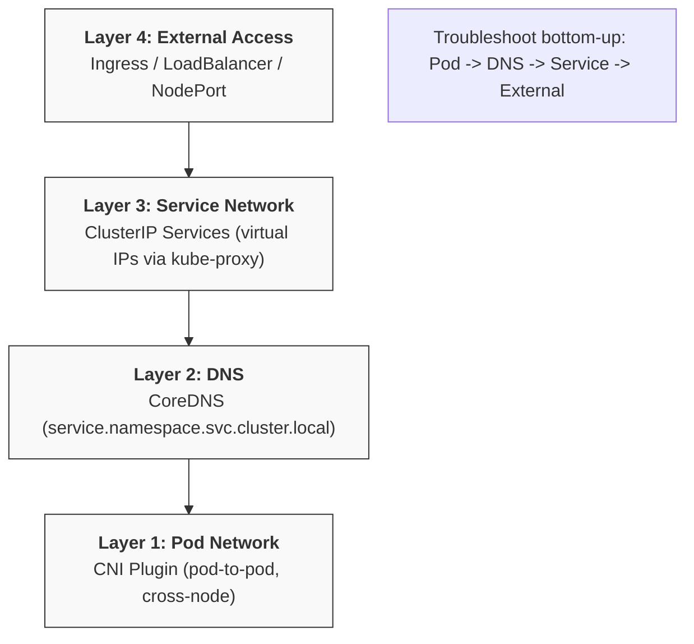
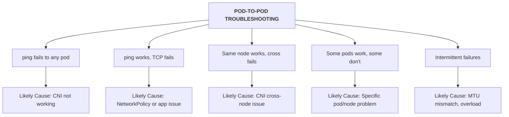
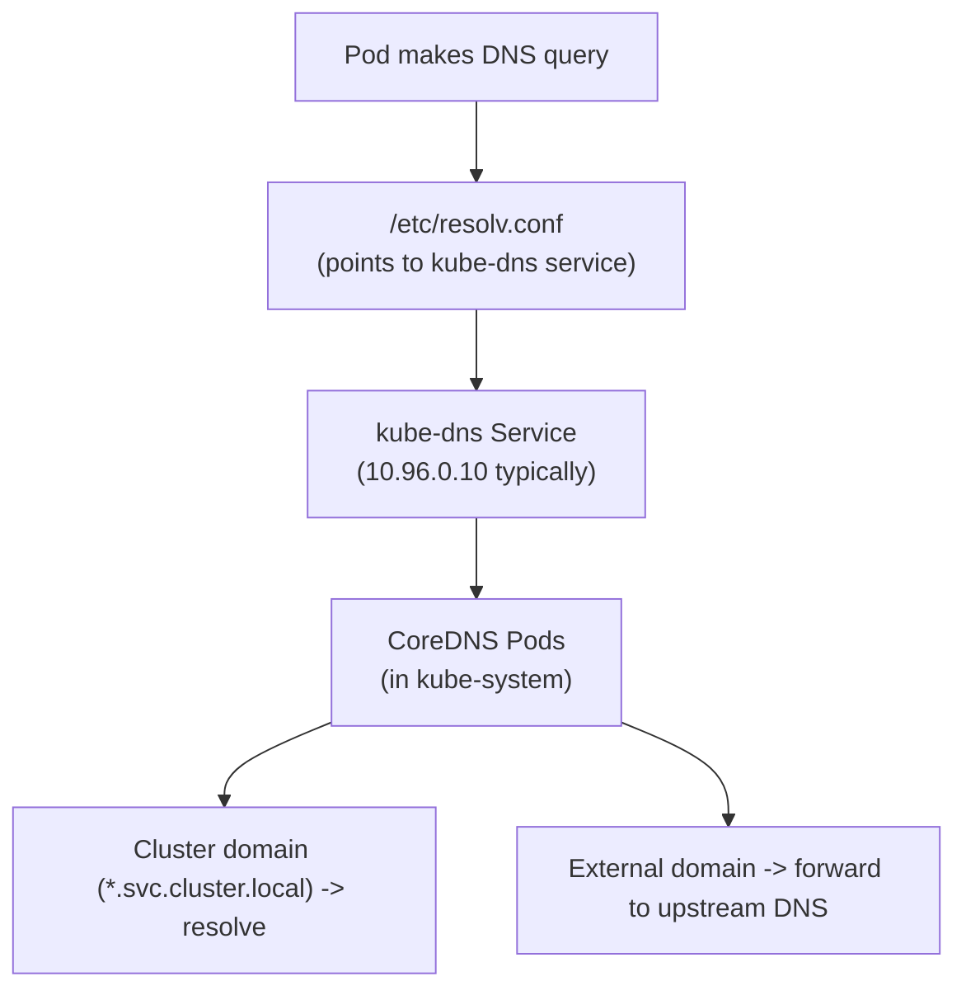
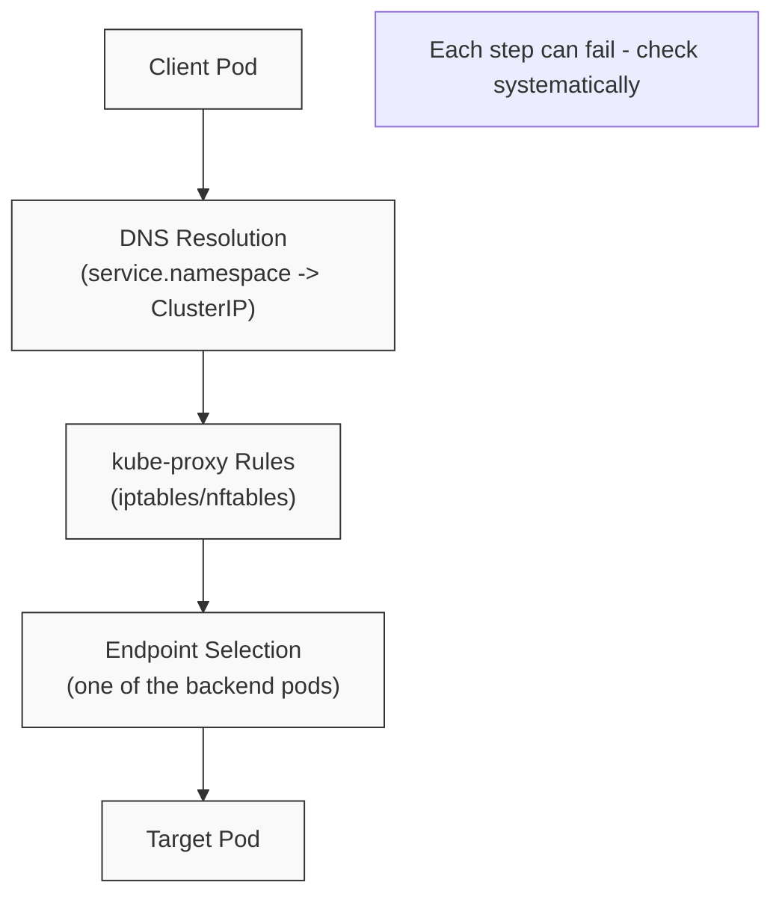
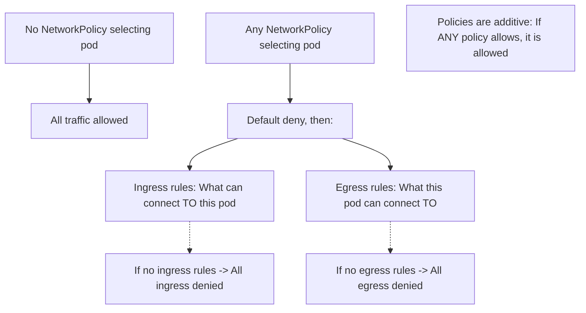
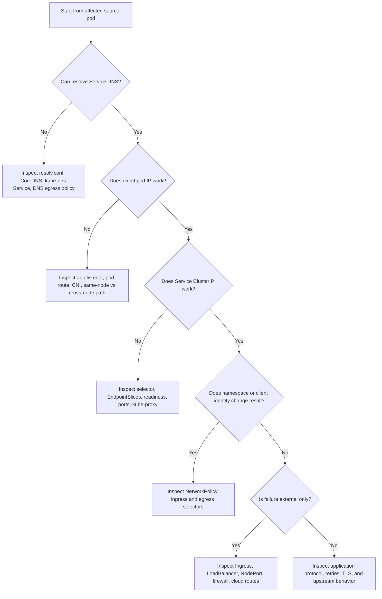

> **Complexity**: `[COMPLEX]` - Multiple layers to debug
>
> **Time to Complete**: 50-60 minutes
>
> **Prerequisites**: Module 5.1 (Methodology), Module 3.1-3.7 (Services & Networking)

---

## What You'll Be Able to Do

After this module, you will be able to:
- **Diagnose** pod-to-pod, pod-to-service, and external-to-service connectivity failures with layer-by-layer evidence instead of guesswork
- **Trace** a request through pod IP routing, DNS, Service virtual IPs, EndpointSlices, kube-proxy rules, and the CNI data plane
- **Fix** NetworkPolicy, DNS, selector, readiness, and port-mapping faults that break otherwise healthy workloads
- **Evaluate** whether a failure belongs to the application, Kubernetes Service plumbing, cluster DNS, CNI routing, or external infrastructure
- **Implement** repeatable network-debugging drills with `kubectl`, `curl`, `wget`, `nslookup`, `ss`, `tcpdump`, and ephemeral debug containers

---

## Why This Module Matters

Hypothetical scenario: an application team reports that checkout pods are healthy, the database pods are healthy, and the Service object exists, yet requests from checkout to the database time out after deployment. One engineer starts editing the Service, another restarts CoreDNS, and a third deletes a NetworkPolicy because each symptom looks plausible in isolation. The outage keeps moving because no one has proved which network layer is actually failing.

Kubernetes networking feels difficult because the path is invisible unless you deliberately reveal it. A request can fail before it leaves the source pod, while resolving DNS, while being translated through a Service virtual IP, while selecting an endpoint, while crossing nodes through the CNI plugin, while passing a NetworkPolicy rule, or while exiting the cluster through node routing and firewall controls. The right troubleshooting habit is not to memorize a larger pile of commands; it is to build a small chain of observations where each command either confirms a layer or narrows the next layer to inspect.

This module trains that habit for the CKA troubleshooting domain and for real cluster work. You will preserve the same mental model throughout the lesson: start with the source pod, prove name resolution, prove raw connectivity, prove the Service-to-endpoint relationship, prove policy intent, then move outward to node, CNI, or infrastructure boundaries. Kubernetes 1.35 and newer still rely on these fundamentals even as kube-proxy backends, EndpointSlice behavior, and CNI implementations vary across clusters.

Think of cluster networking as a highway system. Pods are cars with unique addresses, Services are well-known exits that distribute traffic to several destinations, DNS is the navigation system that translates names into addresses, NetworkPolicies are toll gates that decide which traffic may pass, and the CNI plugin is the road authority that connects streets across nodes. When traffic stops moving, you do not repair every road at once; you inspect one checkpoint at a time until the broken checkpoint is obvious.

## Networking Model and First Triage

Kubernetes gives every pod its own IP address, and the platform expects pods to reach other pods without application-level port mapping. That design is powerful because a workload can move across nodes while still behaving like a small machine on a flat network, but it also means failure signals can look deceptively similar. A timeout from `curl` might mean a process is not listening, a Service has no endpoints, a NetworkPolicy denies egress, a CNI route is broken, or a firewall outside the cluster blocks node traffic.

The first discipline is to separate name, route, translation, and application response. If DNS cannot resolve a name, Service debugging is premature. If a pod IP responds but a Service name fails, the pod network is probably alive and the Service-to-endpoint path deserves attention. If a Service ClusterIP works from one namespace but not another, policy or namespace selection becomes more likely. Pause and predict: if `nslookup web.network-lab.svc.cluster.local` succeeds but `wget http://web.network-lab.svc.cluster.local` returns connection refused, which layer has been proven good, and which layer should you inspect next?



The diagram is intentionally bottom-up because lower layers are prerequisites for higher ones. Pod-to-pod routing has to work before a ClusterIP can reliably forward traffic to backend pods. DNS has to return the expected Service name before a client can use stable service discovery. kube-proxy or its replacement has to translate a virtual IP to a real backend endpoint before the request reaches an application container. External access adds still more systems, including cloud load balancers, ingress controllers, node firewalls, and routing policies outside Kubernetes.

Use a purpose-built debug image when the application container is too small for networking tools. Many production containers are distroless or deliberately minimal, which is good for security and image size but frustrating during diagnosis. A debug pod gives you `curl`, `wget`, `dig`, `nslookup`, `ss`, `tcpdump`, and related utilities without rebuilding the application image. An ephemeral debug container is especially useful when you must observe packets from the target pod's network namespace.

```bash
# Create a debug pod for testing.
kubectl run netshoot --image=nicolaka/netshoot --rm -it --restart=Never -- bash

# Or use a smaller BusyBox pod when you only need simple tools.
kubectl run debug --image=busybox:1.36 --rm -it --restart=Never -- sh
```

Start every investigation by recording the source, destination, namespace, port, and observed error. "Service is down" is too broad to debug; "client pod `frontend-abc` in namespace `shop` times out when connecting to `http://orders.shop.svc.cluster.local:8080`, but can resolve the name" is actionable. That single sentence tells you the client identity, the policy context, the name being resolved, the transport port, and whether DNS has already been checked.

| Observation | Layer Mostly Proven | Next Useful Check |
|-------------|---------------------|-------------------|
| Pod cannot resolve any cluster Service name | None above DNS | Check `/etc/resolv.conf`, CoreDNS pods, and `kube-dns` endpoints |
| Pod resolves Service name but Service has empty endpoints | DNS | Check Service selector, pod labels, readiness, and EndpointSlices |
| Pod IP works but Service ClusterIP fails | Pod network | Check Service ports, targetPort, endpoints, and kube-proxy health |
| Same-node pod traffic works but cross-node pod traffic fails | Local pod networking | Check CNI pods on each node, routes, encapsulation, MTU, and firewalls |
| One namespace fails while another succeeds | Destination workload may be healthy | Check NetworkPolicy selectors, namespace selectors, and egress rules |
| External client fails while in-cluster client succeeds | Internal Service path | Check Ingress, LoadBalancer, NodePort, cloud firewall, and node reachability |

Do not skip the exact error text. A DNS `NXDOMAIN`, a DNS timeout, a TCP timeout, a TCP connection refused, and an HTTP 503 each point to a different part of the path. A timeout often means traffic is being dropped or cannot return, while connection refused usually means a packet reached an address where nothing accepted the requested port. HTTP errors mean the network probably delivered the request far enough for an application, proxy, or ingress component to respond.

## Pod, CNI, and DNS Failures

Pod-to-pod checks are the cleanest way to separate the application process from cluster routing. First identify the source pod and target pod IPs with `kubectl get pods -o wide`, then test a minimal path before using a Service name. ICMP can be useful when allowed, but many clusters or images restrict ping, so TCP checks against the actual application port are more reliable. Before running this, what output do you expect if the target pod is reachable at the IP layer but the application is not listening on the tested port?

```bash
# Get pod IPs.
kubectl get pods -o wide

# Test from one pod to another.
kubectl exec <source-pod> -- ping -c 3 <target-pod-ip>
kubectl exec <source-pod> -- wget -qO- --timeout=2 http://<target-pod-ip>:<port>
kubectl exec <source-pod> -- nc -zv <target-pod-ip> <port>

# Capture packets using an ephemeral debug container.
# This is useful when target pods run distroless or minimal images.
kubectl debug <target-pod> -it --image=nicolaka/netshoot -- tcpdump -nni eth0 -c 10 port <port>
```

When pod-to-pod traffic fails, read the shape of the failure before changing anything. If no pods can reach any other pods, the CNI plugin or node networking is suspicious. If same-node traffic works but cross-node traffic fails, local Linux bridges may be fine while overlay encapsulation, routing, or firewall rules between nodes are broken. If ICMP works but TCP fails on one port, the pod network may be healthy and the problem may be NetworkPolicy, the listening process, or the wrong port.



CNI troubleshooting has two sides: Kubernetes objects and node-local files. From the API, you can confirm whether CNI DaemonSet pods are present and healthy on every node. From the node, you can confirm whether kubelet has CNI configuration under `/etc/cni/net.d/` and binaries under `/opt/cni/bin/`. In a managed cluster, you may not edit those files directly, but knowing they exist helps you interpret node events such as `FailedCreatePodSandBox` or pods stuck in `ContainerCreating`.

```bash
# Check CNI pods are running.
kubectl -n kube-system get pods | grep -E "calico|flannel|weave|cilium"

# Check CNI pod logs.
kubectl -n kube-system logs <cni-pod>

# Check CNI configuration on a node.
ls -la /etc/cni/net.d/
cat /etc/cni/net.d/*.conf

# Check if CNI binaries exist.
ls -la /opt/cni/bin/
```

| Issue | Symptom | Fix |
|-------|---------|-----|
| CNI pods not running | All pods stuck ContainerCreating | Deploy or repair the CNI plugin |
| CNI config missing | Pods cannot get IPs | Check `/etc/cni/net.d/` and kubelet events |
| CNI binary missing | Runtime sandbox errors | Install or repair CNI binaries |
| CIDR overlap | IP conflicts or unpredictable routing | Reconfigure pod CIDR or conflicting network ranges |
| MTU mismatch | Intermittent drops, especially on larger responses | Align MTU settings across overlay and underlay |

DNS sits above pod routing but below most Service symptoms, so it deserves its own deliberate pass. A pod normally receives a `/etc/resolv.conf` that points to the cluster DNS Service, commonly named `kube-dns`, which is often backed by CoreDNS pods in `kube-system`. Service names can be short, namespace-qualified, or fully qualified as `service.namespace.svc.cluster.local`, depending on search paths and `ndots`. Slow DNS can be just as damaging as failed DNS because retries can make a healthy application look overloaded.



Test DNS from the same source pod that experiences the failure. Testing from your laptop, from a node, or from a different namespace changes the resolver configuration and NetworkPolicy context. Use short names and fully qualified names because a failure in one form may reveal search-path or namespace assumptions. If cluster names resolve but external names fail, CoreDNS may be healthy for Kubernetes zones while upstream forwarding, node DNS, or egress policy remains broken.

```bash
# Check the pod's DNS config.
kubectl exec <pod> -- cat /etc/resolv.conf

# Test cluster DNS.
kubectl exec <pod> -- nslookup kubernetes
kubectl exec <pod> -- nslookup kubernetes.default
kubectl exec <pod> -- nslookup kubernetes.default.svc.cluster.local

# Test service DNS.
kubectl exec <pod> -- nslookup <service-name>
kubectl exec <pod> -- nslookup <service-name>.<namespace>
kubectl exec <pod> -- nslookup <service-name>.<namespace>.svc.cluster.local

# Test external DNS.
kubectl exec <pod> -- nslookup google.com
```

CoreDNS itself is reached through a Kubernetes Service, so DNS troubleshooting often becomes Service troubleshooting for the `kube-dns` Service. Check the CoreDNS pods, logs, Service, ConfigMap, and endpoints before editing application workloads. A missing endpoint behind `kube-dns` means queries have nowhere to go, while a ConfigMap loop or bad upstream resolver can make CoreDNS repeatedly restart. A restrictive egress NetworkPolicy can also block UDP or TCP port 53, which looks like DNS failure even when CoreDNS is perfectly healthy.

```bash
# Check CoreDNS pods.
kubectl -n kube-system get pods -l k8s-app=kube-dns
kubectl -n kube-system logs -l k8s-app=kube-dns

# Check the kube-dns service.
kubectl -n kube-system get svc kube-dns

# Check the CoreDNS configmap.
kubectl -n kube-system get configmap coredns -o yaml

# Verify endpoints.
kubectl -n kube-system get endpoints kube-dns
```

| Issue | Symptom | Diagnosis | Fix |
|-------|---------|-----------|-----|
| CoreDNS not running | All DNS fails | Check CoreDNS pods | Fix or restart CoreDNS |
| Wrong nameserver | DNS timeout | Check `/etc/resolv.conf` | Fix kubelet DNS config |
| CoreDNS crashloop | Intermittent DNS | Check CoreDNS logs | Fix loop detection or upstream configuration |
| Network policy blocks | DNS blocked | Check policies | Allow DNS on port 53 |
| `ndots` issue | Slow external DNS | Check `ndots` in `resolv.conf` | Adjust `dnsConfig` only when justified |

Use fixes that match the evidence. Scaling CoreDNS helps only when there are too few healthy replicas; it does not repair a blocked egress policy or a bad Service selector. Editing the CoreDNS ConfigMap can be necessary for loop or upstream problems, but it is a cluster-level change and should be treated as such. In an exam lab you may make a direct correction, while in production you would normally capture the current ConfigMap, make the smallest change, and monitor logs plus DNS query behavior.

```bash
# Check the CoreDNS deployment.
kubectl -n kube-system get deployment coredns

# Scale up if replicas were accidentally reduced.
kubectl -n kube-system scale deployment coredns --replicas=2

# Check for pod issues.
kubectl -n kube-system describe pod -l k8s-app=kube-dns
```

```bash
# Check logs for a "Loop" message.
kubectl -n kube-system logs -l k8s-app=kube-dns | grep -i loop

# Fix in an exam lab by editing the CoreDNS ConfigMap.
kubectl -n kube-system edit configmap coredns
# Remove or correct the problematic loop or forwarding configuration.
```

```bash
# Check kubelet config for cluster DNS.
cat /var/lib/kubelet/config.yaml | grep -A 5 "clusterDNS"

# The value should point to the kube-dns Service IP, for example:
# - 10.96.0.10
```

## Service, Policy, and External Paths

Service troubleshooting starts after you know the source pod can send traffic and resolve names. A ClusterIP is not a real pod address; it is a virtual IP that kube-proxy, or an equivalent dataplane, translates to one of the selected backend endpoints. That translation depends on a chain of objects: the Service selector must match pod labels, the selected pods must be Ready, EndpointSlices or Endpoints must contain backend addresses, and the Service port must map to the actual container port. A failure in any one of those objects can make a healthy pod look unreachable.



Test a Service by both ClusterIP and DNS name when possible. If the ClusterIP works but the DNS name fails, the Service object and endpoints are probably functional while DNS is not. If DNS resolves but the ClusterIP fails, focus on the Service ports, endpoints, readiness, kube-proxy, and policy. If the pod IP works but the Service fails, compare `port` and `targetPort` before assuming the application changed.

```bash
# Test by ClusterIP.
kubectl exec <pod> -- wget -qO- --timeout=2 http://<service-cluster-ip>:<port>

# Test by DNS name.
kubectl exec <pod> -- wget -qO- --timeout=2 http://<service-name>:<port>

# Test with curl if available.
kubectl exec <pod> -- curl -s --connect-timeout 2 http://<service-name>:<port>
```

Endpoints are the most important Service clue because an empty endpoint list tells you the Service has no selected, Ready destinations. In Kubernetes 1.35 and newer, EndpointSlices are the scalable API behind this concept, while the older Endpoints view is still familiar in many debugging flows. The troubleshooting question is the same either way: did the Service choose the pods you thought it chose, and are those pods currently eligible to receive traffic?

```bash
# Check service exists and has correct type and ports.
kubectl get svc <service-name>
kubectl describe svc <service-name>

# Critical: check endpoints.
kubectl get endpoints <service-name>
# Empty endpoints means the Service cannot find Ready pods.

# Check selector matches pods.
kubectl get svc <service-name> -o jsonpath='{.spec.selector}'
kubectl get pods -l <selector>

# Check pods are Ready.
kubectl get pods -l <selector> -o wide
```

| Issue | Symptom | Diagnosis | Fix |
|-------|---------|-----------|-----|
| No endpoints | Connection refused or timeout | `kubectl get endpoints` is empty | Fix selector, pod labels, or workload availability |
| Wrong selector | Endpoints empty | Compare Service selector and pod labels | Patch the Service selector or relabel pods |
| Wrong port | Connection refused | Check Service `port` versus `targetPort` | Align Service mapping with container listener |
| Pods not Ready | Missing or partial endpoints | Check readiness probes and pod status | Fix readiness probe or application health |
| kube-proxy down | Many Services fail on a node or cluster-wide | Check kube-proxy pods and node rules | Restart or repair kube-proxy configuration |

```bash
# Check EndpointSlices for the Service when the cluster uses the scalable endpoint API.
kubectl get endpointslice -l kubernetes.io/service-name=<service-name>
```

```bash
# Check kube-proxy pods when many Services fail from a node or across the cluster.
kubectl -n kube-system get pods -l k8s-app=kube-proxy -o wide
```

```bash
# Inspect recent kube-proxy logs for rule-programming or backend errors.
kubectl -n kube-system logs -l k8s-app=kube-proxy --tail=50
```

Selector and port bugs are common because they are visually small but semantically large. A Deployment might label pods `app.kubernetes.io/name: web` while an older Service selects `app: web`, producing no endpoints even though both objects look reasonable at a glance. A Service might expose port 80 and target port 8080, while the container listens on 80, which produces a refused connection after traffic reaches the pod. Which approach would you choose here and why: patch the Service selector to match existing pods, or change pod labels to match the Service?

```bash
# Get service selector.
kubectl get svc my-service -o jsonpath='{.spec.selector}'
# Example output: {"app":"myapp"}

# Get pod labels.
kubectl get pods --show-labels

# If they do not match, fix the Service selector.
kubectl patch svc my-service -p '{"spec":{"selector":{"app":"correct-label"}}}'
# Or fix pod labels when the Service selector is the intended contract.
```

```bash
# Check service ports.
kubectl get svc my-service -o yaml | grep -A 10 "ports:"

# Verify pod is listening on targetPort.
kubectl exec <pod> -- netstat -tlnp
# Or use ss when netstat is unavailable.
kubectl exec <pod> -- ss -tlnp

# Fix the service mapping.
kubectl patch svc my-service -p '{"spec":{"ports":[{"port":80,"targetPort":8080}]}}'
```

NetworkPolicy adds another decision layer because it changes what traffic is allowed after pods are selected by policy. Policies are additive, so traffic is allowed if any applicable policy allows it, but a pod becomes isolated for a direction only when a policy selecting that pod applies to ingress or egress for that direction. This is the source of many surprises: adding an ingress-only policy does not automatically restrict egress, while adding `Egress` with no egress rules can block DNS, package repositories, APIs, and other dependencies.



Policy debugging must use the real source and destination pods because labels, namespaces, and directions all matter. A test from a privileged debug namespace may bypass the exact rule that blocks the application. Always list policies in the relevant namespace, inspect pod selectors, and read both `policyTypes` and rule bodies. Remember that Kubernetes defines the API semantics, while the CNI plugin must implement enforcement; a cluster without NetworkPolicy enforcement will accept objects without actually filtering traffic.

```bash
# List all NetworkPolicies.
kubectl get networkpolicy -A

# Check policies in a specific namespace.
kubectl get networkpolicy -n <namespace>

# Examine policy details.
kubectl describe networkpolicy <name> -n <namespace>

# Check which pods are selected.
kubectl get networkpolicy <name> -o jsonpath='{.spec.podSelector}'
```

| Issue | Symptom | Fix |
|-------|---------|-----|
| Egress blocks DNS | DNS fails | Allow egress to kube-dns on port 53 |
| Ingress too restrictive | Connection timeout or refused from expected clients | Check ingress rules and add the correct source |
| Forgot namespace | Cross-namespace traffic blocked | Add a `namespaceSelector` or use same-namespace rules intentionally |
| Wrong pod selector | Policy not applied or applies to wrong pods | Fix `podSelector` labels and verify selected pods |

The canonical DNS egress rule allows UDP and TCP port 53 to the cluster DNS namespace. Use namespace labels that exist in your cluster; recent Kubernetes clusters automatically label namespaces with `kubernetes.io/metadata.name`, which makes namespace selection clearer than relying on custom labels. A policy like this should be paired with application-specific egress allows rather than treated as a universal fix. It is one part of the policy set, not a replacement for reviewing the destination dependencies.

```yaml
apiVersion: networking.k8s.io/v1
kind: NetworkPolicy
metadata:
  name: allow-dns
spec:
  podSelector: {}  # All pods
  policyTypes:
  - Egress
  egress:
  - to:
    - namespaceSelector:
        matchLabels:
          kubernetes.io/metadata.name: kube-system
    ports:
    - protocol: UDP
      port: 53
    - protocol: TCP
      port: 53
```

In a lab, temporarily removing a policy can be a fast way to prove that policy is the blocker. In production, that maneuver can widen access more than intended, so prefer a narrow test namespace, a copied workload, or a temporary allow rule that is easy to review and remove. If you do delete a policy during an exam or isolated exercise, save it first and restore it immediately after the observation. The goal is evidence, not a permanent security bypass.

```bash
# Save the policy.
kubectl get networkpolicy <name> -o yaml > policy-backup.yaml

# Delete to test in an isolated lab.
kubectl delete networkpolicy <name>

# Test connectivity.
kubectl exec <pod> -- wget -qO- http://<service>

# Restore.
kubectl apply -f policy-backup.yaml
```

External connectivity adds the fewest Kubernetes guarantees and the most environment-specific behavior. For outbound traffic, prove DNS first, then prove raw IP reachability, then compare pod behavior with node behavior. For inbound traffic, distinguish NodePort, LoadBalancer, and Ingress because each adds different infrastructure. A LoadBalancer stuck in `pending` is usually a cloud-controller or provider integration issue, while an Ingress returning the wrong response may be an ingress-controller, host rule, TLS, or backend Service issue.

```bash
# Test outbound.
kubectl exec <pod> -- wget -qO- --timeout=5 http://example.com

# If failing, check DNS resolution.
kubectl exec <pod> -- nslookup example.com

# Check network path by IP.
kubectl exec <pod> -- ping -c 2 8.8.8.8

# Compare node-level connectivity from the node.
curl -I http://example.com
```

```bash
# For a NodePort service.
curl http://<node-ip>:<node-port>

# For a LoadBalancer, if available.
kubectl get svc <service> -o jsonpath='{.status.loadBalancer.ingress[0].ip}'
curl http://<lb-ip>

# For Ingress.
curl -H "Host: <hostname>" http://<ingress-ip>
```

| Issue | Check | Fix |
|-------|-------|-----|
| NAT not working | Node packet rules and CNI egress behavior | Check CNI and kube-proxy or replacement dataplane |
| Firewall blocking | Cloud firewall rules or security groups | Open only the required ports and sources |
| No route to internet | Node routing and default gateway | Fix node network configuration |
| LoadBalancer pending | Cloud controller and provider events | Repair cloud integration or use the supported Service type |

### Worked Example: Following One Failed Request

Exercise scenario: a frontend pod in namespace `shop` cannot call `http://orders.shop.svc.cluster.local:8080`, and the only symptom from the application log is a timeout. Start by resisting the urge to inspect the most complex component first. A timeout is a shape, not a diagnosis, and several layers can produce it. The useful move is to write a short fault statement that names the source pod, destination name, namespace, port, and error. That statement gives you a stable thread to follow while the cluster presents many tempting distractions.

The first check is whether the source pod has the resolver configuration Kubernetes should have provided. If `/etc/resolv.conf` points at an unexpected nameserver, then every Service name test becomes suspect. If the nameserver is the cluster DNS Service and `nslookup orders.shop.svc.cluster.local` returns an address, you have not proven the Service path, but you have proven that the source pod can reach DNS far enough to receive a useful answer. That small distinction prevents the common mistake of declaring the whole network healthy after one successful name lookup.

Next, compare a short Service name with the fully qualified name. If the fully qualified name works and the short name fails, the Service may exist while the namespace search path or caller assumption is wrong. If both forms fail with the same timeout, inspect CoreDNS and DNS egress policy. If both forms resolve to the same ClusterIP, move on instead of continuing to tune DNS. Troubleshooting stays fast when you leave a layer after it gives you the specific proof you needed.

After DNS resolves, inspect the Service object and endpoints before testing deeper packet paths. A Service can resolve even when it has no backends, because the DNS record belongs to the Service object, not to the selected pods. Empty endpoints shift the investigation toward selectors, labels, readiness, or workload availability. Populated endpoints shift the investigation toward ports, policies, kube-proxy, or backend application behavior. The endpoint list is therefore the hinge between name discovery and actual traffic delivery.

Suppose the endpoint list is empty. The Service selector might be `app: orders`, while the Deployment template labels pods with `app.kubernetes.io/name: orders`. Both labels are reasonable in isolation, but Kubernetes does not infer that they mean the same workload. The repair should preserve the intended ownership model: if the platform standard says Services use the recommended `app.kubernetes.io/name` label, patch the Service; if an older Service contract is intentional, update the pod template and roll the Deployment. The exam version is usually simpler, but the reasoning is the same.

Suppose endpoints exist, yet the request still times out. Now test a selected pod IP directly from the same frontend pod, using the port that the application is supposed to listen on. If the pod IP works and the Service fails, the workload listener and pod route are probably healthy, so Service port mapping or kube-proxy behavior deserves attention. If the pod IP fails in the same way, the Service is not the first suspect. You are now looking at policy, the target process, CNI routing, or node-level packet handling.

When a direct pod IP fails, distinguish timeout from refused connection. Refused connection normally means the destination stack answered but no process accepted the port, which points toward the application listener, container port, or `targetPort`. Timeout suggests a drop, missing route, blocked return path, or policy denial. That difference is why a raw `curl` result is not enough; you need to preserve the exact error, the tested destination, and whether the same source can reach anything else in the namespace.

Now add NetworkPolicy to the reasoning. If only pods from one namespace fail while pods in the target namespace succeed, policy becomes more likely than CNI. Inspect both sides of the rule: ingress to the `orders` pods and egress from the `frontend` pods. A policy that selects `orders` for ingress can block callers even when egress is open, while a policy that selects `frontend` for egress can block outbound traffic before it reaches the Service. Direction matters because Kubernetes treats ingress and egress isolation independently.

DNS failures after policy changes deserve extra care because they can masquerade as application outages. An egress deny policy without a DNS exception may prevent the pod from resolving `orders`, external package repositories, or cloud metadata endpoints. If a pod can reach a known IP but cannot resolve names, do not restart every CoreDNS pod first. Confirm the policy selects the client, then add an explicit DNS egress allow to the cluster DNS destination. That fix matches the symptom and preserves the security intent.

If the Service path works from one node but not another, return to CNI and node placement. Use `kubectl get pods -o wide` to identify where the source and destination pods run, then compare same-node and cross-node behavior. Same-node success with cross-node failure often indicates overlay encapsulation, routing, MTU, or firewall problems between nodes. This is different from a Service selector issue, which would normally affect all clients the same way because the Service has the same endpoint set from the API perspective.

MTU problems are especially confusing because small checks can pass while larger responses fail. A tiny TCP handshake or short HTTP response may succeed, then a larger payload stalls when encapsulation overhead pushes packets beyond the real path MTU. The symptom often appears intermittent because it depends on response size, path, and retransmission behavior. In that case, look for CNI documentation, node interface MTU, overlay mode, and whether recent infrastructure changes altered the underlay network.

kube-proxy is a later suspect, not an early one. If many Services fail from one node, or if ClusterIP traffic behaves differently depending on the source node, kube-proxy rules or the node dataplane may be involved. Check kube-proxy pods, node logs, and whether the cluster uses iptables, nftables, or another implementation. For a single Service with empty endpoints or a wrong target port, kube-proxy is probably doing exactly what the API tells it to do, so changing kube-proxy would only add risk.

External access should be debugged only after the internal Service path is proven. If a pod inside the cluster can reach the Service by DNS and ClusterIP, then the workload, endpoints, and basic Service plumbing are healthy. An external failure through Ingress or LoadBalancer belongs to the outer path: ingress-controller rules, host headers, TLS, cloud load balancer health checks, NodePort reachability, or firewall policy. This separation keeps you from relabeling pods when the real issue is a missing host rule.

Ingress troubleshooting also depends on preserving the HTTP host header. A request to the ingress IP without the expected `Host` value may hit a default backend, while the same IP with the correct host routes to the intended Service. That is why `curl -H "Host: <hostname>" http://<ingress-ip>` is a sharper test than a bare curl to the IP. If the host-specific request works but public DNS fails, the Kubernetes path may be healthy and the remaining problem may live in external DNS or load balancer configuration.

LoadBalancer troubleshooting varies by provider, but the decision point is still straightforward. If the Service remains pending, Kubernetes did not receive an external address from the cloud or load-balancer integration. If it has an external address but health checks fail, inspect node ports, firewall rules, service annotations, and backend readiness. If the load balancer reaches the ingress controller but the controller cannot reach the backend Service, return to the internal Service checks you already practiced. Each provider adds details, but the layered method remains stable.

Packet capture is most useful after you have a precise question. Capturing on every node before forming a hypothesis creates noise and may require privileges you do not need. A better question is, "Do packets for port 8080 arrive at the target pod when the frontend connects?" An ephemeral debug container with `tcpdump` can answer that without modifying the application image. If packets arrive but no response leaves, inspect the application listener or local policy. If packets never arrive, move backward toward Service, policy, CNI, or source routing.

Be careful with successful tests, too. A successful `nslookup` proves that a DNS query completed; it does not prove that the application protocol works. A successful `ping` proves only some IP reachability if ICMP is allowed; it does not prove TCP on the application port. A successful `curl` from a different namespace proves the destination can answer somebody; it does not prove the affected source is allowed. Good troubleshooting treats every success as a bounded proof with a clear edge.

In exam conditions, write the smallest fix that restores the intended path. If endpoints are empty because of a selector mismatch, patch the selector or labels rather than restarting the Deployment. If DNS is blocked by policy, add the DNS egress rule rather than deleting every policy. If `targetPort` is wrong, fix the Service mapping rather than changing the application image. The fastest fix is usually the one closest to the failing proof, not the one that touches the most famous component.

In production conditions, the same method gains one more requirement: preserve evidence before and after the change. Capture the failed command, the relevant object output, the proposed correction, and the successful retest. That evidence lets reviewers see why a label patch, policy rule, or Service port change was justified. It also protects future responders from repeating the same investigation when a similar symptom appears later in another namespace.

Finally, convert the investigation into a reusable drill. Pick one healthy Service and practice resolving its name, listing endpoints, testing ClusterIP, testing a selected pod IP, checking policy, and identifying node placement. Then deliberately break one variable in a lab namespace and predict the symptom before running the command. This kind of rehearsal builds the mental index you need when the real failure is noisy, time-bound, and surrounded by unrelated cluster events.

Another useful habit is to name the boundary you just crossed. When you move from a Service name to a ClusterIP, you crossed the DNS boundary. When you move from a ClusterIP to a selected pod IP, you crossed the Service translation boundary. When you move from same-node traffic to cross-node traffic, you crossed the CNI node boundary. Naming those boundaries makes your notes clearer and helps a reviewer understand why the next command follows from the previous one.

The same boundary habit keeps you honest about rollback. If you changed a NetworkPolicy to test a policy boundary, the retest should exercise the same source, destination, and port that failed before. If you changed a Service selector to test the endpoint boundary, the retest should show endpoints repopulating before you declare the application fixed. A change that improves a different path may still be useful information, but it does not prove that the original incident is resolved.

You should also separate control-plane truth from data-plane truth. The API may show a correct Service selector, endpoints, and policies, while a node still has stale packet rules or a CNI process is unhealthy. Conversely, the node dataplane may be ready, while the API objects tell it to route to nothing because readiness removed all endpoints. Good troubleshooting checks both views at the moment they become relevant instead of assuming one view automatically guarantees the other.

Readiness deserves special attention because it is intentionally conservative. Kubernetes removes an unready pod from Service endpoints to protect clients from a backend that cannot safely receive traffic. That behavior is correct even when it surprises someone who only looked at `Running` status. If a rollout fails readiness because a database dependency is unavailable, the Service symptom may be empty endpoints, but the real fix belongs to the application dependency or readiness probe design.

Named ports can make Service manifests easier to maintain, but they add one more thing to inspect. A Service `targetPort` can refer to a named container port, and that name must exist on the selected pods. If a Deployment changes the port name while leaving the number familiar, the YAML can look reasonable while traffic goes nowhere useful. In troubleshooting, inspect the rendered pod spec and Service together, not just the Service summary.

Dual-stack clusters add another source of misleading partial success. A client might resolve both IPv4 and IPv6 addresses, then prefer an address family that the path cannot actually carry. The symptom can look like slow connection attempts or inconsistent behavior across images and client libraries. If a cluster uses dual-stack networking, include address family in your notes and compare what DNS returned with what the source pod actually tried to connect to.

Headless Services are a deliberate exception to the usual ClusterIP mental model. They return individual backend pod addresses through DNS instead of sending traffic through a virtual IP. That makes them useful for stateful systems, but it changes the debugging path: DNS answers now expose pod membership directly, and kube-proxy translation is not the central question. If a headless Service is involved, inspect the DNS answer set, pod readiness, and StatefulSet identity before using the ordinary ClusterIP checklist.

ExternalName Services are another exception because they do not select pods at all. They create a DNS alias to an external name, so empty endpoints are expected and not automatically a failure. If a learner applies the endpoint-first rule without recognizing the Service type, they may chase a selector that does not exist. Always read the Service type early; ClusterIP, Headless, NodePort, LoadBalancer, Ingress backend, and ExternalName each change which checks are meaningful.

Finally, remember that troubleshooting commands can alter timing. Starting a debug pod, running repeated DNS queries, or deleting a policy in a lab changes the environment enough to mask race conditions or cache behavior. That does not mean you should avoid tools; it means you should record the order of observations and prefer the least invasive command that can answer the current question. Clear notes turn a live debugging session into evidence rather than folklore.

## Patterns & Anti-Patterns

Good network troubleshooting is repeatable because it turns vague connectivity complaints into a fixed sequence of proofs. The sequence should begin from the complaining workload, not from the object you suspect. From there, use progressively broader checks: local resolver config, DNS response, direct pod IP, Service ClusterIP, endpoints, policy, node path, and external infrastructure. This pattern avoids the common trap where an engineer edits three unrelated objects and then cannot tell which change altered the outcome.

| Pattern | When to Use | Why It Works | Scaling Consideration |
|---------|-------------|--------------|-----------------------|
| Source-based testing | Any user-facing network failure | It preserves namespace, labels, service account, DNS config, and policy context | Use reusable debug pods or ephemeral containers per namespace |
| Endpoint-first Service debugging | Service resolves but traffic fails | Empty or wrong endpoints explain many Service failures quickly | Prefer EndpointSlices for large Services, while knowing Endpoints is still common in exams |
| Policy isolation by direction | NetworkPolicy may be involved | Ingress and egress isolation are separate, so direction prevents false conclusions | Maintain policy diagrams or generated reports for busy namespaces |
| Compare pod IP and Service path | Unsure whether Service plumbing is broken | Direct pod IP proves the workload listener and pod route before testing virtual IP translation | Automate smoke tests that hit both direct and Service paths in staging |

Anti-patterns usually come from moving faster than the evidence. Restarting CoreDNS because any network symptom mentions a name wastes time when the Service has no endpoints. Deleting all NetworkPolicies proves little if you never tested from the affected source pod first. Editing kube-proxy or CNI settings before proving a simple selector mismatch turns a local bug into a cluster risk. A better habit is to make one observation, form one hypothesis, run one command that can disprove it, and then move to the next layer.

| Anti-Pattern | What Goes Wrong | Better Alternative |
|--------------|-----------------|--------------------|
| Restarting cluster components first | You disrupt healthy systems and hide the original signal | Prove DNS, endpoints, policy, and pod listener state first |
| Testing from an unrelated debug pod | The debug pod may have different namespace, labels, DNS, and policy | Test from the actual source pod or mirror its labels and namespace |
| Treating `Connection refused` as a routing issue | The packet often reached a host where nothing listened on that port | Check `targetPort`, container listener, and readiness before CNI |
| Ignoring readiness | A pod can be Running but intentionally absent from endpoints | Check readiness probes and EndpointSlices before blaming kube-proxy |
| Assuming NetworkPolicy always works | The API object may exist without CNI enforcement | Confirm the cluster CNI supports and enforces NetworkPolicy |
| Fixing DNS by hard-coding IPs | You bypass service discovery and create brittle configuration | Repair CoreDNS, `kube-dns` endpoints, or DNS egress policy |

## Decision Framework

Use the first reliable symptom to choose the next branch, then keep narrowing until only one layer remains. This framework is not a replacement for judgement, but it prevents expensive detours. The important detail is that each branch asks for evidence that can be collected quickly with `kubectl` and ordinary network tools. If a branch proves healthy, do not keep working there just because it was your first suspicion.



| Symptom | First Command | Likely Branch | Do Not Do Yet |
|---------|---------------|---------------|---------------|
| DNS name times out | `kubectl exec <pod> -- nslookup <service>` | DNS or DNS egress | Do not patch Service ports |
| DNS resolves but endpoints are empty | `kubectl get endpoints <service>` | Selector, labels, readiness | Do not restart CoreDNS |
| Pod IP works but Service fails | `kubectl describe svc <service>` | Service ports, endpoints, kube-proxy | Do not rebuild the application image |
| Same namespace works, other namespace fails | `kubectl get networkpolicy -A` | NetworkPolicy selectors | Do not delete policies cluster-wide |
| Internal works, external fails | `kubectl get ingress,svc` | Ingress, LoadBalancer, NodePort, firewall | Do not change pod labels first |

Apply the framework with a strict bias toward reversible observations. Reads are cheap, packet captures are targeted, and one temporary lab-only policy removal is easier to reason about than a cluster-wide restart. In an exam, the fastest path is usually a small correction to labels, ports, readiness, DNS config, or a policy rule. In production, the safest path includes saving before-and-after evidence so reviewers can see why the change matched the failure.

## Did You Know?

- Kubernetes Services are virtual abstractions; kube-proxy commonly programs iptables or nftables rules, while IPVS mode is deprecated for the Kubernetes 1.35 target used by this curriculum.
- DNS for Services is normally exposed through a Service named `kube-dns`, even when the backing implementation is CoreDNS pods running in the `kube-system` namespace.
- NetworkPolicies are additive: if any applicable policy allows a flow, the flow is allowed, but ingress and egress isolation are evaluated separately.
- EndpointSlices were introduced to scale endpoint tracking beyond the older Endpoints object, but many troubleshooting commands and exam habits still begin with `kubectl get endpoints`.

## Common Mistakes

| Mistake | Why It Happens | How to Fix It |
|---------|----------------|---------------|
| Not checking endpoints | The Service object exists, so it feels like routing must be configured | Always check `kubectl get endpoints` or EndpointSlices before changing DNS or CNI |
| Forgetting DNS in NetworkPolicy | Egress deny rules block UDP and TCP port 53 along with application traffic | Add a narrow egress allow to the cluster DNS Service or its pods |
| Testing from the wrong pod | Debug pods in another namespace have different labels and policy context | Test from the actual source pod or intentionally mirror its namespace and labels |
| Ignoring pod readiness | Running pods can be excluded from Service endpoints until probes pass | Check readiness probes, pod conditions, and endpoint membership together |
| Confusing `port` and `targetPort` | The Service accepts one port but forwards to a different container port | Match `targetPort` to the process listening inside the selected pods |
| Treating all timeouts as CNI failures | Policy drops, firewall drops, and dead backends can all look like timeouts | Compare DNS, pod IP, Service IP, and namespace-specific behavior |
| Hard-coding ClusterIPs during a DNS issue | The workaround bypasses service discovery and creates future drift | Fix CoreDNS, resolver config, or DNS egress instead of embedding IPs |

## Quiz

<details>
<summary>Question 1: A frontend pod can resolve `api.shop.svc.cluster.local`, but `wget` to the Service returns connection refused. What do you check next, and why?</summary>

DNS has already been proven good enough to return the Service name, so the next checks should focus on Service translation and the backend listener. Inspect the Service ports, `targetPort`, endpoints, and selected pods with `kubectl describe svc`, `kubectl get endpoints`, and pod label checks. Connection refused usually means traffic reached an address where no process accepted the port, so a wrong `targetPort` or container listener is more likely than CoreDNS. If endpoints are empty, fix selector labels or readiness before changing kube-proxy or CNI settings.

</details>

<details>
<summary>Question 2: Your team adds an egress NetworkPolicy, and suddenly pods cannot resolve internal or external names, although direct IP traffic still works. How do you fix the failure?</summary>

The policy likely isolated egress and forgot DNS, so DNS packets to the cluster DNS Service are being dropped. Confirm the policy selects the affected pods, then allow UDP and TCP port 53 to the DNS destination, commonly the `kube-dns` Service backed by CoreDNS in `kube-system`. Direct IP connectivity working is an important clue because it separates routing from name resolution. The fix should be a narrow DNS egress allow plus any required application destinations, not removing all policy controls.

</details>

<details>
<summary>Question 3: A Service has no endpoints after a Deployment rollout, but the pods are Running. What evidence explains the failure?</summary>

Running pods are not enough for Service membership. The Service selector must match pod labels, and the selected pods must be Ready before they appear as endpoints. Compare `kubectl get svc <name> -o jsonpath='{.spec.selector}'` with `kubectl get pods --show-labels`, then inspect readiness conditions and probe failures. If labels changed during the rollout, patch the Service selector or restore the intended labels according to the workload contract.

</details>

<details>
<summary>Question 4: Same-node pod traffic works, but cross-node pod traffic times out. Which layer is most suspicious, and what checks support that diagnosis?</summary>

The CNI cross-node path is the most suspicious because local pod networking has already been proven by same-node traffic. Check CNI DaemonSet pods on every node, CNI logs, node routes, encapsulation settings, MTU, and firewall rules between nodes. A same-node success does not prove overlay or routed traffic between nodes, so restarting the application would not address the most likely failure. If only one node pair fails, compare node-level networking and CNI pod health on those nodes first.

</details>

<details>
<summary>Question 5: A Service exposes `port: 80` and `targetPort: 8080`, but the container listens on port 80. Will clients reach the application through the Service?</summary>

No, not through that Service mapping. Clients connect to the Service on port 80, but kube-proxy forwards to port 8080 on the selected pod, where the application is not listening. The symptom is commonly connection refused if the packet reaches the pod, or timeout if policy or firewall behavior also interferes. Fix the Service `targetPort` to 80 or change the application to listen on 8080, then verify endpoints and retry from the source pod.

</details>

<details>
<summary>Question 6: CoreDNS pods are restarting and logs mention a forwarding loop. What caused the condition, and what permanent fix should you make?</summary>

CoreDNS has detected that queries are being forwarded back into a resolver path that returns to CoreDNS, often because the upstream resolver configuration points at a local stub or an unsuitable node resolver. Check the CoreDNS ConfigMap and the node resolver configuration used by kubelet or CoreDNS forwarding. A permanent fix is to correct the upstream forwarding target or resolver configuration so CoreDNS sends external queries to a real upstream resolver. Removing symptoms without fixing the loop will let the crash behavior return.

</details>

<details>
<summary>Question 7: In-cluster clients can reach a Service, but users outside the cluster cannot reach it through an Ingress hostname. Where should you focus first?</summary>

The internal Service path is already proven, so focus on the external path: Ingress rules, ingress-controller health, host matching, TLS settings, LoadBalancer or NodePort exposure, and cloud firewall rules. Rechecking pod labels is lower value because in-cluster clients already reached the backend through the Service. Use `curl -H "Host: <hostname>" http://<ingress-ip>` to separate DNS or load-balancer issues from host-rule issues. Then inspect ingress-controller logs and events for routing or certificate errors.

</details>

## Hands-On Exercise: Network Troubleshooting

This exercise builds a small namespace, proves normal connectivity, breaks a Service selector, and observes a restrictive NetworkPolicy. The point is not the nginx workload; it is the investigation sequence. Run the checks from the client pod, write down which layer each command proves, and avoid fixing the deliberate break until you can explain the symptom.

### Setup

```bash
# Create test namespace.
kubectl create ns network-lab

# Create a test deployment.
kubectl -n network-lab create deployment web --image=nginx:1.25 --replicas=2

# Expose as service.
kubectl -n network-lab expose deployment web --port=80

# Create a client pod.
kubectl -n network-lab run client --image=busybox:1.36 --command -- sleep 3600
```

### Task 1: Verify Basic Connectivity

First establish the healthy baseline. You should see web pods become Ready, the Service receive a ClusterIP, and the client pod retrieve the nginx response through both Service connectivity and DNS resolution. If this baseline fails, do not continue to the simulated failures; debug the baseline with the same method from the core lesson.

```bash
# Wait for pods to be ready.
kubectl -n network-lab wait --for=condition=ready pod --all --timeout=60s

# Get service and pod IPs.
kubectl -n network-lab get svc,pods -o wide

# Test from client to service.
kubectl -n network-lab exec client -- wget -qO- --timeout=2 http://web

# Test DNS resolution.
kubectl -n network-lab exec client -- nslookup web
kubectl -n network-lab exec client -- nslookup web.network-lab.svc.cluster.local
```

<details>
<summary>Solution notes for Task 1</summary>

The Service name should resolve inside the namespace, and `wget` should return nginx HTML. This proves the client pod can resolve DNS, can reach the Service virtual IP, and can be forwarded to at least one Ready backend endpoint. If DNS fails but direct ClusterIP works, inspect CoreDNS and resolver configuration. If DNS works but `wget` fails, inspect endpoints and Service port mapping.

</details>

### Task 2: Check Endpoints

Endpoints connect the Service abstraction to real backend pod addresses. In this task, compare the Service selector with pod labels and confirm that the selected pods are Ready. This is the habit that prevents wasted time on DNS or CNI when a simple label mismatch is the actual fault.

```bash
# Verify endpoints exist.
kubectl -n network-lab get endpoints web

# Should show IPs of web pods.
# If empty, check:
kubectl -n network-lab get svc web -o jsonpath='{.spec.selector}'
kubectl -n network-lab get pods --show-labels
```

<details>
<summary>Solution notes for Task 2</summary>

The selector should match the labels created by `kubectl create deployment web`, and the endpoint list should contain the Ready web pod addresses. If endpoints are empty while pods are Running, look at labels and readiness before anything else. If endpoints exist but traffic fails, inspect Service `port` and `targetPort`, then test the pod IP directly from the client.

</details>

### Task 3: Simulate Selector Mismatch

Now deliberately break the Service by changing its selector to a label that no pod has. Notice that DNS still resolves the Service name because the Service object still exists. The important symptom is the empty endpoint list, which means the Service has no Ready backend destinations.

```bash
# Break the service by changing selector.
kubectl -n network-lab patch svc web -p '{"spec":{"selector":{"app":"wrong"}}}'

# Try to connect. This should fail.
kubectl -n network-lab exec client -- wget -qO- --timeout=2 http://web

# Check endpoints. This should be empty.
kubectl -n network-lab get endpoints web

# Fix it.
kubectl -n network-lab patch svc web -p '{"spec":{"selector":{"app":"web"}}}'

# Verify fixed.
kubectl -n network-lab get endpoints web
kubectl -n network-lab exec client -- wget -qO- --timeout=2 http://web
```

<details>
<summary>Solution notes for Task 3</summary>

The failed connection should correlate with empty endpoints, not with a missing Service or DNS record. Restoring the selector to `app=web` repopulates endpoints and makes the Service reachable again. This is the most exam-relevant Service troubleshooting loop: compare selector, labels, readiness, endpoints, and then retry from the original source.

</details>

### Task 4: Test NetworkPolicy

This task applies a restrictive policy that selects all pods in the namespace and isolates both ingress and egress without allow rules. The client should no longer reach the Service, and DNS may also fail depending on the query path and policy enforcement. The lesson is to observe how policy direction changes symptoms, then remove the lab policy to restore the known-good baseline.

```bash
# Apply a restrictive policy.
cat <<EOF | kubectl apply -f -
apiVersion: networking.k8s.io/v1
kind: NetworkPolicy
metadata:
  name: deny-all
  namespace: network-lab
spec:
  podSelector: {}
  policyTypes:
  - Ingress
  - Egress
EOF

# Test connectivity. This should fail now on clusters that enforce NetworkPolicy.
kubectl -n network-lab exec client -- wget -qO- --timeout=2 http://web

# Check what policies exist.
kubectl -n network-lab get networkpolicy

# Remove policy to restore connectivity.
kubectl -n network-lab delete networkpolicy deny-all

# Verify restored.
kubectl -n network-lab exec client -- wget -qO- --timeout=2 http://web
```

<details>
<summary>Solution notes for Task 4</summary>

If your cluster enforces NetworkPolicy, the deny-all policy should block traffic because it selects both the client and server pods and provides no allow rules. If traffic still works, the cluster may use a CNI plugin that does not enforce NetworkPolicy, which is itself an important operational finding. After deleting the policy, retest the same command so you can connect the observed behavior to the policy change.

</details>

### Task 5: Practice Drills

Use these short drills until the command sequence feels automatic. They deliberately repeat the protected troubleshooting assets from the lesson in compact form, but you should still interpret each result rather than treating the commands as a checklist. The CKA exam rewards fast diagnosis, and speed comes from knowing what each observation proves.

```bash
# Drill 1: Test DNS from a pod.
kubectl exec <pod> -- nslookup kubernetes
```

```bash
# Drill 2: View service endpoints.
kubectl get endpoints <service>
```

```bash
# Drill 3: Test HTTP to service from a pod.
kubectl exec <pod> -- wget -qO- --timeout=2 http://<service>
```

```bash
# Drill 4: Verify CoreDNS is healthy.
kubectl -n kube-system get pods -l k8s-app=kube-dns
kubectl -n kube-system logs -l k8s-app=kube-dns --tail=20
```

```bash
# Drill 5: View pod DNS configuration.
kubectl exec <pod> -- cat /etc/resolv.conf
```

```bash
# Drill 6: Find all NetworkPolicies in a namespace.
kubectl get networkpolicy -n <namespace>
```

```bash
# Drill 7: Verify CNI pods are running.
kubectl -n kube-system get pods | grep -E "calico|flannel|weave|cilium"
```

```bash
# Drill 8: Full connectivity debug.
kubectl exec <pod> -- nslookup <service>     # DNS
kubectl exec <pod> -- nc -zv <service> 80    # TCP
kubectl get endpoints <service>              # Endpoints
```

### Success Criteria

- [ ] Verified pod-to-service connectivity from the source pod
- [ ] Confirmed DNS resolution works for short and fully qualified Service names
- [ ] Explained the relationship among Service selector, pod labels, readiness, and endpoints
- [ ] Simulated and fixed a selector mismatch without changing unrelated objects
- [ ] Observed how NetworkPolicy can block traffic and how enforcement depends on the CNI plugin
- [ ] Practiced DNS, endpoints, CoreDNS, CNI, and TCP checks as a repeatable drill

### Cleanup

```bash
kubectl delete ns network-lab
```

## Sources

- [cncf.io: cka](https://www.cncf.io/training/certification/cka/)
- [Services, Load Balancing, and Networking](https://kubernetes.io/docs/concepts/services-networking/)
- [Network Policies](https://kubernetes.io/docs/concepts/services-networking/network-policies/)
- [Virtual IPs and Service Proxies](https://kubernetes.io/docs/reference/networking/virtual-ips/)
- [Debug Services](https://kubernetes.io/docs/tasks/debug/debug-application/debug-service/)
- [DNS for Services and Pods](https://kubernetes.io/docs/concepts/services-networking/dns-pod-service/)
- [Debugging DNS Resolution](https://kubernetes.io/docs/tasks/administer-cluster/dns-debugging-resolution/)
- [Customizing DNS Service](https://kubernetes.io/docs/tasks/administer-cluster/dns-custom-nameservers/)
- [EndpointSlices](https://kubernetes.io/docs/concepts/services-networking/endpoint-slices/)
- [Service](https://kubernetes.io/docs/concepts/services-networking/service/)
- [Ingress](https://kubernetes.io/docs/concepts/services-networking/ingress/)
- [Container Network Interface Specification](https://www.cni.dev/docs/spec/)

## Next Module

Continue to [Module 5.6: Service Troubleshooting](../module-5.6-services/) for a deeper dive into Service, Ingress, and LoadBalancer troubleshooting.
