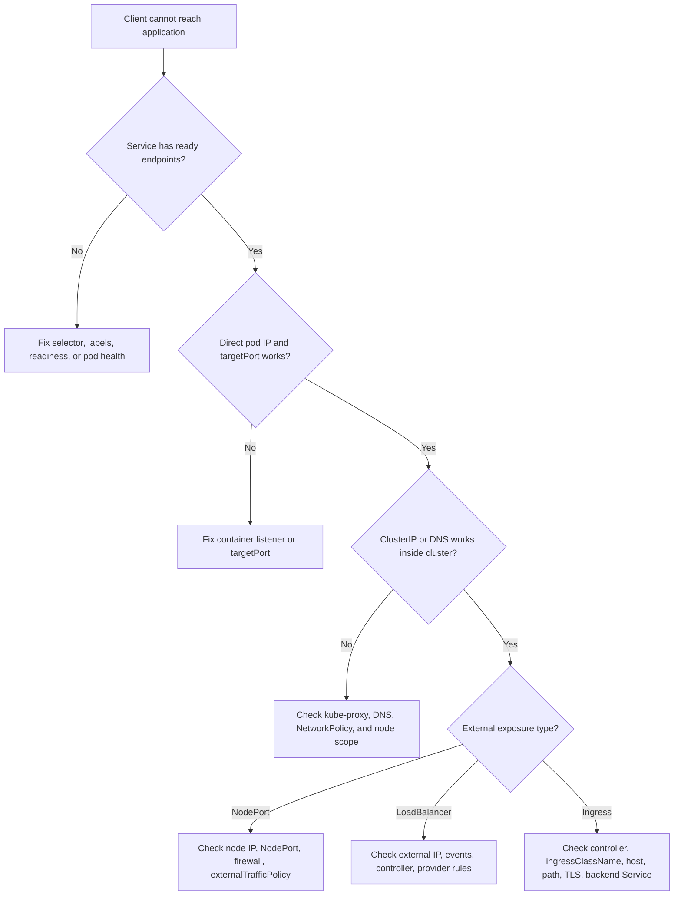

> **Complexity**: `[MEDIUM]` - Critical for application access
>
> **Time to Complete**: 45-55 minutes
>
> **Prerequisites**: Module 5.5 (Network Troubleshooting), Module 3.1-3.4 (Services)

---

## What You'll Be Able to Do

After this module, you will be able to:

- **Diagnose** service connectivity failures using the endpoint, selector, and pod readiness chain.
- **Fix** Services with no endpoints by correcting label selectors, checking pod readiness, and verifying port mappings.
- **Debug** NodePort, LoadBalancer, and Ingress access by separating Kubernetes routing failures from infrastructure exposure failures.
- **Trace** a Service request through DNS, kube-proxy rules, EndpointSlices, and backend pods.

## Why This Module Matters

Hypothetical scenario: a frontend deployment is healthy, its logs show repeated connection failures to `http://backend-api`, and the backend pods appear to be running. The application team wants to restart everything, the platform team suspects NetworkPolicy, and the incident channel is filling with guesses. A disciplined Service troubleshooting path prevents that drift because it asks one concrete question at a time: can the name resolve, does the Service select any ready endpoints, do the ports line up, and can traffic reach a backend directly?

Kubernetes Services are deliberately boring from the application point of view. A client talks to a stable DNS name or virtual IP, while pods behind that name are created, deleted, rescheduled, and replaced. That stability is the point, but it also hides several moving parts: API objects, labels, EndpointSlices, readiness gates, kube-proxy programming, node firewalls, cloud load balancers, and sometimes an Ingress controller. When a Service fails, the symptom is usually simple, but the cause can live at any layer between DNS and the container process.

This module teaches a repeatable troubleshooting loop for Kubernetes 1.35 clusters. You will keep the original mental model of ClusterIP, NodePort, LoadBalancer, ExternalName, headless Services, and Ingress, then use that model to decide which check comes first. The goal is not to memorize every command. The goal is to build a small diagnostic routine that works under exam pressure and still holds up in production.

The reception desk analogy is still useful as long as you do not overextend it. A ClusterIP Service is an internal reception desk that only people inside the building can reach. A NodePort opens a window on every node. A LoadBalancer asks the infrastructure provider to build an entrance outside the building. An Ingress is a lobby directory that reads the requested host and path, then sends the visitor to the right desk. Each layer can be healthy while the next layer is broken, so your troubleshooting must follow the path the packet actually takes.

## Part 1: Build the Service Mental Model

The first mistake in Service troubleshooting is treating every Service type as if it exposes traffic in the same way. ClusterIP, NodePort, and LoadBalancer are layered. A NodePort still has a ClusterIP, a LoadBalancer usually still has a NodePort, and both still depend on endpoints that point to ready backend pods. ExternalName is different because it does not proxy traffic at all; it only returns a DNS alias, which means kube-proxy and EndpointSlices are not the important checks for that specific type.

```
┌──────────────────────────────────────────────────────────────┐
│                    SERVICE TYPES                              │
│                                                               │
│   ClusterIP (default)                                         │
│   ┌─────────────────────────────────────────────────────┐    │
│   │ Internal only, virtual IP, no external access       │    │
│   └─────────────────────────────────────────────────────┘    │
│                            ▲                                  │
│                            │ Builds on                        │
│   NodePort                 │                                  │
│   ┌─────────────────────────────────────────────────────┐    │
│   │ ClusterIP + port on every node (30000-32767)        │    │
│   └─────────────────────────────────────────────────────┘    │
│                            ▲                                  │
│                            │ Builds on                        │
│   LoadBalancer             │                                  │
│   ┌─────────────────────────────────────────────────────┐    │
│   │ ClusterIP + NodePort + cloud load balancer          │    │
│   └─────────────────────────────────────────────────────┘    │
│                                                               │
│   ExternalName                                                │
│   ┌─────────────────────────────────────────────────────┐    │
│   │ DNS CNAME record, no proxy, just name resolution    │    │
│   └─────────────────────────────────────────────────────┘    │
│                                                               │
└──────────────────────────────────────────────────────────────┘
```

A Service object describes intention, but it does not by itself prove that traffic can flow. The selector must match pods, those pods must be Ready, the endpoint controller must publish them through EndpointSlices, kube-proxy must notice the Service and endpoint changes, and the destination container must actually be listening on the target port. If any link in that chain is absent, the Service can look normal in `kubectl get svc` while clients still fail.

```
┌──────────────────────────────────────────────────────────────┐
│                    KUBE-PROXY FUNCTION                        │
│                                                               │
│   Service Created                                             │
│        │                                                      │
│        ▼                                                      │
│   kube-proxy watches API server                              │
│        │                                                      │
│        ▼                                                      │
│   Programs rules on each node:                               │
│   ┌─────────────────────────────────────────────────────┐    │
│   │ iptables mode: iptables -t nat rules                │    │
│   │ IPVS mode:    virtual servers in kernel             │    │
│   └─────────────────────────────────────────────────────┘    │
│        │                                                      │
│        ▼                                                      │
│   Traffic to ClusterIP → redirected to pod IPs              │
│                                                               │
│   If kube-proxy fails → Services stop working                │
│                                                               │
└──────────────────────────────────────────────────────────────┘
```

Pause and predict: if `kube-proxy` crashes on a single node, what do you expect to happen to pods on that node when they access a ClusterIP Service, and why might pods on other nodes continue working? This question matters because kube-proxy programs local node rules, so a node-scoped failure can look like an application failure only when the client pod lands on the affected node. During an exam, that distinction tells you to compare the same curl test from two different client pods on two different nodes before changing the Service manifest.

Service troubleshooting is easiest when you separate the control plane description from the data plane reality. The control plane has the Service object, selector, EndpointSlices, Ingress object, and events. The data plane has DNS resolution, kube-proxy rules, node ports, load balancer listeners, network policy enforcement, and a process listening inside a container. A good diagnostic path moves from the cheapest control plane checks toward the more invasive data plane checks only when the earlier evidence supports that direction.

## Part 2: Diagnose ClusterIP from Endpoints Backward

ClusterIP is the foundation for most Service debugging because the other Service types build on it. If a ClusterIP Service is broken, exposing it through NodePort or LoadBalancer only adds more places to look without fixing the underlying path. Start with endpoints because the endpoint list answers the most important routing question: does Kubernetes currently believe there is any ready backend for this Service?

```
┌──────────────────────────────────────────────────────────────┐
│               CLUSTERIP TROUBLESHOOTING                       │
│                                                               │
│   □ Service exists and has correct ports                     │
│   □ Endpoints exist (selector matches pods)                  │
│   □ Pods are in Ready state                                  │
│   □ Target port matches container port                       │
│   □ Pod is actually listening on the port                    │
│   □ kube-proxy is running on nodes                          │
│   □ No NetworkPolicy blocking traffic                       │
│                                                               │
└──────────────────────────────────────────────────────────────┘
```

An empty endpoint list is not a mysterious networking failure. It usually means the Service selector does not match the pod labels, the matching pods are not Ready, or the pods are terminating and have been removed from the serving set. In Kubernetes 1.35, EndpointSlices are the scalable API behind Service endpoint tracking, while the older Endpoints object may still be useful for quick inspection in many clusters. If the Service has no endpoints, do not spend time inspecting iptables rules yet; first prove why Kubernetes has no backend destinations.

```bash
# 1. Check service exists
kubectl get svc my-service
kubectl describe svc my-service

# 2. Check endpoints (CRITICAL)
kubectl get endpoints my-service
# No endpoints = problem with selector or pod readiness

# 3. Verify selector matches pods
kubectl get svc my-service -o jsonpath='{.spec.selector}'
# Compare to:
kubectl get pods --show-labels

# 4. Check pods are Ready
kubectl get pods -l <selector>
# All should show Ready (e.g., 1/1)

# 5. Verify pod is listening on port
kubectl exec <pod> -- netstat -tlnp
# Or: kubectl exec <pod> -- ss -tlnp

# 6. Test directly to pod IP
kubectl exec <client-pod> -- wget -qO- http://<pod-ip>:<container-port>
```

The selector check deserves more care than many learners give it. A Service selector is a map of exact label key-value pairs, not a fuzzy search. `app: backend` does not match `app.kubernetes.io/name: backend`, `app: backend-api`, or `tier: backend`. When you compare selectors to pod labels, compare the actual keys as well as the values, because modern manifests often use the recommended `app.kubernetes.io/*` labels while older examples use short labels such as `app`.

| Issue | Symptom | Check | Fix |
|-------|---------|-------|-----|
| No endpoints | Connection refused | `kubectl get endpoints` | Fix selector or pod labels |
| Wrong targetPort | Timeout/refused | Compare port to container | Fix targetPort |
| Pod not Ready | Missing endpoints | `kubectl get pods` | Fix readiness probe |
| App not listening | Direct pod access fails | `netstat` in container | Fix application |
| kube-proxy down | All services fail | kube-proxy pods | Restart kube-proxy |

Port mapping is the next common failure because Service ports use two different concepts. `port` is what clients use when they talk to the Service. `targetPort` is where kube-proxy sends the connection on the selected pod. A named target port adds another lookup step: Kubernetes resolves the name against the container ports on each backend pod, which can be helpful during migrations but confusing when the name is misspelled.

```yaml
apiVersion: v1
kind: Service
metadata:
  name: my-service
spec:
  selector:
    app: myapp
  ports:
  - port: 80          # Port clients use to access service
    targetPort: 8080  # Port on the pod/container
    protocol: TCP     # TCP (default) or UDP
    name: http        # Optional name
```

```bash
# Verify the mapping
kubectl get svc my-service -o yaml | grep -A 5 ports:

# Check container is listening on targetPort
kubectl exec <pod> -- sh -c 'netstat -tlnp 2>/dev/null || ss -tlnp'
```

Before running the direct pod test, what output do you expect if the Service selector is correct but the `targetPort` points to a closed port? The endpoint list should not be empty, because endpoint publication depends on pod selection and readiness rather than whether your application listens on the chosen target port. The direct test to the pod IP and target port should fail, while the direct test to the actual listening port should work, which is the evidence you need before changing the Service port mapping.

Readiness is the subtle part of this chain. A pod can be Running but not Ready, and a Service should not route ordinary traffic to a non-ready pod. A pod can also be Ready because its readiness probe is too weak, even though the application process is not listening on the Service target port. That is why the reliable path is endpoint list first, readiness state second, and direct pod port check third; each step narrows the failure instead of assuming that one green status field proves the whole path.

A useful worked example is the Service that has endpoints but still cannot serve traffic. Imagine the endpoint list contains two pod IPs, both pods report Ready, and `kubectl exec client -- wget http://service-name` still times out. At that point, the selector did its job and readiness allowed the pods into the serving set, so the next question is whether the Service forwards to the port where the application listens. Testing the pod IP on the declared `targetPort`, then testing the pod IP on the port named in the container manifest, turns a vague timeout into a port-mapping diagnosis.

The reverse example is just as important because it prevents false confidence. If the endpoint list is empty, a successful direct pod IP test does not prove the Service is healthy. It proves only that at least one pod can serve traffic when addressed directly. The Service still has no backend addresses to choose from, which means ordinary clients using the Service name will fail until the selector and readiness chain is repaired. In other words, direct pod access is a targeted diagnostic tool, not a replacement for endpoint publication.

EndpointSlices add one more practical detail for real clusters. The legacy Endpoints object is easy to read, but large Services can exceed the old object model, and EndpointSlices are the modern representation Kubernetes uses to scale endpoint tracking. When a quick `kubectl get endpoints` result looks surprising, inspect EndpointSlices with the Service name label and compare the addresses, ports, and readiness conditions. That extra check is especially useful when you are debugging a Service with many replicas or when a controller creates endpoints without a selector.

## Part 3: Debug NodePort and External Traffic Policy

NodePort adds a node-level listener to the ClusterIP path, so you must keep two questions separate. First, does the Service work from inside the cluster through its ClusterIP or DNS name? Second, can a client outside the cluster reach a node IP and the allocated port? If the internal ClusterIP path is already broken, a NodePort test will only produce a louder version of the same failure.

```
┌──────────────────────────────────────────────────────────────┐
│               NODEPORT TROUBLESHOOTING                        │
│                                                               │
│   All ClusterIP checks, plus:                                │
│                                                               │
│   □ NodePort is in valid range (30000-32767)                │
│   □ Node firewall allows the port                           │
│   □ Cloud security group allows the port                    │
│   □ Node is reachable on the port                          │
│   □ Testing with correct node IP                           │
│                                                               │
└──────────────────────────────────────────────────────────────┘
```

A NodePort Service is often misunderstood because it opens the selected port on every node, not only on nodes that currently run a backend pod. In the default `externalTrafficPolicy: Cluster` mode, a packet can arrive at one node and be forwarded to a pod on another node. That behavior is convenient because any node IP can be used, but it can also hide extra hops and change source IP handling. In `externalTrafficPolicy: Local` mode, Kubernetes preserves client source IP more directly, but nodes without a local backend should not be treated as healthy targets for that Service.

```bash
# Get NodePort value
kubectl get svc my-service -o jsonpath='{.spec.ports[0].nodePort}'

# Get node IPs
kubectl get nodes -o wide

# Test from outside cluster
curl http://<node-ip>:<nodeport>

# Test from inside cluster (should also work)
kubectl exec <pod> -- wget -qO- http://<node-ip>:<nodeport>

# Test all nodes (NodePort works on any node)
for node_ip in $(kubectl get nodes -o jsonpath='{.items[*].status.addresses[?(@.type=="InternalIP")].address}'); do
  curl -s --connect-timeout 2 http://${node_ip}:<nodeport> && echo "OK: $node_ip" || echo "FAIL: $node_ip"
done
```

The word "outside" is not precise enough during NodePort debugging. A client in another pod, a client on a worker node, a client on the same private subnet, and a client on a developer laptop all traverse different firewalls and routes. If a pod can reach the NodePort but a laptop times out, Kubernetes routing may be healthy while the cloud security group, network ACL, VPN route, or host firewall is dropping the packet before kube-proxy sees it.

| Issue | Symptom | Check | Fix |
|-------|---------|-------|-----|
| Firewall blocking | Timeout from external | `iptables -L -n` | Open port in firewall |
| Cloud SG blocking | Timeout from external | Cloud console | Add security group rule |
| Wrong node IP | Connection refused | `kubectl get nodes -o wide` | Use correct IP (internal vs external) |
| Port conflict | Service create fails | `netstat -tlnp` on node | Use different nodePort |
| externalTrafficPolicy | Only some nodes work | Check policy | Set to Cluster or fix endpoints |

The `externalTrafficPolicy` setting is a deliberate tradeoff, not a magic performance option. `Cluster` maximizes reachability because all nodes can receive the traffic and forward it to a backend somewhere in the cluster. `Local` is useful when you need to preserve source IP or avoid a second hop, but it requires the external load balancer or client to avoid nodes that have no local endpoint. That makes it a common source of intermittent failures when pods are rescheduled unevenly.

```yaml
spec:
  type: NodePort
  externalTrafficPolicy: Local  # Only nodes with pods respond
  # vs
  externalTrafficPolicy: Cluster  # All nodes respond (default)
```

```bash
# Check current policy
kubectl get svc my-service -o jsonpath='{.spec.externalTrafficPolicy}'

# With Local policy, check which nodes have pods
kubectl get pods -l <selector> -o wide
# Only those node IPs will respond to NodePort
```

Pause and predict: if you set `externalTrafficPolicy: Local` on a NodePort Service, but a specific node has no pods for that Service, what happens when an external client hits that node IP on the NodePort? The expected answer is that traffic to that node should fail or be dropped for that Service, while traffic to a node with a local ready endpoint can succeed. That prediction is exactly why a useful NodePort test loops through all node IPs instead of testing only the first IP you copied from `kubectl get nodes -o wide`.

NodePort is also where source address assumptions can mislead you. In `Cluster` policy, the packet may be forwarded from the receiving node to another node, and source address behavior depends on the proxying path and implementation details. In `Local` policy, source preservation is easier to reason about, but reachability depends on local endpoints. When teams choose between these modes, they are choosing between broad node reachability and tighter source-address behavior. Troubleshooting becomes easier when that tradeoff is written down beside the Service instead of rediscovered during an outage.

Do not forget that a NodePort can be healthy while the chosen test address is wrong. Cloud nodes often have an internal address, an external address, a hostname, and sometimes provider-specific addresses. A test from inside the cluster may need the internal node IP, while a test from a developer laptop may need an external address or VPN-routable address. If you use an address that is not routable from your client, the symptom can look identical to a firewall drop, so always state the source network and selected node address together in your notes.

## Part 4: Diagnose LoadBalancer Without Blaming the App

LoadBalancer Services add infrastructure automation to the same Kubernetes Service chain. Kubernetes creates the Service object, then the cloud controller manager or an on-premises load balancer controller notices that object and provisions or configures an external load balancer. If no controller is available, no address pool exists, credentials are wrong, or quota prevents allocation, the Service can remain in `<pending>` even though every pod and endpoint behind it is healthy.

```
┌──────────────────────────────────────────────────────────────┐
│             LOADBALANCER REQUIREMENTS                         │
│                                                               │
│   Cloud environment:                                          │
│   • Cloud controller manager running                         │
│   • Proper cloud credentials configured                      │
│   • Cloud provider supports LoadBalancer                     │
│                                                               │
│   On-premises:                                                │
│   • MetalLB or similar solution installed                   │
│   • IP address pool configured                               │
│                                                               │
│   Without these → LoadBalancer stays Pending forever        │
│                                                               │
└──────────────────────────────────────────────────────────────┘
```

The first LoadBalancer question is whether an external address has been assigned. If the `EXTERNAL-IP` column is still pending, focus on the controller, events, annotations, address pools, and provider errors. If an external address exists but traffic fails, return to the layered model: validate ClusterIP, validate NodePort if allocated, then validate the external listener and firewall path. This sequence keeps you from debugging cloud load balancer settings when the Service has no endpoints, and it keeps you from changing application pods when the provider never created a listener.

```bash
# Check if external IP is assigned
kubectl get svc my-service
# EXTERNAL-IP column should show an IP, not <pending>

# Get detailed status
kubectl describe svc my-service

# Check events for errors
kubectl get events --field-selector involvedObject.name=my-service

# Test the LoadBalancer IP
curl http://<external-ip>:<port>
```

Events are valuable because the Service object is the meeting point between Kubernetes and the provider integration. A quota failure, unsupported annotation, missing subnet tag, address pool exhaustion, or permission problem often appears as a Service event before it appears anywhere else the Kubernetes operator can see. On managed platforms, you should also know where provider-specific controllers log their reconciliation errors, but the CKA-level move is to inspect the Service and relevant controller pods before changing manifests blindly.

| Issue | Symptom | Check | Fix |
|-------|---------|-------|-----|
| No cloud controller | Stays Pending | Check cloud-controller-manager | Install/configure CCM |
| Quota exceeded | Stays Pending | Cloud console | Request quota increase |
| Wrong annotations | LB misconfigured | Service annotations | Fix cloud-specific annotations |
| Security group | Can't reach LB | Cloud security rules | Open LB ports |
| MetalLB not installed | Stays Pending (bare metal) | Check MetalLB pods | Install MetalLB |

Cloud-specific commands are not portable, but the diagnostic principle is portable. Use Kubernetes to confirm what was requested, use provider tooling to confirm what was provisioned, then compare the listener, target, health check, and firewall path. In a bare-metal cluster, replace the cloud controller check with the installed load balancer implementation, such as MetalLB, and confirm that an address pool exists for the namespace and Service shape you are using.

```bash
# For AWS
kubectl describe svc my-service | grep "LoadBalancer Ingress"
aws elb describe-load-balancers

# For GCP
kubectl describe svc my-service
gcloud compute forwarding-rules list

# Check cloud controller manager logs
kubectl -n kube-system logs -l component=cloud-controller-manager
```

Which approach would you choose here and why: changing the Service type back to ClusterIP, opening a cloud security rule, or inspecting Service events first? In a pending-address case, Service events are the lowest-risk first move because they tell you whether Kubernetes asked for a load balancer and whether the controller rejected the request. In an assigned-address case with healthy endpoints, the security rule may be the right next hypothesis, but you should still prove which layer is failing before editing infrastructure.

Load balancer health checks are another source of confusion because they are not always identical to application traffic. A provider may check a node port, a health check node port, or a controller-managed endpoint depending on the platform and Service configuration. If the external address exists but the provider marks targets unhealthy, compare the provider health check settings with the Kubernetes Service ports and the backend readiness state. A Service can be internally reachable while the external load balancer refuses to send traffic because its own health criteria are failing.

Annotations deserve careful handling because they are provider contracts hidden inside a Kubernetes object. An annotation that is meaningful on one platform can be ignored or rejected on another, and a copied manifest may request a load balancer shape that the current cluster cannot provision. During troubleshooting, read annotations as inputs to the controller rather than as generic Kubernetes behavior. If events mention an unsupported annotation or invalid setting, the fix is usually to align the manifest with the provider documentation, not to change the backend deployment.

On bare-metal clusters, the pending state is often a capacity or ownership question rather than a cloud API question. A controller such as MetalLB needs an address pool, permission to allocate from that pool, and network conditions that let the chosen address be announced or routed. If the pool is exhausted or scoped away from the namespace, the Service request has nowhere to go. That diagnosis still follows the same method: Kubernetes Service first, controller events second, implementation-specific logs third, and application pods only after the external allocation exists.

## Part 5: Troubleshoot Ingress as a Controller-Backed Route

Ingress is not a Service type. An Ingress object is a set of HTTP routing rules, and an Ingress controller is the running component that reads those rules and configures a proxy such as NGINX, Traefik, HAProxy, or a cloud provider controller. If the controller is absent or watching a different class, the Ingress resource can exist forever without affecting traffic. That is why Ingress debugging starts with the controller, the class, and the backend Service rather than only with the application pod.

```
┌──────────────────────────────────────────────────────────────┐
│                  INGRESS FLOW                                 │
│                                                               │
│   External Request                                            │
│        │                                                      │
│        ▼                                                      │
│   Ingress Controller (nginx, traefik, etc.)                  │
│        │                                                      │
│        │ Reads Ingress resources                             │
│        ▼                                                      │
│   Matches host/path rules                                     │
│        │                                                      │
│        ▼                                                      │
│   Routes to backend Service                                   │
│        │                                                      │
│        ▼                                                      │
│   Pod                                                         │
│                                                               │
│   Ingress Controller missing → Ingress rules do nothing      │
│                                                               │
└──────────────────────────────────────────────────────────────┘
```

Ingress failures often look different from Service failures. A timeout may mean the external load balancer or controller Service cannot be reached. A `404` may mean the request reached the controller but no host and path rule matched. A `503` may mean the controller matched the rule but the backend Service has no usable endpoints. A TLS error may mean the Secret is missing, malformed, in the wrong namespace, or not referenced by the rule that matched the host.

```bash
# 1. Check Ingress Controller is running
kubectl -n ingress-nginx get pods  # For nginx-ingress
# Or check your specific ingress controller namespace

# 2. Check Ingress resource exists
kubectl get ingress my-ingress
kubectl describe ingress my-ingress

# 3. Verify backend service exists
kubectl get svc <backend-service>

# 4. Check Ingress events
kubectl describe ingress my-ingress | grep -A 10 Events

# 5. Check Ingress Controller logs
kubectl -n ingress-nginx logs -l app.kubernetes.io/name=ingress-nginx

# 6. Test with correct Host header
curl -H "Host: myapp.example.com" http://<ingress-ip>
```

The Host header check is not optional when you test Ingress by IP address. Most Ingress rules are written for a hostname, so a bare `curl http://<ingress-ip>` sends a request that does not match the configured host. Supplying `-H "Host: myapp.example.com"` lets you test routing before public DNS is updated, and it also separates DNS issues from controller routing issues. If the Host header test works but the browser fails, DNS or client-side TLS trust may be the remaining layer.

| Issue | Symptom | Check | Fix |
|-------|---------|-------|-----|
| No Ingress Controller | 404 or nothing | Controller pods | Install Ingress Controller |
| Wrong ingressClassName | Rules ignored | `spec.ingressClassName` | Match controller class |
| Backend service missing | 503 error | `kubectl get svc` | Create backend service |
| TLS secret missing | TLS errors | `kubectl get secret` | Create TLS secret |
| Wrong host header | 404 | Test with -H flag | Use correct hostname |
| Path type mismatch | 404 on subpaths | Check pathType | Use Prefix or Exact |

Path matching is another place where a route that looks reasonable can behave differently than expected. `Exact` means only that exact path matches. `Prefix` means the request path starts with the configured path using Kubernetes path element semantics. When a user reports that `/api` works but `/api/v1` fails, or that `/exact/anything` fails while `/exact` works, the path type is part of the evidence, not a side detail.

```yaml
spec:
  rules:
  - host: example.com
    http:
      paths:
      - path: /api
        pathType: Prefix   # /api, /api/, /api/v1 all match
      - path: /exact
        pathType: Exact    # Only /exact matches
      - path: /
        pathType: Prefix   # Catch-all
```

```bash
# Get Ingress IP/hostname
kubectl get ingress my-ingress

# Test with specific host header
curl -v -H "Host: myapp.example.com" http://<ingress-ip>/path

# Test TLS
curl -v -H "Host: myapp.example.com" https://<ingress-ip>/path -k

# Check Ingress Controller configuration (nginx)
kubectl -n ingress-nginx exec <controller-pod> -- cat /etc/nginx/nginx.conf | grep -A 20 "server_name myapp"
```

Stop and think: how does an Ingress controller routing HTTP traffic at Layer 7 differ from a `type: LoadBalancer` Service routing transport traffic at Layer 4 when things go wrong? With Ingress, a request can reach the controller and still fail because the host, path, TLS, or backend rule does not match. With a plain LoadBalancer Service, the provider listener usually forwards a port to the Service path, so failures more often involve address allocation, firewall reachability, health checks, endpoints, or target ports.

A productive Ingress investigation names the response source. A browser `404` might come from the Ingress controller default backend, the application behind a successfully matched route, or an upstream proxy in front of the cluster. A `curl -v` test with the expected Host header, a known path, and the controller IP helps identify which component generated the response. Once you know the response source, the next check is obvious: route rule matching for controller responses, backend application logs for app responses, or external proxy configuration for responses that never reached the controller.

TLS adds another matching layer because certificates are selected by host information and stored in Kubernetes Secrets. A valid Ingress rule can still fail TLS if the Secret name is wrong, the Secret is in the wrong namespace, the certificate does not cover the requested host, or the controller cannot read the Secret. Separate TLS negotiation from backend routing by testing HTTP when allowed, then testing HTTPS with verbose output. That split keeps certificate problems from being mistaken for missing endpoints, and it keeps backend application errors from being mistaken for certificate failures.

The backend Service remains part of the Ingress path even though the user sees only a hostname. If the controller matches the host and path but the backend Service has no endpoints, most controllers return an upstream failure rather than a Kubernetes-looking error. That is why an Ingress incident often loops back to the ClusterIP checklist. You confirm the controller and route, then you debug the backend Service exactly as you would if a pod inside the cluster had called it directly.

## Part 6: Check kube-proxy When the Pattern Is Node-Scoped or Cluster-Wide

kube-proxy is not where you begin every Service incident, but it becomes important when the evidence points to Service routing itself. If many unrelated Services fail from one node, if ClusterIP traffic behaves differently depending on where the client pod runs, or if recent Service changes do not appear to affect traffic, inspect kube-proxy and its rules. If only one Service fails and it has no endpoints, kube-proxy is probably not the first suspect.

```
┌──────────────────────────────────────────────────────────────┐
│                 KUBE-PROXY MODES                              │
│                                                               │
│   iptables mode (default)                                     │
│   • Uses iptables rules for routing                          │
│   • Good for < 1000 services                                 │
│   • Check: iptables -t nat -L                                │
│                                                               │
│   IPVS mode                                                   │
│   • Uses kernel IPVS for load balancing                     │
│   • Better for many services                                 │
│   • Check: ipvsadm -Ln                                       │
│                                                               │
│   If kube-proxy fails → Service routing breaks               │
│                                                               │
└──────────────────────────────────────────────────────────────┘
```

iptables and IPVS modes implement the same Service abstraction through different Linux networking mechanisms. In iptables mode, kube-proxy writes NAT rules that select backend endpoints. In IPVS mode, it programs kernel virtual servers and real servers. The exam does not require you to hand-edit these rules, and in production you should not hand-edit them either, but inspecting their presence can confirm whether the node has received and applied the Service configuration.

```bash
# Check kube-proxy pods
kubectl -n kube-system get pods -l k8s-app=kube-proxy

# Check kube-proxy logs
kubectl -n kube-system logs -l k8s-app=kube-proxy

# Check kube-proxy config
kubectl -n kube-system get configmap kube-proxy -o yaml

# Check iptables rules (on node)
sudo iptables -t nat -L KUBE-SERVICES | head -20

# Check IPVS (if using IPVS mode)
sudo ipvsadm -Ln
```

When kube-proxy is unhealthy, symptoms can be misleading because the application pods do not have to crash. DNS can still resolve, the Service object can still exist, and endpoints can still be populated. The packet simply does not get translated to a backend pod the way the Service model promises. That is why the node dimension matters: run the same client test from pods scheduled to different nodes, then compare kube-proxy pod status and logs on the nodes where the test fails.

| Issue | Symptom | Check | Fix |
|-------|---------|-------|-----|
| Not running | All services fail | Check pods | Restart DaemonSet |
| Wrong mode | Unexpected behavior | ConfigMap | Reconfigure mode |
| Stale rules | Service changes not reflected | iptables on node | Restart kube-proxy |
| conntrack full | Random connection drops | dmesg for conntrack | Increase conntrack limit |

Restarting kube-proxy is a legitimate recovery step only after you have enough evidence that the node rules are stale or the daemon is failing. It is a DaemonSet in many clusters, so deleting pods or rolling the DaemonSet causes Kubernetes to recreate the per-node agents. That can briefly affect Service routing on those nodes, so do it deliberately and verify after the restart that the expected rules or IPVS entries exist.

conntrack pressure can produce a different class of Service symptom: connections fail intermittently even though endpoints, ports, and kube-proxy rules look correct. Linux connection tracking keeps state for flows that pass through NAT, and when the table is exhausted, new connections may be dropped or behave unpredictably. The fix is not to edit the Service; it is to inspect node logs and kernel counters, then tune node capacity or reduce churn. For CKA-level troubleshooting, the important skill is recognizing that random drops across many Services on one node are not the same as a selector typo.

kube-proxy also depends on timely API observation. If the daemon cannot watch Services or EndpointSlices because of API connectivity, authentication, or resource pressure, its local rules can become stale. A stale-rule failure often appears after a deployment, scale event, or Service edit: old backends keep receiving traffic, new backends never receive traffic, or a deleted Service still leaves confusing traces. Comparing the desired state in the API with the node-local rule state tells you whether the node has caught up.

When you document a kube-proxy diagnosis, include the client pod node, the target Service, the endpoint state, and the kube-proxy pod name on the affected node. That record makes the difference between a reproducible node-scoped issue and a collection of unrelated curl failures. It also prevents a common handoff problem where the next operator restarts the application because the original notes never proved the node dimension. Good notes are part of the troubleshooting toolchain.

```bash
# Restart kube-proxy pods
kubectl -n kube-system rollout restart daemonset kube-proxy

# Check for errors in logs
kubectl -n kube-system logs -l k8s-app=kube-proxy --since=5m | grep -i error

# Verify iptables rules exist for a service
sudo iptables -t nat -L KUBE-SERVICES | grep <service-cluster-ip>

# Force sync (delete and let kube-proxy recreate)
# This is disruptive - use carefully
kubectl -n kube-system delete pod -l k8s-app=kube-proxy
```

## Patterns & Anti-Patterns

The best Service troubleshooting pattern is to follow the packet path while constantly checking whether your current evidence still supports the layer you are investigating. A Service is a chain, not a single switch. If you verify endpoints, direct pod reachability, Service DNS, ClusterIP, NodePort, and external exposure in that order, each result tells you where to go next. If you jump straight to a cloud console or restart deployments without that sequence, you are trading evidence for activity.

| Pattern | When to Use It | Why It Works | Scaling Consideration |
|---------|----------------|--------------|-----------------------|
| Endpoint-first diagnosis | A Service name or ClusterIP fails | Empty endpoints immediately identify selector or readiness problems | EndpointSlices scale better than the legacy Endpoints object, so inspect both when clusters are large |
| Inside-out exposure testing | NodePort, LoadBalancer, or Ingress fails | Proves the internal Service path before adding infrastructure layers | Keep a small debug pod pattern available in each namespace where policy allows it |
| Node-aware comparison | Failures vary by client pod or node IP | Separates node-local kube-proxy and firewall issues from app failures | Use pod placement and `kubectl get pods -o wide` to compare affected nodes |
| Event-guided provider debugging | LoadBalancer remains pending or misconfigured | Service events expose controller reconciliation failures early | Provider-specific logs and quotas still matter after Kubernetes events identify the class of failure |

Anti-patterns usually come from collapsing several layers into one vague phrase such as "networking is broken." That phrase does not tell you whether DNS failed, endpoints were empty, kube-proxy missed a rule, a firewall dropped a NodePort, or an Ingress class ignored the route. Good operators replace that phrase with a specific failing hop and a specific command that proves it.

| Anti-Pattern | What Goes Wrong | Better Alternative |
|--------------|-----------------|--------------------|
| Restarting pods before checking endpoints | A selector or readiness problem remains after the restart | Inspect Service selectors, pod labels, readiness, and EndpointSlices first |
| Testing Ingress only by IP | Host-based rules never match, producing misleading `404` results | Send the expected Host header or use DNS that resolves to the controller |
| Treating pending LoadBalancer as an app bug | Pods get changed even though no external load balancer exists | Inspect Service events, controller health, address pools, and provider quota |
| Assuming NodePort means internet reachable | Internal tests pass while external firewalls still block traffic | Test from the actual source network and verify host or cloud firewall rules |

## Decision Framework

Use the Service type and the first failing observation to decide where to start. The fastest path is almost always to confirm whether the Service has ready backends before inspecting external infrastructure. Once backends are known good, move outward one layer at a time: Service DNS, ClusterIP, NodePort, provider load balancer, then Ingress host and path routing when applicable.



| Starting Symptom | First Check | If It Passes | If It Fails |
|------------------|-------------|--------------|-------------|
| Service DNS name fails inside cluster | Resolve name and inspect Service | Test ClusterIP and endpoints | Check CoreDNS, namespace, and Service existence |
| ClusterIP connection refused or times out | `kubectl get endpoints` and EndpointSlices | Test targetPort directly | Fix selector, labels, readiness, or endpoint publication |
| NodePort works from pod but not laptop | External route and firewall path | Check source IP and policy details | Open the right security group, ACL, route, or host firewall |
| LoadBalancer is pending | Service events and controller | Validate assigned address and listener | Fix controller, credentials, quota, annotation, or address pool |
| Ingress returns `404` | Host, path, and class | Inspect backend Service and controller logs | Correct host/path rule or `ingressClassName` |
| Many Services fail only from one node | kube-proxy pod and node rules | Compare NetworkPolicy or CNI behavior | Restart or repair kube-proxy on the affected node |

This framework is deliberately conservative. It does not assume that every timeout is a firewall, every `404` is an Ingress bug, or every pending external IP is a cloud outage. It asks for the lowest-cost proof at each layer, then moves outward only when the inner layer is known good. That habit is the difference between a troubleshooting script and a troubleshooting method.

In practice, you can turn the framework into a short incident worksheet. Write the client location, the name or address being called, the exact error, the Service type, whether endpoints exist, whether direct pod access works, whether ClusterIP works, and which external layer is next. This forces the team to share observations instead of conclusions. "NodePort is broken" becomes "pod client reaches ClusterIP, pod client reaches node internal IP and node port, laptop times out to external node IP," which points directly to routing or firewall boundaries.

The same worksheet helps during exams because it prevents command wandering. If the prompt says the Service has no endpoints, you should not burn time checking a cloud load balancer. If the prompt says the LoadBalancer has an external IP and internal ClusterIP works, you should not start by changing labels. CKA tasks are often solvable because the symptom contains enough evidence to choose the right layer. Your job is to read that evidence, run the confirming command, and make the smallest correction that matches the failing layer.

There is one more habit that makes this framework reliable: always keep the client perspective attached to the result. "The Service works" is incomplete unless you say from where it works. A pod in the same namespace, a pod in a different namespace, a node shell, a laptop over VPN, and an internet client can each observe a different part of the path. Recording the source location makes NetworkPolicy, DNS search paths, node firewalls, and cloud rules much easier to separate.

You should also distinguish refusal, timeout, and HTTP status failures. A connection refused often means the packet reached a host where no process was listening on the destination port, though proxies can complicate that picture. A timeout often means the packet was dropped, routed incorrectly, or blocked before a response returned. A `404` or `503` usually means an HTTP component answered, which shifts the investigation toward Ingress rule matching, upstream health, or the backend application rather than raw packet reachability.

Finally, keep temporary debug resources boring. A BusyBox or curl pod with a long sleep command is enough for most Service checks, and a disposable namespace keeps cleanup simple. Avoid installing extra tools or changing application deployments until the evidence requires it. The less you disturb the cluster while diagnosing, the more trustworthy your observations remain, and the easier it is to explain the eventual fix to another operator or examiner.

That explanation matters because Service incidents often cross team boundaries. Application owners understand container ports and readiness, platform owners understand controllers and node rules, and network owners understand external reachability. A clean layer-by-layer diagnosis gives each group the evidence it needs without forcing everyone to inspect every part of the stack.

## Did You Know?

- **Service IPs are virtual**: ClusterIP addresses are implemented by Service proxying on nodes rather than by binding the address as a normal network interface on one pod or one node.
- **NodePort range**: The default Service node port range is 30000-32767, and Kubernetes lets cluster administrators change it with an API server flag, although most clusters keep the default range.
- **LoadBalancer usually includes NodePort**: By default, a LoadBalancer Service also allocates a ClusterIP and node port unless node port allocation is explicitly disabled for implementations that support that mode.
- **Headless Services have no ClusterIP**: Setting `clusterIP: None` makes DNS return backend pod addresses directly, which is useful for clients that need to discover individual pods rather than a single virtual IP.

## Common Mistakes

| Mistake | Why It Happens | How to Fix It |
|---------|----------------|---------------|
| Not checking endpoints first | The Service object exists, so the operator assumes Kubernetes has backends to route to | Start with `kubectl get endpoints` or EndpointSlices, then compare selectors, pod labels, and readiness |
| Confusing `port` and `targetPort` | The manifest has two port fields with similar names, and both may contain valid-looking numbers | Treat `port` as the client-facing Service port and `targetPort` as the container-facing destination |
| Testing NodePort from the wrong IP | Node objects may show internal, external, and provider-specific addresses | Use `kubectl get nodes -o wide`, pick the address reachable from your source network, and verify firewall rules |
| Missing the Ingress controller | An Ingress resource is created, but no controller is watching it | Confirm controller pods and `IngressClass` before debugging host and path rules |
| Using the wrong `ingressClassName` | Multiple controllers exist, or the manifest was copied from another cluster | List `IngressClass` objects and set the class that your intended controller watches |
| Ignoring `externalTrafficPolicy: Local` | Some node IPs fail while others work, which looks intermittent | Check where ready pods are scheduled and either target nodes with local endpoints or use `Cluster` |
| Blaming kube-proxy too early | A single Service failure is mistaken for a node routing failure | Prove endpoints, target ports, and direct pod reachability before inspecting node rules |
| Treating pending LoadBalancer as a pod issue | The external IP is missing, but the healthy backend pods distract from the infrastructure request | Read Service events and controller logs, then verify cloud or on-premises load balancer prerequisites |

## Quiz

<details>
<summary>Question 1: The empty endpoints list</summary>

Your team deploys a backend API and creates a ClusterIP Service for it. The Service has a ClusterIP, but `kubectl get endpoints backend-api` returns no addresses and frontend pods fail to connect. The most likely causes are a selector that does not exactly match pod labels, pods that match but are not Ready, or a manifest mistake that points the Service at the wrong workload. You should compare `kubectl get svc backend-api -o jsonpath='{.spec.selector}'` with `kubectl get pods --show-labels`, then inspect readiness and pod events. Changing kube-proxy or cloud firewall settings would be premature because Kubernetes has not published any backend destinations for the Service.

```bash
kubectl get svc backend-api -o jsonpath='{.spec.selector}'
kubectl get pods --show-labels
kubectl get endpoints backend-api
```

</details>

<details>
<summary>Question 2: The internal-only NodePort</summary>

A temporary dashboard is exposed through NodePort `30080`. A pod inside the cluster can reach `http://<node-ip>:30080`, but a developer laptop times out when using the same URL. That pattern usually means the Kubernetes Service path is working and an external route, host firewall, cloud security group, network ACL, or VPN path is blocking traffic before it reaches the node. The fix is to test from the actual source network, verify the node address is reachable from that network, and open the specific NodePort only where appropriate. Restarting the dashboard pods would not address a boundary firewall drop.

</details>

<details>
<summary>Question 3: The LoadBalancer stuck in pending</summary>

You move a manifest from a managed cloud cluster to a bare-metal cluster, and the `type: LoadBalancer` Service remains in `<pending>`. Kubernetes does not create an external load balancer by itself; it asks an infrastructure controller to do that work. In a managed cloud cluster, the cloud controller manager and provider integration usually fulfill the request, while a bare-metal cluster needs an implementation such as MetalLB and a configured address pool. The right evidence is in Service events and the load balancer controller status, not in the application container logs.

```bash
kubectl -n kube-system get pods | grep cloud-controller
kubectl get events --field-selector involvedObject.name=<service>
kubectl -n metallb-system get pods
```

</details>

<details>
<summary>Question 4: The confusing Ingress 404</summary>

An Ingress points `myapp.example.com` to a backend Service, the backend pods are Ready, and the Service has endpoints, but `curl http://<ingress-ip>` returns `404`. A `404` often means the request reached the controller but no host and path rule matched, especially when the test omitted the expected Host header. You should retry with `curl -H "Host: myapp.example.com" http://<ingress-ip>` and inspect `ingressClassName`, available `IngressClass` objects, and controller logs. A missing backend Service more often produces a controller-specific upstream error such as `503`, while a missing controller may produce a timeout or default response depending on the environment.

```bash
kubectl get pods -A | grep -i ingress
kubectl get ingress <name> -o yaml | grep ingressClassName
kubectl get ingressclass
```

</details>

<details>
<summary>Question 5: The misaligned ports</summary>

A pod runs NGINX on container port `80`, but the Service has `port: 80` and `targetPort: 8080`. Clients reach the Service port, but kube-proxy forwards traffic to port `8080` on the pod IP, where nothing is listening. The endpoint list can still be populated because endpoint publication depends on selector and readiness rather than this exact listener check. Fix the Service to use `targetPort: 80` or change the application to listen on the target port, then verify with a direct pod IP test and a Service DNS test.

</details>

<details>
<summary>Question 6: The node-scoped ClusterIP failure</summary>

Two client pods run the same curl command against a ClusterIP Service. The pod on `node-a` succeeds, while the pod on `node-b` times out, and several unrelated Services show the same pattern from `node-b`. This points away from a single Service selector problem and toward node-local routing, kube-proxy, CNI, firewall, or conntrack behavior on `node-b`. Check the kube-proxy pod for that node, inspect recent kube-proxy logs, and compare Service rules or IPVS entries from the affected node. Do not edit all affected Services when the shared failing dimension is the client node.

```bash
kubectl -n kube-system get configmap kube-proxy -o yaml | grep mode
kubectl -n kube-system logs -l k8s-app=kube-proxy | grep "Using"
sudo ipvsadm -Ln
```

</details>

<details>
<summary>Question 7: The Local traffic policy surprise</summary>

A NodePort Service uses `externalTrafficPolicy: Local` so the team can preserve client source IPs. After a rollout, some node IPs respond and others time out even though the Service endpoints are healthy. This is expected when some nodes have no local ready backend pod for that Service, because Local policy avoids forwarding the packet across the cluster. Check `kubectl get pods -l <selector> -o wide`, compare the responding node IPs to pod placement, and either target only nodes with local endpoints or change the policy to `Cluster` if source IP preservation is less important than broad reachability.

</details>

## Hands-On Exercise: Service Troubleshooting Scenarios

Exercise scenario: you will create a small namespace, expose an NGINX deployment, break the Service in two different ways, and practice reading the evidence before applying the fix. The point is not the NGINX image; it is the sequence of observations. You should be able to explain why a missing endpoint list points to selectors or readiness, why a populated endpoint list can still fail when the target port is wrong, and why a NodePort test must include the node address and external path.

### Setup

Run these commands in a disposable cluster or the linked lab environment. The namespace keeps the exercise isolated, and the deployment gives you two ready backend pods so endpoint and NodePort behavior are easy to observe. If your cluster enforces restrictive NetworkPolicies by default, create or choose a namespace where a BusyBox client pod can reach the NGINX pods for the purpose of the lab.

```bash
# Create test namespace
kubectl create ns service-lab

# Create a deployment
cat <<EOF | kubectl apply -f -
apiVersion: apps/v1
kind: Deployment
metadata:
  name: web
  namespace: service-lab
spec:
  replicas: 2
  selector:
    matchLabels:
      app: web
  template:
    metadata:
      labels:
        app: web
    spec:
      containers:
      - name: nginx
        image: nginx:1.25
        ports:
        - containerPort: 80
EOF

# Wait for deployment to be ready
kubectl -n service-lab wait --for=condition=Available deployment/web --timeout=60s
```

### Task 1: Create and Test a ClusterIP Service

Create the basic Service and a client pod, then test by Service name and endpoints. Before you run the endpoint command, predict how many backend addresses you expect and why. If the deployment has two ready replicas, you should normally see two endpoint addresses for the Service port, which proves the selector and readiness path is working before you test more complex exposure types.

```bash
# Create service
kubectl -n service-lab expose deployment web --port=80

# Create test pod
kubectl -n service-lab run client --image=busybox:1.36 --command -- sleep 3600

# Wait for client pod to be ready
kubectl -n service-lab wait --for=condition=Ready pod/client --timeout=60s

# Test connectivity
kubectl -n service-lab exec client -- wget -qO- http://web

# Check endpoints
kubectl -n service-lab get endpoints web
```

<details>
<summary>Solution notes for Task 1</summary>

The Service should resolve by name inside the namespace because Kubernetes DNS creates records for Services. The endpoint list should include the ready NGINX pod addresses behind the Service. If the wget command fails while endpoints are populated, check NetworkPolicy, DNS, and the target port path rather than assuming the selector is wrong. If endpoints are empty, compare the Service selector to the pod labels immediately.

</details>

### Task 2: Simulate and Fix a Selector Mismatch

Now break the Service selector on purpose. This is the cleanest way to see why a Service can exist, resolve, and still have nowhere to send traffic. Notice that the pods are still healthy, which is why restarting the deployment would be the wrong fix.

```bash
# Break the service
kubectl -n service-lab patch svc web -p '{"spec":{"selector":{"app":"broken"}}}'

# Test (should fail)
kubectl -n service-lab exec client -- wget -qO- --timeout=2 http://web

# Check endpoints (should be empty)
kubectl -n service-lab get endpoints web

# Diagnose
kubectl -n service-lab get svc web -o jsonpath='{.spec.selector}'
kubectl -n service-lab get pods --show-labels

# Fix
kubectl -n service-lab patch svc web -p '{"spec":{"selector":{"app":"web"}}}'

# Verify
kubectl -n service-lab get endpoints web
kubectl -n service-lab exec client -- wget -qO- --timeout=2 http://web
```

<details>
<summary>Solution notes for Task 2</summary>

The empty endpoint list is the key evidence. The Service selector asks for `app=broken`, while the pods are labeled `app=web`, so Kubernetes correctly publishes no endpoints. The fix is to restore the selector to the label that exists on the pods, then verify both endpoint publication and client connectivity. This is the same method you would use for a typo in a production manifest, but with a deliberately simple label.

</details>

### Task 3: Create and Test a NodePort Service

Create a NodePort Service and identify the allocated port. The inside-cluster test proves the NodePort path reaches kube-proxy and the backend from within the cluster network, but it does not prove that a laptop or external network can reach the same port. If your lab environment does not expose node IPs to your browser network, treat the external test as a reasoning exercise and document which firewall or route you would check.

```bash
# Create NodePort service
kubectl -n service-lab expose deployment web --type=NodePort --name=web-nodeport --port=80

# Get NodePort
kubectl -n service-lab get svc web-nodeport

# Get node IP
kubectl get nodes -o wide

# Test from within cluster
kubectl -n service-lab exec client -- wget -qO- --timeout=2 http://<node-ip>:<nodeport>
```

<details>
<summary>Solution notes for Task 3</summary>

The Service output shows the allocated node port, and the node list shows candidate node addresses. Choose an address reachable from the client you are using. If the internal pod test succeeds but an external test times out, the likely remaining layer is outside Kubernetes: cloud security rules, host firewall rules, routes, or the lab environment boundary. If both tests fail, return to endpoints and ClusterIP before changing external settings.

</details>

### Task 4: Diagnose a Wrong Target Port

This task creates a Service that selects the correct pods but forwards traffic to the wrong port. That distinction is important because the endpoint list will not be empty. A learner who checks only endpoints might think the Service is healthy, while a learner who tests the target port directly will see the actual mismatch.

```bash
# Create service with wrong targetPort
cat <<EOF | kubectl apply -f -
apiVersion: v1
kind: Service
metadata:
  name: wrong-port
  namespace: service-lab
spec:
  selector:
    app: web
  ports:
  - port: 80
    targetPort: 8080  # Wrong! nginx listens on 80
EOF

# Test (should fail)
kubectl -n service-lab exec client -- wget -qO- --timeout=2 http://wrong-port

# Diagnose
kubectl -n service-lab get endpoints wrong-port  # Has endpoints
kubectl -n service-lab exec client -- wget -qO- --timeout=2 http://<pod-ip>:80  # Works
kubectl -n service-lab exec client -- wget -qO- --timeout=2 http://<pod-ip>:8080  # Fails

# Fix
kubectl -n service-lab patch svc wrong-port -p '{"spec":{"ports":[{"port":80,"targetPort":80}]}}'

# Verify
kubectl -n service-lab exec client -- wget -qO- --timeout=2 http://wrong-port
```

<details>
<summary>Solution notes for Task 4</summary>

The endpoint list confirms the selector and readiness chain is working. The direct pod tests show that NGINX responds on port `80` and not on port `8080`, so the Service is forwarding to the wrong destination. Patching `targetPort` to `80` aligns the Service with the container listener. In a real cluster, you would prefer updating the source manifest and applying it through the normal delivery path after proving the diagnosis.

</details>

### Practice Drills

These drills keep the important motions fast. Use them as short repetitions after the main lab rather than as a substitute for the reasoning path. The command is only useful when you know what question it answers.

```bash
# Task: View service configuration
kubectl get svc <service> -o yaml
```

```bash
# Task: List endpoints for a service
kubectl get endpoints <service>
kubectl describe endpoints <service>
```

```bash
# Task: Find the NodePort of a service
kubectl get svc <service> -o jsonpath='{.spec.ports[0].nodePort}'
```

```bash
# Task: Test HTTP to service
kubectl exec <pod> -- wget -qO- --timeout=2 http://<service>
```

```bash
# Task: Update service selector
kubectl patch svc <service> -p '{"spec":{"selector":{"app":"correct-label"}}}'
```

```bash
# Task: Verify Ingress Controller is running
kubectl get pods -A | grep -i ingress
kubectl get ingressclass
```

```bash
# Task: Verify kube-proxy status
kubectl -n kube-system get pods -l k8s-app=kube-proxy
kubectl -n kube-system logs -l k8s-app=kube-proxy --tail=20
```

```bash
# Task: Test Ingress rule
curl -H "Host: <hostname>" http://<ingress-ip>
```

### Success Criteria

- [ ] Created and tested a ClusterIP Service by name and endpoint list.
- [ ] Identified and fixed a selector mismatch by comparing Service selectors to pod labels.
- [ ] Created and reasoned through a NodePort Service using node IP and node port evidence.
- [ ] Diagnosed and fixed a wrong `targetPort` while endpoints were still populated.
- [ ] Explained when to inspect kube-proxy, cloud load balancer events, or Ingress controller logs.

### Cleanup

```bash
kubectl delete ns service-lab
```

## Sources

- [Kubernetes Services](https://kubernetes.io/docs/concepts/services-networking/service/)
- [DNS for Services and Pods](https://kubernetes.io/docs/concepts/services-networking/dns-pod-service/)
- [Debug Services](https://kubernetes.io/docs/tasks/debug/debug-application/debug-service/)
- [Virtual IPs and Service Proxies](https://kubernetes.io/docs/reference/networking/virtual-ips/)
- [EndpointSlices](https://kubernetes.io/docs/concepts/services-networking/endpoint-slices/)
- [Kubernetes Ingress](https://kubernetes.io/docs/concepts/services-networking/ingress/)
- [Ingress API Reference](https://kubernetes.io/docs/reference/kubernetes-api/service-resources/ingress-v1/)
- [Service API Reference](https://kubernetes.io/docs/reference/kubernetes-api/service-resources/service-v1/)
- [AWS EKS Load Balancing Best Practices](https://docs.aws.amazon.com/eks/latest/best-practices/load-balancing.html)
- [Cloud Controller Manager](https://kubernetes.io/docs/concepts/architecture/cloud-controller/)
- [Network Policies](https://kubernetes.io/docs/concepts/services-networking/network-policies/)
- [kubectl Cheat Sheet](https://kubernetes.io/docs/reference/kubectl/cheatsheet/)

## Next Module

Continue to [Module 5.7: Logging & Monitoring](../module-5.7-logging-monitoring/) to learn how logs and metrics sharpen troubleshooting once the traffic path is understood.
