> **Complexity**: `[MEDIUM]` - Essential CKAD skill requiring pattern recognition
>
> **Time to Complete**: 50-60 minutes
>
> **Prerequisites**: Module 1.1 (Container Images), Module 1.2 (Jobs and CronJobs)

---

## Learning Outcomes

After completing this module, you will be able to:

- **Design** multi-container Pod architectures that apply init, sidecar, ambassador, and adapter patterns without mixing unrelated responsibilities into one image.
- **Diagnose** multi-container Pod lifecycle failures, including init container retry loops, sidecar readiness problems, and shared-volume communication gaps.
- **Implement** a sidecar logging pattern that uses a shared volume to ship output from a main application container while preserving application image simplicity.
- **Evaluate** when containers in one Pod should communicate through localhost networking, shared volumes, or process namespace sharing.

---

## Why This Module Matters

Hypothetical scenario: your team owns a small web service that starts cleanly in development, then stalls in the cluster because it needs a generated configuration file, a reachable database endpoint, and a log shipper before it can safely receive traffic. The first instinct is often to add shell tools, retry loops, and log forwarding into the application image. That feels convenient for the first release, but it also means every operational concern now ships at the same pace as the app, shares the same failure domain inside the process, and requires the application team to own code that is not really application logic.

Kubernetes gives you a more precise boundary: the Pod. A Pod is not just a wrapper around one container; it is the smallest schedulable unit that can hold multiple cooperating containers with shared storage and network resources. Multi-container Pods let you say, "this process is the application, this process prepares the filesystem, this process tails logs, and this process translates a local request into an external connection." The containers stay separately packaged, but the kubelet starts, stops, observes, and reports them as one unit.

For CKAD work, this topic matters because many exam tasks are not about inventing a new workload type. They are about recognizing which responsibility belongs in `initContainers`, which belongs beside the app for the lifetime of the Pod, and which communication path should join the containers together. In production, the same skill protects deployment speed and operational clarity. A clean multi-container design can make failure easier to isolate, logs easier to collect, and startup dependencies easier to reason about without turning the main image into a toolbox.

---

## The Pod Boundary You Are Designing

The most important idea in this module is that a multi-container Pod is a deliberate coupling choice. Containers inside one Pod are scheduled to the same node, share the same Pod IP address, and can share volumes declared in the Pod spec. That makes the Pod an excellent place for tightly coupled helper processes, but a poor place for independent services that should scale, roll out, or fail separately. If two processes do not need the same fate, same node, or same local resources, they usually belong in separate Pods behind a Service instead.

Think of a Pod like a small food truck rather than a whole restaurant. The main container is the cook preparing the menu, but the truck may also need someone to stock the counter before opening, someone to watch the order printer, someone to translate card payments, and someone to keep the work area observable. They share the same truck, utilities, and service window, so they must coordinate carefully. They are still different jobs, and that separation is what keeps the cook from becoming responsible for every operational chore.

That analogy has a practical limit. Kubernetes does not give each helper an independent Service identity, independent scheduling decision, or independent rollout timeline when it lives in the same Pod. The whole Pod becomes Ready only when the required containers are Ready, and a restart of the Pod restarts the whole local arrangement. Use that constraint as a design signal: multi-container Pods are for local collaboration, not for building a miniature distributed system inside a single YAML object.

The four patterns in this module describe common reasons to share a Pod boundary. Init containers handle blocking setup that must finish before the app starts. Sidecars run alongside the app to provide continuous support such as logging or synchronization. Ambassadors proxy local application traffic to something outside the Pod, usually hiding connection details. Adapters translate one local format into another format that outside systems expect. These names are not Kubernetes object kinds; they are design patterns expressed with normal Pod fields.

Pause and predict: if a Pod must wait for a database name to resolve, serve web traffic, and continuously ship access logs to another system, which responsibilities should run before startup and which should run for the lifetime of the app? Write down the container names you would choose before reading the YAML examples, because the CKAD exam often tests this recognition step more than it tests memorized definitions.

---

## The Four Patterns You Must Know

The patterns are easiest to learn when you separate time from communication. Init containers are defined by time: they run before app containers and must complete successfully. Sidecar, ambassador, and adapter containers are defined by ongoing communication with the main container or the outside world. They may share files, speak over localhost, or expose a translated interface, but they are expected to keep running while the application is useful.

```mermaid
flowchart TD
    subgraph MultiContainerPatterns [Multi-Container Patterns]
        direction TB
        
        subgraph Init [Init Container Pattern]
            direction LR
            I1[Init Container] -->|Completes & Exits| M1[Main Container]
        end
        
        subgraph Sidecar [Sidecar Pattern]
            direction LR
            M2[Main Container] <-->|Enhances/Logs| S1[Sidecar Container]
        end
        
        subgraph Ambassador [Ambassador Pattern]
            direction LR
            M3[Main Container] -->|Local request| A1[Ambassador Proxy] -->|External connection| EXT[External Service]
        end

        subgraph Adapter [Adapter Pattern]
            direction LR
            M4[Main Container] -->|Raw/Legacy Data| AD1[Adapter Container] -->|Standard Format| MON[External Monitor]
        end
    end
```



The diagram shows why "multi-container" is not a single technique. An init container is not a weaker sidecar; it is a different lifecycle contract. An ambassador is not just "another helper"; it has a network-facing job that changes how the application reaches dependencies. An adapter may never be called by the app at all, because its job can be to read local output and present it in a standard shape to a monitoring system.

This distinction keeps your YAML honest. If a container must finish and exit, do not make it a regular container with `sleep` just to keep the Pod alive. If a container must provide a local proxy while requests are in flight, do not hide that dependency inside an init script that stops before traffic arrives. If a container only transforms files or metrics, do not force the main application to learn that external format when a local adapter can own the translation.

The CKAD version of this skill is often a quick design decision under time pressure. You may be given a pod that needs a generated file, a second container that tails logs, and a command that has to target one specific container. The correct answer is usually not a new controller or a custom resource. It is a Pod spec that uses the right field, a shared volume or localhost path, and explicit `kubectl` flags that remove ambiguity.

---

## Init Containers: Blocking Work That Must Finish

Init containers run before application containers start, and Kubernetes runs regular init containers sequentially. The kubelet starts the first init container, waits for it to exit successfully, starts the next one, and only starts the app containers after all init containers have completed. That gives you a clean place for setup work that should not remain running, such as waiting for DNS, preparing a directory, rendering a configuration file, or changing permissions on a mounted volume.

The key design benefit is image separation. Your application image can stay small and focused while an init container uses a different image that contains tools such as `nslookup`, `git`, or a database client. That does not make the setup unimportant; it makes the setup explicit. Anyone reading the Pod spec can see which steps must complete before the app exists, and anyone diagnosing the Pod can inspect init container status separately from application container readiness.

Failure behavior is strict by design. If a regular init container exits non-zero and the Pod restart policy allows retries, the kubelet retries that init container until it succeeds. The main containers do not start, because Kubernetes treats incomplete initialization as a reason the Pod is not ready to run the workload. This is exactly what you want for required setup, but it is a bad fit for optional background work or long-running watchers.

```yaml
apiVersion: v1
kind: Pod
metadata:
  name: init-demo
spec:
  initContainers:
  - name: init-wait
    image: busybox
    command: ['sh', '-c', 'until nslookup myservice; do echo waiting; sleep 2; done']
  - name: init-setup
    image: busybox
    command: ['sh', '-c', 'echo "Setup complete" > /data/ready']
    volumeMounts:
    - name: shared
      mountPath: /data
  containers:
  - name: main
    image: nginx
    volumeMounts:
    - name: shared
      mountPath: /usr/share/nginx/html
  volumes:
  - name: shared
    emptyDir: {}
```

In this example, `init-wait` blocks startup until `myservice` resolves, and `init-setup` writes a file into an `emptyDir` volume that the nginx container later mounts. The two init containers do not need the nginx image, and nginx does not need DNS troubleshooting tools or setup scripts. The shared volume is the handoff point, while the sequential init lifecycle is the ordering guarantee.

Regular init containers also have different API rules from app containers. They are expected to finish, so Kubernetes does not allow the usual health probe fields on regular init containers. Native sidecar containers are the exception, but they are defined with a different contract that you will see in the sidecar section. For ordinary init work, the success signal is simple: the command exits with status zero, then Kubernetes moves to the next step.

| Property | Behavior |
|----------|----------|
| Run order | Sequential (init1, then init2, then main) |
| Failure | Pod restarts if any init container fails |
| Restart policy | Always rerun from first init on pod restart |
| Resources | Can have different resource limits than app containers |
| Probes | No liveness/readiness probes (they just need to exit 0) |

The table is worth reading as an operational checklist. "Sequential" means a later init container never races an earlier one. "Failure" means a bad setup command can hold the entire Pod in an init state. "Resources" means an init container can request enough CPU or memory for a heavy startup task without forcing the application container to keep those same requests for its whole lifetime. The CKAD exam can test any of these properties through status output or a broken YAML snippet.

```bash
# Check init container status
kubectl get pod init-demo

# Detailed status
kubectl describe pod init-demo | grep -A10 "Init Containers"

# Init container logs
kubectl logs init-demo -c init-wait
```

When a Pod is stuck in `Init:0/1` or `Init:1/2`, start with `kubectl describe pod` and the logs for the active init container. The describe output shows image pull failures, command failures, restart counts, and event messages. The logs show what the setup command printed before it exited or retried. Do not debug the main container first, because the main container may not exist yet.

What would happen if an init container accidentally ran `sleep 3600` instead of completing? The Pod would remain blocked in an init state, and the correct diagnosis would focus on init container logs, command arguments, and Events rather than nginx readiness. That question is simple, but it captures the main design rule: init containers are for work that ends.

---

## Sidecar Containers: Continuous Help Beside the App

The sidecar pattern describes a helper container that runs alongside the main container for the useful life of the Pod. A sidecar extends the workload without changing the application image, which is why the pattern is common for log shipping, local synchronization, telemetry collection, and security helpers. The app writes files, exposes local endpoints, or emits signals in its normal way, while the sidecar handles a cross-cutting concern that would otherwise bloat the app image.

Historically, many Kubernetes sidecars were simply additional entries under `spec.containers`. That classic form is still common in examples and works well when both containers can start and stop without special ordering requirements. Kubernetes also supports native sidecar containers in v1.35 through init containers with `restartPolicy: Always`. Native sidecars start before ordinary app containers, remain running, support probes, and are terminated after the app containers, which solves important startup and shutdown ordering problems.

The distinction matters because a sidecar is not just "a second container." If the helper must be available before the app starts accepting traffic, native sidecar lifecycle semantics may be the right tool. If the helper only tails a file and can tolerate ordinary app-container lifecycle behavior, the classic pattern is often enough for a CKAD exercise. In both cases, the helper must run a foreground process. A command that exits immediately turns a sidecar into a restart problem.

```yaml
apiVersion: v1
kind: Pod
metadata:
  name: sidecar-demo
spec:
  containers:
  - name: main
    image: nginx
    volumeMounts:
    - name: logs
      mountPath: /var/log/nginx
  - name: log-shipper
    image: busybox
    command: ['sh', '-c', 'tail -F /var/log/nginx/access.log']
    volumeMounts:
    - name: logs
      mountPath: /var/log/nginx
  volumes:
  - name: logs
    emptyDir: {}
```

This classic sidecar example uses a shared `emptyDir` volume as the contract between nginx and the log shipper. Nginx writes access logs under `/var/log/nginx`, and the busybox helper tails the same path. The main image does not need a log forwarding binary, credentials, or a second process supervisor. The sidecar owns the log stream, and the application owns serving HTTP content.

That separation has a cost. The Pod readiness view includes multiple containers, so a broken sidecar can keep the whole Pod from becoming Ready even if the main process is healthy. That is often desirable when the sidecar is required for safe service, such as a proxy or security agent, but it can surprise teams that treat log shipping as optional. You need to decide whether the helper is part of the serving contract or merely part of observability, then set readiness behavior accordingly.

Sidecars also compete for node resources inside the same Pod. If the log shipper has no CPU or memory limit, it can interfere with the main container during bursts. If it has limits that are too tight, it may crash or lag behind the file it reads. The clean architecture is not complete until the helper has realistic resource requests, a foreground command, and a failure mode that matches how important the helper is to the workload.

Stop and think: two containers in the same Pod need to communicate, and you can choose between a shared volume and localhost networking. Which approach would you choose for append-only logs, and which would you choose for a request that needs a response before the app can continue? The answer should depend on the shape of the data, not on which example you memorized most recently.

---

## Inter-Container Communication: Files, Localhost, and Processes

Containers in the same Pod share the same network namespace, including the same Pod IP address and the same localhost interface. If one container listens on port `8080`, another container in the same Pod can reach it through `localhost:8080`, assuming the port is not already occupied by another container. This is useful for proxying, metrics endpoints, local API calls, and other request-response flows where a network protocol is already the natural interface.

Shared volumes solve a different problem. They provide a filesystem handoff between containers, which works well for generated configuration, static assets, logs, cache files, and other data that does not require an immediate network response. A volume also lets containers mount the same storage at different paths, so the producer can write to a convenient location while the consumer reads from the path its image expects. That flexibility is one reason `emptyDir` is so common in CKAD multi-container tasks.

The decision is not about which mechanism is more Kubernetes-native. It is about the contract between processes. Files are good when data can be written, observed, retried, or tailed over time. Localhost is good when the app needs a live service with request ordering, connection handling, or protocol behavior. Process namespace sharing is narrower and should be used only when one container needs to inspect or signal processes in another container for debugging or specialized supervision.

```yaml
volumes:
- name: shared
  emptyDir: {}
```

The `emptyDir` volume is created when the Pod is assigned to a node and exists as long as that Pod instance exists on the node. It is a clean fit for data that can be recreated, such as generated HTML, copied assets, or a log stream. It is not a replacement for durable storage. If the Pod is deleted and recreated, the new Pod receives a new empty directory.

```yaml
# Main container exposes :8080
# Sidecar can access localhost:8080
```

Localhost communication has a different failure mode from file sharing. If the target process is not listening yet, the client receives connection errors. If two containers try to bind the same port, one of them fails. This is why an ambassador proxy and the main app need an explicit port plan. The containers share the network namespace, so port conflicts are real even though the containers have separate filesystems.

```yaml
spec:
  shareProcessNamespace: true
```

Setting `shareProcessNamespace: true` allows containers in the Pod to view processes from other containers. That can be valuable when a debug or helper container needs to inspect process IDs, send signals, or use tools that depend on a shared process table. It also weakens isolation, because process visibility crosses container boundaries inside the Pod. Treat it as a targeted diagnostic or supervision tool rather than a default setting for ordinary sidecar designs.

Before running a shared-volume Pod, predict the first observable proof that the volume is working. You might look for the reader container printing content written by the writer, or for nginx serving a file created by an init container. Making that success signal explicit helps you avoid a common debugging trap: staring at Pod phase while the actual contract between containers is a missing file, an empty directory, or a wrong mount path.

---

## Ambassador, Adapter, and Ephemeral Debugging

The ambassador pattern uses a helper container as a local representative for something outside the Pod. The main application connects to `localhost` or another local address, and the ambassador handles the real external endpoint, TLS behavior, connection pooling, routing, or retry policy. This keeps external networking logic out of the application image, but it also makes the ambassador part of the request path. If the ambassador is down, slow, or misconfigured, the app may be healthy yet unable to reach its dependency.

Ambassadors are useful when the application should not know the real destination. A database proxy can let the app connect to `localhost:5432` while the proxy owns the actual database host, pool settings, and outbound TLS. A service mesh sidecar is a more automated version of the same local-proxy idea, but the CKAD exam usually presents the pattern as an explicit second container. The important recognition point is that the main container talks locally while the helper handles the outside network.

```yaml
apiVersion: v1
kind: Pod
metadata:
  name: ambassador-demo
spec:
  containers:
  - name: main
    image: myapp
    env:
    - name: DB_HOST
      value: "localhost"    # Ambassador handles actual connection
    - name: DB_PORT
      value: "5432"
  - name: db-proxy
    image: ambassador-proxy
    env:
    - name: REAL_DB_HOST
      value: "db.production.svc"
    - name: REAL_DB_PORT
      value: "5432"
    ports:
    - containerPort: 5432   # Listens on localhost:5432 for main
```

The adapter pattern points in a different direction. Instead of hiding an external dependency from the app, an adapter translates the app's local output for another system. A legacy process might write custom metrics, plain text logs, or a vendor-specific status file. The adapter reads that local format and exposes a standard interface, such as Prometheus metrics or structured JSON, without forcing a source-code change in the main application.

Adapters are especially useful when the main image is owned by another team, frozen for compliance reasons, or simply not worth changing for a monitoring integration. The adapter lets the Pod speak two languages locally: the application's native language on one side and the platform's expected language on the other. The tradeoff is that the translation logic now has to be deployed, monitored, and versioned as part of the Pod contract.

Ephemeral containers are not one of the four architecture patterns, but they matter when debugging multi-container Pods. They are added to an existing Pod through the `ephemeralcontainers` subresource and are intended for interactive troubleshooting, especially when production images do not include tools such as a shell or network client. In Kubernetes v1.35, ephemeral containers remain a debugging feature rather than a normal way to run application helpers.

The restrictions are intentional. Ephemeral containers do not support fields such as `ports`, ordinary probes, or resource declarations in the same way app containers do, and once an ephemeral container is added, it cannot be changed or removed from that Pod. If you make a typo in an ephemeral debug command, you add another ephemeral container with a new name. That permanence makes them useful for investigation, not for planned application behavior.

The practical boundary is simple: if the container is part of the workload design, put it in the Pod spec as an init container, regular app container, or native sidecar. If the container is a temporary tool for inspecting a live Pod, use an ephemeral container. Mixing those purposes creates confusing YAML, unclear ownership, and unreliable exam answers.

---

## Lifecycle and Exam-Speed Construction

A Pod with multiple containers still has the standard Pod phases: `Pending`, `Running`, `Succeeded`, `Failed`, and `Unknown`. Those phases describe the whole Pod, not each individual container. To diagnose a multi-container Pod, you need container-level status as well as Pod-level phase. A Pod can be `Running` while one container is not Ready, and it can be stuck in an init status before any application container has started.

Restart policy is also a Pod-level setting with container-level effects. The values are `Always`, `OnFailure`, and `Never`. Regular init containers must complete successfully before app containers run, and failed init containers are retried according to the Pod restart policy rules. Ordinary app containers may restart independently within the Pod, but the Pod readiness result still depends on the readiness of the containers that participate in the serving contract.

Resource accounting is another lifecycle concern that shows up in real clusters. App container requests are summed because those containers run together. Regular init containers run one at a time, so Kubernetes uses the largest init container request when comparing init requirements to the app-container total for Pod scheduling. The scheduler must reserve enough capacity for both the startup peak and the steady-state app workload, which is one reason init containers can be tuned differently from the main application.

You cannot create a complete multi-container Pod purely with a single imperative command. During the CKAD exam, the fast path is usually generate, edit, apply, and verify. Generate a starter Pod manifest with `--dry-run=client -o yaml`, edit the containers and volumes, then apply the file. This gives you valid scaffolding while leaving room to add the extra containers that imperative `kubectl run` does not express well.

```bash
kubectl run multi --image=nginx --dry-run=client -o yaml > multi.yaml
```

After generating the base manifest, edit the YAML instead of trying to force everything into flags. Add a second container under `spec.containers` when it should run for the lifetime of the Pod. Add an `initContainers` section when the work must happen before app startup. Add volumes only when there is an actual file contract between containers, and mount each volume at the path each image expects.

```yaml
apiVersion: v1
kind: Pod
metadata:
  name: multi
spec:
  containers:
  - name: nginx
    image: nginx
  - name: sidecar           # ADD THIS
    image: busybox          # ADD THIS
    command: ["sleep", "3600"]  # ADD THIS
```

This generated-and-edited manifest is intentionally plain. It proves the shape of a multi-container Pod before you add more complex behavior. A `sleep` command can be useful for a quick exam scaffold when you need a container to remain running, but it is not a production sidecar design. In real workloads, the sidecar should run the actual foreground helper process, such as a proxy, collector, file watcher, or log shipper.

```yaml
apiVersion: v1
kind: Pod
metadata:
  name: multi
spec:
  initContainers:           # ADD THIS SECTION
  - name: init
    image: busybox
    command: ["sh", "-c", "echo init done"]
  containers:
  - name: nginx
    image: nginx
  - name: sidecar
    image: busybox
    command: ["sleep", "3600"]
```

When you combine init containers and sidecars, read the manifest from top to bottom as a timeline. Init containers complete before app containers, regular app containers run together, and shared volumes are the places where data moves between those steps. That timeline mental model will catch most YAML mistakes before you even apply the file, including a long-running command placed in the init section or a setup command placed beside the app where it can race startup.

---

## Debugging Multi-Container Pods

Debugging gets more specific when a Pod has multiple containers. Commands that were unambiguous for a single-container Pod now need a container name. `kubectl logs` needs `-c` when Kubernetes cannot infer the target, and `kubectl exec` should name the container so you open a shell in the process environment you actually intend to inspect. This is not just exam ceremony; it prevents you from reading the wrong logs and fixing the wrong container.

```bash
# Logs from specific container
kubectl logs multi -c sidecar

# Exec into specific container
kubectl exec -it multi -c sidecar -- sh

# Describe shows all containers
kubectl describe pod multi
```

`kubectl describe pod` remains the broadest first look because it shows init containers, app containers, restart counts, state transitions, readiness, mounts, and Events in one place. Use it to identify which container is failing, then narrow the investigation with logs or exec. If the Pod is stuck before app startup, use the init container logs. If the Pod is `1/2 Ready`, check the non-ready app or sidecar container.

```bash
# All container statuses
kubectl get pod multi -o jsonpath='{.status.containerStatuses[*].name}'

# Check if ready
kubectl get pod multi -o jsonpath='{range .status.containerStatuses[*]}{.name}{"\t"}{.ready}{"\n"}{end}'
```

JSONPath is a useful CKAD tool because it gives quick answers without scrolling through a long describe output. The first command prints the app container names from status, while the second prints each container and its readiness value. If you need init container status, inspect `.status.initContainerStatuses` instead. The habit is the same: ask Kubernetes for the specific container boundary you are debugging.

| Symptom | Cause | Solution |
|---------|-------|----------|
| Pod stuck in `Init:0/1` | Init container not completing | Check init container logs |
| One container `CrashLoopBackOff` | Container command exits | Fix command or add `sleep` |
| Containers can't share data | No shared volume | Add `emptyDir` volume |
| Main can't reach sidecar | Network misconfiguration | Use `localhost:port` |

The table captures the first branch of the debugging tree. Init states point toward init logs, crash loops point toward command or image behavior, missing shared data points toward volumes and mounts, and connection failures point toward localhost ports or process readiness. The mistake is treating every multi-container failure like a generic Pod failure. You need to ask which boundary is broken: lifecycle, filesystem, network, or command targeting.

Before you reach for an ephemeral container, decide what evidence you cannot get from normal status, logs, and describe output. Ephemeral containers are valuable when the target image lacks tools, but they should not replace basic diagnosis. If the issue is a bad mount path, `kubectl describe pod` will often show it. If the issue is a sidecar command that exits immediately, the sidecar logs are usually enough.

---

## Patterns & Anti-Patterns

**Pattern: keep setup separate from serving.** Use regular init containers for work that must happen once and finish before the application starts. This works when the setup output is a file, directory, permission change, schema check, or dependency probe that has a clear success condition. It scales operationally because the app image stays small while startup logic remains visible in the Pod spec.

**Pattern: share files only when files are the contract.** A sidecar that tails a log file or an init container that writes generated content is easy to reason about because the shared volume is the handoff. This works best for append-only or replaceable data that can be recreated when the Pod is recreated. It becomes fragile when the file format is undocumented or when two containers write to the same path without ownership rules.

**Pattern: use localhost for live request paths.** An ambassador proxy, local metrics endpoint, or in-Pod API call should usually use the shared network namespace rather than a shared file. The request-response shape gives the caller immediate success or failure, and the proxy can own protocol behavior that the application should not implement. The scaling limit is that the proxy is now part of every request, so it needs resources, readiness, and logs.

**Anti-pattern: turning init containers into background services.** A regular init container that runs forever blocks the app containers forever. Teams fall into this when they copy a long-running shell loop into the wrong field because it looks like the easiest place to add helper work. The fix is to move continuous behavior to a sidecar, or to use native sidecar semantics when startup and shutdown ordering are part of the requirement.

**Anti-pattern: using one Pod as a small cluster.** If two containers should scale independently, roll out independently, or survive each other's failures independently, placing them in one Pod hides real architecture behind a local convenience. Teams often do this to avoid Services or Deployments early in a project. The better design is separate Pods with a Service boundary, leaving multi-container Pods for helpers that truly share a lifecycle.

**Anti-pattern: omitting the container name during diagnosis.** In a multi-container Pod, commands without `-c` can fail or send you toward the wrong evidence. This happens because the single-container habit is strong and because `kubectl describe pod` shows a lot of information at once. The fix is to list container names early, then use explicit container targeting for logs, exec, and mental ownership of each process.

**Anti-pattern: treating observability helpers as free.** A log shipper, adapter, or metrics sidecar consumes CPU, memory, network, and failure budget inside the Pod. Teams fall into this because helpers look smaller than the main app and are often copied from examples. The fix is to define resource requests, confirm the helper runs a foreground process, and decide whether helper failure should remove the Pod from Service endpoints.

---

## Decision Framework

Choose the pattern by asking three questions in order. First, does the work need to finish before the application starts? If yes, it is init work unless it must remain running as a native sidecar. Second, does the work need to run continuously beside the app? If yes, decide whether it enhances the app, proxies external traffic, or translates output. Third, what is the communication contract: a file, a local network call, or process visibility?

This order prevents a common design shortcut. Many helper requirements sound similar at first because they all involve "another container." The lifecycle question separates setup from runtime. The responsibility question separates sidecar, ambassador, and adapter. The communication question decides whether you need a volume, a port plan, or `shareProcessNamespace`. You can apply this framework quickly during the exam and more deliberately during production review.

| Scenario | Pattern | Why |
|----------|---------|-----|
| Wait for database before starting | Init | One-time dependency check |
| Ship logs to Elasticsearch | Sidecar | Continuous operation |
| Download config before app starts | Init | Setup task |
| Watch config file for changes | Sidecar | Continuous operation |
| Proxy database connections | Ambassador | Abstraction layer |
| Run database migrations | Init | One-time operation |
| Add TLS to non-TLS app | Ambassador | Protocol handling |
| Collect Prometheus metrics | Sidecar | Continuous operation |
| Translate legacy logs to JSON | Adapter | Data format translation |
| Expose JMX as Prometheus metrics | Adapter | API protocol translation |

Use the table as a pattern-recognition drill, but do not stop at the middle column. The "Why" column is what keeps the answer transferable. Database waiting and migrations are init work because they must complete before startup. Log shipping and config watching are sidecar work because they continue while the app runs. TLS proxying is ambassador work because the app talks locally while the helper handles protocol concerns outside the Pod.

There are edge cases. A database migration might be better as a Job when it must run once per release rather than once per Pod replica. A config watcher might be unnecessary when a ConfigMap reload mechanism or rollout is enough. A service mesh might replace a hand-written ambassador container in a production platform. Those alternatives do not weaken the multi-container patterns; they remind you to choose the smallest Kubernetes primitive that matches lifecycle, ownership, and failure behavior.

For CKAD purposes, keep one practical sequence in mind. Generate a starter manifest, edit the correct container section, add volumes only when there is a file handoff, and verify with container-specific commands. If a task asks for a Pod, answer with a Pod. If it asks for a one-time cluster operation, consider whether a Job is more appropriate, but do not overbuild the solution when the requirement is clearly local to one Pod.

---

## Did You Know?

- **Init containers can use different images from app containers.** This lets you run setup tools such as DNS utilities, Git clients, or database clients without permanently adding those tools to the application image.
- **The SidecarContainers feature reached stable status in Kubernetes v1.33 on April 23, 2025.** In Kubernetes v1.35, native sidecars are expressed as init containers with `restartPolicy: Always`.
- **Ephemeral containers became stable in Kubernetes v1.25.** They are designed for debugging running Pods and are added through a special API subresource rather than ordinary Pod spec editing.
- **A Pod has exactly five documented phase names.** They are `Pending`, `Running`, `Succeeded`, `Failed`, and `Unknown`, while detailed container state lives under container status fields.

---

## Common Mistakes

| Mistake | Why It Happens | How to Fix It |
|---------|----------------|---------------|
| Forgetting `-c container` | Single-container habits carry over, so logs or exec commands target no clear container | Always specify `-c container-name` when inspecting multi-container Pods |
| Init container with `sleep` | A long-running helper is accidentally placed in the blocking init lifecycle | Ensure init commands exit zero, and move continuous work to a sidecar |
| No shared volume | The producer writes a file into its own filesystem, while the consumer reads a different filesystem | Add an `emptyDir` volume and mount it into both containers at the required paths |
| Sidecar exits immediately | The helper command performs one action and exits instead of running a foreground service | Run a real foreground helper process, or use a deliberate long-running command only for exam scaffolding |
| Wrong port in localhost | Containers share one network namespace, so port assumptions and conflicts are easy to miss | Verify the listening port and have the caller use `localhost:port` consistently |
| Modifying an ephemeral container | Ephemeral containers feel like normal spec entries, but the API treats them as append-only debug entries | Add a new ephemeral container with a new name if the first debug attempt was wrong |
| Missing `shareProcessNamespace` | A debug or helper container expects to see another container's process IDs by default | Set `shareProcessNamespace: true` only when cross-container process visibility is required |
| Using livenessProbe on a regular init container | Probe fields are copied from app containers into a lifecycle that only needs an exit status | Remove app-style probes from regular init containers and make the command return the correct status |

---

## Quiz

<details>
<summary>Question 1: Your Pod has two init containers, `init-db` and `init-config`, and status shows `Init:1/2`. Which container has completed, which one is blocking startup, and what evidence should you collect first?</summary>

`Init:1/2` means the first init container has completed successfully and the second init container is still running, failing, or retrying. Because init containers run sequentially, the application containers have not started yet, so debugging nginx or the main app would waste time. Start with `kubectl describe pod` to inspect Events and init state, then read `kubectl logs <pod> -c init-config` to see the active init container output. If the logs show an unreachable URL, bad command, or endless wait loop, fix that setup step so it exits zero.

</details>

<details>
<summary>Question 2: A web API runs with a log-shipper sidecar. The main container is healthy, but the Pod shows `1/2 Ready` because the sidecar keeps crashing. What are the likely causes, and why can this affect Service traffic?</summary>

The sidecar may be exiting immediately, failing to read the shared log path, or failing when it tries to connect to the external log destination. The main process can still be healthy because containers have separate processes, but Pod readiness reflects the containers that Kubernetes considers part of the ready workload. If the sidecar has a readiness requirement and remains unready, the Pod may be removed from Service endpoints even though the main container can answer locally. Diagnose the sidecar with container-specific logs and confirm the shared volume mount before changing the application.

</details>

<details>
<summary>Question 3: You need to clone content before nginx starts, serve that content, and refresh it every 60 seconds. Which patterns should you combine, and how should the containers share data?</summary>

Use an init container for the initial clone because the first copy must exist before nginx starts. Use nginx as the main container and a sidecar for the continuing refresh loop because periodic updates are runtime behavior. All three containers should share an `emptyDir` volume, with the init container writing the initial content, nginx serving the mounted directory, and the sidecar updating the same directory. This combines lifecycle ordering with a file-based communication contract.

</details>

<details>
<summary>Question 4: During an exam task, `kubectl logs mypod` returns an error asking for a container name. What does that tell you, and what is the fastest safe next step?</summary>

The error tells you the Pod has multiple containers and Kubernetes cannot infer which log stream you want. The safe next step is to list or inspect container names, for example with JSONPath or `kubectl describe pod`, then rerun logs with `-c container-name`. Guessing the name wastes time and can hide the real failing container. The broader lesson is that multi-container debugging should always name the container boundary explicitly.

</details>

<details>
<summary>Question 5: A legacy application writes proprietary telemetry locally, and you cannot modify its source code. Which pattern should you use to expose Prometheus-style metrics, and what tradeoff does that introduce?</summary>

Use the adapter pattern because the helper container can read the legacy output and expose a standard metrics endpoint. This keeps the main application unchanged while allowing the platform's monitoring stack to scrape a familiar format. The tradeoff is that the translation logic becomes part of the Pod's operational contract, so the adapter needs resources, logs, and version ownership. If the adapter fails, monitoring may break even when the application still serves user traffic.

</details>

<details>
<summary>Question 6: Your application talks to a database through `localhost:5432`, and a second container owns the real database endpoint and TLS details. Which pattern is this, and what failure mode should you watch during rollout?</summary>

This is the ambassador pattern because the application talks locally while the helper represents an external service. The most important failure mode is that the main app can be healthy while the local proxy is unavailable or misconfigured. During rollout, verify that the ambassador is listening on the expected local port, has the correct external target, and becomes ready before the app receives traffic. If native sidecar ordering is required, use Kubernetes v1.35 sidecar semantics rather than relying on accidental startup timing.

</details>

<details>
<summary>Question 7: You add an ephemeral container for debugging, but the command has a typo and exits immediately. Why can you not simply edit it, and how do you continue the investigation?</summary>

Ephemeral containers are appended to a running Pod through the ephemeral containers subresource and cannot be changed or removed after they are added. That restriction keeps the debugging history attached to the Pod but means mistakes remain visible in terminated state. Continue by adding a new ephemeral container with a different name and the corrected command. If you need planned helper behavior rather than temporary debugging, change the Pod template instead of using ephemeral containers.

</details>

---

## Hands-On Exercise

In this exercise you will build the local collaboration pattern that appears repeatedly in CKAD tasks: an init container writes content into a shared volume, nginx serves the content, and a sidecar observes the same file over time. The important part is not the sample message. The important part is proving that each container has a distinct responsibility and that the volume is the only handoff point between them.

Create a file named `full-pattern.yaml` with the manifest below. The init container simulates a configuration download by writing an HTML file. The main container serves the file through nginx, and the monitor sidecar reads the same file every ten seconds. This is intentionally small enough to run in a practice cluster, but it exercises init ordering, shared volumes, container-specific logs, and cleanup.

```yaml
apiVersion: v1
kind: Pod
metadata:
  name: full-pattern
spec:
  initContainers:
  - name: config-init
    image: busybox
    command: ['sh', '-c', 'echo "Welcome to CKAD!" > /data/index.html']
    volumeMounts:
    - name: html
      mountPath: /data
  containers:
  - name: nginx
    image: nginx
    volumeMounts:
    - name: html
      mountPath: /usr/share/nginx/html
    ports:
    - containerPort: 80
  - name: monitor
    image: busybox
    command: ['sh', '-c', 'while true; do echo "Checking..."; cat /data/index.html; sleep 10; done']
    volumeMounts:
    - name: html
      mountPath: /data
  volumes:
  - name: html
    emptyDir: {}
```

Run the verification commands in order and pause after each one to state what evidence it should produce. You are looking for four proofs: the Pod becomes Ready, the init container completed, the monitor sidecar can read the shared file directly, and the monitor logs show the same content over time. If one proof is missing, diagnose that boundary before changing unrelated YAML.

```bash
# Apply
kubectl apply -f full-pattern.yaml

# View current state
kubectl get pod full-pattern

# Wait for ready
kubectl wait --for=condition=Ready pod/full-pattern --timeout=60s

# Check init completed
kubectl describe pod full-pattern | grep -A5 "Init Containers"

# Check monitor reads shared content
kubectl exec full-pattern -c monitor -- cat /data/index.html

# Check monitor logs
kubectl logs full-pattern -c monitor

# Cleanup
kubectl delete pod full-pattern
```

Success criteria should be evidence-based rather than hope-based. A Pod phase alone is not enough, because the learning target is the relationship between containers. Use the checklist below as the minimum evidence set, then repeat the drills until the commands feel automatic.

- [ ] Pod reaches the `Running` state successfully.
- [ ] Init container logs show the configuration was written.
- [ ] Monitor sidecar can read the shared file from `/data/index.html`.
- [ ] Monitor sidecar continuously logs the configuration content.
- [ ] Pod initialization transitions were clearly observed using `kubectl get pod -w`.

### Drill 1: Basic Init Container (Target: 3 minutes)

This drill isolates startup ordering. The init container prints a message, sleeps briefly, and exits before nginx starts. After the Pod becomes Ready, inspect the init logs to confirm that the completed setup step remains observable even though the init container is no longer running.

```bash
# Create pod with init container
cat << 'EOF' | kubectl apply -f -
apiVersion: v1
kind: Pod
metadata:
  name: init-pod
spec:
  initContainers:
  - name: init
    image: busybox
    command: ["sh", "-c", "echo 'Init complete' && sleep 3"]
  containers:
  - name: main
    image: nginx
EOF

# View current state
kubectl get pod init-pod

# Watch pod start
kubectl wait --for=condition=Ready pod/init-pod --timeout=60s

# Check init logs
kubectl logs init-pod -c init

# Cleanup
kubectl delete pod init-pod
```

### Drill 2: Basic Sidecar (Target: 3 minutes)

This drill isolates the runtime helper pattern. The sidecar has no useful production purpose, but it proves that two app containers can run together and that you need container-specific logs. If the sidecar exits, the example stops teaching the intended lifecycle, so keep the loop running until cleanup.

```bash
# Create pod with sidecar
cat << 'EOF' | kubectl apply -f -
apiVersion: v1
kind: Pod
metadata:
  name: sidecar-pod
spec:
  containers:
  - name: main
    image: nginx
  - name: sidecar
    image: busybox
    command: ["sh", "-c", "while true; do echo 'Sidecar running'; sleep 5; done"]
EOF

# Verify both containers
kubectl get pod sidecar-pod -o jsonpath='{.spec.containers[*].name}'

# Wait for pod to be ready
kubectl wait --for=condition=Ready pod/sidecar-pod --timeout=60s

# Check sidecar logs
kubectl logs sidecar-pod -c sidecar

# Cleanup
kubectl delete pod sidecar-pod
```

### Drill 3: Shared Volume (Target: 4 minutes)

This drill proves file-based communication. The writer appends timestamps to a file, and the reader tails that file from the same `emptyDir` volume. If the reader logs remain empty, the likely causes are a missing volume, a mount path mismatch, or a writer command that never created the expected file.

```bash
# Create pod with shared volume
cat << 'EOF' | kubectl apply -f -
apiVersion: v1
kind: Pod
metadata:
  name: shared-vol
spec:
  containers:
  - name: writer
    image: busybox
    command: ["sh", "-c", "while true; do date >> /shared/log.txt; sleep 5; done"]
    volumeMounts:
    - name: shared
      mountPath: /shared
  - name: reader
    image: busybox
    command: ["sh", "-c", "tail -F /shared/log.txt"]
    volumeMounts:
    - name: shared
      mountPath: /shared
  volumes:
  - name: shared
    emptyDir: {}
EOF

# Wait for pod to be ready
kubectl wait --for=condition=Ready pod/shared-vol --timeout=60s

# Check reader sees writer's data
kubectl logs shared-vol -c reader

# Cleanup
kubectl delete pod shared-vol
```

### Drill 4: Init Waiting for Service (Target: 5 minutes)

This drill practices a dependency gate. The Service is created first so the init container has a DNS name to resolve, and the main container starts only after the lookup succeeds. If you remove the Service or change the name, the Pod should remain in an init state, which is exactly the behavior required dependency checks should produce.

```bash
# Create a service first
kubectl create svc clusterip wait-svc --tcp=80:80

# Create pod that waits for service
cat << 'EOF' | kubectl apply -f -
apiVersion: v1
kind: Pod
metadata:
  name: wait-pod
spec:
  initContainers:
  - name: wait
    image: busybox
    command: ['sh', '-c', 'until nslookup wait-svc; do echo waiting; sleep 2; done']
  containers:
  - name: main
    image: nginx
EOF

# Check init status
kubectl describe pod wait-pod | grep -A3 "Init Containers"

# Cleanup
kubectl delete pod wait-pod
kubectl delete svc wait-svc
```

### Drill 5: Ambassador Pattern (Target: 5 minutes)

This drill shows the local proxy shape. The main container repeatedly calls `localhost:80`, and the proxy container owns the listener. In a real ambassador design the proxy would forward to an external dependency, but the local nginx proxy is enough to prove the shared network namespace and the need for a clear port plan.

```bash
# Create pod with ambassador proxy
cat << 'EOF' | kubectl apply -f -
apiVersion: v1
kind: Pod
metadata:
  name: ambassador-pod
spec:
  containers:
  - name: main
    image: busybox
    command: ["sh", "-c", "while true; do wget -qO- localhost:80; sleep 10; done"]
  - name: proxy
    image: nginx
    ports:
    - containerPort: 80
EOF

# Wait for pod to be ready
kubectl wait --for=condition=Ready pod/ambassador-pod --timeout=60s

# Main accesses proxy via localhost
kubectl logs ambassador-pod -c main

# Cleanup
kubectl delete pod ambassador-pod
```

### Drill 6: Complete Multi-Container Challenge (Target: 8 minutes)

Exercise scenario: create a Pod named `app-complete` with an init container that writes `/data/config.txt`, an nginx container that serves the mounted data directory, and a sidecar that reads the config file every five seconds. Build it from memory first, then compare your work with the solution. The success signal is not only that the Pod runs; it is that each container proves its role through observable output.

<details>
<summary>Solution</summary>

```yaml
apiVersion: v1
kind: Pod
metadata:
  name: app-complete
spec:
  initContainers:
  - name: init
    image: busybox
    command: ["sh", "-c", "echo 'Config loaded' > /data/config.txt"]
    volumeMounts:
    - name: data
      mountPath: /data
  containers:
  - name: nginx
    image: nginx
    volumeMounts:
    - name: data
      mountPath: /usr/share/nginx/html
  - name: monitor
    image: busybox
    command: ["sh", "-c", "while true; do cat /data/config.txt; sleep 5; done"]
    volumeMounts:
    - name: data
      mountPath: /data
  volumes:
  - name: data
    emptyDir: {}
```

```bash
kubectl apply -f app-complete.yaml
kubectl get pod app-complete
kubectl wait --for=condition=Ready pod/app-complete --timeout=60s
kubectl logs app-complete -c init
kubectl logs app-complete -c monitor
kubectl delete pod app-complete
```

</details>

---

## Sources

- https://kubernetes.io/docs/concepts/workloads/pods/
- https://kubernetes.io/docs/concepts/workloads/pods/init-containers/
- https://kubernetes.io/docs/concepts/workloads/pods/sidecar-containers/
- https://kubernetes.io/docs/concepts/workloads/pods/pod-lifecycle/
- https://kubernetes.io/docs/concepts/workloads/pods/ephemeral-containers/
- https://kubernetes.io/docs/concepts/storage/volumes/#emptydir
- https://kubernetes.io/docs/tasks/debug/debug-application/debug-running-pod/
- https://kubernetes.io/docs/tasks/debug/debug-application/debug-running-pod/#ephemeral-container
- https://kubernetes.io/docs/reference/kubectl/generated/kubectl_logs/
- https://kubernetes.io/docs/reference/kubectl/generated/kubectl_exec/
- https://kubernetes.io/docs/reference/kubectl/generated/kubectl_wait/
- https://kubernetes.io/docs/reference/generated/kubernetes-api/v1.35/#pod-v1-core

## Next Module

[Module 1.4: Volumes for Developers](../module-1.4-volumes/) - Persistent and ephemeral storage patterns.
