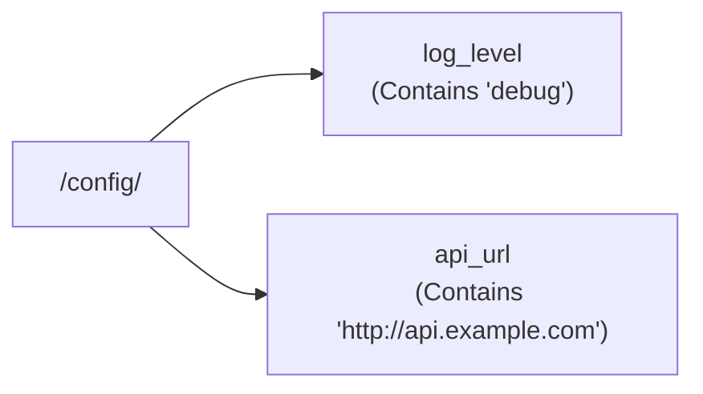

> **Complexity**: `[MEDIUM]` - Essential for stateful applications
>
> **Time to Complete**: 40-50 minutes
>
> **Prerequisites**: Module 1.3 (Multi-Container Pods)

---

## Learning Outcomes

After completing this module, you will be able to:
- **Create** pods with emptyDir, hostPath, and PersistentVolumeClaim volumes
- **Configure** volume mounts to share data between containers in the same pod
- **Debug** volume mount errors including permission issues and missing PVCs
- **Explain** the difference between ephemeral and persistent volumes and when to use each

---

## Why This Module Matters

Containers are ephemeral—when they restart, all data is lost. For real applications, you need persistent storage: databases need durable data, applications need shared files, and containers need ways to exchange data.

The CKAD tests practical volume usage: mounting ConfigMaps, sharing data between containers, and using persistent storage. You won't manage StorageClasses (that's CKA), but you will use PersistentVolumeClaims.

> **The Desk Drawer Analogy**
>
> A container's filesystem is like a whiteboard—useful while you're there, but wiped when you leave. An `emptyDir` volume is like a shared table in a meeting room—everyone in the meeting can use it, but it's cleared when the meeting ends. A PersistentVolume is like your desk drawer—it's yours, persists between workdays, and contains your important files.

---

## Volume Types for Developers

### Quick Reference

| Volume Type | Persistence | Sharing | Use Case |
|-------------|-------------|---------|----------|
| `emptyDir` | Pod lifetime | Between containers | Scratch space, caches |
| `hostPath` | Node lifetime | No | Node access (dev only) |
| `configMap` | Cluster lifetime | Read-only | Configuration files |
| `secret` | Cluster lifetime | Read-only | Sensitive data |
| `persistentVolumeClaim` | Beyond pod | Depends | Databases, stateful apps |
| `projected` | Varies | Read-only | Combine multiple sources |

---

## emptyDir: Temporary Shared Storage

An `emptyDir` is created when a Pod starts and deleted when the Pod is removed. Perfect for:
- Sharing files between containers
- Scratch space for computation
- Caches

### Basic emptyDir

```yaml
apiVersion: v1
kind: Pod
metadata:
  name: emptydir-demo
spec:
  containers:
  - name: writer
    image: busybox
    command: ["sh", "-c", "echo 'Hello' > /data/message && sleep 3600"]
    volumeMounts:
    - name: shared
      mountPath: /data
  - name: reader
    image: busybox
    command: ["sh", "-c", "cat /data/message && sleep 3600"]
    volumeMounts:
    - name: shared
      mountPath: /data
  volumes:
  - name: shared
    emptyDir: {}
```

### Memory-Backed emptyDir

For high-speed scratch space:

```yaml
volumes:
- name: cache
  emptyDir:
    medium: Memory      # Uses RAM instead of disk
    sizeLimit: 100Mi    # Limit memory usage
```

---

## ConfigMap Volumes

Mount ConfigMaps as files. Each key becomes a file.

### Create ConfigMap

```bash
# From literals
k create configmap app-config \
  --from-literal=log_level=debug \
  --from-literal=api_url=http://api.example.com

# From file
k create configmap nginx-config --from-file=nginx.conf
```

### Mount as Volume

```yaml
apiVersion: v1
kind: Pod
metadata:
  name: config-demo
spec:
  containers:
  - name: app
    image: busybox
    command: ["sh", "-c", "cat /config/log_level && sleep 3600"]
    volumeMounts:
    - name: config
      mountPath: /config
  volumes:
  - name: config
    configMap:
      name: app-config
```

Result:


> **Pause and predict**: When you mount a ConfigMap as a volume to `/etc/app`, what happens to any existing files already at `/etc/app` inside the container image? What if you only want to add one file without wiping out the rest?

### Mount Specific Keys

```yaml
volumes:
- name: config
  configMap:
    name: app-config
    items:
    - key: log_level
      path: logging/level.txt   # Custom path
```

### SubPath: Mount Single File Without Overwriting

```yaml
volumeMounts:
- name: config
  mountPath: /etc/app/config.yaml    # Specific file
  subPath: config.yaml               # Key from ConfigMap
```

---

## Secret Volumes

Like ConfigMaps but for sensitive data. Mounted files are tmpfs (memory-backed).

### Create Secret

```bash
k create secret generic db-creds \
  --from-literal=username=admin \
  --from-literal=password=secret123
```

### Mount Secret

```yaml
apiVersion: v1
kind: Pod
metadata:
  name: secret-demo
spec:
  containers:
  - name: app
    image: busybox
    command: ["sh", "-c", "cat /secrets/password && sleep 3600"]
    volumeMounts:
    - name: db-secrets
      mountPath: /secrets
      readOnly: true
  volumes:
  - name: db-secrets
    secret:
      secretName: db-creds
```

### File Permissions

```yaml
volumes:
- name: db-secrets
  secret:
    secretName: db-creds
    defaultMode: 0400    # Read-only by owner
```

---

## PersistentVolumeClaim (PVC)

For data that survives pod restarts. As a developer, you request storage with a PVC; the cluster provisions it.

### Create PVC

```yaml
apiVersion: v1
kind: PersistentVolumeClaim
metadata:
  name: data-pvc
spec:
  accessModes:
  - ReadWriteOnce         # RWO, ROX, RWX
  resources:
    requests:
      storage: 1Gi
  # storageClassName: fast  # Optional: specific class
```

> **Stop and think**: You're designing a pod that writes user uploads to a volume. If the pod crashes and gets rescheduled to a different node, what happens to the uploaded files with `emptyDir` vs `PersistentVolumeClaim`? This distinction is critical for the exam.

### Access Modes

| Mode | Short | Description |
|------|-------|-------------|
| `ReadWriteOnce` | RWO | One node can mount read-write |
| `ReadOnlyMany` | ROX | Many nodes can mount read-only |
| `ReadWriteMany` | RWX | Many nodes can mount read-write |

### Use PVC in Pod

```yaml
apiVersion: v1
kind: Pod
metadata:
  name: pvc-demo
spec:
  containers:
  - name: app
    image: nginx
    volumeMounts:
    - name: data
      mountPath: /data
  volumes:
  - name: data
    persistentVolumeClaim:
      claimName: data-pvc
```

### Imperative PVC Creation

```bash
# No direct imperative command, but quick YAML
cat << 'EOF' | k apply -f -
apiVersion: v1
kind: PersistentVolumeClaim
metadata:
  name: my-pvc
spec:
  accessModes: ["ReadWriteOnce"]
  resources:
    requests:
      storage: 1Gi
EOF
```

---

## Projected Volumes

Combine multiple sources into one mount point.

```yaml
apiVersion: v1
kind: Pod
metadata:
  name: projected-demo
spec:
  containers:
  - name: app
    image: busybox
    command: ["sh", "-c", "ls -la /projected && sleep 3600"]
    volumeMounts:
    - name: all-config
      mountPath: /projected
  volumes:
  - name: all-config
    projected:
      sources:
      - configMap:
          name: app-config
      - secret:
          name: app-secrets
      - downwardAPI:
          items:
          - path: "labels"
            fieldRef:
              fieldPath: metadata.labels
```

---

## Common Volume Patterns

### Pattern 1: Shared Scratch Space

```yaml
spec:
  containers:
  - name: processor
    image: processor
    volumeMounts:
    - name: scratch
      mountPath: /tmp/work
  - name: uploader
    image: uploader
    volumeMounts:
    - name: scratch
      mountPath: /data
  volumes:
  - name: scratch
    emptyDir: {}
```

### Pattern 2: Config + Secrets

```yaml
spec:
  containers:
  - name: app
    image: myapp
    volumeMounts:
    - name: config
      mountPath: /etc/app
    - name: secrets
      mountPath: /etc/secrets
      readOnly: true
  volumes:
  - name: config
    configMap:
      name: app-config
  - name: secrets
    secret:
      secretName: app-secrets
```

### Pattern 3: Init Container Prepares Data

```yaml
spec:
  initContainers:
  - name: download
    image: curlimages/curl
    command: ["curl", "-o", "/data/app.tar", "http://example.com/app.tar"]
    volumeMounts:
    - name: app-data
      mountPath: /data
  containers:
  - name: app
    image: myapp
    volumeMounts:
    - name: app-data
      mountPath: /app
  volumes:
  - name: app-data
    emptyDir: {}
```

---

> **Stop and think**: What would happen if you update a ConfigMap that's mounted as a volume in a running pod using `subPath`? Does the pod see the updated values? What about without `subPath`? Understanding this difference can save you debugging time in the exam.

## Troubleshooting Volumes

### Check Volume Status

```bash
# Pod volumes
k describe pod myapp | grep -A10 Volumes

# PVC status
k get pvc

# PVC details
k describe pvc data-pvc
```

### Common Issues

| Symptom | Cause | Solution |
|---------|-------|----------|
| Pod stuck Pending | PVC not bound | Check PV availability |
| Permission denied | Wrong mode/user | Set `securityContext.fsGroup` |
| File not found | Wrong mountPath | Verify paths match |
| ConfigMap not updating | Mounted files cached | Restart pod or use subPath carefully |

### Fix Permission Issues

```yaml
spec:
  securityContext:
    fsGroup: 1000    # Group ID for volume files
  containers:
  - name: app
    image: myapp
    securityContext:
      runAsUser: 1000
```

---

## Did You Know?

- **ConfigMaps and Secrets are eventually consistent.** When you update them, pods see changes within a minute—but NOT if you used `subPath` mounting. SubPath mounts are snapshots that don't auto-update.

- **emptyDir uses node disk by default** but can use RAM (`medium: Memory`). RAM-backed volumes are faster but count against container memory limits.

- **PVC deletion is blocked** if a pod is using it. Delete the pod first, then the PVC. Set `persistentVolumeReclaimPolicy: Delete` to auto-delete underlying storage when PVC is removed.

---

## Common Mistakes

| Mistake | Why It Hurts | Solution |
|---------|--------------|----------|
| Forgetting `volumeMounts` | Volume defined but not mounted | Add mount to container |
| Wrong `mountPath` | Files appear in unexpected location | Double-check paths |
| Using `subPath` for live updates | Updates won't propagate | Avoid subPath or restart pod |
| PVC with wrong access mode | Multi-node apps fail | Use RWX for shared access |
| Missing volume definition | Pod fails to start | Define volume in `spec.volumes` |

---

## Quiz

1. **A developer's pod caches processed thumbnails in `/tmp/cache`. Every time the pod restarts, the cache is lost and thumbnails must be regenerated, causing a 5-minute warmup period. They're using an `emptyDir` volume. Is `emptyDir` the right choice here, or should they switch to a PVC?**
   <details>
   <summary>Answer</summary>
   It depends on whether the cache needs to survive pod restarts. `emptyDir` is tied to the pod lifecycle -- data is lost when the pod is deleted or rescheduled. If the 5-minute warmup is unacceptable, switch to a `PersistentVolumeClaim` with `ReadWriteOnce` access mode. However, if the pod rarely restarts and the cache can be rebuilt, `emptyDir` is simpler and doesn't consume persistent storage. For a middle ground, use `emptyDir` with `medium: Memory` for faster cache performance during the pod's lifetime, accepting that restarts clear it.
   </details>

2. **Your application needs its config file at `/etc/app/config.yaml`, but mounting the ConfigMap at `/etc/app` wipes out other files already in that directory. How do you mount just the single config file without overwriting the directory contents?**
   <details>
   <summary>Answer</summary>
   To achieve this, use the `subPath` property in your volume mount configuration as shown below:
   ```yaml
   volumeMounts:
   - name: config
     mountPath: /etc/app/config.yaml
     subPath: config.yaml
   ```
   This mounts only