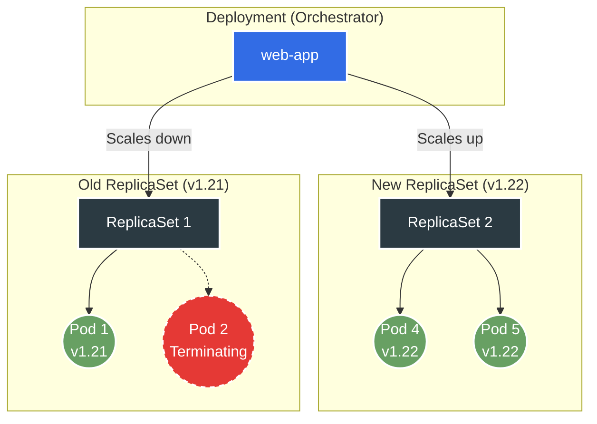

> **Complexity**: `[MEDIUM]` - Core CKAD skill with multiple operations
>
> **Time to Complete**: 45-55 minutes
>
> **Prerequisites**: Part 1 completed, understanding of Pods and ReplicaSets

---

## Learning Outcomes

After completing this module, you will be able to:
- **Implement** Deployment manifests and imperative commands that create, scale, and expose stateless applications.
- **Configure** rolling update strategies with `maxSurge`, `maxUnavailable`, `progressDeadlineSeconds`, and `revisionHistoryLimit`.
- **Diagnose** stalled rollouts by reading Deployment conditions, ReplicaSets, Pod events, and image pull failures.
- **Evaluate** when to pause, resume, rollback, restart, or recreate a Deployment during a release.

---

## Why This Module Matters

Hypothetical scenario: you are on call for a small API that normally runs three Pod replicas behind a Service. A developer ships a new container image, the first new Pod cannot pull its image, and customers begin seeing a mix of old behavior and delayed responses because the rollout is stuck halfway. The fastest useful engineer in that moment is not the person who memorized a command; it is the person who can explain which controller is waiting, which ReplicaSet owns each Pod, and which recovery action changes the least while restoring service.

Deployments are Kubernetes' standard controller for stateless application releases. They do not run containers directly. Instead, a Deployment writes the desired Pod template into a ReplicaSet, the ReplicaSet maintains the replica count, and the scheduler places the resulting Pods on Nodes. That extra layer can feel indirect at first, but it is the reason Kubernetes can roll forward gradually, keep old templates available for rollback, and reconcile back toward the desired state after a Pod or Node fails.

The CKAD exam uses Deployments because they combine several practical skills in one object. You must be able to create a Deployment quickly, inspect the Pods it owns, scale it without losing the selector relationship, update an image, diagnose a rollout that does not complete, and undo a bad release. Each of those actions is small by itself, yet production reliability comes from knowing how they interact under pressure.

In this module you will work through the full Deployment lifecycle with Kubernetes 1.35 style commands. The examples preserve the operational moves you need for the exam: imperative creation, declarative YAML, rolling update parameters, rollout status and history, pause and resume, rollbacks, label safety, and timed drills. The goal is not to memorize every field in the API. The goal is to build a mental model strong enough that a failed rollout feels inspectable instead of mysterious.

## The Deployment Control Loop

A Deployment is a controller, which means it continuously compares the desired state stored in the Kubernetes API with the observed state in the cluster. When those two states differ, the controller tries to close the gap by creating, scaling, or deleting child objects. For Deployments, the child object is a ReplicaSet, and the ReplicaSet creates Pods from the Pod template embedded inside the Deployment.

That relationship matters because every visible Pod is two steps away from the object you usually edit. If you change `spec.replicas`, the Deployment adjusts the active ReplicaSet's replica count. If you change the Pod template, the Deployment creates a new ReplicaSet because the template hash changes. If you delete one Pod manually, the ReplicaSet replaces it because the desired count has not changed.

Think of the Deployment as a release manager, the ReplicaSet as a production line, and the Pods as individual units coming off that line. The release manager decides which production line should run and how many units each line should produce. The workers do not negotiate the release plan; they only follow the template assigned to their line. That is why rollback means scaling an older ReplicaSet back up, not editing old Pods in place.

```text
+---------------- Deployment: web-app ----------------+
| desired replicas: 3                                  |
| rollout strategy: RollingUpdate                      |
| pod template hash: 6d8f9b6b4f                        |
+--------------------------+---------------------------+
                           |
                           v
+---------------- ReplicaSet: web-app-6d8f9b6b4f ------+
| selector: app=web,pod-template-hash=6d8f9b6b4f       |
| creates and replaces Pods until desired count is met |
+---------------+----------------+---------------------+
                |                |
                v                v
        +-------------+  +-------------+  +-------------+
        | Pod web-1   |  | Pod web-2   |  | Pod web-3   |
        | image v1    |  | image v1    |  | image v1    |
        +-------------+  +-------------+  +-------------+
```

The selector is the contract that ties the Deployment to the ReplicaSets and Pods it owns. `spec.selector.matchLabels` must match labels in `spec.template.metadata.labels`, and Kubernetes treats the selector as effectively immutable after creation because changing it could orphan existing Pods or capture Pods owned by a different controller. A beginner often sees labels as decoration, but for controllers they are the wiring.

The controller also tracks generations, which are useful when you need to know whether status has caught up with spec. `metadata.generation` increases when you change the Deployment spec, and `status.observedGeneration` reports the newest generation the controller has processed. If generation is ahead of observedGeneration, you may be looking at stale status. That does not happen often in a small lab, but it matters when the API server accepted a change and the controller has not reconciled it yet.

ReplicaSet names include a pod template hash because Kubernetes needs a stable way to distinguish templates. The hash is not a user-facing version number, and you should not build automation that depends on its exact value. It is still useful during diagnosis because Pods and ReplicaSets with the same hash came from the same template. When a rollout creates a second hash, you can map old and new Pods without guessing from age alone.

The minimal manifest below shows the important shape. The Deployment has metadata about the controller itself, then `spec.replicas`, `spec.selector`, and `spec.template`. The template is a complete Pod spec nested inside the Deployment, so container image, ports, resource requests, probes, environment variables, and template labels all live there. Any meaningful change inside `spec.template` creates a rollout because Kubernetes sees a new desired Pod template.

```yaml
apiVersion: apps/v1
kind: Deployment
metadata:
  name: web-app
  labels:
    app: web
spec:
  replicas: 3
  selector:
    matchLabels:
      app: web
  template:
    metadata:
      labels:
        app: web
    spec:
      containers:
      - name: nginx
        image: nginx:1.21
        ports:
        - containerPort: 80
        resources:
          requests:
            memory: "64Mi"
            cpu: "250m"
          limits:
            memory: "128Mi"
            cpu: "500m"
```

The resource requests and limits are not required to create a Deployment, but they are part of a responsible Pod template. Requests tell the scheduler how much capacity the Pod needs before it can be placed. Limits set the container's ceiling after it starts. A rollout strategy that looks safe on paper can still stall when every new Pod asks for more CPU or memory than the cluster can schedule.

| Component | Purpose |
|-----------|---------|
| `replicas` | Desired number of Pod copies to keep running |
| `selector.matchLabels` | Label query the Deployment uses to find its Pods |
| `template` | Pod specification copied into each new ReplicaSet |
| `strategy` | Rules for replacing old Pods with new Pods during updates |

Pause and predict: if the Deployment selector is `app: web` but the Pod template label is `app: api`, what should the controller do? The correct answer is not "fix the label for you." Kubernetes rejects that invalid Deployment because a controller that cannot select its own template would not be able to reconcile safely.

## Creating, Inspecting, and Scaling Deployments

There are two useful ways to create Deployments during CKAD work: imperative commands and declarative manifests. Imperative commands are fast when the requested object is simple and the exam clock is moving. Declarative YAML is better when the object needs several fields, when you want repeatability, or when you need to review an exact diff before applying it. A strong operator can move between both styles without changing the underlying mental model.

The imperative creation commands below are intentionally complete. They do not rely on a shell alias, and they produce real Deployment objects. `kubectl create deployment` sets a default selector based on the Deployment name and writes the image into the Pod template. The `--dry-run=client -o yaml` form is especially useful because it lets you generate a valid starting manifest, edit it, and then apply the file after adding strategy or resource fields.

```bash
# Imperative creation
kubectl create deployment nginx --image=nginx:1.21 --replicas=3

# With port
kubectl create deployment web --image=nginx --port=80

# Generate YAML
kubectl create deployment api --image=httpd --replicas=2 --dry-run=client -o yaml > deploy.yaml
```

After creation, inspection should answer three separate questions. First, did the Deployment object accept the desired replica count? Second, did the ReplicaSet create the expected Pods? Third, are those Pods actually Ready, or are they only present? A Deployment can exist while every Pod is stuck in `ImagePullBackOff`, and a simple object listing will not explain enough unless you inspect the child resources.

Scaling is a change to `spec.replicas`, not a release of a new template. That distinction is important because scaling up and down should not create a new ReplicaSet revision. It only changes how many Pods the active ReplicaSet should maintain. If you see a new ReplicaSet after a scale operation, something else in the template changed at the same time.

```bash
# Scale to 5 replicas
kubectl scale deployment web-app --replicas=5

# Scale to zero (stop all pods)
kubectl scale deployment web-app --replicas=0

# Scale multiple deployments
kubectl scale deployment web-app api-server --replicas=3
```

Manual scaling is useful for immediate operations, but it can conflict with controllers that also write replica counts. If a HorizontalPodAutoscaler manages the same Deployment, `kubectl scale` changes the current desired count only until the autoscaler reconciles again. During the exam, the object usually has no autoscaler unless the task says so. In production, always check whether another controller owns that field before assuming your manual value will persist.

```bash
# Watch pods scale; press Ctrl-C after the desired Pods are ready.
kubectl get pods -l app=web -w

# Check deployment status
kubectl get deployment web-app

# Detailed status
kubectl describe deployment web-app | grep -A5 Replicas
```

The label selector in the watch command is doing real work. It narrows the output to Pods with `app=web`, which should match the template labels. If you choose the wrong label, you may think scaling failed because the watch stays empty. When a Deployment appears stuck, verify the labels you are querying before you assume the controller has a deeper problem.

Declarative scaling is just as simple in YAML: change `spec.replicas` and apply the manifest. The advantage is auditability. The risk is that a stale local file can overwrite fields someone else changed if you are careless with full-object apply. For CKAD, a generated manifest edited in place is usually acceptable, but the habit to build is reading the target object before applying changes that affect release behavior.

Exposure is related to Deployment work but owned by a Service. `kubectl expose deployment production --port=80` creates a Service whose selector is derived from the Deployment's labels, and that Service sends traffic to matching Pods. If you update the Deployment image, the Service usually stays unchanged because traffic should continue to follow the stable app label. If you change template labels carelessly, the Service may have no endpoints even while the Deployment is Ready.

Namespaces are another practical boundary. In exam or lab work, a disposable namespace makes cleanup easy and reduces the chance that a broad selector catches unrelated Pods. In production, namespaces also connect to quotas, network policy, and RBAC, so a rollout that works in one namespace can fail in another because resource quota blocks the new ReplicaSet. When a Deployment cannot create Pods, check namespace-level constraints before blaming the Deployment manifest.

Before running this, what output do you expect if the Deployment has three desired replicas, two ready Pods, and one Pod waiting for an image pull? `kubectl get deployment` will summarize availability, but `kubectl describe deployment` and `kubectl get pods` will reveal the reason. Use the short view to notice trouble, then move to descriptions and events to explain it.

## Rolling Updates and Strategy Math

Rolling updates exist to avoid replacing every Pod at the same instant. The Deployment creates a new ReplicaSet for the new template, scales it up within the allowed surge budget, and scales the old ReplicaSet down within the allowed unavailable budget. The result is a controlled handoff between two ReplicaSets rather than an in-place mutation of running Pods.



The two numbers that shape the rollout are `maxSurge` and `maxUnavailable`. `maxSurge` controls how many extra Pods may exist above the desired replica count while the update is in progress. `maxUnavailable` controls how many desired Pods may be unavailable during the update. Together they describe the tradeoff between capacity, speed, and risk.

```yaml
spec:
  strategy:
    type: RollingUpdate
    rollingUpdate:
      maxSurge: 1
      maxUnavailable: 0
```

| Setting | Description | Example |
|---------|-------------|---------|
| `maxSurge` | Extra Pods allowed during update | `1` or `25%` |
| `maxUnavailable` | Desired Pods allowed to be unavailable during update | `0` or `25%` |

For a four replica Deployment with `maxSurge: 1` and `maxUnavailable: 0`, the maximum number of Pods during the update is five, and the minimum number of available Pods should remain four. That sounds safe, but it requires spare cluster capacity. If the scheduler cannot place the surge Pod, the Deployment cannot delete an old Pod because doing so would violate `maxUnavailable: 0`.

Percentages are rounded in ways that can surprise you. Kubernetes rounds surge upward and unavailable downward so the controller can make progress without exceeding the declared safety limit. On very small replica counts, a percentage can behave differently than your intuition. For one or two replicas, explicit integer values are often easier to reason about than percentages.

Readiness is what turns rollout math into user safety. A Pod that exists is not automatically an available replica; it must become Ready and, when configured, remain Ready long enough to satisfy availability timing. Without a readiness probe, Kubernetes may treat a container as ready as soon as it starts, even if the application inside still needs to load caches or open downstream connections. A rollout strategy can only protect users if readiness reflects real serving ability.

`minReadySeconds` adds another layer by requiring a new Pod to stay Ready for a period before it counts as available. That slows rollouts, but it catches applications that flap immediately after startup. For a CKAD task, you may not need to configure it unless asked. For real systems, it is a useful guard when a container can pass readiness briefly and then crash after accepting traffic.

Updating the image is the most common template change. `kubectl set image` targets a named container inside the Pod template, so the container name must match the manifest. The patch form is more verbose, but it is useful when you need to change fields that do not have a dedicated imperative subcommand. In Kubernetes 1.35 examples, use annotations for change cause tracking instead of relying on historical `--record` habits.

```bash
# Update container image
kubectl set image deployment/web-app nginx=nginx:1.22

# Track a change cause with an annotation
kubectl annotate deployment web-app kubernetes.io/change-cause="Update nginx to 1.22" --overwrite

# Update using patch
kubectl patch deployment web-app -p '{"spec":{"template":{"spec":{"containers":[{"name":"nginx","image":"nginx:1.22"}]}}}}'
```

You can also batch several template changes into a single rollout. Pausing a Deployment tells the controller to keep accepting spec changes without starting a new ReplicaSet for each one. This is useful when an image, environment variable, and resource limit must change together. It is not a way to stop all traffic; existing Pods keep running while the Deployment is paused.

Pausing has one operational edge: a paused Deployment will not roll out newer template changes until it is resumed, but scale changes can still affect the active ReplicaSet. That means a paused Deployment is not frozen in every possible way. If you pause for a batch, make the intended changes, verify the final template, and resume deliberately. Leaving a Deployment paused creates confusion for the next operator who expects an image update to start immediately.

```bash
# Pause rollout for batched changes
kubectl rollout pause deployment/web-app

# Make multiple changes while paused
kubectl set image deployment/web-app nginx=nginx:1.23
kubectl set resources deployment/web-app -c nginx --limits=memory=256Mi

# Resume rollout
kubectl rollout resume deployment/web-app
```

Strategy type is the other major choice. `RollingUpdate` is the default and should be your normal option for stateless applications that can tolerate more than one version running briefly. `Recreate` terminates old Pods first and then creates new Pods. That makes downtime likely, but it prevents two versions from running at the same time.

```yaml
# RollingUpdate (default) - gradual replacement
strategy:
  type: RollingUpdate

# Recreate - kill all old Pods, then create new Pods
strategy:
  type: Recreate
```

Use `Recreate` only when concurrency is more dangerous than downtime. A legacy process that writes to local disk without coordination may be safer with a short outage than with two versions writing incompatible data. For most web workloads, the better answer is to make the application backward compatible, use readiness probes, and keep `RollingUpdate` with conservative availability settings.

Backward compatibility is the hidden requirement behind most zero-downtime rollouts. If version two writes data that version one cannot read, a rolling update can hurt users even when every Pod stays Ready. Deployments can control Pod replacement order, but they cannot make application protocols compatible. For database-backed applications, plan migrations so old and new versions can overlap, then remove old compatibility code in a later release after the rollout has settled.

StatefulSets solve a different problem and should not be confused with Deployments. They give Pods stable identities and ordered rollout behavior, which matters for clustered databases and similar systems. Current Kubernetes releases also expose `maxUnavailable` in StatefulSet rolling updates, but that does not make a StatefulSet a drop-in replacement for a Deployment. Choose it because identity and storage semantics are required, not because a Deployment rollout is temporarily hard.

```yaml
updateStrategy:
  type: RollingUpdate
  rollingUpdate:
    maxUnavailable: 2
```

Pause and predict: with `maxSurge: 2` and `maxUnavailable: 0` on a five replica Deployment, what happens if the cluster has room for exactly five Pods and no spare capacity? The controller tries to create surge Pods first, the scheduler cannot place them, and the rollout stalls until you add capacity or allow some unavailability.

## Monitoring, Conditions, and Stalled Rollouts

A rollout is not successful just because a command returned. The Deployment has status fields, conditions, events, and child ReplicaSets that together explain what happened. `kubectl rollout status` is a good first check because it waits for completion and reports timeout clearly, but it is only the doorway into diagnosis. When it times out, move to descriptions, ReplicaSets, and Pods.

Status fields give you clues before you read every event. `updatedReplicas` tells you how many Pods match the newest template, `readyReplicas` tells you how many Pods are Ready, and `availableReplicas` tells you how many satisfy availability rules. If updated is high but available is low, the new Pods are being created but not becoming safely available. If updated remains low, the controller may be blocked before it can create or schedule replacements.

```bash
# Watch rollout progress
kubectl rollout status deployment/web-app

# Check if rollout completed within a bound
kubectl rollout status deployment/web-app --timeout=60s
```

History is another essential diagnostic surface. Every rollout revision corresponds to a distinct Pod template stored through ReplicaSets, subject to `revisionHistoryLimit`. The history command can show revision numbers and, when annotations are present, change causes. A useful habit is to annotate meaningful changes before or immediately after the update so future rollback decisions do not depend on memory.

```bash
# List revision history
kubectl rollout history deployment/web-app

# See specific revision details
kubectl rollout history deployment/web-app --revision=2

# Check current revision
kubectl describe deployment web-app | grep -i revision
```

Deployment conditions summarize controller progress. `Available` tells you whether the minimum availability requirement is satisfied. `Progressing` tells you whether the controller is observing progress toward the new template. `ReplicaFailure` appears when the Deployment cannot create Pods, often because of quota, admission, or scheduling errors. Conditions are not a replacement for Pod events, but they point you toward the right layer.

```bash
# Get condition types
kubectl get deployment web-app -o jsonpath='{.status.conditions[*].type}'

# Detailed conditions
kubectl describe deployment web-app | grep -A10 Conditions
```

| Condition | Meaning |
|-----------|---------|
| `Available` | Minimum replicas are available according to the Deployment's availability calculation |
| `Progressing` | The controller is creating, scaling, or adopting ReplicaSets for the current rollout |
| `ReplicaFailure` | The controller could not create or manage replicas successfully |

`progressDeadlineSeconds` is the controller's patience limit for rollout progress. If the Deployment makes no progress before the deadline, Kubernetes marks the Deployment as failed with a progress deadline condition. It does not automatically roll back for you. That design is deliberate: Kubernetes cannot know whether the previous version is safe, whether the failure is temporary capacity pressure, or whether a human wants to patch forward.

```yaml
spec:
  progressDeadlineSeconds: 600
```

An image pull failure is the classic stuck rollout. The new ReplicaSet exists, new Pods are created, and those Pods remain waiting because the image tag is wrong or the registry is unavailable. The old ReplicaSet may remain partially scaled depending on strategy settings. Your recovery options are to set a valid image, undo the rollout, or pause while you investigate. The safe option depends on whether existing Pods are still serving correctly.

What would happen if you run `kubectl set image deployment/web-app nginx=nginx:nonexistent-tag`? Kubernetes starts the rollout and then waits because the new Pods cannot become Ready. It does not automatically choose a rollback. Your safest immediate action is usually `kubectl rollout undo deployment/web-app` if the previous version was known good, followed by status checks and event inspection.

ReplicaSet inspection explains which template is active and how many Pods each revision owns. The newest ReplicaSet usually has nonzero desired replicas during a rollout, while older ReplicaSets shrink toward zero. If both old and new ReplicaSets have desired Pods for a long time, look for readiness failures, capacity shortages, or an unavailable budget that prevents scale-down.

```bash
# Each template change creates a new ReplicaSet
kubectl get rs -l app=web

# Example output:
# NAME                  DESIRED   CURRENT   READY   AGE
# web-app-6d8f9b6b4f   3         3         3       5m   (current)
# web-app-7b8c9d4e3a   0         0         0       10m  (previous)
```

Pod events finish the story because they show scheduler and kubelet reasons. `Pending` might mean insufficient CPU, a missing PersistentVolumeClaim, or an unsatisfied node selector. `ImagePullBackOff` points at registry access or image naming. `CrashLoopBackOff` means the image started and failed after launch, so the fix is different from a scheduling or pull problem.

Events also have ordering, which helps separate root cause from consequences. A Pod may show repeated pull failures, then backoff messages, then readiness failures after a later successful start. Read from the earliest relevant warning forward instead of stopping at the last line. In a fast exam environment, that habit keeps you from fixing the symptom while missing the first rejection that caused the rollout to stall.

The useful diagnostic order is deliberate: Deployment, ReplicaSet, Pod, events. Start at the controller to see the desired state and conditions. Move down to ReplicaSets to map revisions. Move down again to Pods to see readiness and waiting reasons. Then read events to identify the exact subsystem that rejected or delayed the work.

Endpoint checks connect controller health to user traffic. A Deployment can report progressing while a Service still has only old endpoints, or while no endpoints match because a label changed. When the incident is about reachability, include `kubectl get endpoints` or `kubectl get endpointslices` in the investigation after checking Pods. That final step confirms that Ready Pods are not merely healthy in isolation but are also discoverable through the Service path users depend on, including the load-balancing objects that hide Pod churn from clients during routine replacement and normal release traffic.

## Rollbacks, Restarts, and Revision History

Rollback in Kubernetes does not rewind the cluster clock. It creates a new rollout that uses the Pod template from an earlier revision. That means the revision number continues forward, and the restored template becomes the active state. Understanding that detail prevents a common confusion when a learner rolls back from revision four to revision two and then sees a new revision number appear.

```bash
# Roll back to previous revision
kubectl rollout undo deployment/web-app

# Roll back to specific revision
kubectl rollout undo deployment/web-app --to-revision=2

# Check rollback status
kubectl rollout status deployment/web-app
```

Old ReplicaSets are kept because they contain the old Pod templates. The controller normally scales them to zero after a successful rollout, but it does not delete them immediately. `revisionHistoryLimit` controls how many old ReplicaSets are retained. A very low value saves object clutter but narrows your rollback window, while a very high value keeps more history than most teams can responsibly reason about.

```yaml
spec:
  revisionHistoryLimit: 5
```

Rollout restart is different from rollback. Restart keeps the same image and template fields but changes the Pod template annotation so the Deployment creates fresh Pods. It is useful when Pods need to pick up mounted ConfigMap changes or when you want a clean process restart without changing the application version. It should still be treated as a rollout because it can fail for capacity or readiness reasons.

The template trigger is what matters. Any change under `spec.template` starts a new ReplicaSet: image, resources, labels, annotations, environment variables, probes, or command fields. A change to Deployment metadata outside the template does not restart Pods. That difference explains why labeling the Deployment itself is not the same as labeling the Pods that it creates.

```bash
# Create a rolling restart without changing the image.
kubectl rollout restart deployment/web-app

# Alternative template annotation trigger for restricted environments.
kubectl patch deployment web-app -p '{"spec":{"template":{"metadata":{"annotations":{"restart.kubedojo.io/requested-at":"'$(date +%s)'"}}}}}'
```

Be careful with shell quoting when you use patches. The command above relies on single-quoted JSON with a shell expansion inserted in the middle, which works in POSIX-style shells but is easy to mistype. During CKAD, a generated YAML file is often safer when the patch becomes hard to read. Fast is good only when you can still see exactly what you are changing.

A rollback should end with verification, not relief. Run `kubectl rollout status`, inspect the image, and check that the desired Pods are Ready. If the Deployment was exposed through a Service, verify labels still match the Service selector. A successful rollback that leaves the Service pointing at the wrong label is still a failed recovery from the user's perspective.

Not every failed rollout should be rolled back. If the failure is a quota that prevents surge Pods from scheduling, rollback may face the same quota pressure while adding another change to reason about. If the new image is wrong and the old Pods are still serving, rollback is usually clear. If the new version already changed external state, you need application context before returning to an old template. Kubernetes gives you the mechanism, but you still choose the recovery path.

Rollback history also depends on retention. If `revisionHistoryLimit` is too low, the specific revision you want may no longer exist as a retained ReplicaSet. In that case, `rollout undo --to-revision` cannot restore what the controller has already discarded. Keep enough history for realistic recovery, and store release metadata outside the cluster when audit or compliance requirements need a longer record than ReplicaSets should provide.

## Labels, Selectors, and Template Ownership

Labels are the language Kubernetes controllers use to group objects. A Deployment selector chooses Pods by label, a Service selector sends traffic to Pods by label, and your diagnostic commands often filter by label. When those labels are consistent, you can move quickly. When they drift, the cluster may be healthy while your mental picture is wrong.

The Deployment selector must match the Pod template labels. Extra template labels are allowed, and they are useful for dimensions such as `tier`, `version`, or `environment`. Missing selector labels are not allowed because the controller would create Pods it could not select. That validation protects you from a class of accidental orphaning errors.

```yaml
spec:
  selector:
    matchLabels:
      app: web
      tier: frontend
  template:
    metadata:
      labels:
        app: web
        tier: frontend
        version: v1
```

Changing labels has two very different meanings depending on where the label lives. A label on the Deployment metadata changes how the Deployment object appears in searches, but it does not affect existing or future Pods. A label under `spec.template.metadata.labels` changes the Pod template, creates a rollout, and can affect Service routing if the Service selector uses that label.

```bash
# Add label to deployment metadata only
kubectl label deployment web-app environment=production

# Add label to pods via the template, which triggers a rollout
kubectl patch deployment web-app -p '{"spec":{"template":{"metadata":{"labels":{"version":"v2"}}}}}'
```

This is why Service selectors should usually target stable identity labels, not release labels. If a Service selects `app=web`, changing a Pod's `version` label does not break traffic. If the Service selects `version=v1`, a rollout to `version=v2` may remove every endpoint until the Service is updated. Sometimes that is intentional for canary routing, but it should never happen by accident.

Canary and blue-green patterns use labels intentionally, but they require a traffic plan outside the Deployment itself. A Deployment can create Pods with a new label, yet a Service decides whether traffic follows that label. If you are not deliberately designing a routing split, keep the Deployment and Service selectors boring. Reliable rollouts usually come from stable selectors plus readiness, not from clever label changes during an incident.

Selectors also explain why manual Pod edits are weak operations. Editing a running Pod does not change the Deployment template, so the next replacement Pod will be created from the old template. If you need the change to survive, edit the Deployment or apply a manifest that changes `spec.template`. Treat direct Pod edits as debugging experiments, not durable configuration.

The following quick reference preserves the common operations, but the important skill is choosing the command that matches the field you intend to change. Creation, scaling, image updates, rollout inspection, history, rollback, pause, resume, and restart are separate operations because they write different parts of the object or ask different controllers for status.

```bash
# Create
kubectl create deployment NAME --image=IMAGE --replicas=N

# Scale
kubectl scale deployment NAME --replicas=N

# Update image
kubectl set image deployment/NAME CONTAINER=IMAGE

# Update resources
kubectl set resources deployment/NAME -c CONTAINER --limits=cpu=200m,memory=512Mi

# Rollout status
kubectl rollout status deployment/NAME

# Rollout history
kubectl rollout history deployment/NAME

# Rollback
kubectl rollout undo deployment/NAME

# Pause/Resume
kubectl rollout pause deployment/NAME
kubectl rollout resume deployment/NAME

# Restart all pods with a rolling restart
kubectl rollout restart deployment/NAME
```

## Patterns & Anti-Patterns

Good Deployment practice is mostly about making controller behavior boring. You want each rollout to have a clear trigger, enough capacity to make progress, labels that keep traffic attached to the right Pods, and verification that catches failure before users do. The patterns below are practical because they reduce ambiguity at the exact moments when ambiguity is most expensive.

| Pattern | When to Use | Why It Works |
|---------|-------------|--------------|
| Generate YAML, then apply | The Deployment needs strategy, resources, labels, or reviewable config | The command gives you valid structure while the file captures repeatable intent |
| Use conservative surge math | The application is user-facing and spare capacity exists | `maxUnavailable: 0` keeps desired availability while `maxSurge` gives the controller room to start replacements |
| Annotate meaningful changes | Several people operate the same Deployment | Rollout history becomes easier to interpret during rollback decisions |
| Verify from Deployment to Pods | A rollout is slow, stuck, or surprising | Each layer narrows the cause without guessing from a single status line |

Anti-patterns usually come from treating a Deployment as if it were a script. A script runs once and ends, but a controller keeps reconciling. If you manually delete Pods, patch child ReplicaSets, or change labels without understanding selector ownership, Kubernetes may undo your work or preserve the wrong state with perfect consistency.

| Anti-Pattern | What Goes Wrong | Better Alternative |
|--------------|-----------------|--------------------|
| Editing Pods for permanent fixes | Replacement Pods lose the manual change | Change the Deployment template and let a rollout recreate Pods |
| Using `Recreate` for ordinary web releases | Users experience downtime even though rolling updates would work | Keep `RollingUpdate` and design the app for version overlap |
| Setting `maxUnavailable: 100%` casually | The rollout can remove all serving Pods at once | Use explicit small integers or tested percentages |
| Ignoring old ReplicaSets | Rollback history becomes confusing or unavailable | Set a deliberate `revisionHistoryLimit` and annotate release causes |

The scaling pattern has a separate trap: manual replica counts are not ownership boundaries. If another controller manages replicas, your value may not last. In clusters with autoscaling, check for a HorizontalPodAutoscaler before declaring that a scale command "did not work." The Deployment accepted your write, but another controller may have written a different desired state afterward.

The selector pattern is stricter than most learners expect. Stable labels such as `app`, `component`, and `tier` are good selector candidates because they describe identity. Labels such as `version`, `track`, or `release` change more often, so they belong in template metadata only when the rollout and Service strategy have been designed for that change.

## Decision Framework

Choose your Deployment action by first identifying the field or behavior you need to change. If the desired number of Pods changed, scale. If the Pod template changed, roll out. If the rollout is bad and the previous template is known good, undo. If the same template needs fresh Pods, restart. If multiple template fields must change together, pause, patch, and resume.

| Situation | Primary Action | Follow-Up Check | Main Risk |
|-----------|----------------|-----------------|-----------|
| Need more or fewer identical Pods | `kubectl scale deployment NAME --replicas=N` | `kubectl get deployment NAME` and Pod readiness | Autoscaler may later change the count |
| Need a new image | `kubectl set image deployment/NAME CONTAINER=IMAGE` | `kubectl rollout status deployment/NAME` | Wrong container name or bad image tag |
| Need several template changes together | Pause, make changes, resume | History shows one rollout after resume | Forgetting to resume leaves future changes pending |
| New rollout is failing | Inspect conditions, ReplicaSets, Pods, and events | Decide patch forward or undo | Guessing from status without reading events |
| Previous version is safer | `kubectl rollout undo deployment/NAME` | Status, image, Pods, and Service endpoints | Rolling back to a template that is no longer compatible |
| Same template needs fresh Pods | `kubectl rollout restart deployment/NAME` | Status and Pod ages | Restart still needs capacity and readiness |
| Versions cannot overlap | `strategy.type: Recreate` | Expected downtime window | Users see outage unless planned |

The fastest decision path during an incident is a small flow. Ask whether traffic is currently healthy. If yes, you can pause or patch carefully. If no, ask whether the previous template is known good. If it is known good, undo and verify. If it is not known good, diagnose events before changing more fields because an uninformed patch can make the recovery path harder.

```text
Release problem observed
        |
        v
Is current traffic healthy enough to investigate?
        |
   +----+----+
   |         |
  yes        no
   |         |
   v         v
Pause or inspect     Is previous template known good?
conditions/events            |
   |                     +----+----+
   v                     |         |
Patch forward          yes         no
and resume              |          |
                         v          v
                 Rollout undo     Inspect Pods/events
                 and verify       before more changes
```

Use declarative manifests when the decision includes more than one field or when a reviewer needs to understand the intended object. Use imperative commands when the operation is narrow and reversible, such as scaling for an exam task or updating a single image. The boundary is not ideology. It is whether the command communicates enough intent to be safe.

For small replica counts, prefer explicit integers in rollout strategy. `maxUnavailable: 1` is easier to reason about than a percentage when there are only two or three Pods. For larger fleets, percentages can scale naturally as the replica count changes. The decision depends on whether your main constraint is human clarity or proportional rollout speed.

For rollback, decide before you type whether you are restoring service or collecting evidence. If users are down and the old version is known good, restore first and inspect second. If the rollout is slow but users are still served, inspect first because the problem may be capacity, readiness, or an image tag that can be patched forward without returning to old behavior.

For the exam, translate each prompt into an object and a field before choosing syntax. "Scale the app" means Deployment `spec.replicas`. "Update the container image" means Deployment `spec.template.spec.containers[].image`. "Undo the previous deployment" means Deployment rollout history. "Make Pods receive a new label" means template metadata, not top-level metadata. This field-first reading prevents many command mistakes.

For production, add a time dimension to the same framework. A safe rollout is not only the one that eventually succeeds; it is the one that exposes failure early enough to reverse or patch forward while old capacity still exists. Tight readiness, reasonable progress deadlines, and visible rollout status make that time dimension measurable. Without them, the Deployment controller still works, but people notice problems later.

## Did You Know?

- `kubectl rollout restart` works by changing the Pod template annotations, so it creates a normal rolling update even when the image tag stays the same.
- Deployments keep old ReplicaSets scaled to zero for rollback, and `revisionHistoryLimit` controls how many old templates remain available.
- The default Deployment strategy is `RollingUpdate`, and `Recreate` is a deliberate downtime tradeoff rather than a safer default.
- Kubernetes 1.35 still uses the Deployment, ReplicaSet, and Pod controller chain for stateless rollouts; Pods are never patched in place during an image update.

## Common Mistakes

| Mistake | Why It Happens | How to Fix It |
|---------|----------------|---------------|
| Selector does not match template labels | The author treats labels as descriptive text instead of controller wiring | Make every selector label appear in `spec.template.metadata.labels` before applying |
| Using `Recreate` for a normal web service | It looks simpler than reasoning about surge and unavailable budgets | Use `RollingUpdate` unless overlapping versions are truly unsafe |
| Setting `maxUnavailable: 0` without spare capacity | The rollout needs surge Pods before it can remove old Pods | Add capacity, reduce `maxSurge`, or allow one unavailable Pod after checking risk |
| Forgetting rollout status after an image update | The command returns after writing the new template, not after proving success | Run `kubectl rollout status` and inspect events when it times out |
| Labeling only Deployment metadata | The label appears on the controller but not on created Pods | Patch `spec.template.metadata.labels` when Pod labels must change |
| Rolling back without checking Service endpoints | The Deployment may be Ready while traffic selection is broken | Verify Pod labels and Service selectors after recovery |
| Treating restart as risk free | A restart still creates new Pods that must schedule and become Ready | Watch rollout status and ensure capacity before restarting critical workloads |

## Quiz

<details>
<summary>Your team updates `deployment/api-server` from `api:v1` to `api:v2`, and `kubectl rollout status` times out. New Pods show `ImagePullBackOff`, while the old ReplicaSet still has Ready Pods. What do you check first, and what is the safest recovery if `api:v1` was known good?</summary>

Start by confirming the Deployment conditions, then inspect the new Pods' events to verify the image pull failure. The safest recovery is `kubectl rollout undo deployment/api-server` when the previous version is known good, followed by `kubectl rollout status deployment/api-server`. Kubernetes will not automatically roll back because it cannot know whether the old version is safe for your current data or dependencies. After service is restored, fix the image reference or registry access before attempting a new rollout.
</details>

<details>
<summary>You need to change both the image and memory limit of `deployment/web-app`, but you want one rollout revision rather than two. Which Deployment operation should you use?</summary>

Pause the Deployment with `kubectl rollout pause deployment/web-app`, make both template changes, and then run `kubectl rollout resume deployment/web-app`. Pausing does not stop existing Pods, but it prevents each template edit from starting its own ReplicaSet. After resuming, verify with `kubectl rollout status` and inspect history to confirm the batched change appears as one rollout. This is better than issuing separate unpaused commands when the two changes must be tested together.
</details>

<details>
<summary>A four replica Deployment uses `maxSurge: 1` and `maxUnavailable: 0`. During an update, what are the maximum Pod count and minimum available Pod count, and why can the rollout still stall?</summary>

The controller may run up to five Pods because one surge Pod is allowed above the desired count. It should keep at least four available Pods because zero unavailable desired replicas are allowed. The rollout can still stall if the cluster cannot schedule the surge Pod, because the controller is not allowed to delete an old available Pod first. The fix is to provide capacity or choose a strategy that allows carefully bounded unavailability.
</details>

<details>
<summary>You scaled `deployment/worker` to six replicas, but a few minutes later it is back at three. The Deployment accepted your command. What likely changed the value back?</summary>

Another controller probably owns or rewrites the replica count, most commonly a HorizontalPodAutoscaler. `kubectl scale` writes `spec.replicas`, but it does not prevent other controllers from reconciling the same field later. Check for an HPA that targets the Deployment and read its metrics and bounds. If autoscaling is intended, change the HPA limits or metrics rather than fighting the Deployment replica count manually.
</details>

<details>
<summary>You patched `metadata.labels.environment=production` on a Deployment, then a Service selecting `environment=production` still has no endpoints. What went wrong?</summary>

You labeled the Deployment object, not the Pods created by its template. Services route to Pods, so the label must exist on `spec.template.metadata.labels` for new Pods and on existing Pods after a rollout. Patch the template label or apply a manifest that changes it, then watch the rollout and verify endpoints. Remember that template label changes create new Pods because they change the desired Pod template.
</details>

<details>
<summary>A rollback to revision two succeeds, but rollout history now shows a newer revision number. Did Kubernetes fail to restore the old version?</summary>

No. A rollback creates a new rollout using the Pod template from the selected old revision, so the revision counter continues forward. Kubernetes is not rewriting history; it is making the chosen template the new desired state. Verify the restored image and Pod readiness rather than expecting the current revision number to become two again. This behavior also means rollback itself should be monitored like any other rollout.
</details>

<details>
<summary>A legacy single-writer application corrupts data if two versions run at the same time. Which Deployment strategy fits, and what must you communicate before using it?</summary>

Use `strategy.type: Recreate` if version overlap is more dangerous than downtime. The controller terminates old Pods before starting new Pods, which avoids concurrent versions but creates an outage window. You must communicate that downtime is expected and verify that dependent systems can tolerate it. For longer-term reliability, the better engineering path is usually to remove the single-writer local-state constraint so rolling updates become possible.
</details>

## Hands-On Exercise

Exercise scenario: you will operate a small `webapp` Deployment through creation, scaling, image updates, rollback, batched changes, and cleanup. Use a disposable namespace if your cluster policy allows it. The steps are written so each task has a visible success condition, and the timed drills repeat the same skills in smaller loops for CKAD speed.

Start by reading the commands before running them. Predict which operation changes `spec.replicas`, which operation changes `spec.template`, and which operation only reads status. That prediction forces you to connect each command to the controller behavior from the lesson, which is the difference between copying syntax and diagnosing a real rollout.

### Setup

```bash
kubectl create namespace ckad-deployments
kubectl config set-context --current --namespace=ckad-deployments
```

### Task 1: Create and Scale

```bash
# Create deployment
kubectl create deployment webapp --image=nginx:1.20 --replicas=2

# Verify
kubectl get deployment webapp
kubectl get pods -l app=webapp

# Scale up
kubectl scale deployment webapp --replicas=5

# Verify scaling; press Ctrl-C after five Pods appear.
kubectl get pods -l app=webapp -w
```

<details>
<summary>Solution notes for Task 1</summary>

The create command writes a Deployment with two desired replicas, and the scale command changes `spec.replicas` to five. The Pod template does not change during scaling, so this task should not create a new rollout revision. If the watch does not show Pods, check the label selector with `kubectl get deployment webapp -o yaml` and confirm the template label is `app: webapp`.
</details>

### Task 2: Rolling Update

```bash
# Update image
kubectl set image deployment/webapp nginx=nginx:1.21

# Watch rollout
kubectl rollout status deployment/webapp

# Check history
kubectl rollout history deployment/webapp

# Update again
kubectl set image deployment/webapp nginx=nginx:1.22
```

<details>
<summary>Solution notes for Task 2</summary>

Each image change updates the Pod template and creates a rollout. The history command should show multiple revisions after the second update. If the container name is wrong, `kubectl set image` will not update the intended field, so confirm the container is named `nginx` before assuming the rollout controller is broken.
</details>

### Task 3: Rollback

```bash
# Roll back to previous
kubectl rollout undo deployment/webapp

# Verify image reverted
kubectl describe deployment webapp | grep Image

# Roll back to specific revision
kubectl rollout history deployment/webapp
kubectl rollout undo deployment/webapp --to-revision=1
```

<details>
<summary>Solution notes for Task 3</summary>

The first undo restores the previous Pod template. The specific revision form chooses an older template by number, but the active revision after rollback will still move forward. Always run status after the undo in real work, because rollback creates a rollout that can fail for the same capacity or readiness reasons as any other update.
</details>

### Task 4: Pause and Batch Changes

```bash
# Pause
kubectl rollout pause deployment/webapp

# Make multiple changes
kubectl set image deployment/webapp nginx=nginx:1.23
kubectl set resources deployment/webapp -c nginx --limits=memory=128Mi

# Resume
kubectl rollout resume deployment/webapp

# Verify single rollout
kubectl rollout status deployment/webapp
```

<details>
<summary>Solution notes for Task 4</summary>

Pausing lets you collect template changes before the Deployment starts a new ReplicaSet. After resume, Kubernetes reconciles the final template state. If you forget to resume, later changes can appear confusing because the Deployment remains paused. Check `.spec.paused` when rollout behavior does not match your expectations.
</details>

### Task 5: Cleanup

```bash
kubectl delete deployment webapp
kubectl delete namespace ckad-deployments
```

<details>
<summary>Solution notes for Task 5</summary>

Deleting the Deployment removes the controller and its managed ReplicaSets and Pods. Deleting the namespace is a convenient cleanup step for a disposable lab, but do not delete a shared namespace unless you created it for the exercise. If namespace deletion is blocked, inspect remaining resources in that namespace before retrying.
</details>

### Timed Practice Drills

The drills below keep the original practice flow while using complete `kubectl` commands. Run them after the main exercise, and treat the target times as rough pressure, not as a reason to skip verification. Speed is useful only when it still produces correct object state.

### Drill 1: Basic Deployment (Target: 2 minutes)

```bash
# Create deployment with 3 replicas
kubectl create deployment drill1 --image=nginx --replicas=3

# Verify all pods running
kubectl get pods -l app=drill1

# Scale to 5
kubectl scale deployment drill1 --replicas=5

# Verify
kubectl get deployment drill1

# Cleanup
kubectl delete deployment drill1
```

### Drill 2: Image Update (Target: 3 minutes)

```bash
# Create deployment
kubectl create deployment drill2 --image=nginx:1.20

# Update image
kubectl set image deployment/drill2 nginx=nginx:1.21

# Check rollout status
kubectl rollout status deployment/drill2

# Verify new image
kubectl describe deployment drill2 | grep Image

# Cleanup
kubectl delete deployment drill2
```

### Drill 3: Rollback (Target: 3 minutes)

```bash
# Create and update multiple times
kubectl create deployment drill3 --image=nginx:1.19
kubectl set image deployment/drill3 nginx=nginx:1.20
kubectl set image deployment/drill3 nginx=nginx:1.21

# Check history
kubectl rollout history deployment/drill3

# Roll back to revision 1
kubectl rollout undo deployment/drill3 --to-revision=1

# Verify image is 1.19
kubectl describe deployment drill3 | grep Image

# Cleanup
kubectl delete deployment drill3
```

### Drill 4: Rolling Update Settings (Target: 4 minutes)

```bash
# Create deployment with custom strategy
cat << 'EOF' | kubectl apply -f -
apiVersion: apps/v1
kind: Deployment
metadata:
  name: drill4
spec:
  replicas: 4
  strategy:
    type: RollingUpdate
    rollingUpdate:
      maxSurge: 1
      maxUnavailable: 0
  selector:
    matchLabels:
      app: drill4
  template:
    metadata:
      labels:
        app: drill4
    spec:
      containers:
      - name: nginx
        image: nginx:1.20
EOF

# Update and watch; this should show 5 Pods max and 4 always ready.
kubectl set image deployment/drill4 nginx=nginx:1.21
kubectl get pods -l app=drill4 -w

# Cleanup
kubectl delete deployment drill4
```

### Drill 5: Pause and Resume (Target: 3 minutes)

```bash
# Create deployment
kubectl create deployment drill5 --image=nginx:1.20

# Pause
kubectl rollout pause deployment/drill5

# Make changes, with no rollout yet
kubectl set image deployment/drill5 nginx=nginx:1.21
kubectl set resources deployment/drill5 -c nginx --requests=cpu=100m

# Verify paused
kubectl get deployment drill5 -o jsonpath='{.spec.paused}{"\n"}'

# Resume
kubectl rollout resume deployment/drill5

# Check single rollout applied both changes
kubectl rollout status deployment/drill5

# Cleanup
kubectl delete deployment drill5
```

### Drill 6: Complete Deployment Scenario (Target: 6 minutes)

Exercise scenario: deploy an application, update it, encounter an image issue, and roll back to restore service.

```bash
# 1. Create initial deployment
kubectl create deployment production --image=nginx:1.20 --replicas=3

# 2. Expose as service
kubectl expose deployment production --port=80

# 3. Verify working
kubectl rollout status deployment/production
kubectl get pods -l app=production

# 4. Update to a broken image to simulate a bad release
kubectl set image deployment/production nginx=nginx:broken-tag

# 5. Check rollout stalled
kubectl rollout status deployment/production --timeout=30s

# 6. See problem pods
kubectl get pods -l app=production

# 7. Roll back quickly
kubectl rollout undo deployment/production

# 8. Verify recovered
kubectl rollout status deployment/production
kubectl get pods -l app=production

# 9. Cleanup
kubectl delete deployment production
kubectl delete service production
```

### Success Criteria

- [ ] Implement a Deployment manifest or command that creates a stateless application with the intended replica count.
- [ ] Scale a Deployment up and verify the Deployment and Pods show the desired count.
- [ ] Configure a rolling update with image changes and explain the effect of `maxSurge` and `maxUnavailable`.
- [ ] Diagnose a stalled rollout by reading Deployment conditions, ReplicaSets, Pod status, and events.
- [ ] Evaluate whether pause, resume, rollback, restart, or recreate is the right release action for a given situation.
- [ ] Clean up the Deployment, Service, and namespace resources created during the exercise.

## Sources

- [Kubernetes Deployments](https://kubernetes.io/docs/concepts/workloads/controllers/deployment/)
- [Kubernetes ReplicaSet](https://kubernetes.io/docs/concepts/workloads/controllers/replicaset/)
- [Run a Stateless Application Using a Deployment](https://kubernetes.io/docs/tasks/run-application/run-stateless-application-deployment/)
- [Declarative Management of Kubernetes Objects](https://kubernetes.io/docs/tasks/manage-kubernetes-objects/declarative-config/)
- [kubectl create deployment reference](https://kubernetes.io/docs/reference/kubectl/generated/kubectl_create/kubectl_create_deployment/)
- [kubectl scale reference](https://kubernetes.io/docs/reference/kubectl/generated/kubectl_scale/)
- [kubectl rollout reference](https://kubernetes.io/docs/reference/kubectl/generated/kubectl_rollout/)
- [kubectl set image reference](https://kubernetes.io/docs/reference/kubectl/generated/kubectl_set/kubectl_set_image/)
- [Labels and Selectors](https://kubernetes.io/docs/concepts/overview/working-with-objects/labels/)
- [Resource Management for Pods and Containers](https://kubernetes.io/docs/concepts/configuration/manage-resources-containers/)
- [Kubernetes StatefulSets](https://kubernetes.io/docs/concepts/workloads/controllers/statefulset/)

## Next Module

[Module 2.2: Helm Package Manager](../module-2.2-helm/) - Deploy and manage applications with Helm charts.
