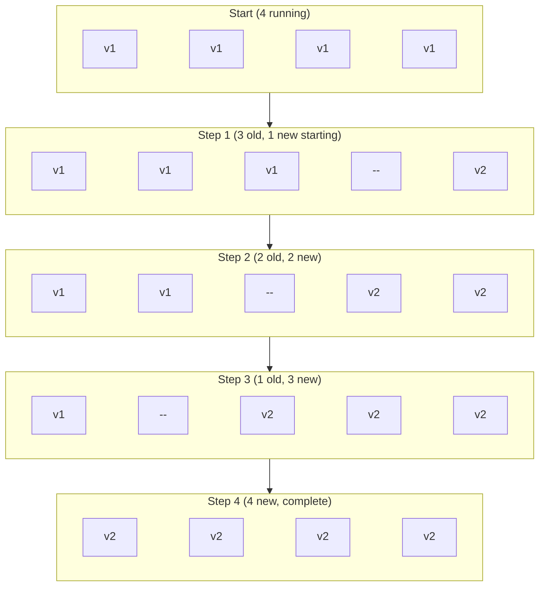
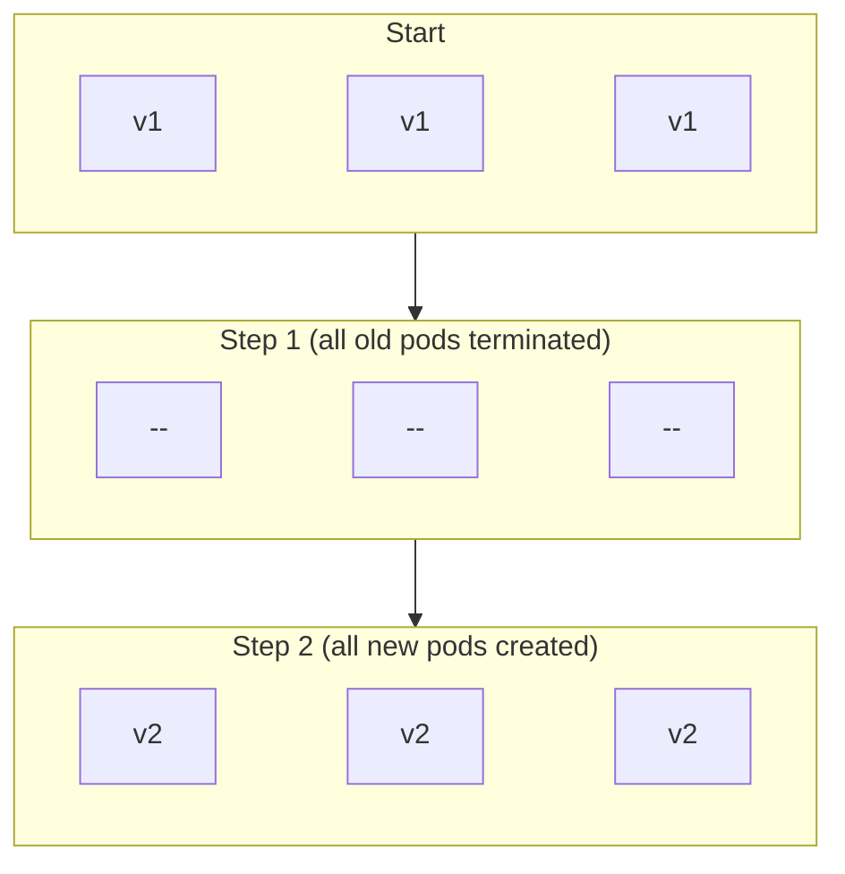
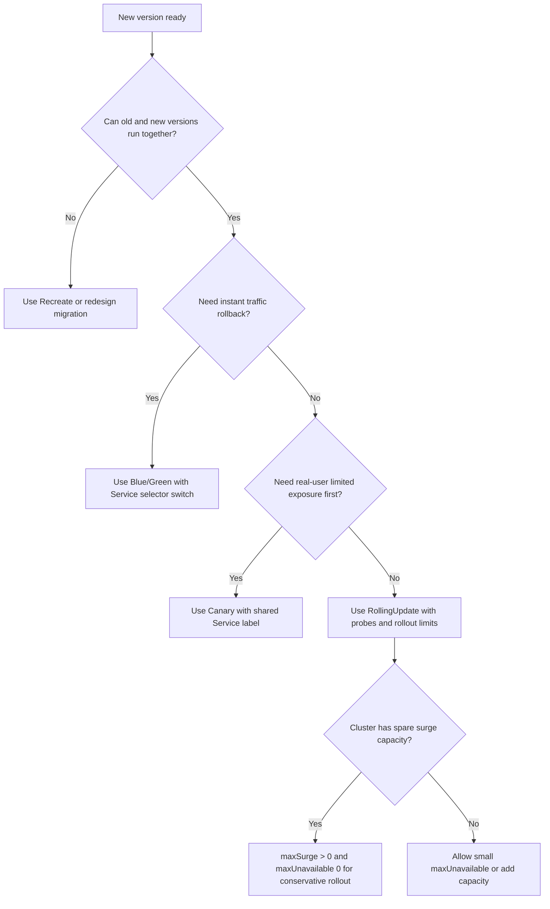

> **Complexity**: `[MEDIUM]` - Conceptual understanding with practical implementation
>
> **Time to Complete**: 40-50 minutes
>
> **Prerequisites**: Module 2.1 (Deployments), understanding of Services

---

## Learning Outcomes

After completing this module, you will be able to:

- **Implement** rolling update, blue/green, and canary deployment strategies with Kubernetes Deployments and Services.
- **Compare** rolling update, recreate, blue/green, and canary strategies against availability, rollback, resource, and risk constraints.
- **Design** a deployment strategy that meets explicit uptime, rollout speed, and rollback requirements for a workload.
- **Evaluate** rollout health with readiness probes, rollout status, endpoints, and Service selectors before proceeding or rolling back.

---

## Why This Module Matters

Hypothetical scenario: you maintain a small HTTP API with four replicas behind a Kubernetes Service. A new container image passes unit tests, but it takes 30 seconds longer to initialize because it now loads a larger rules file at startup. If you replace every pod too aggressively, users may receive connection resets even though the Deployment eventually becomes healthy; if you route all traffic to a new environment before testing it, every user becomes part of your smoke test. Deployment strategy is the discipline of deciding how much change the cluster should expose at once, how much spare capacity you need, and how quickly you can retreat when the new version misbehaves.

The CKAD exam does not expect you to operate a full release platform, but it does expect you to reason clearly with Kubernetes-native building blocks. You should be comfortable configuring the built-in rolling update strategy, switching a Service between blue and green Deployments, splitting traffic approximately across stable and canary pods, and diagnosing why a rollout stalls. Those tasks look simple when each command is shown in isolation; they become exam-relevant when labels, selectors, readiness, and rollout limits interact under time pressure.

The restaurant menu analogy is useful because it makes the traffic shape visible. Rolling updates are like gradually replacing menu pages while customers continue arriving, so some customers see the old menu and some see the new one during the transition. Blue/green is like running two complete kitchens and moving the dining room to the new kitchen only after it is prepared. Canary is like serving the new dish to a small group first, observing whether the kitchen and diners cope with it, and then increasing the share only if the early signal is healthy.

---

## Strategy Overview: Traffic Shape, Cost, and Failure Blast Radius

Deployment strategies exist because "new image" is not a single operational event. A Deployment controller creates ReplicaSets, ReplicaSets create Pods, Services select Pods by label, kube-proxy or the data plane sends traffic to ready endpoints, and users experience the combined effect. The strategy you choose determines how many old and new pods coexist, whether a Service selector changes, how much spare capacity the scheduler must find, and whether rollback means changing an image, scaling a Deployment, or moving a selector back to a known-good environment.

The four strategies in this module are not competitors in a single ranking; each optimizes a different constraint. Rolling update is the default because it usually gives acceptable availability with low extra resource cost. Recreate is intentionally disruptive but useful when two versions must not run together. Blue/green spends more capacity to keep rollback simple and fast. Canary accepts a longer release process so that a smaller group of requests sees the new behavior first.

Think of each strategy as a contract between release speed and blast radius. Rolling update says, "I will change the fleet gradually, and I need the application to tolerate mixed versions." Recreate says, "I will avoid mixed versions by accepting an outage." Blue/green says, "I will prepare the whole new environment before moving users." Canary says, "I will use real traffic as a measured signal before full promotion." Naming that contract first prevents you from treating every deployment as an image update command.

That distinction also helps when a task gives incomplete information. If the prompt mentions strict schema incompatibility, mixed versions are the danger and Recreate becomes plausible even though it causes downtime. If the prompt emphasizes instant rollback, the Service selector becomes the useful control point and blue/green rises in priority. If the prompt talks about exposing a small share of users first, native canary is the expected Kubernetes-only answer, with the caveat that pod ratios are approximate.

| Strategy | Downtime | Rollback | Resource Cost | Risk |
|----------|----------|----------|---------------|------|
| **Rolling Update** | None when probes and capacity are correct | Gradual, through rollout undo or another image update | Low to medium depending on `maxSurge` | Medium |
| **Recreate** | Yes, because old pods terminate before new pods start | Fast to redeploy old image, but users see interruption | Low | High |
| **Blue/Green** | None during a clean selector switch | Instant Service selector switch back to blue | About 2x during overlap | Low |
| **Canary** | None during normal operation | Fast by scaling canary to zero or removing it from Service selection | Low to medium | Very low for user blast radius |

| Strategy | Best For |
|----------|----------|
| Rolling Update | Most stateless applications where old and new versions can coexist |
| Recreate | Apps that cannot run multiple versions against the same backing state |
| Blue/Green | Critical apps where a fast traffic switch and fast rollback matter more than temporary capacity |
| Canary | Risk-averse deployments where real traffic feedback should start small |

Pause and predict: your application has four replicas and you need to update it to a new version. Rank rolling update, recreate, blue/green, and canary by extra pod cost during the transition before looking at the examples below. The answer depends on exact parameters, but the useful mental model is that blue/green duplicates the whole serving set, canary adds a controlled second set, rolling update may temporarily surge above desired replicas, and recreate adds no overlap because it accepts downtime.

An implementation detail matters here: a Kubernetes Service does not know that one pod is "stable" and another is "canary" unless labels make that distinction selectable. If a Service selector matches both sets, both sets become endpoints, and traffic distribution is approximately influenced by the number of ready endpoints. That approximation is good enough for CKAD-style native canaries, but it is not the same as precise weighted routing from a service mesh or ingress controller.

```
+-----------------+       selector: app=myapp       +--------------------------+
| Service: myapp  | --------------------------------> | Ready endpoints only     |
+-----------------+                                  +--------------------------+
          |                                                      |
          | matches labels                                      |
          v                                                      v
+------------------+      +------------------+       +--------------------------+
| stable pods v1   |      | canary pods v2   |       | readiness gates traffic  |
| app=myapp        |      | app=myapp        |       | before users see pods    |
+------------------+      +------------------+       +--------------------------+
```

The diagram is deliberately simple because most exam errors happen at this boundary. Learners often configure a correct Deployment and then forget that the Service selector is still pointing at only the old label, or they build a canary Deployment whose pods do not share the label selected by the Service. When a rollout seems to "work" but traffic does not change, inspect labels, selectors, and endpoints before changing the image again.

The safest debugging sequence follows the request path. Start with the Service selector because it defines the candidate pod set. Then inspect pod labels because they decide whether a pod can ever become an endpoint for that Service. Then inspect readiness because a matching pod that is not Ready should still be withheld from traffic. That sequence is faster than repeatedly applying YAML because it asks where the traffic decision is blocked.

Endpoint objects also help you separate "the Service exists" from "the Service can actually send traffic." A Service with the right name and port can still have an empty endpoint list if selectors do not match or pods are not Ready. In newer clusters you may see EndpointSlices behind the Service, but the reasoning is the same: the traffic plane needs concrete ready backend addresses. When diagnosing deployment strategies, endpoint inspection is the bridge between object configuration and user-visible behavior.

---

## Rolling Updates and Recreate: Controller-Managed Replacement

Rolling update is the built-in Deployment strategy that gradually replaces pods from the old ReplicaSet with pods from the new ReplicaSet. The Deployment controller observes the desired state, creates new pods within the `maxSurge` allowance, waits for them to become available, and removes old pods within the `maxUnavailable` allowance. This means the rollout is not just "start new pods"; it is a paced exchange controlled by readiness, availability, and capacity.

Use rolling update when old and new versions can safely coexist. That usually means the API contract is backward compatible, database migrations are expand-and-contract rather than destructive, and clients can tolerate a short window where different pods serve different versions. If those assumptions are false, a rolling update may be more dangerous than downtime because the system may corrupt shared state while appearing healthy to Kubernetes.

A Deployment rollout also has history. Each image or template change creates a new ReplicaSet, and Kubernetes scales the old and new ReplicaSets according to the strategy. That history is why rollback commands can work for ordinary rolling updates: the controller can return to a previous pod template when the old ReplicaSet still exists. It is also why labels in the pod template matter so much, because the ReplicaSet creates pods from that template rather than from the Deployment metadata alone.

```yaml
apiVersion: apps/v1
kind: Deployment
metadata:
  name: web-app
spec:
  replicas: 4
  strategy:
    type: RollingUpdate
    rollingUpdate:
      maxSurge: 1        # Can exceed replicas by 1
      maxUnavailable: 1  # At most 1 unavailable
  selector:
    matchLabels:
      app: web
  template:
    metadata:
      labels:
        app: web
    spec:
      containers:
      - name: nginx
        image: nginx:1.25
```

The configuration above allows Kubernetes to run up to five pods during the rollout and to tolerate one unavailable pod. With four desired replicas, that gives the controller enough room to create one new pod before removing one old pod. If the new pod fails readiness, the controller does not keep blindly deleting old pods because the availability calculation has not improved.

The availability calculation is the part to internalize. Kubernetes is not trying to keep an exact number of total pods during every second of the rollout; it is trying to respect the bounds you gave it while moving the desired template forward. A pod that exists but is not available does not satisfy the same condition as a ready old pod. That is why readiness probes, Pending pods, and rollout limits belong in the same mental model.



The most exam-friendly way to observe the mechanism is to update the image and watch both the rollout status and the pods. Use the full `kubectl` command in scripts and study notes, because shell aliases do not expand reliably outside an interactive shell. The commands below preserve the original workflow while making it copy-paste safe for a terminal, a script, or a lab runner.

When you watch the rollout, pay attention to names as well as counts. New pods usually belong to a newer ReplicaSet hash, while old pods retain the previous hash until they are terminated. If the rollout pauses, the pod list often tells you whether the controller is waiting on readiness, scheduling, image pulling, or crash recovery. The command output is not just confirmation; it is evidence for the next decision.

```bash
# Update image
kubectl set image deploy/web-app nginx=nginx:1.26

# Watch rollout
kubectl rollout status deploy/web-app

# Check pods transitioning
kubectl get pods -l app=web
```

Recreate is the opposite choice: it removes all old pods first and creates new pods after the old set is gone. That sounds primitive, but it can be the correct answer when the application cannot tolerate two versions running at the same time. A single-writer workload, an application with filesystem locks, or a service that performs a non-backward-compatible schema migration may be safer with a scheduled interruption than with mixed-version concurrency.

```yaml
apiVersion: apps/v1
kind: Deployment
metadata:
  name: database-app
spec:
  replicas: 1
  strategy:
    type: Recreate
  selector:
    matchLabels:
      app: database
  template:
    metadata:
      labels:
        app: database
    spec:
      containers:
      - name: postgres
        image: postgres:16
```



Before running this, what output do you expect if a `Recreate` Deployment has three replicas and you watch pods during an image update? You should expect the old pods to enter termination before the replacement pods become available, which creates a visible service interruption if the pods are serving live traffic. That interruption is not a Kubernetes bug; it is the explicit tradeoff the strategy makes to prevent overlap.

The rolling update parameters are the real lever for most CKAD tasks. `maxSurge` controls how many extra pods the controller may create above the desired replica count, and `maxUnavailable` controls how many desired pods may be unavailable during the rollout. Both can be absolute numbers or percentages, and the defaults are commonly acceptable for resilient stateless services, but exam scenarios often ask for zero downtime or a faster rollout.

```yaml
rollingUpdate:
  maxSurge: 25%      # 25% extra pods (default)
  # or
  maxSurge: 2        # 2 extra pods
```

```yaml
rollingUpdate:
  maxUnavailable: 25%  # 25% can be down (default)
  # or
  maxUnavailable: 0    # Zero downtime
```

```yaml
# Zero downtime (conservative)
rollingUpdate:
  maxSurge: 1
  maxUnavailable: 0

# Fast update (aggressive)
rollingUpdate:
  maxSurge: 100%
  maxUnavailable: 50%

# Balanced (default)
rollingUpdate:
  maxSurge: 25%
  maxUnavailable: 25%
```

The conservative zero-downtime pattern is attractive, but it can stall on a full cluster. Imagine six replicas with `maxSurge: 50%` and `maxUnavailable: 0`; Kubernetes may create three extra pods, but if those pods remain Pending because the cluster has no spare capacity, the controller cannot delete old pods because doing so would violate `maxUnavailable: 0`. The correct diagnosis is not "rollout command failed"; it is a resource and availability constraint deadlock that you solve by adding capacity, reducing surge, or allowing a small unavailability budget.

The opposite configuration can fail in a different way. If `maxUnavailable` is high and `maxSurge` is low, the rollout may move quickly by taking old pods out of service before replacement capacity is proven. That can be acceptable for batch workers or internal tools with retrying clients, but it is risky for interactive services. A senior answer explains both sides: conservative settings protect users but require capacity, while aggressive settings save capacity but increase the chance of visible interruption.

Deployment progress is also bounded by time, not only by pod counts. Kubernetes tracks whether a Deployment is making progress, and a rollout that cannot produce available pods eventually reports a failed progress condition rather than waiting silently forever. For CKAD purposes, you do not need to tune every deadline field, but you should recognize the symptom: a rollout that is stuck on unavailable new pods needs pod events, readiness inspection, and scheduler evidence, not another image update.

---

## Blue/Green Deployment: Switching a Service Selector

Blue/green deployment separates release preparation from traffic movement. The blue Deployment keeps serving production traffic while the green Deployment starts with the new image, the same replica count, and enough labels to identify it as a complete alternative environment. After green is healthy and tested, you patch the Service selector so traffic moves to green in one control-plane change.

The rollback model is the main reason to spend the extra capacity. If the Service selector points to `version: green` and users report errors, you can patch it back to `version: blue` without rebuilding the old ReplicaSet. That does not mean blue/green removes all risk; a bad database migration, shared cache mutation, or irreversible external side effect can still make rollback hard. The strategy gives you a fast traffic switch, not a time machine.

Selector management is where most blue/green mistakes hide. You need one stable label that identifies the application and one release label that identifies the environment currently receiving traffic. The Service selector can include both labels, but the release label is the part you change during the switch. If you rely on names alone, you will eventually forget that Services do not select Deployments by name; they select pods by labels.

You should also decide how long to keep the old environment after a successful switch. Keeping blue alive gives you a fast rollback path while metrics settle, but it consumes capacity and may continue holding connections, caches, or background work. Deleting blue immediately saves resources but turns rollback into a redeploy. In a real system, that retention window is a release policy decision; in CKAD, it is enough to show that you know when and how to clean up.

### Step 1: Deploy Blue (Current)

```yaml
# blue-deployment.yaml
apiVersion: apps/v1
kind: Deployment
metadata:
  name: app-blue
spec:
  replicas: 3
  selector:
    matchLabels:
      app: myapp
      version: blue
  template:
    metadata:
      labels:
        app: myapp
        version: blue
    spec:
      containers:
      - name: app
        image: myapp:1.0
```

### Step 2: Create Service (Points to Blue)

```yaml
# service.yaml
apiVersion: v1
kind: Service
metadata:
  name: myapp
spec:
  selector:
    app: myapp
    version: blue  # Points to blue
  ports:
  - port: 80
```

### Step 3: Deploy Green (New Version)

```yaml
# green-deployment.yaml
apiVersion: apps/v1
kind: Deployment
metadata:
  name: app-green
spec:
  replicas: 3
  selector:
    matchLabels:
      app: myapp
      version: green
  template:
    metadata:
      labels:
        app: myapp
        version: green
    spec:
      containers:
      - name: app
        image: myapp:2.0
```

### Step 4: Switch Traffic

```bash
# Switch service to green
kubectl patch svc myapp -p '{"spec":{"selector":{"version":"green"}}}'

# Instant rollback if needed
kubectl patch svc myapp -p '{"spec":{"selector":{"version":"blue"}}}'
```

Notice that the patch above changes only `version`, not `app`. In a real cluster, you often keep a stable application label such as `app: myapp` and use an additional release label such as `version: blue` or `version: green` for traffic switching. If you accidentally patch the selector to a label that no pod has, the Service will have no endpoints, and the fastest diagnosis is `kubectl get endpoints` or `kubectl describe svc`.

Endpoint verification is the practical guardrail. A selector patch can succeed even when it selects zero pods because the Kubernetes API only validates that the Service object is syntactically valid. It does not know whether your release label is meaningful. Running `kubectl get endpoints myapp` or the EndpointSlice equivalent after the patch confirms that traffic has somewhere to go before you declare the switch complete.

Blue/green also has a connection behavior that surprises new operators. Changing a Service selector changes the set of endpoints available for new load-balancing decisions, but it does not necessarily erase every existing client connection at the exact same instant. Long-lived connections, client retries, and application-level sessions can make the observed transition less crisp than the control-plane patch. For exam tasks, selector rollback is the key action; for real systems, connection draining and session behavior deserve separate validation.

```bash
# Deploy blue
kubectl apply -f blue-deployment.yaml

# Create service pointing to blue
kubectl apply -f service.yaml

# Test blue
kubectl run test --image=busybox --rm -i --restart=Never -- wget -qO- http://myapp

# Deploy green (without traffic)
kubectl apply -f green-deployment.yaml

# Test green directly (port-forward or separate service)
kubectl port-forward deploy/app-green 8080:80 &
sleep 2
curl localhost:8080

# Switch traffic to green
kubectl patch svc myapp -p '{"spec":{"selector":{"version":"green"}}}'

# If problems, instant rollback
kubectl patch svc myapp -p '{"spec":{"selector":{"version":"blue"}}}'

# Once confirmed, remove blue
kubectl delete deploy app-blue
```

Exercise scenario: you have blue serving `nginx:1.25` and green serving `nginx:1.26`, both with three replicas. Before switching, run a direct test against green by port-forwarding or by creating a temporary Service that selects `version: green`. If the direct test fails, do not patch production traffic; fix the green Deployment while blue continues serving.

```bash
# Create blue deployment
kubectl create deploy app-blue --image=nginx:1.25 --replicas=3
kubectl label deploy app-blue version=blue

# Add version label to pod template
kubectl patch deploy app-blue -p '{"spec":{"template":{"metadata":{"labels":{"version":"blue"}}}}}'

# Create service
kubectl expose deploy app-blue --name=myapp --port=80 --selector=version=blue

# Deploy green
kubectl create deploy app-green --image=nginx:1.26 --replicas=3
kubectl patch deploy app-green -p '{"spec":{"template":{"metadata":{"labels":{"version":"green"}}}}}'

# Switch to green
kubectl patch svc myapp -p '{"spec":{"selector":{"version":"green"}}}'
```

The command sequence is intentionally compact because CKAD tasks often reward label fluency. A common trap is labeling the Deployment object but not the pod template; the Service selects pods, not the Deployment object itself. The example patches `spec.template.metadata.labels` so newly created pods receive the label the Service needs.

There is one more subtlety in imperative blue/green drills: changing the pod template label triggers a new ReplicaSet because the pod template changed. That is usually fine in a lab, but in production you would prefer to define the labels correctly in the YAML before creating the Deployment. When time is short, remember the exam goal is observable correctness: the Service selector and the pod labels must match, and the matching pods must be Ready.

---

## Canary Deployment: Approximate Native Traffic Splitting

A Kubernetes-native canary usually uses two Deployments and one Service. The stable Deployment and canary Deployment share one label that the Service selects, while each Deployment also keeps its own track label for management. Because the Service sends traffic to ready endpoints, the ratio is approximately related to ready pod count: nine stable pods and one canary pod is roughly a 90/10 split, assuming similar readiness and no additional routing layer.

This approximation is useful, but you must teach yourself its limits. Kubernetes Services do not provide request-aware weighted routing by themselves, and client connection reuse can make short tests look uneven. Native canary is still valuable for the exam and for simple workloads because it uses only Deployments, Services, labels, scaling, and observation. When teams need exact percentages, header-based routing, or automated promotion analysis, they usually add an ingress controller, service mesh, or progressive delivery controller outside the CKAD scope.

A canary also needs a promotion rule. "Run it for a while" is not a rule; it is a hope. Even in a simple lab, decide what signal would make you continue, pause, or roll back. That signal might be pod readiness, absence of restarts, stable latency from a smoke test, or application metrics in a real environment. Kubernetes gives you the mechanical split, but you still own the decision about whether the new version is healthy enough to receive more traffic.

The split between stable and canary Deployments gives you separate controls. You can scale canary up without changing the stable image, scale canary down without touching stable, and inspect canary logs independently through its track label. That separation is often clearer than trying to use one Deployment for partial exposure, because one Deployment normally converges toward one pod template. Two Deployments make the two tracks visible.

### Stable Deployment (90% traffic)

```yaml
apiVersion: apps/v1
kind: Deployment
metadata:
  name: app-stable
spec:
  replicas: 9  # 90% of traffic
  selector:
    matchLabels:
      app: myapp
      track: stable
  template:
    metadata:
      labels:
        app: myapp
        track: stable
    spec:
      containers:
      - name: app
        image: myapp:1.0
```

### Canary Deployment (10% traffic)

```yaml
apiVersion: apps/v1
kind: Deployment
metadata:
  name: app-canary
spec:
  replicas: 1  # 10% of traffic
  selector:
    matchLabels:
      app: myapp
      track: canary
  template:
    metadata:
      labels:
        app: myapp
        track: canary
    spec:
      containers:
      - name: app
        image: myapp:2.0
```

Stop and think: in the canary setup below, the Service selector uses `app: myapp`, which matches both the stable and canary pods. How does Kubernetes distribute traffic between them, and what would happen if the canary pod is not Ready? The useful answer is that only ready endpoints receive traffic, so a one-pod canary that fails readiness effectively receives no Service traffic even though its Deployment exists.

### Service (Routes to Both)

```yaml
apiVersion: v1
kind: Service
metadata:
  name: myapp
spec:
  selector:
    app: myapp  # Matches both stable and canary
  ports:
  - port: 80
```

With nine stable pods and one canary pod, you should think in approximate proportions rather than exact request accounting. If the canary is healthy and all pods are ready, the endpoint set contains ten addresses, one of which belongs to the canary. If the canary has a slow startup and lacks a readiness probe, the Service may route traffic too early; if it has a correct readiness probe, the Service waits until Kubernetes marks the endpoint ready.

```bash
# Start: 9 stable, 1 canary (10%)
kubectl scale deploy app-canary --replicas=1
kubectl scale deploy app-stable --replicas=9

# Increase canary to 25%
kubectl scale deploy app-canary --replicas=3
kubectl scale deploy app-stable --replicas=9

# Increase canary to 50%
kubectl scale deploy app-canary --replicas=5
kubectl scale deploy app-stable --replicas=5

# Full rollout (update stable to new version)
kubectl set image deploy/app-stable app=myapp:2.0
kubectl rollout status deploy/app-stable

# Cleanup: remove canary
kubectl delete deploy app-canary
```

There is a subtle arithmetic issue in the progression above: three canary replicas and nine stable replicas is 25% canary because the total is 12 endpoints, not because the canary count alone is 25% of the original stable count. On the exam, write down the total endpoint count when asked to reason about a percentage. That habit prevents the common mistake of scaling canary up while forgetting that stable remained unchanged.

Rollback in this native pattern is simple because the canary is isolated as its own Deployment. You can scale the canary to zero, delete it, or change the Service selector so it no longer includes canary pods. That does not undo side effects created by requests that already reached the canary, but it stops new Service traffic from reaching the new version. As with blue/green, traffic control is fast while data rollback remains a separate engineering concern.

Canary ratios can drift when other controllers change replica counts. A HorizontalPodAutoscaler on stable, a manual scale on canary, or unavailable pods in either track changes the ready endpoint pool that the Service sees. That is why a canary rollout should include observation after each scaling step rather than only the intended math. In a basic lab, `kubectl get endpoints` and pod readiness are enough; in production, metrics confirm whether the canary actually received the expected shape of traffic.

---

## Readiness, Availability, and Rollout Health

Readiness is what prevents a deployment strategy from becoming a polite way to send traffic to broken pods. A pod can be Running while the application inside it is still loading configuration, warming caches, connecting to a database, or waiting for a migration. The Service endpoint controller uses readiness to decide whether a pod should receive traffic, and the Deployment controller uses availability to decide whether the rollout can safely progress.

Without readiness probes, Kubernetes may treat a container as ready as soon as it is running. That default can be acceptable for very simple containers, but it is unsafe for applications with meaningful startup work. A rolling update with `maxUnavailable: 0` can still cause user-visible errors if the new pod enters the Service endpoint set before the application can serve real requests.

Good readiness probes are specific enough to protect users but cheap enough to run frequently. A probe that only checks whether the process exists may pass while the application cannot answer real requests. A probe that performs a slow, fragile dependency check can flap and remove healthy pods from traffic. For CKAD examples, an HTTP check against a lightweight readiness endpoint is usually the clearest pattern.

```yaml
spec:
  template:
    spec:
      containers:
      - name: app
        image: myapp
        readinessProbe:
          httpGet:
            path: /ready
            port: 8080
          initialDelaySeconds: 5
          periodSeconds: 5
```

`minReadySeconds` adds another safety buffer after readiness first succeeds. It tells the Deployment controller that a pod must remain ready for a minimum duration before being counted as available. This helps catch applications that briefly pass readiness and then crash because a late dependency fails or a startup background task exits.

Do not confuse readiness with liveness. Readiness answers "should this pod receive traffic right now?" while liveness answers "should Kubernetes restart this container?" A failing readiness probe removes the pod from Service endpoints without necessarily restarting it, which is exactly what you want during warm-up or temporary dependency loss. A failing liveness probe restarts the container, so making it too aggressive can turn a slow startup into a crash loop.

```yaml
spec:
  minReadySeconds: 10  # Pod must be ready 10s before considered available
```

Pause and predict: you deploy a new version using a rolling update, but you forgot to add a readiness probe. The new version takes 30 seconds to start accepting requests, while Kubernetes considers the pod ready immediately. During those 30 seconds, Service traffic can land on a pod that is alive from Kubernetes' perspective but not ready from the user's perspective, so the rollout may look green while requests fail.

Here is a zero-downtime rolling update configuration that combines conservative rollout limits with a simple readiness probe. It preserves the original exam scenario and adds the operational reason behind the key line: `maxUnavailable: 0` keeps desired capacity available, while readiness prevents premature endpoint inclusion. In a resource-constrained cluster, you still need enough spare room for the surge pod.

```yaml
apiVersion: apps/v1
kind: Deployment
metadata:
  name: webapp
spec:
  replicas: 4
  strategy:
    type: RollingUpdate
    rollingUpdate:
      maxSurge: 1
      maxUnavailable: 0  # Key: never reduce below desired
  selector:
    matchLabels:
      app: webapp
  template:
    metadata:
      labels:
        app: webapp
    spec:
      containers:
      - name: nginx
        image: nginx:1.25
        readinessProbe:  # Important for zero-downtime
          httpGet:
            path: /
            port: 80
          initialDelaySeconds: 2
          periodSeconds: 3
```

When evaluating rollout health, use multiple views instead of trusting a single command. `kubectl rollout status` tells you whether the Deployment controller believes the rollout completed. `kubectl get pods` shows whether pods are Pending, Running, Ready, or restarting. `kubectl get endpoints` or `kubectl get endpointslice` confirms what the Service can actually send traffic to. Those three observations map to controller state, workload state, and traffic state.

That three-view model is also useful under exam pressure. If rollout status is waiting but endpoints still point to old pods, the application may be healthy for users while the release is stalled. If rollout status succeeds but endpoints include pods that fail real requests, the probe is too weak. If pods are Ready but the Service has no endpoints, the selector is wrong. Each combination narrows the next command you should run.

Startup probes are another useful distinction when an application has a long initialization path. A startup probe can give the container more time to become alive before liveness checks start enforcing restarts, while readiness still controls traffic admission. You may not need a startup probe for the simple `nginx` examples here, but knowing the separation keeps you from solving slow startup by weakening readiness. Readiness should protect traffic; startup should protect slow boot from premature restarts.

---

## Patterns & Anti-Patterns

The patterns below are deliberately practical rather than philosophical. Each one ties a deployment strategy to a concrete mechanism you can inspect in Kubernetes. If you can explain the mechanism, you can usually solve the exam variant even when object names and labels differ from the examples.

Use the pattern table as a set of if-then rules rather than as a checklist. A workload with backward-compatible changes and solid probes naturally fits the rolling update row. A workload with a risky new recommendation model but compatible state naturally fits the canary row. A workload with a hard rollback-time requirement naturally fits the blue/green row. The value is in matching the condition to the mechanism, not memorizing the labels.

| Pattern | When to Use | Why It Works | Scaling Consideration |
|---------|-------------|--------------|-----------------------|
| Conservative rolling update with readiness | Stateless services that can run old and new versions together | `maxUnavailable: 0` protects capacity while readiness gates Service endpoints | Needs spare capacity for surge pods or the rollout may stall |
| Blue/green selector switch | Critical service where rollback speed matters more than temporary resource cost | Two complete Deployments exist before traffic moves, so rollback is a selector patch | Requires duplicate capacity and careful handling of shared databases |
| Native canary by replica ratio | Simple real-traffic exposure without mesh or ingress weighting | One Service selects both stable and canary pods, and ready endpoint count approximates traffic share | Percentages are approximate, especially with connection reuse and uneven pod readiness |
| Recreate for incompatible versions | Workloads that cannot safely run mixed versions | Old pods terminate before new pods start, preventing concurrent access by two versions | Users see downtime, so schedule and communicate the maintenance window |

| Anti-Pattern | What Goes Wrong | Better Alternative |
|--------------|-----------------|--------------------|
| Patching only Deployment labels during blue/green | The Service selects pods, so traffic does not move if pod template labels are missing | Patch or define `spec.template.metadata.labels`, then verify endpoints |
| Treating canary pod ratio as exact traffic weight | Short tests and long-lived connections may not reflect the intended percentage | Use native canary for approximate exposure; use a routing layer for exact weights |
| Setting `maxUnavailable: 0` without spare capacity | Surge pods can remain Pending, preventing old pods from being removed | Confirm node capacity or allow a small unavailability budget |
| Skipping readiness probes | Rollouts can complete while users hit pods that are still initializing | Add probes that represent real serving readiness, not only process existence |

The anti-pattern table is also a troubleshooting map. If traffic does not switch, inspect selectors and endpoints. If a rollout stalls, inspect Pending pods and rollout limits. If users see errors while Kubernetes says the rollout succeeded, inspect readiness and application health. These are different failure modes, so they need different first commands.

A useful senior habit is to state the failure domain before choosing the rollback. For a bad container image, rolling back the image or moving the selector may be enough. For a bad Service selector, changing the image will not help because the request path is broken before it reaches a container. For a bad schema migration, neither rollout undo nor a selector patch may restore the old data shape. Kubernetes strategies control traffic and pods; they do not automatically reverse every external side effect.

---

## Decision Framework

Choose the strategy by naming the constraint first. Do not start with the tool you like; start with the thing that must not happen. If mixed versions must not coexist, use Recreate or a carefully staged external migration plan. If downtime must be avoided and versions are compatible, use rolling update. If rollback must be nearly instant and spare capacity exists, use blue/green. If the new behavior is risky under real traffic and you can accept gradual promotion, use canary.

The second decision is whether the strategy can be implemented with the primitives available in the task. CKAD-style prompts usually limit you to Deployments, Services, probes, labels, and `kubectl` commands. That means native canary is pod-ratio based, blue/green is selector based, and rolling update is Deployment-controller based. If you find yourself needing exact weights, traffic headers, or automated metric analysis, you have moved beyond the native primitives the exam is likely asking for.



| Requirement | Prefer | Check Before Rollout | Fastest Rollback |
|-------------|--------|----------------------|------------------|
| Lowest operational complexity | Rolling update | Readiness probe, compatible schema, sufficient surge capacity | `kubectl rollout undo` or set the old image |
| No mixed versions | Recreate | Maintenance window, backup, migration order | Reapply old image after interruption |
| Instant traffic reversal | Blue/green | Green readiness, direct smoke test, selector labels | Patch Service selector back to blue |
| Limit user exposure | Canary | Shared Service label, replica math, metrics to observe | Scale canary to zero or remove it from Service selection |

Which approach would you choose here and why: a stateless frontend has six replicas, a good readiness endpoint, and a new CSS-only image; the team wants no downtime but has limited node headroom. Rolling update is usually enough, but you should choose rollout parameters that match capacity, perhaps `maxSurge: 1` and `maxUnavailable: 1` if the cluster cannot schedule an extra full batch. If the task says no downtime absolutely, the missing requirement is spare capacity; Kubernetes cannot create capacity by configuration alone.

---

## Did You Know?

- **Kubernetes Deployments have used `apps/v1` as the stable API since Kubernetes 1.9, released in December 2017.** CKAD tasks now assume the stable API shape, including required selectors that must match pod template labels.

- **The default rolling update values are `maxSurge: 25%` and `maxUnavailable: 25%`.** For small replica counts, percentage rounding matters, so always reason from the desired replica count before predicting pod totals.

- **A Service selector change does not restart pods.** In blue/green deployments, rollback can be fast because Kubernetes only changes which ready endpoints the Service selects.

- **Native canary traffic is approximate because a Service balances across endpoints, not business percentages.** A 9-to-1 pod ratio is a useful starting point, but exact weighted routing requires an additional traffic management layer.

---

## Common Mistakes

| Mistake | Why It Happens | How to Fix It |
|---------|----------------|---------------|
| No readiness probe | The container process starts before the application can serve real requests, so Kubernetes may add the pod to endpoints too early | Add a readiness probe that checks the actual serving path or dependency gate |
| `maxUnavailable: 100%` on a user-facing Deployment | It looks like a fast rollout setting, but it allows all desired pods to be unavailable during replacement | Keep `maxUnavailable` small, and use `maxSurge` for speed when capacity exists |
| Wrong Service selector for blue/green | The selector is patched to a label that exists on the Deployment object but not on pods | Put release labels in `spec.template.metadata.labels` and verify with `kubectl get endpoints` |
| Not testing green before the selector switch | Blue keeps production healthy, so the untested green environment can hide until every user is routed there | Test green directly with a temporary Service, port-forward, or in-cluster smoke test |
| Forgetting to scale down or delete the old environment | Blue/green keeps both versions alive, so the old Deployment continues consuming resources after success | Keep blue until rollback risk is acceptable, then delete or scale it down intentionally |
| Assuming canary is exact percentage routing | Native Services select endpoints and do not apply weighted request rules | Use pod ratios for approximate canaries, or add an ingress, mesh, or rollout controller for exact weights |
| Ignoring Pending surge pods | A rollout with `maxUnavailable: 0` may wait forever when the cluster cannot schedule new pods | Inspect pod events, add capacity, reduce surge, or allow a small unavailable budget |

---

## Quiz

<details>
<summary>Your payment processing workload cannot safely run two application versions against the same schema. You need to deploy a new image during a maintenance window. Which strategy should you choose, and what should you verify first?</summary>

Choose `Recreate` unless the schema migration plan has been redesigned for mixed-version compatibility. Recreate intentionally terminates old pods before starting new ones, which prevents concurrent old and new application code from touching the same incompatible state. Before starting, verify the backup or rollback plan, the migration order, and the expected downtime window. Rolling update, canary, and blue/green all allow overlap unless you add additional controls outside the basic strategy.

</details>

<details>
<summary>You switch a Service from `version: blue` to `version: green`, and users immediately report errors. What is the fastest Kubernetes-native recovery action, and what should your postmortem inspect?</summary>

Patch the Service selector back to `version: blue` if blue still represents the last known-good environment. That is the operational value of blue/green: rollback can be a selector change instead of a rebuilt Deployment. The postmortem should inspect whether green pods were Ready, whether a direct smoke test was performed before the switch, and whether the database or external dependencies changed in a way that selector rollback cannot undo. If the selector patch points to no endpoints, inspect pod template labels before changing images again.

</details>

<details>
<summary>Your team wants roughly 10% of real traffic to reach `myapp:2.0` while 90% remains on `myapp:1.0`, using only Deployments and a Service. How would you implement it, and what limitation would you explain?</summary>

Create a stable Deployment with nine replicas running `myapp:1.0` and a canary Deployment with one replica running `myapp:2.0`. Give both pod templates a shared label such as `app: myapp`, and configure the Service selector to match that shared label. Keep separate labels such as `track: stable` and `track: canary` so you can scale and inspect each Deployment independently. The limitation is that Kubernetes Services provide approximate endpoint balancing, not exact weighted routing by percentage.

</details>

<details>
<summary>A Deployment has `replicas: 6`, `maxSurge: 50%`, and `maxUnavailable: 0`. Three new pods are Pending because the cluster lacks resources, while six old pods still run. Why is the rollout stuck?</summary>

The rollout is stuck because the controller has reached the surge allowance and cannot remove old pods without violating `maxUnavailable: 0`. With six desired replicas, `maxSurge: 50%` permits three extra pods, giving nine total pods during the attempted rollout. Because the three new pods are Pending, none of them become available, so the controller has no permission to reduce the old set. The fix is to add capacity, reduce the surge requirement, or allow a small unavailability budget if the service can tolerate it.

</details>

<details>
<summary>You update a rolling Deployment and `kubectl rollout status` eventually succeeds, but users saw failures for the first 30 seconds of each new pod. Which missing mechanism best explains the failure?</summary>

A missing or ineffective readiness probe best explains the symptom. Kubernetes may mark a running container as ready before the application is actually able to serve requests, especially when the process starts quickly but performs initialization afterward. A correct readiness probe keeps the pod out of Service endpoints until the application reports real serving readiness. `minReadySeconds` can add another buffer after the first successful readiness state, which helps catch early crashes.

</details>

<details>
<summary>In a blue/green setup, `kubectl patch svc myapp -p '{"spec":{"selector":{"version":"green"}}}'` succeeds, but `kubectl get endpoints myapp` shows no addresses. What should you inspect first?</summary>

Inspect the labels on the green pods, not only the labels on the Deployment object. Services select pods through pod labels, and a label placed only on the Deployment metadata does not automatically become a pod template label. Check `spec.template.metadata.labels` on the green Deployment and compare it with the Service selector. Once the labels match and pods are Ready, the endpoint list should populate without recreating the Service.

</details>

<details>
<summary>You need to choose between rolling update and blue/green for a stateless API with strict rollback requirements and enough spare cluster capacity. Which strategy fits better, and what tradeoff are you accepting?</summary>

Blue/green fits better when strict rollback speed is the dominant requirement and spare capacity is available. Rolling update can be safe, but rollback usually proceeds through another rollout or undo operation, which is slower than patching a Service selector back to the old environment. The tradeoff is temporary resource cost because both blue and green environments run at the same time. You should still test green before switching, because blue/green moves all production traffic once the selector changes.

</details>

---

## Hands-On Exercise

Exercise scenario: you will implement rolling update, blue/green, canary, recreate, and readiness-aware rollout checks using a Kubernetes 1.35+ cluster. The commands use `nginx` images so the focus stays on Deployment and Service mechanics instead of application code. Work in a disposable namespace if your lab environment supports it, and clean up each part before moving to the next if resources are tight.

Before starting, decide how you will observe each task. For rolling update, observe pod counts and rollout status. For blue/green, observe Service endpoints before and after selector patches. For canary, observe endpoint membership as replica counts change. For readiness, observe whether pods become endpoints only after they can serve. This turns the exercise from command repetition into a controlled inspection of Kubernetes behavior.

### Task 1: Rolling Update with Conservative Parameters

Create a Deployment that allows one surge pod and zero unavailable pods, then update the image and observe the rollout. The important observation is the maximum pod count during the transition: with four desired replicas and `maxSurge: 1`, you should not see more than five pods for this Deployment. If the fifth pod cannot schedule, the old four pods should remain because the controller is not allowed to make any desired pod unavailable.

```bash
# Create deployment with custom rolling update
cat << 'EOF' | kubectl apply -f -
apiVersion: apps/v1
kind: Deployment
metadata:
  name: rolling-demo
spec:
  replicas: 4
  strategy:
    type: RollingUpdate
    rollingUpdate:
      maxSurge: 1
      maxUnavailable: 0
  selector:
    matchLabels:
      app: rolling
  template:
    metadata:
      labels:
        app: rolling
    spec:
      containers:
      - name: nginx
        image: nginx:1.25
EOF

# Update and watch (should see 5 pods max)
kubectl set image deploy/rolling-demo nginx=nginx:1.26
kubectl rollout status deploy/rolling-demo

# Cleanup
kubectl delete deploy rolling-demo
```

<details>
<summary>Solution notes for Task 1</summary>

The Deployment should complete if the cluster can schedule the surge pod. If it stalls, run `kubectl get pods -l app=rolling` and inspect whether new pods are Pending or failing readiness. A Pending surge pod with `maxUnavailable: 0` means the controller cannot delete an old pod to free room.

</details>

If you prefer an imperative speed drill after the YAML version, create a Deployment and patch the strategy directly. This preserves the same rollout idea while practicing the kind of patch command that often appears in timed exercises. Verify the patched strategy before updating the image, because a syntactically valid patch can still express the wrong rollout budget.

```bash
# Create with specific rolling update settings
kubectl create deploy drill1 --image=nginx:1.25 --replicas=4

# Patch strategy
kubectl patch deploy drill1 -p '{"spec":{"strategy":{"type":"RollingUpdate","rollingUpdate":{"maxSurge":1,"maxUnavailable":0}}}}'

# Update and observe
kubectl set image deploy/drill1 nginx=nginx:1.26
kubectl rollout status deploy/drill1

# Cleanup
kubectl delete deploy drill1
```

### Task 2: Blue/Green Deployment and Rollback

Build blue and green Deployments with different `version` labels, point a Service at blue, switch to green, and then switch back. This task is about selector control, so verify endpoints after each patch instead of assuming the Service moved. The Deployment names are human-friendly, but the Service does not care about those names; only the labels on Ready pods decide where traffic can flow.

```bash
# Blue deployment
cat << 'EOF' | kubectl apply -f -
apiVersion: apps/v1
kind: Deployment
metadata:
  name: blue
spec:
  replicas: 3
  selector:
    matchLabels:
      app: demo
      version: blue
  template:
    metadata:
      labels:
        app: demo
        version: blue
    spec:
      containers:
      - name: nginx
        image: nginx:1.25
EOF

# Service pointing to blue
cat << 'EOF' | kubectl apply -f -
apiVersion: v1
kind: Service
metadata:
  name: demo-svc
spec:
  selector:
    app: demo
    version: blue
  ports:
  - port: 80
EOF

# Green deployment
cat << 'EOF' | kubectl apply -f -
apiVersion: apps/v1
kind: Deployment
metadata:
  name: green
spec:
  replicas: 3
  selector:
    matchLabels:
      app: demo
      version: green
  template:
    metadata:
      labels:
        app: demo
        version: green
    spec:
      containers:
      - name: nginx
        image: nginx:1.26
EOF

# Switch to green
kubectl patch svc demo-svc -p '{"spec":{"selector":{"version":"green"}}}'
kubectl get endpoints demo-svc

# Rollback to blue
kubectl patch svc demo-svc -p '{"spec":{"selector":{"version":"blue"}}}'
kubectl get endpoints demo-svc

# Cleanup
kubectl delete deploy blue green
kubectl delete svc demo-svc
```

<details>
<summary>Solution notes for Task 2</summary>

After the first patch, the endpoint addresses should correspond to green pods once they are Ready. After the rollback patch, they should correspond to blue pods again. If the endpoint list is empty, compare the Service selector with pod labels and remember that Deployment metadata labels are not enough.

</details>

### Task 3: Native Canary by Replica Ratio

Create stable and canary Deployments that share a Service label, then scale the canary upward. The learning goal is not exact load balancing; it is understanding that the Service endpoint pool changes as ready pod counts change. Keep the `track` labels because they let you manage each Deployment independently even though the Service sees them as one application pool.

```bash
# Stable deployment (9 replicas)
cat << 'EOF' | kubectl apply -f -
apiVersion: apps/v1
kind: Deployment
metadata:
  name: stable
spec:
  replicas: 9
  selector:
    matchLabels:
      app: canary-demo
      track: stable
  template:
    metadata:
      labels:
        app: canary-demo
        track: stable
    spec:
      containers:
      - name: nginx
        image: nginx:1.25
EOF

# Canary deployment (1 replica = ~10%)
cat << 'EOF' | kubectl apply -f -
apiVersion: apps/v1
kind: Deployment
metadata:
  name: canary
spec:
  replicas: 1
  selector:
    matchLabels:
      app: canary-demo
      track: canary
  template:
    metadata:
      labels:
        app: canary-demo
        track: canary
    spec:
      containers:
      - name: nginx
        image: nginx:1.26
EOF

# Service routes to both
cat << 'EOF' | kubectl apply -f -
apiVersion: v1
kind: Service
metadata:
  name: canary-svc
spec:
  selector:
    app: canary-demo
  ports:
  - port: 80
EOF

# Gradually increase canary
kubectl scale deploy canary --replicas=3  # approximately 30% if stable is 7
kubectl scale deploy stable --replicas=7
kubectl get endpoints canary-svc

# Full rollout
kubectl scale deploy canary --replicas=10
kubectl scale deploy stable --replicas=0

# Cleanup
kubectl delete deploy stable canary
kubectl delete svc canary-svc
```

<details>
<summary>Solution notes for Task 3</summary>

The Service should list endpoints from both Deployments while both have Ready pods. When you scale stable to zero and canary to ten, all ready endpoints should belong to the canary Deployment. If you need exact request percentages, this native pattern is not enough by itself.

</details>

### Task 4: Recreate Strategy Drill

Apply a Deployment with `strategy.type: Recreate`, update the image, and watch the old pods terminate before replacements become available. This is the safest simple strategy when mixed versions are forbidden, but it visibly trades away availability during the rollout. In a live environment, you would pair this with maintenance communication, backups, and a tested rollback image because Kubernetes will do exactly what you asked: remove the old serving set first.

```bash
# Create with recreate strategy
cat << 'EOF' | kubectl apply -f -
apiVersion: apps/v1
kind: Deployment
metadata:
  name: drill2
spec:
  replicas: 3
  strategy:
    type: Recreate
  selector:
    matchLabels:
      app: drill2
  template:
    metadata:
      labels:
        app: drill2
    spec:
      containers:
      - name: nginx
        image: nginx:1.25
EOF

# Update (watch all pods terminate first)
kubectl set image deploy/drill2 nginx=nginx:1.26
kubectl rollout status deploy/drill2

# Cleanup
kubectl delete deploy drill2
```

<details>
<summary>Solution notes for Task 4</summary>

During the update, the old ReplicaSet should be scaled down before the new pods become ready. If this were a live Service with no other backends, users would see downtime. That is acceptable only when the workload requirement says overlap is more dangerous than interruption.

</details>

### Task 5: Readiness-Aware Zero-Downtime Verification

Create a Deployment with a readiness probe, expose it, and perform an image update. The probe is simple because `nginx` can answer `/`, but the design principle transfers to real applications: readiness should represent the ability to serve user traffic. A more realistic application might expose `/ready` only after configuration, database connectivity, and warm-up have completed, while keeping liveness focused on whether the process needs a restart.

```bash
# Create deployment with readiness probe
cat << 'EOF' | kubectl apply -f -
apiVersion: apps/v1
kind: Deployment
metadata:
  name: drill5
spec:
  replicas: 3
  strategy:
    rollingUpdate:
      maxUnavailable: 0
  selector:
    matchLabels:
      app: drill5
  template:
    metadata:
      labels:
        app: drill5
    spec:
      containers:
      - name: nginx
        image: nginx:1.25
        readinessProbe:
          httpGet:
            path: /
            port: 80
EOF

# Service
kubectl expose deploy drill5 --port=80

# Update (zero downtime)
kubectl set image deploy/drill5 nginx=nginx:1.26
kubectl rollout status deploy/drill5

# Cleanup
kubectl delete deploy drill5
kubectl delete svc drill5
```

<details>
<summary>Solution notes for Task 5</summary>

The rollout should preserve available capacity while new pods become ready. In a richer lab, you would run a request loop against the Service during the rollout and verify that requests continue succeeding. For CKAD reasoning, connect the behavior to readiness and `maxUnavailable: 0`.

</details>

### Task 6: Complete Deployment Strategy Scenario

Finish with a compact production-style canary scenario. You deploy stable, expose it, add a canary, patch both pod templates with a shared release label, and move the Service selector to that label. This exercise combines the label mechanics from blue/green with the replica-ratio mechanics from canary. The caveat is that patching pod template labels after pods exist may require new pods before endpoint membership reflects the new label, so verification is part of the task rather than an optional cleanup step.

```bash
# 1. Deploy stable version
kubectl create deploy prod --image=nginx:1.25 --replicas=5

# 2. Expose service
kubectl expose deploy prod --name=production --port=80

# 3. Create canary (10%)
kubectl create deploy canary --image=nginx:1.26 --replicas=1

# 4. Point service to both
kubectl patch deploy prod -p '{"spec":{"template":{"metadata":{"labels":{"release":"production"}}}}}'
kubectl patch deploy canary -p '{"spec":{"template":{"metadata":{"labels":{"release":"production"}}}}}'
kubectl set selector svc production release=production

# 5. Test canary
kubectl logs -l app=canary

# 6. Gradual rollout
kubectl scale deploy canary --replicas=3
kubectl scale deploy prod --replicas=3

# 7. Full rollout
kubectl scale deploy canary --replicas=5
kubectl scale deploy prod --replicas=0

# 8. Cleanup
kubectl delete deploy prod canary
kubectl delete svc production
```

<details>
<summary>Solution notes for Task 6</summary>

After `kubectl set selector svc production release=production`, the Service should select any Ready pod whose template received the `release: production` label. Because existing pods may need to be recreated to receive a new template label, verify with `kubectl get pods --show-labels` and `kubectl get endpoints production`. If endpoints do not match expectations, restart the Deployments or define the shared label before creating pods in a real workflow.

</details>

### Success Criteria

- [ ] You implemented a rolling update with `maxSurge: 1` and `maxUnavailable: 0`, then explained why spare capacity matters.
- [ ] You switched a Service from blue to green and back again by patching selectors, then verified endpoints.
- [ ] You built a native canary where one Service selected stable and canary pods through a shared label.
- [ ] You observed or reasoned through how `Recreate` avoids mixed versions by accepting downtime.
- [ ] You added readiness-aware rollout reasoning and connected probe behavior to Service endpoint selection.
- [ ] You cleaned up all Deployments and Services created during the exercise.

---

## Sources

- [Kubernetes Documentation: Deployments](https://kubernetes.io/docs/concepts/workloads/controllers/deployment/)
- [Kubernetes Documentation: Performing a Rolling Update](https://kubernetes.io/docs/tutorials/kubernetes-basics/update/update-intro/)
- [Kubernetes Documentation: Services, Load Balancing, and Networking](https://kubernetes.io/docs/concepts/services-networking/service/)
- [Kubernetes Documentation: Labels and Selectors](https://kubernetes.io/docs/concepts/overview/working-with-objects/labels/)
- [Kubernetes Documentation: Configure Liveness, Readiness and Startup Probes](https://kubernetes.io/docs/tasks/configure-pod-container/configure-liveness-readiness-startup-probes/)
- [Kubernetes Documentation: Pod Lifecycle](https://kubernetes.io/docs/concepts/workloads/pods/pod-lifecycle/)
- [Kubernetes Documentation: ReplicaSet](https://kubernetes.io/docs/concepts/workloads/controllers/replicaset/)
- [Kubernetes Documentation: kubectl set image](https://kubernetes.io/docs/reference/kubectl/generated/kubectl_set/kubectl_set_image/)
- [Kubernetes Documentation: kubectl rollout status](https://kubernetes.io/docs/reference/kubectl/generated/kubectl_rollout/kubectl_rollout_status/)
- [Kubernetes Documentation: kubectl patch](https://kubernetes.io/docs/reference/kubectl/generated/kubectl_patch/)
- [Kubernetes Documentation: kubectl scale](https://kubernetes.io/docs/reference/kubectl/generated/kubectl_scale/)

## Next Module

[Part 2 Cumulative Quiz](../part2-cumulative-quiz/) - Test your Application Deployment knowledge by diagnosing complete application deployment scenarios across Deployments, Services, ConfigMaps, probes, and release strategies.
