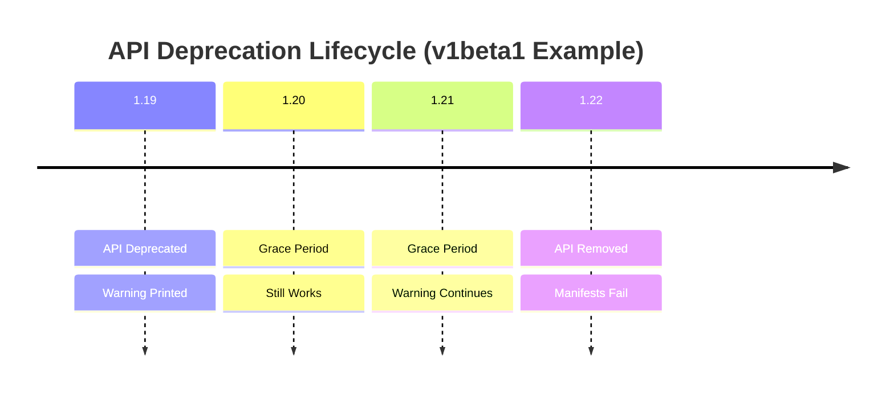

> **Complexity**: `[QUICK]` - Conceptual understanding with practical commands
>
> **Time to Complete**: 35-40 minutes
>
> **Prerequisites**: Understanding of Kubernetes API versioning

---

## Learning Outcomes

After completing this module, you will be able to use the live Kubernetes API as your reference instead of relying on memory, copied manifests, or stale examples. Each outcome below is something you can practice directly on a Kubernetes 1.35+ cluster and verify with the quiz or hands-on exercise.

- **Diagnose** a failed `kubectl apply` caused by a removed API and select the current API version with `kubectl explain` and `kubectl api-resources`.
- **Update** deprecated Kubernetes manifests, including Ingress and CronJob examples where the `apiVersion` change may also require spec changes.
- **Evaluate** deprecation warnings and removed-API errors so you can decide whether a manifest needs a quick version bump or a deeper migration.
- **Implement** server-side dry-run and manifest-audit checks that catch deprecated APIs before they break deployment work.

## Why This Module Matters

Hypothetical scenario: you join an application team after a cluster upgrade window. The workloads still exist, but the next deployment fails because several YAML files use API versions that the new API server no longer serves. The application code did not change, the image did not change, and the Service did not change; the deployment broke because the contract between the manifest and the Kubernetes API changed while the repository stayed frozen.

That scenario is common enough to deserve its own troubleshooting habit. Kubernetes deprecates APIs before it removes them, and during the grace period the API server can warn clients that a version still works today but will not work later. Those warnings are like construction signs on a road: first they tell you a route will close, then they give you time to take another route, and finally the road is gone. If you ignore the signs, the failure feels sudden even though the platform warned you in advance.

The key CKAD skill is not memorizing every API version. The exam cluster, your practice cluster, and a production cluster can be on different minor releases, and Kubernetes keeps evolving. The reliable skill is knowing how to ask the cluster what it serves right now, how to compare that answer with the YAML in front of you, and how to recognize when a new API version changed the shape of the spec rather than only the version string.

This module treats API deprecation as an observability and maintenance problem. You will inspect the served API surface, read warning and error messages, update a legacy Ingress manifest, and build a small audit loop that checks commonly used resources. Pause before you run the first command: if a manifest worked on Kubernetes 1.21 but fails on Kubernetes 1.35+, what evidence would prove whether the problem is the API version, the resource kind, or the fields under `spec`?

## How Kubernetes API Versions Age

Every Kubernetes manifest starts by naming two things: the API version and the kind. The kind says what you want, such as a `Deployment`, `Ingress`, or `CronJob`; the API version says which schema and behavior contract should interpret that object. A useful mental model is a library card catalog. The title of the book is the kind, but the shelf and edition are the API group and version, and using an old shelf label will not help if the library moved or retired that edition.

Kubernetes separates core resources from named API groups. Core resources, such as Pods and Services, use `apiVersion: v1` without a group prefix. Many other resources live in named groups such as `apps`, `batch`, or `networking.k8s.io`, and the group is part of the lookup key. That is why `apps/v1` Deployment and `networking.k8s.io/v1` Ingress are not interchangeable labels; they point the API server to different resource families.

| Stage | Meaning | Stability |
|-------|---------|-----------|
| `alpha` (v1alpha1) | Experimental, may change or disappear | Unstable |
| `beta` (v1beta1) | Feature complete, may change | Mostly stable |
| `stable` (v1, v2) | Production ready, backward compatible | Stable |

The stage names are not decoration. Alpha APIs can change quickly and may be disabled by default. Beta APIs are closer to real use, but Kubernetes still reserves room to adjust fields or behavior before the API graduates. Stable APIs have stronger compatibility expectations, which is why most built-in Kubernetes resources you use for CKAD tasks should be on stable versions in a modern cluster.

```text
v1alpha1 -> v1alpha2 -> v1beta1 -> v1beta2 -> v1
```

Do not read that progression as a promise that every API graduates cleanly through every step. Some APIs graduate with changed fields, some are replaced by a different mechanism, and some are removed without a stable replacement because the feature was retired. PodSecurityPolicy is the classic reminder: there is no `policy/v1` PodSecurityPolicy to change into, so the correct migration is to Pod Security Admission or another policy mechanism rather than a blind version edit.

```yaml
# Core group (no prefix)
apiVersion: v1
kind: Pod

# Named groups
apiVersion: apps/v1
kind: Deployment

apiVersion: networking.k8s.io/v1
kind: Ingress

apiVersion: batch/v1
kind: Job
```

The API server uses the group, version, and kind together to find the resource mapping. When that mapping exists, the server can validate fields, apply defaults, store the object, and return warnings when the version is deprecated. When the mapping does not exist, the request fails before field validation because Kubernetes cannot even find the schema for that kind and version pair. That distinction matters during troubleshooting because a removed API fails differently from an old but still-served API.

Kubernetes also distinguishes API deprecation from API removal. Deprecation means the version still works but clients should move away from it because removal is planned or already scheduled. Removal means the API server no longer serves that version, so a manifest using it cannot be accepted. In the exam, this distinction tells you whether you are reading a warning that deserves cleanup soon or an error that blocks the task immediately.

## Inspect the Cluster Before Editing YAML

The fastest way to avoid stale API versions is to ask the cluster before you write or repair a manifest. `kubectl api-resources` shows the resources currently served by the API server, including their short names, API groups, namespaced status, and kind names. `kubectl explain` shows the version and schema path for a resource, which is especially useful when you need to know whether the current object shape contains a field such as `pathType` or a nested `backend.service.port.number`.

The habit is simple: use `api-resources` when you need to discover resource names and groups, then use `explain` when you need the schema of a specific kind or field. This is faster and safer than searching old notes because both commands talk to the API server you are actually using. Before running the next block, predict which resources will show a named API group and which will show the core `v1` group.

```bash
# All resources with API versions
kubectl api-resources

# Specific resource
kubectl api-resources | grep -i deployment
# Output: deployments   deploy   apps/v1   true   Deployment

# With short names
kubectl api-resources --sort-by=name
```

The output of `api-resources` can feel wide at first, but it answers a practical question: "Can this cluster serve the thing I am about to apply?" If the resource kind is not listed, the manifest is not going to work without installing the missing API or changing the object. If the resource is listed under a different group than the manifest uses, the manifest may be old, copied from a different Kubernetes era, or meant for a CRD that is not installed in this cluster.

```bash
# Get API version for a resource
kubectl explain deployment
# Output shows: VERSION: apps/v1

kubectl explain ingress
# Output shows: VERSION: networking.k8s.io/v1

kubectl explain cronjob
# Output shows: VERSION: batch/v1
```

`kubectl explain` is the command to reach for when you need field-level confidence. The top of its output shows the current version for the resource, and deeper paths show the fields Kubernetes expects. For example, `kubectl explain ingress.spec.rules.http.paths` shows the current Ingress path structure, which is exactly where many old examples fail because `serviceName` and `servicePort` moved under `backend.service`.

```bash
# See what version existing objects use
kubectl get deployment nginx -o yaml | head -5
# apiVersion: apps/v1
# kind: Deployment
```

Looking at an existing object can help when the cluster already has a similar resource. Kubernetes stores and serves objects through preferred versions, so the first lines of `kubectl get ... -o yaml` usually show the version the API server returns now. That output should not be treated as a conversion guide by itself, but it gives you a concrete reference for the group and version in the same cluster.

Use this check whenever a manifest came from a repository, a tutorial, a generated chart, or a teammate's snippet. A manifest that was correct in 2020 can be wrong on a Kubernetes 1.35+ cluster, and a manifest that works in one vendor environment can fail in another if a CRD is missing. Which approach would you choose here and why: editing the `apiVersion` from memory, checking `kubectl explain`, or trying `kubectl apply` first and reading the error?

## Recognize Deprecated and Removed APIs

Kubernetes deprecations are visible in two places: documentation that announces version lifecycles, and API server responses that warn when you use a deprecated version that still works. The warning path is valuable because it appears in the workflow you already run. If CI logs include a deprecation warning, the deployment may still succeed today, but the log is telling you that a future upgrade can turn the same YAML into a hard failure.

The table below preserves the historical examples that matter most for CKAD-style maintenance work. You should not memorize it as the only source of truth, but it gives you pattern recognition for common stale manifests. The repeated theme is that a removed beta API is not a runtime application failure; it is a schema negotiation failure between client and API server.

| Old API | Current API | Removed In |
|---------|-------------|------------|
| `extensions/v1beta1 Ingress` | `networking.k8s.io/v1` | 1.22 |
| `apps/v1beta1 Deployment` | `apps/v1` | 1.16 |
| `rbac.authorization.k8s.io/v1beta1` | `rbac.authorization.k8s.io/v1` | 1.22 |
| `networking.k8s.io/v1beta1 IngressClass` | `networking.k8s.io/v1` | 1.22 |
| `batch/v1beta1 CronJob` | `batch/v1` | 1.25 |
| `policy/v1beta1 PodSecurityPolicy` | Removed (use Pod Security Admission) | 1.25 |

The CKAD exam uses recent Kubernetes versions, and this module assumes Kubernetes 1.35+ for examples. That means most built-in beta APIs from the early Kubernetes era are gone, not merely discouraged. The practical consequence is that you should expect old blog-post YAML to fail fast when it names `extensions/v1beta1` Ingress or `batch/v1beta1` CronJob, while a still-served deprecated API would normally print a warning before a later release removes it.

```bash
# Convert old manifest to new API
kubectl convert -f old-deployment.yaml --output-version apps/v1
```

`kubectl convert` is useful when it is available, but it is not a substitute for understanding the resource shape. The plugin can help with version conversion, yet you still need to inspect required fields and review the result. In exam environments you may not have the plugin, so treat it as a convenience rather than a foundation for your troubleshooting strategy.

```bash
# Check what the manifest uses
head -5 my-manifest.yaml

# Compare with current API
kubectl api-resources | grep -i <resource-type>
```

A manual check is often enough. The first few lines of the file tell you the manifest's declared version and kind, while `api-resources` or `explain` tells you what the cluster serves. This comparison is also a good code review habit: if a pull request introduces `v1beta1` for a built-in resource in a modern cluster, the reviewer should ask for proof that the API is still served.

```bash
$ kubectl apply -f old-ingress.yaml
Warning: networking.k8s.io/v1beta1 Ingress is deprecated in v1.19+,
unavailable in v1.22+; use networking.k8s.io/v1 Ingress
```

The warning example is the best case because it gives you time. The server still accepted the object, but it also told you the old version is deprecated and named the replacement. If you see that warning in CI, the correct response is not "green build, ignore it." The correct response is to create a small migration change while the system is healthy, because the same warning can become `no matches for kind` after an upgrade crosses the removal release.

```text
1.19: v1beta1 deprecated (warning)
1.20: v1beta1 still works (warning continues)
1.21: v1beta1 still works (warning continues)
1.22: v1beta1 REMOVED (error if used)
```

The timeline above is a simplified Ingress-style example, and the exact releases differ by API. What matters is the lifecycle shape: deprecation precedes removal, and warnings exist so users can migrate before the failure is unavoidable. When you troubleshoot a failed manifest, ask whether you are before or after the removal point. Before removal, you can apply and migrate calmly; after removal, the manifest must change before it can be accepted.



Deprecation policy gives Kubernetes users a predictable runway, but it does not remove the need to read release notes and warning output. The policy is strongest for stable APIs and less comforting for beta or alpha versions. In everyday terms, a stable API is like a public road the city is expected to maintain carefully, while an alpha API is closer to a temporary construction path. You can use it, but you should not be surprised when its shape changes.

## Read API Errors as Evidence

Kubernetes API errors are not random complaint text. They usually tell you which layer rejected the object, and that layer tells you what kind of fix is possible. A removed API fails during resource mapping because the server cannot match the group, version, and kind to a served endpoint. A current API with old fields fails during decoding or validation because the server found the endpoint but rejected the object shape. An admission rejection happens later, after the object is syntactically valid, because a policy or controller decided the request is not allowed.

This order is useful because it keeps your troubleshooting narrow. If the message says `no matches for kind`, do not start editing probes, labels, or Service ports. Kubernetes has not reached those fields yet. Your immediate job is to discover the correct API or confirm that the resource no longer exists. Once the group-version-kind maps successfully, then field errors become meaningful, and only after field validation passes should you think about admission policies, quota, or runtime behavior.

The phrase `resource mapping not found` usually points to discovery. The client tried to build a REST mapping for the object and could not find a matching served resource. In a built-in resource, that often means the manifest uses a removed API version such as an old Ingress or CronJob beta. In a custom resource, the same wording can mean the CRD is missing, the CRD uses a different group, or you are connected to the wrong cluster. The fix depends on whether the resource should be built in or installed by an extension.

The phrase `no matches for kind` is especially direct. It names the kind and the version that failed, so you can compare those two values against `kubectl api-resources`. If the kind appears under a different API group, update the manifest to the served group and then inspect the spec. If the kind does not appear at all, changing random version strings is guesswork. You either need to install the API provider, choose a different resource, or remove that manifest from the target environment.

Field errors have a different flavor. They often say that a field is unknown, required, invalid, or not allowed in a certain location. That means Kubernetes recognized the resource version and moved on to validating the object body. For deprecation work, this is the point where a version-only migration reveals its weakness. The manifest is no longer stale at the first line, but parts of the body still belong to the old schema.

Ingress makes this concrete. If you change only `networking.k8s.io/v1beta1` to `networking.k8s.io/v1`, the old `serviceName` and `servicePort` fields are still in the wrong place. A field error is not evidence that stable Ingress is broken; it is evidence that the manifest still describes the beta shape. The right next move is to inspect the exact schema path and rewrite the backend block, not to try another API version.

Warnings sit between success and failure, which is why they are easy to mishandle. A warning can appear while `kubectl apply` exits successfully because the API server accepted the object but wants the client to change behavior before a future release. In a human terminal, the warning is visible. In automation, it may be buried between normal apply lines. Teams that treat warnings as background noise lose the cheapest possible signal for upgrade readiness.

Admission errors are different from deprecation errors, even when they appear during the same apply command. A policy can reject a valid `apps/v1` Deployment because it lacks resource limits, uses a forbidden image registry, or violates Pod Security Admission. Changing the `apiVersion` will not fix that because discovery and schema validation already succeeded. The repair belongs to the policy requirement named in the message, not to the API lifecycle.

The practical debugging sequence is therefore discovery, schema, admission, and runtime. Discovery asks whether the API server serves this group-version-kind. Schema asks whether the object body matches that version. Admission asks whether cluster policy allows the request. Runtime asks whether controllers, the scheduler, kubelet, and application process can make the accepted object work. API deprecation usually lives in the first two layers, so keep the investigation there until the evidence moves you forward.

Pause and predict: if `kubectl apply --dry-run=server` returns an unknown field error for an Ingress, would installing a different Ingress controller fix the manifest? Usually no, because the API server validates the built-in Ingress schema before any controller reconciles the object. The controller may affect behavior after the object is accepted, but it does not make old beta fields valid inside the stable API.

This evidence-based reading also helps when you review pull requests. A changed `apiVersion` should invite a small checklist: did the kind still map, did the spec shape change, did the rendered manifest pass server-side dry run, and did any policy reject the accepted object? That checklist is short enough for CKAD practice and concrete enough for team review. It turns opaque apply output into a decision tree you can run without panic.

## Update Manifests Without Guessing

Many removed-API fixes look like simple `apiVersion` edits until they do not. Some resources kept nearly the same spec when they graduated, while others changed field names, nesting, defaults, or required fields. Ingress is the best training example because the migration from `networking.k8s.io/v1beta1` to `networking.k8s.io/v1` requires more than changing the first line. If you only update the version, the API server moves from "unknown API" to "known API with invalid fields."

Start by reading the old manifest as a shape, not just as text. It declares an Ingress, it has a rule for `example.com`, and under each path it points to a Service by the older flat fields `serviceName` and `servicePort`. Those fields were valid in the old beta shape, but the stable Ingress API uses a nested backend object and requires an explicit path matching strategy.

```yaml
apiVersion: networking.k8s.io/v1beta1
kind: Ingress
metadata:
  name: my-ingress
spec:
  rules:
  - host: example.com
    http:
      paths:
      - path: /
        backend:
          serviceName: my-service
          servicePort: 80
```

Before looking at the updated manifest, pause and predict: which fields are part of the object identity, which fields describe HTTP routing, and which fields tell Kubernetes how to reach the Service backend? If you can separate those responsibilities, the new shape is easier to remember because the nested `service` block groups the Service name and port together.

```yaml
apiVersion: networking.k8s.io/v1
kind: Ingress
metadata:
  name: my-ingress
spec:
  rules:
  - host: example.com
    http:
      paths:
      - path: /
        pathType: Prefix
        backend:
          service:
            name: my-service
            port:
              number: 80
```

The three important changes are the version, the required `pathType`, and the backend structure. `pathType: Prefix` tells the controller how to match the path, while `backend.service.name` and `backend.service.port.number` replace the older flat backend fields. This is why `kubectl explain ingress.spec.rules.http.paths.backend` is worth the few seconds it takes; it shows the current shape instead of leaving you to remember every migration detail.

Some migrations are less dramatic. A stale Deployment using `apps/v1beta1` usually becomes `apps/v1` with a familiar pod template shape, but you still need to validate the selector and template labels because stable Deployments require a selector. A CronJob migration from `batch/v1beta1` to `batch/v1` is usually straightforward for common fields, but you should still ask the cluster for the current schema and run a server-side dry run before merging the change.

```bash
# Always check current API version first
kubectl explain <resource>

# Example
kubectl explain ingress
kubectl explain cronjob
kubectl explain networkpolicy
```

The command above is deliberately boring. It is also the command that saves time under pressure because it converts uncertainty into evidence. In CKAD work, a correct lookup beats a confident guess, and the cost is only a few seconds. The same habit scales to real repositories because you can audit manifests for declared versions first, then use server-side validation to catch the field-level issues.

```bash
# This is the ONLY command you need to remember
kubectl explain <resource> | head -5

# Practice: what happens if you guess wrong?
# Try applying a manifest with the wrong version and read the error.
```

If you applied a Deployment with `apiVersion: extensions/v1beta1` on a Kubernetes 1.35+ cluster, it would fail immediately with a message like `no matches for kind "Deployment" in version "extensions/v1beta1"`. That error means the API server cannot find the group-version-kind mapping. It is different from a deprecation warning, which appears only when the old API is still served and the server can process the request while warning you to move.

## Build a Verification Workflow for CKAD and CI

The best manifest workflow has two loops: a quick human loop for interactive work and an automated loop for repositories. In the human loop, you check the resource version with `explain`, update the manifest, and run `kubectl apply --dry-run=server` before applying for real. In the automated loop, CI runs a server-side dry run or an equivalent policy check against a representative cluster version so deprecated or removed APIs do not wait until an upgrade night to fail.

Server-side dry run matters because it asks the API server to validate the request without persisting the object. Client-side generation can catch YAML syntax and produce default shapes, but it cannot prove that the live API server accepts the resource version or all fields. For deprecations, that server contact is the point. You want the same component that would reject the real deployment to reject the test deployment first.

A useful review rule is to separate "version accepted" from "field accepted." A manifest can fail because the API version is removed, or it can pass the version lookup and fail because the spec still uses old fields. The first failure usually says no matches for kind and version; the second failure usually names an unknown or missing field. When you read errors this way, you avoid the common trap of fixing the first line and assuming the migration is done.

Use generated YAML as a learning aid when the exam allows it. Imperative `kubectl create` commands are good at producing current API versions for common workload objects, and the output can serve as a skeleton. The generated file is not always the final answer because you may need labels, probes, volume mounts, or policy fields, but it reduces the chance that your first two lines are stale.

In production-style repositories, add a manifest audit step near the code that already renders Helm, Kustomize, or plain YAML. Render first, then validate the rendered result, because deprecations hide in templates until values expand them. This keeps the check honest: you test the object that would reach the API server, not the partial template that humans read in review.

## Patterns & Anti-Patterns

The main pattern is evidence-first migration. Use the live API to learn what the cluster serves, update the manifest shape with the schema in view, then validate with server-side dry run. This works for CKAD tasks because it is fast, and it works for larger teams because it leaves a repeatable audit trail in CI. The scaling consideration is cluster coverage: if you deploy to several Kubernetes minor versions, validate against the oldest and newest supported versions instead of assuming one cluster proves every target.

A second useful pattern is inventory before upgrade. Before a cluster upgrade, search rendered manifests and live audit logs for deprecated versions, then rank findings by removal release and blast radius. This is different from waiting for deployment errors after the upgrade. The inventory tells you which manifests must change before the control plane moves, which teams own them, and which changes require behavior migration rather than a version bump.

The third pattern is schema-guided code review. When a pull request changes `apiVersion`, reviewers should also look for nearby field-shape changes, especially on resources with known migration differences such as Ingress. This keeps review focused on the contract being changed. The reviewer does not need to recite the entire Kubernetes API; they need to ask whether the new version's schema still contains the fields in the manifest.

The most damaging anti-pattern is "version-string only" migration. Teams fall into it because the failure message names the old API version, so changing the first line feels like the whole fix. The better alternative is to use `kubectl explain` on the relevant spec path and run a server-side dry run. That combination catches the next layer of errors before the manifest reaches a real deployment.

Another anti-pattern is trusting examples by age or search ranking. A tutorial can be correct for the Kubernetes release it targeted and still be wrong for your cluster. Treat external YAML as a starting point, not as an authority. The cluster is the authority, and Kubernetes documentation or vendor release notes should be the reference for migrations that change behavior.

A final anti-pattern is ignoring warnings because the command exited successfully. Warnings are easy to lose in CI logs, especially when a deployment prints many normal lines. Make deprecation warnings visible by failing a dedicated audit job or by opening tracked cleanup work when warnings appear. The fix is usually cheaper during normal maintenance than during a blocked upgrade or an exam timer.

## Decision Framework

Use this framework when a manifest fails or warns during apply. First decide whether the API server recognizes the group-version-kind. If it does not, use `api-resources` and `explain` to find the current version or to confirm that the resource was removed without a direct replacement. If it does recognize the version but warns, treat the warning as a migration task with a deadline. If it recognizes the version but rejects fields, you have a spec-shape problem rather than a version-discovery problem.

| Situation | Evidence | Best Next Move | Tradeoff |
|-----------|----------|----------------|----------|
| Removed built-in API | `no matches for kind` names an old group or version | Find the current API with `kubectl explain` and update the manifest shape | Fast fix when the resource graduated, but some APIs require replacement |
| Deprecated but still served API | `Warning:` appears while the object applies | Migrate during normal work and validate with server-side dry run | Deployment is not blocked today, but upgrade risk remains |
| Current API with invalid fields | Error names unknown, missing, or invalid fields | Inspect the exact spec path with `kubectl explain` and edit fields | Requires more care than a version bump |
| Missing CRD or extension API | Resource kind is absent from `api-resources` | Install the owning CRD/operator or remove the dependent object | Not a CKAD built-in-resource fix, but common in platform repos |
| Removed API with no stable equivalent | Documentation shows replacement mechanism, not a new version | Plan a behavioral migration, such as Pod Security Admission | More work, but avoids inventing non-existent APIs |

This decision table also keeps you from overcorrecting. If the cluster says an API is missing because a CRD is not installed, changing `apiVersion` randomly will not help. If the resource is built in and removed, installing a CRD will not help. The right fix follows the evidence category, which is why the first question is always whether the API server can map the kind and version at all.

For CKAD timing, the fastest safe path is usually lookup, edit, dry-run, then apply. Do not spend exam minutes trying many versions by trial and error. The API server already exposes the served version, and field-level explanation is available for the resource path you are editing. A calm two-command check is usually faster than debugging a chain of avoidable validation errors.

## Did You Know?

- **Ingress `networking.k8s.io/v1beta1` was removed in Kubernetes 1.22.** The stable `networking.k8s.io/v1` shape requires `pathType` and a nested backend service reference.
- **CronJob `batch/v1beta1` was removed in Kubernetes 1.25.** Modern clusters serve CronJob through `batch/v1`, so old beta examples fail on Kubernetes 1.35+.
- **PodSecurityPolicy was completely removed in Kubernetes 1.25.** It did not graduate to `policy/v1`; migration means using Pod Security Admission or another supported policy system.
- **The API server can return deprecation warnings before removal.** A successful `kubectl apply` can still be telling you that the manifest needs migration before a future upgrade.

## Common Mistakes

| Mistake | Why It Happens | How to Fix It |
|---------|----------------|---------------|
| Copying YAML from old blog posts or Stack Overflow | Examples from older releases may use removed APIs such as `extensions/v1beta1` | Verify the resource with `kubectl explain` on your cluster before using the manifest |
| Ignoring deprecation warnings in CI logs | The deployment still succeeds, so the warning feels harmless | Treat the warning as upgrade work and migrate before the removal release |
| Memorizing API versions instead of learning lookup commands | Practice clusters, exam clusters, and production clusters can use different minor versions | Build muscle memory for `kubectl explain <resource>` and `kubectl api-resources` |
| Only updating `apiVersion` without checking spec changes | The error message names the version, so the first line gets all the attention | Inspect the relevant `spec` path and run `kubectl apply --dry-run=server` |
| Assuming every beta API has a stable replacement | Some features are removed or replaced by a different mechanism | Read the deprecation guide and confirm the replacement before editing manifests |
| Testing only with client-side dry run | Client-side generation cannot prove that the live API server accepts the resource | Use server-side dry run when checking API availability and schema validation |
| Auditing source templates instead of rendered manifests | Helm and Kustomize can hide deprecated APIs until values or overlays are rendered | Validate the rendered YAML that would be sent to the API server |

## Quiz

Use these scenarios to test whether you can distinguish API discovery, field-shape migration, warning cleanup, and validation workflow. The questions are intentionally practical because real deprecation work rarely asks for a definition; it asks you to decide which evidence changes your next command.

<details>
<summary>1. Your team upgraded a cluster from 1.24 to 1.25. Deployments work, but all CronJobs fail to apply with a `batch/v1beta1` message. What is likely wrong, and how would you fix it?</summary>

CronJob `batch/v1beta1` was removed in Kubernetes 1.25, so the manifests still declare an API version the server no longer serves. The first fix is to confirm the current version with `kubectl explain cronjob | head -5`, then update the manifests to `batch/v1`. After the version change, run a server-side dry run so the API server validates the full object. This is not a Deployment problem or a scheduler problem because the failure happens before Kubernetes accepts the CronJob object.
</details>

<details>
<summary>2. You run `kubectl apply -f ingress.yaml` and get `no matches for kind "Ingress" in version "extensions/v1beta1"`. A teammate says the same file worked last month. What changed, and what should you inspect before reapplying?</summary>

The cluster likely crossed a Kubernetes version boundary where that old Ingress API is no longer served. The fix is not only changing the first line to `networking.k8s.io/v1`; you must also inspect the stable Ingress schema because the backend fields and `pathType` requirement changed. Use `kubectl explain ingress.spec.rules.http.paths` to confirm the current structure. Then run `kubectl apply --dry-run=server` to catch field errors before creating or updating the object.
</details>

<details>
<summary>3. During CKAD practice, you are not sure whether NetworkPolicy uses `v1` or `v1beta1`. What should you do, and why is guessing the weaker option?</summary>

Run `kubectl explain networkpolicy | head -5` or check `kubectl api-resources | grep -i networkpolicy` on the cluster. Guessing is weaker because the exam grades against the API server in front of you, not against what you remember from a tutorial or another cluster. The lookup takes seconds and also reinforces the group name. If the command shows `networking.k8s.io/v1`, that is the version your manifest should use in that environment.
</details>

<details>
<summary>4. Your CI pipeline prints `Warning: batch/v1beta1 CronJob is deprecated`, but the deployment exits successfully. Should the team fix it now or wait for the next cluster upgrade window?</summary>

The team should fix it during normal work, not during the upgrade window. A deprecation warning means the API still works today, but Kubernetes is telling you the version is on the path to removal. Migrating while the deployment still succeeds gives you time to validate behavior and update every copy of the manifest. Waiting converts a low-pressure maintenance task into a blocked deployment when the API is removed.
</details>

<details>
<summary>5. A pull request changes `policy/v1beta1` PodSecurityPolicy to `policy/v1` because the author expects beta APIs to graduate. Is that a valid migration?</summary>

No. PodSecurityPolicy was removed and does not have a `policy/v1` replacement object. The correct response is to confirm the resource with documentation and `kubectl api-resources`, then migrate the security controls to Pod Security Admission or another supported policy mechanism. A blind version bump would create a manifest that the API server still cannot map. This question tests whether you distinguish graduation from removal.
</details>

<details>
<summary>6. A manifest uses `networking.k8s.io/v1` Ingress, but server-side dry run rejects `serviceName` and `servicePort`. What category of problem is this, and what is the next command?</summary>

This is a current-version, old-field-shape problem. The API server recognizes `networking.k8s.io/v1` Ingress, but the manifest still contains fields from the beta schema. The next command is `kubectl explain ingress.spec.rules.http.paths.backend` or a nearby schema path so you can see the nested `service.name` and `service.port.number` fields. After editing, rerun `kubectl apply --dry-run=server` to validate the full object.
</details>

## Hands-On Exercise: Fix the Broken Manifests

Exercise scenario: you inherited a repository of Kubernetes manifests from a team that last validated them on Kubernetes 1.21. Your current cluster runs Kubernetes 1.35+, and at least one manifest uses a removed API. The goal is to diagnose the failure, update the version and fields, and prove with server-side dry run that the API server accepts the corrected object.

Work in a scratch namespace or a local practice cluster if you have one. You do not need to create real Services for the Ingress dry-run validation, but you should read the error output carefully because it tells you whether the server failed at resource mapping or field validation. The sequence matters: diagnose the old API first, inspect the current schema second, edit the manifest third, and validate last.

### Part 1: Diagnose the Problem

Save this broken manifest as `broken-ingress.yaml`. It is intentionally written with an old Ingress API and old backend fields so you can see both layers of the migration. Do not fix it before you run the dry-run command; the point of the first pass is to read the API server's evidence.

```yaml
apiVersion: networking.k8s.io/v1beta1
kind: Ingress
metadata:
  name: legacy-app
spec:
  rules:
  - host: app.example.com
    http:
      paths:
      - path: /api
        backend:
          serviceName: api-service
          servicePort: 8080
      - path: /
        backend:
          serviceName: frontend
          servicePort: 80
```

Try to apply it with server-side dry run, then read the first resource-mapping error. That error tells you the API version is removed before Kubernetes even reaches the old backend fields.

```text
error: resource mapping not found for name: "legacy-app" namespace: "" from "broken-ingress.yaml":
no matches for kind "Ingress" in version "networking.k8s.io/v1beta1"
```

### Part 2: Fix the Manifest

Use `kubectl explain ingress | head -5` to confirm the current version, then inspect `kubectl explain ingress.spec.rules.http.paths` to see the required path structure. Update the manifest only after you have looked at the schema. This forces you to practice the habit that prevents a version-only fix from leaving old fields behind.

```bash
kubectl apply -f broken-ingress.yaml --dry-run=server
```

<details>
<summary>Fixed manifest</summary>

```yaml
apiVersion: networking.k8s.io/v1
kind: Ingress
metadata:
  name: legacy-app
spec:
  rules:
  - host: app.example.com
    http:
      paths:
      - path: /api
        pathType: Prefix
        backend:
          service:
            name: api-service
            port:
              number: 8080
      - path: /
        pathType: Prefix
        backend:
          service:
            name: frontend
            port:
              number: 80
```

The key changes are the updated `apiVersion`, the required `pathType: Prefix`, and the nested backend structure under `service.name` and `service.port.number`.
</details>

After editing the file, run the same server-side dry run again. A clean dry run means the API server recognizes the resource version and accepts the shape of the object. If you still get an error, classify it: is Kubernetes still unable to map the group-version-kind, or is it now rejecting fields under a known version?

### Part 3: Audit All Resources

The next task builds a small lookup table for resources you commonly use. This is not meant to replace documentation; it is meant to train your reflex to ask the cluster for the current served versions. If one resource is missing, read the error and decide whether you used the wrong resource name or whether the API is not installed.

```bash
# Find the current version for every resource you commonly use
for res in pod service deployment statefulset daemonset job cronjob ingress networkpolicy; do
  version=$(kubectl explain "$res" 2>/dev/null | grep "VERSION:" | awk '{print $2}')
  echo "$res: $version"
done
```

The output should show a mix of core and named API groups. Pods and Services should be `v1`, Deployments should be `apps/v1`, Jobs and CronJobs should be in `batch/v1`, and Ingress and NetworkPolicy should be in `networking.k8s.io/v1`. If your cluster differs because of distribution-specific APIs or missing resources, treat the difference as evidence to investigate, not as a reason to guess.

### Part 4: Generate Correct YAML from Scratch

Imperative generation is a useful CKAD tactic because it asks `kubectl` to create a current skeleton for common objects. The generated YAML still needs review, but it gives you a correct starting `apiVersion` and kind. Use this tactic when you need speed, then edit the generated file for labels, probes, environment variables, or other required fields.

```bash
kubectl create deploy audit-app --image=nginx --dry-run=client -o yaml > deployment.yaml
kubectl create job audit-job --image=busybox -- echo done --dry-run=client -o yaml > job.yaml
kubectl create cronjob audit-cron --image=busybox --schedule="0 * * * *" -- echo check --dry-run=client -o yaml > cronjob.yaml
```

Verify each generated manifest with `grep apiVersion *.yaml`, then run server-side dry run for any file you plan to apply. The comparison between generated YAML and repaired legacy YAML is useful: generated files start from current APIs, while repaired files teach you how old shapes migrate.

### Practice Drills

Drill 1 trains fast resource lookup. Run the commands one by one and say the expected version before the output appears. The value is not in the specific answer for one cluster; the value is in building a low-friction habit for checking the current API surface.

```bash
# Find API version for various resources
kubectl explain pod | head -5
kubectl explain service | head -5
kubectl explain deployment | head -5
kubectl explain ingress | head -5
kubectl explain networkpolicy | head -5
```

Drill 2 uses the resource list instead of field explanation. This is the command to use when you are not sure about names, short names, namespaced status, or API groups. It also helps you spot whether an extension resource exists at all.

```bash
# List resources and their groups
kubectl api-resources --sort-by=name | grep -E "^NAME|deployment|ingress|job|cronjob"
```

Drill 3 practices generation and verification together. You are using client-side dry run to generate YAML, then immediately checking the API version it produced. In a real workflow, the next step would be server-side dry run before apply.

```bash
# Generate manifests and verify API versions

# Deployment
kubectl create deploy drill3-deploy --image=nginx --dry-run=client -o yaml | grep apiVersion

# Job
kubectl create job drill3-job --image=busybox -- echo done --dry-run=client -o yaml | grep apiVersion

# CronJob
kubectl create cronjob drill3-cron --image=busybox --schedule="* * * * *" -- echo hi --dry-run=client -o yaml | grep apiVersion
```

Drill 4 connects kinds to groups. The important learning point is that Services are core `v1`, while Deployments, Ingresses, and NetworkPolicies live in named groups. If you can say the group before reading it, you are less likely to paste a stale `apiVersion` during an exam.

```bash
# Which group does each belong to?
kubectl api-resources | grep -E "^NAME|^deployments|^services|^ingresses|^networkpolicies"

# Expected:
# deployments - apps
# services - core (no group)
# ingresses - networking.k8s.io
# networkpolicies - networking.k8s.io
```

Drill 5 combines several common resources into one lookup loop. This is the same pattern you can adapt for a repository audit by feeding resource kinds from rendered YAML, then comparing the result with the versions declared in manifests.

```bash
# Resources needed: Deployment, Service, Ingress, ConfigMap, Secret, NetworkPolicy

# Quick lookup
for res in deployment service ingress configmap secret networkpolicy; do
  echo -n "$res: "
  kubectl explain "$res" 2>/dev/null | grep "VERSION:" | awk '{print $2}'
done
```

### Success Criteria

- [ ] Diagnose a failed `kubectl apply` caused by the removed `networking.k8s.io/v1beta1` Ingress API.
- [ ] Update the deprecated Ingress manifest to `networking.k8s.io/v1`, including `pathType` and nested backend fields.
- [ ] Evaluate the difference between a deprecation warning, a removed-API error, and a current-version field-validation error.
- [ ] Implement a server-side dry-run check that validates the fixed manifest before a real apply.
- [ ] Use `kubectl explain` or `kubectl api-resources` to find any common resource API version in under 10 seconds.

### Part 3 Section Wrap-Up

Part 3 covered the maintenance skills that keep applications observable and repairable after they are deployed. Probes tell Kubernetes when a container is alive and ready, logs expose application output, debugging commands let you move from symptoms to evidence, metrics show current resource pressure, and API deprecation checks keep manifests compatible with the cluster. The unifying habit is the same across the section: read what Kubernetes already knows before making a change.

API deprecations fit naturally at the end because they connect day-two maintenance with cluster lifecycle. A manifest is not a timeless artifact; it is a request written against a moving API surface. When you treat API versions as contracts that can age, warnings become useful early signals instead of noisy log lines, and removed APIs become straightforward repair tasks rather than mysterious deployment failures.

## Sources

- [Kubernetes API deprecation policy](https://kubernetes.io/docs/reference/using-api/deprecation-policy/)
- [Kubernetes API concepts](https://kubernetes.io/docs/reference/using-api/api-concepts/)
- [Kubernetes deprecated API migration guide](https://kubernetes.io/docs/reference/using-api/deprecation-guide/)
- [kubectl api-resources reference](https://kubernetes.io/docs/reference/kubectl/generated/kubectl_api-resources/)
- [kubectl explain reference](https://kubernetes.io/docs/reference/kubectl/generated/kubectl_explain/)
- [kubectl apply reference](https://kubernetes.io/docs/reference/kubectl/generated/kubectl_apply/)
- [kubectl create deployment reference](https://kubernetes.io/docs/reference/kubectl/generated/kubectl_create/kubectl_create_deployment/)
- [kubectl create job reference](https://kubernetes.io/docs/reference/kubectl/generated/kubectl_create/kubectl_create_job/)
- [kubectl create cronjob reference](https://kubernetes.io/docs/reference/kubectl/generated/kubectl_create/kubectl_create_cronjob/)
- [Kubernetes Ingress concept](https://kubernetes.io/docs/concepts/services-networking/ingress/)
- [Kubernetes CronJob concept](https://kubernetes.io/docs/concepts/workloads/controllers/cron-jobs/)
- [Pod Security Admission](https://kubernetes.io/docs/concepts/security/pod-security-admission/)

## Next Module

Take the [Part 3 Cumulative Quiz](../part3-cumulative-quiz/) to test your observability and maintenance workflow, then continue to [Part 4: Application Environment, Configuration and Security](/k8s/ckad/part4-environment/module-4.1-configmaps/).
