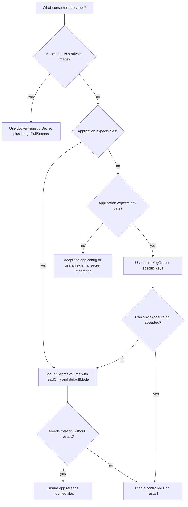

> **Complexity**: `[MEDIUM]` - Similar to ConfigMaps but with security considerations
>
> **Time to Complete**: 40-50 minutes
>
> **Prerequisites**: Module 4.1 (ConfigMaps), understanding of base64 encoding

---

## Learning Outcomes

After completing this module, you will be able to create, configure, diagnose, and evaluate Kubernetes Secrets in a way that matches CKAD expectations while also building habits that transfer to production clusters running Kubernetes 1.35 and later.

- **Create** generic, file-based, TLS, and docker-registry Secrets with `kubectl` and declarative YAML while avoiding local credential leakage.
- **Configure** Pods to consume Secrets through environment variables, `envFrom`, volume mounts, key projection, file modes, and `imagePullSecrets`.
- **Diagnose** authentication, `CreateContainerConfigError`, and `ImagePullBackOff` failures caused by encoding, naming, key, or type mistakes.
- **Evaluate** Kubernetes Secret security boundaries in Kubernetes 1.35+, including base64 encoding, RBAC, etcd encryption at rest, and exposure through logs or process environments.

---

## Why This Module Matters

Hypothetical scenario: you deploy a web Pod that starts cleanly in staging, but production immediately reports database authentication failures. The Secret exists, the key name looks correct, and the application logs show the right username, so the first instinct is to blame the database. The actual failure is a trailing newline that was encoded into the password when somebody used `echo` without `-n`, which means the application sends a different byte sequence than the database expects.

That small error captures why Secrets deserve more care than ConfigMaps. A ConfigMap mistake usually breaks feature flags or endpoint names; a Secret mistake can block image pulls, expose credentials through logs, or give a team false confidence because the YAML appears valid. The CKAD exam tests this as a practical skill, not a security policy essay: you need to create Secrets quickly, mount them correctly, and debug the failure mode from Pod events and decoded values without leaking the sensitive input while you work.

The safe deposit box analogy is still useful, as long as you do not stretch it too far. A ConfigMap is like a public bulletin board inside the cluster, while a Secret is closer to a safe deposit box that only certain workloads and users can open. The box label is visible, the contents are handed to authorized Pods in plain form, and the bank vault still needs guards; Kubernetes gives you a better object for sensitive material, but it does not make careless handling safe by itself.

In this module you will build the same Secret several ways, compare the built-in Secret types, consume values through environment variables and mounted files, and practice debugging the common errors that show up as authentication failures or Pod startup delays. Keep one question in view as you read: which boundary are you protecting at each step, the YAML representation, the API object, the kubelet handoff, the application process, or the people and tools that can read the object?

---

## Creating Secrets Without Leaking the Inputs

A Kubernetes Secret is an API object with a small amount of key-value data and a type that tells Kubernetes how to interpret that data. The default type, `Opaque`, stores arbitrary keys for your application, which makes it the closest Secret equivalent to a ConfigMap. The important difference is not that Kubernetes magically encrypts the value for you; it is that the API server, CLI, and Pod specification give Secrets a distinct handling path that you can combine with RBAC, etcd encryption, and careful Pod design.

The fastest CKAD path is usually imperative creation, because `kubectl create secret generic` handles the base64 encoding for you. That removes one common source of mistakes while still producing a normal Secret object in the API. The example below preserves the simple single-value pattern from the original module, but it uses a safe demonstration value and the full `kubectl` binary so the command works in copied scripts and non-interactive shells.

```bash
# Single key-value
kubectl create secret generic db-secret --from-literal=password='example-password'
```

The same command can accept several literals, and the key names become the keys under the Secret's `data` field. This style is convenient during an exam because it is short and does not require you to create a temporary manifest, but it is not ideal for a shared terminal history. In a real environment, prefer a secret manager or a workflow that avoids putting sensitive values directly into shell history.

```bash
# Multiple key-values
kubectl create secret generic db-secret \
  --from-literal=username=admin \
  --from-literal=password='example-password' \
  --from-literal=host=db.example.com
```

File-based creation is useful when the application already expects separate files, such as a username file and a password file. It also avoids placing the sensitive value directly in the command line, although the temporary files still need careful cleanup and should not be created in a repository directory. In an exam shell, use `echo -n` for deterministic bytes, then remove the files after the Secret exists.

```bash
# Create files with sensitive data
echo -n 'admin' > username.txt
echo -n 'example-password' > password.txt

# Create Secret from files
kubectl create secret generic db-secret \
  --from-file=username=username.txt \
  --from-file=password=password.txt

# Cleanup files
rm username.txt password.txt
```

When you write YAML yourself, the `data` field must contain base64-encoded values. Base64 is only a transport encoding, so the encoded strings below are not protected from anyone who can read the object. This style is useful when a task gives you encoded input or when you need a fully declarative object, but it is also where newline mistakes and copy-paste damage are easiest to introduce.

```yaml
apiVersion: v1
kind: Secret
metadata:
  name: db-secret
type: Opaque
data:
  username: YWRtaW4=      # base64 of 'admin'
  password: bXlzZWNyZXQ=  # base64 of 'mysecret'
```

Pause and predict: if you run `echo 'mypassword' | base64` instead of `echo -n 'mypassword' | base64`, which bytes does the application receive after Kubernetes decodes the Secret, and why would a database reject them? The command without `-n` encodes a newline after the password, so the decoded value becomes `mypassword\n` rather than `mypassword`. That distinction is invisible in many log lines, which is why authentication failures from newline encoding can feel confusing until you inspect the exact bytes.

The `stringData` field gives you a safer authoring experience because you write plain text in the manifest and let the API server encode it into `data`. It is write-only from the user's point of view: when you retrieve the Secret later, Kubernetes returns the encoded `data` field rather than preserving `stringData`. This makes `stringData` excellent for quick manifests, but you still should not commit real credentials to Git just because the field is easier to read.

```yaml
apiVersion: v1
kind: Secret
metadata:
  name: db-secret
type: Opaque
stringData:
  username: admin
  password: mysecret
```

Declarative practice should also include server-side validation before you create the object. The dry-run command below asks the API server to validate and render the object without storing it, which is helpful when you need a manifest skeleton during an exam. It also teaches a useful production habit: generate or validate structure separately from the step that places sensitive material into the cluster.

```bash
kubectl create secret generic db-secret \
  --from-literal=username=admin \
  --from-literal=password='example-password' \
  --dry-run=server \
  -o yaml
```

After creation, inspect metadata first and decode only the specific key you need. `kubectl get secret` intentionally hides decoded values in normal table output, but `-o yaml` exposes encoded data to anyone with read access. Treat the ability to read a Secret as sensitive access, because decoding is a one-command operation and the API server will not ask why you wanted the value.

```bash
kubectl get secret db-secret
kubectl get secret db-secret -o yaml
kubectl get secret db-secret -o jsonpath='{.data.password}' | base64 -d
echo
```

---

## Secret Types and API Shape

Secret types are more than labels. For generic application credentials, the `Opaque` type is flexible because Kubernetes does not validate the meaning of your keys. For built-in types, Kubernetes expects specific keys and sometimes a specific JSON shape, which lets the kubelet or another Kubernetes component use the Secret without your application parsing it manually. Choosing the right type is therefore a compatibility decision, not just a documentation preference.

| Type | Purpose |
|------|---------|
| `Opaque` | Default, arbitrary user data |
| `kubernetes.io/service-account-token` | ServiceAccount tokens |
| `kubernetes.io/dockerconfigjson` | Docker registry credentials |
| `kubernetes.io/tls` | TLS certificate and key |
| `kubernetes.io/basic-auth` | Basic authentication |
| `kubernetes.io/ssh-auth` | SSH credentials |

The docker-registry type is the one CKAD learners most often meet through `ImagePullBackOff`. A private image pull does not read arbitrary keys like `username` and `password`; the kubelet expects a Secret of type `kubernetes.io/dockerconfigjson` with a `.dockerconfigjson` key. The imperative command below creates that shape for you, which is why it is usually safer than hand-writing the JSON under exam pressure.

```bash
kubectl create secret docker-registry my-registry \
  --docker-server=registry.example.com \
  --docker-username=user \
  --docker-password='your-registry-password' \
  --docker-email=user@example.com
```

Creating the registry Secret is only half of the pull path. The Pod must reference it through `imagePullSecrets`, and the Secret must live in the same namespace as the Pod that uses it. If the Secret exists in another namespace, the kubelet will still fail the pull because Pod references to Secrets are namespaced rather than cluster-wide shortcuts.

```yaml
apiVersion: v1
kind: Pod
metadata:
  name: private-image-demo
spec:
  imagePullSecrets:
  - name: my-registry
  containers:
  - name: app
    image: registry.example.com/team/app:1.0
```

TLS Secrets follow a similar shape rule, but the required keys are `tls.crt` and `tls.key`. The CLI command checks that the certificate and key files are present and stores them under the expected keys. Your application or Ingress controller can then mount or reference the Secret without inventing a custom key convention.

```bash
kubectl create secret tls my-tls \
  --cert=path/to/cert.pem \
  --key=path/to/key.pem
```

The declarative form makes the same contract visible. If you create a `kubernetes.io/tls` Secret by hand, the encoded values must appear under `tls.crt` and `tls.key`; renaming them to `cert` and `key` turns a recognizable TLS Secret into an object that consumers may not understand. This is one of the practical reasons type-specific Secrets exist even though every Secret ultimately stores key-value data.

```yaml
apiVersion: v1
kind: Secret
metadata:
  name: my-tls
type: kubernetes.io/tls
data:
  tls.crt: LS0tLS1CRUdJTiBDRVJUSUZJQ0FURS0tLS0tCg==
  tls.key: LS0tLS1CRUdJTiBQUklWQVRFIEtFWS0tLS0tCg==
```

Basic authentication and SSH authentication types are useful when a tool expects conventional key names, but they do not add cryptographic protection by themselves. A `kubernetes.io/basic-auth` Secret still needs RBAC and storage protection, and an `ssh-auth` Secret still hands the private key to a Pod that can read the mounted file. The type helps consumers agree on shape; it does not replace least privilege or key rotation.

Exercise scenario: your Pod can read an `Opaque` Secret named `my-registry`, but private image pulls still fail. The useful question is not whether the Secret contains a username and password; it is whether the kubelet sees a correctly typed docker config Secret through `imagePullSecrets` in the Pod namespace. This debugging habit keeps you from staring at application credentials when the failure actually happens before the container starts.

---

## Consuming Secrets in Pods

A Pod can consume Secret data as environment variables or as files from a projected volume. Both methods deliver decoded values to the container, so the difference is about ergonomics, update behavior, and exposure surface rather than encryption. Environment variables are simple for twelve-factor applications, but they become part of the process environment; mounted files fit many libraries and avoid some accidental logging paths, but the application must read from the filesystem.

For a single environment variable, use `valueFrom.secretKeyRef` and name the exact Secret key. This form is explicit and easy to debug because the Pod spec tells you which variable depends on which Secret key. It also fails loudly if the Secret or key is missing, usually through a Pod event that mentions `CreateContainerConfigError` or a missing key.

```yaml
apiVersion: v1
kind: Pod
metadata:
  name: app
spec:
  containers:
  - name: app
    image: nginx
    env:
    - name: DB_PASSWORD
      valueFrom:
        secretKeyRef:
          name: db-secret
          key: password
```

The `envFrom` form imports all keys from the Secret as variables, which is shorter but less explicit. It works well when you control every key and the application expects the same names, yet it can hide surprises when a key name is not a valid environment variable or when a newly added key changes application behavior. Use it deliberately, not as a reflexive shortcut.

```yaml
apiVersion: v1
kind: Pod
metadata:
  name: app
spec:
  containers:
  - name: app
    image: nginx
    envFrom:
    - secretRef:
        name: db-secret
```

Mounted files give you a different contract. Kubernetes creates files inside the container, one file per Secret key by default, and the file contents are decoded values. This is often a better fit for certificates, keys, and applications that already read credentials from disk, especially when you set the mount read-only and give the files restrictive permissions.

```yaml
apiVersion: v1
kind: Pod
metadata:
  name: app
spec:
  containers:
  - name: app
    image: nginx
    volumeMounts:
    - name: secret-volume
      mountPath: /etc/secrets
      readOnly: true
  volumes:
  - name: secret-volume
    secret:
      secretName: db-secret
```

Before running this, what output do you expect from `ls -l /etc/secrets` inside the container, and why would the file names matter to the application? Kubernetes uses the Secret keys as file names unless you project specific keys to specific paths. That means a Secret key named `password` becomes a file named `password`, and an application configured to read `/etc/secrets/db-password` will fail unless you map the key to that path.

File permissions are part of the volume contract. The default mode is readable by the container user, but a credential file often should be owner-readable only, especially when the image contains multiple users or helper processes. `defaultMode: 0400` tells Kubernetes to make projected files read-only for the owner, which matches the original module's recommendation while making the intent explicit.

```yaml
volumes:
- name: secret-volume
  secret:
    secretName: db-secret
    defaultMode: 0400  # Read-only for owner
```

You can also project only selected keys and rename them as files. This is useful when a Secret contains several related values but a container should see only one, or when the application expects a specific filename. It is not a substitute for separate Secrets and RBAC boundaries, but it reduces accidental exposure inside a shared container filesystem.

```yaml
volumes:
- name: secret-volume
  secret:
    secretName: db-secret
    items:
    - key: password
      path: db-password
```

The flow is easier to remember when you separate storage representation from delivery representation. Kubernetes stores Secret values under encoded `data` keys in the API object, then the kubelet delivers decoded values to the Pod as environment entries or files. The diagram preserves the original module's flow while replacing shorthand commands with runnable `kubectl` examples.

```text
┌─────────────────────────────────────────────────────────────┐
│                    Secrets Flow                             │
├─────────────────────────────────────────────────────────────┤
│                                                             │
│  Create Secret                                              │
│  ┌─────────────────────────────────────┐                    │
│  │ kubectl create secret generic       │                    │
│  │   db-secret --from-literal=pass=... │                    │
│  └─────────────────────────────────────┘                    │
│                    │                                        │
│                    ▼                                        │
│  Stored in etcd as API data                                │
│  ┌─────────────────────────────────────┐                    │
│  │ data:                               │                    │
│  │   pass: bXlzZWNyZXQ=                │                    │
│  └─────────────────────────────────────┘                    │
│                    │                                        │
│         ┌──────────┴──────────┐                             │
│         ▼                     ▼                             │
│  ┌──────────────┐      ┌──────────────┐                     │
│  │ Environment  │      │   Volume     │                     │
│  │  Variable    │      │   Mount      │                     │
│  │              │      │              │                     │
│  │ $PASS=       │      │ /secrets/    │                     │
│  │ "mysecret"   │      │  pass file   │                     │
│  │ (decoded)    │      │ (decoded)    │                     │
│  └──────────────┘      └──────────────┘                     │
│                                                             │
└─────────────────────────────────────────────────────────────┘
```

One detail that surprises new users is update behavior. Environment variables are fixed for the lifetime of the container, so a Secret change does not rewrite a running process environment. Secret volume contents can update after the kubelet observes a change, but the application still has to reread the file or be restarted if it only reads credentials during startup. Rotation design depends on that difference.

---

## Encoding, Rotation, and Debugging Without Guesswork

Base64 encoding exists because Secret values can contain bytes that are awkward to place directly in YAML. It is not encryption, hashing, masking, or access control. Anyone who can read the Secret object can decode the values, and anyone who can exec into a Pod that received the Secret may be able to read the delivered value from a file or process environment.

The safest exam habit is to encode with `echo -n` or avoid manual encoding by using `stringData` and imperative creation. When you must inspect a value, decode only the key you need and immediately print a newline separately so your terminal prompt does not run into the decoded output. This keeps the diagnostic command precise and avoids copying extra bytes into later troubleshooting.

```bash
# Encode
echo -n 'mysecret' | base64
# bXlzZWNyZXQ=

# Decode
echo 'bXlzZWNyZXQ=' | base64 -d
# mysecret

# View secret decoded
kubectl get secret db-secret -o jsonpath='{.data.password}' | base64 -d
echo
```

The first debugging fork is whether the Pod failed before the container started or the application failed after it started. Missing Secret names, missing keys, and invalid image pull Secrets usually appear in Pod events before the workload begins running. Wrong decoded values usually let the container start, then show up as application authentication errors, crash loops, or readiness failures.

```bash
kubectl describe pod app
kubectl get events --sort-by=.lastTimestamp
kubectl get secret db-secret -o yaml
kubectl get secret db-secret -o jsonpath='{.data.password}' | base64 -d
echo
```

A `CreateContainerConfigError` often means the kubelet cannot construct the container configuration because a referenced Secret or key is missing. Start with the Pod spec, confirm the namespace, then confirm the Secret name and key spelling. Do not decode values until those structural checks pass, because an absent key cannot be fixed by changing the password bytes.

```bash
kubectl get pod app -o yaml
kubectl get secret db-secret
kubectl describe pod app
```

An `ImagePullBackOff` tied to private registry credentials has a different path. Confirm the Secret type, confirm that the Pod references it through `imagePullSecrets`, and confirm that both objects are in the same namespace. A generic Secret with the right-looking username and password is still the wrong shape for the kubelet's registry authentication flow.

```bash
kubectl get secret my-registry -o jsonpath='{.type}'
echo
kubectl get pod private-image-demo -o jsonpath='{.spec.imagePullSecrets[*].name}'
echo
kubectl describe pod private-image-demo
```

Rotation adds one more operational layer. Updating a Secret object does not necessarily update every running application immediately, because applications read credentials at different times and through different delivery paths. For CKAD tasks, you can often delete and recreate a Pod after changing a Secret; for production workloads, you usually want a controlled rollout that restarts Pods in a predictable order.

```bash
kubectl create secret generic db-secret \
  --from-literal=username=admin \
  --from-literal=password='rotated-example-password' \
  --dry-run=client \
  -o yaml | kubectl apply -f -

kubectl rollout restart deployment/app
```

The quick reference below keeps the original module's command coverage but removes shorthand that only works in an interactive shell. Read it as a set of diagnostic verbs: create the object, view the encoded representation, decode a specific key, edit only when appropriate, and delete lab resources when finished. In real teams, prefer declarative or secret-manager-driven rotation over manual edits for long-lived credentials.

```bash
# Create
kubectl create secret generic NAME --from-literal=KEY=VALUE
kubectl create secret generic NAME --from-file=FILE
kubectl create secret tls NAME --cert=CERT --key=KEY
kubectl create secret docker-registry NAME --docker-server=... --docker-username=...

# View (base64 encoded)
kubectl get secret NAME -o yaml

# Decode specific key
kubectl get secret NAME -o jsonpath='{.data.KEY}' | base64 -d

# Edit
kubectl edit secret NAME

# Delete
kubectl delete secret NAME
```

When troubleshooting authentication, resist the urge to print every credential to the terminal. Compare structure first: Secret name, key name, namespace, type, mount path, file mode, and Pod reference. Decode only after those checks are consistent, and then decode the smallest possible value so the diagnostic trail contains less sensitive material.

---

## Security Boundaries in Kubernetes 1.35+

Kubernetes Secrets provide a better API object for sensitive configuration, but their default representation is still base64 data in an API object. The protection comes from the cluster controls around that object: RBAC determines who can read it, admission and audit policies can shape how it is used, and encryption at rest can protect the value inside etcd. If those controls are weak, a Secret is only a more formal place to put a credential.

The comparison with ConfigMaps is useful because the consumption mechanics are similar while the intent differs. Both can be mounted as files or exposed as environment variables, both are namespaced, and both have object size limits. Secrets add specialized types, different defaults in some tooling, and a security expectation that should change how you grant access and how much data you place in each object.

| Feature | ConfigMap | Secret |
|---------|-----------|--------|
| Data encoding | Plain text | Base64 |
| Purpose | Non-sensitive config | Sensitive data |
| Size limit | 1 MiB | 1 MiB |
| Encryption at rest | No | Optional |
| Special types | No | Yes (TLS, docker-registry) |
| Mount permissions | Default | Can restrict (0400) |

RBAC is the first boundary CKAD candidates can reason about directly. A user who can `get`, `list`, or `watch` Secrets in a namespace can read sensitive values, even if the values appear encoded in YAML. A user who can create Pods may also be able to mount Secrets into a Pod and read them indirectly, so production RBAC design must consider both direct Secret access and workload creation rights.

```yaml
apiVersion: rbac.authorization.k8s.io/v1
kind: Role
metadata:
  name: secret-reader
rules:
- apiGroups: [""]
  resources: ["secrets"]
  verbs: ["get"]
```

Encryption at rest protects Secret data stored in etcd, but it is a cluster administrator configuration rather than a Pod authoring feature. It does not stop an authorized API reader from retrieving a Secret, and it does not change what the kubelet delivers into a running Pod. Think of it as a storage-layer control that complements RBAC, not a reason to relax access rules.

Application behavior is the boundary most developers control. If an application prints its full environment at startup, every Secret exposed through environment variables can land in logs. If a crash reporter captures process environments, the same exposure can happen outside Kubernetes. File mounts reduce some of that risk, but an application can still log file contents if its configuration layer is careless.

The safest pattern is to expose the smallest useful credential to the smallest useful workload. Separate unrelated credentials into separate Secrets, mount only the required keys, make mounts read-only, and avoid giving broad Secret read rights to humans or automation. None of those steps is glamorous, but together they turn Secrets from a convenient storage object into part of a defensible access model.

Hypothetical scenario: a developer says, "Kubernetes Secrets are encrypted, so our passwords are safe." The precise answer is that Secret values are base64-encoded in the object, may be encrypted at rest if the cluster is configured for it, and are delivered to authorized Pods as plain bytes. That distinction matters because the right fix might be RBAC, etcd encryption, application log hygiene, or a different delivery path, depending on where the exposure sits.

Audit trails are another boundary, and they deserve a careful mental model. Kubernetes audit logging can record who read or changed a Secret object, but a badly configured audit policy or external terminal recorder can also capture command output that includes encoded or decoded values. The safe habit is to avoid broad Secret reads during routine debugging and to prefer commands that inspect names, types, keys, events, and references before printing data.

External secret managers do not remove the need to understand Kubernetes Secrets. Many controllers fetch values from systems such as cloud secret stores or Vault-like services, then reconcile a normal Kubernetes Secret for Pods to consume. That can improve source-of-truth management and rotation workflows, but once the value becomes a Kubernetes Secret, the same Pod delivery, RBAC, namespace, logging, and restart rules still apply.

Ownership should be visible in labels, names, and access grants. A Secret used by one Deployment should not become a shared bucket for unrelated teams just because adding another key is easy. Separate Secrets make RBAC review simpler, reduce the amount of data mounted into each Pod, and let rotation happen for one dependency without forcing every consumer to change at the same time.

Temporary files and shell history are part of the same security story. Creating `password.txt` for a lab is acceptable when the file is deleted immediately, but the pattern becomes risky if those files live under a repository, backup directory, or shared home path. Likewise, literal values in shell commands may be captured by history or terminal logging, which is one reason production workflows usually inject credentials through protected automation instead of manual CLI input.

Finally, remember that Secret access can be indirect. A user without `get secrets` may still read a Secret if they can create a Pod that mounts it, exec into a running Pod that already has it, or change a workload to print it. Mature cluster policy treats workload creation, exec access, and Secret read access as related privileges rather than separate boxes that can be reviewed in isolation.

---

## Namespaces, Immutability, and Rotation Scope

Secret references are namespaced, and that rule shapes most real troubleshooting. A Pod in `team-a` cannot mount a Secret from `team-b` by naming it directly, even if the Secret names match and even if a human user has permission to read both namespaces. Kubernetes resolves the reference inside the Pod's namespace because the kubelet needs a clear local object to fetch for that workload.

This namespace rule is easy to miss when clusters contain repeated application names. You might create `db-secret` in a default namespace during a lab, then deploy the Pod into `secret-lab` and wonder why the reference fails. The object names look identical in your notes, but the API objects live in different namespace scopes, so always include `-n` when checking both the Pod and the Secret.

```bash
kubectl get pod app -n secret-lab
kubectl get secret db-secret -n secret-lab
kubectl get secret db-secret -n default
```

The namespace boundary also affects image pull credentials. A registry Secret in `default` will not help a Pod in `secret-lab`, and a registry Secret in `secret-lab` will not help a Pod in another namespace. If several namespaces need the same private registry access, create or synchronize an appropriate docker-registry Secret in each namespace instead of expecting cross-namespace lookup.

Optional references are another lifecycle choice. Kubernetes lets you mark some Secret references as optional, which can help during staged rollouts where a credential appears later or where one environment deliberately omits an integration. Optional does not mean safe by default; it means the container may start without a value, so the application must handle that missing input intentionally.

```yaml
env:
- name: OPTIONAL_TOKEN
  valueFrom:
    secretKeyRef:
      name: optional-api-token
      key: token
      optional: true
```

Use optional references sparingly for credentials that are truly optional. If a database password is required for the application to serve traffic, making the reference optional usually moves the failure from Pod startup into application runtime, where the error may be less obvious. For required credentials, a loud `CreateContainerConfigError` is often better than a container that starts and fails later with vague application logs.

Secret volumes also support optional references, and the same caution applies. An optional volume can let a Pod start without the Secret, but files will be absent from the mount path. That is useful for plugins or environment-specific certificates, but dangerous for core dependencies unless the application has a clear fallback path and readiness checks that fail when the credential is absent.

```yaml
volumes:
- name: optional-secrets
  secret:
    secretName: optional-api-token
    optional: true
```

Immutability gives you a different kind of lifecycle control. Setting `immutable: true` on a Secret tells Kubernetes that the data cannot be changed after creation. That prevents accidental edits to a credential object and can reduce kubelet watch overhead for large clusters, but it also means rotation must create a new Secret name or delete and recreate the existing object.

```yaml
apiVersion: v1
kind: Secret
metadata:
  name: db-secret-v1
type: Opaque
immutable: true
stringData:
  username: admin
  password: example-password
```

Immutable Secrets are a good fit when the name includes a version and the workload rollout controls the transition. For example, a Deployment can move from `db-secret-v1` to `db-secret-v2`, and the Pod template change naturally creates new Pods. That pattern makes rollback explicit because the old Secret can remain available until the new rollout proves healthy.

They are a poor fit when many teams expect to patch the same Secret name in place. If the Secret is immutable, a normal `kubectl apply` with changed data will fail, and deleting the object can break existing Pod startup while you recreate it. The key is not whether immutable is good or bad; it is whether your rotation workflow expects replacement by name or mutation under a stable name.

```bash
kubectl create secret generic db-secret-v2 \
  -n secret-lab \
  --from-literal=username=admin \
  --from-literal=password='rotated-example-password'

kubectl set env deployment/app -n secret-lab DB_SECRET_NAME=db-secret-v2
kubectl rollout status deployment/app -n secret-lab
```

The previous command illustrates a common application-level indirection, but it is not the only option. Some workloads reference the Secret name directly in the Pod template, so rotation means changing `secretKeyRef.name`, a volume `secretName`, or an `imagePullSecrets` entry. Any of those Pod template changes should trigger new Pods in a Deployment because the template hash changes.

For mounted volumes, rotation has two timelines: Kubernetes updating the projected files and the application noticing the file content. The kubelet can refresh Secret volume data after the API object changes, but an application that reads the file once at startup will still use the old in-memory value. If the application does not reload credentials, the correct operational action is still a Pod restart.

For environment variables, there is no projected-file refresh to wait for. The decoded value is copied into the container environment at start, and changing the Secret object cannot mutate that already running process environment. This is the cleanest reason to restart Pods after environment-based credential rotation, even if the Secret update itself succeeded.

Pause and predict: if you mark a Secret immutable and then try to apply a manifest with a changed `stringData.password`, where should the failure appear? The API server rejects the update because the object's data is immutable, so the Pod never gets a new value from that operation. That failure is easier to interpret when you remember that immutability protects the API object, not the application process.

Lifecycle choices should be visible in naming and documentation. A Secret named `db-secret` suggests a mutable stable object, while `db-secret-v2` suggests replacement and rollout. A Pod spec with `optional: true` should make readers ask what behavior is acceptable when the file or variable is missing. Those small cues help reviewers understand the intended rotation model before an outage forces them to infer it from events.

The exam version of this knowledge is simple: check the namespace, inspect whether a reference is optional, and know that environment values require a restart to change. The production version adds naming conventions, rollout order, and ownership of the rotation process. Both versions reward the same habit, which is to reason from the Secret reference in the Pod spec to the exact object and delivery path Kubernetes will use.

---

## Patterns & Anti-Patterns

Patterns for Secrets should answer two questions at once: how does the workload receive the value, and who or what can read the value before it reaches the workload? A pattern that is convenient in a lab may be too leaky for production, while a production-grade external secret workflow may be overkill for a short CKAD exercise. The table below focuses on choices you can recognize quickly and explain clearly.

| Pattern | When to Use It | Why It Works | Scaling Consideration |
|---------|----------------|--------------|-----------------------|
| Imperative Secret creation for exam tasks | You need a fast, valid Secret object during a timed exercise | `kubectl` handles base64 encoding and type-specific shape | Avoid literal values in shared shell history outside labs |
| `stringData` for readable manifests | You need YAML that humans can review before applying | The API server converts plain text to encoded `data` | Do not commit real credentials just because the manifest is readable |
| Volume-mounted Secrets for files | The application reads certificates, keys, or password files | File paths and modes are explicit in the Pod spec | The app must reread files or restart during rotation |
| Type-specific Secrets for platform integrations | The kubelet or controller expects a known shape | Kubernetes validates or standardizes required keys | Wrong type can fail before your app container starts |

Anti-patterns usually come from treating Secrets as if the object name alone made the data safe. The better alternative is rarely complicated; it is usually a more precise delivery path, a narrower permission, or a workflow that avoids printing sensitive bytes during routine work. Use these anti-patterns as quick checks during reviews and exam debugging.

| Anti-pattern | What Goes Wrong | Better Alternative |
|--------------|-----------------|--------------------|
| Encoding with plain `echo` | A trailing newline becomes part of the credential | Use `echo -n`, `stringData`, or `kubectl create secret` |
| Importing every key with `envFrom` by default | Unexpected variables appear in the process environment | Map only required keys with `secretKeyRef` or projected files |
| Using `Opaque` for image pull credentials | The kubelet cannot parse registry authentication data | Use `kubectl create secret docker-registry` and `imagePullSecrets` |
| Granting broad Secret read access | Any reader can decode sensitive values | Grant the narrowest namespace and verb set that works |
| Committing real Secret manifests | Repository history becomes a credential exposure path | Store templates only, and inject real values through protected tooling |
| Assuming updates restart applications | Running Pods may keep old environment values | Roll Pods or design the app to reread mounted files safely |

The strongest pattern for a CKAD answer is explicitness. If the Pod needs one value, reference one key. If it needs one file, project one key to one path. If the failure is about image pulls, inspect the Secret type and Pod `imagePullSecrets` before decoding anything. That style is slower than guessing, but it produces fewer blind alleys under time pressure.

---

## Decision Framework

Start your Secret decision from the consumer, not from the command you remember first. A database client that reads `DB_PASSWORD` may justify an environment variable in a lab, while a TLS library usually expects certificate files with stable paths. A private image pull is not an application configuration problem at all; it is a kubelet authentication problem that requires an `imagePullSecrets` reference before the container can start.



Use the matrix when the first answer is not obvious. It separates delivery path, update behavior, and exposure risk so you can choose deliberately instead of defaulting to environment variables. The "best" choice is the one that matches the consumer while keeping decoded values away from unnecessary logs, shells, and users.

| Need | Prefer | Avoid | Reasoning |
|------|--------|-------|-----------|
| Fast CKAD creation | `kubectl create secret generic` | Hand-encoded YAML under stress | The CLI prevents most base64 mistakes |
| Human-readable manifest | `stringData` | Real credentials committed to Git | Readability helps review but does not protect history |
| Certificate or key file | Secret volume with `defaultMode` | Environment variable blobs | File paths and permissions match common TLS libraries |
| Private image pull | docker-registry Secret | Generic username/password Secret | The kubelet expects `.dockerconfigjson` shape |
| Narrow application access | `items` projection | Mounting every Secret key | The container sees only the files it needs |
| Sensitive operational debugging | Structural checks first | Printing all decoded values | Names, types, keys, and events often reveal the failure safely |

This framework also tells you what to inspect when something fails. Environment variable mistakes point you toward `env`, `envFrom`, and key names; volume mistakes point you toward `volumeMounts`, `volumes`, `items`, paths, and modes; image pull mistakes point you toward Secret type and `imagePullSecrets`. That mapping is the difference between random command execution and a reproducible debugging method.

Use the same mapping when you explain a fix to somebody else. A clear answer names the failing boundary, the Kubernetes field that expressed the boundary, and the smallest change that corrects it. That style matters in CKAD tasks because it keeps your work observable, and it matters in teams because reviewers can verify the reasoning without seeing the sensitive value.

---

## Did You Know?

- **A Secret object is limited to 1 MiB.** That limit keeps the API server and kubelet from being used as a large binary distribution system, so store certificates and small credentials there, not bulky archives or application datasets.

- **`stringData` is write-only.** You can submit plain text through `stringData`, but a later `kubectl get secret -o yaml` returns the encoded `data` field, and Kubernetes documentation warns that `stringData` does not work well with server-side apply.

- **Secret types can enforce shape.** A TLS Secret expects `tls.crt` and `tls.key`, while a docker-registry Secret stores registry credentials under `.dockerconfigjson`; the type gives consumers a predictable contract.

- **ServiceAccount token handling changed before Kubernetes 1.35.** Since Kubernetes v1.24, clusters no longer automatically create long-lived ServiceAccount token Secrets for every ServiceAccount, and short-lived TokenRequest-based credentials are preferred.

---

## Common Mistakes

| Mistake | Why It Happens | How to Fix It |
|---------|----------------|---------------|
| Forgetting `-n` when encoding | Plain `echo` appends a newline, and that newline becomes part of the decoded password | Use `echo -n`, `stringData`, or `kubectl create secret` so the exact bytes are intentional |
| Referencing a missing Secret | The Pod spec names a Secret that does not exist in the Pod's namespace | Run `kubectl describe pod`, read the event, then create or rename the Secret in the same namespace |
| Referencing a missing key | The Secret exists, but the Pod asks for a key that is not present under `data` | Compare `secretKeyRef.key` or projected `items.key` with `kubectl get secret NAME -o yaml` |
| Thinking base64 is secure | Encoded values look unreadable, so people mistake representation for encryption | Restrict RBAC, enable etcd encryption at rest where appropriate, and avoid printing decoded values |
| Using environment variables for everything | Many frameworks log environments during startup, crashes, or diagnostics | Mount sensitive values as read-only files when the application can read files safely |
| Creating a generic Secret for image pulls | Registry authentication needs docker config JSON, not arbitrary keys | Use `kubectl create secret docker-registry` and reference it with `imagePullSecrets` |
| Omitting `readOnly` or file modes | The container receives a mounted file but the intent is not explicit | Set `readOnly: true` on the mount and use `defaultMode: 0400` for sensitive files |
| Committing Secret YAML with real values | Git history keeps the credential even after the latest file changes | Commit templates only and inject real values from protected secret management tooling |

---

## Quiz

<details>
<summary>A developer creates a Secret with `echo 'dbpass123' | base64` and puts the result under `data.password`. The application starts, but database authentication fails every time. What should you check and why?</summary>

Check whether the encoded value includes a trailing newline. Plain `echo` appends `\n`, so Kubernetes decodes a different password than the developer intended. Decode the specific key with `kubectl get secret ... -o jsonpath` and compare the bytes carefully, then recreate the Secret with `echo -n`, `stringData`, or `kubectl create secret generic --from-literal`. This is an application authentication failure, not a missing Secret failure, because the container can start and receive a value.
</details>

<details>
<summary>Your Pod is stuck in `CreateContainerConfigError` after you added `valueFrom.secretKeyRef` for `DB_PASSWORD`. The Secret exists. What is the next diagnostic step?</summary>

Describe the Pod and read the events, then compare the referenced key name with the keys in the Secret. A `CreateContainerConfigError` means the kubelet cannot build the container configuration, so a missing key is more likely than a wrong password value. Confirm that the Pod and Secret are in the same namespace as well. Decode the value only after the name, namespace, and key structure are correct.
</details>

<details>
<summary>An application pod imports a Secret with `envFrom`, and a crash report later includes the database password. What design change would reduce that exposure?</summary>

Move the most sensitive value to a read-only Secret volume and configure the application to read the file path. Environment variables become part of the process environment, and many crash reporters or debug endpoints capture that environment. A mounted file can still be misused, but it avoids a common automatic logging path and lets you set file permissions with `defaultMode`. The stronger fix also includes log review and tighter exec access.
</details>

<details>
<summary>A private image Pod fails with `ImagePullBackOff`. The namespace contains a generic Secret with registry username and password keys. What is wrong with this approach?</summary>

The kubelet does not use arbitrary username and password keys for image pull authentication. It expects a Secret of type `kubernetes.io/dockerconfigjson`, usually created with `kubectl create secret docker-registry`, and the Pod must reference that Secret under `imagePullSecrets`. Check the Secret type, the Pod reference, and the namespace before changing application configuration. The failure happens before the container starts, so application environment variables are irrelevant.
</details>

<details>
<summary>You update a Secret used by a Deployment through environment variables, but existing Pods keep authenticating with the old password. Why does this happen, and what should you do?</summary>

Environment variables are set when the container starts and are not rewritten inside an already running process. Updating the Secret changes the API object, but it does not mutate the process environment of existing containers. Restart the Pods through a controlled Deployment rollout, such as `kubectl rollout restart deployment/app`, after verifying the new Secret value. For future rotations, decide whether mounted files plus application reload behavior would fit better.
</details>

<details>
<summary>A teammate says the encoded `data` field proves the Secret is encrypted. How do you correct the explanation without overstating Kubernetes protections?</summary>

Explain that the `data` values are base64-encoded, not encrypted. Anyone with permission to read the Secret can decode the values with standard tooling. Kubernetes can encrypt Secret data at rest in etcd when the cluster is configured for it, but authorized API reads and Pod delivery still expose plain bytes. The practical controls are RBAC, storage encryption, careful Pod design, and avoiding decoded values in logs or shell history.
</details>

<details>
<summary>A Pod mounts `/etc/secrets`, but the application expects `/etc/secrets/db-password` and fails because only `/etc/secrets/password` exists. Which Secret volume feature fixes this?</summary>

Use the `items` field under the Secret volume to project the `password` key to the `db-password` path. By default, Kubernetes uses each Secret key as the file name, which is why the application sees `password`. The projection lets you rename selected keys and expose only the files the container needs. Keep the mount read-only and set a restrictive `defaultMode` when the value is sensitive.
</details>

---

## Hands-On Exercise

This exercise uses safe demonstration values and focuses on the mechanics you need for the CKAD exam. Run it in a disposable namespace if you are using a shared cluster, and delete the resources when you finish. The goal is not to build a secure production secret pipeline; the goal is to practice creation, consumption, decoding, and failure diagnosis without relying on shell aliases or hidden cluster state.

### Setup

Create a namespace for the exercise so the names are isolated. The commands below use full `kubectl` invocations and values that are intentionally safe placeholders. If a namespace with the same name already exists, reuse it or choose a different namespace and keep the `-n` flag consistent through the exercise.

```bash
kubectl create namespace secret-lab
```

### Task 1: Create a generic Secret from literals

Create a generic Secret with an API key and database password, inspect the encoded representation, and decode only the API key. This task proves that imperative creation handles encoding while retrieval still exposes base64 data to anyone with read access.

- [ ] `app-secret` exists in the `secret-lab` namespace.
- [ ] `kubectl get secret app-secret -o yaml` shows encoded `data` keys.
- [ ] You can decode only the `api-key` key and print a newline after the decoded value.

<details>
<summary>Solution</summary>

```bash
kubectl create secret generic app-secret \
  -n secret-lab \
  --from-literal=api-key='your-api-token-here' \
  --from-literal=db-password='example-db-password'

kubectl get secret app-secret -n secret-lab -o yaml
kubectl get secret app-secret -n secret-lab -o jsonpath='{.data.api-key}' | base64 -d
echo
```

</details>

### Task 2: Consume selected keys as environment variables

Create a Pod that maps individual Secret keys to environment variables, then inspect the logs. This task preserves the original environment-variable example while making the key mapping explicit. In a real application you would avoid printing credentials, but this lab uses safe placeholder values so you can verify the delivery path.

- [ ] Pod `secret-env` becomes Ready.
- [ ] The Pod spec uses `secretKeyRef` for both variables.
- [ ] The logs show the placeholder values delivered through the environment.

<details>
<summary>Solution</summary>

```bash
cat <<'EOF' | kubectl apply -n secret-lab -f -
apiVersion: v1
kind: Pod
metadata:
  name: secret-env
spec:
  containers:
  - name: app
    image: busybox:1.36
    command: ['sh', '-c', 'echo "API Key: $API_KEY" && echo "DB Pass: $DB_PASSWORD" && sleep 3600']
    env:
    - name: API_KEY
      valueFrom:
        secretKeyRef:
          name: app-secret
          key: api-key
    - name: DB_PASSWORD
      valueFrom:
        secretKeyRef:
          name: app-secret
          key: db-password
EOF

kubectl wait --for=condition=Ready pod/secret-env -n secret-lab --timeout=60s
kubectl logs secret-env -n secret-lab
```

</details>

### Task 3: Mount the Secret as read-only files

Create a second Pod that mounts the same Secret as files under `/secrets`, with restrictive file permissions. This task shows the volume path, the default key-to-file behavior, and the difference between file delivery and environment delivery.

- [ ] Pod `secret-vol` becomes Ready.
- [ ] `/secrets` contains files named after the Secret keys.
- [ ] The volume mount is read-only and the Secret volume uses `defaultMode: 0400`.

<details>
<summary>Solution</summary>

```bash
cat <<'EOF' | kubectl apply -n secret-lab -f -
apiVersion: v1
kind: Pod
metadata:
  name: secret-vol
spec:
  containers:
  - name: app
    image: busybox:1.36
    command: ['sh', '-c', 'ls -la /secrets && cat /secrets/api-key && echo && sleep 3600']
    volumeMounts:
    - name: secrets
      mountPath: /secrets
      readOnly: true
  volumes:
  - name: secrets
    secret:
      secretName: app-secret
      defaultMode: 0400
EOF

kubectl wait --for=condition=Ready pod/secret-vol -n secret-lab --timeout=60s
kubectl logs secret-vol -n secret-lab
```

</details>

### Task 4: Project one key to a specific path

Create a Pod that exposes only `db-password` as `/config/db-password`. This task is the mounted-file version of least privilege: the container receives the single file it needs, under the name the application expects.

- [ ] Pod `secret-projected` becomes Ready.
- [ ] The mounted directory contains `db-password`.
- [ ] The Pod does not receive the `api-key` file through this volume.

<details>
<summary>Solution</summary>

```bash
cat <<'EOF' | kubectl apply -n secret-lab -f -
apiVersion: v1
kind: Pod
metadata:
  name: secret-projected
spec:
  containers:
  - name: app
    image: busybox:1.36
    command: ['sh', '-c', 'ls -la /config && cat /config/db-password && echo && sleep 3600']
    volumeMounts:
    - name: db-secret
      mountPath: /config
      readOnly: true
  volumes:
  - name: db-secret
    secret:
      secretName: app-secret
      defaultMode: 0400
      items:
      - key: db-password
        path: db-password
EOF

kubectl wait --for=condition=Ready pod/secret-projected -n secret-lab --timeout=60s
kubectl logs secret-projected -n secret-lab
```

</details>

### Task 5: Debug a broken Secret reference

Create a Pod that references a missing Secret key, observe the failure, and identify the event that explains it. This task is intentionally broken so you can practice the structural debugging path before decoding any value.

- [ ] Pod `secret-broken` does not become Ready.
- [ ] `kubectl describe pod` shows a missing key or Secret-related configuration error.
- [ ] You can name the exact field in the Pod spec that needs correction.

<details>
<summary>Solution</summary>

```bash
cat <<'EOF' | kubectl apply -n secret-lab -f -
apiVersion: v1
kind: Pod
metadata:
  name: secret-broken
spec:
  containers:
  - name: app
    image: busybox:1.36
    command: ['sh', '-c', 'echo "$MISSING_VALUE" && sleep 3600']
    env:
    - name: MISSING_VALUE
      valueFrom:
        secretKeyRef:
          name: app-secret
          key: missing-key
EOF

kubectl get pod secret-broken -n secret-lab
kubectl describe pod secret-broken -n secret-lab
```

The fix is to change `secretKeyRef.key` to an existing key such as `api-key` or `db-password`, then reapply or recreate the Pod. The event is more useful than decoding values because the failure is structural: the kubelet cannot find the requested key.

</details>

### Cleanup

Delete the namespace to remove every object created in the lab. In a shared cluster, confirm that the namespace belongs only to this exercise before deleting it. If you reused a different namespace, adjust the command accordingly.

```bash
kubectl delete namespace secret-lab
```

---

## Sources

- [Kubernetes Secrets concept](https://kubernetes.io/docs/concepts/configuration/secret/)
- [Managing Secrets using kubectl](https://kubernetes.io/docs/tasks/configmap-secret/managing-secret-using-kubectl/)
- [Managing Secrets using configuration files](https://kubernetes.io/docs/tasks/configmap-secret/managing-secret-using-config-file/)
- [Distribute credentials securely using Secrets](https://kubernetes.io/docs/tasks/inject-data-application/distribute-credentials-secure/)
- [Encrypting Secret data at rest](https://kubernetes.io/docs/tasks/administer-cluster/encrypt-data/)
- [Kubernetes RBAC authorization](https://kubernetes.io/docs/reference/access-authn-authz/rbac/)
- [Images and imagePullSecrets](https://kubernetes.io/docs/concepts/containers/images/#specifying-imagepullsecrets-on-a-pod)
- [kubectl create secret generic reference](https://kubernetes.io/docs/reference/kubectl/generated/kubectl_create/kubectl_create_secret_generic/)
- [kubectl create secret tls reference](https://kubernetes.io/docs/reference/kubectl/generated/kubectl_create/kubectl_create_secret_tls/)
- [kubectl create secret docker-registry reference](https://kubernetes.io/docs/reference/kubectl/generated/kubectl_create/kubectl_create_secret_docker-registry/)
- [Kubernetes API reference for Secret v1 core](https://kubernetes.io/docs/reference/generated/kubernetes-api/v1.35/#secret-v1-core)

## Next Module

[Module 4.3: Resource Requirements](../module-4.3-resources/) - Configure CPU and memory requests and limits so Pods ask for the compute they need without starving their neighbors.
