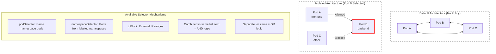

> **Complexity**: `[MEDIUM]` - Critical for cluster security; requires precise label selector reasoning and careful YAML indentation.
>
> **Time to Complete**: 60-75 minutes
>
> **Prerequisites**: Module 5.1 (Services), basic Kubernetes labels, namespaces, and pod-to-pod networking.

---

## Learning Outcomes

After completing this module, you will be able to:

- **Design** a default-deny NetworkPolicy posture that limits pod traffic to required application paths.
- **Implement** ingress and egress allow rules with pod selectors, namespace selectors, IP blocks, and ports.
- **Diagnose** blocked Service and DNS traffic by checking labels, policyTypes, CNI enforcement, and rule direction.
- **Evaluate** selector AND/OR logic and CNI support before shipping NetworkPolicies in a Kubernetes v1.35+ cluster.

## Why This Module Matters

Hypothetical scenario: your team deploys a three-tier application into a shared cluster. The frontend is reachable through an Ingress controller, the backend exposes an internal API, and the database listens only inside the namespace. A vulnerability in the frontend should not automatically give an attacker a direct network path to the backend, the database, CoreDNS, and every other workload in the cluster, but the default Kubernetes network model starts closer to that risky shape than many beginners expect.

Kubernetes assumes that every pod can reach every other pod unless something in the data plane enforces a boundary. That flat model is convenient while you are learning Services because names resolve, traffic flows, and examples work without extra objects. The same convenience becomes a liability in production because a compromised pod can scan neighboring namespaces, call internal APIs, or send data to arbitrary external destinations unless the cluster has policy enforcement.

NetworkPolicies are the standard Kubernetes API for declaring those boundaries. They do not replace authentication, authorization, TLS, Pod Security Admission, or application-level authorization, but they add a practical network layer control that narrows the blast radius when one workload misbehaves. In this module you will build a default-deny posture, carve explicit allow paths, test the results with `kubectl`, and learn the selector details that most often cause CKAD mistakes and real operational outages.

## How NetworkPolicy Isolation Works

The first mental model to build is that a NetworkPolicy is not a firewall appliance sitting at the edge of the cluster. It is a namespaced Kubernetes object that selects pods and describes which traffic those selected pods may accept or initiate. The Kubernetes API server stores the object, but the actual packet decision is performed by the cluster networking implementation, usually a CNI plugin such as Calico, Cilium, Antrea, or another provider with NetworkPolicy support.

Without a policy, pods are non-isolated for the relevant traffic direction. That means an API pod can accept connections from a web pod in the same namespace, a job in another namespace, or a debug pod created by an operator, as long as routing and Services lead the packet there. A NetworkPolicy changes that behavior only for the pods selected by its top-level `spec.podSelector`, and only for the directions listed in `spec.policyTypes`.

Once a pod is selected by an ingress policy, incoming traffic to that pod becomes isolated. The pod no longer accepts every source; it accepts only traffic allowed by the union of all ingress rules across all policies that select it. Once a pod is selected by an egress policy, outgoing traffic from that pod becomes isolated in the same additive way. Policies never say "deny this one source"; they create a baseline of isolation and then describe the allowed exceptions.

For a new connection between two pods, think about two independent questions. Does the source pod have egress isolation, and if so, does some egress rule allow the destination and port? Does the destination pod have ingress isolation, and if so, does some ingress rule allow the source and port? A connection needs the relevant allowed path on both isolated sides, while reply packets for an allowed connection are normally handled by the network implementation as part of that connection state.

This directional model explains why a Service can resolve correctly while traffic still fails. DNS and Service discovery only tell the client where to send the packet; they do not prove the source is allowed to send or the destination is allowed to receive. A healthy EndpointSlice, a correct Service selector, and a ready pod can coexist with a policy drop, so policy debugging must include both Kubernetes object state and actual connectivity tests.

Think about a secure office floor with badge readers on individual rooms. An unlocked room stays open until a reader is installed on its door. After the reader is installed, people can enter only when some rule grants their badge access, and adding a second rule can only allow more people, not subtract people already allowed by another rule. NetworkPolicies follow that same additive pattern, so debugging often means finding which pods are isolated and which allow rule, if any, matches the packet.

The diagram below preserves the core shift from the original lesson. The left side is the default pod network, where every pod can talk to every other pod. The right side shows a backend pod selected by policy, so the frontend path is allowed while an unrelated source is dropped by the enforcing CNI.



A NetworkPolicy is ordinary YAML, but a few fields carry almost all of the meaning. The `metadata.namespace` decides where the policy object lives, and the top-level `spec.podSelector` decides which pods inside that same namespace become governed by the policy. The `policyTypes` field declares whether the policy affects ingress, egress, or both, while the `ingress` and `egress` arrays contain the allowed peers and ports for each direction.

```yaml
apiVersion: networking.k8s.io/v1
kind: NetworkPolicy
metadata:
  name: my-policy
  namespace: default
spec:
  podSelector:           # Which pods this policy applies to
    matchLabels:
      app: my-app
  policyTypes:           # What traffic types to control
  - Ingress              # Incoming traffic
  - Egress               # Outgoing traffic
  ingress:               # Rules for incoming traffic
  - from:
    - podSelector:
        matchLabels:
          role: frontend
  egress:                # Rules for outgoing traffic
  - to:
    - podSelector:
        matchLabels:
          role: database
```

The top-level `podSelector` is easy to underestimate because it looks like a small block near the top of the file. If it matches no pods, the policy is harmless because nothing is isolated. If it is empty as `podSelector: {}`, it selects every pod in the policy namespace, which is powerful for default-deny baselines and dangerous when pasted into the wrong namespace. If it matches a broad label such as `app: web`, every replica with that label is governed together.

The selector also follows pods as they are replaced. A Deployment rollout creates new pods with the template labels, and the policy applies to those new pods automatically when the labels match. That is one reason policies should use stable role labels such as `tier: backend` or `app.kubernetes.io/component: api` rather than labels that change with versions, hashes, or one-off debugging sessions.

The `policyTypes` list is worth writing explicitly even when Kubernetes could infer the direction. If `ingress` rules appear and `policyTypes` is omitted, Kubernetes treats it as an ingress policy. If `egress` rules appear, egress is included too. That inference is legal, but it hides intent from reviewers and from your future self during an outage, so production manifests should declare the directions directly.

Ports are evaluated in the context of the traffic that reaches the pod, not in the context of your mental diagram. A policy port can be numeric or can reference a named container port, which is useful when many manifests share a stable name such as `http`. Named ports reduce duplication, but they also depend on container specs being consistent, so they should be used as a deliberate convention rather than as a way to avoid checking the real listener.

Ingress rules describe who may start a connection to the selected pods. In the preserved example below, pods labeled `app: backend` become isolated for incoming traffic, and only pods labeled `app: frontend` in the same namespace can reach TCP port 8080. A packet from a pod with a different label times out because no ingress allow rule matches it.

```yaml
spec:
  podSelector:
    matchLabels:
      app: backend
  policyTypes:
  - Ingress
  ingress:
  - from:
    - podSelector:
        matchLabels:
          app: frontend
    ports:
    - protocol: TCP
      port: 8080
```

Egress rules describe where the selected pods may start connections. In the preserved example below, frontend pods become isolated for outgoing traffic, and their only allowed destination is a backend pod on TCP port 8080. That means calls to a database, an external API, package repositories, and even DNS all fail unless another egress rule allows those paths.

```yaml
spec:
  podSelector:
    matchLabels:
      app: frontend
  policyTypes:
  - Egress
  egress:
  - to:
    - podSelector:
        matchLabels:
          app: backend
    ports:
    - protocol: TCP
      port: 8080
```

Pause and predict: if a backend pod is selected by two ingress policies, one allowing frontend pods on port 8080 and another allowing monitoring pods on port 9090, what happens to traffic from each source? The correct prediction is that both paths are allowed because NetworkPolicies are additive. There is no priority order where the later policy overrides the earlier one, and there is no implicit deny rule inside one policy that cancels another policy.

Additive behavior also means removal has to be reviewed carefully. Deleting one policy might not close a path if another policy still allows the same source, destination, and port. During incident response, operators sometimes remove the newest policy and expect a block to disappear or appear immediately, but the union of all matching policies is what matters. The reliable workflow is to list every policy selecting the affected pod before deciding which rule is responsible.

The most important operational consequence is that you debug policy behavior from the selected pod outward. Ask whether the destination is isolated for ingress, whether the source is isolated for egress, whether the port matches the real container port, and whether the CNI plugin actually enforces NetworkPolicies. If either direction has no matching allow path, the packet can be dropped even though the Service, Endpoints, and DNS name all look correct.

## Designing Default-Deny Baselines

A default-deny policy is not a special Kubernetes object. It is a normal NetworkPolicy whose top-level `podSelector` selects many pods and whose rule list permits no peers for a direction. This pattern matters because NetworkPolicies cannot express explicit deny rules; the way to block unwanted traffic is to isolate the selected pods first, then add narrow allow rules for the communication paths the application genuinely needs.

The smallest useful baseline is default-deny ingress. It protects selected pods from receiving unexpected connections while still allowing those pods to call out. In a shared namespace, this immediately stops a random debug pod from curling an internal backend unless a separate policy opens that path. It is a common first step because it reduces lateral movement without breaking DNS or external egress.

Ingress default-deny is also the easiest baseline to explain to application owners. You can say, "your workload will receive only the callers listed in policy, but its existing outbound dependencies are unchanged." That scope makes the first rollout less disruptive, and it gives teams a concrete dependency map for inbound paths before they tackle outbound restrictions. In mature environments, ingress baselines often become part of namespace creation.

```yaml
apiVersion: networking.k8s.io/v1
kind: NetworkPolicy
metadata:
  name: default-deny-ingress
spec:
  podSelector: {}          # Empty = select all pods
  policyTypes:
  - Ingress
  # No ingress rules = deny all
```

Default-deny egress is stricter because it controls every outbound packet from the selected pods. That is useful for preventing data exfiltration and surprise internet access, but it is also where teams most often break their own applications. A pod that cannot send DNS queries cannot resolve Service names, and a pod that cannot reach the API, metrics endpoint, database, or identity provider might fail in ways that look unrelated to networking at first glance.

Egress default-deny is most successful when paired with dependency discovery. Logs, service meshes, DNS query records, and existing firewall rules can reveal destinations that the application depends on, but none of those signals is perfect. Treat the first policy as a hypothesis, run it in a staging namespace, and test startup, readiness, normal requests, background jobs, and shutdown hooks before applying the same isolation to production.

```yaml
apiVersion: networking.k8s.io/v1
kind: NetworkPolicy
metadata:
  name: default-deny-egress
spec:
  podSelector: {}
  policyTypes:
  - Egress
  # No egress rules = deny all
```

A complete default-deny baseline isolates both directions. This is the right starting point for sensitive namespaces when you have time to model the required flows, but it is a poor surprise change for a busy production namespace. Before applying it, inventory callers, called Services, DNS needs, monitoring, health checks, and any controller or sidecar communication that the workload depends on.

Complete isolation is strongest when the namespace has a clear owner. If many unrelated applications share one namespace, an empty selector baseline can turn every small change into a coordination problem. Splitting workloads into namespaces by team, application, or sensitivity often makes NetworkPolicy easier, because the default-deny object then describes a boundary that people already understand operationally.

```yaml
apiVersion: networking.k8s.io/v1
kind: NetworkPolicy
metadata:
  name: default-deny-all
spec:
  podSelector: {}
  policyTypes:
  - Ingress
  - Egress
```

The empty rule object has the opposite meaning from an empty rule list, which is why reviewers should slow down when they see `{}` in a policy. A policy with `ingress: []` allows no ingress for the selected pods. A policy with `ingress: - {}` allows all ingress because the single rule has no source or port restriction. Those two tiny shapes look similar, but they are completely different security postures.

```yaml
apiVersion: networking.k8s.io/v1
kind: NetworkPolicy
metadata:
  name: allow-all-ingress
spec:
  podSelector: {}
  policyTypes:
  - Ingress
  ingress:
  - {}                     # Empty rule = allow all
```

DNS deserves its own carve-out because almost every Kubernetes workload relies on it even when the application owner never mentions DNS in a dependency diagram. Service names such as `backend`, `backend.netpol-demo`, and fully qualified names under `svc.cluster.local` all require a query to CoreDNS. If you apply default-deny egress and forget DNS, the symptom often appears as application timeouts rather than an obvious policy error.

The DNS policy itself should be checked against the labels in your cluster. Many clusters label CoreDNS pods with `k8s-app: kube-dns`, but distributions can add their own labels or run DNS through a different add-on shape. The habit to build is not memorizing one label forever; the habit is inspecting the DNS pods and writing a policy that selects the actual DNS implementation in front of you.

```yaml
apiVersion: networking.k8s.io/v1
kind: NetworkPolicy
metadata:
  name: allow-dns
spec:
  podSelector: {}
  policyTypes:
  - Egress
  egress:
  - to:
    - namespaceSelector: {}
      podSelector:
        matchLabels:
          k8s-app: kube-dns
    ports:
    - protocol: UDP
      port: 53
```

Before running this, what output do you expect from a pod that can reach a Service by ClusterIP but not by DNS name? The likely answer is that direct IP traffic succeeds while name-based traffic fails or times out during resolution. That distinction narrows the investigation to egress rules for DNS, CoreDNS health, and whether the CNI supports cross-namespace selection to the `kube-system` DNS pods.

Default-deny is best introduced in stages. Start with a test namespace that mirrors production labels, apply default-deny ingress, add the minimum allow paths, and run connectivity checks from both allowed and disallowed pods. Then decide whether egress isolation is justified for the workload and whether you can maintain the dependency inventory as the application changes.

A final rollout detail is ownership. A platform team can provide baseline policies, but application teams usually know the required paths best. The cleanest operating model is a shared template for default-deny plus application-owned allow rules reviewed with the same discipline as RBAC changes. NetworkPolicy is security-sensitive configuration, and treating it as application code makes drift easier to catch.

## Writing Selectors Without Changing the Logic

Most NetworkPolicy errors are not caused by the API being complicated. They are caused by selector scope and YAML list shape. A `podSelector` inside a rule does not search the whole cluster by itself; it selects pods in the namespace of the NetworkPolicy unless it is combined with a `namespaceSelector`. A `namespaceSelector` selects namespaces by labels attached to the Namespace objects, not by names typed into the YAML.

There are two different `podSelector` locations in a policy, and they answer different questions. The top-level `spec.podSelector` answers "which local pods does this policy protect or restrict?" A peer `podSelector` inside `from` or `to` answers "which peer pods are allowed for this rule?" Mixing those two roles leads to policies that select the wrong workload or allow the wrong callers.

When a rule contains only a `podSelector`, it selects peer pods in the same namespace as the policy. That is perfect for tier-to-tier traffic inside one application namespace, and it is exactly why the three-tier examples later stay compact. It does not help when the caller lives in a different namespace, even if the caller has the matching pod label.

```yaml
ingress:
- from:
  - podSelector:
      matchLabels:
        role: frontend
```

When a rule contains only a `namespaceSelector`, it allows traffic from all pods in namespaces whose Namespace object carries the selected labels. This is useful for broad trust boundaries such as "allow from namespaces labeled `team: platform`" or "allow from namespaces labeled `env: production`." It is also broad enough to surprise you if somebody labels a namespace without understanding the network effect.

```yaml
ingress:
- from:
  - namespaceSelector:
      matchLabels:
        env: production
```

The Namespace object must have the label for that selector to work. A namespace named `production` does not automatically match `env: production`; those are different facts. Kubernetes v1.35 and newer clusters automatically add the stable `kubernetes.io/metadata.name` label to namespaces, which can be useful when you need to select by namespace name, but team-owned labels are often clearer for policy intent.

Namespace labels deserve governance because they can grant network access. If any developer can add `env: production` or `network-access: trusted` to a namespace, then a selector based on that label is only as strong as the label permission model. In regulated clusters, namespace labels used by NetworkPolicy should be owned by platform automation or reviewed changes, not by ad hoc manual edits.

Pause and predict: look at the next two YAML blocks before reading their descriptions. The selectors are the same, but the dash placement changes the logic. If you can explain the difference without running the policy, you have learned the NetworkPolicy skill that prevents a large share of real mistakes.

When `namespaceSelector` and `podSelector` appear in the same list item, they are combined with logical AND. The source pod must have the selected pod label, and it must live in a namespace selected by the namespace label. This is the narrow cross-namespace rule you usually want when allowing a specific role from a specific trusted namespace group.

```yaml
ingress:
- from:
  - namespaceSelector:
      matchLabels:
        env: production
    podSelector:           # Same list item = AND
      matchLabels:
        role: frontend
```

When the two selectors appear as separate list items, they are combined with logical OR. The first item allows any pod from production-labeled namespaces, while the second item allows any local-namespace pod labeled `role: frontend`. That can be correct, but it is much broader than the combined rule, and it is often created by an indentation mistake rather than by design.

```yaml
ingress:
- from:
  - namespaceSelector:     # First item
      matchLabels:
        env: production
  - podSelector:           # Second item = OR
      matchLabels:
        role: frontend
```

Use `ipBlock` when the peer is outside the pod and namespace label universe. It is common for egress rules that allow a workload to reach an external service range, and it can also appear on ingress when the source is known by CIDR. The `except` list subtracts smaller ranges from the larger block, which gives you an allow-most shape without an explicit deny rule.

The `except` field is often the closest native shape to "allow this range except that range." It still works through allow semantics: packets to the excluded range simply fail to match the allow rule, so they remain blocked by the surrounding default-deny posture. If another policy allows the excluded range, however, the traffic may still pass because the union of policies remains additive.

```yaml
ingress:
- from:
  - ipBlock:
      cidr: 10.0.0.0/8
      except:
      - 10.0.1.0/24
```

Be careful with `ipBlock` around cluster traffic. The Kubernetes documentation notes that NetworkPolicy behavior for source or destination IP rewriting can depend on the network plugin, cloud provider, and Service implementation. In practice, use pod and namespace selectors for in-cluster workload identity whenever possible, then reserve CIDRs for external peers or for cases where your CNI documentation confirms the exact packet addresses being evaluated.

The selector design rule is simple but strict: choose the smallest identity that remains maintainable. Use pod labels for same-namespace application tiers, combine namespace and pod selectors for cross-namespace application paths, use namespace selectors alone only when every pod in that namespace set is trusted for the path, and use IP blocks when the peer cannot be selected by Kubernetes labels. The policy should explain the trust boundary by its shape.

When you review a selector, translate it into a plain-language sentence and look for words such as "any" and "all." "Any pod in any trusted namespace" might be acceptable for an ingress controller, but it is usually too broad for a database. "Frontend pods in production namespaces" is narrower and easier to test. If the sentence sounds broader than the requirement, the YAML is probably broader too.

## Securing a Three-Tier Application

The three-tier application is the worked example because it makes both directions visible. The frontend accepts user traffic and calls the backend. The backend accepts calls only from the frontend and calls the database. The database accepts calls only from the backend. This is small enough to fit in a CKAD exercise, but it mirrors the dependency reasoning you use in production.

Write the dependency as a matrix before writing YAML. Rows can represent sources, columns can represent destinations, and each cell can list the destination port that should be reachable. That quick sketch exposes missing paths such as DNS, monitoring, and readiness checks before you encode policies. It also gives reviewers a neutral artifact to compare against the manifests.

The frontend policy below selects pods labeled `tier: frontend`. It allows all ingress because the frontend is the public entry point in this simplified model, then limits egress to backend pods on port 8080. In a production cluster you might narrow ingress to an Ingress controller namespace instead of `- {}`, but the preserved example keeps the original module's shape for learning the mechanics.

The frontend is also where architecture and policy can disagree. Many real frontends are not directly contacted by users; they are contacted by controller pods, load balancer health checks, or service mesh sidecars. If that is your environment, replace the allow-all ingress shape with explicit peers that represent the actual source of packets in the cluster, then keep the broad version only as a temporary lab simplification.

```yaml
# Frontend: can receive from anywhere, can reach backend
apiVersion: networking.k8s.io/v1
kind: NetworkPolicy
metadata:
  name: frontend-policy
spec:
  podSelector:
    matchLabels:
      tier: frontend
  policyTypes:
  - Ingress
  - Egress
  ingress:
  - {}                     # Allow all ingress
  egress:
  - to:
    - podSelector:
        matchLabels:
          tier: backend
    ports:
    - port: 8080
```

The backend policy selects pods labeled `tier: backend`, accepts only frontend traffic on port 8080, and allows outbound traffic only to database pods on port 5432. This is where NetworkPolicy becomes more than a perimeter tool. Even if a random pod in the namespace can resolve the backend Service, the backend will not accept its packet unless the source label matches an allow rule.

Backend egress can be more complex than the simplified example because APIs often call caches, message brokers, observability collectors, and identity services. Do not hide those paths behind one broad egress rule if the goal is containment. Add the required destinations deliberately, and keep the dependency list close to the policy so future reviewers know why each path exists.

```yaml
# Backend: only from frontend, can reach database
apiVersion: networking.k8s.io/v1
kind: NetworkPolicy
metadata:
  name: backend-policy
spec:
  podSelector:
    matchLabels:
      tier: backend
  policyTypes:
  - Ingress
  - Egress
  ingress:
  - from:
    - podSelector:
        matchLabels:
          tier: frontend
    ports:
    - port: 8080
  egress:
  - to:
    - podSelector:
        matchLabels:
          tier: database
    ports:
    - port: 5432
```

The database policy selects pods labeled `tier: database` and allows only backend pods to connect on port 5432. Notice that this policy lists only `Ingress`. That means it isolates incoming traffic to the database, but it does not isolate database egress unless another policy selects the database pods for egress. This is intentional in the preserved example, and it is a useful reminder that each direction is controlled independently.

```yaml
# Database: only from backend
apiVersion: networking.k8s.io/v1
kind: NetworkPolicy
metadata:
  name: database-policy
spec:
  podSelector:
    matchLabels:
      tier: database
  policyTypes:
  - Ingress
  ingress:
  - from:
    - podSelector:
        matchLabels:
          tier: backend
    ports:
    - port: 5432
```

The three policies work only if the labels match the pods that the Services ultimately route to. A Service selector might point at pods labeled `app: backend`, while the NetworkPolicy expects `tier: backend`; that mismatch produces confusing symptoms because the Service still has endpoints, but the policy selected a different set of pods or peers than intended. Always verify the labels on live pods, not just the labels in your deployment template.

A second label risk appears during migrations. If you relabel pods from `tier: backend` to `component: api` but forget to update policies, new pods may start outside the intended allow paths or outside the intended isolation boundary. Safe migrations either keep both labels temporarily or update policy and workload templates in a coordinated change with connectivity tests on both old and new labels.

Which approach would you choose here and why: one large policy that selects all tiers, or separate policies per tier? Separate policies are usually easier to review because each file describes one workload's inbound and outbound contract. A larger consolidated policy can be compact for an exam, but in a real repository it often hides accidental broadening when one tier's exception is edited for another tier's need.

This example also shows why ports matter. NetworkPolicy ports are evaluated at the network layer, so the policy must match the actual destination port reached by the packet. A Service `targetPort` can translate a Service port to a container port, and policy behavior depends on the packet seen by the data plane rather than on the friendly Service abstraction in your application diagram.

For multi-port workloads, avoid copying one port rule across every tier without checking each listener. A pod might expose HTTP for application traffic, a metrics port for scraping, and a management port that should never be reachable from normal clients. NetworkPolicy lets you model those paths separately, but only if the dependency inventory names them separately instead of treating the pod as one undifferentiated endpoint.

## Testing and Troubleshooting Policy Behavior

NetworkPolicies fail closed only for pods that are actually isolated, so good troubleshooting starts by confirming selection. Use `kubectl get pods --show-labels` to inspect the selected pods, then describe the NetworkPolicy to see the rendered peers and ports. If the policy selects no pods, the object can look correct in the API while doing nothing useful in the data plane.

After selection, inspect direction. A common debugging mistake is reading only policies in the destination namespace because the symptom appears as an inbound timeout. If the source namespace has default-deny egress, the source can drop the packet before it ever reaches the destination. In clusters with both ingress and egress isolation, you need to read policies on both sides of the connection.

The preserved CLI reference below uses full `kubectl` commands so it can be copied into a non-interactive shell or a study script. The commands cover the workflow you use in the CKAD exam: create the policy from YAML, list the resource, describe it, test connectivity, and check whether a known policy-capable CNI appears in the system namespace.

```bash
# Create NetworkPolicy (must use YAML)
kubectl apply -f policy.yaml

# View NetworkPolicies
kubectl get networkpolicy
kubectl get netpol

# Describe policy to see translated rules
kubectl describe netpol NAME

# Test connectivity aggressively using netshoot or wget
kubectl exec pod1 -- wget -qO- --timeout=2 pod2-svc:80

# Check if CNI supports NetworkPolicies (look for calico, cilium)
kubectl get pods -n kube-system | grep -E 'calico|cilium|weave'
```

When a connection times out, check both sides of the conversation. The destination pod might be ingress-isolated and missing a matching `from` rule. The source pod might be egress-isolated and missing a matching `to` rule. In many secure namespaces both statements are true, so fixing only one policy still leaves the connection blocked.

Use deliberately chosen test pods. Testing from an existing application pod can be useful, but a controlled debug pod with known labels makes selector reasoning clearer. Create one pod that should match the allow rule and one pod that should not, then test from both. That pattern catches accidental broad rules that a single successful test would miss.

DNS symptoms deserve a specific test because they masquerade as application failures. Run one check against a Service name and another against a known ClusterIP or pod IP when safe in a lab environment. If the IP path works but the name path fails, inspect egress rules to CoreDNS, CoreDNS pod labels, and whether the policy's namespace selector can actually select the DNS namespace.

CNI logs and observability can shorten the investigation when command-line tests are ambiguous. Some providers expose flow logs, policy verdicts, or packet drops that identify the rule decision. Those tools are provider-specific, so they are not part of the CKAD core workflow, but knowing they exist helps you move from "it timed out" to "this egress rule did not match" in production.

CNI enforcement is the other major branch in the troubleshooting tree. Kubernetes accepts NetworkPolicy objects even when the installed network plugin does not enforce them. If a policy appears in `kubectl get netpol` but disallowed traffic still succeeds, verify the cluster's CNI capabilities before rewriting the YAML, because the problem might be the absence of enforcement rather than a selector mistake.

Provider behavior also matters around node-local traffic, host-network pods, and load balancer source addresses. The Kubernetes API defines the portable policy model, but the packet addresses seen before or after Network Address Translation can differ by implementation. When a policy depends on external CIDRs, node IPs, or controller pods, confirm the relevant behavior in the provider documentation and with a small test.

Finally, remember that a timeout is a useful signal. NetworkPolicies usually drop packets rather than returning a friendly application error, so `wget` or `curl` may hang until their timeout expires. Use short timeouts in practice commands, run both positive and negative tests, and record the expected result for each path so you know whether you are proving the allow rule or proving the deny baseline.

The best troubleshooting notes are written before the incident. For each namespace, keep a short list of expected communication paths and the policy file that owns each path. During an outage, that list tells you whether a missing connection is supposed to be impossible, accidentally broken, or outside the policy scope entirely. It also makes later cleanup safer because you can remove obsolete allow rules with evidence.

## Patterns & Anti-Patterns

Patterns are useful only when they encode a decision that changes how you build the policy. The table below focuses on repeatable shapes that keep policy files maintainable as teams add namespaces, Services, and application tiers. Each pattern preserves least privilege while avoiding the trap of one giant rule that nobody wants to review.

| Pattern | When to Use It | Why It Works |
|---------|----------------|--------------|
| Namespace default-deny plus tier allow rules | A team owns an application namespace and can map required caller-to-callee paths. | The default-deny policy creates isolation, while small tier policies document each application contract. |
| Namespace selector plus pod selector in one item | A workload must accept traffic from one role in selected remote namespaces. | The AND logic keeps the rule narrow by requiring both the namespace trust label and the pod role label. |
| DNS egress allow paired with default-deny egress | A namespace needs outbound isolation but workloads still use Service names. | The DNS exception preserves Kubernetes service discovery while other egress remains controlled. |
| Positive and negative connectivity tests | A policy change has security impact and must be verified before merge. | The allowed test proves the required path works, and the denied test proves the boundary actually exists. |

Anti-patterns usually arise from trying to make a policy pass quickly without modeling the dependency. The better alternative is rarely more YAML for its own sake. It is sharper scoping, clearer labels, and tests that prove the policy allows only what the workload requires.

| Anti-Pattern | What Goes Wrong | Better Alternative |
|--------------|-----------------|--------------------|
| Selecting every namespace with `namespaceSelector: {}` for application traffic | Any namespace can become a source if the pod selector also matches or if no pod selector is present. | Label trusted namespaces deliberately and combine the namespace selector with a pod selector when possible. |
| Using `ingress: - {}` as a temporary fix | The selected pods are opened to every source for that direction, and the exception often stays. | Add a narrow source and port rule, then test the one path that must work. |
| Applying egress default-deny without dependency inventory | DNS, external APIs, metrics, or identity calls fail in ways that look like application defects. | List required outbound paths first, apply the baseline in a lab, and add explicit DNS and service rules. |
| Assuming `kubectl get netpol` proves enforcement | The API object exists even if the CNI ignores NetworkPolicies. | Confirm provider support and run a negative connectivity test from a pod that should be blocked. |

These patterns also shape code review. A reviewer should be able to answer four questions from the manifest alone: which pods become isolated, which sources or destinations are allowed, which ports are allowed, and which labels must remain stable for the rule to work. If the reviewer needs tribal knowledge to answer those questions, the policy probably needs clearer labels or smaller files.

A mature policy repository usually adds ownership metadata outside the NetworkPolicy object itself, such as CODEOWNERS, review rules, or deployment pipeline checks. Kubernetes will not tell you whether `team: platform` is the right label for a namespace or whether a database exception is still needed. Human process fills that gap, and small policy files make the human review more accurate.

## Decision Framework

Use this framework when you are asked to secure a new namespace or debug a policy failure. Start with the workload dependency, not with YAML. The policy object should be the last step in a reasoning chain that begins with who calls whom, which direction the connection starts, which port receives the packet, and which labels represent that identity reliably.

| Question | Choose This | Tradeoff |
|----------|-------------|----------|
| Do you only need to restrict callers to selected pods? | Start with default-deny ingress and add `from` rules. | Safer rollout because pod egress remains open, but exfiltration paths are not controlled. |
| Do selected pods also need outbound restrictions? | Add default-deny egress and explicit `to` rules. | Stronger containment, but DNS and external dependencies must be modeled carefully. |
| Are caller and callee in the same namespace? | Use `podSelector` peers for the application roles. | Simple and readable, but it does not cover cross-namespace callers. |
| Are callers in another namespace? | Combine `namespaceSelector` and `podSelector` in the same peer item. | Narrow identity, but it requires reliable namespace labels and pod labels. |
| Is the peer outside Kubernetes labels? | Use `ipBlock` with CIDR and `except` when needed. | Useful for external ranges, but Service IP rewriting can make in-cluster cases provider-specific. |
| Does the cluster enforce the object? | Verify the CNI and run a negative test. | Prevents false confidence, but it requires access to cluster implementation details. |

For CKAD speed, reduce the decision to a sequence you can run under pressure. First, decide whether the selected pod is the destination or the source. Second, write the top-level `podSelector` for that selected pod. Third, choose `Ingress`, `Egress`, or both. Fourth, add only the peer and port needed for the scenario. Fifth, test from one pod that should work and one pod that should fail.

For production quality, add two review questions that the exam does not ask. What happens when labels change during a deployment, and who owns the labels on namespaces used by `namespaceSelector`? NetworkPolicy is label-driven, so a deployment pipeline that mutates labels without policy review can accidentally disconnect applications or open traffic that the security design never approved.

The framework is intentionally conservative. It favors small policies that can be reasoned about locally, even when a larger policy could be shorter. Kubernetes will combine the allow rules for you, so you do not gain much by hiding every tier in one manifest unless your team has a strong convention and tests around that shape.

When the framework produces a policy that feels repetitive, resist the urge to generalize too early. Repetition in policy files is sometimes useful because each repeated rule is attached to a different trust boundary. Abstract only when your tooling can preserve review clarity, such as generating manifests from a dependency matrix that is easier to audit than the raw YAML.

## Did You Know?

1. Kubernetes NetworkPolicy manifests use `apiVersion: networking.k8s.io/v1`; the older `extensions/v1beta1` NetworkPolicy API stopped being served in Kubernetes v1.16.
2. The official getting-started task for NetworkPolicy requires a Kubernetes server at v1.8 or later, which is far older than the v1.35+ target used in this curriculum.
3. A top-level `podSelector: {}` selects every pod in the NetworkPolicy namespace, while a peer `podSelector` without a namespace selector searches only that policy's namespace.
4. NetworkPolicy controls Layer 3 and Layer 4 connectivity; it does not encrypt allowed traffic or make authorization decisions inside your application protocol.

## Common Mistakes

| Mistake | Why It Happens | How to Fix It |
|---------|----------------|---------------|
| CNI does not support NetworkPolicies | The API accepts the object, so the team assumes enforcement exists even when the data plane ignores it. | Verify the installed CNI supports NetworkPolicy and run a negative connectivity test that must fail. |
| DNS omitted from default-deny egress | Service names depend on CoreDNS, and egress isolation drops DNS packets unless an allow rule exists. | Add a DNS egress policy to the CoreDNS pods and test a Service name after applying the baseline. |
| AND and OR selector logic confused | Moving a dash changes whether namespace and pod selectors must both match or either may match. | Keep combined selectors in the same peer item for AND logic, and review indentation before applying. |
| Empty `podSelector` copied blindly | `podSelector: {}` selects every pod in the namespace, not zero pods or a placeholder. | Use explicit labels for workload policies and reserve `{}` for deliberate namespace-wide baselines. |
| `policyTypes` omitted | Kubernetes inference may be legal, but reviewers cannot quickly see which direction is intended. | Declare `Ingress`, `Egress`, or both every time, even when the API could infer it. |
| Service port confused with actual packet port | The manifest is written from the Service abstraction rather than the traffic reaching the pod. | Confirm the destination port seen by the workload and align the NetworkPolicy port with that path. |
| NetworkPolicy treated as encryption | Allowed traffic still moves as normal network traffic unless another layer encrypts it. | Use NetworkPolicy for reachability control and use TLS, mTLS, or a service mesh when encryption is required. |
| Ingress controller namespace forgotten | External traffic arrives from controller pods, not magically from the internet into the application pod. | Allow the controller namespace and pod labels, or model the exact ingress path your controller uses. |

## Quiz

<details>
<summary>1. Your team applies default-deny ingress to `production`, and frontend pods can no longer reach backend pods in the same namespace. Both sets of pods have correct labels. What policy change restores only that path?</summary>

**Answer:** Create a second NetworkPolicy that selects the backend pods and allows ingress from pods labeled as the frontend on the backend port. The default-deny policy should stay in place because it creates the baseline isolation. NetworkPolicies are additive, so the new allow policy opens the frontend-to-backend path without opening traffic from every other pod. If the frontend pods also have egress isolation, you must add the matching egress allow rule from the frontend side as well.
</details>

<details>
<summary>2. A policy has one peer item containing both `namespaceSelector: matchLabels: env: staging` and `podSelector: matchLabels: role: api`. Which pods are allowed, and why?</summary>

**Answer:** Only pods labeled `role: api` in namespaces labeled `env: staging` are allowed because both selectors are in the same peer item. That YAML shape is AND logic. If the two selectors were split into separate peer items, the rule would become broader OR logic and would allow any pod from staging namespaces or local pods with the API role label. The distinction matters because a single misplaced dash can open an entire namespace group.
</details>

<details>
<summary>3. After default-deny egress, applications can connect to a database by IP address but fail when using the database Service name. What do you check first?</summary>

**Answer:** Check whether egress to CoreDNS is allowed. The IP test bypasses DNS, while the Service name test requires a DNS query before the connection can start. A default-deny egress policy drops DNS packets unless a rule allows traffic to the DNS pods on port 53. You should verify the CoreDNS labels, the DNS namespace selection, and whether the source pod is selected by the egress policy.
</details>

<details>
<summary>4. You create a syntactically valid NetworkPolicy in a cluster using a basic CNI, but blocked traffic still succeeds. What is the most likely missing piece?</summary>

**Answer:** The CNI may not enforce Kubernetes NetworkPolicies. The API server can store the object and `kubectl get netpol` can show it even when the data plane does not apply the rules. Confirm the installed CNI and its NetworkPolicy support before rewriting selectors. A negative connectivity test from a pod that should be blocked is the practical proof that enforcement exists.
</details>

<details>
<summary>5. A reviewer sees `ingress: - {}` in a policy that selects database pods. The author says it is a default-deny rule. How do you respond?</summary>

**Answer:** `ingress: - {}` is not default-deny; it is an allow-all ingress rule for the selected pods. A default-deny ingress policy has `policyTypes: - Ingress` and no ingress allow rules. The empty rule object has no source or port restriction, so every source is allowed for that direction. The fix is to remove the allow-all rule and add a narrow `from` rule for the backend pods and database port.
</details>

<details>
<summary>6. A backend in namespace `payments` should accept traffic only from frontend pods in namespaces labeled `env: prod`. Which selector shape is safest?</summary>

**Answer:** Use a peer item that combines `namespaceSelector` for `env: prod` with `podSelector` for the frontend label. Keeping both selectors in the same item requires both namespace trust and pod role to match. A namespace selector alone would allow every pod in prod-labeled namespaces, and a pod selector alone would only match local pods in the policy namespace. The combined selector expresses the intended cross-namespace identity most precisely.
</details>

<details>
<summary>7. A policy allows egress from frontend pods to backend pods on port 8080, but the application still times out through a Service. What two areas should you inspect?</summary>

**Answer:** First, inspect the actual port path because the Service port and the destination container port may differ, and the policy must match the packet being enforced by the CNI. Second, inspect the ingress policy on the backend pods because egress from the frontend is only half of the connection. If the backend is ingress-isolated and does not allow the frontend source on the receiving port, the packet still drops. Verifying pod labels on both sides usually reveals whether the rule selected the intended peers.
</details>

## Hands-On Exercise

This exercise preserves the original staged lab while making the verification expectations explicit. You will deploy three pods, observe the default flat network, apply namespace isolation, carve a single allow path, and then run short drills that reinforce the YAML shapes. Use a cluster with a CNI that enforces NetworkPolicies; otherwise the policy objects will be accepted but the deny tests will not fail.

Run the lab slowly the first time and name the reason for every expected result. Before a command succeeds, say which policy allows it. Before a command fails, say which missing allow path blocks it. That habit turns the exercise from memorizing YAML into practicing the evaluation model you need during the exam and during production debugging.

### Task 1: Environment Setup

Create a clean namespace and deploy three labeled pods with Services. These commands use `nginx` for every tier because the point is network reachability, not application behavior. Wait for readiness before testing so that a failed connection means policy behavior instead of a pod startup race.

The labels in this setup are intentionally simple because they become the identities used by the policies. If you change the labels, update the later policy manifests at the same time. A surprising number of policy failures are caused by a lab or deployment using labels that differ from the labels copied into the NetworkPolicy examples.

```bash
# Create namespace
kubectl create ns netpol-demo

# Create pods
kubectl run frontend --image=nginx -n netpol-demo -l tier=frontend
kubectl run backend --image=nginx -n netpol-demo -l tier=backend
kubectl run database --image=nginx -n netpol-demo -l tier=database

# Wait for pods
kubectl wait --for=condition=Ready pod --all -n netpol-demo --timeout=60s

# Create services
kubectl expose pod frontend --port=80 -n netpol-demo
kubectl expose pod backend --port=80 -n netpol-demo
kubectl expose pod database --port=80 -n netpol-demo
```

<details>
<summary>Solution notes for Task 1</summary>

The namespace should contain three ready pods and three Services. If a pod does not become ready, inspect the pod before continuing because the later connectivity tests assume the workloads are healthy. If your cluster cannot pull the image, use another simple HTTP image that is already available in your environment.
</details>

### Task 2: Validate the Default Flat Network

Before adding policy, prove the starting state. The database reaching the frontend is intentionally undesirable, but it demonstrates the default behavior that NetworkPolicy will change. Record which calls succeed so you can compare them against the isolated state after applying the baseline.

This baseline step is not optional. If the default connection fails, you do not yet have a NetworkPolicy problem; you have a pod, Service, endpoint, DNS, or image problem. Fixing that first prevents you from blaming a policy that has not been applied and keeps the later timeout signals meaningful.

```bash
# All pods can reach all pods
kubectl exec -n netpol-demo frontend -- wget -qO- --timeout=2 backend:80
kubectl exec -n netpol-demo backend -- wget -qO- --timeout=2 database:80
kubectl exec -n netpol-demo database -- wget -qO- --timeout=2 frontend:80
# All should succeed
```

<details>
<summary>Solution notes for Task 2</summary>

All three requests should return HTML from nginx or otherwise exit successfully. If they fail before any policy exists, debug Services, endpoints, pod readiness, and DNS first. A NetworkPolicy lab is only meaningful after the baseline network path works.
</details>

### Task 3: Implement the Zero-Trust Boundary

Apply a default-deny ingress policy to every pod in the namespace. This isolates incoming traffic but does not restrict egress, which keeps the first policy change focused. After applying the manifest, retest a path that previously succeeded and expect a timeout when the CNI enforces policy.

If the timeout does not happen, pause instead of continuing. Check that the policy namespace is `netpol-demo`, the `podSelector` is empty as intended, and the CNI supports enforcement. Continuing to carve allow paths before the deny baseline works hides the most important failure in the lab.

```bash
cat << 'EOF' | kubectl apply -f -
apiVersion: networking.k8s.io/v1
kind: NetworkPolicy
metadata:
  name: default-deny
  namespace: netpol-demo
spec:
  podSelector: {}
  policyTypes:
  - Ingress
EOF

# Now test - all should fail (if CNI supports NetworkPolicies)
kubectl exec -n netpol-demo frontend -- wget -qO- --timeout=2 backend:80
# Should timeout
```

<details>
<summary>Solution notes for Task 3</summary>

The frontend-to-backend request should time out after the policy applies. If it still succeeds, first confirm that the policy exists in `netpol-demo`, then confirm the CNI supports NetworkPolicy enforcement. Do not assume the YAML is wrong until you have checked the data plane capability.
</details>

### Task 4: Carve the Allow Path

Restore only the frontend-to-backend path by selecting backend pods and allowing ingress from frontend pods on port 80. Then run one positive test and one negative test. A good policy proof includes both results because success alone does not prove that unwanted sources are blocked.

The negative test from the database pod is the security test. The positive frontend test proves you did not break the application path, while the database test proves the backend did not become broadly reachable. In real reviews, require both types of evidence whenever a policy claims to reduce access.

```bash
cat << 'EOF' | kubectl apply -f -
apiVersion: networking.k8s.io/v1
kind: NetworkPolicy
metadata:
  name: backend-allow-frontend
  namespace: netpol-demo
spec:
  podSelector:
    matchLabels:
      tier: backend
  policyTypes:
  - Ingress
  ingress:
  - from:
    - podSelector:
        matchLabels:
          tier: frontend
    ports:
    - port: 80
EOF

# Test
kubectl exec -n netpol-demo frontend -- wget -qO- --timeout=2 backend:80
# Should succeed

kubectl exec -n netpol-demo database -- wget -qO- --timeout=2 backend:80
# Should fail
```

<details>
<summary>Solution notes for Task 4</summary>

The frontend request should succeed because it matches the allowed source label and port. The database request should fail because the database pod is not labeled as the frontend. If both succeed, inspect labels and CNI enforcement; if both fail, inspect the backend pod labels and the policy namespace.
</details>

### Task 5: Clean Up

Delete the namespace when you finish the lab. Cleanup matters because leftover policies can confuse later practice sessions, especially when namespace names are reused across multiple drills.

```bash
kubectl delete ns netpol-demo
```

<details>
<summary>Solution notes for Task 5</summary>

The namespace deletion removes the pods, Services, and NetworkPolicies created in the exercise. If deletion hangs, inspect finalizers or wait for the cluster to finish terminating the namespace before reusing the same name.
</details>

### Success Criteria

- [ ] Design a default-deny NetworkPolicy posture that isolates the lab namespace.
- [ ] Implement ingress and egress allow rule shapes with pod selectors, namespace selectors, and IP blocks during the drills.
- [ ] Diagnose blocked Service and DNS traffic by comparing expected positive and negative connectivity results.
- [ ] Evaluate selector AND/OR logic before applying combined namespace and pod selector examples.
- [ ] Confirm CNI enforcement by observing at least one connection that should fail after policy is applied.

### Timed Practice Drills

The CKAD exam rewards fast, accurate YAML, but speed should come after the policy shapes are clear. Run these drills after the main lab, then use `kubectl describe netpol` to confirm the rule rendered the way you intended. The target times are study prompts, not production change windows.

#### Drill 1: Default Deny Ingress (Target: 2 minutes)

```bash
kubectl create ns drill1
kubectl run web --image=nginx -n drill1

cat << 'EOF' | kubectl apply -f -
apiVersion: networking.k8s.io/v1
kind: NetworkPolicy
metadata:
  name: deny-ingress
  namespace: drill1
spec:
  podSelector: {}
  policyTypes:
  - Ingress
EOF

kubectl get netpol -n drill1
kubectl delete ns drill1
```

#### Drill 2: Allow Specific Pod (Target: 3 minutes)

```bash
kubectl create ns drill2
kubectl run server --image=nginx -n drill2 -l role=server
kubectl run client --image=nginx -n drill2 -l role=client
kubectl expose pod server --port=80 -n drill2

cat << 'EOF' | kubectl apply -f -
apiVersion: networking.k8s.io/v1
kind: NetworkPolicy
metadata:
  name: allow-client
  namespace: drill2
spec:
  podSelector:
    matchLabels:
      role: server
  policyTypes:
  - Ingress
  ingress:
  - from:
    - podSelector:
        matchLabels:
          role: client
    ports:
    - port: 80
EOF

kubectl describe netpol allow-client -n drill2
kubectl delete ns drill2
```

#### Drill 3: Egress Policy (Target: 3 minutes)

```bash
kubectl create ns drill3
kubectl run app --image=nginx -n drill3 -l app=web
kubectl run db --image=nginx -n drill3 -l app=db
kubectl expose pod db --port=80 -n drill3

cat << 'EOF' | kubectl apply -f -
apiVersion: networking.k8s.io/v1
kind: NetworkPolicy
metadata:
  name: app-egress
  namespace: drill3
spec:
  podSelector:
    matchLabels:
      app: web
  policyTypes:
  - Egress
  egress:
  - to:
    - podSelector:
        matchLabels:
          app: db
    ports:
    - port: 80
EOF

kubectl get netpol -n drill3
kubectl delete ns drill3
```

#### Drill 4: Namespace Selector (Target: 3 minutes)

```bash
kubectl create ns drill4-source
kubectl create ns drill4-target
kubectl label ns drill4-source env=trusted

kubectl run target --image=nginx -n drill4-target -l app=target
kubectl expose pod target --port=80 -n drill4-target

cat << 'EOF' | kubectl apply -f -
apiVersion: networking.k8s.io/v1
kind: NetworkPolicy
metadata:
  name: from-trusted
  namespace: drill4-target
spec:
  podSelector:
    matchLabels:
      app: target
  policyTypes:
  - Ingress
  ingress:
  - from:
    - namespaceSelector:
        matchLabels:
          env: trusted
EOF

kubectl describe netpol from-trusted -n drill4-target
kubectl delete ns drill4-source drill4-target
```

#### Drill 5: Combined Selectors (AND) (Target: 3 minutes)

```bash
kubectl create ns drill5
kubectl label ns drill5 env=prod

kubectl run backend --image=nginx -n drill5 -l tier=backend
kubectl run frontend --image=nginx -n drill5 -l tier=frontend

cat << 'EOF' | kubectl apply -f -
apiVersion: networking.k8s.io/v1
kind: NetworkPolicy
metadata:
  name: combined-and
  namespace: drill5
spec:
  podSelector:
    matchLabels:
      tier: backend
  policyTypes:
  - Ingress
  ingress:
  - from:
    - namespaceSelector:
        matchLabels:
          env: prod
      podSelector:
        matchLabels:
          tier: frontend
EOF

kubectl describe netpol combined-and -n drill5
kubectl delete ns drill5
```

#### Drill 6: IP Block (Target: 3 minutes)

```bash
kubectl create ns drill6
kubectl run web --image=nginx -n drill6

cat << 'EOF' | kubectl apply -f -
apiVersion: networking.k8s.io/v1
kind: NetworkPolicy
metadata:
  name: ip-block
  namespace: drill6
spec:
  podSelector: {}
  policyTypes:
  - Ingress
  ingress:
  - from:
    - ipBlock:
        cidr: 10.0.0.0/8
        except:
        - 10.0.1.0/24
EOF

kubectl describe netpol ip-block -n drill6
kubectl delete ns drill6
```

## Sources

- [Kubernetes v1.35 Network Policies](https://v1-35.docs.kubernetes.io/docs/concepts/services-networking/network-policies/)
- [Kubernetes v1.35 NetworkPolicy API reference](https://v1-35.docs.kubernetes.io/docs/reference/kubernetes-api/policy-resources/network-policy-v1/)
- [Kubernetes Declare Network Policy task](https://v1-35.docs.kubernetes.io/docs/tasks/administer-cluster/declare-network-policy/)
- [Kubernetes Debugging DNS Resolution](https://v1-35.docs.kubernetes.io/docs/tasks/administer-cluster/dns-debugging-resolution/)
- [Kubernetes DNS for Services and Pods](https://v1-35.docs.kubernetes.io/docs/concepts/services-networking/dns-pod-service/)
- [Kubernetes Labels and Selectors](https://v1-35.docs.kubernetes.io/docs/concepts/overview/working-with-objects/labels/)
- [Kubernetes Namespaces](https://v1-35.docs.kubernetes.io/docs/concepts/overview/working-with-objects/namespaces/)
- [Calico Kubernetes NetworkPolicy documentation](https://docs.tigera.io/calico/latest/network-policy/get-started/kubernetes-policy/kubernetes-policy)
- [Cilium Kubernetes Network Policy documentation](https://docs.cilium.io/en/stable/network/kubernetes/policy/)
- [Amazon EKS CNI Network Policy](https://docs.aws.amazon.com/eks/latest/userguide/cni-network-policy.html)

## Next Module

Ready to put all these networking concepts to the test? Advance to the [Part 5 Cumulative Quiz](../part5-cumulative-quiz/) to challenge your mastery of Services, Ingress objects, and declarative NetworkPolicies.
