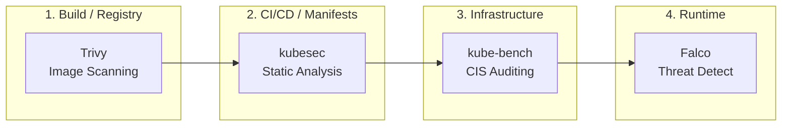
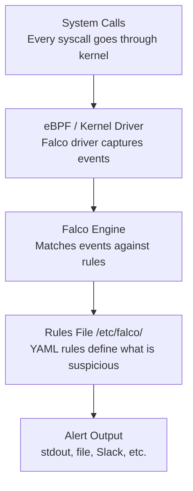

> **Complexity**: `[MEDIUM]` - Essential exam tools
>
> **Time to Complete**: 40-45 minutes
>
> **Prerequisites**: Module 0.2 (Security Lab Setup)

---

## What You'll Be Able to Do

After completing this module, you will be able to connect image scanning, runtime detection, benchmark auditing, and manifest review into one security workflow instead of treating them as separate commands.

1. **Evaluate** Trivy image scans and choose remediation thresholds for Kubernetes 1.35 workloads.
2. **Implement** Falco runtime rules and validate alerts for suspicious container activity.
3. **Audit** Kubernetes 1.35 cluster configuration with kube-bench and prioritize CIS remediation.
4. **Compare** kubesec manifest findings with runtime and infrastructure tool output to design a security triage workflow.

---

## Why This Module Matters

Exercise scenario: A release candidate is ready for a Kubernetes 1.35 cluster, but three different checks disagree about the risk. Trivy reports critical vulnerabilities in the image, kubesec dislikes the manifest, kube-bench flags a control-plane setting, and Falco is quiet because nothing suspicious has happened at runtime. A beginner might ask which tool is "right"; a CKS-ready operator asks what each tool is actually observing, what it cannot observe, and which remediation reduces the highest risk first.

That distinction matters because the tools in this module sit at different points in the security lifecycle. Trivy examines packages and known vulnerability data before the image runs. kubesec reads Kubernetes YAML before admission. kube-bench compares node and control-plane configuration to the CIS Kubernetes Benchmark. Falco watches system calls after a workload is already executing, so it can detect behavior that a static scanner could never prove from a manifest alone.

The exam does not reward memorizing tool names. It rewards the ability to read output under time pressure, change the right configuration, and verify that the change actually affected the layer where the risk exists. In practice, the same habit prevents noisy security programs: you avoid chasing every low-severity finding, avoid pretending a static check replaces runtime monitoring, and avoid treating a passed benchmark as proof that every workload is safe.

This module teaches a compact workflow you can use during practice labs and during real cluster reviews. You will scan an image, interpret severity and fixed-version fields, deploy and test a Falco rule, run kube-bench against cluster components, and use kubesec to catch risky manifest choices before they reach the API server. By the end, the tools should feel like instruments on one dashboard, each measuring a different signal.

---

## The Security Lifecycle

Kubernetes security is easiest to reason about when you place each tool on a timeline. An image starts as source code and packages, becomes a container artifact, enters a registry, gets referenced by a manifest, is admitted into a cluster, and finally produces runtime behavior on a node. A single scanner cannot cover that whole timeline because each stage exposes different evidence and different control points.



The flow above is not a strict dependency chain, but it is a useful mental model. Trivy is strongest before deployment because it can stop a vulnerable image from moving forward. kubesec is strongest while a manifest is still cheap to edit because it can flag dangerous settings such as a privileged container or missing security context. kube-bench is strongest when you need evidence that the cluster foundation meets a benchmark. Falco is strongest after deployment because it can observe the actual process, file, and network behavior produced by running containers.

The first trap is to confuse "earlier" with "better." A Trivy gate is valuable because it prevents known vulnerable packages from shipping, but it cannot tell whether a container will spawn an interactive shell after deployment. Falco can catch that shell, but it cannot retroactively make a vulnerable base image safe. kube-bench can reveal weak kubelet authentication, but it does not decide whether a specific Pod manifest should run as non-root.

The second trap is to confuse "passed" with "done." A clean kubesec score does not prove that a workload is free of CVEs. A kube-bench pass does not prove that every namespace has good network isolation. A quiet Falco dashboard does not prove that nothing is wrong; it may mean no suspicious syscall matched the currently enabled rules. Good operators keep the scope of each signal attached to the decision it supports.

- **Trivy (Build/Registry):** Scans container images for known CVEs before they ever reach the cluster.
- **kubesec (CI/CD Manifests):** Analyzes Kubernetes YAML manifests statically to prevent risky configurations (like `privileged: true`) from being deployed.
- **kube-bench (Cluster Infrastructure):** Audits the underlying Kubernetes components (API server, kubelet, etcd) against CIS Benchmarks to ensure the cluster itself is locked down.
- **Falco (Runtime):** Monitors active containers via system calls to detect real-time anomalies (e.g., someone opening a shell or reading `/etc/shadow`).

In an exam setting, this lifecycle view gives you a fast triage rule. If the prompt mentions packages, CVEs, fixed versions, or registry images, start with Trivy. If it mentions suspicious behavior, shells, file reads, or process execution, inspect Falco. If it mentions CIS benchmark numbers, static pod flags, kubelet configuration, or control-plane hardening, use kube-bench. If it gives you a YAML manifest and asks whether it is safe to deploy, use kubesec or a similar static analyzer.

Pause and predict: if a Pod manifest sets `privileged: true` and the image also contains a critical OpenSSL CVE, which tool should block the deployment first, and which finding would you remediate first if only one change can be made in the next five minutes?

The practical answer depends on blast radius, exploitability, and whether the workload is already running. A privileged container changes what an attacker can do from inside the pod, so kubesec can identify a dangerous capability before runtime. A critical CVE may be equally urgent when the vulnerable code is reachable, so Trivy provides the package evidence needed to update or replace the image. The senior move is not to argue that one tool outranks the other forever; it is to map each finding to the earliest safe control point.

---

## Trivy: Image Vulnerability Scanning

Trivy is the fastest tool in this module to practice because it only needs an image reference. It pulls image metadata, inspects operating system and application packages, compares them to vulnerability databases, and reports CVEs with severity, affected package, installed version, and fixed version when one exists. That output is useful only if you can separate fixable release blockers from background noise.

### Basic Scanning

```bash
# Scan an image
trivy image nginx:latest

# Scan with severity filter
trivy image --severity HIGH,CRITICAL nginx:latest

# Output as JSON (for automation)
trivy image -f json nginx:latest > scan-results.json

# Scan and fail if vulnerabilities found
trivy image --exit-code 1 --severity CRITICAL nginx:latest
```

The `--severity` flag filters what Trivy prints, and `--exit-code` decides whether a scan should fail an automated step. Those are different decisions. During local investigation you often want the full report so you can see whether many medium findings share one package upgrade. In CI you usually start with a narrower gate, such as critical vulnerabilities with available fixes, because a pipeline that fails on every low-severity issue trains developers to bypass the scanner.

### Understanding Trivy Output

```text
┌─────────────────────────────────────────────────────────────┐
│              TRIVY SCAN OUTPUT EXPLAINED                    │
├─────────────────────────────────────────────────────────────┤
│                                                             │
│  nginx:latest (debian 12.4)                                │
│  ═══════════════════════════════════════════════════════   │
│                                                             │
│  Total: 142 (UNKNOWN: 0, LOW: 89, MEDIUM: 42,              │
│              HIGH: 10, CRITICAL: 1)                        │
│                                                             │
│  ┌────────────┬──────────┬──────────┬─────────────────┐    │
│  │ Library    │ Vuln ID  │ Severity │ Fixed Version   │    │
│  ├────────────┼──────────┼──────────┼─────────────────┤    │
│  │ openssl    │ CVE-2024-│ CRITICAL │ 3.0.13-1        │    │
│  │            │ ABCD     │          │                 │    │
│  │ libcurl    │ CVE-2024-│ HIGH     │ 7.88.1-10+d12u6│    │
│  │            │ EFGH     │          │                 │    │
│  └────────────┴──────────┴──────────┴─────────────────┘    │
│                                                             │
│  Key columns:                                              │
│  - Library: Affected package                               │
│  - Vuln ID: CVE identifier (searchable)                   │
│  - Severity: CRITICAL > HIGH > MEDIUM > LOW               │
│  - Fixed Version: Update to this version to fix           │
│                                                             │
└─────────────────────────────────────────────────────────────┘
```

The most important column during remediation is often not severity; it is `Fixed Version`. If a critical vulnerability has a fixed package version, you have a concrete upgrade path. If no fixed version exists, the next decision is whether to change the base image, remove the vulnerable package, add a compensating control, or temporarily accept the risk with a documented exception. The exam may not ask for a risk register, but the same reasoning helps you avoid wasting time on a finding that cannot be fixed by editing Kubernetes YAML.

Severity also needs context. A critical CVE in a package that the application never invokes may be lower operational risk than a high-severity vulnerability in code exposed on the request path, but the scanner cannot always know that usage context. For CKS labs, you should still treat `HIGH` and `CRITICAL` as the first triage band because they are easy to filter and likely to be actionable. For production, pair the severity with exploitability, package reachability, and whether a fixed version exists.

### Scan Types

```bash
# Image scan (most common for CKS)
trivy image nginx:1.25

# Filesystem scan (scan local directory)
trivy fs /path/to/project

# Config scan (find misconfigurations in K8s YAML)
trivy config ./manifests/

# Kubernetes scan (scan running cluster)
trivy k8s --report summary cluster
```

The image scan is the CKS workhorse, but the other scan types explain why Trivy often appears in broader platform pipelines. A filesystem scan can inspect a checked-out project before an image is built. A config scan can flag manifest problems similar to kubesec, though the scoring model and rule coverage differ. A Kubernetes scan can summarize findings from a live cluster, which is useful for inventory but less focused than a targeted image scan during an exam task.

> **Pause and predict**: Trivy reports 142 vulnerabilities in `nginx:latest` -- 89 LOW, 42 MEDIUM, 10 HIGH, 1 CRITICAL. Which would you fix first, and would you fix all 142? What's the practical threshold for a CI/CD gate?

Your first fix should target the critical finding if it has a fixed version or if changing the base image removes it. You would not usually block every deployment until all low and medium findings disappear, because some may be inherited from a base image and some may not have fixes yet. A practical gate starts with `HIGH,CRITICAL`, then tightens over time as the team learns which images are maintained and which findings are recurring exceptions.

### Practical Exam Scenarios

```bash
# Scenario 1: Find images with CRITICAL vulnerabilities
trivy image --severity CRITICAL myregistry/myapp:v1.0

# Scenario 2: Scan all images in a namespace
for img in $(kubectl get pods -n production -o jsonpath='{.items[*].spec.containers[*].image}' | tr ' ' '\n' | sort -u); do
  echo "Scanning: $img"
  trivy image --severity HIGH,CRITICAL "$img"
done

# Scenario 3: CI/CD gate - fail build if vulnerabilities
trivy image --exit-code 1 --severity HIGH,CRITICAL myapp:latest

# Scenario 4: Generate report for compliance
trivy image -f json -o report.json nginx:latest
```

The namespace loop is intentionally simple, but it teaches an important operational habit: scan what is actually running, not only what the deployment template says should be running. Pods may have been created by different controllers, admission mutation may have changed image references, and emergency changes can leave workloads outside the expected release path. The `sort -u` step keeps repeated image references from producing duplicate reports, which matters when a namespace contains many replicas.

When you design a Trivy gate, decide whether the gate is advisory or blocking. Advisory scans are useful early because they expose the backlog without stopping delivery. Blocking scans are useful once base images are maintained and teams know how to remediate findings quickly. A blocking gate with no exception process is brittle, but a gate that never blocks anything becomes background noise. The exam version of this tradeoff is smaller: use the flags that match the prompt, then explain the remediation path from the output.

Before running this in your own lab, predict the shape of the result: if `nginx:1.25` produces fewer critical findings than `nginx:latest`, is that because older tags are always safer, because the database changed, or because tag selection is not a security strategy by itself?

The safest answer is that mutable and broad tags are poor security boundaries. A specific tag gives you repeatability, but it does not guarantee freshness. A latest tag may move to a patched build, but it also makes reproducibility harder. For exam practice, prefer explicit image references in commands so you can compare scan output intentionally. For production, pair explicit tags or digests with a rebuild process that regularly picks up patched packages.

---

## Falco: Runtime Threat Detection

Falco observes behavior rather than declared intent. It watches system calls through an eBPF probe or kernel driver, enriches those events with container and Kubernetes context, and evaluates them against rules. That makes Falco valuable after a workload starts running, especially when the suspicious action is not visible in the manifest or image metadata. A shell spawned inside a container is the classic example because the process exists only at runtime.

### How Falco Works



The rule engine is the part you control most often during CKS preparation. A rule combines a name, a description, a condition, an output message, a priority, and tags. The condition is written in Falco's filter language, so it can match process names, file descriptors, syscall types, container state, user identity, and many other fields. The output string should include enough context to investigate the event without forcing you to reproduce it immediately.

### Viewing Falco Alerts

```bash
# Check Falco logs
kubectl logs -n falco -l app.kubernetes.io/name=falco --tail=50

# Example alert:
# 14:23:45.123456789: Warning Shell spawned in container
#   (user=root container_id=abc123 container_name=nginx
#   shell=bash parent=entrypoint.sh cmdline=bash)
```

Reading Falco output is an investigation skill, not just a log command. The alert title tells you which rule matched, while fields such as `user`, `container_name`, `proc.name`, `parent`, and `cmdline` tell you what happened. If the prompt says an alert did not fire, check whether Falco is running, whether the rule is enabled, whether the event actually matches the condition, and whether the output destination is where you are looking.

### Understanding Falco Rules

```yaml
# Falco rule structure
- rule: Terminal shell in container
  desc: A shell was spawned in a container
  condition: >
    spawned_process and
    container and
    shell_procs
  output: >
    Shell spawned in container
    (user=%user.name container=%container.name shell=%proc.name)
  priority: WARNING
  tags: [container, shell, mitre_execution]

# Key components:
# - rule: Name of the rule
# - desc: Human-readable description
# - condition: When to trigger (Falco filter syntax)
# - output: What to log when triggered
# - priority: EMERGENCY, ALERT, CRITICAL, ERROR, WARNING, NOTICE, INFORMATIONAL (often aliased as INFO), DEBUG
# - tags: Categories for filtering
```

The `spawned_process` macro narrows the event stream to process creation. The `container` condition keeps the rule focused on container activity rather than every process on the node. The `shell_procs` macro captures common shells, which is why the rule can match `bash` or similar process names without listing every possible command in the rule itself. Macros make rules readable, but they also hide detail, so inspect macro definitions when a rule behaves differently than expected.

> **Stop and think**: Falco monitors system calls in real-time. If an attacker opens a reverse shell inside a container, which Falco condition elements would detect it? Think about what system calls a shell spawn triggers versus what a network connection triggers.

A reverse shell has two observable parts: a shell process and a network connection. A shell-spawn rule may catch the process creation, while a network rule may catch the outbound connection. If the attacker launches a nonstandard binary or uses an existing process to connect outward, one rule may miss what the other catches. This is why runtime detection is built from multiple behavioral signals instead of a single magic condition.

### Common Falco Conditions

```yaml
# Detect shell in container
condition: spawned_process and container and shell_procs

# Detect sensitive file access
condition: >
  open_read and
  container and
  (fd.name startswith /etc/shadow or fd.name startswith /etc/passwd)

# Detect network connection
condition: >
  (evt.type in (connect, accept)) and
  container and
  fd.net != ""

# Detect privilege escalation
condition: >
  spawned_process and
  container and
  proc.name = sudo
```

These examples show three different classes of behavior: process execution, file access, and network activity. When you write or debug a Falco rule, start by naming the behavior in plain language, then translate that behavior into event fields. "Someone read `/etc/shadow`" becomes `open_read` plus a file path condition. "A shell started in a container" becomes process creation plus a shell process name plus the container filter.

### Modifying Falco Rules

```bash
# Falco rules are in /etc/falco/
# - falco_rules.yaml: Default rules (don't edit)
# - falco_rules.local.yaml: Your custom rules

# Method 1: Helm values (RECOMMENDED — keeps all Falco configuration managed in a single Helm release)
# Create a values file with custom rules
cat <<EOF > falco-custom-rules.yaml
customRules:
  custom-rules.yaml: |-
    - rule: Detect cat of sensitive files
      desc: Someone is reading sensitive files
      condition: >
        spawned_process and
        container and
        proc.name = cat and
        (proc.args contains "/etc/shadow" or proc.args contains "/etc/passwd")
      output: "Sensitive file read (user=%user.name file=%proc.args container=%container.name)"
      priority: WARNING
EOF

# Upgrade Falco with custom rules (using --reuse-values to preserve existing configuration)
helm upgrade falco falcosecurity/falco \
  --namespace falco \
  --reuse-values \
  -f falco-custom-rules.yaml \
  --wait

# Method 2: ConfigMap (alternative — also persists)
kubectl create configmap falco-custom-rules \
  --namespace falco \
  --from-literal=custom-rules.yaml='
- rule: Detect cat of sensitive files
  desc: Someone is reading sensitive files
  condition: >
    spawned_process and
    container and
    proc.name = cat and
    (proc.args contains "/etc/shadow" or proc.args contains "/etc/passwd")
  output: "Sensitive file read (user=%user.name file=%proc.args container=%container.name)"
  priority: WARNING
'

# Then reference the ConfigMap in Helm values or mount it manually
# Restart Falco pods to pick up changes
kubectl rollout restart daemonset/falco -n falco
kubectl rollout status daemonset/falco -n falco --timeout=120s
```

> **Important**: Never modify rules by exec-ing into Falco pods — those changes are lost when pods restart. Always use Helm values or ConfigMaps so custom rules survive upgrades and restarts.

The persistence model is the point of this example. Editing a file inside a running DaemonSet pod may appear to work until the pod restarts, the node drains, or Helm reconciles the release. Managing custom rules through Helm values or a mounted ConfigMap keeps the rule in the declared configuration, which means the change can survive scheduling churn and can be reviewed like any other cluster change.

The condition in this custom rule is deliberately narrow. It matches `cat` reading `/etc/shadow` or `/etc/passwd` inside a container, which is a useful exam trigger but not a complete data-exfiltration detector. An attacker could use another binary, read the file through a script, or copy a mounted secret instead. In practice, you tune rules by starting with an observable behavior, testing the expected alert, then broadening or narrowing the condition based on false positives and missed events.

### Testing Falco Detection

```bash
# Trigger shell detection
kubectl run test --image=nginx --restart=Never
kubectl wait --for=condition=Ready pod/test --timeout=60s
kubectl exec test -- /bin/bash -c "exit"

# Check Falco logs for alert
kubectl logs -n falco -l app.kubernetes.io/name=falco | grep "shell"

# Cleanup
kubectl delete pod test --force
```

A test that intentionally triggers an alert gives you more confidence than a rule file that merely parses. It proves the event reaches Falco, the condition matches, the output destination is visible, and the alert includes useful investigation fields. If the test fails, do not immediately rewrite the rule. First verify the Falco pods are running, the namespace and label selector are correct, and the container actually executed the command you expected.

Falco can be noisy if every benign administrative action is treated as an incident. The goal is not to eliminate all alerts; it is to make the alerts useful enough that operators investigate the right ones. Tagging rules, setting appropriate priorities, and including workload context in the output all reduce the cost of triage. During an exam, this translates into a disciplined sequence: confirm the rule, trigger the behavior, read the log, then explain why the alert proves the detection works.

---

## kube-bench: CIS Benchmark Auditing

kube-bench answers a different question from Trivy and Falco: does the cluster configuration line up with the CIS Kubernetes Benchmark? It inspects control-plane, node, and etcd settings and reports pass, fail, warning, and informational results. This is infrastructure auditing, not application scanning. The tool is especially relevant for kubeadm-style clusters where static pod manifests and kubelet configuration files are accessible on the nodes.

### Running kube-bench

```bash
# Run as Kubernetes Job
kubectl apply -f https://raw.githubusercontent.com/aquasecurity/kube-bench/main/job.yaml
kubectl wait --for=condition=complete job/kube-bench --timeout=120s
kubectl logs job/kube-bench

# Run specific checks
./kube-bench run --targets=master  # Control plane only
./kube-bench run --targets=node    # Worker nodes only
./kube-bench run --targets=etcd    # etcd only

# Run specific benchmark (e.g., CIS 1.12 benchmark for newer K8s versions)
./kube-bench run --benchmark cis-1.12
```

Running kube-bench as a Job is convenient in lab clusters because it packages the tool and permissions into a Kubernetes workload. Running it directly on a node can be clearer when you need to inspect host paths, static pod manifests, or kubelet files. The target flags let you narrow the report when the prompt names a component. If the task says kubelet anonymous auth is enabled, a node-targeted run gives you a faster path than reading a full control-plane report.

### Understanding kube-bench Output

```text
┌─────────────────────────────────────────────────────────────┐
│              KUBE-BENCH OUTPUT EXPLAINED                    │
├─────────────────────────────────────────────────────────────┤
│                                                             │
│  [INFO] 1 Control Plane Security Configuration             │
│  [INFO] 1.1 Control Plane Node Configuration Files         │
│                                                             │
│  [PASS] 1.1.1 Ensure API server pod file permissions       │
│  [PASS] 1.1.2 Ensure API server pod file ownership         │
│  [FAIL] 1.1.3 Ensure controller manager file permissions   │
│  [WARN] 1.1.4 Ensure scheduler pod file permissions        │
│                                                             │
│  Status meanings:                                           │
│  [PASS] - Check passed                                     │
│  [FAIL] - Security issue found, must fix                   │
│  [WARN] - Manual review needed                             │
│  [INFO] - Informational only                               │
│                                                             │
│  Remediation for 1.1.3:                                    │
│  Run: chmod 600 /etc/kubernetes/manifests/controller.yaml  │
│                                                             │
└─────────────────────────────────────────────────────────────┘
```

The status labels are not equal in urgency. A `[FAIL]` is an automated check that did not meet the benchmark expectation, so it usually needs a concrete configuration change or a documented exception. A `[WARN]` often means manual review is required because the tool cannot determine intent safely. `[INFO]` lines structure the report and provide context. In the exam, spend most of your time on failing checks that include a remediation command or a specific file path.

The remediation text is helpful, but it is not a substitute for understanding the component lifecycle. Editing `/etc/kubernetes/manifests/kube-apiserver.yaml` causes the kubelet to restart the static pod. Editing kubelet configuration usually requires a kubelet restart. Changing file permissions may take effect immediately, but a wrong static pod flag can make the API server unavailable until corrected on the node. Practice the recovery path before you need it under time pressure.

### Common CIS Failures and Fixes

| Check | Issue | Remediation |
|-------|-------|-------------|
| 1.2.1 | Anonymous auth enabled | `--anonymous-auth=false` on API server |
| 1.2.6 | No audit logging | Configure audit policy and log path |
| 1.2.16 | No admission plugins | Enable PodSecurity admission |
| 4.2.1 | kubelet anonymous auth | `--anonymous-auth=false` on kubelet |
| 4.2.6 | TLS not enforced | Configure kubelet TLS certs |

```bash
# Fix API server anonymous auth
# Edit /etc/kubernetes/manifests/kube-apiserver.yaml
# Add: --anonymous-auth=false

# Fix kubelet anonymous auth
# Edit /var/lib/kubelet/config.yaml
# Set: authentication.anonymous.enabled: false

# Restart kubelet after config changes
sudo systemctl restart kubelet
```

The table gives you a quick memory map, but the safer workflow is file-first. When kube-bench names an API server flag, inspect the static pod manifest before editing. When it names kubelet authentication, inspect the kubelet config file and service arguments because distributions can combine both. When it names audit logging, make sure the audit policy file exists, is mounted into the API server static pod, and is referenced by the correct flag.

Stop and think: you run kube-bench and get 15 `[FAIL]` results. You fix all 15 and re-run, but now you get 3 new `[FAIL]` results that were not visible before. How is that possible?

One explanation is that a previous misconfiguration prevented checks from evaluating fully, and fixing it exposed deeper checks. Another is that a component restarted with a different config path or default value after your change. A third is that you ran a broader benchmark target on the second pass. The practical habit is to save the before and after output, change one class of setting at a time when possible, and verify that the intended component restarted cleanly.

For Kubernetes 1.35 preparation, remember that benchmark versions and cluster versions are related but not identical. A CIS benchmark release may lag or generalize across Kubernetes minor versions, while kube-bench maps checks to supported benchmark profiles. If a prompt names a benchmark explicitly, use that benchmark. If it does not, choose the profile that matches the cluster and explain any manual review item rather than forcing a mismatched automated check to fit.

---

## kubesec: Static Manifest Analysis

kubesec analyzes Kubernetes YAML before the workload exists. It scores manifests based on security-relevant fields such as privileged mode, root user settings, read-only root filesystems, resource limits, and security context choices. That makes it useful when the artifact you are given is a manifest, not a running pod or a node configuration. It is also a good teaching tool because the feedback points directly at YAML fields a learner can change.

### Scanning Manifests

```bash
# Scan a YAML file
kubesec scan deployment.yaml

# Scan from stdin
cat pod.yaml | kubesec scan /dev/stdin

# Example output:
# [
#   {
#     "score": -30,
#     "scoring": {
#       "passed": [...],
#       "critical": ["containers[] .securityContext .privileged == true"],
#       "advise": [...]
#     }
#   }
# ]
```

The score is a signal, not a policy by itself. A negative score tells you the manifest deserves attention before deployment, especially when a critical issue such as `privileged: true` dominates the result. A positive score does not prove the workload is safe because kubesec cannot know application behavior, image CVEs, network policy, or runtime process activity. Treat it as an early warning system for manifest posture.

### Understanding kubesec Scores

```text
┌─────────────────────────────────────────────────────────────┐
│              KUBESEC SCORING                                │
├─────────────────────────────────────────────────────────────┤
│                                                             │
│  Score ranges (Informal Community Convention):             │
│  ─────────────────────────────────────────────────────────  │
│  10+   : Good security posture                             │
│  0-10  : Acceptable, room for improvement                   │
│  < 0   : Security concerns, review required                 │
│  -30   : Critical issues (e.g., privileged container)       │
│                                                             │
│  Score modifiers:                                          │
│  +1 : runAsNonRoot: true                                   │
│  +1 : readOnlyRootFilesystem: true                         │
│  +1 : resources.limits defined                             │
│  -30: privileged: true (critical)                          │
│  -1 : no securityContext                                   │
│                                                             │
└─────────────────────────────────────────────────────────────┘
```

The scoring diagram is useful because it shows why one dangerous setting can outweigh several good ones. A pod that sets resource limits and a read-only root filesystem still deserves scrutiny if it is privileged. That is not a contradiction; it is the difference between additive hygiene controls and a capability that can expand the attacker's reach. During review, fix the critical negative controls first, then add positive hardening fields where the application can tolerate them.

kubesec also complements the Kubernetes Pod Security Standards. The standards define restricted, baseline, and privileged policy profiles, while kubesec gives quick feedback on individual manifest choices. If a manifest violates a restricted posture, kubesec often points to the same family of issues: privileged mode, host namespaces, missing non-root settings, or writable root filesystems. This connection helps you move from a scanner finding to a policy-aware remediation.

The useful comparison is not "kubesec versus Trivy." The useful comparison is "manifest intent versus image contents versus runtime behavior versus cluster foundation." A manifest can look hardened while referencing a vulnerable image. An image can be patched while the pod runs with unnecessary privileges. A pod can be well configured while the kubelet allows anonymous access. A runtime detector can alert on suspicious behavior, but it does not replace preventive controls.

Which approach would you choose here and why: reject every manifest with a kubesec score below 10, or reject only manifests with critical findings while opening tickets for advisory improvements?

The stricter policy may be appropriate for a narrow platform with mature workload templates, but it can block useful work when teams are still migrating legacy manifests. A critical-only blocking gate is easier to adopt and focuses attention on dangerous settings first. Over time, the organization can raise the bar by making common positive controls part of base templates. The CKS skill is to explain that tradeoff and then apply the control the prompt asks for.

---

## Worked Triage Example: One Workload, Four Signals

Exercise scenario: You are handed a namespace called `production`, a manifest named `deployment.yaml`, and a report that says an application image may be vulnerable. You do not know whether the issue is image content, manifest posture, cluster configuration, or runtime behavior. The fastest safe approach is to inspect each layer once, then decide which finding blocks deployment and which finding becomes follow-up work.

Start with the artifact that can be fixed earliest. Run Trivy against the image reference from the manifest or from the running pods. If the scan shows high or critical vulnerabilities with fixed versions, the remediation usually belongs in the image build or base image selection. Do not edit a Deployment security context to "fix" a CVE; those are different layers. You may reduce exploitability with runtime restrictions, but the vulnerable package remains in the artifact.

Next, scan the manifest with kubesec and inspect the Kubernetes security context fields. If the manifest is privileged or runs as root without a reason, that is a deployment posture issue. It may be faster to patch the manifest than rebuild the image, but the two fixes do not substitute for each other. A hardened manifest reduces what the process can do after compromise; it does not remove vulnerable libraries from the image.

Then run kube-bench if the prompt points to cluster hardening or if the workload sits on a cluster you are responsible for auditing. A failing kubelet authentication check changes the risk profile for every workload on that node, not just this one deployment. Prioritize failures that expose control-plane, kubelet, or etcd access because they increase the blast radius of workload-level mistakes. Record warnings separately so they do not distract from automated failures that have concrete remediations.

Finally, use Falco to test whether suspicious behavior is visible. Trigger a known event in a safe test pod, confirm the alert appears, and inspect whether the output includes the fields you need for response. If the application later spawns a shell or reads sensitive files unexpectedly, Falco gives you runtime evidence. That evidence is valuable precisely because the other tools operate before or beside runtime, not inside the syscall stream.

The outcome of this triage is a decision, not a pile of reports. A critical image CVE with a fixed base image blocks the release until rebuilt. A privileged pod setting blocks the manifest until corrected or justified. A kube-bench failure on kubelet anonymous auth becomes an infrastructure remediation because it affects the node boundary. A missing Falco alert becomes a detection engineering task because the runtime signal is absent or misrouted.

---

## Patterns & Anti-Patterns

The first reliable pattern is layer-specific ownership. Image findings belong to the image build or base image process, manifest findings belong to deployment templates and admission controls, benchmark findings belong to cluster operations, and runtime findings belong to detection engineering and incident response. This pattern scales because each team can own the layer it can actually change, while a shared triage process keeps the findings from being treated as unrelated tickets.

The second reliable pattern is evidence-preserving remediation. Save the command, the important output, the changed file, and the re-run result. In an exam this is mostly for your own confidence, but in production it prevents the same finding from being rediscovered without context. A kube-bench failure that disappears after a static pod edit should have a before result, the manifest diff, and the after result. A Falco rule should have the trigger command and the alert it produced.

The third reliable pattern is gradual gating. Start with the highest-confidence blocking rules, such as critical image vulnerabilities with available fixes or privileged manifests with no approved exception. Use advisory reporting for noisier findings until teams understand the remediation path. This avoids the two common extremes: a scanner that blocks everything and gets bypassed, or a scanner that blocks nothing and gets ignored. Mature programs tighten thresholds as base images, templates, and runbooks improve.

One anti-pattern is scanner substitution. Teams sometimes point to a clean Trivy scan as proof that runtime monitoring is unnecessary, or point to Falco alerts as proof that vulnerable images can ship. That reasoning collapses different evidence types into one vague idea of "security." A better alternative is to state the question each tool answers and require the right evidence for that question. The tool choice should follow the layer, not the other way around.

A second anti-pattern is editing live state without a durable configuration path. Directly changing files inside a Falco pod, manually patching a running pod that will be replaced by a controller, or fixing a static pod flag without recording the source file all create temporary success. The better alternative is to change the declared configuration and then verify the live state. This is especially important in Kubernetes because controllers and kubelets constantly reconcile resources.

A third anti-pattern is treating benchmark output as a to-do list without risk ordering. CIS reports can be long, and not every warning deserves the same urgency. Prioritize automated failures that affect authentication, authorization, auditability, TLS, or privileged access before cosmetic or manually reviewed items. This does not mean warnings are irrelevant; it means you keep remediation aligned with blast radius and exploitability rather than line order in the report.

---

## Decision Framework

Use the tool that can observe the evidence named in the problem. If the evidence is a container image, start with Trivy because package inventory and vulnerability databases are the relevant inputs. If the evidence is a Kubernetes manifest, start with kubesec because YAML fields reveal the security posture before the object exists. If the evidence is node or control-plane configuration, start with kube-bench because benchmark checks map to those files and flags. If the evidence is process, file, or network behavior after deployment, start with Falco.

Use the earliest safe control point for remediation. Rebuild an image when Trivy points to a fixed package version. Patch a manifest when kubesec points to an avoidable privilege. Edit the component configuration when kube-bench names a failing flag or file permission. Change a Falco rule or output path when the runtime event is not being detected or routed. Earlier controls reduce risk before the workload runs, while runtime controls catch behavior that prevention did not stop.

Use severity and blast radius together. A critical CVE in a public-facing image can be a release blocker. A kubelet authentication failure can affect many workloads, so it may outrank an isolated manifest warning. A Falco alert for shell execution in a production namespace deserves immediate investigation because it describes behavior that already happened. A kubesec advisory about missing resource limits may still matter, but it rarely outranks a control-plane authentication failure.

Use re-run evidence to close the loop. After changing a base image, scan the new image. After patching a manifest, scan the manifest again and apply it only if the change is valid. After editing kubelet or static pod configuration, re-run the relevant kube-bench target and confirm the component recovered. After adding a Falco rule, trigger a safe test event and read the alert. A fix without verification is only a guess.

Use exceptions sparingly and make them specific. If a vulnerability has no fixed version, record the image, CVE, affected package, compensating controls, and revisit date. If a workload needs an unusual capability, record the capability and the reason, not a blanket permission to run privileged. If a benchmark warning is accepted because of provider-managed configuration, record that scope. Exceptions should narrow future decisions, not become a permanent escape hatch.

---

## Did You Know?

- **Trivy was created by Aqua Security** and is now one of the most widely used open-source vulnerability scanners because it combines image, filesystem, configuration, and Kubernetes targets behind one CLI.

- **Falco uses eBPF or a kernel driver** to capture system calls with high performance. While often cited for low overhead, actual throughput and overhead depend heavily on your specific workload and configuration. It was originally created by Sysdig and has graduated as a CNCF project.

- **CIS Benchmarks** are developed by the Center for Internet Security with input from security experts worldwide. They are the de facto standard for Kubernetes security auditing, but many checks still require operator judgment.

- **kubesec was created by Control Plane (controlplaneio)**, a company known for Kubernetes security training, though the CKS certification itself is officially administered by the CNCF and Linux Foundation.

---

## Common Mistakes

| Mistake | Why It Happens | How to Fix It |
|---------|----------------|---------------|
| Only memorizing commands | The output looks familiar during practice, but the exam asks you to interpret severity, scope, and remediation rather than recite syntax. | For every command, write down what evidence it observes, what a bad result looks like, and which file or artifact you would change. |
| Ignoring "MEDIUM" severity | Teams focus only on critical findings and forget that medium vulnerabilities can become important when they are reachable or chained. | Filter high and critical first, then review medium findings for exposed packages, repeated base image issues, and available fixed versions. |
| Not customizing Falco rules | Default rules are broad enough to be useful, but they may miss workload-specific suspicious behavior or produce alerts without the fields your team needs. | Add custom rules through Helm values or ConfigMaps, trigger safe test events, and include user, container, command, and file context in output. |
| Skipping remediation practice | Running the scanner feels complete, so learners do not practice the edit, restart, and re-run cycle that proves a finding is fixed. | Pair every scan with one small remediation drill: rebuild an image, patch a manifest, edit a benchmark flag, or validate a Falco alert. |
| Running tools once | A single run captures one moment and can miss new images, changed manifests, restarted components, or updated vulnerability data. | Integrate scans into build, review, audit, and runtime workflows so each layer is checked when its evidence changes. |
| Treating `[WARN]` and `[FAIL]` as the same | kube-bench uses different statuses, and manual-review warnings can distract from automated failures with direct fixes. | Fix automated failures first, document manual-review warnings separately, and re-run the specific target after each infrastructure change. |
| Editing live pods instead of declared config | Direct edits appear fast, but Kubernetes controllers, Helm, and pod restarts can erase them without warning. | Change the source of truth: image builds, manifests, Helm values, ConfigMaps, static pod files, or kubelet configuration. |

---

## Quiz

<details>
<summary>Exercise scenario: Your CI pipeline runs Trivy and fails a build because the base image contains critical vulnerabilities with fixed versions. The developer says the application starts normally. What should you check, and what remediation should you require?</summary>

Check the Trivy output for the affected package, installed version, severity, and fixed version because that tells you whether the fix belongs in the image build. A working application can still ship vulnerable libraries, so "it starts" does not answer the security question. Require an updated base image or package version when a fixed version exists, then re-run `trivy image --severity HIGH,CRITICAL` against the rebuilt image. If no fixed version exists, document a narrow exception and compensating controls rather than disabling the scanner.

</details>

<details>
<summary>Exercise scenario: A Falco rule for reading `/etc/shadow` exists, but no alert appears after a test pod runs `cat /etc/shadow`. What sequence should you use to diagnose the failure?</summary>

First confirm the Falco pods are running and that you are reading the correct namespace and label selector for logs. Next confirm the custom rule was loaded from persistent configuration such as Helm values or a ConfigMap, not edited inside a running pod. Then inspect the condition to ensure the actual event matches `open_read`, `container`, process name, and file path fields. Finally, trigger a controlled test again and verify the alert output includes enough context to prove the rule matched.

</details>

<details>
<summary>Exercise scenario: kube-bench reports a failing kubelet anonymous authentication check on worker nodes. Why is this different from a vulnerable application image, and how should you verify the fix?</summary>

The kubelet finding is infrastructure configuration, so the remediation belongs in kubelet configuration or service arguments rather than in an image or Deployment manifest. Because kubelet settings affect the node boundary, the blast radius can include many workloads on that node. Apply the documented kubelet authentication setting, restart kubelet when required, and re-run the node target with kube-bench. Also confirm workloads recovered after the restart because a security fix that breaks the node is not complete.

</details>

<details>
<summary>Exercise scenario: kubesec scores a manifest at `-30` because a container is privileged, while Trivy reports no high or critical CVEs for the image. Should the workload be allowed to deploy?</summary>

Do not allow it only because the image scan is clean. The kubesec finding describes a manifest-level privilege that can expand the impact of any future compromise or application bug. Remove `privileged: true` unless there is a specific, approved need, and replace it with the narrowest required capability or security context. After patching the YAML, scan the manifest again and keep the clean Trivy result as separate evidence about image contents.

</details>

<details>
<summary>Exercise scenario: A production namespace shows a Falco alert for shell execution inside a container, and the same image has medium vulnerabilities in Trivy. Which signal should you investigate first?</summary>

Investigate the Falco alert first because it describes behavior that already happened in a running container. The medium vulnerabilities may still matter, especially if they are reachable or have fixes, but they do not by themselves prove active misuse. Use the alert fields to identify the pod, user, command, and parent process, then preserve logs and inspect recent deployment changes. After containment, use Trivy to decide whether the image needs rebuilding as part of remediation.

</details>

<details>
<summary>Exercise scenario: kube-bench returns several `[WARN]` results and one `[FAIL]` for API server anonymous auth. How should you prioritize the report?</summary>

Prioritize the `[FAIL]` because it is an automated check that did not meet the benchmark expectation and has a concrete security impact. The warnings still require review, but they often need human context before a change is safe. Edit the API server static pod manifest or relevant configuration according to the remediation, wait for the component to recover, and re-run the specific benchmark target. Record the warning review separately so it does not block the urgent authentication fix.

</details>

<details>
<summary>Exercise scenario: You need one short workflow to compare Trivy, Falco, kube-bench, and kubesec findings for a release candidate. What order would you use and why?</summary>

Start with Trivy on the referenced image because image vulnerabilities are easiest to catch before deployment. Scan the manifest with kubesec next because privilege and security context issues should be fixed before the object reaches the API server. Run kube-bench when the prompt or environment requires cluster hardening evidence, especially for authentication, authorization, audit, and kubelet settings. Use Falco to validate runtime detection after the workload or a safe test pod is running, because runtime behavior cannot be proven from static artifacts alone.

</details>

---

## Hands-On Exercise

Exercise scenario: You are reviewing one workload before it becomes the baseline for a Kubernetes 1.35 practice cluster. The goal is not to produce a perfect security program in one sitting. The goal is to run each tool once, explain the signal it produces, and make one decision from that signal. Keep notes as you work because the success criteria focus on interpretation, not just command completion.

Use a disposable lab namespace or the provided Killercoda environment if available. If a tool is not installed, read the command and expected output shape, then install it only if your lab allows that change. Do not run privileged test workloads in a shared cluster. The Falco trigger below uses a short-lived nginx pod and a benign file read so you can confirm detection without simulating a destructive incident.

Keep the notes in four columns: tool, evidence, decision, and verification. For Trivy, the evidence is the package and fixed version; the decision is whether to rebuild, block, or document an exception; the verification is a second image scan. For kubesec, the evidence is the manifest field; the decision is the YAML change; the verification is a clean or improved static scan. This simple format prevents a common lab mistake where learners paste command output without explaining what the output requires them to do.

For kube-bench and Falco, write the component or behavior before the command result. A kube-bench finding should name the affected component, such as API server, kubelet, scheduler, controller manager, or etcd, because the remediation file depends on that component. A Falco finding should name the observed behavior, such as shell execution or sensitive file access, because the rule condition should describe behavior rather than a vague incident label. This habit makes your notes useful during review and keeps remediation tied to the signal.

After you run the commands, choose one blocker and one follow-up item. The blocker should be a finding that makes deployment or cluster operation unsafe right now, such as a privileged manifest, a critical fixable image vulnerability, or a failing authentication benchmark. The follow-up item can be a medium vulnerability, a manual-review benchmark warning, or a rule-tuning improvement that needs more context. This final classification turns the exercise from a command recital into a security decision.

### Task

Use all four security tools.

```bash
# 1. Scan an image with Trivy
echo "=== Trivy Scan ==="
trivy image --severity HIGH,CRITICAL nginx:1.25

# 2. Check Falco is detecting events
echo "=== Falco Test ==="
kubectl run falco-test --image=nginx --restart=Never
kubectl wait --for=condition=Ready pod/falco-test --timeout=60s
kubectl exec falco-test -- cat /etc/passwd
kubectl logs -n falco -l app.kubernetes.io/name=falco --tail=5
kubectl delete pod falco-test --force

# 3. Run kube-bench
echo "=== kube-bench ==="
kubectl apply -f https://raw.githubusercontent.com/aquasecurity/kube-bench/main/job.yaml
kubectl wait --for=condition=complete job/kube-bench --timeout=120s
kubectl logs job/kube-bench | grep -E "^\[FAIL\]" | head -10
kubectl delete job kube-bench

# 4. Scan a manifest with kubesec
echo "=== kubesec Scan ==="
cat <<EOF | kubesec scan /dev/stdin
apiVersion: v1
kind: Pod
metadata:
  name: insecure
spec:
  containers:
  - name: app
    image: nginx
    securityContext:
      privileged: true
EOF
```

<details>
<summary>Solution guidance for task 1</summary>

The Trivy scan should produce image vulnerability output filtered to high and critical findings. Record whether any finding has a fixed version, because that decides whether the immediate remediation is a package update, a base image update, or an exception. If the image is clean at that threshold, say exactly that rather than claiming the image is risk-free.

</details>

<details>
<summary>Solution guidance for task 2</summary>

The Falco test should create a pod, execute a file read, and then show recent Falco logs. If no alert appears, check whether Falco is installed, whether the log selector is correct, and whether your enabled rules include the behavior you triggered. A successful result is an alert with enough context to identify the pod or container involved.

</details>

<details>
<summary>Solution guidance for task 3</summary>

The kube-bench run should create a Job, wait for completion, and print failing checks. Choose one failure and identify whether it belongs to API server, scheduler, controller manager, etcd, or kubelet configuration. A complete answer includes the component, the file or flag to inspect, and the command you would rerun after remediation.

</details>

<details>
<summary>Solution guidance for task 4</summary>

The kubesec scan should flag the privileged container as a critical manifest issue and produce a negative score. The remediation is to remove privileged mode unless the workload has a narrow, justified need that cannot be met with a smaller capability set. Re-scan the corrected manifest to verify the static finding disappears.

</details>

### Success Criteria

- [ ] Evaluate Trivy image scan output and name the package or base image remediation threshold you would use.
- [ ] Implement or validate a Falco runtime rule by triggering a safe event and finding the alert in logs.
- [ ] Audit Kubernetes 1.35 cluster configuration with kube-bench and prioritize at least one CIS remediation.
- [ ] Compare kubesec manifest findings with Trivy, Falco, and kube-bench output in a single triage note.
- [ ] Explain which finding would block deployment and which findings would become follow-up work.

---

## Sources

- [Trivy documentation](https://trivy.dev/latest/)
- [Trivy container image scanning](https://trivy.dev/latest/docs/target/container_image/)
- [Trivy Kubernetes scanning](https://trivy.dev/latest/docs/target/kubernetes/)
- [Falco rules concepts](https://falco.org/docs/concepts/rules/)
- [Falco Kubernetes setup](https://falco.org/docs/setup/kubernetes/)
- [kube-bench repository](https://github.com/aquasecurity/kube-bench)
- [kube-bench Kubernetes Job manifest](https://raw.githubusercontent.com/aquasecurity/kube-bench/main/job.yaml)
- [CIS Kubernetes Benchmark](https://www.cisecurity.org/benchmark/kubernetes)
- [Kubernetes Pod Security Standards](https://kubernetes.io/docs/concepts/security/pod-security-standards/)
- [Kubernetes auditing](https://kubernetes.io/docs/tasks/debug/debug-cluster/audit/)
- [Kubernetes kubelet authentication and authorization](https://kubernetes.io/docs/reference/access-authn-authz/kubelet-authn-authz/)
- [kubesec documentation](https://kubesec.io/)
- [kubesec repository](https://github.com/controlplaneio/kubesec)

## Next Module

[Module 0.4: CKS Exam Strategy](../module-0.4-exam-strategy/) - Security-focused exam approach that turns these tool skills into a timed plan for reading prompts, choosing commands, making fixes, and preserving enough verification evidence before moving on.
