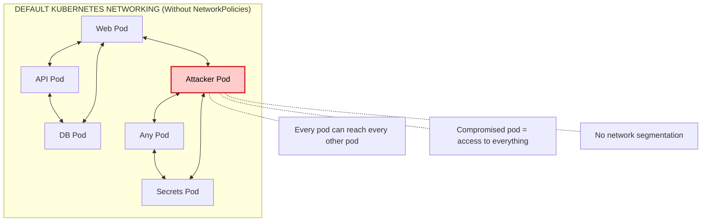
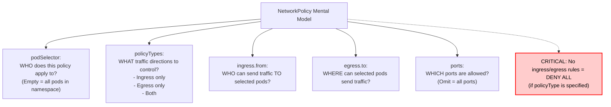
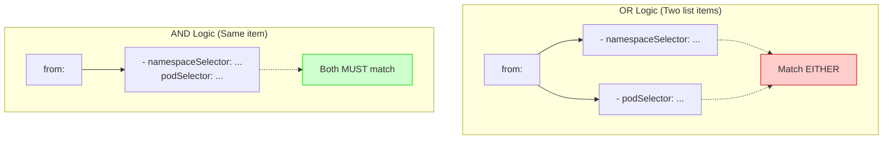

> **Complexity**: `[MEDIUM]` - Core CKS skill
>
> **Time to Complete**: 45-50 minutes
>
> **Prerequisites**: CKA networking knowledge, basic NetworkPolicy experience

---

## What You'll Be Able to Do

After completing this module, you will be able to:

1. **Design** and **implement** ingress and egress NetworkPolicies that enforce least-privilege pod communication for complex microservices in a Kubernetes v1.35+ cluster.
2. **Diagnose** and **debug** connectivity failures caused by missing, overlapping, or overly restrictive policies.
3. **Evaluate** default-deny architectures and selectively allow required traffic flows while maintaining strict zero-trust security postures.
4. **Audit** existing NetworkPolicies to identify security gaps that permit lateral movement and remediate them effectively.

---

## Why This Module Matters

Hypothetical scenario: a public web service in your cluster has a server-side request forgery bug, and the vulnerable container can open arbitrary outbound connections. If the namespace has no NetworkPolicies, the attacker does not need to break Kubernetes networking; they simply use it as designed. The compromised pod can scan service names, try common database ports, reach internal APIs, and attempt cloud metadata access unless another control blocks the path.

That attack shape is not imaginary even though this scenario is. The [2019 Capital One breach](/k8s/cks/part1-cluster-setup/module-1.4-node-metadata/) <!-- incident-xref: capital-one-2019 --> is a well-known reminder that metadata endpoints and overbroad network reach can turn one vulnerable edge workload into a credential exposure path. NetworkPolicies do not replace authentication, workload identity, admission control, or secret hygiene, but they give you a practical way to make the network less useful to an attacker after initial access.

In a Kubernetes v1.35+ cluster, the native NetworkPolicy API gives you a namespace-scoped firewall model for pod traffic. The important word is model, because the API describes intent while the CNI plugin performs enforcement. Your job as a CKS candidate and platform engineer is to translate application flow into selectors, directions, and ports, then prove that unintended flows are blocked without accidentally breaking DNS, metrics scraping, or service dependencies.

This module builds that skill in layers. You will first reason about the default flat pod network, then implement default-deny policies, add narrowly scoped ingress and egress allowances, compare selector logic, and debug failures with repeatable checks. The hands-on lab uses the same three-tier shape that appears in exams and production reviews: web can reach API, API can reach database, and everything else needs an explicit reason before traffic is allowed.

---

## The Default Problem

Kubernetes networking starts from a developer-friendly promise: every pod can reach every other pod without NAT getting in the way. That makes service discovery, rolling deployments, and cross-node scheduling easier because application teams can treat pods as routable peers. The security tradeoff is that a fresh namespace behaves more like an open office floor than a segmented datacenter, so compromise of one workload often gives immediate line of sight to workloads that were never meant to trust it.

The following diagram shows the default network posture before any NetworkPolicy selects a pod. Read it as a reachability map, not as an application architecture recommendation, because the point is that Kubernetes has not yet been given any reason to distinguish trusted application paths from accidental or hostile ones.



The diagram is intentionally blunt because the default is easy to underestimate. A namespace boundary is an administrative boundary for object names and RBAC scoping; it is not automatically a packet filter. A Service name such as `db.production.svc.cluster.local` might feel internal, but any pod that can resolve it and route to the backing endpoints can try to connect unless a policy, service mesh, host firewall, or application control says otherwise.

NetworkPolicy changes that posture by creating isolation for selected pods. A pod with no matching NetworkPolicy remains non-isolated for the relevant direction, so it continues to allow traffic by default. The moment a policy selects that pod for ingress, only ingress traffic allowed by the union of matching ingress rules is accepted. The same principle applies independently to egress, which means ingress security and egress security must be designed as separate questions.

This distinction matters during audits because teams often say "we have a default deny" when they really have only an ingress default deny. That policy protects selected pods from unsolicited inbound connections, but it does not stop those same pods from calling arbitrary internal or external destinations. For lateral movement prevention, data exfiltration control, and metadata endpoint protection, egress policy deserves the same level of attention as ingress.

Pause and predict: if a namespace contains `web`, `api`, and `db` pods, and you apply only an ingress default-deny policy, which traffic directions are blocked and which directions still remain possible from a compromised `web` pod? Write your prediction in two columns before you read the next section, because that habit catches many NetworkPolicy mistakes.

The practical lesson is that NetworkPolicy is not an on-off switch for a namespace. It is a set of selectors that isolate matching pods in chosen directions and a set of allow rules that add back approved communication. If a pod is not selected, or if a direction is not controlled, Kubernetes does not infer the security posture you intended from the policy name.

---

## NetworkPolicy Fundamentals

A `NetworkPolicy` is a resource in the `networking.k8s.io/v1` API group. It describes which pods are selected, which traffic directions are controlled, which peers are allowed, and which ports are open. The object is namespace-scoped, so a policy created in `production` cannot directly select pods in `staging`, although its peer rules can match traffic from other namespaces through a `namespaceSelector`.

```yaml
apiVersion: networking.k8s.io/v1
kind: NetworkPolicy
metadata:
  name: example
  namespace: default
spec:
  # Which pods this policy applies to
  podSelector:
    matchLabels:
      app: web

  # Which directions to control
  policyTypes:
  - Ingress  # Incoming traffic
  - Egress   # Outgoing traffic

  # What's allowed IN
  ingress:
  - from:
    - podSelector:
        matchLabels:
          app: frontend
    ports:
    - port: 80

  # What's allowed OUT
  egress:
  - to:
    - podSelector:
        matchLabels:
          app: database
    ports:
    - port: 5432
```

Read the manifest from the inside out. The top-level `spec.podSelector` answers "which local pods become subject to this policy?" The `policyTypes` field answers "which directions become isolated?" The `ingress.from`, `egress.to`, and `ports` rules answer "which packets are allowed back through the wall?" If you reverse the target selector and the peer selector, the policy may be valid YAML while protecting the wrong workload.

NetworkPolicies operate at network layers 3 and 4, so the native API can match peers and ports but not HTTP paths, JWT claims, gRPC methods, or SQL commands. A rule can allow TCP port 8080 from `app: frontend` to `app: api`; it cannot allow only `GET /healthz` while blocking `POST /admin`. If you need layer 7 decisions, you must add another control such as an ingress gateway, service mesh policy, application authorization, or a CNI-specific extension.

The enforcement path is also important. The Kubernetes API server stores the policy, but kube-proxy does not enforce it, and the API server does not reject traffic. Enforcement is implemented by a CNI plugin such as Calico, Cilium, or another provider that supports NetworkPolicy. On clusters using a networking implementation without policy enforcement, the YAML may apply cleanly while packets continue to flow exactly as before.

Use this mental model when reading any NetworkPolicy under exam pressure. It keeps the target, direction, peer, and port decisions separate, which is important because a policy can be syntactically valid while still answering one of those questions incorrectly.



The phrase "policies are additive" means that Kubernetes never subtracts an allow rule with a later deny rule in the native API. If two policies select the same pod for ingress, the allowed ingress traffic is the union of both policies. This is unlike many firewall systems where rule order matters, and it is why native NetworkPolicy has no explicit deny statement; you deny by isolating first, then allowing only what should pass.

Before running this in a real cluster, what output do you expect if a policy selects `app: api` for ingress but another policy also selects `app: api` and allows traffic from `namespaceSelector: {}`? The correct prediction is that the broader policy wins as part of the union, not because it has priority, but because all matching allows are combined.

That additive model creates a useful audit tactic. When traffic is unexpectedly allowed, do not stare only at the policy you just wrote. List every policy in the namespace, identify which ones select the destination pod for ingress or the source pod for egress, and then union the matching rules mentally. The bug is often a second policy with a wider selector, a namespace label that matches too broadly, or a missing default-deny baseline.

---

## Essential Patterns

The most reliable way to design NetworkPolicies is to start from a default-deny posture and add one purposeful path at a time. This approach feels slower at first, but it gives you a clean audit story: anything that works has a manifest explaining why, and anything that does not work can be traced to a missing or incorrect allow rule. It also prevents new pods from inheriting broad network reach simply because nobody has reviewed them yet.

### Pattern 1: Default Deny All

The cornerstone pattern is a default-deny policy that selects all pods in a namespace. Use an empty `podSelector: {}` when you mean every pod in the policy's own namespace. An empty selector is not a wildcard across the cluster; it is scoped to the namespace named in `metadata.namespace`, which is exactly why teams often apply this pattern as part of namespace bootstrap.

Use this first manifest when you want to block inbound connections to every pod in the namespace while leaving outbound traffic untouched. It is a common starting point for web-facing workloads where you need to control who can reach the service before you begin tightening the service's own egress.

```yaml
# Deny all ingress traffic to namespace
apiVersion: networking.k8s.io/v1
kind: NetworkPolicy
metadata:
  name: default-deny-ingress
  namespace: secure
spec:
  podSelector: {}  # All pods
  policyTypes:
  - Ingress
  # No ingress rules = deny all ingress
```

Use the second manifest when outbound reach is the risk you are trying to reduce, such as preventing compromised workloads from scanning internal services or contacting external endpoints. It does not protect the pods from inbound callers, so pair it with ingress isolation when both directions matter.

```yaml
# Deny all egress traffic from namespace
apiVersion: networking.k8s.io/v1
kind: NetworkPolicy
metadata:
  name: default-deny-egress
  namespace: secure
spec:
  podSelector: {}
  policyTypes:
  - Egress
  # No egress rules = deny all egress
```

Use the third manifest when the namespace should start from a fully isolated posture and every approved path must be added intentionally. This is the strictest baseline and the easiest one to audit, but it requires you to account for DNS, telemetry, time synchronization, and every real application dependency.

```yaml
# Deny BOTH ingress and egress
apiVersion: networking.k8s.io/v1
kind: NetworkPolicy
metadata:
  name: default-deny-all
  namespace: secure
spec:
  podSelector: {}
  policyTypes:
  - Ingress
  - Egress
```

Notice that these policies contain no `ingress` or `egress` rule arrays. That absence is the point: once the selected pods are isolated for a direction, no traffic in that direction is allowed unless another matching policy permits it. When teaching this to a teammate, I describe the default deny as closing every interior door before handing out labeled keys for the few paths people actually use.

### Pattern 2: Allow Specific Pod-to-Pod

After isolation, you add a specific service path. In this example, the destination is the API pod set, and the source is the frontend pod set. The target selector lives at `spec.podSelector`; the source selector lives under `ingress.from`. Swapping those fields is a common review finding because the policy will still apply but it will control a different pod group than intended.

```yaml
# Allow frontend pods to access api pods on port 8080
apiVersion: networking.k8s.io/v1
kind: NetworkPolicy
metadata:
  name: allow-frontend-to-api
  namespace: production
spec:
  podSelector:
    matchLabels:
      app: api
  policyTypes:
  - Ingress
  ingress:
  - from:
    - podSelector:
        matchLabels:
          app: frontend
    ports:
    - protocol: TCP
      port: 8080
```

The rule allows only TCP port 8080, so the same frontend pod is not automatically allowed to reach every port on the API pod. If the API exposes metrics on a second port, add a separate rule or a second port entry after deciding whether the same source should have that access. Treat ports as part of the contract, not as an implementation detail to leave open by default.

### Pattern 3: Allow from Namespace

Namespace selectors are useful when the source is an administrative group rather than a single application label. Monitoring, ingress controllers, backup agents, and security scanners often live in their own namespaces, so allowing from the namespace can be clearer than copying pod labels into every policy. The tradeoff is that namespace labels become security-sensitive data, and an overly broad namespace selector can grant access to every pod in that namespace.

```yaml
# Allow any pod from 'monitoring' namespace
apiVersion: networking.k8s.io/v1
kind: NetworkPolicy
metadata:
  name: allow-from-monitoring
  namespace: production
spec:
  podSelector:
    matchLabels:
      app: web
  policyTypes:
  - Ingress
  ingress:
  - from:
    - namespaceSelector:
        matchLabels:
          name: monitoring
```

In Kubernetes v1.35+, namespaces have the stable `kubernetes.io/metadata.name` label, but many organizations still add their own labels such as `team`, `environment`, or `network-access`. When you use a custom selector, verify the namespace labels before assuming the policy matches. A policy that references a label nobody set is not strict in a useful way; it is simply broken and may lead someone to add a broader emergency rule later.

### Pattern 4: Allow to External CIDR

Egress policy becomes practical when a pod needs a small set of external destinations. The native API supports `ipBlock` rules, including an `except` list, which lets you describe CIDR-based destinations. This is appropriate for stable external ranges, private service endpoints, or broad allow-with-exceptions patterns, but it is a poor fit for SaaS destinations whose IP addresses change frequently unless your organization maintains an approved egress gateway.

```yaml
# Allow egress to specific IP range
apiVersion: networking.k8s.io/v1
kind: NetworkPolicy
metadata:
  name: allow-external-api
  namespace: production
spec:
  podSelector:
    matchLabels:
      app: backend
  policyTypes:
  - Egress
  egress:
  - to:
    - ipBlock:
        cidr: 10.0.0.0/8
        except:
        - 10.0.1.0/24  # Except this subnet
    ports:
    - port: 443
```

`ipBlock` rules evaluate the source or destination address seen by the CNI at enforcement time. If traffic has already passed through a proxy, NAT gateway, ingress controller, or node-local redirection point, the original client address may not be the address the policy sees. This is why CIDR policy should be tested in the actual traffic path instead of only being reviewed as a static YAML object.

What would happen if you create a default-deny-egress policy but forget to add a DNS allow rule, then deploy an application that connects to `postgres.database.svc.cluster.local`? The application may report a database connection failure even though the real failure happens earlier, during name resolution, which is why DNS should be tested explicitly whenever you restrict egress.

### Pattern 5: Allow DNS (Critical)

DNS is the egress exception that nearly every strict namespace needs. Most Kubernetes applications do not connect to raw IP addresses; they connect to Services, external hostnames, or discovery names that first require CoreDNS. If you isolate egress without allowing UDP and TCP port 53 to the DNS pods, application errors often look like database, HTTP, or TLS failures because the code never reaches the target service.

```yaml
# Allow DNS - ALWAYS needed for egress policies
apiVersion: networking.k8s.io/v1
kind: NetworkPolicy
metadata:
  name: allow-dns
  namespace: production
spec:
  podSelector: {}
  policyTypes:
  - Egress
  egress:
  - to:
    - namespaceSelector: {}
      podSelector:
        matchLabels:
          k8s-app: kube-dns
    ports:
    - port: 53
      protocol: UDP
    - port: 53
      protocol: TCP
```

The example uses a broad namespace selector plus a DNS pod label, which is readable but depends on the labels your cluster applies to CoreDNS. Some clusters label the namespace and pods differently, and managed services can vary. A production policy should be written from observed labels using `kubectl get namespace kube-system --show-labels` and `kubectl get pods -n kube-system --show-labels`, not copied mechanically from a sample.

---

## Combining Selectors

The most dangerous YAML mistake in NetworkPolicy is not indentation by itself; it is the list item boundary under `from` or `to`. Separate list items are evaluated as alternatives, while multiple selectors inside the same list item are evaluated together. That single hyphen can change a rule from "pods with this label inside that namespace" to "pods with this label anywhere, or anything from that namespace."

```yaml
# OR: Allow from EITHER namespace OR pods with label
ingress:
- from:
  - namespaceSelector:
      matchLabels:
        env: prod
  - podSelector:
      matchLabels:
        role: frontend

# AND: Allow from pods with label IN namespace with label
ingress:
- from:
  - namespaceSelector:
      matchLabels:
        env: prod
    podSelector:
      matchLabels:
        role: frontend
```

The first rule has two peer entries, so a source can match either one. A pod with `role: frontend` in the same namespace as the policy can match the pod selector, and any pod in a namespace labeled `env: prod` can match the namespace selector. The second rule has one peer entry with both selectors, so a source must be a frontend pod and must also be in a namespace labeled `env: prod`.



This is the place where a CKS exam often compresses several concepts into one short manifest. You may see a target pod selector that looks correct, a port that looks correct, and a namespace selector that looks correct, but the list structure makes the policy too permissive. Slow down and read each hyphen as a new peer option. If two conditions must both be true, they belong under the same peer entry.

Stop and think: you apply a default-deny-ingress policy to a namespace, then create an allow rule for `app: frontend` to reach `app: api`. A new pod labeled `app: debug` can still reach `app: api`. Which other policy could explain that result, and how would the answer change if the debug pod were running in a namespace with a broad monitoring label?

Selector logic also has a namespace default that surprises people. A bare `podSelector` under `ingress.from` selects pods in the same namespace as the policy, not pods anywhere in the cluster. To match pods in another namespace, combine it with a `namespaceSelector`. That means cross-namespace rules should be explicit about both the namespace boundary and the pod identity unless the intended source really is every pod in the selected namespace.

For audits, build a small matrix before editing YAML. Put destinations on the rows, approved sources on the columns, and write the exact labels that prove each source identity. If the matrix cell says "monitoring namespace and Prometheus pods," the YAML should contain both selectors in one peer entry. If the cell says "any pod in monitoring namespace," then a namespace selector alone may be correct, but that is a broader trust decision.

---

## Real Exam Scenarios and Debugging Workflow

The exam rarely asks you to write a policy in isolation from a story. You are usually given a workload shape, a failure symptom, or an existing manifest that is almost correct. The following scenarios preserve the original module examples but frame them as a debugging sequence: identify the asset, decide which direction matters, write the narrow allow, then prove both allowed and forbidden paths.

### Scenario 1: Isolate Database

Databases are high-value targets because they hold application state and often have network paths to backups, replicas, or administrative tooling. This policy makes the database accept traffic only from the API tier on port 5432 and also prevents database pods from initiating egress. The empty egress list matters because a compromised database process should not be able to download tooling or exfiltrate data simply because ingress is locked down.

```yaml
# Only API pods can reach database on port 5432
apiVersion: networking.k8s.io/v1
kind: NetworkPolicy
metadata:
  name: db-isolation
  namespace: production
spec:
  podSelector:
    matchLabels:
      app: database
  policyTypes:
  - Ingress
  - Egress
  ingress:
  - from:
    - podSelector:
        matchLabels:
          app: api
    ports:
    - port: 5432
  egress: []  # No egress allowed
```

The interesting detail is that ingress and egress isolation are independent. The ingress rule says who can reach the database. The empty egress array says the database cannot initiate outbound traffic, including DNS, unless another egress policy also selects the database and allows it. That may be exactly what you want for a database, but it would be a bad default for an application pod that must call external APIs.

### Scenario 2: Multi-tier Application

A classic three-tier application needs chained policies because each tier has a different trust relationship. The web tier should be reachable from the ingress controller, the API tier should be reachable from the web tier, and the database tier should be reachable from the API tier. If the web tier is compromised, the attacker should not be able to skip the API and connect directly to the database just because both pods share a namespace.

### Policy 1: Web Tier

```yaml
# Web tier: only from ingress controller
apiVersion: networking.k8s.io/v1
kind: NetworkPolicy
metadata:
  name: web-policy
  namespace: app
spec:
  podSelector:
    matchLabels:
      tier: web
  policyTypes:
  - Ingress
  ingress:
  - from:
    - namespaceSelector:
        matchLabels:
          name: ingress-nginx
    ports:
    - port: 80
```

This web-tier policy is clear but intentionally broad inside the ingress namespace. It allows any pod in a namespace labeled `name: ingress-nginx`, not only the ingress controller deployment. In production, you might add a pod selector for the controller label as well, because namespace membership alone is not always a sufficient identity boundary for shared platform namespaces.

### Policy 2: API Tier

```yaml
# API tier: only from web tier
apiVersion: networking.k8s.io/v1
kind: NetworkPolicy
metadata:
  name: api-policy
  namespace: app
spec:
  podSelector:
    matchLabels:
      tier: api
  policyTypes:
  - Ingress
  ingress:
  - from:
    - podSelector:
        matchLabels:
          tier: web
    ports:
    - port: 8080
```

The API rule uses a same-namespace pod selector, which fits the common layout where web and API pods live together in the `app` namespace. If the web tier moved to another namespace, this rule would stop matching until you added a namespace selector. That failure would look like a network timeout rather than a Kubernetes validation error, because the manifest would remain syntactically valid.

### Policy 3: DB Tier

```yaml
# DB tier: only from API tier
apiVersion: networking.k8s.io/v1
kind: NetworkPolicy
metadata:
  name: db-policy
  namespace: app
spec:
  podSelector:
    matchLabels:
      tier: db
  policyTypes:
  - Ingress
  ingress:
  - from:
    - podSelector:
        matchLabels:
          tier: api
    ports:
    - port: 5432
```

Pause and predict: in the multi-tier policy above, the web tier allows ingress from the `ingress-nginx` namespace. If an attacker compromises a pod in that namespace that is not the ingress controller, would it get access to the web tier? Your answer should mention namespace labels, pod labels, and whether the policy uses one selector or both.

### Scenario 3: Block Metadata Service

Cloud metadata endpoints deserve explicit attention because they often sit at a link-local address that ordinary application code should not need. Blocking `169.254.169.254/32` through an egress exception helps reduce the blast radius of SSRF and command execution bugs. This policy does not prove the workload has no credential path, but it removes a common network route to metadata services.

```yaml
# Block access to cloud metadata (169.254.169.254)
apiVersion: networking.k8s.io/v1
kind: NetworkPolicy
metadata:
  name: block-metadata
  namespace: default
spec:
  podSelector: {}
  policyTypes:
  - Egress
  egress:
  - to:
    - ipBlock:
        cidr: 0.0.0.0/0
        except:
        - 169.254.169.254/32
```

Be careful with broad `0.0.0.0/0` egress rules. They can be useful as a transition step when the immediate objective is only to block metadata, but they still allow almost every other destination. A mature design usually routes outbound internet access through a controlled egress path, uses workload identity instead of node metadata where possible, and narrows external destinations when the application contract is stable enough.

When traffic fails, follow a diagnostic order instead of guessing. First confirm that the target pod labels match `spec.podSelector`. Then list every policy in the namespace and identify which policies select the target for ingress or the source for egress. After that, test DNS separately from TCP reachability, because a name-resolution failure can make a valid allow rule look broken.

```bash
# List policies in namespace
kubectl get networkpolicies -n production

# Describe policy details
kubectl describe networkpolicy db-isolation -n production

# Check if CNI supports NetworkPolicies
# (Calico, Cilium, Weave support them; Flannel doesn't!)
kubectl get pods -n kube-system | grep -E "calico|cilium|weave"

# Test connectivity
kubectl exec -it frontend-pod -- nc -zv api-pod 8080
kubectl exec -it frontend-pod -- curl -s api-pod:8080

# Check pod labels (policies match on labels!)
kubectl get pod -n production --show-labels
```

Those commands are not a full production runbook, but they are the minimum exam loop. `kubectl describe` shows which selectors and ports the API stored. `kubectl get pod --show-labels` reveals whether your mental model matches the actual objects. A connectivity test from the intended source pod then separates policy logic from application readiness, service naming, and port mismatches.

---

## Auditing Existing Policies

Auditing NetworkPolicies is different from writing a new policy because you inherit someone else's labels, naming habits, and exceptions. Start by inventorying pods, Services, namespaces, and policies together, then classify each policy by destination pod set and controlled direction. That classification matters because a policy named `deny-all` may select only one application, while a policy named `allow-monitoring` may accidentally allow an entire platform namespace.

The first audit question is whether every sensitive pod is isolated for ingress, egress, or both. A database pod with no matching ingress policy is still open to the namespace and cluster according to the default model. A job runner with no matching egress policy can still reach internal services and external endpoints. Do not infer isolation from namespace names, team names, or policy intent; infer it only from selectors that actually match pods.

The second question is whether each allow rule maps to a real application dependency. If an API server needs PostgreSQL on port 5432, the policy should name the API source, the database destination, and that port. If a rule omits ports, allows an entire namespace, or uses `0.0.0.0/0`, ask whether that breadth is an intentional contract or a shortcut created during an outage. The answer changes whether you keep, narrow, or replace the rule.

The third question is who controls the labels that grant access. A `namespaceSelector` is only as strong as the process that assigns namespace labels, and a `podSelector` is only as strong as deployment ownership and admission controls. If any team can label a namespace `network-access=trusted`, that label is not a security boundary. Policy audits should therefore include label governance, not just manifest syntax.

Egress review deserves its own pass because it exposes hidden dependencies. DNS, metrics, tracing, package mirrors, object storage, and cloud APIs may all appear only when traffic is blocked. Instead of opening broad egress after the first failure, record the failing destination, decide whether it is a legitimate dependency, and then add the narrowest rule that satisfies it. That sequence turns debugging into documentation.

Testing should include both positive and negative probes. A successful `web` to `api` connection proves the required path works, but it does not prove `web` cannot reach `db`. A denied probe should be chosen deliberately from the threat model, such as a frontend pod trying a database port or a workload attempting the metadata endpoint. Keep those probes with the policy change so future reviewers can repeat the evidence.

Native Kubernetes does not standardize policy verdict logs, so audit depth depends on the CNI. Cilium, Calico, and managed cloud CNIs expose different troubleshooting commands, flow logs, and policy reports. Treat those tools as supporting evidence, not as a substitute for understanding the API object. If the manifest is too broad, a beautiful flow log only confirms that the broad rule is being used.

Finally, audit in small changes. Replacing a namespace's entire policy set in one commit makes it hard to tell which rule broke DNS, metrics, or an application callback. A safer sequence is to add default deny in a staging copy, introduce one allow path, verify expected success and failure, and then repeat. That workflow is slower than pasting a large manifest, but it gives you rollback points and a clear review history.

The output of an audit should be a short reachability statement, not just a pile of YAML. For example: "`tier=web` may reach `tier=api` on TCP 8080; `tier=api` may reach `tier=db` on TCP 5432; all tiers may reach CoreDNS on TCP and UDP 53; direct `web` to `db` is denied." If the statement and the policies disagree, fix the policies or correct the statement before the review is complete.

---

## Patterns & Anti-Patterns

The useful patterns are not just YAML snippets; they are operating habits that keep policy review manageable as namespaces grow. A namespace bootstrap default deny gives every new workload a safe starting posture. Small allow policies named after the traffic path make ownership visible. Selector checks before and after apply prevent silent mismatches. Together, those habits let teams reason about network posture without reading one giant manifest that tries to encode the whole application.

| Pattern | When to Use It | Why It Works | Scaling Consideration |
|---------|----------------|--------------|-----------------------|
| Namespace default deny | New application namespace, regulated workload, shared cluster | New pods start isolated until reviewed paths are added | Automate it in namespace templates so teams do not forget it |
| Path-specific allow policy | One service needs to reach one destination on a known port | Reviewers can map the policy name to an application dependency | Keep labels stable and owned by deployment manifests |
| DNS egress exception | Any namespace with egress isolation and name-based dependencies | Service discovery keeps working while other egress stays constrained | Verify CoreDNS labels on each cluster flavor before templating |
| Namespace plus pod selector | Cross-namespace traffic from a known controller or service | Both administrative boundary and workload identity must match | Require namespace labels through platform automation |

The matching anti-pattern is treating NetworkPolicy as decorative compliance evidence. A policy that exists but selects no pods changes nothing. A policy that selects the right pods but allows an entire namespace may be too broad for a multi-tenant platform namespace. A policy that locks down ingress while leaving egress open may satisfy a narrow checklist while still allowing exfiltration from a compromised workload.

| Anti-Pattern | What Goes Wrong | Better Alternative |
|--------------|-----------------|--------------------|
| Policy names claim deny-all but selectors match only one app | New or unlabeled pods remain non-isolated | Use `podSelector: {}` for namespace baselines, then add app-specific allows |
| Separate `namespaceSelector` and `podSelector` entries when both are required | The rule becomes OR logic and permits too many sources | Put both selectors in the same peer entry for AND logic |
| Copying DNS policy without checking labels | DNS remains blocked because CoreDNS labels differ | Inspect namespace and pod labels before writing the allow rule |
| Depending only on CIDR rules behind proxies or NAT | The CNI may see the proxy address instead of the original peer | Test from the real path or enforce at the egress gateway layer |

Use these tables as review checklists, not as a replacement for design. A good policy answers four concrete questions: which pods are isolated, which direction is controlled, which peer identity is allowed, and which port is part of the application contract. If a reviewer cannot answer those questions from the manifest and labels, the policy is not ready even if it applies without an API error.

---

## Decision Framework

When you are designing a policy under time pressure, choose the narrowest selector that still matches the real operational boundary. Pod labels are usually best for application-to-application flows inside one namespace. Namespace labels are useful for platform-owned namespaces such as ingress or monitoring. CIDR rules are useful for external networks, but they need extra skepticism around NAT, proxies, cloud metadata, and changing SaaS address ranges.

| Decision Point | Prefer This | When It Fits | Watch For |
|----------------|-------------|--------------|-----------|
| Same namespace service call | `podSelector` | Web to API, API to DB, worker to queue | Source and destination labels must be stable |
| Cross-namespace service call | `namespaceSelector` plus `podSelector` | Ingress controller, monitoring scraper, shared gateway | Separate list items create OR logic |
| External destination | `ipBlock` | Private endpoint, fixed CIDR, metadata block | NAT and changing IP ranges can invalidate assumptions |
| Egress lockdown | Default-deny egress plus DNS allow | Sensitive workloads, regulated namespaces | Applications may need explicit time, telemetry, and API paths |

The flow is simple enough to memorize. Start by asking whether you are protecting incoming traffic to a pod or outgoing traffic from a pod. For ingress, the destination pod selector is the asset you are protecting; for egress, the source pod selector is the workload whose outbound reach you are limiting. Then decide whether the peer is a pod identity, a namespace boundary, or an IP range.

If you are unsure which selector to use, sketch the allowed path as a sentence: "pods with label `tier=web` in namespace `app` may reach pods with label `tier=api` in namespace `app` on TCP 8080." Every noun phrase in that sentence should appear as a selector or namespace in the manifest, and every verb phrase should map to ingress or egress. This prevents the common mistake of writing a policy that describes the source where the target belongs.

For production rollout, stage policy changes with observability. Apply default deny in a test namespace first, verify expected failures, then add allow policies and verify expected successes. If your CNI offers flow logs or policy verdicts, use them during rollout. Native Kubernetes does not provide a universal "why was this packet denied?" command, so your debugging experience depends heavily on CNI tooling and disciplined labels.

---

## Did You Know?

- **NetworkPolicies are additive in Kubernetes v1.35+.** Native NetworkPolicy still has no explicit deny rule; isolation plus the union of matching allow rules is the whole model, so rule ordering does not save you from an overly broad second policy.
- **A pod with no matching policy remains allow-all for that direction.** Ingress and egress isolation are independent, which means an ingress default deny does not automatically constrain outbound calls from the same pod.
- **DNS normally needs both UDP and TCP port 53.** UDP is common for ordinary queries, but TCP is used for larger responses and fallback behavior, so strict egress policies should allow both protocols to CoreDNS when name resolution is required.
- **Cilium extends beyond native NetworkPolicy.** Cilium supports standard Kubernetes NetworkPolicy and its own `CiliumNetworkPolicy` resources; transparent pod-to-pod encryption can be enabled through cluster-level settings such as WireGuard or IPsec:

```yaml
# Enable Cilium transparent encryption (cluster-level)
# In Cilium Helm values or ConfigMap:
encryption:
  enabled: true
  type: wireguard  # or ipsec
```

---

## Common Mistakes

| Mistake | Why It Happens | How to Fix It |
|---------|----------------|---------------|
| Forgetting DNS egress | The policy author focuses on the final database or API destination and forgets name resolution happens first | Allow UDP and TCP port 53 to the actual CoreDNS pods, using observed labels |
| Reversing target and source selectors | `podSelector` and `ingress.from.podSelector` both look like pod identity fields | Read `spec.podSelector` as the protected pod set and `from` or `to` as the peer set |
| Splitting selectors into separate list items | YAML hyphens are easy to treat as visual indentation instead of logic boundaries | Put `namespaceSelector` and `podSelector` in the same peer entry when both must match |
| Assuming namespace names are labels | A selector matches labels, not object names, and custom labels may be absent | Check `kubectl get namespace --show-labels` and label namespaces deliberately |
| Using a CNI without policy enforcement | The API accepts NetworkPolicy objects even when the dataplane does not enforce them | Confirm the cluster networking plugin supports and enables NetworkPolicy |
| Opening all ports by omitting `ports` | The author tests one service port and forgets the rule allows every port for the peer | Add explicit ports and protocols that match the application contract |
| Trusting CIDR rules through NAT | The policy may see the proxy or node address instead of the original source | Validate traffic from the real path and enforce original identity at the right layer |
| Auditing only the newest policy | Native policies are additive, so older broad allows still apply | List all policies selecting the same pods and union the allowed peers during review |

---

## Quiz

Evaluate your understanding before moving to the hands-on lab. Each question is scenario-based because real NetworkPolicy work is usually a diagnosis task, not a vocabulary task.

<details>
<summary>Question 1: A security audit reveals that your production namespace has a default-deny-ingress NetworkPolicy, but the API pod is still receiving traffic from pods in `kube-system`. What do you check first?</summary>

Start by listing every NetworkPolicy in the production namespace and checking which ones select the API pod for ingress. Native policies are additive, so a second policy that allows `kube-system` traffic can reopen the path even when a default-deny policy also matches. You should also verify CNI enforcement, but the fastest logical check is the union of policies selecting the destination pod. If no policy explains the allow, then move to dataplane-specific behavior and the exact source address seen by the pod.
</details>

<details>
<summary>Question 2: You allow the `monitoring` namespace to scrape metrics with `namespaceSelector: {matchLabels: {name: monitoring}}`, but Prometheus still times out. What likely changed between your assumption and the cluster state?</summary>

The namespace may not have the `name: monitoring` label, even if its object name is `monitoring`. Selectors match labels, so the policy can be valid while matching no source namespace. Verify with `kubectl get namespace monitoring --show-labels`, then either add the intended label or use a stable label already present in your cluster. Also confirm the destination pod selector and metrics port, because a correct namespace selector does not compensate for a wrong target.
</details>

<details>
<summary>Question 3: A tester creates an unlabeled pod in the production namespace and can still curl the database, even though you intended to allow only `app: api`. Which YAML structure mistake would you suspect?</summary>

Suspect separate peer entries that turned intended AND logic into OR logic. If the rule has one item for `podSelector: app: api` and another item for a broad `namespaceSelector`, the tester may match the namespace path even without the API label. The fix is to put the namespace selector and pod selector under the same `from` item when both conditions must be true. You should also confirm the policy selects the database pod, because protecting the wrong target creates a similar symptom.
</details>

<details>
<summary>Question 4: You must diagnose a connectivity failure caused by missing DNS egress after default-deny egress is applied. The app can connect to an external IP address but fails when using `api.example.com`; what is the root cause?</summary>

The egress policy likely allows the final external destination but not DNS traffic to CoreDNS. Hostname-based connections need a DNS lookup before any TCP connection to the API can start. Add an egress rule for UDP and TCP port 53 to the DNS pods using the labels in your cluster, then retest name resolution and the application connection separately. This is a policy design issue, not an application retry problem.
</details>

<details>
<summary>Question 5: You set `policyTypes: [Egress]` and `egress: []` on database pods. Will this block communication between containers in the same pod over `localhost`, and why?</summary>

No. NetworkPolicy governs traffic crossing the pod network boundary as enforced by the CNI, not loopback traffic within the same pod network namespace. Containers in one pod can still communicate over `127.0.0.1` because that traffic never becomes pod-to-pod traffic. The egress policy is still useful because it blocks the database pod from initiating network connections to other pods or external addresses.
</details>

<details>
<summary>Question 6: A policy permits `10.0.0.0/8` except `10.0.1.0/24`, but requests from an address inside the excepted subnet still appear to reach the application. What path detail could explain it?</summary>

A proxy, ingress controller, load balancer, or NAT device may be changing the source address before the packet reaches the enforcement point. `ipBlock` matching uses the IP observed by the CNI, not an application header such as `X-Forwarded-For`. Inspect the real source address at the pod or use CNI flow tooling if available. If the original client subnet matters, enforce that decision at the layer that still sees the original address.
</details>

---

## Hands-On Exercise

In this exercise, you will secure a three-tier application named `web`, `api`, and `db` by writing and debugging NetworkPolicies. The lab intentionally uses simple `nginx` pods so the network behavior is easier to observe than the application behavior. Your goal is to make the intended path work, make the direct web-to-database path fail, and fix a broken policy by reasoning about target and source selectors.

### Setup

Run the following commands to create the environment:

```bash
kubectl create namespace exercise
kubectl label namespace exercise name=exercise

kubectl run web --image=nginx -n exercise --labels="tier=web" --port=80
kubectl run api --image=nginx -n exercise --labels="tier=api" --port=80
kubectl run db --image=nginx -n exercise --labels="tier=db" --port=80

kubectl wait --for=condition=Ready pod --all -n exercise
```

Before you apply any policy, test a few paths so you have a baseline. In most clusters, `web` can reach `api`, `api` can reach `db`, and `web` can reach `db` because the namespace starts open. If your cluster already has admission automation that injects default-deny policies, note that difference and continue by inspecting the existing policies before creating the lab manifests.

### Task 1: Establish a Baseline

Write and apply a NetworkPolicy named `default-deny` in the `exercise` namespace that denies all ingress traffic to all pods in the namespace. The important implementation detail is the empty `podSelector`, because it selects every pod in the policy namespace. Do not add an `ingress` rule yet; the absence of rules is what creates the deny posture.

<details>
<summary>View Solution</summary>

```yaml
apiVersion: networking.k8s.io/v1
kind: NetworkPolicy
metadata:
  name: default-deny
  namespace: exercise
spec:
  podSelector: {}
  policyTypes:
  - Ingress
```
</details>

Verify that the `api` pod can no longer reach the `db` pod:

```bash
kubectl exec -n exercise api -- curl -s --connect-timeout 2 db || echo "Blocked (expected)"
```

This failure is the desired baseline. If the connection still works, do not continue adding allow rules yet. Check whether the CNI enforces NetworkPolicies, whether the policy exists in the `exercise` namespace, and whether the pods are actually in that namespace. Debugging a failed deny is much easier before you add more policies that can obscure the result.

### Task 2: Allow Web to API

Write a NetworkPolicy named `allow-web-to-api` that allows pods labeled `tier=web` to connect to pods labeled `tier=api` on port 80. In this task, the API pod set is the destination and therefore belongs in `spec.podSelector`. The web pod set is the source and therefore belongs under `ingress.from`.

<details>
<summary>View Solution</summary>

```yaml
apiVersion: networking.k8s.io/v1
kind: NetworkPolicy
metadata:
  name: allow-web-to-api
  namespace: exercise
spec:
  podSelector:
    matchLabels:
      tier: api
  policyTypes:
  - Ingress
  ingress:
  - from:
    - podSelector:
        matchLabels:
          tier: web
    ports:
    - port: 80
```
</details>

After applying the policy, test only the web-to-API path before moving on. If it fails, inspect `kubectl get pod -n exercise --show-labels` and confirm that the `api` and `web` labels match the manifest exactly. A selector typo is more likely than a Kubernetes networking bug, and the exam environment rewards checking labels quickly.

### Task 3: Allow API to DB

Write a NetworkPolicy named `allow-api-to-db` that allows pods labeled `tier=api` to connect to pods labeled `tier=db` on port 80. This is the same pattern as the previous task with different labels, but resist the temptation to copy without reading. The target selector must change to the database tier, and the allowed source must change to the API tier.

<details>
<summary>View Solution</summary>

```yaml
apiVersion: networking.k8s.io/v1
kind: NetworkPolicy
metadata:
  name: allow-api-to-db
  namespace: exercise
spec:
  podSelector:
    matchLabels:
      tier: db
  policyTypes:
  - Ingress
  ingress:
  - from:
    - podSelector:
        matchLabels:
          tier: api
    ports:
    - port: 80
```
</details>

Verify your policies:

```bash
kubectl exec -n exercise web -- curl -s --connect-timeout 2 api  # Should work
kubectl exec -n exercise api -- curl -s --connect-timeout 2 db   # Should work
kubectl exec -n exercise web -- curl -s --connect-timeout 2 db   # Should fail
```

The last command is the most important one in the task. A working allowed path proves only that you opened something; a failing forbidden path proves that you did not open too much. In security reviews, always test at least one expected success and one expected failure for every policy change, because both sides of the claim matter.

### Task 4: Audit and Debug a Broken Policy

Exercise scenario: a junior engineer attempted to allow a new `metrics` pod to scrape the `db` pod on port 80, but the metrics pod is receiving connection failures. The broken manifest below is valid Kubernetes YAML, so the API server will not save you. Your task is to diagnose the logical error by identifying which pod set the policy selects and which pod set appears under `ingress.from`.

Apply their broken policy and the metrics pod:

```bash
kubectl run metrics --image=nginx -n exercise --labels="tier=metrics"

cat <<EOF | kubectl apply -f -
apiVersion: networking.k8s.io/v1
kind: NetworkPolicy
metadata:
  name: allow-metrics-to-db
  namespace: exercise
spec:
  podSelector:
    matchLabels:
      tier: metrics
  policyTypes:
  - Ingress
  ingress:
  - from:
    - podSelector:
        matchLabels:
          tier: db
    ports:
    - port: 80
EOF
```

Your task is to identify the logical error in the policy above, delete it, and write the correct policy so that the `metrics` pod can curl the `db` pod. The hint is the same target-source distinction you used earlier: the protected destination belongs in `spec.podSelector`, and the allowed caller belongs under `ingress.from.podSelector`.

<details>
<summary>View Solution</summary>

The broken policy was applied to the `metrics` pod (target) and allowed ingress from the `db` pod. It should be applied to the `db` pod (target) and allow ingress from the `metrics` pod.

```bash
kubectl delete networkpolicy allow-metrics-to-db -n exercise
```

Correct policy:

```yaml
apiVersion: networking.k8s.io/v1
kind: NetworkPolicy
metadata:
  name: allow-metrics-to-db
  namespace: exercise
spec:
  podSelector:
    matchLabels:
      tier: db
  policyTypes:
  - Ingress
  ingress:
  - from:
    - podSelector:
        matchLabels:
          tier: metrics
    ports:
    - port: 80
```

Apply the correct policy, then verify:

```bash
kubectl exec -n exercise metrics -- curl -s --connect-timeout 2 db  # Should work
```
</details>

### Success Criteria

- [ ] The `exercise` namespace exists and contains `web`, `api`, `db`, and `metrics` pods with the intended tier labels.
- [ ] A default-deny ingress policy selects all pods in the `exercise` namespace.
- [ ] `web` can reach `api` on port 80 after the allow policy is applied.
- [ ] `api` can reach `db` on port 80 after the allow policy is applied.
- [ ] `web` cannot reach `db` directly, proving the chained design blocks tier skipping.
- [ ] The corrected metrics policy selects `tier=db` as the target and allows `tier=metrics` as the source.

### Cleanup

Restore the environment to its initial state after you finish the lab. Deleting the namespace removes the pods and policies together, which is cleaner than deleting each object one at a time. If you are using a shared training cluster, confirm the namespace name before running the cleanup command.

```bash
kubectl delete namespace exercise
```

---

## Sources

- https://kubernetes.io/docs/concepts/services-networking/network-policies/
- https://kubernetes.io/docs/reference/kubernetes-api/policy-resources/network-policy-v1/
- https://kubernetes.io/docs/concepts/overview/working-with-objects/labels/
- https://kubernetes.io/docs/concepts/overview/working-with-objects/namespaces/
- https://kubernetes.io/docs/concepts/services-networking/dns-pod-service/
- https://kubernetes.io/docs/tasks/debug/debug-application/debug-service/
- https://kubernetes.io/docs/concepts/extend-kubernetes/compute-storage-net/network-plugins/
- https://docs.tigera.io/calico/latest/network-policy/get-started/kubernetes-policy/kubernetes-policy
- https://docs.cilium.io/en/stable/network/kubernetes/policy/
- https://docs.cilium.io/en/stable/security/network/encryption/
- https://docs.aws.amazon.com/AWSEC2/latest/UserGuide/ec2-instance-metadata.html
- https://cloud.google.com/kubernetes-engine/docs/how-to/network-policy

## Next Module

Now that you have locked down pod-to-pod communication and practiced selector-driven debugging, the next step is to evaluate the broader hardening baseline around the control plane, worker nodes, and Kubernetes component configuration.

[Module 1.2: CIS Benchmarks](../module-1.2-cis-benchmarks/) - Next you will use kube-bench and the CIS guidance to identify insecure cluster settings before attackers can combine weak defaults with overly broad network reach.
