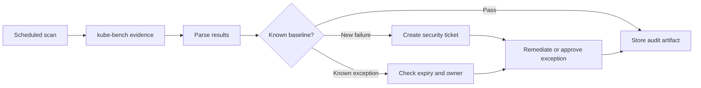

# Module 1.2: CIS Benchmarks and kube-bench

Complexity: `[MEDIUM]` - core security auditing skill. Time to complete: 40-45 minutes. Prerequisites: Module 0.3, comfort reading static Pod manifests, and basic Kubernetes v1.35+ administration from a control-plane node.

## What You'll Be Able to Do

After working through this module, you will be able to:

1. **Audit** a modern Kubernetes v1.35+ cluster against industry-standard CIS benchmarks using the `kube-bench` utility.
2. **Diagnose** failing benchmark checks by tracing console output to specific misconfigurations in control plane components.
3. **Implement** precise remediation strategies for API server, etcd, and kubelet security settings without breaking legitimate workloads.
4. **Evaluate** which CIS recommendations are absolute requirements and which require documented operational exceptions.
5. **Design** an automated security scanning pipeline that detects configuration drift before it becomes an incident.

## Why This Module Matters

In early 2018, Tesla discovered that attackers had used an exposed Kubernetes dashboard to reach credentials and run cryptocurrency mining workloads on cloud infrastructure. The public reporting focused on the novelty of the cloud compromise, but the underlying failure was more ordinary: a management surface was reachable, authentication was weak, and cluster configuration drift had gone unnoticed long enough for an attacker to turn spare capacity into profit. The [2018 Tesla cryptojacking incident](/k8s/cks/part1-cluster-setup/module-1.5-gui-security/) <!-- incident-xref: tesla-2018-cryptojacking --> remains useful because it shows how mundane hardening gaps can become expensive security events.

Kubernetes is powerful because it joins many privileged components into one control system. The API server accepts requests, admission plugins shape them, controllers reconcile state, kubelets create containers, and etcd stores the desired state that makes the whole platform work. If one of those components runs with permissive flags, loose file permissions, weak TLS configuration, or broad anonymous access, an attacker rarely needs a dramatic exploit. They can use the cluster's own administrative machinery, which is why configuration benchmarks matter even when every binary is fully patched.

The CIS Kubernetes Benchmark gives operators a shared language for those settings. It does not replace threat modeling, network segmentation, RBAC design, or workload isolation, but it establishes a defensible baseline for the parts of the platform that are easy to forget during upgrades and incident response. In this module, you will learn how to run `kube-bench`, interpret its findings, decide when a result requires remediation or an exception, and turn the audit into continuous control instead of a report that ages quietly in a ticket.

## The CIS Benchmark as an Operating Baseline

The Center for Internet Security benchmark is best understood as a carefully argued checklist for reducing preventable risk. Each recommendation connects a component setting to a security outcome, such as preventing anonymous API access, protecting private key material, enabling audit evidence, or limiting kubelet behavior on worker nodes. That structure matters because security teams and platform teams often disagree when a recommendation is phrased as a simple pass or fail. The benchmark gives them a concrete control number, a rationale, and an audit method they can discuss without turning every hardening decision into a new debate.

Kubernetes v1.35+ clusters are also diverse, so the benchmark cannot be treated as a magical one-size policy. A kubeadm cluster exposes static Pod manifests and local kubelet configuration files, while a managed service may hide some control-plane files and require provider-specific evidence instead. The skill is not memorizing every recommendation. The skill is learning to read a failing check, identify the component it describes, decide whether you own that component, and record the remediation or exception in a way that future auditors and incident responders can trust.

Here is the completed version of the CIS structure diagram concept from the original module. It is deliberately simple because the mental model matters more than the artwork: policy authors define expectations, platform engineers run evidence gathering, and cluster owners either remediate the configuration or document a risk decision with a review date.

```text
+-----------------------------------------------------------+
|              CENTER FOR INTERNET SECURITY                 |
|                                                           |
|  community consensus                                      |
|        |                                                  |
|        v                                                  |
|  Kubernetes Benchmark                                     |
|        |                                                  |
|        v                                                  |
|  kube-bench audit evidence                                |
|        |                                                  |
|        +--> remediation for owned settings                |
|        |                                                  |
|        +--> documented exception for accepted risk        |
+-----------------------------------------------------------+
```

Think of the benchmark like a building inspection rather than a blueprint. A building code does not tell an architect why the office exists, but it does prevent obviously unsafe wiring, missing fire exits, and doors that cannot be opened during an emergency. CIS controls play a similar role for the cluster. They do not design your application architecture, yet they reduce the chance that a forgotten flag, world-readable certificate, or disabled audit path undermines every higher-level defense you built later.

The benchmark is also opinionated about evidence. A vague statement such as "we secure the API server" is not enough, because it cannot be reproduced during an incident. A stronger statement names the manifest file, the flag, the expected value, the command used to inspect it, and the change record that introduced the remediation. That evidence mindset is why `kube-bench` is useful for CKS preparation. The exam expects you to move from symptom to configuration quickly, and real operations work expects the same discipline under pressure.

The first practical decision is scope. If you run your own control plane, you can usually inspect `/etc/kubernetes/manifests`, `/etc/kubernetes/pki`, `/var/lib/etcd`, kubelet configuration, and systemd units directly. If you run on a managed control plane, some checks will be informational because the provider owns the plane, while node-level checks remain your responsibility. Treat that boundary as part of the audit, not as an excuse to ignore a result. A managed service still needs a recorded answer for each failed or unavailable control.

Before running this on a production cluster, pause and predict: which component do you expect to produce the most findings in a newly bootstrapped lab, the API server, etcd, or the kubelet? Most learners guess the API server because it has many visible flags, but kubelet findings often surprise teams because node configuration is spread across files, systemd drop-ins, and bootstrap defaults.

## Running kube-bench Without Losing Context

`kube-bench` automates the audit commands from the CIS Kubernetes Benchmark and reports each check as PASS, FAIL, WARN, or INFO. The tool is intentionally direct. It reads files, inspects process arguments, and compares observed values with benchmark expectations. That directness is helpful because a failing result usually points to a file or flag you can inspect immediately, but it also means the output must be read in operational context. A tool can tell you that a flag is absent. It cannot decide whether your managed service exposes that flag, whether an exception has been approved, or whether a remediation requires a maintenance window.

For this module, we will use the `k` alias for `kubectl` so commands stay readable during the lab. Define it before using the shorthand, and keep the long command in mind when you explain findings to someone who does not use the alias. The benchmark examples assume a Kubernetes v1.35+ cluster where you have permission to run privileged diagnostic workloads or shell access to a control-plane node.

```bash
alias k=kubectl
k version --short
k get nodes -o wide
```

You can run `kube-bench` in several ways. On a self-managed kubeadm cluster, running it directly on a node is often the clearest method because the tool can read host paths without extra Pod security decisions. In a disposable lab, the containerized Job is convenient because it keeps the binary out of the node image and leaves a normal Kubernetes object trail. In production, the choice should follow your access model. If your organization prohibits privileged Pods in application namespaces, do not create an exception casually just to make the audit feel neat.

The following Job shows the common containerized pattern for a kubeadm-style cluster. It mounts the host paths that `kube-bench` needs for control-plane and node evidence, runs the benchmark, and keeps the result in Pod logs for review. The image tag should be pinned in a real pipeline, but the structure is the part to study here.

```yaml
apiVersion: batch/v1
kind: Job
metadata:
  name: kube-bench
  namespace: kube-system
spec:
  template:
    spec:
      hostPID: true
      restartPolicy: Never
      containers:
        - name: kube-bench
          image: aquasec/kube-bench:latest
          command:
            - kube-bench
            - run
            - --targets
            - master,node,etcd,policies
          securityContext:
            privileged: true
          volumeMounts:
            - name: var-lib-etcd
              mountPath: /var/lib/etcd
              readOnly: true
            - name: var-lib-kubelet
              mountPath: /var/lib/kubelet
              readOnly: true
            - name: etc-systemd
              mountPath: /etc/systemd
              readOnly: true
            - name: etc-kubernetes
              mountPath: /etc/kubernetes
              readOnly: true
      volumes:
        - name: var-lib-etcd
          hostPath:
            path: /var/lib/etcd
        - name: var-lib-kubelet
          hostPath:
            path: /var/lib/kubelet
        - name: etc-systemd
          hostPath:
            path: /etc/systemd
        - name: etc-kubernetes
          hostPath:
            path: /etc/kubernetes
```

Apply the Job, wait for it to finish, and read the logs as an audit artifact rather than as a pass-or-fail scoreboard. The command sequence below is intentionally ordinary because security work becomes repeatable when evidence collection uses the same boring operational patterns as other cluster maintenance. If the Job stays pending, diagnose scheduling and policy first instead of weakening cluster security blindly.

```bash
k apply -f kube-bench-job.yaml
k -n kube-system wait --for=condition=complete job/kube-bench --timeout=180s
k -n kube-system logs job/kube-bench > kube-bench-report.txt
k -n kube-system delete job kube-bench
```

The output normally groups checks by component. A failed check includes an identifier, a title, a status, and often a remediation hint copied from the benchmark profile. Resist the temptation to skim only the final totals. Totals are useful for trend charts, but the real value is the path from check identifier to component ownership. A single failing API server check that enables anonymous access is more urgent than several informational findings about provider-owned control-plane files that you cannot inspect directly.

```text
[FAIL] 1.2.1 Ensure that the --anonymous-auth argument is set to false
[PASS] 1.2.2 Ensure that the --basic-auth-file argument is not set
[WARN] 1.2.3 Ensure that the --token-auth-file parameter is not set

== Remediations master ==
1.2.1 Edit /etc/kubernetes/manifests/kube-apiserver.yaml
      set --anonymous-auth=false
```

Pause and predict: if `kube-bench` runs inside a privileged Pod but cannot see `/etc/kubernetes/manifests`, should you mark every control-plane check as a real failure? The better answer is no. First verify the evidence path, because a bad mount or a managed-service boundary can produce misleading failures that look like missing flags.

The important operating habit is to preserve raw output before editing anything. Copy the report into a ticket, an internal evidence store, or a pull request comment that describes the cluster, Kubernetes version, `kube-bench` version, benchmark profile, and execution method. That context lets a reviewer distinguish a real regression from a changed benchmark profile. It also protects you during incident response because you can show when a finding first appeared and what changed between scans.

```bash
grep -E '^\[(FAIL|WARN|PASS|INFO)\]' kube-bench-report.txt | head -n 20
grep -E '^\[FAIL\]' kube-bench-report.txt | wc -l
grep -E '^\[WARN\]' kube-bench-report.txt | wc -l
```

When a team treats the scan as a one-time exam exercise, they usually fix the obvious API server flags and then forget about kubelet drift. When a team treats the scan as operational telemetry, they build a review loop around new failures, known exceptions, and trend changes after upgrades. The second approach is slower at first, but it scales better because every future audit starts from an explained baseline instead of from a fresh argument about whether the benchmark matters.

## Diagnosing Control Plane Findings

Control-plane findings deserve careful diagnosis because a small manifest change can restart a critical component. In kubeadm-style clusters, static Pod manifests under `/etc/kubernetes/manifests` define the API server, controller manager, scheduler, and sometimes etcd. The kubelet watches that directory and recreates static Pods when files change. That mechanism makes remediation straightforward, but it also means a syntax error in a manifest can interrupt the control plane. Always inspect, back up, edit, and verify with the same discipline you would use for a database configuration file.

The API server receives the most attention because it is the front door to the cluster. CIS checks commonly examine anonymous authentication, insecure admission behavior, audit logging, TLS cipher choices, authorization mode, and legacy authentication files. A finding such as `--anonymous-auth=true` is serious because it permits unauthenticated requests to reach the authorization layer. Even if RBAC blocks most operations, the exposure expands reconnaissance and can interact badly with aggregated APIs or misconfigured permissions.

Use a two-step diagnosis pattern for API server results. First, read the check and identify the exact flag or file. Second, inspect the effective manifest and confirm whether the tool's observation matches reality. This pattern keeps you from editing the wrong component when a benchmark profile, managed-service behavior, or stale report points at a configuration that is not actually active.

```bash
sudo grep -n -- '--anonymous-auth' /etc/kubernetes/manifests/kube-apiserver.yaml || true
sudo grep -n -- '--authorization-mode' /etc/kubernetes/manifests/kube-apiserver.yaml || true
sudo grep -n -- '--audit-log-path' /etc/kubernetes/manifests/kube-apiserver.yaml || true
```

A worked example makes the flow concrete. Suppose `kube-bench` reports that `--anonymous-auth` is not set to false. You inspect the manifest and find no explicit flag, which means the default behavior must be checked against the Kubernetes version and benchmark expectation. You then add the explicit hardened value, wait for the static Pod to restart, and verify that the API server becomes ready before moving to the next change. That order prevents a common failure where teams batch many changes and then cannot identify which flag caused a restart problem.

```yaml
apiVersion: v1
kind: Pod
metadata:
  name: kube-apiserver
  namespace: kube-system
spec:
  containers:
    - command:
        - kube-apiserver
        - --anonymous-auth=false
        - --authorization-mode=Node,RBAC
        - --audit-log-path=/var/log/kubernetes/audit.log
        - --audit-log-maxage=30
        - --audit-log-maxbackup=10
        - --audit-log-maxsize=100
      name: kube-apiserver
```

After a manifest change, verify both component health and user-visible behavior. The local static Pod may restart before the API server becomes stable, and a remote `k` command may briefly fail while the endpoint reconnects. That is not a reason to panic, but it is a reason to make one change at a time and to keep a second terminal open on the node when possible.

```bash
sudo crictl ps --name kube-apiserver
k -n kube-system get pods -l component=kube-apiserver
k auth can-i get pods --as=system:anonymous
```

etcd findings have a different risk profile. The datastore contains cluster state, secrets objects, service account references, leases, and configuration history. CIS checks usually focus on certificate usage, client authentication, peer authentication, and file permissions around data directories and key files. A loose permission bit on an etcd private key is not just a local hygiene issue. If an attacker reaches the node, that key can become a path to reading or modifying the cluster's source of truth.

The first etcd question is whether you operate stacked etcd, external etcd, or a provider-owned datastore. In stacked kubeadm clusters, the etcd static Pod and data directory are on the control-plane node. In external topologies, etcd may have its own hosts, certificates, and backup process. In managed services, you may need provider documentation or compliance reports instead of direct file evidence. The benchmark result should lead you to that ownership model before it leads you to a command.

```bash
sudo grep -n -- '--client-cert-auth' /etc/kubernetes/manifests/etcd.yaml || true
sudo grep -n -- '--peer-client-cert-auth' /etc/kubernetes/manifests/etcd.yaml || true
sudo stat -c '%a %U:%G %n' /var/lib/etcd
sudo find /etc/kubernetes/pki/etcd -maxdepth 1 -type f -exec stat -c '%a %U:%G %n' {} \;
```

Admission and authorization findings are another place where context matters. A benchmark may require `Node,RBAC` authorization mode because broad webhook or always-allow settings can erase the cluster's access model. It may also expect admission plugins that reduce unsafe workload creation. You should not enable or disable admission behavior casually in production because controllers, operators, and legacy workloads may depend on existing defaults. The right response is to map the finding to a change plan, test it in a representative environment, and document any exception with a narrow reason.

Which approach would you choose here and why: fix every API server finding immediately during a business day, or group related flags into a controlled maintenance window after testing them on a staging control plane? The mature answer depends on severity, but authentication and authorization changes deserve deliberate rollout because a security fix that prevents the platform team from recovering the cluster can create a different outage.

## Diagnosing Node and kubelet Findings

Node findings are often underestimated because worker nodes feel less central than the API server. That instinct is dangerous. A kubelet can run privileged containers, mount host paths, expose logs, and report node status. If kubelet authentication, authorization, certificate rotation, or read-only ports are misconfigured, an attacker who reaches a node network can sometimes move from workload access to node control. CIS kubelet checks therefore protect the boundary where container workloads meet the host.

The kubelet is also harder to audit by eye because its configuration can be split across a systemd unit, a drop-in file, a kubeadm flags file, and a structured YAML config. `kube-bench` helps by collecting those paths, but diagnosis still requires you to find the effective source of a setting. When the report names a flag, search both command-line arguments and the kubelet config file before deciding that the setting is absent.

```bash
sudo systemctl cat kubelet
sudo grep -R --line-number -- '--read-only-port\|--authorization-mode\|--anonymous-auth' /var/lib/kubelet /etc/systemd/system /usr/lib/systemd/system 2>/dev/null || true
sudo grep -n 'authorization:' /var/lib/kubelet/config.yaml || true
sudo grep -n 'anonymous:' /var/lib/kubelet/config.yaml || true
```

The read-only kubelet port is a classic example. Older clusters sometimes left port 10255 reachable for metrics scraping. That endpoint exposes information without authentication, and security baselines expect it to be disabled. Modern metrics pipelines should use authenticated endpoints, metrics-server, or provider-supported telemetry paths. If a monitoring system still depends on the read-only port, the correct fix is not to ignore the finding forever. The correct fix is to migrate the monitoring path and set an exception expiry date while the migration is underway.

The kubelet authorization mode is equally important. Webhook authorization lets the kubelet ask the API server whether a request is allowed, tying node operations back to centralized access control. Permissive modes may make old integrations easier, but they remove the guardrail that keeps node-level APIs from becoming a shortcut around RBAC. When you diagnose this finding, verify the kubelet config and then test the operational path that depends on it, such as log collection, exec access, and metrics scraping.

```yaml
apiVersion: kubelet.config.k8s.io/v1beta1
kind: KubeletConfiguration
authentication:
  anonymous:
    enabled: false
  webhook:
    enabled: true
authorization:
  mode: Webhook
readOnlyPort: 0
protectKernelDefaults: true
rotateCertificates: true
```

File permission checks on nodes may look dull, but they reveal whether sensitive material is guarded by the host operating system. Kubeconfig files, client certificates, kubelet keys, and CNI configuration can disclose paths into the cluster. A finding that says a file should be `600` or owned by `root:root` is not pedantry. It is a practical way to reduce damage when a low-privilege local user, debugging process, or compromised DaemonSet gains a foothold on the node.

```bash
sudo stat -c '%a %U:%G %n' /var/lib/kubelet/config.yaml
sudo stat -c '%a %U:%G %n' /etc/kubernetes/kubelet.conf
sudo find /var/lib/kubelet/pki -maxdepth 1 -type f -exec stat -c '%a %U:%G %n' {} \;
```

Node remediation should follow a rollout pattern rather than an all-at-once edit. Pick one representative node pool, apply the kubelet configuration through your normal mechanism, restart kubelet if required, and verify workloads, CNI behavior, logs, and node readiness. Then roll through the remaining pools with health checks between each batch. The benchmark may list node controls as simple boolean checks, but production nodes carry real application load, and safe security work respects that load.

Before running a node remediation in your own environment, what output do you expect from `k get nodes` while kubelet restarts on one worker? The best expectation is a brief readiness transition or no visible change, depending on timing and grace periods, followed by stable Ready status and no new workload scheduling failures.

## Remediation, Exceptions, and Evidence

Remediation is not the same thing as editing until `kube-bench` prints fewer failures. A good remediation changes the right setting, proves the component is healthy afterward, links the change to a benchmark check, and records the operational impact. That evidence chain matters because hardening work often has delayed consequences. An audit log path change may appear harmless today and then fill a disk later if log rotation is wrong. A kubelet authorization change may pass the benchmark and then reveal a monitoring integration that was relying on unauthenticated access.

Use a consistent triage model for every finding. Classify it as owned and fixable, owned but requiring staged remediation, provider-owned with alternate evidence, or accepted risk with an expiry date. This classification prevents the report from becoming a pile of unprioritized failures. It also helps security reviewers see that a WARN result has not been ignored simply because it is inconvenient.

| Finding Class | Typical Example | Operational Response |
| --- | --- | --- |
| Owned and fixable | API server anonymous auth enabled | Patch manifest, verify readiness, rerun check |
| Owned but staged | Kubelet read-only port used by legacy monitoring | Plan migration, set exception expiry, validate replacement |
| Provider-owned | Managed control-plane file permission check unavailable | Attach provider control evidence and document boundary |
| Accepted risk | Temporary admission plugin incompatibility during upgrade | Approve narrow exception with owner and review date |

The most useful remediation records are boring and complete. Include the check identifier, the observed result, the cluster version, the file or API that changed, the exact new value, the validation command, and a rollback note. You do not need a long essay for every control. You need enough detail that another engineer can understand what changed six months later during an audit, upgrade, or incident review.

```text
Check: 1.2.1 Ensure that --anonymous-auth is set to false
Cluster: cks-lab-a, Kubernetes v1.35+
Observation: kube-bench reported FAIL, flag absent from kube-apiserver manifest
Change: added --anonymous-auth=false to /etc/kubernetes/manifests/kube-apiserver.yaml
Validation: API server static Pod restarted, k auth can-i get pods --as=system:anonymous returned no
Rollback: remove the added flag from the manifest and wait for static Pod restart
```

Exceptions need the same discipline because they are risk decisions, not hiding places. A good exception names the benchmark check, explains why remediation is not currently possible, identifies the compensating control, names an owner, and sets a review date. A weak exception says "managed service" or "breaks app" and stops there. That weak version becomes dangerous because nobody can tell whether the risk was understood or merely postponed.

```yaml
check_id: "4.2.6"
title: "Ensure that the --protect-kernel-defaults argument is set to true"
status: "temporary_exception"
owner: "platform-security"
reason: "One legacy node pool still requires kernel defaults that differ from the hardened profile."
compensating_controls:
  - "Node pool is isolated with taints and dedicated network policy boundaries."
  - "Workloads are scheduled only from the legacy namespace allowlist."
expires: "2026-09-30"
```

Prioritization should combine severity, exploitability, ownership, and blast radius. Authentication, authorization, TLS, audit logging, and datastore protection normally sit near the top because they shape the attacker's ability to enter, act, hide, or persist. Cosmetic differences and provider-owned file checks sit lower, but they still need an answer. The goal is not to make every report green overnight. The goal is to make every result explainable and to shrink real risk with each remediation cycle.

The CKS exam rewards this same habit. You may not have time to write a formal exception, but you do need to read a result, inspect the right file, make a minimal change, and verify that the cluster still works. That is why this module keeps returning to evidence. Evidence is the bridge between benchmark theory and operational confidence.

One useful practice is to write remediation notes in the same style every time, even when the finding feels obvious. A repeated format reduces cognitive load during stressful reviews because the reader knows where to find the observation, the change, the validation, and the rollback path. It also helps newer platform engineers learn the difference between fixing a symptom and proving a control. When every note follows the same shape, reviewers can compare high-risk API server changes with routine file permission fixes without relearning the documentation style.

Another useful habit is to separate the owner of remediation from the owner of risk acceptance. The platform team may own the kubelet configuration, but a business system owner may own the workload that blocks a stricter setting. If the same person who wants a release deadline also approves a security exception, the exception can become a shortcut around the control. A lightweight review by a security lead, platform lead, or service owner creates friction in the right place. The goal is not bureaucracy. The goal is making sure accepted risk is accepted consciously.

Remediation should also account for how Kubernetes components reload configuration. Static Pod manifests are watched by kubelet, so a saved file can trigger a restart quickly. Kubelet configuration may require a service restart or a node image rollout. RBAC and admission settings can affect new requests immediately, while existing workloads may continue running until they are recreated. Those different reload paths explain why a single benchmark report can contain findings with very different rollout strategies. Treating them all as identical edits is how teams turn hardening work into accidental outage work.

When a finding points at audit logging, slow down and check the whole evidence chain. Enabling an audit log path is not enough if the directory is missing, permissions are wrong, log rotation is absent, or the policy records too little information to be useful. Audit controls exist because incident responders need to answer who did what and when, but a poorly planned audit change can either produce no useful records or produce so much data that the node suffers. The benchmark identifies the control, while the operator must make the control durable.

Certificate and TLS findings deserve the same complete view. A report might focus on one flag, but the operational control includes certificate authority management, rotation process, file permissions, expiration monitoring, and peer trust. If a remediation changes certificate paths or authentication flags, you need to know which components depend on those credentials before restarting anything. This is especially important for etcd because peer and client certificate mistakes can break quorum or isolate a member. A precise benchmark fix must still respect distributed-system safety.

For node settings, evidence should include the node pool or image generation, not just the one host you inspected. A finding fixed by manually editing `/var/lib/kubelet/config.yaml` on one worker is educational in a lab, but it is fragile in production if autoscaling later creates nodes from an old image. Production remediation belongs in the system that creates nodes: image build scripts, kubeadm configuration, bootstrap templates, managed node group settings, or configuration management. Otherwise the next replacement node silently reintroduces the failure and the team rediscovers it during the next scan.

Finally, verify negative behavior as well as positive health. It is not enough for `k get nodes` to succeed after a hardening change. If the control is supposed to block anonymous API access, test that anonymous access is actually blocked. If the control is supposed to disable the read-only kubelet port, verify that the old endpoint no longer answers. A cluster can look healthy while a security control remains ineffective, so validation must match the purpose of the finding.

## Automating Benchmarks as Drift Control

A manual scan is useful for learning, but it is not enough for a living cluster. Kubernetes configuration changes during upgrades, node replacements, emergency fixes, provider maintenance, and platform experiments. If you run `kube-bench` only before an annual audit, you will discover drift after it has become normal. A better design treats benchmark scanning as a recurring control with baselines, notifications, and owner review.

The automation design should separate evidence collection from policy decisions. Let `kube-bench` gather observed state and produce structured output. Let your pipeline compare that output against an approved baseline that includes known exceptions. Let humans review new failures, expired exceptions, and changes in benchmark profiles. That separation keeps the scanning tool simple and keeps governance decisions visible.



For small teams, a CronJob that runs in a restricted operations namespace and ships logs to an internal bucket may be enough. For larger organizations, scan results often flow into CI, security dashboards, or evidence systems used by compliance teams. The architecture is less important than the feedback loop. Someone must know when a new FAIL appears, someone must own the decision, and the decision must survive beyond the terminal session where the scan was run.

```yaml
apiVersion: batch/v1
kind: CronJob
metadata:
  name: kube-bench-weekly
  namespace: kube-system
spec:
  schedule: "18 3 * * 1"
  jobTemplate:
    spec:
      template:
        spec:
          hostPID: true
          restartPolicy: Never
          containers:
            - name: kube-bench
              image: aquasec/kube-bench:latest
              command:
                - /bin/sh
                - -c
                - kube-bench run --json > /tmp/kube-bench.json && cat /tmp/kube-bench.json
              securityContext:
                privileged: true
          tolerations:
            - operator: Exists
```

Do not confuse automated scanning with automated remediation. Some findings are safe to fix through configuration management, especially file permissions or kubelet config settings in a controlled node image pipeline. Others can interrupt the control plane or change access behavior. Automation should open a ticket, block an unsafe promotion, or alert the platform owner before it edits a live API server manifest. Security automation earns trust when it is predictable, reversible, and clear about the blast radius of each action.

Versioning matters because the benchmark profile changes over time. Pin the `kube-bench` version, record the Kubernetes version, and make benchmark profile updates explicit. If a new tool version adds checks, your failure count may rise even though cluster risk did not change overnight. That is not a reason to avoid updates. It is a reason to review the diff in expectations and separate new evidence from new policy.

An effective pipeline reports four numbers: new failures, resolved failures, active exceptions, and expired exceptions. Raw PASS totals make dashboards look comforting, but they can hide the one change that matters. A sudden new failure in API server authorization deserves attention even if hundreds of file permission checks still pass. Design your reporting so the dangerous change is visible without forcing someone to read the entire raw report every week.

A good drift pipeline also needs a clear trust boundary for the scan workload itself. The Job pattern shown earlier asks for privileged host access because it needs to read files outside the container. That access is powerful, so the scanner image, namespace, service account, network path, and cleanup behavior deserve review. If an attacker can replace the scanner image or read its output destination, the audit path becomes another privileged foothold. Security evidence collection should never become an unreviewed back door simply because it carries the word audit.

Output handling is another design choice that affects both security and usefulness. Logs are convenient for a lab, but production evidence usually needs retention, access control, and integrity. Store reports where platform and security reviewers can read them, but application teams and ordinary workloads cannot modify them. If you transform JSON output into tickets or dashboards, keep a link to the raw artifact so reviewers can inspect the original context. Summaries are useful for triage, but raw evidence is what supports later investigation.

Pipeline failure modes should be explicit. If the scan cannot schedule because Pod Security settings block privileged workloads, that is not the same as a clean cluster. If the scan runs but host paths are missing, the result should be marked as evidence collection failure, not as a pile of component failures. If the parser crashes because a tool version changed output shape, the pipeline should fail loudly and ask for maintenance. Silent audit failure is worse than no audit because it creates false confidence.

Use release events as a second trigger in addition to time-based schedules. A weekly scan catches ordinary drift, but upgrades, node image rotations, and bootstrap template changes are exactly when benchmark posture can move. Running a scan before and after those events gives reviewers a focused diff. If a cluster upgrade changes a default or a node image changes file ownership, the team can respond while the change is still fresh instead of finding it weeks later when nobody remembers the rollout details.

Exception expiry should be automated too. Human memory is a weak control, especially when exceptions are created during outages or migrations. A pipeline that opens a ticket when an exception nears expiry turns accepted risk back into visible work. It also gives teams a chance to show progress, such as migrating a monitoring integration or replacing a legacy node pool. Without expiry reminders, temporary exceptions often become permanent background risk that nobody intentionally chose to keep.

The final design question is who receives the alert. Sending every finding to a shared chat channel may feel transparent, but it often diffuses responsibility. Route API server and etcd findings to the platform control-plane owners, kubelet findings to node platform owners, provider-owned findings to the cloud platform owner, and policy findings to the team that owns admission and workload standards. Clear routing shortens response time because the first recipient can act instead of forwarding the report through several groups.

## Patterns & Anti-Patterns

The strongest CIS programs treat the benchmark as an operating control, not as a one-time certification artifact. They keep a current baseline, attach evidence to changes, and make exceptions visible. That approach takes more discipline than running a tool once, but it prevents the common failure where teams celebrate a clean report and then drift quietly during the next upgrade cycle.

| Pattern | When to Use It | Why It Works | Scaling Consideration |
| --- | --- | --- | --- |
| Evidence-first remediation | Any failed control on a cluster you operate | It preserves the before and after state, which makes review and rollback possible | Store reports with cluster version, benchmark version, and execution method |
| One component at a time | API server, etcd, scheduler, controller manager, and kubelet changes | It narrows the cause when a restart or behavior change occurs | Use maintenance windows and staged node pools for broad changes |
| Baseline plus exceptions | Managed services or legacy workloads that cannot meet every control immediately | It distinguishes accepted risk from forgotten work | Require owners, expiry dates, and compensating controls for each exception |
| Scheduled drift scans | Long-lived clusters, regulated environments, or shared platforms | It catches changes after upgrades, node rebuilds, and emergency fixes | Alert on new failures and expired exceptions rather than only total failures |

Anti-patterns usually appear when benchmark work becomes performative. Teams either chase a green report without understanding operational impact, or they dismiss every finding because one result does not fit their environment. Both reactions weaken security. The useful middle ground is to take every result seriously, then apply ownership and context before changing production systems.

| Anti-Pattern | What Goes Wrong | Better Alternative |
| --- | --- | --- |
| Editing every manifest in one batch | A control-plane restart fails and nobody knows which flag caused it | Change one component or logical group at a time, then verify readiness |
| Treating WARN as harmless | Important controls remain unresolved because the status sounds less severe than FAIL | Review WARN items and classify them as remediation, exception, or provider-owned |
| Running privileged scans from random namespaces | The audit creates a new security exception that outlives the scan | Use a controlled operations namespace and clean up Jobs after evidence is captured |
| Ignoring managed-service boundaries | Teams argue about checks they cannot directly inspect | Record provider ownership and attach alternate evidence from vendor documentation |

The pattern table is not a checklist to memorize. It is a way to keep benchmark work tied to operational safety. Whenever you feel pressure to make the report green quickly, ask whether the change has evidence, an owner, a validation step, and a rollback path. If one of those is missing, the hardening work is not ready yet.

## Decision Framework

Use this framework when a `kube-bench` result lands in front of you. The purpose is to prevent two opposite mistakes: changing production too quickly because a tool printed FAIL, or doing nothing because the environment has one legitimate exception. A mature response moves through ownership, severity, remediation risk, and evidence.

```text
+--------------------------+
| kube-bench result found  |
+------------+-------------+
             |
             v
+--------------------------+
| Do we own this setting?  |
+------+-------------------+
       | yes
       v
+--------------------------+
| Is exploit impact high?  |
+------+-------------------+
       | yes
       v
+--------------------------+
| Test minimal remediation |
+------+-------------------+
       |
       v
+--------------------------+
| Apply, verify, rerun     |
+--------------------------+

If ownership is external, collect provider evidence.
If remediation is blocked, create an exception with expiry.
```

The same decision can be written as an operational matrix. Use the matrix during review meetings because it forces the conversation away from vague feelings and toward concrete next steps. A finding without an owner cannot be fixed. A finding without a validation method cannot be trusted. A finding without an expiry date can become permanent risk by accident.

| Question | If Yes | If No |
| --- | --- | --- |
| Do we own the component? | Inspect the local file, flag, or configuration API | Gather provider evidence and document the boundary |
| Does the finding affect authentication, authorization, TLS, audit, or etcd? | Prioritize remediation and schedule validation quickly | Rank by exposure, compensating controls, and operational context |
| Can the fix be tested safely before production? | Test, record expected behavior, then roll out in stages | Use a maintenance window and prepare rollback before editing |
| Is the exception temporary? | Add owner, compensating controls, and expiry date | Escalate because permanent exceptions require risk acceptance |

In day-to-day platform work, this framework also helps you communicate with security teams. Instead of saying "the benchmark is noisy," you can say "three findings are provider-owned, two are staged behind a monitoring migration, one is fixed, and one high-impact authorization finding is scheduled for tonight." That language builds trust because it shows that the team understands the controls and is managing the risk deliberately.

## Did You Know?

- The CIS Kubernetes Benchmark is maintained as a versioned document, so a cluster can change audit status when either Kubernetes changes or the benchmark profile changes.
- `kube-bench` can run checks for multiple target groups, including control-plane components, etcd, node configuration, and policy-related settings.
- The kubelet read-only port historically used TCP 10255, which is why many older monitoring migrations still mention that number.
- kubeadm stores control-plane static Pod manifests under `/etc/kubernetes/manifests`, where kubelet watches file changes and restarts those Pods automatically.

## Common Mistakes

| Mistake | Why It Happens | How to Fix It |
| --- | --- | --- |
| Treating `kube-bench` totals as the only priority signal | A report with many low-risk findings can hide one serious authentication or etcd issue | Sort findings by component, exploit impact, ownership, and remediation risk before counting totals |
| Running the scan without recording Kubernetes and benchmark versions | Later reviewers cannot tell whether changes came from cluster drift or a new benchmark profile | Store the cluster version, `kube-bench` version, benchmark target, and raw report together |
| Editing several static Pod manifests at once | The control plane restarts and the team cannot identify which change caused the problem | Change one component or logical group at a time, then verify health before continuing |
| Dismissing managed-service findings without evidence | Provider-owned controls remain unexplained and fail future reviews | Attach provider documentation or compliance evidence and mark the ownership boundary clearly |
| Leaving kubelet exceptions open-ended | Temporary monitoring compatibility becomes a permanent unauthenticated node endpoint | Create an owner, migration plan, compensating control, and expiry date for every exception |
| Forgetting to rerun the scan after remediation | The team assumes a manifest edit worked but never proves the effective state changed | Rerun `kube-bench`, inspect the specific check, and capture the new output as evidence |
| Using privileged scan Jobs casually | The audit itself normalizes broad host access from arbitrary namespaces | Run scans from a controlled operations namespace and remove Jobs after collecting evidence |

## Quiz

<details><summary>Your team runs `kube-bench` after a Kubernetes v1.35+ upgrade and sees new API server failures, but nobody changed the manifests. What should you check before editing production?</summary>

First compare the old and new `kube-bench` versions, benchmark profile, and Kubernetes version captured with the report. A new failure can mean the cluster drifted, but it can also mean the tool added or reclassified a check. After that, inspect the named API server flags in `/etc/kubernetes/manifests/kube-apiserver.yaml` and decide whether the finding is real for your ownership model. Editing production before confirming the evidence source risks changing a healthy control plane for the wrong reason.

</details>

<details><summary>A scan fails the kubelet read-only port check, and monitoring engineers say their scraper still uses that endpoint. How do you evaluate the recommendation?</summary>

The recommendation is security-relevant because the read-only kubelet port exposes node information without authentication. You should not simply disable it without understanding the monitoring impact, but you also should not accept it permanently because a legacy scraper depends on it. The practical response is to document a temporary exception, migrate monitoring to an authenticated or supported metrics path, isolate the affected node pool if necessary, and set an expiry date. That evaluates the CIS recommendation against operational need without losing sight of the risk.

</details>

<details><summary>`kube-bench` reports that `--anonymous-auth=false` is missing from the API server. What diagnosis and remediation sequence should you follow?</summary>

Start by inspecting the API server static Pod manifest and confirming whether the flag is absent or set incorrectly. Then add the explicit hardened value, allow the static Pod to restart, and verify API server readiness before making unrelated changes. Finally, test behavior with a command such as `k auth can-i get pods --as=system:anonymous` and rerun the specific benchmark check. This sequence links diagnosis, implementation, and evidence instead of relying on the edit alone.

</details>

<details><summary>Your managed Kubernetes provider does not expose control-plane file permissions, and several file checks fail or cannot run. What is the right audit response?</summary>

Do not mark the findings as fixed, and do not ignore them as noise. Classify them as provider-owned controls, attach provider documentation or compliance evidence, and record that your team cannot inspect those files directly. You still own node-level settings, workload policies, and any configurable control-plane options the provider exposes. This keeps the benchmark complete while respecting the real ownership boundary.

</details>

<details><summary>A platform engineer wants to automate remediation for every new `kube-bench` FAIL result. What design risk should you point out?</summary>

Some benchmark remediations affect control-plane availability, authentication behavior, admission decisions, or node readiness. Automatically editing those settings can create outages or lock operators out if the change is wrong for the environment. A safer design automates evidence collection, parsing, baseline comparison, ticket creation, and low-risk configuration fixes that already pass staged testing. High-impact changes should require review, validation, and a rollback plan.

</details>

<details><summary>You need to design a weekly benchmark pipeline for a shared platform. Which results should trigger alerts?</summary>

Alert on new failures, expired exceptions, and changes in high-impact categories such as authentication, authorization, TLS, audit logging, and etcd protection. Total pass counts are useful for trend reporting, but they are too blunt for operational response. The pipeline should preserve raw reports, compare them with the approved baseline, and route each new or expired item to an owner. That design detects configuration drift while avoiding alert noise for already-reviewed exceptions.

</details>

<details><summary>During remediation, the API server becomes unstable after multiple flags were changed in one edit. What lesson should shape the recovery and future process?</summary>

Recover by reviewing the exact manifest diff, reverting or narrowing the most recent changes, and watching the static Pod until the API server is healthy. For future work, change one component or logical group at a time and validate readiness between edits. The benchmark may list many controls together, but the control plane reacts to manifest changes as live configuration. Smaller changes make failure diagnosis and rollback much more reliable.

</details>

## Hands-On Exercise

In this exercise, you will perform the full audit loop on a lab Kubernetes v1.35+ cluster: collect evidence, diagnose a control-plane or kubelet finding, propose remediation, and design a recurring drift check. Use a disposable cluster or a training environment where privileged diagnostic access is allowed. If your lab is managed and does not expose control-plane files, complete the provider-owned classification tasks instead of forcing host access.

### Task 1: Prepare the Audit Context

- [ ] Confirm `alias k=kubectl` is available in your shell.
- [ ] Record the Kubernetes version, node list, and cluster type in a short audit note.
- [ ] Identify whether you own the control plane, the worker nodes, or only workload configuration.

<details><summary>Solution</summary>

Run `alias k=kubectl`, then collect `k version --short` and `k get nodes -o wide`. Add a note that names the cluster, whether it is kubeadm or managed, and which components your team can inspect directly. This context prevents later confusion when a check fails because a file is provider-owned or hidden from the scan method.

</details>

### Task 2: Run kube-bench and Preserve Raw Evidence

- [ ] Run `kube-bench` on the node or through the provided Job pattern.
- [ ] Save the raw output as `kube-bench-report.txt`.
- [ ] Count FAIL and WARN lines without treating the counts as the final priority order.

<details><summary>Solution</summary>

Use the Job manifest from the module or run the binary directly on a node where host files are readable. Save logs with `k -n kube-system logs job/kube-bench > kube-bench-report.txt` if you used the Job pattern. Count with `grep -E '^\[FAIL\]' kube-bench-report.txt | wc -l` and repeat for WARN, then keep the full report for diagnosis.

</details>

### Task 3: Diagnose One Control-Plane Finding

- [ ] Pick one API server, scheduler, controller manager, or etcd finding.
- [ ] Trace the finding to the exact manifest, flag, file permission, or ownership boundary.
- [ ] Write a proposed remediation or provider-evidence note before changing anything.

<details><summary>Solution</summary>

For an API server flag, inspect `/etc/kubernetes/manifests/kube-apiserver.yaml` with `sudo grep -n -- '--flag-name' ...`. For etcd, inspect the static Pod manifest and relevant certificate or data directory permissions. If the control plane is provider-owned, write an evidence note that explains which provider documentation or compliance artifact answers the control.

</details>

### Task 4: Implement or Simulate a Safe Remediation

- [ ] If this is a disposable self-managed lab, apply one minimal remediation.
- [ ] Verify the component restarts cleanly or remains healthy.
- [ ] Rerun the relevant benchmark target or the full scan and capture the updated result.

<details><summary>Solution</summary>

Make only one logical change, such as adding `--anonymous-auth=false` in a lab API server manifest or adjusting a kubelet config setting through the lab's normal node configuration path. Verify with `k -n kube-system get pods`, `k get nodes`, and a behavior check such as `k auth can-i`. Rerun `kube-bench` and compare the specific check status before calling the remediation complete.

</details>

### Task 5: Create an Exception Record

- [ ] Choose one finding that cannot be remediated immediately.
- [ ] Classify it as staged remediation, provider-owned, or accepted risk.
- [ ] Add an owner, reason, compensating control, and expiry date.

<details><summary>Solution</summary>

Use the YAML exception pattern from the module. A strong record names the check identifier, explains the blocker, lists compensating controls, and sets a review date. A provider-owned record should include a link or reference to provider evidence rather than pretending the local team fixed a hidden setting.

</details>

### Task 6: Design a Drift Scan

- [ ] Sketch a weekly or release-gated scan pipeline for your environment.
- [ ] Define where raw reports are stored and how new failures are routed.
- [ ] Decide which changes should alert humans instead of triggering automatic remediation.

<details><summary>Solution</summary>

Use the Mermaid flow from this module as a starting point. Schedule evidence collection, parse results, compare with the approved baseline, alert on new failures and expired exceptions, and store raw reports with version context. Reserve automatic remediation for low-risk settings that are already tested through configuration management, and require review for control-plane, authentication, authorization, admission, and etcd changes.

</details>

### Success Criteria

- [ ] You can audit a Kubernetes v1.35+ cluster with `kube-bench` and preserve raw evidence.
- [ ] You can diagnose at least one failing benchmark check by tracing it to a concrete component setting.
- [ ] You can implement or safely simulate a remediation with validation and rollback notes.
- [ ] You can evaluate whether a finding is owned, provider-owned, staged, or an accepted temporary risk.
- [ ] You can design an automated scanning pipeline that detects drift without blindly editing production.

## Sources

- [CIS Kubernetes Benchmark](https://www.cisecurity.org/benchmark/kubernetes)
- [kube-bench project](https://github.com/aquasecurity/kube-bench)
- [Kubernetes security overview](https://kubernetes.io/docs/concepts/security/)
- [Securing a Kubernetes cluster](https://kubernetes.io/docs/tasks/administer-cluster/securing-a-cluster/)
- [kube-apiserver reference](https://kubernetes.io/docs/reference/command-line-tools-reference/kube-apiserver/)
- [kubelet reference](https://kubernetes.io/docs/reference/command-line-tools-reference/kubelet/)
- [Admission controllers](https://kubernetes.io/docs/reference/access-authn-authz/admission-controllers/)
- [RBAC authorization](https://kubernetes.io/docs/reference/access-authn-authz/rbac/)
- [Authorization overview](https://kubernetes.io/docs/reference/access-authn-authz/authorization/)
- [Pod Security Standards](https://kubernetes.io/docs/concepts/security/pod-security-standards/)
- [Creating a kubeadm cluster](https://kubernetes.io/docs/setup/production-environment/tools/kubeadm/create-cluster-kubeadm/)
- [etcd security model](https://etcd.io/docs/v3.6/op-guide/security/)

## Next Module

Next, continue to [Module 1.3: Cluster Upgrade Security](/k8s/cks/part1-cluster-setup/module-1.3-cluster-upgrade-security/) to practice preserving hardening decisions while Kubernetes components move forward.
