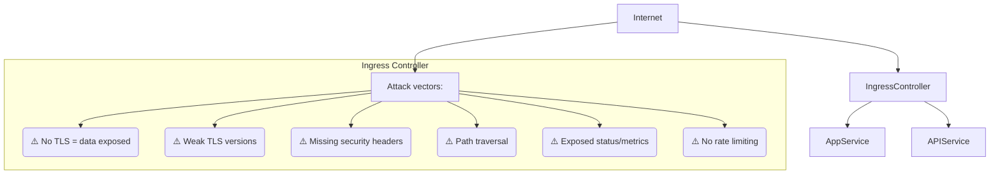
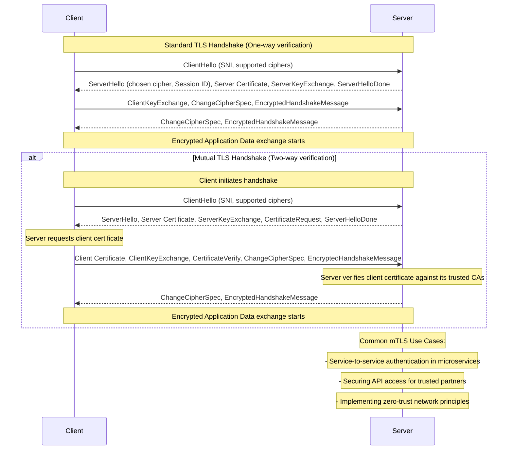
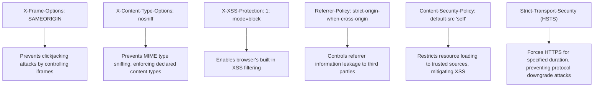

> **Complexity**: Advanced
>
> **Time to Complete**: 35 min
>
> **Prerequisites**: Kubernetes Services and Ingress, TLS basics, NetworkPolicy, Pod securityContext, and NGINX Ingress Controller concepts

---

## What You'll Be Able to Do

- Diagnose ingress TLS, header, rate limiting, and backend bypass failures using manifests, logs, and external checks.
- Implement ingress TLS, HSTS, mTLS, and certificate trust settings for Kubernetes 1.35+ HTTPS edge traffic.
- Design security headers, sensitive path controls, and rate limits that reduce browser, brute force, and disclosure risk.
- Evaluate ingress controller securityContext, NetworkPolicy isolation, and backend service exposure as a zero-trust boundary.
- Debug ingress security failures by comparing expected request paths with controller logs, certificates, and Service reachability.

## Why This Module Matters

Hypothetical scenario: a team publishes a customer API through an Ingress controller and celebrates because the route works over HTTPS from the public internet. A week later, a tester reaches the same backend through an internal Service from a compromised debug pod, bypassing every header, redirect, rate limit, and mTLS rule attached to the Ingress. The Ingress was configured, but the boundary was not designed; the team protected one door while leaving an internal hallway open to any workload already inside the cluster.

Ingress security matters because the controller is both a router and a policy enforcement point. It terminates TLS, parses HTTP, evaluates host and path rules, injects headers, may authenticate clients, and then forwards traffic to Services that often trust it implicitly. That combination makes it the place where many controls converge, but it also makes the controller a high-value target whose misconfiguration can expose private dashboards, metadata-style endpoints, or service-to-service APIs that were never meant to be internet reachable.

This module treats Ingress as an edge security system rather than a convenience object for routing HTTP. You will work from the outside inward: first mapping the request path, then hardening TLS and client identity, then controlling browser behavior and request rates, then isolating backends so those controls cannot be skipped. The examples use the NGINX Ingress Controller because it is common in CKS-style environments, but the decision process applies to any Kubernetes 1.35+ controller that turns Ingress objects into edge proxy configuration.

## The Ingress Attack Surface: Your Cluster's Exposed Edge

An Ingress controller usually sits at the first Layer 7 boundary a request sees before it enters your application network. A cloud load balancer may accept the TCP connection, but the controller is the component that understands HTTP hosts, paths, headers, cookies, and TLS names. That extra application awareness is useful because it lets you route many services through one entry point, but it also means the controller must safely parse hostile input before your application ever receives a request.

The threat model is wider than "someone might forget TLS." A weak Ingress can allow downgrade paths, route ambiguous URLs to the wrong backend, leak browser context through missing security headers, expose status locations, or let one client consume enough controller capacity to starve everyone else. Attackers also look for ways to skip the controller entirely, because a backend Service that accepts traffic from any pod does not care whether the original internet request satisfied your edge policy.



Read this diagram as a set of enforcement questions, not as a checklist of annotations. Does the controller reject weak transport before a request reaches the app? Does it normalize and match paths in a way that cannot be bypassed by odd encoding? Does it add browser-facing protections consistently? Does it expose any controller or application status endpoint to the public internet? The answers shape the design more than the particular YAML field you edit.

Pause and predict: if a request reaches a backend pod without passing through the Ingress controller, which controls from the diagram still apply? TLS between the browser and edge no longer matters, HTTP security headers may never be added, rate limits may not run, and path blocks may be absent. That is why this module keeps returning to the same operational rule: edge policy must be paired with backend isolation, or the policy becomes optional.

The Ingress object itself is also only part of the security story. The controller Deployment, ConfigMap, Service, Secrets, admission policy, and NetworkPolicy all influence the real boundary. A secure review therefore follows the request from the client to the controller, from the controller to the Service, and from the Service to selected pods, then checks whether any side route can avoid the intended decision point.

Host and path matching deserve particular attention because they are the logic that decides which backend receives a request after the controller has accepted it. A wildcard host can be convenient during migration, but it also widens the set of names that reach the controller and may route to an application that assumes a narrower origin. A `Prefix` path is easier to reason about than a complex regular expression, but it still needs testing for trailing slash and encoded path variants. The safest design keeps public hosts specific, keeps sensitive operational routes out of public hosts, and validates the exact request forms attackers are likely to try.

IngressClass is another boundary that often gets ignored during security reviews. In Kubernetes 1.35+, multiple controllers may watch different IngressClass values, which lets platform teams separate public internet traffic, internal-only traffic, and experimental controller behavior. If developers can omit the class or use a shared default without review, a private service can accidentally land on the public edge. A useful admission rule is simple: every Ingress must declare an approved class, and sensitive namespaces may use only the classes intended for their exposure model.

## TLS, HSTS, and Certificate Trust at the Edge

TLS is the first control most learners associate with Ingress, but "has a certificate" is not the same as "has a defensible transport design." The controller must present the right certificate for the requested host, reject obsolete protocols, prefer strong ciphers, and redirect cleartext traffic in a way that does not train clients to keep trying HTTP. The application should not have to guess whether a request arrived securely; the edge should make insecure paths impossible or visibly fail.

For production, certificate issuance should be automated through a trusted certificate authority, usually with a controller such as cert-manager. For a lab or isolated development environment, a self-signed certificate is useful because it lets you verify the mechanics of Kubernetes TLS Secrets and Ingress references without waiting for public DNS and certificate validation. The important habit is to treat the private key as a Secret, scope it to the namespace that owns the Ingress, and avoid copying it between unrelated services.

```bash
# Generate self-signed certificate (for testing purposes only)
# This creates a private key (tls.key) and a self-signed certificate (tls.crt)
openssl req -x509 -nodes -days 365 -newkey rsa:2048 \
  -keyout tls.key -out tls.crt \
  -subj "/CN=myapp.example.com"

# Create a Kubernetes TLS Secret named 'myapp-tls' in the 'production' namespace
# This secret will hold the certificate and key, allowing Ingress to use them.
kubectl create secret tls myapp-tls \
  --cert=tls.crt \
  --key=tls.key \
  -n production

# Verify the contents and type of the created secret
# The 'kubernetes.io/tls' type indicates it's a TLS secret.
kubectl get secret myapp-tls -n production -o yaml
```

Once the Secret exists, the Ingress rule must bind the hostname to that Secret and force HTTP clients toward HTTPS. The redirect is not cosmetic; it prevents accidental plaintext submissions and makes downgrade attempts noisy. HSTS then moves part of the enforcement into supporting browsers, telling them to use HTTPS for future requests to the domain for the configured duration.

```yaml
apiVersion: networking.k8s.io/v1
kind: Ingress
metadata:
  name: secure-ingress
  namespace: production
  annotations:
    # Force all HTTP traffic to redirect to HTTPS. This prevents clients from
    # accidentally or maliciously using unencrypted connections.
    nginx.ingress.kubernetes.io/ssl-redirect: "true"
    # Enable HTTP Strict Transport Security (HSTS). This tells browsers to ONLY
    # communicate with this domain over HTTPS for a specified duration.
    nginx.ingress.kubernetes.io/hsts: "true"
    # The max-age for HSTS, in seconds (1 year = 31536000).
    nginx.ingress.kubernetes.io/hsts-max-age: "31536000"
    # Include subdomains in the HSTS policy.
    nginx.ingress.kubernetes.io/hsts-include-subdomains: "true"
spec:
  ingressClassName: nginx # Specify the Ingress Controller to use (e.g., nginx, traefik)
  tls:
  - hosts:
    - myapp.example.com # The domain name for which this TLS certificate is valid
    secretName: myapp-tls # Reference to the Kubernetes TLS Secret created above
  rules:
  - host: myapp.example.com
    http:
      paths:
      - path: /
        pathType: Prefix
        backend:
          service:
            name: myapp
            port:
              number: 80 # Backend service is typically HTTP, Ingress handles TLS termination
```

The redirect and HSTS settings should be reviewed with client behavior in mind. HSTS is sticky by design, so enabling it on a parent domain with subdomains included can break a forgotten HTTP-only subdomain until it is fixed. That risk is exactly why the setting belongs in a change plan, not as a casual annotation added during an outage.

> **Stop and think**: You've configured TLS on your Ingress with `ssl-redirect: "true"` and HSTS. But a penetration tester shows they can still access your app over HTTP by sending requests directly to the backend Service's ClusterIP, bypassing the Ingress entirely. What additional protection is needed to ensure the backend service _only_ receives traffic from the Ingress controller?

Strong TLS settings should usually be centralized in the controller ConfigMap so every Ingress receives the same minimum standard. If each application team chooses its own protocol list, the cluster drifts toward the weakest exception because old clients have a way of becoming permanent. A global baseline also makes audit evidence easier: you can show the controller configuration once, then review only deliberate per-Ingress overrides.

```yaml
# ConfigMap for nginx-ingress-controller
# This configuration applies globally to all Ingress resources managed by this controller.
apiVersion: v1
kind: ConfigMap
metadata:
  name: nginx-ingress-controller
  namespace: ingress-nginx # The namespace where your ingress-nginx controller is deployed
data:
  # Minimum TLS version: Restrict to TLSv1.2 and TLSv1.3.
  # TLSv1.0 and TLSv1.1 are known to be vulnerable and should be disabled.
  ssl-protocols: "TLSv1.2 TLSv1.3"

  # Strong cipher suites only: Prioritize modern, secure ciphers.
  # This list excludes weak or compromised ciphers.
  ssl-ciphers: "ECDHE-ECDSA-AES128-GCM-SHA256:ECDHE-RSA-AES128-GCM-SHA256:ECDHE-ECDSA-AES256-GCM-SHA384:ECDHE-RSA-AES256-GCM-SHA384"

  # Enable HSTS globally: For all domains managed by this controller.
  hsts: "true"
  hsts-max-age: "31536000" # One year max-age for robustness
  hsts-include-subdomains: "true" # Apply HSTS to all subdomains
  hsts-preload: "true" # Request inclusion in browser HSTS preload lists
```

Cipher names look dense, but they encode real security properties. `ECDHE` provides ephemeral key exchange, which gives forward secrecy so a future server-key leak does not automatically decrypt recorded traffic. `GCM` provides authenticated encryption, which protects confidentiality and detects tampering in one mode. A CKS-level review does not require memorizing every cipher, but it does require recognizing when a controller still permits legacy protocols or weak suites because no one set a floor.

Per-Ingress overrides are useful when a particularly sensitive API needs client certificate verification or stricter cipher preference than the shared baseline. They are also risky because annotations can become scattered policy. Before choosing an override, ask whether the exception is temporary, whether the owning team can test its clients, and whether the control belongs at the controller level instead.

```yaml
apiVersion: networking.k8s.io/v1
kind: Ingress
metadata:
  name: strict-tls-ingress
  annotations:
    # Require client certificate (mTLS) for this specific Ingress.
    # This is a powerful mechanism for service-to-service authentication.
    nginx.ingress.kubernetes.io/auth-tls-verify-client: "on"
    # Specify the Kubernetes Secret containing the CA certificate to verify client certificates.
    nginx.ingress.kubernetes.io/auth-tls-secret: "production/ca-secret"

    # Prefer the server's cipher order over the client's.
    # This ensures that stronger server-side ciphers are always used if supported by the client.
    nginx.ingress.kubernetes.io/ssl-prefer-server-ciphers: "true"
spec:
  tls:
  - hosts:
    - api.example.com
    secretName: api-tls
```

Before running this, what output do you expect from an external TLS scanner if the ConfigMap allows only TLS 1.2 and TLS 1.3? You should expect older protocol probes to fail, modern protocol probes to succeed, and the presented certificate chain to match the host being tested. If the scanner sees a default certificate, the problem is usually host matching, secret reference, controller reload, or DNS pointing at a different edge.

Certificate rotation should be tested before the first urgent renewal. A good rotation exercise proves that the controller notices Secret updates, reloads without dropping healthy traffic, and serves the new certificate chain for the expected host. If cert-manager owns issuance, the review should include the Certificate, Issuer or ClusterIssuer, renewal window, DNS or HTTP challenge path, and alerting for failed renewals. The CKS exam often compresses this into a Secret and Ingress manifest, but production failures usually happen in the renewal machinery around those objects.

Redirect loops are a separate TLS failure mode that can look like application trouble even when certificates are valid. They commonly appear when a cloud load balancer terminates TLS, forwards plain HTTP to the controller, and the controller does not correctly learn that the original client used HTTPS. The controller may keep redirecting because it sees HTTP from the load balancer, while the client keeps following redirects back to the same edge. Fixing that requires trusted proxy configuration and correct forwarded protocol handling, not simply disabling redirects.

There is also a policy difference between edge termination and end-to-end encryption. Many clusters terminate TLS at the Ingress controller and forward HTTP to pods because the internal network is controlled and observable. More sensitive systems may re-encrypt from controller to backend or require backend TLS as well, especially when traffic crosses namespaces owned by different teams. The decision should be explicit: edge termination simplifies certificates and inspection, while backend TLS reduces trust in the cluster network and increases certificate lifecycle work.

## Mutual TLS and Client Identity at the Door

Standard TLS proves the server identity to the client, but it does not prove that the client is allowed to call the API. Mutual TLS adds that second proof by requiring the client to present a certificate signed by a certificate authority the controller trusts. This is a strong fit for partner APIs, internal administrative endpoints, and service-to-service interfaces where possession of a private key is part of the access model.

The operational cost is certificate lifecycle management. Someone must issue client certificates, distribute private keys safely, rotate certificates before expiration, revoke or stop trusting lost credentials, and decide whether backend applications need the verified certificate details. If those processes are vague, mTLS can create brittle outages even while the cryptography itself is strong.



The trust anchor for mTLS is a CA certificate, not every individual client certificate. The controller receives a client certificate during the handshake, verifies that certificate against the trusted CA bundle, checks the chain depth, and only then forwards the request. This means a single Secret containing the CA public certificate can authorize many clients, but it also means compromise of the issuing CA is a much larger event than compromise of one client key.

```bash
# Assume 'ca.crt' is the public CA certificate that signed your client certificates.
# This secret tells the Ingress controller which CA to trust for client authentication.
kubectl create secret generic ca-secret \
  --from-file=ca.crt=ca.crt \
  -n production
```

The Ingress annotations then tell the controller to request and verify the client certificate. Passing the certificate upstream can be helpful when the application needs to authorize based on certificate subject or organization fields, but it should not be done casually. Treat forwarded certificate data as security-sensitive metadata and make sure upstream applications trust it only when it came from the controller path.

```yaml
apiVersion: networking.k8s.io/v1
kind: Ingress
metadata:
  name: mtls-ingress
  namespace: production
  annotations:
    # Enable client certificate verification. This is the core mTLS setting.
    nginx.ingress.kubernetes.io/auth-tls-verify-client: "on"
    # Specify the Secret (namespace/name) containing the CA certificate for client verification.
    nginx.ingress.kubernetes.io/auth-tls-secret: "production/ca-secret"
    # Set the maximum verification depth in the client certificate chain.
    nginx.ingress.kubernetes.io/auth-tls-verify-depth: "1" # Typically 1 for direct CA-signed certs
    # Pass the client certificate to the upstream (backend) service.
    # This allows the backend application to perform further authorization based on client cert details.
    nginx.ingress.kubernetes.io/auth-tls-pass-certificate-to-upstream: "true"
spec:
  tls:
  - hosts:
    - secure-api.example.com
    secretName: api-tls # The server's TLS certificate for secure-api.example.com
  rules:
  - host: secure-api.example.com
    http:
      paths:
      - path: /
        pathType: Prefix
        backend:
          service:
            name: secure-api
            port:
              number: 443 # Backend service expects TLS if mTLS is being terminated there
```

> **What would happen if**: You configure mTLS on your Ingress, requiring client certificates. A legitimate user's client certificate expires over the weekend. What happens to their requests, and how should you design your certificate lifecycle management to prevent service interruptions due to expired credentials?

In an exam or incident, distinguish authentication failure from routing failure. An expired, untrusted, or missing client certificate should fail during the TLS handshake or early request processing, often before the backend application logs anything. A wrong Service name, missing endpoint, or path mismatch is different: the request was accepted by the edge and then could not be forwarded correctly. That timing difference tells you whether to inspect certificate material, controller logs, or Kubernetes Service discovery first.

Client certificate identity is authentication, not complete authorization. A valid partner certificate proves that the caller holds a private key issued under a trusted CA, but it does not automatically answer which tenant, API scope, or operation the caller may use. Some systems map certificate subject fields to application identity; others use mTLS only to admit traffic to a second authentication layer. Be clear about the split, because a backend that treats "valid certificate" as "all actions allowed" can turn one leaked partner key into broad access.

CA rotation is the hardest lifecycle event because old and new client certificates may need to coexist during a migration. A practical design supports a bundle of trusted CA certificates during the overlap, issues new client certificates before removing the old trust anchor, and verifies that stale clients fail only after the planned cutoff. If the controller annotation points to a Secret containing a single CA file, document whether that file is a concatenated bundle and how it will be updated safely. The review is not complete until you know how trust is removed, not only how it is added.

## Security Headers, Rate Limits, and Sensitive Paths

TLS protects the transport, but browsers still need instructions about how to handle returned content. Security headers reduce the blast radius of application bugs by constraining framing, content sniffing, referrer behavior, and script loading. They do not replace application security, yet they are valuable because the edge can apply them consistently even when several backend teams own different services behind the same controller.

NGINX Ingress can inject headers with snippets, but snippets are powerful enough to be dangerous. In many clusters, administrators restrict snippet annotations because they let application teams insert raw NGINX directives into generated configuration. If snippets are allowed, the review standard should be high: the directive must be understandable, scoped, tested, and justified by the application behavior it protects.

```yaml
apiVersion: networking.k8s.io/v1
kind: Ingress
metadata:
  name: hardened-ingress
  annotations:
    # The configuration-snippet allows injecting arbitrary NGINX configuration.
    # Here, we add several crucial security headers.
    nginx.ingress.kubernetes.io/configuration-snippet: |
      add_header X-Frame-Options "SAMEORIGIN" always; # Prevents clickjacking by controlling iframe usage
      add_header X-Content-Type-Options "nosniff" always; # Prevents MIME-type sniffing, enforcing declared content types
      add_header X-XSS-Protection "1; mode=block" always; # Enables browser's built-in XSS filter
      add_header Referrer-Policy "strict-origin-when-cross-origin" always; # Controls how much referrer information is sent
      add_header Content-Security-Policy "default-src 'self'" always; # Restricts resource loading to trusted sources (e.g., same origin)
spec:
  # ... rest of Ingress specification ...
```

Each header answers a different browser question. `X-Frame-Options` tells the browser whether another site may frame the page, which affects clickjacking. `X-Content-Type-Options` tells the browser not to reinterpret content as a different type, which matters when uploads or static assets are involved. Content Security Policy is broader and more delicate because it can block legitimate scripts if the policy does not match the application.



> **Pause and predict**: Your Ingress uses TLS 1.2 minimum for all traffic. A compliance audit now dictates that you must enforce TLS 1.3 *only* for a specific, highly sensitive API endpoint. What percentage of your legitimate clients might this break, and what would be your phased migration plan to implement such a strict requirement without causing a widespread outage? Consider browser support and existing client integrations.

Rate limiting protects availability and makes brute-force attempts more expensive. The trick is to rate-limit at the right identity boundary. If the controller sees every client as the same load balancer IP because forwarded headers are not configured correctly, a per-IP limit can throttle all users together. If it trusts forwarded headers from the public internet without sanitizing them, a client can spoof its way around the limit.

```yaml
apiVersion: networking.k8s.io/v1
kind: Ingress
metadata:
  name: rate-limited-ingress
  annotations:
    # Limit the number of requests per second from a single IP address.
    nginx.ingress.kubernetes.io/limit-rps: "10" # 10 requests per second

    # Limit the number of concurrent connections from a single IP address.
    nginx.ingress.kubernetes.io/limit-connections: "5" # 5 concurrent connections

    # Allows for short bursts of requests above the 'limit-rps' before throttling.
    # A multiplier of 5 means a burst of up to 50 requests can be handled briefly.
    nginx.ingress.kubernetes.io/limit-burst-multiplier: "5"

    # Customize the HTTP status code returned when a client is rate-limited.
    nginx.ingress.kubernetes.io/server-snippet: |
      limit_req_status 429; # Return HTTP 429 Too Many Requests
spec:
  rules:
  - host: api.example.com
    http:
      paths:
      - path: /
        pathType: Prefix
        backend:
          service:
            name: api
            port:
              number: 80
```

Sensitive paths need a separate review because path controls often fail through ambiguity. Admin dashboards, health endpoints, profiling routes, and metrics paths can reveal version data, environment names, internal topology, or operational secrets. Blocking `^/admin` is not enough if the proxy and application disagree about normalization, encoded characters, trailing slashes, or repeated separators.

```yaml
apiVersion: networking.k8s.io/v1
kind: Ingress
metadata:
  name: protected-paths
  annotations:
    # Inject an NGINX location block to deny access to specific paths.
    # This regex matches '/admin', '/metrics', '/health', or '/debug'.
    nginx.ingress.kubernetes.io/server-snippet: |
      location ~ ^/(admin|metrics|health|debug) {
        deny all; # Block access from all IP addresses
        return 403; # Return Forbidden status
      }

    # Alternatively, require external authentication for a path or service.
    # This redirects requests to an external authentication service.
    nginx.ingress.kubernetes.io/auth-url: "https://auth.example.com/verify"
spec:
  rules:
  - host: app.example.com
    http:
      paths:
      - path: /
        pathType: Prefix
        backend:
          service:
            name: app
            port:
              number: 80
```

Which approach would you choose here and why: deny sensitive paths at the edge, require external authentication, or remove the route from the public Ingress entirely? Deny rules are simple but can be bypassed if path interpretation differs. External authentication is flexible but adds a dependency. Removing the route is strongest when the endpoint is operational rather than user-facing, because there is no public edge decision to get wrong.

Header ownership should be written down because both the application and the edge can set response headers. If the app sets one CSP and the controller adds another, browser behavior may become stricter than either team expected, or the final response may depend on proxy merge behavior. A good review identifies the owner for each header, the reason for the chosen value, and the test that proves the header appears on normal responses, redirects, and error responses where the controller can influence them. That prevents a scanner-driven change from quietly breaking a real user path.

Rate limits also need failure semantics. A login endpoint should return a clear 429 when limits trigger, while an expensive export endpoint may need a different limit, a queue, or application-level quotas. If all paths share one blunt limit, a client downloading large reports can interfere with a client making small API calls. The controller is good at coarse edge protection, but business-aware quotas often belong in the application or API gateway because they understand users, tenants, and operation cost.

External authentication annotations introduce a dependency chain that must be part of the threat model. If the auth service is unavailable, the controller must decide whether to fail closed or fail open, and security-sensitive paths should fail closed. If the auth service is reachable over the public internet, that path needs its own TLS and availability review. If the auth response is cached, the cache duration becomes part of revocation behavior. These are not reasons to avoid external auth, but they are reasons to test it like a production dependency.

## Backend Isolation and Controller Hardening

Ingress rules protect only traffic that actually reaches the controller. Kubernetes Services remain reachable inside the cluster unless another control says otherwise, so a compromised pod in the same network plane can attempt direct access to backend ClusterIPs. NetworkPolicy turns the intended route into an enforced route by allowing selected backend pods to receive traffic only from the ingress controller pods and only on the expected port.

This is where labels become security-critical. The namespaceSelector and podSelector must match the controller namespace and pods you actually run, not a label you wish existed. If the labels are wrong, the policy may block all ingress traffic and look like an application outage, or it may select nothing useful and leave the bypass open. Always verify the labels with `kubectl get namespace --show-labels` and `kubectl get pods --show-labels` before trusting the policy.

```yaml
# This NetworkPolicy ensures that only the ingress-nginx controller
# can send traffic to pods labeled 'app: myapp' in the 'production' namespace.
apiVersion: networking.k8s.io/v1
kind: NetworkPolicy
metadata:
  name: allow-from-ingress-only
  namespace: production # The namespace where your backend application is
spec:
  podSelector:
    matchLabels:
      app: myapp # Selects the pods of your application
  policyTypes:
  - Ingress # This policy applies to incoming traffic
  ingress:
  - from:
    - namespaceSelector:
        matchLabels:
          name: ingress-nginx # Selects the namespace where the ingress controller runs
      podSelector:
        matchLabels:
          app.kubernetes.io/name: ingress-nginx # Selects the ingress controller pods
    ports:
    - port: 80 # Allow traffic on port 80 (where the backend service listens)
```

The controller itself also deserves hardening because it is exposed by design. If an attacker exploits a controller vulnerability, the container securityContext determines whether that exploit can write to the filesystem, gain additional privileges, or use Linux capabilities beyond what the proxy needs. A hardened controller should run as non-root, drop capabilities by default, avoid privilege escalation, and request enough resources that normal traffic does not create noisy starvation.

```yaml
apiVersion: apps/v1
kind: Deployment
metadata:
  name: ingress-nginx-controller
  namespace: ingress-nginx
spec:
  template:
    spec:
      containers:
      - name: controller
        image: registry.k8s.sio/ingress-nginx/controller:v1.9.0 # Use a specific, well-vetted image version
        securityContext:
          runAsNonRoot: true # Ensure the container does not run as root
          runAsUser: 101 # Run as an arbitrary non-root user (e.g., 101, common for nginx)
          readOnlyRootFilesystem: true # Prevent writing to the container's root filesystem
          allowPrivilegeEscalation: false # Prevent processes from gaining more privileges
          capabilities:
            drop:
            - ALL # Drop all Linux capabilities by default
            add:
            - NET_BIND_SERVICE # Only add necessary capabilities, like binding to low ports
        resources:
          limits:
            cpu: "1" # Limit CPU usage to prevent DoS attacks on the controller itself
            memory: 512Mi # Limit memory usage
          requests:
            cpu: 100m # Request minimum resources for scheduling
            memory: 256Mi
```

There is an important tradeoff in `NET_BIND_SERVICE`. Some controller images need it to bind low ports inside the container; other deployments can avoid it by binding high container ports and mapping them through a Service. The senior move is not to remove every capability blindly, but to prove which capability is required by the selected deployment shape and then keep only that one.

Hardening also includes controller scope. If a single controller watches every namespace, a bad annotation in one tenant's namespace can affect an edge component shared by many teams. Separate controllers, separate IngressClass values, and admission rules for risky annotations can reduce blast radius. The CKS exam may present the smaller manifest-level problem, but production design asks who is allowed to program the edge in the first place.

NetworkPolicy enforcement depends on the cluster networking plugin. Kubernetes defines the NetworkPolicy API, but a policy has no effect unless the installed CNI implements it. That means a passing YAML review is not enough; you also need one negative connectivity test from a pod that should be denied and one positive test through the ingress controller path. In exam environments, assume policy support when the task is about NetworkPolicy, but in production, record the CNI capability as part of the control evidence.

Resource requests and limits are security controls when the controller is exposed to untrusted traffic. Without a CPU request, the scheduler may place the controller where it competes badly with workloads; without a memory limit, a parsing or buffering spike can pressure the node. Limits that are too small can also create self-inflicted denial of service, so tune them from observed traffic and controller metrics rather than copying a number forever. The objective is predictable failure under stress, not an arbitrary small footprint.

## Debugging Ingress Security Issues

Debugging secure Ingress starts by identifying where the request was rejected. A browser certificate warning points toward TLS Secret, host, chain, or SNI problems. A 308 or 301 loop points toward redirect logic, forwarded protocol headers, or a load balancer that terminates TLS before the controller. A 403 at a sensitive path points toward a deliberate deny or authentication rule, while a 429 points toward rate limiting or client identity collapse behind a proxy.

Manifest inspection is the first pass because many failures are visible without packet captures. Use `kubectl describe ingress <name>` to confirm the IngressClass, hosts, paths, backend Service names, TLS Secret references, and controller events. Use `kubectl get secret <name> -o yaml` to confirm the Secret type and keys, then inspect controller logs for reload failures or certificate verification errors. If the controller never accepted the configuration, external tests will only show the previous state.

Controller logs are especially useful for mTLS and rate limiting. A client certificate rejected by the controller will often leave no application log because the backend never received the request. A rate-limited request may show the configured status code and limiting zone. A backend bypass, however, may produce application logs without corresponding controller access logs, which is a strong signal that traffic is entering through a Service path the edge does not control.

External validation closes the loop because it tests what clients actually see. Tools such as `nmap`, `sslyze`, browser developer tools, and simple `curl -I` checks can verify protocol versions, certificate chain, response headers, redirects, and public path behavior. Internal validation should then try to reach the backend Service from a non-ingress pod to prove whether the NetworkPolicy blocks bypasses. A clean design passes both tests: the outside sees the expected edge policy, and the inside cannot avoid it.

When debugging, resist the urge to change several annotations at once. Move one layer at a time: TLS identity, redirect and HSTS, client authentication, headers, rate limits, path controls, backend isolation, and controller securityContext. That order mirrors the request path, which makes your observations easier to trust and helps you avoid masking the real problem with a second accidental change.

A useful evidence pattern is to compare three logs or observations for the same request: the client-visible status, the controller access or error log, and the backend application log. If the client sees 403 and the backend sees nothing, an edge rule probably stopped the request. If the backend sees the request and the controller does not, the request bypassed the edge or hit a different controller. If the controller sees a reload error before the test, you are not testing the manifest you think you applied.

For TLS failures, collect the certificate subject, issuer, expiry, SAN list, and protocol chosen by the client. For mTLS failures, add the client certificate chain and the trusted CA Secret content. For rate limiting, collect the observed client IP or forwarded identity as the controller sees it. For NetworkPolicy bypass tests, record the source pod labels, namespace labels, destination pod labels, and destination port. These details keep debugging concrete and prevent vague conclusions such as "Ingress is broken" when only one layer failed.

## Worked Example: Hardening a Public API Ingress

Exercise scenario: a platform team is asked to expose `api.example.com` for a production API that has public user traffic, a private `/metrics` endpoint, and a partner-only `/partner` route. The first draft has one Ingress, one TLS Secret, no rate limit, and no NetworkPolicy. It works from a browser, but the review has to decide whether it is safe enough to publish.

The first decision is to separate user traffic from operational traffic. The `/metrics` endpoint is not a user feature, so the strongest answer is to remove it from the public host rather than write a clever deny rule. If the monitoring system needs metrics, expose them through an internal Service or a private controller class. That single design choice removes an entire path-parsing problem from the public edge.

The second decision is to define the public transport baseline. The controller should present a certificate whose SAN includes `api.example.com`, redirect HTTP to HTTPS, set HSTS only after the team confirms every required subdomain supports HTTPS, and reject TLS versions below the controller baseline. The evidence is external: a scanner should show only the allowed protocols, and a plain HTTP request should redirect instead of serving application content.

The third decision is how to protect `/partner`. If partner identity must be proven before the API spends backend capacity, mTLS at the edge is appropriate. The team stores the partner CA certificate in a namespace-scoped Secret, enables client verification on the partner route, and decides whether the backend needs forwarded certificate details for authorization. The lifecycle plan names who issues client certificates, how expiry is monitored, and how trust is removed when a partner leaves.

The fourth decision is browser and abuse protection for the public route. Response headers should be owned either by the app or the controller, not improvised by both. Rate limiting should use the actual client identity after the load balancer path is understood, and the limit should match the endpoint cost. A login route, a read-heavy catalog route, and an expensive export route do not necessarily deserve the same threshold.

The fifth decision is backend isolation. The API pods receive a NetworkPolicy that allows inbound traffic only from the ingress controller pods on the application port. A debug pod in another namespace should fail to connect to the backend Service, while a request through the public Ingress should still work. If those two tests do not disagree in exactly that way, the policy is either not enforced, not selecting the right pods, or not testing the path you think it is testing.

The sixth decision is controller blast radius. The controller Deployment should run with a non-root user, no privilege escalation, dropped capabilities except those required by the deployment shape, a read-only root filesystem where the image supports it, and explicit resources. If the controller watches many namespaces, the platform team should also review who can create Ingress objects for the public IngressClass and who can use high-risk annotations such as snippets.

The finished review produces a concrete test plan: external HTTPS scan, header check, HTTP redirect check, mTLS negative and positive client tests, repeated-request rate limit test, sensitive path test, internal bypass test, controller log review, and backend log correlation. That plan is more valuable than a long list of annotations because each item proves a property the design claims to enforce. When one test fails, the request path tells you which layer to inspect first.

The rollback plan should be just as specific as the hardening plan. If a CSP blocks production assets, the team needs to know whether to remove only that header, switch to a report-only policy, or roll back the entire Ingress change. If mTLS blocks a partner, the team needs a temporary client certificate process that does not weaken every caller. If NetworkPolicy blocks the application, the safest rollback is usually a narrow selector correction, not deleting all isolation in panic.

## Patterns & Anti-Patterns

Patterns in Ingress security are about making the intended request path explicit and repeatable. Good teams decide which controller owns which class of traffic, centralize baseline TLS settings, restrict backend access, and test the edge from both outside and inside the cluster. They also document exceptions, because an annotation that was justified for a temporary migration can become a permanent hidden weakness if no one records its owner and expiry condition.

| Pattern | When to Use It | Why It Works | Scaling Consideration |
|---|---|---|---|
| Controller-level TLS baseline | Most internet-facing applications share the same security standard | One ConfigMap prevents weaker per-app drift | Use separate controllers only when client requirements truly differ |
| Ingress plus NetworkPolicy | Backends must receive traffic only through the edge | Direct ClusterIP access cannot bypass TLS, headers, mTLS, or rate limits | Requires reliable namespace and pod labels for the controller |
| mTLS for partner or administrative APIs | Client identity must be proven before the app handles a request | Unauthorized clients fail at the edge before using backend capacity | Needs certificate issuance, rotation, and revocation procedures |
| External validation after manifest changes | Security controls must match what clients see | Scanners reveal stale reloads, wrong certificates, and missing headers | Automate checks for critical hosts in release pipelines |

Anti-patterns usually appear when routing success is mistaken for security success. A route that returns HTTP 200 may still allow weak TLS, leak headers, expose metrics, or accept direct backend traffic. Another common trap is giving every namespace unrestricted access to high-risk annotations, which turns the shared edge into a programmable surface with too many authors and too little review.

| Anti-Pattern | What Goes Wrong | Better Alternative |
|---|---|---|
| Only adding `tls:` to the Ingress | HTTP paths, weak protocols, or default certificates may still exist | Pair host TLS with redirects, HSTS, scanner checks, and controller logs |
| Trusting public forwarded headers | Clients may spoof source IP and bypass rate limits | Trust forwarded headers only from known load balancer hops |
| Publishing `/metrics` on the public host | Operational data can reveal versions, paths, and internals | Keep metrics on a private Service or require strong authentication |
| Relying on Ingress without NetworkPolicy | Compromised pods can call the backend Service directly | Restrict backend ingress to the controller pod labels and ports |
| Allowing arbitrary snippets everywhere | Raw proxy config can weaken or break shared edge behavior | Gate snippet use with policy, review, and separate controller classes |

## Decision Framework

Choose controls by asking what must be true before a request reaches the application. If the requirement is confidentiality in transit, TLS and redirect policy are the starting point. If the requirement is client identity, mTLS or external authentication must run before the backend. If the requirement is reducing browser-side exploit impact, headers belong in the response path. If the requirement is preventing bypass, NetworkPolicy is the decisive control because it changes who can talk to the pods.

| Decision Question | Prefer This Control | Tradeoff to Check | Evidence That It Works |
|---|---|---|---|
| Must every public client use encrypted transport? | TLS Secret, HTTPS redirect, HSTS, modern protocol baseline | HSTS can break forgotten HTTP-only subdomains | External scan rejects HTTP downgrade and old TLS versions |
| Must only known clients call the API? | mTLS with a managed CA bundle | Certificate lifecycle can create outages | Missing or expired client cert fails before backend logs appear |
| Must browsers receive safer defaults? | Security headers at the controller or app | CSP can block legitimate assets if too strict | `curl -I` and browser tools show expected headers |
| Must abuse be slowed before app capacity is consumed? | Rate limiting at the controller with trusted client IP handling | Wrong source IP handling can punish all users or no one | Repeated requests return 429 while normal flow succeeds |
| Must internal pods be unable to bypass the edge? | NetworkPolicy allowing only ingress controller pods | Label mistakes can block valid traffic | Test pod outside ingress namespace cannot connect to backend Service |
| Must edge compromise have limited blast radius? | Non-root controller, dropped capabilities, read-only root filesystem | Controller image may require one specific capability | Deployment starts successfully with reduced privileges |

This framework keeps you from treating annotations as a shopping list. Start with the failure you are trying to prevent, choose the control that enforces that condition earliest, and then verify from the perspective an attacker would use. For example, if the failure is "backend accepts traffic that never passed mTLS," then adding another header does nothing; the relevant evidence is an internal connection attempt blocked by NetworkPolicy.

## Did You Know?

- Kubernetes Ingress reached stable `networking.k8s.io/v1` status in Kubernetes 1.19, while newer traffic-management work continues in the Gateway API.
- PCI DSS migration guidance required disabling SSL and early TLS for many use cases by June 30, 2018, which is why TLS 1.0 and 1.1 are still audit findings.
- HSTS preload submission requires a long `max-age`, `includeSubDomains`, a valid certificate chain, and the `preload` directive before browsers will consider the domain.
- NGINX-style request limiting is commonly explained with a leaky-bucket model, which smooths bursts instead of simply accepting a whole burst instantly.

## Common Mistakes

| Mistake | Why It Happens | How to Fix It |
|---|---|---|
| Treating `tls:` as complete Ingress security | The route works in a browser, so the team stops at certificate success | Add HTTPS redirect, HSTS, protocol baselines, external scans, and backend isolation |
| Forgetting direct Service access | Ingress is visible, while ClusterIP reachability is hidden inside the cluster | Apply NetworkPolicy so only controller pods can reach selected backend pods |
| Enabling mTLS without rotation planning | Certificate issuance is solved once, but expiry is ignored until clients fail | Track certificate owners, expiry windows, replacement process, and rollback behavior |
| Adding security headers through unreviewed snippets | Snippets are quick and local, but they inject raw proxy configuration | Prefer controller policy where possible and gate snippet use through review |
| Rate limiting the wrong client identity | The controller sees a load balancer address or trusts spoofed headers | Configure trusted proxy handling and validate limits from realistic client paths |
| Blocking sensitive paths with narrow regexes | Proxy and application path normalization differ in edge cases | Remove the public route or test encoded, repeated-slash, and trailing-slash variants |
| Hardening the controller until it cannot start | Capabilities and filesystem writes are removed without checking image needs | Drop privileges incrementally and confirm logs, health checks, and bind behavior |

## Quiz

<details><summary>Your team enabled TLS on an Ingress, but an internal test pod can still call the backend Service over plain HTTP. What should you check first?</summary>

The most important check is whether a NetworkPolicy restricts backend pod ingress to the ingress controller pods. TLS on the public Ingress protects the browser-to-edge path, but it does not automatically control ClusterIP traffic inside the cluster. If the backend accepts traffic from any pod, edge-only controls such as HSTS, mTLS, headers, and rate limits can be bypassed. Verify the backend pod labels, the controller namespace labels, and the selected port before assuming the policy is working.
</details>

<details><summary>A partner API protected by mTLS suddenly fails for one partner after a weekend certificate change. Where do you look before changing the backend application?</summary>

Start with the client certificate chain, expiration time, issuing CA, and the `auth-tls-secret` referenced by the Ingress. An mTLS failure usually happens at the controller before the backend receives the request, so application logs may be empty even when the client sees a failure. Controller logs can show whether the certificate was missing, expired, signed by an untrusted CA, or deeper than the allowed verification depth. Change the backend only after the TLS handshake evidence shows the request reached it.
</details>

<details><summary>An audit says your public API still accepts TLS 1.0 even though every Ingress has a `tls:` section. What is the likely design mistake?</summary>

The likely mistake is confusing certificate binding with protocol policy. The `tls:` section tells the controller which certificate to present for a host, but allowed TLS versions and ciphers are usually configured in the controller ConfigMap or equivalent controller settings. Set a controller-level baseline such as TLS 1.2 and TLS 1.3, then retest externally. If one application needs stricter settings, document and test that per-Ingress exception separately.
</details>

<details><summary>A login endpoint returns 429 for many unrelated users during a traffic spike. What rate limiting assumption may be wrong?</summary>

The controller may be identifying all users as the same client because it sees only the upstream load balancer IP. Per-IP rate limits are useful only when the controller has a trustworthy client address, which may require correct forwarded-header handling from known proxy hops. If forwarded headers are trusted from the open internet, clients can spoof addresses and avoid limits. Validate the observed source identity in controller logs before changing the numeric limit.
</details>

<details><summary>Your app needs a Content Security Policy, but the first strict policy breaks legitimate scripts. What should the Ingress security design do?</summary>

Treat CSP as a staged policy rather than a blind one-line hardening change. Start with the application asset model, test in a lower environment, and use browser developer tools or report-only behavior where appropriate before enforcing a strict policy. The edge can apply the header consistently, but it cannot know which scripts, fonts, or APIs the application actually requires. The design goal is to reduce XSS impact without silently breaking core user flows.
</details>

<details><summary>A public host exposes `/metrics` through the same Ingress as the user application. Which fix is strongest when metrics are only for operators?</summary>

The strongest fix is to remove the metrics path from the public Ingress and expose it only through a private monitoring path or internal Service. A deny regex helps, and external authentication can be acceptable for some administrative routes, but both leave a public decision point that must be parsed correctly. Metrics often reveal versions, labels, paths, and operational shape, so they should not share the internet-facing user route unless there is a clear business requirement. After changing the route, test common path variants and encoded forms.
</details>

<details><summary>You hardened the ingress controller securityContext and it now crash loops. How do you debug without abandoning hardening?</summary>

Compare the new restrictions against what the selected controller image needs at startup. A read-only root filesystem may require writable temporary volumes, and binding low ports may require `NET_BIND_SERVICE` unless the container uses high ports. Check controller logs, events, and readiness failures, then add back only the minimum required capability or mount. The goal is not maximum YAML severity; it is a controller that starts reliably with a small, justified privilege set.
</details>

## Hands-On Exercise

In this exercise, use the manifests and command examples from the module as the source material for a security review. You do not need to create a production-grade public DNS name; the goal is to prove that each layer has an observable behavior. Work in a disposable namespace if you run the examples, and keep the controller-specific assumptions tied to NGINX Ingress so you do not mix annotations from different controllers.

- [ ] Diagnose ingress TLS, header, and rate limiting behavior from the preserved manifests and explain each expected status.
- [ ] Implement ingress TLS, HSTS, mTLS, and certificate trust settings in a namespace without using kubectl shorthand.
- [ ] Design security headers, path controls, and rate limits for a public API and document the tradeoff.
- [ ] Evaluate ingress controller securityContext and NetworkPolicy isolation to prevent backend bypass.
- [ ] Debug ingress security failures by reviewing manifests, controller logs, certificates, and Service reachability.

<details><summary>Solution guidance for task 1</summary>

Start with the request path: client, load balancer, ingress controller, Service, and pod. For TLS, expect HTTP to redirect, HTTPS to present the named certificate, and obsolete TLS probes to fail after the controller ConfigMap is applied. For headers, expect the configured response headers on successful edge responses, not necessarily on handshake failures. For rate limiting, repeated requests from the same trusted client identity should eventually return the configured 429 status.
</details>

<details><summary>Solution guidance for task 2</summary>

Create the TLS Secret with the full `kubectl create secret tls` command shown earlier, then bind it to the Ingress host through `spec.tls`. Create the CA Secret for mTLS separately and reference it with the `auth-tls-secret` annotation. Confirm that the Secret namespace matches the Ingress annotation format. If a client without a valid certificate reaches the backend, the mTLS policy is not being enforced on the path you tested.
</details>

<details><summary>Solution guidance for task 3</summary>

Choose headers based on browser behavior you need to constrain, not because a scanner lists them. Use `X-Content-Type-Options` for MIME sniffing resistance, framing controls for clickjacking exposure, and CSP only after testing application assets. Rate limits should be tied to a trustworthy client identity, and sensitive paths should be removed from public routing when they are operational rather than user-facing. Document every snippet because it changes generated proxy configuration.
</details>

<details><summary>Solution guidance for task 4</summary>

Match the NetworkPolicy selectors to real labels on the backend pods, ingress namespace, and controller pods. Then test from a non-ingress pod and expect the backend connection to fail while traffic through the controller still works. Review the controller Deployment for non-root execution, privilege escalation prevention, dropped capabilities, and a read-only filesystem. If the controller fails to start, add only the specific writable mount or capability the logs prove is required.
</details>

<details><summary>Solution guidance for task 5</summary>

Separate failures by layer. Certificate warnings point to host, chain, Secret, or SNI issues; 403 responses point to path or authentication rules; 429 responses point to limits; missing application logs during mTLS failure point to controller-side rejection. Compare controller access logs with application logs to detect bypasses. A request visible in the app but absent from controller logs likely did not follow the intended edge path.
</details>

## Sources

- https://kubernetes.io/docs/concepts/services-networking/ingress/
- https://kubernetes.io/docs/concepts/services-networking/network-policies/
- https://kubernetes.io/docs/tasks/configure-pod-container/security-context/
- https://kubernetes.github.io/ingress-nginx/user-guide/nginx-configuration/annotations/
- https://kubernetes.github.io/ingress-nginx/user-guide/nginx-configuration/configmap/
- https://kubernetes.github.io/ingress-nginx/examples/auth/client-certs/
- https://kubernetes.github.io/ingress-nginx/user-guide/nginx-configuration/annotations/#rate-limiting
- https://cert-manager.io/docs/usage/ingress/
- https://developer.mozilla.org/en-US/docs/Web/HTTP/Headers/Strict-Transport-Security
- https://developer.mozilla.org/en-US/docs/Web/HTTP/CSP
- https://cheatsheetseries.owasp.org/cheatsheets/HTTP_Headers_Cheat_Sheet.html
- https://hstspreload.org/
- https://www.pcisecuritystandards.org/document_library?category=pcidss&document=pci_dss

## Next Module

Next, continue to [Module 1.4: Node Metadata Protection](/k8s/cks/part1-cluster-setup/module-1.4-node-metadata/) to protect the cloud identity and instance metadata paths that edge components must never be able to abuse.
