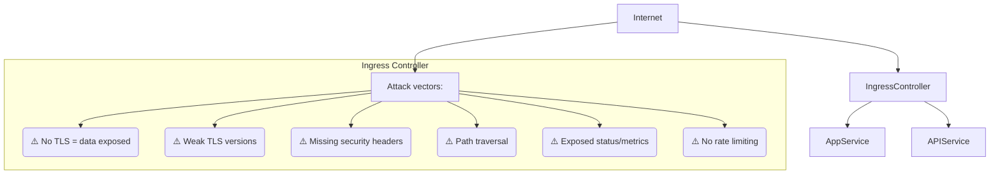
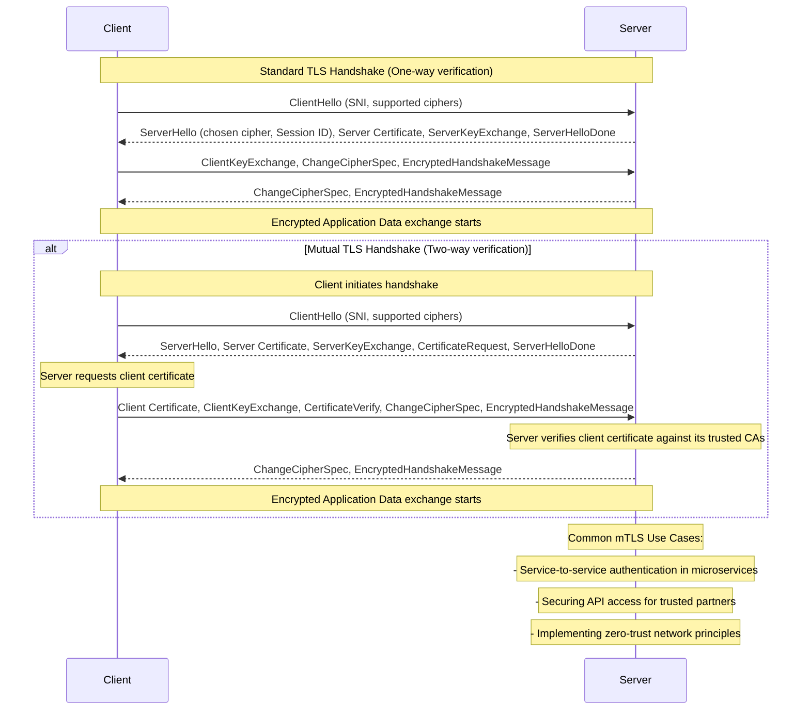
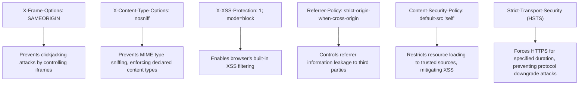

## Why This Module Matters: The $50 Million Front Door Attack

In October 2021, a major financial institution's Kubernetes cluster experienced a devastating breach. The initial point of compromise? A critically misconfigured NGINX Ingress controller. Attackers exploited weak TLS configurations, missing security headers, and an exposed `/metrics` endpoint to gain a foothold. This seemingly simple oversight at the cluster's "front door" led to an estimated $50 million in damages, regulatory fines, and a significant erosion of customer trust. This wasn't a sophisticated zero-day; it was a stark reminder that neglecting fundamental security hygiene at the most exposed perimeter can have catastrophic consequences.

Your CKS certification demands more than just a functional Ingress; it requires the ability to anticipate and neutralize such threats. This module will arm you with the knowledge to transform your Kubernetes Ingress from a potential vulnerability into a formidable defensive perimeter. We'll explore how to eliminate common attack vectors, enforce stringent communication policies, and integrate your Ingress into a robust, layered security strategy. Mastering these techniques is not merely about passing an exam; it's about protecting real-world systems from devastating and costly breaches.

> **Security Note**: The `ingress-nginx` controller has seen rapid evolution. Always ensure you are running a supported, up-to-date version. If your clusters still rely on older, retired versions (like the one deprecated on March 31, 2026), this constitutes a **critical security risk**. Prioritize migration to a currently maintained controller (e.g., Envoy Gateway, Traefik, Cilium, NGINX Gateway Fabric) and consider adopting the Gateway API for new deployments. The security principles taught here are universally applicable across Ingress and Gateway API implementations.

## Learning Outcomes

Upon completing this module, you will be able to:

1.  **Diagnose** common Ingress security vulnerabilities such as misconfigured TLS, missing security headers, and exposed administrative endpoints.
2.  **Implement** robust TLS configurations, including HSTS, mTLS, and strong cipher suites, to secure data in transit.
3.  **Design** and apply comprehensive security headers and rate-limiting policies to mitigate common web application attacks.
4.  **Evaluate** and harden Ingress controller deployments and leverage Kubernetes NetworkPolicies for defense-in-depth.
5.  **Debug** Ingress security issues by analyzing manifest files, controller logs, and external scanning tools.

---

## The Ingress Attack Surface: Your Cluster's Exposed Edge

The Ingress controller is the gateway between your Kubernetes services and the untrusted internet. It's the first line of defense, but also the most exposed component. Understanding its potential attack vectors is the first step toward securing it.


**Figure 1.3.1: Ingress Security Attack Surface**

An attacker's goal is often to exploit vulnerabilities at this edge to either gain access to internal services, steal data, or disrupt operations. This diagram illustrates the critical role your Ingress plays in securing your applications and highlights common points of failure that we will address throughout this module.

---

## Comprehensive TLS Configuration for Ingress

Transport Layer Security (TLS) is non-negotiable for any internet-facing application. It encrypts communication between clients and your services, preventing eavesdropping and tampering.

### Creating TLS Secrets

Before you can secure your Ingress, you need TLS certificates. For production environments, you'd obtain these from a trusted Certificate Authority (CA) like Let's Encrypt, often automated with `cert-manager`. For testing and development, self-signed certificates suffice. These certificates and their private keys are stored securely in Kubernetes Secrets.

```bash
# Generate self-signed certificate (for testing purposes only)
# This creates a private key (tls.key) and a self-signed certificate (tls.crt)
openssl req -x509 -nodes -days 365 -newkey rsa:2048 \
  -keyout tls.key -out tls.crt \
  -subj "/CN=myapp.example.com"

# Create a Kubernetes TLS Secret named 'myapp-tls' in the 'production' namespace
# This secret will hold the certificate and key, allowing Ingress to use them.
kubectl create secret tls myapp-tls \
  --cert=tls.crt \
  --key=tls.key \
  -n production

# Verify the contents and type of the created secret
# The 'kubernetes.io/tls' type indicates it's a TLS secret.
kubectl get secret myapp-tls -n production -o yaml
```

### Ingress with TLS and Forced HTTPS Redirect

Once your secret is ready, you can configure your Ingress resource to use it. It's crucial to force all traffic to HTTPS, preventing unencrypted communication.

```yaml
apiVersion: networking.k8s.io/v1
kind: Ingress
metadata:
  name: secure-ingress
  namespace: production
  annotations:
    # Force all HTTP traffic to redirect to HTTPS. This prevents clients from
    # accidentally or maliciously using unencrypted connections.
    nginx.ingress.kubernetes.io/ssl-redirect: "true"
    # Enable HTTP Strict Transport Security (HSTS). This tells browsers to ONLY
    # communicate with this domain over HTTPS for a specified duration.
    nginx.ingress.kubernetes.io/hsts: "true"
    # The max-age for HSTS, in seconds (1 year = 31536000).
    nginx.ingress.kubernetes.io/hsts-max-age: "31536000"
    # Include subdomains in the HSTS policy.
    nginx.ingress.kubernetes.io/hsts-include-subdomains: "true"
spec:
  ingressClassName: nginx # Specify the Ingress Controller to use (e.g., nginx, traefik)
  tls:
  - hosts:
    - myapp.example.com # The domain name for which this TLS certificate is valid
    secretName: myapp-tls # Reference to the Kubernetes TLS Secret created above
  rules:
  - host: myapp.example.com
    http:
      paths:
      - path: /
        pathType: Prefix
        backend:
          service:
            name: myapp
            port:
              number: 80 # Backend service is typically HTTP, Ingress handles TLS termination
```

> **Stop and think**: You've configured TLS on your Ingress with `ssl-redirect: "true"` and HSTS. But a penetration tester shows they can still access your app over HTTP by sending requests directly to the backend Service's ClusterIP, bypassing the Ingress entirely. What additional protection is needed to ensure the backend service _only_ receives traffic from the Ingress controller?

---

## Enforcing Strong TLS Versions and Cipher Suites

Beyond simply enabling TLS, you must enforce modern TLS protocols and strong cipher suites. Older versions (TLS 1.0/1.1) and weak ciphers are vulnerable to known attacks.

### Global TLS Configuration in Ingress Controller ConfigMap

For `ingress-nginx`, global TLS settings are typically configured in a `ConfigMap` that the controller consumes. This ensures consistent security across all Ingresses managed by that controller.

```yaml
# ConfigMap for nginx-ingress-controller
# This configuration applies globally to all Ingress resources managed by this controller.
apiVersion: v1
kind: ConfigMap
metadata:
  name: nginx-ingress-controller
  namespace: ingress-nginx # The namespace where your ingress-nginx controller is deployed
data:
  # Minimum TLS version: Restrict to TLSv1.2 and TLSv1.3.
  # TLSv1.0 and TLSv1.1 are known to be vulnerable and should be disabled.
  ssl-protocols: "TLSv1.2 TLSv1.3"

  # Strong cipher suites only: Prioritize modern, secure ciphers.
  # This list excludes weak or compromised ciphers.
  ssl-ciphers: "ECDHE-ECDSA-AES128-GCM-SHA256:ECDHE-RSA-AES128-GCM-SHA256:ECDHE-ECDSA-AES256-GCM-SHA384:ECDHE-RSA-AES256-GCM-SHA384"

  # Enable HSTS globally: For all domains managed by this controller.
  hsts: "true"
  hsts-max-age: "31536000" # One year max-age for robustness
  hsts-include-subdomains: "true" # Apply HSTS to all subdomains
  hsts-preload: "true" # Request inclusion in browser HSTS preload lists
```

### Per-Ingress TLS Settings

While global settings are good, specific Ingresses might require even stricter, or slightly different, TLS configurations. Annotations allow granular control.

```yaml
apiVersion: networking.k8s.io/v1
kind: Ingress
metadata:
  name: strict-tls-ingress
  annotations:
    # Require client certificate (mTLS) for this specific Ingress.
    # This is a powerful mechanism for service-to-service authentication.
    nginx.ingress.kubernetes.io/auth-tls-verify-client: "on"
    # Specify the Kubernetes Secret containing the CA certificate to verify client certificates.
    nginx.ingress.kubernetes.io/auth-tls-secret: "production/ca-secret"

    # Prefer the server's cipher order over the client's.
    # This ensures that stronger server-side ciphers are always used if supported by the client.
    nginx.ingress.kubernetes.io/ssl-prefer-server-ciphers: "true"
spec:
  tls:
  - hosts:
    - api.example.com
    secretName: api-tls
```

---

## Mutual TLS (mTLS): Two-Way Authentication

Standard TLS provides one-way authentication: the client verifies the server's identity. Mutual TLS (mTLS) adds a second layer, where the server also verifies the client's identity using client certificates. This is invaluable for securing APIs, service-to-service communication, and implementing zero-trust architectures.


**Figure 1.3.2: Standard vs. Mutual TLS Authentication Flow**

### Configuring mTLS

To enable mTLS, you need a Certificate Authority (CA) certificate that signed your client certificates. This CA certificate is stored in a Kubernetes Secret, and your Ingress is configured to use it for client verification.

```bash
# Assume 'ca.crt' is the public CA certificate that signed your client certificates.
# This secret tells the Ingress controller which CA to trust for client authentication.
kubectl create secret generic ca-secret \
  --from-file=ca.crt=ca.crt \
  -n production
```

```yaml
apiVersion: networking.k8s.io/v1
kind: Ingress
metadata:
  name: mtls-ingress
  namespace: production
  annotations:
    # Enable client certificate verification. This is the core mTLS setting.
    nginx.ingress.kubernetes.io/auth-tls-verify-client: "on"
    # Specify the Secret (namespace/name) containing the CA certificate for client verification.
    nginx.ingress.kubernetes.io/auth-tls-secret: "production/ca-secret"
    # Set the maximum verification depth in the client certificate chain.
    nginx.ingress.kubernetes.io/auth-tls-verify-depth: "1" # Typically 1 for direct CA-signed certs
    # Pass the client certificate to the upstream (backend) service.
    # This allows the backend application to perform further authorization based on client cert details.
    nginx.ingress.kubernetes.io/auth-tls-pass-certificate-to-upstream: "true"
spec:
  tls:
  - hosts:
    - secure-api.example.com
    secretName: api-tls # The server's TLS certificate for secure-api.example.com
  rules:
  - host: secure-api.example.com
    http:
      paths:
      - path: /
        pathType: Prefix
        backend:
          service:
            name: secure-api
            port:
              number: 443 # Backend service expects TLS if mTLS is being terminated there
```

> **What would happen if**: You configure mTLS on your Ingress, requiring client certificates. A legitimate user's client certificate expires over the weekend. What happens to their requests, and how should you design your certificate lifecycle management to prevent service interruptions due to expired credentials?

---

## Implementing Security Headers

Security headers are HTTP response headers that provide an additional layer of defense against common web vulnerabilities like XSS, clickjacking, and MIME-type sniffing.

### Essential Security Headers via Ingress Annotations

For NGINX Ingress, you can inject custom headers using the `configuration-snippet` annotation.

```yaml
apiVersion: networking.k8s.io/v1
kind: Ingress
metadata:
  name: hardened-ingress
  annotations:
    # The configuration-snippet allows injecting arbitrary NGINX configuration.
    # Here, we add several crucial security headers.
    nginx.ingress.kubernetes.io/configuration-snippet: |
      add_header X-Frame-Options "SAMEORIGIN" always; # Prevents clickjacking by controlling iframe usage
      add_header X-Content-Type-Options "nosniff" always; # Prevents MIME-type sniffing, enforcing declared content types
      add_header X-XSS-Protection "1; mode=block" always; # Enables browser's built-in XSS filter
      add_header Referrer-Policy "strict-origin-when-cross-origin" always; # Controls how much referrer information is sent
      add_header Content-Security-Policy "default-src 'self'" always; # Restricts resource loading to trusted sources (e.g., same origin)
spec:
  # ... rest of Ingress specification ...
```


**Figure 1.3.3: Explained Security Headers**

> **Pause and predict**: Your Ingress uses TLS 1.2 minimum for all traffic. A compliance audit now dictates that you must enforce TLS 1.3 *only* for a specific, highly sensitive API endpoint. What percentage of your legitimate clients might this break, and what would be your phased migration plan to implement such a strict requirement without causing a widespread outage? Consider browser support and existing client integrations.

---

## Rate Limiting: Defending Against DoS Attacks

Rate limiting is essential to protect your services from abuse, denial-of-service (DoS) attacks, and brute-force attempts. By limiting the number of requests or connections from a single client, you can maintain service availability and prevent resource exhaustion.

```yaml
apiVersion: networking.k8s.io/v1
kind: Ingress
metadata:
  name: rate-limited-ingress
  annotations:
    # Limit the number of requests per second from a single IP address.
    nginx.ingress.kubernetes.io/limit-rps: "10" # 10 requests per second

    # Limit the number of concurrent connections from a single IP address.
    nginx.ingress.kubernetes.io/limit-connections: "5" # 5 concurrent connections

    # Allows for short bursts of requests above the 'limit-rps' before throttling.
    # A multiplier of 5 means a burst of up to 50 requests can be handled briefly.
    nginx.ingress.kubernetes.io/limit-burst-multiplier: "5"

    # Customize the HTTP status code returned when a client is rate-limited.
    nginx.ingress.kubernetes.io/server-snippet: |
      limit_req_status 429; # Return HTTP 429 Too Many Requests
spec:
  rules:
  - host: api.example.com
    http:
      paths:
      - path: /
        pathType: Prefix
        backend:
          service:
            name: api
            port:
              number: 80
```

---

## Protecting Sensitive Paths and Backend Services

Beyond general Ingress hardening, specific paths might require extra protection, or you might need to restrict direct access to backend services from within the cluster.

### Blocking or Authenticating Sensitive Paths

Administrative interfaces, health endpoints, or metrics expose sensitive information. They should either be blocked from external access or require additional authentication.

```yaml
apiVersion: networking.k8s.io/v1
kind: Ingress
metadata:
  name: protected-paths
  annotations:
    # Inject an NGINX location block to deny access to specific paths.
    # This regex matches '/admin', '/metrics', '/health', or '/debug'.
    nginx.ingress.kubernetes.io/server-snippet: |
      location ~ ^/(admin|metrics|health|debug) {
        deny all; # Block access from all IP addresses
        return 403; # Return Forbidden status
      }

    # Alternatively, require external authentication for a path or service.
    # This redirects requests to an external authentication service.
    nginx.ingress.kubernetes.io/auth-url: "https://auth.example.com/verify"
spec:
  rules:
  - host: app.example.com
    http:
      paths:
      - path: /
        pathType: Prefix
        backend:
          service:
            name: app
            port:
              number: 80
```

### Defense-in-Depth with NetworkPolicies

Even with a secure Ingress, a critical defense layer is to ensure that backend services can *only* be accessed by the Ingress controller. This prevents lateral movement if an attacker bypasses the Ingress or gains internal network access. Kubernetes NetworkPolicies are perfect for this.

```yaml
# This NetworkPolicy ensures that only the ingress-nginx controller
# can send traffic to pods labeled 'app: myapp' in the 'production' namespace.
apiVersion: networking.k8s.io/v1
kind: NetworkPolicy
metadata:
  name: allow-from-ingress-only
  namespace: production # The namespace where your backend application is
spec:
  podSelector:
    matchLabels:
      app: myapp # Selects the pods of your application
  policyTypes:
  - Ingress # This policy applies to incoming traffic
  ingress:
  - from:
    - namespaceSelector:
        matchLabels:
          name: ingress-nginx # Selects the namespace where the ingress controller runs
      podSelector:
        matchLabels:
          app.kubernetes.io/name: ingress-nginx # Selects the ingress controller pods
    ports:
    - port: 80 # Allow traffic on port 80 (where the backend service listens)
```

---

## Hardening the Ingress Controller Itself

The Ingress controller is a privileged component. Hardening its deployment significantly reduces the blast radius if it's compromised. Apply Kubernetes security best practices to its Pods.

### Secure Ingress Controller Deployment Manifest

```yaml
apiVersion: apps/v1
kind: Deployment
metadata:
  name: ingress-nginx-controller
  namespace: ingress-nginx
spec:
  template:
    spec:
      containers:
      - name: controller
        image: registry.k8s.sio/ingress-nginx/controller:v1.9.0 # Use a specific, well-vetted image version
        securityContext:
          runAsNonRoot: true # Ensure the container does not run as root
          runAsUser: 101 # Run as an arbitrary non-root user (e.g., 101, common for nginx)
          readOnlyRootFilesystem: true # Prevent writing to the container's root filesystem
          allowPrivilegeEscalation: false # Prevent processes from gaining more privileges
          capabilities:
            drop:
            - ALL # Drop all Linux capabilities by default
            add:
            - NET_BIND_SERVICE # Only add necessary capabilities, like binding to low ports
        resources:
          limits:
            cpu: "1" # Limit CPU usage to prevent DoS attacks on the controller itself
            memory: 512Mi # Limit memory usage
          requests:
            cpu: 100m # Request minimum resources for scheduling
            memory: 256Mi
```

---

## Did You Know?

*   **HSTS preloading** allows you to submit your domain to a global list (maintained by browser vendors) that tells browsers to _always_ connect to your site via HTTPS, even on the very first visit. This eliminates the "first visit" vulnerability window where an attacker could intercept an initial HTTP request.
*   **TLS 1.0 and 1.1 are now considered insecure.** The Payment Card Industry Data Security Standard (PCI-DSS) has required TLS 1.2 as the minimum acceptable protocol since June 30, 2018. Organizations failing to meet this standard face severe penalties.
*   There are **two distinct NGINX Ingress controllers** commonly used: `ingress-nginx` (maintained by the Kubernetes community at `kubernetes/ingress-nginx`) and `nginx-ingress` (maintained by NGINX Inc.). Ensure you know which one you are using and its specific configuration options.
*   Integrating **`cert-manager` with Let's Encrypt** is the de facto standard for automating TLS certificate issuance and renewal in Kubernetes. This eliminates manual certificate management and ensures your certificates never expire unintentionally, vastly improving operational security.

---

## Common Mistakes in Ingress Security

| Mistake | Why It Hurts | Solution |
| :------------------------------ | :------------------------------------------------------ | :------------------------------------------------------------ |
| No TLS on Ingress               | Data exposed in transit; compliance failure             | Always configure TLS (with valid certificates) for all external traffic. |
| Using self-signed certs in prod | Browser warnings; no public trust; poor UX              | Use certificates from a trusted CA (e.g., Let's Encrypt with `cert-manager`). |
| Missing HSTS header             | Vulnerable to SSL stripping/downgrade attacks           | Enable HSTS (`Strict-Transport-Security`) with a long `max-age` and `includeSubDomains`. |
| Exposing `/metrics` endpoint    | Information leakage; potential for DoS/recon            | Block or restrict access to sensitive paths (`/metrics`, `/admin`) via annotations or authentication. |
| No rate limiting                | Services vulnerable to DoS attacks; resource exhaustion | Configure rate limits (`limit-rps`, `limit-connections`) to protect against abuse. |
| Default Ingress Controller      | May lack critical security features or be outdated.     | Deploy a hardened, well-maintained Ingress controller (e.g., with security contexts). |
| Weak TLS/SSL Protocols          | Vulnerable to known attacks (e.g., POODLE, BEAST).      | Enforce TLS 1.2+ and strong cipher suites globally in controller configuration. |
| No NetworkPolicy on backend     | Allows direct access to services, bypassing Ingress.    | Implement NetworkPolicies to restrict ingress to backend services from the Ingress controller only. |

---

## Quiz: Test Your Ingress Security Prowess

Answer these scenario-based questions to solidify your understanding.

1.  **A security scanner reports that your production Ingress is serving HTTP traffic alongside HTTPS. Users who type `http://app.example.com` can still access the application without encryption. What annotation fixes this, and what broader security header should accompany it to prevent future protocol downgrade attacks?**
    <details>
    <summary>Answer</summary>
    To force HTTP-to-HTTPS redirects, add `nginx.ingress.kubernetes.io/ssl-redirect: "true"` to your Ingress annotations. However, redirects alone don't prevent more sophisticated downgrade attacks where an attacker intercepts the initial HTTP request before the redirect. To mitigate this, enable HSTS (HTTP Strict Transport Security) with `nginx.ingress.kubernetes.io/hsts: "true"` and `hsts-max-age: "31536000"`. HSTS instructs compliant browsers to *always* use HTTPS for your domain, eliminating the vulnerable initial HTTP request entirely after the first secure visit.
    </details>

2.  **During a compliance audit for PCI-DSS, the auditor flags that your Ingress controller accepts TLS 1.1 connections. You check the Ingress annotations and find no TLS version configuration. Where is the TLS version typically configured for the `ingress-nginx` controller, and what's the minimum version required for PCI-DSS compliance?**
    <details>
    <summary>Answer</summary>
    For `ingress-nginx`, global TLS version settings are configured at the controller level within its `ConfigMap`, not directly on individual Ingress resources. You would modify the `nginx-ingress-controller` ConfigMap (typically in the `ingress-nginx` namespace) to set `ssl-protocols: "TLSv1.2 TLSv1.3"`. PCI-DSS has mandated TLS 1.2 as the minimum protocol since 2018 due to known vulnerabilities in earlier versions. It's also crucial to configure strong cipher suites to prevent weak encryption, even when using TLS 1.2 or 1.3.
    </details>

3.  **Your SOC team detects that an attacker is embedding your application inside an iframe on a phishing site to steal user credentials (a clickjacking attack). Which specific security header stops this attack, and what other headers should you consider adding as defense-in-depth to bolster browser security?**
    <details>
    <summary>Answer</summary>
    The `X-Frame-Options: DENY` header (or `SAMEORIGIN` if your application legitimately needs to be framed by content from the same origin) prevents your page from being embedded in iframes on other sites, directly stopping clickjacking. For defense-in-depth, you should also add: `X-Content-Type-Options: nosniff` (prevents browsers from guessing MIME types), `X-XSS-Protection: 1; mode=block` (enables browser XSS filtering), `Referrer-Policy: strict-origin-when-cross-origin` (controls how much referrer information is sent), and a robust `Content-Security-Policy` (e.g., `default-src 'self'`) which restricts resource loading to trusted sources, significantly mitigating XSS attacks. These are typically configured via the `nginx.ingress.kubernetes.io/configuration-snippet` annotation.
    </details>

4.  **You need to expose an internal API that only trusted partner services should access. Passwords and API keys are deemed insufficient. Your team suggests mutual TLS (mTLS). Walk through the essential steps to configure mTLS on a Kubernetes Ingress, specify what secrets you need, and describe what happens when an unauthorized client attempts to connect.**
    <details>
    <summary>Answer</summary>
    To configure mTLS on an Ingress, you need two Kubernetes Secrets:
    1.  A standard `tls` secret (`kubectl create secret tls`) containing the server's certificate and private key for the Ingress itself.
    2.  A generic secret (`kubectl create secret generic ca-secret --from-file=ca.crt`) containing the public CA certificate that was used to sign your trusted client certificates.
    You then annotate your Ingress with `nginx.ingress.kubernetes.io/auth-tls-verify-client: "on"` and `nginx.ingress.kubernetes.io/auth-tls-secret: "namespace/ca-secret"`. When an unauthorized client connects without a valid client certificate signed by your trusted CA, the TLS handshake will fail *at the Ingress controller level* with an HTTP 400 error (Bad Request). This occurs before any traffic reaches your backend application, making mTLS a powerful and cryptographically strong authentication mechanism, superior to password-based methods for machine-to-machine communication.
    </details>

5.  **Your `ingress-nginx` controller has a deployment manifest that doesn't specify any `securityContext` settings for its container. A security audit flags this as a critical vulnerability. Identify at least three `securityContext` parameters you would add or modify to harden the controller, and explain why each is important.**
    <details>
    <summary>Answer</summary>
    At least three crucial `securityContext` parameters to add or modify for hardening the `ingress-nginx` controller are:
    1.  `runAsNonRoot: true`: This prevents the container from running with root privileges, significantly reducing the impact of a container compromise. If an attacker gains control, they won't automatically have root access to the underlying node.
    2.  `readOnlyRootFilesystem: true`: This makes the container's root filesystem read-only. It prevents malicious processes from writing to the container's disk, installing malware, or altering critical binaries. Any necessary writable areas (like temporary files) should be mounted as volumes.
    3.  `allowPrivilegeEscalation: false`: This prevents a process in the container from gaining more privileges than its parent process. Combined with `runAsNonRoot`, it helps ensure that even if a vulnerability is exploited, the attacker cannot escalate to root within the container.
    (Additionally, `capabilities.drop: [ALL]` and `capabilities.add: [NET_BIND_SERVICE]` can be used to remove all unnecessary Linux capabilities and only add back what's strictly required, further minimizing the attack surface.)
    </details>

6.  **Your development team reports that after applying a NetworkPolicy to their backend service, requests from external clients through the Ingress are now failing, but direct `kubectl port-forward` access still works. Analyze this situation: why are external requests failing, and how would you modify the NetworkPolicy to allow Ingress traffic while maintaining isolation from other internal services?**
    <details>
    <summary>Answer</summary>
    External requests are failing because once a NetworkPolicy is applied, it becomes restrictive by default, implicitly denying all traffic that isn't explicitly allowed. The original NetworkPolicy likely didn't include an `ingress` rule allowing traffic from the Ingress controller's pods. `kubectl port-forward` works because it bypasses the Kubernetes networking model and thus NetworkPolicies. To fix this, you need to add an `ingress` rule to the NetworkPolicy that specifically selects the Ingress controller's pods (typically by their namespace and labels) as a source, allowing them to connect to your backend service on the necessary ports (e.g., port 80). This ensures the Ingress acts as the sole entry point, while other internal services remain isolated.
    </details>

---

## Hands-On Exercise: Secure an Application with Ingress

In this exercise, you will deploy a simple NGINX application and secure its external exposure using a Kubernetes Ingress. You'll configure TLS, force HTTPS redirects, and apply essential security headers.

**Scenario**: You have a web application, `webapp`, running in a dedicated namespace `secure-app`. Your task is to expose it securely via an Ingress, ensuring encrypted communication and basic browser protections.

```bash
# Setup: Create a namespace and deploy a simple NGINX webapp
kubectl create namespace secure-app
kubectl run webapp --image=nginx -n secure-app --port=80
kubectl expose pod webapp --port=80 -n secure-app

# Task 1: Create a Self-Signed TLS Certificate and Secret
# Action: Generate a private key and self-signed certificate for 'webapp.local'
#         Then, create a Kubernetes TLS secret from these files.
openssl req -x509 -nodes -days 365 -newkey rsa:2048 \
  -keyout tls.key -out tls.crt \
  -subj "/CN=webapp.local"

kubectl create secret tls webapp-tls \
  --cert=tls.crt --key=tls.key \
  -n secure-app

# Task 2: Create a Secure Ingress Resource
# Action: Define an Ingress that uses the TLS secret, forces HTTPS, and applies
#         X-Frame-Options, X-Content-Type-Options, and X-XSS-Protection headers.
#         Ensure it uses 'webapp.local' as the host and points to your 'webapp' service.
cat <<EOF | kubectl apply -f -
apiVersion: networking.k8s.io/v1
kind: Ingress
metadata:
  name: webapp
  namespace: secure-app
  annotations:
    nginx.ingress.kubernetes.io/ssl-redirect: "true"
    nginx.ingress.kubernetes.io/configuration-snippet: |
      add_header X-Frame-Options "DENY" always;
      add_header X-Content-Type-Options "nosniff" always;
      add_header X-XSS-Protection "1; mode=block" always;
spec:
  ingressClassName: nginx
  tls:
  - hosts:
    - webapp.local
    secretName: webapp-tls
  rules:
  - host: webapp.local
    http:
      paths:
      - path: /
        pathType: Prefix
        backend:
          service:
            name: webapp
            port:
              number: 80
EOF

# Task 3: Verify Ingress Configuration
# Action: Inspect the Ingress resource to confirm TLS and annotations are applied.
kubectl describe ingress webapp -n secure-app

# Task 4: Test Secure Access and Headers
# Action: Add "127.0.0.1 webapp.local" to your /etc/hosts file.
#         Then, use curl to test HTTPS access and check for the security headers.
#         Expected output should show the X-Frame-Options, X-Content-Type-Options,
#         and X-XSS-Protection headers.
# curl -k https://webapp.local -I | grep -E "X-Frame|X-Content|X-XSS"

# Cleanup: Remove the application and namespace
# kubectl delete namespace secure-app
```

<details>
<summary>Solution: Success Checklist</summary>

*   **Self-signed certificate and `webapp-tls` secret created successfully** in the `secure-app` namespace.
*   **Ingress resource named `webapp` created** in `secure-app` namespace.
*   **Ingress `spec.tls` section correctly configured** with `webapp.local` and `webapp-tls`.
*   **`nginx.ingress.kubernetes.io/ssl-redirect: "true"` annotation present**.
*   **`nginx.ingress.kubernetes.io/configuration-snippet` annotation present** with `X-Frame-Options`, `X-Content-Type-Options`, and `X-XSS-Protection` headers.
*   **`curl -k https://webapp.local -I`** (after `/etc/hosts` modification) returns a response with `HTTP/1.1 200 OK` (or a redirect if testing HTTP first) and the expected security headers in the output.
</details>

---

## Summary: Mastering Ingress Security

Securing your Kubernetes Ingress is paramount, as it acts as the primary entry point to your cluster. By systematically addressing common vulnerabilities and implementing best practices, you can significantly enhance your applications' resilience against external threats.

**Key Security Principles for Ingress:**

*   **Robust TLS:** Always enforce HTTPS, using valid certificates (preferably from `cert-manager`), and configure strong TLS protocols (minimum 1.2, ideally 1.3) and modern cipher suites.
*   **HTTP Strict Transport Security (HSTS):** Prevent protocol downgrade attacks by instructing browsers to exclusively use HTTPS for your domain.
*   **Comprehensive Security Headers:** Deploy `X-Frame-Options`, `X-Content-Type-Options`, `X-XSS-Protection`, `Referrer-Policy`, and `Content-Security-Policy` to mitigate common web-based attacks.
*   **Rate Limiting:** Protect your services from denial-of-service attempts and brute-force attacks by limiting request and connection rates.
*   **Path Protection:** Secure sensitive endpoints (e.g., `/admin`, `/metrics`) by blocking access or requiring additional authentication.
*   **Defense-in-Depth:** Implement Kubernetes NetworkPolicies to ensure that backend services only receive traffic from authorized sources, such as your Ingress controller.
*   **Controller Hardening:** Deploy your Ingress controller with strict `securityContext` settings (e.g., `runAsNonRoot`, `readOnlyRootFilesystem`, `allowPrivilegeEscalation: false`) to minimize its attack surface.

By adhering to these principles, you transform your Ingress from a potential weak link into a formidable and secure gateway for your Kubernetes applications.

---

## Next Module

Ready to dive deeper into protecting your cluster's core components? In [Module 1.4: Node Metadata Protection](../module-1.4-node-metadata/), we will explore how to secure critical cloud provider metadata services that, if exposed, can lead to severe cluster compromise.