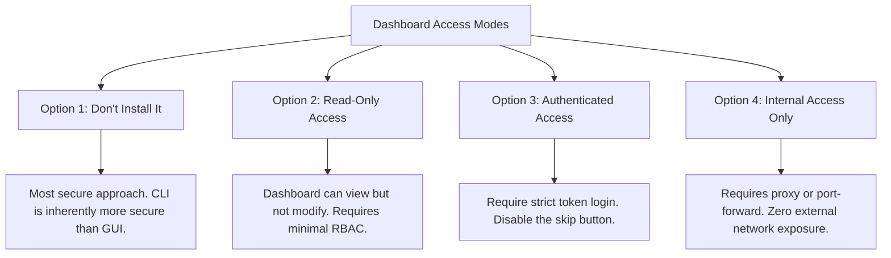
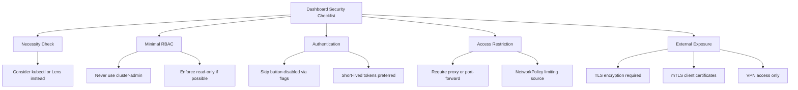
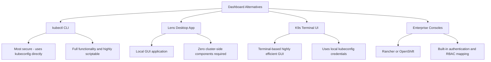

> **Complexity**: `[MEDIUM]` - Common attack surface
>
> **Time to Complete**: 30-35 minutes
>
> **Prerequisites**: RBAC knowledge from the Certified Kubernetes Administrator track, and the Network Policies module.

---

## What You'll Be Able to Do

After completing this comprehensive module, you will be equipped to handle the complex security challenges associated with graphical interfaces in containerized environments. Specifically, you will be able to:

1. **Diagnose** fundamental architectural vulnerabilities in default Kubernetes Dashboard installations and identify the exact attack paths malicious actors utilize to escalate privileges.
2. **Implement** defense-in-depth strategies to secure web-based graphical interfaces by layering robust token authentication, precise NetworkPolicies, and strict least-privilege configurations.
3. **Design** custom, hyper-restricted ServiceAccounts tailored for read-only visibility, ensuring that compromised GUI sessions cannot be weaponized to manipulate cluster state.
4. **Evaluate** the operational necessity of cluster-resident graphical tools against their inherent risk profiles, formulating policies on when to utilize alternative offline utilities.
5. **Compare** and contrast the security postures of various access methodologies, including port-forwarding, local proxies, and externally exposed LoadBalancers, to select the optimal approach for production systems running Kubernetes v1.35 and beyond.

---

## Why This Module Matters

The Kubernetes Dashboard represents one of the most historically targeted attack surfaces within container orchestration ecosystems. In 2018, the cloud infrastructure of Tesla, a major automotive manufacturer, was severely compromised due to a fundamental failure in GUI security. Attackers discovered a publicly accessible Kubernetes Dashboard that had been exposed to the public internet without any form of password protection or authentication mechanisms. Compounding the error, the dashboard was running with elevated privileges, effectively granting anyone who accessed the URL complete administrative control over the entire cluster.

Once inside the environment, the malicious actors did not simply stop at exploring the cluster. They leveraged the dashboard's vast capabilities to extract highly sensitive information, including Amazon Web Services access credentials that were improperly stored within the cluster's configuration maps and environment variables. With these credentials, the attackers pivoted beyond the Kubernetes environment and breached the underlying cloud infrastructure, deploying resource-intensive cryptomining workloads that drained financial resources and degraded system performance. The incident highlighted a critical lesson: operational convenience tools can rapidly transform into catastrophic vulnerabilities if not secured with defense-in-depth principles.

In modern, production-grade Kubernetes environments, security professionals must treat any graphical interface as a high-value target. This module is essential because it bridges the gap between administrative convenience and rigorous security. You will learn how to dismantle the attack paths utilized in the Tesla breach, implementing robust authentication, hyper-restricted Role-Based Access Control, and strict network segmentation to ensure that even if an interface is discovered by unauthorized entities, it cannot be weaponized against the organization. The principles covered here are foundational for passing advanced security certifications and for protecting real-world infrastructure.

---

## The Architecture of the Dashboard Risk

Understanding how the dashboard operates internally is crucial for securing it. Unlike a traditional web application that manages its own internal database of users, the Kubernetes Dashboard acts as a proxy to the Kubernetes API server. When deployed, it requires a ServiceAccount to function. If administrators bind this ServiceAccount to the `cluster-admin` ClusterRole, the dashboard application possesses the authority to perform any action within the cluster. Consequently, any user who accesses the dashboard inherits this ultimate power. 

This architecture makes the dashboard a prime target for attackers. If the dashboard is exposed to the internet, and authentication is bypassed or disabled, the entire cluster falls into the hands of the adversary. 

```mermaid
flowchart TD
    subgraph "Dashboard Attack Scenario"
        Direction TB
        A[Internet] -->|Unauthenticated Access| B(Exposed Dashboard)
        B -->|Inherits cluster-admin| C[Full Cluster Compromise]

        subgraph "What Goes Wrong"
            D[1. Exposed without authentication]
            E[2. Bound to cluster-admin]
            F[3. Skip button left enabled]
            G[4. Missing NetworkPolicy]
        end

        subgraph "The Catastrophic Result"
            H[Attacker views all secrets]
            I[Attacker deploys cryptominers]
            J[Attacker deletes core resources]
        end

        subgraph "Real Incident: Tesla 2018"
            K[Attackers utilized exposed dashboard to mine cryptocurrency]
        end
    end
```

The textual representation of this attack scenario is summarized below:

```text
┌─────────────────────────────────────────────────────────────┐
│              DASHBOARD ATTACK SCENARIO                      │
├─────────────────────────────────────────────────────────────┤
│                                                             │
│  Common Misconfiguration:                                  │
│                                                             │
│  Internet ────► Dashboard (exposed) ────► Full cluster     │
│                                            access!         │
│                                                             │
│  What goes wrong:                                          │
│  ─────────────────────────────────────────────────────────  │
│  1. Dashboard exposed without authentication               │
│  2. Dashboard uses cluster-admin ServiceAccount           │
│  3. Skip button allows anonymous access                    │
│  4. No NetworkPolicy restricting access                    │
│                                                             │
│  Result:                                                   │
│  ⚠️  Anyone can view secrets                               │
│  ⚠️  Anyone can deploy pods (cryptominers!)               │
│  ⚠️  Anyone can delete resources                          │
│  ⚠️  Full cluster compromise                               │
│                                                             │
│  Real incident: Tesla (2018)                               │
│  └── Attackers mined crypto using exposed dashboard        │
│                                                             │
└─────────────────────────────────────────────────────────────┘
```

> **Stop and think**: The Tesla breach happened because their dashboard was exposed without authentication. But the dashboard needed a ServiceAccount with permissions to read secrets. Why would anyone give a dashboard cluster-admin? Think about the convenience-vs-security trade-off that leads to this misconfiguration.

---

## Evaluating Dashboard Access Modes

When deciding to implement a graphical interface, cluster operators must select an access mode that balances operational necessity with security boundaries. The most secure approach is often the simplest: avoiding the installation entirely. However, if organizational requirements mandate a GUI, administrators must carefully restrict its capabilities.



A breakdown of these operational modes:

```text
┌─────────────────────────────────────────────────────────────┐
│              DASHBOARD ACCESS MODES                         │
├─────────────────────────────────────────────────────────────┤
│                                                             │
│  Option 1: Don't Install It                                │
│  ─────────────────────────────────────────────────────────  │
│  Most secure. Use kubectl instead.                         │
│  CLI is more secure than GUI.                              │
│                                                             │
│  Option 2: Read-Only Access                                │
│  ─────────────────────────────────────────────────────────  │
│  Dashboard can view but not modify.                        │
│  Use minimal RBAC permissions.                             │
│                                                             │
│  Option 3: Authenticated Access Only                       │
│  ─────────────────────────────────────────────────────────  │
│  Require token or kubeconfig login.                        │
│  No skip button.                                           │
│                                                             │
│  Option 4: Internal Access Only                            │
│  ─────────────────────────────────────────────────────────  │
│  kubectl proxy or port-forward required.                   │
│  No external exposure.                                     │
│                                                             │
└─────────────────────────────────────────────────────────────┘
```

---

## Secure Dashboard Installation: A Defense-in-Depth Approach

Deploying the dashboard securely requires multiple discrete steps. We cannot rely on default configurations, as they are optimized for quick onboarding rather than production-grade security.

### Step 1: Deploying the Baseline Application

The first step is applying the official deployment manifest. This provisions the core deployment, the internal service, and the necessary certificates for internal TLS communication. Always pull from a specific release branch to ensure predictable deployments.

```bash
# Official dashboard installation
kubectl apply -f https://raw.githubusercontent.com/kubernetes/dashboard/v2.7.0/aio/deploy/recommended.yaml

# Verify deployment
kubectl get pods -n kubernetes-dashboard
kubectl get svc -n kubernetes-dashboard
```

### Step 2: Creating a Minimal ServiceAccount

A critical vulnerability arises when administrators utilize wildcard permissions. To secure the installation, we must craft a custom ClusterRole that explicitly defines exactly which resources the dashboard is permitted to interact with. Notice in the configuration below that sensitive resources, such as Secrets, are intentionally omitted. This ensures that even if the dashboard is compromised, the attacker cannot extract cryptographic keys or passwords.

```kubernetes
# Read-only dashboard service account
apiVersion: v1
kind: ServiceAccount
metadata:
  name: dashboard-readonly
  namespace: kubernetes-dashboard
---
apiVersion: rbac.authorization.k8s.io/v1
kind: ClusterRole
metadata:
  name: dashboard-readonly
rules:
- apiGroups: [""]
  resources: ["pods", "services", "configmaps", "namespaces"]
  verbs: ["get", "list", "watch"]
- apiGroups: ["apps"]
  resources: ["deployments", "daemonsets", "replicasets", "statefulsets"]
  verbs: ["get", "list", "watch"]
---
apiVersion: rbac.authorization.k8s.io/v1
kind: ClusterRoleBinding
metadata:
  name: dashboard-readonly
roleRef:
  apiGroup: rbac.authorization.k8s.io
  kind: ClusterRole
  name: dashboard-readonly
subjects:
- kind: ServiceAccount
  name: dashboard-readonly
  namespace: kubernetes-dashboard
```

### Step 3: Generating Access Tokens

In modern Kubernetes environments, long-lived ServiceAccount tokens are strongly discouraged. Instead, administrators should dynamically generate short-lived tokens using the command line. This limits the window of opportunity for an attacker if a token is accidentally leaked or intercepted. The following block demonstrates both the modern ephemeral token generation method and the legacy static secret approach.

```bash
# Create token for the service account
kubectl create token dashboard-readonly -n kubernetes-dashboard

# Or create a long-lived secret (older method)
cat <<EOF | kubectl apply -f -
apiVersion: v1
kind: Secret
metadata:
  name: dashboard-readonly-token
  namespace: kubernetes-dashboard
  annotations:
    kubernetes.io/service-account.name: dashboard-readonly
type: kubernetes.io/service-account-token
EOF

# Get the token
kubectl get secret dashboard-readonly-token -n kubernetes-dashboard -o jsonpath='{.data.token}' | base64 -d
```

---

## Access Methods and Network Exposure

How you connect to the dashboard is just as critical as how you deploy it. Exposing the dashboard to the broader network drastically increases the likelihood of unauthorized access.

### Method 1: The Local Proxy (Most Secure)

The most secure method for accessing internal cluster services is utilizing the built-in proxy mechanism. This command establishes an encrypted tunnel between your local workstation and the Kubernetes API server. The dashboard is never exposed to the network; it remains safely bounded within the cluster, and your connection is authenticated via your personal kubeconfig file.

```bash
# Start proxy (only accessible from localhost)
kubectl proxy

# Access dashboard at:
# http://localhost:8001/api/v1/namespaces/kubernetes-dashboard/services/https:kubernetes-dashboard:/proxy/
```

### Method 2: Port Forwarding

Similar to the proxy, port forwarding routes traffic over a secure tunnel to a specific pod or service. This is highly secure but binds to a specific application port rather than the entire API path.

```bash
# Forward dashboard port
kubectl port-forward -n kubernetes-dashboard svc/kubernetes-dashboard 8443:443

# Access at https://localhost:8443
# Use token to authenticate
```

### Method 3: NodePort (Less Secure)

Utilizing a NodePort exposes the service on every single worker node in the cluster. If any of those nodes have a public IP address or are reachable from a wide corporate subnet, the dashboard becomes an accessible target. This method should be avoided unless strictly controlled by aggressive external firewall rules.

```yaml
# Expose dashboard as NodePort
apiVersion: v1
kind: Service
metadata:
  name: kubernetes-dashboard-nodeport
  namespace: kubernetes-dashboard
spec:
  type: NodePort
  selector:
    k8s-app: kubernetes-dashboard
  ports:
  - port: 443
    targetPort: 8443
    nodePort: 30443
```

> **What would happen if**: You deploy the dashboard with a read-only ServiceAccount, but a user logs in with a token from a *different* ServiceAccount that has cluster-admin. Does the dashboard's ServiceAccount RBAC protect you? (Hint: the dashboard acts on behalf of the logged-in user.)

> **Pause and predict**: Your team exposes the dashboard via a LoadBalancer Service for convenience. What's the attack surface compared to `kubectl proxy`? List at least 3 additional risks.

---

## Restricting Access at the Network and Application Layers

A comprehensive security strategy requires isolating the application at the network layer to ensure that even if internal actors attempt to probe the service, the traffic is dropped before it reaches the container.

### Enforcing Network Policies

By applying a NetworkPolicy, we can explicitly define which namespaces or specific pods are permitted to communicate with the dashboard over the internal virtual network. In the example below, all traffic is denied except for connections originating from a dedicated administrative namespace.

```yaml
# Only allow access from specific namespace/pods
apiVersion: networking.k8s.io/v1
kind: NetworkPolicy
metadata:
  name: dashboard-access
  namespace: kubernetes-dashboard
spec:
  podSelector:
    matchLabels:
      k8s-app: kubernetes-dashboard
  policyTypes:
  - Ingress
  ingress:
  # Only from admin namespace
  - from:
    - namespaceSelector:
        matchLabels:
          name: admin-access
    ports:
    - port: 8443
```

### Eradicating Anonymous Access

Older iterations of the dashboard featured a prominent "Skip" button on the login screen, allowing users to bypass token validation entirely. This is an unacceptable risk. We must guarantee this functionality is disabled by passing strict command-line arguments to the container runtime.

```yaml
# In dashboard deployment, add argument
spec:
  containers:
  - name: kubernetes-dashboard
    args:
    - --auto-generate-certificates
    - --namespace=kubernetes-dashboard
    - --enable-skip-login=false  # Disable skip button
```

If the dashboard is already running, you can dynamically patch the deployment to inject this crucial security argument:

```bash
kubectl patch deployment kubernetes-dashboard -n kubernetes-dashboard \
  --type='json' \
  -p='[{"op": "add", "path": "/spec/template/spec/containers/0/args/-", "value": "--enable-skip-login=false"}]'
```

---

## Production Grade Exposure (Ingress)

If business requirements dictate that the dashboard must be accessible via a standard web URL without requiring local terminal tools, it must be shielded behind a robust Ingress controller. The architecture must mandate TLS encryption and, crucially, mutual TLS (client certificate authentication). This ensures that only users possessing a cryptographic key signed by the organization's certificate authority can even reach the login portal.

```yaml
apiVersion: networking.k8s.io/v1
kind: Ingress
metadata:
  name: kubernetes-dashboard
  namespace: kubernetes-dashboard
  annotations:
    nginx.ingress.kubernetes.io/backend-protocol: "HTTPS"
    nginx.ingress.kubernetes.io/ssl-redirect: "true"
    # Client certificate authentication
    nginx.ingress.kubernetes.io/auth-tls-verify-client: "on"
    nginx.ingress.kubernetes.io/auth-tls-secret: "kubernetes-dashboard/ca-secret"
spec:
  ingressClassName: nginx
  tls:
  - hosts:
    - dashboard.example.com
    secretName: dashboard-tls
  rules:
  - host: dashboard.example.com
    http:
      paths:
      - path: /
        pathType: Prefix
        backend:
          service:
            name: kubernetes-dashboard
            port:
              number: 443
```

---

## Security Checklist for GUI Components

Before authorizing any graphical tool for production deployment, review the architectural configuration against this strict hierarchy of security controls.



The checklist ensures all vulnerability vectors are mitigated:

```text
┌─────────────────────────────────────────────────────────────┐
│              DASHBOARD SECURITY CHECKLIST                   │
├─────────────────────────────────────────────────────────────┤
│                                                             │
│  □ Do you really need the dashboard?                       │
│    └── Consider kubectl or Lens instead                    │
│                                                             │
│  □ Minimal RBAC permissions                                │
│    └── Never use cluster-admin                             │
│    └── Read-only if possible                               │
│                                                             │
│  □ Skip button disabled                                    │
│    └── --enable-skip-login=false                           │
│                                                             │
│  □ Access restricted                                       │
│    └── kubectl proxy or port-forward                       │
│    └── NetworkPolicy limiting source                       │
│                                                             │
│  □ If exposed externally                                   │
│    └── TLS required                                        │
│    └── mTLS client certificates                            │
│    └── VPN access only                                     │
│                                                             │
│  □ Token-based authentication only                         │
│    └── Short-lived tokens preferred                        │
│    └── No basic auth                                       │
│                                                             │
└─────────────────────────────────────────────────────────────┘
```

---

## Incident Response and Hardening Scenarios

During security audits or active incident response engagements, you will be required to rapidly secure misconfigured interfaces. The following practical scenarios demonstrate how to isolate and repair vulnerabilities in real-time.

### Scenario 1: Restricting Dashboard Privileges

If you discover a dashboard utilizing administrative privileges, you must immediately severe that binding and replace it with a highly constrained alternative.

```bash
# Check current dashboard permissions
kubectl get clusterrolebinding | grep dashboard
kubectl describe clusterrolebinding kubernetes-dashboard

# If using cluster-admin, create restricted role instead
cat <<EOF | kubectl apply -f -
apiVersion: rbac.authorization.k8s.io/v1
kind: ClusterRole
metadata:
  name: dashboard-viewer
rules:
- apiGroups: [""]
  resources: ["pods", "services", "nodes"]
  verbs: ["get", "list"]
EOF

# Update binding
kubectl delete clusterrolebinding kubernetes-dashboard
kubectl create clusterrolebinding kubernetes-dashboard \
  --clusterrole=dashboard-viewer \
  --serviceaccount=kubernetes-dashboard:kubernetes-dashboard
```

### Scenario 2: Emergency Disablement of Anonymous Access

If a penetration test reveals that unauthenticated users can access the interface, an immediate deployment patch is required to restart the pods with secure arguments.

```bash
# Patch dashboard to disable skip
kubectl patch deployment kubernetes-dashboard -n kubernetes-dashboard \
  --type='json' \
  -p='[{"op": "add", "path": "/spec/template/spec/containers/0/args/-", "value": "--enable-skip-login=false"}]'

# Verify
kubectl get deployment kubernetes-dashboard -n kubernetes-dashboard -o yaml | grep skip
```

### Scenario 3: Applying Network Isolation

To stop lateral movement from compromised application pods targeting the dashboard service, apply a NetworkPolicy to explicitly define authorized ingress sources.

```bash
# Create NetworkPolicy to restrict access
cat <<EOF | kubectl apply -f -
apiVersion: networking.k8s.io/v1
kind: NetworkPolicy
metadata:
  name: dashboard-restrict
  namespace: kubernetes-dashboard
spec:
  podSelector:
    matchLabels:
      k8s-app: kubernetes-dashboard
  policyTypes:
  - Ingress
  ingress:
  - from:
    - podSelector:
        matchLabels:
          dashboard-access: "true"
EOF
```

---

## Alternatives to the Native Dashboard

The most effective way to eliminate the attack surface of a cluster-hosted dashboard is to remove it entirely and rely on external, client-side alternatives. These tools leverage the identical API endpoints but require zero persistent infrastructure within the cluster itself.



A comparison of the alternatives:

```text
┌─────────────────────────────────────────────────────────────┐
│              DASHBOARD ALTERNATIVES                         │
├─────────────────────────────────────────────────────────────┤
│                                                             │
│  kubectl (CLI)                                             │
│  ─────────────────────────────────────────────────────────  │
│  • Most secure - uses kubeconfig                          │
│  • Full functionality                                      │
│  • Scriptable                                              │
│                                                             │
│  Lens (Desktop App)                                        │
│  ─────────────────────────────────────────────────────────  │
│  • Local GUI application                                   │
│  • Uses your kubeconfig                                    │
│  • No cluster-side components                              │
│                                                             │
│  K9s (Terminal UI)                                         │
│  ─────────────────────────────────────────────────────────  │
│  • Terminal-based GUI                                      │
│  • Uses your kubeconfig                                    │
│  • Very efficient for operations                           │
│                                                             │
│  Rancher/OpenShift Console                                 │
│  ─────────────────────────────────────────────────────────  │
│  • Enterprise-grade                                        │
│  • Built-in authentication                                 │
│  • More secure by design                                   │
│                                                             │
└─────────────────────────────────────────────────────────────┘
```

---

## Did You Know?

- The 2018 Tesla cloud compromise resulted from a completely unprotected Kubernetes management interface that lacked both network isolation and basic authentication, allowing rapid deployment of illicit workloads.
- Kubernetes Dashboard version 2.0.0, released in April 2020, finally changed the default behavior to disable the "Skip" login button, closing a massive security hole present in older legacy releases.
- In Kubernetes clusters running modern versions, ServiceAccount tokens are no longer generated automatically as non-expiring secrets, meaning administrators must intentionally provision short-lived dynamic tokens via the command line interface.
- The `kubectl proxy` command establishes a secure tunnel by authenticating with the cluster API using your active kubeconfig context, effectively meaning the dashboard process runs with your exact IAM permissions rather than its own default ServiceAccount.

---

## Common Mistakes

| Mistake | Why It Hurts | Solution |
|---------|--------------|----------|
| Using cluster-admin for dashboard | Full cluster access for attackers | Create minimal RBAC |
| Exposing via LoadBalancer | Public internet access | Use kubectl proxy |
| Leaving skip button enabled | Anonymous access possible | --enable-skip-login=false |
| No NetworkPolicy | Any pod can reach dashboard | Restrict ingress sources |
| Not updating dashboard | Known vulnerabilities | Keep updated |
| Storing tokens in ConfigMaps | Tokens are unencrypted and visible to all | Use Secret or dynamic tokens |
| Using NodePort for exposure | Bypasses local network isolation | Utilize local proxy or VPN |
| Deploying without resource limits | Pod can consume all node resources | Define CPU and memory requests |

---

## Quiz

<details>
<summary>1. Your SOC team discovers an unknown IP address accessing the Kubernetes dashboard at 3 AM. The dashboard is exposed via a LoadBalancer Service, and the attacker is browsing secrets across all namespaces. When you check the dashboard's ServiceAccount, it's bound to `cluster-admin`. What immediate steps do you take, and how should the dashboard have been deployed to prevent this?</summary>
Immediate response: delete or scale down the dashboard deployment to stop the breach, then rotate any secrets the attacker viewed. Long-term fix: never bind the dashboard to `cluster-admin` -- create a read-only ClusterRole with minimal permissions (get/list on specific resources only). Access should be through `kubectl proxy` (binds to localhost only, uses your kubeconfig credentials), not a LoadBalancer. Add a NetworkPolicy to restrict ingress sources, and disable the skip button with `--enable-skip-login=false`. The dashboard should inherit the logged-in user's RBAC permissions, not have its own elevated access.
</details>

<details>
<summary>2. A developer reports they can access the Kubernetes dashboard without entering a token -- they just click "Skip" and get full visibility into the cluster. The security team is alarmed. What dashboard argument prevents this, and why is the skip button dangerous even if the dashboard's ServiceAccount has read-only permissions?</summary>
Add `--enable-skip-login=false` to the dashboard container arguments to remove the skip button. Even with read-only permissions, the skip button is dangerous because it allows completely unauthenticated access -- anyone who can reach the dashboard URL can view pod logs, ConfigMaps, environment variables, and service configurations. This reconnaissance data helps attackers plan further attacks. Additionally, if someone later escalates the ServiceAccount permissions (intentionally or accidentally), all anonymous users inherit those elevated permissions. Authentication should always be required.
</details>

<details>
<summary>3. During a penetration test, the tester discovers the Kubernetes dashboard is exposed via NodePort 30443. They can reach it from any machine on the corporate network. The dashboard requires a token, but the tester finds a ServiceAccount token in a ConfigMap in the `default` namespace. They use it to log in and see workloads. What chain of security failures led to this compromise?</summary>
Multiple failures combined: (1) The dashboard was exposed via NodePort instead of using `kubectl proxy` or port-forward, making it accessible from the network. (2) No NetworkPolicy restricted which sources could reach the dashboard pods. (3) A ServiceAccount token was stored in a ConfigMap -- tokens should never be stored in ConfigMaps as they're not encrypted. (4) The token had sufficient permissions to view workloads. The fix requires defense in depth: switch to `kubectl proxy` access, add a NetworkPolicy limiting ingress to the dashboard, remove the token from the ConfigMap, use short-lived tokens via `kubectl create token`, and apply RBAC least privilege.
</details>

<details>
<summary>4. Your organization is debating whether to install the Kubernetes dashboard in production. The ops team wants it for convenience; the security team wants to ban it. A compromise is proposed: install it but restrict access. Design a security configuration that makes the dashboard acceptable -- cover access method, RBAC, authentication, and network controls.</summary>
A secure dashboard deployment requires four layers: (1) Access method: use `kubectl proxy` only -- this binds to localhost and requires kubeconfig authentication, eliminating network exposure entirely. Never use LoadBalancer, NodePort, or Ingress. (2) RBAC: create a custom ClusterRole with only `get` and `list` verbs on specific resources (pods, services, deployments) -- never use `cluster-admin`. Exclude secrets from viewable resources. (3) Authentication: disable the skip button with `--enable-skip-login=false` and require token-based login with short-lived tokens from `kubectl create token`. (4) Network: apply a NetworkPolicy with `ingress: []` (deny all ingress) so only `kubectl proxy` works. If the ops team needs more than this allows, consider Lens or K9s as alternatives that use local kubeconfig without cluster-side components.
</details>

<details>
<summary>5. Your development team requests a dashboard to view the status of their deployments. They suggest using a NodePort service so they can bookmark the URL in their browsers. Why is this a severe security anti-pattern, and what is the recommended alternative for the development team?</summary>
Exposing the dashboard via a NodePort service binds the application to a high port on every single node in the Kubernetes cluster. This fundamentally bypasses namespace isolation and exposes the interface to the broader internal network, or potentially the public internet if the nodes have public IP addresses. Any user or automated scanner that discovers the port can interact with the dashboard. The recommended alternative is to provide the development team with read-only kubeconfig files and instruct them to use the local proxy command or a client-side tool like Lens, which requires no cluster-side exposure.
</details>

<details>
<summary>6. After successfully deploying the dashboard with a restricted ServiceAccount and disabling the skip button, users report that the dashboard pods are stuck in a CrashLoopBackOff state. You recently applied a default-deny NetworkPolicy to the entire namespace. What specific network communication was blocked, and how do you resolve the issue?</summary>
A default-deny NetworkPolicy blocks all ingress and egress traffic for the namespace. While you might have configured ingress rules to allow access to the dashboard from specific sources, the dashboard pod itself requires egress access to communicate with the Kubernetes API server to fetch the resource metrics and object statuses it displays. To resolve this, you must explicitly allow egress traffic from the dashboard pod to the API server's IP address and port (typically TCP port 443), ensuring the application can retrieve the data it needs to function.
</details>

<details>
<summary>7. Compare the security boundaries established by a native Kubernetes Dashboard deployment versus a client-side management tool like K9s. How do their architectural differences impact the cluster's overall attack surface?</summary>
The native Kubernetes Dashboard is a server-side component. It requires deploying pods, services, and ServiceAccounts within the cluster itself. If compromised, the attacker gains a foothold inside the network perimeter, operating with the privileges of the dashboard's ServiceAccount. In contrast, tools like K9s or Lens are pure client-side applications. They run on the administrator's local workstation and communicate directly with the cluster API using the user's existing credentials. They introduce zero cluster-side components, meaning there are no additional pods to secure, no internal network policies to configure, and no persistent attack surface left behind when the tool is closed.
</details>

<details>
<summary>8. You are auditing a cluster and notice the dashboard is exposed via an Ingress resource. The Ingress requires TLS, but there is no client certificate authentication configured. The dashboard relies entirely on token-based authentication. Evaluate this security posture and identify the primary risk.</summary>
While TLS encrypts the traffic in transit, exposing the dashboard via Ingress without client certificate authentication means the login portal is accessible to anyone who can resolve the hostname. The primary risk is credential brute-forcing and token theft. If an attacker acquires a valid token through phishing or a separate breach, they can access the dashboard from anywhere on the internet. A highly secure architecture requires defense in depth: implementing mutual TLS ensures that only clients possessing a valid cryptographic certificate can even load the login page, drastically reducing the attack surface before token authentication is evaluated.
</details>

---

## Hands-On Exercise

The following exercise simulates an end-to-end secure deployment workflow. You will provision the baseline application, configure a highly restricted role-based access framework, patch the deployment to enforce strict authentication, and lock down the network perimeter. Execute these steps precisely to validate your understanding of the defense-in-depth methodologies discussed throughout this module.

```text
# Step 1: Install dashboard
kubectl apply -f https://raw.githubusercontent.com/kubernetes/dashboard/v2.7.0/aio/deploy/recommended.yaml

# Step 2: Wait for deployment
kubectl wait --for=condition=available deployment/kubernetes-dashboard -n kubernetes-dashboard --timeout=120s

# Step 3: Create restricted ServiceAccount
cat <<EOF | kubectl apply -f -
apiVersion: v1
kind: ServiceAccount
metadata:
  name: dashboard-readonly
  namespace: kubernetes-dashboard
---
apiVersion: rbac.authorization.k8s.io/v1
kind: ClusterRole
metadata:
  name: dashboard-readonly
rules:
- apiGroups: [""]
  resources: ["pods", "services"]
  verbs: ["get", "list"]
---
apiVersion: rbac.authorization.k8s.io/v1
kind: ClusterRoleBinding
metadata:
  name: dashboard-readonly
roleRef:
  apiGroup: rbac.authorization.k8s.io
  kind: ClusterRole
  name: dashboard-readonly
subjects:
- kind: ServiceAccount
  name: dashboard-readonly
  namespace: kubernetes-dashboard
EOF

# Step 4: Disable skip button
kubectl patch deployment kubernetes-dashboard -n kubernetes-dashboard \
  --type='json' \
  -p='[{"op": "add", "path": "/spec/template/spec/containers/0/args/-", "value": "--enable-skip-login=false"}]'

# Step 5: Create NetworkPolicy
cat <<EOF | kubectl apply -f -
apiVersion: networking.k8s.io/v1
kind: NetworkPolicy
metadata:
  name: dashboard-ingress
  namespace: kubernetes-dashboard
spec:
  podSelector:
    matchLabels:
      k8s-app: kubernetes-dashboard
  policyTypes:
  - Ingress
  ingress: []  # Deny all ingress - only kubectl proxy works
EOF

# Step 6: Get token for readonly user
kubectl create token dashboard-readonly -n kubernetes-dashboard

# Step 7: Access via proxy
kubectl proxy &
echo "Access dashboard at: http://localhost:8001/api/v1/namespaces/kubernetes-dashboard/services/https:kubernetes-dashboard:/proxy/"

# Cleanup
kubectl delete namespace kubernetes-dashboard
```

**Success criteria**: The application successfully initializes. When accessed via the local proxy, the interface completely rejects anonymous connections and strictly mandates a valid token. The applied NetworkPolicy effectively drops all direct ingress traffic originating from other namespaces.

---

## Part 1 Complete!

You've finished the cluster initialization and baseline security section. You now possess a deep understanding of:
- Implementing Network Policies for strict pod-level segmentation
- Validating configurations against CIS Benchmarks
- Securing Ingress objects with TLS and security headers
- Shielding cloud metadata services from internal exploitation
- Hardening graphical interfaces against unauthorized access

**Next Part**: [Part 2: Cluster Hardening](/k8s/cks/part2-cluster-hardening/module-2.1-rbac-deep-dive/) - Dive into advanced API security, exploring the intricacies of RBAC bindings, ServiceAccount token mounting, and admission control.