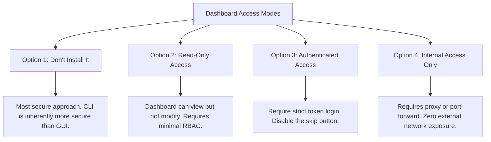
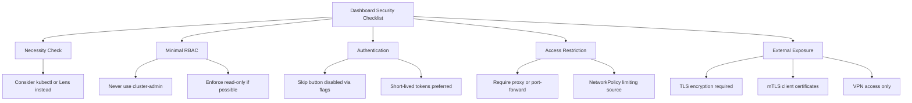
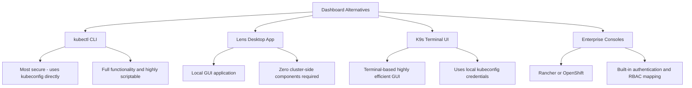

> **Complexity**: `[MEDIUM]` - Common attack surface
>
> **Time to Complete**: 30-35 minutes
>
> **Prerequisites**: RBAC knowledge from the Certified Kubernetes Administrator track, and the Network Policies module.

---

## What You'll Be Able to Do

By the end of this module, you will be able to evaluate a Kubernetes Dashboard deployment the way a security reviewer evaluates any privileged administrative surface. The goal is not to memorize one installation command. The goal is to reason from trust boundary to exposure path, then choose controls that still let operators inspect the cluster without turning a convenience UI into an escalation path.

1. **Diagnose** Dashboard attack paths and privilege escalation risks in Kubernetes 1.35+ clusters.
2. **Implement** read-only RBAC, short-lived ServiceAccount tokens, and NetworkPolicy controls for Dashboard access.
3. **Compare** `kubectl proxy`, port-forwarding, NodePort, LoadBalancer, and Ingress exposure choices for the Dashboard.
4. **Design** an incident response plan that revokes unsafe bindings and isolates a misconfigured Dashboard.
5. **Evaluate** when to remove the cluster-resident Dashboard and use client-side alternatives such as `kubectl`, Lens, or K9s.

---

## Why This Module Matters

Hypothetical scenario: a platform team installs a graphical Kubernetes console to help application teams inspect workloads during an incident. The service starts as an internal helper, but a temporary exposure rule becomes permanent, an old ServiceAccount token is copied into a shared note, and the console keeps broad cluster permissions because nobody wants to break a dashboard during a high-pressure outage. None of those choices looks dramatic in isolation. Together, they create an administrative endpoint that can reveal object metadata, pod logs, environment variables, and sometimes credentials to any person or process that can reach the URL.

The risk is not theoretical. In February 2018, [CNBC reported on RedLock's findings](https://www.cnbc.com/2018/02/21/hackers-hijack-teslas-cloud-system-to-mine-cryptocurrency-redlock.html) that attackers reached a Kubernetes administrative console that was not password protected, then used the environment for cryptocurrency mining after cloud credentials were exposed. That incident is useful for this module because it shows the chain that matters for the CKS exam and for real operations: external reachability made discovery possible, weak authentication made entry easy, excessive privilege made the blast radius large, and exposed credentials allowed a pivot outside the cluster. You do not need to remember the company name to learn the engineering lesson.

Graphical tools are not automatically bad. They can help a junior engineer trace a rollout, help a support team compare namespaces quickly, or help an on-call responder see relationships that are awkward to reconstruct from many commands. The security question is whether the dashboard is a passive viewer behind strong user authentication or a cluster-resident web application with standing authority and broad network reach. In this module you will secure the native Kubernetes Dashboard, but the decision rules apply to any web UI that sits near the Kubernetes API server.

The CKS angle is practical. You may be asked to recognize an overprivileged ServiceAccount, remove anonymous access, restrict network ingress, or choose a safer access path under time pressure. The exam will not reward a vague answer like "secure the dashboard." You need to know which object grants the risky permission, which exposure mode creates the reachable endpoint, which token should be short lived, and which network policy prevents lateral movement from ordinary workload pods.

A good review also separates emergency containment from durable design. During an incident, you may scale down a deployment, remove a Service, or delete a binding before you fully understand how the dashboard was installed. During normal engineering work, you should move those decisions into manifests, documentation, and access review. This module teaches both modes because security engineers are judged on whether they can stop immediate harm and prevent the same configuration from returning during the next apply.

---

## The Dashboard Trust Boundary and Attack Path

The Kubernetes Dashboard is a web application that translates browser actions into Kubernetes API calls. That sentence carries the entire security model. A user clicks a button to view pods, the dashboard sends a request to the API server, and the API server authorizes the request based on the credentials presented for that operation. If the dashboard runs with excessive standing permissions, or if a user logs in with an excessive token, the browser becomes a friendly front end for dangerous API access.

The dashboard therefore sits across two trust boundaries at once. The first boundary is the network boundary: who can reach the dashboard service at all. The second boundary is the authorization boundary: which Kubernetes identity the dashboard uses when it asks the API server for data. A secure deployment makes both boundaries narrow. An unsafe deployment leaves the HTTP endpoint reachable and then grants the backing identity more authority than the users actually need.

The most dangerous version of the pattern is a dashboard exposed to a broad network and bound to `cluster-admin`. That combination converts discovery into compromise. A scanner, curious insider, or compromised workload only needs a path to the UI; after that, the dashboard can act with administrative authority. This is why dashboard security must be reviewed as an attack chain instead of as a single setting.

Think of the dashboard as a translator, not as a separate security authority. The browser does not talk directly to etcd, and it does not bypass the API server. It asks the dashboard to ask the Kubernetes API server for objects, logs, and status. That means every visible button maps back to an API verb such as get, list, watch, create, patch, delete, or connect. When you review a dashboard, translate the UI back into those verbs and ask whether each verb is necessary.

Subresources deserve special attention because they often hide behind friendly UI labels. Viewing pod logs can require access to the `pods/log` subresource. Opening a shell into a pod can require access to `pods/exec`, which is far more dangerous than listing pods. Port-forwarding through a UI can require another connect-style permission. A role that looks read-only at first glance may still expose sensitive operational data if it includes log access across namespaces.

```mermaid
flowchart TD
    subgraph "Dashboard Attack Scenario"
        Direction TB
        A[Internet] -->|Unauthenticated Access| B(Exposed Dashboard)
        B -->|Inherits cluster-admin| C[Full Cluster Compromise]

        subgraph "What Goes Wrong"
            D[1. Exposed without authentication]
            E[2. Bound to cluster-admin]
            F[3. Skip button left enabled]
            G[4. Missing NetworkPolicy]
        end

        subgraph "The Catastrophic Result"
            H[Attacker views all secrets]
            I[Attacker deploys cryptominers]
            J[Attacker deletes core resources]
        end

        subgraph "Real Incident: Tesla 2018"
            K[Attackers utilized exposed dashboard to mine cryptocurrency]
        end
    end
```

The diagram shows a simple path, but each box maps to a concrete Kubernetes control. Network exposure comes from a Service type, Ingress, port-forward binding, or proxy choice. Authentication behavior comes from dashboard configuration and token handling. Authorization comes from Roles, ClusterRoles, and bindings. NetworkPolicy decides whether another pod in the cluster can reach the dashboard service after an unrelated workload is compromised.

This mapping gives you a practical audit order. Start with reachability because a dashboard nobody can reach is not the immediate entry point. Then inspect authentication because a reachable anonymous UI is urgent even with modest permissions. Then inspect RBAC because a valid login with broad permissions can be worse than an anonymous read-only page. Finally inspect network policy and logs because they tell you whether lateral movement is possible and whether you can reconstruct what happened.

```text
┌─────────────────────────────────────────────────────────────┐
│              DASHBOARD ATTACK SCENARIO                      │
├─────────────────────────────────────────────────────────────┤
│                                                             │
│  Common Misconfiguration:                                  │
│                                                             │
│  Internet ────► Dashboard (exposed) ────► Full cluster     │
│                                            access!         │
│                                                             │
│  What goes wrong:                                          │
│  ─────────────────────────────────────────────────────────  │
│  1. Dashboard exposed without authentication               │
│  2. Dashboard uses cluster-admin ServiceAccount           │
│  3. Skip button allows anonymous access                    │
│  4. No NetworkPolicy restricting access                    │
│                                                             │
│  Result:                                                   │
│  !! Anyone can view secrets                                │
│  !! Anyone can deploy pods (cryptominers!)                 │
│  !! Anyone can delete resources                            │
│  !! Full cluster compromise                                │
│                                                             │
│  Real incident: Tesla (2018)                               │
│  └── Attackers mined crypto using exposed dashboard        │
│                                                             │
└─────────────────────────────────────────────────────────────┘
```

Pause and predict: if a dashboard can list pods but cannot list Secrets, what sensitive information might still leak through pod specs, logs, ConfigMaps, image names, labels, annotations, and environment variables? Write down two examples before continuing. The exercise matters because "read-only" is not the same as "harmless"; a read-only identity can still expose topology and operational clues that help an attacker choose the next move.

A secure design starts with the assumption that a GUI may be discovered. You then make discovery boring. An unauthenticated browser should not load anything useful. A token should expire quickly. A read-only identity should be unable to mutate resources or read Secrets. A workload namespace should not be able to talk to the dashboard service by default. Those controls overlap intentionally, because any one layer may be misconfigured during the life of the cluster.

Audit logs close the loop on this architecture. If the dashboard uses a shared ServiceAccount for many people, audit events lose human attribution and responders must infer who clicked what from external logs. If each user presents a personal credential or a short-lived token tied to a known identity, the API server log becomes much more useful. That is why accountability belongs in the design discussion, not only in the incident response checklist.

## Access Modes: Reduce Network Reach Before RBAC

The first decision is whether the dashboard should exist as a cluster-resident service. If the real requirement is "developers need to see pods and deployments," the safest answer may be a local tool that uses each user's kubeconfig and leaves no extra web application inside the cluster. If the native dashboard is required for a lab, support workflow, or constrained operations environment, the next decision is how users reach it.

The access method matters because RBAC only runs after a request reaches an application path that can present credentials to the API server. A LoadBalancer or NodePort creates a discoverable network service. An Ingress creates a web endpoint that must be protected like any other privileged web application. A local proxy or port-forward creates a narrower path because the user must already possess local kubeconfig access to establish the tunnel.

Network reach is not binary. A service can be unreachable from the public internet but reachable from every employee laptop, CI runner, bastion host, and compromised workload that shares a route. That is still broad exposure. When you compare access modes, ask who can send the first HTTP request before Kubernetes authorization has any chance to evaluate a token. The smaller that pre-authentication audience is, the easier the dashboard is to defend.



The order in the diagram is deliberate. "Do not install it" removes the attack surface instead of trying to manage it. "Read-only" reduces blast radius if a session is compromised. "Authenticated access" ensures an anonymous visitor cannot browse the UI. "Internal access only" prevents the login screen from becoming an internet-facing target. You usually want more than one of these properties, not exactly one.

Do not let the phrase "internal access only" end the discussion. Internal exposure may still violate least privilege if the route includes people or machines that never administer Kubernetes. A dashboard reachable from a build system is especially concerning because build systems often handle source code, image registries, and deployment credentials. If a build agent can reach the dashboard, an attacker who compromises the build path may gain a useful reconnaissance tool even before stealing a Kubernetes token.

```text
┌─────────────────────────────────────────────────────────────┐
│              DASHBOARD ACCESS MODES                         │
├─────────────────────────────────────────────────────────────┤
│                                                             │
│  Option 1: Don't Install It                                │
│  ─────────────────────────────────────────────────────────  │
│  Most secure. Use kubectl instead.                         │
│  CLI is more secure than GUI.                              │
│                                                             │
│  Option 2: Read-Only Access                                │
│  ─────────────────────────────────────────────────────────  │
│  Dashboard can view but not modify.                        │
│  Use minimal RBAC permissions.                             │
│                                                             │
│  Option 3: Authenticated Access Only                       │
│  ─────────────────────────────────────────────────────────  │
│  Require token or kubeconfig login.                        │
│  No skip button.                                           │
│                                                             │
│  Option 4: Internal Access Only                            │
│  ─────────────────────────────────────────────────────────  │
│  kubectl proxy or port-forward required.                   │
│  No external exposure.                                     │
│                                                             │
└─────────────────────────────────────────────────────────────┘
```

The safest routine workflow is `kubectl proxy`. It binds locally, authenticates to the API server using the user's active kubeconfig context, and reaches the dashboard through the API server proxy path. That means the dashboard URL is not directly published as a service endpoint. The operator still needs local workstation access and valid Kubernetes credentials before the browser can reach the page.

```bash
# Start proxy (only accessible from localhost)
kubectl proxy

# Access dashboard at:
# http://localhost:8001/api/v1/namespaces/kubernetes-dashboard/services/https:kubernetes-dashboard:/proxy/
```

Port-forwarding is also narrow, but it targets one service port instead of using the API server proxy path. It is useful when a lab or troubleshooting workflow expects HTTPS directly on a local port. The tradeoff is that operators must manage certificates and browser warnings more often, and a careless bind address can expose the local forward beyond the workstation. Keep the binding local unless you have a deliberate reason and a compensating control.

For exam thinking, classify proxy and port-forwarding as temporary access paths rather than deployment architectures. They are initiated by an authenticated user, they end when the process exits, and they do not create a standing external endpoint. That makes them excellent defaults for emergency inspection. Their weakness is operational friction: non-technical users may struggle to start them, and teams sometimes work around that friction by publishing the dashboard permanently.

```bash
# Forward dashboard port
kubectl port-forward -n kubernetes-dashboard svc/kubernetes-dashboard 8443:443

# Access at https://localhost:8443
# Use token to authenticate
```

NodePort is a poor default because it opens a port on every node that backs the service. If any node is reachable from a corporate subnet, VPN segment, or public route, the dashboard becomes reachable through infrastructure that was not designed as an application ingress boundary. Even with token authentication, a NodePort dashboard invites scanning, brute-force attempts against weak operational habits, and credential reuse from unrelated leaks.

```yaml
# Expose dashboard as NodePort
apiVersion: v1
kind: Service
metadata:
  name: kubernetes-dashboard-nodeport
  namespace: kubernetes-dashboard
spec:
  type: NodePort
  selector:
    k8s-app: kubernetes-dashboard
  ports:
  - port: 443
    targetPort: 8443
    nodePort: 30443
```

Before running this, what output do you expect from `kubectl get svc -n kubernetes-dashboard` after applying a NodePort service, and which column would tell you that the dashboard is reachable through every node? The point is to build a habit of reading exposure from the Service object itself, not from a wiki page or a team's memory of how the service was supposed to be deployed.

LoadBalancer and Ingress require even more scrutiny because they are intentionally designed to publish applications. A LoadBalancer exposes the service through cloud networking, while an Ingress exposes a hostname through a shared controller. Both can be secured, but both move the dashboard into the same threat model as an administrative web portal. That means TLS, identity-aware access, audit logging, rate controls, and certificate-based client restrictions become part of the design, not optional polish.

There is one more exposure detail that trips teams during reviews: DNS can outlive intent. A temporary hostname created for a support window may remain in documentation, browser history, password managers, and monitoring systems long after the team thinks it has retired the dashboard. When you approve an Ingress or LoadBalancer, also define how the record is removed, how certificates are revoked, and how users will know that the URL is no longer an approved path.

## Secure Installation: RBAC and Token Boundaries

The installation step is easy; the security work starts immediately after the manifests exist. The preserved command below applies the upstream dashboard manifest used by this lab. In a production review, you would pin and validate the currently approved release from upstream, review image provenance, and treat the manifest as application code. The key lesson is that installing the dashboard is not the same as authorizing it safely.

```bash
# Official dashboard installation
kubectl apply -f https://raw.githubusercontent.com/kubernetes/dashboard/v2.7.0/aio/deploy/recommended.yaml

# Verify deployment
kubectl get pods -n kubernetes-dashboard
kubectl get svc -n kubernetes-dashboard
```

After installation, inspect the ServiceAccount and bindings before anyone logs in. A ServiceAccount is simply an identity for workloads. A Role or ClusterRole defines allowed verbs on resources, and a binding attaches that role to a subject. When the subject is the dashboard ServiceAccount and the role is broad, the dashboard has broad power whenever it acts as that identity. If the role includes Secrets, the UI can become a credential browser.

RBAC review works best when you read rules from right to left. Start with the subject because it tells you who receives the permission. Then read the role reference because it tells you which rule set is attached. Then inspect the rules because they define API groups, resources, and verbs. A surprising number of dashboard incidents come from bindings that looked harmless by name while the referenced ClusterRole carried broad permissions.

The safest instructional pattern is to create a read-only identity that can view common workload objects but cannot mutate them and cannot read Secrets. The example below includes pods, services, ConfigMaps, namespaces, and common workload controllers. It intentionally omits wildcard verbs, wildcard resources, and the `secrets` resource. That omission is a design decision, not an accident, because many credential leaks happen after a "viewer" role quietly includes sensitive resources.

Namespace scope is another lever. A ClusterRoleBinding grants the role across the cluster, which is often more visibility than a team needs. A RoleBinding in one namespace can reference a ClusterRole but constrain the binding to that namespace, depending on the resources involved. For a shared application team dashboard, namespace-scoped bindings may be a better fit than a cluster-wide viewer role. The native dashboard can display many resources, but your RBAC should reflect the support boundary, not the UI's maximum capability.

```kubernetes
# Read-only dashboard service account
apiVersion: v1
kind: ServiceAccount
metadata:
  name: dashboard-readonly
  namespace: kubernetes-dashboard
---
apiVersion: rbac.authorization.k8s.io/v1
kind: ClusterRole
metadata:
  name: dashboard-readonly
rules:
- apiGroups: [""]
  resources: ["pods", "services", "configmaps", "namespaces"]
  verbs: ["get", "list", "watch"]
- apiGroups: ["apps"]
  resources: ["deployments", "daemonsets", "replicasets", "statefulsets"]
  verbs: ["get", "list", "watch"]
---
apiVersion: rbac.authorization.k8s.io/v1
kind: ClusterRoleBinding
metadata:
  name: dashboard-readonly
roleRef:
  apiGroup: rbac.authorization.k8s.io
  kind: ClusterRole
  name: dashboard-readonly
subjects:
- kind: ServiceAccount
  name: dashboard-readonly
  namespace: kubernetes-dashboard
```

There is a subtle distinction between the dashboard's own ServiceAccount and the identity a user presents at login. If a user logs in with a powerful token, the dashboard can act with that user's power for those API calls. Restricting the dashboard ServiceAccount does not make an administrator's personal cluster-admin token safe to paste into a browser. The least-privilege rule applies to every credential that can enter the UI.

This distinction is why "we hardened the dashboard ServiceAccount" can be a misleading status update. It answers only one part of the authorization question. You also need to know whether users authenticate with personal credentials, shared support tokens, static ServiceAccount tokens, or kubeconfig files containing client certificates. Each option changes auditability, expiration, revocation, and blast radius. A secure dashboard program documents the allowed credential types instead of leaving users to improvise.

Modern Kubernetes clusters support short-lived ServiceAccount tokens through `kubectl create token`. That command asks the API server to mint a bounded token for a named ServiceAccount, which is preferable to keeping non-expiring token Secrets around. The preserved block also shows the older long-lived Secret pattern because you may still encounter it during audits. Treat the older method as evidence to investigate rotation, storage, and historical leakage.

```bash
# Create token for the service account
kubectl create token dashboard-readonly -n kubernetes-dashboard

# Or create a long-lived secret (older method)
cat <<EOF | kubectl apply -f -
apiVersion: v1
kind: Secret
metadata:
  name: dashboard-readonly-token
  namespace: kubernetes-dashboard
  annotations:
    kubernetes.io/service-account.name: dashboard-readonly
type: kubernetes.io/service-account-token
EOF

# Get the token
kubectl get secret dashboard-readonly-token -n kubernetes-dashboard -o jsonpath='{.data.token}' | base64 -d
```

Token handling is where many teams accidentally undo their RBAC work. A short-lived token copied into a secure password manager for a controlled support window is a different risk from a static token pasted into a ticket, chat message, or ConfigMap. The dashboard should not become an excuse to normalize credential sharing. If users need recurring access, integrate the access path with the organization's identity system or require each user to mint a token under a role that matches their job.

Token expiration is useful only if revocation and rotation are also understood. If a long-lived token was exposed, deleting the Secret or removing the binding may be necessary, and you should check whether pods mounted that credential automatically. In modern clusters, bound tokens are designed to reduce that class of stale credential, but legacy manifests and manual Secrets still appear in real environments. During an audit, treat every static token as a question that needs an owner and an expiration story.

## Network Isolation, Skip Login, and Controlled Ingress

NetworkPolicy is the control that handles the "what if another pod can reach it?" question. RBAC decides what happens after the dashboard makes an API request, but NetworkPolicy decides whether traffic from a workload namespace can even arrive at the dashboard pods. This matters after a separate application compromise. If an attacker gains code execution in an ordinary pod, the dashboard service should not be an easy internal target.

Ingress rules are only half of the conversation. Depending on the deployment and plugin behavior, the dashboard may also need egress to the Kubernetes API server and supporting services. A careless default-deny egress policy can break the dashboard, while an overly permissive egress policy can preserve unnecessary reachability. The point is not to memorize one policy shape. The point is to write down which flows are required, then allow only those flows.

```yaml
# Only allow access from specific namespace/pods
apiVersion: networking.k8s.io/v1
kind: NetworkPolicy
metadata:
  name: dashboard-access
  namespace: kubernetes-dashboard
spec:
  podSelector:
    matchLabels:
      k8s-app: kubernetes-dashboard
  policyTypes:
  - Ingress
  ingress:
  # Only from admin namespace
  - from:
    - namespaceSelector:
        matchLabels:
          name: admin-access
    ports:
    - port: 8443
```

The policy above is intentionally narrow, but you must test it against your CNI plugin and namespace labels. Kubernetes NetworkPolicy is declarative, and enforcement depends on a plugin that implements it. A policy that selects the dashboard pods and allows only a labeled administrative namespace is useful only if that label is controlled, documented, and not casually added to application namespaces during troubleshooting.

Labels are authorization-adjacent in this design, so protect them accordingly. If many teams can label their own namespaces as `admin-access`, the NetworkPolicy becomes a paper control. A stronger pattern is to combine namespace selectors with pod selectors, use admission controls to restrict sensitive labels, and keep administrative access pods in a namespace owned by the platform team. Network isolation is only as strong as the selectors that define the trusted source.

Older dashboard deployments had a "Skip" button that allowed users to enter without presenting a token. That behavior is unacceptable for any secured environment, even if the backing identity is read-only. Anonymous access still reveals workload names, namespace structure, labels, images, and sometimes operational timing. Those details help attackers plan phishing, image attacks, lateral movement, and privilege escalation attempts.

Anonymous visibility also weakens detection. If every visitor arrives without an identity, you cannot distinguish a curious engineer from a scanner or a compromised internal host by Kubernetes audit identity alone. You may still have ingress logs, but those logs live outside the API authorization system and may not map cleanly to a person. Requiring authentication gives responders another signal and raises the cost of casual exploration.

```yaml
# In dashboard deployment, add argument
spec:
  containers:
  - name: kubernetes-dashboard
    args:
    - --auto-generate-certificates
    - --namespace=kubernetes-dashboard
    - --enable-skip-login=false  # Disable skip button
```

When you inherit a running dashboard, you may not have time to rebuild the deployment manifest before reducing exposure. A JSON patch can append the secure argument and trigger a rollout. This is an incident-response move, not a substitute for storing the desired configuration in version control. After the emergency change, reconcile the declarative manifest so the next deployment does not remove the hardening.

```bash
kubectl patch deployment kubernetes-dashboard -n kubernetes-dashboard \
  --type='json' \
  -p='[{"op": "add", "path": "/spec/template/spec/containers/0/args/-", "value": "--enable-skip-login=false"}]'
```

Ingress is the one exposure method that can be acceptable in tightly controlled environments, but only when it is treated as a privileged administrative endpoint. TLS protects data in transit, but TLS alone does not prove that the client should see the login page. Mutual TLS, VPN restrictions, identity-aware proxies, and controller-level allowlists reduce who can reach the dashboard before token authentication is even evaluated.

```yaml
apiVersion: networking.k8s.io/v1
kind: Ingress
metadata:
  name: kubernetes-dashboard
  namespace: kubernetes-dashboard
  annotations:
    nginx.ingress.kubernetes.io/backend-protocol: "HTTPS"
    nginx.ingress.kubernetes.io/ssl-redirect: "true"
    # Client certificate authentication
    nginx.ingress.kubernetes.io/auth-tls-verify-client: "on"
    nginx.ingress.kubernetes.io/auth-tls-secret: "kubernetes-dashboard/ca-secret"
spec:
  ingressClassName: nginx
  tls:
  - hosts:
    - dashboard.example.com
    secretName: dashboard-tls
  rules:
  - host: dashboard.example.com
    http:
      paths:
      - path: /
        pathType: Prefix
        backend:
          service:
            name: kubernetes-dashboard
            port:
              number: 443
```

Which approach would you choose here and why: a local proxy for five platform engineers, an Ingress with mutual TLS for a support center, or no dashboard at all for application developers who only need rollout status? The right answer depends on who needs access, how often they need it, how credentials are issued, and whether the organization can operate the extra controls reliably.

Controlled Ingress also changes what you must monitor. You need access logs from the ingress controller, certificate issuance and revocation records, dashboard authentication failures, and API server audit events for the identities used through the dashboard. Without those signals, an exposed dashboard may look secure on paper while giving responders little evidence when a token is abused.

Monitoring should include negative tests, not just dashboards. Periodically verify that an unauthenticated browser cannot enter, a token without the right role cannot view resources, an application pod cannot reach the service, and the old NodePort or LoadBalancer path has not returned. These checks are simple, but they catch configuration drift that code review misses. A dashboard is a living administrative surface, so its controls need living validation.

## Audit and Response: Hardening a Live Dashboard and Choosing Alternatives

Auditing a dashboard should follow a fixed order because time pressure encourages people to chase symptoms. First determine whether the dashboard is necessary. Then identify every network path to it. Then inspect the credentials that can be used through it. Then restrict pod-to-pod reachability. Only after those items are handled should you tune convenience settings such as bookmarks, dashboards, and team instructions.

Evidence collection should happen early, but it should not delay containment. Capture the current Service, Ingress, Deployment arguments, ServiceAccount, ClusterRoleBinding, and relevant audit logs before making broad changes when time allows. If the endpoint is actively exposed, take the safer containment action first and document what you changed. In real operations, perfect forensics and immediate risk reduction compete; senior judgment means choosing the order that limits harm.



The checklist is useful because it separates necessity from configuration. A team that cannot explain why the dashboard exists is unlikely to maintain its RBAC, NetworkPolicy, and token practices over time. Conversely, a team with a real support workflow can justify the tool, define its users, and test whether each control still works after cluster upgrades. Security improves when the tool has an owner and a review rhythm.

Ownership also determines who can approve exceptions. A platform engineer may understand the Kubernetes objects, but a support lead may understand the workflow that requires a browser. A security reviewer may understand identity and logging requirements. Bring those perspectives together before publishing the dashboard. Otherwise, each group optimizes its own piece and nobody owns the full risk of a reachable administrative UI.

```text
┌─────────────────────────────────────────────────────────────┐
│              DASHBOARD SECURITY CHECKLIST                   │
├─────────────────────────────────────────────────────────────┤
│                                                             │
│  □ Do you really need the dashboard?                       │
│    └── Consider kubectl or Lens instead                    │
│                                                             │
│  □ Minimal RBAC permissions                                │
│    └── Never use cluster-admin                             │
│    └── Read-only if possible                               │
│                                                             │
│  □ Skip button disabled                                    │
│    └── --enable-skip-login=false                           │
│                                                             │
│  □ Access restricted                                       │
│    └── kubectl proxy or port-forward                       │
│    └── NetworkPolicy limiting source                       │
│                                                             │
│  □ If exposed externally                                   │
│    └── TLS required                                        │
│    └── mTLS client certificates                            │
│    └── VPN access only                                     │
│                                                             │
│  □ Token-based authentication only                         │
│    └── Short-lived tokens preferred                        │
│    └── No basic auth                                       │
│                                                             │
└─────────────────────────────────────────────────────────────┘
```

When a dashboard is already misconfigured, your first response should reduce blast radius before you perform a long investigation. If a binding grants `cluster-admin`, remove or replace it. If a Service exposes the dashboard widely, scale the deployment down or change the Service while you investigate. If static tokens may have been viewed, rotate them and review API server audit events for unexpected use.

Do not forget dependent credentials. A dashboard compromise may reveal cloud keys, registry credentials, database connection strings, and webhook URLs stored in Kubernetes objects or visible logs. Rotating only the dashboard token may leave the attacker with everything they already harvested. The response plan should list which namespaces were visible, which resources were readable, and which downstream credentials must be treated as exposed.

```bash
# Check current dashboard permissions
kubectl get clusterrolebinding | grep dashboard
kubectl describe clusterrolebinding kubernetes-dashboard

# If using cluster-admin, create restricted role instead
cat <<EOF | kubectl apply -f -
apiVersion: rbac.authorization.k8s.io/v1
kind: ClusterRole
metadata:
  name: dashboard-viewer
rules:
- apiGroups: [""]
  resources: ["pods", "services", "nodes"]
  verbs: ["get", "list"]
EOF

# Update binding
kubectl delete clusterrolebinding kubernetes-dashboard
kubectl create clusterrolebinding kubernetes-dashboard \
  --clusterrole=dashboard-viewer \
  --serviceaccount=kubernetes-dashboard:kubernetes-dashboard
```

The next emergency step is to remove anonymous entry if it exists. This does not solve overprivileged tokens, but it closes the easiest path. You should then verify the rollout and check the rendered deployment, because an argument added to the wrong container or overwritten by a later apply can leave the UI in its previous state while the change appears to have succeeded.

```bash
# Patch dashboard to disable skip
kubectl patch deployment kubernetes-dashboard -n kubernetes-dashboard \
  --type='json' \
  -p='[{"op": "add", "path": "/spec/template/spec/containers/0/args/-", "value": "--enable-skip-login=false"}]'

# Verify
kubectl get deployment kubernetes-dashboard -n kubernetes-dashboard -o yaml | grep skip
```

Network isolation completes the emergency containment path. The policy below allows only pods with a specific label to reach the dashboard pods. In a production design, you may prefer a namespace selector, a combined namespace and pod selector, or no direct pod access at all. The important habit is to express the intended sources explicitly instead of assuming that an internal Service is naturally private.

```bash
# Create NetworkPolicy to restrict access
cat <<EOF | kubectl apply -f -
apiVersion: networking.k8s.io/v1
kind: NetworkPolicy
metadata:
  name: dashboard-restrict
  namespace: kubernetes-dashboard
spec:
  podSelector:
    matchLabels:
      k8s-app: kubernetes-dashboard
  policyTypes:
  - Ingress
  ingress:
  - from:
    - podSelector:
        matchLabels:
          dashboard-access: "true"
EOF
```

Removing the native dashboard is often the cleanest long-term fix. Client-side tools still require secure kubeconfigs and sane user RBAC, but they do not add dashboard pods, Services, Ingress objects, or long-lived in-cluster identities. That changes the residual risk. If the tool is closed, there is no cluster-side web endpoint left for an attacker to discover.

Client-side tools also make least privilege more natural because each user can carry a role matched to their responsibility. An application developer can receive namespace-scoped read access. A platform engineer can receive broader permissions with stronger authentication. A temporary incident responder can receive time-bounded access. The tool is not the permission model; Kubernetes RBAC remains the permission model, and that is easier to audit than a shared dashboard identity.



The alternative is not automatically safer if the user's kubeconfig is overprivileged or stored carelessly. A local GUI using a cluster-admin kubeconfig can still perform cluster-admin actions. The advantage is architectural: you remove a standing in-cluster web service and rely on ordinary user authentication paths. That usually fits least privilege better than a shared dashboard account or a permanent ServiceAccount token.

```text
┌─────────────────────────────────────────────────────────────┐
│              DASHBOARD ALTERNATIVES                         │
├─────────────────────────────────────────────────────────────┤
│                                                             │
│  kubectl (CLI)                                             │
│  ─────────────────────────────────────────────────────────  │
│  • Most secure - uses kubeconfig                          │
│  • Full functionality                                      │
│  • Scriptable                                              │
│                                                             │
│  Lens (Desktop App)                                        │
│  ─────────────────────────────────────────────────────────  │
│  • Local GUI application                                   │
│  • Uses your kubeconfig                                    │
│  • No cluster-side components                              │
│                                                             │
│  K9s (Terminal UI)                                         │
│  ─────────────────────────────────────────────────────────  │
│  • Terminal-based GUI                                      │
│  • Uses your kubeconfig                                    │
│  • Very efficient for operations                           │
│                                                             │
│  Rancher/OpenShift Console                                 │
│  ─────────────────────────────────────────────────────────  │
│  • Enterprise-grade                                        │
│  • Built-in authentication                                 │
│  • More secure by design                                   │
│                                                             │
└─────────────────────────────────────────────────────────────┘
```

For the CKS exam, practice naming the specific object you would change. "Make it secure" is not an answer. "Delete the `cluster-admin` ClusterRoleBinding, create a read-only ClusterRole, bind it to the dashboard ServiceAccount, disable skip login, use `kubectl proxy`, and add a NetworkPolicy" is an answer. The difference is operational precision.

Also practice explaining tradeoffs in plain language. A proxy is safer because it avoids a standing endpoint, not because it is magically encrypted in a different way. A read-only role is safer because it removes mutation and sensitive resource access, not because the dashboard becomes harmless. A client-side tool is safer because it removes cluster-side components, not because local software can ignore RBAC. These explanations help you choose under pressure instead of reciting slogans.

## Patterns & Anti-Patterns

Pattern one is the no-standing-endpoint pattern. Use the dashboard only through `kubectl proxy` or a local port-forward, and require each operator to authenticate with their own kubeconfig before the tunnel exists. This pattern works best for small platform teams, exam labs, and temporary diagnostic sessions. It scales poorly when many non-platform users need browser access every day, but it keeps network exposure low and avoids turning the dashboard into a public application.

Pattern two is the read-only support pattern. Create a dedicated ServiceAccount and ClusterRole that can list ordinary workload resources but cannot mutate objects and cannot read Secrets. Pair that role with short-lived tokens and a documented support workflow. This pattern gives support teams a controlled view during incidents, but it still requires review because pod logs, ConfigMaps, and object metadata can contain information that should not be broadly visible.

Pattern three is the hardened administrative portal pattern. Use an Ingress only when the dashboard has a real business owner, mutual TLS or an identity-aware access layer, strict token practices, NetworkPolicy, logging, and periodic access review. This pattern is more expensive to operate because the dashboard becomes a privileged web application. It is justified only when the organization can maintain those controls with the same rigor used for other administrative portals.

Pattern four is the namespace-scoped visibility pattern. Instead of giving one dashboard identity cluster-wide read access, bind viewers to the namespaces they support and keep cluster-wide objects out of the shared workflow. This pattern fits application teams that need to inspect their own deployments but should not see every namespace. It requires more role management, but it better matches organizational boundaries and reduces the value of any one compromised token.

Anti-pattern one is the shared administrator token. Teams fall into it because one copied token makes onboarding fast, demos easy, and dashboards simple to bookmark. The better alternative is per-user access with bounded roles and short-lived credentials. Shared tokens erase accountability, survive personnel changes, and make incident response harder because every action appears to come from the same Kubernetes identity.

Anti-pattern two is the "internal means safe" assumption. A dashboard exposed only to a corporate network, VPN, or node subnet may still be reachable by compromised laptops, build agents, test workloads, and unrelated internal systems. The better alternative is to treat internal reachability as one weak signal, then add authentication, NetworkPolicy, and identity-aware access. Private routing reduces noise; it does not replace authorization.

Anti-pattern three is dashboard-first troubleshooting. A team that teaches everyone to inspect clusters through a shared GUI often delays learning the API objects and commands that explain what the UI is displaying. The better alternative is to use the dashboard as a viewer while still teaching `kubectl auth can-i`, `kubectl describe`, audit logs, and RBAC inspection. Operators who understand the objects can secure the UI instead of trusting it blindly.

Anti-pattern four is exception drift. A team publishes the dashboard for one support event, adds a temporary ingress rule, extends a token for one more week, and then forgets which exception is still active. The better alternative is to attach expiration dates, owners, and verification tasks to every exception. Temporary access should fail closed when nobody renews it deliberately.

## Decision Framework

Start with necessity. If the requested task is deployment visibility, rollout status, or basic object inspection, use `kubectl`, K9s, Lens, or an existing enterprise console before deploying the native dashboard. If the dashboard already exists, ask whether it has a named owner, an approved user group, and a removal path. A tool without ownership tends to accumulate old tokens, stale Services, and undocumented exceptions.

Next evaluate exposure. If the user group is small and technical, choose `kubectl proxy` or local port-forwarding. If the user group is large and non-technical, do not jump straight to a public Ingress; compare an enterprise console, an identity-aware internal portal, or a client-side tool with managed kubeconfigs. If an external endpoint is unavoidable, require mutual TLS or an equivalent client authentication layer before the dashboard login page.

Then evaluate authority. A dashboard that can mutate deployments, create pods, or read Secrets needs a much stronger justification than a viewer dashboard. In most environments, a read-only role that excludes Secrets is the upper bound for a shared support workflow. For administrators, prefer personal credentials with individual audit trails. Never use a dashboard ServiceAccount as a substitute for user identity.

Finally evaluate recovery. Before approving the dashboard, write the disablement procedure. Identify the deployment to scale down, the Service or Ingress to remove, the ClusterRoleBinding to delete, and the tokens to rotate. A design that cannot be disabled quickly during a suspected compromise is not operationally ready, even if its steady-state YAML looks reasonable during review.

Apply the framework as a sequence rather than a checklist you fill out after choosing an answer. Necessity decides whether the dashboard should exist. Exposure decides who can reach it before login. Authority decides what a successful session can do. Recovery decides whether you can reverse the decision under stress. If any stage has a weak answer, choose the safer option and document what would need to change before approving more convenience.

## Did You Know?

- Kubernetes 1.24 changed ServiceAccount token behavior so non-expiring token Secrets are no longer created automatically for every ServiceAccount, which makes `kubectl create token` the normal safer path for short-lived access.
- Kubernetes Dashboard 2.0.0, released in April 2020, disabled the old skip-login behavior by default, but older manifests and copied examples can still preserve risky assumptions in long-lived clusters.
- A Kubernetes Service of type NodePort opens the selected port on every node that can host the service, so the dashboard exposure depends on node reachability as much as the namespace where the pods run.
- `kubectl proxy` does not publish the dashboard as a normal application endpoint; it uses the API server proxy path and the user's current kubeconfig, which is why it is usually the safest access method for short-lived troubleshooting.

## Common Mistakes

| Mistake | Why It Happens | How to Fix It |
|---------|----------------|---------------|
| Binding the dashboard to `cluster-admin` | Teams want every button in the UI to work and forget that the UI becomes an administrative API client. | Create a minimal read-only ClusterRole and bind only the dashboard identity that needs it. |
| Exposing the service with LoadBalancer or NodePort | A bookmarkable URL feels convenient during support work, especially when users do not know `kubectl proxy`. | Prefer local proxy or port-forwarding, and require a formal exception for any routable service. |
| Leaving skip login or anonymous entry available | Old manifests and demos optimize for fast access rather than secure operations. | Set `--enable-skip-login=false`, roll the deployment, and verify the rendered container arguments. |
| Storing ServiceAccount tokens in ConfigMaps or tickets | Tokens get treated as setup instructions instead of credentials. | Use short-lived `kubectl create token` output and store any necessary credentials in approved secret storage. |
| Assuming read-only means safe | Logs, ConfigMaps, object names, labels, and image references can still reveal useful attack information. | Exclude Secrets, review visible resources, and limit the user group that receives dashboard access. |
| Forgetting NetworkPolicy | Teams focus on browser login and miss pod-to-pod reachability from compromised workloads. | Add ingress restrictions for dashboard pods and verify enforcement with the cluster CNI. |
| Using a shared support account | A single token makes access simple but destroys accountability. | Issue per-user credentials or short-lived per-session tokens with audit-friendly identities. |
| Treating TLS as the whole control | TLS encrypts the connection but does not decide who should see the login page. | Add client authentication such as mTLS, VPN restrictions, or an identity-aware proxy when using Ingress. |

## Quiz

<details>
<summary>1. Your team finds a Dashboard attack path where the service is reachable through a LoadBalancer, and the logged-in token can create pods in every namespace. What should you change first, and why?</summary>
First remove or block the broad network exposure so new sessions cannot reach the dashboard while you investigate. Then revoke the unsafe binding or token, replace it with a read-only role, and rotate any credentials that may have been exposed. The network change stops easy entry, while the RBAC change reduces what a successful session can do. You need both because either control can fail independently.
</details>

<details>
<summary>2. You implement read-only RBAC, short-lived ServiceAccount tokens, and NetworkPolicy controls, but a developer asks to store the generated token in a shared ConfigMap for convenience. How do you respond?</summary>
Reject the ConfigMap approach because it turns a short-lived credential workflow into a visible cluster object that many users may read. Generate tokens only for the support window and store any required credential material in approved secret storage. The read-only role reduces blast radius, but it does not make token exposure acceptable. NetworkPolicy also does not protect against someone who already has a valid token and approved access path.
</details>

<details>
<summary>3. Compare `kubectl proxy`, port-forwarding, NodePort, LoadBalancer, and Ingress for a Dashboard needed by five platform engineers. Which access method is the safest default?</summary>
`kubectl proxy` is the safest default because it requires the engineer to have kubeconfig access and keeps the dashboard off the network as a published application. Port-forwarding is also narrow, but it exposes a direct local port to the service and needs careful binding. NodePort and LoadBalancer create broad service reachability, while Ingress creates a web portal that needs extra controls such as mTLS. For five technical users, the operational cost of proxy access is low and the security benefit is high.
</details>

<details>
<summary>4. You need to design an incident response plan for a Dashboard with an unsafe `cluster-admin` binding and unknown token exposure. What concrete steps belong in the plan?</summary>
Scale down or block the dashboard first if active compromise is possible. Delete the unsafe binding, create a minimal read-only role, and bind only the intended dashboard ServiceAccount. Rotate static tokens, prefer short-lived token issuance, and review API audit logs for suspicious actions by the affected identities. Add or tighten NetworkPolicy before restoring access so a compromised workload cannot immediately probe the dashboard again.
</details>

<details>
<summary>5. A support manager asks whether to remove the cluster-resident Dashboard and use client-side alternatives such as `kubectl`, Lens, or K9s. What criteria should drive the decision?</summary>
Remove the cluster-resident dashboard when the team can meet the workflow with local tools and per-user kubeconfig access. Client-side alternatives reduce cluster attack surface because they do not leave dashboard pods, Services, or Ingress objects behind. They still require least-privilege user RBAC and secure kubeconfig handling, so they are not a magic exemption from access control. The decision should compare user need, auditability, operational cost, and the organization's ability to maintain dashboard hardening.
</details>

<details>
<summary>6. A penetration tester reaches the dashboard through a NodePort from a build agent subnet, but login still requires a token. Why is this still a serious finding?</summary>
The NodePort proves the dashboard is reachable from a broad internal network that may include compromised systems. Token authentication helps, but the login page is now available for phishing, credential reuse, brute-force pressure, and accidental token exposure. The finding also shows that NetworkPolicy or external firewall controls are not matching the intended access model. The safer fix is to remove NodePort exposure and use local proxy access or a tightly controlled administrative ingress path.
</details>

<details>
<summary>7. A team disables skip login but leaves a static ServiceAccount token in a ticketing system. What risk remains, and what should be changed?</summary>
Disabling skip login removes anonymous entry, but the static token becomes a reusable password for anyone who can read the ticket. If that token maps to broad RBAC, the dashboard is still a powerful API client. The team should revoke the token, move to short-lived token issuance, and review ticket access history. They should also verify the bound role excludes mutation verbs and sensitive resources such as Secrets.
</details>

<details>
<summary>8. Your Ingress dashboard uses TLS but no client certificate authentication, and API audit logs show failed token attempts from unfamiliar addresses. How do you evaluate the posture?</summary>
TLS protects transport confidentiality, but it does not restrict who can reach the login page. Failed token attempts from unfamiliar addresses suggest the endpoint is discoverable and already being tested. Add a client authentication layer such as mTLS or an identity-aware proxy, restrict source networks where appropriate, and keep token authentication as the second layer. Also review whether an Ingress is truly necessary or whether proxy-based access would satisfy the workflow.
</details>

## Hands-On Exercise

In this exercise you will harden a Kubernetes Dashboard deployment using the same sequence you would use during a review: install the application, create a constrained identity, disable anonymous entry, restrict network reachability, generate a short-lived token, and access the UI through a local proxy. The commands are intentionally compact so you can focus on the security decisions behind each object rather than on typing a long manifest from memory.

- [ ] Diagnose the current Dashboard attack path by identifying the Service, ServiceAccount, and any binding that could grant privilege escalation.
- [ ] Implement read-only RBAC, short-lived ServiceAccount token access, and NetworkPolicy controls for the Dashboard namespace.
- [ ] Compare the resulting local proxy access with NodePort exposure and explain why the proxy has a smaller network attack surface.
- [ ] Design a rollback and incident response note that lists which binding, token, Service, and deployment setting you would change during compromise.
- [ ] Evaluate whether the native Dashboard should remain installed after the lab or be replaced by client-side alternatives for routine inspection.

```text
# Step 1: Install dashboard
kubectl apply -f https://raw.githubusercontent.com/kubernetes/dashboard/v2.7.0/aio/deploy/recommended.yaml

# Step 2: Wait for deployment
kubectl wait --for=condition=available deployment/kubernetes-dashboard -n kubernetes-dashboard --timeout=120s

# Step 3: Create restricted ServiceAccount
cat <<EOF | kubectl apply -f -
apiVersion: v1
kind: ServiceAccount
metadata:
  name: dashboard-readonly
  namespace: kubernetes-dashboard
---
apiVersion: rbac.authorization.k8s.io/v1
kind: ClusterRole
metadata:
  name: dashboard-readonly
rules:
- apiGroups: [""]
  resources: ["pods", "services"]
  verbs: ["get", "list"]
---
apiVersion: rbac.authorization.k8s.io/v1
kind: ClusterRoleBinding
metadata:
  name: dashboard-readonly
roleRef:
  apiGroup: rbac.authorization.k8s.io
  kind: ClusterRole
  name: dashboard-readonly
subjects:
- kind: ServiceAccount
  name: dashboard-readonly
  namespace: kubernetes-dashboard
EOF

# Step 4: Disable skip button
kubectl patch deployment kubernetes-dashboard -n kubernetes-dashboard \
  --type='json' \
  -p='[{"op": "add", "path": "/spec/template/spec/containers/0/args/-", "value": "--enable-skip-login=false"}]'

# Step 5: Create NetworkPolicy
cat <<EOF | kubectl apply -f -
apiVersion: networking.k8s.io/v1
kind: NetworkPolicy
metadata:
  name: dashboard-ingress
  namespace: kubernetes-dashboard
spec:
  podSelector:
    matchLabels:
      k8s-app: kubernetes-dashboard
  policyTypes:
  - Ingress
  ingress: []  # Deny all ingress - only kubectl proxy works
EOF

# Step 6: Get token for readonly user
kubectl create token dashboard-readonly -n kubernetes-dashboard

# Step 7: Access via proxy
kubectl proxy &
echo "Access dashboard at: http://localhost:8001/api/v1/namespaces/kubernetes-dashboard/services/https:kubernetes-dashboard:/proxy/"

# Cleanup
kubectl delete namespace kubernetes-dashboard
```

<details>
<summary>Solution guidance for the diagnosis task</summary>
Start with the Service because it tells you whether the dashboard is reachable through ClusterIP, NodePort, LoadBalancer, or Ingress. Then inspect ServiceAccounts and ClusterRoleBindings with names that include `dashboard`, because those objects reveal whether the UI can act with broad authority. A secure answer should identify both the network path and the authorization path; finding only one misses half of the attack chain.
</details>

<details>
<summary>Solution guidance for the hardening task</summary>
The restricted ClusterRole should allow only the resource types needed for viewing and should avoid mutation verbs. The token should come from `kubectl create token` rather than a long-lived Secret unless the lab specifically asks you to audit the old behavior. The NetworkPolicy should select the dashboard pods and deny or narrowly allow ingress, depending on whether you are using proxy-only access or a controlled administrative source.
</details>

<details>
<summary>Solution guidance for the exposure comparison task</summary>
A local proxy requires a user with kubeconfig access to initiate the path, while NodePort opens a service port on every node. That difference changes who can even try to reach the login page. Your explanation should mention that RBAC still matters after login, but the proxy greatly reduces unauthenticated network probing compared with a routable NodePort.
</details>

<details>
<summary>Success criteria</summary>
The dashboard deployment becomes available, anonymous login is not accepted, a short-lived read-only token is used for access, direct ingress to the dashboard pods is denied or tightly scoped, and your notes identify the exact objects to change during an incident. You should also be able to explain why deleting the dashboard entirely may be the best final state for a production cluster.
</details>

## Sources

- [Kubernetes Dashboard web UI task](https://kubernetes.io/docs/tasks/access-application-cluster/web-ui-dashboard/)
- [Kubernetes Dashboard upstream repository](https://github.com/kubernetes/dashboard)
- [Kubernetes Dashboard access control documentation](https://github.com/kubernetes/dashboard/blob/master/docs/user/access-control/README.md)
- [Kubernetes RBAC reference](https://kubernetes.io/docs/reference/access-authn-authz/rbac/)
- [Kubernetes ServiceAccounts concepts](https://kubernetes.io/docs/concepts/security/service-accounts/)
- [kubectl create token reference](https://kubernetes.io/docs/reference/kubectl/generated/kubectl_create/kubectl_create_token/)
- [Kubernetes NetworkPolicy concepts](https://kubernetes.io/docs/concepts/services-networking/network-policies/)
- [Kubernetes port-forward task](https://kubernetes.io/docs/tasks/access-application-cluster/port-forward-access-application-cluster/)
- [Kubernetes API server proxy task](https://kubernetes.io/docs/tasks/extend-kubernetes/http-proxy-access-api/)
- [Kubernetes Service type NodePort documentation](https://kubernetes.io/docs/concepts/services-networking/service/#type-nodeport)
- [Kubernetes Ingress concepts](https://kubernetes.io/docs/concepts/services-networking/ingress/)
- [ingress-nginx client certificate authentication example](https://kubernetes.github.io/ingress-nginx/examples/auth/client-certs/)

## Next Module

[Part 2: Cluster Hardening](/k8s/cks/part2-cluster-hardening/module-2.1-rbac-deep-dive/) continues from GUI security into deeper API authorization, showing how RBAC bindings, ServiceAccount token mounting, and admission controls shape the default security posture of every workload.
