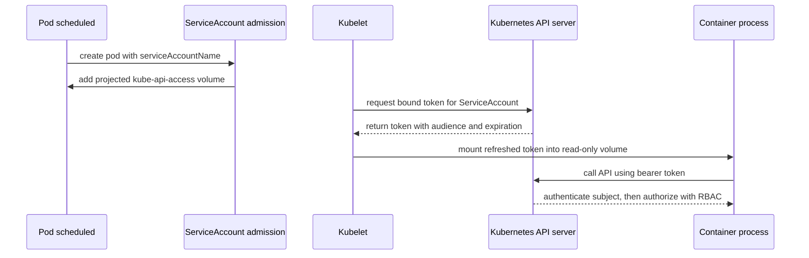

> **Complexity**: `[MEDIUM]` - Critical for workload security
>
> **Time to Complete**: 80-95 minutes
>
> **Prerequisites**: Module 2.1 (RBAC Deep Dive), CKA ServiceAccount knowledge

---

## What You'll Be Able to Do

After completing this module, you will be able to:

- **Design** namespace-specific ServiceAccounts with `automountServiceAccountToken: false`, explicit `serviceAccountName`, and least-privilege RBAC.
- **Audit** pods and RBAC bindings to find `default` ServiceAccount usage, broad subjects, and legacy token Secrets.
- **Implement** projected bound tokens with explicit `audience`, `expirationSeconds`, and read-only volume mounts.
- **Diagnose** 401 authentication failures versus 403 authorization denials by inspecting mounted tokens, audiences, and `kubectl auth can-i` results.
- **Evaluate** when to use default-deny admission policy, manual token creation, or namespace-level exceptions without weakening workload isolation.

## Why This Module Matters

Hypothetical scenario: a small internal reporting API accepts a crafted request that lets an attacker read files from inside its container. The application itself stores no customer database password, so the incident initially looks contained. Then the attacker checks the predictable ServiceAccount token path, finds a bearer token, calls the Kubernetes API, and discovers that the namespace default ServiceAccount can list Secrets because someone granted it broad permissions during an earlier deployment emergency.

That path from one pod to the API server is exactly why ServiceAccount security matters. A container compromise does not automatically become a cluster compromise; it becomes one when the mounted identity is useful outside the workload's real job. The [2018 Tesla cryptojacking incident](/k8s/cks/part1-cluster-setup/module-1.5-gui-security/) <!-- incident-xref: tesla-2018-cryptojacking --> is already covered elsewhere in this course, and this module preserves that cross-reference because it reinforces the same operational lesson: exposed cloud-native credentials are often more valuable than the first vulnerable process.

Kubernetes tries to balance two valid needs. Developers want pods to talk to the API server without handcrafting certificates, and platform teams want workloads to receive only the identity they truly need. ServiceAccounts provide that workload identity, RBAC decides what the identity can do, and projected TokenRequest credentials make the token time-bound instead of permanently useful. The security work is not to remove ServiceAccounts everywhere; it is to make every mounted identity intentional, narrow, observable, and replaceable.

By the end of this module, you will build that mental model from the admission path up through audit practice. You will see how default token mounting works, how `automountServiceAccountToken: false` changes the pod filesystem, how RBAC subjects map to ServiceAccount usernames, how bound tokens differ from legacy token Secrets, and how to distinguish authentication failures from authorization failures. The target version for examples is Kubernetes 1.35 or later, using stable ServiceAccount and TokenRequest behavior that modern clusters should already expose.

## How ServiceAccount Identity Reaches a Pod

A ServiceAccount is not a password manager, and it is not a human user. It is a Kubernetes API object that represents a workload identity inside a namespace. When a pod names a ServiceAccount, the API server and kubelet cooperate to give containers credentials that authenticate as `system:serviceaccount:<namespace>:<name>`. RBAC then evaluates that username, along with ServiceAccount groups such as `system:serviceaccounts:<namespace>`, against RoleBinding and ClusterRoleBinding rules.

The risky part is the default path. Every namespace has a `default` ServiceAccount, and a pod that does not specify `spec.serviceAccountName` uses that account. If automatic API credential mounting is enabled, containers receive a token volume whether the application needs Kubernetes API access or not. That convenience helps controllers, operators, and in-cluster clients, but it also puts an API credential in many containers whose business logic never calls Kubernetes.

The original module contained a truncated protected visualization titled `DEFAULT SERVICEACCOUNT EXPOSURE`. The diagram below keeps that protected teaching asset and completes it so the reader can inspect the full request path. Read it left to right: admission chooses the identity, kubelet materializes the token, the container reads the token, and the API server treats the request as the ServiceAccount subject.

```text
┌─────────────────────────────────────────────────────────────┐
│              DEFAULT SERVICEACCOUNT EXPOSURE                │
├─────────────────────────────────────────────────────────────┤
│                                                             │
│  Namespace: reports                                         │
│                                                             │
│  Pod without serviceAccountName                             │
│          │                                                  │
│          ▼                                                  │
│  ServiceAccount admission controller                        │
│          │ injects kube-api-access projected volume          │
│          ▼                                                  │
│  Container filesystem                                       │
│  /var/run/secrets/kubernetes.io/serviceaccount/token        │
│          │                                                  │
│          ▼                                                  │
│  API request authenticated as                               │
│  system:serviceaccount:reports:default                      │
│          │                                                  │
│          ▼                                                  │
│  RBAC allows or denies the requested verb and resource       │
│                                                             │
└─────────────────────────────────────────────────────────────┘
```

The first defensive question is therefore simple: should this pod have any Kubernetes API credential at all? A web frontend that only serves HTTP responses often does not need one. A controller that watches custom resources does need one, but only for the resources and verbs it reconciles. Treat ServiceAccount tokens like building keys, not like room decorations; a key belongs on the ring only when someone can name the door it opens.

Kubernetes gives you two levels where you can opt out of automatic token mounting. Setting `automountServiceAccountToken: false` on a ServiceAccount changes the default for pods that use that account. Setting the same field on a pod spec overrides the ServiceAccount choice for that pod. The pod-level setting wins, which is useful when one workload in a namespace needs API access while most workloads should receive no token.

The admission controller is important because it explains why a manifest can be shorter than the pod that actually runs. You submit a pod with a ServiceAccount name, or with no name at all, and admission fills in the identity and projected volume details before persistence. That mutation is useful, but it means review must include rendered pods. A secure template is not enough if an overlay, chart value, or pod override changes token delivery later.

```yaml
apiVersion: v1
kind: ServiceAccount
metadata:
  name: reports-viewer
  namespace: reports
automountServiceAccountToken: false
---
apiVersion: apps/v1
kind: Deployment
metadata:
  name: reports-ui
  namespace: reports
spec:
  replicas: 2
  selector:
    matchLabels:
      app: reports-ui
  template:
    metadata:
      labels:
        app: reports-ui
    spec:
      serviceAccountName: reports-viewer
      automountServiceAccountToken: false
      containers:
        - name: ui
          image: nginx:1.27
          ports:
            - containerPort: 80
```

Pause and predict: if you apply that deployment and then open a shell in a running pod, what should happen when you list `/var/run/secrets/kubernetes.io/serviceaccount`? The directory should not contain the usual token material because the pod explicitly opted out. If the directory still appears, inspect the rendered pod spec with `kubectl get pod -o yaml`; many debugging mistakes come from looking at the Deployment template while a different ReplicaSet is still running older pods.

```bash
kubectl create namespace reports
kubectl apply -f reports-ui.yaml
kubectl -n reports get pods -l app=reports-ui
kubectl -n reports exec deploy/reports-ui -- ls -la /var/run/secrets/kubernetes.io/serviceaccount
```

The command may fail if the image has no `ls` binary, which is normal for minimal containers. In that case, inspect the pod's rendered volumes and mounts rather than changing the workload image just for verification. The security point is the same: a missing token volume is a deliberate hardening control, and a present token volume needs an explicit justification that appears in reviewable YAML.

```bash
kubectl -n reports get pod -l app=reports-ui -o jsonpath='{range .items[*]}{.metadata.name}{"\n"}{.spec.volumes}{"\n"}{end}'
kubectl -n reports get pod -l app=reports-ui -o jsonpath='{range .items[*]}{.metadata.name}{"\n"}{.spec.containers[*].volumeMounts}{"\n"}{end}'
```

There is one subtle lesson in those commands. Security controls should be verified against the object that actually runs, not only against the manifest you intended to apply. Admission controllers, defaulting, Helm templates, Kustomize overlays, and rollout history can all change what reaches the kubelet. For the CKS exam and real operations, develop the habit of checking the live Pod, then tracing backward to the controller template when live state surprises you.

This also affects incident response timing. If you patch a Deployment template to disable token mounting, existing pods keep their current volumes until they are replaced. A controller rollout is therefore part of the security change, not an optional cleanup step. For a high-risk namespace, confirm the new ReplicaSet is serving traffic and the old pods are gone before declaring the credential exposure closed.

## Designing Least-Privilege ServiceAccounts and RBAC

Disabling token automounting is the cleanest answer for pods that do not call the Kubernetes API. For pods that do need API access, the right answer is a dedicated ServiceAccount with narrow RBAC. Dedicated means one workload purpose per identity, not one identity per entire namespace. Narrow means the Role names concrete resources, verbs, and resource names when possible, instead of handing a controller a ClusterRole that can mutate everything because one install guide was easier to copy.

Start with the application behavior, not with YAML. A status exporter may need `get`, `list`, and `watch` on pods in its own namespace. A deployment controller for a custom resource may need to update status on one custom resource and create child objects with specific labels. A job runner may need to create pods but not read Secrets. You cannot design least privilege by guessing from the application name; you design it by mapping API calls to verbs and resources.

That mapping should include negative space: the actions the workload must not perform. If a watcher only observes ConfigMaps, write down that it must not read Secrets, update Deployments, or cross namespace boundaries. Those negative statements are not bureaucracy; they become concrete tests with `kubectl auth can-i`. They also help reviewers notice when a Role contains a resource or verb that the implementation never uses.

The following table is a practical translation layer. It keeps the focus on ServiceAccount identity while making RBAC decisions explicit enough for review. The examples are intentionally namespace-scoped because ClusterRoleBinding is where ServiceAccount mistakes often become cluster-wide incidents.

| Workload need | ServiceAccount design | RBAC shape | Review question |
|---|---|---|---|
| No Kubernetes API calls | Dedicated ServiceAccount with `automountServiceAccountToken: false` | No RoleBinding | Why does the pod have a ServiceAccount at all if not for policy labels or future clarity? |
| Read namespaced workload state | Dedicated ServiceAccount per app component | Role with `get`, `list`, `watch` on exact resources | Can this read Secrets, ConfigMaps, or resources outside the namespace? |
| Reconcile one custom resource | Controller ServiceAccount | Role or ClusterRole limited to the custom resource and owned child objects | Does it need cluster scope, or is namespace scope enough? |
| Call an external identity broker | ServiceAccount with projected token for external audience | No Kubernetes RBAC beyond token creation path | Is the token rejected by the API server audience if leaked to the wrong service? |
| Administrative automation | Separate automation namespace and ServiceAccount | Small ClusterRoleBinding reviewed like production admin access | Is this really workload identity, or should it be a human-controlled pipeline identity? |

Here is a minimal namespace-scoped example. The ServiceAccount has automatic token mounting disabled by default, and the controller pod opts in only because it needs to watch ConfigMaps. The Role allows reads on ConfigMaps in the `reports` namespace and nothing else. Notice that the RoleBinding subject is the named ServiceAccount, not the entire namespace group.

```yaml
apiVersion: v1
kind: ServiceAccount
metadata:
  name: reports-config-watcher
  namespace: reports
automountServiceAccountToken: false
---
apiVersion: rbac.authorization.k8s.io/v1
kind: Role
metadata:
  name: reports-config-read
  namespace: reports
rules:
  - apiGroups: [""]
    resources: ["configmaps"]
    verbs: ["get", "list", "watch"]
---
apiVersion: rbac.authorization.k8s.io/v1
kind: RoleBinding
metadata:
  name: reports-config-watcher-read
  namespace: reports
subjects:
  - kind: ServiceAccount
    name: reports-config-watcher
    namespace: reports
roleRef:
  apiGroup: rbac.authorization.k8s.io
  kind: Role
  name: reports-config-read
```

The pod template has to complete the design. It names the ServiceAccount and deliberately sets `automountServiceAccountToken: true` because this one workload does need the mounted credential. That explicit `true` is not a contradiction; it is documentation. A reviewer can now see the exception at the pod boundary and compare it with the narrow RoleBinding that justifies the token.

```yaml
apiVersion: apps/v1
kind: Deployment
metadata:
  name: reports-config-watcher
  namespace: reports
spec:
  replicas: 1
  selector:
    matchLabels:
      app: reports-config-watcher
  template:
    metadata:
      labels:
        app: reports-config-watcher
    spec:
      serviceAccountName: reports-config-watcher
      automountServiceAccountToken: true
      containers:
        - name: watcher
          image: registry.k8s.io/e2e-test-images/agnhost:2.54
          args: ["pause"]
```

Before running this, what output do you expect from `kubectl auth can-i` when you impersonate the ServiceAccount? The identity should be able to list ConfigMaps in `reports`, but it should not be able to list Secrets or list ConfigMaps in another namespace. This is the fastest deterministic check for many ServiceAccount RBAC reviews because it exercises authorization without requiring the application to run.

```bash
kubectl auth can-i list configmaps \
  --as system:serviceaccount:reports:reports-config-watcher \
  --namespace reports

kubectl auth can-i list secrets \
  --as system:serviceaccount:reports:reports-config-watcher \
  --namespace reports

kubectl auth can-i list configmaps \
  --as system:serviceaccount:reports:reports-config-watcher \
  --namespace default
```

The dangerous shortcut is binding a Role or ClusterRole to a broad ServiceAccount group. Kubernetes supports subjects such as `system:serviceaccounts:reports` for every ServiceAccount in one namespace and `system:serviceaccounts` for every ServiceAccount in the cluster. Those groups are valid tools for rare platform controls, but they are high-risk in application namespaces because a future pod can receive privileges simply by existing in the namespace.

ClusterRoleBinding deserves a special pause. Binding a namespaced ServiceAccount to a ClusterRole is not automatically wrong; some controllers need cluster-scoped resources such as nodes, namespaces, or custom resources. The problem is that the blast radius changes from one namespace to the whole cluster. A ServiceAccount token from one compromised pod can now authenticate to cluster-level verbs, so the review must ask whether that exact workload needs cluster scope and whether the token is mounted only where that workload runs.

You should also avoid granting permissions to the namespace `default` ServiceAccount as a convenience path. The default account is shared by pods that forget to name an identity. Once you bind it to useful permissions, every future unnamed pod inherits those permissions silently. A namespace can have a default-deny culture for ServiceAccounts only when the `default` account remains boring, unbound, and preferably configured not to automount credentials.

```yaml
apiVersion: v1
kind: ServiceAccount
metadata:
  name: default
  namespace: reports
automountServiceAccountToken: false
```

That patch does not stop a pod from explicitly setting `automountServiceAccountToken: true`, and it does not remove RBAC that someone already bound to `default`. It changes the namespace baseline so that accidental pods do not receive credentials by default. Combine it with admission policy for stronger enforcement, and combine it with audit queries so you can find the exceptions that still mount tokens.

For mature platforms, the ServiceAccount name becomes part of the workload contract in the same way as container ports and resource requests. A pull request that changes `serviceAccountName` should trigger security review because it changes who the pod becomes when it talks to the API server. A pull request that changes RoleBinding subjects should be reviewed with equal care because it changes which identities inherit existing powers.

## Bound Tokens, Audiences, and Legacy Token Secrets

Modern Kubernetes ServiceAccount credentials are delivered through the TokenRequest API and projected volumes. The kubelet requests a time-bound token for the pod, writes it into a projected volume, and refreshes it before it expires. The default projected credential is bound to the pod and intended for the Kubernetes API server audience. When the pod is deleted, the API credentials are revoked after the deletion lifecycle rather than remaining useful forever.

This behavior replaced the older automatic creation of Secret-based ServiceAccount tokens. In clusters before the modern defaults, the control plane created long-lived `kubernetes.io/service-account-token` Secrets for ServiceAccounts. Those Secrets did not expire, and they were easy to copy into CI systems, scripts, and forgotten notebooks. Kubernetes still supports manually created token Secrets for compatibility, but the safer default is short-lived TokenRequest credentials.

The distinction matters during incident response. A bound token stolen from a running pod has a natural expiration and is tied to the pod lifecycle, so deleting the pod is a meaningful containment step. A legacy token Secret can remain useful until the Secret is deleted or invalidated. You should treat legacy tokens as durable credentials, not as temporary pod artifacts.

A useful way to remember the difference is ownership. A projected pod token belongs to a running workload instance and is managed by kubelet refresh behavior. A manually created token Secret belongs to the cluster object store and can be copied anywhere with Secret read access. Both authenticate as a ServiceAccount, but their operational lifetimes and cleanup paths are different enough that your audit should track them separately.



A projected `serviceAccountToken` source lets you request a token for a specific audience and lifetime. Use this when a workload needs to present a Kubernetes-issued identity to a relying party other than the Kubernetes API server, such as an internal identity broker that validates TokenReview responses. The audience field is critical because a recipient should reject tokens not intended for it, reducing the value of a token replayed to the wrong service.

```yaml
apiVersion: v1
kind: Pod
metadata:
  name: reports-broker-client
  namespace: reports
spec:
  serviceAccountName: reports-broker-client
  automountServiceAccountToken: false
  containers:
    - name: client
      image: registry.k8s.io/e2e-test-images/agnhost:2.54
      args: ["pause"]
      volumeMounts:
        - name: broker-token
          mountPath: /var/run/secrets/tokens
          readOnly: true
  volumes:
    - name: broker-token
      projected:
        sources:
          - serviceAccountToken:
              audience: reports-broker
              expirationSeconds: 3600
              path: token
```

The design is intentionally different from the default mount. Automatic mounting is disabled, so the pod does not receive the normal Kubernetes API token path. The explicit projected volume creates a token for the `reports-broker` audience and puts it at a path chosen by the workload. If that token is accidentally sent to the Kubernetes API server, the audience should not match the API server audience, and the request should fail authentication.

Expiration is not a magic shield. A token valid for one hour can still be abused during that hour, and an application that logs it can expose every refreshed value. Short lifetimes reduce the response window, but the primary controls are still least privilege, audience restriction, read-only mounts, and avoiding token delivery to containers that do not need identity. Think of expiration as a seatbelt, not as permission to drive recklessly.

Kubernetes requires projected ServiceAccount token lifetimes to meet API server limits. The request includes `expirationSeconds`, but the issuer can return a different validity duration, so serious clients should read the token response metadata when they call the TokenRequest API directly. For normal pods, kubelet handles refresh. For custom clients that call `kubectl create token` or the TokenRequest subresource, you should document the expected audience and lifetime in the consuming system.

Audience design is where many otherwise careful implementations become vague. A token with a broad or default audience may be accepted by more recipients than the workload owner intended. A token with a specific audience forces the relying service to declare itself, and it gives incident responders a clear question: which services should accept this stolen credential? If the answer is unclear, the audience boundary is not doing enough work.

```bash
kubectl -n reports create token reports-broker-client \
  --audience reports-broker \
  --duration 1h
```

Do not paste the resulting token into a module, ticket, or chat message. The command demonstrates mechanics, not a credential handling pattern. In real workflows, token output should go directly to the process that needs it, and long-lived automation should usually use a workload identity integration or short-lived exchange rather than a copied bearer token.

Legacy token audit is part of ServiceAccount security because old credentials often outlive the workloads that needed them. Search for Secrets of type `kubernetes.io/service-account-token`, then inspect whether they are manually created, auto-generated leftovers, or active compatibility requirements. In modern clusters, automatic legacy token cleanup marks unused auto-generated tokens invalid after a configured period, but manually created long-lived token Secrets still require human governance.

```bash
kubectl get secrets --all-namespaces \
  --field-selector type=kubernetes.io/service-account-token \
  -o custom-columns='NAMESPACE:.metadata.namespace,NAME:.metadata.name,SA:.metadata.annotations.kubernetes\.io/service-account\.name,TYPE:.type'
```

If you find a legacy token, do not delete it blindly during a busy production window. First identify consumers, confirm whether the ServiceAccount still exists, check labels such as `kubernetes.io/legacy-token-last-used`, and plan replacement with TokenRequest or a provider-native workload identity. The cleanup goal is to eliminate durable bearer tokens, but the operational method is controlled migration, not surprise breakage.

A good cleanup ticket names the replacement path before it names the deletion command. For an in-cluster workload, that replacement might be a projected token with a short lifetime. For an external automation job, it might be a provider workload identity integration or a tightly scoped process that calls TokenRequest just in time. Without a replacement path, teams tend to recreate the same long-lived Secret under a different name.

## Auditing and Diagnosing ServiceAccount Risk

Audit starts with inventory. You want to answer three questions for each namespace: which pods use the `default` ServiceAccount, which pods mount any ServiceAccount token, and which ServiceAccounts have RBAC bindings. These questions separate identity assignment, credential delivery, and authorization. Keeping those layers separate prevents a common diagnostic mistake: seeing a token and assuming it has dangerous permissions, or seeing a RoleBinding and forgetting the pod does not mount a token.

```bash
kubectl get pods --all-namespaces \
  -o custom-columns='NAMESPACE:.metadata.namespace,POD:.metadata.name,SERVICEACCOUNT:.spec.serviceAccountName,AUTOMOUNT:.spec.automountServiceAccountToken'

kubectl get rolebindings,clusterrolebindings --all-namespaces \
  -o custom-columns='KIND:.kind,NAMESPACE:.metadata.namespace,NAME:.metadata.name,SUBJECTS:.subjects[*].name,ROLE:.roleRef.name'
```

The first command can show blank ServiceAccount fields because the API default may not be visible the way you expect in custom columns for every object shape. When precision matters, inspect full YAML or JSON and remember that an omitted `serviceAccountName` means the pod uses `default`. A practical audit report should normalize blank values to `default`, then flag any pod where both the effective identity and automount decision are not documented.

For deeper token-mount inventory, inspect volumes and volume mounts. The projected default volume often has a generated name like `kube-api-access-random`, while custom projected volumes may use application-specific names. You are not trying to memorize suffixes; you are checking whether a ServiceAccount token source exists and where it is mounted. This is especially useful when an admission policy or Helm chart sets fields indirectly.

```bash
kubectl get pods --all-namespaces -o jsonpath='{range .items[*]}{.metadata.namespace}{"/"}{.metadata.name}{" sa="}{.spec.serviceAccountName}{" volumes="}{range .spec.volumes[*]}{.name}{":"}{.projected.sources[*].serviceAccountToken.path}{" "}{end}{"\n"}{end}'
```

JSONPath output can become dense, so turn it into a review artifact rather than staring at it once. Capture namespaces that contain mounted tokens, compare them to workloads that actually call the Kubernetes API, and file follow-up changes per application owner. In an exam setting, you may only need a quick command. In a production platform, the same idea becomes a recurring control with exceptions reviewed like firewall rules.

Prioritization matters when the audit finds many issues. Start with pods that mount tokens and run internet-facing code, pods that use the `default` ServiceAccount, and ServiceAccounts that appear in ClusterRoleBindings. Then move to lower-risk cleanup such as unused named accounts with no RoleBinding. That order matches attacker value: a mounted token with broad permissions is more urgent than a tidy but unused ServiceAccount object.

Diagnosis begins with the error boundary. A 401 response means the request was not authenticated. The token may be missing, expired, invalid for the audience, malformed, or presented to an endpoint that does not trust that issuer. A 403 response means authentication succeeded, but authorization denied the verb, resource, namespace, or non-resource URL. Mixing those up wastes time because RBAC cannot fix a token audience mismatch, and a new token cannot fix a missing RoleBinding.

```text
┌─────────────────────────────────────────────────────────────┐
│                 SERVICEACCOUNT FAILURE PATH                 │
├─────────────────────────────────────────────────────────────┤
│ API call from pod                                           │
│        │                                                    │
│        ▼                                                    │
│ Is a bearer token present and readable?                     │
│        │ no -> inspect automount, volume, mount path        │
│        │ yes                                                │
│        ▼                                                    │
│ Does authentication accept issuer, audience, and expiry?    │
│        │ no -> 401 Unauthorized                             │
│        │ yes                                                │
│        ▼                                                    │
│ Does RBAC allow verb, resource, namespace, and name?         │
│        │ no -> 403 Forbidden                                │
│        │ yes -> request proceeds                            │
└─────────────────────────────────────────────────────────────┘
```

Which approach would you choose here and why: inspect the mounted token first, or run `kubectl auth can-i` first? If the application reports 401, inspect token presence, audience, and expiration first because the request is failing before RBAC. If the application reports 403, impersonated authorization checks are usually faster because they tell you whether the authenticated ServiceAccount subject has the requested permission.

```bash
kubectl -n reports auth can-i get configmaps \
  --as system:serviceaccount:reports:reports-config-watcher \
  --namespace reports

kubectl -n reports auth can-i update configmaps \
  --as system:serviceaccount:reports:reports-config-watcher \
  --namespace reports
```

For a pod-level view, inspect events and the rendered pod spec. Failed mounts, missing ServiceAccounts, and invalid references often show up before the application even starts. Kubernetes does not let you change `serviceAccountName` on an existing pod; you update the controller template and recreate pods through rollout. That immutability is useful because identity changes should be visible as a deployment change, not as a silent mutation of a running process.

```bash
kubectl -n reports describe pod reports-config-watcher-example
kubectl -n reports get pod reports-config-watcher-example -o yaml
kubectl -n reports rollout restart deployment/reports-config-watcher
```

When debugging token contents, avoid dumping full tokens into logs or terminals that are recorded. A safer pattern is to check file existence, permissions, and selected decoded claims in a disposable environment without storing the token. If you must inspect JWT claims, redact the signature and bearer value before sharing. The goal is to confirm issuer, audience, subject, and expiration, not to spread a credential through your troubleshooting trail.

ServiceAccount audit also includes admission control. You can use ValidatingAdmissionPolicy, a policy engine, or platform-specific controls to reject pods that omit `serviceAccountName`, use `default`, or enable automounting outside approved namespaces. Admission should not be your only control because existing pods and RBAC bindings still matter, but it prevents new drift after you clean up the current state.

The audit workflow is strongest when it ends in a small exception register. Each exception should name the namespace, ServiceAccount, workload, RBAC role, token mount reason, and owner. That record is more valuable than a generic "least privilege" statement because it gives reviewers something falsifiable. If no owner can explain why a token is mounted, the default action should be removal or a narrow replacement identity.

Admission policy turns that register into enforcement. Once legitimate exceptions are known, you can reject new pods that omit `serviceAccountName`, use `default`, or set automounting to true outside approved labels. The policy does not need to be clever on day one. Even a small rule that blocks new `default` ServiceAccount usage prevents the same class of drift from returning after the first cleanup wave.

## Worked Example: Secure the Reports Namespace

Exercise scenario: the `reports` namespace contains two workloads. The UI serves static pages and never calls the Kubernetes API. The watcher reads ConfigMaps so it can reload report definitions. Both workloads currently run with the namespace `default` ServiceAccount, and an old RoleBinding lets that default account read ConfigMaps and Secrets. Your job is to split the identities, remove unnecessary token mounting, and keep only the permission that the watcher needs.

First, create the namespace and a deliberately unsafe starting point. The Role below is too broad because it includes Secrets, and the RoleBinding is too broad because it targets `default`. This is the kind of configuration that grows from a quick test into production unless somebody writes down the ServiceAccount design. You will replace it with explicit identities in the next steps.

```yaml
apiVersion: v1
kind: Namespace
metadata:
  name: reports
---
apiVersion: rbac.authorization.k8s.io/v1
kind: Role
metadata:
  name: reports-read-too-much
  namespace: reports
rules:
  - apiGroups: [""]
    resources: ["configmaps", "secrets"]
    verbs: ["get", "list", "watch"]
---
apiVersion: rbac.authorization.k8s.io/v1
kind: RoleBinding
metadata:
  name: default-read-too-much
  namespace: reports
subjects:
  - kind: ServiceAccount
    name: default
    namespace: reports
roleRef:
  apiGroup: rbac.authorization.k8s.io
  kind: Role
  name: reports-read-too-much
```

Apply the starting point only in a disposable practice cluster. In a shared cluster, read the example and adapt it to a sandbox namespace you own. The important diagnostic is the impersonation check: `default` can list Secrets even though no workload requirement mentions Secrets. That single mismatch is enough to justify a fix.

Notice that the unsafe state has two separate defects. The Role includes a sensitive resource, and the RoleBinding attaches that Role to an identity used by accidental pods. Removing either defect lowers risk, but removing both produces the intended design. This is why least privilege reviews should examine rules and subjects together instead of approving a Role just because its verbs look read-only.

```bash
kubectl apply -f reports-start.yaml

kubectl auth can-i list secrets \
  --as system:serviceaccount:reports:default \
  --namespace reports
```

Next, define two ServiceAccounts. The UI account disables token automounting and receives no RoleBinding. The watcher account also disables automounting by default, but the watcher pod template will explicitly opt in. That pattern gives you a secure baseline while still allowing the one workload that needs API access to receive a token.

```yaml
apiVersion: v1
kind: ServiceAccount
metadata:
  name: reports-ui
  namespace: reports
automountServiceAccountToken: false
---
apiVersion: v1
kind: ServiceAccount
metadata:
  name: reports-watcher
  namespace: reports
automountServiceAccountToken: false
```

Now replace the broad Role with one that only reads ConfigMaps, and bind it only to `reports-watcher`. This change narrows both the verbs and the subject. It also makes future review easier because the subject name tells you which workload should be using the permission. If a UI pod later appears with `reports-watcher`, that mismatch becomes visible in inventory.

```yaml
apiVersion: rbac.authorization.k8s.io/v1
kind: Role
metadata:
  name: reports-config-read
  namespace: reports
rules:
  - apiGroups: [""]
    resources: ["configmaps"]
    verbs: ["get", "list", "watch"]
---
apiVersion: rbac.authorization.k8s.io/v1
kind: RoleBinding
metadata:
  name: reports-watcher-config-read
  namespace: reports
subjects:
  - kind: ServiceAccount
    name: reports-watcher
    namespace: reports
roleRef:
  apiGroup: rbac.authorization.k8s.io
  kind: Role
  name: reports-config-read
```

The two deployments complete the worked example. The UI names `reports-ui` and keeps automounting disabled. The watcher names `reports-watcher` and opts in to token mounting because it needs to read ConfigMaps. The images are simple pause containers for practice; the security properties live in the pod specs, not in the application behavior.

```yaml
apiVersion: apps/v1
kind: Deployment
metadata:
  name: reports-ui
  namespace: reports
spec:
  replicas: 1
  selector:
    matchLabels:
      app: reports-ui
  template:
    metadata:
      labels:
        app: reports-ui
    spec:
      serviceAccountName: reports-ui
      automountServiceAccountToken: false
      containers:
        - name: ui
          image: registry.k8s.io/e2e-test-images/agnhost:2.54
          args: ["pause"]
---
apiVersion: apps/v1
kind: Deployment
metadata:
  name: reports-watcher
  namespace: reports
spec:
  replicas: 1
  selector:
    matchLabels:
      app: reports-watcher
  template:
    metadata:
      labels:
        app: reports-watcher
    spec:
      serviceAccountName: reports-watcher
      automountServiceAccountToken: true
      containers:
        - name: watcher
          image: registry.k8s.io/e2e-test-images/agnhost:2.54
          args: ["pause"]
```

After applying the replacement manifests, delete the unsafe RoleBinding and Role if they still exist. This matters because adding a good RoleBinding does not cancel a bad one. Kubernetes authorization is additive; any matching allow rule can permit the request. Least privilege requires removing stale grants, not merely adding better grants beside them.

```bash
kubectl apply -f reports-serviceaccounts.yaml
kubectl apply -f reports-rbac.yaml
kubectl apply -f reports-deployments.yaml

kubectl -n reports delete rolebinding default-read-too-much --ignore-not-found
kubectl -n reports delete role reports-read-too-much --ignore-not-found
```

Validate the final state from three angles. The UI should not mount a token. The watcher should be able to list ConfigMaps. The watcher should not be able to list Secrets, and the default ServiceAccount should no longer be useful for the original broad read. These checks align with the threat model instead of merely confirming that YAML applied successfully.

```bash
kubectl -n reports get pod -l app=reports-ui -o jsonpath='{range .items[*]}{.metadata.name}{" volumes="}{.spec.volumes}{"\n"}{end}'

kubectl auth can-i list configmaps \
  --as system:serviceaccount:reports:reports-watcher \
  --namespace reports

kubectl auth can-i list secrets \
  --as system:serviceaccount:reports:reports-watcher \
  --namespace reports

kubectl auth can-i list secrets \
  --as system:serviceaccount:reports:default \
  --namespace reports
```

The expected result is a boring UI identity, a narrow watcher identity, and no residual power on `default`. If one of those checks fails, do not immediately edit the nearest manifest. Trace whether the failure is identity assignment, token mounting, or RBAC. That discipline keeps troubleshooting small because each layer has a different owner and a different Kubernetes object.

The worked example also shows why cleanup order matters. If you delete the old RoleBinding before applying the replacement, the watcher may lose access temporarily. If you apply the replacement but forget deletion, the dangerous permission path remains. In production, plan the sequence as migrate, verify, remove stale grants, and verify again. That sequence avoids both avoidable outage and false confidence.

## Patterns & Anti-Patterns

Patterns and anti-patterns are useful only when they help you choose under pressure. ServiceAccount security often fails because teams treat it as a one-time YAML setting instead of an identity lifecycle. The table below focuses on decisions that scale across namespaces, review systems, and incident response. It does not repeat every command from earlier sections; it gives you review criteria for the next module, the next cluster, and the next exception request.

| Pattern | When to use it | Why it works | Scaling consideration |
|---|---|---|---|
| Dedicated ServiceAccount per workload purpose | Any app with a distinct API access need | Compromise of one pod maps to one reviewable identity | Name accounts after workload roles, not after teams, so ownership can move |
| Default automount disabled | Pods that do not call Kubernetes, plus namespace baselines | Removes credentials from containers where API access is accidental | Pair with admission checks so new pods do not drift back to token mounts |
| Namespaced RoleBinding first | Workloads that only touch namespaced resources | Keeps the blast radius inside the namespace | Escalate to ClusterRoleBinding only after listing the exact cluster-scoped resources |
| Projected token with custom audience | Workloads that authenticate to an internal broker or external verifier | Prevents a token for one audience from being accepted by another audience | Keep lifetimes short and document which verifier is expected to accept the audience |

The corresponding anti-patterns are familiar because they are convenient. Binding `default` to a broad Role solves a deployment problem quickly, but it creates a hidden permission path for every unnamed pod. Copying a legacy token into a CI variable makes a script work, but it leaves a durable bearer credential outside pod lifecycle controls. Granting `cluster-admin` to a controller during installation makes troubleshooting easy, but it hides the controller's real API contract.

| Anti-pattern | What goes wrong | Why teams fall into it | Better alternative |
|---|---|---|---|
| Granting permissions to namespace `default` | Unnamed pods inherit permissions silently | It is the first ServiceAccount that exists | Create a named ServiceAccount and bind only that subject |
| Binding `system:serviceaccounts` broadly | Every ServiceAccount in the cluster gains power | Group subjects look efficient for platform bootstrapping | Bind explicit ServiceAccounts or a tightly controlled namespace group |
| Leaving legacy token Secrets untracked | Durable bearer tokens survive workload deletion | Old integrations expect a file or copied token | Replace with TokenRequest or a provider workload identity flow |
| Treating 401 and 403 as the same problem | Teams change RBAC for authentication failures | The application just says "API error" | Classify the failure boundary before editing RoleBindings |

There is one pattern that deserves separate emphasis: make exceptions expire socially even if Kubernetes cannot expire the YAML object for you. A manual token Secret, broad ClusterRoleBinding, or namespace-wide group binding should carry an owner, a justification, and a review date in your platform records. Kubernetes will enforce the object you create; it will not remind you that the business reason disappeared last quarter.

Another scalable pattern is to make the secure path easier than the risky path. Provide a small manifest template for no-token workloads, another for namespaced readers, and a review checklist for cluster-scoped controllers. Teams copy examples under time pressure, so your examples become policy in practice. If the easiest internal example binds `default`, the platform will keep producing `default` bindings no matter what the written standard says.

Use anti-patterns as search queries during audits. Search for RoleBindings whose subject name is `default`, ClusterRoleBindings whose subjects contain `system:serviceaccounts`, and Secrets whose type is `kubernetes.io/service-account-token`. Those queries do not prove exploitation, but they identify places where a compromised pod could gain more reach than its workload contract suggests. Turn each finding into a design question before turning it into a deletion.

## Decision Framework

Use this framework when you review a workload or answer a CKS-style remediation prompt. The first branch is not "which Role should I bind?" The first branch is "does this pod need a Kubernetes API credential at all?" That ordering prevents over-engineering RBAC for workloads that should have no token, and it makes the remaining exceptions more defensible.

```text
Start
  |
  v
Does the workload call the Kubernetes API?
  |-- no --> dedicated ServiceAccount, automount false, no RoleBinding
  |
  |-- yes
        |
        v
Is the API need namespaced?
        |-- yes --> Role + RoleBinding to named ServiceAccount
        |
        |-- no
              |
              v
        Is cluster scope limited to specific resources and verbs?
              |-- yes --> narrow ClusterRole + ClusterRoleBinding
              |
              |-- no --> redesign workload or require explicit platform exception

Additional branch for external identity:
  if token is for a non-Kubernetes relying party,
  use projected serviceAccountToken with explicit audience and short lifetime.
```

The next decision is token delivery. A workload that needs Kubernetes API access can usually use the default projected token path with narrow RBAC. A workload that needs to prove identity to a different service should use a custom projected token with an audience that names that service. A workload that needs neither should disable automounting, even if the ServiceAccount exists for admission labels, image pull references, or future clarity.

| Decision | Choose this when | Avoid this when | Evidence to collect |
|---|---|---|---|
| `automountServiceAccountToken: false` on pod | The workload has no API calls or uses only external credentials | A controller library expects in-cluster config | Live pod has no ServiceAccount token source |
| Named ServiceAccount with RoleBinding | The workload reads or writes namespaced resources | It needs nodes, namespaces, or cluster-scoped CRDs | `kubectl auth can-i` allows only required verbs |
| ClusterRoleBinding to named ServiceAccount | The workload truly reconciles cluster-scoped resources | The app only touches one namespace | Design doc names each cluster-scoped resource |
| Projected token with custom audience | A relying party validates Kubernetes-issued workload identity | The Kubernetes API server is the only recipient | Token audience matches the relying party, not every service |
| Manual token Secret | A legacy integration cannot use TokenRequest yet | Convenience is the only reason | Migration plan exists and owner accepts durable credential risk |

A good ServiceAccount review produces a sentence that can survive an incident meeting. For example: "The `reports-watcher` pod mounts a token because it watches ConfigMaps in `reports`; its ServiceAccount is bound only to `get`, `list`, and `watch` ConfigMaps in that namespace; it cannot list Secrets." That sentence is specific enough to test. If your review sentence says "it follows least privilege," you have not finished the review.

When you face a breakage after hardening, classify it with the same framework. Missing token path means automount or volume configuration. 401 means authentication, usually token presence, issuer, audience, expiration, or trust. 403 means authorization, usually RoleBinding, verb, resource, resource name, namespace, or non-resource URL. Separating those outcomes keeps the fix aligned to the failing layer.

For exam practice, compress the framework into three checks you can run quickly. First, inspect the pod spec for `serviceAccountName`, automounting, and projected token volumes. Second, impersonate the ServiceAccount with `kubectl auth can-i` for the exact verb and resource. Third, inspect RoleBindings and ClusterRoleBindings only after you know the authorization question. That order gives you evidence before edits and avoids random YAML changes.

For platform design, expand the same framework into ownership boundaries. Application teams should justify why a workload needs a token and what API calls it makes. Platform teams should provide admission defaults, templates, and audit reporting. Security reviewers should challenge broad subjects, long-lived tokens, and cluster scope. Splitting responsibility this way prevents ServiceAccount hardening from becoming an invisible tax on one group.

## Did You Know?

- Kubernetes ServiceAccount TokenRequest reached stable status in v1.22, which is why modern pod credentials can be short-lived projected tokens instead of automatically generated long-lived Secret tokens.
- Kubernetes v1.24 stopped automatically creating legacy Secret-based tokens for every ServiceAccount, reducing the number of durable bearer tokens created by default in new clusters.
- The projected `serviceAccountToken` volume supports `audience`, `expirationSeconds`, and `path`, and the documented minimum requested lifetime is 600 seconds.
- Starting in v1.29, Kubernetes can mark unused auto-generated legacy ServiceAccount tokens invalid after the configured cleanup period, with the default period documented as one year.

## Common Mistakes

ServiceAccount mistakes are rarely syntax mistakes. They are usually boundary mistakes: the wrong identity, the wrong mount decision, the wrong scope, or the wrong failure diagnosis. Use this table as a pre-merge review aid, especially when a manifest introduces a new RoleBinding or changes a pod template's ServiceAccount fields.

| Mistake | Why It Happens | How to Fix It |
|---|---|---|
| Binding permissions to the `default` ServiceAccount | The deployment worked locally without naming an identity, so the quick fix targeted the account already present | Create a named ServiceAccount per workload purpose, move the RoleBinding to that subject, and keep `default` unbound |
| Setting `automountServiceAccountToken: false` only on the ServiceAccount and assuming every pod obeys it | Pod specs can override the ServiceAccount setting, and old ReplicaSets may still run older templates | Inspect live pods, update controller templates, and restart rollouts where the rendered pod still mounts a token |
| Using ClusterRoleBinding for namespaced resources | Install examples often use cluster scope to avoid namespace-specific instructions | Replace with Role and RoleBinding unless the workload needs cluster-scoped resources or cross-namespace access |
| Treating a 401 as an RBAC problem | The application reports "permission denied" without exposing the authentication boundary | Check token presence, audience, issuer, and expiration before changing RoleBindings |
| Treating a 403 as a token problem | The token exists, so the team keeps regenerating it | Use `kubectl auth can-i --as system:serviceaccount:<namespace>:<name>` to test the exact verb and resource |
| Copying `kubectl create token` output into CI variables permanently | A one-time debugging step becomes an undocumented durable credential | Use short-lived exchange, workload identity, or a documented migration plan with owner and expiry |
| Forgetting to remove stale broad RoleBindings after adding narrow ones | Kubernetes authorization is additive, so the old allow still wins | Delete or narrow the old binding, then re-run impersonated authorization checks for sensitive resources |

## Quiz

Use the quiz as a diagnostic exercise, not a recall drill. Each answer explains the layer that failed so you can practice choosing the right object to inspect before changing YAML.

<details>
<summary>Question 1: A namespace has ten pods that omit `serviceAccountName`, and the `default` ServiceAccount can list Secrets. What is the safest first design change?</summary>

Create named ServiceAccounts for workloads that need API access, move required permissions away from `default`, and set the namespace `default` ServiceAccount to `automountServiceAccountToken: false`. The risky condition is not merely that pods omit `serviceAccountName`; it is that omission maps them to a useful identity. Removing the broad RoleBinding from `default` reduces immediate blast radius, while named identities let you preserve required access for real API clients. Admission policy can come next to prevent new unnamed pods, but it does not replace cleaning up the existing permission.
</details>

<details>
<summary>Question 2: Your controller gets 403 Forbidden when it tries to watch ConfigMaps in its own namespace. The pod has a mounted token. What do you check first?</summary>

Check authorization with `kubectl auth can-i watch configmaps --as system:serviceaccount:<namespace>:<serviceaccount> --namespace <namespace>`. A 403 means authentication already succeeded, so changing token audience or automount settings is unlikely to help. The likely issue is a missing RoleBinding, a Role without the `watch` verb, or a namespace mismatch. After fixing RBAC, re-run the impersonated check before restarting the workload.
</details>

<details>
<summary>Question 3: A pod using a projected token for `audience: reports-broker` receives 401 Unauthorized from the Kubernetes API server. Why is that expected?</summary>

The token was minted for the `reports-broker` audience, not necessarily for the Kubernetes API server audience. Audience restriction means a recipient should reject a token that was not intended for it. That is a security feature because it limits replay across services. If the pod must call both the broker and the Kubernetes API, design separate token delivery paths and RBAC rather than reusing one broad token.
</details>

<details>
<summary>Question 4: An audit finds several `kubernetes.io/service-account-token` Secrets in a Kubernetes 1.35 cluster. What should your remediation plan include?</summary>

Treat those Secrets as legacy or manually created durable credentials until proven otherwise. Identify the ServiceAccount annotation, check last-used or invalidation labels when present, find consumers, and replace the usage with TokenRequest or provider workload identity where possible. Do not delete every Secret immediately because a legacy integration may still depend on one. The secure outcome is removal or documented exception, but the operational path should avoid unplanned outage.
</details>

<details>
<summary>Question 5: A UI deployment does not call the Kubernetes API, but the platform requires every pod to name a ServiceAccount. How do you design the identity?</summary>

Create a dedicated UI ServiceAccount with `automountServiceAccountToken: false`, set the pod's `serviceAccountName` to that account, and avoid any RoleBinding. Naming the ServiceAccount satisfies platform clarity without delivering credentials the UI does not need. The absence of RBAC means even an accidental token would not be very useful, but the automount setting removes the token from the container path. Verify the live pod's volumes after rollout because templates and running pods can differ.
</details>

<details>
<summary>Question 6: A platform engineer proposes binding a ClusterRole to `system:serviceaccounts:reports` so all reports workloads can read ConfigMaps. What is the concern?</summary>

That subject grants the permission to every ServiceAccount in the `reports` namespace, including future accounts that may belong to unrelated pods. The group subject is valid Kubernetes syntax, but it weakens workload isolation because namespace membership becomes the permission boundary. A safer design binds a Role to the exact ServiceAccount that needs ConfigMap reads. If multiple workloads need the same read-only permission, name that as an intentional shared pattern and review each subject explicitly.
</details>

<details>
<summary>Question 7: After setting `automountServiceAccountToken: false` on a ServiceAccount, one pod still mounts a token. What explains the result?</summary>

The pod spec can override the ServiceAccount setting with its own `automountServiceAccountToken` value, and existing pods may have been created from an older template. Inspect the live pod YAML first, then inspect the controller template that created it. If the pod-level field is `true`, remove the override or document why this workload is an exception. If only old pods show the mount, restart the rollout after updating the template.
</details>

## Hands-On Exercise

This exercise gives you a compact ServiceAccount hardening loop that you can run in a disposable Kubernetes 1.35 or later cluster. You will create a namespace, split workload identities, remove token mounting from a UI pod, keep narrow ConfigMap read access for a watcher pod, and verify that authentication and authorization failures point to different layers. Do not run it in a production namespace unless you adapt the names and review the objects with the owning team.

The lab intentionally uses small objects so you can see every layer without tool noise. In a real cluster, the same procedure may involve Helm values, generated names, GitOps reconciliation, and policy exceptions. Do not let that complexity change the sequence. Determine whether the pod needs identity, assign a named ServiceAccount, deliver only the token needed, bind only the required verbs, then verify the live pod and impersonated permissions.

### Setup

Create a working directory for the manifests and use the examples from the worked section as your starting point. You can place each YAML block in its own file or combine them with document separators. The commands below assume separate files so each step has a clear rollback point. If your cluster uses a policy engine that blocks pause images or unmanaged namespaces, adjust the image and namespace labels to match your local rules.

```bash
mkdir -p serviceaccount-security-lab
cd serviceaccount-security-lab
```

### Tasks

- [ ] Create the `reports` namespace and reproduce the unsafe starting RoleBinding that lets `system:serviceaccount:reports:default` list Secrets.
- [ ] Design two namespace-specific ServiceAccounts, `reports-ui` and `reports-watcher`, with default token automounting disabled.
- [ ] Implement a narrow Role and RoleBinding so `reports-watcher` can `get`, `list`, and `watch` ConfigMaps, but cannot read Secrets.
- [ ] Deploy a UI pod that names `reports-ui` and does not mount a ServiceAccount token.
- [ ] Deploy a watcher pod that names `reports-watcher`, deliberately mounts a token, and passes `kubectl auth can-i` checks only for ConfigMaps.
- [ ] Evaluate whether an admission policy or exception register would prevent this namespace from drifting back to `default` ServiceAccount usage.

<details>
<summary>Solution guidance</summary>

Start by applying the unsafe `reports-start.yaml` from the worked example, then verify the bad state with `kubectl auth can-i list secrets --as system:serviceaccount:reports:default --namespace reports`. Apply the two ServiceAccounts, the narrow ConfigMap Role, the RoleBinding to `reports-watcher`, and the two deployments. Delete the unsafe RoleBinding and Role with `--ignore-not-found` so the old allow rule no longer masks your fix. Finish by checking UI pod volumes and impersonating `reports-watcher` for both ConfigMaps and Secrets.

```bash
kubectl auth can-i list configmaps \
  --as system:serviceaccount:reports:reports-watcher \
  --namespace reports

kubectl auth can-i list secrets \
  --as system:serviceaccount:reports:reports-watcher \
  --namespace reports

kubectl auth can-i list secrets \
  --as system:serviceaccount:reports:default \
  --namespace reports

kubectl -n reports get pod -l app=reports-ui -o yaml
```

If the UI pod still has a `kube-api-access` projected volume, inspect the pod template for an override and confirm you are looking at pods from the newest ReplicaSet. If the watcher cannot list ConfigMaps, confirm the RoleBinding subject namespace and ServiceAccount name match the pod's `serviceAccountName`. If the watcher can list Secrets, search for another RoleBinding or ClusterRoleBinding because Kubernetes authorization is additive.
</details>

### Success Criteria

- [ ] No workload in `reports` relies on the namespace `default` ServiceAccount for application permissions.
- [ ] The UI workload uses `reports-ui`, has `automountServiceAccountToken: false`, and has no ServiceAccount token volume in the live pod.
- [ ] The watcher workload uses `reports-watcher`, mounts a token intentionally, and can read ConfigMaps in `reports`.
- [ ] `reports-watcher` cannot list Secrets in `reports`, and `reports:default` cannot list Secrets after stale bindings are removed.
- [ ] You can explain whether a 401 or 403 should lead you to token inspection, audience inspection, or RBAC inspection.
- [ ] Any remaining exception has an owner, a reason, and a planned review date in your own notes.

When you finish, keep the verification commands as your personal runbook. The exact namespace and account names will change, but the questions stay stable: who is the pod, does it have a token, what can that identity do, and which old grants still exist? That runbook is the practical bridge between CKS exam tasks and production hardening work.

## Sources

- https://kubernetes.io/docs/concepts/security/service-accounts/
- https://kubernetes.io/docs/reference/access-authn-authz/service-accounts-admin/
- https://kubernetes.io/docs/tasks/configure-pod-container/configure-service-account/
- https://kubernetes.io/docs/concepts/storage/projected-volumes/
- https://kubernetes.io/docs/reference/access-authn-authz/rbac/
- https://kubernetes.io/docs/reference/access-authn-authz/authorization/
- https://kubernetes.io/docs/reference/access-authn-authz/admission-controllers/
- https://kubernetes.io/docs/reference/kubernetes-api/authentication-resources/token-request-v1/
- https://kubernetes.io/docs/reference/kubernetes-api/authentication-resources/service-account-v1/
- https://kubernetes.io/docs/reference/kubectl/generated/kubectl_auth/kubectl_auth_can-i/
- https://kubernetes.io/docs/reference/kubectl/generated/kubectl_create/kubectl_create_token/
- https://kubernetes.io/docs/reference/kubernetes-api/authorization-resources/self-subject-access-review-v1/

## Next Module

Next: [Module 2.3: Pod Security Standards](/k8s/cks/part2-cluster-hardening/module-2.3-pod-security-standards/) builds on ServiceAccount isolation by controlling what pods are allowed to run in the first place.
