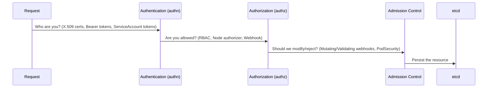
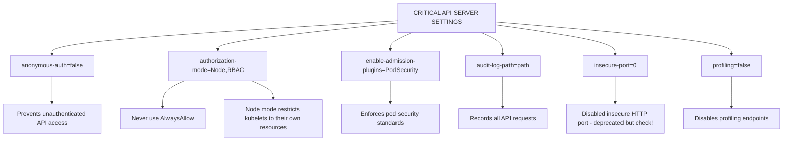
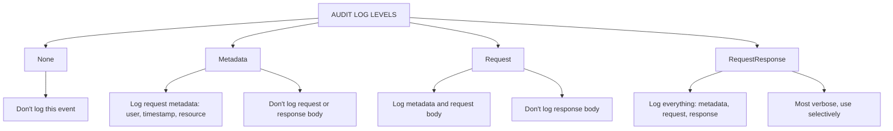

> **Complexity**: `[COMPLEX]` - Critical infrastructure component
>
> **Time to Complete**: 45-50 minutes
>
> **Prerequisites**: CKA API server knowledge, Module 1.2 (CIS Benchmarks), static pod troubleshooting, and basic RBAC fluency

---

## What You'll Be Able to Do

After completing this module, you will be able to:

1. **Design** API server authentication and authorization boundaries that reject anonymous access while preserving kubelet and user workflows.
2. **Audit** kube-apiserver static pod flags for anonymous auth, Node/RBAC authorization, admission plugins, profiling, and deprecated settings.
3. **Implement** audit logging and encryption-at-rest settings that capture security events without exhausting control plane storage.
4. **Diagnose** API server restart, TLS, and kubelet communication failures using container runtime logs and Kubernetes status checks.
5. **Evaluate** Kubernetes v1.35 upgrade readiness by detecting removed insecure flags and choosing a safe remediation order.

## Why This Module Matters

Hypothetical scenario: a team exposes a Kubernetes control plane endpoint to a broad corporate network because it is "only for administrators," then later discovers that an old ClusterRoleBinding grants read access to `system:unauthenticated`. The API server did not need a zero-day to become dangerous; it only needed network reachability, anonymous authentication, and a permissive authorization rule to line up at the same time. In a CKS context, your job is to recognize that this is a layered failure, not a single bad flag.

The API server is the control plane's front door. Every `kubectl` request, every controller reconciliation loop, every admission webhook call, and every kubelet status update eventually passes through this process. If an attacker can submit accepted requests to it, the attacker is no longer merely touching a server port; they are asking Kubernetes to create workloads, read Secrets, change RBAC, and reshape the cluster through the same orchestration machinery that administrators use.

The lesson in this module is not that one flag magically hardens the cluster. A secure API server combines identity checks, authorization modes, admission controls, audit records, encrypted storage, and constrained network paths so that one mistake does not collapse the whole security model. You will practice reading the static pod manifest like an evidence file: each flag explains what the API server will trust, what it will reject, what it will record, and how it will behave when a node or user presents credentials.

The [2018 Tesla cluster compromise](/k8s/cks/part1-cluster-setup/module-1.5-gui-security/) <!-- incident-xref: tesla-2018-cryptojacking --> is a useful reminder that exposed administrative interfaces turn configuration errors into operational incidents quickly. This module keeps the focus on the API server rather than a dashboard, but the pattern is the same: a reachable control surface with weak authentication becomes a path to data access, workload manipulation, and unauthorized compute. Treat the API server as a public-facing security boundary even when it sits behind private addresses.

## API Server Authentication and Authorization Boundaries

The API server processes requests in a fixed security sequence, and the order matters because each stage answers a different question. Authentication asks who is making the request, authorization asks whether that identity may perform the requested action, admission asks whether the request should be changed or rejected before persistence, and etcd stores the final object. A request that fails authentication usually returns `401 Unauthorized`; a request that authenticates but lacks permission usually returns `403 Forbidden`.

Think of the sequence as a secure building entrance rather than a single locked door. The receptionist checks identity, the access list decides which rooms the person may enter, the security scanner blocks unsafe items, and the records office stores the approved paperwork. If the receptionist accepts "unknown person" as a real identity, the access list becomes the next line of defense, but it is now handling traffic that should never have entered the lobby.

```text
┌─────────────────────────────────────────────────────────────┐
│              API SERVER REQUEST FLOW                        │
├─────────────────────────────────────────────────────────────┤
│                                                             │
│  Request ──────────────────────────────────────────────►   │
│           │                                                 │
│           ▼                                                 │
│  ┌─────────────────┐                                       │
│  │ Authentication  │  Who are you?                         │
│  │ (authn)         │  - X.509 certs                        │
│  │                 │  - Bearer tokens                       │
│  │                 │  - ServiceAccount tokens              │
│  └────────┬────────┘                                       │
│           │                                                 │
│           ▼                                                 │
│  ┌─────────────────┐                                       │
│  │ Authorization   │  Are you allowed?                     │
│  │ (authz)         │  - RBAC                               │
│  │                 │  - Node authorizer                    │
│  │                 │  - Webhook                            │
│  └────────┬────────┘                                       │
│           │                                                 │
│           ▼                                                 │
│  ┌─────────────────┐                                       │
│  │ Admission       │  Should we modify/reject?             │
│  │ Control         │  - Mutating webhooks                  │
│  │                 │  - Validating webhooks                │
│  │                 │  - PodSecurity                        │
│  └────────┬────────┘                                       │
│           │                                                 │
│           ▼                                                 │
│  ┌─────────────────┐                                       │
│  │    etcd         │  Persist the resource                 │
│  └─────────────────┘                                       │
│                                                             │
└─────────────────────────────────────────────────────────────┘
```



The main API group is located at `api/v1`, while other resources live under groups such as `apps/v1` and `rbac.authorization.k8s.io/v1`. That grouping changes the resource path and RBAC rule shape, but it does not change the security flow. A request to list Pods and a request to patch a ClusterRole both pass through authentication, authorization, admission, and persistence in that order.

Anonymous authentication is especially important because Kubernetes can assign unauthenticated requests to the `system:anonymous` user and `system:unauthenticated` group when it is enabled. That identity sounds harmless, but RBAC can bind permissions to groups, and old troubleshooting shortcuts sometimes leave broad read access attached to unauthenticated subjects. Designing API server authentication and authorization boundaries means rejecting anonymous traffic before RBAC ever has to decide what that traffic may see.

Pause and predict: what do you think happens if anonymous authentication stays enabled, but no RBAC rule grants permissions to `system:anonymous` or `system:unauthenticated`? The request still reaches authorization with an identity, but authorization should deny it with `403 Forbidden`; that distinction matters because the API server has accepted the request as an anonymous principal rather than rejecting it as unauthenticated at the first gate.

The Node authorizer solves a different boundary problem. Kubelets need API access to report node status, read Pods scheduled to their node, and manage related resources, but a kubelet should not be able to manage every Pod in the cluster merely because it is a node component. `Node,RBAC` makes kubelet permissions topology-aware before RBAC handles ordinary user and controller decisions, which is why a CKS answer that says "use RBAC" is often incomplete.

ServiceAccount tokens deserve the same careful reading because they are the most common in-cluster API credential. Modern bound ServiceAccount tokens include an issuer and audience model, so the API server needs issuer configuration that matches the tokens it is asked to validate. If the issuer is wrong, Pods can fail to authenticate even though RBAC and admission are perfectly configured, which makes token validation a control plane trust problem rather than an application bug.

Admission controllers operate after authorization, so they are not a substitute for either authentication or RBAC. They can still be decisive because they inspect the object that is about to be stored, not just the identity and verb. `NodeRestriction` limits what kubelets can mutate, `PodSecurity` enforces pod security standards, and validating webhooks can reject dangerous object shapes that would otherwise be authorized.

Response codes are useful evidence when you diagnose this flow. A `401` usually tells you the request did not present an acceptable identity, while a `403` usually tells you the identity was recognized but denied by authorization. A successful response followed by a rejected object can point to admission, especially when the error message names a policy, webhook, or Pod Security profile rather than an RBAC rule.

Do not confuse authentication strength with authorization shape. A client certificate signed by the cluster CA can prove identity very strongly while still mapping to a subject that should have almost no privileges. The API server security model depends on both pieces being true at the same time: identities must be hard to forge, and the permissions attached to those identities must be narrow enough that a stolen credential does not become cluster-wide control.

## Auditing Static Pod Flags and Deprecated Settings

In kubeadm-style clusters, the API server runs as a static pod watched by the kubelet, and the manifest normally lives at `/etc/kubernetes/manifests/kube-apiserver.yaml`. That file is both the control plane configuration and the recovery surface. If you add a misspelled flag, the kubelet will restart the static pod, the API server may fail before serving traffic, and `kubectl` will stop being useful until you inspect the container runtime directly.

The first audit pass should identify flags that decide who may ask for access. The following preserved manifest fragment shows the authentication settings that usually matter first: anonymous authentication, client certificate roots, bootstrap token handling, and ServiceAccount token validation. The key habit is to read these as trust statements, not as memorized exam trivia; every file path points to a key or CA the API server will accept as proof.

```yaml
# /etc/kubernetes/manifests/kube-apiserver.yaml
spec:
  containers:
  - command:
    - kube-apiserver
    # Disable anonymous authentication
    - --anonymous-auth=false

    # Client certificate authentication
    - --client-ca-file=/etc/kubernetes/pki/ca.crt

    # Bootstrap token authentication (for node join)
    - --enable-bootstrap-token-auth=true

    # ServiceAccount token authentication
    - --service-account-key-file=/etc/kubernetes/pki/sa.pub
    - --service-account-issuer=https://kubernetes.default.svc
```

Authentication settings are only useful when authorization is strict enough to make identities meaningful. `AlwaysAllow` effectively tells the API server that an authenticated identity may do anything, which collapses the boundary you just established. For hardened clusters and CKS exercises, the expected baseline is `Node,RBAC`, with the Node authorizer placed where kubelet-scoped decisions can be made before generic RBAC grants are considered.

```yaml
    # Authorization modes (order matters!)
    - --authorization-mode=Node,RBAC
    # Node: kubelet authorization
    # RBAC: role-based access control
    # Don't use: AlwaysAllow (dangerous!)
```

Admission plugins complete the static-pod flag audit because they provide object-level controls that authentication and authorization do not express. `NodeRestriction` is commonly paired with the Node authorizer, while `PodSecurity` gives namespaces an enforceable pod security profile. `EventRateLimit` can reduce control plane noise, but it needs configuration and operational care because rate limits can also hide useful event streams during an incident.

```yaml
    # Enable essential admission controllers
    - --enable-admission-plugins=NodeRestriction,PodSecurity,EventRateLimit

    # Disable risky admission controllers
    - --disable-admission-plugins=AlwaysAdmit
```

Before editing this file, ask yourself what will keep working if the API server does not come back. `kubectl get pods -n kube-system` depends on the API server, so it is not your first recovery tool when the process is down. The safer workflow is to keep one root shell on the control plane node, use `crictl` to inspect static pod containers, and be prepared to revert a single line in the manifest.

The security-critical settings fit together as a checklist, but the checklist is not a substitute for understanding the failure modes. `--anonymous-auth=false` blocks unauthenticated principals, `--authorization-mode=Node,RBAC` prevents broad kubelet authority and user overreach, `--enable-admission-plugins=NodeRestriction,PodSecurity` controls object shape and node claims, `--audit-log-path` creates evidence, and `--profiling=false` removes debug endpoints that are rarely needed in production.

```text
┌─────────────────────────────────────────────────────────────┐
│              CRITICAL API SERVER SETTINGS                   │
├─────────────────────────────────────────────────────────────┤
│                                                             │
│  anonymous-auth=false                                      │
│  └── Prevents unauthenticated API access                   │
│                                                             │
│  authorization-mode=Node,RBAC                              │
│  └── Never use AlwaysAllow                                 │
│  └── Node mode restricts kubelets to their own resources   │
│                                                             │
│  enable-admission-plugins=PodSecurity                      │
│  └── Enforces pod security standards                       │
│                                                             │
│  audit-log-path=<path>                                     │
│  └── Records all API requests                              │
│                                                             │
│  insecure-port=0 (deprecated but check!)                   │
│  └── Disabled insecure HTTP port                           │
│                                                             │
│  profiling=false                                           │
│  └── Disables profiling endpoints                          │
│                                                             │
└─────────────────────────────────────────────────────────────┘
```



Kubernetes v1.35 clusters should not carry removed insecure serving flags from older releases. The historical `--insecure-port` path is gone, so leaving a stale `--insecure-port=8080` line in a manifest is not a harmless no-op; a modern API server rejects unknown flags during startup. Upgrade readiness therefore includes flag hygiene, not just checking that workloads use supported API versions.

High-availability control planes add another audit detail: every API server instance must enforce the same security posture. A load balancer can hide drift because requests appear healthy as long as at least one instance works, while another instance may still be missing audit flags or carrying a deprecated setting. When you audit an HA cluster, inspect each control plane node and compare the static pod manifests rather than assuming one healthy endpoint proves uniform configuration.

Static pod edits also have a timing model that can surprise new administrators. The kubelet watches the manifest directory, notices a file update, and recreates the container when the pod spec changes. That means a half-written file, a bad indentation level, or a duplicate flag can immediately affect the API server; use careful editor saves, keep the old manifest close, and avoid unrelated cleanup while you are changing security controls under exam pressure.

Before running this audit on a real control plane, decide how you would prove each finding. A visible flag in the manifest proves intended configuration, a running static pod command line proves active configuration, and an external request proves observed behavior. CKS tasks often reward the administrator who can connect all three without losing access to the cluster during the edit.

## Audit Logging and Evidence Without Exhausting Storage

Audit logging gives you a chronological record of API server requests, but it is not a free security feature. The API server must evaluate an audit policy, write events, rotate files, and sometimes include request or response bodies. A useful policy records security-relevant activity with enough detail for investigation while avoiding uncontrolled disk growth on high-volume resources.

The enablement flags define the policy file location, log path, and rotation limits. These flags are part of the static pod manifest, so the host paths must also be visible inside the container. A common failure is to add `--audit-log-path` without creating the host directory or mounting it, which makes the API server fail during startup even though the flag itself is spelled correctly.

```yaml
# API server flags
- --audit-policy-file=/etc/kubernetes/audit-policy.yaml
- --audit-log-path=/var/log/kubernetes/audit.log
- --audit-log-maxage=30
- --audit-log-maxbackup=10
- --audit-log-maxsize=100
```

The policy controls what gets written and at which level. `Metadata` records who did what to which resource without object bodies, `Request` includes the submitted object, and `RequestResponse` includes both the request and response. That last level is powerful for Secrets and RBAC changes, but it is usually too expensive for noisy resources such as watches, events, endpoints, or leases.

```yaml
# /etc/kubernetes/audit-policy.yaml
apiVersion: audit.k8s.io/v1
kind: Policy
rules:
  # Log authentication failures
  - level: Metadata
    omitStages:
    - RequestReceived

  # Log secret access
  - level: RequestResponse
    resources:
    - group: ""
      resources: ["secrets"]

  # Log all pod operations
  - level: Request
    resources:
    - group: ""
      resources: ["pods"]
    verbs: ["create", "update", "patch", "delete"]

  # Log RBAC changes
  - level: RequestResponse
    resources:
    - group: "rbac.authorization.k8s.io"

  # Skip noisy events
  - level: None
    users: ["system:kube-proxy"]
    verbs: ["watch"]
    resources:
    - group: ""
      resources: ["endpoints", "services"]
```

```text
┌─────────────────────────────────────────────────────────────┐
│              AUDIT LOG LEVELS                               │
├─────────────────────────────────────────────────────────────┤
│                                                             │
│  None                                                      │
│  └── Don't log this event                                  │
│                                                             │
│  Metadata                                                  │
│  └── Log request metadata (user, timestamp, resource)      │
│  └── Don't log request or response body                    │
│                                                             │
│  Request                                                   │
│  └── Log metadata and request body                         │
│  └── Don't log response body                               │
│                                                             │
│  RequestResponse                                           │
│  └── Log everything: metadata, request, response           │
│  └── Most verbose, use selectively                         │
│                                                             │
└─────────────────────────────────────────────────────────────┘
```



A practical audit policy usually starts with broad `Metadata` coverage, raises selected sensitive resources to `Request` or `RequestResponse`, and explicitly drops low-value watch traffic. That structure lets investigators answer "who touched this Secret or ClusterRole?" without filling a control plane disk with repetitive status streams. The rotation flags then act as the last guardrail, not the primary design.

Which approach would you choose here and why: `RequestResponse` for every resource, or `Metadata` for most resources with elevated logging for Secrets and RBAC? The second approach is usually stronger in production because it preserves evidence for high-risk operations while keeping the API server healthy enough to continue producing evidence during an incident.

Audit events also help diagnose authentication and authorization boundaries because they record the user, groups, verb, resource, namespace, and response status. If a scanner reports anonymous access, audit logs can show whether the request was rejected at authentication, denied by authorization, or allowed through a binding. That is much more useful than simply knowing that a curl command returned JSON.

The `omitStages` field is another practical tuning point. `RequestReceived` can be noisy because it records requests before authorization and admission reach a final result, while later stages are often more useful for investigations that ask whether the request succeeded. A thoughtful policy records enough stage information to reconstruct security decisions without doubling log volume for requests whose final response is the only fact you need.

Audit webhooks can stream events to external systems, but the local file backend remains important during a control plane incident. If the network path to a SIEM is broken, a local rotated log may be the only evidence left on the node. For CKS work, the file backend is also easier to validate quickly because you can trigger a request and inspect the local log without debugging an external collector.

Do not place audit logs on a tiny root filesystem without thinking about disk pressure. Control plane nodes often host etcd, kubelet state, container logs, and static pod volumes on the same underlying storage. If audit logging fills that storage, the cluster can lose both availability and evidence, so the policy and rotation settings are availability controls as much as security controls.

Audit policies should also reflect how Kubernetes controllers behave. A controller can perform frequent reads and watches that are normal during reconciliation, while a human modifying a ClusterRoleBinding is comparatively rare and security-sensitive. Good policy design separates those patterns, so normal automation does not drown out the events that would explain privilege escalation, Secret access, or an unexpected workload creation.

## Network Boundaries, NodeRestriction, and Secure Kubelet Communication

Hardening the API server begins with request processing, but network reachability still decides who gets to test those controls. The secure port normally listens on TCP 6443, and the API server may bind broadly while firewalls, security groups, load balancers, or private routing decide who can reach it. A private address is not a complete defense if the private network includes untrusted workloads, compromised jump hosts, or broad peering.

The preserved flag fragment below shows the difference between advertising an address and binding a listener. `--advertise-address` tells other components which address to use for the API server, while `--bind-address` decides where the process listens. In many production designs the bind address remains broad because the node network requires it, so the effective restriction must come from host firewall rules and upstream network controls.

```yaml
# API server flags to bind to specific address
- --advertise-address=10.0.0.10
- --bind-address=0.0.0.0  # Or specific IP

# In production, use firewall rules to restrict access
# iptables -A INPUT -p tcp --dport 6443 -s 10.0.0.0/8 -j ACCEPT
# iptables -A INPUT -p tcp --dport 6443 -j DROP
```

Network restrictions reduce exposure, but they do not replace API authorization because kubelets, controllers, and administrators still need access. That is why `NodeRestriction` matters. It narrows the blast radius of a compromised kubelet by preventing it from changing other Node objects or using node labels in ways that could influence scheduling and trust decisions outside its own lane.

```yaml
# Enable NodeRestriction (limits what kubelets can modify)
- --enable-admission-plugins=NodeRestriction

# What it prevents:
# - Kubelets can only modify pods scheduled to them
# - Kubelets can only modify their own Node object
# - Kubelets cannot modify other nodes' labels
```

The subtle trap is to treat `NodeRestriction` as optional because RBAC is already enabled. RBAC can say that a node identity has access to pod-related resources, but it does not by itself understand which node a Pod is scheduled to. The Node authorizer and NodeRestriction admission plugin add that context, creating a boundary that follows scheduling rather than broad role membership.

When the API server connects to kubelets for `kubectl logs`, `kubectl exec`, and port-forward style flows, it also needs secure client and CA material. These requests feel like direct user actions, but the API server is the component that proxies the connection to the kubelet. If the kubelet serving certificate cannot be verified, you may see x509 errors even though your local kubeconfig and user certificate are fine.

```yaml
spec:
  containers:
  - command:
    - kube-apiserver
    # API server flags for secure kubelet communication
    - --kubelet-certificate-authority=/etc/kubernetes/pki/ca.crt
    - --kubelet-client-certificate=/etc/kubernetes/pki/apiserver-kubelet-client.crt
    - --kubelet-client-key=/etc/kubernetes/pki/apiserver-kubelet-client.key
---
# Enable HTTPS for kubelet (on kubelet side)
# /var/lib/kubelet/config.yaml
serverTLSBootstrap: true
```

In exam troubleshooting, separate three traffic directions in your head. A user connecting to the API server depends on the API server serving certificate and user authentication. A kubelet connecting to the API server depends on node credentials and Node/RBAC authorization. The API server connecting to a kubelet depends on kubelet serving trust and API server kubelet client credentials.

Exercise scenario: you set `--authorization-mode=RBAC` without including `Node`, and user requests still appear normal. The missing damage is in node-scoped authorization, not ordinary user access. A compromised or misconfigured kubelet may be evaluated through broad RBAC grants without the topology-aware Node authorizer narrowing the request to resources related to that node.

Front-proxy and aggregation settings are another API server trust surface, even though they are not the main focus of this module. Aggregated API servers rely on request headers and proxy client certificates to preserve user identity across the aggregation layer. If you encounter custom API groups that authenticate differently from core resources, include the aggregation trust chain in your investigation instead of assuming the core API server flags explain every response.

Load balancers need the same skepticism as firewalls. A health check that only confirms the TCP port is open can mark an API server healthy even when authentication, audit logging, or encryption settings are wrong. A stronger operational check validates the secure endpoint, the serving certificate, and an authenticated lightweight API request, then leaves detailed authorization and admission tests to Kubernetes-aware probes.

## Encryption at Rest and etcd Verification

The API server is stateless in the sense that it does not keep the cluster object database inside its own process. It validates, authorizes, admits, and translates API requests, then stores cluster state in etcd. That distinction matters for security because a well-hardened API server can still leave sensitive data exposed if etcd snapshots or disks contain cleartext Secret values.

Encryption at rest is configured through an `EncryptionConfiguration` file consumed by the API server. The provider order is significant: the first provider writes new data, while later providers can read older data. Keeping `identity` as a fallback during migration lets the API server read existing unencrypted objects, but it also means old objects remain unencrypted until they are rewritten.

```yaml
# Create encryption configuration
# /etc/kubernetes/enc/encryption-config.yaml
apiVersion: apiserver.config.k8s.io/v1
kind: EncryptionConfiguration
resources:
  - resources:
    - secrets
    providers:
    - aescbc:
        keys:
        - name: key1
          secret: <base64-encoded-32-byte-key>
    - identity: {}  # Fallback for reading old unencrypted data
```

The static pod must receive both the flag and the mounted file path. This creates a dependency that is easy to overlook during a fast CKS edit: the file can exist on the host, but the container cannot read it unless the hostPath volume and volumeMount are present. A missing mount can make the API server fail as decisively as a malformed YAML document.

```yaml
spec:
  containers:
  - command:
    - kube-apiserver
    # API server flag
    - --encryption-provider-config=/etc/kubernetes/enc/encryption-config.yaml

    # Mount the config
    volumeMounts:
    - name: enc
      mountPath: /etc/kubernetes/enc
      readOnly: true
  volumes:
  - name: enc
    hostPath:
      path: /etc/kubernetes/enc
```

Verification must read from etcd rather than merely checking that the API server flag exists. A configured flag proves intent, but an etcd read proves the storage result. The following command creates a Secret and reads the raw etcd key so you can inspect whether the value is stored with an encrypted provider prefix instead of human-readable Secret data.

```bash
# Create a secret
kubectl create secret generic test-secret --from-literal=key=value

# Check etcd directly (should be encrypted)
ETCDCTL_API=3 etcdctl \
  --endpoints=https://127.0.0.1:2379 \
  --cacert=/etc/kubernetes/pki/etcd/ca.crt \
  --cert=/etc/kubernetes/pki/etcd/server.crt \
  --key=/etc/kubernetes/pki/etcd/server.key \
  get /registry/secrets/default/test-secret | hexdump -C | head

# Should see encrypted data, not plain text
```

Pause and predict: you enable `aescbc` encryption today, but the cluster already contains Secrets created last week. Those existing objects do not magically rewrite themselves when the provider config changes. You need a deliberate rewrite operation, such as replacing Secrets through the API, so the API server stores them again using the new first provider.

Key rotation adds another operational requirement. You add a new key as the first write provider, keep older keys available for reads, rewrite the protected resources, and remove stale keys only after confirming that no object still depends on them. Removing a key too early can turn encrypted data into unreadable data, which is much worse than failing a compliance check.

Encryption scope is resource-specific, so verify the exact resources listed under the configuration rather than assuming the entire database is encrypted. Secrets are the common baseline because they contain credentials, but some organizations also encrypt ConfigMaps or custom resources that carry sensitive configuration. Expanding the resource list increases protection, yet it also increases the importance of key rotation discipline and restore testing.

Backups are part of the encryption story. If an etcd snapshot was taken before encryption was enabled or before old Secrets were rewritten, that snapshot may still contain cleartext data even after the live cluster is fixed. A complete remediation plan identifies which backups predate the encryption change, decides how long they must be retained, and applies compensating controls such as restricted access or accelerated expiration.

Restore testing closes the loop. A cluster that can encrypt new data but cannot be restored with the current provider configuration has traded one security risk for an availability risk. Keep the encryption configuration, key material, and restore procedure under the same operational discipline as etcd backups, because all three are required when a control plane node fails and the encrypted data must become usable again.

## Diagnosing Restarts and Real Exam Scenarios

API server hardening is risky because the component you are editing is also the component that makes normal cluster inspection possible. When a static pod change breaks startup, `kubectl` fails because there is no healthy API server to answer it. That is why the exam skill is not simply "know the flag"; it is "change the flag, observe the restart, and recover through the node runtime if the API server disappears."

The first preserved scenario disables anonymous authentication. Notice the order: inspect the manifest, edit the static pod, then watch the kube-system pod as the API server restarts. In a real outage, the watch command may not work until the API server is back, so pair this workflow with runtime-level checks when you are not certain the manifest is valid.

```bash
# Check current setting
cat /etc/kubernetes/manifests/kube-apiserver.yaml | grep anonymous

# Edit API server manifest
sudo vi /etc/kubernetes/manifests/kube-apiserver.yaml

# Add to command section:
# - --anonymous-auth=false

# Wait for API server to restart
kubectl get pods -n kube-system -w
```

The second scenario enables audit logging, which is more failure-prone because it adds flags, a policy file, a directory, and volume mounts. If the API server fails after this edit, check for misspelled flags, invalid policy YAML, missing host directories, and missing volume mounts before assuming a deeper control plane problem. Static pod logs usually tell you which of those conditions happened.

```bash
# Create audit policy
sudo tee /etc/kubernetes/audit-policy.yaml <<EOF
apiVersion: audit.k8s.io/v1
kind: Policy
rules:
- level: Metadata
  resources:
  - group: ""
    resources: ["secrets", "configmaps"]
- level: RequestResponse
  resources:
  - group: "rbac.authorization.k8s.io"
EOF

# Create log directory
sudo mkdir -p /var/log/kubernetes

# Edit API server manifest
sudo vi /etc/kubernetes/manifests/kube-apiserver.yaml

# Add flags:
# - --audit-policy-file=/etc/kubernetes/audit-policy.yaml
# - --audit-log-path=/var/log/kubernetes/audit.log
# - --audit-log-maxage=30
# - --audit-log-maxbackup=3
# - --audit-log-maxsize=100

# Add volume mounts for policy and logs
```

The third scenario checks authorization mode directly from the running static pod. This is useful after a manifest edit because the manifest and the active pod can briefly disagree while the kubelet is restarting the container. For an exam answer, the desired observation is explicit: `Node,RBAC` is present, and `AlwaysAllow` is absent.

```bash
# Verify authorization mode
kubectl get pods -n kube-system kube-apiserver-* -o yaml | grep authorization-mode

# Should see: --authorization-mode=Node,RBAC
# Should NOT see: AlwaysAllow
```

The audit helper script gathers the same evidence in one pass. It is not a substitute for judgment, because a missing flag can mean a secure default, an insecure default, or a setting supplied through another mechanism depending on the flag. It is still a useful triage tool because it makes omissions visible and gives you a short list of claims to verify before editing.

```bash
#!/bin/bash
# api-server-audit.sh

echo "=== API Server Security Audit ==="

# Get API server pod
POD=$(kubectl get pods -n kube-system -l component=kube-apiserver -o name | head -1)

# Check anonymous auth
echo "Anonymous auth:"
kubectl get $POD -n kube-system -o yaml | grep -E "anonymous-auth" || echo "  Not explicitly set (check default)"

# Check authorization mode
echo "Authorization mode:"
kubectl get $POD -n kube-system -o yaml | grep -E "authorization-mode"

# Check admission plugins
echo "Admission plugins:"
kubectl get $POD -n kube-system -o yaml | grep -E "enable-admission-plugins"

# Check audit logging
echo "Audit logging:"
kubectl get $POD -n kube-system -o yaml | grep -E "audit-log-path" || echo "  Not configured"

# Check encryption
echo "Encryption at rest:"
kubectl get $POD -n kube-system -o yaml | grep -E "encryption-provider-config" || echo "  Not configured"

# Check profiling
echo "Profiling:"
kubectl get $POD -n kube-system -o yaml | grep -E "profiling=false" || echo "  May be enabled"
```

Worked example: you add audit logging flags, and then every `kubectl` command returns `The connection to the server <ip>:6443 was refused`. Because the API server is a static pod, your next move is not another `kubectl` command; it is `crictl ps -a` on the control plane node, followed by `crictl logs <container-id>` for the failed kube-apiserver container. If the log says `unknown flag: --audit-log-pathh`, the fix is to correct the manifest typo and let the kubelet recreate the static pod.

Diagnosing kubelet communication failures requires a different mental path. If `kubectl get pods` works but `kubectl logs` or `kubectl exec` fails with a kubelet certificate error, the user-to-API-server path is probably fine. Focus on the API-server-to-kubelet path: kubelet serving certificate trust, the API server kubelet client certificate, and whether `serverTLSBootstrap` and the relevant CA chain are configured consistently.

When you troubleshoot a failed static pod, capture the exact runtime error before editing again. Repeated blind edits make it harder to know which change fixed the problem and can introduce new mistakes while you are under pressure. A disciplined sequence is faster in practice: read the failing container log, make one targeted manifest correction, wait for kubelet reconciliation, and then prove recovery with both runtime state and an authenticated Kubernetes request.

There is also a difference between startup failure and readiness failure. A kube-apiserver container can start, bind its secure port, and still fail readiness if it cannot reach etcd, load admission configuration, or initialize required controllers. If the process is running but the endpoint is unhealthy, inspect readiness messages and component logs instead of assuming the command-line flags parsed correctly means the API server is fully usable.

## Patterns & Anti-Patterns

Patterns and anti-patterns are useful only when they help you choose an operational shape, so this section focuses on decisions that change the behavior of a live cluster. The patterns below scale because they produce evidence, keep recovery paths open, and avoid relying on one control to compensate for another. The anti-patterns are common because they feel faster during setup, but they leave the control plane with weak or unprovable boundaries.

| Pattern | When to Use It | Why It Works | Scaling Consideration |
|---|---|---|---|
| Manifest-first API server audit | Before CKS remediation, upgrades, or compliance review | Static pod flags reveal the active trust model and restart behavior | Pair manifest reads with running pod command-line checks in HA clusters |
| `Node,RBAC` plus `NodeRestriction` | Any cluster with kubelets using node credentials | Node-scoped authorization and admission narrow compromised kubelet actions | Confirm bootstrap and certificate rotation flows still work for new nodes |
| Tiered audit policy | Clusters that need investigation evidence without disk pressure | Metadata stays broad while sensitive resources receive deeper logging | Revisit noisy resources as controller count and workload churn increase |
| Encryption verification through etcd | Clusters that store Secrets or external credentials | Raw storage inspection proves encryption rather than just configuration | Include rewrite and key-rotation steps in maintenance windows |

An effective pattern has a feedback loop. For example, disabling anonymous authentication is not complete until an unauthenticated request returns `401 Unauthorized`, authenticated administrator traffic still works, and audit records show the expected rejection behavior. That feedback loop keeps you from mistaking "I added the flag" for "the cluster is hardened."

| Anti-Pattern | What Goes Wrong | Better Alternative |
|---|---|---|
| Trusting private networks as the API server boundary | Any host on the private path can probe authentication and authorization weaknesses | Restrict reachability and still enforce authentication, RBAC, and admission controls |
| Using `AlwaysAllow` during troubleshooting | Temporary access often becomes permanent full access | Create a narrow emergency ClusterRoleBinding and remove it after recovery |
| Logging `RequestResponse` for everything | Control plane disks fill with low-value high-volume records | Use `Metadata` broadly and reserve payload logging for sensitive resources |
| Enabling encryption without rewriting old Secrets | New objects are protected while old objects remain readable in etcd | Rewrite protected resources and verify raw etcd output after the change |

The senior habit is to ask what a control cannot do. Network controls cannot decide Kubernetes verbs, RBAC cannot inspect a Pod security context deeply enough by itself, audit logs cannot prevent a bad request, and encryption at rest cannot stop a valid API client from reading a Secret. Layering works when each control owns a specific failure mode and you can test that ownership.

Another useful pattern is to keep hardening changes reversible until they are proven. Copy the original static pod manifest, change one security boundary at a time, and record the command that proves the new behavior. This does not mean moving slowly for its own sake; it means preserving a clean recovery path so the control plane stays available while you tighten the most important controls.

## Decision Framework

Use this framework when you inherit a cluster and need to decide what to change first. The safest order is to protect access paths before making high-risk storage or logging changes, because a broken API server makes every later fix harder. In a high-availability control plane, apply the same reasoning node by node, but still avoid editing every API server manifest at once.

| Observation | Primary Risk | First Check | Preferred Fix |
|---|---|---|---|
| Anonymous requests return Kubernetes objects | Unauthenticated discovery or data access | Test unauthenticated request and inspect RBAC bindings | Set `--anonymous-auth=false` and remove unauthenticated grants |
| Manifest contains `AlwaysAllow` | Authenticated identities can perform unrestricted actions | Inspect running kube-apiserver command line | Use `--authorization-mode=Node,RBAC` and validate user workflows |
| Kubelets can affect unrelated nodes | Node credential blast radius is too broad | Check Node authorizer and NodeRestriction | Enable `Node` authorization and `NodeRestriction` admission |
| No audit log path is configured | Incidents cannot be reconstructed | Inspect API server flags and host mounts | Add policy, log path, rotation, directory, and volume mounts |
| Secrets appear readable in raw etcd output | etcd disk or backup exposure leaks credentials | Read a test Secret directly from etcd | Add encryption provider config, mount it, rewrite Secrets, verify again |
| Upgrade plan includes removed flags | API server may fail on restart | Compare manifest against v1.35 kube-apiserver flags | Remove obsolete flags before the control plane upgrade |

Start with the change that gives you the largest security gain with the clearest rollback. Disabling anonymous authentication is usually a small, testable edit; enabling audit logging is slightly broader because it needs file paths and mounts; encryption at rest is broader still because it affects stored data and key management. The right sequence is not always the flashiest one, but it should preserve cluster access while reducing the most immediate exposure.

If you must choose under exam time pressure, classify the task by symptom. A request that succeeds without credentials is an authentication and RBAC boundary problem. A kubelet that reaches across nodes is a Node authorizer and NodeRestriction problem. A missing investigation trail is an audit policy problem, while readable Secrets in etcd are an encryption and rewrite problem.

For Kubernetes v1.35 readiness, search for old insecure serving assumptions before you run an upgrade. Removed flags, deprecated admission names, and stale config file paths can all break static pod startup. A clean upgrade plan proves that the current API server is secure enough to operate today and modern enough to restart tomorrow.

The same framework helps you communicate risk to another engineer. Instead of saying "the API server is insecure," name the failed boundary, the evidence, and the next reversible fix. For example: "anonymous requests are accepted, the running command line lacks `--anonymous-auth=false`, and the next change is to add the flag and verify a `401` response." That phrasing turns security review into an executable plan.

## Did You Know?

- **The insecure port flag was removed in Kubernetes 1.24.** Older clusters could expose an unauthenticated local HTTP API path, but modern kube-apiserver binaries reject the removed `--insecure-port` flag instead of silently ignoring it.
- **Kubernetes audit logging reached stable status in the v1.12 release series in 2018.** That matters because modern clusters can treat audit policy as a normal control plane feature rather than an experimental add-on.
- **Node authorization was introduced to constrain kubelet access by scheduled workload relationships.** It is different from plain RBAC because it can evaluate whether a kubelet is asking about resources tied to its own node.
- **The API server remains stateless while etcd stores cluster state.** High-availability API servers can sit behind a load balancer, but every instance must share compatible authentication, authorization, audit, and encryption configuration.

## Common Mistakes

| Mistake | Why It Happens | How to Fix It |
|---|---|---|
| Anonymous auth left enabled | The default behavior is easy to forget when the flag is absent from the manifest | Add `--anonymous-auth=false`, test unauthenticated requests, and review unauthenticated RBAC bindings |
| `AlwaysAllow` authorization used during setup | It makes early troubleshooting convenient and then remains in the manifest | Replace it with `--authorization-mode=Node,RBAC` and validate required users and controllers |
| No audit logging configured | Teams focus on prevention and postpone investigation evidence until after an incident | Add an audit policy, log path, rotation flags, host directory, and static pod volume mounts |
| etcd stores readable Secrets | Encryption configuration is mistaken for a default behavior | Add `EncryptionConfiguration`, mount it into the API server, rewrite Secrets, and verify raw etcd output |
| `NodeRestriction` missing | RBAC is assumed to cover kubelet scope by itself | Enable the `Node` authorizer and `NodeRestriction` admission plugin together |
| Audit volume mounts missing | Flags are added without making host files visible inside the static pod | Create host paths and add matching `volumes` and `volumeMounts` entries |
| Kubelet CA flags incorrect | User-to-API-server TLS is confused with API-server-to-kubelet TLS | Configure `--kubelet-certificate-authority` and kubelet client certificate/key paths |
| Profiling left enabled | Debug endpoints are treated as harmless because they are not normal user APIs | Set `--profiling=false` unless there is a documented diagnostic need |

## Quiz

<details><summary>1. Scenario: A scanner reaches your API server without credentials and receives a namespace list. The manifest has no `--anonymous-auth` line. What do you check and change first?</summary>

First, check whether any RBAC binding grants permissions to `system:anonymous` or `system:unauthenticated`, because anonymous authentication can turn an unauthenticated request into a real Kubernetes identity. Then add `--anonymous-auth=false` to the kube-apiserver static pod manifest so unauthenticated traffic is rejected at authentication rather than merely denied later. After the restart, test a request such as `curl -k https://<api-server>:6443/api/v1/namespaces`; the expected result is `401 Unauthorized`, while authenticated `kubectl` traffic should still work.

</details>

<details><summary>2. Scenario: You add audit logging flags and the API server enters CrashLoopBackOff. `crictl logs` says the audit log path cannot be opened. What is the likely missing piece?</summary>

The likely missing piece is the host directory or the static pod volume mount that exposes it inside the API server container. Audit logging needs a valid policy file, a writable log directory, and matching `volumes` and `volumeMounts` in addition to the flags. Fix the host path and mount first, then let the kubelet recreate the static pod and confirm that the API server stays running before testing audit records.

</details>

<details><summary>3. Scenario: An auditor asks you to prove that Secrets are encrypted at rest, not merely that an encryption config file exists. How do you demonstrate it?</summary>

Create or rewrite a test Secret through the Kubernetes API, then read the corresponding key directly from etcd with authenticated `etcdctl` and inspect the bytes. If encryption is active for that object, the output should show an encrypted provider marker and not the cleartext value. This proves storage behavior, while the manifest flag only proves intended configuration; remember that older Secrets may need to be rewritten before they are encrypted.

</details>

<details><summary>4. Scenario: A compromised kubelet on one worker appears able to modify resources tied to other nodes. The API server uses `--authorization-mode=RBAC`. What is missing?</summary>

The missing authorization mode is `Node`, and the related admission protection is `NodeRestriction`. RBAC alone grants permissions based on roles and subjects, but it does not inherently restrict a kubelet to resources associated with its own node. Use `--authorization-mode=Node,RBAC` and enable `NodeRestriction` so node credentials are evaluated with node topology and mutation limits.

</details>

<details><summary>5. Scenario: Two days after setting audit level `RequestResponse` for nearly every resource, the control plane hits disk pressure. How do you keep useful evidence without repeating the failure?</summary>

Reduce high-volume resources to `Metadata` or `None`, and reserve `RequestResponse` for sensitive resources such as Secrets and RBAC objects where payloads are truly useful. Confirm that `--audit-log-maxsize`, `--audit-log-maxbackup`, and `--audit-log-maxage` are present so the log path cannot grow without bounds. This keeps investigation value focused on security decisions rather than filling disk with watch and status traffic.

</details>

<details><summary>6. Scenario: `kubectl get pods` works, but `kubectl exec` fails with an x509 error mentioning the kubelet. Which API server path do you investigate?</summary>

Investigate the API-server-to-kubelet connection rather than the user-to-API-server connection. The API server needs a kubelet certificate authority and kubelet client certificate/key so it can verify and authenticate to kubelet endpoints when proxying logs or exec sessions. If those flags point to the wrong CA or missing files, normal API reads can work while kubelet-proxied operations fail.

</details>

<details><summary>7. Scenario: You are preparing a Kubernetes v1.35 upgrade and find `--insecure-port=8080` in an old API server manifest. What should happen before the upgrade?</summary>

Remove the obsolete flag before restarting or upgrading the API server, because modern kube-apiserver binaries do not accept the removed insecure port flag. Leaving it in place can make the static pod fail at startup with an unknown flag error. Treat deprecated and removed flags as upgrade readiness blockers, then verify that the secure port and authenticated access paths still work after the manifest cleanup.

</details>

<details><summary>8. Scenario: Your API server manifest includes encryption at rest, but old Secrets still appear readable in an etcd snapshot. What explains the mismatch?</summary>

Encryption providers affect writes after the configuration is active; they do not automatically rewrite existing objects. Old Secrets can remain stored under the previous identity provider until they are updated or replaced through the API server. Rewrite the protected resources, verify raw etcd output again, and keep old keys available until you prove that no encrypted object depends on them.

</details>

## Hands-On Exercise

Exercise scenario: you have inherited a single-control-plane training cluster with a dangerously permissive API server. Your goal is to harden authentication, authorization, admission, audit evidence, and verification without losing the ability to recover from a bad static pod edit. Keep one terminal on the control plane node for manifest and runtime work, and use a second terminal for `kubectl` checks after the API server is healthy.

The setup assumption is a kubeadm-style cluster where the API server manifest lives at `/etc/kubernetes/manifests/kube-apiserver.yaml`, the container runtime is accessible through `crictl`, and your shell has administrator rights on the control plane node. If you are using the hosted lab, open the lab from the frontmatter URL and perform the steps there. If you are using your own disposable cluster, snapshot the control plane node or keep a copy of the original manifest before editing.

### Task 1: Verify anonymous API behavior

Run the unauthenticated request from the control plane node or another host that can reach the API server. A vulnerable configuration returns Kubernetes data instead of an authentication error. Record the exact HTTP behavior before changing anything so you can prove that your fix changed the boundary rather than merely changing the manifest.

```bash
curl -k https://localhost:6443/api/v1/namespaces
```

<details><summary>Solution guidance</summary>

If the request returns a JSON namespace list, anonymous access is too permissive and must be blocked. If it returns `401 Unauthorized`, anonymous authentication is already rejected, but still inspect RBAC bindings for unauthenticated subjects because older clusters may carry risky grants. Do not rely on `curl` alone; the final solution needs manifest and behavior evidence.

</details>

### Task 2: Harden authentication, authorization, and admission

Edit `/etc/kubernetes/manifests/kube-apiserver.yaml` and ensure the command section includes `--anonymous-auth=false`, `--authorization-mode=Node,RBAC`, and `--enable-admission-plugins=NodeRestriction,PodSecurity` or an equivalent list that preserves existing required admission plugins. Avoid deleting unrelated flags. Your edit should be the smallest change that closes the boundary and keeps existing control plane behavior intact.

<details><summary>Solution guidance</summary>

Use a root editor on the control plane node and place each flag as its own list item under the `command` array. If an admission plugin list already exists, add `NodeRestriction` and `PodSecurity` to that list rather than creating a duplicate flag. If an authorization mode already exists, replace unsafe values such as `AlwaysAllow` with `Node,RBAC` and verify that the manifest remains valid YAML.

</details>

### Task 3: Watch the static pod restart through the runtime

Do not assume the API server is healthy immediately after the file save. Watch the runtime until the kube-apiserver container has restarted and stayed up long enough to suggest that the flags parsed correctly. If the container repeatedly exits, inspect its logs with `crictl logs` and fix the manifest before continuing.

```bash
watch crictl ps
```

<details><summary>Solution guidance</summary>

A healthy static pod should recreate and remain running after the kubelet observes the manifest change. If it exits, look for unknown flags, missing file paths, malformed YAML, or invalid admission plugin names. Use the runtime logs because `kubectl` depends on the API server you are trying to recover.

</details>

### Task 4: Re-test unauthenticated and authenticated traffic

Re-run the unauthenticated curl request and then verify normal authenticated cluster access. The desired result is a clear denial for anonymous traffic and a successful authenticated request for your administrator kubeconfig. This proves that the hardening rejected the wrong caller without breaking legitimate workflows.

```bash
kubectl get nodes
```

<details><summary>Solution guidance</summary>

The unauthenticated request should return `401 Unauthorized`, while `kubectl get nodes` should list the cluster nodes. If anonymous traffic is still accepted, re-check the running kube-apiserver command line and RBAC bindings. If authenticated traffic fails, inspect certificate paths, authorization mode syntax, and API server logs before making additional changes.

</details>

### Task 5: Add audit evidence without causing disk pressure

Create a small audit policy that records Secrets and RBAC changes at a higher level while avoiding noisy watch traffic, then add the audit policy file, log path, rotation flags, host directory, and static pod volume mounts. Keep the policy conservative enough that a busy cluster will not fill the control plane disk during normal controller activity. After the restart, trigger a simple allowed request and confirm that the audit log receives entries.

<details><summary>Solution guidance</summary>

Use `Metadata` as the broad default, elevate Secrets and RBAC resources where payload detail is valuable, and configure log rotation. If the API server fails to start, check that `/var/log/kubernetes` exists on the host and is mounted into the container. A correct answer includes both the policy file and the static pod mount plumbing.

</details>

### Task 6: Evaluate v1.35 upgrade readiness

Search the API server manifest for removed or insecure legacy flags, especially `--insecure-port`, and remove obsolete flags before planning an upgrade. Confirm that the secure port remains the only serving path and that your hardening settings are explicit. Finish by documenting which flags you changed and which verification command proved each result.

<details><summary>Solution guidance</summary>

Modern kube-apiserver binaries reject removed flags, so upgrade readiness includes static pod flag cleanup. Do not leave stale insecure serving flags in place because they can turn an otherwise routine restart into an API server outage. The clean final state should include explicit anonymous-auth, Node/RBAC authorization, NodeRestriction admission, audit configuration if required, and no removed insecure port flag.

</details>

Success criteria:

- [ ] Anonymous API requests are explicitly denied with an authentication failure.
- [ ] Authenticated `kubectl get nodes` still succeeds after the static pod restart.
- [ ] The running API server command line shows `--authorization-mode=Node,RBAC`.
- [ ] `NodeRestriction` remains enabled alongside required admission plugins.
- [ ] Audit logging has a valid policy, writable log path, rotation flags, and required mounts.
- [ ] The manifest contains no removed insecure serving flags before a Kubernetes v1.35 upgrade.

## Sources

- https://kubernetes.io/docs/reference/access-authn-authz/authentication/
- https://kubernetes.io/docs/reference/access-authn-authz/authorization/
- https://kubernetes.io/docs/reference/access-authn-authz/rbac/
- https://kubernetes.io/docs/reference/access-authn-authz/node/
- https://kubernetes.io/docs/reference/access-authn-authz/admission-controllers/
- https://kubernetes.io/docs/concepts/security/pod-security-standards/
- https://kubernetes.io/docs/tasks/debug/debug-cluster/audit/
- https://kubernetes.io/docs/tasks/administer-cluster/encrypt-data/
- https://kubernetes.io/docs/reference/command-line-tools-reference/kube-apiserver/
- https://kubernetes.io/docs/reference/access-authn-authz/certificate-signing-requests/
- https://kubernetes.io/docs/tasks/administer-cluster/kubelet-tls-bootstrapping/
- https://etcd.io/docs/v3.6/op-guide/security/

## Next Module

[Module 2.4: Kubernetes Upgrades](../module-2.4-kubernetes-upgrades/) - Master the security considerations and operational procedures required for safe cluster upgrades.
