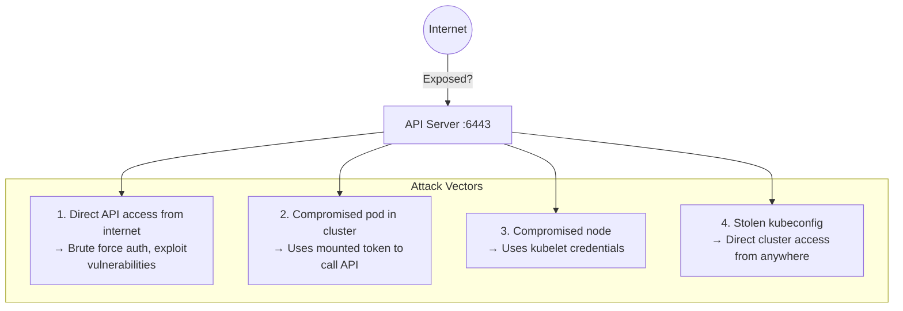
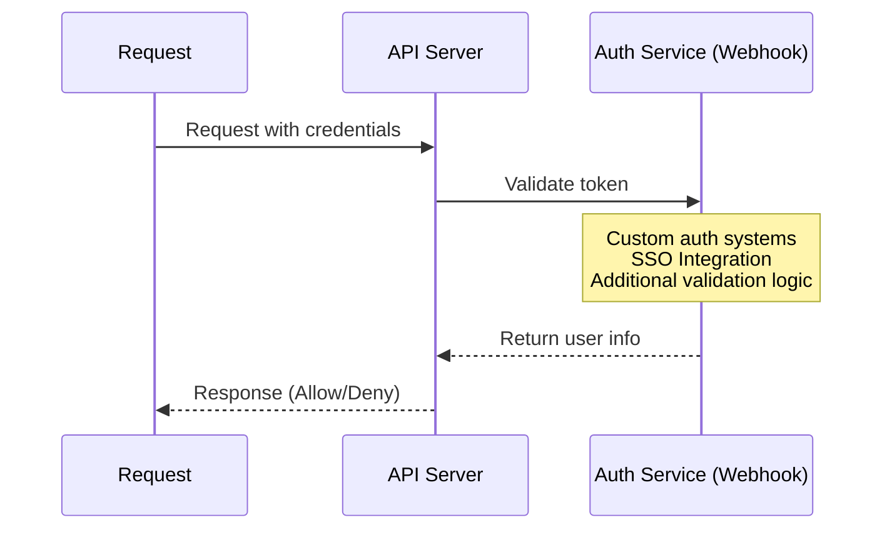
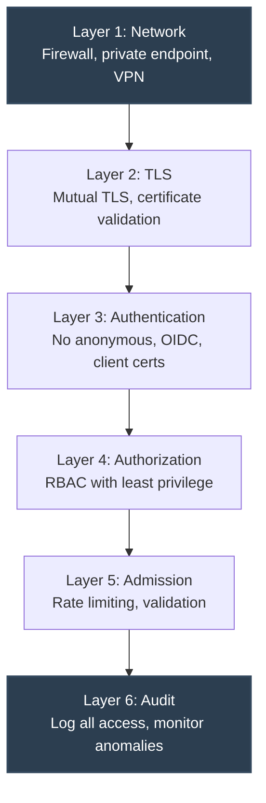

> **Complexity**: `[MEDIUM]` - Essential for cluster security
>
> **Time to Complete**: 35-40 minutes
>
> **Prerequisites**: Module 2.3 (API Server Security), networking basics

---

## What You'll Be Able to Do

After completing this module, you will be able to make and defend specific API access decisions for a Kubernetes 1.35 production cluster where the control plane must remain reachable to operators, controllers, and automation without becoming a public administrative endpoint.

1. **Design** network API access controls using private endpoints, firewall rules, bind addresses, VPN paths, and pod egress policies.
2. **Implement** authentication controls that disable anonymous access, validate client certificates, configure OIDC, and delegate webhook authentication.
3. **Diagnose** API exposure, anonymous authentication responses, stolen kubeconfig risk, and service account token paths with targeted commands.
4. **Evaluate** API Priority and Fairness, EventRateLimit, audit policy, and metrics to reduce denial-of-service risk.
5. **Compare** cloud private endpoint patterns with self-managed firewall and VPN architectures for Kubernetes API isolation.

---

## Why This Module Matters

Hypothetical scenario: your team has a production cluster that uses strong client certificates, careful RBAC, and a current Kubernetes release, but the API server still answers on a public address. Nobody has cluster credentials except the platform team, so the exposure looks harmless during a rushed release. A scanner then finds port 6443, starts thousands of failed TLS handshakes and unauthenticated probes, and your operators spend the morning deciding whether this is noise, a denial-of-service attempt, or the first stage of credential replay.

The Kubernetes API server is the control plane's front door. It is the path used by `kubectl`, controllers, kubelets, admission webhooks, operators, CI systems, and cloud integrations. RBAC decides what an authenticated identity may do, but it does not decide who can open a socket to the API server in the first place. That distinction matters because an unreachable API endpoint cannot be brute-forced, fingerprinted, or overloaded by anonymous internet traffic.

The lesson is not that network controls replace identity controls. The correct model is layered: restrict the route, verify the client, authorize the request, limit the request rate, and record enough evidence to investigate suspicious access. The [2018 Tesla cloud incident](/k8s/cks/part1-cluster-setup/module-1.5-gui-security/) <!-- incident-xref: tesla-2018-cryptojacking --> is a useful reminder that exposed administrative surfaces and leaked credentials can combine into real compromise. This module shows how to reduce that combination by treating API reachability as a deliberate design choice rather than a default.

By the end of this module, you will have a practical review workflow for Kubernetes 1.35 and later. You will inspect bind addresses, firewall assumptions, cloud private endpoints, anonymous authentication, x509 and token-based authentication, webhook caching, API Priority and Fairness, EventRateLimit, and audit metrics. The goal is not to memorize every flag. The goal is to build a habit of asking which boundary should stop a request before the next boundary has to carry the full security load.

---

## Section 1: Map the API Access Attack Surface

The API server normally listens for HTTPS on port 6443, and that simple fact can hide a broad access surface. A request may come from an operator laptop, a bastion host, a CI runner, a kubelet, an in-cluster controller, a compromised pod, or an attacker replaying a stolen kubeconfig. These request paths do not all have the same risk, so the first task is to separate legitimate control-plane traffic from routes that exist only because no one explicitly removed them.

The diagram below preserves the important mental model: network exposure, internal workload compromise, node compromise, and stolen credentials are separate entry paths that converge on the same API server. A mature hardening plan does not pick one path and ignore the others. It asks which layer can block each path earliest, then checks that the later layers still behave correctly if the earlier layer fails.



When an attacker can reach the API server, authentication is no longer the first control. The first control becomes whatever the API server does before authentication completes, including TCP handling, TLS negotiation, request parsing, discovery routes, and authentication plugin dispatch. This is why a public endpoint can still create work for your cluster even when every credential check eventually fails. A failed login is not free; it consumes CPU, memory, connection tracking, log volume, and operator attention.

Pause and predict: if an API server requires client certificates and rejects every unauthenticated request, what can an attacker still learn from a reachable endpoint? Think about version endpoints, TLS behavior, response timing, and whether your audit pipeline records enough context to distinguish scanning from a misconfigured internal client.

Discovery is usually the first practical test. A scanner may probe `/version`, `/healthz`, `/readyz`, or the root API path to determine whether the service is Kubernetes, whether it presents a recognizable certificate, and whether any anonymous endpoint leaks metadata. Even when the response is `401 Unauthorized`, the difference between no route, a TCP reset, a TLS alert, and a Kubernetes status object tells the attacker something about the target. That information is less valuable when the endpoint is reachable only through a private route and an authenticated administrative network.

Internal traffic deserves the same mapping exercise. Every pod receives Kubernetes service discovery by default, and many pods also receive service account tokens unless the workload or namespace disables automatic mounting. A compromised application may not need a public endpoint at all; it can try `kubernetes.default.svc`, use a mounted token, and discover its own permissions from inside the cluster. Network-level API restrictions therefore include pod egress design, not only internet firewall rules.

Build the access inventory as a small table in your notes, even if you do not publish it. For each client, record the source network, the credential type, the Kubernetes username or group, the expected verbs, and the operational owner. That inventory quickly exposes uncomfortable assumptions, such as a CI runner using a human kubeconfig, a break-glass certificate that never expires, or a namespace where every pod can reach the API even though only one controller needs it.

The inventory also helps you separate emergency access from daily access. Emergency access may use a tightly guarded bastion path and a privileged identity, but daily automation should use narrower routes and narrower permissions. If both paths share the same public endpoint and the same cluster-admin certificate, then a routine laptop compromise and a true break-glass procedure have the same blast radius. That is a design smell, not just a documentation gap.

The exam-style habit is to inspect from both sides. From outside the administrative network, the API should usually be unroutable or blocked by a cloud/private endpoint design. From inside the cluster, pods should have only the API reachability they need, and their service accounts should have narrow permissions if they can reach it. This dual view prevents the common mistake of securing the public endpoint while leaving every workload with unrestricted internal access.

---

## Section 2: Put Network Boundaries Before Credentials

The strongest authentication system still has to answer a connection before it can reject bad credentials. A network boundary changes the problem by preventing most clients from reaching the authentication path at all. In practical terms, that means only trusted networks, VPN ranges, bastion hosts, cloud control-plane routes, or carefully selected automation subnets should be able to initiate TCP connections to the API server.

On self-managed clusters, the first boundary is often a firewall rule on the API server node or an upstream network appliance. The command block below keeps the original hardening example: allow internal and VPN CIDRs, then drop everything else for port 6443. In production, you would normally express the same policy in infrastructure as code and verify it from outside the trusted network after every change.

```bash
# Only allow API access from specific IPs
# On cloud: Security Groups, Firewall Rules, NSGs

# AWS Security Group example:
# Inbound rule: TCP 6443 from 10.0.0.0/8 (internal only)

# iptables on API server node
sudo iptables -A INPUT -p tcp --dport 6443 -s 10.0.0.0/8 -j ACCEPT
sudo iptables -A INPUT -p tcp --dport 6443 -s 192.168.1.0/24 -j ACCEPT  # Admin VPN
sudo iptables -A INPUT -p tcp --dport 6443 -j DROP
```

The order of those rules matters because packet filters are evaluated in sequence. If the drop rule appears before the allow rules, legitimate administrators lose access. If a later broad allow rule reopens the port, the earlier work becomes decorative. A good review asks not only whether a firewall exists, but whether the effective rule set matches the intended administrative paths.

Cloud-managed Kubernetes shifts the boundary from host rules to provider routing. In EKS, GKE, and AKS, private endpoint modes remove or restrict the public control-plane endpoint and make API access depend on VPC, peering, private DNS, VPN, or bastion routing. The operational tradeoff is real: incident response and automation need a reliable private path, and developers may need a controlled way to reach the cluster without copying privileged kubeconfigs onto unmanaged laptops.

```bash
# EKS: Enable private endpoint, disable public
aws eks update-cluster-config \
  --name my-cluster \
  --resources-vpc-config endpointPrivateAccess=true,endpointPublicAccess=false

# GKE: Private cluster
gcloud container clusters create private-cluster \
  --enable-private-endpoint \
  --master-ipv4-cidr 172.16.0.0/28

# AKS: Private cluster
az aks create \
  --name myAKSCluster \
  --enable-private-cluster
```

Private endpoints are not magic; they move the trust question to your private network. If every developer laptop can join the VPN and every CI runner can route to the control plane, then the API is still broadly reachable. The improvement is that you now have a smaller place to enforce device posture, MFA, conditional access, DNS controls, and connection logging. That is a much better operating surface than the entire public internet.

Private endpoint projects often fail on DNS and routing rather than Kubernetes itself. Operators may have a kubeconfig that points to the old public hostname, while private DNS resolves only inside the VPC or through a particular resolver path. Automation may run from a hosted CI service that cannot route to the private endpoint at all. Plan the cutover by listing every client that calls the API, then deciding whether it moves into the private network, uses a runner inside the VPC, or stops needing direct cluster access.

Break-glass access should be designed before the public endpoint is removed. That does not mean keeping the public endpoint open for convenience; it means defining a controlled route such as a hardened bastion, privileged access workstation, or emergency VPN group with audited activation. The recovery path should require stronger controls than daily access, and it should be tested during maintenance rather than improvised during a control-plane incident.

Before running this, what output do you expect from an external `curl` or `nmap` test after a private endpoint change? The best answer is often not `401`. The best answer is usually no public route, no reachable public listener, or a firewall decision that prevents the Kubernetes API server from forming an application-level response.

In-cluster egress policy is the second network boundary. A namespace that runs ordinary web applications rarely needs every pod to call the API server directly. If those pods do need discovery or leader election, you can isolate that permission to the specific service account and workload. If they do not, a default-deny egress posture and explicit exceptions reduce the value of a remote-code-execution bug inside the application.

```yaml
# Note: NetworkPolicy doesn't directly apply to API server
# But you can restrict which pods can reach it

# Block pods from directly accessing API server IP
apiVersion: networking.k8s.io/v1
kind: NetworkPolicy
metadata:
  name: deny-api-direct
  namespace: production
spec:
  podSelector: {}
  policyTypes:
  - Egress
  egress:
  # Allow DNS
  - to:
    - namespaceSelector: {}
    ports:
    - port: 53
      protocol: UDP
  # Allow everything except API server
  - to:
    - ipBlock:
        cidr: 0.0.0.0/0
        except:
        - 10.96.0.1/32  # Kubernetes service IP
```

That policy is useful as a teaching example, but it also exposes a subtle implementation issue. `kubernetes.default.svc` resolves through cluster DNS to the service IP, yet some clusters have additional paths to the API server through node IPs, host networking, egress gateways, or provider-specific control-plane routing. A policy that blocks only one ClusterIP may leave other routes open, so a real review must test the path actually used by the workload.

Pause and predict: you block pods in the `production` namespace from reaching `10.96.0.1`, but a debug container can still use `kubectl` successfully. The likely explanation is not that NetworkPolicy is broken. More often, the cluster has another API route, the CNI does not enforce egress policy as expected, the pod is using host networking, or the namespace contains an exception that matches the debug pod.

The bind address is a local guardrail for self-managed control planes. When the API server binds to `0.0.0.0`, it accepts connections on every interface that the host exposes. Binding to an internal address narrows where the process listens, which means a later firewall mistake may still fail to expose the service on the external interface. This is not a substitute for firewalling, but it is a useful second check on the node itself.

```yaml
# /etc/kubernetes/manifests/kube-apiserver.yaml
spec:
  containers:
  - command:
    - kube-apiserver
    # Bind only to specific interface
    - --bind-address=10.0.0.10  # Internal IP only
    # Or bind to all (less secure)
    - --bind-address=0.0.0.0
```

The CKS-relevant detail is that kubeadm places the API server manifest under `/etc/kubernetes/manifests/kube-apiserver.yaml`, and the static pod restarts when the manifest changes. That restart can interrupt access, so you should have console access or a known recovery path before changing bind addresses on a live control plane. A careful operator checks the node interface addresses first, edits the manifest once, then watches the static pod return to readiness.

For self-managed high-availability control planes, repeat that bind-address reasoning for every API server node. A cluster can look restricted when you test one endpoint and still expose another control-plane node through a load balancer backend, old DNS record, or forgotten security group. The safe review traces the client path through DNS, load balancer listener, target group, node interface, host firewall, and finally the API server process. Skipping any hop leaves room for a stale route to survive.

Network boundaries also need ownership. Platform teams often configure the private endpoint, network teams own VPN routing, security teams own identity posture, and application teams own namespace egress. A review that stops at "the API is private" misses the operational question of who can change the route tomorrow. Treat the API path as a shared contract and verify it with both configuration review and actual connection tests.

---

## Section 3: Verify Identity Before Authorization

Once a request crosses the network boundary and completes TLS, Kubernetes evaluates authentication. Authentication answers "who is making this request?" before authorization answers "what may this identity do?" That order is simple, but the implementation is not: a cluster may accept client certificates, bearer tokens, service account tokens, OIDC tokens, authentication webhooks, or front-proxy headers depending on how the API server is configured.

Anonymous authentication is the first setting to verify because it creates an identity for requests that present no credentials. Kubernetes maps those requests to the `system:anonymous` user and the `system:unauthenticated` group. That identity should normally have no useful permissions, but misconfigured bindings can accidentally grant discovery, read, or even broader access. Disabling anonymous authentication makes the failure mode explicit.

```bash
# API server flag inside /etc/kubernetes/manifests/kube-apiserver.yaml
# - --anonymous-auth=false

# Verification
curl -k "https://api-server.local:6443/api/v1/namespaces"
# Should return 401 Unauthorized
```

The expected result depends on where you run the test. From an untrusted network, the ideal result may be no route or a firewall block before HTTP appears. From a trusted diagnostic host, a request without credentials should return `401 Unauthorized`, not a namespace list and not a partial discovery response that implies anonymous access was granted. Those two tests answer different questions, so do not collapse them into one checkbox.

Client certificate authentication is common for control-plane components and administrative users in kubeadm-style clusters. The API server trusts certificates signed by the configured client CA, then derives the username and groups from certificate subject fields. This is strong cryptographic authentication, but it has a lifecycle problem: revoking a single long-lived client certificate is awkward unless you have added a separate authorizer or rotated the issuing CA.

```bash
# Require client certificates (mutual TLS) flag:
# - --client-ca-file=/etc/kubernetes/pki/ca.crt

# Clients must present valid certificate signed by CA
# This is default in kubeadm clusters
```

For human access, OIDC usually gives better operational control because identities live in a central provider. The API server validates the issuer and client ID, then maps token claims such as email and groups into Kubernetes users and groups. The security value comes from the identity provider's surrounding controls: MFA, account disablement, device policies, short token lifetimes, and group management. Kubernetes still needs RBAC, but the identity lifecycle becomes much easier to operate.

OIDC group mapping deserves careful naming. If the identity provider emits broad groups such as `engineering` or `contractors`, and those groups are bound directly to powerful ClusterRoles, then the API server faithfully enforces a bad organizational model. Prefer groups that describe Kubernetes access intent, such as platform-admins, read-only-observers, or namespace-maintainers, and keep the mapping reviewed with RBAC. The API server can validate tokens, but it cannot decide whether your identity taxonomy is sensible.

```bash
# Configure token authentication flags:
# - --service-account-key-file=/etc/kubernetes/pki/sa.pub
# - --service-account-issuer=https://kubernetes.default.svc.cluster.local

# Optional: External OIDC provider flags:
# - --oidc-issuer-url=https://accounts.example.com
# - --oidc-client-id=kubernetes
# - --oidc-username-claim=email
# - --oidc-groups-claim=groups
```

Service account tokens are different from human tokens because workloads use them from inside pods. Modern Kubernetes uses bound service account tokens with audience, expiration, and projected volume behavior, but older long-lived token Secrets may still exist in upgraded clusters. API access restrictions should therefore include an inventory of which pods mount tokens, which service accounts have permissions, and which workloads can reach the API endpoint from their namespace.

A useful service account review has three questions. First, does this workload need a token mounted at all, or can `automountServiceAccountToken: false` be set at the pod or service account level? Second, if it needs a token, does RBAC allow only the verbs and resources required for the controller loop or application feature? Third, can the workload reach the API only through expected network paths? A "no" answer at any layer should lead to a smaller permission set or a narrower route.

Webhook authentication extends the chain when standard token validation is not enough. The API server sends a `TokenReview` to an external service, and that service returns the authenticated username and groups. This is powerful because it lets you integrate custom identity systems, but it also introduces latency and availability dependencies into the authentication path. A slow webhook can make the entire API feel slow.



The webhook configuration is a kubeconfig-style file because the API server itself acts like a client of the authentication service. That means you must secure the CA, client certificate, client key, endpoint DNS, and network route just as carefully as any other privileged integration. A webhook running behind an unreliable service or a broad public endpoint can become the weakest link in an otherwise private control plane.

```yaml
# API server flags in manifest
# - --authentication-token-webhook-config-file=/etc/kubernetes/webhook-config.yaml
# - --authentication-token-webhook-cache-ttl=2m

---
# /etc/kubernetes/webhook-config.yaml
apiVersion: v1
kind: Config
clusters:
- name: auth-service
  cluster:
    certificate-authority: /etc/kubernetes/pki/webhook-ca.crt
    server: https://auth.example.com/authenticate
users:
- name: api-server
  user:
    client-certificate: /etc/kubernetes/pki/webhook-client.crt
    client-key: /etc/kubernetes/pki/webhook-client.key
contexts:
- context:
    cluster: auth-service
    user: api-server
  name: webhook
current-context: webhook
```

The cache TTL in that example is not a random performance tweak. If the cache is too short, the API server may call the webhook for every request and overload the authentication service during normal controller activity. If the cache is too long, disabling a user or token may take longer to affect Kubernetes access. Choose the value by balancing revocation speed against webhook capacity, then monitor webhook latency and API authentication metrics.

Webhook failure behavior also needs a deliberate decision. Authentication webhooks sit before authorization, so availability problems can look like broad API access failures. If the webhook depends on the same cluster that needs the API to recover, you may create a circular dependency during outages. Run the webhook on a dependable path, monitor it independently, and keep a documented recovery plan for authentication failures that are caused by the identity integration rather than Kubernetes itself.

Which approach would you choose here and why: long-lived client certificates for every engineer, OIDC for human users with short-lived tokens, or a webhook backed by an internal identity service? A senior answer names the operational failure mode, not just the preferred feature. Certificates are simple but hard to revoke individually, OIDC is easier to govern but depends on provider availability, and webhooks are flexible but add another service to the critical request path.

Identity controls remain incomplete without authorization. This module focuses on API access restriction, but a reachable API with `--authorization-mode=AlwaysAllow` is still unsafe even when authentication is strong. The normal production baseline is RBAC with the Node authorizer where appropriate, least-privilege bindings, and audit coverage for privilege escalation attempts. Authentication proves identity; RBAC limits the damage that identity can cause.

---

## Section 4: Control Load with Admission and Flow Fairness

Network and identity controls reduce who can reach the API, but they do not guarantee the API can handle every legitimate client. Controllers, operators, CI systems, and humans can create accidental denial-of-service conditions by repeatedly listing large resources, creating noisy events, or retrying failed calls too aggressively. Restricting API access therefore includes shaping request load, not only rejecting attackers.

The EventRateLimit admission controller targets a narrow but common source of datastore noise: Kubernetes Events. Events are useful for debugging, but a failing workload or broken controller can generate a huge stream of repeated state changes. Because Events are stored through the API path, event storms can consume API server and etcd resources that should be reserved for scheduling, node heartbeats, and controller reconciliation.

```yaml
# Enable admission controller flags:
# - --enable-admission-plugins=EventRateLimit
# - --admission-control-config-file=/etc/kubernetes/admission-config.yaml

---
# /etc/kubernetes/admission-config.yaml
apiVersion: apiserver.config.k8s.io/v1
kind: AdmissionConfiguration
plugins:
- name: EventRateLimit
  path: /etc/kubernetes/event-rate-limit.yaml

---
# /etc/kubernetes/event-rate-limit.yaml
apiVersion: eventratelimit.admission.k8s.io/v1alpha1
kind: Configuration
limits:
- type: Namespace
  qps: 50
  burst: 100
- type: User
  qps: 10
  burst: 20
```

EventRateLimit is not a general API throttle. It applies to Event objects and should be tuned so that it reduces noisy failures without hiding useful operational signals. If the values are too strict, real incidents may lose evidence. If they are too loose, event storms still harm the control plane. The better review question is "which producers can flood Events, and what rate preserves debugging value without overwhelming storage?"

API Priority and Fairness, usually shortened to APF, solves a broader overload problem. It classifies incoming requests into FlowSchemas and assigns them to PriorityLevelConfigurations that control concurrency and queuing. The important idea is fairness under pressure: high-value system traffic should not be starved because a low-priority batch job or external automation loop is issuing thousands of list requests.

APF is especially important for list and watch-heavy clients. A controller that repeatedly lists pods across all namespaces can consume far more API and etcd work than a small number of create requests. Watches are efficient when they are stable, but repeated watch reconnects can become expensive during network problems or client bugs. When you review automation identities, look at verbs and resource scope together, not only the raw request count.

```yaml
# Kubernetes 1.20+: API Priority and Fairness
# Controls API request queuing and priority

# Check current flow schemas
# kubectl get flowschemas

# Check priority levels
# kubectl get prioritylevelconfigurations

---
# Example: Lower priority for batch workloads
apiVersion: flowcontrol.apiserver.k8s.io/v1
kind: FlowSchema
metadata:
  name: batch-jobs-low-priority
spec:
  priorityLevelConfiguration:
    name: low-priority
  matchingPrecedence: 1000
  rules:
  - subjects:
    - kind: ServiceAccount
      serviceAccount:
        name: batch-runner
        namespace: batch
    resourceRules:
    - apiGroups: ["batch"]
      resources: ["jobs"]
      verbs: ["*"]
```

The example lowers priority for a known batch service account, but the decision rule is broader. Identify request sources that are useful but not urgent, then keep them from consuming the same concurrency budget as kubelets, controllers, and emergency operator actions. APF does not excuse poorly designed clients; it gives the API server a way to remain usable while you fix those clients.

APF also changes how you diagnose API slowness. Without fairness, one noisy actor can make every client look slow, and logs may show only broad request latency. With APF, you can inspect flow schemas, priority levels, rejected requests, queued requests, and seat usage to determine which class is under pressure. That evidence helps you distinguish a malicious flood, a broken controller, and a legitimate workload spike.

The subtle risk is misclassification. If an important controller lands in a low-priority bucket, the cluster can degrade while the API appears to be "working as configured." If an untrusted automation identity lands in a high-priority bucket, it can starve other work. Treat FlowSchemas as production policy, review them with the same care as RBAC, and test failure cases before relying on them during an incident.

Client-side throttling still matters even when APF is configured well. Many Kubernetes clients support QPS and burst settings, and operators should use informers or watches instead of tight polling loops. APF protects the shared API server, but it should not be the first line of defense against a client you control. If an internal tool needs special priority to function, ask whether the tool can reduce its request pattern before granting it a larger share of the control-plane budget.

---

## Section 5: Audit and Monitor API Access Decisions

Visibility is the layer that tells you whether the previous layers are doing what you intended. A private endpoint that no one tests can drift back to public exposure. Anonymous authentication that appears disabled can be reintroduced during a control-plane rebuild. A webhook cache that looks harmless can hide a revocation delay. Audit logs and metrics turn those assumptions into evidence.

Kubernetes audit policy controls which requests are recorded and at what level. Logging every request body at `RequestResponse` sounds thorough, but it can create high storage costs and may capture sensitive data. Logging only metadata is cheaper, but it may not preserve enough detail for some investigations. The policy below keeps the original example by capturing authentication activity and failed requests while omitting the noisy `RequestReceived` stage.

```yaml
# Audit policy to log all API access attempts
apiVersion: audit.k8s.io/v1
kind: Policy
rules:
# Log all authentication attempts
- level: RequestResponse
  omitStages:
  - RequestReceived
  resources:
  - group: "authentication.k8s.io"

# Log failed requests
- level: Metadata
  omitStages:
  - RequestReceived
```

The `omitStages` choice is an operational cost control. The `RequestReceived` stage records that a request arrived before it is processed, while later stages capture the outcome. Omitting the early stage can reduce duplicate log volume while preserving final status, user identity, verb, resource, and response information. That is usually more useful for investigating repeated `401` and `403` responses than simply storing twice as many entries.

API server metrics provide the real-time view that audit logs cannot. During an incident, you want to know whether request volume, authentication failures, APF queues, webhook latency, or rejected requests changed. The preserved command block below uses raw metrics queries because they work even when you do not have a full observability stack in an exam or break-fix environment.

```bash
# Check API server metrics
kubectl get --raw /metrics | grep apiserver_request

# Authentication failures
kubectl get --raw /metrics | grep authentication_attempts

# Rate limiting metrics
kubectl get --raw /metrics | grep apiserver_flowcontrol
```

Metrics names evolve, so the pattern matters more than a single string. Start broad with `apiserver_request`, then narrow toward authentication attempts, request duration, rejected requests, and flow-control indicators. In production, route those metrics to Prometheus or your managed monitoring platform and alert on changes that match the access paths you care about. A private endpoint should make internet-origin authentication failures rare, so repeated failures deserve investigation.

Baselines make these alerts useful. A busy controller namespace may generate many normal API requests, while an administrative user may make only a few during maintenance windows. Record what normal looks like for human access, CI access, controller access, and unauthenticated failures. Then alerts can focus on sharp changes, unexpected identities, unusual source networks, and request classes that begin queuing under APF.

Audit and metrics should also cover successful access. A stolen kubeconfig may not produce failed authentication, because the credential is valid. In that case, the signal is a valid identity used from an unusual network, at an unusual time, against unusual resources. Kubernetes alone may not know whether a source IP is suspicious, so combine audit logs with VPN, bastion, identity provider, and cloud network logs when you build detection.

---

## Section 6: Work Through Exam-Style API Restriction Scenarios

The CKS exam often compresses these ideas into a small number of files and commands. You may be asked to inspect a static pod manifest, verify that anonymous access fails, or create a kubeconfig that points to the intended internal endpoint. The trick is to keep the layered model in your head while moving quickly: route first, then identity, then authorization, then load control, then evidence.

In a self-managed cluster, the fastest way to inspect the running API server flags is to read the static pod manifest or query the mirrored pod. The command below looks for the bind address, then the intended fix changes an externally bound listener to an internal interface. On a real system, confirm the internal address exists on the control-plane node before saving the manifest.

```bash
# Check current API server bind address
kubectl get pods -n kube-system -l component=kube-apiserver -o yaml | grep bind-address

# Edit to bind to internal interface only
sudo vi /etc/kubernetes/manifests/kube-apiserver.yaml

# Change:
# --bind-address=0.0.0.0
# To:
# --bind-address=10.0.0.10  # Internal IP

# API server will restart automatically
```

Anonymous access verification is the next common scenario. The important detail is to interpret the response based on the network path. If you are testing from a trusted host that can route to the API, an unauthenticated request should receive an unauthorized status. If you are testing from an untrusted host, you ideally should not reach the Kubernetes API response path at all.

```bash
# Test anonymous access
curl -k "https://api-server.local:6443/api/v1/namespaces"

# If anonymous is disabled, should get:
# {"kind":"Status","apiVersion":"v1","status":"Failure","message":"Unauthorized",...}

# If anonymous is enabled, may get namespace list or partial data
# Fix by adding --anonymous-auth=false to API server
```

Kubeconfig construction is another place where access restrictions become concrete. A kubeconfig does not just name a user; it names a cluster endpoint and credentials. If the endpoint is public, a stolen file can be replayed from anywhere that can reach the public route. If the endpoint is internal and the credential is least-privileged or short-lived, the same theft has a smaller blast radius.

```bash
# Create kubeconfig for specific user with limited network access
kubectl config set-cluster restricted \
  --server=https://internal-api.example.com:6443 \
  --certificate-authority=/path/to/ca.crt

kubectl config set-credentials limited-user \
  --client-certificate=/path/to/user.crt \
  --client-key=/path/to/user.key

kubectl config set-context limited \
  --cluster=restricted \
  --user=limited-user
```

What would happen if a developer's laptop with a valid kubeconfig file were stolen? If the file contains cluster-admin credentials and the API server is public, the attacker can attempt immediate full cluster access. If the API server is reachable only through a managed device VPN, the credential still matters, but the attacker also has to satisfy the network and device controls. If RBAC is least-privilege and the credential is short-lived, the damage window shrinks again.

The defense-in-depth diagram below ties the exam scenarios together. It keeps the original layering because it is the simplest way to decide where a failure should be caught. Do not read it as a waterfall where only the first layer matters. Read it as a stack where every layer should still provide value if the previous layer is bypassed.



All layers must be active at the same time to create a resilient API access posture. A private endpoint reduces exposure, TLS verifies the channel, authentication names the caller, RBAC limits the caller, admission and APF protect capacity, and audit evidence lets you prove what happened. The senior move is to test those layers with realistic failure cases, not only to confirm that the happy path works.

---

## Patterns & Anti-Patterns

The patterns below are not generic best practices; each one maps to a concrete failure mode from the earlier sections. Use them when you review a cluster design or when you need to justify a hardening change to a team that is worried about developer convenience. The right pattern usually reduces the number of clients that can reach the API while making legitimate access easier to observe and revoke.

| Pattern | Use When | Why It Works | Scaling Consideration |
|---------|----------|--------------|-----------------------|
| Private endpoint plus managed administrative path | The cluster runs in EKS, GKE, AKS, or another provider with private control-plane routing | Removes public API reachability and forces access through VPC, VPN, peering, or bastion controls | Requires reliable DNS, break-glass access, and clear ownership of network routes |
| OIDC for human users, certificates for components | Engineers need auditable access and components need stable mTLS identities | Centralizes human lifecycle management while preserving Kubernetes-native component authentication | Group claim design must stay aligned with RBAC bindings and identity provider governance |
| Namespace egress restrictions for ordinary workloads | Application pods do not need direct API calls during normal operation | Reduces the value of pod compromise by blocking token replay from inside the cluster | Requires CNI enforcement, route testing, and exceptions for controllers that legitimately call the API |
| APF classification for automation identities | CI, operators, or batch jobs can produce high request volume | Preserves API availability for kubelets, controllers, and emergency operators during overload | FlowSchemas need review when service accounts, controllers, or automation namespaces change |

Anti-patterns usually come from treating one successful control as permission to ignore the rest. A public API with strong credentials still invites scanning. A private endpoint with broad VPN access still trusts every device on that route. A webhook without caching can make authentication slower than the workload it protects. The fix is to name the hidden assumption, then add the smallest control that removes it.

| Anti-Pattern | What Goes Wrong | Better Alternative |
|--------------|-----------------|--------------------|
| Public endpoint kept for convenience | Any internet client can probe, fingerprint, and pressure the authentication path | Use a private endpoint with a managed administrative access path |
| Long-lived cluster-admin kubeconfigs on laptops | Credential theft becomes immediate cluster compromise if the API is reachable | Use OIDC, short-lived credentials, least-privilege RBAC, and private routing |
| Blocking only one API ClusterIP in NetworkPolicy | Pods may reach the API through node IPs, host networking, or provider routes | Test all actual paths and combine egress policy with token mounting controls |
| Webhook authentication without latency monitoring | A healthy identity idea becomes an API availability dependency | Configure cache TTL, monitor webhook latency, and define fail behavior intentionally |

---

## Decision Framework

Use this framework when you are deciding how restrictive the API access path should be. Start with the exposure question, then move down to identity, workload paths, and load protection. Each decision should produce an artifact you can inspect later: a provider setting, a firewall rule, a manifest flag, a NetworkPolicy, a FlowSchema, an audit policy, or a monitoring alert.

If the API server can be reached from the public internet, first ask whether the provider or platform can remove that public route completely. When the answer is yes, enable a private endpoint and build VPN, bastion, or private automation access around it. When the answer is no, restrict firewall CIDRs, bind the API server to an internal interface where possible, and verify the public path from an external network. If the API server is already private, shift the review to which private networks, devices, and automation systems can route to it. Workloads that need API access should use explicit service accounts and namespaces; workloads that do not need it should lose egress to every observed API path.

The second decision is credential lifecycle. If the user is human, prefer OIDC or another centrally governed identity path so access can be revoked without rotating a cluster CA. If the client is a Kubernetes component, client certificates and service account tokens are normal, but they still need scoped permissions and rotation. If the client is custom automation, decide whether it should use a service account, an external identity provider, or a webhook-backed token based on revocation and audit needs.

| Question | Prefer This | Avoid This |
|----------|-------------|------------|
| Who can open a TCP connection to the API? | Private endpoint, VPN, bastion, explicit administrative CIDRs | Public listener protected only by hope that credentials stay secret |
| How are humans authenticated? | OIDC with MFA, short token lifetimes, and group-to-RBAC mapping | Shared client certificates or copied cluster-admin kubeconfigs |
| How do workloads reach the API? | Explicit service accounts, narrow RBAC, and tested egress exceptions | Automatic token mounts and namespace-wide API reachability |
| How is overload contained? | APF FlowSchemas, EventRateLimit where useful, and metrics alerts | One shared priority class for every client and no request-volume visibility |
| How is access investigated? | Audit policy plus identity, network, and VPN logs | Logs that capture only failures or omit source context |

Finally, decide what failure you are willing to accept. A firewall rule can drift, a private endpoint can break remote operations, an OIDC provider can be unavailable, and a webhook can add latency. The mature design makes those tradeoffs explicit and rehearses recovery. You should know how to regain access through a break-glass path without permanently reopening the API to the public internet.

---

## Did You Know?

- Kubernetes treats unauthenticated requests as `system:anonymous` and `system:unauthenticated` when anonymous authentication is enabled, so a single accidental binding can turn "no credentials" into real API permissions.
- API Priority and Fairness became stable before Kubernetes 1.35 and uses FlowSchemas plus PriorityLevelConfigurations to keep important request classes from being starved during overload.
- Managed private clusters in EKS, GKE, and AKS do not remove the need for identity controls; they reduce which networks can even attempt to use those identities.
- Bound service account tokens reduce the risk of long-lived workload credentials, but they do not help if every compromised pod can still route to the API and its service account has broad RBAC.

---

## Common Mistakes

These mistakes are common because each one looks like a small shortcut during delivery. In review, connect each mistake to the layer it weakens and the artifact that proves the fix. That keeps the discussion concrete instead of turning "restrict API access" into a vague security slogan.

| Mistake | Why It Happens | How to Fix It |
|---------|----------------|---------------|
| Public API endpoint | Teams rely on strong credentials and forget that reachability enables scanning and resource pressure | Implement private endpoints where possible, or restrict ingress to known administrative CIDRs |
| No firewall rules | Self-managed clusters inherit broad host or perimeter access during bootstrap | Add explicit allow rules for trusted ranges and a final drop rule for port 6443 |
| Anonymous auth enabled | Default assumptions or legacy manifests leave `system:anonymous` reachable | Set `--anonymous-auth=false` and verify unauthenticated requests return `401` from a trusted test path |
| No rate limiting | Operators assume authentication protects availability as well as identity | Use APF for request fairness and EventRateLimit for noisy Event producers |
| Not monitoring access | Teams configure controls once and never check whether they drift | Enable audit logging, collect API metrics, and alert on unusual authentication or flow-control changes |
| Long-lived client certs | Certificates are easy to create and hard to revoke individually | Prefer OIDC for humans, short-lived tokens where possible, and narrow RBAC for all identities |
| Ignoring 401/403 logs | Failed requests are dismissed as harmless noise | Correlate failures with source networks, identity provider logs, VPN logs, and recent configuration changes |
| Flat NetworkPolicies | Application namespaces keep default egress because it avoids early troubleshooting | Deny unnecessary API egress and create explicit exceptions for workloads that genuinely need API calls |

---

## Quiz

Each question below asks you to choose an operational response, then explain why the other responses are weaker. Do not answer by naming a single flag unless the scenario is truly a single-flag failure; most API access problems involve route, identity, and evidence at the same time.

<details><summary>1. Your SOC detects thousands of failed authentication attempts against a public API server bound to `0.0.0.0`. No login has succeeded. What is the best first response? A. Ignore it because authentication worked. B. Block the source temporarily, review audit logs, and plan private endpoint or CIDR restriction. C. Disable RBAC to reduce API load. D. Rotate every service account token before checking network exposure.</summary>

**Answer: B.** The immediate goal is to reduce pressure and confirm whether any request succeeded, so temporary blocking and audit review are appropriate. Option A is wrong because failed authentication still consumes resources and reveals exposure. Option C is dangerous because RBAC is an authorization layer, not a performance fix. Option D may be needed after credential evidence appears, but it skips the visible network exposure that allowed the attempts.

</details>

<details><summary>2. A developer laptop with a kubeconfig is stolen. The kubeconfig contains a long-lived client certificate and the API endpoint is public. Which control would have reduced the blast radius most directly before the theft? A. Public endpoint plus stronger password policy. B. Private endpoint plus least-privilege RBAC and revocable human identity. C. More verbose application logs. D. EventRateLimit for all namespaces.</summary>

**Answer: B.** A private endpoint limits where the credential can be replayed, least-privilege RBAC limits what it can do, and revocable human identity avoids the certificate revocation problem. Option A does not help a stolen certificate because no password may be involved. Option C improves application troubleshooting but not API access. Option D can reduce event storms, but it does not stop valid credential replay.

</details>

<details><summary>3. A workload has `automountServiceAccountToken: false`, yet a compromised container still makes successful API calls. What do you check next? A. Whether another token or kubeconfig was injected and whether network egress still reaches the API. B. Whether the pod image has a larger CPU limit. C. Whether the API server uses a private endpoint for human users only. D. Whether the namespace has more than one Deployment.</summary>

**Answer: A.** Disabling automatic token mounting only removes one token source. The attacker may have found a Secret, environment variable, mounted kubeconfig, copied token, or another API path. Option B does not explain authentication. Option C may be relevant to external access, but the container is already inside the cluster. Option D is incidental unless another workload is the source of the credential.

</details>

<details><summary>4. A CI service account rapidly lists pods and jobs until the API feels slow for operators. Which control should you evaluate first? A. API Priority and Fairness FlowSchemas for that service account. B. The cluster DNS search suffix. C. Anonymous authentication for unauthenticated users. D. The image pull policy on the CI runner.</summary>

**Answer: A.** APF is designed to classify request flows and preserve capacity for important clients when one source becomes noisy. Option B might affect service discovery but not API fairness. Option C should still be disabled, yet this scenario involves an authenticated CI service account. Option D may affect pod startup, but it does not classify or limit API requests.

</details>

<details><summary>5. You enable webhook authentication and then see high API latency even though the webhook pods are healthy. Which setting and tradeoff should you review? A. `--authentication-token-webhook-cache-ttl`, balancing revocation speed against webhook load. B. `--bind-address`, balancing pod CPU against memory. C. `--anonymous-auth`, balancing public DNS against private DNS. D. `--service-account-issuer`, balancing kubelet logs against Events.</summary>

**Answer: A.** A short or disabled webhook cache can force synchronous validation for many requests and overload the authentication path. Increasing the TTL can reduce load, but it may also delay revocation effects. Option B controls the local listener address, not webhook call frequency. Option C controls unauthenticated identities. Option D identifies service account token issuers, but it does not tune webhook caching.

</details>

<details><summary>6. A private endpoint is enabled, but every pod in every namespace can still reach `kubernetes.default.svc`. What is the best interpretation? A. The cluster is fully secure because the public route is gone. B. Internal API reachability still needs workload-level policy and RBAC review. C. Anonymous authentication must be enabled. D. APF is disabled.</summary>

**Answer: B.** Removing public reachability is valuable, but it does not decide which internal workloads may call the API. NetworkPolicy, service account token mounting, and RBAC still need review. Option A ignores compromised workload risk. Option C is not implied by internal reachability. Option D might be true or false, but it does not explain whether pods should be able to reach the API.

</details>

<details><summary>7. Your audit policy records `RequestReceived` and `ResponseComplete` for nearly every API request, and SIEM costs spike. What is the best adjustment? A. Disable audit logging entirely. B. Omit `RequestReceived` where final response data is enough, while preserving authentication and failure evidence. C. Log only successful requests. D. Move the API server back to a public endpoint so fewer private clients connect.</summary>

**Answer: B.** Omitting the early stage can reduce duplicate volume while keeping final status, identity, verb, and resource information for investigations. Option A removes evidence you need after credential theft or probing. Option C hides failed authentication and authorization attempts, which are often the important signal. Option D makes the exposure problem worse and has nothing to do with audit cost control.

</details>

---

## Hands-On Exercise

In this exercise, you will audit the API access posture of a running cluster or lab environment. Treat the commands as a guided investigation rather than a script that blindly passes or fails the cluster. Your job is to identify which layer answers each question: route, listener, anonymous authentication, identity provider, admission or fairness, and observable evidence.

```bash
# Step 1: Check API server configuration for critical security flags
echo "=== API Server Config ==="
kubectl get pods -n kube-system -l component=kube-apiserver -o yaml | grep -E "bind-address|anonymous-auth|authorization-mode"

# Step 2: Test anonymous access (from within cluster) to verify internal isolation
echo "=== Anonymous Access Test ==="
kubectl run curlpod --image=curlimages/curl --rm -it --restart=Never -- \
  curl -sk "https://kubernetes.default.svc.cluster.local/api/v1/namespaces" 2>&1 | head -5

# Step 3: Check if API is accessible externally (Network Boundary Check)
echo "=== External Access Check ==="
API_IP=$(kubectl get svc kubernetes -o jsonpath='{.spec.clusterIP}')
echo "API Server internal IP: $API_IP"
# In production, also resolve the external DNS/IP and attempt an external nmap or curl

# Step 4: Review authentication methods for multiple identity providers
echo "=== Authentication Config ==="
kubectl get pods -n kube-system -l component=kube-apiserver -o yaml | grep -E "client-ca|oidc|token|webhook"

# Step 5: Check for legacy and custom rate limiting admission controllers
echo "=== Rate Limiting ==="
kubectl get pods -n kube-system -l component=kube-apiserver -o yaml | grep -E "EventRateLimit|admission-control"

# Step 6: Review flow schemas (API Priority and Fairness)
echo "=== Flow Schemas ==="
kubectl get flowschemas --no-headers | head -5

# Success criteria:
# - Identified bind-address and verified it is properly scoped
# - Anonymous access is actively denied (HTTP 401)
# - Multiple robust auth methods (OIDC/x509) configured
# - Rate limiting or APF FlowSchemas are actively routing traffic
```

Complete the tasks in order, and write down both the observed output and the control you think it proves. If a command returns no matching flag, do not assume the setting is safe; check the API server documentation for defaults and inspect the full static pod manifest when you have node access.

- [ ] Record the API server bind address, public endpoint status, and the network path that administrators are expected to use.
- [ ] Test unauthenticated API access from a trusted diagnostic path and confirm whether the response is `401 Unauthorized`.
- [ ] Identify which authentication methods are configured, including client CA, service account issuer, OIDC, or webhook settings.
- [ ] Inspect APF FlowSchemas and PriorityLevelConfigurations, then identify at least one low-priority or catch-all request class.
- [ ] Review whether ordinary application namespaces can reach `kubernetes.default.svc` and whether their service accounts need that access.
- [ ] Capture the audit or metrics signal you would alert on for repeated authentication failures or flow-control pressure.

<details><summary>Solution guidance for route and listener checks</summary>

Start with the provider or firewall view, then confirm the API server listener. In a managed cluster, look for private endpoint settings and allowed public CIDRs in the provider console or CLI. In a self-managed cluster, inspect `/etc/kubernetes/manifests/kube-apiserver.yaml` and confirm whether `--bind-address` is set to an internal address or left at `0.0.0.0`. A secure result is not merely "authentication required"; a stronger result is that untrusted networks cannot reach the Kubernetes response path.

</details>

<details><summary>Solution guidance for anonymous and identity checks</summary>

Run the unauthenticated `curl` only from a place that is supposed to reach the API. If you receive `401 Unauthorized`, anonymous access is being rejected for that route. If you receive resource data, inspect `--anonymous-auth` and any bindings for `system:anonymous` or `system:unauthenticated`. For identity, look for `--client-ca-file`, service account issuer flags, OIDC flags, and webhook authentication configuration. Then connect each identity method to its revocation story.

</details>

<details><summary>Solution guidance for workload egress and fairness checks</summary>

For workload egress, choose an ordinary application namespace and determine whether pods can reach `kubernetes.default.svc`. If they can, decide whether that is necessary for the application. For fairness, list FlowSchemas and PriorityLevelConfigurations, then identify where noisy automation would land. A good result is not that APF objects exist; it is that important system clients and low-priority automation do not share the same uncontrolled request budget.

</details>

The final deliverable for the exercise is a short access review note. It should name the current exposure path, the authentication methods, the weakest remaining route, the highest-risk credential type, and one metric or audit query that would show suspicious activity. That note is more useful than a screenshot because it connects the observed configuration to an operational decision.

---

## Sources

- https://kubernetes.io/docs/concepts/security/controlling-access/
- https://kubernetes.io/docs/reference/access-authn-authz/authentication/
- https://kubernetes.io/docs/reference/access-authn-authz/authorization/
- https://kubernetes.io/docs/reference/access-authn-authz/rbac/
- https://kubernetes.io/docs/reference/access-authn-authz/admission-controllers/#eventratelimit
- https://kubernetes.io/docs/concepts/cluster-administration/flow-control/
- https://kubernetes.io/docs/tasks/debug/debug-cluster/audit/
- https://kubernetes.io/docs/reference/command-line-tools-reference/kube-apiserver/
- https://kubernetes.io/docs/concepts/services-networking/network-policies/
- https://docs.aws.amazon.com/eks/latest/userguide/config-cluster-endpoint.html
- https://cloud.google.com/kubernetes-engine/docs/how-to/private-clusters
- https://learn.microsoft.com/en-us/azure/aks/private-clusters

## Next Module

[Part 3: System Hardening](/k8s/cks/part3-system-hardening/module-3.1-apparmor/) moves from Kubernetes API access into host-level enforcement with AppArmor, seccomp profiles, and Linux kernel security controls.
