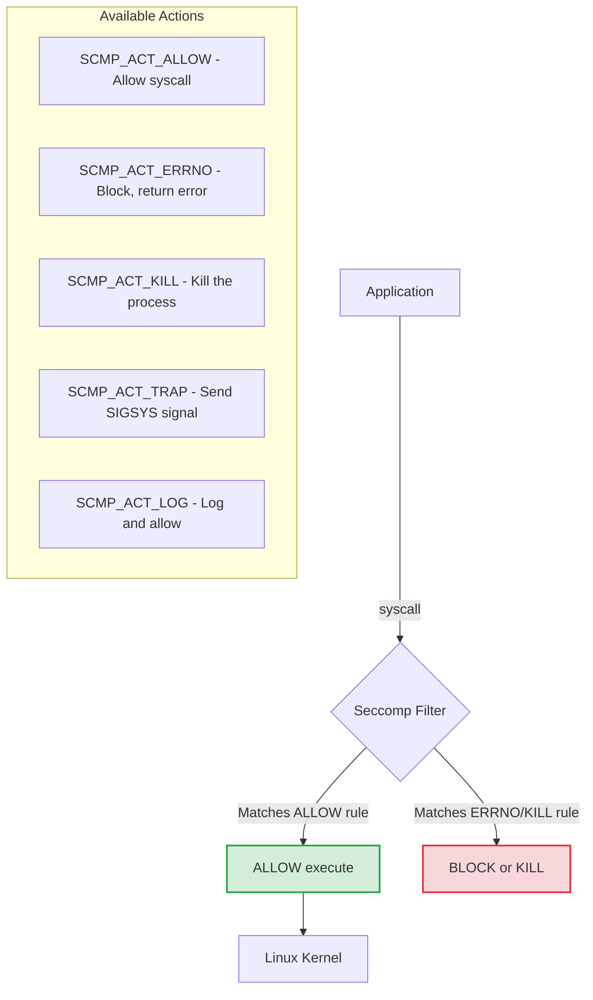
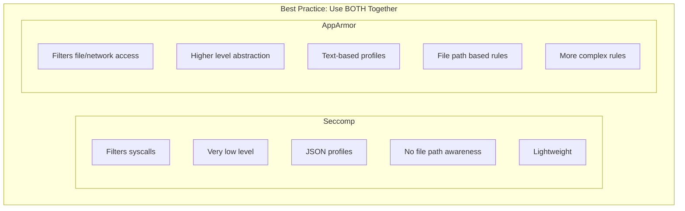
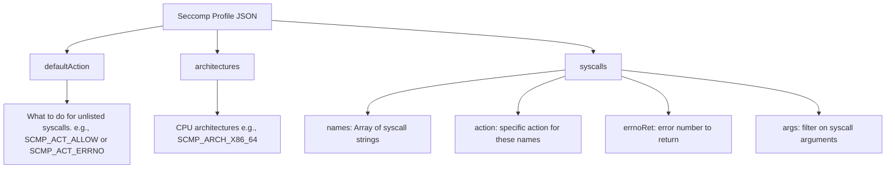

> **Complexity**: Complex
>
> **Time to Complete**: 75 minutes
>
> **Prerequisites**: Linux system calls, Kubernetes Pod security contexts, container runtime basics, and CKS system hardening fundamentals

---

## What You'll Be Able to Do

After completing this module, you will be able to:

1. **Design** custom seccomp profiles that allow only the system calls a specific containerized workload needs.
2. **Implement** Kubernetes Pods and containers with `RuntimeDefault` and `Localhost` seccomp profiles through `securityContext`.
3. **Diagnose** seccomp-related startup and runtime failures using Pod status, kubelet behavior, audit logs, and syscall tracing.
4. **Compare** seccomp with AppArmor and choose the correct layer for syscall filtering versus resource access control.
5. **Evaluate** the operational tradeoffs between `RuntimeDefault`, custom profiles, and cluster-wide profile distribution in Kubernetes 1.35+ environments.

## Why This Module Matters

Hypothetical scenario: a public-facing application receives a remote code execution exploit through a vulnerable request parser, and the attacker lands inside a non-root container with only the permissions that the image and Pod spec provide. That first foothold is serious, but the outcome depends on what the process can ask the shared Linux kernel to do next. If the container can invoke powerful system calls such as `unshare`, `mount`, `keyctl`, `ptrace`, or `bpf`, the attacker has more room to manipulate namespaces, inspect processes, load kernel-facing objects, or pivot into node-level impact. If those calls are blocked before the kernel honors them, the same application bug has a much narrower blast radius.

Seccomp, short for Secure Computing Mode, is the Linux mechanism Kubernetes uses to filter system calls made by container processes. It does not know whether a request came from a "good" application path or a "bad" exploit path; it only sees a process asking the kernel to perform a syscall, then applies a profile that says allow, deny, log, trap, or kill. That makes seccomp a blunt but valuable control. It is like a locked service window at a government office: the clerk may accept normal forms all day, but there are entire categories of requests the window never accepts, no matter how politely they are presented.

For CKS work, seccomp matters because Kubernetes workloads share the node kernel even when they have separate containers, namespaces, and filesystems. A virtual machine has its own guest kernel boundary, while a Linux container relies on the host kernel plus isolation features such as namespaces, cgroups, capabilities, Linux Security Modules, and seccomp. In Kubernetes 1.35+ clusters, you should treat `RuntimeDefault` as the normal baseline for production workloads and reserve `Unconfined` for rare, documented exceptions. Custom profiles then become a targeted hardening tool for especially sensitive, stable workloads where the team is willing to own the operational cost of profiling and regression testing syscall behavior.

This module builds from that operational reality. You will first learn what seccomp can and cannot see, then apply the Kubernetes profile types, then work through profile placement, troubleshooting, and scale-out decisions. The goal is not to memorize every syscall name. The goal is to recognize when a workload should use the runtime's default protection, when a custom profile is justified, and how to debug the failure modes without weakening the rest of the Pod's security posture.

## Seccomp at the Kernel Boundary

Every useful Linux process eventually asks the kernel to do work on its behalf. Reading a file, accepting a network connection, allocating memory, changing file permissions, creating a child process, and exiting all involve system calls. A container does not remove that relationship; it packages the process and limits its view of the system, but the same host kernel still receives syscall requests. That is why syscall filtering is an important second line of defense after image hardening, non-root users, read-only filesystems, capability drops, and admission policy.

Seccomp stands for Secure Computing Mode. It is a Linux kernel feature that has been available since version 2.6.12, and the seccomp-bpf form used by modern container runtimes evaluates rules through Berkeley Packet Filter logic. In a containerized environment, all containers on a node share the same host kernel. Without seccomp, a container process can theoretically make any system call to the kernel, subject to whatever other controls still apply. This shared kernel architecture is the primary reason container isolation must be layered rather than treated as a virtual machine equivalent.

When seccomp is enabled, the kernel evaluates a requested syscall against a loaded filter before the syscall is executed. The profile can allow the call, return an error such as `EPERM`, log the event, send a signal, or terminate the process depending on the configured action. Because this check sits close to the syscall entry path, it cannot reason about rich application intent, but it can reliably block entire classes of kernel interaction that normal application code should never need. A web service may need `read`, `write`, `accept`, and `epoll_wait`; it usually does not need `mount`, `kexec_load`, or `ptrace`.

Here is the architectural flow of how Seccomp processes system calls:



The diagram shows why seccomp is both strong and limited. It is strong because the decision happens before the kernel performs the operation, so a denied syscall never reaches the deeper implementation code where many privilege-escalation bugs live. It is limited because the filter sees syscall numbers and arguments, not Kubernetes labels, HTTP routes, tenant names, or business context. You use seccomp to reduce kernel attack surface, not to replace application authorization or network policy.

Seccomp actions deserve careful attention because they change the failure mode a learner sees during debugging. `SCMP_ACT_ERRNO` is usually friendlier for production enforcement because the application receives a normal error and may log "Operation not permitted." `SCMP_ACT_KILL` is more severe because the process dies when it reaches the blocked syscall, which can make the symptom look like a crash loop rather than a permission problem. `SCMP_ACT_LOG` is valuable while building a profile because it lets you observe suspicious calls before turning observation into enforcement.

Pause and predict: if a profile uses `defaultAction: SCMP_ACT_ERRNO` and allows only file reads, writes, memory mapping, and process exit, what do you expect to happen when a language runtime starts a helper process with `clone` or `execve`? The important habit is to think in application behavior, then translate that behavior into syscalls. A "simple" application may still need DNS lookups, threading primitives, timers, entropy, dynamic library loading, and filesystem metadata calls before it serves one request.

## Seccomp, AppArmor, and Other Layers

Seccomp is often discussed beside AppArmor because both appear in Kubernetes security contexts, but they protect different boundaries. Seccomp filters what a process may ask the kernel to do. AppArmor constrains what resources a process may access through Linux Security Module policy. A seccomp profile can block `mount` entirely, but it cannot express "allow reads from `/etc/nginx/nginx.conf` and deny reads from `/etc/shadow`." AppArmor can express that path-based rule, but it is not the tool for removing a syscall from a process's available vocabulary.

This distinction matters in real operations because security failures often involve more than one layer. Suppose a process is allowed to open files but should not read secrets mounted outside its expected path. AppArmor is the right control for path policy. Suppose the same process should never attach to another process with `ptrace`, change the system clock, create a new namespace, or load a kernel module. Seccomp is the right control for those syscall-level decisions. Used together, they make exploitation more expensive because an attacker must find a path through both the resource policy and the syscall filter.

Here is a structural comparison of the two technologies:



The practical decision rule is straightforward: use seccomp when the question is "should this process be allowed to invoke this kernel operation at all?" and use AppArmor when the question is "which files, sockets, capabilities, or paths may this process touch?" For CKS scenarios, do not trade one for the other simply because one profile is easier to write. A team that replaces seccomp with AppArmor to avoid syscall debugging has reduced one category of friction while reopening a kernel attack surface it meant to close.

Capabilities also interact with this picture. Dropping `CAP_SYS_ADMIN` removes a large amount of privileged behavior, but it does not remove every syscall from the process's reachable interface. Seccomp can still block calls that might be dangerous even when capabilities or namespaces would also constrain them. The overlap is not wasteful. In defensive engineering, overlapping controls are useful when they fail differently and are maintained through different mechanisms.

Kubernetes Pod Security Admission adds another layer by rejecting Pod specs that violate namespace-level policy. Restricted Pod Security Standards constrain seccomp settings by disallowing explicit `Unconfined` profiles and permitting safe profile types such as `RuntimeDefault` and `Localhost`. Do not assume admission policy always writes a seccomp profile into a missing field for you. Treat the Pod spec and node defaults as separate controls, then verify the effective behavior in the runtime when the cluster's policy depends on implicit defaults.

## RuntimeDefault and Kubernetes Profile Types

Kubernetes exposes seccomp configuration through the `securityContext.seccompProfile` field. You can set it at the Pod level so every container inherits the same profile, or at the container level when one container needs a different profile from its neighbors. The profile type tells kubelet whether to ask the runtime for its default, load a local profile from the node filesystem, or leave seccomp disabled. In modern Kubernetes 1.35+ hardening work, `RuntimeDefault` should be your normal starting point.

`RuntimeDefault` delegates to the container runtime's built-in profile, such as the default profile used by Docker or the runtime behavior configured for containerd or CRI-O. That default usually blocks a curated set of high-risk syscalls while allowing the broad set of calls normal applications need. The exact profile belongs to the runtime rather than Kubernetes itself, which means you should avoid treating `RuntimeDefault` as a fully portable allowlist of syscall names. It is portable as an intent, not as a byte-for-byte JSON document.

You can check if the default Seccomp profile is applied to a Pod using the following commands:

```bash
# Check if default seccomp is applied
kubectl get pod mypod -o jsonpath='{.spec.securityContext.seccompProfile}'

# The RuntimeDefault profile typically blocks:
# - keyctl (kernel keyring)
# - ptrace (process tracing)
# - personality (change execution domain)
# - unshare (namespace manipulation)
# - mount/umount (filesystem mounting)
# - clock_settime (change system time)
# And about 40+ other dangerous syscalls
```

That command reads the declared Pod spec, not every effective runtime detail. If the field is empty, the workload may still receive a default profile because of kubelet or runtime configuration, but you should not rely on that ambiguity during an exam or a production review. For manifests you control, set `type: RuntimeDefault` explicitly unless a narrower `Localhost` profile has been approved and distributed. Explicit configuration is easier to audit, easier to teach, and easier to enforce with admission policy.

In modern Kubernetes versions (v1.35+), the `seccompProfile` field is standard under the `securityContext` block.

### Method 1: Pod Security Context (Recommended)

This is the standard approach for applying the runtime's default profile to all containers within a Pod.

```yaml
apiVersion: v1
kind: Pod
metadata:
  name: seccomp-pod
spec:
  securityContext:
    seccompProfile:
      type: RuntimeDefault  # Use runtime's default profile
  containers:
  - name: app
    image: nginx
```

Pod-level `RuntimeDefault` is the right first move for most workloads because it gives every container a baseline without requiring the platform team to own a custom syscall inventory. It also keeps the manifest readable. A reviewer can see that the Pod is not unconfined without jumping into runtime-specific profile files. The tradeoff is that a default profile is intentionally general. It removes known risky operations, but it does not shrink the syscall set to the exact needs of your application.

### Method 2: Localhost Profile

When you have a custom profile deployed to the worker nodes, you reference it using the `Localhost` type. Notice that the `localhostProfile` path is relative to `/var/lib/kubelet/seccomp/`.

```yaml
apiVersion: v1
kind: Pod
metadata:
  name: custom-seccomp-pod
spec:
  securityContext:
    seccompProfile:
      type: Localhost
      localhostProfile: profiles/custom.json  # Relative to /var/lib/kubelet/seccomp/
  containers:
  - name: app
    image: nginx
```

`Localhost` is the profile type for custom hardening, but it comes with a node distribution requirement. Kubelet reads the profile from the node filesystem, and the profile path in the Pod spec is relative to the kubelet seccomp root. If the file exists on one worker but not another, scheduling can turn into a reliability problem. A Pod that starts cleanly on one node can fail with `CreateContainerError` on another node simply because the local profile file is missing there.

### Method 3: Container-Level Profile

You can apply different Seccomp profiles to different containers within the same Pod. If a profile is specified at both the Pod level and the Container level, the Container-level profile takes precedence for that specific container.

```yaml
apiVersion: v1
kind: Pod
metadata:
  name: multi-container-pod
spec:
  containers:
  - name: app
    image: nginx
    securityContext:
      seccompProfile:
        type: RuntimeDefault
  - name: sidecar
    image: busybox
    securityContext:
      seccompProfile:
        type: Localhost
        localhostProfile: profiles/sidecar.json
```

Container-level profiles make sense when containers in one Pod have genuinely different syscall needs. A reverse proxy, an application runtime, and a short-lived helper may not perform the same kernel operations. However, this precision can make manifests harder to maintain, especially when sidecars are injected by automation. Use container-level overrides when there is a clear benefit, and document why the Pod-level profile is not enough.

There are three main types of Seccomp profiles you can specify in Kubernetes:

```yaml
# RuntimeDefault - Container runtime's default profile
seccompProfile:
  type: RuntimeDefault

# Localhost - Custom profile from node filesystem
seccompProfile:
  type: Localhost
  localhostProfile: profiles/my-profile.json

# Unconfined - No seccomp filtering (dangerous!)
seccompProfile:
  type: Unconfined
```

`Unconfined` disables the syscall filter for that container, so it should appear only in tightly reviewed exceptions. Some legitimate debugging or specialized low-level workloads may require broader kernel interaction, but a production application should not receive `Unconfined` because a library update failed under a restrictive profile. The better response is to observe the missing syscall, decide whether the behavior is expected, and update the profile or workload design deliberately.

Which approach would you choose here and why? A stateless HTTP service has no known syscall oddities, a privileged node diagnostics tool needs unusual kernel visibility, and a payment-processing workload has a stable release process with strong staging tests. The likely answer is `RuntimeDefault` for the HTTP service, a separate exception process for the diagnostics tool, and a carefully tested custom `Localhost` profile for the sensitive stable workload if the team can maintain it.

## Custom Profile Structure and Placement

Custom seccomp profiles are JSON documents consumed by the runtime through kubelet. They define a default action, a list of supported architectures, and rules for syscall names. The safest mental model is to read the `defaultAction` first because it tells you whether the profile is an allowlist or a denylist. If the default action allows everything, the rules are mainly exceptions that block or log selected syscalls. If the default action denies everything, the rules are the list of syscalls the application may use.

When you configure a Pod to use a custom Seccomp profile (using the `Localhost` type), the Kubernetes kubelet needs to know where to find the profile on the node's filesystem.

```bash
# Kubernetes looks for profiles in:
/var/lib/kubelet/seccomp/

# Profile path in pod spec is relative to this directory
# Example: profiles/my-profile.json
# Full path: /var/lib/kubelet/seccomp/profiles/my-profile.json

# Create directory if it doesn't exist
sudo mkdir -p /var/lib/kubelet/seccomp/profiles
```

The relative-path rule is one of the most common exam and production mistakes. If the file is `/var/lib/kubelet/seccomp/profiles/custom.json`, the Pod spec should say `localhostProfile: profiles/custom.json`, not the absolute path and not just `custom.json`. Kubernetes does not package the JSON into the Pod. It tells kubelet which local file to pass to the runtime, so the file must be present and readable on the node where the Pod lands.

A Seccomp profile is defined as a JSON document. It specifies a default action (what to do if a system call is not explicitly listed), the target architectures, and an array of specific rules.

```json
{
  "defaultAction": "SCMP_ACT_ERRNO",
  "architectures": [
    "SCMP_ARCH_X86_64",
    "SCMP_ARCH_X86",
    "SCMP_ARCH_AARCH64"
  ],
  "syscalls": [
    {
      "names": [
        "accept",
        "access",
        "arch_prctl",
        "bind",
        "brk"
      ],
      "action": "SCMP_ACT_ALLOW"
    },
    {
      "names": [
        "ptrace"
      ],
      "action": "SCMP_ACT_ERRNO",
      "errnoRet": 1
    }
  ]
}
```

Understanding the fields in the JSON profile is crucial for debugging and exam scenarios:



For a denylist profile, `defaultAction: SCMP_ACT_ALLOW` says "permit ordinary behavior unless a named syscall is specifically blocked." This is easier to deploy because it is less likely to break an application, but it leaves most of the kernel surface available. For an allowlist profile, `defaultAction: SCMP_ACT_ERRNO` says "deny anything not explicitly listed." This is stronger, but it is brittle because new libraries, CPU architectures, language runtime updates, or feature flags can introduce a syscall the profile does not allow.

The `architectures` field is not decorative. Syscall numbers are architecture-specific, and clusters increasingly mix x86_64 and Arm nodes for cost or availability reasons. A profile that was traced and tested on one architecture may not behave exactly the same way on another if the runtime, libc, or binary build changes. When a workload can schedule across multiple node architectures, either test the profile on each supported architecture or constrain scheduling so the profile and binary target match the nodes that will run it.

Argument filtering is another powerful feature that deserves caution. Seccomp can match not only the syscall name, but also selected argument values, which makes rules more precise than a simple allow-or-deny list. That precision is useful for specialized workloads, but it also makes profiles harder to review because the rule depends on low-level calling conventions. For most Kubernetes teams, start with syscall-name rules, then use argument filters only when a clear threat model and test case justify the added complexity.

Profile comments and filenames should also be treated as operational metadata, not security controls. The kernel enforces the JSON actions, not the human-readable filename `minimal.json` or `deny-ptrace.json`. In reviews, inspect the actual `defaultAction`, syscall names, and actions rather than trusting the profile name. A file with a reassuring name can still allow every syscall if the JSON says `SCMP_ACT_ALLOW` and no enforcing deny rules exist.

Understanding how to structure custom profiles is essential for strict security environments. Here are a few common patterns.

### Profile That Blocks ptrace

If your environment defaults to allowing most syscalls, you might want to create a denylist profile that specifically blocks known dangerous system calls like `ptrace`.

```json
// /var/lib/kubelet/seccomp/profiles/deny-ptrace.json
{
  "defaultAction": "SCMP_ACT_ALLOW",
  "syscalls": [
    {
      "names": ["ptrace"],
      "action": "SCMP_ACT_ERRNO",
      "errnoRet": 1
    }
  ]
}
```

This profile is intentionally narrow. It does not try to describe the whole application; it blocks a single syscall that a normal workload should not need. That makes it safer than a strict allowlist when the team lacks a syscall inventory, but weaker than `RuntimeDefault` if the runtime default already blocks a wider collection of risky calls. The lesson is to compare the custom profile against the runtime default before assuming custom always means better.

### Profile That Only Allows Specific Syscalls

This is a strict allowlist approach. The `defaultAction` is `SCMP_ACT_ERRNO`, meaning anything not explicitly listed in the `syscalls` array will be blocked. This is highly secure but brittle.

```json
// /var/lib/kubelet/seccomp/profiles/minimal.json
{
  "defaultAction": "SCMP_ACT_ERRNO",
  "architectures": ["SCMP_ARCH_X86_64"],
  "syscalls": [
    {
      "names": [
        "read", "write", "open", "close",
        "fstat", "lseek", "mmap", "mprotect",
        "munmap", "brk", "exit_group"
      ],
      "action": "SCMP_ACT_ALLOW"
    }
  ]
}
```

This minimal profile is educational rather than a ready-made production profile. Many real applications need more than file and memory calls; they may need network operations, futexes, signal handling, random number generation, clock reads, DNS-related file access, or process management. If you deploy this style too early, you will learn about the missing calls through crashes. Use allowlists after tracing representative behavior, and make profile validation part of the release process rather than a manual afterthought.

### Profile That Logs Suspicious Calls

This is an excellent pattern for debugging and auditing. Instead of blocking the calls and potentially crashing the application, this profile allows them but triggers an audit log entry. This lets security teams observe behavior before enforcing a block.

```json
// /var/lib/kubelet/seccomp/profiles/audit.json
{
  "defaultAction": "SCMP_ACT_ALLOW",
  "syscalls": [
    {
      "names": ["ptrace", "process_vm_readv", "process_vm_writev"],
      "action": "SCMP_ACT_LOG"
    },
    {
      "names": ["mount", "umount2", "pivot_root"],
      "action": "SCMP_ACT_ERRNO"
    }
  ]
}
```

Logging profiles are useful during the transition from observation to enforcement, but they are not a permanent substitute for policy. A profile that logs and allows a dangerous syscall still allows the dangerous operation. Treat log mode as a measurement step: collect enough evidence to understand what the workload does, review whether that behavior is expected, then convert the right calls into allow or deny rules. In production, uncontrolled logging can also produce noise, so scope the observation period and define who will review the events.

Before running this in a lab, what output do you expect when a process calls `ptrace` under the audit profile versus the deny profile? The audit profile should allow the process to continue while recording the event, while the deny profile should return an error. That difference is the heart of safe troubleshooting: observe first when you are uncertain, enforce after you understand the behavior.

## Applying and Debugging Profiles in Kubernetes

Applying seccomp in Kubernetes is mostly a manifest problem until something fails. The Pod spec declares the profile type, kubelet resolves the local path if needed, the container runtime loads the profile, and then the kernel enforces it for the container process. Failures can appear at different points in that path. A missing profile file prevents container creation, a malformed profile prevents runtime setup, and a valid but overly strict profile may let the container start before the application fails with permission errors.

You may be asked to secure a running workload by applying the default Seccomp profile without changing its other configurations.

```yaml
# Create pod with RuntimeDefault seccomp
cat <<EOF | kubectl apply -f -
apiVersion: v1
kind: Pod
metadata:
  name: secure-pod
spec:
  securityContext:
    seccompProfile:
      type: RuntimeDefault
  containers:
  - name: app
    image: nginx
EOF

# Verify
kubectl get pod secure-pod -o jsonpath='{.spec.securityContext.seccompProfile}' | jq .
```

The verification command confirms that the profile is declared in the Pod spec, which is often enough for an exam task that asks you to update YAML. For production diagnosis, also inspect events when the Pod does not start. `kubectl describe pod` often reveals whether kubelet could not find or load a profile. If the Pod starts but the application behaves oddly, shift from Kubernetes object inspection to process and node-level evidence.

In advanced scenarios, you might need to create a profile on the worker node and ensure the Pod successfully mounts and utilizes it. Note that in a real cluster, you would likely use a DaemonSet rather than SSHing into nodes to create files manually.

```bash
# Create profile on node
sudo mkdir -p /var/lib/kubelet/seccomp/profiles
sudo tee /var/lib/kubelet/seccomp/profiles/block-chmod.json << 'EOF'
{
  "defaultAction": "SCMP_ACT_ALLOW",
  "syscalls": [
    {
      "names": ["chmod", "fchmod", "fchmodat"],
      "action": "SCMP_ACT_ERRNO",
      "errnoRet": 1
    }
  ]
}
EOF

# Apply to pod
cat <<EOF | kubectl apply -f -
apiVersion: v1
kind: Pod
metadata:
  name: no-chmod-pod
spec:
  securityContext:
    seccompProfile:
      type: Localhost
      localhostProfile: profiles/block-chmod.json
  containers:
  - name: app
    image: busybox
    command: ["sleep", "3600"]
EOF

# Test chmod is blocked
kubectl exec no-chmod-pod -- chmod 777 /tmp
# Should fail with "Operation not permitted"
```

This example demonstrates a useful test pattern: choose one syscall with a visible user-space symptom, block it, then run a command that should depend on it. The test is not proving that the entire application profile is correct; it is proving that kubelet found the profile, the runtime loaded it, and the kernel enforced at least one rule. That narrower claim is still valuable because it separates profile plumbing from broader application compatibility.

When a Pod crashes immediately or exhibits strange behavior, such as failing to bind to a port, you must be able to verify if Seccomp is the culprit.

```bash
# Check if seccomp is applied
kubectl get pod mypod -o yaml | grep -A5 seccompProfile

# Check node audit logs for seccomp denials
sudo dmesg | grep -i seccomp
sudo journalctl | grep -i seccomp

# Common error messages
# "seccomp: syscall X denied"
# "operation not permitted"
```

The first diagnostic branch is "did the profile load?" If the Pod is stuck in `CreateContainerError`, inspect Pod events and confirm the profile path on the node. The second branch is "did the profile block a call after startup?" If the container starts and then fails, gather application logs, kernel messages, and audit logs where enabled. The third branch is "is seccomp really the layer involved?" A missing Linux capability, read-only root filesystem, AppArmor denial, SELinux denial, or application-level configuration error can also produce permission-looking symptoms.

To build an allowlist profile, you need to know exactly which system calls an application makes. The most direct way to do this is using tracing tools on a test system (never trace directly in production as it significantly impacts performance).

```bash
# Use strace to find syscalls (on a test system, not production)
strace -c -f <command>

# Example output:
# % time     seconds  usecs/call     calls    errors syscall
# ------ ----------- ----------- --------- --------- ----------------
#  25.00    0.000010           0        50           read
#  25.00    0.000010           0        30           write
#  12.50    0.000005           0        20           open
# ...

# Or use sysdig
sysdig -p "%proc.name %syscall.type" container.name=mycontainer
```

Tracing has to be representative to be useful. A startup-only trace may miss syscalls used during TLS reloads, log rotation, graceful shutdown, cache warming, database reconnection, or rare error handling. For strict profiles, run the trace through normal traffic, maintenance operations, and failure paths. Then convert the observed set into a profile and run the same scenarios again under enforcement. This is slower than checking a manifest field, but it is the difference between a profile that looks secure and a profile that survives a real release.

Pause and predict: you apply a seccomp profile with `defaultAction: SCMP_ACT_KILL` instead of `SCMP_ACT_ERRNO`, and the application makes one unlisted syscall during startup. The Pod may enter a crash loop because the process is terminated, whereas `SCMP_ACT_ERRNO` gives the process a chance to log or handle a normal permission error. That distinction changes your debugging plan because a killed process may leave less application-level evidence.

## Managing Profiles at Scale

Managing one profile on one node is a lab exercise. Managing custom profiles across a cluster is a platform responsibility. The central risk is drift: the Pod spec references a path, but the local JSON file differs across nodes or is missing from a subset of them. That drift creates security inconsistency and scheduling fragility at the same time. One replica may run with the intended policy, another may fail to start, and a third may land on a node whose file was edited manually during an emergency.

In a large Kubernetes cluster, managing custom Seccomp profiles manually across hundreds of worker nodes is an operational nightmare. If a developer schedules a Pod that references a custom profile, and that profile file does not exist on the underlying node, the Pod will fail to start with a `CreateContainerError`.

To solve this in modern clusters (v1.35+), platform engineers use automated distribution mechanisms. The most common approaches include:

1. **DaemonSets**: A simple DaemonSet that mounts the host's `/var/lib/kubelet/seccomp/` directory and copies the JSON profile files into place on every node.
2. **Security Profiles Operator (SPO)**: A Kubernetes-native operator that allows you to define Seccomp profiles as Custom Resource Definitions (CRDs). The operator automatically synchronizes the profiles down to the disk of every worker node, ensuring consistent enforcement.

A DaemonSet copier is simple and transparent, but it makes the team own file synchronization, update ordering, rollback, and permissions. The Security Profiles Operator gives a Kubernetes-native management model, which is attractive when profile definitions should be reviewed, versioned, and reconciled like other cluster resources. Either way, do not let application teams invent one-off SSH procedures for security profiles. A profile is part of the workload contract, and the platform must distribute it with the same discipline used for admission policy and runtime configuration.

Cluster policy should also decide who is allowed to use `Localhost` profiles. If every namespace can point at any local profile path, a typo can become an outage and an overly broad profile can become a hidden exception. Admission control can require `RuntimeDefault` for ordinary namespaces, permit vetted `Localhost` paths only in selected namespaces, and reject `Unconfined` except for an explicit break-glass workflow. The point is not to make seccomp bureaucratic; the point is to keep a kernel-level control from turning into unreviewed per-Pod improvisation.

The rollout path for custom profiles should mirror application rollout. Start with `RuntimeDefault`, capture syscall behavior in staging, create a profile with a clear owner and version, deploy it to all eligible nodes, test canary workloads, and monitor for denials before wider rollout. If the application changes language runtime, base image, TLS library, or startup behavior, rerun the tracing workflow. Syscall profiles are coupled to implementation details, so they need regression tests rather than one-time approval.

## Worked Example: From RuntimeDefault to a Narrower Rule

Exercise scenario: a team owns a small internal file service that has passed baseline checks with `RuntimeDefault`, but the security review asks whether the service can tolerate a custom rule that blocks permission-changing syscalls. The application reads files from a mounted volume and returns them over HTTP; it should not need to change mode bits at runtime. The team chooses a denylist profile first because it wants a low-risk proof that custom profile distribution and enforcement work before attempting a strict allowlist.

The team creates a `block-chmod.json` profile under `/var/lib/kubelet/seccomp/profiles/`, deploys a test Pod with `localhostProfile: profiles/block-chmod.json`, and runs a command that attempts `chmod` inside the container. A successful test is not that the command succeeds. A successful test is an expected "Operation not permitted" response for the blocked behavior while ordinary workload behavior still runs. That result proves the rule is active and confirms that the chosen test exercises the intended syscall family.

The next decision is whether to expand the profile or stop. If the risk model is "the application must never change file modes," a narrow denylist may be enough, especially when combined with `RuntimeDefault`, read-only mounts, and dropped capabilities. If the risk model is "the application should have only a known syscall inventory," the team needs tracing, allowlist design, and a more expensive validation pipeline. Both decisions can be correct, but they answer different security questions.

The worked example also shows why seccomp reviews should be tied to success criteria. "Add a custom profile" is not a meaningful requirement by itself. A better requirement is "block permission-changing syscalls for this workload, verify the denied operation, and show that startup, normal requests, and shutdown still succeed." That phrasing gives engineers an observable target and prevents a policy from being declared complete because a YAML field exists.

## Patterns & Anti-Patterns

Patterns for seccomp become useful only when they include an ownership model. A profile that nobody tests is just another brittle artifact in the release path. For platform teams, the strongest pattern is to make `RuntimeDefault` the minimum, use admission policy to prevent accidental `Unconfined`, and reserve custom profiles for workloads whose syscall behavior is stable enough to justify maintenance. For application teams, the pattern is to treat seccomp failures as compatibility signals that require diagnosis, not as reasons to disable the control.

| Pattern | When to Use It | Why It Works |
|---------|----------------|--------------|
| Explicit `RuntimeDefault` in Pod specs | Standard services, controllers, jobs, and most namespace workloads | It provides a portable hardening intent and keeps reviews independent of hidden node defaults. |
| Custom `Localhost` profile with automated distribution | Sensitive, stable workloads with a known syscall footprint | It narrows kernel interaction while avoiding node drift through DaemonSet or operator reconciliation. |
| Log-first profiling in staging | New allowlists or behavior that is not fully understood | It captures evidence before enforcement and reduces surprise production failures. |
| Container-level override for mixed Pods | Sidecars or helpers with different syscall needs | It prevents one unusual container from forcing a broader profile onto the entire Pod. |

Anti-patterns usually come from treating seccomp as either magic or nuisance. It is not magic because a default profile does not prove the application has minimal syscalls. It is not a nuisance because disabling it to fix a startup issue reopens attack paths that have nothing to do with the immediate error. A mature team slows down enough to ask whether the denial is expected, whether another layer is causing the symptom, and whether the profile distribution model is reliable.

| Anti-Pattern | What Goes Wrong | Better Alternative |
|--------------|-----------------|--------------------|
| Using `Unconfined` as a troubleshooting shortcut | The workload loses syscall filtering while the root cause remains unknown | Switch temporarily to logging or test under tracing in staging, then update the profile deliberately. |
| Hand-copying custom profiles to a few nodes | Scheduling becomes unpredictable and enforcement differs across replicas | Distribute profiles through a DaemonSet, operator, or node image process with version control. |
| Building strict allowlists from one startup trace | Rare runtime paths fail later under traffic, reload, or shutdown | Trace representative scenarios and make profile validation part of release testing. |
| Assuming AppArmor replaces seccomp | Resource access policy remains, but syscall attack surface reopens | Use AppArmor for path and resource rules, and seccomp for syscall filtering. |

These tables are not a checklist to apply blindly. They are decision aids for the conversations you will actually have during reviews: who owns the profile, how it reaches nodes, what evidence shows it works, what failure mode is acceptable, and what exception path exists when a legitimate low-level workload cannot run under the default. Seccomp is valuable when those answers are explicit.

## Decision Framework

Start with the least surprising baseline: set `RuntimeDefault` explicitly for ordinary workloads. That baseline is easy to review, broadly compatible, and aligned with the direction of Kubernetes security hardening. Move to a custom `Localhost` profile only when there is a concrete risk reduction that the runtime default does not provide, and when the team can test and distribute the profile reliably. Move away from seccomp only for narrow exceptions where the workload's purpose truly requires broad kernel interaction and the exception is documented through policy.

```text
Workload needs seccomp decision
        |
        v
Is it a normal application, controller, job, or service?
        |-- yes --> Use explicit RuntimeDefault
        |
        no
        |
        v
Does it need unusual kernel interaction for its core purpose?
        |-- yes --> Review exception, avoid silent Unconfined, add compensating controls
        |
        no
        |
        v
Is there a specific syscall risk the runtime default does not address?
        |-- no --> Stay with RuntimeDefault and enforce through admission
        |
        yes
        |
        v
Can the team trace, test, distribute, and version a custom profile?
        |-- no --> Do not deploy a brittle custom allowlist yet
        |
        yes
        |
        v
Use Localhost profile, automate distribution, canary, and monitor denials
```

The decision framework intentionally separates security desire from operational readiness. A strict allowlist sounds attractive, but a broken allowlist often produces pressure to disable seccomp entirely. If the team cannot test representative behavior, use the runtime default while you build the profiling pipeline. If the team can test well, a custom profile can be a strong control because it turns unknown kernel access into an explicit contract.

Use the following comparison when you need to justify a choice in a review or an exam answer. `RuntimeDefault` is broad but cheap to operate. `Localhost` is narrow but expensive to maintain. `Unconfined` is not a normal hardening setting; it is an exception state that should trigger compensating controls, time limits, or redesign. When you explain the tradeoff, include both the security outcome and the failure mode, because operators care about both.

| Choice | Security Value | Operational Cost | Common Failure Mode |
|--------|----------------|------------------|---------------------|
| `RuntimeDefault` | Blocks many dangerous syscalls with runtime-maintained compatibility | Low | Teams assume it is a perfect least-privilege allowlist when it is a baseline profile. |
| Custom `Localhost` denylist | Blocks specific unwanted syscalls while preserving broad compatibility | Medium | The custom rule duplicates or weakens what the runtime default already did. |
| Custom `Localhost` allowlist | Minimizes syscall surface for stable workloads | High | Missing syscall causes startup failure or rare-path runtime errors. |
| `Unconfined` | No seccomp security value | Low at first, high during incident response | Troubleshooting convenience becomes a permanent exception. |

For CKS tasks, the shortest correct answer is often to set `securityContext.seccompProfile.type: RuntimeDefault` or fix a `Localhost` path. For production, the senior answer is to ask what profile is intended, how it is distributed, how denials are observed, and which policy prevents regressions to `Unconfined`. Those questions keep seccomp connected to operational reality rather than leaving it as a YAML checkbox.

## Did You Know?

- **Linux introduced seccomp in kernel 2.6.12** as a strict mode, and seccomp-bpf later made practical container filtering possible by allowing richer rules through BPF logic.
- **Docker's default seccomp profile** has historically blocked about 44 syscalls out of the roughly 300+ syscall interface exposed by common Linux architectures.
- **Kubernetes stores local profile references relative to the kubelet seccomp root**, commonly `/var/lib/kubelet/seccomp/`, so `localhostProfile` should not be an absolute path.
- **Pod Security Standards restricted policy disallows explicit `Unconfined` seccomp**, but you should still set `RuntimeDefault` explicitly when you want manifests to be clear and reviewable.

## Common Mistakes

| Mistake | Why It Happens | How to Fix It |
|---------|----------------|---------------|
| Profile path wrong | The Pod spec uses a path that does not match kubelet's seccomp root, so the container fails with `CreateContainerError`. | Verify the file under `/var/lib/kubelet/seccomp/` and use a `localhostProfile` value relative to that directory. |
| Missing a necessary syscall | A strict allowlist was built from incomplete traces or from startup behavior only. | Audit the application using `strace`, `sysdig`, or `SCMP_ACT_LOG` in staging before enforcing the profile. |
| Setting `type: Unconfined` | Troubleshooting pressure turns a temporary bypass into a permanent loss of kernel filtering. | Switch back to `RuntimeDefault` or a tested `Localhost` profile, and document any true exception. |
| Profile missing on some worker nodes | Custom profiles were copied manually or rolled out unevenly across the node pool. | Deploy custom profiles uniformly using a DaemonSet, Security Profiles Operator, or node image process. |
| Malformed JSON syntax | The runtime cannot parse the profile, so kubelet cannot create the container. | Validate JSON and test profile loading before referencing it from production Pods. |
| Mixed up absolute paths | The manifest uses `localhostProfile: /var/lib/...` even though Kubernetes expects a relative path. | Provide paths strictly relative to the kubelet's seccomp directory, such as `profiles/custom.json`. |
| Treating AppArmor as a seccomp replacement | The team protects file paths but leaves unnecessary syscalls available. | Use AppArmor for resource access policy and seccomp for syscall filtering. |

## Quiz

<details>
<summary>1. Your team adds a strict custom profile to a service, and the container now starts but fails during TLS certificate reload with "Operation not permitted." What should you check first, and how do you debug without making the workload unconfined?</summary>

Start by assuming the strict profile missed a syscall used outside the startup path. Check Pod events to confirm the profile loaded, then inspect application logs and node audit or kernel logs for seccomp denial evidence. Reproduce the reload path in staging under `strace`, `sysdig`, or a temporary `SCMP_ACT_LOG` rule so you can observe the missing syscall while keeping production policy intact. Do not switch the production workload to `Unconfined`; that hides the compatibility bug and removes the control you are trying to validate.

</details>

<details>
<summary>2. During a CKS task, you create `/var/lib/kubelet/seccomp/profiles/block-mount.json`, but the Pod references `localhostProfile: block-mount.json` and fails to start. What is wrong?</summary>

The profile reference is relative to `/var/lib/kubelet/seccomp/`, so Kubernetes is looking for `/var/lib/kubelet/seccomp/block-mount.json`. Your file is actually under the `profiles/` subdirectory. The correct value is `localhostProfile: profiles/block-mount.json`. This is a path resolution problem, not a syscall policy problem, so changing the profile contents would not fix the startup failure.

</details>

<details>
<summary>3. A platform team wants a namespace-wide baseline for ordinary workloads and does not have per-application syscall inventories. Should it require custom allowlists immediately or start with `RuntimeDefault`?</summary>

It should start with explicit `RuntimeDefault` and admission policy that prevents `Unconfined` workloads. Custom allowlists require representative tracing, release testing, node distribution, and ongoing ownership, so forcing them before that workflow exists creates brittle deployments. `RuntimeDefault` gives broad protection quickly while the platform builds the evidence and automation needed for narrower profiles. For the most sensitive stable workloads, the team can then add custom profiles deliberately.

</details>

<details>
<summary>4. A Pod has an nginx reverse proxy and a helper container that runs maintenance commands. Can the containers use different seccomp profiles, and what precedence rule matters?</summary>

Yes, seccomp can be configured at the container level as well as at the Pod level. If a profile is set at both levels, the container-level `securityContext.seccompProfile` overrides the Pod-level setting for that specific container. This is useful when one sidecar or helper has different syscall needs from the main application. The risk is maintenance complexity, so use container-level profiles only when the difference is real and documented.

</details>

<details>
<summary>5. A developer says AppArmor should replace seccomp because the application failed under a custom syscall allowlist. How would you evaluate that proposal?</summary>

The proposal confuses two security layers. AppArmor controls resource access such as file paths and some network behavior, while seccomp filters raw system calls before the kernel performs them. Replacing seccomp with AppArmor may solve the immediate startup issue, but it reopens syscall attack surface that AppArmor was not designed to close. The better answer is to debug the missing syscall in staging, update the profile if the behavior is legitimate, and keep both layers where each one applies.

</details>

<details>
<summary>6. You test a custom denylist profile that should block `chmod`, but `kubectl exec` still changes permissions successfully. What configuration errors are most likely?</summary>

First confirm the Pod is actually using the intended `Localhost` profile and that the profile loaded from the node path you expect. Then inspect the JSON rule to make sure `chmod`, `fchmod`, and `fchmodat` are listed under an enforcing action such as `SCMP_ACT_ERRNO`, not just logged or omitted under `SCMP_ACT_ALLOW`. Also verify the test ran in the container with the profile, because container-level overrides can change which profile applies. If the container is privileged, review whether that setting is bypassing the seccomp behavior you intended to test.

</details>

<details>
<summary>7. A custom profile works on one worker node but replicas fail on another with `CreateContainerError`. What does that tell you about the likely root cause?</summary>

That pattern points to profile distribution drift rather than application incompatibility. A `Localhost` profile must exist on the node where kubelet creates the container, so one node can succeed while another fails if the JSON file is missing or different. Check Pod events, confirm the profile path under `/var/lib/kubelet/seccomp/` on the failing node, and replace manual copying with a DaemonSet, operator, or node image process. Once distribution is consistent, rerun the workload tests to separate file placement from syscall enforcement.

</details>

## Hands-On Exercise

In this exercise you will create and apply a seccomp profile that blocks `ptrace`, then verify that the profile is selected by the Pod and that the blocked behavior produces the expected error. Run this in a disposable lab cluster or single-node environment where you can access the node filesystem. The example writes under `/var/lib/kubelet/seccomp/profiles/`, which is the common kubelet seccomp root, but managed Kubernetes offerings may restrict direct node access.

**Task**: Create and apply a seccomp profile that blocks the `ptrace` syscall, verifying its efficacy using standard system tracing tools.

### Steps

```bash
# Step 1: Create profile directory on node
sudo mkdir -p /var/lib/kubelet/seccomp/profiles

# Step 2: Create the profile
sudo tee /var/lib/kubelet/seccomp/profiles/no-ptrace.json << 'EOF'
{
  "defaultAction": "SCMP_ACT_ALLOW",
  "syscalls": [
    {
      "names": ["ptrace"],
      "action": "SCMP_ACT_ERRNO",
      "errnoRet": 1
    }
  ]
}
EOF

# Step 3: Verify file exists
cat /var/lib/kubelet/seccomp/profiles/no-ptrace.json

# Step 4: Create pod with the profile
cat <<EOF | kubectl apply -f -
apiVersion: v1
kind: Pod
metadata:
  name: no-ptrace-pod
spec:
  securityContext:
    seccompProfile:
      type: Localhost
      localhostProfile: profiles/no-ptrace.json
  containers:
  - name: app
    image: busybox
    command: ["sleep", "3600"]
EOF

# Step 5: Wait for pod
kubectl wait --for=condition=Ready pod/no-ptrace-pod --timeout=60s

# Step 6: Verify seccomp is applied
kubectl get pod no-ptrace-pod -o jsonpath='{.spec.securityContext.seccompProfile}' | jq .

# Step 7: Test that ptrace would be blocked
# (strace uses ptrace internally)
kubectl exec no-ptrace-pod -- strace -f echo test 2>&1 || echo "strace blocked (expected)"

# Step 8: Create comparison pod without seccomp restriction
kubectl run allowed-pod --image=busybox --rm -it --restart=Never -- \
  sh -c "ls /proc/self/status && echo 'No seccomp issues'"

# Cleanup
kubectl delete pod no-ptrace-pod
```

If your chosen image does not include `strace`, keep the profile and Pod pattern but use a lab image that includes tracing tools, or test another blocked syscall with a command available in the image. The security claim you are validating is not tied to BusyBox specifically. You are checking that `Localhost` resolves to the expected node file and that the runtime enforces the configured syscall action.

### Progressive Tasks

1. Create the `no-ptrace.json` profile on the node and confirm its full path.
2. Deploy `no-ptrace-pod` with `securityContext.seccompProfile.type: Localhost`.
3. Verify the Pod spec reports `localhostProfile: profiles/no-ptrace.json`.
4. Run a command that should require `ptrace` and capture the expected denial.
5. Change the Pod to `RuntimeDefault`, redeploy it, and compare the declared profile field.
6. Write down whether your lab proved profile loading, syscall enforcement, or full application compatibility.

<details>
<summary>Solution guide</summary>

Create the profile under `/var/lib/kubelet/seccomp/profiles/no-ptrace.json`, then reference it as `profiles/no-ptrace.json` in the Pod spec. After the Pod becomes ready, use `kubectl get pod no-ptrace-pod -o yaml` or the JSONPath command to confirm the profile field. A successful denial from a `ptrace`-dependent tool proves the profile was loaded and the syscall rule is active. It does not prove every application path is compatible, so a production profile still needs representative workload tests.

</details>

### Success Checklist

- [ ] Directory `/var/lib/kubelet/seccomp/profiles/` exists on the node.
- [ ] JSON profile `no-ptrace.json` is syntactically valid and saved to the correct location.
- [ ] The Pod `no-ptrace-pod` is created without a `CreateContainerError`.
- [ ] Running `strace` inside `no-ptrace-pod` results in an "Operation not permitted" error when the image includes `strace`.
- [ ] The comparison workload executes normally, demonstrating the specific impact of the profile.
- [ ] You can explain why this lab proves profile loading and one enforcement rule, not complete application compatibility.

## Sources

- https://kubernetes.io/docs/tutorials/security/seccomp/
- https://kubernetes.io/docs/reference/node/seccomp/
- https://kubernetes.io/docs/tasks/configure-pod-container/security-context/
- https://kubernetes.io/docs/concepts/security/pod-security-standards/
- https://kubernetes.io/docs/concepts/security/pod-security-admission/
- https://github.com/moby/moby/blob/master/profiles/seccomp/default.json
- https://github.com/opencontainers/runtime-spec/blob/main/config-linux.md#seccomp
- https://docs.kernel.org/userspace-api/seccomp_filter.html
- https://man7.org/linux/man-pages/man2/seccomp.2.html
- https://man7.org/linux/man-pages/man2/syscalls.2.html
- https://github.com/kubernetes-sigs/security-profiles-operator

## Next Module

[Module 3.3: Linux Kernel Hardening](../module-3.3-kernel-hardening/) - Dive deeper into OS attack surface reduction and learn how to lock down kernel parameters to prevent localized exploits.
