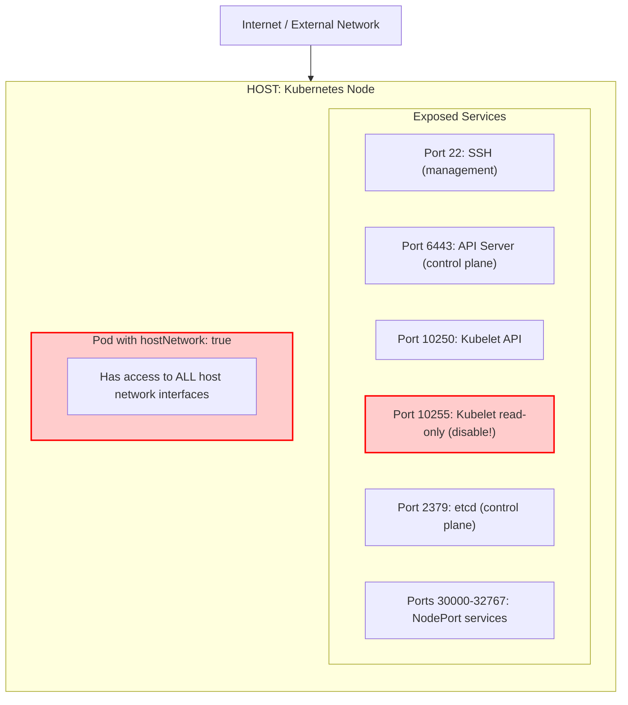
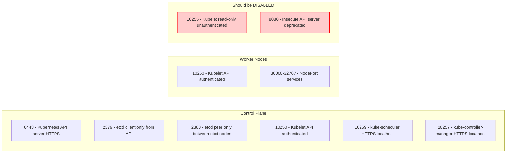
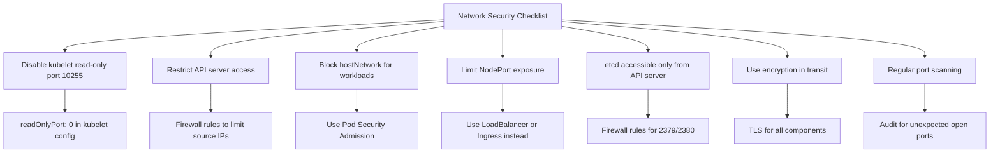

> **Complexity**: `[MEDIUM]` - Network administration with security focus
>
> **Time to Complete**: 35-40 minutes
>
> **Prerequisites**: Module 3.3 (Kernel Hardening), basic networking knowledge

---

## What You'll Be Able to Do

After completing this module, you will be able to:

1. **Implement** host-level firewall rules that restrict kubelet, API server, etcd, SSH, and NodePort traffic without breaking required Kubernetes data paths.
2. **Evaluate** a Kubernetes node's host network attack surface by correlating `ss`, `nmap`, firewall, and workload evidence.
3. **Design** network segmentation rules for etcd, the API server, kubelet, SSH, NodePort, and CNI traffic across Kubernetes 1.35+ clusters.
4. **Diagnose** workloads that use `hostNetwork: true` and enforce Pod Security Admission boundaries around application namespaces.
5. **Debug** network sysctl settings that reduce redirect, source-routing, SYN-flood, and packet-spoofing risk on Kubernetes nodes.

---

## Why This Module Matters

Hypothetical scenario: you inherit a Kubernetes cluster where application teams proudly point to default-deny NetworkPolicies in every namespace. A security scan from the corporate network still reaches the kubelet API on worker nodes, the API server on a public subnet, and a NodePort range on every node. Nothing inside the pod network is misconfigured, yet the cluster is reachable through the host network, which means the attacker is standing outside the CNI boundary and talking directly to Linux processes.

That scenario is common because Kubernetes networking has two overlapping security planes. NetworkPolicy controls traffic between pods after the packet enters the CNI implementation, while host network security controls traffic aimed at the node operating system itself. The kubelet, the API server, etcd, SSH, kube-proxy health endpoints, and NodePort sockets are host-facing concerns, so a beautiful pod policy cannot compensate for an exposed host daemon.

This module teaches the operational layer that sits beneath pod networking. You will learn how to identify which sockets are listening, decide which sources should be allowed to reach them, apply host firewall rules without breaking cluster routing, disable legacy unauthenticated endpoints, restrict `hostNetwork` workloads, and tune kernel network behavior. Treat the host boundary like the building entrance and NetworkPolicy like doors inside the building: both matter, but they protect different paths.

The CKS exam tends to compress this topic into direct tasks, such as "disable this insecure port" or "restrict access to this service." Real clusters make the same decisions under more pressure because the node is often shared by operating system agents, Kubernetes components, monitoring tools, and workload traffic. A senior operator does not memorize one universal firewall; they build a small evidence chain that connects a listening socket to a component, a component to a trust zone, and a trust zone to a testable rule.

---

## The Host Network Boundary

A Kubernetes node is a Linux server first and a scheduler target second. It runs regular host processes, owns one or more network interfaces, maintains routing tables, and receives packets long before the Kubernetes API can reason about pod intent. When a remote client connects to a service bound to the node IP, the packet terminates in the host network namespace, not inside an ordinary pod namespace governed by the CNI plugin.

The first security decision is therefore not "Which pod can talk to which pod?" but "Which networks can talk to which host services?" The answer changes by component: SSH might be allowed only from a bastion subnet, the API server might be allowed only from administrators and control integrations, kubelet should usually accept only authenticated control-plane traffic, and etcd should be reachable only by the API server and etcd peers. NodePort services are the dangerous exception because they deliberately create listeners across nodes.

The following diagram keeps the original attack-surface model from this module. Notice that the dangerous entries are not merely "open ports"; they are open ports that carry privileged cluster meaning. A read-only kubelet endpoint can leak pod inventory, an authenticated kubelet endpoint can become powerful if credentials are stolen, and a `hostNetwork` pod can use the node network namespace even when namespace NetworkPolicies look strict.



For terminal review, the same model is useful as a static system map. The diagram deliberately separates the host from the pod because that boundary is the point of the module. A pod using normal networking receives its own network namespace, while a process running on the host or in a `hostNetwork` pod shares the node's interfaces, routes, loopback device, and listening sockets.

```text
+-------------------------------------------------------------+
|              HOST NETWORK ATTACK SURFACE                    |
+-------------------------------------------------------------+
|                                                             |
|  Internet / External Network                                |
|     |                                                       |
|     v                                                       |
|  +-----------------------------------------------------+    |
|  |              HOST (Kubernetes Node)                 |    |
|  |                                                     |    |
|  |  Exposed Services:                                 |    |
|  |  +-- :22    SSH (management)                       |    |
|  |  +-- :6443  API Server (control plane)             |    |
|  |  +-- :10250 Kubelet API                            |    |
|  |  +-- :10255 Kubelet read-only (should be disabled) |    |
|  |  +-- :2379  etcd (control plane)                   |    |
|  |  +-- :30000-32767 NodePort services                |    |
|  |                                                     |    |
|  |  Pod with hostNetwork: true                        |    |
|  |  +-- Has access to ALL host network interfaces     |    |
|  |                                                     |    |
|  +-----------------------------------------------------+    |
|                                                             |
|  !! Each open port is a potential entry point               |
|  !! hostNetwork pods bypass CNI isolation                   |
|                                                             |
+-------------------------------------------------------------+
```

Pause and predict: beyond the listed Kubernetes services, what other Linux services on a node could become part of the attack surface? Think about monitoring agents, node exporters, package repositories, backup tools, local dashboards, and any custom daemon that binds to `0.0.0.0` instead of `127.0.0.1`. The lesson is not that every host service is bad; the lesson is that every reachable host service needs an owner, an allowed source range, and a verification method.

Kubernetes security work often fails when teams confuse "inside the cluster" with "inside the pod network." A worker node can be attached to cloud subnets, corporate VPNs, load balancer target groups, and administrative networks at the same time. If those networks can reach node ports directly, the workload's namespace policy might be perfectly correct while the host still exposes privileged interfaces to the wrong audience.

Packet direction is the simplest way to keep the layers straight. Traffic to a pod IP normally enters the CNI and is subject to the network plugin's policy model, while traffic to a node IP and host port is evaluated as host traffic. A NodePort blurs the picture because Kubernetes intentionally installs host-level service exposure, but it still appears to scanners as a node listener. That is why service design and host firewall design must be reviewed together.

The loopback interface adds another subtle boundary. A service bound to `127.0.0.1` is not remotely reachable from another machine, yet a `hostNetwork` pod on the same node can reach that loopback service because it shares the host network namespace. This matters for dashboards, metrics endpoints, and administrative agents that were written with the assumption that loopback means "local and trusted." On a Kubernetes node, host namespace sharing changes who can become local.

---

## Required Ports and Trust Zones

Before you can write a firewall rule, you need to know whether a port is required, optional, local-only, or obsolete. Kubernetes documents standard ports for the control plane and worker nodes, but those tables are starting points rather than final policy. A secure rule set adds source restrictions, because the question is not only "Should port 10250 exist?" but "Which systems should ever be able to reach 10250?"

Control-plane nodes usually expose the API server on 6443, etcd client traffic on 2379, etcd peer traffic on 2380, and kubelet on 10250. Scheduler and controller-manager secure endpoints are commonly bound for local or controlled access, and managed distributions may differ in placement. Worker nodes usually expose kubelet on 10250 and may expose NodePort sockets in the service range, which defaults to 30000-32767 unless the cluster is configured otherwise.



The static port map below is intentionally conservative. It treats 10255 and 8080 as audit findings, not as normal components of a Kubernetes 1.35+ cluster. It also treats NodePort as a service-exposure decision rather than an automatic right to receive traffic from everywhere, because NodePort makes every node an entry point even when only a subset of nodes currently hosts backing pods.

```text
+-------------------------------------------------------------+
|              KUBERNETES REQUIRED PORTS                      |
+-------------------------------------------------------------+
|                                                             |
|  Control Plane:                                             |
|  ---------------------------------------------------------  |
|  6443   - Kubernetes API server (HTTPS)                     |
|  2379   - etcd client (only from API server)                |
|  2380   - etcd peer (only between etcd nodes)               |
|  10250  - Kubelet API (authenticated)                       |
|  10259  - kube-scheduler (HTTPS, localhost)                 |
|  10257  - kube-controller-manager (HTTPS, localhost)        |
|                                                             |
|  Worker Nodes:                                              |
|  ---------------------------------------------------------  |
|  10250  - Kubelet API (authenticated)                       |
|  30000-32767 - NodePort services (if used)                  |
|                                                             |
|  Should be DISABLED:                                        |
|  ---------------------------------------------------------  |
|  10255  - Kubelet read-only port (unauthenticated)          |
|  8080   - Insecure API server port (deprecated)             |
|                                                             |
+-------------------------------------------------------------+
```

Port knowledge becomes actionable when it is translated into trust zones. A useful mental model is to place every source network into one of four categories: administrator management, control-plane internals, node-to-node internals, and untrusted clients. Most privileged ports should accept only one of those categories, and the firewall rule should make that category visible rather than relying on a comment in a runbook.

Trust zones should be defined by routes and identity, not by vague labels like "private." A corporate RFC1918 network can contain developer laptops, jump hosts, build agents, and compromised desktops, so allowing all of `10.0.0.0/8` to kubelet may be too broad in a real environment. During an exam you may use a simplified subnet from the task, but during production design you should identify the exact control-plane addresses, bastion ranges, and automation sources that require access. The smaller the source group, the easier it is to reason about a credential theft or lateral movement event.

| Port or range | Component | Typical allowed source | Security decision |
|---|---|---|---|
| 22/tcp | SSH | Bastion or privileged admin subnet | Restrict tightly and log access attempts |
| 6443/tcp | API server | Admin networks, CI/CD, control integrations | Never leave broadly public without strong compensating controls |
| 10250/tcp | Kubelet API | Control-plane nodes and authenticated operational tools | Block direct user and internet access |
| 2379/tcp | etcd client | API server only | Treat as critical cluster state access |
| 2380/tcp | etcd peer | Other etcd members only | Allow exact peer addresses in stacked or external etcd |
| 30000-32767/tcp | NodePort services | Service-specific client networks | Prefer ingress or load balancer when possible |

Stop and think: the kubelet read-only port on 10255 exposes pod data without authentication when enabled. Why would an endpoint like that have existed historically, and why is it now such a valuable reconnaissance target? The honest answer is that operational convenience and legacy metrics collection once had different defaults, while current security practice assumes every inventory endpoint can help an attacker plan the next move.

Do not forget IPv6 when your environment routes it. Many quick audits filter only IPv4 examples, but a process can listen on `::` and accept IPv6 traffic even if the IPv4 path looks restricted. The same trust-zone decision must be applied consistently across address families, cloud firewall rules, and host rules. If the cluster does not intentionally use IPv6, that decision should still be visible as disabled routing, absent addresses, or deny rules rather than as an unexamined assumption.

Managed Kubernetes platforms change ownership, not responsibility. You may not be allowed to edit the control-plane host firewall, but you still decide which public and private networks can reach the API endpoint through provider configuration. For worker nodes, you may manage security groups, node image settings, host firewall daemons, or admission policy instead of raw iptables. The goal remains the same: privileged node and cluster services should have narrow, testable reachability.

---

## Audit Before Blocking

Firewall work should begin with observation, not with a rule copied from a checklist. The node has an internal truth, which is what the kernel is actually listening on, and an external truth, which is what a remote scanner can reach after cloud security groups, physical firewalls, host rules, and routing decisions are applied. You need both views because either one alone can lie by omission.

The `ss` command gives the kernel-side socket view and is usually preferred over old `netstat` habits. The flags matter: `-t` limits the output to TCP, `-l` shows listening sockets, `-n` avoids name resolution that can slow or obscure the result, and `-p` shows the process that owns the socket when permissions allow it. An external `nmap` scan then answers whether a remote attacker or administrator can actually reach the service.

```bash
# List all listening ports
ss -tlnp

# List all listening ports with process names
sudo netstat -tlnp

# Check specific Kubernetes ports
ss -tlnp | grep -E '6443|10250|2379'

# Check for insecure ports
ss -tlnp | grep -E '10255|8080'

# Using nmap from external host
nmap -p 6443,10250,10255,2379 <node-ip>
```

Before running this audit, predict which sockets should appear on a control-plane node and which should appear on a worker node. If you expect the same answer on both, you are probably missing the difference between a control-plane trust zone and a worker trust zone. That prediction step makes surprises visible: an unexpected process on 0.0.0.0 is easier to notice when you wrote down the expected set first.

Interpreting the output requires attention to bind addresses. A process listening on `127.0.0.1:10257` is a different risk from a process listening on `0.0.0.0:10257`, because loopback is local to the node while all-interfaces binding accepts traffic on every address assigned to the host. IPv6 listeners also deserve review; a service restricted on IPv4 but open on `::` can create a bypass if the network routes IPv6.

The audit should also correlate sockets with Kubernetes objects. A NodePort listener might be created by a Service, a hostNetwork listener might be created by a DaemonSet, and a non-Kubernetes listener might belong to a monitoring agent installed by a node image. In incident response, this correlation keeps you from deleting the wrong component and helps you distinguish intended cluster behavior from drift.

Build an expected-port baseline before you investigate exceptions. On a control-plane node, the API server and etcd ports may be expected, while the same ports on a worker node would be suspicious unless the distribution runs stacked components there. On a worker node, kubelet and kube-proxy health endpoints may be expected, while an unknown management dashboard on all interfaces deserves immediate ownership review. Baselines are not static forever, but they give you a defensible starting point for triage.

Process ownership is also a security signal. A listener owned by `kubelet`, `kube-apiserver`, or `etcd` points to a Kubernetes component whose configuration you can inspect through known files or manifests. A listener owned by a generic Python, Node.js, or Java process might be an agent, a workload escaped onto the host, or an unauthorized service. The command output becomes more valuable when you connect it to systemd units, static pod manifests, package ownership, and Kubernetes objects.

Remote scans should be run from meaningful locations. A scan from the node itself proves very little about external reachability, and a scan from a trusted bastion proves only the allowed path. For a real boundary, scan from an allowed administrator source, a normal workload subnet, and an untrusted or internet-like source where possible. The denied scan is just as important as the allowed scan because it proves the rule is doing more than preserving availability.

---

## Host Firewalls Without Breaking Kubernetes

Host firewalls protect the Linux `INPUT` path: traffic destined for the node itself. They are not a replacement for cloud security groups, physical firewalls, Kubernetes NetworkPolicy, or service mesh policy, but they add a local enforcement point that travels with the node. A useful host firewall rule is explicit about protocol, destination port, source network, and fallback behavior.

The main operational hazard is that Kubernetes also uses Linux packet filtering and forwarding machinery. Kube-proxy, CNIs, and container runtimes can create iptables or nftables state for service routing, masquerade, connection tracking, overlay encapsulation, and health checks. A host firewall that blocks the wrong node-to-node protocol may "harden" the host by cutting the pod network apart, which is why the audit and trust-zone model must come first.

### Using iptables

Direct iptables rules are still valuable because they reveal the actual netfilter decision being made. In the example below, the rule order is part of the security model: allow known trusted sources first, then drop remaining traffic to sensitive ports. In production you would adapt the source ranges to your real control-plane, bastion, and service networks rather than copying the sample addresses.

```bash
# Allow SSH
iptables -A INPUT -p tcp --dport 22 -j ACCEPT

# Allow Kubernetes API (from specific networks)
iptables -A INPUT -p tcp --dport 6443 -s 10.0.0.0/8 -j ACCEPT

# Allow kubelet API (from control plane)
iptables -A INPUT -p tcp --dport 10250 -s 10.0.0.10/32 -j ACCEPT

# Allow NodePort range (if needed)
iptables -A INPUT -p tcp --dport 30000:32767 -j ACCEPT

# Block everything else
iptables -A INPUT -p tcp --dport 6443 -j DROP
iptables -A INPUT -p tcp --dport 10250 -j DROP

# Save rules
iptables-save > /etc/iptables/rules.v4
```

The sample intentionally keeps NodePort broad because it preserves the protected asset from the original module, but a real secure configuration should rarely allow the whole NodePort range from every source. If a NodePort is required for an exam task or a lab, allow only the specific client networks that need it. If the service is public, prefer a load balancer, ingress controller, or Gateway API path where TLS, logging, and centralized policy are easier to operate.

### Using UFW (Ubuntu)

UFW is friendlier on Ubuntu systems, but it is still a frontend to packet filtering rules. The readable syntax helps during exams and operations because source restrictions are obvious at a glance. The tradeoff is that UFW defaults and ordering can surprise teams that assume it understands Kubernetes networking, so always verify pod traffic and node-to-node paths after enabling it.

```bash
# Enable UFW
sudo ufw enable

# Allow SSH
sudo ufw allow ssh

# Allow Kubernetes API from internal network
sudo ufw allow from 10.0.0.0/8 to any port 6443

# Allow kubelet from control plane
sudo ufw allow from 10.0.0.10 to any port 10250

# Check status
sudo ufw status verbose
```

### Using firewalld (RHEL/CentOS)

Firewalld is common on Enterprise Linux nodes and organizes rules through zones and services. That model is useful when interfaces belong to different trust levels, such as a private cluster network and a management network. The danger is that adding a port permanently without a source restriction can be too broad, so treat these commands as the minimum vocabulary rather than a final policy template.

```bash
# Allow Kubernetes API
sudo firewall-cmd --permanent --add-port=6443/tcp

# Allow kubelet
sudo firewall-cmd --permanent --add-port=10250/tcp

# Reload
sudo firewall-cmd --reload

# Check open ports
sudo firewall-cmd --list-ports
```

After any firewall change, test from at least two places: one source that should be allowed and one source that should be denied. A local `ss` result can show the service is still listening, but only a remote test can prove the policy filters the path correctly. For Kubernetes nodes, also verify that pods can still resolve DNS, reach services, and communicate across nodes when the CNI expects that behavior.

Persistence is part of correctness. An iptables command typed during an exam may be acceptable if the task asks for immediate remediation, but production hardening must survive reboot, node replacement, and image rotation. That can mean `iptables-save`, a systemd unit, cloud-init, image baking, configuration management, or a distribution-supported firewall interface. A rule that disappears during a node restart is operationally equivalent to a temporary exception.

Rule ordering deserves the same care as the rule content. Traditional iptables chains evaluate from top to bottom, so an early broad accept can make a later drop irrelevant, and an early broad drop can block a later specific allow. When reviewing a node under pressure, inspect line numbers and insert rules deliberately instead of only appending. The difference between `-I` and `-A` can be the difference between a precise exception and a rule that never takes effect.

Many modern distributions use nftables underneath iptables-compatible commands. That does not invalidate the exam concepts, but it does mean production teams should know which backend their nodes use and which tool owns the final ruleset. Mixing UFW, firewalld, kube-proxy, CNI rules, and manual commands without ownership can produce confusing results. Choose one operational interface for persistent host policy whenever possible, then document where Kubernetes-managed rules begin.

Cloud firewalls and host firewalls are complementary controls. A cloud security group can stop unwanted packets before they reach the node, which reduces noise and exposure, while a host firewall still protects the node if it is moved, attached to another subnet, or misclassified by infrastructure code. For sensitive ports like kubelet and etcd, using both layers is reasonable. The key is to keep the rules consistent enough that troubleshooting does not become guesswork.

Stop and think: you have configured host firewall rules for kubelet, API server, and etcd. How would you prove that legitimate control-plane traffic still works while a workstation on an untrusted subnet is blocked? A strong answer includes both positive and negative tests, because "it still works from my shell" is not the same as a documented boundary.

---

## Disable Legacy Endpoints and Control Host-Network Pods

Some of the best host network hardening is simply removing listeners that should not exist. The kubelet read-only port is the classic example: it provides unauthenticated information about pods on the node when enabled, so modern clusters should keep it disabled. A firewall drop is useful defense in depth, but disabling the endpoint removes the service rather than merely hiding it from one network path.

The kubelet configuration file is usually managed by the node bootstrap process, kubeadm, or a distribution-specific agent. On self-managed nodes, set `readOnlyPort: 0` in the kubelet configuration and restart the service. If the port persists after restart, look for command-line flags, generated config, systemd drop-ins, or a node agent that rewrites kubelet configuration during reconciliation.

```bash
# /var/lib/kubelet/config.yaml
# readOnlyPort: 0  # Disable read-only port (10255)

# Restart kubelet
sudo systemctl restart kubelet

# Verify
ss -tlnp | grep 10255  # Should return nothing
```

The old insecure API server port belongs in the same category of historical risk. Kubernetes 1.35+ clusters should not rely on an unauthenticated API endpoint, and older references to `--insecure-port=0` should be read as historical hardening guidance. Your operational check is straightforward: nothing should be listening on 8080 as an insecure API server endpoint.

```bash
# The insecure port (8080) is removed in Kubernetes v1.35+ (historical reference)
# For older versions, ensure it's disabled:
# --insecure-port=0 in API server flags

# Verify no insecure port
ss -tlnp | grep 8080
```

The second removal category is less obvious because the listener can be created by a workload. A pod with `hostNetwork: true` joins the node network namespace and can bind host ports, access node-local services, and bypass ordinary pod network isolation. This setting is legitimate for some system agents, CNIs, proxies, and security tools, but it is rarely appropriate for application workloads.

```yaml
# hostNetwork: true bypasses CNI
apiVersion: v1
kind: Pod
metadata:
  name: host-network-pod
spec:
  hostNetwork: true  # Pod uses node's network namespace!
  containers:
  - name: app
    image: nginx

# This pod can:
# - Bind to any port on the host
# - See all network traffic
# - Access localhost services
# - Bypass NetworkPolicies
```

What would happen if a pod is deployed with `hostNetwork: true` in a namespace that has strict default-deny NetworkPolicy? The policy may still exist, but the pod is no longer using the normal pod network namespace that the CNI policy is designed to govern. That is why admission control belongs in the design, not just runtime network policy.

Pod Security Admission gives you a native namespace-level control for this boundary. The `restricted` profile disallows host networking for ordinary workloads, while privileged system namespaces can be handled as deliberate exceptions. The important operational point is not to label every namespace the same way; it is to keep application namespaces restrictive and make any privileged namespace small, named, reviewed, and auditable.

```yaml
# Use Pod Security Admission to block
apiVersion: v1
kind: Namespace
metadata:
  name: secure-ns
  labels:
    pod-security.kubernetes.io/enforce: restricted
    # 'restricted' blocks hostNetwork: true
```

Diagnosing host-network usage requires both admission policy and inventory. Existing system DaemonSets may already use host networking, so a blind ban can break the cluster. The safer sequence is to list current `hostNetwork` pods, separate system components from application workloads, label application namespaces with `restricted`, and document any exception namespace with a clear owner and review cadence.

Admission policy prevents new drift, while inventory finds old drift. If you label a namespace as `restricted` today, existing pods that already run elsewhere may not automatically become secure in the way you expect, depending on how and when they are recreated. The practical workflow is to set enforce labels for future changes, audit current workloads, and roll or replace anything that violates the intended profile. Security controls are strongest when prevention and discovery are both present.

Host-network exceptions should be narrow in both namespace and purpose. A CNI DaemonSet, a node-local DNS cache, or a privileged security sensor may justify the setting, but a normal web application should not use it simply to bind a convenient port. When an exception is necessary, keep the service account, image, capabilities, and RBAC scoped tightly. Sharing the host network removes one isolation boundary, so the remaining boundaries need to carry more weight.

---

## Kernel Network Hardening and Operational Scenarios

Firewalls decide whether packets reach a process, but the Linux kernel also decides how packets are routed, redirected, validated, and logged. Sysctl settings are the durable interface for many of those decisions. In Kubernetes, the trick is to harden dangerous protocol behavior without disabling settings the cluster needs for pod networking, service forwarding, or CNI operation.

The checklist below preserves the original module's operational flow and turns it into a repeatable sequence. It starts with removing obsolete endpoints because that has the lowest compatibility risk, then restricts privileged host paths, then checks encryption and scanning practices. The sequence is not magic, but it prevents a common mistake: jumping straight to firewall drops before understanding what is listening and why.



The static version is useful during a terminal-only review. Treat each line as a question that must be answered with evidence, not as a box to check from memory. For example, "etcd accessible only from API server" means you can name the allowed source addresses and show a rule or network control that enforces them.

```text
+-------------------------------------------------------------+
|              NETWORK SECURITY CHECKLIST                     |
+-------------------------------------------------------------+
|                                                             |
|  [ ] Disable kubelet read-only port (10255)                 |
|      readOnlyPort: 0 in kubelet config                      |
|                                                             |
|  [ ] Restrict API server access                             |
|      Firewall rules to limit source IPs                     |
|                                                             |
|  [ ] Block hostNetwork for regular workloads                |
|      Use Pod Security Admission                             |
|                                                             |
|  [ ] Limit NodePort exposure                                |
|      Use LoadBalancer or Ingress instead                    |
|                                                             |
|  [ ] etcd accessible only from API server                   |
|      Firewall rules for 2379/2380                           |
|                                                             |
|  [ ] Use encryption in transit                              |
|      TLS for all components                                 |
|                                                             |
|  [ ] Regular port scanning                                  |
|      Audit for unexpected open ports                        |
|                                                             |
+-------------------------------------------------------------+
```

Network sysctls harden lower-level behavior that can otherwise help an attacker redirect or exhaust traffic. ICMP redirects can convince a host to send packets through an unintended gateway, source routing can let a sender influence the path packets take, and a SYN flood can consume connection state. These settings do not replace TLS or authentication, but they reduce the kernel's willingness to accept risky network hints from the environment.

Sysctl values have scope, which is easy to miss. Some settings apply to `all`, some establish the default for future interfaces, and some are interface-specific after an interface exists. On a Kubernetes node with bridges, overlay interfaces, virtual Ethernet pairs, and primary NICs, changing only one scope can leave another path with the old behavior. A careful review checks both `all` and `default`, then investigates interface-specific values when the distribution or CNI creates additional interfaces.

```bash
# /etc/sysctl.d/99-network-security.conf

# Disable ICMP redirects (prevent MITM)
net.ipv4.conf.all.accept_redirects = 0
net.ipv4.conf.default.accept_redirects = 0
net.ipv4.conf.all.send_redirects = 0
net.ipv6.conf.all.accept_redirects = 0

# Disable source routing
net.ipv4.conf.all.accept_source_route = 0
net.ipv6.conf.all.accept_source_route = 0

# Enable SYN cookies (SYN flood protection)
net.ipv4.tcp_syncookies = 1

# Log martian packets
net.ipv4.conf.all.log_martians = 1

# Ignore broadcast ICMP
net.ipv4.icmp_echo_ignore_broadcasts = 1

# Ignore bogus ICMP errors
net.ipv4.icmp_ignore_bogus_error_responses = 1

# Apply
sudo sysctl -p /etc/sysctl.d/99-network-security.conf
```

Pause and predict: why are `net.ipv4.conf.all.accept_redirects = 0` and `net.ipv4.conf.all.send_redirects = 0` important on a multi-node Kubernetes network? A strong answer connects the sysctl to path integrity: nodes should not accept unsolicited routing advice from potentially hostile networks, and they should not become redirect senders that teach other hosts unsafe paths.

Do not harden by disabling Kubernetes prerequisites. For example, `net.ipv4.ip_forward` is commonly required for node routing, and bridge netfilter settings can be required depending on the CNI and kube-proxy mode. A security baseline copied from a generic Linux server can break Kubernetes because a node is intentionally a router for pod and service traffic. The right question is whether a setting is unsafe for this role, not whether it sounds restrictive in isolation.

The CKS-style operations below are short because the exam values speed, but the reasoning behind them is not short. In each case, the command is only the final step after deciding which component owns the port, which source should reach it, and how you will verify the fix. Practice reading the command blocks as evidence collection plus remediation, not as magic incantations.

### Scenario 1: Disable Kubelet Read-Only Port

```bash
# Check if port 10255 is open
ss -tlnp | grep 10255

# Edit kubelet config
sudo vi /var/lib/kubelet/config.yaml

# Add or modify:
# readOnlyPort: 0

# Restart kubelet
sudo systemctl restart kubelet

# Verify
ss -tlnp | grep 10255  # Should be empty
```

If 10255 persists, do not assume the restart failed and keep repeating it. Check whether kubelet is reading the file you edited, whether a command-line flag overrides the file, whether a systemd drop-in points to another config path, and whether a node management agent regenerated the config. The fastest exam answer is often the one that verifies the actual process arguments.

### Scenario 2: Audit Open Ports

```bash
# List all listening ports
ss -tlnp

# Compare with expected ports
echo "Expected: 22, 6443, 10250, 10256 (kube-proxy)"
echo "Unexpected ports should be investigated"

# Check for insecure ports
ss -tlnp | grep -E ':10255|:8080'
```

This scenario is about classification. Port 10256 might be kube-proxy health checking, 10250 might be kubelet, and 22 might be SSH, but an unexpected high port listening on every interface needs an owner. When you cannot identify a process from `ss -p`, raise privileges with `sudo`, inspect systemd units, and correlate with Kubernetes objects before deleting anything.

### Scenario 3: Configure Firewall

```bash
# Block external access to kubelet
sudo iptables -A INPUT -p tcp --dport 10250 ! -s 10.0.0.0/8 -j DROP

# Allow only control plane to access kubelet
sudo iptables -I INPUT -p tcp --dport 10250 -s 10.0.0.10 -j ACCEPT

# Verify
sudo iptables -L INPUT -n | grep 10250
```

The rule pair demonstrates a useful pattern: insert the allowed control-plane source before a broader drop. Rule order matters because the first matching rule wins in a traditional chain. After applying rules, verify kubelet health from the control plane and verify denial from a non-control-plane source, because either failure tells you a different part of the boundary is wrong.

### Securing etcd Network Access

```bash
# etcd should only accept connections from API server
# On etcd node:
sudo iptables -A INPUT -p tcp --dport 2379 -s <api-server-ip> -j ACCEPT
sudo iptables -A INPUT -p tcp --dport 2379 -j DROP

# For etcd peer traffic (multi-node etcd)
sudo iptables -A INPUT -p tcp --dport 2380 -s <etcd-node-1-ip> -j ACCEPT
sudo iptables -A INPUT -p tcp --dport 2380 -s <etcd-node-2-ip> -j ACCEPT
sudo iptables -A INPUT -p tcp --dport 2380 -j DROP
```

Etcd deserves special caution because it stores cluster state and may store Secrets unless encryption at rest is configured. Blocking the wrong source on 2379 can make the API server unable to read or write cluster state, while exposing 2379 too broadly can turn a network reachability mistake into total cluster compromise. The safe method is to identify exact API server and peer addresses, apply allow rules first, keep a rollback path through SSH, and test API operations immediately.

Rollback planning is not optional when you touch host networking remotely. A bad rule can lock out SSH, sever kubelet from the control plane, or isolate etcd from the API server. In production, use a maintenance window, keep an out-of-band console or provider serial console available, and stage changes on one node before rolling across a pool. In an exam, the rollback may simply be knowing how to list numbered rules and delete the one you just added.

---

## Patterns & Anti-Patterns

Good host network security is not a single command set. It is a repeatable pattern that gives each host-facing service a reason to exist, a small set of allowed sources, a verification method, and an exception process. The patterns below add decision rules that were not present in the command walkthroughs, so use them when designing a cluster baseline rather than when solving a one-off exam task.

| Pattern | Use when | Why it works |
|---|---|---|
| Source-restricted privileged ports | Kubelet, API server, etcd, SSH, and admin tools have known clients | It reduces attack surface without pretending the service can disappear |
| Separate system and application namespaces | CNIs, proxies, and security agents legitimately need host access | It allows privileged infrastructure while keeping workload namespaces restricted |
| Positive and negative network tests | You change firewall, security group, or route policy | It proves both availability for allowed sources and denial for untrusted sources |
| Port ownership inventory | An audit finds unexpected listeners | It prevents accidental removal of required cluster components and exposes drift |

Anti-patterns usually begin with a true statement that is applied in the wrong layer. "We use NetworkPolicy" is true, but it says little about traffic to the node. "The kubelet is authenticated" is true, but it still should not be reachable from every workstation. "NodePort is convenient" is true, but it expands the number of externally reachable sockets across the fleet.

| Anti-pattern | What goes wrong | Better alternative |
|---|---|---|
| Relying only on CNI NetworkPolicy | Host services remain reachable outside the pod network | Add host firewall or cloud network controls for node ports |
| Opening the entire NodePort range publicly | Every node becomes a service entry point | Prefer ingress, Gateway API, or a load balancer with scoped rules |
| Labeling all namespaces privileged for convenience | Application pods can request host networking and host namespaces | Keep privileged labels only on controlled system namespaces |
| Applying firewall rules without CNI knowledge | Overlay, BGP, DNS, or service traffic breaks | Document CNI-required ports and test pod-to-pod paths after changes |

The scaling consideration is ownership. A small cluster can survive a hand-edited rule for an exam, but a production fleet needs the same policy represented in image build, bootstrap, configuration management, cloud firewall rules, and audit checks. When those layers disagree, the least restrictive layer usually becomes the one an attacker finds first.

Another useful pattern is exception aging. Host-network exceptions, broad NodePort exposure, and temporary firewall openings should have an expiration or a review trigger, because temporary access often becomes permanent through neglect. In a mature platform, the exception record names the owner, the business reason, the allowed source range, and the evidence that no narrower path was practical. This is not bureaucracy; it is how future operators know whether an opening is still intentional.

Monitoring should validate the boundary continuously. A nightly or weekly scan from known vantage points can catch a kubelet read-only port that reappears after a node image change, a new NodePort service opened by mistake, or a monitoring agent that changed its bind address. The alert should include enough context to route the finding to the right owner. Without continuous checks, host network hardening slowly decays as clusters are upgraded and teams add tools.

---

## Decision Framework

Use this framework when deciding how to protect a host-facing Kubernetes service. Start by asking whether the listener is required at all; if it is legacy or obsolete, remove it instead of filtering it. If the listener is required, identify the smallest source group that needs it, choose the enforcement layer closest to the traffic path, and then run both positive and negative tests.

| Decision question | If yes | If no |
|---|---|---|
| Is the listener obsolete or unauthenticated? | Disable it, then verify it is gone with `ss` and remote scans | Continue classifying its required clients |
| Does the listener serve only control-plane traffic? | Restrict to control-plane addresses and management networks | Treat it as service exposure and design client access deliberately |
| Does the workload request host networking? | Require a system namespace, review owner, and PSA exception | Keep the namespace at the `restricted` profile |
| Does the firewall rule affect CNI traffic? | Test DNS, service routing, and cross-node pod communication | Test only the service-specific allowed and denied paths |
| Is NodePort required by the design? | Scope source ranges and consider `externalTrafficPolicy: Local` where appropriate | Prefer ingress, Gateway API, or LoadBalancer exposure |

The most important tradeoff is between reachability and blast radius. A broadly reachable API server or kubelet is easier to operate during emergencies, but it also gives every compromised network segment a direct path to privileged cluster components. A tightly restricted boundary requires better management paths and monitoring, but it makes accidental exposure and credential misuse harder to turn into cluster-wide access.

For exam work, optimize for a clear, reversible fix that proves the point under time pressure. For production work, optimize for repeatability and evidence: rules should survive reboot, node replacement, and cluster upgrades, and an auditor should be able to understand why each exception exists. The same technical command can be acceptable in a lab and incomplete in a fleet if it lacks persistence, ownership, and verification.

When two controls can solve the same exposure, prefer the one that removes the risk at the source. Disabling 10255 is better than only dropping it, because there is no unauthenticated service left to discover through another path. Restricting a namespace with Pod Security is better than hoping every developer remembers not to set `hostNetwork`. Firewalls remain essential, but the cleanest security boundary often combines removal, admission prevention, and network filtering.

The decision framework also helps you avoid false confidence from "secure by default" language. Many defaults are safer in Kubernetes 1.35+ than they were in older clusters, but upgrades, distribution patches, bootstrap flags, and legacy node images can still produce surprising state. Verify the live node rather than trusting the version alone. A secure default is a helpful assumption to test, not evidence by itself.

---

## Did You Know?

- Kubernetes documents 6443/tcp as the default secure API server port and 10250/tcp as the kubelet API port, which is why both appear repeatedly in CKS network-hardening tasks.
- The default NodePort service range is 30000-32767, so exposing one NodePort feature can create a broad scan surface unless external network controls narrow the reachable paths.
- The Pod Security Standards `restricted` profile disallows `hostNetwork`, `hostPID`, and `hostIPC`, making it a native way to block several host-namespace escape hatches for application namespaces.
- Etcd uses 2379/tcp for client traffic and 2380/tcp for peer traffic, so a multi-member etcd topology needs different allow rules for API server clients and etcd-to-etcd replication.

---

## Common Mistakes

The mistakes below are specific failure modes you should be able to recognize during a CKS task or a node hardening review. Each one has a safer replacement that preserves required Kubernetes behavior while reducing unnecessary reachability. If you can explain why the mistake happens, you are less likely to apply a rigid checklist that breaks the cluster.

| Mistake | Why It Happens | How to Fix It |
|---|---|---|
| Leaving 10255 open | Legacy kubelet settings or old node images keep the unauthenticated endpoint alive | Set `readOnlyPort: 0`, restart kubelet, and verify the port is gone |
| Allowing kubelet from every internal subnet | Teams treat "inside the network" as trusted enough for privileged node APIs | Restrict 10250 to control-plane and approved operations sources |
| Publishing NodePort broadly | NodePort feels like a quick way to test services without designing ingress | Prefer Ingress, Gateway API, or LoadBalancer; restrict NodePort sources when required |
| Applying UFW without CNI allowances | Host hardening is done without checking overlay or routing requirements | Document CNI ports and test DNS plus cross-node pod traffic after enabling rules |
| Labeling workload namespaces as privileged | System DaemonSets need exceptions and teams copy the label too broadly | Keep application namespaces `restricted` and isolate privileged agents elsewhere |
| Blocking etcd before confirming API server addresses | The operator knows 2379 is sensitive but guesses source addresses | Identify API server and peer addresses first, then apply allow-before-drop rules |
| Trusting local socket checks only | `ss` shows listeners but not external reachability through firewalls and routes | Combine local `ss` with remote scans from allowed and denied networks |

---

## Quiz

Use these scenarios to test whether you can choose the right layer of control. Each answer explains the mechanism, the fix, and the reason a tempting alternative is incomplete.

<details>
<summary>Question 1: A penetration tester on your corporate network runs `curl http://worker-node-ip:10255/pods` and receives pod inventory from a worker node. Your namespace NetworkPolicies are strict. How did the tester bypass them, and what should you change?</summary>

The tester reached the kubelet read-only port on the host network, so the request never depended on pod-to-pod traffic governed by NetworkPolicy. Disable the endpoint with `readOnlyPort: 0`, restart kubelet, and verify that 10255 is no longer listening. Add a host firewall drop as defense in depth, but do not treat filtering as the only fix because the unauthenticated endpoint should not exist. NetworkPolicy remains useful for workload traffic, but it is the wrong control plane for host sockets.
</details>

<details>
<summary>Question 2: Your team labels application namespaces with the Pod Security `restricted` profile, but kube-proxy and the CNI still run with `hostNetwork: true` in system namespaces. Is that a policy failure?</summary>

No, this can be a correct separation of duties if the exception is limited to system namespaces with clear ownership. Some infrastructure components need host networking to implement node networking, proxying, or observation, while application workloads usually do not. Keep application namespaces restricted, avoid applying privileged labels broadly, and audit system namespaces separately. The wrong fix would be to relax every namespace just because one system DaemonSet needs host access.
</details>

<details>
<summary>Question 3: You plan to restrict etcd on 2379 and 2380 with iptables. What must you identify before adding drop rules, and what failure tells you that the rule set is wrong?</summary>

You must identify API server addresses for etcd client traffic and etcd member addresses for peer traffic. Add allow rules for those sources before broader drops, then test Kubernetes API operations immediately. If `kubectl` calls hang or the API server reports storage errors, you may have blocked the API server from etcd. The wrong approach is to drop 2379 from "everything" first and hope the control plane keeps working.
</details>

<details>
<summary>Question 4: A NodePort service listens on port 31337 across every worker node, although backing pods run on only two nodes. What is the security implication, and what alternatives reduce exposure?</summary>

NodePort makes each node an entry point for that service range, so the exposed surface can be larger than the set of nodes running pods. An attacker can scan every node IP in the NodePort range and discover reachable services even when application placement is narrow. Prefer Ingress, Gateway API, or a LoadBalancer when the service is meant to be externally reachable through a controlled point. If NodePort is required, restrict source ranges and consider whether `externalTrafficPolicy: Local` matches the design.
</details>

<details>
<summary>Question 5: After enabling UFW on a worker node, pods on that node cannot reach pods on other nodes, but local host services still respond. What likely happened?</summary>

The firewall probably blocked traffic required by the CNI, such as encapsulation, routing, BGP, or other node-to-node communication. Host services can still respond because the rules allowed local management ports while accidentally cutting the pod network's data path. Review the CNI documentation for required ports and protocols, then add the minimal allowances and retest DNS plus cross-node pod communication. The wrong conclusion is that Kubernetes is broken; the firewall changed the network beneath it.
</details>

<details>
<summary>Question 6: A node accepts ICMP redirect messages and starts routing traffic through an unexpected gateway. Which sysctl family should you inspect, and why does it matter?</summary>

Inspect `net.ipv4.conf.*.accept_redirects`, `net.ipv4.conf.*.send_redirects`, and the corresponding IPv6 redirect setting where applicable. Redirects can be useful in simple networks, but in a hardened Kubernetes environment they can let a malicious or compromised network participant influence packet paths. Set the redirect-related values to `0` through a persistent file in `/etc/sysctl.d/` and reload them. The fix reduces path manipulation risk but does not replace encryption and authentication.
</details>

<details>
<summary>Question 7: You run `ss -tlnp` and find a service listening on `0.0.0.0:9100` on every node. How should you evaluate it before deciding whether to block it?</summary>

First identify the owning process and whether it is expected, such as a node exporter or monitoring agent. Then decide which monitoring systems should reach it and whether it should bind to a private interface, loopback, or a restricted source range. Test from an allowed monitoring source and from an untrusted source after applying the control. Blocking blindly can break observability, but leaving an inventory endpoint broadly reachable creates unnecessary reconnaissance value.
</details>

---

## Hands-On Exercise

In this exercise you will perform a host network security review as if you were preparing a node for a CKS-style audit. Use a disposable lab node or the linked Killercoda environment rather than a production system. The goal is to gather evidence, classify the risk, and apply the smallest safe remediation path.

Start with a written expectation for the node you are auditing. A control-plane node and a worker node do not have the same expected sockets, and a lab cluster may differ from a managed production distribution. Your checklist should therefore capture observations and decisions rather than only command output.

- [ ] Evaluate all listening TCP sockets and identify the process that owns each host-facing Kubernetes port.
- [ ] Diagnose whether insecure legacy endpoints, especially 10255 and 8080, are listening on the node.
- [ ] Implement or describe host-level firewall rules that restrict kubelet, API server, SSH, NodePort, and etcd sources.
- [ ] Debug network sysctl values for redirects, source routing, SYN cookies, martian logging, and broadcast ICMP.
- [ ] Diagnose all pods using `hostNetwork: true` and classify them as system exceptions or workload violations.
- [ ] Design a verification plan with one allowed-source test and one denied-source test for each sensitive listener.

<details>
<summary>Solution guide: recommended audit sequence</summary>

Begin with `ss -tlnp` and record the listeners before changing anything. Filter for known Kubernetes ports, then run a remote scan from a source that represents an attacker or untrusted client. Inspect kubelet configuration for `readOnlyPort`, query sysctl values, list firewall rules, and inventory `hostNetwork` pods through the API. Remediate only after you can explain which component owns each listener and which source network should reach it.
</details>

<details>
<summary>View the Complete Audit Script</summary>

```bash
# Step 1: Check all open ports
echo "=== Open Ports ==="
ss -tlnp

# Step 2: Check for insecure ports
echo "=== Insecure Ports Check ==="
ss -tlnp | grep -E ':10255|:8080' && echo "WARNING: Insecure ports open!" || echo "OK: No insecure ports"

# Step 3: Check kubelet read-only port configuration
echo "=== Kubelet Config ==="
grep -i readOnlyPort /var/lib/kubelet/config.yaml 2>/dev/null || echo "Check on actual node"

# Step 4: Check network sysctl settings
echo "=== Network Security Sysctl ==="
sysctl net.ipv4.conf.all.accept_redirects
sysctl net.ipv4.conf.all.send_redirects
sysctl net.ipv4.tcp_syncookies

# Step 5: List current firewall rules (if any)
echo "=== Firewall Rules ==="
sudo iptables -L INPUT -n --line-numbers 2>/dev/null | head -20 || echo "Check iptables on actual node"

# Step 6: Check for pods with hostNetwork
echo "=== Pods with hostNetwork ==="
kubectl get pods -A -o json | jq -r '.items[] | select(.spec.hostNetwork==true) | "\(.metadata.namespace)/\(.metadata.name)"'

# Success criteria:
# - No insecure ports open
# - readOnlyPort: 0 in kubelet config
# - Minimal pods using hostNetwork
```
</details>

<details>
<summary>Solution guide: interpreting the audit script</summary>

Treat the script as a starting point, not a final compliance report. If insecure ports are open, disable them and verify the listener disappears. If many `hostNetwork` pods appear, separate infrastructure agents from application workloads and check namespace Pod Security labels. If sysctl settings are weak, place persistent values under `/etc/sysctl.d/` and reload them, then confirm that Kubernetes networking still works.
</details>

Success criteria for your finished review:

- [ ] No unauthenticated kubelet read-only port is reachable on 10255.
- [ ] No insecure API server listener is reachable on 8080.
- [ ] Kubelet and etcd traffic are restricted to documented source networks.
- [ ] Application namespaces enforce Pod Security settings that block `hostNetwork: true`.
- [ ] Firewall changes are verified from both allowed and denied source locations.
- [ ] Sysctl hardening values are persistent and do not break required Kubernetes networking.

---

## Sources

- https://kubernetes.io/docs/reference/networking/ports-and-protocols/
- https://kubernetes.io/docs/concepts/security/pod-security-standards/
- https://kubernetes.io/docs/concepts/services-networking/service/
- https://kubernetes.io/docs/concepts/services-networking/network-policies/
- https://kubernetes.io/docs/reference/config-api/kubelet-config.v1beta1/
- https://kubernetes.io/docs/reference/command-line-tools-reference/kubelet/
- https://kubernetes.io/docs/tasks/administer-cluster/securing-a-cluster/
- https://kubernetes.io/docs/tasks/administer-cluster/configure-upgrade-etcd/
- https://etcd.io/docs/v3.6/op-guide/security/
- https://man7.org/linux/man-pages/man8/ss.8.html
- https://man7.org/linux/man-pages/man8/iptables.8.html
- https://firewalld.org/documentation/man-pages/firewall-cmd.html
- https://man7.org/linux/man-pages/man8/sysctl.8.html

---

## Next Module

[Part 4: Minimize Microservice Vulnerabilities](/k8s/cks/part4-microservice-vulnerabilities/module-4.1-security-contexts/) - Continue from host hardening into container security contexts, Pod Security Admission, and safer application runtime settings.
