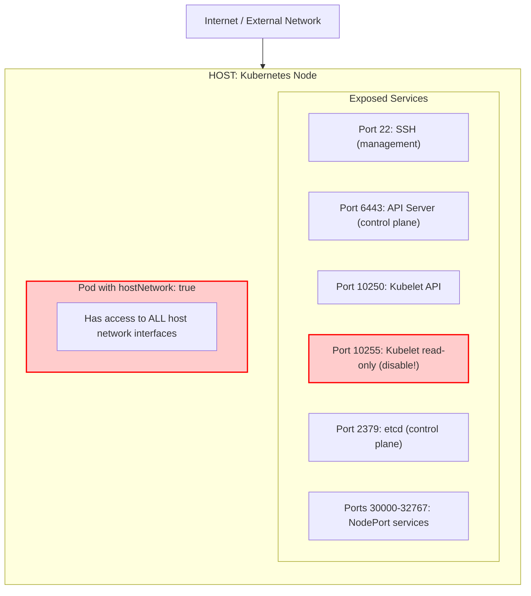
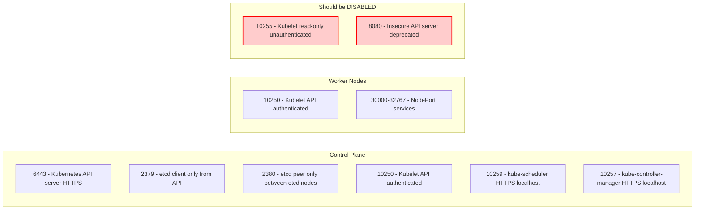
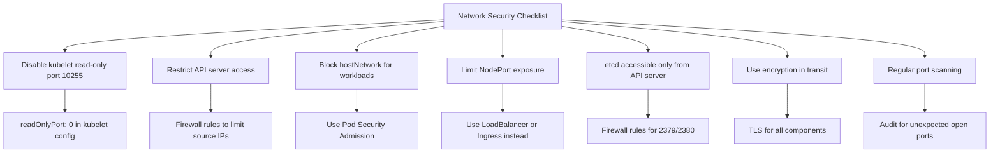

> **Complexity**: `[MEDIUM]` - Network administration with security focus
>
> **Time to Complete**: 35-40 minutes
>
> **Prerequisites**: Module 3.3 (Kernel Hardening), basic networking knowledge

---

## What You'll Be Able to Do

After completing this rigorous module, you will be able to:

1. **Implement** host-level firewall configurations (using iptables, UFW, or firewalld) to securely restrict access to critical Kubernetes control plane and worker node services.
2. **Evaluate** the security posture of a Kubernetes node by auditing listening network ports and diagnosing exposed, insecure interfaces.
3. **Design** robust network segmentation strategies to isolate etcd, the API server, and kubelet traffic from untrusted external networks.
4. **Diagnose** attack vectors involving pods running with `hostNetwork: true` and implement Pod Security Admission controls to effectively mitigate them.
5. **Debug** kernel-level network parameters via sysctl to prevent common host network attacks, such as Man-in-the-Middle (MITM) and SYN floods.

---

## Why This Module Matters

In 2020, the attack group known as TeamTNT systematically scanned the internet for exposed Kubernetes daemons. They discovered thousands of clusters where the legacy kubelet read-only port (10255) and the unauthenticated API server port were inadvertently left exposed on the host's public IP address. Because these endpoints operated at the host level, they completely bypassed the sophisticated CNI-based NetworkPolicies the victims had configured.

The attackers utilized these exposed interfaces to execute remote commands, extract sensitive environment variables containing cloud credentials, and deploy cryptomining payloads across the worker nodes. For one major data analytics firm, this oversight resulted in a staggering $300,000 cloud bill in a matter of days. The financial impact was compounded by the astronomical cost of incident response, forensic investigations, and severe reputational damage. 

This incident starkly illustrates a fundamental Kubernetes security principle: container isolation is meaningless if the underlying host network is left defenseless. Your NetworkPolicies act as the interior locked doors of an office building, but host network security is the perimeter fence and the heavy steel front door. If the front door is wide open, the interior doors offer little protection against a determined adversary.

---

## The Perimeter Defense: Host Network Attack Surface

A Kubernetes node is fundamentally a Linux server running specialized daemons. While Kubernetes orchestrates container workloads, the physical or virtual network interface cards (NICs) on the node handle all incoming and outgoing packets. If an attacker can reach a network service bound to the host's IP address, they can interact with that service directly, completely ignoring the Kubernetes overlay network (CNI).

The following diagram illustrates the primary attack surface on a standard Kubernetes node.



For legacy reference and terminal viewing, this is the raw system map:

```text
┌─────────────────────────────────────────────────────────────┐
│              HOST NETWORK ATTACK SURFACE                    │
├─────────────────────────────────────────────────────────────┤
│                                                             │
│  Internet / External Network                               │
│     │                                                       │
│     ▼                                                       │
│  ┌─────────────────────────────────────────────────────┐   │
│  │              HOST (Kubernetes Node)                  │   │
│  │                                                      │   │
│  │  Exposed Services:                                  │   │
│  │  ├── :22    SSH (management)                        │   │
│  │  ├── :6443  API Server (control plane)              │   │
│  │  ├── :10250 Kubelet API                             │   │
│  │  ├── :10255 Kubelet read-only (should be disabled!) │   │
│  │  ├── :2379  etcd (control plane)                    │   │
│  │  └── :30000-32767 NodePort services                 │   │
│  │                                                      │   │
│  │  Pod with hostNetwork: true                         │   │
│  │  └── Has access to ALL host network interfaces      │   │
│  │                                                      │   │
│  └─────────────────────────────────────────────────────┘   │
│                                                             │
│  ⚠️  Each open port is a potential entry point            │
│  ⚠️  hostNetwork pods bypass CNI isolation                │
│                                                             │
└─────────────────────────────────────────────────────────────┘
```

> **Pause and predict**: Beyond the listed services, what other components on a Linux node (e.g., system services, container runtimes, other applications) could expose network ports and become part of the attack surface, potentially bypassing Kubernetes controls?

---

## Essential Kubernetes Daemons and Ports

Every Kubernetes cluster relies on a specific set of ports to facilitate communication between the control plane and worker nodes. Securing a cluster requires a deep understanding of which components communicate over which ports, and more importantly, which ports should never be exposed to untrusted networks.



The strict port mappings are as follows:

```text
┌─────────────────────────────────────────────────────────────┐
│              KUBERNETES REQUIRED PORTS                      │
├─────────────────────────────────────────────────────────────┤
│                                                             │
│  Control Plane:                                            │
│  ─────────────────────────────────────────────────────────  │
│  6443   - Kubernetes API server (HTTPS)                    │
│  2379   - etcd client (only from API server)               │
│  2380   - etcd peer (only between etcd nodes)              │
│  10250  - Kubelet API (authenticated)                      │
│  10259  - kube-scheduler (HTTPS, localhost)                │
│  10257  - kube-controller-manager (HTTPS, localhost)       │
│                                                             │
│  Worker Nodes:                                             │
│  ─────────────────────────────────────────────────────────  │
│  10250  - Kubelet API (authenticated)                      │
│  30000-32767 - NodePort services (if used)                 │
│                                                             │
│  Should be DISABLED:                                       │
│  ─────────────────────────────────────────────────────────  │
│  10255  - Kubelet read-only port (unauthenticated!)       │
│  8080   - Insecure API server port (deprecated)            │
│                                                             │
└─────────────────────────────────────────────────────────────┘
```

> **Stop and think**: The kubelet read-only port (10255) exposes pod information without any authentication. An attacker on the network can enumerate every pod, container, and their images just by curling that port. Why would this exist, and why is it a goldmine for reconnaissance?

---

## Auditing the Host: Checking Open Ports

Before applying defensive measures, you must evaluate the current state of the node. The `ss` command is the modern, faster replacement for `netstat` and is essential for inspecting listening sockets directly from the kernel.

When auditing, you must differentiate between the internal view (what the operating system kernel is actively listening on) and the external view (what a remote attacker can actually reach through physical firewalls).

```bash
# List all listening ports
ss -tlnp

# List all listening ports with process names
sudo netstat -tlnp

# Check specific Kubernetes ports
ss -tlnp | grep -E '6443|10250|2379'

# Check for insecure ports
ss -tlnp | grep -E '10255|8080'

# Using nmap from external host
nmap -p 6443,10250,10255,2379 <node-ip>
```

When executing `ss -tlnp`, the `-t` flag restricts output to TCP sockets, `-l` shows only listening sockets, `-n` forces numeric output (preventing slow DNS resolution lookups), and `-p` reveals the process ID holding the socket open.

---

## Implementing Host-Level Firewalls

While NetworkPolicies handle container-to-container routing, host-level firewalls manage the `INPUT` chain—traffic destined specifically for the host machine itself. Kubernetes components (like kube-proxy) heavily modify iptables, creating extensive routing rules in the `nat` and `filter` tables. It is critical that your host firewall rules complement, rather than conflict with, the Kubernetes routing layer.

### Using iptables

The most direct way to manipulate the Linux kernel netfilter system is through iptables. In a secure cluster, you should drop all incoming traffic by default and explicitly allow only required management protocols.

```bash
# Allow SSH
iptables -A INPUT -p tcp --dport 22 -j ACCEPT

# Allow Kubernetes API (from specific networks)
iptables -A INPUT -p tcp --dport 6443 -s 10.0.0.0/8 -j ACCEPT

# Allow kubelet API (from control plane)
iptables -A INPUT -p tcp --dport 10250 -s 10.0.0.10/32 -j ACCEPT

# Allow NodePort range (if needed)
iptables -A INPUT -p tcp --dport 30000:32767 -j ACCEPT

# Block everything else
iptables -A INPUT -p tcp --dport 6443 -j DROP
iptables -A INPUT -p tcp --dport 10250 -j DROP

# Save rules
iptables-save > /etc/iptables/rules.v4
```

### Using UFW (Ubuntu)

Uncomplicated Firewall (UFW) provides a more user-friendly frontend to iptables, commonly used on Ubuntu nodes. 

```bash
# Enable UFW
sudo ufw enable

# Allow SSH
sudo ufw allow ssh

# Allow Kubernetes API from internal network
sudo ufw allow from 10.0.0.0/8 to any port 6443

# Allow kubelet from control plane
sudo ufw allow from 10.0.0.10 to any port 10250

# Check status
sudo ufw status verbose
```

### Using firewalld (RHEL/CentOS)

On Enterprise Linux distributions, firewalld manages network zones and services dynamically.

```bash
# Allow Kubernetes API
sudo firewall-cmd --permanent --add-port=6443/tcp

# Allow kubelet
sudo firewall-cmd --permanent --add-port=10250/tcp

# Reload
sudo firewall-cmd --reload

# Check open ports
sudo firewall-cmd --list-ports
```

> **Stop and think**: You've configured your firewall rules. How would you *test* these rules to ensure they are actually blocking unwanted traffic and allowing legitimate traffic, especially from a remote machine? What tools would you use?

---

## Hardening the Kubelet and API Server: Disabling Insecure Ports

A critical administrative task is removing insecure legacy endpoints. The kubelet read-only port provides an unauthenticated JSON dump of all pods on the node, giving attackers a perfect map of your cluster workloads.

### Kubelet Read-Only Port

You must explicitly disable this in the kubelet configuration file and restart the system daemon.

```bash
# /var/lib/kubelet/config.yaml
# readOnlyPort: 0  # Disable read-only port (10255)

# Restart kubelet
sudo systemctl restart kubelet

# Verify
ss -tlnp | grep 10255  # Should return nothing
```

### Check API Server Insecure Port

The insecure API server port permitted unauthenticated administrative access to the cluster state. It is vital to ensure this is completely disabled on older clusters.

```bash
# The insecure port (8080) is removed in Kubernetes v1.35+ (historical reference)
# For older versions, ensure it's disabled:
# --insecure-port=0 in API server flags

# Verify no insecure port
ss -tlnp | grep 8080
```

---

## The Perils of Host Network Pods

Under normal circumstances, Kubernetes uses Linux Network Namespaces to provide each pod with an isolated network interface. However, when a pod requests `hostNetwork: true`, it abandons this isolation and attaches directly to the host's root network namespace.

### The Risk

Using `hostNetwork: true` is analogous to giving a tenant the master key to the apartment building's main breaker panel. They are no longer constrained by the walls of their individual unit.

```yaml
# hostNetwork: true bypasses CNI
apiVersion: v1
kind: Pod
metadata:
  name: host-network-pod
spec:
  hostNetwork: true  # Pod uses node's network namespace!
  containers:
  - name: app
    image: nginx

# This pod can:
# - Bind to any port on the host
# - See all network traffic
# - Access localhost services
# - Bypass NetworkPolicies
```

> **What would happen if**: A pod is deployed with `hostNetwork: true` in a namespace that has a strict default-deny NetworkPolicy. Does the NetworkPolicy apply to this pod? Think about which network namespace the pod is using.

### Restricting hostNetwork

To prevent application developers from casually bypassing network isolation, you must implement Pod Security Admission controls at the namespace level. 

```yaml
# Use Pod Security Admission to block
apiVersion: v1
kind: Namespace
metadata:
  name: secure-ns
  labels:
    pod-security.kubernetes.io/enforce: restricted
    # 'restricted' blocks hostNetwork: true
```

---

## Network Hardening Checklist

When securing a node, adhere to the following procedural checklist. 



```text
┌─────────────────────────────────────────────────────────────┐
│              NETWORK SECURITY CHECKLIST                     │
├─────────────────────────────────────────────────────────────┤
│                                                             │
│  □ Disable kubelet read-only port (10255)                  │
│    readOnlyPort: 0 in kubelet config                       │
│                                                             │
│  □ Restrict API server access                              │
│    Firewall rules to limit source IPs                      │
│                                                             │
│  □ Block hostNetwork for regular workloads                 │
│    Use Pod Security Admission                               │
│                                                             │
│  □ Limit NodePort exposure                                 │
│    Use LoadBalancer or Ingress instead                     │
│                                                             │
│  □ etcd accessible only from API server                    │
│    Firewall rules for 2379/2380                            │
│                                                             │
│  □ Use encryption in transit                               │
│    TLS for all components                                  │
│                                                             │
│  □ Regular port scanning                                   │
│    Audit for unexpected open ports                         │
│                                                             │
└─────────────────────────────────────────────────────────────┘
```

---

## Kernel-Level Network Hardening (Sysctl)

Firewalls dictate which packets are allowed to reach processes, but the kernel itself determines how packets are routed, redirected, and validated. By tuning kernel parameters via `/etc/sysctl.d/`, you protect the node against low-level protocol attacks.

For example, a SYN flood attack attempts to exhaust the server's connection queue by sending thousands of TCP SYN packets and ignoring the subsequent SYN-ACK. Enabling `net.ipv4.tcp_syncookies` mitigates this by cryptographically encoding the connection state, avoiding memory allocation until the final ACK arrives.

```bash
# /etc/sysctl.d/99-network-security.conf

# Disable ICMP redirects (prevent MITM)
net.ipv4.conf.all.accept_redirects = 0
net.ipv4.conf.default.accept_redirects = 0
net.ipv4.conf.all.send_redirects = 0
net.ipv6.conf.all.accept_redirects = 0

# Disable source routing
net.ipv4.conf.all.accept_source_route = 0
net.ipv6.conf.all.accept_source_route = 0

# Enable SYN cookies (SYN flood protection)
net.ipv4.tcp_syncookies = 1

# Log martian packets
net.ipv4.conf.all.log_martians = 1

# Ignore broadcast ICMP
net.ipv4.icmp_echo_ignore_broadcasts = 1

# Ignore bogus ICMP errors
net.ipv4.icmp_ignore_bogus_error_responses = 1

# Apply
sudo sysctl -p /etc/sysctl.d/99-network-security.conf
```

> **Pause and predict**: Why are `net.ipv4.conf.all.accept_redirects = 0` and `net.ipv4.conf.all.send_redirects = 0` important for security, particularly in a multi-host Kubernetes environment where network traffic might be routed between nodes? What attack does this prevent?

---

## Real Exam Scenarios and Operations

During the CKS exam and in real-world incident response, you must quickly diagnose and repair network misconfigurations under pressure.

### Scenario 1: Disable Kubelet Read-Only Port

```bash
# Check if port 10255 is open
ss -tlnp | grep 10255

# Edit kubelet config
sudo vi /var/lib/kubelet/config.yaml

# Add or modify:
# readOnlyPort: 0

# Restart kubelet
sudo systemctl restart kubelet

# Verify
ss -tlnp | grep 10255  # Should be empty
```

> **Pause and predict**: You run `ss -tlnp` on a worker node and see port 10255 listening. You set `readOnlyPort: 0` in kubelet config and restart kubelet. You run `ss -tlnp` again and still see 10255. What could cause it to persist?

### Scenario 2: Audit Open Ports

```bash
# List all listening ports
ss -tlnp

# Compare with expected ports
echo "Expected: 22, 6443, 10250, 10256 (kube-proxy)"
echo "Unexpected ports should be investigated"

# Check for insecure ports
ss -tlnp | grep -E ':10255|:8080'
```

### Scenario 3: Configure Firewall

```bash
# Block external access to kubelet
sudo iptables -A INPUT -p tcp --dport 10250 ! -s 10.0.0.0/8 -j DROP

# Allow only control plane to access kubelet
sudo iptables -I INPUT -p tcp --dport 10250 -s 10.0.0.10 -j ACCEPT

# Verify
sudo iptables -L INPUT -n | grep 10250
```

### Securing etcd Network Access

The etcd database holds the absolute truth of the cluster state, including all unencrypted Secrets. Protecting its network ports is paramount.

```bash
# etcd should only accept connections from API server
# On etcd node:
sudo iptables -A INPUT -p tcp --dport 2379 -s <api-server-ip> -j ACCEPT
sudo iptables -A INPUT -p tcp --dport 2379 -j DROP

# For etcd peer traffic (multi-node etcd)
sudo iptables -A INPUT -p tcp --dport 2380 -s <etcd-node-1-ip> -j ACCEPT
sudo iptables -A INPUT -p tcp --dport 2380 -s <etcd-node-2-ip> -j ACCEPT
sudo iptables -A INPUT -p tcp --dport 2380 -j DROP
```

> **Stop and think**: etcd is often described as the "brain" of Kubernetes. If an attacker gains full access to etcd, what is the worst-case scenario for your cluster? Consider both data confidentiality and cluster integrity.

---

## Did You Know?

- **The kubelet read-only port (10255)** was originally designed for the legacy Heapster metrics system; although disabled by default in modern clusters, it remains a critical auditing target due to legacy configurations from circa 2015.
- **The insecure API server port (8080)** was officially and completely removed from the Kubernetes codebase in version 1.24 (released in May 2022), eliminating an entire class of unauthenticated control plane vulnerabilities.
- **According to the 2023 Cloud Native Security Report**, over 60 percent of successful Kubernetes node compromises begin with a port scan identifying an exposed, unauthenticated host-level daemon rather than a container vulnerability.
- **Deploying a pod with `hostNetwork: true`** immediately grants the container access to the host's loopback interface (`lo`), meaning the pod can maliciously interact with unauthenticated services bound strictly to `127.0.0.1` on the node.

---

## Common Mistakes

| Mistake | Why It Hurts | Solution |
|---------|--------------|----------|
| Leaving 10255 open | Unauthenticated info leak | Set readOnlyPort: 0 |
| No host firewall | All ports exposed | Configure iptables/ufw |
| Using NodePort publicly | Every node is entry point | Use LoadBalancer/Ingress |
| Allowing hostNetwork | Bypasses network isolation | Block with PSA |
| etcd open to cluster | Data can be stolen | Restrict to API server |
| Relying only on CNI | Host processes aren't covered | Apply host-level firewall rules |
| Unfiltered SSH (22) | Brute-force attacks | Restrict SSH to bastion hosts |

---

## Quiz

<details>
<summary>Question 1: A penetration tester on your corporate network runs `curl http://worker-node-ip:10255/pods` and gets a full JSON listing of every pod on the node -- including environment variables and image names. Your NetworkPolicies are all in place. How did the tester bypass them, and what two changes stop this?</summary>
The tester accessed the kubelet's read-only port (10255), which serves pod information without any authentication and operates at the host network level -- completely outside the scope of Kubernetes NetworkPolicies. NetworkPolicies only control pod-to-pod traffic through the CNI, not direct host port access. Two fixes: (1) Set `readOnlyPort: 0` in `/var/lib/kubelet/config.yaml` and restart kubelet to disable the unauthenticated endpoint. (2) Add host-level firewall rules (`iptables -A INPUT -p tcp --dport 10255 -j DROP`) as defense in depth. The authenticated kubelet API on port 10250 provides the same information but requires valid credentials.
</details>

<details>
<summary>Question 2: Your security policy says "no pods may use hostNetwork." You enforce this with Pod Security Admission in `restricted` mode. However, you notice the Calico CNI pods, kube-proxy, and Falco all use `hostNetwork: true` and are in `kube-system`. How do you enforce the policy for application namespaces while allowing system components to function?</summary>
Pod Security Admission is applied per-namespace via labels, so don't apply the `restricted` profile to `kube-system` (or use `privileged` mode there). Apply `pod-security.kubernetes.io/enforce: restricted` to all workload namespaces (production, staging, etc.) where hostNetwork should be blocked. System namespaces (`kube-system`, `calico-system`, `falco`) legitimately need hostNetwork for CNI, kube-proxy, and security monitoring. This is intentional -- system components require host access to function, while application pods should never need it. Document the exception and audit `kube-system` separately for unauthorized workloads.
</details>

<details>
<summary>Question 3: During a security audit, you run `nmap -p 2379 <control-plane-ip>` from a worker node and discover etcd is accessible. The auditor says this is critical because etcd stores all cluster data including secrets in plain text. What firewall rules do you add, and what happens if you accidentally block the API server's access to etcd?</summary>
Add iptables rules on the control plane node: `iptables -A INPUT -p tcp --dport 2379 -s <api-server-ip> -j ACCEPT` followed by `iptables -A INPUT -p tcp --dport 2379 -j DROP`. This allows only the API server to connect. For multi-node etcd, also allow peer traffic on 2380 from other etcd nodes. If you accidentally block the API server's access, the entire cluster becomes non-functional: no API calls work, no pod scheduling occurs, and `kubectl` hangs. Recovery requires SSH to the control plane node and removing the misconfigured iptables rule. Always test firewall changes in a maintenance window and have SSH access as a backup path.
</details>

<details>
<summary>Question 4: You discover that a NodePort service on port 31337 is exposed on all 10 worker nodes, even though the backing pod only runs on 2 of them. An attacker is scanning all nodes on the NodePort range. What's the security implication, and what alternatives reduce the attack surface?</summary>
NodePort services expose on every node's IP in the 30000-32767 range, regardless of where pods actually run. This means all 10 nodes become entry points for the service, multiplying the attack surface by 5x compared to the 2 nodes running the pods. Alternatives: (1) Use a LoadBalancer Service which provides a single entry point with cloud provider firewalling. (2) Use Ingress/Gateway API to route through a controlled ingress point with TLS, rate limiting, and authentication. (3) If NodePort is required, add host-level firewall rules to restrict source IPs on the NodePort range. (4) Use `externalTrafficPolicy: Local` to make the service only respond on nodes where pods actually run, reducing the responding surface to 2 nodes.
</details>

<details>
<summary>Question 5: You want to deploy a DaemonSet that monitors network traffic on the host. It requires `hostNetwork: true`. How can you deploy this without violating your strict Pod Security Admission policies?</summary>
You should deploy this DaemonSet into a dedicated administrative namespace, such as `monitoring-system` or `security-tools`. You then configure the Pod Security Admission labels on that specific namespace to `pod-security.kubernetes.io/enforce: privileged`. This allows the system tool to function while keeping the workload namespaces strictly locked down with the `restricted` profile. Never apply `privileged` to general application namespaces, as it fundamentally compromises the entire cluster.
</details>

<details>
<summary>Question 6: An attacker managed to execute a Man-in-the-Middle (MITM) attack between your worker nodes by sending spoofed ICMP redirect packets. Which specific sysctl parameter was likely misconfigured or left at its default setting?</summary>
The vulnerability was likely caused by leaving `net.ipv4.conf.all.accept_redirects` and `net.ipv4.conf.default.accept_redirects` set to 1 (enabled). In a secure Kubernetes cluster, these must be explicitly set to 0. ICMP redirects are intended to inform hosts of a better routing path, but attackers can spoof them to force traffic through a malicious node. This compromises the integrity and confidentiality of unencrypted inter-node communications, allowing the attacker to intercept sensitive data.
</details>

<details>
<summary>Question 7: After applying UFW rules on a newly provisioned worker node, you notice that pods scheduled on this node cannot communicate with pods on other nodes. The CNI is Calico. What likely went wrong with the host firewall?</summary>
The host firewall (UFW) likely dropped the encapsulation traffic or BGP routing data required by the CNI plugin to build the overlay network. For example, Calico requires BGP (TCP port 179) and encapsulation protocols. When configuring host-level firewalls, you must explicitly allow the specific ports and protocols used by your chosen CNI. If these are blocked, the nodes cannot form the pod network, leading to isolated pods and broken cluster networking.
</details>

---

## Hands-On Exercise

**Task**: Audit and secure the node network configuration systematically by following these progressive steps.

**Step 1: Check all open ports**
Begin by running an active socket audit to determine exactly which services are bound to the host interfaces. Look specifically for management services and unexpected daemons.

**Step 2: Check for insecure ports**
Filter your socket audit to specifically target legacy Kubernetes endpoints, such as the unauthenticated kubelet port (10255) and the deprecated insecure API port (8080).

**Step 3: Check kubelet read-only port configuration**
Inspect the kubelet configuration file on the local disk to determine if `readOnlyPort` is explicitly disabled (set to `0`).

**Step 4: Check network sysctl settings**
Query the active kernel parameters to ensure that ICMP redirects are ignored and TCP SYN cookies are enabled to prevent protocol-level attacks.

**Step 5: List current firewall rules**
Review the active netfilter `INPUT` chain to verify that host-level firewalls are actually restricting traffic, rather than relying solely on CNI policies.

**Step 6: Check for pods with hostNetwork**
Query the Kubernetes API to identify any active workloads that are bypassing network namespace isolation.

<details>
<summary>View the Complete Audit Script</summary>

```bash
# Step 1: Check all open ports
echo "=== Open Ports ==="
ss -tlnp

# Step 2: Check for insecure ports
echo "=== Insecure Ports Check ==="
ss -tlnp | grep -E ':10255|:8080' && echo "WARNING: Insecure ports open!" || echo "OK: No insecure ports"

# Step 3: Check kubelet read-only port configuration
echo "=== Kubelet Config ==="
grep -i readOnlyPort /var/lib/kubelet/config.yaml 2>/dev/null || echo "Check on actual node"

# Step 4: Check network sysctl settings
echo "=== Network Security Sysctl ==="
sysctl net.ipv4.conf.all.accept_redirects
sysctl net.ipv4.conf.all.send_redirects
sysctl net.ipv4.tcp_syncookies

# Step 5: List current firewall rules (if any)
echo "=== Firewall Rules ==="
sudo iptables -L INPUT -n --line-numbers 2>/dev/null | head -20 || echo "Check iptables on actual node"

# Step 6: Check for pods with hostNetwork
echo "=== Pods with hostNetwork ==="
kubectl get pods -A -o json | jq -r '.items[] | select(.spec.hostNetwork==true) | "\(.metadata.namespace)/\(.metadata.name)"'

# Success criteria:
# - No insecure ports open
# - readOnlyPort: 0 in kubelet config
# - Minimal pods using hostNetwork
```
</details>

**Success criteria**: Identify security issues, know how to remediate them, and confidently verify that the host attack surface has been minimized.

---

## Part 3 Complete!

You've finished **System Hardening** (15% of CKS). You now understand:
- AppArmor profiles for containers
- Seccomp system call filtering
- Linux kernel and OS hardening
- Host network security

**Next Part**: [Part 4: Minimize Microservice Vulnerabilities](/k8s/cks/part4-microservice-vulnerabilities/module-4.1-security-contexts/) - Prepare to dive deep into container security contexts, Pod Security Admission, and secure secrets management.