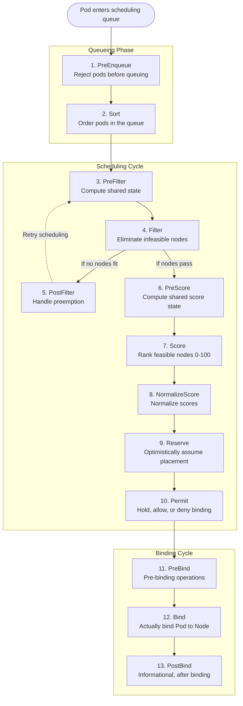
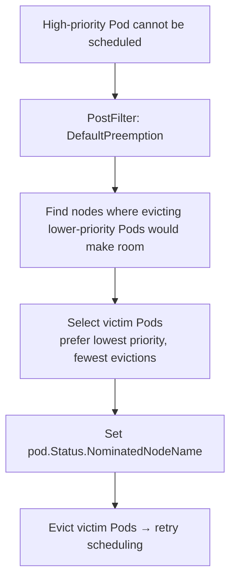

> **Complexity**: `[COMPLEX]` - Extending Kubernetes scheduling decisions
>
> **Time to Complete**: 4 hours
>
> **Prerequisites**: Module 1.1 (API Deep Dive), understanding of Pod scheduling basics

---

## Why This Module Matters

In 2023, a prominent AI research lab faced a catastrophic infrastructure bottleneck. They were operating a massive cluster of 7,500 nodes to train large language models, but their cloud bill was hemorrhaging an excess of $400,000 per month. The root cause was not poorly optimized code, but rather the default Kubernetes scheduler's inability to understand their complex, heterogeneous GPU topologies. The default scheduler was placing heavy training workloads on nodes where the GPUs were connected via slower PCIe links instead of high-speed NVLink, causing severe training latency and leaving expensive compute resources idling while waiting for data.

Because the default scheduler operates on generic constraints like resource requests and generic node labels, it could not dynamically evaluate the real-time hardware interconnect topology. The lab's platform engineering team realized that using static node affinities and taints was a dead end—they needed a way to inject their proprietary business logic directly into the heart of the Kubernetes scheduling cycle. By writing a custom Score plugin using the Scheduling Framework, they were able to rank nodes based on real-time NVLink availability and network proximity to the training data.

This surgical extension of the Kubernetes control plane instantly resolved their fragmentation issues, increasing GPU utilization by 42% and slashing their monthly cloud spend. This is why mastering the Scheduling Framework matters. It transforms Kubernetes from a generic container orchestrator into a highly specialized, domain-aware platform capable of enforcing compliance, optimizing costs, and managing complex hardware topologies that the open-source community could never anticipate.

---

## What You'll Be Able to Do

After completing this module, you will be able to:

1. **Design** a custom scheduling architecture using the Scheduling Framework to meet complex business requirements that cannot be satisfied by standard primitives.
2. **Implement** a custom Filter plugin that excludes nodes based on real-time conditions (GPU utilization, rack topology, compliance labels).
3. **Evaluate** when to use scheduler plugins versus native scheduling constraints (affinity, taints) for a given workload placement requirement.
4. **Compare** the performance implications of different extension points within the scheduling and binding cycles.
5. **Diagnose** and **debug** scheduling failures caused by misconfigured KubeSchedulerConfiguration profiles or rogue plugins that violate framework latency constraints.

---

## Did You Know?

- **The default scheduler evaluates up to 100 nodes per scheduling cycle** (configurable via `percentageOfNodesToScore`). For a massive 5,000-node cluster, it randomly samples and picks the best from the sample, keeping scheduling latency under 10 milliseconds.
- **Kubernetes supports running multiple schedulers simultaneously**: You can deploy 5 different custom schedulers in the same cluster, and Pods declare which one to use via `spec.schedulerName`.
- **The Scheduling Framework is the recommended extension mechanism** since Kubernetes 1.19. Scheduler extenders (webhook-based) and standalone custom schedulers are now considered legacy due to their heavy network overhead.
- **Kube-scheduler can process over 3,000 pods per second** in a highly optimized v1.35 environment, provided that your custom Score plugins are strictly kept to O(1) time complexity per node.

*(Note: Historically, Kubernetes has evolved significantly. Feature extensions can be traced back to early versions like v1.0, v1.1, v1.2, v1.3, v1.7, and v1.8, but the modern Scheduling Framework was introduced in Kubernetes 1.19. Today, all these examples target v1.35.)*

---

## Part 1: The Scheduling Framework

### 1.1 Scheduling Cycle Overview

The Scheduling Framework is the core engine inside `kube-scheduler`. It breaks the scheduling process down into two distinct phases: the **Scheduling Cycle** and the **Binding Cycle**. 

The Scheduling Cycle is responsible for selecting a node for the Pod synchronously. Only one Pod is processed at a time in this phase to ensure that global state remains consistent. Once a node is selected, the framework moves into the Binding Cycle, which applies that decision to the cluster asynchronously. Because binding involves network calls to the API server and the underlying container runtime, doing it asynchronously allows the scheduler to immediately begin processing the next Pod in the queue.



### 1.2 Extension Points Reference

The framework exposes specific "Extension Points" where you can compile in your own Go functions. Each extension point has a specific return type and latency expectation.

| Extension Point | When It Runs | What It Does | Return Type |
|----------------|-------------|-------------|-------------|
| **PreEnqueue** | Before queuing | Gate pods from entering queue | Allow/Reject |
| **Sort** | Queue ordering | Prioritize pods in queue | Less function |
| **PreFilter** | Once per cycle | Compute shared filter state | Status |
| **Filter** | Per node | Eliminate infeasible nodes | Status (pass/fail) |
| **PostFilter** | After no node fits | Try preemption | Status + nominated node |
| **PreScore** | Once per cycle | Compute shared score state | Status |
| **Score** | Per node | Rank nodes 0-100 | Score + Status |
| **NormalizeScore** | After all scores | Normalize to [0,100] | Status |
| **Reserve** | After node selected | Optimistic reservation | Status |
| **Permit** | Before binding | Approve/deny/wait | Status + wait time |
| **PreBind** | Before actual bind | Pre-binding actions | Status |
| **Bind** | Binding | Bind pod to node | Status |
| **PostBind** | After binding | Cleanup, notifications | void |

### 1.3 Built-in Plugins

The default scheduler already uses these plugins, compiled natively into the binary. When you write a custom scheduler, you are typically adding your plugins alongside these defaults.

| Plugin | Extension Points | What It Does |
|--------|-----------------|-------------|
| NodeResourcesFit | PreFilter, Filter | Check CPU/memory availability |
| NodePorts | PreFilter, Filter | Check port availability |
| NodeAffinity | Filter, Score | Node affinity/anti-affinity rules |
| PodTopologySpread | PreFilter, Filter, PreScore, Score | Topology spread constraints |
| TaintToleration | Filter, PreScore, Score | Taint/toleration matching |
| InterPodAffinity | PreFilter, Filter, PreScore, Score | Pod affinity/anti-affinity |
| VolumeBinding | PreFilter, Filter, Reserve, PreBind | PV/PVC binding |
| DefaultPreemption | PostFilter | Preempt lower-priority pods |
| ImageLocality | Score | Prefer nodes with cached images |
| BalancedAllocation | Score | Balance resource usage across nodes |

---

## Part 2: Writing Custom Plugins

### 2.1 Project Structure

When building a custom scheduler, you do not modify the Kubernetes source code directly. Instead, you create a new Go module, import the upstream scheduler framework, and compile your own binary. The typical project structure looks like this:

```text
scheduler-plugins/
├── go.mod
├── go.sum
├── cmd/
│   └── scheduler/
│       └── main.go            # Entry point
├── pkg/
│   └── plugins/
│       └── nodepreference/
│           ├── nodepreference.go   # Plugin implementation
│           └── nodepreference_test.go
└── manifests/
    ├── scheduler-config.yaml  # KubeSchedulerConfiguration
    └── deployment.yaml        # Secondary scheduler deployment
```

### 2.2 The Score Plugin

This Score plugin ranks nodes based on a custom tier label. Nodes labeled `scheduling.kubedojo.io/tier: premium` receive a higher score than `standard` or unlabeled nodes, pulling mission-critical workloads toward more reliable hardware.

```go
// pkg/plugins/nodepreference/nodepreference.go
package nodepreference

import (
	"context"
	"fmt"

	v1 "k8s.io/api/core/v1"
	"k8s.io/apimachinery/pkg/runtime"
	"k8s.io/kubernetes/pkg/scheduler/framework"
)

const (
	// Name is the name of the plugin.
	Name = "NodePreference"

	// LabelKey is the node label key used for scoring.
	LabelKey = "scheduling.kubedojo.io/tier"
)

// NodePreference scores nodes based on a tier label.
type NodePreference struct {
	handle framework.Handle
	args   NodePreferenceArgs
}

// NodePreferenceArgs are the arguments for the plugin.
type NodePreferenceArgs struct {
	metav1.TypeMeta `json:",inline"`

	// TierScores maps tier label values to scores (0-100).
	TierScores map[string]int64 `json:"tierScores"`

	// DefaultScore is the score for nodes without the tier label.
	DefaultScore int64 `json:"defaultScore"`
}

var _ framework.ScorePlugin = &NodePreference{}
var _ framework.EnqueueExtensions = &NodePreference{}

// Name returns the name of the plugin.
func (pl *NodePreference) Name() string {
	return Name
}

// Score scores a node based on its tier label.
func (pl *NodePreference) Score(
	ctx context.Context,
	state *framework.CycleState,
	pod *v1.Pod,
	nodeName string,
) (int64, *framework.Status) {

	// Get the node info from the snapshot
	nodeInfo, err := pl.handle.SnapshotSharedLister().NodeInfos().Get(nodeName)
	if err != nil {
		return 0, framework.AsStatus(fmt.Errorf("getting node %q: %w", nodeName, err))
	}

	node := nodeInfo.Node()

	// Check for the tier label
	tierValue, exists := node.Labels[LabelKey]
	if !exists {
		return pl.args.DefaultScore, nil
	}

	// Look up the score for this tier
	score, found := pl.args.TierScores[tierValue]
	if !found {
		return pl.args.DefaultScore, nil
	}

	return score, nil
}

// ScoreExtensions returns the score extension functions.
func (pl *NodePreference) ScoreExtensions() framework.ScoreExtensions {
	return pl
}

// NormalizeScore normalizes the scores to [0, MaxNodeScore].
func (pl *NodePreference) NormalizeScore(
	ctx context.Context,
	state *framework.CycleState,
	pod *v1.Pod,
	scores framework.NodeScoreList,
) *framework.Status {

	// Find max score
	var maxScore int64
	for i := range scores {
		if scores[i].Score > maxScore {
			maxScore = scores[i].Score
		}
	}

	// Normalize to [0, 100]
	if maxScore == 0 {
		return nil
	}

	for i := range scores {
		scores[i].Score = (scores[i].Score * framework.MaxNodeScore) / maxScore
	}

	return nil
}

// EventsToRegister returns the events that trigger rescheduling.
func (pl *NodePreference) EventsToRegister() []framework.ClusterEventWithHint {
	return []framework.ClusterEventWithHint{
		{ClusterEvent: framework.ClusterEvent{Resource: framework.Node, ActionType: framework.Add | framework.Update}},
	}
}

// New creates a new NodePreference plugin.
func New(ctx context.Context, obj runtime.Object, handle framework.Handle) (framework.Plugin, error) {
	args, ok := obj.(*NodePreferenceArgs)
	if !ok {
		return nil, fmt.Errorf("want args to be of type NodePreferenceArgs, got %T", obj)
	}

	return &NodePreference{
		handle: handle,
		args:   *args,
	}, nil
}
```

> **Stop and think**: In a cluster with thousands of nodes and hundreds of pods being scheduled per second, reading labels directly from the API server inside the `Score` function would cause massive latency. How does the Scheduling Framework prevent this API server bottleneck when you call `pl.handle.SnapshotSharedLister().NodeInfos().Get(nodeName)`?

### 2.3 Writing a Filter Plugin

A filter plugin definitively eliminates nodes that do not meet strict business criteria. This GPU Filter reads pod annotations and ensures that the target node possesses the precise hardware class required.

```go
// pkg/plugins/gpufilter/gpufilter.go
package gpufilter

import (
	"context"
	"fmt"
	"strconv"

	v1 "k8s.io/api/core/v1"
	"k8s.io/apimachinery/pkg/runtime"
	"k8s.io/kubernetes/pkg/scheduler/framework"
)

const (
	Name              = "GPUFilter"
	GPUCountLabel     = "gpu.kubedojo.io/count"
	GPUTypeLabel      = "gpu.kubedojo.io/type"
	PodGPUAnnotation  = "scheduling.kubedojo.io/gpu-type"
)

type GPUFilter struct {
	handle framework.Handle
}

var _ framework.FilterPlugin = &GPUFilter{}
var _ framework.PreFilterPlugin = &GPUFilter{}

func (pl *GPUFilter) Name() string {
	return Name
}

// PreFilter checks if the pod needs GPU scheduling at all.
type preFilterState struct {
	requiredGPUType string
	needsGPU        bool
}

func (s *preFilterState) Clone() framework.StateData {
	return &preFilterState{
		requiredGPUType: s.requiredGPUType,
		needsGPU:        s.needsGPU,
	}
}

const preFilterStateKey = "PreFilter" + Name

func (pl *GPUFilter) PreFilter(
	ctx context.Context,
	state *framework.CycleState,
	pod *v1.Pod,
) (*framework.PreFilterResult, *framework.Status) {

	gpuType := pod.Annotations[PodGPUAnnotation]
	pfs := &preFilterState{
		requiredGPUType: gpuType,
		needsGPU:        gpuType != "",
	}

	state.Write(preFilterStateKey, pfs)

	if !pfs.needsGPU {
		// Skip the filter entirely — this pod doesn't need GPU
		return nil, framework.NewStatus(framework.Skip)
	}

	return nil, nil
}

func (pl *GPUFilter) PreFilterExtensions() framework.PreFilterExtensions {
	return nil
}

// Filter checks if a node has the required GPU type and available GPUs.
func (pl *GPUFilter) Filter(
	ctx context.Context,
	state *framework.CycleState,
	pod *v1.Pod,
	nodeInfo *framework.NodeInfo,
) *framework.Status {

	// Read pre-filter state
	data, err := state.Read(preFilterStateKey)
	if err != nil {
		return framework.AsStatus(fmt.Errorf("reading pre-filter state: %w", err))
	}
	pfs := data.(*preFilterState)

	if !pfs.needsGPU {
		return nil // Should not reach here due to Skip, but be safe
	}

	node := nodeInfo.Node()

	// Check GPU type
	nodeGPUType, exists := node.Labels[GPUTypeLabel]
	if !exists {
		return framework.NewStatus(framework.Unschedulable,
			fmt.Sprintf("node %s has no GPU type label", node.Name))
	}

	if nodeGPUType != pfs.requiredGPUType {
		return framework.NewStatus(framework.Unschedulable,
			fmt.Sprintf("node has GPU type %q, pod requires %q",
				nodeGPUType, pfs.requiredGPUType))
	}

	// Check GPU count
	gpuCountStr, exists := node.Labels[GPUCountLabel]
	if !exists {
		return framework.NewStatus(framework.Unschedulable,
			fmt.Sprintf("node %s has no GPU count label", node.Name))
	}

	gpuCount, err := strconv.Atoi(gpuCountStr)
	if err != nil || gpuCount <= 0 {
		return framework.NewStatus(framework.Unschedulable,
			fmt.Sprintf("node %s has invalid GPU count: %s", node.Name, gpuCountStr))
	}

	return nil
}

func New(ctx context.Context, obj runtime.Object, handle framework.Handle) (framework.Plugin, error) {
	return &GPUFilter{handle: handle}, nil
}
```

---

## Part 3: Building and Registering Plugins

### 3.1 The Main Entry Point

To compile a custom scheduler, we instantiate the upstream `app.NewSchedulerCommand` and register our custom plugins via `app.WithPlugin()`. This binds our Go code to the framework's internal registry.

```go
// cmd/scheduler/main.go
package main

import (
	"os"

	"k8s.io/component-base/cli"
	"k8s.io/kubernetes/cmd/kube-scheduler/app"

	"github.com/kubedojo/scheduler-plugins/pkg/plugins/gpufilter"
	"github.com/kubedojo/scheduler-plugins/pkg/plugins/nodepreference"
)

func main() {
	command := app.NewSchedulerCommand(
		app.WithPlugin(nodepreference.Name, nodepreference.New),
		app.WithPlugin(gpufilter.Name, gpufilter.New),
	)

	code := cli.Run(command)
	os.Exit(code)
}
```

### 3.2 Building the Scheduler Binary

It is critical to pin the `k8s.io` dependencies to match the exact version of the cluster you are targeting to prevent API serialization mismatches. Here, we enforce the current standard of v1.35.0.

```bash
# Initialize Go module
cd ~/extending-k8s/scheduler-plugins
go mod init github.com/kubedojo/scheduler-plugins

# Important: Pin to the same Kubernetes version as your cluster
K8S_VERSION=v1.35.0
go get k8s.io/kubernetes@$K8S_VERSION
go get k8s.io/component-base@$K8S_VERSION

go mod tidy
go build -o custom-scheduler ./cmd/scheduler/
```

### 3.3 Containerize

```dockerfile
# Dockerfile
FROM golang:1.24 AS builder
WORKDIR /workspace
COPY go.mod go.sum ./
RUN go mod download
COPY . .
RUN CGO_ENABLED=0 GOOS=linux go build -o custom-scheduler ./cmd/scheduler/

FROM gcr.io/distroless/static:nonroot
COPY --from=builder /workspace/custom-scheduler /custom-scheduler
USER 65532:65532
ENTRYPOINT ["/custom-scheduler"]
```

```bash
docker build -t custom-scheduler:v2.0.0 .
kind load docker-image custom-scheduler:v2.0.0 --name scheduler-lab
```

---

## Part 4: KubeSchedulerConfiguration

### 4.1 Configuring the Secondary Scheduler

The `KubeSchedulerConfiguration` is the control plane for your compiled binary. It dictates which plugins are enabled, what arguments are passed to them, and how heavily they are weighted during the scoring phase.

```yaml
# manifests/scheduler-config.yaml
apiVersion: kubescheduler.config.k8s.io/v1
kind: KubeSchedulerConfiguration
leaderElection:
  leaderElect: true
  resourceNamespace: kube-system
  resourceName: custom-scheduler
profiles:
- schedulerName: custom-scheduler     # Pods reference this name
  plugins:
    # Enable our custom plugins
    filter:
      enabled:
      - name: GPUFilter
    score:
      enabled:
      - name: NodePreference
        weight: 25                     # Weight relative to other score plugins
    # Disable built-in plugins we're replacing
    # (usually you keep them all and just add yours)

  pluginConfig:
  - name: NodePreference
    args:
      tierScores:
        premium: 100
        standard: 50
        burstable: 20
      defaultScore: 10
```

### 4.2 Deploying the Secondary Scheduler

To run the custom scheduler safely alongside the default one, we deploy it as a standard Deployment in the `kube-system` namespace. Note how the ConfigMap is mounted directly into the container so the binary can read its profile definitions.

````text
# manifests/deployment.yaml
apiVersion: apps/v1
kind: Deployment
metadata:
  name: custom-scheduler
  namespace: kube-system
  labels:
    component: custom-scheduler
spec:
  replicas: 2                    # HA with leader election
  selector:
    matchLabels:
      component: custom-scheduler
  template:
    metadata:
      labels:
        component: custom-scheduler
    spec:
      serviceAccountName: custom-scheduler
      containers:
      - name: scheduler
        image: custom-scheduler:v2.0.0
        command:
        - /custom-scheduler
        - --config=/etc/scheduler/config.yaml
        - --v=2
        volumeMounts:
        - name: config
          mountPath: /etc/scheduler
        resources:
          requests:
            cpu: 100m
            memory: 128Mi
          limits:
            cpu: 500m
            memory: 256Mi
        livenessProbe:
          httpGet:
            path: /healthz
            port: 10259
            scheme: HTTPS
          initialDelaySeconds: 15
        readinessProbe:
          httpGet:
            path: /healthz
            port: 10259
            scheme: HTTPS
      volumes:
      - name: config
        configMap:
          name: custom-scheduler-config
---
apiVersion: v1
kind: ConfigMap
metadata:
  name: custom-scheduler-config
  namespace: kube-system
data:
  config.yaml: |
    apiVersion: kubescheduler.config.k8s.io/v1
    kind: KubeSchedulerConfiguration
    leaderElection:
      leaderElect: true
      resourceNamespace: kube-system
      resourceName: custom-scheduler
    profiles:
    - schedulerName: custom-scheduler
      plugins:
        score:
          enabled:
          - name: NodePreference
            weight: 25
      pluginConfig:
      - name: NodePreference
        args:
          tierScores:
            premium: 100
            standard: 50
            burstable: 20
          defaultScore: 10
````

### 4.3 RBAC for the Custom Scheduler

The scheduler requires vast permissions to read node state, watch pods, execute bindings, and manage leader election leases.

````text
# manifests/rbac.yaml
apiVersion: v1
kind: ServiceAccount
metadata:
  name: custom-scheduler
  namespace: kube-system
---
apiVersion: rbac.authorization.k8s.io/v1
kind: ClusterRole
metadata:
  name: custom-scheduler
rules:
- apiGroups: [""]
  resources: ["pods", "nodes", "namespaces", "configmaps", "endpoints"]
  verbs: ["get", "list", "watch"]
- apiGroups: [""]
  resources: ["pods/binding", "pods/status"]
  verbs: ["create", "update", "patch"]
- apiGroups: [""]
  resources: ["events"]
  verbs: ["create", "patch", "update"]
- apiGroups: ["coordination.k8s.io"]
  resources: ["leases"]
  verbs: ["get", "list", "watch", "create", "update", "patch"]
- apiGroups: ["apps"]
  resources: ["replicasets", "statefulsets"]
  verbs: ["get", "list", "watch"]
- apiGroups: ["policy"]
  resources: ["poddisruptionbudgets"]
  verbs: ["get", "list", "watch"]
- apiGroups: ["storage.k8s.io"]
  resources: ["storageclasses", "csinodes", "csidrivers", "csistoragecapacities"]
  verbs: ["get", "list", "watch"]
---
apiVersion: rbac.authorization.k8s.io/v1
kind: ClusterRoleBinding
metadata:
  name: custom-scheduler
roleRef:
  apiGroup: rbac.authorization.k8s.io
  kind: ClusterRole
  name: custom-scheduler
subjects:
- kind: ServiceAccount
  name: custom-scheduler
  namespace: kube-system
````

---

## Part 5: Using the Custom Scheduler

### 5.1 Pods Requesting the Custom Scheduler

By default, all Pods are routed to the `default-scheduler`. To explicitly request your custom logic, you must populate the `spec.schedulerName` field.

```yaml
apiVersion: v1
kind: Pod
metadata:
  name: gpu-workload
  annotations:
    scheduling.kubedojo.io/gpu-type: "a100"
spec:
  schedulerName: custom-scheduler      # Use our custom scheduler
  containers:
  - name: training
    image: nvidia/cuda:12.0-base
    resources:
      limits:
        nvidia.com/gpu: 1
```

### 5.2 Multiple Scheduler Profiles

A highly efficient pattern is to run a single physical scheduler binary that serves multiple logical profiles. This conserves memory because all profiles share the same internal node cache.

```yaml
apiVersion: kubescheduler.config.k8s.io/v1
kind: KubeSchedulerConfiguration
profiles:
- schedulerName: gpu-scheduler
  plugins:
    filter:
      enabled:
      - name: GPUFilter
    score:
      enabled:
      - name: NodePreference
        weight: 50

- schedulerName: low-latency-scheduler
  plugins:
    score:
      enabled:
      - name: NodePreference
        weight: 80
      disabled:
      - name: ImageLocality        # Disable image locality for latency workloads
  pluginConfig:
  - name: NodePreference
    args:
      tierScores:
        edge: 100
        regional: 60
      defaultScore: 0
```

### 5.3 Debugging Scheduling Decisions

When scheduling logic becomes complex, you must rely heavily on API events to trace why a pod was placed (or rejected).

```bash
# Check scheduler events for a pod
k describe pod gpu-workload | grep -A 15 "Events:"

# Look for scheduling failures
k get events --field-selector reason=FailedScheduling --sort-by=.lastTimestamp

# View scheduler logs
k logs -n kube-system -l component=custom-scheduler -f --tail=100

# Check if the custom scheduler is registered
k get pods -n kube-system -l component=custom-scheduler

# Verify a pod is using the custom scheduler
k get pod gpu-workload -o jsonpath='{.spec.schedulerName}'
```

---

## Part 6: Advanced Topics

### 6.1 Scheduler Profiles vs Multiple Schedulers

| Approach | Pros | Cons |
|----------|------|------|
| **Multiple profiles (one binary)** | Shared cache, single deployment | Same plugins available for all profiles |
| **Multiple schedulers (separate binaries)** | Complete isolation, different plugins | Higher resource usage, separate caches |

### 6.2 Plugin Weights

During the Scoring phase, multiple plugins emit scores between 0 and 100. The scheduler calculates a final composite score by applying the weights defined in the `KubeSchedulerConfiguration`.

```
final_score(node) = SUM(plugin_score(node) * plugin_weight) / SUM(plugin_weights)
```

```yaml
plugins:
  score:
    enabled:
    - name: NodeResourcesFit
      weight: 1                    # Default
    - name: NodePreference
      weight: 25                   # 25x more important than default
    - name: InterPodAffinity
      weight: 2                    # 2x default
```

### 6.3 Preemption

When the `Filter` phase completely fails—meaning no node in the entire cluster can fit the incoming Pod—the framework triggers the `PostFilter` extension point. The default behavior is preemption: identifying lower-priority pods to forcibly evict so the new, higher-priority pod can be scheduled.



> **Pause and predict**: If a custom `PostFilter` plugin successfully preempts lower-priority pods to make room for a critical workload, does the `PostFilter` plugin directly bind the pending pod to the newly freed node? What must happen next?

Custom PostFilter plugins can implement alternative preemption strategies, such as preempting across specific namespaces to enforce dynamic quotas instead of relying purely on static pod priority classes.

---

## Common Mistakes

| Mistake | Problem | Solution |
|---------|---------|----------|
| Not pinning Kubernetes version | Build breaks with dependency conflicts | Pin go.mod to exact cluster K8s version |
| Forgetting RBAC for the scheduler | Scheduler cannot read nodes/pods | Apply comprehensive ClusterRole |
| Score plugin returning > 100 | Panic or wrong normalization | Always return 0-100, use NormalizeScore |
| Filter plugin blocking all nodes | Pod stuck in Pending forever | Add fallback or make filter optional |
| No leader election on multi-replica | Duplicate scheduling decisions | Enable leader election in config |
| Wrong `schedulerName` in pod spec | Pod uses default scheduler, not custom | Verify the name matches the profile name exactly |
| Slow Score plugin | Scheduling latency spikes | Keep scoring O(1) per node, precompute in PreScore |
| Not handling missing labels gracefully | Panics or nil pointer errors | Always check label existence before using |
| Forgetting to register plugin in main.go | Plugin silently not loaded | Use `app.WithPlugin()` in the scheduler command |

---

## Quiz

1. **You are developing a plugin to ensure machine learning workloads only land on nodes with specific compliance certifications. Another plugin is needed to distribute these workloads across multiple availability zones to minimize blast radius. Which plugin types should you use for each requirement, and why?**
   <details>
   <summary>Answer</summary>
   You should use a Filter plugin for the compliance certifications and a Score plugin for the availability zone distribution. The compliance requirement is a hard constraint; if a node lacks the certification, it must be completely eliminated from consideration, which is exactly what a Filter plugin does by returning a pass/fail status. The availability zone distribution is a soft preference; all certified nodes are technically valid, but you want to rank nodes in underutilized zones higher using a Score plugin. The scheduler will then evaluate the surviving nodes and place the Pod on the one with the highest normalized score.
   </details>

2. **Your cluster administrator has deployed a new `gpu-scheduler` alongside the `default-scheduler`. You submit a Deployment with a pod template that requires a GPU, but you forget to add any scheduler-specific fields to the manifest. The `gpu-scheduler` is perfectly configured to handle this workload. What will happen to your Pods?**
   <details>
   <summary>Answer</summary>
   Your Pods will be processed by the `default-scheduler` instead of the `gpu-scheduler` and may remain in a Pending state if the default scheduler lacks the necessary logic to place them. By default, if the `spec.schedulerName` field is omitted from a Pod's specification, the Kubernetes API server implicitly assigns it to the `default-scheduler`. The secondary `gpu-scheduler` operates completely independently and only watches for Pods explicitly requesting its exact profile name. To fix this, you must update the pod template to include `schedulerName: gpu-scheduler` so the default scheduler ignores it and the custom scheduler picks it up.
   </details>

3. **You are writing a Filter plugin that needs to perform a complex, computationally expensive calculation based on a Pod's annotations to determine compatibility. If you perform this calculation inside the `Filter` extension point on a 5,000-node cluster, you notice significant scheduling delays. How can you redesign your plugin to resolve this performance bottleneck?**
   <details>
   <summary>Answer</summary>
   You should move the computationally expensive calculation into the `PreFilter` extension point and store the result in the `CycleState`. The `Filter` extension point is invoked individually for every single feasible node in the cluster, meaning your calculation was being executed up to 5,000 times per Pod. The `PreFilter` extension point, however, is invoked exactly once per scheduling cycle before any node filtering begins. By computing the value once in `PreFilter` and reading that shared state inside the `Filter` function, you reduce the time complexity significantly and eliminate the scheduling delays.
   </details>

4. **Your team creates a custom Score plugin that assigns a score of 500 to nodes with high network bandwidth and 10 to nodes with low bandwidth. However, during testing, you notice that the default scheduler plugins (like `NodeResourcesFit`) are completely ignoring your scores, and workloads are not being placed optimally. What architectural requirement of the Scheduling Framework did your team violate?**
   <details>
   <summary>Answer</summary>
   Your team violated the requirement that all final scores must be normalized to a standard range, specifically between 0 and 100 (`framework.MaxNodeScore`). When a plugin returns raw scores outside this boundary, it must implement the `NormalizeScore` extension point to mathematically map its internal scoring system down to the 0-100 scale. Because your plugin returned a raw score of 500 without normalizing it, the framework either rejected the score or improperly weighted it against built-in plugins that correctly operate within the 0-100 range. Implementing the `NormalizeScore` function to scale 500 down to 100 will fix the aggregation issue.
   </details>

5. **You deploy a mission-critical Pod with `schedulerName: fast-scheduler`, but the `fast-scheduler` deployment has crashed and currently has zero running replicas. The `default-scheduler` is perfectly healthy and capable of placing the Pod. How will the cluster handle this failure scenario to ensure the Pod gets scheduled?**
   <details>
   <summary>Answer</summary>
   The cluster will not schedule the Pod at all, and it will remain in a Pending state indefinitely until the `fast-scheduler` is restored. Kubernetes does not have a fallback mechanism for scheduler assignment; the `spec.schedulerName` is a strict, exclusive contract. The `default-scheduler` explicitly filters out any Pods that do not match its own name, meaning it will completely ignore your mission-critical Pod. This architectural design prevents race conditions and conflicts that would occur if multiple schedulers attempted to bind the same Pod simultaneously.
   </details>

6. **You have configured a custom KubeSchedulerConfiguration profile with your `NodePreference` plugin and the built-in `InterPodAffinity` plugin. Your plugin correctly scores premium nodes at 100, but Pods are still consistently landing on standard nodes (score 50) because they already contain other Pods from the same application. How can you configure the scheduler to prioritize your custom tier preference over the built-in pod affinity?**
   <details>
   <summary>Answer</summary>
   You need to adjust the `weight` field for your `NodePreference` plugin within the `KubeSchedulerConfiguration` profile to be significantly higher than the weight of the `InterPodAffinity` plugin. The final node score is a weighted sum of all active Score plugins, meaning a plugin with a higher weight has a proportionally larger mathematical impact on the final decision. By default, if your plugin has a weight of 1 and `InterPodAffinity` has a weight of 5, the built-in affinity will easily override your tier preference. Increasing your plugin's weight to 10 or 20 will ensure the framework mathematically favors premium nodes even when pod affinity suggests otherwise.
   </details>

---

## Hands-On Exercise

**Task**: Build a custom Score plugin that prefers nodes with a specific tier label, configure it via KubeSchedulerConfiguration, deploy it as a secondary scheduler, and verify scheduling decisions.

**Setup**:
```bash
kind create cluster --name scheduler-lab --config - <<EOF
kind: Cluster
apiVersion: kind.x-k8s.io/v1alpha4
nodes:
- role: control-plane
- role: worker
- role: worker
- role: worker
EOF
```

**Steps**:

1. **Label the nodes with tiers**:
```bash
# Get worker node names
NODES=$(k get nodes --no-headers -o custom-columns=':metadata.name' | grep -v control-plane)

# Label them
NODE1=$(echo "$NODES" | sed -n '1p')
NODE2=$(echo "$NODES" | sed -n '2p')
NODE3=$(echo "$NODES" | sed -n '3p')

k label node "$NODE1" scheduling.kubedojo.io/tier=premium
k label node "$NODE2" scheduling.kubedojo.io/tier=standard
k label node "$NODE3" scheduling.kubedojo.io/tier=burstable

# Verify labels
k get nodes --show-labels | grep kubedojo
```

2. **Create the Go project** from the code in Parts 2 and 3

3. **Build and load the scheduler image**:
```bash
docker build -t custom-scheduler:v2.0.0 .
kind load docker-image custom-scheduler:v2.0.0 --name scheduler-lab
```

4. **Deploy RBAC, ConfigMap, and Deployment** from Part 4

5. **Verify the custom scheduler is running**:
```bash
k get pods -n kube-system -l component=custom-scheduler
k logs -n kube-system -l component=custom-scheduler --tail=20
```

6. **Create test Pods using the custom scheduler**:
```bash
# Create 5 pods with the custom scheduler
for i in $(seq 1 5); do
  k run test-$i --image=nginx --restart=Never \
    --overrides='{
      "spec": {
        "schedulerName": "custom-scheduler"
      }
    }'
done

# Check which nodes they landed on
k get pods -o wide | grep test-
# Most should be on the "premium" node due to higher score
```

7. **Verify with events**:
```bash
k describe pod test-1 | grep -A 5 "Events:"
# Should show "Scheduled" event from "custom-scheduler"
```

8. **Test with the default scheduler for comparison**:
```bash
for i in $(seq 1 5); do
  k run default-$i --image=nginx --restart=Never
done
k get pods -o wide | grep default-
# Should be distributed more evenly (default scheduler does not know about tiers)
```

9. **Cleanup**:
```bash
kind delete cluster --name scheduler-lab
```

**Success Criteria**:
- [ ] Three worker nodes labeled with different tiers
- [ ] Custom scheduler deploys and reports healthy
- [ ] Pods with `schedulerName: custom-scheduler` are scheduled
- [ ] Premium-tier node receives more pods than burstable
- [ ] Events show the custom scheduler name
- [ ] Default scheduler pods distribute differently
- [ ] Scheduler logs show Score plugin execution

---

## Next Module

[Module 1.8: API Aggregation & Extension API Servers](../module-1.8-api-aggregation/) - Build custom API servers that extend the Kubernetes API beyond what CRDs can offer.