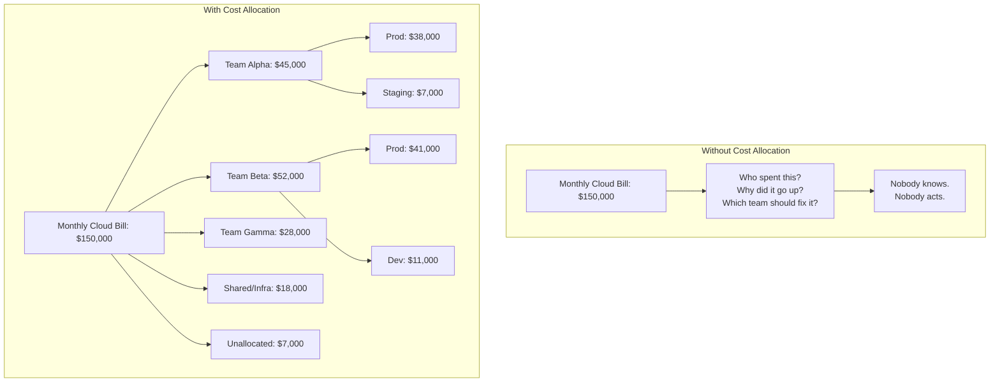
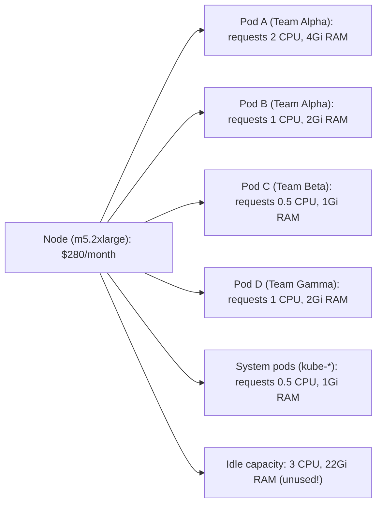

> **Certification Track** | Complexity: `[MEDIUM]` | Time: 50 minutes

## Overview

Module 1 gave you the "why" and "what" of FinOps. This module gives you the "how." You will learn the practical capabilities that FinOps practitioners use every day — from allocating costs to the right teams, to optimizing cloud rates, to understanding the anatomy of a cloud bill. The module closes with Kubernetes-specific FinOps, bridging the conceptual exam content with real-world platform engineering.

**What You'll Learn**:
- Cost allocation strategies: tagging, labeling, showback vs. chargeback
- Budgeting and forecasting techniques
- Rate optimization: reserved instances, savings plans, spot instances
- Workload optimization: right-sizing, scheduling, idle resource elimination
- Cloud billing anatomy: line items, blended rates, amortization
- Kubernetes-specific FinOps: namespace cost allocation and OpenCost

**Prerequisites**:
- [Module 1: FinOps Fundamentals](../module-1.1-finops-fundamentals/) — Principles, lifecycle, team structure
- Basic cloud familiarity (AWS/Azure/GCP concepts)
- For K8s section: Basic understanding of namespaces, pods, resource requests/limits

> **Exam Coverage**: This module covers **FinOps Capabilities (28%)** and **Terminology & Cloud Bill (10%)** — totaling **38%** of the FOCP exam.

---

## What You'll Be Able to Do

After completing this module, you will be able to:

1. **Implement** a cost allocation strategy using tags, labels, and shared-cost distribution models (showback vs. chargeback)
2. **Evaluate** rate optimization options (reserved instances, savings plans, spot/preemptible instances) and calculate break-even points
3. **Apply** right-sizing and scheduling techniques to eliminate idle compute and reduce Kubernetes workload costs using OpenCost
4. **Interpret** a cloud bill's line items, blended rates, and amortization to identify the top optimization opportunities

---

## Why This Module Matters

Knowing the 6 FinOps Principles is like knowing the rules of chess — necessary but not sufficient. To pass the exam and be useful in the real world, you need to understand the *capabilities* — the concrete practices that turn principles into action.

Cost allocation is the foundation of all FinOps work. If you cannot answer "who spent what, and on what?" then optimization is guesswork. Rate optimization can save 30-60% on committed workloads. Right-sizing can eliminate 40-70% of wasted compute. And understanding the cloud bill itself — the actual line items, amortization, and blended rates — separates FinOps practitioners from everyone else staring at a confusing invoice.

---

## Did You Know?

- The average organization has **less than 50% of cloud resources tagged** for cost allocation. This means more than half of cloud spending cannot be attributed to a team, project, or service. It is like running a business where half your expenses have no receipt.
- **Reserved instances** (1-year or 3-year commitments) save 30-60% compared to on-demand pricing, but **the FinOps Foundation reports** that organizations typically leave 15-25% of their reservations underutilized — paying for commitments they don't fully use.
- A single misconfigured auto-scaling group can cost more than an engineer's annual salary. One company accidentally left max-nodes set to 500 on a test cluster over a holiday weekend. Monday morning bill: **$48,000** for 2.5 days of compute nobody used.

---

> **Stop and think**: If your organization's cloud bill doubled last month, how would you determine which team or application was responsible for the spike?

## Cost Allocation

Cost allocation is the practice of mapping cloud spending to the teams, projects, services, and environments that generated it. It is the cornerstone of the Inform phase and the foundation for everything else in FinOps.

### Why Allocation Matters

Without allocation, the cloud bill is one giant number. Nobody owns it. Nobody can optimize what they cannot see. With allocation, every dollar has an owner, and that owner has the context and motivation to optimize.



### Tagging and Labeling

Tags (AWS/Azure) and labels (GCP/Kubernetes) are key-value pairs attached to cloud resources that enable cost allocation.

**Common tagging strategy**:

| Tag Key | Example Values | Purpose |
|---------|---------------|---------|
| `team` | alpha, beta, gamma | Who owns this resource? |
| `environment` | prod, staging, dev, test | What lifecycle stage? |
| `service` | payments, auth, search | What application? |
| `cost-center` | CC-1234, CC-5678 | Financial accounting code |
| `project` | phoenix, atlas | Business initiative |
| `managed-by` | terraform, helm, manual | How was it created? |

**Tagging best practices**:
- Define a **mandatory tag set** (e.g., team, environment, service are required)
- **Enforce tagging** through policy (deny resource creation without required tags)
- **Audit regularly** — tag compliance degrades over time without enforcement
- Use **consistent naming conventions** (lowercase, hyphens, no spaces)
- **Automate tagging** where possible (Terraform modules, Kubernetes admission webhooks)

### Showback vs. Chargeback

Once costs are allocated, you need a model for communicating them back to teams. There are two approaches:

**Showback**: Show teams what they spent, but do not charge their budget. This is informational — "here is what your team's cloud usage cost this month." No financial consequences.

**Chargeback**: Charge teams' budgets for their actual cloud usage. This creates direct financial accountability — if Team Alpha overspends, it comes out of Team Alpha's budget.

| Aspect | Showback | Chargeback |
|--------|----------|------------|
| Financial impact | None — informational only | Direct — charges to team budget |
| Accountability | Soft — "you should know" | Hard — "you are paying for this" |
| Complexity | Lower — approximate allocation is OK | Higher — needs accurate, auditable allocation |
| Culture | Educational, non-threatening | Can create friction if perceived as unfair |
| Best for | Organizations starting FinOps (Crawl/Walk) | Mature organizations (Walk/Run) |
| Risk | Teams may ignore reports | Teams may game the system to reduce charges |

> **Exam tip**: The exam often asks about the tradeoffs between showback and chargeback. The key insight: showback is easier to implement and less politically charged, but chargeback creates stronger incentives for optimization.

### Shared Costs

Not all costs map cleanly to one team. Shared infrastructure — Kubernetes control planes, networking, monitoring stacks, CI/CD systems — benefits everyone. There are three common approaches for handling shared costs:

1. **Proportional allocation**: Split shared costs based on each team's usage (e.g., Team Alpha uses 30% of cluster CPU, so they pay 30% of shared costs)
2. **Even split**: Divide shared costs equally among all teams
3. **Fixed overhead**: Charge a flat platform fee per team, regardless of usage

Most mature FinOps practices use proportional allocation for fairness, but even split is simpler to implement and often "good enough" for getting started.

---

> **Pause and predict**: How do you think forecasting for cloud computing differs from traditional on-premises data center budgeting?

## Budgeting and Forecasting

Budgeting and forecasting are Operate-phase activities that bring predictability to cloud spending.

### Budgeting

A cloud budget sets a spending target for a team, project, or the entire organization. Budgets answer: "How much should we spend?"

**Types of budgets**:
- **Fixed budget**: "Team Alpha gets $50,000/month." Simple but inflexible — does not account for growth.
- **Variable budget**: "Team Alpha gets $2.50 per 1,000 active users." Scales with the business but harder to predict.
- **Threshold-based**: "Spend up to $50,000 without approval; anything over requires VP sign-off." Combines flexibility with governance.

**Budget alerts**: Set alerts at multiple thresholds (50%, 75%, 90%, 100% of budget). Cloud providers offer native budget alerting (AWS Budgets, Azure Cost Management, GCP Billing Alerts).

### Forecasting

Forecasting predicts future cloud costs based on historical data, growth trends, and planned changes. It answers: "How much will we spend?"

**Forecasting approaches**:
- **Trend-based**: Extrapolate from the last 3-6 months of spending data. Simple but misses step-function changes (new product launch, migration).
- **Driver-based**: Model costs based on business drivers (users, transactions, data volume). More accurate but requires understanding cost-to-driver relationships.
- **Bottom-up**: Each team forecasts their own costs based on planned work. Most accurate but most effort.

**Common forecasting mistakes**:

| Mistake | Why It Happens | Better Approach |
|---------|---------------|-----------------|
| Linear extrapolation only | Easy to calculate | Combine with driver-based for step changes |
| Ignoring seasonality | Using short data windows | Use 12+ months of data to capture seasonal patterns |
| Not accounting for commitments | Forecasting on-demand only | Factor in RI/SP expirations and renewals |
| Single-point estimates | Overconfidence | Use ranges: best case, expected, worst case |

---

## Rate Optimization

Rate optimization reduces the *price* you pay for cloud resources without changing what you use. It is the closest thing to "free money" in FinOps.

### Reserved Instances (RIs)

A reserved instance is a commitment to use a specific instance type in a specific region for 1 or 3 years. In exchange, you get a significant discount.

| Pricing Model | Rate | Monthly Cost (m5.xlarge) | Savings vs. On-Demand |
|---------------|------|-------------------------|-----------------------|
| On-Demand (no commit) | $0.192/hour | $1,402/month | $0 (Base) |
| 1-Year RI | $0.120/hour | $876/month | $526/month (37%) |
| 3-Year RI | $0.075/hour | $548/month | $854/month (61%) |

**RI considerations**:
- **Utilization risk**: If the workload shrinks or is decommissioned, you still pay for the reservation
- **Flexibility**: Standard RIs are locked to instance type; Convertible RIs can be exchanged (at lower discount)
- **Payment options**: All upfront (biggest discount), partial upfront, or no upfront (smallest discount)
- **Break-even point**: The time it takes for savings to exceed the upfront cost. Calculate it as: `Upfront Cost / (On-Demand Monthly Cost - RI Monthly Cost)`. For example, an $8,760 upfront fee saving $526/month breaks even in 16.6 months.

### Savings Plans

Savings Plans (AWS) and Committed Use Discounts (GCP) offer flexibility over RIs. Instead of committing to a specific instance type, you commit to a dollar amount of compute per hour.

**Example**: "I commit to spending $10/hour on compute for 1 year." You get a discount on any compute that fills that commitment, regardless of instance type, region, or even service (EC2, Fargate, Lambda).

**Savings Plans vs. RIs**:

| Aspect | Reserved Instances | Savings Plans |
|--------|-------------------|---------------|
| Commitment | Specific instance type + region | Dollar amount of compute per hour |
| Flexibility | Low (Standard) / Medium (Convertible) | High — applies across instance types |
| Discount depth | Slightly higher | Slightly lower |
| Best for | Stable, predictable workloads | Diverse or evolving workloads |

### Spot Instances

Spot instances (AWS) / Preemptible VMs (GCP) / Spot VMs (Azure) use spare cloud capacity at 60-90% discount. The catch: the cloud provider can terminate them with 2 minutes notice.

**Good for spot**:
- Batch processing, data pipelines
- CI/CD build agents
- Stateless web workers (behind a load balancer)
- Development and testing environments
- Any workload designed to handle interruption

**Not good for spot**:
- Databases and stateful workloads
- Single-instance services with no redundancy
- Long-running jobs that cannot checkpoint

> **Exam tip**: The exam tests whether you understand the tradeoffs between on-demand, reserved, savings plans, and spot. The key: match the commitment level to the workload's stability and criticality.

---

## Workload Optimization

Rate optimization reduces the price per resource. Workload optimization reduces the *number and size* of resources you need.

### Right-Sizing

Right-sizing matches resource allocation to actual usage. Most cloud resources are oversized because engineers provision for peak load (or worse, for "just in case").

| Metric | Before Right-Sizing | After Right-Sizing |
|--------|---------------------|--------------------|
| Instance Type | m5.2xlarge | m5.large |
| Resources | 8 vCPU, 32 GB RAM | 2 vCPU, 8 GB RAM |
| Actual Peak Usage | 1.2 vCPU, 6.4 GB RAM | 1.2 vCPU, 6.4 GB RAM |
| Monthly Cost | $280.32 | $70.08 |

**Savings:** $210.24/month (75% reduction). Multiply by 50 similar instances to save $10,512/month.

**Right-sizing process**:
1. Collect usage metrics (CPU, memory, network, disk) over 14-30 days
2. Identify resources where peak utilization is below 40-50% of allocation
3. Recommend a smaller size that provides headroom above peak usage
4. Implement changes during maintenance windows
5. Monitor after resizing to confirm performance is acceptable

### Scheduling

Non-production environments often run 24/7 but are only used during business hours. Scheduling shuts them down during off-hours.

**Scenario**: Dev/staging environment with 10 instances.
- **Running 24/7**: 168 hours/week. Cost: $7,200/month.
- **Running 10h/day, 5d/wk**: 50 hours/week. Cost: $2,142/month.
- **Savings**: 70% of compute cost by shutting down during off-hours.

### Idle Resource Elimination

Idle resources are cloud resources that exist but serve no purpose. Common culprits:

| Idle Resource | How It Happens | Detection Method |
|---------------|---------------|------------------|
| Unattached EBS volumes | Instance terminated, volume remains | Filter for `available` state |
| Old snapshots | Backup snapshots never cleaned up | Age-based policies (>90 days) |
| Unused elastic IPs | Service moved, IP not released | Filter for unassociated IPs |
| Forgotten load balancers | No healthy targets registered | Check target group health |
| Orphaned databases | Dev DB from a project that ended | CPU utilization near 0% for 14+ days |
| Stale ECR images | Old container images accumulate | Lifecycle policies based on age/count |

> **Exam tip**: The exam often asks which optimization type (rate vs. workload) applies to a scenario. Reserved instances = rate optimization. Right-sizing = workload optimization. Scheduling = workload optimization. The distinction matters.

---

> **Stop and think**: What happens to your monthly cloud bill when you pay $10,000 upfront for a 1-year commitment? How should that cost be represented internally to prevent budgeting confusion?

## Cloud Billing Anatomy

Understanding a cloud bill is a core FOCP exam topic. Let's break down the key terms.

### Line Items

A cloud bill is composed of line items. Each line item represents a charge for a specific resource in a specific region for a specific time period.

**Example AWS line item**:
```
Account:        123456789012
Service:        Amazon EC2
Usage Type:     USEast1-BoxUsage:m5.xlarge
Operation:      RunInstances
Usage Amount:   744 hours
Unblended Cost: $142.85
```

### Key Billing Terms

| Term | Definition | Example |
|------|-----------|---------|
| **On-demand cost** | The list price with no discounts | $0.192/hour for m5.xlarge |
| **Unblended cost** | The actual charge per line item, before any amortization | $142.85 for 744 hours of m5.xlarge |
| **Blended rate** | Average rate across on-demand and discounted usage | If 50% is on-demand ($0.192) and 50% is RI ($0.120), blended = $0.156 |
| **Amortized cost** | Upfront RI/SP payments spread evenly across the commitment period | $8,760 upfront RI / 12 months = $730/month |
| **Net cost** | Cost after all discounts, credits, and amortization | The "real" cost to the business |
| **List price** | Published on-demand price before any negotiation | The sticker price |

### Understanding Amortization

When you buy a 1-year reserved instance with an upfront payment, you pay a lump sum on day one. But for budgeting and allocation purposes, you want to spread that cost evenly across 12 months.

**Scenario**: 1-Year RI purchase for $8,760 all-upfront on January 1.

**Without amortization**:
- January: $8,760 (huge spike!)
- Feb-Dec: $0 (looks free!)

**With amortization**:
- January: $730 (spread evenly)
- February: $730
- March: $730
- ...
- December: $730

Amortization gives you the true monthly cost.

### Data Transfer Costs

Data transfer is the hidden cost that surprises many organizations. Ingress (data in) is usually free. Egress (data out) is not.

**Common data transfer charges**:
- Cross-region traffic (e.g., us-east-1 to eu-west-1)
- Cross-AZ traffic (even within the same region)
- Internet egress (data leaving the cloud)
- VPN/Direct Connect bandwidth
- NAT Gateway processing charges

> **Exam tip**: The exam may ask about cost components. Remember that compute, storage, and data transfer are the three pillars of cloud cost. Most organizations focus on compute and storage, but data transfer can be 10-20% of the bill and is often overlooked.

---

> **Pause and predict**: Why can't you just use standard cloud provider tags to seamlessly allocate costs for multiple teams' applications running concurrently on a shared Kubernetes cluster?

## Kubernetes-Specific FinOps

Kubernetes adds a layer of complexity to FinOps because it *abstracts away* the underlying cloud resources. An EC2 instance might run 15 pods from 5 different teams. Whose cost is it?

### The Kubernetes Cost Problem



### Namespace-Based Cost Allocation

In Kubernetes, the namespace is the primary unit for cost allocation. Each team owns one or more namespaces, and costs are calculated based on resource requests within those namespaces.

**Cost allocation formula**:
```
Team's cost = (Team's resource requests / Total node resources) × Node cost
```

**Example**:
- Node cost: $280/month
- Node capacity: 8 CPU, 32 Gi RAM
- Team Alpha pods request: 3 CPU, 6 Gi RAM
- Team Alpha's cost: (3/8) × $280 = $105/month (CPU-based) or (6/32) × $280 = $52.50/month (RAM-based)

In practice, tools like OpenCost use a weighted average of CPU and RAM to calculate fair allocation.

### Kubernetes Resource Requests vs. Limits

Resource **requests** are what Kubernetes uses for scheduling and what FinOps tools use for cost allocation. Resource **limits** are the maximum a pod can use.

| Concept | Scheduling | Cost Allocation | Why It Matters for FinOps |
|---------|-----------|-----------------|--------------------------|
| Requests | Used by scheduler to place pods | Used to calculate team's share of node cost | Over-requesting = paying for unused capacity |
| Limits | Not used for scheduling | Not typically used for allocation | Setting limits too high wastes memory |
| Actual usage | N/A | Some tools offer usage-based allocation | Most accurate but complex |

**FinOps implication**: If a team requests 4 CPU but only uses 0.5 CPU, they are "paying for" 4 CPU in a request-based allocation model. This creates an incentive to right-size requests — which is exactly what FinOps wants.

### Labels for Cost Allocation

Kubernetes labels serve the same purpose as cloud tags for cost allocation:

```yaml
apiVersion: v1
kind: Pod
metadata:
  name: payment-service
  namespace: team-alpha
  labels:
    app: payments
    team: alpha
    environment: production
    cost-center: "CC-1234"
```

**Best practices for K8s cost labels**:
- Use a **consistent label schema** across all workloads
- Enforce labels with **admission webhooks** (OPA/Gatekeeper or Kyverno)
- Include at minimum: `team`, `environment`, `app`, `cost-center`
- Apply labels to namespaces for default cost allocation

### OpenCost Integration

OpenCost is the CNCF sandbox project for Kubernetes cost monitoring. It provides real-time cost allocation at the namespace, deployment, pod, and container level.

**What OpenCost provides**:
- Per-namespace cost breakdown (CPU, RAM, storage, network)
- Idle cost identification (unallocated cluster resources)
- Efficiency metrics (requested vs. actual usage)
- Cost by label (team, environment, service)
- Integration with Prometheus for historical data

**OpenCost cost model**:
```
Pod cost = (CPU requests × CPU cost/hour) + (RAM requests × RAM cost/hour)
           + (PV storage × storage cost/hour) + (network × network cost/GB)

Idle cost = Total node cost - Sum of all pod costs

Cluster efficiency = Sum of pod costs / Total node cost × 100%
```

> For hands-on OpenCost installation, dashboards, and right-sizing exercises, see our toolkit module: [Module 6.4: FinOps with OpenCost](/platform/toolkits/developer-experience/scaling-reliability/module-6.4-finops-opencost/)

### Kubernetes Optimization Strategies

| Strategy | What It Does | Savings Potential |
|----------|-------------|-------------------|
| Right-size requests | Match requests to actual usage | 40-70% compute reduction |
| Namespace quotas | Cap resource usage per team | Prevents runaway spending |
| LimitRanges | Set default/max resource limits | Prevents oversized pods |
| Cluster autoscaling | Scale nodes based on demand | Avoid paying for idle nodes |
| Spot node pools | Run fault-tolerant workloads on spot | 60-90% node cost reduction |
| Schedule non-prod | Shut down dev/test after hours | 50-70% non-prod savings |
| Pod Disruption Budgets | Enable safe spot/preemptible use | Supports spot adoption |
| VPA (Vertical Pod Autoscaler) | Auto-adjust resource requests | Continuous right-sizing |

---

## War Story: The Tag That Saved $400K

A Fortune 500 company migrated to Kubernetes on AWS (EKS) with 12 engineering teams and 300+ microservices. Their monthly cloud bill was $650,000 and growing. The FinOps team was asked to "find savings."

The first challenge: only 35% of resources had cost allocation tags. The Kubernetes layer was a complete black box — the AWS bill showed EC2 instances, but nobody knew which teams' pods ran on which instances.

Step 1 (Inform): They deployed OpenCost and enforced a mandatory label policy using Kyverno. Any pod without `team`, `environment`, and `service` labels was rejected by the admission webhook. Within two weeks, 95% of workloads were labeled.

Step 2 (Inform): They built a Grafana dashboard showing cost per team per environment. The results shocked everyone:

- Team Delta's "small test service" was requesting 24 CPU across 6 replicas — in the dev namespace. It had been load-testing a service that was decommissioned 4 months ago. Cost: $3,200/month.
- The staging environment was an exact replica of production (same node count, same instance types). Nobody had questioned this. Cost: $180,000/month — 28% of the entire bill.
- Three teams were running their own Prometheus instances (with 90-day retention each) instead of using the shared monitoring stack. Combined cost: $12,000/month.

Step 3 (Optimize): They right-sized the staging environment to 20% of production capacity (sufficient for integration testing). They killed the zombie load-test pods. They consolidated monitoring.

Step 4 (Operate): They established monthly cost reviews per team, budget alerts at 80% and 100%, and a quarterly RI purchasing process.

Result: Monthly bill dropped from $650,000 to $410,000 — a $240,000/month reduction ($2.88M/year). The single biggest win? The staging right-sizing, which came directly from making costs visible through namespace-level allocation. The tag that saved $400K was `environment: staging`.

---

## Common Mistakes

| Mistake | Why It Happens | Better Approach |
|---------|---------------|-----------------|
| Allocating by limits, not requests | Limits feel like "what you're using" | Requests determine scheduling and should drive allocation |
| Ignoring idle cluster cost | "Unallocated" seems like nobody's problem | Distribute idle cost proportionally or track separately |
| Tagging after the fact | "We'll tag resources later" | Enforce tagging at creation time with admission policies |
| Buying RIs without usage data | "3-year RI saves the most!" | Analyze 3+ months of usage before committing |
| Optimizing before understanding | Jumping to "buy spot instances!" | Start with Inform — understand where money goes first |
| Using on-demand for stable workloads | Default instance type, never changed | Stable 24/7 workloads should always use RIs or savings plans |

---

## Quiz

Test your understanding of FinOps capabilities and practices.

### Question 1
**Team Beta exceeded their cloud spend by $10,000 in March. In response, the Finance department generated a report showing the overage but did not deduct the $10,000 from Team Beta's Q2 operational budget. Which cost allocation model is the organization currently using?**

A) Chargeback
B) Showback
C) Proportional allocation
D) Fixed overhead

<details>
<summary>Show Answer</summary>

**B) Showback.**

Because Finance reported the overage (visibility) but did not deduct it from the team's operational budget (no financial consequence), they are using the showback model. In a showback model, the primary goal is to build awareness and influence behavior through visibility alone. If the finance department had actively deducted the funds from the team's accounts, it would be classified as chargeback. Showback is generally the recommended starting point for organizations building a FinOps culture, as it avoids immediate political friction while still delivering crucial cost insights.

</details>

### Question 2
**Your team is looking to reduce compute costs for several distinct workloads. You evaluate a production PostgreSQL database, a CI/CD build pipeline that runs test suites, a single-replica authentication service, and a highly critical etcd cluster for Kubernetes. Which of these is the BEST candidate for spot instances?**

A) A production PostgreSQL database
B) A CI/CD build pipeline that runs test suites
C) A single-replica authentication service
D) An etcd cluster for Kubernetes

<details>
<summary>Show Answer</summary>

**B) A CI/CD build pipeline that runs test suites.**

CI/CD builds are stateless, fault-tolerant, and can be easily restarted if interrupted — making them the ideal workload for spot instances. Conversely, databases, single-replica services, and etcd clusters cannot tolerate sudden termination. Spot instances can be reclaimed by the cloud provider with only a two-minute warning. Therefore, any stateful or critical path workload placed on them risks immediate and potentially catastrophic disruption.

</details>

### Question 3
**An organization pays $8,760 upfront for a 1-year reserved instance on January 1. To accurately represent this cost in internal financial planning, what is the amortized monthly cost?**

A) $8,760 in January, $0 for the rest of the year
B) $730/month for 12 months
C) $2,190/quarter
D) It depends on usage

<details>
<summary>Show Answer</summary>

**B) $730/month for 12 months.**

Amortization spreads the upfront payment evenly across the commitment period: $8,760 / 12 = $730/month. This accounting practice gives a true picture of the monthly cost of the resource over its useful life. Without amortization, the January bill would show a massive spike, while the remaining eleven months would artificially appear free. By distributing the cost, teams can accurately forecast their ongoing run rate and compare it against their monthly budget.

</details>

### Question 4
**Team Alpha's namespace has pods with resource requests totaling 10 CPU and limits totaling 20 CPU. Over the past week, they actively utilized an average of 2 CPU. In a standard OpenCost setup, what CPU value is used to calculate their financial portion of the cluster cost?**

A) 2 CPU (actual usage)
B) 10 CPU (requests)
C) 20 CPU (limits)
D) It depends on the node's total capacity

<details>
<summary>Show Answer</summary>

**B) 10 CPU (requests).**

Resource requests are what FinOps tools like OpenCost use as the primary basis for cost allocation, as they represent the guaranteed resources reserved on the node by the Kubernetes scheduler. Even if the actual usage is only 2 CPU, the scheduler cannot allocate the remaining 8 requested CPUs to other workloads. Therefore, the team is financially responsible for the capacity they have locked up. This request-based allocation model creates a natural financial incentive for engineering teams to right-size their manifests.

</details>

### Question 5
**Your finance team notices that yesterday, the cost for m5.xlarge instances was $0.192/hour, but today the bill shows a rate of $0.156/hour for the exact same instances. The engineering team confirms no instances were terminated or migrated. What is the most likely operational reason for this change?**

A) The instances were moved to a cheaper availability zone
B) A Reserved Instance purchase was applied, creating a new blended rate across on-demand and discounted usage
C) The cloud provider dynamically reduced the list price based on market demand
D) The instances were automatically converted to Spot instances

<details>
<summary>Show Answer</summary>

**B) A Reserved Instance purchase was applied, creating a new blended rate across on-demand and discounted usage.**

A blended rate averages the different rates an organization pays across all its usage. If a team buys a Reserved Instance at $0.120/hr, it mathematically blends with the $0.192/hr on-demand usage to produce an average effective rate, such as $0.156/hr. This rate change appears transparently on the bill without any underlying changes to the technical infrastructure or instance placement. It simply reflects the financial smoothing of commitments applied across the payer account.

</details>

### Question 6
**Your core application cannot be scheduled down during off-hours, and its CPU usage is already perfectly right-sized to its workload requirements. However, the CTO still mandates a 20% cost reduction by next month. Which optimization approach is still viable in this scenario?**

A) Implementing stronger Kubernetes resource limits
B) Deleting unattached EBS volumes
C) Purchasing Savings Plans for the workload
D) Moving the database to preemptible nodes

<details>
<summary>Show Answer</summary>

**C) Purchasing Savings Plans for the workload.**

Since workload optimization techniques like right-sizing and scheduling are already maximized, and the workload cannot tolerate interruption, the remaining option is rate optimization. Savings plans reduce the price per unit of compute without requiring any changes to usage patterns or application architecture. Unlike spot instances, they do not introduce the risk of sudden termination, making them perfectly suited for stable, always-on workloads. By committing to a specific dollar amount of compute per hour, the organization secures a discount while satisfying the cost reduction mandate safely.

</details>

### Question 7
**A team requests 4 CPU for a pod, but its actual usage averages just 0.5 CPU over the month. In a strict request-based cost allocation model, how much CPU capacity is the team billed for?**

A) 0.5 CPU
B) 4 CPU
C) 2.25 CPU (average of request and usage)
D) 0 CPU (usage is below the request threshold)

<details>
<summary>Show Answer</summary>

**B) 4 CPU.**

In a request-based allocation model, cost is calculated based on what the workload requested from the cluster, not what it actually consumed. The team effectively "owns" 4 CPU worth of node capacity because the Kubernetes scheduler sets this space aside and completely prevents other pods from scheduling onto it. Consequently, the team is billed for the full 4 CPU to reflect the opportunity cost of that reserved hardware. This mechanism creates a direct financial incentive for developers to accurately tune and right-size their resource requests.

</details>

### Question 8
**Team Gamma deployed two critical microservices in the `us-east-1` region. Service A is placed in `us-east-1a` and Service B is placed in `us-east-1b`. They heavily communicate, exchanging 5TB of data daily. Next month, their cloud bill jumps unexpectedly. What architectural choice caused this spike?**

A) The data crossed availability zones, which incurs hidden transfer fees even within the same region
B) Storage costs ballooned because intra-region transfer requires intermediate EBS staging
C) Network requests automatically converted to premium Tier 1 routing
D) Ingress traffic into Service B was billed at external internet rates

<details>
<summary>Show Answer</summary>

**A) The data crossed availability zones, which incurs hidden transfer fees even within the same region.**

Data transfer between Availability Zones is charged by most cloud providers (typically around $0.01/GB each way). This cost is frequently overlooked by engineering teams because they incorrectly assume that all traffic within the same geographic region is completely free. When microservices in different AZs communicate heavily, these small per-gigabyte fees can compound rapidly into massive billing surprises. To mitigate this, teams can either optimize the chattiness of the services or explore topology-aware routing to keep traffic within a single AZ.

</details>

### Question 9
**CloudCorp anticipates migrating 50% of its workloads from traditional EC2 instances to serverless AWS Fargate over the next 12 months. Which rate optimization vehicle should they choose for their baseline compute to ensure they do not waste money during the transition?**

A) Standard Reserved Instances, to maximize the discount on the remaining EC2 footprint
B) Savings Plans, because the dollar-based commitment applies across both EC2 and Fargate automatically
C) Spot Instances, because serverless migrations require interruption-tolerant nodes
D) Convertible Reserved Instances, because they can be traded directly for serverless credits

<details>
<summary>Show Answer</summary>

**B) Savings Plans, because the dollar-based commitment applies across both EC2 and Fargate automatically.**

Savings Plans commit the organization to a dollar amount of compute per hour, rather than specific virtual machine configurations. This offers unparalleled flexibility across instance families, regions, and entirely different compute services like AWS Fargate or AWS Lambda. In contrast, standard Reserved Instances would lock CloudCorp into specific EC2 types, which would quickly become stranded and wasted as workloads migrate to serverless. By choosing a Compute Savings Plan, the discount naturally floats to cover the new Fargate usage without requiring any manual exchange.

</details>

### Question 10
**An organization has successfully tagged 40% of its resources, distributes cost showback reports monthly, and occasionally performs manual right-sizing exercises based on quarterly reviews. What FinOps maturity level are they currently operating at?**

A) Crawl
B) Walk
C) Run
D) Pre-Crawl

<details>
<summary>Show Answer</summary>

**A) Crawl.**

With only 40% tagging coverage, monthly showback cycles, and primarily manual optimization efforts, this organization is firmly at the Crawl maturity level. A Walk maturity phase would require significantly higher tagging coverage (usually 70% or more), more frequent internal reviews, and the beginning of automated optimization workflows. Reaching the Run phase demands near-complete tagging compliance, a mature chargeback model that affects team budgets, and extensive automation for continuous right-sizing. Recognizing this current state allows the organization to focus on foundational improvements rather than attempting complex automation prematurely.

</details>

---

## Hands-On Exercise: Cloud Cost Analysis

This exercise is conceptual — no cluster required. It tests your ability to apply FinOps practices to a realistic scenario.

### Scenario

You are a new FinOps practitioner at CloudCorp. Here is the current situation:

**Monthly cloud bill**: $120,000
**Cloud provider**: AWS
**Teams**: 4 engineering teams, 1 data team, 1 platform team
**Kubernetes**: EKS cluster with 25 nodes (m5.xlarge, on-demand)
**Tagging coverage**: 30%
**Current cost visibility**: One AWS account, no cost breakdown by team

### Your Task

Work through the FinOps lifecycle for CloudCorp. Write down your answers before checking the solution.

**Step 1 (Inform)**: What are the first 3 actions you would take to create cost visibility?

<details>
<summary>Show Answer</summary>

1. **Implement a mandatory tagging policy** — Define critical required tags (such as team, environment, service, and cost-center) and systematically enforce them via cloud policies and Kubernetes admission webhooks (like Kyverno). This sets the baseline foundation for all cost attribution, aiming for 80%+ coverage rapidly.
2. **Deploy OpenCost on the EKS cluster** — Achieve immediate namespace-level cost visibility for the Kubernetes workloads, which likely represent the bulk of the underlying compute costs on the bill.
3. **Build a centralized cost dashboard** — Create a dynamic dashboard displaying cost broken down by team, environment, and service, and share it transparently with all engineering leads to establish baseline awareness and drive the right conversations.

</details>

**Step 2 (Optimize)**: The 25 EKS nodes are all m5.xlarge on-demand at $0.192/hour. Average cluster CPU utilization is 35%. What optimizations would you recommend?

<details>
<summary>Show Answer</summary>

1. **Right-size the cluster footprint** — At just 35% average utilization, the cluster is significantly over-provisioned. Enabling a modern autoscaler like Karpenter will dynamically scale nodes down based on actual pending pod requests.
2. **Purchase Compute Savings Plans** — For the baseline compute that consistently runs 24/7, purchasing a 1-year Compute Savings Plan will slash the hourly rate for that committed capacity without sacrificing architectural flexibility.
3. **Introduce spot node pools** — For highly fault-tolerant workloads such as batch jobs and stateless replicas, creating a dedicated spot node pool can instantly achieve deep infrastructure discounts.
4. **Schedule non-production namespaces** — Implement automated shutdown schedules for development and staging environments outside of regular business hours, heavily reducing wasted off-peak spending.

</details>

**Step 3 (Operate)**: What governance processes would you establish to sustain these improvements?

<details>
<summary>Show Answer</summary>

1. **Institute weekly cost reviews** — Schedule a brief 30-minute meeting with team leads to review cost dashboards, track anomalies, and mutually identify optimization opportunities.
2. **Configure proactive budget alerts** — Set up automated alerts triggered at 80% and 100% of each respective team's monthly budget to catch overspending before the invoice drops.
3. **Run tagging compliance audits** — Generate a monthly report on tagging coverage by team, actively flagging any team that falls below the 80% compliance threshold.
4. **Execute quarterly reservation reviews** — Routinely review existing commitment utilization and strategically purchase additional reservations for newly stabilized workloads.
5. **Enable cloud anomaly detection** — Configure intelligent anomaly detection to instantly alert the FinOps Slack channel when any specific service's daily cost drastically exceeds its historical baseline.

</details>

### Success Criteria

You have completed this exercise successfully if you:
- [ ] Identified Inform actions that create visibility before optimizing
- [ ] Recommended rate AND workload optimizations (not just one type)
- [ ] Included governance processes that make FinOps sustainable
- [ ] Connected recommendations to specific FinOps principles and lifecycle phases

---

## Summary

FinOps capabilities turn principles into practice. The key skills tested on the FOCP exam:

**Cost Allocation**: Tags/labels map costs to owners. Showback educates; chargeback creates accountability. Shared costs need a fair distribution model.

**Rate Optimization**: Reserved instances (30-60% savings), savings plans (flexible commitments), and spot instances (60-90% savings for fault-tolerant workloads).

**Workload Optimization**: Right-sizing (match requests to usage), scheduling (shut down non-prod after hours), and idle resource elimination (find and kill zombies).

**Cloud Billing**: Understand line items, blended rates, amortized costs, and data transfer charges. These terms appear directly on the exam.

**Kubernetes FinOps**: Namespace-based allocation using resource requests, label policies enforced by admission webhooks, and OpenCost for real-time cost visibility.

---

## Next Steps

You have completed the FOCP curriculum modules. To continue your learning:

- **Hands-on practice**: Work through [Module 6.4: FinOps with OpenCost](/platform/toolkits/developer-experience/scaling-reliability/module-6.4-finops-opencost/) for practical Kubernetes cost monitoring
- **Review Module 1**: Re-take the [Module 1 quiz](../module-1.1-finops-fundamentals/#quiz) to confirm you know the 6 principles and lifecycle phases cold
- **Official resources**: Visit [finops.org](https://www.finops.org/) for the FinOps Foundation's free training materials
- **Take the exam**: Register at [training.linuxfoundation.org](https://training.linuxfoundation.org/)