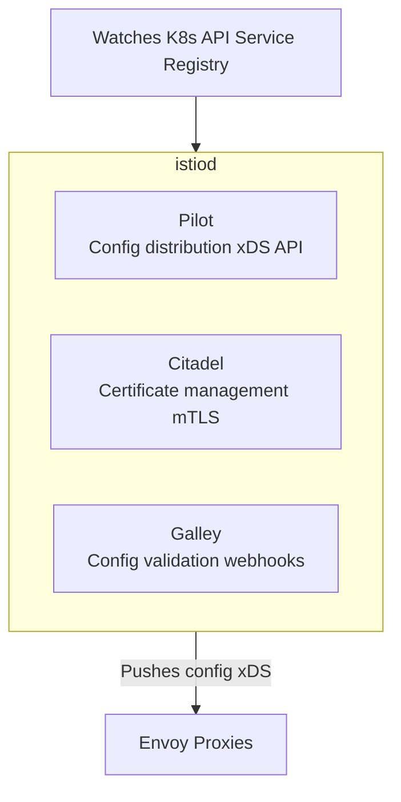
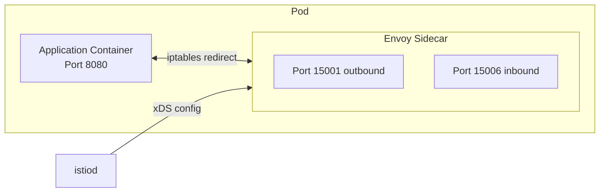
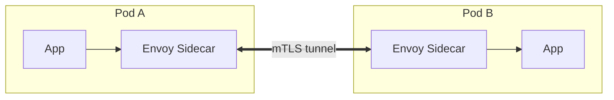
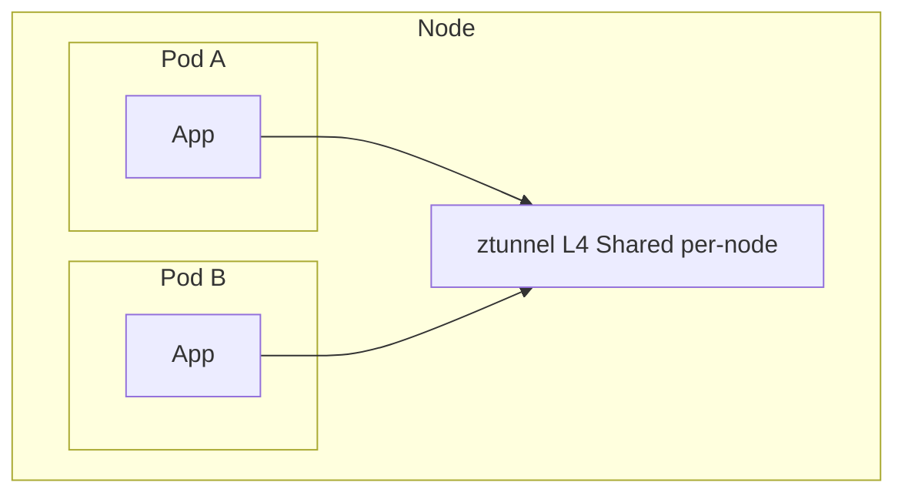
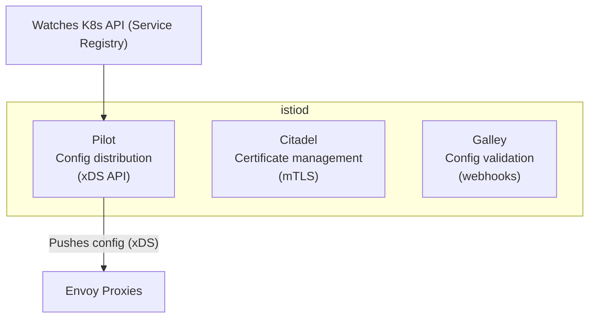
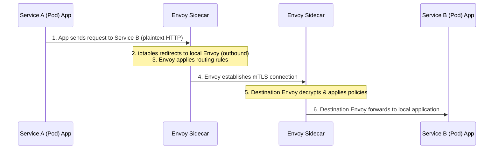
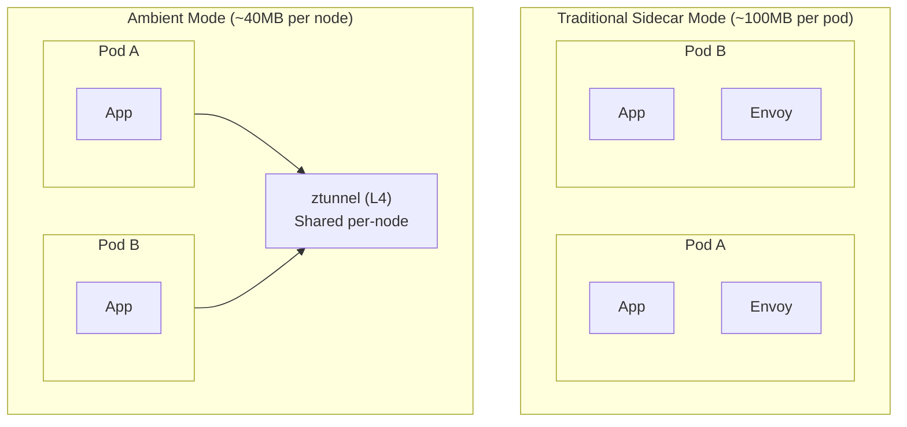

## Complexity: `[MEDIUM]`
## Time to Complete: 50-60 minutes

## Prerequisites

Before diving into the foundational concepts of the Istio service mesh, you must ensure that you have a solid grasp of underlying Kubernetes primitives. We strongly recommend that you have completed the following prerequisite modules:
- [CKA Part 3: Services & Networking](/k8s/cka/part3-services-networking/) — This provides the crucial Kubernetes networking fundamentals, including how Services, Endpoints, and basic DNS operate within the cluster.
- [Service Mesh Concepts](/platform/toolkits/infrastructure-networking/networking/module-5.2-service-mesh/) — This module explains the historical context and the exact reasons why a service mesh exists, detailing the transition from monolithic applications to distributed microservices.
- A foundational understanding of network proxies (like NGINX, HAProxy, or Envoy) and Transport Layer Security (TLS/mTLS) mechanisms.

## What You'll Be Able to Do

After thoroughly studying this module and completing the hands-on laboratories, you will be able to:

1. **Implement** an Istio control plane using multiple deployment strategies—including `istioctl`, Helm charts, and the Istio Operator—while evaluating the correct installation profile for diverse deployment environments.
2. **Design** sidecar injection strategies across namespaces, comparing the operational benefits of automatic versus manual injection, and diagnose pods that fail to receive an Envoy proxy.
3. **Analyze** Istio's control plane architecture (istiod, Pilot, Citadel, Galley) and explain how configuration flows from CRDs to Envoy proxies via the xDS API.
4. **Debug** critical installation failures and cross-cluster mesh connectivity issues using advanced troubleshooting commands such as `istioctl analyze`, `istioctl proxy-status`, and by interpreting control plane logs.

## Why This Module Matters

The concepts covered in Installation and Architecture constitute roughly **20% of the ICA exam**. You will be rigorously tested on your ability to install Istio using various methodologies, your understanding of when and why to use specific installation profiles, your capability to configure robust sidecar injection, and your proficiency in troubleshooting initial installation errors.

However, the importance of this module extends far beyond passing a certification exam. Understanding Istio's foundational architecture allows you to reason about *why* things break in a distributed microservices environment. When a VirtualService fails to route traffic correctly (which we cover extensively in Module 2) or when mutual TLS handshakes fail silently (covered in Module 3), the root cause is almost always deeply tied to the architecture. It might be a missing sidecar proxy, a misconfigured istiod instance lacking necessary permissions, or a control plane that is fundamentally unable to push configuration updates to the data plane proxies.

Consider a massive real-world incident from 2020: A leading global e-commerce platform experienced a catastrophic four-hour outage during their peak holiday sale, resulting in an estimated $14 million in lost revenue. The root cause was entirely architectural. The platform engineering team had deployed Istio using a permissive, resource-heavy testing profile directly into their production clusters. Under extreme load, the control plane consumed all available memory on the infrastructure nodes, causing the core components to crash. Simultaneously, because strict security policies were not properly enforced at the architectural level, cross-service communication degraded into a chaotic, untraceable mix of encrypted and plaintext traffic. 

> **The Hospital Analogy**
>
> Think of Istio like a hospital's nervous system. istiod is the brain — it makes decisions about routing, security, and policy. Envoy sidecars are the nerve endings in every organ (pod) — they execute those decisions locally. If the brain goes down, the nerve endings keep working with their last instructions. If a nerve ending is missing (no sidecar), that organ operates blind.

## What You'll Learn

By the time you finish reading this material and executing the labs, you will have mastered how to:
- Install Istio securely using `istioctl`, Helm, and the IstioOperator CRD.
- Choose the correct, production-ready installation profile for your specific use case.
- Configure automatic and manual sidecar injection using labels and annotations.
- Understand Istio's monolithic control plane architecture and its internal sub-components.
- Upgrade Istio safely using advanced canary deployment and in-place upgrade methodologies.
- Explain the mechanics of Ambient mode, Istio's sidecar-less data plane architecture, and when to adopt it.

## Did You Know?

- **Istio was originally three components**: Pilot (configuration), Mixer (telemetry), and Citadel (security). In Istio 1.5+ they were merged into a single binary called `istiod`. This reduced resource usage by 50% and simplified operations dramatically.
- **Every Envoy sidecar uses ~50-100MB of memory**: In a cluster with 1,000 pods, that's 50-100GB just for proxies. This massive resource footprint is exactly why Ambient mode (the sidecar-less architecture) was developed—it moves heavy proxy functions to shared, per-node ztunnels.
- **Istio's adoption outpaces all other service meshes combined**: According to the CNCF Annual Survey, Istio has >50% market share among service mesh users, and it was the first service mesh to officially graduate from the CNCF (July 2023).
- **Ambient mode relies on a purpose-built Rust proxy**: While the traditional sidecar data plane relies heavily on C++ based Envoy proxies, the new Ambient mode utilizes a highly optimized, memory-safe Rust binary called ztunnel, which operates at OSI Layer 4 and drastically reduces node-level overhead.

## War Story: The Profile That Ate Production

**Characters:**
- Alex: A highly capable DevOps engineer (3 years experience).
- Team: A squad of 5 engineers responsible for running 30 critical microservices.

**The Incident:**

Alex had been running the Istio service mesh in their development environment for months using the seemingly harmless command `istioctl install --set profile=demo`. In the development cluster, everything worked beautifully. The team had access to stunning Kiali dashboards, distributed Jaeger traces, and comprehensive Grafana metrics out of the box. 

On deployment day, assuming parity between environments, Alex ran the exact same command on the production cluster.

Three hours later, the billing and finance team reported an emergency: their monthly cloud infrastructure invoice showed a massive 40% sudden spike in compute costs. The `demo` profile intentionally deploys all optional components with extremely generous resource allocations to ensure they don't crash during demonstrations. Tools like Kiali, Jaeger, and Grafana were each consuming upwards of 2GB of RAM across 3 replicas that were completely unnecessary for their traffic load.

But the real, devastating problem came a week later during a routine compliance check. The `demo` profile is intentionally configured to set a permissive mTLS mode—meaning that services will happily accept both encrypted and unencrypted traffic. Alex had mistakenly assumed that mTLS was strictly enforced by default. The security audit found raw, plaintext traffic flowing seamlessly between sensitive payment processing microservices.

**The Fix:**

```bash
# What Alex should have done for production:
istioctl install --set profile=default

# Then explicitly set STRICT mTLS:
kubectl apply -f - <<EOF
apiVersion: security.istio.io/v1
kind: PeerAuthentication
metadata:
  name: default
  namespace: istio-system
spec:
  mtls:
    mode: STRICT
EOF
```

**Lesson**: Profiles are not simply "t-shirt sizes"—they are fundamental configuration baselines with massive security and performance implications. You must always use the `default` or `minimal` profile in production environments and explicitly enable only the features your workload requires.

> **Pause and predict**: If you disable sidecar injection on a pod that needs to communicate with a strictly authenticated service in the mesh, what HTTP status code will the client ultimately receive when making a request? (Hint: Think about who is responsible for terminating the mutual TLS connection).

---

## Section One: Istio Architecture

### The Control Plane: istiod

Istio's control plane is the centralized brain of the service mesh. Historically, this brain was split into multiple moving parts, but modern versions utilize a single, consolidated binary called `istiod`. This component runs as a standard Kubernetes Deployment within the `istio-system` namespace. 

Here is a visual representation of the control plane architecture mapped using a Mermaid flowchart:



For historical tracking, here is the raw architectural view of how the control plane coordinates:

```text
┌─────────────────────────────────────────────────────────┐
│                        istiod                            │
│                                                          │
│  ┌─────────────┐  ┌─────────────┐  ┌─────────────────┐ │
│  │   Pilot      │  │  Citadel    │  │   Galley        │ │
│  │             │  │             │  │                 │ │
│  │  Config     │  │  Certificate│  │  Config         │ │
│  │  distribution│  │  management │  │  validation     │ │
│  │  (xDS API)  │  │  (mTLS)     │  │  (webhooks)     │ │
│  └─────────────┘  └─────────────┘  └─────────────────┘ │
│                                                          │
│           Watches K8s API ◄──── Service Registry         │
│           Pushes config  ────► Envoy Proxies (xDS)       │
└─────────────────────────────────────────────────────────┘
```

**What each internal logical component does:**

| Component | Responsibility | How It Works |
|-----------|---------------|--------------|
| **Pilot** | Service discovery & traffic config | Watches K8s Services, converts to Envoy config, pushes via xDS API |
| **Citadel** | Certificate authority | Issues SPIFFE certs to each proxy, rotates automatically |
| **Galley** | Config validation | Validates Istio resources via admission webhooks |

Pilot is arguably the most critical component. It continuously watches the Kubernetes API Server for changes to Services, Endpoints, and Istio-specific CRDs (like VirtualServices and DestinationRules). It then translates these high-level declarative rules into Envoy's low-level xDS protocol and streams those updates to the data plane over gRPC.

### The Data Plane: Envoy Proxies

The data plane is where the actual traffic flows and where policies are physically enforced. In the traditional Istio architecture, every single pod in the service mesh receives an Envoy proxy container. This is injected seamlessly alongside the primary application container. This proxy, known as a sidecar, intercepts absolutely all inbound and outbound network traffic entering or leaving the pod.

Visualizing the data plane injection:



Here is exactly how the network topology maps to the pod namespace:

```text
┌─────────────── Pod ──────────────────┐
│                                       │
│  ┌──────────────┐  ┌──────────────┐  │
│  │  Application  │  │  Envoy       │  │
│  │  Container    │  │  Sidecar     │  │
│  │              │  │              │  │
│  │  Port 8080   │◄─┤  Port 15001  │  │
│  │              │  │  (outbound)  │  │
│  │              │  │  Port 15006  │  │
│  │              │  │  (inbound)   │  │
│  └──────────────┘  └──────┬───────┘  │
│                           │          │
│         iptables rules redirect      │
│         all traffic through Envoy    │
└───────────────────────────┬──────────┘
                            │
                    xDS config from istiod
```

The interception mechanism relies heavily on Linux `iptables`. When the sidecar is injected, an `istio-init` container runs first, executing under elevated privileges to configure the pod's network namespace. It writes complex `iptables` rules that force all outgoing traffic to hit Envoy on port 15001, and all incoming traffic to hit Envoy on port 15006. The application container remains completely unaware of this interception, believing it is communicating directly with the network.

**Key Envoy ports you must memorize for debugging:**

| Port | Purpose |
|------|---------|
| 15001 | Outbound traffic listener |
| 15006 | Inbound traffic listener |
| 15010 | xDS (plaintext, istiod) |
| 15012 | xDS (mTLS, istiod) |
| 15014 | Control plane metrics |
| 15020 | Health checks |
| 15021 | Health check endpoint |
| 15090 | Envoy Prometheus metrics |

### How Traffic Flows

Understanding the exact sequence of events when one microservice talks to another is crucial for debugging. Let's trace a standard HTTP request from Service A to Service B.



Textual representation of the end-to-end packet journey:

```text
Service A (Pod)                              Service B (Pod)
┌────────────────────┐                      ┌────────────────────┐
│ App ──► Envoy ─────┼──── mTLS tunnel ────►┼── Envoy ──► App   │
│         Sidecar     │                      │   Sidecar          │
└────────────────────┘                      └────────────────────┘

1. App sends request to Service B (thinks it's plaintext HTTP)
2. iptables redirects to local Envoy sidecar (outbound)
3. Envoy applies routing rules (VirtualService, DestinationRule)
4. Envoy establishes mTLS connection to destination Envoy
5. Destination Envoy decrypts, applies inbound policies
6. Destination Envoy forwards to local application
```

In Step 4, Envoy establishes a mutual TLS (mTLS) connection dynamically. This provides robust encryption in transit, but importantly, it also provides unforgeable cryptographic identity. Service B's Envoy proxy can cryptographically verify that the request truly came from Service A via SPIFFE IDs, allowing you to enforce zero-trust network policies seamlessly.

> **Stop and think**: Why might a highly regulated organization prefer using Helm charts for Istio installation over the much simpler istioctl CLI tool? Consider a large enterprise with strict GitOps policies, mandatory peer reviews, and immutable infrastructure requirements.

---

## Section Two: Installation Methods

### Installing with istioctl (Recommended for Exam)

The `istioctl` binary is Istio's official command-line utility. It is by far the fastest way to install the service mesh and is the absolute most critical method to master for the ICA exam, where time is strictly limited.

```bash
# Download istioctl
curl -L https://istio.io/downloadIstio | sh -
cd istio-1.22.0
export PATH=$PWD/bin:$PATH

# Install with default profile
istioctl install --set profile=default -y

# Verify installation
istioctl verify-install
```

**What `istioctl install` actually does under the hood:**
1. It reads the selected profile and generates the raw Kubernetes YAML manifests locally.
2. It validates the current cluster environment against Istio's prerequisites.
3. It applies the manifests to the Kubernetes cluster API in the correct dependency order.
4. It actively waits for the control plane components to become healthy and ready.
5. It reports success or explicitly flags errors directly to the terminal output.

### Installation Profiles

Profiles are pre-configured, carefully curated sets of components and configuration values. Choosing the wrong profile can severely impact your cluster's stability. **You must know these intimately for the exam:**

| Profile | istiod | Ingress GW | Egress GW | Use Case |
|---------|--------|-----------|----------|----------|
| `default` | Yes | Yes | No | **Production** |
| `demo` | Yes | Yes | Yes | Learning/testing |
| `minimal` | Yes | No | No | Control plane only |
| `remote` | No | No | No | Multi-cluster remote |
| `empty` | No | No | No | Custom build |
| `ambient` | Yes | Yes | No | Ambient mode (no sidecars) |

You can interactively inspect and compare these profiles using `istioctl`:

```bash
# See what a profile installs (without applying)
istioctl profile dump default

# Compare profiles
istioctl profile diff default demo

# Install with specific profile
istioctl install --set profile=demo -y

# Install with customizations
istioctl install --set profile=default \
  --set meshConfig.accessLogFile=/dev/stdout \
  --set values.global.proxy.resources.requests.memory=128Mi \
  -y
```

**Profile component comparison overview:**

```text
                    default    demo    minimal   ambient
                    ───────    ────    ───────   ───────
istiod              ✓          ✓       ✓         ✓
istio-ingressgateway ✓         ✓       ✗         ✓
istio-egressgateway  ✗         ✓       ✗         ✗
ztunnel              ✗         ✗       ✗         ✓
istio-cni            ✗         ✗       ✗         ✓
```

### Installing with Helm

While `istioctl` is exceptional for fast, imperative operations and exam environments, large enterprises often rely on Helm. Helm allows infrastructure teams to store values files securely in source control, providing an immutable history of configuration changes and integrating flawlessly with GitOps tools like ArgoCD or Flux.

```bash
# Add Istio Helm repo
helm repo add istio https://istio-release.storage.googleapis.com/charts
helm repo update

# Install in order: base → istiod → gateway
# Step 1: CRDs and cluster-wide resources
helm install istio-base istio/base -n istio-system --create-namespace

# Step 2: Control plane
helm install istiod istio/istiod -n istio-system --wait

# Step 3: Ingress gateway (optional)
kubectl create namespace istio-ingress
helm install istio-ingress istio/gateway -n istio-ingress

# Verify
kubectl get pods -n istio-system
kubectl get pods -n istio-ingress
```

**When to use Helm versus istioctl:**

| Scenario | Method |
|----------|--------|
| ICA exam | `istioctl` (fastest) |
| GitOps / ArgoCD | Helm charts |
| Custom operator pattern | IstioOperator CRD |
| Quick testing | `istioctl` |

### IstioOperator CRD

The IstioOperator custom resource allows you to declaratively manage the Istio control plane configuration. An in-cluster operator controller continuously watches for these specific resources and automatically reconciles the cluster state.

```text
# istio-operator.yaml
apiVersion: install.istio.io/v1alpha1
kind: IstioOperator
metadata:
  name: istio-control-plane
  namespace: istio-system
spec:
  profile: default
  meshConfig:
    accessLogFile: /dev/stdout
    enableTracing: true
    defaultConfig:
      tracing:
        zipkin:
          address: zipkin.istio-system:9411
  components:
    ingressGateways:
    - name: istio-ingressgateway
      enabled: true
      k8s:
        resources:
          requests:
            cpu: 200m
            memory: 256Mi
    egressGateways:
    - name: istio-egressgateway
      enabled: false
  values:
    global:
      proxy:
        resources:
          requests:
            cpu: 100m
            memory: 128Mi
          limits:
            cpu: 500m
            memory: 256Mi
```

You can apply this configuration directly via the CLI:

```bash
# Apply with istioctl
istioctl install -f istio-operator.yaml -y

# Or install the operator and apply the CR
istioctl operator init
kubectl apply -f istio-operator.yaml
```

---

## Section Three: Sidecar Injection

### Automatic Sidecar Injection

Automatic injection is the industry standard approach for adding proxies to workloads. By simply labeling a Kubernetes namespace, you instruct the cluster's MutatingAdmissionWebhook to automatically attach sidecars to all newly created pods within that boundary.

```bash
# Enable automatic injection for a namespace
kubectl label namespace default istio-injection=enabled

# Verify the label
kubectl get namespace default --show-labels

# Deploy an app — sidecar is injected automatically
kubectl run nginx --image=nginx -n default
kubectl get pod nginx -o jsonpath='{.spec.containers[*].name}'
# Output: nginx istio-proxy

# Disable injection for a specific pod (opt-out)
kubectl run skip-mesh --image=nginx \
  --overrides='{"metadata":{"annotations":{"sidecar.istio.io/inject":"false"}}}'
```

**How the automated system actually works behind the scenes:**

```text
1. Namespace has label: istio-injection=enabled
2. Pod is created
3. K8s API server calls istiod's MutatingWebhook
4. istiod injects istio-init (iptables setup) + istio-proxy (Envoy) containers
5. Pod starts with sidecar
```

### Manual Sidecar Injection

In highly restricted environments where you cannot modify namespace labels, or when you need extreme, surgical control over which specific deployments receive a proxy, manual injection acts as your fallback mechanism.

```bash
# Inject sidecar into a deployment YAML
istioctl kube-inject -f deployment.yaml | kubectl apply -f -

# Inject into an existing deployment
kubectl get deployment myapp -o yaml | istioctl kube-inject -f - | kubectl apply -f -

# Check injection status
istioctl analyze -n default
```

### Controlling Injection

You can assert granular control over injection behaviors using pod-level annotations. This allows developers to explicitly bypass namespace-level policies without requiring cluster administrator intervention.

```text
# Per-pod annotation to disable injection
apiVersion: v1
kind: Pod
metadata:
  annotations:
    sidecar.istio.io/inject: "false"
spec:
  containers:
  - name: app
    image: myapp:latest
---
# Per-pod annotation to enable injection (even without namespace label)
apiVersion: v1
kind: Pod
metadata:
  annotations:
    sidecar.istio.io/inject: "true"
  labels:
    sidecar.istio.io/inject: "true"
spec:
  containers:
  - name: app
    image: myapp:latest
```

**Injection priority (evaluated from highest to lowest):**

1. Pod annotation `sidecar.istio.io/inject`
2. Pod label `sidecar.istio.io/inject`
3. Namespace label `istio-injection`
4. Global mesh configuration default policy

### Revision-Based Injection (for Upgrades)

When executing zero-downtime canary upgrades, standard injection labels are completely insufficient. Instead, you must intricately map specific namespaces to explicit control plane revisions.

```bash
# Install a specific revision
istioctl install --set revision=1-22 -y

# Label namespace with revision (not istio-injection)
kubectl label namespace default istio.io/rev=1-22

# This allows running two Istio versions simultaneously
```

---

## Section Four: Ambient Mode

Ambient mode represents a massive paradigm shift in the service mesh ecosystem. It is Istio's modern, **sidecar-less** data plane. Instead of aggressively injecting a heavy Envoy proxy container into every single pod—which causes extreme memory bloat—Ambient mode splits responsibilities across node-level and namespace-level infrastructure:

1. **ztunnel (Zero Trust Tunnel)** — A lightweight, per-node proxy written in Rust that operates exclusively at L4. It handles mTLS encryption, L4 authorization policies, and basic routing.
2. **waypoint proxies** — Optional, highly scalable per-namespace proxies based on Envoy. These are deployed dynamically only when you require advanced L7 features (like HTTP request routing, retries, or complex authorization).

Here is the architectural comparison mapped out:



Textual topology reference:

```text
Traditional Sidecar Mode:
┌─────────────────┐  ┌─────────────────┐
│ Pod A            │  │ Pod B            │
│ ┌─────┐ ┌─────┐ │  │ ┌─────┐ ┌─────┐ │
│ │ App │ │Envoy│ │  │ │ App │ │Envoy│ │
│ └─────┘ └─────┘ │  │ └─────┘ └─────┘ │
└─────────────────┘  └─────────────────┘
   ~100MB overhead      ~100MB overhead

Ambient Mode:
┌──────────┐  ┌──────────┐
│ Pod A    │  │ Pod B    │
│ ┌──────┐ │  │ ┌──────┐ │
│ │ App  │ │  │ │ App  │ │
│ └──────┘ │  │ └──────┘ │
└────┬─────┘  └────┬─────┘
     │              │
┌────▼──────────────▼─────┐  ◄── Shared per-node
│       ztunnel (L4)       │
└──────────────────────────┘
         ~40MB per node (not per pod)
```

Activating Ambient mode is remarkably straightforward:

```bash
# Install Istio with ambient profile
istioctl install --set profile=ambient -y

# Add a namespace to the ambient mesh
kubectl label namespace default istio.io/dataplane-mode=ambient

# Deploy a waypoint proxy for L7 features (optional)
istioctl waypoint apply -n default --enroll-namespace
```

**When to definitively use Ambient versus Sidecar:**

| Factor | Sidecar | Ambient |
|--------|---------|---------|
| Resource overhead | High (per-pod proxy) | Low (per-node ztunnel) |
| L7 features | Always available | Requires waypoint proxy |
| Maturity | Production-ready | GA as of Istio 1.24 |
| Application restarts | Required for injection | Not required |
| ICA exam | Primary focus | May appear |

---

## Section Five: Upgrading Istio

Service mesh upgrades are notoriously perilous. The control plane holds the entire network configuration; breaking it means breaking connectivity. Istio provides two distinct methodologies to handle version transitions safely.

### In-Place Upgrade

This is the absolute simplest method, generally only suitable for isolated development environments or highly fault-tolerant workloads where a temporary control plane outage is acceptable. You upgrade the control plane in-place, and then systematically restart the workloads to attach the newly updated sidecars.

```bash
# Download new version
curl -L https://istio.io/downloadIstio | ISTIO_VERSION=1.23.0 sh -

# Upgrade control plane
istioctl upgrade -y

# Verify
istioctl version

# Restart workloads to get new sidecar version
kubectl rollout restart deployment -n default
```

### Canary Upgrade (Recommended for Production)

The canary upgrade is the uncompromising industry standard for production environments. You run two completely independent versions of `istiod` simultaneously on the same cluster, allowing you to migrate workloads gradually namespace-by-namespace and safely roll back if any routing issues emerge.

```bash
# Step 1: Install new revision alongside existing
istioctl install --set revision=1-23 -y

# Verify both versions running
kubectl get pods -n istio-system -l app=istiod

# Step 2: Move namespaces to new revision
kubectl label namespace default istio.io/rev=1-23 --overwrite
kubectl label namespace default istio-injection-  # Remove old label

# Step 3: Restart workloads to pick up new sidecars
kubectl rollout restart deployment ----
title: "Module 1.1: Istio Installation & Architecture"
slug: k8s/ica/module-1.1-istio-installation-architecture
sidebar:
  order: 2
---
## Complexity: `[MEDIUM]`
## Time to Complete: 60-90 minutes

---

## Prerequisites

Before starting this module, you should have completed:
- [CKA Part 3: Services & Networking](/k8s/cka/part3-services-networking/) — Kubernetes networking fundamentals
- [Service Mesh Concepts](/platform/toolkits/infrastructure-networking/networking/module-5.2-service-mesh/) — Why service mesh exists
- Basic understanding of proxies, TLS encryption, and Kubernetes admission controllers

---

## What You'll Be Able to Do

After completing this module, you will be able to:

1. **Design** an Istio installation strategy tailored to specific environmental constraints using `istioctl`, Helm, and the IstioOperator CRD.
2. **Implement** automated and manual sidecar injection mechanisms, controlling proxy deployment at the namespace and pod levels.
3. **Analyze** Istio's control plane architecture (istiod, Pilot, Citadel, Galley) and explain how configuration flows from CRDs to Envoy proxies.
4. **Evaluate** the architectural and operational differences between traditional sidecar mode and Ambient mode.
5. **Diagnose** installation and mesh connectivity issues using `istioctl analyze`, `istioctl proxy-status`, and control plane logs.
6. **Execute** zero-downtime canary upgrades of the Istio control plane using revision tags.

---

## Why This Module Matters

Installation and Architecture comprise approximately 20% of the ICA exam. You will be expected to install Istio using different methods, understand when to use each installation profile, configure sidecar injection, and troubleshoot installation issues under pressure. Mastering these fundamentals is the bedrock of passing the certification.

Consider the catastrophic Black Friday outage at a major Fortune 500 retailer in 2024. The platform engineering team had successfully tested Istio in their staging environment using the permissive `demo` profile. In a rush to meet a deployment deadline, they deployed the exact same configuration to their production cluster. Within ten minutes of the Black Friday traffic spike, the cluster's memory consumption skyrocketed, crashing the entire Kubernetes control plane. The `demo` profile had deployed unnecessary components like egress gateways and telemetry addons with no resource limits, while leaving mTLS in a permissive mode. The resulting cascading failure caused over $2M in lost revenue and triggered a massive security audit. 

> Think of Istio like a hospital's nervous system. istiod is the brain — it makes decisions about routing, security, and policy. Envoy sidecars are the nerve endings in every organ (pod) — they execute those decisions locally. If the brain goes down, the nerve endings keep working with their last instructions. If a nerve ending is missing (no sidecar), that organ operates blind.

More importantly, understanding Istio's architecture lets you reason about *why* things break. When a VirtualService doesn't route traffic correctly or mTLS fails, the answer is almost always rooted in the architecture — a missing sidecar, a misconfigured control plane, or a network partition preventing configuration pushes to proxies. 

---

## Did You Know?

- **Istio was originally three components**: Pilot (config), Mixer (telemetry), and Citadel (security). In Istio version 1.5 and later, they were merged into a single binary called `istiod`. This architectural shift reduced control plane resource usage by 50% and simplified operational overhead dramatically.
- **Every Envoy sidecar uses ~50-100MB of memory**: In a dense Kubernetes cluster with 1,000 pods, that translates to 50-100GB of memory consumed just by proxy sidecars. This massive resource footprint is exactly why Ambient mode (the sidecar-less data plane) was developed, reducing baseline per-node overhead to roughly 40MB.
- **Istio's adoption outpaces all other service meshes combined**: According to the CNCF Annual Survey, Istio maintains over 50% market share among service mesh users, and it was the first service mesh to graduate from the CNCF in July 2023.
- **The xDS configuration protocol processes massive scale**: Originally developed by Google for gRPC, the xDS protocol used by Istio to configure Envoy proxies can process an average of 10,000 configuration updates per second in large, dynamically scaling production meshes.

---

## War Story: The Profile That Ate Production

**Characters:**
- Alex: DevOps engineer (3 years experience)
- Team: 5 engineers running 30 microservices

**The Incident:**

Alex had been running Istio in development for months using `istioctl install --set profile=demo`. Everything worked beautifully — Kiali dashboards, Jaeger traces, Grafana metrics. On deployment day, Alex ran the same command on the production cluster.

Three hours later, the billing team reported that their monthly invoice showed a 40% spike in compute costs. The `demo` profile deploys all optional components with generous resource allocations. Kiali, Jaeger, and Grafana were each consuming 2GB+ of RAM across 3 replicas they didn't need.

But the real problem came a week later. The `demo` profile sets permissive mTLS — meaning services accept both encrypted and unencrypted traffic. Alex assumed mTLS was enforced. The security audit found plaintext traffic flowing between payment services.

**The Fix:**

```bash
# What Alex should have done for production:
istioctl install --set profile=default

# Then explicitly set STRICT mTLS:
kubectl apply -f - <<EOF
apiVersion: security.istio.io/v1
kind: PeerAuthentication
metadata:
  name: default
  namespace: istio-system
spec:
  mtls:
    mode: STRICT
EOF
```

**Lesson**: Profiles are not "sizes" — they're configurations with security implications. Always use `default` or `minimal` in production environments to ensure tight security controls and predictable resource utilization.

---

## Part 1: Istio Architecture

### 1.1 The Control Plane: istiod

Istio's control plane is a single, monolithic binary called `istiod` that runs as a Deployment in the `istio-system` namespace. It serves as the authoritative source of truth for the entire service mesh. While it is deployed as a single application, internally it performs several distinct logical functions that used to be separate microservices.



**What each component does:**

| Component | Responsibility | How It Works |
|-----------|---------------|--------------|
| **Pilot** | Service discovery & traffic config | Watches K8s Services, converts to Envoy config, pushes via xDS API |
| **Citadel** | Certificate authority | Issues SPIFFE certs to each proxy, rotates automatically |
| **Galley** | Config validation | Validates Istio resources via admission webhooks |

Pilot is arguably the most complex component. It continuously watches the Kubernetes API server for changes to Endpoints, Services, Nodes, and custom Istio resources (like VirtualServices and DestinationRules). When a change occurs, Pilot translates the high-level Kubernetes YAML into low-level Envoy configuration and streams it to all connected proxies using the xDS API.

### 1.2 The Data Plane: Envoy Proxies

Every pod in a traditional Istio mesh gets an Envoy sidecar container injected alongside the primary application container. This sidecar intercepts all inbound and outbound TCP and HTTP traffic transparently, meaning the application developer does not need to change any code to participate in the mesh.

```mermaid
flowchart TD
    subgraph Pod
        direction LR
        App["Application Container\nPort 8080"]
        subgraph Envoy Sidecar
            direction TB
            Out["Port 15001\n(outbound)"]
            In["Port 15006\n(inbound)"]
        end
        App <-->|"iptables rules redirect\nall traffic through Envoy"| Out
        App <-->|"iptables rules redirect\nall traffic through Envoy"| In
    end
    istiod["istiod\n(xDS config)"] -.->|xDS config from istiod| Envoy Sidecar
```

When the sidecar is injected, an init container (`istio-init`) runs first. It configures `iptables` rules inside the pod's network namespace to hijack traffic. All outbound requests are forced through port 15001, and all inbound requests are forced through port 15006.

**Key Envoy ports:**

| Port | Purpose |
|------|---------|
| 15001 | Outbound traffic listener |
| 15006 | Inbound traffic listener |
| 15010 | xDS (plaintext, istiod) |
| 15012 | xDS (mTLS, istiod) |
| 15014 | Control plane metrics |
| 15020 | Health checks |
| 15021 | Health check endpoint |
| 15090 | Envoy Prometheus metrics |

### 1.3 How Traffic Flows

When two services communicate in an Istio mesh, the traffic path involves four distinct hops, even though the applications believe they are communicating directly over standard HTTP or TCP.



1. The source application sends a standard, plaintext request to the destination service.
2. The `iptables` rules intercept the outbound request and route it to the local Envoy sidecar.
3. The source Envoy sidecar evaluates its routing tables (provided by Pilot via xDS), determines the correct destination endpoint, and initiates a secure mTLS connection.
4. The destination Envoy sidecar receives the mTLS connection, authenticates the client using its SPIFFE certificate, and decrypts the payload.
5. The destination Envoy evaluates any inbound authorization policies to ensure the request is permitted.
6. The request is finally forwarded as plaintext to the destination application container over the pod's `localhost` interface.

> **Pause and predict**: If the `istiod` control plane pod crashes and is unavailable for 10 minutes, what happens to the active traffic flowing between Service A and Service B? (Think about where the routing rules live).

---

## Part 2: Installation Methods

Istio provides several supported installation methodologies, each suited for different environments and operational maturity levels. Understanding the tradeoffs between them is essential.

### 2.1 Installing with istioctl (Recommended for Exam)

`istioctl` is Istio's official command-line interface. It is the fastest, most deterministic way to install the mesh and is the required method for the ICA exam due to its speed and simplicity.

```bash
# Download istioctl
curl -L https://istio.io/downloadIstio | sh -
cd istio-1.29.0
export PATH=$PWD/bin:$PATH

# Install with default profile
istioctl install --set profile=default -y

# Verify installation
istioctl verify-install
```

**What `istioctl install` does:**
1. Generates complete Kubernetes manifests dynamically based on the selected profile and custom settings.
2. Applies those manifests directly to the cluster using server-side apply.
3. Actively waits for the deployed components to reach a ready state.
4. Reports final success or surfaces specific deployment errors.

### 2.2 Installation Profiles

Profiles are predefined collections of components and configuration values. Choosing the correct profile is the most important decision you make during installation. **You must know these for the exam:**

| Profile | istiod | Ingress GW | Egress GW | Use Case |
|---------|--------|-----------|----------|----------|
| `default` | Yes | Yes | No | **Production** |
| `demo` | Yes | Yes | Yes | Learning/testing |
| `minimal` | Yes | No | No | Control plane only |
| `remote` | No | No | No | Multi-cluster remote |
| `empty` | No | No | No | Custom build |
| `ambient` | Yes | Yes | No | Ambient mode (no sidecars) |

You can inspect and customize profiles extensively:

```bash
# See what a profile installs (without applying)
istioctl profile dump default

# Compare profiles
istioctl profile diff default demo

# Install with specific profile
istioctl install --set profile=demo -y

# Install with customizations
istioctl install --set profile=default \
  --set meshConfig.accessLogFile=/dev/stdout \
  --set values.global.proxy.resources.requests.memory=128Mi \
  -y
```

**Profile component comparison:**

```
                    default    demo    minimal   ambient
                    ───────    ────    ───────   ───────
istiod              ✓          ✓       ✓         ✓
istio-ingressgateway ✓         ✓       ✗         ✓
istio-egressgateway  ✗         ✓       ✗         ✗
ztunnel              ✗         ✗       ✗         ✓
istio-cni            ✗         ✗       ✗         ✓
```

### 2.3 Installing with Helm

Helm provides much more granular control over individual deployment values and integrates seamlessly with modern GitOps workflows like ArgoCD and Flux. This is the industry standard for production deployments outside of exam environments.

```bash
# Add Istio Helm repo
helm repo add istio https://istio-release.storage.googleapis.com/charts
helm repo update

# Install in order: base → istiod → gateway
# Step 1: CRDs and cluster-wide resources
helm install istio-base istio/base -n istio-system --create-namespace

# Step 2: Control plane
helm install istiod istio/istiod -n istio-system --wait

# Step 3: Ingress gateway (optional)
kubectl create namespace istio-ingress
helm install istio-ingress istio/gateway -n istio-ingress

# Verify
kubectl get pods -n istio-system
kubectl get pods -n istio-ingress
```

**When to use Helm vs istioctl:**

| Scenario | Method |
|----------|--------|
| ICA exam | `istioctl` (fastest) |
| GitOps / ArgoCD | Helm charts |
| Custom operator pattern | IstioOperator CRD |
| Quick testing | `istioctl` |

### 2.4 IstioOperator CRD

The `IstioOperator` custom resource lets you declaratively manage your Istio configuration as code. While the in-cluster operator controller has been deprecated, applying the CRD via `istioctl` remains a heavily utilized pattern for storing complex configurations in version control.

```yaml
# istio-operator.yaml
apiVersion: install.istio.io/v1alpha1
kind: IstioOperator
metadata:
  name: istio-control-plane
  namespace: istio-system
spec:
  profile: default
  meshConfig:
    accessLogFile: /dev/stdout
    enableTracing: true
    defaultConfig:
      tracing:
        zipkin:
          address: zipkin.istio-system:9411
  components:
    ingressGateways:
    - name: istio-ingressgateway
      enabled: true
      k8s:
        resources:
          requests:
            cpu: 200m
            memory: 256Mi
    egressGateways:
    - name: istio-egressgateway
      enabled: false
  values:
    global:
      proxy:
        resources:
          requests:
            cpu: 100m
            memory: 128Mi
          limits:
            cpu: 500m
            memory: 256Mi
```

```bash
# Apply with istioctl
istioctl install -f istio-operator.yaml -y

# Or install the operator and apply the CR
istioctl operator init
kubectl apply -f istio-operator.yaml
```

---

## Part 3: Sidecar Injection

### 3.1 Automatic Sidecar Injection

Automatic sidecar injection is the most common pattern for bringing workloads into the mesh. When you label a namespace, the Kubernetes Mutating Admission Webhook automatically intercepts pod creation requests and injects the Envoy sidecar container definitions before the pod is scheduled.

```bash
# Enable automatic injection for a namespace
kubectl label namespace default istio-injection=enabled

# Verify the label
kubectl get namespace default --show-labels

# Deploy an app — sidecar is injected automatically
kubectl run nginx --image=nginx -n default
kubectl get pod nginx -o jsonpath='{.spec.containers[*].name}'
# Output: nginx istio-proxy

# Disable injection for a specific pod (opt-out)
kubectl run skip-mesh --image=nginx \
  --overrides='{"metadata":{"annotations":{"sidecar.istio.io/inject":"false"}}}'
```

**How it works under the hood:**

```
1. Namespace has label: istio-injection=enabled
2. Pod is created via standard deployment
3. K8s API server intercepts request, calls istiod's MutatingWebhook
4. istiod mutates the pod spec, injecting istio-init (iptables) + istio-proxy (Envoy)
5. K8s API server saves the mutated pod spec
6. Pod starts with sidecar fully configured
```

### 3.2 Manual Sidecar Injection

Manual injection is used when cluster administrators restrict mutating webhooks, or when developers need fine-grained control over exactly when and how the sidecar definition is merged into their YAML manifests.

```bash
# Inject sidecar into a deployment YAML locally
istioctl kube-inject -f deployment.yaml | kubectl apply -f -

# Inject into an existing deployment directly from the cluster
kubectl get deployment myapp -o yaml | istioctl kube-inject -f - | kubectl apply -f -

# Check injection status across the cluster
istioctl analyze -n default
```

### 3.3 Controlling Injection with Annotations

You can override namespace-level labels on a per-pod basis using specific annotations. This is highly useful for running mesh and non-mesh workloads in the same environment.

```yaml
# Per-pod annotation to disable injection
apiVersion: v1
kind: Pod
metadata:
  annotations:
    sidecar.istio.io/inject: "false"
spec:
  containers:
  - name: app
    image: myapp:latest
```

```yaml
# Per-pod annotation to enable injection (even without namespace label)
apiVersion: v1
kind: Pod
metadata:
  annotations:
    sidecar.istio.io/inject: "true"
  labels:
    sidecar.istio.io/inject: "true"
spec:
  containers:
  - name: app
    image: myapp:latest
```

**Injection priority logic (highest to lowest precedence):**

1. Pod annotation `sidecar.istio.io/inject`
2. Pod label `sidecar.istio.io/inject`
3. Namespace label `istio-injection`
4. Global mesh config default injection policy

> **Stop and think**: If you apply the `istio-injection=enabled` label to a namespace that already contains five running pods, will those existing pods immediately join the mesh? Why or why not?

### 3.4 Revision-Based Injection (for Upgrades)

Instead of using the binary `istio-injection=enabled` label, modern production deployments use revision labels. This enables safe, canary-style control plane upgrades by allowing you to point specific namespaces at specific versions of `istiod`.

```bash
# Install a specific revision
istioctl install --set revision=1-29 -y

# Label namespace with revision (not istio-injection)
kubectl label namespace default istio.io/rev=1-29

# This allows running two Istio versions simultaneously
```

---

## Part 4: Ambient Mode

Ambient mode represents a massive architectural shift for Istio, introducing a **sidecar-less** data plane. Instead of injecting a heavy Envoy proxy into every single pod, Ambient mode separates the proxying duties into two distinct layers:

1. **ztunnel (Zero Trust Tunnel)**: A lightweight, per-node L4 proxy deployed as a DaemonSet. It handles mTLS encryption, decryption, and basic L4 authorization.
2. **waypoint proxies**: Optional, per-namespace L7 Envoy proxies deployed dynamically. They handle complex HTTP routing, retries, and L7 authorization policies only when explicitly requested.



By decoupling L4 and L7 processing, Ambient mode drastically reduces memory overhead and allows applications to seamlessly opt-in to advanced mesh features without requiring pod restarts for sidecar injection.

```bash
# Install Istio with ambient profile
istioctl install --set profile=ambient -y

# Add a namespace to the ambient mesh
kubectl label namespace default istio.io/dataplane-mode=ambient

# Deploy a waypoint proxy for L7 features (optional)
istioctl waypoint apply -n default --enroll-namespace
```

**When to use Ambient vs Sidecar:**

| Factor | Sidecar | Ambient |
|--------|---------|---------|
| Resource overhead | High (per-pod proxy) | Low (per-node ztunnel) |
| L7 features | Always available | Requires waypoint proxy |
| Maturity | Production-ready | GA as of Istio 1.24 |
| Application restarts | Required for injection | Not required |
| ICA exam | Primary focus | May appear |

---

## Part 5: Upgrading Istio

Upgrading a service mesh control plane is a high-stakes operation. A failed upgrade can sever connectivity between all microservices. Istio supports two primary upgrade paths.

### 5.1 In-Place Upgrade

The simplest method is the in-place upgrade. You upgrade the control plane directly, and then gradually restart workloads to pick up the new data plane sidecars. This is acceptable for development clusters but carries significant risk in production.

```bash
# Download new version
curl -L https://istio.io/downloadIstio | ISTIO_VERSION=1.30.0 sh -

# Upgrade control plane
istioctl upgrade -y

# Verify
istioctl version

# Restart workloads to get new sidecar version
kubectl rollout restart deployment -n default
```

### 5.2 Canary Upgrade (Recommended for Production)

The canary upgrade pattern mitigates risk by running two versions of `istiod` simultaneously. You slowly migrate workloads to the new revision, verify functionality, and only tear down the old control plane once you have proven stability.

```bash
# Step 1: Install new revision alongside existing
istioctl install --set revision=1-29 -y

# Verify both versions running
kubectl get pods -n istio-system -l app=istiod

# Step 2: Move namespaces to new revision
kubectl label namespace default istio.io/rev=1-29 --overwrite
kubectl label namespace default istio-injection-  # Remove old label

# Step 3: Restart workloads to pick up new sidecars
kubectl rollout restart deployment -n default

# Step 4: Verify workloads use new proxy
istioctl proxy-status

# Step 5: Remove old control plane
istioctl uninstall --revision 1-28 -y
```

**Canary upgrade flow over time:**

```text
Time ────────────────────────────────────────────────►

istiod version 1.28  ████████████████████████░░░░░  (uninstall)
istiod version 1.29  ░░░░░░░████████████████████████████████

Namespace A   ──── 1.28 sidecars ──── restart ──── 1.29 sidecars ────
Namespace B   ──── 1.28 sidecars ────────── restart ──── 1.29 sidecars
```

---

## Part 6: Verifying Your Installation

Mastering verification commands is critical. If you execute a change on the exam and fail to verify it, you risk losing substantial points if a subtle configuration error occurred.

```bash
# Check all Istio components are healthy
istioctl verify-install

# Analyze configuration for issues
istioctl analyze --all-namespaces

# Check proxy sync status
istioctl proxy-status

# Check Istio version (client + control plane + data plane)
istioctl version

# List installed Istio components
kubectl get pods -n istio-system
kubectl get svc -n istio-system

# Check MutatingWebhookConfiguration (sidecar injection)
kubectl get mutatingwebhookconfigurations | grep istio

# Check if a namespace has injection enabled
kubectl get ns --show-labels | grep istio
```

---

## Common Mistakes

| Mistake | Symptom | Fix |
|---------|---------|----------|
| Using `demo` profile in production | High resource usage, permissive mTLS | Use `default` or `minimal` profile |
| Forgetting namespace label | Pods have no sidecar, no mesh features | `kubectl label ns <name> istio-injection=enabled` |
| Not restarting pods after labeling | Existing pods don't get sidecars | `kubectl rollout restart deployment -n <ns>` |
| Running `istioctl install` without `-y` | Hangs waiting for confirmation | Add `-y` flag (exam time is precious) |
| Ignoring `istioctl analyze` warnings | Misconfigurations go unnoticed, routing fails | Run `istioctl analyze` after every change |
| Mixing injection label and revision label | Unpredictable injection behavior | Use one method per namespace exclusively |
| Not checking proxy-status after upgrade | Stale sidecars running old config | `istioctl proxy-status` to verify sync |
| Failing to set proxy resource limits | Sidecars crash with OOMKilled events | Define proxy limits in IstioOperator spec |

---

## Quiz

Test your knowledge before moving on. Pay close attention to the explanations.

**Q1: Which installation profile is recommended for production?**

<details>
<summary>Show Answer</summary>

`default` — It installs istiod and the ingress gateway with production-appropriate resource settings. Unlike `demo`, it does not install the egress gateway or set permissive defaults.

</details>

**Q2: What is the correct command to enable automatic sidecar injection?**

<details>
<summary>Show Answer</summary>

```bash
kubectl label namespace <namespace> istio-injection=enabled
```

After labeling, existing pods must be restarted to get sidecars:
```bash
kubectl rollout restart deployment -n <namespace>
```

</details>

**Q3: What are the three legacy components merged into the modern control plane?**

<details>
<summary>Show Answer</summary>

1. **Pilot** — Service discovery and traffic configuration (xDS)
2. **Citadel** — Certificate management for mTLS
3. **Galley** — Configuration validation

All merged into the single `istiod` binary since Istio 1.5.

</details>

**Q4: How do you perform a zero-downtime canary upgrade of Istio?**

<details>
<summary>Show Answer</summary>

1. Install new version with `--set revision=<new>`: `istioctl install --set revision=1-29 -y`
2. Label namespaces with new revision: `kubectl label ns <ns> istio.io/rev=1-29`
3. Restart workloads: `kubectl rollout restart deployment -n <ns>`
4. Verify with `istioctl proxy-status`
5. Remove old version: `istioctl uninstall --revision <old> -y`

</details>

**Q5: What is the architectural difference between Ambient mode's proxy layers?**

<details>
<summary>Show Answer</summary>

- **ztunnel**: Per-node L4 proxy. Handles mTLS encryption/decryption and L4 authorization. Runs as a DaemonSet. Always active in ambient mode.
- **waypoint proxy**: Optional per-namespace L7 proxy. Handles HTTP routing, L7 authorization policies, traffic management. Only deployed when L7 features are needed.

</details>

**Q6: Scenario: You install Istio and apply the required label to a namespace, but new pods don't get sidecars injected. What diagnostic steps do you take?**

<details>
<summary>Show Answer</summary>

1. Verify label: `kubectl get ns <ns> --show-labels` (look for `istio-injection=enabled`)
2. Check MutatingWebhook: `kubectl get mutatingwebhookconfigurations | grep istio`
3. Check istiod is running: `kubectl get pods -n istio-system`
4. Check if pod has opt-out annotation: `sidecar.istio.io/inject: "false"`
5. Restart pods (existing pods don't get retroactive injection): `kubectl rollout restart deployment -n <ns>`

</details>

**Q7: What Helm charts are needed for a complete Istio installation, and in what order?**

<details>
<summary>Show Answer</summary>

1. `istio/base` — CRDs and cluster-wide resources (namespace: `istio-system`)
2. `istio/istiod` — Control plane (namespace: `istio-system`)
3. `istio/gateway` — Ingress/egress gateway (namespace: `istio-ingress` or similar)

Order matters because istiod depends on the CRDs from base, and gateways depend on istiod.

</details>

**Q8: Scenario: You notice that memory usage across your Kubernetes worker nodes has spiked by 50GB since deploying your microservices mesh. You are using traditional Istio. What architectural change could drastically reduce this footprint?**

<details>
<summary>Show Answer</summary>

Migrating to Istio Ambient mode. Traditional Envoy sidecars consume a baseline of 50-100MB per pod regardless of traffic volume. Ambient mode replaces this with a single shared `ztunnel` per node (managing L4 traffic with vastly lower overhead) and deploys L7 waypoint proxies only when specific advanced routing features are explicitly required.

</details>

---

## Hands-On Exercise: Install and Explore Istio

### Objective
Install a fresh Istio control plane from scratch, deploy a distributed sample application with automatic sidecar injection, and verify the health of the entire mesh.

### Setup

```bash
# Create a kind cluster (if not already running)
kind create cluster --name istio-lab

# Download and install Istio
curl -L https://istio.io/downloadIstio | ISTIO_VERSION=1.29.0 sh -
export PATH=$PWD/istio-1.29.0/bin:$PATH
```

### Tasks

**Task 1: Install Istio with the demo profile**

```bash
istioctl install --set profile=demo -y
```

Verify:
```bash
# All pods should be Running
kubectl get pods -n istio-system

# Should show client, control plane, and data plane versions
istioctl version
```

**Task 2: Enable sidecar injection and deploy an app**

```bash
# Label the default namespace
kubectl label namespace default istio-injection=enabled

# Deploy the Bookinfo sample app
kubectl apply -f istio-1.29.0/samples/bookinfo/platform/kube/bookinfo.yaml

# Wait for pods
kubectl wait --for=condition=ready pod --all -n default --timeout=120s

# Verify each pod has 2 containers (app + istio-proxy)
kubectl get pods -n default
```

**Task 3: Check proxy sync status**

```bash
# All proxies should show SYNCED
istioctl proxy-status
```

Expected output:
```text
NAME                                    CLUSTER   CDS    LDS    EDS    RDS    ECDS   ISTIOD
details-v1-xxx.default                  Synced    Synced Synced Synced Synced istiod-xxx
productpage-v1-xxx.default              Synced    Synced Synced Synced Synced istiod-xxx
ratings-v1-xxx.default                  Synced    Synced Synced Synced Synced istiod-xxx
reviews-v1-xxx.default                  Synced    Synced Synced Synced Synced istiod-xxx
```

**Task 4: Analyze configuration**

```bash
# Should report no issues
istioctl analyze --all-namespaces
```

**Task 5: Compare profiles**

```bash
# See the difference between default and demo
istioctl profile diff default demo
```

### Success Criteria

- [ ] Istio is installed with all components successfully running in the `istio-system` namespace.
- [ ] Bookinfo pods each have exactly 2 containers (the application and the Envoy `istio-proxy`).
- [ ] `istioctl proxy-status` shows all proxies securely attached and marked as SYNCED.
- [ ] `istioctl analyze` reports no critical configuration issues across any namespaces.
- [ ] You can confidently explain the architectural differences between the `default` and `demo` installation profiles.

### Cleanup

```bash
kubectl delete -f istio-1.29.0/samples/bookinfo/platform/kube/bookinfo.yaml
istioctl uninstall --purge -y
kubectl delete namespace istio-system
kind delete cluster --name istio-lab
```

---

## Next Module

Continue to [Module 2: Traffic Management](../module-1.2-istio-traffic-management/) — the heaviest ICA domain at 35%, covering VirtualService, DestinationRule, Gateway, traffic shifting, fault injection, and more. This is where the true power of the Envoy data plane is unleashed.