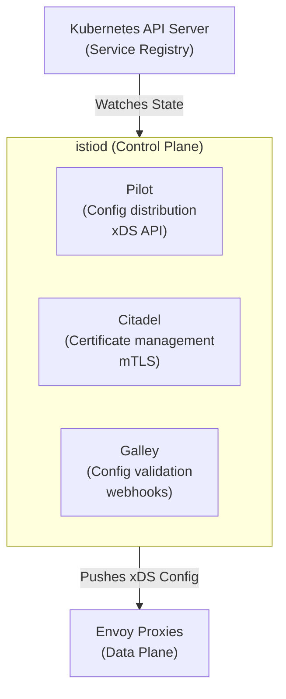
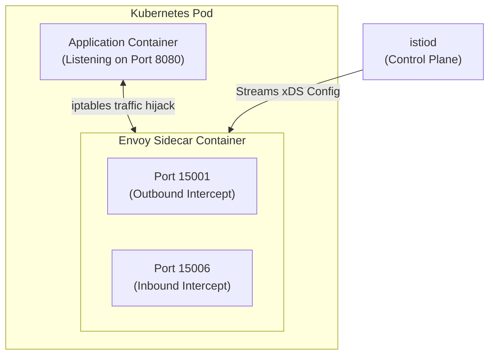
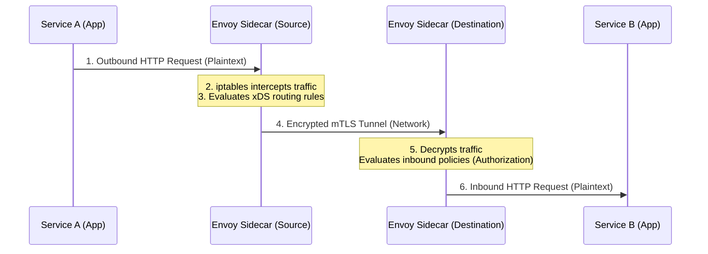
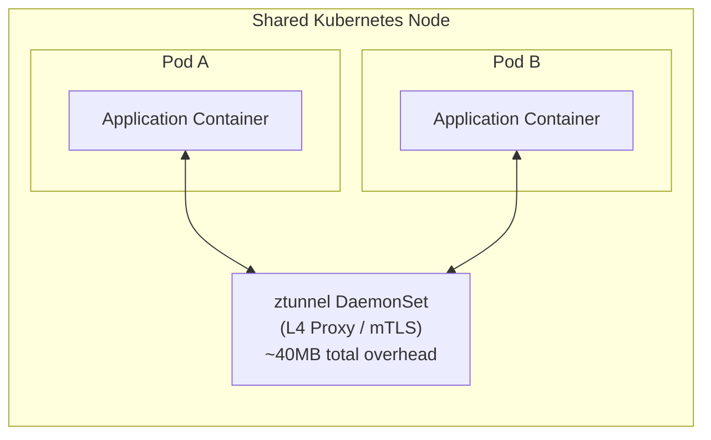
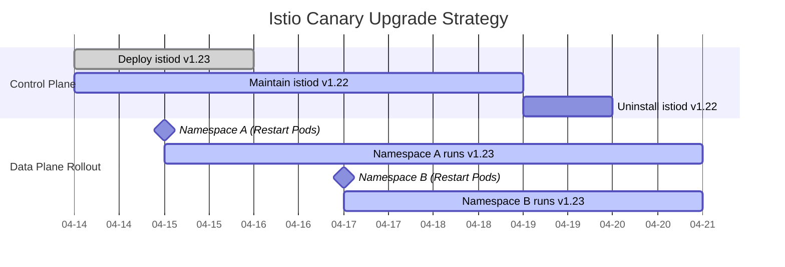

## Complexity: `[MEDIUM]`
## Time to Complete: 50-60 minutes

---

## Prerequisites

Before starting this module, you should have completed:
- [CKA Part 3: Services & Networking](/k8s/cka/part3-services-networking/) — Kubernetes networking fundamentals
- [Service Mesh Concepts](/platform/toolkits/infrastructure-networking/networking/module-5.2-service-mesh/) — Why service mesh exists
- Basic understanding of reverse proxies, iptables, and TLS concepts
- Access to a Kubernetes v1.35+ cluster for the hands-on exercises

---

## What You'll Be Able to Do

After completing this thorough architectural dive, you will be able to:

1. **Implement** robust Istio installations across varied deployment environments utilizing `istioctl`, Helm charts, and the IstioOperator CRD, while selecting the most secure and appropriate configuration profile.
2. **Diagnose** complex sidecar injection failures and mesh connectivity anomalies by systematically analyzing MutatingWebhookConfigurations, `istioctl` diagnostic outputs, and proxy synchronization statuses.
3. **Design** and execute a seamless, zero-downtime Istio upgrade strategy utilizing canary deployments to prevent data plane interruptions during control plane transitions.
4. **Evaluate** the profound architectural differences between traditional sidecar injection and the newer Ambient mode, determining the optimal deployment model based on strict resource constraints and Layer 7 policy requirements.
5. **Compare** the internal components of the Istio control plane (Pilot, Citadel, Galley) and understand how they translate Kubernetes Custom Resource Definitions into xDS API configurations for Envoy.

---

## Why This Module Matters

In October 2021, Roblox experienced a catastrophic 73-hour platform outage that wiped out an estimated $25 million in bookings and temporarily erased $4 billion in market capitalization. While their specific distributed system failure stemmed from a HashiCorp Nomad and Consul streaming configuration issue rather than Istio, the fundamental architectural lesson applies directly to Kubernetes and any service mesh: when your centralized control plane and distributed data plane lose synchronization under high operational load, your entire microservice ecosystem is at risk of cascading failure.

Understanding Istio's architecture—specifically how the `istiod` centralized controller (the brain) communicates dynamically with Envoy sidecars (the nerve endings) via the xDS API—is not just an academic exercise for an exam. It is the critical difference between experiencing a minor routing blip and triggering a multi-day, headline-making system outage. If the control plane goes offline, existing proxies can theoretically continue to route traffic based on their last known configuration state, but any new pods that spin up during a scaling event will be provisioned completely blind, incapable of communicating within the mesh.

This module represents a massive 20% of the ICA exam blueprint, focusing heavily on installation methods, configuration profiles, sidecar injection mechanics, and architectural troubleshooting. However, its true long-term value lies in providing you with the correct mental model needed to debug distributed network systems in production. When a VirtualService fails to route traffic properly or an mTLS handshake times out unexpectedly, you will not resort to blindly copy-pasting troubleshooting commands. Instead, you will be able to trace the state systematically from the Kubernetes API server, through the MutatingWebhook, into `istiod`, and finally down to the specific iptables rules of the Envoy proxy container. This architectural mastery is the defining characteristic of a senior platform engineer.

---

## Did You Know?

- **Istio was originally three distinct components**: Pilot (configuration distribution), Mixer (telemetry aggregation), and Citadel (security and certificate management). In Istio version 1.5 and beyond, they were merged into a single monolithic binary called `istiod`. This architectural shift reduced control plane resource usage by over 50% and simplified administrative operations dramatically.
- **Every Envoy sidecar consumes approximately 50-100MB of memory**: In a large-scale cluster running 1,000 pods, that translates to 50-100GB of RAM dedicated entirely to proxy sidecars. This staggering resource overhead was the primary technical driver for developing the sidecar-less Ambient mode.
- **Istio's adoption outpaces all other service meshes combined**: According to the CNCF Annual Survey for 2023, Istio holds greater than 50% market share among service mesh users in production, and it achieved a major milestone by becoming the first service mesh to officially graduate from the CNCF in July 2023.
- **Envoy Proxy processes millions of requests per second**: Originally developed at Lyft in 2015, the Envoy proxy is written in highly optimized C++ and is capable of processing over 2 million requests per second with less than 1 millisecond of tail latency under optimal hardware configurations.

---

## War Story: The Profile That Ate Production

**Characters:**
- Alex: DevOps engineer (3 years experience)
- Team: 5 engineers managing 30 microservices

**The Incident:**

Alex had been running Istio in their development Kubernetes cluster for months using the simplest installation command available: `istioctl install --set profile=demo`. Everything worked beautifully. The team had rich Kiali dashboards, comprehensive Jaeger distributed traces, and detailed Grafana metrics available right out of the box. On deployment day, Alex ran the exact same command on the production cluster, assuming the environment parity would guarantee success.

Three hours later, the billing team reported that their monthly cloud infrastructure invoice projection showed a massive 40% spike in compute costs. The `demo` profile deploys all optional observability components with generous resource allocations. Kiali, Jaeger, and Prometheus were each consuming gigabytes of RAM across multiple replicas that simply weren't necessary for the core routing functions.

But the real crisis came a week later during an automated security audit. The `demo` profile sets a permissive mTLS policy globally—meaning services will accept both encrypted and completely unencrypted plaintext traffic. Alex had assumed strict mTLS was enforced by default. The security audit revealed plaintext traffic containing sensitive payment metadata flowing freely between internal cluster services.

**The Fix:**

```bash
# What Alex should have done for production:
istioctl install --set profile=default

# Then explicitly set STRICT mTLS:
kubectl apply -f - <<EOF
apiVersion: security.istio.io/v1
kind: PeerAuthentication
metadata:
  name: default
  namespace: istio-system
spec:
  mtls:
    mode: STRICT
EOF
```

**Lesson**: Installation profiles are not merely "t-shirt sizes" for sizing clusters—they are complex configurations with severe security and performance implications. You must always use the `default` or `minimal` profile in production environments and layer observability tools on top selectively.

---

## Part 1: Istio Architecture Deep Dive

Understanding the separation between the control plane and the data plane is foundational to mastering Istio. The control plane manages the configuration, while the data plane handles the actual moving of packets.

### 1.1 The Control Plane: istiod

Istio's control plane is consolidated into a single highly-available binary called `istiod` that runs as a standard Kubernetes Deployment within the `istio-system` namespace. While it is one binary today, it logically performs the functions of its historical predecessors:

```text
┌─────────────────────────────────────────────────────────┐
│                        istiod                            │
│                                                          │
│  ┌─────────────┐  ┌─────────────┐  ┌─────────────────┐ │
│  │   Pilot      │  │  Citadel    │  │   Galley        │ │
│  │             │  │             │  │                 │ │
│  │  Config     │  │  Certificate│  │  Config         │ │
│  │  distribution│  │  management │  │  validation     │ │
│  │  (xDS API)  │  │  (mTLS)     │  │  (webhooks)     │ │
│  └─────────────┘  └─────────────┘  └─────────────────┘ │
│                                                          │
│           Watches K8s API ◄──── Service Registry         │
│           Pushes config  ────► Envoy Proxies (xDS)       │
└─────────────────────────────────────────────────────────┘
```
*Architectural representation as a Mermaid diagram for enhanced clarity:*


**Logical responsibilities of the control plane:**

| Component | Responsibility | How It Works |
|-----------|---------------|--------------|
| **Pilot** | Service discovery & traffic config | Watches K8s Services, converts to Envoy config, pushes via xDS API |
| **Citadel** | Certificate authority | Issues SPIFFE certs to each proxy, rotates automatically |
| **Galley** | Config validation | Validates Istio resources via admission webhooks |

### Deep Dive: The xDS Protocol

The communication between `istiod` (specifically the Pilot logic) and the Envoy proxies is facilitated by the xDS API. This is a collection of dynamic discovery services that Envoy subscribes to:
- **LDS (Listener Discovery Service)**: Tells the proxy which ports to actively listen on.
- **RDS (Route Discovery Service)**: Provides the HTTP routing rules, translating your VirtualServices into Envoy routes.
- **CDS (Cluster Discovery Service)**: Defines the backend services and upstream destination clusters.
- **EDS (Endpoint Discovery Service)**: Maps the upstream clusters to the actual IP addresses of your Kubernetes Pods.

When you create a Kubernetes Service or a DestinationRule, `istiod` translates these Kubernetes primitives into xDS configurations and streams them to every single Envoy sidecar in the mesh dynamically, without requiring any proxy restarts.

### 1.2 The Data Plane: Envoy Proxies

In a traditional Istio architecture, every single pod in the mesh receives an Envoy sidecar container injected right alongside the primary application container. This sidecar intercepts all inbound and outbound network traffic using sophisticated operating system rules.

```text
┌─────────────── Pod ──────────────────┐
│                                       │
│  ┌──────────────┐  ┌──────────────┐  │
│  │  Application  │  │  Envoy       │  │
│  │  Container    │  │  Sidecar     │  │
│  │              │  │              │  │
│  │  Port 8080   │◄─┤  Port 15001  │  │
│  │              │  │  (outbound)  │  │
│  │              │  │  Port 15006  │  │
│  │              │  │  (inbound)   │  │
│  └──────────────┘  └──────┬───────┘  │
│                           │          │
│         iptables rules redirect      │
│         all traffic through Envoy    │
└───────────────────────────┬──────────┘
                            │
                    xDS config from istiod
```
*Mermaid representation of the Pod networking structure:*


**Key Envoy proxy ports to memorize for the exam:**

| Port | Purpose |
|------|---------|
| 15001 | Outbound traffic listener |
| 15006 | Inbound traffic listener |
| 15010 | xDS (plaintext, istiod) |
| 15012 | xDS (mTLS, istiod) |
| 15014 | Control plane metrics |
| 15020 | Health checks |
| 15021 | Health check endpoint |
| 15090 | Envoy Prometheus metrics |

### 1.3 How Traffic Flows Through the Mesh

The true magic of the service mesh is that the application container is entirely unaware of the proxy's existence. The application sends a standard, unencrypted HTTP request, and the underlying infrastructure handles the complexity.

```text
Service A (Pod)                              Service B (Pod)
┌────────────────────┐                      ┌────────────────────┐
│ App ──► Envoy ─────┼──── mTLS tunnel ────►┼── Envoy ──► App   │
│         Sidecar     │                      │   Sidecar          │
└────────────────────┘                      └────────────────────┘

1. App sends request to Service B (thinks it's plaintext HTTP)
2. iptables redirects to local Envoy sidecar (outbound)
3. Envoy applies routing rules (VirtualService, DestinationRule)
4. Envoy establishes mTLS connection to destination Envoy
5. Destination Envoy decrypts, applies inbound policies
6. Destination Envoy forwards to local application
```
*Mermaid sequence representation of the traffic flow:*


---

## Part 2: Installation Methods

Istio provides multiple installation mechanisms tailored for different environments. As a professional, you must understand the nuances of each approach. Note that while the commands below explicitly pull specific Istio versions to match exam expectations, all of these concepts apply to modern clusters running Kubernetes v1.35+.

### 2.1 Installing with istioctl (Recommended for Exam)

The `istioctl` binary is Istio's primary command-line tool. It is universally considered the fastest way to install the mesh and is the most likely method you will be required to use on the ICA exam due to its speed and simplicity.

```bash
# Download istioctl
curl -L https://istio.io/downloadIstio | sh -
cd istio-1.22.0
export PATH=$PWD/bin:$PATH

# Install with default profile
istioctl install --set profile=default -y

# Verify installation
istioctl verify-install
```

**What `istioctl install` actually does behind the scenes:**
1. It reads the selected profile configuration.
2. It dynamically generates standard Kubernetes manifests based on the profile values.
3. It applies those manifests directly to the cluster API.
4. It polls the deployment status, waiting for the control plane components to report readiness.
5. It reports a final success or surfaces specific deployment errors.

### 2.2 Installation Profiles

Profiles are pre-configured, heavily opinionated sets of components and default settings. **You must know these profiles thoroughly for the exam:**

| Profile | istiod | Ingress GW | Egress GW | Use Case |
|---------|--------|-----------|----------|----------|
| `default` | Yes | Yes | No | **Production** |
| `demo` | Yes | Yes | Yes | Learning/testing |
| `minimal` | Yes | No | No | Control plane only |
| `remote` | No | No | No | Multi-cluster remote |
| `empty` | No | No | No | Custom build |
| `ambient` | Yes | Yes | No | Ambient mode (no sidecars) |

You can interactively explore and customize these profiles using the CLI:

```bash
# See what a profile installs (without applying)
istioctl profile dump default

# Compare profiles
istioctl profile diff default demo

# Install with specific profile
istioctl install --set profile=demo -y

# Install with customizations
istioctl install --set profile=default \
  --set meshConfig.accessLogFile=/dev/stdout \
  --set values.global.proxy.resources.requests.memory=128Mi \
  -y
```

**Detailed profile component comparison matrix:**

```text
                    default    demo    minimal   ambient
                    ───────    ────    ───────   ───────
istiod              ✓          ✓       ✓         ✓
istio-ingressgateway ✓         ✓       ✗         ✓
istio-egressgateway  ✗         ✓       ✗         ✗
ztunnel              ✗         ✗       ✗         ✓
istio-cni            ✗         ✗       ✗         ✓
```

### 2.3 Installing with Helm

While `istioctl` is excellent for imperative operations and exams, Helm provides far greater control over individual configuration values and integrates seamlessly with modern declarative GitOps workflows (such as ArgoCD or Flux).

```bash
# Add Istio Helm repo
helm repo add istio https://istio-release.storage.googleapis.com/charts
helm repo update

# Install in order: base → istiod → gateway
# Step 1: CRDs and cluster-wide resources
helm install istio-base istio/base -n istio-system --create-namespace

# Step 2: Control plane
helm install istiod istio/istiod -n istio-system --wait

# Step 3: Ingress gateway (optional)
kubectl create namespace istio-ingress
helm install istio-ingress istio/gateway -n istio-ingress

# Verify
kubectl get pods -n istio-system
kubectl get pods -n istio-ingress
```

**When to use Helm versus istioctl:**

| Scenario | Method |
|----------|--------|
| ICA exam | `istioctl` (fastest) |
| GitOps / ArgoCD | Helm charts |
| Custom operator pattern | IstioOperator CRD |
| Quick testing | `istioctl` |

### 2.4 IstioOperator CRD

The IstioOperator custom resource allows you to declaratively manage Istio configuration in a highly structured way. An in-cluster controller watches for these specific resources and continuously reconciles the installation state to match the declarative definition.

```yaml
# istio-operator.yaml
apiVersion: install.istio.io/v1alpha1
kind: IstioOperator
metadata:
  name: istio-control-plane
  namespace: istio-system
spec:
  profile: default
  meshConfig:
    accessLogFile: /dev/stdout
    enableTracing: true
    defaultConfig:
      tracing:
        zipkin:
          address: zipkin.istio-system:9411
  components:
    ingressGateways:
    - name: istio-ingressgateway
      enabled: true
      k8s:
        resources:
          requests:
            cpu: 200m
            memory: 256Mi
    egressGateways:
    - name: istio-egressgateway
      enabled: false
  values:
    global:
      proxy:
        resources:
          requests:
            cpu: 100m
            memory: 128Mi
          limits:
            cpu: 500m
            memory: 256Mi
```

```bash
# Apply with istioctl
istioctl install -f istio-operator.yaml -y

# Or install the operator and apply the CR
istioctl operator init
kubectl apply -f istio-operator.yaml
```

---

## Part 3: Sidecar Injection

Getting the Envoy proxy into the application pod is a critical operation. Without the proxy, the pod is not participating in the service mesh.

### 3.1 Automatic Sidecar Injection

This is the standard and most robust method. You apply a specific label to a Kubernetes namespace, and all newly created pods within that namespace automatically receive sidecars.

```bash
# Enable automatic injection for a namespace
kubectl label namespace default istio-injection=enabled

# Verify the label
kubectl get namespace default --show-labels

# Deploy an app — sidecar is injected automatically
kubectl run nginx --image=nginx -n default
kubectl get pod nginx -o jsonpath='{.spec.containers[*].name}'
# Output: nginx istio-proxy

# Disable injection for a specific pod (opt-out)
kubectl run skip-mesh --image=nginx \
  --overrides='{"metadata":{"annotations":{"sidecar.istio.io/inject":"false"}}}'
```

**How the automated injection actually functions:**

```text
1. Namespace has label: istio-injection=enabled
2. Pod is created
3. K8s API server calls istiod's MutatingWebhook
4. istiod injects istio-init (iptables setup) + istio-proxy (Envoy) containers
5. Pod starts with sidecar
```

### Deep Dive: The MutatingWebhook Lifecycle

When you submit a Pod creation manifest to the Kubernetes API (v1.35+), the request enters the admission control phase. Because the namespace is labeled, the API server forwards the request to Istio's `MutatingWebhookConfiguration`. The `istiod` controller inspects the Pod template, dynamically generates the necessary YAML for the `istio-proxy` and `istio-init` containers, and merges them into the original manifest. It returns this mutated manifest back to the API server, which then schedules the Pod. 

> **Pause and predict**: You apply the `istio-injection=enabled` label to a namespace that already contains 10 running application pods. When you run `kubectl get pods`, how many containers will you see inside each pod?

*Answer: You will still only see one container per pod! The mutating webhook only intercepts new pod creation events. To get sidecars into existing pods, you must force the deployment to recreate the pods using a command like `kubectl rollout restart`.*

### 3.2 Manual Sidecar Injection

Manual injection is used when cluster policies prohibit MutatingWebhooks, or when you require extremely fine-grained control over the generated YAML manifests prior to deployment.

```bash
# Inject sidecar into a deployment YAML
istioctl kube-inject -f deployment.yaml | kubectl apply -f -

# Inject into an existing deployment
kubectl get deployment myapp -o yaml | istioctl kube-inject -f - | kubectl apply -f -

# Check injection status
istioctl analyze -n default
```

### 3.3 Controlling Injection Granularity

You can override the namespace-level injection policy at the individual pod level using annotations. This is incredibly useful for jobs or cronjobs that need to run without mesh interference.

```yaml
# Per-pod annotation to disable injection
apiVersion: v1
kind: Pod
metadata:
  annotations:
    sidecar.istio.io/inject: "false"
spec:
  containers:
  - name: app
    image: myapp:latest
```

```yaml
# Per-pod annotation to enable injection (even without namespace label)
apiVersion: v1
kind: Pod
metadata:
  annotations:
    sidecar.istio.io/inject: "true"
  labels:
    sidecar.istio.io/inject: "true"
spec:
  containers:
  - name: app
    image: myapp:latest
```

**Injection priority hierarchy (from highest precedence to lowest):**

1. Pod annotation `sidecar.istio.io/inject`
2. Pod label `sidecar.istio.io/inject`
3. Namespace label `istio-injection`
4. Global mesh configuration default policy

### 3.4 Revision-Based Injection (for Upgrades)

Instead of relying on the blunt `istio-injection=enabled` label, modern operational practices utilize revision labels to facilitate canary upgrades of the control plane.

```bash
# Install a specific revision
istioctl install --set revision=1-22 -y

# Label namespace with revision (not istio-injection)
kubectl label namespace default istio.io/rev=1-22

# This allows running two Istio versions simultaneously
```

---

## Part 4: Ambient Mode (The Future of the Mesh)

Ambient mode represents a paradigm shift. It is Istio's **sidecar-less** data plane architecture. Instead of forcibly injecting a proxy into every single pod, it utilizes a two-tier proxy system:

1. **ztunnel** — A heavily optimized, Rust-based per-node L4 proxy. It handles mTLS encryption and Layer 4 authorization.
2. **waypoint proxies** — Optional, scalable, per-namespace Envoy proxies that handle complex Layer 7 routing and HTTP policies.

```text
Traditional Sidecar Mode:
┌─────────────────┐  ┌─────────────────┐
│ Pod A            │  │ Pod B            │
│ ┌─────┐ ┌─────┐ │  │ ┌─────┐ ┌─────┐ │
│ │ App │ │Envoy│ │  │ │ App │ │Envoy│ │
│ └─────┘ └─────┘ │  │ └─────┘ └─────┘ │
└─────────────────┘  └─────────────────┘
   ~100MB overhead      ~100MB overhead

Ambient Mode:
┌──────────┐  ┌──────────┐
│ Pod A    │  │ Pod B    │
│ ┌──────┐ │  │ ┌──────┐ │
│ │ App  │ │  │ │ App  │ │
│ └──────┘ │  │ └──────┘ │
└────┬─────┘  └────┬─────┘
     │              │
┌────▼──────────────▼─────┐  ◄── Shared per-node
│       ztunnel (L4)       │
└──────────────────────────┘
         ~40MB per node (not per pod)
```
*Mermaid comparison of the architectural approaches:*


```bash
# Install Istio with ambient profile
istioctl install --set profile=ambient -y

# Add a namespace to the ambient mesh
kubectl label namespace default istio.io/dataplane-mode=ambient

# Deploy a waypoint proxy for L7 features (optional)
istioctl waypoint apply -n default --enroll-namespace
```

> **Stop and think**: If Ambient mode removes the Envoy sidecar from the individual pod, how does the mesh enforce complex Layer 7 policies like HTTP path-based routing, retries, or header manipulation?

*Answer: Ambient mode relies entirely on the optional component called the waypoint proxy. The node-level ztunnel handles all Layer 4 traffic and ensures cryptographic mTLS identity. If Layer 7 processing is required, the ztunnel securely forwards the traffic via the HBONE protocol to the namespace's waypoint proxy, which evaluates the advanced HTTP policies before forwarding it to the final destination.*

**Strategic decision matrix for Ambient versus Sidecar:**

| Factor | Sidecar | Ambient |
|--------|---------|---------|
| Resource overhead | High (per-pod proxy memory) | Low (shared per-node ztunnel) |
| L7 features | Always available immediately | Requires explicit waypoint deployment |
| Maturity | Hardened, production-ready | GA as of Istio 1.24 |
| Application restarts | Required for initial injection | Not required to join the mesh |
| ICA exam | Primary exam focus | Secondary focus / May appear |

---

## Part 5: Upgrading Istio Safely

Upgrading core infrastructure requires extreme caution. A failed upgrade can sever communication between all your running services simultaneously.

### 5.1 In-Place Upgrade

This is the simplest method, suitable primarily for lower environments. You upgrade the control plane in place, and then systematically restart your workloads to inject the newer version of the sidecar.

```bash
# Download new version
curl -L https://istio.io/downloadIstio | ISTIO_VERSION=1.23.0 sh -

# Upgrade control plane
istioctl upgrade -y

# Verify
istioctl version

# Restart workloads to get new sidecar version
kubectl rollout restart deployment -n default
```

### 5.2 Canary Upgrade (Recommended for Production)

The canary methodology is the industry standard for production mesh upgrades. You run two complete versions of `istiod` simultaneously, migrating namespaces to the new control plane gradually.

```bash
# Step 1: Install new revision alongside existing
istioctl install --set revision=1-23 -y

# Verify both versions running
kubectl get pods -n istio-system -l app=istiod

# Step 2: Move namespaces to new revision
kubectl label namespace default istio.io/rev=1-23 --overwrite
kubectl label namespace default istio-injection-  # Remove old label

# Step 3: Restart workloads to pick up new sidecars
kubectl rollout restart deployment -n default

# Step 4: Verify workloads use new proxy
istioctl proxy-status

# Step 5: Remove old control plane
istioctl uninstall --revision 1-22 -y
```

**Visualizing the canary upgrade lifecycle:**

```text
Time ────────────────────────────────────────────────►

istiod v1.22  ████████████████████████░░░░░  (uninstall)
istiod v1.23  ░░░░░░░████████████████████████████████

Namespace A   ──── v1.22 sidecars ──── restart ──── v1.23 sidecars ────
Namespace B   ──── v1.22 sidecars ────────── restart ──── v1.23 sidecars
```
*Mermaid Gantt representation of the rollout timeline:*


---

## Part 6: Verifying Your Installation

Mastering the diagnostic commands is critical for passing the exam and surviving on-call rotations. These tools provide unparalleled visibility into the mesh state.

```bash
# Check all Istio components are healthy
istioctl verify-install

# Analyze configuration for issues
istioctl analyze --all-namespaces

# Check proxy sync status
istioctl proxy-status

# Check Istio version (client + control plane + data plane)
istioctl version

# List installed Istio components
kubectl get pods -n istio-system
kubectl get svc -n istio-system

# Check MutatingWebhookConfiguration (sidecar injection)
kubectl get mutatingwebhookconfigurations | grep istio

# Check if a namespace has injection enabled
kubectl get ns --show-labels | grep istio
```

---

## Common Mistakes

| Mistake | Symptom | Solution |
|---------|---------|----------|
| Using `demo` profile in production | High resource usage, permissive mTLS | Use `default` or `minimal` profile |
| Forgetting namespace label | Pods have no sidecar, no mesh features | `kubectl label ns <name> istio-injection=enabled` |
| Not restarting pods after labeling | Existing pods don't get sidecars | `kubectl rollout restart deployment -n <ns>` |
| Running `istioctl install` without `-y` | Hangs waiting for confirmation | Add `-y` flag (exam time is precious) |
| Ignoring `istioctl analyze` warnings | Misconfigurations go unnoticed | Run `istioctl analyze` after every change |
| Mixing injection label and revision label | Unpredictable injection behavior | Use one method per namespace |
| Not checking proxy-status after upgrade | Stale sidecars running old config | `istioctl proxy-status` to verify sync |

---

## Quiz

Test your architectural understanding and situational readiness before moving to the hands-on lab:

**Q1: Scenario: You have been tasked with provisioning a new Kubernetes v1.35 production cluster that will handle sensitive user financial data. You need to ensure the Istio installation is highly secure and resource-efficient. Which installation profile must you select, and what makes it appropriate?**

<details>
<summary>Show Answer</summary>

`default` — It installs istiod and the ingress gateway with production-appropriate resource settings. Unlike `demo`, it does not install the egress gateway or set permissive defaults. Using the `default` profile is critical for production environments to avoid unnecessary observability bloat that consumes immense memory, and it guarantees that strict security policies can be predictably enforced from the ground up without accidental permissive loopholes.

</details>

**Q2: Scenario: A developer complains that their newly deployed microservice cannot communicate with the rest of the mesh. You inspect the cluster and notice the application namespace is not properly configured for automatic injection. What is the precise command to enable automatic sidecar injection, and what operational step must immediately follow it?**

<details>
<summary>Show Answer</summary>

```bash
kubectl label namespace <namespace> istio-injection=enabled
```

After labeling, existing pods must be restarted to get sidecars:
```bash
kubectl rollout restart deployment -n <namespace>
```
This subsequent restart is strictly required because the Kubernetes MutatingWebhookConfiguration only intercepts the API server events during new pod creation. Existing, running pods are entirely oblivious to the new namespace label until they are recreated.

</details>

**Q3: Scenario: You are debugging a massive connection timeout incident across multiple services and want to understand how proxy configuration is actually generated and distributed. You need to verify the health of the internal components responsible for service discovery, certificate issuance, and config validation. What are the three historical components that manage these tasks?**

<details>
<summary>Show Answer</summary>

1. **Pilot** — Service discovery and traffic configuration (xDS)
2. **Citadel** — Certificate management for mTLS
3. **Galley** — Configuration validation

All merged into the single `istiod` binary since Istio 1.5. This monolithic consolidation significantly reduced the operational complexity and network latency within the control plane itself, making it much easier to troubleshoot large-scale outages without digging through cross-component communication logs.

</details>

**Q4: Scenario: Your organization requires strict zero-downtime upgrades for all underlying infrastructure. You need to safely transition your data plane proxies from an older Istio version to a newer one without breaking thousands of active persistent connections. How do you logically execute a canary upgrade of Istio to achieve this?**

<details>
<summary>Show Answer</summary>

1. Install new version with `--set revision=<new>`: `istioctl install --set revision=1-23 -y`
2. Label namespaces with new revision: `kubectl label ns <ns> istio.io/rev=1-23`
3. Restart workloads: `kubectl rollout restart deployment -n <ns>`
4. Verify with `istioctl proxy-status`
5. Remove old version: `istioctl uninstall --revision <old> -y`

This methodical, revision-based approach guarantees that you run two parallel control planes. If the new proxy configurations cause unexpected routing issues, you can instantly rollback the namespace label and restart the pods to immediately restore previous functionality.

</details>

**Q5: Scenario: Your infrastructure team is migrating a massive, legacy monolithic application into Kubernetes. The application cannot physically tolerate the 100MB per-pod memory overhead associated with traditional Envoy sidecars. You architecturally pivot to implement Ambient mode. What is the functional difference between Ambient mode's core proxies?**

<details>
<summary>Show Answer</summary>

- **ztunnel**: Per-node L4 proxy. Handles mTLS encryption/decryption and L4 authorization. Runs as a DaemonSet. Always active in ambient mode.
- **waypoint proxy**: Optional per-namespace L7 proxy. Handles HTTP routing, L7 authorization policies, traffic management. Only deployed when L7 features are needed.

By aggressively separating the Layer 4 encryption duties from the Layer 7 routing intelligence, Ambient mode allows applications requiring only fundamental zero-trust mTLS to operate with a fraction of the traditional resource footprint.

</details>

**Q6: Scenario: You configured automatic sidecar injection for a namespace, but a critical tier-1 application pod is continually crashing because it lacks the injected Envoy proxy. You need to identify the root cause systematically without guessing. What diagnostic steps do you execute in order?**

<details>
<summary>Show Answer</summary>

1. Verify label: `kubectl get ns <ns> --show-labels` (look for `istio-injection=enabled`)
2. Check MutatingWebhook: `kubectl get mutatingwebhookconfigurations | grep istio`
3. Check istiod is running: `kubectl get pods -n istio-system`
4. Check if pod has opt-out annotation: `sidecar.istio.io/inject: "false"`
5. Restart pods (existing pods don't get retroactive injection): `kubectl rollout restart deployment -n <ns>`

Following this logical diagnostic chain isolates exactly whether the failure stems from a missing label, an offline control plane component, a malfunctioning API webhook, or a developer-applied pod override.

</details>

**Q7: Scenario: Your enterprise architecture team mandates that all cluster components must be strictly managed via GitOps using ArgoCD. You are explicitly forbidden from running imperative `istioctl` commands for the deployment. What declarative Helm charts are required for a complete Istio installation, and in what exact sequence must they be deployed?**

<details>
<summary>Show Answer</summary>

1. `istio/base` — CRDs and cluster-wide resources (namespace: `istio-system`)
2. `istio/istiod` — Control plane (namespace: `istio-system`)
3. `istio/gateway` — Ingress/egress gateway (namespace: `istio-ingress` or similar)

Order matters because istiod depends on the CRDs from base, and gateways depend on istiod. Attempting to deploy these components asynchronously or out of order will result in missing Custom Resource Definitions and persistently failing deployment pods.

</details>

---

## Hands-On Exercise: Install and Explore Istio

### Objective
Install Istio onto a local development cluster, deploy a sample multi-tier application with automatic sidecar injection enabled, and empirically verify that the mesh control plane is properly synchronized with the data plane proxies.

### Setup

```bash
# Create a kind cluster (if not already running)
kind create cluster --name istio-lab

# Download and install Istio
curl -L https://istio.io/downloadIstio | ISTIO_VERSION=1.22.0 sh -
export PATH=$PWD/istio-1.22.0/bin:$PATH
```

### Tasks

**Task 1: Install Istio using the demo profile for exploration**

```bash
istioctl install --set profile=demo -y
```

Verify the installation integrity:
```bash
# All pods should be Running
kubectl get pods -n istio-system

# Should show client, control plane, and data plane versions
istioctl version
```

**Task 2: Configure sidecar injection and deploy the target application**

```bash
# Label the default namespace
kubectl label namespace default istio-injection=enabled

# Deploy the Bookinfo sample app
kubectl apply -f istio-1.22.0/samples/bookinfo/platform/kube/bookinfo.yaml

# Wait for pods
kubectl wait --for=condition=ready pod --all -n default --timeout=120s

# Verify each pod has 2 containers (app + istio-proxy)
kubectl get pods -n default
```

**Task 3: Validate proxy synchronization health via xDS**

```bash
# All proxies should show SYNCED
istioctl proxy-status
```

Expected operational output:
```text
NAME                                    CLUSTER   CDS    LDS    EDS    RDS    ECDS   ISTIOD
details-v1-xxx.default                  Synced    Synced Synced Synced Synced istiod-xxx
productpage-v1-xxx.default              Synced    Synced Synced Synced Synced istiod-xxx
ratings-v1-xxx.default                  Synced    Synced Synced Synced Synced istiod-xxx
reviews-v1-xxx.default                  Synced    Synced Synced Synced Synced istiod-xxx
```

**Task 4: Perform a comprehensive mesh configuration analysis**

```bash
# Should report no issues
istioctl analyze --all-namespaces
```

**Task 5: Explore architectural profile differences**

```bash
# See the difference between default and demo
istioctl profile diff default demo
```

### Success Criteria Check-list

- [ ] Istio control plane is successfully installed with all components running smoothly in the `istio-system` namespace.
- [ ] The Bookinfo application pods each explicitly contain 2 containers (the primary application container + the injected `istio-proxy`).
- [ ] Running `istioctl proxy-status` definitively shows all deployed data plane proxies as fully `SYNCED` across all discovery services.
- [ ] The `istioctl analyze` command completes successfully and reports absolutely no critical configuration issues or syntax errors.
- [ ] You can confidently articulate the architectural and security differences between the `default` and `demo` installation profiles.

### Cleanup

```bash
kubectl delete -f istio-1.22.0/samples/bookinfo/platform/kube/bookinfo.yaml
istioctl uninstall --purge -y
kubectl delete namespace istio-system
kind delete cluster --name istio-lab
```

---

## Next Module

Continue your mesh journey in [Module 2: Traffic Management](../module-1.2-istio-traffic-management/) — the heaviest and most conceptually dense ICA exam domain at 35%. This upcoming module fundamentally reshapes how you think about routing, covering VirtualServices, DestinationRules, Gateways, advanced traffic shifting percentages, and dynamic fault injection simulations to test service resilience under pressure.