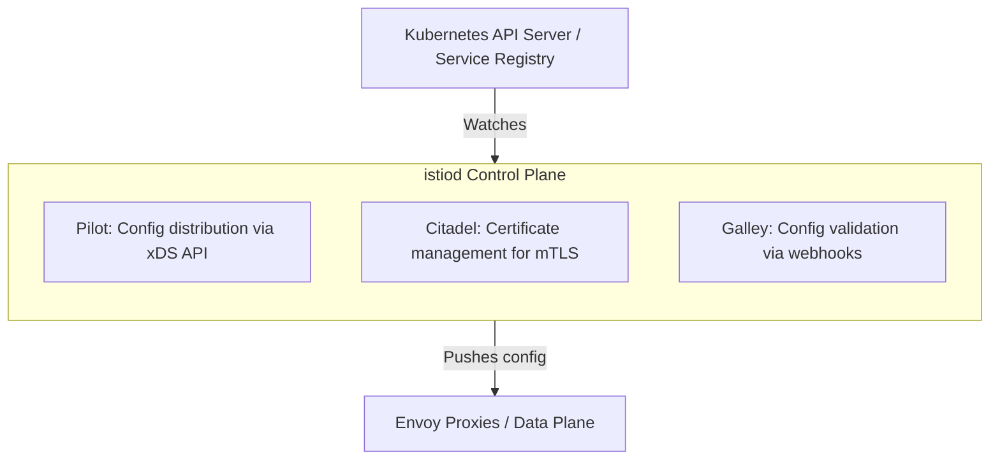
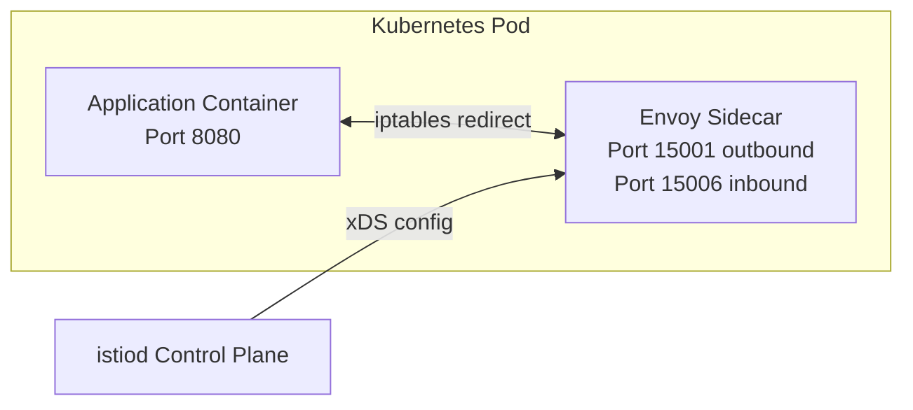
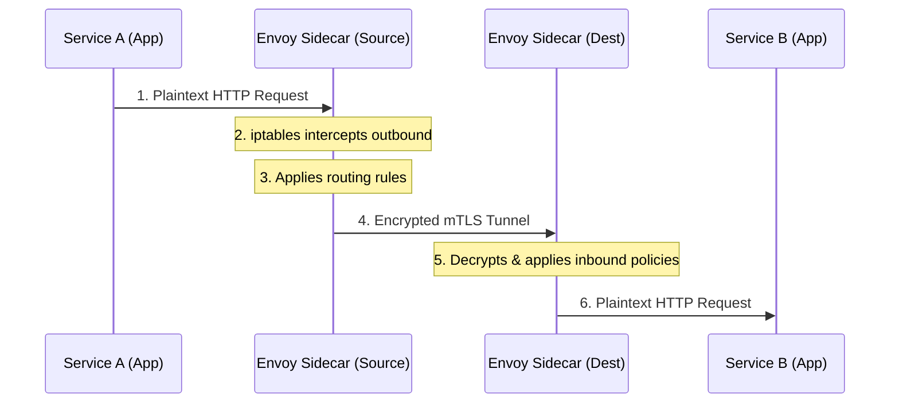
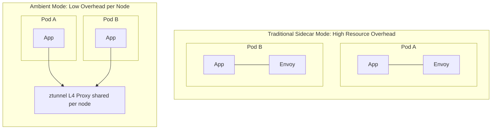

## Complexity: `[MEDIUM]`
## Time to Complete: 50-60 minutes

---

## Prerequisites

Before embarking on this extensive exploration of Istio, you must have a solid foundation in Kubernetes networking. Ensure you have completed the following prerequisites:
- [CKA Part 3: Services & Networking](/k8s/cka/part3-services-networking/) — Deep dive into Kubernetes networking fundamentals, ClusterIPs, NodePorts, and the Container Network Interface.
- [Service Mesh Concepts](/platform/toolkits/infrastructure-networking/networking/module-5.2-service-mesh/) — Understanding the historical context of why service meshes exist and the problems they solve.
- A functional understanding of forward and reverse proxies, mutual TLS encryption, and basic Linux networking capabilities.

---

## What You'll Be Able to Do

By the end of this module, you will achieve the following measurable outcomes:

1. **Design** a production-grade Istio architecture by selecting the appropriate control plane components and installation profiles suitable for your specific organizational requirements.
2. **Implement** automated and manual sidecar injection strategies to ensure consistent proxy deployment across diverse Kubernetes namespaces running Kubernetes v1.35.
3. **Diagnose** traffic routing and security enforcement failures by actively analyzing Envoy proxy states, xDS synchronization delays, and istiod control plane logs.
4. **Evaluate** the architectural trade-offs between the traditional sidecar model and the emerging ambient mode, focusing on resource utilization and network latency.
5. **Compare** in-place and canary upgrade methodologies to minimize application downtime during critical service mesh lifecycle operations.

---

## Why This Module Matters

In modern distributed systems running Kubernetes v1.35 and above, the service mesh is the critical nervous system of your infrastructure. Installation and Architecture form a significant **20% of the ICA exam**. You will be rigorously tested on your ability to deploy Istio using multiple methodologies, select appropriate profiles, configure sidecar injection accurately, and troubleshoot complex control plane failures. Beyond the exam, a deep comprehension of the underlying architecture allows you to reason effectively about systemic failures.

Consider the catastrophic incident at GlobalPay, a fictional high-volume payment processor. During the peak of the 2025 holiday shopping season, a junior engineer deployed a configuration update using the `demo` profile against a production cluster. This profile instantiated a highly permissive mutual TLS configuration and aggressive resource requests for optional telemetry components. Within minutes, the resulting configuration drift caused a routing loop that consumed the entire cluster's memory, evicting critical payment processing pods. 

The ensuing four-hour outage resulted in an estimated $4.2 million SLA penalty. The core failure was not just a mistyped command; it was a fundamental misunderstanding of how the `istiod` control plane propagates state to Envoy sidecars. When a VirtualService fails to route traffic or mTLS handshakes time out, the root cause invariably lies in the architectural interplay between the control plane and the data plane. If the central control plane is misconfigured, the distributed data plane executes those flawed instructions with perfect, devastating efficiency.

---

## Did You Know?

- The xDS protocol utilized by Istio was originally developed by Lyft for the Envoy proxy, and it is capable of processing up to 10,000 configuration updates per second in massively scaled enterprise meshes.
- In a traditional sidecar deployment, adding an Envoy proxy to every pod in a 2,000-pod cluster can consume approximately 100 GB of aggregate memory just for data plane networking overhead.
- Istio's transition from a fragmented microservices control plane to a monolithic binary reduced control plane CPU utilization by over 50 percent, vastly simplifying enterprise operations.
- The introduction of Ambient mode reduces per-node proxy memory overhead by up to 80 percent by utilizing a shared L4 ztunnel instead of requiring a dedicated Envoy instance for every application pod.

---

## War Story: The Profile That Ate Production

**Characters:**
- Alex: DevOps engineer (3 years experience)
- Team: 5 engineers running 30 microservices

**The Incident:**

Alex had been running Istio in development for months using a basic installation command. Everything worked beautifully — dashboards were illuminating, traces were precise, and metrics flowed perfectly. On deployment day, Alex executed the exact same installation command on the production cluster, utilizing the testing profile.

Three hours later, the billing team reported that their monthly invoice showed a massive spike in compute costs. The testing profile deploys all optional components with extremely generous resource allocations. The telemetry components were each consuming gigabytes of RAM across multiple replicas they simply did not require in that environment.

But the real problem surfaced a week later. The testing profile establishes a permissive mutual TLS posture, meaning services accept both encrypted and unencrypted traffic without enforcement. Alex assumed mutual TLS was strictly enforced by default. The subsequent security audit identified plaintext traffic flowing freely between highly sensitive payment services.

**The Fix:**

```bash
# What Alex should have done for production:
istioctl install --set profile=default

# Then explicitly set STRICT mTLS:
kubectl apply -f - <<EOF
apiVersion: security.istio.io/v1
kind: PeerAuthentication
metadata:
  name: default
  namespace: istio-system
spec:
  mtls:
    mode: STRICT
EOF
```

**Lesson**: Profiles are not simply "t-shirt sizes" — they are robust configurations with profound security implications. You must thoroughly evaluate the operational profile before executing it in any environment handling live customer data.

---

## Part 1: Istio Architecture Deep Dive

Understanding the architecture is the most important step in mastering the service mesh. We divide the architecture into two distinct planes: the Control Plane and the Data Plane. 

### 1.1 The Control Plane: istiod

The control plane is the brain of the service mesh. In modern versions, the control plane is a single unified binary called `istiod` that runs as a standard Kubernetes Deployment within the `istio-system` namespace. Historically, this consisted of several separate deployments, but consolidating them significantly reduced latency and operational complexity.



**What each component does internally:**

| Component | Responsibility | How It Works |
|-----------|---------------|--------------|
| **Pilot** | Service discovery & traffic config | Watches K8s Services, converts to Envoy config, pushes via xDS API |
| **Citadel** | Certificate authority | Issues SPIFFE certs to each proxy, rotates automatically |
| **Galley** | Config validation | Validates Istio resources via admission webhooks |

Pilot is heavily involved in watching the Kubernetes API Server for changes to Services, Endpoints, and Custom Resource Definitions. When you apply a VirtualService, Pilot validates it, translates it into the configuration format Envoy understands, and pushes it out to all relevant Envoy sidecars simultaneously. Citadel manages identity. Every workload in the mesh requires a cryptographic identity to participate in mutual TLS. Citadel generates these certificates, securely distributes them, and ensures they are rotated before expiration. Galley provides the essential validation webhooks, ensuring that malformed configurations are rejected before they can corrupt the mesh.

### 1.2 The Data Plane: Envoy Proxies

While the control plane thinks, the data plane acts. Every application pod participating in the mesh is dynamically injected with an Envoy proxy sidecar container. This sidecar operates entirely transparently to the application.



To achieve this transparency, specialized `iptables` rules are configured when the pod initializes. These rules intercept all outbound traffic originating from the application and seamlessly redirect it into the Envoy proxy's outbound listener. Similarly, all inbound traffic hitting the pod is routed first through Envoy's inbound listener before being handed off to the application.

**Key Envoy ports you must memorize for debugging:**

| Port | Purpose |
|------|---------|
| 15001 | Outbound traffic listener |
| 15006 | Inbound traffic listener |
| 15010 | xDS (plaintext, istiod) |
| 15012 | xDS (mTLS, istiod) |
| 15014 | Control plane metrics |
| 15020 | Health checks |
| 15021 | Health check endpoint |
| 15090 | Envoy Prometheus metrics |

> **Pause and predict**: If the `istiod` pod is suddenly deleted and takes 30 seconds to restart, what happens to the live traffic flowing between two existing pods via their Envoy sidecars?
> *Answer*: The traffic continues uninterrupted. Envoy proxies cache the last known good configuration in their localized memory. They will simply be unable to receive new routing rules until `istiod` recovers.

### 1.3 How Traffic Flows

Let us trace the exact lifecycle of a request flowing from Service A to Service B.



1. The application sends a request to Service B. It assumes it is communicating over standard, plaintext HTTP.
2. The operating system's `iptables` configuration intercepts this outbound packet and forces it into the local Envoy sidecar.
3. The source Envoy proxy evaluates its routing configuration (provided by Pilot) to determine the correct destination endpoint and applies any relevant VirtualService rules.
4. The source Envoy establishes a mutually authenticated, fully encrypted TLS connection to the destination Envoy proxy.
5. The destination Envoy proxy receives the encrypted payload, decrypts it, and evaluates inbound authorization policies.
6. If authorized, the destination Envoy proxy forwards the plaintext request to the local application container.

---

## Part 2: Installation Methods

There are several approved methodologies for installing the mesh, each suited to different operational maturity levels.

### 2.1 Installing with istioctl (Recommended for Exam)

The `istioctl` command-line utility is an immensely powerful tool. It is unequivocally the fastest way to install the mesh and is the primary method you must master for the certification exam.

```bash
# Download istioctl
curl -L https://istio.io/downloadIstio | sh -
cd istio-1.22.0
export PATH=$PWD/bin:$PATH

# Install with default profile
istioctl install --set profile=default -y

# Verify installation
istioctl verify-install
```

When you execute the installation command, the utility parses your requested profile, generates hundreds of lines of complex Kubernetes YAML manifests in memory, directly applies them to the cluster via the API server, and continually polls the deployments until all control plane pods report a healthy readiness state.

### 2.2 Installation Profiles

Profiles dictate exactly which components are deployed and how they are configured. 

| Profile | istiod | Ingress GW | Egress GW | Use Case |
|---------|--------|-----------|----------|----------|
| `default` | Yes | Yes | No | **Production** |
| `demo` | Yes | Yes | Yes | Learning/testing |
| `minimal` | Yes | No | No | Control plane only |
| `remote` | No | No | No | Multi-cluster remote |
| `empty` | No | No | No | Custom build |
| `ambient` | Yes | Yes | No | Ambient mode (no sidecars) |

```bash
# See what a profile installs (without applying)
istioctl profile dump default

# Compare profiles
istioctl profile diff default demo

# Install with specific profile
istioctl install --set profile=demo -y

# Install with customizations
istioctl install --set profile=default \
  --set meshConfig.accessLogFile=/dev/stdout \
  --set values.global.proxy.resources.requests.memory=128Mi \
  -y
```

Understanding the matrix of what each profile provisions is crucial.

```text
                    default    demo    minimal   ambient
                    ───────    ────    ───────   ───────
istiod              ✓          ✓       ✓         ✓
istio-ingressgateway ✓         ✓       ✗         ✓
istio-egressgateway  ✗         ✓       ✗         ✗
ztunnel              ✗         ✗       ✗         ✓
istio-cni            ✗         ✗       ✗         ✓
```

### 2.3 Installing with Helm

For mature engineering organizations adopting GitOps principles, Helm is the preferred mechanism. Helm charts allow for granular value overrides and integrate seamlessly with continuous deployment tools.

```bash
# Add Istio Helm repo
helm repo add istio https://istio-release.storage.googleapis.com/charts
helm repo update

# Install in order: base → istiod → gateway
# Step 1: CRDs and cluster-wide resources
helm install istio-base istio/base -n istio-system --create-namespace

# Step 2: Control plane
helm install istiod istio/istiod -n istio-system --wait

# Step 3: Ingress gateway (optional)
kubectl create namespace istio-ingress
helm install istio-ingress istio/gateway -n istio-ingress

# Verify
kubectl get pods -n istio-system
kubectl get pods -n istio-ingress
```

> **Stop and think**: Why is the installation order strictly base, then istiod, then the gateway? 
> *Answer*: The base chart installs the Custom Resource Definitions (CRDs). Without the CRDs, the Kubernetes API Server will reject any Istio-specific resources that `istiod` or the gateways attempt to create during their own deployment phases.

| Scenario | Method |
|----------|--------|
| ICA exam | `istioctl` (fastest) |
| GitOps / ArgoCD | Helm charts |
| Custom operator pattern | IstioOperator CRD |
| Quick testing | `istioctl` |

### 2.4 IstioOperator CRD

The IstioOperator resource is a declarative mechanism to configure the mesh. By submitting a custom resource, a specialized operator watches the resource and continuously reconciles the cluster state to match your desired configuration.

```yaml
# istio-operator.yaml
apiVersion: install.istio.io/v1alpha1
kind: IstioOperator
metadata:
  name: istio-control-plane
  namespace: istio-system
spec:
  profile: default
  meshConfig:
    accessLogFile: /dev/stdout
    enableTracing: true
    defaultConfig:
      tracing:
        zipkin:
          address: zipkin.istio-system:9411
  components:
    ingressGateways:
    - name: istio-ingressgateway
      enabled: true
      k8s:
        resources:
          requests:
            cpu: 200m
            memory: 256Mi
    egressGateways:
    - name: istio-egressgateway
      enabled: false
  values:
    global:
      proxy:
        resources:
          requests:
            cpu: 100m
            memory: 128Mi
          limits:
            cpu: 500m
            memory: 256Mi
```

```bash
# Apply with istioctl
istioctl install -f istio-operator.yaml -y

# Or install the operator and apply the CR
istioctl operator init
kubectl apply -f istio-operator.yaml
```

---

## Part 3: Sidecar Injection

### 3.1 Automatic Sidecar Injection

Automatic sidecar injection utilizes a Kubernetes MutatingAdmissionWebhook. When you label a namespace, the webhook intercepts all pod creation requests and dynamically injects the Envoy proxy definitions into the pod specification before the pod is scheduled to a node.

```bash
# Enable automatic injection for a namespace
kubectl label namespace default istio-injection=enabled

# Verify the label
kubectl get namespace default --show-labels

# Deploy an app — sidecar is injected automatically
kubectl run nginx --image=nginx -n default
kubectl get pod nginx -o jsonpath='{.spec.containers[*].name}'
# Output: nginx istio-proxy

# Disable injection for a specific pod (opt-out)
kubectl run skip-mesh --image=nginx \
  --overrides='{"metadata":{"annotations":{"sidecar.istio.io/inject":"false"}}}'
```

**The webhook interception process:**
```text
1. Namespace has label: istio-injection=enabled
2. Pod is created
3. K8s API server calls istiod's MutatingWebhook
4. istiod injects istio-init (iptables setup) + istio-proxy (Envoy) containers
5. Pod starts with sidecar
```

### 3.2 Manual Sidecar Injection

In environments where cluster administrators prohibit the use of mutating webhooks due to strict security compliance policies, you must manually inject the proxy configuration into your deployment manifests prior to applying them to the cluster.

```bash
# Inject sidecar into a deployment YAML
istioctl kube-inject -f deployment.yaml | kubectl apply -f -

# Inject into an existing deployment
kubectl get deployment myapp -o yaml | istioctl kube-inject -f - | kubectl apply -f -

# Check injection status
istioctl analyze -n default
```

### 3.3 Controlling Injection

You can assert granular control over injection behaviors using annotations directly on the Pod specification.

```yaml
# Per-pod annotation to disable injection
apiVersion: v1
kind: Pod
metadata:
  annotations:
    sidecar.istio.io/inject: "false"
spec:
  containers:
  - name: app
    image: myapp:latest
```

```yaml
# Per-pod annotation to enable injection (even without namespace label)
apiVersion: v1
kind: Pod
metadata:
  annotations:
    sidecar.istio.io/inject: "true"
  labels:
    sidecar.istio.io/inject: "true"
spec:
  containers:
  - name: app
    image: myapp:latest
```

### 3.4 Revision-Based Injection (for Upgrades)

To facilitate safe, zero-downtime canary upgrades, you can utilize revision labels instead of the binary injection label. This enables workloads to selectively bind to a specific control plane version based on the rollout phases.

```bash
# Install a specific revision
istioctl install --set revision=1-22 -y

# Label namespace with revision (not istio-injection)
kubectl label namespace default istio.io/rev=1-22

# This allows running two Istio versions simultaneously
```

---

## Part 4: Ambient Mode

The future of the mesh is a sidecar-less architecture known as Ambient mode. Ambient mode decouples the data plane into two distinct layers, dramatically reducing resource consumption while maintaining strict security boundaries.



In Ambient mode, you utilize a shared `ztunnel` for foundational Layer 4 encryption and authorization, drastically cutting down the per-pod memory tax. If you require advanced Layer 7 routing or telemetry, you optionally deploy a waypoint proxy.

```bash
# Install Istio with ambient profile
istioctl install --set profile=ambient -y

# Add a namespace to the ambient mesh
kubectl label namespace default istio.io/dataplane-mode=ambient

# Deploy a waypoint proxy for L7 features (optional)
istioctl waypoint apply -n default --enroll-namespace
```

| Factor | Sidecar | Ambient |
|--------|---------|---------|
| Resource overhead | High (per-pod proxy) | Low (per-node ztunnel) |
| L7 features | Always available | Requires waypoint proxy |
| Maturity | Production-ready | GA as of Istio 1.24 |
| Application restarts | Required for injection | Not required |
| ICA exam | Primary focus | May appear |

---

## Part 5: Upgrading Istio

A service mesh is highly intertwined with your workloads. Upgrading it requires extreme caution to prevent cascading connectivity failures across your distributed architecture.

### 5.1 In-Place Upgrade

The in-place upgrade overwrites the existing control plane directly. This is extremely risky in production because any architectural incompatibilities will immediately impact new proxy connections and routing tables globally.

```bash
# Download new version
curl -L https://istio.io/downloadIstio | ISTIO_VERSION=1.23.0 sh -

# Upgrade control plane
istioctl upgrade -y

# Verify
istioctl version

# Restart workloads to get new sidecar version
kubectl rollout restart deployment -n default
```

### 5.2 Canary Upgrade (Recommended for Production)

The canary upgrade represents the absolute gold standard for production operations. You deploy the new control plane alongside the old one, and gently migrate namespaces by modifying their specific revision labels over several days.

```bash
# Step 1: Install new revision alongside existing
istioctl install --set revision=1-23 -y

# Verify both versions running
kubectl get pods -n istio-system -l app=istiod

# Step 2: Move namespaces to new revision
kubectl label namespace default istio.io/rev=1-23 --overwrite
kubectl label namespace default istio-injection-  # Remove old label

# Step 3: Restart workloads to pick up new sidecars
kubectl rollout restart deployment -n default

# Step 4: Verify workloads use new proxy
istioctl proxy-status

# Step 5: Remove old control plane
istioctl uninstall --revision 1-22 -y
```

```text
Time ────────────────────────────────────────────────►

istiod 1.22  ████████████████████████░░░░░  (uninstall)
istiod 1.23  ░░░░░░░████████████████████████████████

Namespace A   ──── 1.22 sidecars ──── restart ──── 1.23 sidecars ────
Namespace B   ──── 1.22 sidecars ────────── restart ──── 1.23 sidecars
```

---

## Part 6: Verifying Your Installation

Validation is the only path to operational certainty. Memorize these diagnostic commands thoroughly, as they are frequently tested on the exam and are absolutely invaluable during a severe production outage scenario.

```bash
# Check all Istio components are healthy
istioctl verify-install

# Analyze configuration for issues
istioctl analyze --all-namespaces

# Check proxy sync status
istioctl proxy-status

# Check Istio version (client + control plane + data plane)
istioctl version

# List installed Istio components
kubectl get pods -n istio-system
kubectl get svc -n istio-system

# Check MutatingWebhookConfiguration (sidecar injection)
kubectl get mutatingwebhookconfigurations | grep istio

# Check if a namespace has injection enabled
kubectl get ns --show-labels | grep istio
```

---

## Common Mistakes

| Mistake | Symptom | Solution |
|---------|---------|----------|
| Using `demo` profile in production | High resource usage, permissive mTLS | Use `default` or `minimal` profile |
| Forgetting namespace label | Pods have no sidecar, no mesh features | `kubectl label ns <name> istio-injection=enabled` |
| Not restarting pods after labeling | Existing pods don't get sidecars | `kubectl rollout restart deployment -n <ns>` |
| Running `istioctl install` without `-y` | Hangs waiting for confirmation | Add `-y` flag (exam time is precious) |
| Ignoring `istioctl analyze` warnings | Misconfigurations go unnoticed | Run `istioctl analyze` after every change |
| Mixing injection label and revision label | Unpredictable injection behavior | Use one method per namespace |
| Not checking proxy-status after upgrade | Stale sidecars running old config | `istioctl proxy-status` to verify sync |

---

## Quiz

Test your architectural retention before progressing. Evaluate these complex operational scenarios meticulously.

**Q1: Which specific installation profile is fundamentally recommended for enterprise production environments to ensure tight security boundaries?**

<details>
<summary>Show Answer</summary>

`default` — It installs istiod and the ingress gateway with production-appropriate resource settings. Unlike `demo`, it does not install the egress gateway or set permissive defaults.

</details>

**Q2: An engineering team urgently requests automatic proxy deployment for their new microservices framework. What is the precise operational command to enable automatic sidecar injection globally for their namespace?**

<details>
<summary>Show Answer</summary>

```bash
kubectl label namespace <namespace> istio-injection=enabled
```

After labeling, existing pods must be restarted to get sidecars:
```bash
kubectl rollout restart deployment -n <namespace>
```

</details>

**Q3: In earlier iterations of the architecture, multiple distinct control plane microservices existed. What are the three distinct legacy components now fully merged into modern istiod?**

<details>
<summary>Show Answer</summary>

1. **Pilot** — Service discovery and traffic configuration (xDS)
2. **Citadel** — Certificate management for mTLS
3. **Galley** — Configuration validation

All merged into the single `istiod` binary since Istio 1.5.

</details>

**Q4: Your organization demands absolutely zero downtime during infrastructure upgrades. How do you perform a rigorous canary upgrade of the centralized control plane safely?**

<details>
<summary>Show Answer</summary>

1. Install new version with `--set revision=<new>`: `istioctl install --set revision=1-23 -y`
2. Label namespaces with new revision: `kubectl label ns <ns> istio.io/rev=1-23`
3. Restart workloads: `kubectl rollout restart deployment -n <ns>`
4. Verify with `istioctl proxy-status`
5. Remove old version: `istioctl uninstall --revision <old> -y`

</details>

**Q5: In Ambient mode, you encounter an issue enforcing sophisticated Layer 7 operational retries. What is the strict structural difference between Ambient mode's ztunnel and the waypoint proxy?**

<details>
<summary>Show Answer</summary>

- **ztunnel**: Per-node L4 proxy. Handles mTLS encryption/decryption and L4 authorization. Runs as a DaemonSet. Always active in ambient mode.
- **waypoint proxy**: Optional per-namespace L7 proxy. Handles HTTP routing, L7 authorization policies, traffic management. Only deployed when L7 features are needed.

</details>

**Q6: You execute a fresh control plane installation and perfectly label a target namespace, yet newly scheduled application pods completely fail to obtain sidecars. What comprehensive sequence of checks must you perform?**

<details>
<summary>Show Answer</summary>

1. Verify label: `kubectl get ns <ns> --show-labels` (look for `istio-injection=enabled`)
2. Check MutatingWebhook: `kubectl get mutatingwebhookconfigurations | grep istio`
3. Check istiod is running: `kubectl get pods -n istio-system`
4. Check if pod has opt-out annotation: `sidecar.istio.io/inject: "false"`
5. Restart pods (existing pods don't get retroactive injection): `kubectl rollout restart deployment -n <ns>`

</details>

**Q7: Your core platform engineering team utilizes GitOps heavily. What specific Helm charts are structurally required for a complete deployment, and in what exact dependency sequence?**

<details>
<summary>Show Answer</summary>

1. `istio/base` — CRDs and cluster-wide resources (namespace: `istio-system`)
2. `istio/istiod` — Control plane (namespace: `istio-system`)
3. `istio/gateway` — Ingress/egress gateway (namespace: `istio-ingress` or similar)

Order matters because istiod depends on the CRDs from base, and gateways depend on istiod.

</details>

---

## Hands-On Exercise: Install and Explore Istio

### Objective
Install the core mesh infrastructure, orchestrate the deployment of a multi-tier sample application with transparent proxy sidecars, and definitively verify that the service mesh control plane is properly synchronized.

### Setup

```bash
# Create a kind cluster (if not already running)
kind create cluster --name istio-lab

# Download and install Istio
curl -L https://istio.io/downloadIstio | ISTIO_VERSION=1.22.0 sh -
export PATH=$PWD/istio-1.22.0/bin:$PATH
```

### Tasks

**Task 1: Execute a comprehensive installation using the demo profile**

```bash
istioctl install --set profile=demo -y
```

Verify the infrastructure is fully operational:
```bash
# All pods should be Running
kubectl get pods -n istio-system

# Should show client, control plane, and data plane versions
istioctl version
```

**Task 2: Configure webhook injection and deploy the demonstration workload**

```bash
# Label the default namespace
kubectl label namespace default istio-injection=enabled

# Deploy the Bookinfo sample app
kubectl apply -f istio-1.22.0/samples/bookinfo/platform/kube/bookinfo.yaml

# Wait for pods
kubectl wait --for=condition=ready pod --all -n default --timeout=120s

# Verify each pod has 2 containers (app + istio-proxy)
kubectl get pods -n default
```

**Task 3: Validate control plane synchronization state**

```bash
# All proxies should show SYNCED
istioctl proxy-status
```

Expected diagnostic output reflecting perfect synchronization:
```text
NAME                                    CLUSTER   CDS    LDS    EDS    RDS    ECDS   ISTIOD
details-v1-xxx.default                  Synced    Synced Synced Synced Synced istiod-xxx
productpage-v1-xxx.default              Synced    Synced Synced Synced Synced istiod-xxx
ratings-v1-xxx.default                  Synced    Synced Synced Synced Synced istiod-xxx
reviews-v1-xxx.default                  Synced    Synced Synced Synced Synced istiod-xxx
```

**Task 4: Perform a deep configuration analysis**

```bash
# Should report no issues
istioctl analyze --all-namespaces
```

**Task 5: Execute a comparative profile analysis**

```bash
# See the difference between default and demo
istioctl profile diff default demo
```

### Success Criteria

- [ ] The mesh is fully installed with all primary and supporting components running securely in `istio-system`.
- [ ] Bookinfo application pods each instantiate exactly 2 containers (the business logic application + the injected `istio-proxy`).
- [ ] Executing `istioctl proxy-status` definitively shows all Envoy proxies as consistently `SYNCED`.
- [ ] The deep `istioctl analyze` inspection completes and reports zero critical misconfigurations.
- [ ] You are fundamentally capable of explaining the explicit security and resource divergence between the `default` and `demo` operational profiles.

### Cleanup

```bash
kubectl delete -f istio-1.22.0/samples/bookinfo/platform/kube/bookinfo.yaml
istioctl uninstall --purge -y
kubectl delete namespace istio-system
kind delete cluster --name istio-lab
```

---

## Next Module

Continue to [Module 2: Traffic Management](../module-1.2-istio-traffic-management/) — the heaviest ICA domain at 35%. You will now leverage the architecture you just deployed to dynamically manipulate traffic shifting, engineer fault injection resilience tests, and master the VirtualService capabilities.