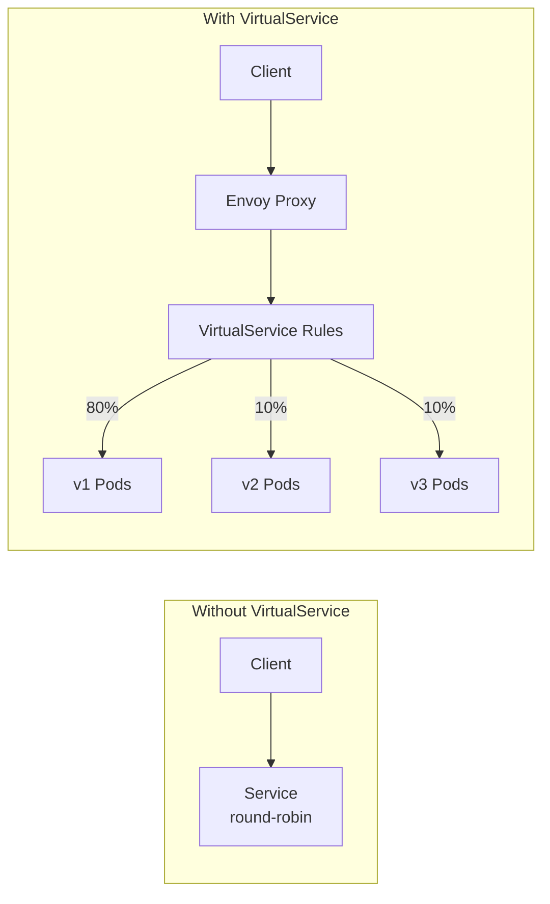
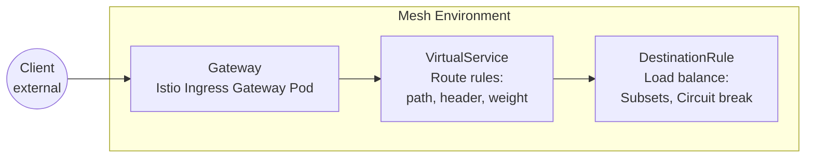
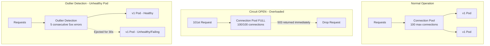

## Complexity: `[COMPLEX]`
## Time to Complete: 60-75 minutes

---

## Prerequisites

Before starting this module, you should have completed:
- [Module 1: Installation & Architecture](../module-1.1-istio-installation-architecture/) — Istio installation and sidecar injection
- [CKA Module 3.5: Gateway API](/k8s/cka/part3-services-networking/module-3.5-gateway-api/) — Kubernetes Gateway API basics
- A robust understanding of standard HTTP routing concepts, including headers, request paths, and methods.

---

## What You'll Be Able to Do

After completing this module, you will be able to:

1. **Design** VirtualService routing architectures to manage header-based, path-based, and weighted traffic distribution.
2. **Implement** safe release strategies, including canary and blue-green deployments, leveraging Istio subset configurations.
3. **Diagnose** traffic routing failures by comparing expected VirtualService rules against active DestinationRule subsets.
4. **Evaluate** resilience posture by applying circuit breakers, retries, and timeouts to inter-service communications.
5. **Implement** controlled chaos engineering using fault injection to proactively discover cascading failures.

---

## Why This Module Matters

In 2012, Knight Capital Group deployed new trading software to production. Due to a critical routing configuration error where obsolete endpoints were not removed, the system began executing millions of erratic trades. They lost $460 million in exactly 45 minutes—roughly $10 million per minute—before they could halt the traffic. While they were not utilizing a modern service mesh, the core lesson remains absolute: traffic routing is the most critical and potentially dangerous control plane in your infrastructure. 

Traffic Management represents **35% of the ICA exam**—the single largest domain. When you combine this with Resilience and Fault Injection (10%), mastering traffic routing is non-negotiable for certification success. More importantly, it is the foundation of modern site reliability engineering. You must be able to write VirtualService, DestinationRule, and Gateway resources from memory, configure traffic splitting, inject faults, and set up resilience policies flawlessly.

This is where Istio shines brightest. Without a service mesh, implementing canary deployments, circuit breaking, or fault injection requires modifying application code, updating SDKs, and hoping every microservice team upgrades their libraries concurrently. With Istio, these capabilities are entirely abstracted into the Envoy proxy. You can shift 10% of live traffic to a canary build or inject a 5-second delay into a billing service with a few lines of YAML—and the underlying application code never even knows it happened.

---

## What You'll Learn

By the end of this comprehensive module, you will thoroughly understand how to:
- Configure VirtualService resources for granular HTTP routing, probabilistic traffic splitting, and fault injection.
- Utilize DestinationRule resources for load balancing, strict circuit breaking, and connection pool management.
- Set up Gateway and ServiceEntry configurations to securely manage ingress and egress traffic.
- Implement production-grade canary deployments using weighted routing metrics.
- Configure retries, timeouts, and circuit breaking to establish robust network resilience.
- Inject faults, such as targeted delays and HTTP aborts, for proactive chaos testing.
- Utilize zero-risk traffic mirroring to securely shadow production traffic into staging environments.

---

## Did You Know?

- **Fact 1:** The Envoy proxy, written in C++, can process over 100,000 requests per second per core, making the mesh data plane incredibly lightweight and highly performant.
- **Fact 2:** Traffic splitting does not utilize a centralized load balancer; instead, each independent Envoy proxy makes weighted random choices, enabling massive distributed probabilistic routing.
- **Fact 3:** Istio can dynamically route traffic based on literally any HTTP header, allowing for highly sophisticated test environments using custom user-agent strings or session cookies without code changes.
- **Fact 4:** The first open-source release of Istio (version 0.1) was officially announced on May 24, 2017, as a joint collaboration between Google, IBM, and Lyft.

---

## War Story: The Canary That Cooked the Kitchen

**Characters:**
- Priya: Senior SRE (5 years experience)
- Deployment: Payment service v2 with new fraud detection capabilities

**The Incident:**

Priya successfully configured a 90/10 canary deployment for the company's core payment service. Version 2 was steadily receiving 10% of traffic. Initial metrics looked pristine—latency was stable, and the error rate was an absolute zero. After a 30-minute observation window, she decisively shifted the traffic weight to 50/50. Operations remained stable. Confident in the release, she shifted the weight to 100%.

Within exactly five minutes, the payment service began bleeding 503 HTTP errors. It wasn't a minor degradation; roughly 30% of all payment requests were failing outright. The team executed an emergency rollback to v1 immediately, but the financial damage was already crystallized: $200,000 in failed customer transactions during a brutal 7-minute window.

**What went wrong?**

The VirtualService was routing by weight correctly, but Priya had forgotten to apply the corresponding DestinationRule. Without it, Istio fell back to default round-robin load balancing across all available pods—both v1 and v2. The VirtualService explicitly commanded the proxy to "send 100% to the v2 subset," but because the DestinationRule was missing, there was no defined subset in the mesh registry. Istio could not locate the targeted subset and thus threw immediate 503 errors.

**The missing piece:**

```yaml
# Priya had this VirtualService:
apiVersion: networking.istio.io/v1
kind: VirtualService
metadata:
  name: payment
spec:
  hosts:
  - payment
  http:
  - route:
    - destination:
        host: payment
        subset: v2    # <- References a subset...
      weight: 100
```

```yaml
# But forgot this DestinationRule:
apiVersion: networking.istio.io/v1
kind: DestinationRule
metadata:
  name: payment
spec:
  host: payment
  subsets:            # <- ...that must be defined here
  - name: v1
    labels:
      version: v1
  - name: v2
    labels:
      version: v2
```

**The Final Lesson**: VirtualService and DestinationRule are inextricably linked. If your VirtualService references specific subsets, you MUST ensure a matching DestinationRule is actively applied to the cluster. Always run `istioctl analyze` before aggressively applying traffic rules to production environments.

---

## Part 1: The Core Resources

### Concept 1: VirtualService

A VirtualService defines **how** network requests are dynamically routed to a service. It forcefully intercepts traffic at the Envoy proxy level and strictly applies your custom routing rules before the request ever reaches the intended destination pod. This resource is essentially the core brain of your traffic manipulation logic.



**Basic VirtualService Example:**

```yaml
apiVersion: networking.istio.io/v1
kind: VirtualService
metadata:
  name: reviews
spec:
  hosts:
  - reviews                    # Which service this applies to
  http:
  - match:                     # Conditions (optional)
    - headers:
        end-user:
          exact: jason         # If header matches...
    route:
    - destination:
        host: reviews
        subset: v2             # ...route to v2
  - route:                     # Default route (no match = catch-all)
    - destination:
        host: reviews
        subset: v1
```

**VirtualService Key Fields:**

| Field | Purpose | Example |
|-------|---------|---------|
| `hosts` | Services this rule applies to | `["reviews"]`, `["*.example.com"]` |
| `http[].match` | Conditions for routing | Headers, URI, method, query params |
| `http[].route` | Where to send traffic | Service host + subset + weight |
| `http[].timeout` | Request timeout | `10s` |
| `http[].retries` | Retry configuration | `attempts: 3` |
| `http[].fault` | Fault injection | `delay`, `abort` |
| `http[].mirror` | Traffic mirroring | Send copy to another service |

### Concept 2: DestinationRule

While VirtualService handles the "routing plan", a DestinationRule defines the stringent **policies** applied to traffic *after* the routing decision has explicitly occurred. It configures the granular mechanics of load balancing, connection pool sizing, outlier detection, and internal TLS settings for a specific target destination.

```yaml
apiVersion: networking.istio.io/v1
kind: DestinationRule
metadata:
  name: reviews
spec:
  host: reviews                    # Which service
  trafficPolicy:                   # Global policies
    connectionPool:
      tcp:
        maxConnections: 100
      http:
        h2UpgradePolicy: DEFAULT
        http1MaxPendingRequests: 100
        http2MaxRequests: 1000
    loadBalancer:
      simple: ROUND_ROBIN          # or LEAST_CONN, RANDOM, PASSTHROUGH
    outlierDetection:
      consecutive5xxErrors: 5
      interval: 30s
      baseEjectionTime: 30s
  subsets:                          # Named versions
  - name: v1
    labels:
      version: v1
  - name: v2
    labels:
      version: v2
    trafficPolicy:                 # Per-subset override
      loadBalancer:
        simple: LEAST_CONN
  - name: v3
    labels:
      version: v3
```

**Subsets** are specifically named groups of pods targeted by Kubernetes labels. A VirtualService references these named subsets to accurately route to specific application versions.

> **Pause and predict**: If you configure a VirtualService to route 100% of traffic to the 'v2' subset, but forget to define 'v2' in the corresponding DestinationRule, what HTTP status code will the Envoy proxy return to the client?

### Concept 3: Gateway

An Istio Gateway configures a robust load balancer at the very edge of the mesh to manage incoming (ingress) or outgoing (egress) HTTP/TCP traffic. It actively binds to an underlying Istio ingress or egress gateway workload pod. Unlike the standard Kubernetes Ingress object, an Istio Gateway separates L4-L6 configuration (ports, TLS) from L7 routing (paths, headers).

```yaml
apiVersion: networking.istio.io/v1
kind: Gateway
metadata:
  name: bookinfo-gateway
spec:
  selector:
    istio: ingressgateway           # Bind to Istio's ingress gateway
  servers:
  - port:
      number: 80
      name: http
      protocol: HTTP
    hosts:
    - "bookinfo.example.com"        # Accept traffic for this host
  - port:
      number: 443
      name: https
      protocol: HTTPS
    hosts:
    - "bookinfo.example.com"
    tls:
      mode: SIMPLE
      credentialName: bookinfo-tls   # K8s Secret with cert/key
```

**Connecting a Gateway to a VirtualService:**
A Gateway manages the physical port bindings, but it cannot route traffic on its own. You must bind it to a VirtualService.

```yaml
apiVersion: networking.istio.io/v1
kind: VirtualService
metadata:
  name: bookinfo
spec:
  hosts:
  - "bookinfo.example.com"
  gateways:
  - bookinfo-gateway               # Reference the Gateway
  http:
  - match:
    - uri:
        prefix: /productpage
    route:
    - destination:
        host: productpage
        port:
          number: 9080
  - match:
    - uri:
        prefix: /reviews
    route:
    - destination:
        host: reviews
```

**Traffic Flow with a Gateway:**



### Concept 4: ServiceEntry

A ServiceEntry is used to aggressively inject external endpoints into Istio's internal service registry. This capability lets you cleanly manage external API traffic as if those external services were native components living inside the mesh.

```yaml
apiVersion: networking.istio.io/v1
kind: ServiceEntry
metadata:
  name: external-api
spec:
  hosts:
  - api.external.com
  location: MESH_EXTERNAL             # Outside the mesh
  ports:
  - number: 443
    name: https
    protocol: TLS
  resolution: DNS
```

```yaml
# Now you can apply traffic rules to external services!
apiVersion: networking.istio.io/v1
kind: VirtualService
metadata:
  name: external-api-timeout
spec:
  hosts:
  - api.external.com
  http:
  - timeout: 5s
    route:
    - destination:
        host: api.external.com
```

**Why ServiceEntry matters heavily:**
By default, Istio might permit all outbound traffic to pass through. However, if you enforce a zero-trust posture using `meshConfig.outboundTrafficPolicy.mode: REGISTRY_ONLY`, only officially registered services are technically accessible. In these strict environments, a ServiceEntry becomes fundamentally required to reach the outside world.

---

## Part 2: Traffic Shifting & Canary Deployments

Traffic shifting is critical for modern delivery pipelines. It allows teams to decouple deployment (pushing code to servers) from release (exposing code to users).

### Concept 5: Weighted Routing

This is the industry-standard canary pattern—splitting traffic mathematically by distinct percentages.

```yaml
apiVersion: networking.istio.io/v1
kind: VirtualService
metadata:
  name: reviews
spec:
  hosts:
  - reviews
  http:
  - route:
    - destination:
        host: reviews
        subset: v1
      weight: 80               # 80% to v1
    - destination:
        host: reviews
        subset: v2
      weight: 20               # 20% to v2
```

```yaml
apiVersion: networking.istio.io/v1
kind: DestinationRule
metadata:
  name: reviews
spec:
  host: reviews
  subsets:
  - name: v1
    labels:
      version: v1
  - name: v2
    labels:
      version: v2
```

**A Progressive Rollout Execution:**

```bash
# Step 1: 90/10 split
kubectl apply -f - <<EOF
apiVersion: networking.istio.io/v1
kind: VirtualService
metadata:
  name: reviews
spec:
  hosts:
  - reviews
  http:
  - route:
    - destination:
        host: reviews
        subset: v1
      weight: 90
    - destination:
        host: reviews
        subset: v2
      weight: 10
EOF

# Monitor error rates rigorously... then cautiously increase

# Step 2: 50/50 split
kubectl patch virtualservice reviews --type merge -p '
spec:
  http:
  - route:
    - destination:
        host: reviews
        subset: v1
      weight: 50
    - destination:
        host: reviews
        subset: v2
      weight: 50'

# Step 3: Full rollout to the new build
kubectl patch virtualservice reviews --type merge -p '
spec:
  http:
  - route:
    - destination:
        host: reviews
        subset: v2
      weight: 100'
```

### Concept 6: Header-Based Routing

This advanced strategy allows you to silently route specific internal users, automated testing suites, or QA teams directly to an isolated version without exposing it to the broader public.

```yaml
apiVersion: networking.istio.io/v1
kind: VirtualService
metadata:
  name: reviews
spec:
  hosts:
  - reviews
  http:
  # Rule 1: Route specific user "jason" directly to v2
  - match:
    - headers:
        end-user:
          exact: jason
    route:
    - destination:
        host: reviews
        subset: v2
  # Rule 2: Route all requests carrying the "canary: true" header to v3
  - match:
    - headers:
        canary:
          exact: "true"
    route:
    - destination:
        host: reviews
        subset: v3
  # Rule 3: The general public falls through to v1
  - route:
    - destination:
        host: reviews
        subset: v1
```

### Concept 7: URI-Based Routing

Often necessary when deploying monolithic API gateways that need to securely direct differing URL paths to deeply isolated microservices.

```yaml
apiVersion: networking.istio.io/v1
kind: VirtualService
metadata:
  name: bookinfo
spec:
  hosts:
  - bookinfo.example.com
  gateways:
  - bookinfo-gateway
  http:
  - match:
    - uri:
        exact: /productpage
    route:
    - destination:
        host: productpage
        port:
          number: 9080
  - match:
    - uri:
        prefix: /api/v1/reviews
    route:
    - destination:
        host: reviews
        port:
          number: 9080
  - match:
    - uri:
        regex: "/api/v[0-9]+/ratings"
    route:
    - destination:
        host: ratings
        port:
          number: 9080
```

**Common URI Match Types:**

| Type | Example | Matches |
|------|---------|---------|
| `exact` | `/productpage` | Only `/productpage` precisely |
| `prefix` | `/api/v1` | `/api/v1`, `/api/v1/reviews`, etc. |
| `regex` | `/api/v[0-9]+` | `/api/v1`, `/api/v2`, etc. |

---

## Part 3: Fault Injection

Fault injection enables engineers to proactively test how heavily an application degrades during chaotic failures—without actually ripping out network cables. This is how sophisticated Netflix-style chaos engineering safely executes at the mesh layer.

### Concept 8: Delay Injection

Simulate severe network latency to identify hidden timeout mismatches.

```yaml
apiVersion: networking.istio.io/v1
kind: VirtualService
metadata:
  name: ratings
spec:
  hosts:
  - ratings
  http:
  - fault:
      delay:
        percentage:
          value: 100            # 100% of requests get delayed
        fixedDelay: 7s          # Force an artificial 7 second delay
    route:
    - destination:
        host: ratings
        subset: v1
```

**Selective delay — only deliberately affecting specific users:**

```yaml
apiVersion: networking.istio.io/v1
kind: VirtualService
metadata:
  name: ratings
spec:
  hosts:
  - ratings
  http:
  - match:
    - headers:
        end-user:
          exact: jason
    fault:
      delay:
        percentage:
          value: 100
        fixedDelay: 7s
    route:
    - destination:
        host: ratings
        subset: v1
  - route:
    - destination:
        host: ratings
        subset: v1
```

### Concept 9: Abort Injection

Simulate catastrophic HTTP infrastructure errors seamlessly.

```yaml
apiVersion: networking.istio.io/v1
kind: VirtualService
metadata:
  name: ratings
spec:
  hosts:
  - ratings
  http:
  - fault:
      abort:
        percentage:
          value: 50              # 50% of requests get aggressively aborted
        httpStatus: 503          # Instantly Return 503 Service Unavailable
    route:
    - destination:
        host: ratings
        subset: v1
```

**Combined Faults:**
You can aggressively combine both delays and complete aborts simultaneously for maximum stress testing.

```yaml
apiVersion: networking.istio.io/v1
kind: VirtualService
metadata:
  name: ratings
spec:
  hosts:
  - ratings
  http:
  - fault:
      delay:
        percentage:
          value: 50
        fixedDelay: 5s
      abort:
        percentage:
          value: 10
        httpStatus: 500
    route:
    - destination:
        host: ratings
        subset: v1
```

This strict logic means: 50% of requests are brutally delayed by 5s, and completely independently, 10% forcefully return HTTP 500.

---

## Part 4: Resilience

> **Stop and think**: If a service has an overall request timeout of 3 seconds, but is configured to retry 3 times with a per-try timeout of 2 seconds, will the request ever reach the third retry attempt? Why or why not?

### Concept 10: Timeouts & Retries

Prevent requests from endlessly hanging and consuming precious thread pools.

```yaml
apiVersion: networking.istio.io/v1
kind: VirtualService
metadata:
  name: reviews
spec:
  hosts:
  - reviews
  http:
  - timeout: 3s                 # Fail automatically if no response within 3 seconds
    route:
    - destination:
        host: reviews
        subset: v1
```

**Retries:**
Automatically instruct Envoy to safely retry failed network requests.

```yaml
apiVersion: networking.istio.io/v1
kind: VirtualService
metadata:
  name: reviews
spec:
  hosts:
  - reviews
  http:
  - retries:
      attempts: 3               # Safely retry up to 3 times
      perTryTimeout: 2s         # Each retry attempt gets a strict 2 seconds
      retryOn: 5xx,reset,connect-failure,retriable-4xx
    route:
    - destination:
        host: reviews
        subset: v1
```

**Common `retryOn` Conditions:**

| Value | Retries When |
|-------|-------------|
| `5xx` | The remote server cleanly returns any 5xx error |
| `reset` | The network connection unexpectedly resets |
| `connect-failure` | Envoy fundamentally can't establish a TCP connection |
| `retriable-4xx` | Explicit 4xx codes, such as 409 Conflict |
| `gateway-error` | Specific proxy errors: 502, 503, 504 |

**Warning**: Unchecked retries forcefully multiply network load. 3 retries means a severely failing downstream service will suddenly receive 4x the total traffic. You must strictly pair retries with robust circuit breaking to prevent massive denial-of-service spirals.

### Concept 11: Circuit Breaking

Circuit breaking acts as a critical fail-safe to prevent massive cascading failures by immediately stopping traffic to severely unhealthy instances.

```yaml
apiVersion: networking.istio.io/v1
kind: DestinationRule
metadata:
  name: reviews
spec:
  host: reviews
  trafficPolicy:
    connectionPool:
      tcp:
        maxConnections: 100       # Max total TCP connections permitted
      http:
        http1MaxPendingRequests: 10  # Max aggressively queued requests
        http2MaxRequests: 100        # Max concurrent multiplexed requests
        maxRequestsPerConnection: 10 # Max requests per persistent connection
        maxRetries: 3                # Max concurrent allowed retries
    outlierDetection:
      consecutive5xxErrors: 5     # Eject bad actor after 5 consecutive 5xx errors
      interval: 10s              # System check every 10 seconds
      baseEjectionTime: 30s      # Mandate ejection for at least 30 seconds
      maxEjectionPercent: 50     # Never eject more than 50% of the total host pool
  subsets:
  - name: v1
    labels:
      version: v1
```

**How Circuit Breaking Functions Graphically:**



### Concept 12: Outlier Detection

Outlier detection is a hyper-specific form of circuit breaking that actively ejects specifically unhealthy endpoint instances from the broader load balancing pool, while keeping healthy peers actively engaged.

```yaml
apiVersion: networking.istio.io/v1
kind: DestinationRule
metadata:
  name: reviews
spec:
  host: reviews
  trafficPolicy:
    outlierDetection:
      consecutive5xxErrors: 3     # Eject specific pod after 3 isolated errors
      interval: 15s              # Strict evaluation interval window
      baseEjectionTime: 30s      # Absolute minimum ejection duration
      maxEjectionPercent: 30     # Maximum % of infrastructure allowed to be ejected
      minHealthPercent: 70       # Security limit: Only eject if >70% pool is healthy
```

---

## Part 5: Traffic Mirroring

### Concept 13: Traffic Mirroring

Mirror (or seamlessly shadow) active traffic directly to an experimental service for high-fidelity testing without natively affecting the primary data flow. The mirrored request functions as fire-and-forget—backend responses from the mirror are entirely discarded.

```yaml
apiVersion: networking.istio.io/v1
kind: VirtualService
metadata:
  name: reviews
spec:
  hosts:
  - reviews
  http:
  - route:
    - destination:
        host: reviews
        subset: v1
      weight: 100
    mirror:
      host: reviews
      subset: v2                 # Silently Mirror all traffic to v2
    mirrorPercentage:
      value: 100                 # Fully mirror exactly 100% of the live traffic
```

**Strategic Use cases for massive mirroring:**
- Validating a completely rewritten version with true production traffic patterns.
- Conducting risk-free load testing without utilizing synthetic, inaccurate traffic suites.
- Capturing profound real-world request data for advanced debugging.

---

## Part 6: Ingress & Egress Configuration

### Concept 14: Configuring Ingress with Gateway

A complete architectural example exposing a critical internal application safely to external network traffic:

```yaml
# Step 1: Gateway (the structural front door)
apiVersion: networking.istio.io/v1
kind: Gateway
metadata:
  name: httpbin-gateway
spec:
  selector:
    istio: ingressgateway
  servers:
  - port:
      number: 80
      name: http
      protocol: HTTP
    hosts:
    - "httpbin.example.com"
```

```yaml
# Step 2: VirtualService (the underlying routing rules)
apiVersion: networking.istio.io/v1
kind: VirtualService
metadata:
  name: httpbin
spec:
  hosts:
  - "httpbin.example.com"
  gateways:
  - httpbin-gateway
  http:
  - match:
    - uri:
        prefix: /status
    - uri:
        prefix: /delay
    route:
    - destination:
        host: httpbin
        port:
          number: 8000
```

```bash
# Get the ingress gateway's highly available external IP
export INGRESS_HOST=$(kubectl -n istio-system get service istio-ingressgateway \
  -o jsonpath='{.status.loadBalancer.ingress[0].ip}')
export INGRESS_PORT=$(kubectl -n istio-system get service istio-ingressgateway \
  -o jsonpath='{.spec.ports[?(@.name=="http2")].port}')

# For kind/minikube (utilizing NodePort):
export INGRESS_PORT=$(kubectl -n istio-system get service istio-ingressgateway \
  -o jsonpath='{.spec.ports[?(@.name=="http2")].nodePort}')
export INGRESS_HOST=$(kubectl get nodes -o jsonpath='{.items[0].status.addresses[?(@.type=="InternalIP")].address}')

# Effectively Test the Route
curl -H "Host: httpbin.example.com" `http://$INGRESS_HOST:$INGRESS_PORT/status/200`
```

**Securing TLS at the Ingress Edge:**

```bash
# Strictly Create the TLS secret
kubectl create -n istio-system secret tls httpbin-tls \
  --key=httpbin.key \
  --cert=httpbin.crt
```

```yaml
apiVersion: networking.istio.io/v1
kind: Gateway
metadata:
  name: httpbin-gateway
spec:
  selector:
    istio: ingressgateway
  servers:
  - port:
      number: 443
      name: https
      protocol: HTTPS
    hosts:
    - "httpbin.example.com"
    tls:
      mode: SIMPLE                    # Strict One-way TLS
      credentialName: httpbin-tls     # Corresponding K8s Secret name
```

**Understanding TLS Modes at the Gateway:**

| Mode | Description |
|------|-------------|
| `SIMPLE` | Standard outbound TLS (validates server certificate only) |
| `MUTUAL` | Strict mTLS (mandates both client and server cryptographic certs) |
| `PASSTHROUGH` | Blindly forward encrypted traffic as-is (SNI-based routing without termination) |
| `AUTO_PASSTHROUGH` | Similar to PASSTHROUGH but utilizing automatic SNI resolution |
| `ISTIO_MUTUAL` | Leverage Istio's internal secure mTLS (essential for mesh-internal structural gateways) |

### Concept 15: Secure Egress Traffic

By default, overly permissive Istio sidecars carelessly allow all outbound network traffic. You must actively lock this down for compliance.

```yaml
# Inside the core IstioOperator or global mesh config
apiVersion: install.istio.io/v1alpha1
kind: IstioOperator
spec:
  meshConfig:
    outboundTrafficPolicy:
      mode: REGISTRY_ONLY          # Aggressively Block unregistered external targets
```

**Providing Regulated Access via ServiceEntry:**

```yaml
# Securely Allow access to a specifically approved external API
apiVersion: networking.istio.io/v1
kind: ServiceEntry
metadata:
  name: google-api
spec:
  hosts:
  - "www.googleapis.com"
  ports:
  - number: 443
    name: https
    protocol: TLS
  location: MESH_EXTERNAL
  resolution: DNS
```

```yaml
# Optional: Strictly Apply traffic policy specifically to the external service
apiVersion: networking.istio.io/v1
kind: DestinationRule
metadata:
  name: google-api
spec:
  host: "www.googleapis.com"
  trafficPolicy:
    tls:
      mode: SIMPLE                 # Cleanly Originate TLS connections outwardly
```

**Egress Gateway Routing:**
To ensure strict auditing, you must actively route traffic outwardly through a dedicated internal egress proxy.

```yaml
apiVersion: networking.istio.io/v1
kind: ServiceEntry
metadata:
  name: external-svc
spec:
  hosts:
  - external.example.com
  ports:
  - number: 443
    name: tls
    protocol: TLS
  location: MESH_EXTERNAL
  resolution: DNS
```

```yaml
apiVersion: networking.istio.io/v1
kind: Gateway
metadata:
  name: egress-gateway
spec:
  selector:
    istio: egressgateway
  servers:
  - port:
      number: 443
      name: tls
      protocol: TLS
    hosts:
    - external.example.com
    tls:
      mode: PASSTHROUGH
```

```yaml
apiVersion: networking.istio.io/v1
kind: VirtualService
metadata:
  name: external-through-egress
spec:
  hosts:
  - external.example.com
  gateways:
  - mesh                          # Internal mesh traffic domain
  - egress-gateway                # Verified Egress gateway
  tls:
  - match:
    - gateways:
      - mesh
      port: 443
      sniHosts:
      - external.example.com
    route:
    - destination:
        host: istio-egressgateway.istio-system.svc.cluster.local
        port:
          number: 443
  - match:
    - gateways:
      - egress-gateway
      port: 443
      sniHosts:
      - external.example.com
    route:
    - destination:
        host: external.example.com
        port:
          number: 443
```

---

## Common Mistakes

| Mistake | Why (Symptom) | Fix |
|---------|---------|----------|
| VirtualService explicitly references a targeted subset without a DestinationRule | Immediate 503 errors, logging `no healthy upstream` | Always ensure a properly created DestinationRule perfectly defines matching subsets |
| Programmed configuration Weights severely fail to sum to exactly 100 | Istio strictly rejects configuration or exhibits totally unexpected chaotic distribution | Rigorously ensure all configured weights total mathematically exactly to 100 |
| Defined Gateway host doesn't natively match the VirtualService configured host | Incoming traffic simply doesn't accurately reach the downstream service | Hosts must match perfectly exactly between the mapped Gateway and VirtualService |
| Fatally Missing `gateways:` field in the configured VirtualService | System perfectly works for internal mesh traffic, but totally ignores ingress requests | Explicitly Add `gateways: [gateway-name]` to properly wire external ingress traffic |
| Applying aggressive Retries without properly utilizing strict circuit breaking | Absolute Retry storm severely overwhelms a mildly failing backend service | Always mandate pairing retries with outlier detection fail-safes |
| Explicit Timeout duration is shorter than the combined `retries * perTryTimeout` | The brutal Timeout immediately kills executing retries prematurely | Architecturally Set timeout logically >= attempts * perTryTimeout |
| A mandated ServiceEntry is missing for a needed external downstream service | You encounter 502 errors when strictly applying `REGISTRY_ONLY` mode | Consistently Add a ServiceEntry for every single external network dependency |
| Providing the Wrong port explicitly defined in the DestinationRule | Hard Connection universally refused or a totally silent routing failure | Deliberately Match port numbers perfectly exactly with the standard Kubernetes Service |

---

## Quiz

Test your architectural knowledge logically:

**Q1: You are auditing a cluster's traffic flow and need to explain the architecture to a junior engineer. What is the relationship between VirtualService and DestinationRule?**

<details>
<summary>Show Answer</summary>

**VirtualService** defines *where* traffic goes (routing rules: match conditions, weights, hosts).
**DestinationRule** defines *how* traffic arrives (policies: load balancing, circuit breaking, subsets, TLS).

VirtualService is applied first (routing decision), then DestinationRule (policy enforcement). If a VirtualService references a subset, the DestinationRule MUST define that subset.

</details>

**Q2: The marketing team wants to perform an A/B test on the product page. Write a VirtualService that sends 80% of traffic to v1 and 20% to v2 of the "productpage" service.**

<details>
<summary>Show Answer</summary>

```yaml
apiVersion: networking.istio.io/v1
kind: VirtualService
metadata:
  name: productpage
spec:
  hosts:
  - productpage
  http:
  - route:
    - destination:
        host: productpage
        subset: v1
      weight: 80
    - destination:
        host: productpage
        subset: v2
      weight: 20
```

(Requires a DestinationRule with `v1` and `v2` subsets defined.)

</details>

**Q3: Your team is performing chaos engineering on the ratings service to ensure the frontend degrades gracefully. How do you inject a 5-second delay into 50% of requests to the ratings service?**

<details>
<summary>Show Answer</summary>

```yaml
apiVersion: networking.istio.io/v1
kind: VirtualService
metadata:
  name: ratings
spec:
  hosts:
  - ratings
  http:
  - fault:
      delay:
        percentage:
          value: 50
        fixedDelay: 5s
    route:
    - destination:
        host: ratings
```

</details>

**Q4: A service is experiencing intermittent cascading failures under load. You need to configure resilience. What is the difference between circuit breaking (connectionPool) and outlier detection?**

<details>
<summary>Show Answer</summary>

- **Connection pool (circuit breaking)**: Limits the *number* of connections/requests to a service. When limits are hit, new requests get 503. Protects the destination from overload.
- **Outlier detection**: Monitors individual endpoints for errors and *ejects* unhealthy ones from the pool. Remaining healthy endpoints still receive traffic.

Both are configured in DestinationRule. They complement each other: connection pool prevents overload, outlier detection removes bad instances.

</details>

**Q5: You are exposing a new microservice to the public internet. What does a Gateway resource actually do?**

<details>
<summary>Show Answer</summary>

Gateway configures a load balancer (typically the Istio ingress gateway pod) to accept traffic from outside the mesh. It specifies:
- Which ports to listen on
- Which protocols to accept (HTTP, HTTPS, TCP, TLS)
- Which hosts to accept traffic for
- TLS configuration (certificates, mTLS)

Gateway does NOT define routing — it must be paired with a VirtualService that references it via `gateways: [gateway-name]`.

</details>

**Q6: Security compliance requires that all outbound traffic from the mesh must be explicitly whitelisted. How do you restrict egress traffic to only registered services?**

<details>
<summary>Show Answer</summary>

Set the outbound traffic policy to `REGISTRY_ONLY`:

```yaml
meshConfig:
  outboundTrafficPolicy:
    mode: REGISTRY_ONLY
```

Then register external services with ServiceEntry resources. Any traffic to unregistered external hosts will be blocked.

</details>

**Q7: The QA team wants to test a major rewrite of the reviews service using real user traffic, but without impacting the user experience. What is traffic mirroring and when would you use it?**

<details>
<summary>Show Answer</summary>

Traffic mirroring sends a copy of live traffic to a secondary service. The mirrored traffic is fire-and-forget — responses from the mirror are discarded and don't affect the primary request.

Use cases:
- Testing a new version with real production traffic patterns
- Load testing without synthetic traffic
- Debugging by capturing real requests
- Comparing behavior between versions

```yaml
mirror:
  host: reviews
  subset: v2
mirrorPercentage:
  value: 100
```

</details>

**Q8: You notice that some requests are failing despite having retries configured. What happens if you configure retries with attempts: 3 and perTryTimeout: 2s, but the overall timeout is 3s?**

<details>
<summary>Show Answer</summary>

The overall timeout (3s) overrides the retry budget. With `perTryTimeout: 2s` and `attempts: 3`, you'd need 6s total for all retries. But the 3s timeout means at most the first attempt (2s) plus part of the second attempt can complete before the overall timeout kills the request.

**Best practice**: Set `timeout >= attempts * perTryTimeout` (in this case, >= 6s).

</details>

**Q9: Your application needs to call a third-party payment API, but the connection keeps getting dropped. What is a ServiceEntry and when is it required?**

<details>
<summary>Show Answer</summary>

ServiceEntry adds external services to Istio's internal service registry. It's required when:
1. `outboundTrafficPolicy.mode` is `REGISTRY_ONLY` (external traffic is blocked by default)
2. You want to apply Istio traffic rules (timeouts, retries, fault injection) to external services
3. You want to monitor external service traffic through Istio's observability features

Without `REGISTRY_ONLY`, ServiceEntry is optional but still useful for applying policies.

</details>

**Q10: You need to securely expose the main web application. Write a Gateway + VirtualService to expose the "frontend" service on HTTPS at frontend.example.com.**

<details>
<summary>Show Answer</summary>

```yaml
apiVersion: networking.istio.io/v1
kind: Gateway
metadata:
  name: frontend-gateway
spec:
  selector:
    istio: ingressgateway
  servers:
  - port:
      number: 443
      name: https
      protocol: HTTPS
    hosts:
    - "frontend.example.com"
    tls:
      mode: SIMPLE
      credentialName: frontend-tls
```

```yaml
apiVersion: networking.istio.io/v1
kind: VirtualService
metadata:
  name: frontend
spec:
  hosts:
  - "frontend.example.com"
  gateways:
  - frontend-gateway
  http:
  - route:
    - destination:
        host: frontend
        port:
          number: 80
```

(Requires a TLS secret named `frontend-tls` in `istio-system` namespace.)

</details>

**Q11: The development team needs to access a hidden canary version of the application for debugging. How do you route requests with the header `x-test: canary` to subset v2, and all other traffic to v1?**

<details>
<summary>Show Answer</summary>

```yaml
apiVersion: networking.istio.io/v1
kind: VirtualService
metadata:
  name: myapp
spec:
  hosts:
  - myapp
  http:
  - match:
    - headers:
        x-test:
          exact: canary
    route:
    - destination:
        host: myapp
        subset: v2
  - route:
    - destination:
        host: myapp
        subset: v1
```

Match rules are evaluated top-to-bottom. The first match wins. The catch-all (no match) at the bottom handles everything else.

</details>

---

## Hands-On Exercise: Traffic Management with Bookinfo

### Objective
Deploy the canonical Bookinfo application architecture and practice strict traffic management operations, including canary deployment, explicit fault injection, and aggressive circuit breaking.

### Setup

<details>
<summary>Solution</summary>

```bash
# Ensure Istio is installed (from Module 1)
istioctl install --set profile=demo -y
kubectl label namespace default istio-injection=enabled

# Deploy Bookinfo
kubectl apply -f https://raw.githubusercontent.com/istio/istio/master/samples/bookinfo/platform/kube/bookinfo.yaml

# Wait for pods
kubectl wait --for=condition=ready pod --all -n default --timeout=120s

# Deploy all DestinationRules
kubectl apply -f https://raw.githubusercontent.com/istio/istio/master/samples/bookinfo/networking/destination-rule-all.yaml

# Deploy the Gateway
kubectl apply -f https://raw.githubusercontent.com/istio/istio/master/samples/bookinfo/networking/bookinfo-gateway.yaml

# Verify
istioctl analyze
```

</details>

### Task 1: Route All Traffic to v1

Force exactly 100% of traffic destined for the `reviews` service to explicitly target the `v1` subset, preventing any dynamic exposure.

<details>
<summary>Solution</summary>

```bash
kubectl apply -f - <<EOF
apiVersion: networking.istio.io/v1
kind: VirtualService
metadata:
  name: reviews
spec:
  hosts:
  - reviews
  http:
  - route:
    - destination:
        host: reviews
        subset: v1
EOF
```

Verify by sending traffic — you should rigorously only see reviews WITHOUT stars:

```bash
# Port-forward to productpage
kubectl port-forward svc/productpage 9080:9080 &

# Send requests — should always be v1 (no stars)
for i in $(seq 1 10); do
  curl -s `http://localhost:9080/productpage` | grep -o "glyphicon-star" | wc -l
done
```

</details>

### Task 2: Canary — Send 20% to v2

Adjust the mesh dynamically to inject 20% of live traffic into the new `v2` build, effectively executing a canary release.

<details>
<summary>Solution</summary>

```bash
kubectl apply -f - <<EOF
apiVersion: networking.istio.io/v1
kind: VirtualService
metadata:
  name: reviews
spec:
  hosts:
  - reviews
  http:
  - route:
    - destination:
        host: reviews
        subset: v1
      weight: 80
    - destination:
        host: reviews
        subset: v2
      weight: 20
EOF
```

Verify — roughly 2 out of 10 requests should reliably show black stars (v2):

```bash
for i in $(seq 1 20); do
  stars=$(curl -s `http://localhost:9080/productpage` | grep -o "glyphicon-star" | wc -l)
  echo "Request $i: $stars stars"
done
```

</details>

### Task 3: Inject a 3-second Delay

Implement precise chaos engineering by injecting an artificial 3-second latency into the `ratings` backend infrastructure.

<details>
<summary>Solution</summary>

```bash
kubectl apply -f - <<EOF
apiVersion: networking.istio.io/v1
kind: VirtualService
metadata:
  name: ratings
spec:
  hosts:
  - ratings
  http:
  - fault:
      delay:
        percentage:
          value: 100
        fixedDelay: 3s
    route:
    - destination:
        host: ratings
        subset: v1
EOF
```

Verify — application requests should visibly take ~3 seconds longer:

```bash
time curl -s `http://localhost:9080/productpage` > /dev/null
# Should show ~3+ seconds
```

</details>

### Task 4: Circuit Breaking

Establish a restrictive circuit breaker preventing massive concurrency load from successfully completing connection handshakes.

<details>
<summary>Solution</summary>

```bash
kubectl apply -f - <<EOF
apiVersion: networking.istio.io/v1
kind: DestinationRule
metadata:
  name: reviews-cb
spec:
  host: reviews
  trafficPolicy:
    connectionPool:
      http:
        http1MaxPendingRequests: 1
        http2MaxRequests: 1
        maxRequestsPerConnection: 1
    outlierDetection:
      consecutive5xxErrors: 1
      interval: 1s
      baseEjectionTime: 30s
      maxEjectionPercent: 100
EOF
```

Generate intense load to heavily trigger the engineered circuit breaking mechanism:

```bash
# Install fortio (Istio's robust load testing tool)
kubectl apply -f https://raw.githubusercontent.com/istio/istio/master/samples/httpbin/sample-client/fortio-deploy.yaml
kubectl wait --for=condition=ready pod -l app=fortio

# Send 20 massive concurrent connections
FORTIO_POD=$(kubectl get pods -l app=fortio -o jsonpath='{.items[0].metadata.name}')
kubectl exec $FORTIO_POD -c fortio -- fortio load -c 3 -qps 0 -n 30 -loglevel Warning \
  `http://reviews:9080/reviews/1`

# Look explicitly for "Code 503" responses — those indicate active circuit breaker trips
```

</details>

### Success Criteria Checklist

- [ ] All traffic securely routes directly to reviews v1 (no stars) when fully configured.
- [ ] Approximately 20% of traffic correctly shows stars when the precise canary pattern is configured.
- [ ] Deliberate delay injection accurately adds an absolute minimum of ~3 seconds to all requests.
- [ ] The configured circuit breaker aggressively returns raw 503 errors under massive concurrent load.
- [ ] Executing `istioctl analyze` explicitly shows zero structural errors for all deployed configurations.

### Cleanup

<details>
<summary>Solution</summary>

```bash
kill %1  # Aggressively Stop port-forward
kubectl delete virtualservice reviews ratings
kubectl delete destinationrule reviews-cb
```

</details>

---

## Next Module

Continue to [Module 3: Security & Troubleshooting](../module-1.3-istio-security-troubleshooting/) — covering foundational mTLS infrastructure, rigid authorization policies, detailed JWT authentication validation, and essential architectural debugging commands.