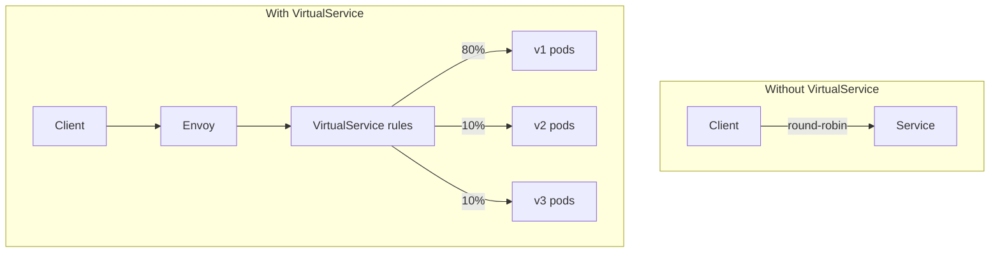
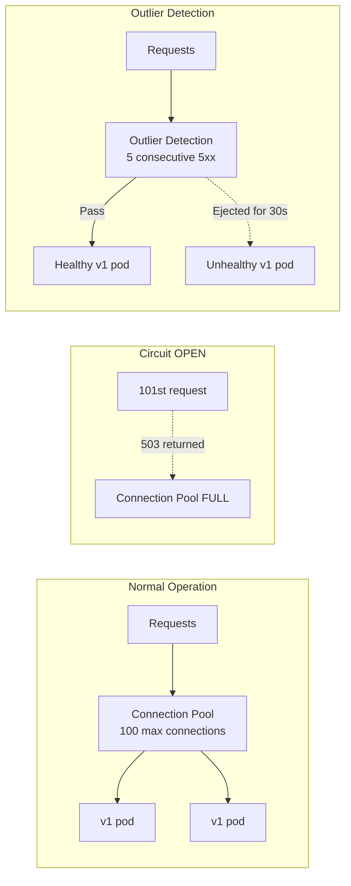

## Complexity: `[COMPLEX]`
## Time to Complete: 60-75 minutes

---

## Prerequisites

Before starting this module, ensure you are operating in an environment running Kubernetes v1.35 or newer. You should have completed:
- [Module 1: Installation & Architecture](../module-1.1-istio-installation-architecture/) — Istio installation and sidecar injection
- [CKA Module 3.5: Gateway API](/k8s/cka/part3-services-networking/module-3.5-gateway-api/) — Kubernetes Gateway API basics
- Strong foundational understanding of HTTP routing concepts (headers, paths, methods, response codes)

---

## What You'll Be Able to Do

After completing this rigorous technical module, you will be able to:

1. **Design** complex traffic routing topologies using VirtualService to split, match, and redirect HTTP requests across multiple service versions transparently.
2. **Implement** robust canary and blue-green deployment strategies by combining VirtualService probability weights with DestinationRule subset labels.
3. **Diagnose** microservice communication failures by injecting artificial delays and HTTP aborts into the mesh to validate application fault tolerance.
4. **Evaluate** service resilience under extreme load by configuring strict circuit breakers and precise connection pools within DestinationRules.
5. **Compare** standard Kubernetes Ingress approaches against Istio Gateway resources to secure and govern traffic entering and leaving the service mesh.

---

## Why This Module Matters

Traffic Management is **35% of the ICA exam** — the single largest domain by a significant margin. Combined with Resilience and Fault Injection (10%), traffic-related topics account for nearly half the exam. You must be able to write VirtualService, DestinationRule, and Gateway resources from memory, configure traffic splitting, inject faults, and set up resilience policies natively.

Imagine a massive global e-commerce platform gearing up for Black Friday. A major retailer attempted to deploy a completely new recommendation engine during peak traffic hours without a proper traffic shifting mechanism. The newly deployed service had an unnoticed memory leak and was immediately overwhelmed by the sheer volume of production traffic, returning cascading HTTP 500 errors. Because they lacked localized circuit breaking, the failure exhausted the connection pools of all upstream authentication and inventory services, effectively taking down the entire checkout flow. The outage lasted 45 minutes and cost the company an estimated $3.5 million in lost revenue.

This is exactly where Istio shines brightest. Without a service mesh, implementing canary deployments, circuit breaking, or fault injection requires pervasive application-level code changes or relying on complex, centralized load balancers. With Istio, these enterprise-grade patterns require only a few lines of YAML applied directly to the mesh — the underlying application code never knows the difference. You maintain absolute, surgical control over the blast radius of any deployment.

> **The Air Traffic Control Analogy**
>
> Think of Istio traffic management like a highly automated air traffic control system. Your microservices are airports. Without Istio, planes (requests) fly directly between airports with zero coordination, leading to chaos during storms. With Istio, VirtualServices act as the flight plans (dictating exactly where traffic goes), DestinationRules are the runway assignments and safety checks (defining how traffic arrives), and Gateways serve as the heavily guarded international terminals (controlling how traffic enters or leaves the mesh). The air traffic control system never modifies the planes themselves — it exclusively governs their routes.

---

## Did You Know?

- **VirtualService doesn't create virtual anything**: Despite the terminology, a VirtualService does not spin up a new Kubernetes Service, Pod, or Endpoint. It exclusively configures how traffic is routed *to* existing Kubernetes services by programming the Envoy sidecar proxies.
- **Traffic splitting happens probabilistically**: When you configure an 80/20 canary split, each Envoy proxy independently makes a weighted random routing choice on a per-request basis. There is no central choke point making these decisions; it is entirely distributed.
- **Istio can route by any HTTP header natively**: You can route requests based on custom user headers, authorization tokens, cookies, user-agents, and even source workload labels, enabling intricate QA environments without altering a single line of business logic.
- **Circuit breakers evaluate connections in microseconds**: Envoy's outlier detection checks host health and safely ejects failing pods in less than 500 microseconds. This intercepts traffic black holes exponentially faster than native Kubernetes readiness probes, which often take 10 to 30 seconds to react.

---

## War Story: The Canary That Cooked the Kitchen

**Characters:**
- Priya: Senior Site Reliability Engineer (5 years experience)
- Target Deployment: Payment service v2 containing a brand new fraud detection algorithm

**The Incident:**

Priya confidently configured a 90/10 canary deployment for the core payment service. Version 2 was successfully receiving 10% of the live traffic. The telemetry metrics looked fantastic — P99 latency was steady, and the error rate was absolutely zero. After 30 minutes of monitoring, she shifted the traffic to a 50/50 split. Everything still looked perfectly stable. Satisfied with the test, she shifted the weight to 100%.

Within exactly 5 minutes, the payment service began returning aggressive 503 Service Unavailable errors. This wasn't a minor blip — 30% of all payment requests globally were failing. The team smashed the panic button and rolled back to v1 immediately, but the financial damage was already finalized: $200K in failed, unrecoverable transactions during a 7-minute window.

**What went wrong?**

The VirtualService was mathematically routing by weight correctly, but Priya had forgotten to apply the corresponding DestinationRule to the cluster. Without the DestinationRule, Istio gracefully degraded to using standard round-robin load balancing across all available pods — mixing both v1 and v2 unpredictably. The VirtualService explicitly said "send 100% to the v2 subset," but there was literally no subset defined in the mesh registry. Envoy couldn't resolve the target subset and immediately returned a 503.

**The missing piece:**

```yaml
# Priya had this VirtualService:
apiVersion: networking.istio.io/v1
kind: VirtualService
metadata:
  name: payment
spec:
  hosts:
  - payment
  http:
  - route:
    - destination:
        host: payment
        subset: v2    # ← References a subset...
      weight: 100
```

```yaml
# But forgot this DestinationRule:
apiVersion: networking.istio.io/v1
kind: DestinationRule
metadata:
  name: payment
spec:
  host: payment
  subsets:            # ← ...that must be defined here
  - name: v1
    labels:
      version: v1
  - name: v2
    labels:
      version: v2
```

**The Core Lesson**: VirtualService and DestinationRule are fundamentally coupled. If your VirtualService references specific subsets, you MUST have an actively applied DestinationRule defining those subsets. Always run `istioctl analyze` before aggressively applying traffic rules to production.

---

## Part 1: Core Resources

To master Istio, you must intimately understand the difference between routing traffic and conditioning traffic. Under the hood, Istio's control plane (Istiod) translates these YAML definitions into Envoy's dynamic configuration APIs (xDS), specifically the Route Discovery Service (RDS) and Cluster Discovery Service (CDS).

### 1.1 VirtualService

VirtualService defines **how** requests are routed to a service. It intercepts outbound traffic at the source Envoy proxy and actively applies routing rules before the HTTP request ever traverses the network layer to the destination.



**Basic VirtualService Example:**

```yaml
apiVersion: networking.istio.io/v1
kind: VirtualService
metadata:
  name: reviews
spec:
  hosts:
  - reviews                    # Which service this applies to
  http:
  - match:                     # Conditions (optional)
    - headers:
        end-user:
          exact: jason         # If header matches...
    route:
    - destination:
        host: reviews
        subset: v2             # ...route to v2
  - route:                     # Default route (no match = catch-all)
    - destination:
        host: reviews
        subset: v1
```

**Key configuration fields:**

| Field | Purpose | Example |
|-------|---------|---------|
| `hosts` | Services this rule applies to | `["reviews"]`, `["*.example.com"]` |
| `http[].match` | Conditions for routing | Headers, URI, method, query params |
| `http[].route` | Where to send traffic | Service host + subset + weight |
| `http[].timeout` | Request timeout | `10s` |
| `http[].retries` | Retry configuration | `attempts: 3` |
| `http[].fault` | Fault injection | `delay`, `abort` |
| `http[].mirror` | Traffic mirroring | Send copy to another service |

### 1.2 DestinationRule

While VirtualService handles the routing, DestinationRule defines **policies** applied to traffic *after* the routing decision has successfully occurred. It configures the low-level mechanical details: load balancing algorithms, HTTP connection pools, outlier detection behavior, and specific TLS settings for communicating with a destination cluster.

```yaml
apiVersion: networking.istio.io/v1
kind: DestinationRule
metadata:
  name: reviews
spec:
  host: reviews                    # Which service
  trafficPolicy:                   # Global policies
    connectionPool:
      tcp:
        maxConnections: 100
      http:
        h2UpgradePolicy: DEFAULT
        http1MaxPendingRequests: 100
        http2MaxRequests: 1000
    loadBalancer:
      simple: ROUND_ROBIN          # or LEAST_CONN, RANDOM, PASSTHROUGH
    outlierDetection:
      consecutive5xxErrors: 5
      interval: 30s
      baseEjectionTime: 30s
  subsets:                          # Named versions
  - name: v1
    labels:
      version: v1
  - name: v2
    labels:
      version: v2
    trafficPolicy:                 # Per-subset override
      loadBalancer:
        simple: LEAST_CONN
  - name: v3
    labels:
      version: v3
```

**Subsets** are logically named groups of pods identified by standard Kubernetes labels. A VirtualService references these subsets to pinpoint traffic to exact software versions.

### 1.3 Gateway

The Gateway resource provisions and configures a highly optimized load balancer at the very edge of the service mesh for incoming (ingress) or outgoing (egress) HTTP/TCP traffic. It strictly binds to a dedicated Istio ingress/egress proxy workload.

```yaml
apiVersion: networking.istio.io/v1
kind: Gateway
metadata:
  name: bookinfo-gateway
spec:
  selector:
    istio: ingressgateway           # Bind to Istio's ingress gateway
  servers:
  - port:
      number: 80
      name: http
      protocol: HTTP
    hosts:
    - "bookinfo.example.com"        # Accept traffic for this host
  - port:
      number: 443
      name: https
      protocol: HTTPS
    hosts:
    - "bookinfo.example.com"
    tls:
      mode: SIMPLE
      credentialName: bookinfo-tls   # K8s Secret with cert/key
```

**Connecting the Gateway to a VirtualService:**

```yaml
apiVersion: networking.istio.io/v1
kind: VirtualService
metadata:
  name: bookinfo
spec:
  hosts:
  - "bookinfo.example.com"
  gateways:
  - bookinfo-gateway               # Reference the Gateway
  http:
  - match:
    - uri:
        prefix: /productpage
    route:
    - destination:
        host: productpage
        port:
          number: 9080
  - match:
    - uri:
        prefix: /reviews
    route:
    - destination:
        host: reviews
```

**Holistic Traffic flow with a Gateway:**


### 1.4 ServiceEntry

A ServiceEntry securely adds foreign entries to Istio's internal service registry. This powerful abstraction allows you to manage traffic destined for completely external services (like a third-party managed database or public API) as if they were natively running inside your mesh.

```yaml
apiVersion: networking.istio.io/v1
kind: ServiceEntry
metadata:
  name: external-api
spec:
  hosts:
  - api.external.com
  location: MESH_EXTERNAL             # Outside the mesh
  ports:
  - number: 443
    name: https
    protocol: TLS
  resolution: DNS
```

```yaml
# Now you can apply traffic rules to external services!
apiVersion: networking.istio.io/v1
kind: VirtualService
metadata:
  name: external-api-timeout
spec:
  hosts:
  - api.external.com
  http:
  - timeout: 5s
    route:
    - destination:
        host: api.external.com
```

**Why ServiceEntry significantly matters:**

By default, Istio allows all outbound traffic. However, in secure environments with `meshConfig.outboundTrafficPolicy.mode: REGISTRY_ONLY` enabled, strictly only registered services are electronically accessible. ServiceEntry becomes absolutely required for any external access.

---

## Part 2: Traffic Shifting (Canary Deployments)

### 2.1 Weighted Routing

The most dominant canary pattern in the industry is to systematically split traffic by mathematical percentage:

```yaml
apiVersion: networking.istio.io/v1
kind: VirtualService
metadata:
  name: reviews
spec:
  hosts:
  - reviews
  http:
  - route:
    - destination:
        host: reviews
        subset: v1
      weight: 80               # 80% to v1
    - destination:
        host: reviews
        subset: v2
      weight: 20               # 20% to v2
```

```yaml
apiVersion: networking.istio.io/v1
kind: DestinationRule
metadata:
  name: reviews
spec:
  host: reviews
  subsets:
  - name: v1
    labels:
      version: v1
  - name: v2
    labels:
      version: v2
```

**Executing a Progressive Rollout:**

```bash
# Step 1: 90/10 split
kubectl apply -f - <<EOF
apiVersion: networking.istio.io/v1
kind: VirtualService
metadata:
  name: reviews
spec:
  hosts:
  - reviews
  http:
  - route:
    - destination:
        host: reviews
        subset: v1
      weight: 90
    - destination:
        host: reviews
        subset: v2
      weight: 10
EOF

# Monitor error rates... then increase

# Step 2: 50/50 split
kubectl patch virtualservice reviews --type merge -p '
spec:
  http:
  - route:
    - destination:
        host: reviews
        subset: v1
      weight: 50
    - destination:
        host: reviews
        subset: v2
      weight: 50'

# Step 3: Full rollout
kubectl patch virtualservice reviews --type merge -p '
spec:
  http:
  - route:
    - destination:
        host: reviews
        subset: v2
      weight: 100'
```

> **Pause and predict**: If a VirtualService defines an 80/20 split but the target service only has one pod running for the 20% subset, and ten pods running for the 80% subset, how will Istio distribute the traffic? Will it skew based on pod count?
> *Answer*: No. Istio strictly respects the VirtualService weight probabilities at the proxy layer, completely independent of how many backing pods exist. The single pod receiving 20% of all traffic will likely be subjected to substantially higher load per-pod than the ten pods sharing the 80%.

### 2.2 Header-Based Routing

You can surgically route specific users, devices, or internal testing teams to a strictly isolated version based entirely on incoming HTTP headers:

```yaml
apiVersion: networking.istio.io/v1
kind: VirtualService
metadata:
  name: reviews
spec:
  hosts:
  - reviews
  http:
  # Rule 1: Route "jason" to v2
  - match:
    - headers:
        end-user:
          exact: jason
    route:
    - destination:
        host: reviews
        subset: v2
  # Rule 2: Route requests with "canary: true" header to v3
  - match:
    - headers:
        canary:
          exact: "true"
    route:
    - destination:
        host: reviews
        subset: v3
  # Rule 3: Everyone else goes to v1
  - route:
    - destination:
        host: reviews
        subset: v1
```

### 2.3 URI-Based Routing

Envoy allows extremely rapid pattern matching on URIs for intricate path-based microservice distribution:

```yaml
apiVersion: networking.istio.io/v1
kind: VirtualService
metadata:
  name: bookinfo
spec:
  hosts:
  - bookinfo.example.com
  gateways:
  - bookinfo-gateway
  http:
  - match:
    - uri:
        exact: /productpage
    route:
    - destination:
        host: productpage
        port:
          number: 9080
  - match:
    - uri:
        prefix: /api/v1/reviews
    route:
    - destination:
        host: reviews
        port:
          number: 9080
  - match:
    - uri:
        regex: "/api/v[0-9]+/ratings"
    route:
    - destination:
        host: ratings
        port:
          number: 9080
```

**Core match types for URIs:**

| Type | Example | Matches |
|------|---------|---------|
| `exact` | `/productpage` | Only `/productpage` |
| `prefix` | `/api/v1` | `/api/v1`, `/api/v1/reviews`, etc. |
| `regex` | `/api/v[0-9]+` | `/api/v1`, `/api/v2`, etc. |

---

## Part 3: Fault Injection

Fault injection empowers engineers to rigorously test how applications physically handle failures without actually taking down real infrastructure. This is how Netflix-style chaos engineering safely executes at the network mesh layer.

### 3.1 Delay Injection

Artificially simulate aggressive network latency or degraded upstream database responses:

```yaml
apiVersion: networking.istio.io/v1
kind: VirtualService
metadata:
  name: ratings
spec:
  hosts:
  - ratings
  http:
  - fault:
      delay:
        percentage:
          value: 100            # 100% of requests get delayed
        fixedDelay: 7s          # 7 second delay
    route:
    - destination:
        host: ratings
        subset: v1
```

**Selective delay targeting — strictly affect specific user sessions:**

```yaml
apiVersion: networking.istio.io/v1
kind: VirtualService
metadata:
  name: ratings
spec:
  hosts:
  - ratings
  http:
  - match:
    - headers:
        end-user:
          exact: jason
    fault:
      delay:
        percentage:
          value: 100
        fixedDelay: 7s
    route:
    - destination:
        host: ratings
        subset: v1
  - route:
    - destination:
        host: ratings
        subset: v1
```

### 3.2 Abort Injection

Force upstream callers to experience severe HTTP errors to confirm their fallback logic:

```yaml
apiVersion: networking.istio.io/v1
kind: VirtualService
metadata:
  name: ratings
spec:
  hosts:
  - ratings
  http:
  - fault:
      abort:
        percentage:
          value: 50              # 50% of requests get aborted
        httpStatus: 503          # Return 503 Service Unavailable
    route:
    - destination:
        host: ratings
        subset: v1
```

### 3.3 Combined Faults

Apply deeply devastating chaotic conditions by chaining delays and aborts simultaneously:

```yaml
apiVersion: networking.istio.io/v1
kind: VirtualService
metadata:
  name: ratings
spec:
  hosts:
  - ratings
  http:
  - fault:
      delay:
        percentage:
          value: 50
        fixedDelay: 5s
      abort:
        percentage:
          value: 10
        httpStatus: 500
    route:
    - destination:
        host: ratings
        subset: v1
```

This strict configuration means exactly 50% of incoming requests are severely delayed by 5 seconds, and independently, 10% forcefully return HTTP 500.

---

## Part 4: Resilience

Resilience is the cornerstone of enterprise microservices. It prevents local failures from becoming global catastrophes.

### 4.1 Timeouts

Prevent requests from locking threads indefinitely when upstream services mysteriously freeze:

```yaml
apiVersion: networking.istio.io/v1
kind: VirtualService
metadata:
  name: reviews
spec:
  hosts:
  - reviews
  http:
  - timeout: 3s                 # Fail if no response within 3 seconds
    route:
    - destination:
        host: reviews
        subset: v1
```

### 4.2 Retries

Automatically attempt to recover from ephemeral, split-second network glitches:

```yaml
apiVersion: networking.istio.io/v1
kind: VirtualService
metadata:
  name: reviews
spec:
  hosts:
  - reviews
  http:
  - retries:
      attempts: 3               # Retry up to 3 times
      perTryTimeout: 2s         # Each attempt gets 2 seconds
      retryOn: 5xx,reset,connect-failure,retriable-4xx
    route:
    - destination:
        host: reviews
        subset: v1
```

> **Stop and think**: Why might setting a hard timeout of 2 seconds on a VirtualService conflict with a retry policy of 3 attempts with a 1-second per-try timeout?
> *Answer*: The total time permitted for all retries combined (3 attempts * 1 second = 3 seconds) exceeds the hard timeout ceiling of 2 seconds. The request will forcibly terminate before the retry logic finishes executing, masking the resilience you intended to implement.

**Common `retryOn` values to memorize:**

| Value | Retries When |
|-------|-------------|
| `5xx` | Server returns 5xx |
| `reset` | Connection reset |
| `connect-failure` | Can't connect |
| `retriable-4xx` | Specific 4xx codes (409) |
| `gateway-error` | 502, 503, 504 |

### 4.3 Circuit Breaking

Dramatically prevent cascading infrastructure failures by halting inbound traffic to actively crashing instances:

```yaml
apiVersion: networking.istio.io/v1
kind: DestinationRule
metadata:
  name: reviews
spec:
  host: reviews
  trafficPolicy:
    connectionPool:
      tcp:
        maxConnections: 100       # Max TCP connections
      http:
        http1MaxPendingRequests: 10  # Max queued requests
        http2MaxRequests: 100        # Max concurrent requests
        maxRequestsPerConnection: 10 # Max requests per connection
        maxRetries: 3                # Max concurrent retries
    outlierDetection:
      consecutive5xxErrors: 5     # Eject after 5 consecutive 5xx
      interval: 10s              # Check every 10 seconds
      baseEjectionTime: 30s      # Eject for at least 30 seconds
      maxEjectionPercent: 50     # Don't eject more than 50% of hosts
  subsets:
  - name: v1
    labels:
      version: v1
```

**How Envoy Circuit Breaking visually functions:**



### 4.4 Outlier Detection

Outlier detection actively evicts continuously failing endpoints from the load balancer rotation:

```yaml
apiVersion: networking.istio.io/v1
kind: DestinationRule
metadata:
  name: reviews
spec:
  host: reviews
  trafficPolicy:
    outlierDetection:
      consecutive5xxErrors: 3     # Eject after 3 errors
      interval: 15s              # Evaluation interval
      baseEjectionTime: 30s      # Min ejection duration
      maxEjectionPercent: 30     # Max % of hosts ejected
      minHealthPercent: 70       # Only eject if >70% healthy
```

---

## Part 5: Traffic Mirroring

Traffic mirroring allows you to stealthily duplicate live production traffic to an experimental service without ever impacting the user. The mirrored request functions as an asynchronous fire-and-forget payload — Envoy entirely discards the response.

```yaml
apiVersion: networking.istio.io/v1
kind: VirtualService
metadata:
  name: reviews
spec:
  hosts:
  - reviews
  http:
  - route:
    - destination:
        host: reviews
        subset: v1
      weight: 100
    mirror:
      host: reviews
      subset: v2                 # Mirror to v2
    mirrorPercentage:
      value: 100                 # Mirror 100% of traffic
```

**Strategic Use Cases for Deep Mirroring:**
- Subjecting radically new algorithms to genuine production payloads.
- Performing massive, organic load testing using unsimulated HTTP traffic.
- Auditing microservice behavior by comprehensively logging exact production request shapes.
- Visually and analytically comparing response behavior and latency profiles between legacy code and refactored components.

---

## Part 6: Ingress Traffic

### 6.1 Configuring Ingress with Gateway

A complete architectural configuration to cleanly expose an internal application to aggressive external internet traffic:

```yaml
# Step 1: Gateway (the front door)
apiVersion: networking.istio.io/v1
kind: Gateway
metadata:
  name: httpbin-gateway
spec:
  selector:
    istio: ingressgateway
  servers:
  - port:
      number: 80
      name: http
      protocol: HTTP
    hosts:
    - "httpbin.example.com"
```

```yaml
# Step 2: VirtualService (routing rules)
apiVersion: networking.istio.io/v1
kind: VirtualService
metadata:
  name: httpbin
spec:
  hosts:
  - "httpbin.example.com"
  gateways:
  - httpbin-gateway
  http:
  - match:
    - uri:
        prefix: /status
    - uri:
        prefix: /delay
    route:
    - destination:
        host: httpbin
        port:
          number: 8000
```

```bash
# Get the ingress gateway's external IP
export INGRESS_HOST=$(kubectl -n istio-system get service istio-ingressgateway \
  -o jsonpath='{.status.loadBalancer.ingress[0].ip}')
export INGRESS_PORT=$(kubectl -n istio-system get service istio-ingressgateway \
  -o jsonpath='{.spec.ports[?(@.name=="http2")].port}')

# For kind/minikube (NodePort):
export INGRESS_PORT=$(kubectl -n istio-system get service istio-ingressgateway \
  -o jsonpath='{.spec.ports[?(@.name=="http2")].nodePort}')
export INGRESS_HOST=$(kubectl get nodes -o jsonpath='{.items[0].status.addresses[?(@.type=="InternalIP")].address}')

# Test
curl -H "Host: httpbin.example.com" http://$INGRESS_HOST:$INGRESS_PORT/status/200
```

### 6.2 TLS at Ingress

Secure modern web boundaries seamlessly by binding standard Kubernetes secrets directly into the Istio Gateway configuration.

```bash
# Create TLS secret
kubectl create -n istio-system secret tls httpbin-tls \
  --key=httpbin.key \
  --cert=httpbin.crt
```

```yaml
apiVersion: networking.istio.io/v1
kind: Gateway
metadata:
  name: httpbin-gateway
spec:
  selector:
    istio: ingressgateway
  servers:
  - port:
      number: 443
      name: https
      protocol: HTTPS
    hosts:
    - "httpbin.example.com"
    tls:
      mode: SIMPLE                    # One-way TLS
      credentialName: httpbin-tls     # K8s Secret name
```

**Critical TLS Modes at the Edge:**

| Mode | Description |
|------|-------------|
| `SIMPLE` | Standard TLS (server cert only) |
| `MUTUAL` | mTLS (both client and server certs) |
| `PASSTHROUGH` | Forward encrypted traffic as-is (SNI routing) |
| `AUTO_PASSTHROUGH` | Like PASSTHROUGH with automatic SNI routing |
| `ISTIO_MUTUAL` | Use Istio's internal mTLS (for mesh-internal gateways) |

---

## Part 7: Egress Traffic

### 7.1 Controlling Outbound Traffic

By default, Istio sidecars silently allow all outbound internet traffic. To ruthlessly enforce Zero Trust, you must lock down the mesh fabric:

```yaml
# In IstioOperator or mesh config
apiVersion: install.istio.io/v1alpha1
kind: IstioOperator
spec:
  meshConfig:
    outboundTrafficPolicy:
      mode: REGISTRY_ONLY          # Block unregistered external services
```

### 7.2 ServiceEntry for External Access

```yaml
# Allow access to an external API
apiVersion: networking.istio.io/v1
kind: ServiceEntry
metadata:
  name: google-api
spec:
  hosts:
  - "www.googleapis.com"
  ports:
  - number: 443
    name: https
    protocol: TLS
  location: MESH_EXTERNAL
  resolution: DNS
```

```yaml
# Optional: Apply traffic policy to external service
apiVersion: networking.istio.io/v1
kind: DestinationRule
metadata:
  name: google-api
spec:
  host: "www.googleapis.com"
  trafficPolicy:
    tls:
      mode: SIMPLE                 # Originate TLS to external service
```

### 7.3 Egress Gateway

Secure, highly regulated architectures heavily route external traffic through a dedicated egress gateway component. This guarantees centralized IP monitoring, traffic shaping, and robust audit trails for compliance.

```yaml
apiVersion: networking.istio.io/v1
kind: ServiceEntry
metadata:
  name: external-svc
spec:
  hosts:
  - external.example.com
  ports:
  - number: 443
    name: tls
    protocol: TLS
  location: MESH_EXTERNAL
  resolution: DNS
```

```yaml
apiVersion: networking.istio.io/v1
kind: Gateway
metadata:
  name: egress-gateway
spec:
  selector:
    istio: egressgateway
  servers:
  - port:
      number: 443
      name: tls
      protocol: TLS
    hosts:
    - external.example.com
    tls:
      mode: PASSTHROUGH
```

```yaml
apiVersion: networking.istio.io/v1
kind: VirtualService
metadata:
  name: external-through-egress
spec:
  hosts:
  - external.example.com
  gateways:
  - mesh                          # Internal mesh traffic
  - egress-gateway                # Egress gateway
  tls:
  - match:
    - gateways:
      - mesh
      port: 443
      sniHosts:
      - external.example.com
    route:
    - destination:
        host: istio-egressgateway.istio-system.svc.cluster.local
        port:
          number: 443
  - match:
    - gateways:
      - egress-gateway
      port: 443
      sniHosts:
      - external.example.com
    route:
    - destination:
        host: external.example.com
        port:
          number: 443
```

---

## Common Mistakes

| Mistake | Symptom | Solution |
|---------|---------|----------|
| VirtualService references subset without DestinationRule | 503 errors, `no healthy upstream` | Always create DestinationRule with matching subsets |
| Weights don't sum to 100 | Rejected or unexpected distribution | Ensure all weights total exactly 100 |
| Gateway host doesn't match VirtualService host | Traffic doesn't reach the service | Hosts must match exactly between Gateway and VirtualService |
| Missing `gateways:` field in VirtualService | Works for mesh traffic, not ingress | Add `gateways: [gateway-name]` for external traffic |
| Retries without circuit breaking | Retry storm overwhelms failing service | Always pair retries with outlier detection |
| Timeout shorter than retries * perTryTimeout | Timeout kills retries prematurely | Set timeout >= attempts * perTryTimeout |
| ServiceEntry missing for external service | 502 errors when `REGISTRY_ONLY` mode | Add ServiceEntry for every external dependency |
| Wrong port in DestinationRule | Connection refused or silent routing failure | Match port numbers exactly with the Kubernetes Service |

---

## Quiz

Test your architectural retention of these essential concepts:

**Q1: What is the relationship between VirtualService and DestinationRule?**

<details>
<summary>Show Answer</summary>

**VirtualService** defines *where* traffic goes (routing rules: match conditions, weights, hosts). **DestinationRule** defines *how* traffic arrives (policies: load balancing, circuit breaking, subsets, TLS). VirtualService is applied first (routing decision), then DestinationRule (policy enforcement). If a VirtualService references a subset, the DestinationRule MUST define that subset. Without both pieces of the puzzle working together, Envoy lacks the full context needed to successfully dispatch the request to the underlying pod.
</details>

**Q2: Write a VirtualService that sends 80% of traffic to v1 and 20% to v2 of the "productpage" service.**

<details>
<summary>Show Answer</summary>

```yaml
apiVersion: networking.istio.io/v1
kind: VirtualService
metadata:
  name: productpage
spec:
  hosts:
  - productpage
  http:
  - route:
    - destination:
        host: productpage
        subset: v1
      weight: 80
    - destination:
        host: productpage
        subset: v2
      weight: 20
```

This configuration creates a VirtualService that intercepts HTTP traffic intended for the productpage host. It uses a single routing block with two destinations, defining an 80/20 probability split across subsets. Envoy uses a weighted randomized approach on a per-request basis to enforce this distribution. (Requires a DestinationRule with `v1` and `v2` subsets defined.)
</details>

**Q3: What is the difference between circuit breaking (connectionPool) and outlier detection?**

<details>
<summary>Show Answer</summary>

- **Connection pool (circuit breaking)**: Limits the *number* of connections/requests to a service. When limits are hit, new requests get 503. Protects the destination from overload by short-circuiting at the proxy level.
- **Outlier detection**: Monitors individual endpoints for errors and *ejects* unhealthy ones from the pool. Remaining healthy endpoints still receive traffic. Both are configured in DestinationRule. They complement each other: connection pool prevents overload, outlier detection removes bad instances from the topology dynamically.
</details>

**Q4: How do you restrict egress traffic to only registered services?**

<details>
<summary>Show Answer</summary>

Set the outbound traffic policy to `REGISTRY_ONLY`:

```yaml
meshConfig:
  outboundTrafficPolicy:
    mode: REGISTRY_ONLY
```

Then register external services with ServiceEntry resources. Any traffic to unregistered external hosts will be blocked. This creates a default-deny posture for all outbound traffic from your cluster. It is a critical security pattern for preventing data exfiltration if a pod is compromised, as attackers cannot easily curl external command-and-control servers.
</details>

**Q5: What happens if you configure retries with attempts: 3 and perTryTimeout: 2s, but the overall timeout is 3s?**

<details>
<summary>Show Answer</summary>

The overall timeout (3s) overrides the retry budget. With `perTryTimeout: 2s` and `attempts: 3`, you'd need 6s total for all retries. But the 3s timeout means at most the first attempt (2s) plus part of the second attempt can complete before the overall timeout kills the request. **Best practice**: Set `timeout >= attempts * perTryTimeout` (in this case, >= 6s). If you do not coordinate these two settings, you will experience silent retry failures under heavy latency conditions.
</details>

**Q6: What is a ServiceEntry and when is it required?**

<details>
<summary>Show Answer</summary>

ServiceEntry adds external services to Istio's internal service registry. It's required when: 1. `outboundTrafficPolicy.mode` is `REGISTRY_ONLY` (external traffic is blocked by default), 2. You want to apply Istio traffic rules (timeouts, retries, fault injection) to external services, 3. You want to monitor external service traffic through Istio's observability features. Without `REGISTRY_ONLY`, ServiceEntry is optional but still useful for applying policies. Treating external APIs as first-class citizens in the mesh gives you uniform telemetry across internal and external boundaries.
</details>

**Q7: Write a Gateway + VirtualService to expose the "frontend" service on HTTPS at frontend.example.com.**

<details>
<summary>Show Answer</summary>

```yaml
apiVersion: networking.istio.io/v1
kind: Gateway
metadata:
  name: frontend-gateway
spec:
  selector:
    istio: ingressgateway
  servers:
  - port:
      number: 443
      name: https
      protocol: HTTPS
    hosts:
    - "frontend.example.com"
    tls:
      mode: SIMPLE
      credentialName: frontend-tls
```
```yaml
apiVersion: networking.istio.io/v1
kind: VirtualService
metadata:
  name: frontend
spec:
  hosts:
  - "frontend.example.com"
  gateways:
  - frontend-gateway
  http:
  - route:
    - destination:
        host: frontend
        port:
          number: 80
```

This creates a Gateway listening on port 443 with TLS enabled, and binds a VirtualService to route HTTP traffic arriving at that Gateway to port 80 of the frontend service. The Gateway handles the TLS termination using the provided secret, ensuring secure transit across the internet. The VirtualService then seamlessly transitions the traffic into the mesh using standard HTTP. (Requires a TLS secret named `frontend-tls` in `istio-system` namespace.)
</details>

**Q8: How do you route requests with the header x-test: canary to subset v2, and all other traffic to v1?**

<details>
<summary>Show Answer</summary>

```yaml
apiVersion: networking.istio.io/v1
kind: VirtualService
metadata:
  name: myapp
spec:
  hosts:
  - myapp
  http:
  - match:
    - headers:
        x-test:
          exact: canary
    route:
    - destination:
        host: myapp
        subset: v2
  - route:
    - destination:
        host: myapp
        subset: v1
```

This VirtualService uses an HTTP match block to look for the exact string 'canary' inside the 'x-test' header. If found, the proxy sends the request exclusively to the v2 subset, allowing QA engineers to bypass the standard user flow. Match rules are evaluated top-to-bottom. The first match wins. The catch-all (no match) at the bottom handles everything else, routing standard user traffic safely to v1.
</details>

---

## Bonus Practice Scenarios

**Scenario A: How do you inject a 5-second delay into 50% of requests to the ratings service?**

<details>
<summary>Show Answer</summary>

```yaml
apiVersion: networking.istio.io/v1
kind: VirtualService
metadata:
  name: ratings
spec:
  hosts:
  - ratings
  http:
  - fault:
      delay:
        percentage:
          value: 50
        fixedDelay: 5s
    route:
    - destination:
        host: ratings
```

This VirtualService injects a hardcoded 5-second delay into exactly 50% of the incoming HTTP requests for the ratings service. Istio intercepts the request at the proxy and artificially holds it before forwarding it to the underlying container. This ensures that upstream services are forced to handle the latency gracefully without needing application-level code modifications.
</details>

**Scenario B: What does a Gateway resource actually do behind the scenes?**

<details>
<summary>Show Answer</summary>

Gateway configures a load balancer (typically the Istio ingress gateway pod) to accept traffic from outside the mesh. It specifies: Which ports to listen on, Which protocols to accept (HTTP, HTTPS, TCP, TLS), Which hosts to accept traffic for, and TLS configuration (certificates, mTLS). Gateway does NOT define routing — it must be paired with a VirtualService that references it via `gateways: [gateway-name]`. By keeping the port binding separate from the HTTP routing logic, Istio allows platform teams to manage ports while developers seamlessly manage endpoint paths.
</details>

**Scenario C: What is traffic mirroring and when would an SRE actively utilize it?**

<details>
<summary>Show Answer</summary>

Traffic mirroring sends a copy of live traffic to a secondary service. The mirrored traffic is fire-and-forget — responses from the mirror are discarded and don't affect the primary request. Use cases: Testing a new version with real production traffic patterns, Load testing without synthetic traffic, Debugging by capturing real requests, Comparing behavior between versions.

```yaml
mirror:
  host: reviews
  subset: v2
mirrorPercentage:
  value: 100
```

This enables true zero-risk testing in production by using authentic user payloads against an isolated, experimental deployment.
</details>

---

## Hands-On Exercise: Traffic Management with Bookinfo

### Objective
Deploy the sprawling Bookinfo microservice application and practice advanced traffic management operations: precise canary deployment, artificial fault injection, and aggressive circuit breaking under load.

### Setup

```bash
# Ensure Istio is installed (from Module 1)
istioctl install --set profile=demo -y
kubectl label namespace default istio-injection=enabled

# Deploy Bookinfo
kubectl apply -f https://raw.githubusercontent.com/istio/istio/release-1.22/samples/bookinfo/platform/kube/bookinfo.yaml

# Wait for pods
kubectl wait --for=condition=ready pod --all -n default --timeout=120s

# Deploy all DestinationRules
kubectl apply -f https://raw.githubusercontent.com/istio/istio/release-1.22/samples/bookinfo/networking/destination-rule-all.yaml

# Deploy the Gateway
kubectl apply -f https://raw.githubusercontent.com/istio/istio/release-1.22/samples/bookinfo/networking/bookinfo-gateway.yaml

# Verify
istioctl analyze
```

### Task 1: Route All Traffic to v1

<details>
<summary>Solution</summary>

```bash
kubectl apply -f - <<EOF
apiVersion: networking.istio.io/v1
kind: VirtualService
metadata:
  name: reviews
spec:
  hosts:
  - reviews
  http:
  - route:
    - destination:
        host: reviews
        subset: v1
EOF
```

Verify by sending traffic — you should thoroughly confirm the deployment yields reviews WITHOUT stars:

```bash
# Port-forward to productpage
kubectl port-forward svc/productpage 9080:9080 &

# Send requests — should always be v1 (no stars)
for i in $(seq 1 10); do
  curl -s http://localhost:9080/productpage | grep -o "glyphicon-star" | wc -l
done
```
</details>

### Task 2: Canary — Send 20% to v2

<details>
<summary>Solution</summary>

```bash
kubectl apply -f - <<EOF
apiVersion: networking.istio.io/v1
kind: VirtualService
metadata:
  name: reviews
spec:
  hosts:
  - reviews
  http:
  - route:
    - destination:
        host: reviews
        subset: v1
      weight: 80
    - destination:
        host: reviews
        subset: v2
      weight: 20
EOF
```

Verify — you should mathematically observe that roughly 2 out of 10 requests display black stars (v2):

```bash
for i in $(seq 1 20); do
  stars=$(curl -s http://localhost:9080/productpage | grep -o "glyphicon-star" | wc -l)
  echo "Request $i: $stars stars"
done
```
</details>

### Task 3: Inject a 3-second Delay

<details>
<summary>Solution</summary>

```bash
kubectl apply -f - <<EOF
apiVersion: networking.istio.io/v1
kind: VirtualService
metadata:
  name: ratings
spec:
  hosts:
  - ratings
  http:
  - fault:
      delay:
        percentage:
          value: 100
        fixedDelay: 3s
    route:
    - destination:
        host: ratings
        subset: v1
EOF
```

Verify — the time utility output should reliably indicate requests take ~3 seconds longer due to the proxy-level sleep mechanism:

```bash
time curl -s http://localhost:9080/productpage > /dev/null
# Should show ~3+ seconds
```
</details>

### Task 4: Circuit Breaking

<details>
<summary>Solution</summary>

```bash
kubectl apply -f - <<EOF
apiVersion: networking.istio.io/v1
kind: DestinationRule
metadata:
  name: reviews-cb
spec:
  host: reviews
  trafficPolicy:
    connectionPool:
      http:
        http1MaxPendingRequests: 1
        http2MaxRequests: 1
        maxRequestsPerConnection: 1
    outlierDetection:
      consecutive5xxErrors: 1
      interval: 1s
      baseEjectionTime: 30s
      maxEjectionPercent: 100
EOF
```

Generate heavy load using Istio's performance testing tool to instantly trigger circuit breaking:

```bash
# Install fortio (Istio's load testing tool)
kubectl apply -f https://raw.githubusercontent.com/istio/istio/release-1.22/samples/httpbin/sample-client/fortio-deploy.yaml
kubectl wait --for=condition=ready pod -l app=fortio

# Send 20 concurrent connections
FORTIO_POD=$(kubectl get pods -l app=fortio -o jsonpath='{.items[0].metadata.name}')
kubectl exec $FORTIO_POD -c fortio -- fortio load -c 3 -qps 0 -n 30 -loglevel Warning \
  http://reviews:9080/reviews/1

# Look for "Code 503" responses — those are circuit breaker trips
```
</details>

### Success Criteria

- [ ] All HTTP traffic successfully routes to reviews v1 (no visual stars) when definitively configured.
- [ ] Exactly ~20% of traffic demonstrably shows stars when canary probability is configured.
- [ ] Synthetic delay injection artificially adds ~3 seconds to all corresponding HTTP responses.
- [ ] The configured circuit breaker definitively returns 503 under aggressive concurrent load via Fortio.
- [ ] `istioctl analyze` passes and exhibits exactly zero validation errors for all custom CRDs.

### Cleanup

<details>
<summary>Solution</summary>

```bash
kill %1  # Stop port-forward
kubectl delete virtualservice reviews ratings
kubectl delete destinationrule reviews-cb
```
</details>

---

## Next Module

Continue to [Module 3: Security & Troubleshooting](../module-1.3-istio-security-troubleshooting/) — covering robust mTLS authentication, zero-trust authorization policies, complex JWT assertions, and essential production debugging commands to securely operate the mesh.