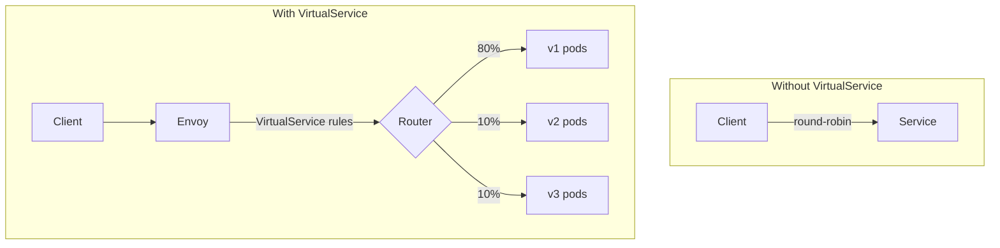
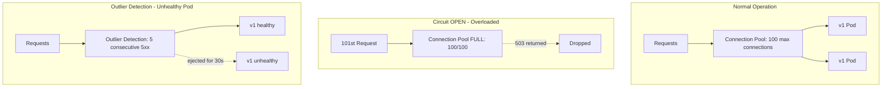

## Complexity: `[COMPLEX]`
## Time to Complete: 60-75 minutes

## Prerequisites

Before starting this module, you should have completed:
- [Module 1: Installation & Architecture](../module-1.1-istio-installation-architecture/) — Istio installation and sidecar injection
- [CKA Module 3.5: Gateway API](/k8s/cka/part3-services-networking/module-3.5-gateway-api/) — Kubernetes Gateway API basics
- Understanding of HTTP routing concepts (headers, paths, methods)

## What You'll Be Able to Do

After completing this module, you will be able to:

1. **Design** complex VirtualService routing architectures to implement weighted canary releases and header-based dark launches across multiple service versions.
2. **Implement** robust circuit breaking and outlier detection parameters within DestinationRules to prevent localized application failures from cascading cluster-wide.
3. **Evaluate** the interaction between Gateways and VirtualServices to securely expose internal mesh workloads to external network traffic.
4. **Diagnose** traffic manipulation failures utilizing Istio's fault injection mechanisms, distinguishing between network latency and absolute service aborts.
5. **Configure** secure egress traffic boundaries using ServiceEntry resources under strict `REGISTRY_ONLY` mesh policies.

## Why This Module Matters

In August 2012, Knight Capital Group, a prominent American financial services firm, deployed a new version of their automated high-frequency trading algorithm. The deployment process lacked any mechanism for gradual traffic shifting—they updated 8 of their 80 production servers simultaneously without the ability to route a small percentage of test traffic to the new instances. An obsolete, undocumented flag in the codebase was inadvertently activated by the new deployment.

Because they lacked progressive delivery controls and network-level circuit breaking, the system began executing millions of erroneous trades at lightning speed. In exactly 45 minutes, Knight Capital lost $460 million. The company effectively evaporated in less than an hour and was acquired shortly after.

Had they employed a modern service mesh with advanced traffic management, they could have utilized weighted routing to limit the initial rollout to 1 percent of production traffic, evaluating error rates safely. Furthermore, a circuit breaker could have been configured to automatically eject the failing endpoints the moment the transaction anomaly rate spiked. Traffic management is not merely an operational convenience; it is the ultimate safety net for enterprise systems. In the context of Kubernetes, mastering Istio's traffic manipulation capabilities allows you to decouple deployments from releases, inject chaotic faults to test resilience, and build self-healing architectures.

## Did You Know?

- **Fact 1**: Istio was officially open-sourced on May 24, 2017, and has since grown to manage billions of requests per second in large-scale enterprise environments.
- **Fact 2**: A single Envoy sidecar proxy typically adds less than 1.5 milliseconds of latency to the 99th percentile of traffic routing, making it virtually imperceptible to the end user.
- **Fact 3**: By default, Istio's outlier detection will eject an unhealthy pod from the load balancing pool for exactly 30 seconds after it detects 5 consecutive 5xx HTTP errors.
- **Fact 4**: The default HTTP connection pool size in Istio allows for exactly 1024 concurrent HTTP/2 requests, which can be tuned based on specific workload density and resource constraints.

## War Story: The Canary That Cooked the Kitchen

**Characters:**
- Priya: Senior SRE
- Deployment: Payment service v2 with new fraud detection algorithms

**The Incident:**

Priya configured a 90/10 canary deployment for the payment service. Version 2 was getting 10 percent of traffic. Metrics looked great—latency was fine, and the error rate was zero. After 30 minutes, she shifted the traffic to 50/50. The dashboard still looked pristine. Confident in the new release, she scaled to 100 percent.

Within 5 minutes, the payment service started returning 503 errors. Not just a few—30 percent of all payment requests were failing simultaneously. The team rolled back to version 1 immediately, but the damage was already done: hundreds of thousands of dollars in failed transactions during a brief 7-minute window.

**What went wrong?**

The VirtualService was routing by weight correctly, but Priya had forgotten to deploy the corresponding DestinationRule. Without it, Istio fell back to its default behavior: round-robin load balancing across all pods matching the generic Kubernetes Service, mixing both version 1 and version 2 indiscriminately. The VirtualService explicitly commanded the mesh to "send 100 percent to the v2 subset," but there was no subset defined in the cluster configuration. Envoy proxy couldn't find the subset and returned a hard 503.

**The missing piece:**

```yaml
# Priya had this VirtualService:
apiVersion: networking.istio.io/v1
kind: VirtualService
metadata:
  name: payment
spec:
  hosts:
  - payment
  http:
  - route:
    - destination:
        host: payment
        subset: v2    # ← References a subset...
      weight: 100
```

```yaml
# But forgot this DestinationRule:
apiVersion: networking.istio.io/v1
kind: DestinationRule
metadata:
  name: payment
spec:
  host: payment
  subsets:            # ← ...that must be defined here
  - name: v1
    labels:
      version: v1
  - name: v2
    labels:
      version: v2
```

**Lesson**: VirtualService and DestinationRule are inextricably linked. If your VirtualService references functional subsets, you MUST have a matching DestinationRule defining those subsets. Always run `istioctl analyze` before applying traffic rules to production.

## Part 1: Core Resources

### 1.1 VirtualService

VirtualService defines **how** requests are routed to a service. It intercepts traffic at the Envoy proxy sidecar and applies intelligent routing rules before the request ever reaches the final destination pod.



**Basic VirtualService:**

```yaml
apiVersion: networking.istio.io/v1
kind: VirtualService
metadata:
  name: reviews
spec:
  hosts:
  - reviews                    # Which service this applies to
  http:
  - match:                     # Conditions (optional)
    - headers:
        end-user:
          exact: jason         # If header matches...
    route:
    - destination:
        host: reviews
        subset: v2             # ...route to v2
  - route:                     # Default route (no match = catch-all)
    - destination:
        host: reviews
        subset: v1
```

> **Stop and think**: If you have a VirtualService with multiple match blocks, and a request satisfies the conditions of several blocks simultaneously, which one does Envoy choose? Consider how traditional firewall architectures evaluate sequential rulesets.

**Key fields:**

| Field | Purpose | Example |
|-------|---------|---------|
| `hosts` | Services this rule applies to | `["reviews"]`, `["*.example.com"]` |
| `http[].match` | Conditions for routing | Headers, URI, method, query params |
| `http[].route` | Where to send traffic | Service host + subset + weight |
| `http[].timeout` | Request timeout | `10s` |
| `http[].retries` | Retry configuration | `attempts: 3` |
| `http[].fault` | Fault injection | `delay`, `abort` |
| `http[].mirror` | Traffic mirroring | Send copy to another service |

### 1.2 DestinationRule

While the VirtualService handles the routing, the DestinationRule defines **policies** applied to traffic *after* routing has occurred. It configures the physical load balancing mechanisms, connection pool limits, outlier detection algorithms, and internal TLS settings for a given destination.

```yaml
apiVersion: networking.istio.io/v1
kind: DestinationRule
metadata:
  name: reviews
spec:
  host: reviews                    # Which service
  trafficPolicy:                   # Global policies
    connectionPool:
      tcp:
        maxConnections: 100
      http:
        h2UpgradePolicy: DEFAULT
        http1MaxPendingRequests: 100
        http2MaxRequests: 1000
    loadBalancer:
      simple: ROUND_ROBIN          # or LEAST_CONN, RANDOM, PASSTHROUGH
    outlierDetection:
      consecutive5xxErrors: 5
      interval: 30s
      baseEjectionTime: 30s
  subsets:                          # Named versions
  - name: v1
    labels:
      version: v1
  - name: v2
    labels:
      version: v2
    trafficPolicy:                 # Per-subset override
      loadBalancer:
        simple: LEAST_CONN
  - name: v3
    labels:
      version: v3
```

**Subsets** are specifically named groups of pods selected by Kubernetes labels. A VirtualService directly references these subsets to route varying traffic segments to specific application versions.

### 1.3 Gateway

The Gateway resource configures a sophisticated load balancer operating at the edge of the service mesh for incoming (ingress) or outgoing (egress) HTTP/TCP traffic. It securely binds to an Istio ingress or egress gateway workload.

```yaml
apiVersion: networking.istio.io/v1
kind: Gateway
metadata:
  name: bookinfo-gateway
spec:
  selector:
    istio: ingressgateway           # Bind to Istio's ingress gateway
  servers:
  - port:
      number: 80
      name: http
      protocol: HTTP
    hosts:
    - "bookinfo.example.com"        # Accept traffic for this host
  - port:
      number: 443
      name: https
      protocol: HTTPS
    hosts:
    - "bookinfo.example.com"
    tls:
      mode: SIMPLE
      credentialName: bookinfo-tls   # K8s Secret with cert/key
```

**Connect Gateway to VirtualService:**

To make the Gateway functional, it must be attached to a routing schema via a VirtualService mapping.

```yaml
apiVersion: networking.istio.io/v1
kind: VirtualService
metadata:
  name: bookinfo
spec:
  hosts:
  - "bookinfo.example.com"
  gateways:
  - bookinfo-gateway               # Reference the Gateway
  http:
  - match:
    - uri:
        prefix: /productpage
    route:
    - destination:
        host: productpage
        port:
          number: 9080
  - match:
    - uri:
        prefix: /reviews
    route:
    - destination:
        host: reviews
```

**Traffic flow with Gateway:**


### 1.4 ServiceEntry

The ServiceEntry resource appends custom entries to Istio's internal service registry. This crucial step enables you to manipulate and manage traffic directed to external services identically to internal mesh components.

```yaml
apiVersion: networking.istio.io/v1
kind: ServiceEntry
metadata:
  name: external-api
spec:
  hosts:
  - api.external.com
  location: MESH_EXTERNAL             # Outside the mesh
  ports:
  - number: 443
    name: https
    protocol: TLS
  resolution: DNS
```

```yaml
# Now you can apply traffic rules to external services!
apiVersion: networking.istio.io/v1
kind: VirtualService
metadata:
  name: external-api-timeout
spec:
  hosts:
  - api.external.com
  http:
  - timeout: 5s
    route:
    - destination:
        host: api.external.com
```

**Why ServiceEntry matters:**

By default, Istio allows all outbound traffic to exit the mesh. However, employing a zero-trust model requires setting `meshConfig.outboundTrafficPolicy.mode: REGISTRY_ONLY`, ensuring that only strictly registered services remain accessible. In this fortified posture, a ServiceEntry acts as an explicit firewall allowlist rule for external access.

## Part 2: Traffic Shifting (Canary Deployments)

### 2.1 Weighted Routing

The most common canary deployment pattern utilizes weighted routing to segment and split traffic by calculated percentages. The Envoy sidecar assesses every incoming request independently and randomly distributes it based on the weighting ratios provided.

```yaml
apiVersion: networking.istio.io/v1
kind: VirtualService
metadata:
  name: reviews
spec:
  hosts:
  - reviews
  http:
  - route:
    - destination:
        host: reviews
        subset: v1
      weight: 80               # 80% to v1
    - destination:
        host: reviews
        subset: v2
      weight: 20               # 20% to v2
```

```yaml
apiVersion: networking.istio.io/v1
kind: DestinationRule
metadata:
  name: reviews
spec:
  host: reviews
  subsets:
  - name: v1
    labels:
      version: v1
  - name: v2
    labels:
      version: v2
```

**Progressive rollout example:**

```bash
# Step 1: 90/10 split
kubectl apply -f - <<EOF
apiVersion: networking.istio.io/v1
kind: VirtualService
metadata:
  name: reviews
spec:
  hosts:
  - reviews
  http:
  - route:
    - destination:
        host: reviews
        subset: v1
      weight: 90
    - destination:
        host: reviews
        subset: v2
      weight: 10
EOF

# Monitor error rates... then increase

# Step 2: 50/50 split
kubectl patch virtualservice reviews --type merge -p '
spec:
  http:
  - route:
    - destination:
        host: reviews
        subset: v1
      weight: 50
    - destination:
        host: reviews
        subset: v2
      weight: 50'

# Step 3: Full rollout
kubectl patch virtualservice reviews --type merge -p '
spec:
  http:
  - route:
    - destination:
        host: reviews
        subset: v2
      weight: 100'
```

### 2.2 Header-Based Routing

Routing by header allows you to seamlessly channel specific users, internal teams, or automated testing suites directly to an experimental application version without impacting standard user operations.

```yaml
apiVersion: networking.istio.io/v1
kind: VirtualService
metadata:
  name: reviews
spec:
  hosts:
  - reviews
  http:
  # Rule 1: Route "jason" to v2
  - match:
    - headers:
        end-user:
          exact: jason
    route:
    - destination:
        host: reviews
        subset: v2
  # Rule 2: Route requests with "canary: true" header to v3
  - match:
    - headers:
        canary:
          exact: "true"
    route:
    - destination:
        host: reviews
        subset: v3
  # Rule 3: Everyone else goes to v1
  - route:
    - destination:
        host: reviews
        subset: v1
```

### 2.3 URI-Based Routing

Distribute routing loads dynamically based on structural path evaluation.

```yaml
apiVersion: networking.istio.io/v1
kind: VirtualService
metadata:
  name: bookinfo
spec:
  hosts:
  - bookinfo.example.com
  gateways:
  - bookinfo-gateway
  http:
  - match:
    - uri:
        exact: /productpage
    route:
    - destination:
        host: productpage
        port:
          number: 9080
  - match:
    - uri:
        prefix: /api/v1/reviews
    route:
    - destination:
        host: reviews
        port:
          number: 9080
  - match:
    - uri:
        regex: "/api/v[0-9]+/ratings"
    route:
    - destination:
        host: ratings
        port:
          number: 9080
```

**Match types for URIs:**

| Type | Example | Matches |
|------|---------|---------|
| `exact` | `/productpage` | Only `/productpage` |
| `prefix` | `/api/v1` | `/api/v1`, `/api/v1/reviews`, etc. |
| `regex` | `/api/v[0-9]+` | `/api/v1`, `/api/v2`, etc. |

## Part 3: Fault Injection

Fault injection affords engineers the ability to rigorously assess how an application withstands cascading failures—without actually compromising or degrading genuine service endpoints. This mechanism brings Netflix-style chaos engineering safely to the network overlay.

### 3.1 Delay Injection

Artificially simulate intense network latency to test frontend loading behaviors and background asynchronous worker timeouts.

```yaml
apiVersion: networking.istio.io/v1
kind: VirtualService
metadata:
  name: ratings
spec:
  hosts:
  - ratings
  http:
  - fault:
      delay:
        percentage:
          value: 100            # 100% of requests get delayed
        fixedDelay: 7s          # 7 second delay
    route:
    - destination:
        host: ratings
        subset: v1
```

**Selective delay — strictly target specific analytical users:**

```yaml
apiVersion: networking.istio.io/v1
kind: VirtualService
metadata:
  name: ratings
spec:
  hosts:
  - ratings
  http:
  - match:
    - headers:
        end-user:
          exact: jason
    fault:
      delay:
        percentage:
          value: 100
        fixedDelay: 7s
    route:
    - destination:
        host: ratings
        subset: v1
  - route:
    - destination:
        host: ratings
        subset: v1
```

### 3.2 Abort Injection

Forcibly simulate complete backend HTTP errors, observing the upstream error handling logic.

```yaml
apiVersion: networking.istio.io/v1
kind: VirtualService
metadata:
  name: ratings
spec:
  hosts:
  - ratings
  http:
  - fault:
      abort:
        percentage:
          value: 50              # 50% of requests get aborted
        httpStatus: 503          # Return 503 Service Unavailable
    route:
    - destination:
        host: ratings
        subset: v1
```

### 3.3 Combined Faults

Apply both delay and abort scenarios simultaneously to stress-test your architecture extensively.

```yaml
apiVersion: networking.istio.io/v1
kind: VirtualService
metadata:
  name: ratings
spec:
  hosts:
  - ratings
  http:
  - fault:
      delay:
        percentage:
          value: 50
        fixedDelay: 5s
      abort:
        percentage:
          value: 10
        httpStatus: 500
    route:
    - destination:
        host: ratings
        subset: v1
```

This configuration dictates that 50 percent of requests will be artificially delayed by 5 seconds, and completely independently, 10 percent will immediately return an HTTP 500 Internal Server Error.

## Part 4: Resilience

### 4.1 Timeouts

Aggressive timeout barriers prevent application threads from hanging indefinitely, freeing up processing capacity when downstream targets stall.

```yaml
apiVersion: networking.istio.io/v1
kind: VirtualService
metadata:
  name: reviews
spec:
  hosts:
  - reviews
  http:
  - timeout: 3s                 # Fail if no response within 3 seconds
    route:
    - destination:
        host: reviews
        subset: v1
```

### 4.2 Retries

Mechanisms to automatically retry transient, sporadic failures.

```yaml
apiVersion: networking.istio.io/v1
kind: VirtualService
metadata:
  name: reviews
spec:
  hosts:
  - reviews
  http:
  - retries:
      attempts: 3               # Retry up to 3 times
      perTryTimeout: 2s         # Each attempt gets 2 seconds
      retryOn: 5xx,reset,connect-failure,retriable-4xx
    route:
    - destination:
        host: reviews
        subset: v1
```

**Common `retryOn` values:**

| Value | Retries When |
|-------|-------------|
| `5xx` | Server returns 5xx |
| `reset` | Connection reset |
| `connect-failure` | Can't connect |
| `retriable-4xx` | Specific 4xx codes (409) |
| `gateway-error` | 502, 503, 504 |

> **Warning**: Indiscriminate retries multiply infrastructural load severely. Three retries mean that a struggling, failing service could be subjected to four times the standard traffic volume. Always synthesize retries with rigorous circuit breaking protocols.

### 4.3 Circuit Breaking

Circuit breakers prevent localized degradation from evolving into cascading systemic failures by terminating traffic flows directed toward overburdened or completely unhealthy container instances.

```yaml
apiVersion: networking.istio.io/v1
kind: DestinationRule
metadata:
  name: reviews
spec:
  host: reviews
  trafficPolicy:
    connectionPool:
      tcp:
        maxConnections: 100       # Max TCP connections
      http:
        http1MaxPendingRequests: 10  # Max queued requests
        http2MaxRequests: 100        # Max concurrent requests
        maxRequestsPerConnection: 10 # Max requests per connection
        maxRetries: 3                # Max concurrent retries
    outlierDetection:
      consecutive5xxErrors: 5     # Eject after 5 consecutive 5xx
      interval: 10s              # Check every 10 seconds
      baseEjectionTime: 30s      # Eject for at least 30 seconds
      maxEjectionPercent: 50     # Don't eject more than 50% of hosts
  subsets:
  - name: v1
    labels:
      version: v1
```

**How circuit breaking works:**



### 4.4 Outlier Detection

Outlier detection mathematically ejects individually unhealthy instances from the aggregated load balancing pool, sheltering the broader application architecture.

```yaml
apiVersion: networking.istio.io/v1
kind: DestinationRule
metadata:
  name: reviews
spec:
  host: reviews
  trafficPolicy:
    outlierDetection:
      consecutive5xxErrors: 3     # Eject after 3 errors
      interval: 15s              # Evaluation interval
      baseEjectionTime: 30s      # Min ejection duration
      maxEjectionPercent: 30     # Max % of hosts ejected
      minHealthPercent: 70       # Only eject if >70% healthy
```

## Part 5: Traffic Mirroring

Mirroring (commonly referenced as shadowing) actively replicates authentic live traffic streams to an isolated secondary service. The heavily mirrored traffic is explicitly treated as fire-and-forget—the ultimate secondary responses are fully discarded and carry absolutely no structural effect on the primary user request.

> **Pause and predict**: If you configure traffic mirroring to send 100% of traffic to a shadow service, and the shadow service takes 10 seconds to respond, what happens to the latency of the primary user request?

```yaml
apiVersion: networking.istio.io/v1
kind: VirtualService
metadata:
  name: reviews
spec:
  hosts:
  - reviews
  http:
  - route:
    - destination:
        host: reviews
        subset: v1
      weight: 100
    mirror:
      host: reviews
      subset: v2                 # Mirror to v2
    mirrorPercentage:
      value: 100                 # Mirror 100% of traffic
```

**Use cases for robust mirroring:**
- Stress testing complex new version iterations utilizing pure, randomized production traffic payloads.
- Conducting intensive infrastructure load testing completely devoid of synthetic traffic artifacts.
- Executing vast forensic debugging strategies by capturing untampered real-world requests.
- Performing parallel comparisons of behavior discrepancies between contrasting release versions.

## Part 6: Ingress Traffic

### 6.1 Configuring Ingress with Gateway

The comprehensive example below illustrates precisely how to safely expose a protected internal application to hostile external network traffic elements.

```yaml
# Step 1: Gateway (the front door)
apiVersion: networking.istio.io/v1
kind: Gateway
metadata:
  name: httpbin-gateway
spec:
  selector:
    istio: ingressgateway
  servers:
  - port:
      number: 80
      name: http
      protocol: HTTP
    hosts:
    - "httpbin.example.com"
```

```yaml
# Step 2: VirtualService (routing rules)
apiVersion: networking.istio.io/v1
kind: VirtualService
metadata:
  name: httpbin
spec:
  hosts:
  - "httpbin.example.com"
  gateways:
  - httpbin-gateway
  http:
  - match:
    - uri:
        prefix: /status
    - uri:
        prefix: /delay
    route:
    - destination:
        host: httpbin
        port:
          number: 8000
```

```bash
# Get the ingress gateway's external IP
export INGRESS_HOST=$(kubectl -n istio-system get service istio-ingressgateway \
  -o jsonpath='{.status.loadBalancer.ingress[0].ip}')
export INGRESS_PORT=$(kubectl -n istio-system get service istio-ingressgateway \
  -o jsonpath='{.spec.ports[?(@.name=="http2")].port}')

# For kind/minikube (NodePort):
export INGRESS_PORT=$(kubectl -n istio-system get service istio-ingressgateway \
  -o jsonpath='{.spec.ports[?(@.name=="http2")].nodePort}')
export INGRESS_HOST=$(kubectl get nodes -o jsonpath='{.items[0].status.addresses[?(@.type=="InternalIP")].address}')

# Test
curl -H "Host: httpbin.example.com" http://$INGRESS_HOST:$INGRESS_PORT/status/200
```

### 6.2 TLS at Ingress

```bash
# Create TLS secret
kubectl create -n istio-system secret tls httpbin-tls \
  --key=httpbin.key \
  --cert=httpbin.crt
```

```yaml
apiVersion: networking.istio.io/v1
kind: Gateway
metadata:
  name: httpbin-gateway
spec:
  selector:
    istio: ingressgateway
  servers:
  - port:
      number: 443
      name: https
      protocol: HTTPS
    hosts:
    - "httpbin.example.com"
    tls:
      mode: SIMPLE                    # One-way TLS
      credentialName: httpbin-tls     # K8s Secret name
```

**TLS modes at Gateway:**

| Mode | Description |
|------|-------------|
| `SIMPLE` | Standard TLS (server cert only) |
| `MUTUAL` | mTLS (both client and server certs) |
| `PASSTHROUGH` | Forward encrypted traffic as-is (SNI routing) |
| `AUTO_PASSTHROUGH` | Like PASSTHROUGH with automatic SNI routing |
| `ISTIO_MUTUAL` | Use Istio's internal mTLS (for mesh-internal gateways) |

## Part 7: Egress Traffic

### 7.1 Controlling Outbound Traffic

By default, Istio sidecar proxies indiscriminately permit all outbound communication to bypass the mesh untouched. To mandate a zero-trust external interface configuration:

```yaml
# In IstioOperator or mesh config
apiVersion: install.istio.io/v1alpha1
kind: IstioOperator
spec:
  meshConfig:
    outboundTrafficPolicy:
      mode: REGISTRY_ONLY          # Block unregistered external services
```

### 7.2 ServiceEntry for External Access

```yaml
# Allow access to an external API
apiVersion: networking.istio.io/v1
kind: ServiceEntry
metadata:
  name: google-api
spec:
  hosts:
  - "www.googleapis.com"
  ports:
  - number: 443
    name: https
    protocol: TLS
  location: MESH_EXTERNAL
  resolution: DNS
```

```yaml
# Optional: Apply traffic policy to external service
apiVersion: networking.istio.io/v1
kind: DestinationRule
metadata:
  name: google-api
spec:
  host: "www.googleapis.com"
  trafficPolicy:
    tls:
      mode: SIMPLE                 # Originate TLS to external service
```

### 7.3 Egress Gateway

Structurally channel targeted external traffic strictly through a dedicated egress gateway component for intensive internal auditing or fine-grained traffic policing functions:

```yaml
apiVersion: networking.istio.io/v1
kind: ServiceEntry
metadata:
  name: external-svc
spec:
  hosts:
  - external.example.com
  ports:
  - number: 443
    name: tls
    protocol: TLS
  location: MESH_EXTERNAL
  resolution: DNS
```

```yaml
apiVersion: networking.istio.io/v1
kind: Gateway
metadata:
  name: egress-gateway
spec:
  selector:
    istio: egressgateway
  servers:
  - port:
      number: 443
      name: tls
      protocol: TLS
    hosts:
    - external.example.com
    tls:
      mode: PASSTHROUGH
```

```yaml
apiVersion: networking.istio.io/v1
kind: VirtualService
metadata:
  name: external-through-egress
spec:
  hosts:
  - external.example.com
  gateways:
  - mesh                          # Internal mesh traffic
  - egress-gateway                # Egress gateway
  tls:
  - match:
    - gateways:
      - mesh
      port: 443
      sniHosts:
      - external.example.com
    route:
    - destination:
        host: istio-egressgateway.istio-system.svc.cluster.local
        port:
          number: 443
  - match:
    - gateways:
      - egress-gateway
      port: 443
      sniHosts:
      - external.example.com
    route:
    - destination:
        host: external.example.com
        port:
          number: 443
```

## Common Mistakes

| Mistake | Why It Happens | How to Fix It |
|---------|----------------|---------------|
| VirtualService without a matching DestinationRule | You reference a `subset` in the VirtualService that doesn't exist in the DestinationRule, leading to immediate `503` errors. | Always proactively create a DestinationRule with subsets that perfectly match the VirtualService route references. |
| Weights not summing to exactly 100 | Envoy proxy cannot probabilistically distribute traffic if the total routing weights equal 99 or 101. | Ensure all `weight` fields under a specific `route` array mathematically total exactly 100. |
| Gateway host mismatch | The physical host declared in the Gateway does not align with the host logically declared in the attached VirtualService. | Ensure the `hosts` array matches exactly between the Gateway and the VirtualService specifications. |
| Missing `gateways` field in VirtualService | The routing rule inherently applies only to internal mesh traffic because it isn't explicitly bound to an active ingress gateway. | Add the explicit parameter `gateways: [gateway-name]` to the overarching VirtualService specification. |
| Configuring retries without outlier detection | A failing service blindly receives exponentially more traffic (creating a "retry storm"), dramatically exacerbating the outage. | Always carefully pair aggressive `retries` configurations with extremely strict `outlierDetection` policies. |
| Overall timeout shorter than retry budget | The total `timeout` barrier permanently kills the request before all `attempts` multiplied by `perTryTimeout` can successfully execute. | Adjust the overall `timeout` to be logically greater than or equal to `attempts * perTryTimeout`. |
| Missing ServiceEntry under `REGISTRY_ONLY` | Istio systematically blocks all external egress traffic that is not explicitly registered in the secure internal mesh registry. | Construct a dedicated `ServiceEntry` for every singular external dependency your application infrastructure requires. |
| Port mismatch in DestinationRule | The underlying port specified in the DestinationRule traffic policy strictly contradicts the assigned Kubernetes Service port. | Meticulously verify port mapping numbers align identically across Services, VirtualServices, and DestinationRules. |

## Quiz

Test your analytical skills and diagnostic proficiency:

**Q1: You configure a VirtualService to route incoming traffic to subset v2, but your engineering teams immediately receive 503 Service Unavailable errors. The pod logs show no internal errors, and the pod itself registers as healthy. What specific architectural misconfiguration likely caused this phenomenon?**

<details>
<summary>Show Answer</summary>

**VirtualService** essentially calculates *where* traffic is intended to travel based on established rules, but the **DestinationRule** fundamentally defines *how* the traffic successfully reaches the targeted subsets.

The VirtualService ruleset applies primary routing decisions, subsequently relying on a DestinationRule to enforce the detailed endpoint policy. If your VirtualService arbitrarily references an unknown subset, the system violently fails. The DestinationRule MUST actively define that precise subset.

</details>

**Q2: A delicate system migration requires exactly 20% of traffic to reach a highly unstable new version (v2) of the "productpage" service, and 80% to safely remain on the legacy version (v1). Formulate the exact YAML specification for the routing component.**

<details>
<summary>Show Answer</summary>

```yaml
apiVersion: networking.istio.io/v1
kind: VirtualService
metadata:
  name: productpage
spec:
  hosts:
  - productpage
  http:
  - route:
    - destination:
        host: productpage
        subset: v1
      weight: 80
    - destination:
        host: productpage
        subset: v2
      weight: 20
```

(Note: This explicitly requires a valid DestinationRule with `v1` and `v2` subsets clearly defined beforehand.)

</details>

**Q3: A chaos testing initiative mandates you to proactively inject a 5-second delay into exactly 50% of the traffic hitting the "ratings" service to simulate massive database latency. Construct the precise Istio resource to achieve this fault scenario.**

<details>
<summary>Show Answer</summary>

```yaml
apiVersion: networking.istio.io/v1
kind: VirtualService
metadata:
  name: ratings
spec:
  hosts:
  - ratings
  http:
  - fault:
      delay:
        percentage:
          value: 50
        fixedDelay: 5s
    route:
    - destination:
        host: ratings
```

</details>

**Q4: During a chaotic stress test, your primary payment service becomes functionally unresponsive, triggering devastating cascading failures across the entire cluster namespace. How would you design a rigorous circuit breaking policy to prevent the connection pool from exceeding 100 concurrent connections while automatically handling outlier failures?**

<details>
<summary>Show Answer</summary>

- **Connection pool (circuit breaking)**: Architecturally limits the absolute *number* of concurrent connections mapped directly to a service. The moment mathematical thresholds are crossed, new requests instantly receive a 503 error, functionally protecting the upstream destination from absolute overload.
- **Outlier detection**: Proactively monitors individual service endpoints for persistent errors and forcefully *ejects* chronically unhealthy instances from the broader load-balancing pool. Remaining healthy application endpoints continuously receive unhindered traffic.

Both critical mechanisms are explicitly configured within the DestinationRule. They work in tandem: the connection pool safely mitigates general overall exhaustion, while intensive outlier detection strategically isolates and removes actively failing pod instances.

</details>

**Q5: You have successfully configured a Gateway for port 443, yet your external application requests are consistently dropping prematurely before they can ever reach the internal cluster service. You have already verified that a VirtualService perfectly exists. What specific binding mechanism is critically missing between the two core resources?**

<details>
<summary>Show Answer</summary>

The architectural Gateway accurately establishes a load balancer interface (typically attached to the Istio ingress gateway pod layer) to securely receive ingress traffic originating from physically outside the mesh boundary. It details ports, acceptable encrypted protocols, targeted hostnames, and specific TLS constraints.

However, the Gateway unequivocally does NOT define explicit route paths. It functionally must be logically tied to a functioning VirtualService that explicitly references it via the mandatory `gateways: [gateway-name]` array constraint.

</details>

**Q6: Security compliance strictly mandates that absolutely all external egress traffic must be proactively and explicitly allowlisted in the service registry to prevent data exfiltration. Construct the mesh configuration snippet to actively enforce this organizational standard cluster-wide.**

<details>
<summary>Show Answer</summary>

Set the primary outbound traffic policy constraint to exclusively operate in `REGISTRY_ONLY` mode:

```yaml
meshConfig:
  outboundTrafficPolicy:
    mode: REGISTRY_ONLY
```

Once correctly established, engineers must formally register requested external services via robust ServiceEntry resources. Any isolated attempt to route traffic to completely unregistered external web hosts will be fundamentally and instantly blocked at the proxy level.

</details>

**Q7: Your core engineering team needs to comprehensively capture 100% of ongoing production traffic hitting the sensitive "reviews" service and strategically send a duplicated copy to a newly deployed experimental subset (v2) without affecting or degrading the primary user request path. Design the foundational routing rule snippet to flawlessly achieve this shadow deployment.**

<details>
<summary>Show Answer</summary>

Traffic mirroring systematically dispatches an absolute duplicate copy of the live production traffic stream strictly to an isolated secondary application service. The intensely mirrored traffic is definitively established as fire-and-forget—backend responses gathered from the shadowed mirror are deliberately discarded to completely guarantee they don't corrupt or stall the primary transactional request.

Common enterprise use cases: Testing an entirely new service revision with unfiltered production payloads; generating load testing scenarios absent of artificial synthetic requests; isolating and capturing completely real traffic sequences for complex debugging; observing comparative behavior variances safely.

```yaml
mirror:
  host: reviews
  subset: v2
mirrorPercentage:
  value: 100
```

</details>

**Q8: A junior developer configures an overall architectural timeout of 3 seconds while simultaneously setting retries to 3 attempts mapping to a 2-second per-try timeout. The developer vigorously reports that the third retry cycle never completes. Evaluate this configuration deeply and diagnose the exact root cause of the failure.**

<details>
<summary>Show Answer</summary>

The broader aggregate overall timeout constraint (established at 3 seconds) categorically overrides the defined granular retry budget. With a `perTryTimeout: 2s` boundary and `attempts: 3` configuration, the entire process would mathematically require a 6-second total window to reliably process all scheduled retries. Because the overarching 3-second absolute timeout firmly exists, it strictly means that at most the first retry attempt (2s) alongside an interrupted fraction of the second attempt can trigger before the absolute timeout comprehensively executes and kills the transaction completely.

**Best practice**: Intentionally calibrate the total `timeout >= attempts * perTryTimeout` ratio accurately (in this precise scenario, >= 6s minimum).

</details>

**Q9: Under a zero-trust network topology, why is a ServiceEntry architecturally mandatory rather than optional for standard operational traffic?**

<details>
<summary>Show Answer</summary>

The ServiceEntry fundamentally appends specific external services deep into Istio's secured internal service routing registry map. It becomes absolutely structurally required when:
1. The global `outboundTrafficPolicy.mode` parameter is rigidly locked to `REGISTRY_ONLY` (automatically meaning default external traffic is categorically dropped).
2. You actively desire to securely integrate powerful Istio traffic manipulation rules (such as resilient timeouts, cascading retries, or controlled fault injection operations) reliably against external APIs.
3. You intend to accurately capture and meticulously monitor targeted external service communication matrices heavily reliant on Istio's inherent observability architecture.

Without activating `REGISTRY_ONLY`, writing a ServiceEntry technically remains structurally optional, but it remains incredibly beneficial for properly binding complex policy implementations.

</details>

**Q10: A massive new enterprise application fundamentally requires a public-facing entry point. Design an intricate Gateway and VirtualService sequence to robustly expose the dedicated "frontend" service securely on HTTPS at frontend.example.com while internally routing standard unencrypted traffic over internal port 80.**

<details>
<summary>Show Answer</summary>

```yaml
apiVersion: networking.istio.io/v1
kind: Gateway
metadata:
  name: frontend-gateway
spec:
  selector:
    istio: ingressgateway
  servers:
  - port:
      number: 443
      name: https
      protocol: HTTPS
    hosts:
    - "frontend.example.com"
    tls:
      mode: SIMPLE
      credentialName: frontend-tls
```

```yaml
apiVersion: networking.istio.io/v1
kind: VirtualService
metadata:
  name: frontend
spec:
  hosts:
  - "frontend.example.com"
  gateways:
  - frontend-gateway
  http:
  - route:
    - destination:
        host: frontend
        port:
          number: 80
```

(This structurally requires a fully verified TLS cryptographic secret appropriately named `frontend-tls` existing correctly inside the `istio-system` cluster namespace.)

</details>

**Q11: During a highly sensitive dark launch phase, internal QA engineers heavily rely on manually injecting an HTTP header mapping to `x-test: canary`. Design an advanced VirtualService routing rule that seamlessly captures these extraordinarily specific requests and targets subset v2, while simultaneously funneling absolutely all other normal external user traffic securely to standard subset v1.**

<details>
<summary>Show Answer</summary>

```yaml
apiVersion: networking.istio.io/v1
kind: VirtualService
metadata:
  name: myapp
spec:
  hosts:
  - myapp
  http:
  - match:
    - headers:
        x-test:
          exact: canary
    route:
    - destination:
        host: myapp
        subset: v2
  - route:
    - destination:
        host: myapp
        subset: v1
```

Individual match routing rules are rigidly evaluated systematically flowing top-to-bottom. The initial first match definitively wins the routing process. The expansive catch-all definition (requiring strictly no match constraints) logically located firmly at the very bottom smoothly handles seamlessly distributing absolutely everything else safely.

</details>

## Hands-On Exercise: Traffic Management with Bookinfo

### Objective
Carefully deploy the intricate Bookinfo microservice application topology and rigorously practice critical traffic management operational sequences: performing a weighted canary deployment, isolating fault injection variables, and establishing a robust structural circuit breaker logic under stress.

### Setup

<details>
<summary>View Setup Instructions</summary>

```bash
# Ensure Istio is installed (from Module 1)
istioctl install --set profile=demo -y
kubectl label namespace default istio-injection=enabled

# Deploy Bookinfo
kubectl apply -f https://raw.githubusercontent.com/istio/istio/release-1.22/samples/bookinfo/platform/kube/bookinfo.yaml

# Wait for pods
kubectl wait --for=condition=ready pod --all -n default --timeout=120s

# Deploy all DestinationRules
kubectl apply -f https://raw.githubusercontent.com/istio/istio/release-1.22/samples/bookinfo/networking/destination-rule-all.yaml

# Deploy the Gateway
kubectl apply -f https://raw.githubusercontent.com/istio/istio/release-1.22/samples/bookinfo/networking/bookinfo-gateway.yaml

# Verify
istioctl analyze
```

</details>

### Task 1: Route All Traffic to v1

<details>
<summary>View Solution</summary>

```bash
kubectl apply -f - <<EOF
apiVersion: networking.istio.io/v1
kind: VirtualService
metadata:
  name: reviews
spec:
  hosts:
  - reviews
  http:
  - route:
    - destination:
        host: reviews
        subset: v1
EOF
```

Verify by proactively sending traffic — you should meticulously observe exclusively reviews WITHOUT rendered stars:

```bash
# Port-forward to productpage
kubectl port-forward svc/productpage 9080:9080 &

# Send requests — should always be v1 (no stars)
for i in $(seq 1 10); do
  curl -s http://localhost:9080/productpage | grep -o "glyphicon-star" | wc -l
done
```

</details>

### Task 2: Canary — Send 20% to v2

<details>
<summary>View Solution</summary>

```bash
kubectl apply -f - <<EOF
apiVersion: networking.istio.io/v1
kind: VirtualService
metadata:
  name: reviews
spec:
  hosts:
  - reviews
  http:
  - route:
    - destination:
        host: reviews
        subset: v1
      weight: 80
    - destination:
        host: reviews
        subset: v2
      weight: 20
EOF
```

Verify structurally — accurately roughly 2 out of every 10 cyclic requests must display black stars representing interaction with subset (v2):

```bash
for i in $(seq 1 20); do
  stars=$(curl -s http://localhost:9080/productpage | grep -o "glyphicon-star" | wc -l)
  echo "Request $i: $stars stars"
done
```

</details>

### Task 3: Inject a 3-second Delay

<details>
<summary>View Solution</summary>

```bash
kubectl apply -f - <<EOF
apiVersion: networking.istio.io/v1
kind: VirtualService
metadata:
  name: ratings
spec:
  hosts:
  - ratings
  http:
  - fault:
      delay:
        percentage:
          value: 100
        fixedDelay: 3s
    route:
    - destination:
        host: ratings
        subset: v1
EOF
```

Verify analytically — physical network requests processed should immediately begin logging an extended transaction timeframe of ~3 elongated seconds:

```bash
time curl -s http://localhost:9080/productpage > /dev/null
# Should show ~3+ seconds
```

</details>

### Task 4: Circuit Breaking

<details>
<summary>View Solution</summary>

```bash
kubectl apply -f - <<EOF
apiVersion: networking.istio.io/v1
kind: DestinationRule
metadata:
  name: reviews-cb
spec:
  host: reviews
  trafficPolicy:
    connectionPool:
      http:
        http1MaxPendingRequests: 1
        http2MaxRequests: 1
        maxRequestsPerConnection: 1
    outlierDetection:
      consecutive5xxErrors: 1
      interval: 1s
      baseEjectionTime: 30s
      maxEjectionPercent: 100
EOF
```

Generate substantial synchronized load to actively forcefully trigger the circuit breaking safety isolation mechanisms:

```bash
# Install fortio (Istio's load testing tool)
kubectl apply -f https://raw.githubusercontent.com/istio/istio/release-1.22/samples/httpbin/sample-client/fortio-deploy.yaml
kubectl wait --for=condition=ready pod -l app=fortio

# Send 20 concurrent connections
FORTIO_POD=$(kubectl get pods -l app=fortio -o jsonpath='{.items[0].metadata.name}')
kubectl exec $FORTIO_POD -c fortio -- fortio load -c 3 -qps 0 -n 30 -loglevel Warning \
  http://reviews:9080/reviews/1

# Look for "Code 503" responses — those are circuit breaker trips
```

</details>

### Success Criteria

- [ ] All traffic reliably routes to reviews v1 (displaying zero stars) effectively when the VirtualService targets it exclusively.
- [ ] Approximately 20% of traffic correctly displays requested visual star assets exactly when the progressive canary parameter is configured.
- [ ] Fault delay injection accurately forces a substantial 3-second application performance degradation to specific targeted requests.
- [ ] The structural circuit breaker vigorously returns calculated HTTP 503 statuses under simulated, concentrated concurrent load exhaustion.
- [ ] Operating `istioctl analyze` dynamically displays entirely zero configuration syntax errors for all implemented mesh schemas.

### Cleanup

<details>
<summary>View Cleanup Commands</summary>

```bash
kill %1  # Stop port-forward
kubectl delete virtualservice reviews ratings
kubectl delete destinationrule reviews-cb
```

</details>

## Next Module

Continue to [Module 3: Security & Troubleshooting](../module-1.3-istio-security-troubleshooting/) — where we will comprehensively transition away from intricate traffic flows and dissect core zero-trust foundations covering strict mTLS enforcement, sophisticated authorization access policies, native JWT authentication strategies, and deeply essential proxy-layer diagnostic commands.