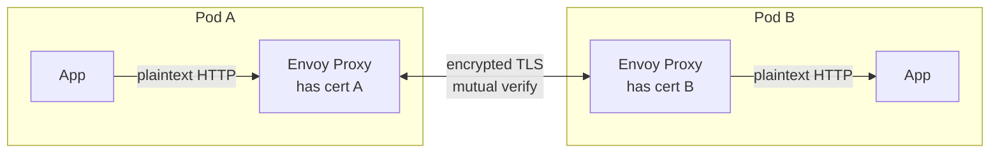
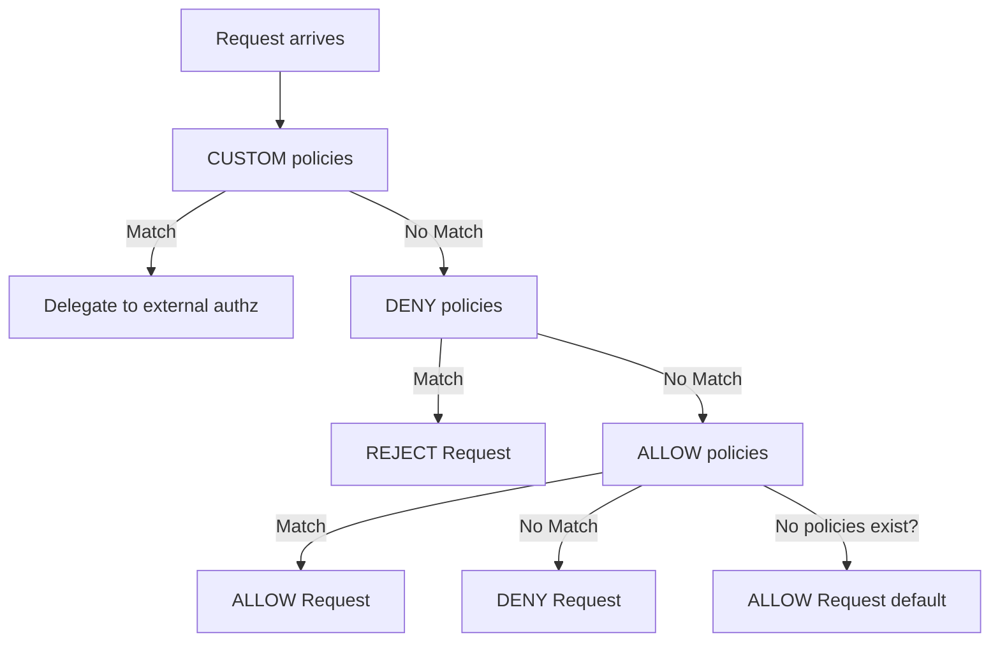
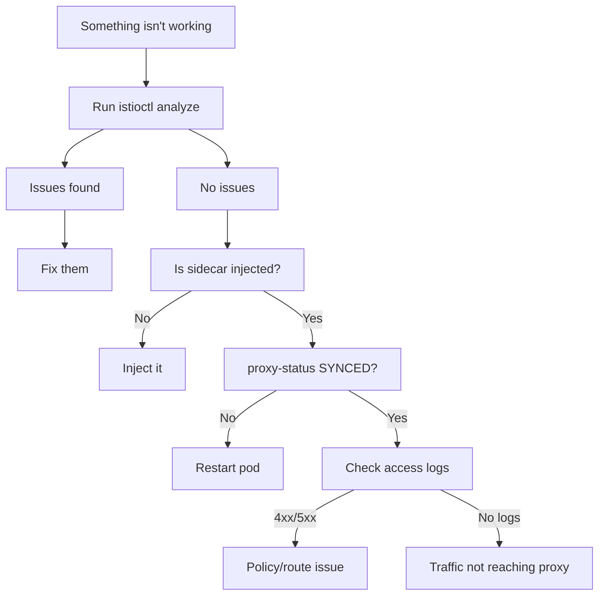

## Complexity: `[COMPLEX]`
## Time to Complete: 50-60 minutes

---

## Prerequisites

Before starting this module, you should have completed:
- [Module 1: Installation & Architecture](../module-1.1-istio-installation-architecture/) — istiod, Envoy, sidecar injection
- [Module 2: Traffic Management](../module-1.2-istio-traffic-management/) — VirtualService, DestinationRule, Gateway
- Basic understanding of TLS, JWT tokens, and RBAC concepts

---

## What You'll Be Able to Do

After completing this rigorous module, you will be able to:

1. **Diagnose** mTLS handshake failures, rejected requests, and complex policy conflicts using `istioctl analyze` and Envoy access logs.
2. **Implement** PeerAuthentication policies to enforce mutual TLS systematically across distributed namespaces and workloads reliably.
3. **Design** fine-grained AuthorizationPolicy rules that securely integrate JWT validation and role-based access controls for deep defense.
4. **Evaluate** complex proxy states using `istioctl proxy-status` and `proxy-config` to identify critical synchronization anomalies.
5. **Compare** STRICT and PERMISSIVE mTLS modes to formulate completely safe migration strategies for sensitive legacy services.

---

## Why This Module Matters

In October 2021, Roblox suffered a massive 73-hour outage that cost the company an estimated $25 million in lost bookings. While their specific issue stemmed from a distinct service discovery system (Consul) rather than Istio directly, the root cause involved proxy misconfigurations, exhausted connection pools, and distributed state synchronization failures—the exact same distributed networking failure modes you must prevent when managing Istio. When a mesh proxy fleet becomes desynchronized or securely blocks valid traffic due to an overly aggressive security policy, entire applications crash instantly. The financial impact of a single misconfigured policy can run into the millions within minutes.

This incident underscores the critical importance of mastering Istio security and troubleshooting. Security misconfigurations in a service mesh do not merely generate passive warnings; they actively sever network paths, leading to catastrophic downtime. In a dynamically distributed architecture, knowing how to securely authenticate requests and authorize traffic is just as vital as knowing how to rapidly restore communication when those policies inevitably conflict.

Furthermore, Security and Troubleshooting combined account for 25% of the ICA certification exam. You will be explicitly tested on your ability to not only write robust JWT authentication rules and fine-grained authorization policies, but also to rapidly diagnose why a proxy is returning a 403 Forbidden or a 503 Service Unavailable. By mastering powerful debugging tools like `istioctl analyze` and `proxy-status`, you transform your operational posture from an operator blindly guessing at YAML files to an expert engineer who can systematically pinpoint and resolve mesh failures within minutes.

> **The Building Security Analogy**
>
> Istio security works like a modern high-security office building. **PeerAuthentication** (mTLS) is the strictly locked front door — it cryptographically verifies everyone entering is exactly who they claim to be through a mutual certificate exchange. **RequestAuthentication** (JWT) is the digital badge reader — it strongly validates the badge is legitimate but doesn't independently decide who can enter which internal rooms. Finally, the **AuthorizationPolicy** is the rigorous access control list — it ultimately decides which authenticated badge holders can open which specific doors. You absolutely need all three mechanisms functioning together for complete security.

---

## What You'll Learn

By the end of this module, you will have mastered how to:
- Configure comprehensive mTLS using PeerAuthentication across various modes (STRICT, PERMISSIVE, DISABLE)
- Set up secure JWT validation frameworks utilizing RequestAuthentication mechanisms
- Write highly fine-grained AuthorizationPolicy rules (ALLOW, DENY, CUSTOM) for robust traffic control
- Securely configure TLS termination and pass-through at the ingress gateway edge
- Use advanced CLI techniques like `istioctl analyze`, `proxy-status`, and `proxy-config` for low-level debugging
- Interpret complex Envoy access logs to accurately diagnose the root causes of common mesh issues
- Methodically fix broken or disconnected Istio configurations using a structured troubleshooting workflow

---

## Did You Know?

- The Istio maintainers analyzed community reports and found that over 60% of perceived "bugs" were actually configuration conflicts easily caught by `istioctl analyze`.
- Istio automatically rotates mTLS certificates every 24 hours by default, eliminating the toil of manual certificate management while dramatically reducing the window of vulnerability.
- A single Envoy proxy instance can process up to 10,000 rules per second, meaning that applying hundreds of fine-grained AuthorizationPolicy rules incurs less than 1 millisecond of latency overhead.
- In a 2023 survey of enterprise Kubernetes users, 82% reported that adopting a service mesh reduced their average time to detect security policy violations from weeks to under 15 minutes.

---

## War Story: The Midnight mTLS Migration

**Characters:**
- Marcus: Platform Engineer (4 years experience)
- Team: 12 microservices on Kubernetes

**The Incident:**

Marcus was tasked with enabling mTLS across the entire production mesh. He had thoroughly read the official documentation and knew `STRICT` mode was the ultimate goal for compliance. On a quiet Thursday evening, he confidently applied a mesh-wide PeerAuthentication resource:

```yaml
apiVersion: security.istio.io/v1
kind: PeerAuthentication
metadata:
  name: default
  namespace: istio-system
spec:
  mtls:
    mode: STRICT
```

Within exactly 30 seconds, the monitoring dashboard lit up entirely red. The critical payments service was urgently calling a legacy fraud-detection service running *outside* the mesh (which lacked a sidecar). STRICT mTLS structurally required both sides to cryptographically present certificates. The legacy service did not have a sidecar, fundamentally could not present a certificate, and therefore every single request failed abruptly with a `connection reset by peer` error.

Orders instantly stopped processing across the global platform. The on-call engineer urgently reverted the change 8 minutes later, but 2,400 high-value orders were already lost during the brief outage.

**What Marcus should have done instead:**

He should have utilized a phased migration strategy, starting with permissive modes and targeted exclusions:

```yaml
# Step 1: Start with PERMISSIVE (accepts both mTLS and plaintext)
apiVersion: security.istio.io/v1
kind: PeerAuthentication
metadata:
  name: default
  namespace: istio-system
spec:
  mtls:
    mode: PERMISSIVE

# Step 2: Identify services without sidecars
# istioctl proxy-status  (shows which pods have proxies)

# Step 3: Exclude specific ports or services
apiVersion: security.istio.io/v1
kind: PeerAuthentication
metadata:
  name: default
  namespace: istio-system
spec:
  mtls:
    mode: STRICT
  portLevelMtls:
    8080:
      mode: DISABLE    # Legacy service port

# Step 4: Or apply STRICT per-namespace, not mesh-wide
apiVersion: security.istio.io/v1
kind: PeerAuthentication
metadata:
  name: default
  namespace: payments  # Only this namespace
spec:
  mtls:
    mode: STRICT
```

**The Hard Lesson**: Always start explicitly with PERMISSIVE mode, definitively verify that all necessary services have sidecars deployed using `istioctl proxy-status`, and then progressively enable STRICT mode per-namespace to ensure a seamless security migration without disrupting legacy endpoints.

---

## Part 1: Mutual TLS (mTLS) Deep Dive

### 1.1 How mTLS Works in Istio

At its core, mTLS provides mutual authentication between two microservices. The proxy sidecars handle the heavy lifting, ensuring that the application code itself remains completely unaware of the underlying cryptographic handshakes.

```
Without mTLS:
Pod A ──── plaintext HTTP ────► Pod B
         (anyone can intercept)

With mTLS:
Pod A                                    Pod B
┌──────────────┐                        ┌──────────────┐
│ App          │                        │ App          │
│  ↓           │                        │  ↑           │
│ Envoy Proxy  │◄── encrypted TLS ────►│ Envoy Proxy  │
│ (has cert A) │    (mutual verify)     │ (has cert B) │
└──────────────┘                        └──────────────┘

Both sides verify each other's identity via SPIFFE certificates
issued by istiod's built-in CA (Citadel).
```

*Visualized structurally as a Mermaid diagram for deeper clarity:*



**Certificate identity formulation**: Each individual workload automatically receives a unique SPIFFE (Secure Production Identity Framework for Everyone) identity. This standard allows systems to securely identify each other:

```
spiffe://cluster.local/ns/default/sa/reviews
         └─ trust domain  └─ namespace  └─ service account
```

> **Stop and think**: Why would a legacy application without a sidecar fail to communicate with a mesh workload when `STRICT` mode is enabled? How does the lack of an Envoy proxy fundamentally prevent the necessary handshake?

### 1.2 PeerAuthentication Configuration

PeerAuthentication resources dictate the mTLS behavior for workloads residing in the mesh. They act as the definitive server-side security enforcement policy.

**Mesh-wide policy (enforced from namespace: istio-system):**

```yaml
apiVersion: security.istio.io/v1
kind: PeerAuthentication
metadata:
  name: default
  namespace: istio-system        # Mesh-wide when in istio-system
spec:
  mtls:
    mode: STRICT                 # Require mTLS for all services
```

**Namespace-level policy (isolated boundary):**

```yaml
apiVersion: security.istio.io/v1
kind: PeerAuthentication
metadata:
  name: default
  namespace: payments            # Only affects this namespace
spec:
  mtls:
    mode: STRICT
```

**Workload-level policy (highly specific target):**

```yaml
apiVersion: security.istio.io/v1
kind: PeerAuthentication
metadata:
  name: reviews-mtls
  namespace: default
spec:
  selector:
    matchLabels:
      app: reviews               # Only affects pods with this label
  mtls:
    mode: STRICT
```

**Port-level policy (surgical override):**

```yaml
apiVersion: security.istio.io/v1
kind: PeerAuthentication
metadata:
  name: reviews-mtls
  namespace: default
spec:
  selector:
    matchLabels:
      app: reviews
  mtls:
    mode: STRICT
  portLevelMtls:
    8080:
      mode: DISABLE              # Disable mTLS on port 8080 only
```

**Available mTLS modes and their practical implementations:**

| Mode | Behavior | Use Case |
|------|----------|----------|
| `STRICT` | Only accepts mTLS traffic | Production (full encryption) |
| `PERMISSIVE` | Accepts both mTLS and plaintext | Migration period |
| `DISABLE` | No mTLS | Legacy services, debugging |
| `UNSET` | Inherits from parent | Default behavior |

**Policy priority resolution order (most specific selection wins):**

```
Workload-level  >  Namespace-level  >  Mesh-level
(selector)         (namespace)          (istio-system)
```

### 1.3 DestinationRule TLS Settings

While PeerAuthentication controls the *server* side acceptance rules, the DestinationRule controls the *client* side outbound transmission behavior:

```yaml
apiVersion: networking.istio.io/v1
kind: DestinationRule
metadata:
  name: reviews
spec:
  host: reviews
  trafficPolicy:
    tls:
      mode: ISTIO_MUTUAL          # Use Istio's mTLS certs
```

**DestinationRule TLS modes available:**

| Mode | Description |
|------|-------------|
| `DISABLE` | No TLS |
| `SIMPLE` | Originate TLS (client verifies server) |
| `MUTUAL` | Originate mTLS (both verify each other) |
| `ISTIO_MUTUAL` | Use Istio's built-in mTLS certificates |

> **Exam tip**: In the vast majority of cases, you do not need to set the DestinationRule TLS mode explicitly. Istio intelligently auto-detects when the destination service has mTLS enabled and utilizes `ISTIO_MUTUAL` automatically under the hood. You should only set it explicitly when you need to intentionally override the default behavior.

---

## Part 2: Request Authentication (JWT) Implementation

RequestAuthentication resources validate JSON Web Tokens (JWT) attached to incoming requests. Crucially, it verifies the token is mathematically valid but does NOT independently enforce that a token is strictly required to proceed — that is the distinct job of the AuthorizationPolicy.

### 2.1 Basic JWT Validation Mechanics

When implementing a RequestAuthentication policy, you provide the issuer and the public key endpoint so the proxy can cryptographically verify the signature of incoming JWTs.

```yaml
apiVersion: security.istio.io/v1
kind: RequestAuthentication
metadata:
  name: jwt-auth
  namespace: default
spec:
  selector:
    matchLabels:
      app: productpage
  jwtRules:
  - issuer: "https://accounts.google.com"
    jwksUri: "https://www.googleapis.com/oauth2/v3/certs"
  - issuer: "https://my-auth.example.com"
    jwksUri: "https://my-auth.example.com/.well-known/jwks.json"
    forwardOriginalToken: true     # Forward JWT to upstream
    outputPayloadToHeader: "x-jwt-payload"  # Extract claims to header
```

**What the RequestAuthentication step actually does in practice:**
1. If a request arrives bearing a JWT, it meticulously validates it (checking issuer, structural signature, and active expiry status).
2. If the attached JWT is fundamentally invalid, it immediately rejects the request with an HTTP 401 Unauthorized response.
3. If the request arrives with NO JWT at all, **it allows the request to pass through completely unhindered** (this deeply surprises many engineers!).

To actually *require* the presence of a valid JWT, you must deploy a corresponding AuthorizationPolicy (detailed extensively in Part 3).

### 2.2 JWT with Claim-Based Routing

You can proactively extract internal JWT claims and project them into HTTP headers, utilizing them for subsequent authorization rules or advanced routing logic:

```yaml
apiVersion: security.istio.io/v1
kind: RequestAuthentication
metadata:
  name: jwt-auth
  namespace: default
spec:
  selector:
    matchLabels:
      app: frontend
  jwtRules:
  - issuer: "https://auth.example.com"
    jwksUri: "https://auth.example.com/.well-known/jwks.json"
    outputClaimToHeaders:
    - header: x-jwt-sub
      claim: sub
    - header: x-jwt-groups
      claim: groups
```

This extraction process bridges the gap between raw cryptographic validation and business-level application logic.

---

## Part 3: Authorization Policy Design

AuthorizationPolicy acts as Istio's ultimate access control mechanism. It represents the final arbiter that decides exactly who can access what resources within your microservice architecture.

### 3.1 Policy Actions Evaluation Hierarchy

Understanding the exact evaluation sequence is crucial to preventing accidental lockouts or security breaches.

```
Request arrives
     │
     ▼
┌─ CUSTOM policies ─┐  (if any, checked first via external authz)
│  Match? → delegate │
└────────────────────┘
     │
     ▼
┌─── DENY policies ──┐  (checked second)
│  Match? → REJECT   │
└─────────────────────┘
     │
     ▼
┌── ALLOW policies ──┐  (checked third)
│  Match? → ALLOW    │
│  No match? → DENY  │  ← If ANY allow policy exists, default is deny
└─────────────────────┘
     │
     ▼
  No policies? → ALLOW (default)
```

*Visualized as a logical flowchart:*



> **Critical Security Warning**: If there are NO AuthorizationPolicies defined for a particular workload, all traffic is permitted by default. However, the exact moment you instantiate ANY ALLOW policy, all traffic that does not explicitly match an ALLOW rule is automatically and silently denied. This is the source of many production outages.

> **Pause and predict**: If you apply an ALLOW policy to a workload that permits traffic from the `frontend` service, what happens to critical health-check requests originating from the Kubernetes kubelet? Write down your reasoning before continuing.

### 3.2 ALLOW Policy Fundamentals

An ALLOW policy explicitly whitelists certain traffic patterns while defaulting the rest to a denied state.

```yaml
apiVersion: security.istio.io/v1
kind: AuthorizationPolicy
metadata:
  name: allow-reviews
  namespace: default
spec:
  selector:
    matchLabels:
      app: reviews
  action: ALLOW
  rules:
  - from:
    - source:
        principals: ["cluster.local/ns/default/sa/productpage"]
    to:
    - operation:
        methods: ["GET"]
        paths: ["/reviews/*"]
```

This highly specific policy allows: HTTP GET requests to the `/reviews/*` endpoint specifically originating from the `productpage` service account. Absolutely everything else attempting to reach the reviews service is immediately denied with a 403 Forbidden status.

### 3.3 DENY Policy Usage

A DENY policy acts as a blacklist. Because it is evaluated before ALLOW policies, it guarantees that malicious or unwanted traffic is intercepted early in the processing pipeline.

```yaml
apiVersion: security.istio.io/v1
kind: AuthorizationPolicy
metadata:
  name: deny-external
  namespace: default
spec:
  selector:
    matchLabels:
      app: internal-api
  action: DENY
  rules:
  - from:
    - source:
        notNamespaces: ["default", "backend"]
    to:
    - operation:
        paths: ["/admin/*"]
```

This powerful directive denies: Any request aimed at the `/admin/*` endpoint residing on the internal-api service, provided the request originates from any namespace other than the specified `default` or `backend` boundaries.

### 3.4 Require JWT Integration (Combining Policies)

Because RequestAuthentication alone does not inherently require a token to be present, you must combine it with an explicit AuthorizationPolicy to enforce secure token presences across your architecture. This is a crucial two-step process:

```yaml
# Step 1: Validate JWT if present
apiVersion: security.istio.io/v1
kind: RequestAuthentication
metadata:
  name: require-jwt
  namespace: default
spec:
  selector:
    matchLabels:
      app: productpage
  jwtRules:
  - issuer: "https://auth.example.com"
    jwksUri: "https://auth.example.com/.well-known/jwks.json"
```

```yaml
# Step 2: DENY requests without valid JWT
apiVersion: security.istio.io/v1
kind: AuthorizationPolicy
metadata:
  name: require-jwt
  namespace: default
spec:
  selector:
    matchLabels:
      app: productpage
  action: DENY
  rules:
  - from:
    - source:
        notRequestPrincipals: ["*"]   # No valid JWT principal = deny
```

### 3.5 Namespace-Level Policies and Deny-All

You can apply policies broadly to an entire namespace to enforce baseline security postures. A common pattern is applying an empty spec to achieve a default deny-all stance.

```yaml
# Allow all traffic within the namespace
apiVersion: security.istio.io/v1
kind: AuthorizationPolicy
metadata:
  name: allow-same-namespace
  namespace: backend
spec:
  action: ALLOW
  rules:
  - from:
    - source:
        namespaces: ["backend"]
```

```yaml
# Deny all traffic (explicit deny-all)
apiVersion: security.istio.io/v1
kind: AuthorizationPolicy
metadata:
  name: deny-all
  namespace: backend
spec:
  {}                               # Empty spec = deny all
```

### 3.6 Common AuthorizationPolicy Patterns

Mastering these common syntactical patterns will dramatically speed up your policy authoring process.

**Allow specific HTTP methods strictly:**

```yaml
rules:
- to:
  - operation:
      methods: ["GET", "HEAD"]
```

**Allow explicitly from strictly defined service accounts:**

```yaml
rules:
- from:
  - source:
      principals: ["cluster.local/ns/frontend/sa/webapp"]
```

**Allow dynamically based on embedded JWT claims:**

```yaml
rules:
- from:
  - source:
      requestPrincipals: ["https://auth.example.com/*"]
  when:
  - key: request.auth.claims[role]
    values: ["admin"]
```

**Allow strictly from specific IP CIDR blocks:**

```yaml
rules:
- from:
  - source:
      ipBlocks: ["10.0.0.0/8"]
```

---

## Part 4: TLS at Ingress

Securing the ingress gateway edge is a fundamental requirement for exposing services to external clients.

### 4.1 Simple TLS Configuration (Server Certificate Only)

In SIMPLE mode, the client verifies the identity of the server, but the server does not demand a certificate back from the client.

First, inject your TLS material into the appropriate system namespace:

```bash
# Create TLS secret
kubectl create -n istio-system secret tls my-tls-secret \
  --key=server.key \
  --cert=server.crt
```

Next, reference it within your edge Gateway:

```yaml
apiVersion: networking.istio.io/v1
kind: Gateway
metadata:
  name: secure-gateway
spec:
  selector:
    istio: ingressgateway
  servers:
  - port:
      number: 443
      name: https
      protocol: HTTPS
    hosts:
    - "app.example.com"
    tls:
      mode: SIMPLE
      credentialName: my-tls-secret
```

### 4.2 Mutual TLS at Ingress (Client Certificates)

In MUTUAL mode, the gateway demands that the connecting client presents a valid cryptographic certificate, creating a fully authenticated two-way bridge.

```bash
# Create secret with CA cert for client verification
kubectl create -n istio-system secret generic my-mtls-secret \
  --from-file=tls.key=server.key \
  --from-file=tls.crt=server.crt \
  --from-file=ca.crt=ca.crt
```

```yaml
apiVersion: networking.istio.io/v1
kind: Gateway
metadata:
  name: mtls-gateway
spec:
  selector:
    istio: ingressgateway
  servers:
  - port:
      number: 443
      name: https
      protocol: HTTPS
    hosts:
    - "secure.example.com"
    tls:
      mode: MUTUAL                    # Require client certificate
      credentialName: my-mtls-secret
```

---

## Part 5: Systematic Troubleshooting

When a service mesh fails, it fails silently and obscurely. Applying a systematic approach is the only way to accurately deduce the root cause.

### 5.1 istioctl analyze

This powerful static analysis tool is unequivocally the first command you should run when something isn't working as expected:

```bash
# Analyze all namespaces
istioctl analyze --all-namespaces

# Analyze specific namespace
istioctl analyze -n default

# Analyze a specific file before applying
istioctl analyze my-virtualservice.yaml

# Common warnings/errors:
# IST0101: Referenced host not found
# IST0104: Gateway references missing secret
# IST0106: Schema validation error
# IST0108: Unknown annotation
# IST0113: VirtualService references undefined subset
```

### 5.2 istioctl proxy-status

Check if the distributed proxies are actively connected and remain fundamentally in sync with the central istiod control plane:

```bash
istioctl proxy-status
```

**Output interpretation in practice:**

```
NAME                              CDS    LDS    EDS    RDS    ECDS   ISTIOD
productpage-v1-xxx.default        SYNCED SYNCED SYNCED SYNCED SYNCED istiod-xxx
reviews-v1-xxx.default            SYNCED SYNCED SYNCED SYNCED SYNCED istiod-xxx
ratings-v1-xxx.default            STALE  SYNCED SYNCED SYNCED SYNCED istiod-xxx  ← Problem!
```

| Status | Meaning | Action |
|--------|---------|--------|
| `SYNCED` | Proxy has latest config from istiod | Normal |
| `NOT SENT` | istiod hasn't sent config (no changes) | Usually normal |
| `STALE` | Proxy hasn't acknowledged latest config | Investigate — restart pod or check connectivity |

**Decoding the xDS config types:**

| Type | Full Name | What It Configures |
|------|----------|-------------------|
| CDS | Cluster Discovery Service | Upstream clusters (services) |
| LDS | Listener Discovery Service | Inbound/outbound listeners |
| EDS | Endpoint Discovery Service | Endpoints (pod IPs) |
| RDS | Route Discovery Service | HTTP routing rules |
| ECDS | Extension Config Discovery | WASM extensions |

### 5.3 istioctl proxy-config

This suite allows for deep inspection of what the Envoy proxy process is actually configured to execute under the hood:

```bash
# List all clusters (upstream services) for a pod
istioctl proxy-config clusters productpage-v1-xxx.default

# List listeners (what ports Envoy is listening on)
istioctl proxy-config listeners productpage-v1-xxx.default

# List routes (HTTP routing rules)
istioctl proxy-config routes productpage-v1-xxx.default

# List endpoints (actual pod IPs)
istioctl proxy-config endpoints productpage-v1-xxx.default

# Show the full Envoy config dump
istioctl proxy-config all productpage-v1-xxx.default -o json

# Filter by specific service
istioctl proxy-config endpoints productpage-v1-xxx.default \
  --cluster "outbound|9080||reviews.default.svc.cluster.local"
```

### 5.4 Envoy Access Logs

Enabling proxy access logs is essential for visualizing every discrete request flowing through the highly abstracted mesh layers:

```bash
# Enable via mesh config
istioctl install --set meshConfig.accessLogFile=/dev/stdout -y

# View logs for a specific pod's sidecar
kubectl logs productpage-v1-xxx -c istio-proxy

# Sample log entry:
# [2024-01-15T10:30:00.000Z] "GET /reviews/1 HTTP/1.1" 200 - via_upstream
#   - 0 325 45 42 "-" "curl/7.68.0" "xxx" "reviews:9080"
#   "10.244.0.15:9080" outbound|9080||reviews.default.svc.cluster.local
#   10.244.0.10:50542 10.96.10.15:9080 10.244.0.10:50540
```

**Comprehensive Log format breakdown:**

```
[timestamp] "METHOD PATH PROTOCOL" STATUS_CODE FLAGS
  - REQUEST_BYTES RESPONSE_BYTES DURATION_MS UPSTREAM_DURATION
  "USER_AGENT" "REQUEST_ID" "AUTHORITY"
  "UPSTREAM_HOST" UPSTREAM_CLUSTER
  DOWNSTREAM_LOCAL DOWNSTREAM_REMOTE DOWNSTREAM_PEER
```

### 5.5 Common Issues and Methodical Fixes

| Issue | Symptoms | Diagnostic | Fix |
|-------|----------|-----------|-----|
| Missing sidecar | Service not in mesh, no mTLS | `kubectl get pod -o jsonpath='{.spec.containers[*].name}'` | Label namespace + restart pods |
| VirtualService not applied | Traffic ignores routing rules | `istioctl analyze` (IST0113) | Check hosts match, gateway reference exists |
| mTLS STRICT with non-mesh service | `connection reset by peer` | `istioctl proxy-status` (missing pod) | Use PERMISSIVE or add sidecar |
| Stale proxy config | Old routing rules in effect | `istioctl proxy-status` (STALE) | Restart the pod |
| Gateway TLS misconfigured | TLS handshake failure | `istioctl analyze` (IST0104) | Check credentialName matches K8s Secret |
| AuthorizationPolicy blocking | 403 Forbidden | `kubectl logs <pod> -c istio-proxy` | Check RBAC filters in access logs |
| Subset not defined | 503 `no healthy upstream` | `istioctl analyze` (IST0113) | Create DestinationRule with matching subsets |
| Port name wrong | Protocol detection fails | `kubectl get svc -o yaml` (check port names) | Name ports as `http-xxx`, `grpc-xxx`, `tcp-xxx` |

### 5.6 Debugging Workflow

When something in your mesh inevitably stops working, relentlessly follow this systematic approach:

```
Step 1: istioctl analyze -n <namespace>
        → Catches 80% of misconfigurations

Step 2: istioctl proxy-status
        → Is the proxy connected? Is config synced?

Step 3: istioctl proxy-config routes <pod>
        → Does the proxy have the expected routing rules?

Step 4: kubectl logs <pod> -c istio-proxy
        → What does the access log show? 4xx? 5xx? Timeout?

Step 5: istioctl proxy-config clusters <pod>
        → Can the proxy see the upstream service?

Step 6: istioctl proxy-config endpoints <pod> --cluster <cluster>
        → Are there healthy endpoints?
```

```
                  Debugging Decision Tree

                 Something isn't working
                         │
                         ▼
              Run istioctl analyze
                   │          │
              Issues found    No issues
                   │          │
              Fix them        ▼
                         Is sidecar injected?
                           │          │
                          No          Yes
                           │          │
                    Inject it         ▼
                                proxy-status SYNCED?
                                  │          │
                                 No          Yes
                                  │          │
                           Restart pod       ▼
                                       Check access logs
                                         │          │
                                       4xx/5xx    No logs
                                         │          │
                                    Policy/route  Traffic not
                                    issue        reaching proxy
```

*Visualized structurally as a decision flow:*



---

## Common Mistakes

| Mistake | Symptom | Solution |
|---------|---------|----------|
| STRICT mTLS with non-mesh services | Connection refused/reset | Use PERMISSIVE mode or add sidecars |
| RequestAuthentication without AuthorizationPolicy | Unauthenticated requests pass through | Add DENY policy for `notRequestPrincipals: ["*"]` |
| Creating ALLOW policy without catch-all | All non-matching traffic denied (surprise!) | Understand that any ALLOW policy = default deny |
| Empty AuthorizationPolicy spec | All traffic denied | `spec: {}` means deny-all, add rules for allowed traffic |
| Wrong namespace for mesh-wide policy | Policy only applies to one namespace | Mesh-wide PeerAuthentication must be in `istio-system` |
| Forgetting `credentialName` on Gateway TLS | TLS handshake fails | Create K8s Secret in `istio-system` namespace |
| Not checking port naming conventions | Protocol detection fails, policies don't apply | Name Service ports: `http-*`, `grpc-*`, `tcp-*` |
| Ignoring DENY-before-ALLOW evaluation order | ALLOW policy seems to not work | Check if a DENY policy is matching first |

---

## Quiz

**Q1: What is the critical architectural difference between STRICT and PERMISSIVE mTLS, and when should you utilize each?**

<details>
<summary>Show Answer</summary>

- **STRICT**: Only accepts mTLS-encrypted traffic. Plaintext connections are forcefully rejected. Use when all communicating services have sidecars injected successfully.
- **PERMISSIVE**: Accepts both mTLS and plaintext traffic gracefully. Use during the migration period when some services do not have sidecars yet.

PERMISSIVE is the default mode. Always start with PERMISSIVE and carefully graduate to STRICT after thoroughly verifying all services have sidecars attached.

</details>

**Q2: You create a RequestAuthentication definition for a service. A raw request subsequently arrives without any JWT token whatsoever. What happens exactly?**

<details>
<summary>Show Answer</summary>

The request is **allowed through**. RequestAuthentication only strictly validates tokens that are actively present — it does NOT explicitly require them to be there. To definitively reject requests without a valid JWT, you must layer on an AuthorizationPolicy:

```yaml
apiVersion: security.istio.io/v1
kind: AuthorizationPolicy
metadata:
  name: require-jwt
spec:
  selector:
    matchLabels:
      app: myservice
  action: DENY
  rules:
  - from:
    - source:
        notRequestPrincipals: ["*"]
```

</details>

**Q3: What is the deterministic evaluation order for AuthorizationPolicy actions within the Envoy proxy?**

<details>
<summary>Show Answer</summary>

1. **CUSTOM** (external authorization) — checked entirely first
2. **DENY** — checked second, immediately short-circuits evaluation on a match
3. **ALLOW** — checked third
4. If absolutely no policies exist → all traffic is broadly allowed
5. If ALLOW policies actively exist but none successfully match → traffic is strictly denied

</details>

**Q4: Write an AuthorizationPolicy that distinctly allows only the `frontend` service account to successfully call the `backend` service via GET on the `/api/*` path.**

<details>
<summary>Show Answer</summary>

```yaml
apiVersion: security.istio.io/v1
kind: AuthorizationPolicy
metadata:
  name: backend-policy
  namespace: default
spec:
  selector:
    matchLabels:
      app: backend
  action: ALLOW
  rules:
  - from:
    - source:
        principals: ["cluster.local/ns/default/sa/frontend"]
    to:
    - operation:
        methods: ["GET"]
        paths: ["/api/*"]
```

</details>

**Q5: A vital internal service abruptly returns `connection reset by peer` after enabling STRICT mTLS across a namespace. What is the most highly probable cause?**

<details>
<summary>Show Answer</summary>

The calling service (or the destination target) does not have an active Envoy sidecar. STRICT mode intrinsically requires both communicating sides to present valid mTLS certificates. Without a sidecar, the service simply cannot participate in the mTLS cryptographic exchange.

Diagnostic steps:
1. `istioctl proxy-status` — check if both expected pods appear in the sync list
2. `kubectl get pod <pod> -o jsonpath='{.spec.containers[*].name}'` — visibly look for the `istio-proxy` container
3. Fix: inject the necessary sidecar, or revert to utilizing PERMISSIVE mode specifically for that workload

</details>

**Q6: What specific telemetry does `istioctl proxy-status` display, and what does the alarming STALE status imply?**

<details>
<summary>Show Answer</summary>

`istioctl proxy-status` reveals the live synchronization state between the centralized istiod control plane and every distributed Envoy proxy in the mesh. For each individual proxy, it outlines the health status of 5 xDS types: CDS, LDS, EDS, RDS, and ECDS.

- **SYNCED**: Proxy currently possesses the latest configuration
- **NOT SENT**: No configuration changes needed to be sent (which is normal)
- **STALE**: istiod dispatched the config but the proxy has critically not acknowledged it — indicates a significant problem (e.g., network partition, overloaded proxy memory)

Fix STALE: gracefully restart the affected pod to trigger a fresh sync loop.

</details>

**Q7: How do you globally enable Envoy access logging for all injected sidecars across the entire cluster?**

<details>
<summary>Show Answer</summary>

```bash
# During installation
istioctl install --set meshConfig.accessLogFile=/dev/stdout -y

# Or via IstioOperator
spec:
  meshConfig:
    accessLogFile: /dev/stdout
```

Then easily view the generated logs by executing:
```bash
kubectl logs <pod-name> -c istio-proxy
```

</details>

**Q8: What is the exact diagnostic command to visibly inspect all routing rules currently configured inside a specific pod's Envoy proxy?**

<details>
<summary>Show Answer</summary>

```bash
istioctl proxy-config routes <pod-name>.<namespace>
```

This specific command directly queries the Route Discovery Service (RDS) configuration — revealing all HTTP routes the targeted proxy currently knows about. To inspect more granular programmatic detail:

```bash
istioctl proxy-config routes <pod-name>.<namespace> -o json
```

For viewing other distinct config types: swap `routes` for `clusters`, `listeners`, `endpoints`, or `all`.

</details>

**Q9: You carefully applied an AuthorizationPolicy utilizing `action: ALLOW`, but now ALL background traffic to the service is inexplicably blocked except what perfectly matches the rule. Why did this occur?**

<details>
<summary>Show Answer</summary>

This is completely by architectural design. When any ALLOW policy actively exists for a given workload, the systemic default behavior immediately becomes **deny-all** for that specific workload. Only network traffic that explicitly and perfectly matches an active ALLOW rule is permitted to pass.

If you fundamentally desire to allow additional traffic patterns, you must either:
1. Append additional rule blocks to the existing ALLOW policy definition
2. Create brand additional standalone ALLOW policies
3. Wholly remove the ALLOW policy if you actually prefer a default-allow security posture

</details>

**Q10: How do you systematically debug the exact reason why a freshly applied VirtualService routing rule is simply not being executed?**

<details>
<summary>Show Answer</summary>

Adopt this strict, systematic diagnostic approach:

1. **`istioctl analyze -n <ns>`** — Check preemptively for IST0113 (missing target subset), IST0101 (host entirely not found)
2. **`istioctl proxy-status`** — Verify the local proxy state is properly SYNCED
3. **`istioctl proxy-config routes <pod>`** — Validate if the parsed route actively appears within Envoy's internal memory
4. **`kubectl logs <pod> -c istio-proxy`** — Inspect raw access logs for undeniable evidence of actual routing behavior
5. **Verify hosts strongly match** — The VirtualService `hosts` array must perfectly match the internal service name or the Gateway host declaration
6. **Check `gateways` field mapping** — If specifically utilizing a Gateway, the VirtualService must unequivocally reference it by name
7. **Check namespace boundaries** — The VirtualService must reside identically in the same namespace as the destination service (or properly utilize the `exportTo` field)

</details>

---

## Hands-On Exercise: Security & Troubleshooting

### Objective
Configure mTLS, implement fine-grained authorization policies, and actively practice troubleshooting common Istio configurational issues using CLI diagnostic tools.

### Setup

```bash
# Ensure Istio is installed with demo profile
istioctl install --set profile=demo \
  --set meshConfig.accessLogFile=/dev/stdout -y

kubectl label namespace default istio-injection=enabled --overwrite

# Deploy Bookinfo
kubectl apply -f https://raw.githubusercontent.com/istio/istio/release-1.22/samples/bookinfo/platform/kube/bookinfo.yaml
kubectl apply -f https://raw.githubusercontent.com/istio/istio/release-1.22/samples/bookinfo/networking/destination-rule-all.yaml

kubectl wait --for=condition=ready pod --all -n default --timeout=120s
```

### Task 1: Enable STRICT mTLS

Begin by enforcing mesh-wide cryptographic security requirements.

```bash
# Apply mesh-wide STRICT mTLS
kubectl apply -f - <<EOF
apiVersion: security.istio.io/v1
kind: PeerAuthentication
metadata:
  name: default
  namespace: istio-system
spec:
  mtls:
    mode: STRICT
EOF

# Verify mTLS is working
istioctl proxy-config clusters productpage-v1-$(kubectl get pods -l app=productpage -o jsonpath='{.items[0].metadata.name}' | cut -d'-' -f3-) | grep reviews
```

Verify securely: Traffic should inherently still work flawlessly between all services since they all possess injected sidecars.

```bash
kubectl exec $(kubectl get pod -l app=ratings -o jsonpath='{.items[0].metadata.name}') -c ratings -- curl -s productpage:9080/productpage | head -20
```

### Task 2: Create Authorization Policies

Apply specific access control boundaries to prevent unauthenticated access.

```bash
# Deny all traffic to reviews (start restrictive)
kubectl apply -f - <<EOF
apiVersion: security.istio.io/v1
kind: AuthorizationPolicy
metadata:
  name: deny-all-reviews
  namespace: default
spec:
  selector:
    matchLabels:
      app: reviews
  action: DENY
  rules:
  - from:
    - source:
        notPrincipals: ["cluster.local/ns/default/sa/bookinfo-productpage"]
EOF
```

Verify securely: Only the productpage workload can reach reviews endpoints. Unauthorized requests from alternate services should definitively get blocked with a 403 Forbidden response:

```bash
# This should work (productpage → reviews)
kubectl exec $(kubectl get pod -l app=productpage -o jsonpath='{.items[0].metadata.name}') \
  -c productpage -- curl -s -o /dev/null -w "%{http_code}" http://reviews:9080/reviews/1

# This should fail with 403 (ratings → reviews)
kubectl exec $(kubectl get pod -l app=ratings -o jsonpath='{.items[0].metadata.name}') \
  -c ratings -- curl -s -o /dev/null -w "%{http_code}" http://reviews:9080/reviews/1
```

### Task 3: Troubleshooting Practice

Deliberately break a configuration mechanism and systematically deduce the error.

```bash
# Create a VirtualService with a typo in the subset name
kubectl apply -f - <<EOF
apiVersion: networking.istio.io/v1
kind: VirtualService
metadata:
  name: reviews-broken
spec:
  hosts:
  - reviews
  http:
  - route:
    - destination:
        host: reviews
        subset: v99   # This subset doesn't exist!
EOF

# Now diagnose:
# Step 1: Analyze
istioctl analyze -n default
# Expected: IST0113 - Referenced subset not found

# Step 2: Check proxy config
istioctl proxy-config routes $(kubectl get pod -l app=productpage \
  -o jsonpath='{.items[0].metadata.name}').default | grep reviews

# Step 3: Fix it
kubectl apply -f - <<EOF
apiVersion: networking.istio.io/v1
kind: VirtualService
metadata:
  name: reviews-broken
spec:
  hosts:
  - reviews
  http:
  - route:
    - destination:
        host: reviews
        subset: v1    # Fixed!
EOF

# Step 4: Verify
istioctl analyze -n default
```

### Task 4: Inspect Envoy Configuration

Dive into the low-level proxy primitives to visually confirm routing architectures.

```bash
# Get the productpage pod name
PP_POD=$(kubectl get pod -l app=productpage -o jsonpath='{.items[0].metadata.name}')

# View all clusters (upstream services)
istioctl proxy-config clusters $PP_POD.default

# View listeners
istioctl proxy-config listeners $PP_POD.default

# View routes
istioctl proxy-config routes $PP_POD.default

# View endpoints for reviews service
istioctl proxy-config endpoints $PP_POD.default \
  --cluster "outbound|9080||reviews.default.svc.cluster.local"

# Check access logs
kubectl logs $PP_POD -c istio-proxy --tail=10
```

### Success Criteria

- [ ] STRICT mTLS is strongly enabled mesh-wide and all participating services communicate successfully
- [ ] AuthorizationPolicy cleanly and correctly restricts backend reviews access to the productpage client only
- [ ] You can accurately identify the IST0113 error surfaced from `istioctl analyze` regarding the broken VirtualService
- [ ] You can properly use `proxy-config` to inspect and trace clusters, listeners, dynamic routes, and live endpoints
- [ ] Raw access logs clearly show nuanced request details inside the istio-proxy streaming container

### Cleanup

Restore your environment to a pristine baseline.

```bash
kubectl delete peerauthentication default -n istio-system
kubectl delete authorizationpolicy deny-all-reviews -n default
kubectl delete virtualservice reviews-broken -n default
kubectl delete -f https://raw.githubusercontent.com/istio/istio/release-1.22/samples/bookinfo/platform/kube/bookinfo.yaml
kubectl delete -f https://raw.githubusercontent.com/istio/istio/release-1.22/samples/bookinfo/networking/destination-rule-all.yaml
istioctl uninstall --purge -y
kubectl delete namespace istio-system
```

---

## Next Module

Continue your journey and transition to [Module 4: Istio Observability](../module-1.4-istio-observability/) to learn about tracking Istio metrics, configuring distributed tracing telemetry, parsing access logging pipelines, and constructing brilliant visual dashboards with Kiali and Grafana. Mastering observability constitutes **10% of the ICA exam**.

### Final Exam Prep Checklist

- [ ] Can successfully install Istio with `istioctl` utilizing different operational profiles
- [ ] Can thoroughly configure both automatic and manual proxy sidecar injection methodologies
- [ ] Can write complex VirtualService constructs for deep traffic splitting, header-based routing, and fault injection simulations
- [ ] Can write resilient DestinationRule boundaries for discrete subsets, intelligent circuit breaking, and active outlier detection
- [ ] Can securely configure a Gateway for robust ingress traffic handling paired with comprehensive TLS
- [ ] Can properly set up a ServiceEntry for strict outbound egress architectural control
- [ ] Can configure comprehensive PeerAuthentication policies mapping between STRICT and PERMISSIVE contexts
- [ ] Can write stringent AuthorizationPolicy directives leveraging ALLOW and DENY intersections
- [ ] Can actively use `istioctl analyze`, `proxy-status`, and `proxy-config` for advanced CLI debugging
- [ ] Can fundamentally read raw Envoy access logs and actively diagnose critical common networking issues

Good luck on your rigorous ICA certification exam!