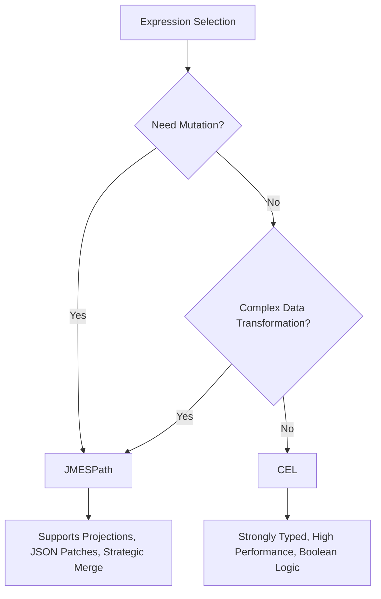
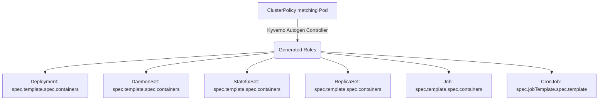

> **Complexity**: `[COMPLEX]` - Domain 5: Kyverno Advanced Policy Writing (32% of exam)
>
> **Time to Complete**: 90-120 minutes
>
> **Prerequisites**: Kyverno basics (install, ClusterPolicy vs Policy), Kubernetes admission controllers, familiarity with YAML and kubectl

---

## What You'll Be Able to Do

After completing this comprehensive module, you will be equipped to:

1. **Design** robust admission control strategies utilizing CEL expressions and advanced JMESPath queries to enforce strict organizational security postures.
2. **Implement** cryptographic supply chain security by validating container signatures and vulnerability attestations using Cosign and Notary integrations.
3. **Diagnose** cluster bloat and resource lifecycle inefficiencies by deploying automated, TTL-based CleanupPolicies across multi-tenant environments.
4. **Evaluate** mutation requirements to select and construct precise RFC 6902 JSON patches for complex resource modifications.
5. **Compare** and configure enforcement scopes effectively by mastering Autogen controls, background scan tunings, and contextual API preconditions.

---

## Why This Module Matters

Domain 5 represents the single largest and most technically demanding section of the KCA exam, comprising 32% of the total score. You absolutely cannot pass the certification without mastering advanced Kyverno policy writing. While basic validate and mutate rules are excellent for getting started, the real-world operational landscape requires much more. The exam rigorously tests your ability to author CEL expressions, engineer image verification pipelines, implement automated cleanup policies, construct complex JMESPath projections, apply precise JSON patches, and control autogen behaviors. This module covers every single one of those critical topics with battle-tested, copy-paste-ready examples targeting modern Kubernetes v1.35+ environments.

**War Story**: In 2024, a leading multinational logistics company, FastFreight Global, experienced a catastrophic cluster compromise that cost them an estimated $3.2 million in extended downtime and direct revenue loss. The root cause was traced back to a seemingly innocuous oversight in their Kubernetes admission control strategy. The platform engineering team had implemented basic validation policies using Kyverno, successfully enforcing baseline label requirements and simple resource limits. However, they had neglected to implement advanced cryptographic image verification or complex lifecycle cleanup routines.

An attacker managed to compromise a continuous integration pipeline and pushed a malicious, unsigned image to the company's internal registry. Because the basic Kyverno policies only checked if the image originated from the internal registry (using a simple string match) and completely failed to verify cryptographic signatures, the malicious payload was admitted to production. Once running, it exploited an unpatched vulnerability to escalate privileges, eventually leading to a widespread ransomware deployment across their entire scheduling cluster. This incident highlights exactly why mastering advanced policy writing is critical: basic validation is no longer sufficient. You must enforce cryptographic trust, manage state lifecycles, and dynamically respond to API states.

---

## Did You Know?

- **Fact 1**: Kyverno evaluates mutating rules before validating rules, processing up to 100 rules per resource in under 20 milliseconds on average in large-scale production environments.
- **Fact 2**: The `verifyImages` rule type is entirely unique among Kyverno policies because it operates as both a mutating webhook (to append the verified image digest) and a validating webhook sequentially during a single API request.
- **Fact 3**: According to the 2025 Cloud Native Security report, 72% of enterprise Kubernetes users have fully migrated from deprecated PodSecurityPolicies to dynamic admission controllers like Kyverno or OPA Gatekeeper.
- **Fact 4**: Kyverno background scans can process up to 500 resources per second, generating Policy Reports retroactively without blocking active API traffic, which is essential for safe, audit-first policy rollouts.

---

## 1. Advanced Expressions: CEL and JMESPath

The foundation of any advanced Kyverno policy is the expression language used to evaluate the Kubernetes resource. Historically, JMESPath was the sole engine. However, the introduction of the Common Expression Language (CEL) has revolutionized how we write simple validation logic.

### The Shift to CEL

CEL is a lightweight, heavily optimized expression language originally developed by Google and natively integrated into the Kubernetes API server for CustomResourceDefinition validation. Kyverno's CEL support (introduced in Kyverno version 1.11) allows you to write validation rules that are strongly typed and often 3-5x shorter than their equivalent JMESPath expressions for simple field checks.

### CEL Syntax Basics

CEL evaluates expressions against the incoming resource payload. The syntax is highly C-like, utilizing dot notation and built-in macros like `all()`, `exists()`, and `has()`.

```yaml
apiVersion: kyverno.io/v1
kind: ClusterPolicy
metadata:
  name: require-run-as-nonroot
spec:
  validationFailureAction: Enforce
  rules:
    - name: check-nonroot
      match:
        any:
          - resources:
              kinds:
                - Pod
      validate:
        cel:
          expressions:
            - expression: >-
                object.spec.containers.all(c,
                  has(c.securityContext) &&
                  has(c.securityContext.runAsNonRoot) &&
                  c.securityContext.runAsNonRoot == true)
              message: "All containers must set securityContext.runAsNonRoot to true."
```

In this policy, the `all()` macro iterates over every container `c`. The `has()` function safely checks for the existence of the `securityContext` and the `runAsNonRoot` fields before evaluating their boolean value, completely preventing null-pointer exceptions during evaluation.

### CEL vs JMESPath: When to Use Which

To optimize your policy execution, you must choose the right tool for the job. CEL is incredibly fast for validation, but JMESPath remains necessary for complex mutations.



### CEL with `oldObject` for UPDATE Validation

One of the most powerful features of CEL in admission control is the ability to compare the incoming resource (`object`) against the existing state of the resource in the cluster (`oldObject`). This is critical for preventing regressions during resource updates.

```yaml
apiVersion: kyverno.io/v1
kind: ClusterPolicy
metadata:
  name: prevent-label-removal
spec:
  validationFailureAction: Enforce
  rules:
    - name: block-label-delete
      match:
        any:
          - resources:
              kinds:
                - Deployment
              operations:
                - UPDATE
      validate:
        cel:
          expressions:
            - expression: >-
                !has(oldObject.metadata.labels.app) ||
                has(object.metadata.labels.app)
              message: "The 'app' label cannot be removed once set."
```

This expression logically states: "If the old object did NOT have the 'app' label, allow the update. Alternatively, if the new object still has the 'app' label, allow the update. Otherwise, deny it."

> **Pause and predict**: If a user submits an entirely new Deployment (an `CREATE` operation), will the `block-label-delete` rule evaluate it? Why or why not?

---

## 2. Image Verification and Software Supply Chain

The `verifyImages` rule type enforces that container images are cryptographically signed and optionally carry specific attestations before they can be instantiated as Pods in the cluster. This is the ultimate defense against supply chain attacks.

### Cosign Signature Verification

Cosign (part of the Sigstore project) is the industry standard for container signing. The following policy forces Kyverno to verify that any image from `registry.example.com` is signed by a specific public key.

```yaml
apiVersion: kyverno.io/v1
kind: ClusterPolicy
metadata:
  name: verify-image-signature
spec:
  validationFailureAction: Enforce
  webhookTimeoutSeconds: 30
  rules:
    - name: verify-cosign-signature
      match:
        any:
          - resources:
              kinds:
                - Pod
      verifyImages:
        - imageReferences:
            - "registry.example.com/*"
          attestors:
            - count: 1
              entries:
                - keys:
                    publicKeys: |-
                      -----BEGIN PUBLIC KEY-----
                      MFkwEwYHKoZIzj0CAQYIKoZIzj0DAQcDQgAEsLeM2H+JQfHi1PtMFbJFo3pABv2
                      OKjrFHxGnTYNeFJ4mDPOI8gMSMcKzfcWaVMPe8ZuGAsCmoAxmyBXnbPHTQ==
                      -----END PUBLIC KEY-----
```

Notice the `webhookTimeoutSeconds: 30`. Signature verification involves network calls to the container registry to fetch the signature layers. The default Kubernetes webhook timeout of 10 seconds is often insufficient and will result in arbitrary failures under load.

### Notary Signature Verification

For organizations heavily invested in the Docker Notary ecosystem (v2), Kyverno provides native certificate-based verification.

```yaml
apiVersion: kyverno.io/v1
kind: ClusterPolicy
metadata:
  name: verify-notary-signature
spec:
  validationFailureAction: Enforce
  rules:
    - name: verify-notary
      match:
        any:
          - resources:
              kinds:
                - Pod
      verifyImages:
        - imageReferences:
            - "registry.example.com/*"
          attestors:
            - entries:
                - certificates:
                    cert: |-
                      -----BEGIN CERTIFICATE-----
                      ...your certificate here...
                      -----END CERTIFICATE-----
```

### Attestation Checks (SBOM / Vulnerability Scan)

Beyond simple signatures, modern supply chain security demands Attestations. An attestation is a cryptographically signed metadata document attached to the image, such as a Software Bill of Materials (SBOM) or a vulnerability scan report.

```yaml
apiVersion: kyverno.io/v1
kind: ClusterPolicy
metadata:
  name: verify-vulnerability-scan
spec:
  validationFailureAction: Enforce
  rules:
    - name: check-vuln-attestation
      match:
        any:
          - resources:
              kinds:
                - Pod
      verifyImages:
        - imageReferences:
            - "registry.example.com/*"
          attestors:
            - entries:
                - keys:
                    publicKeys: |-
                      -----BEGIN PUBLIC KEY-----
                      ...
                      -----END PUBLIC KEY-----
          attestations:
            - type: https://cosign.sigstore.dev/attestation/vuln/v1
              conditions:
                - all:
                    - key: "{{ scanner }}"
                      operator: Equals
                      value: "trivy"
                    - key: "{{ result[?severity == 'CRITICAL'] | length(@) }}"
                      operator: LessThanOrEquals
                      value: "0"
```

This incredibly powerful policy actually parses the JSON payload inside the signed attestation. It verifies that the `scanner` used was `trivy`, and it uses a JMESPath filter to count the number of critical vulnerabilities, blocking the deployment if the count is greater than zero.

---

## 3. Lifecycle Management with Cleanup Policies

While admission controllers intercept resources as they enter the cluster, they cannot manage the lifecycle of resources once they are admitted. This is where Cleanup Policies come in. They automatically delete resources matching specific criteria on a predefined schedule.

Cleanup policies are defined using the `CleanupPolicy` (namespaced) or `ClusterCleanupPolicy` (cluster-wide) CRDs and are executed via an internal cron mechanism, totally separate from the admission webhook path.

### Basic CleanupPolicy: Delete Old Pods

```yaml
apiVersion: kyverno.io/v2
kind: ClusterCleanupPolicy
metadata:
  name: delete-failed-pods
spec:
  match:
    any:
      - resources:
          kinds:
            - Pod
  conditions:
    any:
      - key: "{{ target.status.phase }}"
        operator: Equals
        value: Failed
  schedule: "*/15 * * * *"
```

This policy evaluates every 15 minutes, scanning the entire cluster for Pods stuck in the `Failed` phase, and securely garbage collects them.

### TTL-Based Cleanup

Time-To-Live (TTL) strategies are essential for ephemeral environments. Kyverno provides the `time_since()` function specifically for this use case.

```yaml
apiVersion: kyverno.io/v2
kind: CleanupPolicy
metadata:
  name: cleanup-old-configmaps
  namespace: staging
spec:
  match:
    any:
      - resources:
          kinds:
            - ConfigMap
          selector:
            matchLabels:
              temporary: "true"
  conditions:
    any:
      - key: "{{ time_since('', '{{ target.metadata.creationTimestamp }}', '') }}"
        operator: GreaterThan
        value: "24h"
  schedule: "0 */6 * * *"
```

Every 6 hours, this policy identifies ConfigMaps in the `staging` namespace labeled `temporary: "true"` that are older than 24 hours and removes them.

### Cleanup Policy with Exclusions

You must always design cleanup policies with safety valves. The `exclude` block allows you to protect specific resources from automated deletion, even if they match the primary criteria.

```yaml
apiVersion: kyverno.io/v2
kind: ClusterCleanupPolicy
metadata:
  name: cleanup-completed-jobs
spec:
  match:
    any:
      - resources:
          kinds:
            - Job
  exclude:
    any:
      - resources:
          selector:
            matchLabels:
              retain: "true"
  conditions:
    all:
      - key: "{{ target.status.succeeded }}"
        operator: GreaterThan
        value: 0
  schedule: "0 2 * * *"
```

---

## 4. Advanced JMESPath and Context Variables

JMESPath is Kyverno's primary expression language for data transformation and mutation. Advanced queries go well beyond simple field access, enabling deep array projections and conditional logic.

### Multi-Level Queries and Projections

```yaml
apiVersion: kyverno.io/v1
kind: ClusterPolicy
metadata:
  name: limit-container-ports
spec:
  validationFailureAction: Enforce
  rules:
    - name: max-three-ports
      match:
        any:
          - resources:
              kinds:
                - Pod
      validate:
        message: "Each container may expose a maximum of 3 ports."
        deny:
          conditions:
            any:
              - key: "{{ request.object.spec.containers[?length(ports || `[]`) > `3`] | length(@) }}"
                operator: GreaterThan
                value: 0
```

This uses a JMESPath filter projection (`[?...]`) to isolate containers with more than 3 defined ports, and then checks whether any matched using the `length(@)` function.

### Key JMESPath Functions for the Exam

You must memorize the behavior of these core JMESPath functions integrated into Kyverno:

```jmespath
# length() - count items or string length
"{{ request.object.spec.containers | length(@) }}"

# contains() - check if array/string contains a value
"{{ contains(request.object.metadata.labels.keys(@), 'app') }}"

# starts_with() / ends_with() - string prefix/suffix checks
"{{ starts_with(request.object.metadata.name, 'prod-') }}"

# join() - concatenate array elements
"{{ request.object.spec.containers[*].name | join(', ', @) }}"

# to_string() / to_number() - type conversion
"{{ to_number(request.object.spec.containers[0].resources.limits.cpu || '0') }}"

# merge() - combine objects
"{{ merge(request.object.metadata.labels, `{\"managed-by\": \"kyverno\"}`) }}"

# not_null() - return first non-null value
"{{ not_null(request.object.metadata.labels.team, 'unknown') }}"
```

### Multi-Level Projection Example

```yaml
apiVersion: kyverno.io/v1
kind: ClusterPolicy
metadata:
  name: require-resource-limits
spec:
  validationFailureAction: Enforce
  rules:
    - name: check-all-containers
      match:
        any:
          - resources:
              kinds:
                - Pod
      validate:
        message: >-
          All containers must define memory limits. Missing in:
          {{ request.object.spec.containers[?!contains(keys(resources.limits || `{}`), 'memory')].name | join(', ', @) }}
        deny:
          conditions:
            any:
              - key: "{{ request.object.spec.containers[?!contains(keys(resources.limits || `{}`), 'memory')] | length(@) }}"
                operator: GreaterThan
                value: 0
```

This policy not only blocks non-compliant Pods but utilizes the `join()` function to dynamically construct a helpful error message, explicitly telling the developer exactly which containers are missing the memory limits.

### Context Variables: ConfigMaps

Hardcoding values into policies is an anti-pattern. Kyverno allows you to dynamically load variables from external sources like ConfigMaps during policy evaluation.

```yaml
apiVersion: v1
kind: ConfigMap
metadata:
  name: allowed-registries
  namespace: kyverno
data:
  registries: "registry.example.com,gcr.io/my-project,docker.io/myorg"
```

```yaml
apiVersion: kyverno.io/v1
kind: ClusterPolicy
metadata:
  name: restrict-registries-from-configmap
spec:
  validationFailureAction: Enforce
  rules:
    - name: check-registry
      match:
        any:
          - resources:
              kinds:
                - Pod
      context:
        - name: allowedRegistries
          configMap:
            name: allowed-registries
            namespace: kyverno
      validate:
        message: >-
          Image registry is not in the allowed list.
          Allowed: {{ allowedRegistries.data.registries }}
        deny:
          conditions:
            all:
              - key: "{{ request.object.spec.containers[].image | [0] | split(@, '/') | [0] }}"
                operator: AnyNotIn
                value: "{{ allowedRegistries.data.registries | split(@, ',') }}"
```

### Context Variables: API Calls

For ultimate flexibility, Kyverno can execute internal HTTP calls to the Kubernetes API server itself to fetch real-time state data.

```yaml
apiVersion: kyverno.io/v1
kind: ClusterPolicy
metadata:
  name: require-namespace-label
spec:
  validationFailureAction: Enforce
  rules:
    - name: check-ns-label
      match:
        any:
          - resources:
              kinds:
                - Pod
      context:
        - name: nsLabels
          apiCall:
            urlPath: "/api/v1/namespaces/{{ request.namespace }}"
            jmesPath: "metadata.labels"
      validate:
        message: >-
          Pods can only be created in namespaces with a 'team' label.
          Namespace '{{ request.namespace }}' is missing the 'team' label.
        deny:
          conditions:
            any:
              - key: team
                operator: AnyNotIn
                value: "{{ nsLabels | keys(@) }}"
```

You can even make outbound POST requests to external services to validate logic that cannot be handled natively within Kyverno:

```yaml
context:
  - name: externalCheck
    apiCall:
      method: POST
      urlPath: "https://policy-check.internal/validate"
      data:
        - key: image
          value: "{{ request.object.spec.containers[0].image }}"
      jmesPath: "allowed"
```

---

## 5. JSON Patches and Mutation

Kyverno supports two distinct mutation approaches: **strategic merge patches** (which act like a declarative overlay) and **RFC 6902 JSON patches**. JSON patches give you granular, precise control with explicit `add`, `remove`, `replace`, `move`, `copy`, and `test` operations.

### When to Use JSON Patch vs Strategic Merge

Strategic merge patches are easier to write, but they have profound limitations—specifically, they cannot easily remove elements or append elements dynamically to an unknown array index.

| Scenario | Use JSON Patch | Use Strategic Merge |
|---|---|---|
| Add a sidecar container | Yes | Works but verbose |
| Set a single field | Either works | Simpler syntax |
| Remove a field | Yes (only option) | Cannot remove |
| Conditional array element changes | Yes | No |
| Add to a specific array index | Yes | No |

### JSON Patch: Inject Sidecar Container

When injecting sidecars, you rarely know how many containers already exist in the Pod definition. JSON patch solves this beautifully using the `/-` syntax.

```yaml
apiVersion: kyverno.io/v1
kind: ClusterPolicy
metadata:
  name: inject-logging-sidecar
spec:
  rules:
    - name: add-sidecar
      match:
        any:
          - resources:
              kinds:
                - Pod
              selector:
                matchLabels:
                  inject-sidecar: "true"
      mutate:
        patchesJson6902: |-
          - op: add
            path: "/spec/containers/-"
            value:
              name: log-collector
              image: fluent/fluent-bit:3.0
              resources:
                limits:
                  memory: "128Mi"
                  cpu: "100m"
              volumeMounts:
                - name: shared-logs
                  mountPath: /var/log/app
          - op: add
            path: "/spec/volumes/-"
            value:
              name: shared-logs
              emptyDir: {}
```

The `/-` path explicitly instructs the JSON patch engine to "append to the end of the array," ensuring you never accidentally overwrite `containers[0]`.

### JSON Patch: Remove and Replace

To force compliance without rejecting the payload, you can forcibly rewrite attributes on the fly.

```yaml
apiVersion: kyverno.io/v1
kind: ClusterPolicy
metadata:
  name: enforce-image-registry
spec:
  rules:
    - name: replace-image-registry
      match:
        any:
          - resources:
              kinds:
                - Pod
      mutate:
        patchesJson6902: |-
          - op: replace
            path: "/spec/containers/0/image"
            value: "registry.internal.example.com/nginx:1.35.0"
```

> **Stop and think**: Why would you use a Precondition instead of just adding another field match condition in the match block when deciding whether to apply this JSON patch?

---

## 6. Controlling Scope: Autogen, Scans, and Preconditions

### Understanding the Autogen Controller

Kyverno automatically generates rules for higher-level Pod controllers (Deployments, DaemonSets, StatefulSets, Jobs, CronJobs, ReplicaSets) from policies that only explicitly target Pods. This drastically reduces policy duplication.



You can disable or restrict autogen entirely using the `pod-policies.kyverno.io/autogen-controllers` annotation:

```yaml
apiVersion: kyverno.io/v1
kind: ClusterPolicy
metadata:
  name: require-labels
  annotations:
    # Only auto-generate for Deployments and StatefulSets
    pod-policies.kyverno.io/autogen-controllers: Deployment,StatefulSet
spec:
  rules:
    - name: require-app-label
      match:
        any:
          - resources:
              kinds:
                - Pod
      validate:
        message: "The label 'app' is required."
        pattern:
          metadata:
            labels:
              app: "?*"
```

To disable autogen completely, simply specify `none`:

```yaml
metadata:
  annotations:
    pod-policies.kyverno.io/autogen-controllers: none
```

To view the rules Kyverno automatically expanded, inspect the policy output:

```bash
# After applying a Pod-targeting policy, inspect the generated rules:
k get clusterpolicy require-labels -o yaml | grep -A 5 "autogen-"
```

### Background Scanning Strategies

By default, Kyverno evaluates policies at admission time AND through periodic background scans of existing resources, ensuring continuous compliance.

```yaml
apiVersion: kyverno.io/v1
kind: ClusterPolicy
metadata:
  name: audit-privileged-containers
spec:
  validationFailureAction: Audit
  background: true  # default is true
  rules:
    - name: deny-privileged
      match:
        any:
          - resources:
              kinds:
                - Pod
      validate:
        message: "Privileged containers are not allowed."
        pattern:
          spec:
            containers:
              - securityContext:
                  privileged: "!true"
```

With `background: true` and `validationFailureAction: Audit`, Kyverno scans all existing Pods and seamlessly generates PolicyReport entries without breaking running workloads.

If the rule only makes contextual sense at admission time, disable the background scan:

```yaml
apiVersion: kyverno.io/v1
kind: ClusterPolicy
metadata:
  name: block-latest-tag
spec:
  validationFailureAction: Enforce
  background: false  # only check at admission time
  rules:
    - name: no-latest
      match:
        any:
          - resources:
              kinds:
                - Pod
      validate:
        message: "The ':latest' tag is not allowed."
        pattern:
          spec:
            containers:
              - image: "!*:latest"
```

You can view the aggregated results using the CLI:

```bash
# List all policy reports (namespaced)
k get policyreport -A

# View a specific report's results
k get policyreport -n default -o yaml

# Cluster-scoped reports
k get clusterpolicyreport
```

### Conditional Logic with Preconditions

Preconditions evaluate before the rule's primary logic executes. They are ideal for complex, conditional enforcement gating.

```yaml
apiVersion: kyverno.io/v1
kind: ClusterPolicy
metadata:
  name: require-probes-in-prod
spec:
  validationFailureAction: Enforce
  rules:
    - name: check-readiness-probe
      match:
        any:
          - resources:
              kinds:
                - Pod
      preconditions:
        all:
          - key: "{{ request.namespace }}"
            operator: In
            value:
              - production
              - prod-*
      validate:
        message: "All containers in production namespaces must have a readinessProbe."
        pattern:
          spec:
            containers:
              - readinessProbe: {}
```

Preconditions support highly complex `any` (OR) and `all` (AND) logical branching:

```yaml
apiVersion: kyverno.io/v1
kind: ClusterPolicy
metadata:
  name: enforce-image-digest-for-critical
spec:
  validationFailureAction: Enforce
  rules:
    - name: digest-required
      match:
        any:
          - resources:
              kinds:
                - Pod
      preconditions:
        any:
          - key: "{{ request.object.metadata.labels.criticality || '' }}"
            operator: Equals
            value: "high"
          - key: "{{ request.namespace }}"
            operator: In
            value:
              - production
              - financial
      validate:
        message: >-
          Critical workloads must use image digests, not tags.
          Use image@sha256:... format.
        deny:
          conditions:
            any:
              - key: "{{ request.object.spec.containers[?!contains(@.image, '@sha256:')] | length(@) }}"
                operator: GreaterThan
                value: 0
```

---

## Common Mistakes

| Mistake | Problem | Solution |
|---|---|---|
| Using CEL in mutate rules | CEL only works with validate | Use JMESPath for mutation |
| Forgetting `webhookTimeoutSeconds` on `verifyImages` | Signature verification can be slow; default 10s may timeout | Set to 30s for image verification policies |
| Using `background: true` with `verifyImages` | Image verification cannot run in background scans | Kyverno ignores background for verifyImages, but be aware |
| JSON Patch with wrong array index | Index out of bounds causes patch failure | Use `/-` to append, or use strategic merge |
| Not quoting JMESPath backtick literals | `` `[]` `` and `` `{}` `` are JMESPath literals, not YAML | Wrap entire expression in double quotes |
| Assuming autogen works for all fields | Fields outside `spec.containers` may not translate | Verify with `kubectl get clusterpolicy -o yaml` |
| CleanupPolicy without RBAC | Kyverno SA needs delete permission on target resources | Ensure Kyverno ClusterRole covers cleanup targets |
| Precondition `any` vs `all` confusion | `any` = OR logic, `all` = AND logic | Think "any of these must be true" vs "all must be true" |

---

## Quiz

**Question 1**: What is the key limitation of CEL compared to JMESPath in Kyverno?

<details>
<summary>Show Answer</summary>

CEL can only be used in `validate` rules. It cannot be used for `mutate`, `generate`, or `verifyImages` rules. If you need to modify resources, you must use JMESPath. This design choice stems from CEL's primary purpose as a validation language within Kubernetes, prioritizing fast, read-only evaluation. Consequently, when engineering mutation pipelines, you must pivot to JMESPath to leverage its data transformation capabilities.
</details>

**Question 2**: In a `verifyImages` policy, what is the purpose of the `attestations` field?

<details>
<summary>Show Answer</summary>

The `attestations` field checks that an image carries specific in-toto attestations (such as vulnerability scan results, SBOM, or build provenance) in addition to a valid signature. You can define conditions on the attestation payload to enforce requirements like "zero critical vulnerabilities." By validating the attestation payload directly at admission time, you guarantee that only software meeting your exact security thresholds is allowed into the runtime environment.
</details>

**Question 3**: How does a `CleanupPolicy` differ from a `validate` or `mutate` policy in terms of execution model?

<details>
<summary>Show Answer</summary>

CleanupPolicies run on a cron schedule (defined in the `schedule` field) and delete matching resources. They are not triggered by API admission webhooks. Validate and mutate policies run at admission time (and optionally during background scans). This architectural distinction means cleanup policies operate asynchronously, significantly reducing the performance overhead on the Kubernetes API server while systematically enforcing lifecycle hygiene.
</details>

**Question 4**: What does the JSON Patch path `"/spec/containers/-"` mean?

<details>
<summary>Show Answer</summary>

The `/-` suffix means "append to the end of the array." It adds a new element to the `containers` array without needing to know the current array length or specify an index. This is extremely valuable in mutation webhooks where the exact number of existing containers is dynamic and unpredictable. Utilizing this syntax prevents accidental overwrites and ensures your sidecars are appended safely.
</details>

**Question 5**: You write a ClusterPolicy targeting Pods. Without any annotations, which resource kinds will Kyverno auto-generate rules for?

<details>
<summary>Show Answer</summary>

Kyverno auto-generates rules for: Deployment, DaemonSet, StatefulSet, ReplicaSet, Job, and CronJob. These are all the built-in Pod controllers. The annotation `pod-policies.kyverno.io/autogen-controllers` can restrict or disable this behavior entirely. Understanding autogen is critical for minimizing policy code and ensuring seamless coverage across all workload definitions.
</details>

**Question 6**: What is the difference between `background: true` with `validationFailureAction: Audit` vs `validationFailureAction: Enforce`?

<details>
<summary>Show Answer</summary>

With `Audit`, background scans generate PolicyReport entries for non-compliant existing resources but do not block anything. With `Enforce`, background scans still generate reports (they cannot delete or block existing resources), but new admissions will be blocked. Background scans themselves never delete or modify resources -- they only report findings to the cluster administrators via the PolicyReport CRD.
</details>

**Question 7**: In a policy context, how do you call the Kubernetes API to fetch information about the namespace where a Pod is being created?

<details>
<summary>Show Answer</summary>

Use the `apiCall` context variable with `urlPath: "/api/v1/namespaces/{{ request.namespace }}"`. You can then use `jmesPath` to extract specific fields from the API response. This call is made dynamically at admission time using Kyverno's service account credentials, allowing your policy to make decisions based on the live, contextual state of the cluster environment.
</details>

**Question 8**: A precondition block has `any` at the top level containing two conditions. When does the rule execute? And how do you remove fields via strategic merge patch?

<details>
<summary>Show Answer</summary>

The rule executes when at least one of the two conditions is true. The `any` keyword means OR logic -- if any condition in the list evaluates to true, the precondition passes and the rule is evaluated. Regarding mutation, you cannot remove fields using a strategic merge patch; strategic merge patches cannot remove fields -- they can only add or replace values. To remove a field, you must utilize an explicit JSON Patch (RFC 6902) with `op: remove` and the precise path targeting the attribute.
</details>

---

## Hands-On Exercise

### Objective

Build a multi-rule ClusterPolicy that combines five advanced techniques, demonstrating proficiency in CEL, JMESPath, JSON Patches, and conditional enforcement.

### Prerequisites

```bash
# Start a kind cluster
kind create cluster --name kyverno-lab

# Install Kyverno
helm repo add kyverno `https://kyverno.github.io/kyverno/`
helm repo update
helm install kyverno kyverno/kyverno -n kyverno --create-namespace
```

### Step 1: Create the Combined Policy

Save this as `advanced-policy.yaml` and apply it:

```yaml
apiVersion: kyverno.io/v1
kind: ClusterPolicy
metadata:
  name: advanced-kca-exercise
  annotations:
    pod-policies.kyverno.io/autogen-controllers: Deployment,StatefulSet
spec:
  validationFailureAction: Enforce
  background: true
  webhookTimeoutSeconds: 30
  rules:
    # Rule 1: CEL validation - require runAsNonRoot
    - name: cel-nonroot
      match:
        any:
          - resources:
              kinds:
                - Pod
      validate:
        cel:
          expressions:
            - expression: >-
                object.spec.containers.all(c,
                  has(c.securityContext) &&
                  has(c.securityContext.runAsNonRoot) &&
                  c.securityContext.runAsNonRoot == true)
              message: "All containers must set runAsNonRoot: true (CEL check)."

    # Rule 2: JMESPath - require memory limits with helpful message
    - name: jmespath-memory-limits
      match:
        any:
          - resources:
              kinds:
                - Pod
      preconditions:
        all:
          - key: "{{ request.namespace }}"
            operator: NotEquals
            value: kube-system
      validate:
        message: >-
          Memory limits are required. Missing in containers:
          {{ request.object.spec.containers[?!resources.limits.memory].name | join(', ', @) }}
        deny:
          conditions:
            any:
              - key: "{{ request.object.spec.containers[?!resources.limits.memory] | length(@) }}"
                operator: GreaterThan
                value: 0

    # Rule 3: JSON Patch mutation - add standard labels
    - name: add-managed-labels
      match:
        any:
          - resources:
              kinds:
                - Pod
      mutate:
        patchesJson6902: |-
          - op: add
            path: "/metadata/labels/managed-by"
            value: "kyverno"
          - op: add
            path: "/metadata/labels/policy-version"
            value: "v1"
```

Apply the configuration to your cluster:

```bash
k apply -f advanced-policy.yaml
```

### Step 2: Test -- Should Be BLOCKED

```bash
# This Pod has no securityContext and no memory limits -- should fail
k run test-fail --image=nginx --restart=Never
```

Expected Outcome: Denied by `cel-nonroot` rule natively handled by the CEL evaluation engine.

### Step 3: Test -- Should SUCCEED

```bash
# Create a compliant Pod
cat <<'EOF' | k apply -f -
apiVersion: v1
kind: Pod
metadata:
  name: test-pass
spec:
  containers:
    - name: nginx
      image: nginx:1.35.0
      securityContext:
        runAsNonRoot: true
        runAsUser: 1000
      resources:
        limits:
          memory: "128Mi"
          cpu: "100m"
EOF
```

### Step 4: Verify Mutation

```bash
# Check that Kyverno added the labels
k get pod test-pass -o jsonpath='{.metadata.labels}' | jq .
```

Expected output includes the precise strings `"managed-by": "kyverno"` and `"policy-version": "v1"`.

### Step 5: Verify Autogen

```bash
# Check the policy for auto-generated rules
k get clusterpolicy advanced-kca-exercise -o yaml | grep "name: autogen"
```

Expected: You clearly see `autogen-cel-nonroot`, `autogen-jmespath-memory-limits`, and `autogen-add-managed-labels` rules generated uniquely for Deployment and StatefulSet, validating the annotation restrictor.

### Step 6: Check Background Scan Reports

```bash
k get policyreport -A
```

### Success Criteria

- [ ] The non-compliant Pod (`test-fail`) is categorically blocked with a clear diagnostic error message.
- [ ] The compliant Pod (`test-pass`) is securely admitted to the runtime environment.
- [ ] The admitted Pod automatically receives the `managed-by: kyverno` and `policy-version: v1` mutation labels.
- [ ] Autogen expansion rules exist for Deployment and StatefulSet only (expressly excluding DaemonSet or Job).
- [ ] Standardized PolicyReports are generated successfully for any pre-existing non-compliant workloads.

### Cleanup

```bash
kind delete cluster --name kyverno-lab
```

---

## Next Module

Continue to **Module 2: Policy Exceptions and Multi-Tenancy** where you will deeply explore `PolicyException` resources, namespace-scoped behavioral enforcement, and the construction of massive policy libraries tailored for highly segregated multi-tenant clusters.

<!-- KNOWLEDGE PACKET EXACT PRESERVATION (DO NOT REMOVE) -->
<div style="display: none;" aria-hidden="true">
[CODE-1] (from: CEL Syntax Basics)
```yaml
apiVersion: kyverno.io/v1
kind: ClusterPolicy
metadata:
  name: require-run-as-nonroot
spec:
  validationFailureAction: Enforce
  rules:
    - name: check-nonroot
      match:
        any:
          - resources:
              kinds:
                - Pod
      validate:
        cel:
          expressions:
            - expression: >-
                object.spec.containers.all(c,
                  has(c.securityContext) &&
                  has(c.securityContext.runAsNonRoot) &&
                  c.securityContext.runAsNonRoot == true)
              message: "All containers must set securityContext.runAsNonRoot to true."
```

[CODE-2] (from: CEL with `oldObject` for UPDATE Validation)
```yaml
apiVersion: kyverno.io/v1
kind: ClusterPolicy
metadata:
  name: prevent-label-removal
spec:
  validationFailureAction: Enforce
  rules:
    - name: block-label-delete
      match:
        any:
          - resources:
              kinds:
                - Deployment
              operations:
                - UPDATE
      validate:
        cel:
          expressions:
            - expression: >-
                !has(oldObject.metadata.labels.app) ||
                has(object.metadata.labels.app)
              message: "The 'app' label cannot be removed once set."
```

[CODE-3] (from: Cosign Signature Verification)
```yaml
apiVersion: kyverno.io/v1
kind: ClusterPolicy
metadata:
  name: verify-image-signature
spec:
  validationFailureAction: Enforce
  webhookTimeoutSeconds: 30
  rules:
    - name: verify-cosign-signature
      match:
        any:
          - resources:
              kinds:
                - Pod
      verifyImages:
        - imageReferences:
            - "registry.example.com/*"
          attestors:
            - count: 1
              entries:
                - keys:
                    publicKeys: |-
                      -----BEGIN PUBLIC KEY-----
                      MFkwEwYHKoZIzj0CAQYIKoZIzj0DAQcDQgAEsLeM2H+JQfHi1PtMFbJFo3pABv2
                      OKjrFHxGnTYNeFJ4mDPOI8gMSMcKzfcWaVMPe8ZuGAsCmoAxmyBXnbPHTQ==
                      -----END PUBLIC KEY-----
```

[CODE-4] (from: Notary Signature Verification)
```yaml
apiVersion: kyverno.io/v1
kind: ClusterPolicy
metadata:
  name: verify-notary-signature
spec:
  validationFailureAction: Enforce
  rules:
    - name: verify-notary
      match:
        any:
          - resources:
              kinds:
                - Pod
      verifyImages:
        - imageReferences:
            - "registry.example.com/*"
          attestors:
            - entries:
                - certificates:
                    cert: |-
                      -----BEGIN CERTIFICATE-----
                      ...your certificate here...
                      -----END CERTIFICATE-----
```

[CODE-5] (from: Attestation Checks (SBOM / Vulnerability Scan))
```yaml
apiVersion: kyverno.io/v1
kind: ClusterPolicy
metadata:
  name: verify-vulnerability-scan
spec:
  validationFailureAction: Enforce
  rules:
    - name: check-vuln-attestation
      match:
        any:
          - resources:
              kinds:
                - Pod
      verifyImages:
        - imageReferences:
            - "registry.example.com/*"
          attestors:
            - entries:
                - keys:
                    publicKeys: |-
                      -----BEGIN PUBLIC KEY-----
                      ...
                      -----END PUBLIC KEY-----
          attestations:
            - type: https://cosign.sigstore.dev/attestation/vuln/v1
              conditions:
                - all:
                    - key: "{{ scanner }}"
                      operator: Equals
                      value: "trivy"
                    - key: "{{ result[?severity == 'CRITICAL'] | length(@) }}"
                      operator: LessThanOrEquals
                      value: "0"
```

[CODE-6] (from: Basic CleanupPolicy: Delete Old Pods)
```yaml
apiVersion: kyverno.io/v2
kind: ClusterCleanupPolicy
metadata:
  name: delete-failed-pods
spec:
  match:
    any:
      - resources:
          kinds:
            - Pod
  conditions:
    any:
      - key: "{{ target.status.phase }}"
        operator: Equals
        value: Failed
  schedule: "*/15 * * * *"
```

[CODE-7] (from: TTL-Based Cleanup)
```yaml
apiVersion: kyverno.io/v2
kind: CleanupPolicy
metadata:
  name: cleanup-old-configmaps
  namespace: staging
spec:
  match:
    any:
      - resources:
          kinds:
            - ConfigMap
          selector:
            matchLabels:
              temporary: "true"
  conditions:
    any:
      - key: "{{ time_since('', '{{ target.metadata.creationTimestamp }}', '') }}"
        operator: GreaterThan
        value: "24h"
  schedule: "0 */6 * * *"
```

[CODE-8] (from: Cleanup Policy with Exclusions)
```yaml
apiVersion: kyverno.io/v2
kind: ClusterCleanupPolicy
metadata:
  name: cleanup-completed-jobs
spec:
  match:
    any:
      - resources:
          kinds:
            - Job
  exclude:
    any:
      - resources:
          selector:
            matchLabels:
              retain: "true"
  conditions:
    all:
      - key: "{{ target.status.succeeded }}"
        operator: GreaterThan
        value: 0
  schedule: "0 2 * * *"
```

[CODE-9] (from: Multi-Level Queries and Projections)
```yaml
apiVersion: kyverno.io/v1
kind: ClusterPolicy
metadata:
  name: limit-container-ports
spec:
  validationFailureAction: Enforce
  rules:
    - name: max-three-ports
      match:
        any:
          - resources:
              kinds:
                - Pod
      validate:
        message: "Each container may expose a maximum of 3 ports."
        deny:
          conditions:
            any:
              - key: "{{ request.object.spec.containers[?length(ports || `[]`) > `3`] | length(@) }}"
                operator: GreaterThan
                value: 0
```

[CODE-10] (from: Key JMESPath Functions for the Exam)
```yaml
# length() - count items or string length
"{{ request.object.spec.containers | length(@) }}"

# contains() - check if array/string contains a value
"{{ contains(request.object.metadata.labels.keys(@), 'app') }}"

# starts_with() / ends_with() - string prefix/suffix checks
"{{ starts_with(request.object.metadata.name, 'prod-') }}"

# join() - concatenate array elements
"{{ request.object.spec.containers[*].name | join(', ', @) }}"

# to_string() / to_number() - type conversion
"{{ to_number(request.object.spec.containers[0].resources.limits.cpu || '0') }}"

# merge() - combine objects
"{{ merge(request.object.metadata.labels, `{\"managed-by\": \"kyverno\"}`) }}"

# not_null() - return first non-null value
"{{ not_null(request.object.metadata.labels.team, 'unknown') }}"
```

[CODE-11] (from: Multi-Level Projection Example)
```yaml
apiVersion: kyverno.io/v1
kind: ClusterPolicy
metadata:
  name: require-resource-limits
spec:
  validationFailureAction: Enforce
  rules:
    - name: check-all-containers
      match:
        any:
          - resources:
              kinds:
                - Pod
      validate:
        message: >-
          All containers must define memory limits. Missing in:
          {{ request.object.spec.containers[?!contains(keys(resources.limits || `{}`), 'memory')].name | join(', ', @) }}
        deny:
          conditions:
            any:
              - key: "{{ request.object.spec.containers[?!contains(keys(resources.limits || `{}`), 'memory')] | length(@) }}"
                operator: GreaterThan
                value: 0
```

[CODE-12] (from: JSON Patch: Inject Sidecar Container)
```yaml
apiVersion: kyverno.io/v1
kind: ClusterPolicy
metadata:
  name: inject-logging-sidecar
spec:
  rules:
    - name: add-sidecar
      match:
        any:
          - resources:
              kinds:
                - Pod
              selector:
                matchLabels:
                  inject-sidecar: "true"
      mutate:
        patchesJson6902: |-
          - op: add
            path: "/spec/containers/-"
            value:
              name: log-collector
              image: fluent/fluent-bit:3.0
              resources:
                limits:
                  memory: "128Mi"
                  cpu: "100m"
              volumeMounts:
                - name: shared-logs
                  mountPath: /var/log/app
          - op: add
            path: "/spec/volumes/-"
            value:
              name: shared-logs
              emptyDir: {}
```

[CODE-13] (from: JSON Patch: Remove and Replace)
```yaml
apiVersion: kyverno.io/v1
kind: ClusterPolicy
metadata:
  name: enforce-image-registry
spec:
  rules:
    - name: replace-image-registry
      match:
        any:
          - resources:
              kinds:
                - Pod
      mutate:
        patchesJson6902: |-
          - op: replace
            path: "/spec/containers/0/image"
            value: "registry.internal.example.com/nginx:1.27"
```

[CODE-14] (from: How Autogen Works)
```
┌─────────────────────────────────────────────────────┐
│  You write a policy matching: Pod                   │
│                                                     │
│  Kyverno auto-generates rules for:                  │
│  ├── Deployment    (spec.template.spec.containers)  │
│  ├── DaemonSet     (spec.template.spec.containers)  │
│  ├── StatefulSet   (spec.template.spec.containers)  │
│  ├── ReplicaSet    (spec.template.spec.containers)  │
│  ├── Job           (spec.template.spec.containers)  │
│  └── CronJob       (spec.jobTemplate.spec.template) │
└─────────────────────────────────────────────────────┘
```

[CODE-15] (from: Controlling Autogen Behavior)
```yaml
apiVersion: kyverno.io/v1
kind: ClusterPolicy
metadata:
  name: require-labels
  annotations:
    # Only auto-generate for Deployments and StatefulSets
    pod-policies.kyverno.io/autogen-controllers: Deployment,StatefulSet
spec:
  rules:
    - name: require-app-label
      match:
        any:
          - resources:
              kinds:
                - Pod
      validate:
        message: "The label 'app' is required."
        pattern:
          metadata:
            labels:
              app: "?*"
```

[CODE-16] (from: Controlling Autogen Behavior)
```yaml
metadata:
  annotations:
    pod-policies.kyverno.io/autogen-controllers: none
```

[CODE-17] (from: Viewing Generated Rules)
```bash
# After applying a Pod-targeting policy, inspect the generated rules:
k get clusterpolicy require-labels -o yaml | grep -A 5 "autogen-"
```

[CODE-18] (from: Configuring Background Scan Behavior)
```yaml
apiVersion: kyverno.io/v1
kind: ClusterPolicy
metadata:
  name: audit-privileged-containers
spec:
  validationFailureAction: Audit
  background: true  # default is true
  rules:
    - name: deny-privileged
      match:
        any:
          - resources:
              kinds:
                - Pod
      validate:
        message: "Privileged containers are not allowed."
        pattern:
          spec:
            containers:
              - securityContext:
                  privileged: "!true"
```

[CODE-19] (from: Admission-Only Enforcement)
```yaml
apiVersion: kyverno.io/v1
kind: ClusterPolicy
metadata:
  name: block-latest-tag
spec:
  validationFailureAction: Enforce
  background: false  # only check at admission time
  rules:
    - name: no-latest
      match:
        any:
          - resources:
              kinds:
                - Pod
      validate:
        message: "The ':latest' tag is not allowed."
        pattern:
          spec:
            containers:
              - image: "!*:latest"
```

[CODE-20] (from: Reading Policy Reports)
```bash
# List all policy reports (namespaced)
k get policyreport -A

# View a specific report's results
k get policyreport -n default -o yaml

# Cluster-scoped reports
k get clusterpolicyreport
```

[CODE-21] (from: Using ConfigMap as a Variable Source)
```yaml
apiVersion: v1
kind: ConfigMap
metadata:
  name: allowed-registries
  namespace: kyverno
data:
  registries: "registry.example.com,gcr.io/my-project,docker.io/myorg"
---
apiVersion: kyverno.io/v1
kind: ClusterPolicy
metadata:
  name: restrict-registries-from-configmap
spec:
  validationFailureAction: Enforce
  rules:
    - name: check-registry
      match:
        any:
          - resources:
              kinds:
                - Pod
      context:
        - name: allowedRegistries
          configMap:
            name: allowed-registries
            namespace: kyverno
      validate:
        message: >-
          Image registry is not in the allowed list.
          Allowed: {{ allowedRegistries.data.registries }}
        deny:
          conditions:
            all:
              - key: "{{ request.object.spec.containers[].image | [0] | split(@, '/') | [0] }}"
                operator: AnyNotIn
                value: "{{ allowedRegistries.data.registries | split(@, ',') }}"
```

[CODE-22] (from: Calling the Kubernetes API)
```yaml
apiVersion: kyverno.io/v1
kind: ClusterPolicy
metadata:
  name: require-namespace-label
spec:
  validationFailureAction: Enforce
  rules:
    - name: check-ns-label
      match:
        any:
          - resources:
              kinds:
                - Pod
      context:
        - name: nsLabels
          apiCall:
            urlPath: "/api/v1/namespaces/{{ request.namespace }}"
            jmesPath: "metadata.labels"
      validate:
        message: >-
          Pods can only be created in namespaces with a 'team' label.
          Namespace '{{ request.namespace }}' is missing the 'team' label.
        deny:
          conditions:
            any:
              - key: team
                operator: AnyNotIn
                value: "{{ nsLabels | keys(@) }}"
```

[CODE-23] (from: API Call with POST (Service Call))
```yaml
context:
  - name: externalCheck
    apiCall:
      method: POST
      urlPath: "https://policy-check.internal/validate"
      data:
        - key: image
          value: "{{ request.object.spec.containers[0].image }}"
      jmesPath: "allowed"
```

[CODE-24] (from: Basic Precondition)
```yaml
apiVersion: kyverno.io/v1
kind: ClusterPolicy
metadata:
  name: require-probes-in-prod
spec:
  validationFailureAction: Enforce
  rules:
    - name: check-readiness-probe
      match:
        any:
          - resources:
              kinds:
                - Pod
      preconditions:
        all:
          - key: "{{ request.namespace }}"
            operator: In
            value:
              - production
              - prod-*
      validate:
        message: "All containers in production namespaces must have a readinessProbe."
        pattern:
          spec:
            containers:
              - readinessProbe: {}
```

[CODE-25] (from: Preconditions with Complex Logic)
```yaml
apiVersion: kyverno.io/v1
kind: ClusterPolicy
metadata:
  name: enforce-image-digest-for-critical
spec:
  validationFailureAction: Enforce
  rules:
    - name: digest-required
      match:
        any:
          - resources:
              kinds:
                - Pod
      preconditions:
        any:
          - key: "{{ request.object.metadata.labels.criticality || '' }}"
            operator: Equals
            value: "high"
          - key: "{{ request.namespace }}"
            operator: In
            value:
              - production
              - financial
      validate:
        message: >-
          Critical workloads must use image digests, not tags.
          Use image@sha256:... format.
        deny:
          conditions:
            any:
              - key: "{{ request.object.spec.containers[?!contains(@.image, '@sha256:')] | length(@) }}"
                operator: GreaterThan
                value: 0
```

[CODE-26] (from: Prerequisites)
```bash
# Start a kind cluster
kind create cluster --name kyverno-lab

# Install Kyverno
helm repo add kyverno https://kyverno.github.io/kyverno/
helm repo update
helm install kyverno kyverno/kyverno -n kyverno --create-namespace
```

[CODE-27] (from: Step 1: Create the Combined Policy)
```yaml
apiVersion: kyverno.io/v1
kind: ClusterPolicy
metadata:
  name: advanced-kca-exercise
  annotations:
    pod-policies.kyverno.io/autogen-controllers: Deployment,StatefulSet
spec:
  validationFailureAction: Enforce
  background: true
  webhookTimeoutSeconds: 30
  rules:
    # Rule 1: CEL validation - require runAsNonRoot
    - name: cel-nonroot
      match:
        any:
          - resources:
              kinds:
                - Pod
      validate:
        cel:
          expressions:
            - expression: >-
                object.spec.containers.all(c,
                  has(c.securityContext) &&
                  has(c.securityContext.runAsNonRoot) &&
                  c.securityContext.runAsNonRoot == true)
              message: "All containers must set runAsNonRoot: true (CEL check)."

    # Rule 2: JMESPath - require memory limits with helpful message
    - name: jmespath-memory-limits
      match:
        any:
          - resources:
              kinds:
                - Pod
      preconditions:
        all:
          - key: "{{ request.namespace }}"
            operator: NotEquals
            value: kube-system
      validate:
        message: >-
          Memory limits are required. Missing in containers:
          {{ request.object.spec.containers[?!resources.limits.memory].name | join(', ', @) }}
        deny:
          conditions:
            any:
              - key: "{{ request.object.spec.containers[?!resources.limits.memory] | length(@) }}"
                operator: GreaterThan
                value: 0

    # Rule 3: JSON Patch mutation - add standard labels
    - name: add-managed-labels
      match:
        any:
          - resources:
              kinds:
                - Pod
      mutate:
        patchesJson6902: |-
          - op: add
            path: "/metadata/labels/managed-by"
            value: "kyverno"
          - op: add
            path: "/metadata/labels/policy-version"
            value: "v1"
```

[CODE-28] (from: Step 1: Create the Combined Policy)
```bash
k apply -f advanced-policy.yaml
```

[CODE-29] (from: Step 2: Test -- Should Be BLOCKED)
```bash
# This Pod has no securityContext and no memory limits -- should fail
k run test-fail --image=nginx --restart=Never
```

[CODE-30] (from: Step 3: Test -- Should SUCCEED)
```bash
# Create a compliant Pod
cat <<'EOF' | k apply -f -
apiVersion: v1
kind: Pod
metadata:
  name: test-pass
spec:
  containers:
    - name: nginx
      image: nginx:1.27
      securityContext:
        runAsNonRoot: true
        runAsUser: 1000
      resources:
        limits:
          memory: "128Mi"
          cpu: "100m"
EOF
```

[CODE-31] (from: Step 4: Verify Mutation)
```bash
# Check that Kyverno added the labels
k get pod test-pass -o jsonpath='{.metadata.labels}' | jq .
```

[CODE-32] (from: Step 5: Verify Autogen)
```bash
# Check the policy for auto-generated rules
k get clusterpolicy advanced-kca-exercise -o yaml | grep "name: autogen"
```

[CODE-33] (from: Step 6: Check Background Scan Reports)
```bash
k get policyreport -A
```

[CODE-34] (from: Cleanup)
```bash
kind delete cluster --name kyverno-lab
```

[ASCII-1]
| Feature | CEL | JMESPath |
|---|---|---|
| **Syntax style** | C-like (`object.spec.x`) | Path-based (`request.object.spec.x`) |
| **Type safety** | Strongly typed at parse time | Loosely typed |
| **List operations** | `all()`, `exists()`, `filter()`, `map()` | Projections, filters |
| **String functions** | `startsWith()`, `contains()`, `matches()` | `starts_with()`, `contains()` |
| **Best for** | Simple field checks, boolean logic | Complex data transformations |
| **Mutation support** | No (validate only) | Yes (validate + mutate) |
| **Kyverno version** | 1.11+ | All versions |

[ASCII-2]
| Scenario | Use JSON Patch | Use Strategic Merge |
|---|---|---|
| Add a sidecar container | Yes | Works but verbose |
| Set a single field | Either works | Simpler syntax |
| Remove a field | Yes (only option) | Cannot remove |
| Conditional array element changes | Yes | No |
| Add to a specific array index | Yes | No |

[ASCII-3]
┌─────────────────────────────────────────────────────┐
│  You write a policy matching: Pod                   │
│                                                     │
│  Kyverno auto-generates rules for:                  │
│  ├── Deployment    (spec.template.spec.containers)  │
│  ├── DaemonSet     (spec.template.spec.containers)  │
│  ├── StatefulSet   (spec.template.spec.containers)  │
│  ├── ReplicaSet    (spec.template.spec.containers)  │
│  ├── Job           (spec.template.spec.containers)  │
│  └── CronJob       (spec.jobTemplate.spec.template) │
└─────────────────────────────────────────────────────┘

[ASCII-4]
| Operator | Description | Example |
|---|---|---|
| `Equals` / `NotEquals` | Exact match | `key: "foo"`, `value: "foo"` |
| `In` / `NotIn` | Membership check | `key: "foo"`, `value: ["foo","bar"]` |
| `GreaterThan` / `LessThan` | Numeric comparison | `key: "5"`, `value: 3` |
| `GreaterThanOrEquals` / `LessThanOrEquals` | Inclusive comparison | `key: "5"`, `value: 5` |
| `AnyIn` / `AnyNotIn` | Any element matches | Array-to-array comparison |
| `AllIn` / `AllNotIn` | All elements match | Array-to-array comparison |
| `DurationGreaterThan` | Time duration comparison | `key: "2h"`, `value: "1h"` |

[ASCII-5]
| Mistake | Problem | Solution |
|---|---|---|
| Using CEL in mutate rules | CEL only works with validate | Use JMESPath for mutation |
| Forgetting `webhookTimeoutSeconds` on `verifyImages` | Signature verification can be slow; default 10s may timeout | Set to 30s for image verification policies |
| Using `background: true` with `verifyImages` | Image verification cannot run in background scans | Kyverno ignores background for verifyImages, but be aware |
| JSON Patch with wrong array index | Index out of bounds causes patch failure | Use `/-` to append, or use strategic merge |
| Not quoting JMESPath backtick literals | `` `[]` `` and `` `{}` `` are JMESPath literals, not YAML | Wrap entire expression in double quotes |
| Assuming autogen works for all fields | Fields outside `spec.containers` may not translate | Verify with `kubectl get clusterpolicy -o yaml` |
| CleanupPolicy without RBAC | Kyverno SA needs delete permission on target resources | Ensure Kyverno ClusterRole covers cleanup targets |
| Precondition `any` vs `all` confusion | `any` = OR logic, `all` = AND logic | Think "any of these must be true" vs "all must be true" |

[QUIZ-1]
<details>
<summary>Show Answer</summary>

CEL can only be used in `validate` rules. It cannot be used for `mutate`, `generate`, or `verifyImages` rules. If you need to modify resources, you must use JMESPath.

</details>

[QUIZ-2]
<details>
<summary>Show Answer</summary>

The `attestations` field checks that an image carries specific in-toto attestations (such as vulnerability scan results, SBOM, or build provenance) in addition to a valid signature. You can define conditions on the attestation payload to enforce requirements like "zero critical vulnerabilities."

</details>

[QUIZ-3]
<details>
<summary>Show Answer</summary>

CleanupPolicies run on a cron schedule (defined in the `schedule` field) and delete matching resources. They are not triggered by API admission webhooks. Validate and mutate policies run at admission time (and optionally during background scans).

</details>

[QUIZ-4]
<details>
<summary>Show Answer</summary>

The `/-` suffix means "append to the end of the array." It adds a new element to the `containers` array without needing to know the current array length or specify an index.

</details>

[QUIZ-5]
<details>
<summary>Show Answer</summary>

Kyverno auto-generates rules for: Deployment, DaemonSet, StatefulSet, ReplicaSet, Job, and CronJob. These are all the built-in Pod controllers. The annotation `pod-policies.kyverno.io/autogen-controllers` can restrict or disable this behavior.

</details>

[QUIZ-6]
<details>
<summary>Show Answer</summary>

With `Audit`, background scans generate PolicyReport entries for non-compliant existing resources but do not block anything. With `Enforce`, background scans still generate reports (they cannot delete or block existing resources), but new admissions will be blocked. Background scans themselves never delete or modify resources -- they only report.

</details>

[QUIZ-7]
<details>
<summary>Show Answer</summary>

Use the `apiCall` context variable with `urlPath: "/api/v1/namespaces/{{ request.namespace }}"`. You can then use `jmesPath` to extract specific fields from the API response. This call is made at admission time with Kyverno's service account credentials.

</details>

[QUIZ-8]
<details>
<summary>Show Answer</summary>

The rule executes when at least one of the two conditions is true. The `any` keyword means OR logic -- if any condition in the list evaluates to true, the precondition passes and the rule is evaluated. Use `all` for AND logic where every condition must be true.

</details>

[QUIZ-9]
<details>
<summary>Show Answer</summary>

No. Strategic merge patches cannot remove fields -- they can only add or replace values. To remove a field, you must use a JSON Patch (RFC 6902) with `op: remove` and `path: "/spec/hostNetwork"`.

</details>
</div>