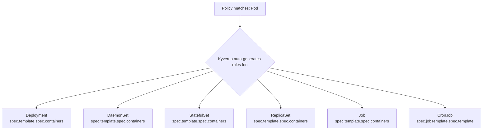

> **Complexity**: `[COMPLEX]` - Domain 5: Kyverno Advanced Policy Writing (32% of exam)
>
> **Time to Complete**: 90-120 minutes
>
> **Prerequisites**: Kyverno basics (install, ClusterPolicy vs Policy), Kubernetes admission controllers, familiarity with YAML and kubectl

## What You'll Be Able to Do

After completing this module, you will be able to:

1. **Design** advanced Kyverno policies leveraging Common Expression Language (CEL) and JMESPath projections to enforce complex structural validation on Kubernetes resources.
2. **Implement** robust software supply chain security by evaluating Cosign and Notary image signatures and SBOM attestations using the `verifyImages` rule type.
3. **Debug** unintended policy behaviors by diagnosing autogen rule translation failures and evaluating background scan policy reports.
4. **Evaluate** mutating admission control strategies, comparing RFC 6902 JSON patches against strategic merge patches for dynamic resource modification.
5. **Implement** targeted lifecycle management using `CleanupPolicy` resources to automatically purge dormant or non-compliant cluster objects based on chronological TTL constraints.

## Why This Module Matters

In late 2024, a major North American payment processing gateway experienced a catastrophic breach resulting in $4.2 million in regulatory fines and unauthorized crypto-mining across their production clusters. Their platform engineering team had deployed Kyverno, but only configured basic labeling and namespace quotas. They operated under a false sense of security, believing that simply having an admission controller installed meant they were protected against malicious workloads.

The attackers compromised a CI/CD pipeline and pushed an unsigned, maliciously modified container image to the company's internal registry. Because the platform team had never implemented `verifyImages` policies to enforce cryptographic signatures, the Kubernetes API server happily admitted the rogue Pods. Furthermore, the lack of behavioral preconditions and API call integrations meant the rogue workloads were able to quietly escalate privileges and modify cluster state without triggering any localized alerts. 

This domain represents 32% of the Kubernetes and Cloud Native Associate (KCA) exam because basic policies are merely table stakes. Real-world cluster security requires the advanced logic covered in this module: image attestation verification, chronological cleanup policies, complex JMESPath mutations, and dynamic API lookups. Mastering these concepts transforms Kyverno from a simple label enforcer into a comprehensive, proactive security boundary capable of defending multi-tenant platforms at scale.

## Did You Know?

- Kyverno's CEL support (introduced in v1.11) allows validation rules to execute up to 3-5x faster than equivalent JMESPath expressions because CEL is compiled natively within the Kubernetes API server's admission pipeline.
- The `verifyImages` rule type is unique among Kyverno features because it acts as both a mutating webhook (to inject the immutable `sha256` image digest) and a validating webhook (to verify the signature) in a single atomic pass.
- Kyverno `CleanupPolicy` resources evaluate via an internal CronJob-like controller syntax, making them the only native policy type that is completely decoupled from the API admission webhook lifecycle.
- In a cluster with 10,000 resources, Kyverno background scans can retroactively evaluate compliance in under 45 seconds, generating comprehensive Policy Reports without risking disruption to running workloads.

---

## 1. CEL (Common Expression Language)

While Kyverno originally relied exclusively on JMESPath for policy logic, the ecosystem has heavily gravitated toward the Common Expression Language (CEL). Originally developed by Google, CEL has become the native standard for Kubernetes API validation (such as ValidatingAdmissionPolicies introduced in v1.28). Kyverno natively supports CEL expressions within its validation rules.

Think of JMESPath as a powerful text-processing Swiss Army knife—it can cut, fold, and project JSON data in myriad ways, making it excellent for mutations. CEL, on the other hand, is like a highly specialized surgical scalpel. It is strongly typed at parse time, evaluates with deterministic performance, and utilizes a C-style syntax that is instantly familiar to most engineers.

### CEL Syntax Basics

The following example demonstrates how CEL evaluates an object directly. Note the syntax: `object.spec...` rather than JMESPath's `request.object...`.

```yaml
apiVersion: kyverno.io/v1
kind: ClusterPolicy
metadata:
  name: require-run-as-nonroot
spec:
  validationFailureAction: Enforce
  rules:
    - name: check-nonroot
      match:
        any:
          - resources:
              kinds:
                - Pod
      validate:
        cel:
          expressions:
            - expression: >-
                object.spec.containers.all(c,
                  has(c.securityContext) &&
                  has(c.securityContext.runAsNonRoot) &&
                  c.securityContext.runAsNonRoot == true)
              message: "All containers must set securityContext.runAsNonRoot to true."
```

> **Pause and predict**: If a Pod is submitted with three containers, and only two have `runAsNonRoot: true`, what will the `all()` macro in the CEL expression return? 
> *Prediction*: It will return `false`. The `all(c, ...)` macro acts as a logical AND across every element in the array, immediately failing the expression if a single container is non-compliant.

### CEL vs JMESPath: When to Use Which

When writing policies, choosing the right evaluation language is critical. Use the following table to guide your decision-making on the KCA exam.

| Feature | CEL | JMESPath |
|---|---|---|
| **Syntax style** | C-like (`object.spec.x`) | Path-based (`request.object.spec.x`) |
| **Type safety** | Strongly typed at parse time | Loosely typed |
| **List operations** | `all()`, `exists()`, `filter()`, `map()` | Projections, filters |
| **String functions** | `startsWith()`, `contains()`, `matches()` | `starts_with()`, `contains()` |
| **Best for** | Simple field checks, boolean logic | Complex data transformations |
| **Mutation support** | No (validate only) | Yes (validate + mutate) |
| **Kyverno version** | 1.11+ | All versions |

**Exam tip**: CEL cannot be used in mutate rules. If an exam scenario requires injecting a sidecar or altering a label, you must use JMESPath or JSON patches.

### CEL with `oldObject` for UPDATE Validation

One of CEL's most powerful capabilities is comparing the incoming resource state against the existing cluster state. This is critical for preventing destructive updates. The `oldObject` variable represents the resource before the API request.

```yaml
apiVersion: kyverno.io/v1
kind: ClusterPolicy
metadata:
  name: prevent-label-removal
spec:
  validationFailureAction: Enforce
  rules:
    - name: block-label-delete
      match:
        any:
          - resources:
              kinds:
                - Deployment
              operations:
                - UPDATE
      validate:
        cel:
          expressions:
            - expression: >-
                !has(oldObject.metadata.labels.app) ||
                has(object.metadata.labels.app)
              message: "The 'app' label cannot be removed once set."
```

---

## 2. verifyImages: Cosign and Attestation Checks

Software supply chain security is a top priority in modern Kubernetes environments. A malicious actor who gains push access to your container registry can silently replace a legitimate image with a compromised one. If your cluster blindly trusts the registry, the compromised image executes with all associated privileges.

The `verifyImages` rule type intercepts Pod creation, resolves image tags to their immutable `sha256` digests (via mutation), and then cryptographically verifies the signature against a known public key or certificate authority.

> **Stop and think**: Why do image verification policies require a longer `webhookTimeoutSeconds` setting than standard validation policies?
> *Analysis*: Standard validations occur locally in memory, whereas image verification requires external network calls to the OCI registry to fetch digests and signatures, which can easily exceed the default 10-second timeout.

### Cosign Signature Verification

Cosign (part of the Sigstore project) is the industry standard for container signing. Here is how to enforce Cosign signatures in Kyverno. Note the `webhookTimeoutSeconds: 30` setting—signature verification requires external network calls to the OCI registry, which often exceed the default 10-second webhook timeout.

```yaml
apiVersion: kyverno.io/v1
kind: ClusterPolicy
metadata:
  name: verify-image-signature
spec:
  validationFailureAction: Enforce
  webhookTimeoutSeconds: 30
  rules:
    - name: verify-cosign-signature
      match:
        any:
          - resources:
              kinds:
                - Pod
      verifyImages:
        - imageReferences:
            - "registry.example.com/*"
          attestors:
            - count: 1
              entries:
                - keys:
                    publicKeys: |-
                      -----BEGIN PUBLIC KEY-----
                      MFkwEwYHKoZIzj0CAQYIKoZIzj0DAQcDQgAEsLeM2H+JQfHi1PtMFbJFo3pABv2
                      OKjrFHxGnTYNeFJ4mDPOI8gMSMcKzfcWaVMPe8ZuGAsCmoAxmyBXnbPHTQ==
                      -----END PUBLIC KEY-----
```

### Notary Signature Verification

For enterprise environments utilizing Docker Content Trust (Notary v1) or Notary v2, Kyverno allows verification via x509 certificate chains.

```yaml
apiVersion: kyverno.io/v1
kind: ClusterPolicy
metadata:
  name: verify-notary-signature
spec:
  validationFailureAction: Enforce
  rules:
    - name: verify-notary
      match:
        any:
          - resources:
              kinds:
                - Pod
      verifyImages:
        - imageReferences:
            - "registry.example.com/*"
          attestors:
            - entries:
                - certificates:
                    cert: |-
                      -----BEGIN CERTIFICATE-----
                      ...your certificate here...
                      -----END CERTIFICATE-----
```

### Attestation Checks (SBOM / Vulnerability Scan)

Signatures prove *who* built the image, but attestations prove *what* is inside it. Attestations are signed metadata payloads attached to the image. Using Kyverno, you can parse these payloads (such as an in-toto vulnerability scan result) and enforce logical conditions. The following policy ensures the image was scanned by Trivy and contains exactly zero CRITICAL vulnerabilities.

```yaml
apiVersion: kyverno.io/v1
kind: ClusterPolicy
metadata:
  name: verify-vulnerability-scan
spec:
  validationFailureAction: Enforce
  rules:
    - name: check-vuln-attestation
      match:
        any:
          - resources:
              kinds:
                - Pod
      verifyImages:
        - imageReferences:
            - "registry.example.com/*"
          attestors:
            - entries:
                - keys:
                    publicKeys: |-
                      -----BEGIN PUBLIC KEY-----
                      ...
                      -----END PUBLIC KEY-----
          attestations:
            - type: https://cosign.sigstore.dev/attestation/vuln/v1
              conditions:
                - all:
                    - key: "{{ scanner }}"
                      operator: Equals
                      value: "trivy"
                    - key: "{{ result[?severity == 'CRITICAL'] | length(@) }}"
                      operator: LessThanOrEquals
                      value: "0"
```

---

## 3. Cleanup Policies

Unlike standard validation or mutation rules which respond to API server admission events, **Cleanup Policies** run asynchronously on a cron schedule. They are defined using the `CleanupPolicy` (namespaced) or `ClusterCleanupPolicy` (cluster-wide) Custom Resource Definitions (CRDs). 

These policies are critical for cluster hygiene—purging dormant resources, clearing out failed jobs, and enforcing Time-To-Live (TTL) on temporary debug namespaces. 

> **Stop and think**: If a CleanupPolicy requires deleting resources, what component actually performs the deletion?
> *Analysis*: The Kyverno controller's background service account executes the deletions. Therefore, you must ensure Kyverno's RBAC roles grant `delete` permissions on the target resource kinds, otherwise the policy will silently fail.

### Basic CleanupPolicy: Delete Old Pods

This basic example runs every 15 minutes, sweeping the cluster for any Pods stuck in the `Failed` phase.

```yaml
apiVersion: kyverno.io/v2
kind: ClusterCleanupPolicy
metadata:
  name: delete-failed-pods
spec:
  match:
    any:
      - resources:
          kinds:
            - Pod
  conditions:
    any:
      - key: "{{ target.status.phase }}"
        operator: Equals
        value: Failed
  schedule: "*/15 * * * *"
```

### TTL-Based Cleanup

A common pattern is implementing a TTL (Time-To-Live). This policy leverages Kyverno's built-in `time_since()` JMESPath function to identify resources that have outlived their welcome.

```yaml
apiVersion: kyverno.io/v2
kind: CleanupPolicy
metadata:
  name: cleanup-old-configmaps
  namespace: staging
spec:
  match:
    any:
      - resources:
          kinds:
            - ConfigMap
          selector:
            matchLabels:
              temporary: "true"
  conditions:
    any:
      - key: "{{ time_since('', '{{ target.metadata.creationTimestamp }}', '') }}"
        operator: GreaterThan
        value: "24h"
  schedule: "0 */6 * * *"
```

### Cleanup Policy with Exclusions

You can also combine `match` blocks with `exclude` blocks to create safe harbor logic. Here, completed Jobs are deleted daily at 2:00 AM, *unless* they possess the `retain: "true"` label.

```yaml
apiVersion: kyverno.io/v2
kind: ClusterCleanupPolicy
metadata:
  name: cleanup-completed-jobs
spec:
  match:
    any:
      - resources:
          kinds:
            - Job
  exclude:
    any:
      - resources:
          selector:
            matchLabels:
              retain: "true"
  conditions:
    all:
      - key: "{{ target.status.succeeded }}"
        operator: GreaterThan
        value: 0
  schedule: "0 2 * * *"
```

---

## 4. Complex JMESPath

While CEL is excellent for simple validations, JMESPath remains the powerhouse for complex data transformations and mutations in Kyverno. Understanding how to query nested arrays using projections is mandatory for the exam.

### Multi-Level Queries and Projections

In Kubernetes, arrays (like `spec.containers`) are everywhere. JMESPath allows you to iterate over these arrays, filter them based on inner properties, and project the results. 

The following example uses a projection filter `[?length(ports || `[]`) > `3`]` to find containers exceeding a port limit. Note the use of backticks `` `[]` `` to indicate JMESPath literals, providing a safe fallback if the `ports` array is undefined.

```yaml
apiVersion: kyverno.io/v1
kind: ClusterPolicy
metadata:
  name: limit-container-ports
spec:
  validationFailureAction: Enforce
  rules:
    - name: max-three-ports
      match:
        any:
          - resources:
              kinds:
                - Pod
      validate:
        message: "Each container may expose a maximum of 3 ports."
        deny:
          conditions:
            any:
              - key: "{{ request.object.spec.containers[?length(ports || `[]`) > `3`] | length(@) }}"
                operator: GreaterThan
                value: 0
```

### Key JMESPath Functions for the Exam

You must memorize the behavior of the following built-in Kyverno/JMESPath functions. The KCA exam will test your ability to read and trace these functions within a policy YAML.

```text
# length() - count items or string length
"{{ request.object.spec.containers | length(@) }}"

# contains() - check if array/string contains a value
"{{ contains(request.object.metadata.labels.keys(@), 'app') }}"

# starts_with() / ends_with() - string prefix/suffix checks
"{{ starts_with(request.object.metadata.name, 'prod-') }}"

# join() - concatenate array elements
"{{ request.object.spec.containers[*].name | join(', ', @) }}"

# to_string() / to_number() - type conversion
"{{ to_number(request.object.spec.containers[0].resources.limits.cpu || '0') }}"

# merge() - combine objects
"{{ merge(request.object.metadata.labels, `{\"managed-by\": \"kyverno\"}`) }}"

# not_null() - return first non-null value
"{{ not_null(request.object.metadata.labels.team, 'unknown') }}"
```

### Multi-Level Projection Example

Projections are exceptionally useful for returning dynamic error messages. Instead of simply saying "A container is missing limits," you can project the names of the offending containers directly into the message.

```yaml
apiVersion: kyverno.io/v1
kind: ClusterPolicy
metadata:
  name: require-resource-limits
spec:
  validationFailureAction: Enforce
  rules:
    - name: check-all-containers
      match:
        any:
          - resources:
              kinds:
                - Pod
      validate:
        message: >-
          All containers must define memory limits. Missing in:
          {{ request.object.spec.containers[?!contains(keys(resources.limits || `{}`), 'memory')].name | join(', ', @) }}
        deny:
          conditions:
            any:
              - key: "{{ request.object.spec.containers[?!contains(keys(resources.limits || `{}`), 'memory')] | length(@) }}"
                operator: GreaterThan
                value: 0
```

---

## 5. JSON Patches (RFC 6902)

Kyverno offers two primary ways to mutate objects: **strategic merge patches** (an overlay approach common in kubectl) and **RFC 6902 JSON patches** (explicit operations like add, remove, and replace).

While strategic merge patches are simpler to read, they have strict limitations. They cannot target specific array indices easily, and they cannot remove fields natively. JSON Patches provide granular, surgical precision.

### When to Use JSON Patch vs Strategic Merge

| Scenario | Use JSON Patch | Use Strategic Merge |
|---|---|---|
| Add a sidecar container | Yes | Works but verbose |
| Set a single field | Either works | Simpler syntax |
| Remove a field | Yes (only option) | Cannot remove |
| Conditional array element changes | Yes | No |
| Add to a specific array index | Yes | No |

### JSON Patch: Inject Sidecar Container

To inject a sidecar container reliably without overwriting existing containers, you use the JSON patch `add` operation directed at the array. The special `/-` path suffix indicates "append to the end of the array."

```yaml
apiVersion: kyverno.io/v1
kind: ClusterPolicy
metadata:
  name: inject-logging-sidecar
spec:
  rules:
    - name: add-sidecar
      match:
        any:
          - resources:
              kinds:
                - Pod
              selector:
                matchLabels:
                  inject-sidecar: "true"
      mutate:
        patchesJson6902: |-
          - op: add
            path: "/spec/containers/-"
            value:
              name: log-collector
              image: fluent/fluent-bit:3.0
              resources:
                limits:
                  memory: "128Mi"
                  cpu: "100m"
              volumeMounts:
                - name: shared-logs
                  mountPath: /var/log/app
          - op: add
            path: "/spec/volumes/-"
            value:
              name: shared-logs
              emptyDir: {}
```

> **Pause and predict**: What happens if you apply a JSON patch with `op: replace` and `path: "/spec/containers/1/image"`, but the Pod only has a single container?
> *Prediction*: The patch operation will fail entirely because the specified array index (`/1`) does not exist, causing the admission request to be rejected.

### JSON Patch: Remove and Replace

You can precisely alter existing arrays by specifying the integer index (e.g., `/0`). Be warned: if the index does not exist, the webhook will fail the patch operation entirely.

```yaml
apiVersion: kyverno.io/v1
kind: ClusterPolicy
metadata:
  name: enforce-image-registry
spec:
  rules:
    - name: replace-image-registry
      match:
        any:
          - resources:
              kinds:
                - Pod
      mutate:
        patchesJson6902: |-
          - op: replace
            path: "/spec/containers/0/image"
            value: "registry.internal.example.com/nginx:1.27"
```

---

## 6. Autogen Rules

Kubernetes engineers rarely create raw Pods. They create Deployments, StatefulSets, and Jobs. If you write a Kyverno policy that matches `kind: Pod`, does it protect a Deployment?

Yes, thanks to a feature called **Autogen**. Kyverno automatically translates rules targeting Pods into equivalent rules targeting the pod templates embedded inside standard workload controllers.

### How Autogen Works



### Controlling Autogen Behavior

Sometimes, you only want a policy to apply to specific controllers, or you want to write a rule that directly inspects a Deployment's replica count (which doesn't exist on a Pod). You can control Autogen using annotations.

```yaml
apiVersion: kyverno.io/v1
kind: ClusterPolicy
metadata:
  name: require-labels
  annotations:
    # Only auto-generate for Deployments and StatefulSets
    pod-policies.kyverno.io/autogen-controllers: Deployment,StatefulSet
spec:
  rules:
    - name: require-app-label
      match:
        any:
          - resources:
              kinds:
                - Pod
      validate:
        message: "The label 'app' is required."
        pattern:
          metadata:
            labels:
              app: "?*"
```

To disable autogen completely for a highly specific policy:

```yaml
metadata:
  annotations:
    pod-policies.kyverno.io/autogen-controllers: none
```

### Viewing Generated Rules

To debug Autogen, you inspect the live ClusterPolicy object. Kyverno injects the translated rules directly into the cluster state.

```bash
# After applying a Pod-targeting policy, inspect the generated rules:
k get clusterpolicy require-labels -o yaml | grep -A 5 "autogen-"
```

---

## 7. Background Scans

Admission controllers evaluate resources as they traverse the API server. But what happens if you apply a strict new policy to a cluster that already contains thousands of workloads? 

Kyverno solves this with **Background Scans**. By default, Kyverno sweeps existing resources and evaluates them against all applicable policies. 

### Configuring Background Scan Behavior

When rolling out new organizational constraints, it is a best practice to start with `Audit` mode. This ensures that existing non-compliant workloads are cataloged into PolicyReports without disrupting API traffic or blocking updates to unrelated fields.

```yaml
apiVersion: kyverno.io/v1
kind: ClusterPolicy
metadata:
  name: audit-privileged-containers
spec:
  validationFailureAction: Audit
  background: true  # default is true
  rules:
    - name: deny-privileged
      match:
        any:
          - resources:
              kinds:
                - Pod
      validate:
        message: "Privileged containers are not allowed."
        pattern:
          spec:
            containers:
              - securityContext:
                  privileged: "!true"
```

### Admission-Only Enforcement

Certain mutating policies (like injecting unique transaction IDs) or time-sensitive rules do not make sense in a retroactive background scan. Setting `background: false` ensures the policy executes exclusively during the admission phase.

```yaml
apiVersion: kyverno.io/v1
kind: ClusterPolicy
metadata:
  name: block-latest-tag
spec:
  validationFailureAction: Enforce
  background: false  # only check at admission time
  rules:
    - name: no-latest
      match:
        any:
          - resources:
              kinds:
                - Pod
      validate:
        message: "The ':latest' tag is not allowed."
        pattern:
          spec:
            containers:
              - image: "!*:latest"
```

### Reading Policy Reports

Kyverno outputs scan results using the community-standard PolicyReport CRD. These are highly structured objects designed to be scraped by observability tools.

```bash
# List all policy reports (namespaced)
k get policyreport -A

# View a specific report's results
k get policyreport -n default -o yaml

# Cluster-scoped reports
k get clusterpolicyreport
```

---

## 8. Variables and API Calls

Hardcoding data into policies creates administrative friction. What if your list of approved registries changes weekly? Kyverno allows policies to fetch dynamic context from ConfigMaps or even execute raw API calls during the admission cycle.

### Using ConfigMap as a Variable Source

By leveraging a context block, Kyverno can pull data directly from a ConfigMap and inject it into your JMESPath evaluation.

```yaml
apiVersion: v1
kind: ConfigMap
metadata:
  name: allowed-registries
  namespace: kyverno
data:
  registries: "registry.example.com,gcr.io/my-project,docker.io/myorg"
```

```yaml
apiVersion: kyverno.io/v1
kind: ClusterPolicy
metadata:
  name: restrict-registries-from-configmap
spec:
  validationFailureAction: Enforce
  rules:
    - name: check-registry
      match:
        any:
          - resources:
              kinds:
                - Pod
      context:
        - name: allowedRegistries
          configMap:
            name: allowed-registries
            namespace: kyverno
      validate:
        message: >-
          Image registry is not in the allowed list.
          Allowed: {{ allowedRegistries.data.registries }}
        deny:
          conditions:
            all:
              - key: "{{ request.object.spec.containers[].image | [0] | split(@, '/') | [0] }}"
                operator: AnyNotIn
                value: "{{ allowedRegistries.data.registries | split(@, ',') }}"
```

### Calling the Kubernetes API

Sometimes the data you need isn't in a ConfigMap, but in the cluster state itself. For example, validating if a Namespace has a specific label before allowing a Pod to deploy inside it. Kyverno can execute an internal `apiCall` using its service account credentials.

```yaml
apiVersion: kyverno.io/v1
kind: ClusterPolicy
metadata:
  name: require-namespace-label
spec:
  validationFailureAction: Enforce
  rules:
    - name: check-ns-label
      match:
        any:
          - resources:
              kinds:
                - Pod
      context:
        - name: nsLabels
          apiCall:
            urlPath: "/api/v1/namespaces/{{ request.namespace }}"
            jmesPath: "metadata.labels"
      validate:
        message: >-
          Pods can only be created in namespaces with a 'team' label.
          Namespace '{{ request.namespace }}' is missing the 'team' label.
        deny:
          conditions:
            any:
              - key: team
                operator: AnyNotIn
                value: "{{ nsLabels | keys(@) }}"
```

### API Call with POST (Service Call)

Kyverno can even reach outside the cluster to custom webhooks for decision making, using POST payloads.

```yaml
context:
  - name: externalCheck
    apiCall:
      method: POST
      urlPath: "https://policy-check.internal/validate"
      data:
        - key: image
          value: "{{ request.object.spec.containers[0].image }}"
      jmesPath: "allowed"
```

---

## 9. Preconditions

Preconditions determine whether a rule should execute at all. While the `match` block selects the basic resource type, `preconditions` perform complex, logic-gated evaluations. If the precondition fails, Kyverno simply skips the rule entirely.

### Basic Precondition

This policy evaluates readiness probes *only* if the Pod is being deployed into a namespace containing "prod" in the name. 

```yaml
apiVersion: kyverno.io/v1
kind: ClusterPolicy
metadata:
  name: require-probes-in-prod
spec:
  validationFailureAction: Enforce
  rules:
    - name: check-readiness-probe
      match:
        any:
          - resources:
              kinds:
                - Pod
      preconditions:
        all:
          - key: "{{ request.namespace }}"
            operator: In
            value:
              - production
              - prod-*
      validate:
        message: "All containers in production namespaces must have a readinessProbe."
        pattern:
          spec:
            containers:
              - readinessProbe: {}
```

### Preconditions with Complex Logic

You can mix and match evaluation trees utilizing both `any` (OR logic) and `all` (AND logic).

```yaml
apiVersion: kyverno.io/v1
kind: ClusterPolicy
metadata:
  name: enforce-image-digest-for-critical
spec:
  validationFailureAction: Enforce
  rules:
    - name: digest-required
      match:
        any:
          - resources:
              kinds:
                - Pod
      preconditions:
        any:
          - key: "{{ request.object.metadata.labels.criticality || '' }}"
            operator: Equals
            value: "high"
          - key: "{{ request.namespace }}"
            operator: In
            value:
              - production
              - financial
      validate:
        message: >-
          Critical workloads must use image digests, not tags.
          Use image@sha256:... format.
        deny:
          conditions:
            any:
              - key: "{{ request.object.spec.containers[?!contains(@.image, '@sha256:')] | length(@) }}"
                operator: GreaterThan
                value: 0
```

### Precondition Operators Reference

When evaluating variables within preconditions or deny rules, you will rely heavily on these operators.

| Operator | Description | Example |
|---|---|---|
| `Equals` / `NotEquals` | Exact match | `key: "foo"`, `value: "foo"` |
| `In` / `NotIn` | Membership check | `key: "foo"`, `value: ["foo","bar"]` |
| `GreaterThan` / `LessThan` | Numeric comparison | `key: "5"`, `value: 3` |
| `GreaterThanOrEquals` / `LessThanOrEquals` | Inclusive comparison | `key: "5"`, `value: 5` |
| `AnyIn` / `AnyNotIn` | Any element matches | Array-to-array comparison |
| `AllIn` / `AllNotIn` | All elements match | Array-to-array comparison |
| `DurationGreaterThan` | Time duration comparison | `key: "2h"`, `value: "1h"` |

---

## Common Mistakes

When troubleshooting Kyverno rules, examine this matrix before diving into controller logs.

| Mistake | Problem | Solution |
|---|---|---|
| Using CEL in mutate rules | CEL only works with validate | Use JMESPath for mutation |
| Forgetting `webhookTimeoutSeconds` on `verifyImages` | Signature verification can be slow; default 10s may timeout | Set to 30s for image verification policies |
| Using `background: true` with `verifyImages` | Image verification cannot run in background scans | Kyverno ignores background for verifyImages, but be aware |
| JSON Patch with wrong array index | Index out of bounds causes patch failure | Use `/-` to append, or use strategic merge |
| Not quoting JMESPath backtick literals | `` `[]` `` and `` `{}` `` are JMESPath literals, not YAML | Wrap entire expression in double quotes |
| Assuming autogen works for all fields | Fields outside `spec.containers` may not translate | Verify with `kubectl get clusterpolicy -o yaml` |
| CleanupPolicy without RBAC | Kyverno SA needs delete permission on target resources | Ensure Kyverno ClusterRole covers cleanup targets |
| Precondition `any` vs `all` confusion | `any` = OR logic, `all` = AND logic | Think "any of these must be true" vs "all must be true" |

---

## Quiz

Test your comprehension of advanced policy mechanics. Be prepared for scenarios identical to these on the certification exam.

**Question 1**: Your team wants to enforce a security standard where any Pod requesting a GPU automatically receives a specific toleration and node selector. A junior engineer drafts a Kyverno `mutate` policy using Common Expression Language (CEL) to apply these fields. Will this approach work?

<details>
<summary>Show Answer</summary>

No, this approach will not work because Kyverno only supports CEL within `validate` rules. The native integration of CEL in the Kubernetes admission pipeline is designed strictly for evaluation and boolean logic, meaning it cannot alter the payload of an incoming request. To dynamically inject tolerations and node selectors, the engineer must rewrite the policy using either JMESPath projections or RFC 6902 JSON patches within a `mutate` rule block.

</details>

**Question 2**: During a security audit, you discover that developers are signing their container images with Cosign, but vulnerable packages are still making their way into production. You decide to integrate Trivy vulnerability scans into the CI pipeline. How can you configure Kyverno to actively block the deployment of signed images that contain critical vulnerabilities?

<details>
<summary>Show Answer</summary>

You must configure the `verifyImages` rule to evaluate the image's `attestations` payload alongside its signature. While the base signature proves *who* built the image, an in-toto attestation contains the actual metadata from the Trivy vulnerability scan. By defining conditional checks on the attestation payload within the Kyverno policy, you can instruct the webhook to reject the Pod if the `severity == 'CRITICAL'` count is greater than zero, ensuring only secure images are admitted.

</details>

**Question 3**: A developer complains that their newly deployed debugging Pods are being deleted immediately upon creation, suspecting a strict Kyverno `CleanupPolicy` is responsible. However, when you inspect the API server logs, there are no admission webhooks intercepting the Pod creation. Why is the developer's assumption about the `CleanupPolicy` behavior flawed?

<details>
<summary>Show Answer</summary>

The developer's assumption is flawed because `CleanupPolicy` resources operate on an asynchronous cron schedule, not during the API server's synchronous admission phase. Unlike `validate` or `mutate` rules that intercept resources the moment they are applied, cleanup policies rely on a background controller sweeping the cluster at regular intervals (e.g., `*/15 * * * *`). If a Pod is being deleted instantly upon creation, it is almost certainly being rejected by an admission webhook or a different resource quota constraint, rather than a cron-driven cleanup policy.

</details>

**Question 4**: You are tasked with writing a Kyverno mutation policy to inject a logging sidecar container into every Deployment in the `payments` namespace. You know that different Deployments have varying numbers of primary containers. How do you construct the JSON Patch path to ensure the sidecar is always added without overwriting any existing containers?

<details>
<summary>Show Answer</summary>

You must use the special `/-` suffix in the JSON Patch path, resulting in `path: "/spec/containers/-"`. In the RFC 6902 JSON Patch specification, the hyphen indicates an append operation targeting the very end of an array. Using this path guarantees that Kyverno will safely attach the logging sidecar after all existing containers, circumventing the need to know the exact length or index structure of the array beforehand.

</details>

**Question 5**: You deploy a new Kyverno ClusterPolicy explicitly matching `kind: Pod` to enforce resource quotas. Later that day, an engineer reports they cannot deploy a new `CronJob` because it violates your quota rules, even though they never deployed a standalone Pod. Why did your policy block the `CronJob`?

<details>
<summary>Show Answer</summary>

The policy blocked the `CronJob` due to Kyverno's Autogen feature, which automatically translates rules targeting Pods into equivalent rules for all standard workload controllers. By default, Kyverno assumes that if you want to restrict a Pod, you also want to restrict the Pod templates embedded inside Deployments, StatefulSets, DaemonSets, ReplicaSets, Jobs, and CronJobs. If you want the policy to apply *only* to bare Pods or specific controllers, you must explicitly restrict this behavior using the `pod-policies.kyverno.io/autogen-controllers` annotation.

</details>

**Question 6**: Your organization mandates that all workloads must drop `CAP_NET_RAW` privileges. You deploy a Kyverno policy with `validationFailureAction: Enforce` and `background: true`. Your manager panics, fearing that Kyverno will immediately start terminating running production Pods that violate the new rule. Is your manager's fear justified?

<details>
<summary>Show Answer</summary>

No, your manager's fear is completely unjustified because Kyverno background scans are strictly non-destructive. Regardless of whether `validationFailureAction` is set to `Enforce` or `Audit`, the background controller will only generate and update `PolicyReport` objects to highlight non-compliant existing resources. The `Enforce` action only actively blocks new resources or updates during the API admission cycle, meaning existing production Pods will remain untouched until they are restarted or modified.

</details>

**Question 7**: You need to create a policy that blocks Pod creation if the target Namespace is missing a `billing-code` annotation. Since the Pod manifest itself does not contain Namespace annotations, how can Kyverno retrieve this data during the admission request to make a policy decision?

<details>
<summary>Show Answer</summary>

Kyverno can retrieve this data by utilizing an `apiCall` within a `context` block to dynamically query the cluster state during the admission cycle. By defining a target `urlPath` (e.g., `/api/v1/namespaces/{{ request.namespace }}`), Kyverno uses its own service account credentials to fetch the live Namespace object. You can then use a `jmesPath` filter to extract the `billing-code` annotation and evaluate it within your `validate` rule's preconditions or deny conditions.

</details>

**Question 8**: You write a Kyverno policy to enforce specific limits, but you only want it to apply if the resource is either labeled with `tier: frontend` OR if it is being deployed into the `dmz` namespace. You place these two logic checks inside a `preconditions` block under an `any` array. Under what exact circumstances will Kyverno skip evaluating the rule entirely?

<details>
<summary>Show Answer</summary>

Kyverno will skip the rule entirely only when *neither* of the conditions in the `any` block are met. The `any` keyword functions as a logical OR operator, meaning the precondition succeeds—and the rule executes—if the resource has the `tier: frontend` label, is in the `dmz` namespace, or both. The webhook will immediately bypass the rule evaluation for any workload that lacks the label *and* is deployed to a completely different namespace.

</details>

**Question 9**: A legacy Helm chart deploys a DaemonSet with `hostNetwork: true`, which violates your cluster's security posture. You cannot modify the Helm chart directly. A peer suggests using a Kyverno strategic merge patch to mutate the incoming resource and remove the field. Why will this peer's suggestion fail to solve the problem?

<details>
<summary>Show Answer</summary>

The peer's suggestion will fail because strategic merge patches in Kubernetes are fundamentally additive overlays, meaning they cannot natively remove or delete existing fields. While they are great for adding sidecars or updating values, providing a null or empty value in a merge patch often leads to unpredictable behavior or schema validation errors. To explicitly strip the `hostNetwork: true` field from the incoming manifest, you must implement an RFC 6902 JSON Patch with an `op: remove` directive targeting the precise JSON path.

</details>

---

## Hands-On Exercise

### Objective

Build a multi-rule ClusterPolicy that combines five advanced techniques (CEL validation, JMESPath projection, Preconditions, JSON patches, and Autogen manipulation). Test each rule empirically against a live API server to verify behavior.

### Prerequisites

```bash
# Start a kind cluster
kind create cluster --name kyverno-lab

# Install Kyverno
helm repo add kyverno https://kyverno.github.io/kyverno/
helm repo update
helm install kyverno kyverno/kyverno -n kyverno --create-namespace
```

### Step 1: Create the Combined Policy

Save this as `advanced-policy.yaml` and apply it:

```yaml
apiVersion: kyverno.io/v1
kind: ClusterPolicy
metadata:
  name: advanced-kca-exercise
  annotations:
    pod-policies.kyverno.io/autogen-controllers: Deployment,StatefulSet
spec:
  validationFailureAction: Enforce
  background: true
  webhookTimeoutSeconds: 30
  rules:
    # Rule 1: CEL validation - require runAsNonRoot
    - name: cel-nonroot
      match:
        any:
          - resources:
              kinds:
                - Pod
      validate:
        cel:
          expressions:
            - expression: >-
                object.spec.containers.all(c,
                  has(c.securityContext) &&
                  has(c.securityContext.runAsNonRoot) &&
                  c.securityContext.runAsNonRoot == true)
              message: "All containers must set runAsNonRoot: true (CEL check)."

    # Rule 2: JMESPath - require memory limits with helpful message
    - name: jmespath-memory-limits
      match:
        any:
          - resources:
              kinds:
                - Pod
      preconditions:
        all:
          - key: "{{ request.namespace }}"
            operator: NotEquals
            value: kube-system
      validate:
        message: >-
          Memory limits are required. Missing in containers:
          {{ request.object.spec.containers[?!resources.limits.memory].name | join(', ', @) }}
        deny:
          conditions:
            any:
              - key: "{{ request.object.spec.containers[?!resources.limits.memory] | length(@) }}"
                operator: GreaterThan
                value: 0

    # Rule 3: JSON Patch mutation - add standard labels
    - name: add-managed-labels
      match:
        any:
          - resources:
              kinds:
                - Pod
      mutate:
        patchesJson6902: |-
          - op: add
            path: "/metadata/labels/managed-by"
            value: "kyverno"
          - op: add
            path: "/metadata/labels/policy-version"
            value: "v1"
```

```bash
k apply -f advanced-policy.yaml
```

### Step 2: Test -- Should Be BLOCKED

```bash
# This Pod has no securityContext and no memory limits -- should fail
k run test-fail --image=nginx --restart=Never
```

Expected output confirms the submission was denied by the `cel-nonroot` rule.

### Step 3: Test -- Should SUCCEED

```bash
# Create a compliant Pod
cat <<'EOF' | k apply -f -
apiVersion: v1
kind: Pod
metadata:
  name: test-pass
spec:
  containers:
    - name: nginx
      image: nginx:1.27
      securityContext:
        runAsNonRoot: true
        runAsUser: 1000
      resources:
        limits:
          memory: "128Mi"
          cpu: "100m"
EOF
```

### Step 4: Verify Mutation

```bash
# Check that Kyverno added the labels
k get pod test-pass -o jsonpath='{.metadata.labels}' | jq .
```

Expected output includes `"managed-by": "kyverno"` and `"policy-version": "v1"`.

### Step 5: Verify Autogen

```bash
# Check the policy for auto-generated rules
k get clusterpolicy advanced-kca-exercise -o yaml | grep "name: autogen"
```

Expected: You see `autogen-cel-nonroot`, `autogen-jmespath-memory-limits`, and `autogen-add-managed-labels` rules generated for Deployment and StatefulSet. Note that DaemonSets are correctly omitted due to our annotation limit.

### Step 6: Check Background Scan Reports

```bash
k get policyreport -A
```

### Success Criteria

- [ ] The non-compliant Pod (`test-fail`) is blocked with a clear error message.
- [ ] The compliant Pod (`test-pass`) is admitted to the API server.
- [ ] The admitted Pod possesses the injected `managed-by: kyverno` and `policy-version: v1` labels.
- [ ] Autogen rules exist for Deployment and StatefulSet only (confirming the annotation override).
- [ ] PolicyReports are actively generated for pre-existing non-compliant cluster resources.

### Cleanup

```bash
kind delete cluster --name kyverno-lab
```

---

## Next Module

Ready to tackle enterprise-grade scaling? Continue to **Module 2: Policy Exceptions and Multi-Tenancy** where you will master `PolicyException` resources, architect namespace-scoped enforcement barriers, and build modular policy libraries for massive multi-tenant clusters.