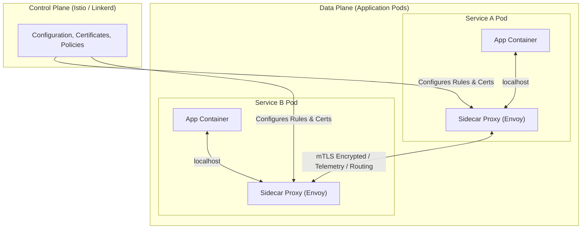
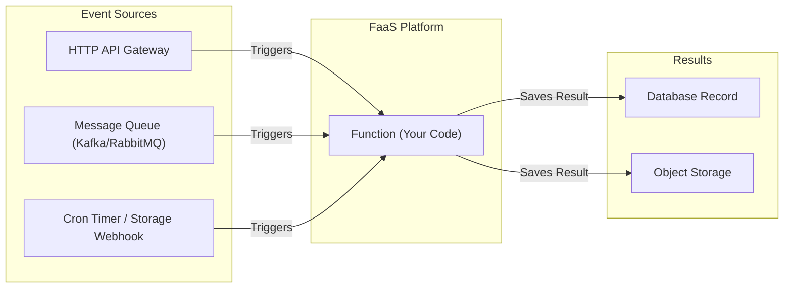
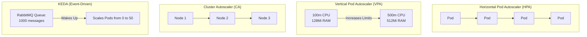
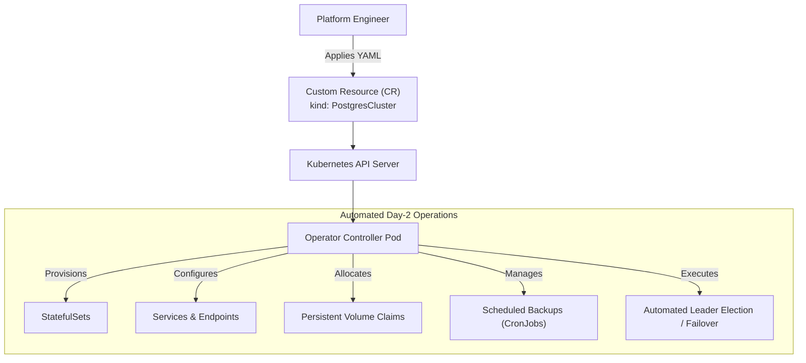
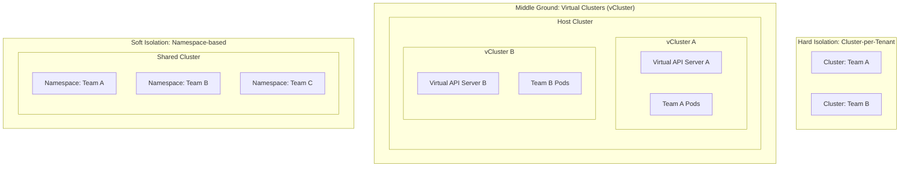

> **Complexity**: `[MEDIUM]` - Architecture concepts
>
> **Time to Complete**: 45-60 minutes
>
> **Prerequisites**: Module 3.2 (CNCF Ecosystem)

---

## What You'll Be Able to Do

After completing this comprehensive module, you will be able to:

1. **Design** a resilient microservice architecture by implementing service mesh patterns to handle network fallacies without burdening application code.
2. **Evaluate** the critical trade-offs between serverless event-driven architectures, traditional container deployments, and service mesh topologies.
3. **Implement** robust GitOps deployment workflows to ensure that the cluster state strictly mirrors the declared desired state in version control.
4. **Diagnose** performance and scaling bottlenecks by selecting the correct autoscaling mechanism (HPA, VPA, Cluster Autoscaler, or KEDA) for specific workload profiles.
5. **Compare** various multi-tenancy isolation models, from soft namespace boundaries to hard virtual cluster implementations, balancing security with resource efficiency.

---

## Why This Module Matters

In August 2012, Knight Capital Group deployed a new software update to their automated routing system. Due to a manual deployment error where obsolete code was left on one of their eight servers, a dormant function was inadvertently triggered. In just 45 minutes, their system executed millions of erroneous trades, resulting in a devastating $460 million loss and ultimately the demise of the company. While this incident predates modern cloud native architectures, it serves as a chilling reminder of the catastrophic consequences of manual deployments, inconsistent states, and the lack of automated, declarative infrastructure controls.

When you transition from running a few containers to managing a sprawling ecosystem of hundreds of microservices, the operational landscape fundamentally changes. Networks are inherently unreliable, traffic patterns are deeply unpredictable, and manual deployments become a massive liability. The patterns discussed in this module—Service Mesh, Serverless, GitOps, and Operators—are not merely theoretical concepts or buzzwords. They are battle-tested architectural paradigms forged in the fires of massive-scale production outages at companies like Google, Netflix, and Spotify.

Understanding these patterns is what separates a novice Kubernetes user from a seasoned Cloud Native architect. The Certified Kubernetes and Cloud Native Associate (KCNA) exam heavily emphasizes your ability to not only identify these patterns but to profoundly understand *why* they exist and *when* to apply them. Deploying a service mesh when you only have three microservices is a costly architectural blunder; conversely, failing to use GitOps in a heavily regulated financial environment is a massive compliance risk. This module equips you with the analytical framework to make these high-stakes architectural decisions correctly.

---

## 1. The Service Mesh Pattern

When transitioning from monolithic applications to microservices, the complexity of your system shifts from the application logic to the network. Suddenly, a single user request might require synchronous calls across a dozen distinct services. How do you handle network timeouts? How do you secure the traffic between services on a shared network? How do you trace a request as it hops from the frontend to the billing service to the inventory database?

Historically, developers imported massive language-specific libraries (like Netflix OSS for Java) into their application code to handle retries, circuit breaking, and telemetry. This approach failed in polyglot environments where teams wrote services in Go, Python, Rust, and Node.js. The Service Mesh pattern was born to push these network responsibilities out of the application code and down into the infrastructure layer.

### Architecture of a Service Mesh

A service mesh operates by injecting a "sidecar" proxy container (most commonly Envoy) into every single Pod in your cluster. Your application container never communicates directly with the outside world; it only talks to its local sidecar proxy over `localhost`. The proxy then handles the complex routing, encryption, and telemetry to reach the destination service's proxy.



> **Pause and predict**: A service mesh adds a sidecar proxy to every Pod. This means for 100 application Pods, you now have 200 containers running. What trade-off is being made, and when would the overhead be worth it? Think about latency, resource consumption, and the point at which operational consistency outweighs infrastructure cost.

### Core Capabilities of a Service Mesh

By centralizing network communication through the proxies, the Control Plane can enforce powerful policies globally without a single line of application code changing.

| Feature | Description |
|---------|-------------|
| **mTLS (Mutual TLS)** | Automatic, transparent encryption between services. The control plane automatically rotates certificates, ensuring zero-trust network security within the cluster. |
| **Traffic management** | Advanced routing rules allowing for canary releases (sending exactly 5% of traffic to v2 of a service) and A/B testing based on HTTP headers. |
| **Retries/Timeouts** | Automatic retry logic with exponential backoff and jitter to survive transient network blips without overwhelming struggling downstream services. |
| **Circuit breaking** | The ability to "fail fast" when a downstream service is struggling, returning an immediate error to prevent cascading resource exhaustion across the cluster. |
| **Observability** | Automatic generation of golden signal metrics (latency, traffic, errors, saturation), distributed tracing headers, and access logs for all network hops. |
| **Access control** | Fine-grained service-to-service authorization (e.g., "The frontend service is allowed to GET from the billing service, but not POST"). |

### The Service Mesh Landscape

The CNCF ecosystem offers several service mesh implementations, each optimizing for different architectural philosophies.

| Mesh | Key Characteristics |
|------|---------------------|
| **Istio** | The most feature-rich and widely adopted mesh. Uses Envoy proxies. Historically complex to manage, but highly powerful. Now introducing "Ambient Mesh" to reduce sidecar overhead. |
| **Linkerd** | Built specifically for Kubernetes, highly focused on being lightweight, ultra-fast, and simple to operate. A CNCF Graduated project that uses custom Rust-based micro-proxies. |
| **Cilium** | An advanced networking and security project leveraging eBPF (Extended Berkeley Packet Filter) in the Linux kernel to provide mesh capabilities often without requiring sidecar proxies at all. |

#### War Story: The Cascading Failure
A prominent e-commerce platform once experienced a massive outage during a flash sale. The inventory service slowed down due to database lock contention. The frontend service, lacking circuit breakers, kept waiting for responses, holding its own connections open. Soon, the frontend ran out of threads, causing the user-facing site to crash entirely. If they had a service mesh configured with circuit breaking, the proxy would have detected the inventory service latency and immediately returned a fallback response, keeping the frontend alive.

---

## 2. Serverless and Event-Driven Patterns

While containers and Kubernetes revolutionized how we package and run long-running services, not all workloads need to run 24/7. Background processing tasks, webhook handlers, and intermittent batch jobs often sit idle, wasting expensive compute resources. The Serverless pattern, specifically Function-as-a-Service (FaaS), shifts the paradigm from "running a server" to "executing code in response to an event."

In a cloud native context, Serverless does not mean "there are no servers." It means the developer is completely abstracted away from server provisioning, maintenance, and scaling logic. 



### Serverless Characteristics

The true power of Serverless lies in its economic model and its tight integration with event-driven architectures.

| Aspect | Description |
|--------|-------------|
| **No server management** | The underlying platform dynamically allocates compute resources. Developers never run `apt-get update` or manage Kubernetes nodes. |
| **Auto-scaling** | The system automatically scales out concurrent function instances as the event queue grows, and crucially, scales down to zero when there are no events. |
| **Event-driven** | Functions are completely dormant until an explicit event (a file upload, a database row insertion, a web request) triggers their execution. |
| **Pay-per-use** | Billing is calculated down to the millisecond of actual execution time and RAM consumed. Idle time costs exactly nothing. |
| **Stateless** | Functions cannot rely on local file systems or memory spanning across invocations. Any required state must be stored in an external database or cache. |
| **Short-lived** | Execution environments have strict timeouts (often 5 to 15 minutes max) forcing workloads to be chunked into smaller, idempotent operations. |

### Serverless on Kubernetes

Public cloud providers dominate the serverless landscape (AWS Lambda, Google Cloud Functions), but the CNCF ecosystem has brought these patterns directly into Kubernetes clusters:

- **Knative:** Originally developed by Google, Knative provides scale-to-zero capabilities, sophisticated HTTP routing, and a standard eventing model to trigger containers on Kubernetes.
- **OpenFaaS:** A highly popular framework for packaging code or existing binaries into serverless functions, easily deployable onto any Kubernetes cluster.

---

## 3. GitOps: Declarative Continuous Deployment

Traditional Continuous Integration/Continuous Deployment (CI/CD) pipelines operate on a "push" model. A developer pushes code to Git, a CI server (like Jenkins or GitHub Actions) builds the container image, authenticates with the Kubernetes API, and pushes the new deployment YAML into the cluster. This model is inherently flawed from a security and drift perspective. The CI server requires high-level cluster credentials, and if an operator manually edits a deployment via `kubectl`, the cluster state drifts from the Git repository, rendering the Git history completely inaccurate.

GitOps, a term coined by Weaveworks, flips this paradigm entirely. It mandates that a Git repository is the absolute, single source of truth for your infrastructure and application state.

```mermaid
graph LR
    subgraph Source_of_Truth ["Single Source of Truth"]
        Git["Git Repository<br/>(Contains Desired State YAML)"]
    end
    
    subgraph K8s_Cluster ["Kubernetes Cluster"]
        Agent["GitOps Agent<br/>(Argo CD / Flux)"]
        State["Cluster API<br/>(Actual State)"]
    end

    Agent -->|1. Continuously Pulls| Git
    Agent -->|2. Compares| State
    Agent -->|3. Reconciles (Applies changes)| State
```

### The Pull-Based Architecture

In a GitOps workflow, the deployment logic lives inside the cluster. An agent (like Argo CD or Flux) continuously monitors the target Git repository. When a commit changes the desired state (e.g., updating a container image tag from `v1.2` to `v1.3`), the agent detects the divergence between Git and the actual cluster state. It then automatically pulls the changes and reconciles the cluster to match the Git repository perfectly.

> **Stop and think**: In traditional CI/CD, the CI server pushes changes to the cluster. In GitOps, the cluster pulls from Git. Why is the pull-based model considered more secure? Think about what credentials each approach needs and where they are stored in the event of a CI server compromise.

### Core GitOps Principles

| Principle | Description |
|-----------|-------------|
| **Declarative** | The entire system configured declaratively (using YAML or JSON), allowing the infrastructure to be defined as code. |
| **Versioned** | The desired state is stored in a version control system (Git) providing immutable history and strong cryptographic guarantees of authorship. |
| **Automated** | Software agents automatically pull the declared state and ensure the live environment matches it continuously without human intervention. |
| **Audited** | The Git commit log becomes an indisputable, tamper-proof audit trail of every change ever made to the production environment, crucial for compliance. |

If a rogue administrator manually changes a replica count via `kubectl scale`, the GitOps agent immediately detects that the actual state no longer matches the desired state in Git, and it ruthlessly overwrites the manual change to restore harmony.

---

## 4. Autoscaling Patterns

Kubernetes provides sophisticated mechanisms to dynamically adjust resources based on demand, ensuring applications remain responsive under heavy load while minimizing costs during quiet periods. Understanding the interplay between these scalers is critical for cloud native mastery.



### The Four Dimensions of Scaling

1. **Horizontal Pod Autoscaler (HPA):** Adds or removes identical Pod replicas based on observed metrics like CPU utilization or custom application metrics. If CPU hits 80%, HPA spawns another Pod. It acts as the primary defense against traffic spikes.
   
2. **Vertical Pod Autoscaler (VPA):** Analyzes historical resource usage and adjusts the CPU and Memory requests/limits for a Pod. Crucially, VPA typically requires recreating the Pod to apply new sizing limits. It is best used for stateful workloads or monoliths that cannot easily be horizontally distributed.

3. **Cluster Autoscaler:** HPA and VPA only schedule Pods. If the underlying physical worker nodes run out of capacity, Pods remain stuck in a `Pending` state. The Cluster Autoscaler monitors the Kubernetes scheduler for pending Pods and automatically provisions new virtual machines from the cloud provider (AWS, GCP, Azure) to join the cluster. When nodes sit idle, it safely drains and terminates them to save money.

4. **KEDA (Kubernetes Event-Driven Autoscaler):** A CNCF Graduated project that bridges the gap between Kubernetes and serverless patterns. Standard HPA struggles with scaling down to absolute zero and reacting to external events (like messages in a database or queue). KEDA monitors external event sources and proactively scales workloads before CPU spikes even happen.

#### Runnable Code Example: Basic HPA
If you have a deployment named `web-frontend`, you can implement basic autoscaling imperatively to test it:
```bash
# Autoscale the frontend between 2 and 10 replicas, targeting 70% CPU utilization
kubectl autoscale deployment web-frontend --cpu-percent=70 --min=2 --max=10
```

---

## 5. The Operator Pattern

Kubernetes natively understands how to manage stateless applications seamlessly. If a web server Pod dies, a ReplicaSet simply creates a new one. However, stateful applications—like databases, message queues, and distributed caches—are vastly more complex. You cannot simply kill and restart a PostgreSQL primary node without coordinating replication, handling quorum, taking backups, and failing over connections.

The Operator pattern codifies human operational knowledge into software, allowing Kubernetes to manage complex stateful applications just like it manages stateless ones.



### Anatomy of an Operator

1. **Custom Resource Definition (CRD):** This extends the Kubernetes API, teaching it a completely new vocabulary. Instead of just knowing about Pods and Services, you teach it what a `PostgresCluster` or a `KafkaTopic` is.
2. **Custom Resource (CR):** The actual YAML instance created by the user based on the CRD schema. You declare: "I want a Postgres version 14 cluster with 3 nodes and 50GB of storage."
3. **Controller:** The custom software loop running as a Pod inside your cluster. It constantly watches the API for your Custom Resources and takes complex programmatic actions to ensure the real world matches your requested state, handling all the messy operational details a human Database Administrator would normally perform.

### Popular Operators
- **Prometheus Operator:** Radically simplifies deploying and configuring the Prometheus monitoring stack.
- **cert-manager:** Automatically provisions, validates, and rotates TLS certificates from Let's Encrypt for your ingresses.
- **Strimzi:** Automates the massively complex task of running Apache Kafka clusters on Kubernetes.
- **PostgreSQL Operators:** Projects like CrunchyData or Zalando automate complex database clustering, backups, and failovers.

---

## 6. Multi-Tenancy Patterns

As Kubernetes adoption matures within an organization, a critical architectural decision arises: Do we build one massive cluster for everyone, or give every team their own small cluster? This is the multi-tenancy dilemma.



### Comparing Isolation Models

**1. Namespace-Based (Soft Multi-Tenancy)**
Multiple teams share a single massive cluster. You segregate them by creating different Namespaces.
- *Isolation Methods:* RBAC restricts who can edit what. ResourceQuotas prevent Team A from consuming all the RAM. NetworkPolicies prevent Team A's pods from talking to Team B's databases. LimitRanges set default resource requests.
- *Pros:* Highly cost-effective. Easy to manage one central cluster.
- *Cons:* Weak isolation. A misconfiguration can lead to "noisy neighbor" problems or cross-namespace security breaches. Cluster-wide resources (like CRDs) must be shared.

**2. Cluster-per-Tenant (Hard Multi-Tenancy)**
Every team, or even every application, gets a dedicated Kubernetes cluster managed by a central platform team.
- *Pros:* Absolute isolation. Zero risk of noisy neighbors. Custom configurations per team.
- *Cons:* Extremely expensive due to control plane overhead. Difficult to maintain consistency across hundreds of clusters.

**3. Virtual Clusters (The Middle Ground)**
Tools like `vCluster` create isolated "virtual" Kubernetes clusters running *inside* a single physical cluster.
- Each virtual cluster has its own API server, etcd datastore, and controller manager, all running as Pods in a namespace on the host cluster.
- *Pros:* Tenants get admin access to their virtual cluster and can create cluster-wide resources (like CRDs) without affecting the host or other tenants. Far cheaper than physical clusters.

---

## Hands-On Exercise: Simulating Desired State Reversal

This exercise will simulate why GitOps (and declarative state management) is critical by demonstrating what happens when manual interventions clash with automated reconciliation loops. 

**Task 1: Deploy a declarative workload**
Create a deployment using a declarative YAML file. Save the following as `nginx-deploy.yaml` and apply it:
```yaml
apiVersion: apps/v1
kind: Deployment
metadata:
  name: demo-nginx
spec:
  replicas: 3
  selector:
    matchLabels:
      app: demo
  template:
    metadata:
      labels:
        app: demo
    spec:
      containers:
      - name: nginx
        image: nginx:1.24
```
```bash
kubectl apply -f nginx-deploy.yaml
```

**Task 2: Simulate manual "drift"**
Imagine a frantic operator logs into the cluster during an incident and manually scales the deployment down using imperative commands, bypassing the YAML source of truth.
```bash
kubectl scale deployment demo-nginx --replicas=1
kubectl get pods
```
*Note that only 1 pod is running.*

**Task 3: The GitOps Reversion**
In a real GitOps setup, an agent (Argo/Flux) would notice this drift instantly. We will simulate the GitOps agent running its scheduled sync cycle by simply re-applying our authoritative file.
```bash
kubectl apply -f nginx-deploy.yaml
kubectl get pods
```
*Notice how Kubernetes immediately spawns 2 new pods to restore the desired state of 3. The manual intervention was entirely overwritten by the declarative truth.*

**Success Checklist:**
- [ ] You applied the initial YAML file successfully.
- [ ] You manually scaled the deployment down, simulating drift.
- [ ] You re-applied the YAML, observing how the system converges back to the declared state.
- [ ] You understand why manual `kubectl` commands are an anti-pattern in a GitOps environment.

---

## Did You Know?

- **Sidecars are going away:** Service meshes like Cilium use eBPF deep in the Linux kernel to provide mesh capabilities without sidecar containers. Istio has also introduced an "ambient mesh" mode that removes the sidecar requirement.
- **GitOps coined by Weaveworks:** The term and practice were popularized in 2017 by Weaveworks, the original creators of the Flux CD project.
- **Operators have a maturity model:** The Operator Framework defines a maturity scale from basic install (Level 1) to full "auto-pilot" (Level 5), measuring how much human intervention is abstracted away.
- **KEDA is CNCF Graduated:** The Kubernetes Event-Driven Autoscaler project became an officially graduated CNCF project in August 2023, proving the massive industry demand for robust event-driven patterns.

---

## Common Mistakes

| Mistake | Why It Hurts | Correct Understanding |
|---------|--------------|----------------------|
| Service mesh for simple apps | Adds massive operational overhead and latency. | Only adopt a service mesh when the complexity of your microservices network communication explicitly demands it. |
| Confusing serverless and containers | Applying container paradigms to FaaS leads to massive bills. | Serverless is inherently event-triggered, scales to absolute zero, and charges by the millisecond. |
| Push-based CD as GitOps | Pushing from Jenkins is not GitOps; it's a security risk. | True GitOps requires software agents *inside* the cluster continuously pulling desired state from Git. |
| Operators for simple apps | Causes severe over-engineering. | Reserve Operators for managing complex, stateful applications (like databases) that require human-like intervention for backups/failover. |
| HPA and VPA on the same metric | They will fight each other, causing scaling thrashing. | Use different metrics, or rely on Multi-Dimensional Pod Autoscalers to handle scaling conflicts. |
| Treating Namespaces as secure boundaries | Namespaces do not isolate networks or resources by default. | You must explicitly apply NetworkPolicies and ResourceQuotas to create any actual isolation. |
| Ignoring scale-to-zero latency | When FaaS scales from zero, "cold starts" degrade UX heavily. | Keep minimum replicas running, or utilize pre-warming techniques for latency-sensitive applications. |
| Hardcoding sidecar resources | Sidecar proxies can silently consume more CPU than your actual app. | Carefully profile traffic and set precise Kubernetes resource requests and limits for your mesh proxies. |

---

## Quiz

1. **Your company has 30 microservices, and each team independently implements retry logic, timeouts, and circuit breakers in their application code. Bugs in one team's retry logic caused a cascading failure last month. How would a service mesh solve this problem, and what is the trade-off?**
   <details>
   <summary>Answer</summary>
   A service mesh moves retry logic, timeouts, circuit breakers, and mTLS out of application code and into the infrastructure layer (sidecar proxies like Envoy). Each team no longer needs to implement these patterns -- the mesh handles them transparently. This eliminates inconsistencies between teams and ensures uniform behavior. The trade-off is operational complexity (managing the mesh control plane), additional resource consumption (sidecar containers alongside every Pod), and added latency (traffic passes through the proxy). The overhead is justified when you have many services with complex communication patterns.
   </details>

2. **An engineer wants to deploy their application using GitOps with Argo CD. They commit a YAML change to Git, but the cluster does not update. A colleague suggests running `kubectl apply` directly to fix it. Why is this a bad idea in a GitOps workflow, and what should they do instead?**
   <details>
   <summary>Answer</summary>
   Direct `kubectl apply` violates the core GitOps principle: Git is the single source of truth. If you make changes directly to the cluster, Git and the cluster diverge. The next time Argo CD syncs, it will detect the drift and revert the manual change to match Git. The engineer should instead check why Argo CD is not syncing -- perhaps the Git webhook is not configured, the sync is paused, or there is a validation error in the YAML. The whole point of GitOps is that changes flow through Git, providing audit trails and the ability to revert via `git revert`.
   </details>

3. **A team manages PostgreSQL on Kubernetes by manually creating StatefulSets, Services, PVCs, ConfigMaps, and Secrets. When the primary database fails, a human must intervene to promote a replica. How would a Kubernetes Operator improve this, and what does "codifying operational knowledge" mean?**
   <details>
   <summary>Answer</summary>
   A PostgreSQL Operator (like Crunchy Data or Zalando's operator) uses a Custom Resource Definition to let you declare `kind: PostgresCluster` with desired replicas and version. The Operator's controller automatically creates all necessary resources (StatefulSet, Services, PVCs, Secrets) and -- critically -- handles failover automatically. When the primary fails, the Operator promotes a replica, updates the Service endpoint, and reconfigures replication without human intervention. "Codifying operational knowledge" means translating the steps a DBA would take during failover into automated controller logic that runs 24/7.
   </details>

4. **Your application processes uploaded images. Traffic is unpredictable -- sometimes 0 requests per hour, sometimes 10,000. Standard HPA has a minimum of 1 replica, so you are paying for an idle Pod most of the time. What CNCF project addresses this, and how does it differ from standard HPA?**
   <details>
   <summary>Answer</summary>
   KEDA (Kubernetes Event-Driven Autoscaler, CNCF Graduated) addresses this. Unlike standard HPA which scales based on Pod metrics like CPU and has a minimum of 1 replica, KEDA can scale to zero -- removing all Pods when there are no events (no images to process). When a new image is uploaded (triggering an event from a queue, HTTP request, or storage notification), KEDA creates Pods to handle the work. KEDA supports dozens of event sources beyond just CPU/memory. This eliminates the cost of idle Pods for bursty, event-driven workloads.
   </details>

5. **Your cluster hosts multiple teams, and you need to isolate them so Team A cannot see Team B's resources. You could create separate clusters per team or use namespaces within one cluster. What are the trade-offs of each approach, and what newer technology offers a middle ground?**
   <details>
   <summary>Answer</summary>
   Separate clusters provide the strongest isolation (completely independent control planes and etcd), but they are expensive and operationally complex (managing multiple clusters, distributing shared services). Namespace-based isolation is cheaper and simpler, but provides weaker isolation: it relies on RBAC, ResourceQuotas, and NetworkPolicies, and a misconfiguration could expose resources across namespaces. Virtual clusters (like vCluster) offer a middle ground: they create isolated "virtual" Kubernetes clusters inside a single physical cluster, each with its own virtual control plane, providing stronger isolation than namespaces but less overhead than separate clusters.
   </details>

6. **You have configured both a Horizontal Pod Autoscaler (HPA) and a Vertical Pod Autoscaler (VPA) to monitor CPU utilization for your backend service. Recently, you noticed erratic scaling behavior, where pods are constantly being terminated and respawned. What architectural rule have you violated?**
   <details>
   <summary>Answer</summary>
   You have violated the rule of not using HPA and VPA on the same resource metric. Because both controllers are reacting to the same CPU spikes independently, they enter a race condition. The HPA might scale out to 10 pods to lower average CPU, while simultaneously the VPA decides to terminate those pods to increase their individual CPU limits. To fix this, you must separate their concerns: for example, use HPA for custom application metrics (like queue length) while using VPA to manage baseline CPU/Memory constraints.
   </details>

7. **A security auditor reviews your CI/CD pipeline and flags your deployment process as a high-risk vulnerability. Your Jenkins server, which sits outside your secure VPC, has admin credentials to run `helm upgrade` against your production Kubernetes cluster API. How does adopting GitOps eliminate this specific attack vector?**
   <details>
   <summary>Answer</summary>
   GitOps eliminates this vulnerability by inverting the deployment flow from "push" to "pull". Instead of an external server possessing god-mode credentials to push changes into the cluster, the cluster itself uses an internal agent (like Argo CD) to pull changes from a Git repository. The CI server only needs permission to commit to Git, and the cluster's ingress firewall can remain completely locked down to incoming connections. If the external CI server is compromised, the attacker cannot access the cluster API directly.
   </details>

8. **A developer wants to test a major database schema migration but is worried about breaking the shared development cluster. They ask the platform team to provision a brand new, highly available EKS cluster just for them, which costs hundreds of dollars a month. What multi-tenancy solution provides the developer the isolation they need without the massive cost?**
   <details>
   <summary>Answer</summary>
   The platform team should provision a Virtual Cluster (using tools like vCluster). This provides the developer with their own dedicated, ephemeral Kubernetes API server and control plane running as lightweight pods within the existing shared EKS cluster. The developer gains full cluster-admin rights within their virtual sandbox, allowing them to test CRDs and complex stateful deployments safely. Because it runs on the shared physical nodes, the infrastructure cost is a fraction of provisioning a completely separate physical EKS cluster.
   </details>

---

## Summary

**Service Mesh**:
- Handles service-to-service communication by abstracting it from application code.
- Features include mTLS, traffic management, circuit breaking, and observability.
- Architecture relies on a Control Plane configuring a Data Plane (usually Envoy sidecars).
- Examples: Istio, Linkerd, Cilium.

**Serverless & Event-Driven**:
- Abstract infrastructure entirely to run code on demand.
- True event-driven execution with the ability to scale down to absolute zero.
- Pay strictly per execution millisecond.
- Kubernetes-native tools: Knative, OpenFaaS, KEDA.

**GitOps**:
- Git acts as the immutable single source of truth for desired state.
- In-cluster agents (Argo CD, Flux) pull and reconcile state continuously.
- Highly auditable, secure, and easily reversible.

**Operators**:
- Extend the native Kubernetes API using Custom Resource Definitions (CRDs).
- Automate complex day-2 management (backups, failovers) for stateful applications.
- Codify deep operational and domain knowledge into software controllers.

---

## Next Module

[Module 3.4: Observability Fundamentals](../module-3.4-observability-fundamentals/) - Now that you have designed complex, auto-scaling, service-meshed architectures, how do you figure out what is broken when things go wrong? Dive into the three pillars of observability: metrics, logs, and distributed traces.