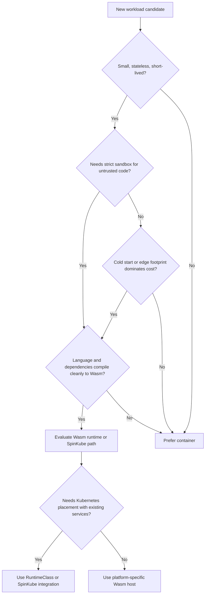

# Module 3.9: WebAssembly and Cloud Native

> **Complexity**: `[MEDIUM]` - Conceptual awareness with operator-level tradeoff analysis
>
> **Time to Complete**: 35-40 minutes
>
> **Prerequisites**: Module 3.1 (Cloud Native Principles), Module 3.3 (Cloud Native Patterns), and basic familiarity with Kubernetes Pods and container runtimes

## Learning Outcomes

After completing this module, you will be able to make practical runtime decisions instead of treating WebAssembly as either hype or replacement technology:

1. **Compare** WebAssembly workloads with container workloads across startup latency, artifact size, portability, and isolation boundaries.
2. **Design** a Kubernetes placement model that uses RuntimeClass to run container Pods and Wasm Pods side by side on Kubernetes 1.35+ clusters.
3. **Evaluate** whether serverless functions, edge services, plugin systems, and legacy services should use Wasm, containers, or a hybrid architecture.
4. **Diagnose** common Wasm adoption failures involving WASI permissions, immature language tooling, runtime selection, and unrealistic migration plans.
5. **Implement** a lightweight operator checklist for inspecting RuntimeClass availability and validating whether a workload is a credible Wasm candidate.

## Why This Module Matters

At a large retail platform during a holiday checkout surge, a small customization feature became the bottleneck that no one expected. Merchants wanted to run tiny snippets of custom logic during checkout, but the platform team could not safely execute untrusted customer code inside the main payment process, and spinning up isolated containers for each decision added too much latency. A few extra seconds at checkout was not an academic concern; the business impact could mean abandoned carts, lost revenue, and a support incident that looked like an application problem even though the real issue was runtime overhead.

That kind of incident explains why WebAssembly matters to cloud native engineers. Wasm gives operators another isolation tool, one that starts quickly, ships as a small portable artifact, and denies host access unless the runtime grants explicit capabilities. It does not make containers obsolete, but it changes the design conversation for edge functions, multi-tenant plugins, request-time policy checks, and scale-to-zero services where a traditional container is often too heavy for the job.

KCNA does not expect you to become a Wasm runtime maintainer. It expects you to recognize where Wasm fits in the cloud native landscape, explain how WASI turns browser-born bytecode into a server-side runtime target, and reason about Kubernetes integration through containerd shims and RuntimeClass. The practical skill is architectural judgment: when a team says "let's move this to Wasm," you should be able to separate a strong use case from a fashionable rewrite.

> *"If WASM+WASI existed in 2008, we wouldn't have needed to create Docker."*
> - **Solomon Hykes**, co-founder of Docker (2019)

That quote shook the container world because it came from someone who understood exactly which pain Docker solved. Read it carefully, though. It does not say every container should become a Wasm module; it says Wasm plus a system interface attacks some of the same packaging, portability, and isolation problems from a different direction.

## WebAssembly, WASI, and the Runtime Boundary

WebAssembly, usually shortened to Wasm, is a portable binary instruction format designed to run code in a safe sandbox. Its first mainstream home was the browser, where it let languages such as C, C++, and Rust run near-native workloads beside JavaScript without giving downloaded code direct access to the user's machine. That origin matters because the security model was not bolted on later; Wasm was designed from the beginning for hostile environments where code might be fast, useful, and untrusted at the same time.

```
┌─────────────────────────────────────────────────────────────┐
│              WEBASSEMBLY (WASM)                              │
├─────────────────────────────────────────────────────────────┤
│                                                             │
│  Portable, compact BYTECODE format                         │
│                                                             │
│  Originally: Run near-native code in web browsers          │
│  Now:        Run anywhere — servers, edge, IoT, cloud      │
│                                                             │
│  Key Properties:                                            │
│  ─────────────────────────────────────────────────────────  │
│                                                             │
│  PORTABLE    Compile once, run on any Wasm runtime          │
│              (like Java bytecode, but lighter)              │
│                                                             │
│  FAST        Near-native execution speed                    │
│              Millisecond cold starts (not seconds)          │
│                                                             │
│  SECURE      Sandboxed by default — no file/network         │
│              access unless explicitly granted               │
│                                                             │
│  COMPACT     Binaries measured in KB, not MB or GB          │
│                                                             │
│  POLYGLOT    Compile from Rust, Go, C/C++, Python,          │
│              JavaScript, and more                           │
│                                                             │
└─────────────────────────────────────────────────────────────┘
```

The simplest analogy is a very strict hotel room key. A container normally enters the hotel with a full luggage cart, a Linux userspace, shared-kernel assumptions, and many familiar tools. A Wasm module enters with one small suitcase and a key that opens only the doors the host explicitly assigned. That makes the default experience more restrictive, but it also makes the blast radius much easier to reason about when the workload is small and the permission model is clear.

The missing piece for server-side Wasm is system access. Browser Wasm can call browser-provided APIs, but a service running on a node often needs a clock, environment variables, files, outbound network access, or standard streams. WASI, the WebAssembly System Interface, provides a standardized way for a Wasm runtime to expose selected host capabilities without turning the module into a normal process with full operating-system access.

Think of WASI as "POSIX for Wasm," but do not push the analogy too far. Traditional POSIX APIs assume a process can ask the operating system for many things and rely on user IDs, file permissions, seccomp, namespaces, and other layers to contain the result. WASI starts from a different posture: the host grants handles and capabilities up front, and code that was not given a directory, socket, or environment variable cannot simply discover one by trying harder.

```
┌─────────────────────────────────────────────────────────────┐
│  Your Code (Rust, Go, etc.)                                 │
│       │                                                     │
│       ▼  compile                                            │
│  Wasm Binary (.wasm)                                        │
│       │                                                     │
│       ▼  runs on                                            │
│  Wasm Runtime (WasmEdge, Wasmtime, etc.)                    │
│       │                                                     │
│       ▼  talks to OS via                                    │
│  WASI (file access, network, env vars)                      │
│       │                                                     │
│       ▼                                                     │
│  Host Operating System                                      │
└─────────────────────────────────────────────────────────────┘
```

This boundary is why Wasm is attractive for plugin systems and request-time functions. If a commerce platform lets thousands of merchants run discount logic during checkout, the platform wants fast execution, but it also wants to prevent plugins from reading host files, opening arbitrary network sockets, or holding state in surprising ways. A Wasm module can be loaded, given only the input and capabilities it needs, executed, and discarded without the cost profile of a full container startup.

The tradeoff is that strict boundaries make some ordinary application behavior difficult. Code that expects to fork processes, shell out to operating-system tools, inspect `/proc`, depend on glibc quirks, or use a language runtime that assumes a full filesystem may compile poorly or fail at runtime. When a team says "Wasm is portable," ask what their code actually touches, because portability belongs to the module plus its host interface, not to a vague hope that every operating-system behavior will be emulated.

Pause and predict: if a Wasm module has no WASI permission to read a configuration directory, should the failure look like a Kubernetes scheduling problem, a network policy problem, or an application runtime problem? The strongest answer is usually application runtime first, because the Pod may be healthy, the node may be ready, and the network may be fine while the Wasm runtime correctly denies a capability the module expected.

For KCNA, keep three mental layers separate. WebAssembly is the portable bytecode format. WASI is the capability-oriented system interface that lets non-browser Wasm interact with selected host resources. A runtime such as Wasmtime or WasmEdge loads the bytecode, enforces the sandbox, and provides the specific WASI capabilities configured by the operator or framework.

## Containers and Wasm Solve Different Runtime Problems

Containers became the default cloud native packaging unit because they solve a broad operational problem: take an application plus its user-space dependencies, ship it as an image, and run it under a standard runtime interface. That generality is their strength. A container can hold a JVM, a Python interpreter, native libraries, shell utilities, certificate bundles, and debugging tools, then rely on Linux namespaces and cgroups to make it manageable on a shared host.

Wasm solves a narrower problem with a different cost profile. Instead of packaging an operating-system-like environment, it packages compiled bytecode intended for a Wasm runtime. When the workload is a small function, an extension point, or a short-lived request handler, the smaller artifact and faster initialization can matter more than the convenience of a full Linux userspace. The decision is less "new runtime beats old runtime" and more "how much environment does this workload really need?"

| Aspect | Containers (OCI) | WebAssembly |
|--------|-------------------|-------------|
| **Startup time** | Seconds | Milliseconds |
| **Binary size** | MBs to GBs | KBs to low MBs |
| **Security model** | Shares host kernel, needs isolation layers | Sandboxed by default, capability-based |
| **Portability** | Runs on same OS/arch (or multi-arch builds) | True "compile once, run anywhere" |
| **Ecosystem maturity** | Very mature — huge library of images | Early stage — growing fast |
| **Language support** | Any language (full OS in container) | Growing but not all languages supported well |
| **System access** | Full (unless restricted) | Explicitly granted via WASI |
| **Use cases** | General-purpose applications | Functions, edge, plugins, lightweight services |
| **Orchestration** | Kubernetes, Docker Swarm | Emerging (SpinKube, runwasi) |

The startup-time comparison is easy to memorize but easy to misuse. A container that starts in a few seconds may be perfectly acceptable for a long-running API server, a worker pool, or a database maintenance job. The same delay can be painful for a scale-to-zero function that wakes up on a customer request, runs for a few milliseconds, and then disappears. Runtime overhead must be judged relative to request latency, workload duration, and how often the platform has to create fresh instances.

```
┌─────────────────────────────────────────────────────────────┐
│              STARTUP TIME COMPARISON                         │
├─────────────────────────────────────────────────────────────┤
│                                                             │
│  Container:  ████████████████████████████████  ~1-5 seconds │
│  Wasm:       ██                                ~1-5 ms     │
│                                                             │
│  IMAGE SIZE COMPARISON                                      │
│  ─────────────────────────────────────────────────────────  │
│  Container:  ████████████████████████████████  50-500 MB    │
│  Wasm:       █                                 0.1-5 MB     │
│                                                             │
│  This matters for:                                          │
│  • Serverless (cold start penalty)                         │
│  • Edge computing (limited storage/bandwidth)              │
│  • Scale-to-zero (restart cost must be low)                │
│                                                             │
└─────────────────────────────────────────────────────────────┘
```

Security comparisons need the same care. Containers can be hardened with user namespaces, seccomp, AppArmor, SELinux, read-only filesystems, capabilities, admission policy, image scanning, and runtime monitoring. Wasm begins from a smaller default surface because a module has no filesystem or network access unless the host grants it, but that does not remove the need to secure the runtime, validate supply chains, limit resource use, and observe behavior in production.

The artifact-size difference is most visible at the edge. If you deploy to a handful of large cloud nodes, pulling a 200 MB image may be tolerable because registries, caching, and node bandwidth hide the cost. If you deploy to small devices, remote points of presence, or intermittent links, the difference between a compact Wasm artifact and a traditional image can determine whether updates roll out in seconds or clog the network during an incident.

Portability is also more nuanced than the slogan. A `.wasm` file is architecture-neutral in a way a Linux image is not, which helps when x86 servers, ARM boards, and emerging edge hardware all need to run the same logic. However, the module still depends on the runtime supporting the WASI features and component interfaces it uses. In practice, you should test against the runtimes you operate rather than assuming every Wasm host implements every emerging feature identically.

> **Key insight for KCNA**: Wasm does not replace containers. They are complementary. Use containers for complex, full-featured applications. Use Wasm where startup speed, size, and sandboxing matter most.

> **Exercise: Classify the Workload**
>
> Review the following 5 scenarios. Would you choose **Containers** or **WebAssembly** for each?
>
> 1. A massive legacy Java Spring Boot monolith connected to an Oracle database.
> 2. A lightweight image-resizing function that executes thousands of times per second and scales to zero when idle.
> 3. A multi-tenant SaaS platform where untrusted customer-provided code snippets need to run safely without accessing the host network.
> 4. A stateful PostgreSQL database requiring heavy disk I/O and specific Linux kernel tuning.
> 5. A tiny data-parsing microservice deployed to a Raspberry Pi on a constrained edge network with limited bandwidth.
>
> <details>
> <summary>Reveal Answers & Reasoning</summary>
>
> 1. **Containers**: Complex, legacy, heavy applications with deep OS dependencies and specific library requirements are best suited for traditional containers.
> 2. **WebAssembly**: The millisecond cold-start times and tiny footprint make Wasm ideal for high-volume, scale-to-zero functions where container startup latency would be unacceptable.
> 3. **WebAssembly**: Wasm's default-deny capability-based sandboxing provides excellent, fast isolation for untrusted third-party code execution.
> 4. **Containers**: Databases require deep OS integration, mature storage drivers, and heavy I/O performance that the Wasm and WASI ecosystems do not yet fully support.
> 5. **WebAssembly**: The extremely small binary size and architecture-neutral nature of Wasm make it perfect for constrained edge devices where bandwidth and storage are at a premium.
> </details>

That exercise captures the main architectural split, but real systems often mix both approaches. A checkout platform might run its core payment service in containers because the JVM, database drivers, observability agents, and compliance controls are already mature there. The same platform might run merchant discount logic as Wasm because each plugin is small, stateless, and untrusted. Hybrid architecture is not a compromise; it is usually the cleanest mapping between workload shape and runtime capability.

Before running this through your own architecture lens, ask what you would measure first: cold-start latency, artifact transfer time, memory per instance, sandbox escape risk, debugging effort, or developer build friction. The best answer depends on the failure mode you are trying to avoid, because Wasm's advantages are strongest when one of those measurements dominates the service's operating cost.

## Kubernetes Integration: RuntimeClass, containerd, and runwasi

Kubernetes does not schedule "containers" in the casual Docker sense; it schedules Pods and asks a node-level runtime stack to make the sandbox and workload real. The kubelet talks through the Container Runtime Interface, and containerd delegates actual workload execution to lower-level components. That layered architecture is the reason Wasm can fit into Kubernetes without inventing an entirely separate scheduler, API server, or cluster control plane.

```
┌─────────────────────────────────────────────────────────────┐
│              WASM ON KUBERNETES                              │
├─────────────────────────────────────────────────────────────┤
│                                                             │
│  How containers run on K8s:                                 │
│  ─────────────────────────────────────────────────────────  │
│  kubelet → containerd → runc → Linux container             │
│                                                             │
│  How Wasm runs on K8s:                                      │
│  ─────────────────────────────────────────────────────────  │
│  kubelet → containerd → runwasi → Wasm runtime             │
│                                                             │
│  Same kubelet, same containerd, different shim!            │
│                                                             │
│  Key Projects:                                              │
│  ─────────────────────────────────────────────────────────  │
│                                                             │
│  runwasi     containerd shim that runs Wasm instead of     │
│              Linux containers. Drop-in replacement for runc │
│                                                             │
│  SpinKube    Run Spin (Wasm) apps on Kubernetes using       │
│              custom resources. Manages Wasm apps like K8s  │
│              manages containers                             │
│                                                             │
│  Both use RuntimeClass to tell K8s "this Pod runs Wasm"    │
│                                                             │
└─────────────────────────────────────────────────────────────┘
```

RuntimeClass is the Kubernetes API object that lets a Pod request a non-default runtime handler. In a standard Linux-container cluster, most Pods omit `runtimeClassName` and use the node's default handler. In a Wasm-enabled cluster, the operator installs a handler such as a runwasi shim backed by Wasmtime or WasmEdge, creates a RuntimeClass object, and allows selected Pods to opt into that handler by name.

```
┌──────────────────────────────────────────┐
│           Kubernetes Cluster              │
│                                          │
│  ┌──────────────┐  ┌──────────────┐      │
│  │ Container Pod │  │   Wasm Pod   │      │
│  │ runtimeClass: │  │ runtimeClass:│      │
│  │   (default)   │  │   wasmtime   │      │
│  │               │  │              │      │
│  │  containerd   │  │  containerd  │      │
│  │  → runc       │  │  → runwasi   │      │
│  │  → Linux      │  │  → Wasmtime  │      │
│  └──────────────┘  └──────────────┘      │
│                                          │
└──────────────────────────────────────────┘
```

This is an important KCNA pattern because it shows cloud native extension through stable interfaces. Kubernetes 1.35+ does not need to understand Wasm bytecode in the scheduler, and the API server does not need a special Wasm object for every simple case. The Pod still has a spec, a Service can still target it, labels still select it, and admission control can still enforce policy, but the node's runtime handler changes what actually executes.

For command examples in this module, use the standard KubeDojo shortcut by defining `alias k=kubectl` once in your shell. The alias is just a typing convenience; every command still uses the Kubernetes API and works the same way as the full `kubectl` command.

```bash
alias k=kubectl
k get runtimeclass
k describe runtimeclass wasmtime
k get pods -A -o wide
```

A minimal RuntimeClass object is small because it names a handler that must already be configured on the nodes. The YAML does not install Wasmtime, WasmEdge, or runwasi by itself; it only gives Kubernetes a scheduling-time name that maps to runtime configuration below the kubelet. That distinction prevents a common operator mistake: creating the API object and assuming the node suddenly knows how to run Wasm.

```yaml
apiVersion: node.k8s.io/v1
kind: RuntimeClass
metadata:
  name: wasmtime
handler: wasmtime
```

A Pod then opts into that runtime by setting `runtimeClassName`. In real clusters, the image reference and annotations depend on the Wasm runtime and packaging approach, because some platforms wrap Wasm artifacts in OCI images while others use a framework-specific abstraction. The concept to remember is the selection path: Pod asks for RuntimeClass, RuntimeClass points at a handler, and the node runtime stack must have that handler installed and healthy.

```yaml
apiVersion: v1
kind: Pod
metadata:
  name: tax-calculator-wasm
  labels:
    app: tax-calculator
spec:
  runtimeClassName: wasmtime
  containers:
    - name: tax-calculator
      image: ghcr.io/example/tax-calculator-wasm:v1
      command: ["/tax-calculator.wasm"]
```

The operational checks are familiar even when the runtime is new. You still ask whether the Pod was scheduled, whether the node supports the requested runtime handler, whether events mention sandbox creation failures, and whether logs show a module-level trap or permission error. What changes is the troubleshooting vocabulary: a denied filesystem capability or missing WASI feature is not the same as an image pull failure, even if both show up while a Pod is trying to start.

```bash
k describe pod tax-calculator-wasm
k get events --field-selector involvedObject.name=tax-calculator-wasm
k logs tax-calculator-wasm
k get node -o wide
```

> **Exercise: Design the RuntimeClass Architecture**
>
> Imagine you are architecting an e-commerce application on Kubernetes. You have three components:
> 1. `payment-processor`: A complex Java application managing core database transactions.
> 2. `tax-calculator`: A lightweight Rust function that calculates local taxes instantly based on a zip code.
> 3. `recommendation-engine`: A Python service utilizing a massive, specific GPU-bound machine learning library.
>
> Sketch out which Pods would use the default container runtime and which would use a Wasm RuntimeClass.
>
> <details>
> <summary>Reveal Architecture</summary>
>
> - **`payment-processor`**: Default container runtime. Needs the mature Java ecosystem, standard JVM profiling tools, and full OS networking capabilities.
> - **`tax-calculator`**: Wasm RuntimeClass (e.g., `runtimeClassName: wasmtime`). Perfect for Wasm: it is a fast, stateless, isolated function written in Rust that benefits from millisecond scaling during checkout surges.
> - **`recommendation-engine`**: Default container runtime. Needs direct hardware access (GPU) and complex Python machine learning libraries, which are currently difficult to compile and run efficiently within a restricted Wasm sandbox.
> </details>

The runtime architecture also affects platform ownership. Application teams should not have to know how containerd shims are installed, but they do need a documented contract for which RuntimeClass names exist, which languages and WASI features are supported, and which observability signals are available. Platform teams, in turn, should treat Wasm runtime handlers as part of the node baseline, with upgrade, rollback, security, and capacity plans just like container runtimes.

> **Stop and think**: You just learned that Kubernetes uses `containerd` shims and `RuntimeClass` to run Wasm. What does this architectural decision tell you about how Kubernetes handles extensibility, and what is the practical impact for cluster operators?
>
> <details>
> <summary>Reveal Analysis</summary>
>
> This demonstrates that Kubernetes was designed with **strong abstraction boundaries**. Because the `kubelet` talks to a standardized interface (CRI - Container Runtime Interface), it doesn't actually care if the underlying workload is a Linux namespace, a Windows container, a VM (like Kata Containers), or a Wasm module. The practical impact is massive: operators do not need to build, maintain, and secure a separate "Wasm cluster." They can run Wasm side-by-side with containers on the exact same nodes, leveraging the exact same Kubernetes APIs (Deployments, Services, Ingress) they already know.
> </details>

That conclusion should make you both confident and cautious. Confident, because Kubernetes can absorb new runtime types through existing extension points. Cautious, because the abstraction does not erase node-level reality; every worker that might receive a Wasm Pod must have the correct handler, runtime, security policy, and operational support, or the Pod's clean YAML will still fail when kubelet asks the runtime to create the sandbox.

## Runtimes, Frameworks, Adoption, and the Component Model

A Wasm runtime executes `.wasm` binaries in roughly the same way that a container runtime stack executes container workloads, but the comparison is conceptual rather than one-to-one. Container runtimes prepare namespaces, cgroups, mounts, and processes. Wasm runtimes load bytecode, validate it, compile or interpret it, enforce sandbox boundaries, and provide host functions such as WASI capabilities. Picking a runtime is therefore a platform decision, not just a developer preference.

| Runtime | Key Characteristics |
|---------|---------------------|
| **Wasmtime** | Reference implementation by Bytecode Alliance; production-grade, standards-focused |
| **WasmEdge** | CNCF Sandbox project; optimized for edge and cloud native; supports networking and AI extensions |
| **Spin** | Developer framework by Fermyon; build and run serverless Wasm apps easily |
| **wasmCloud** | CNCF Sandbox project; distributed platform for building Wasm applications with a component model |

Wasmtime is often associated with standards alignment and the Bytecode Alliance ecosystem. WasmEdge has strong cloud native and edge positioning and is a CNCF Sandbox project, which matters for organizations that prefer CNCF-governed infrastructure components. Spin focuses on developer ergonomics for serverless Wasm applications, while wasmCloud takes a distributed application approach with providers and a component-oriented model. KCNA does not require internal runtime mechanics, but it does expect you to know that the ecosystem has multiple layers.

The adoption stories are useful because they show where Wasm is already practical. Shopify rebuilt parts of its application extension platform around WebAssembly so third-party code could run safely and quickly during commerce workflows. Fastly Compute uses Wasm for edge computing where startup latency and per-request isolation matter. Cloudflare Workers supports Wasm modules alongside its isolate-based platform, letting developers bring performance-sensitive logic closer to users without shipping traditional container images to every location.

Those stories also show the boundary of the success pattern. The workloads are generally small, event-driven, latency-sensitive, and carefully constrained. They are not random enterprise monoliths lifted into a different runtime because a technology radar said Wasm was interesting. When you see impressive microsecond or millisecond figures, connect them to the workload shape that makes those figures relevant: short execution, high fan-out, strong isolation needs, and repeated cold starts.

Real migrations still encounter tooling pain. Rust and C-family workloads often have a smoother path because they compile naturally to Wasm targets. Go can work well through TinyGo for smaller programs, while standard Go may produce larger artifacts depending on runtime needs. Python and JavaScript can run in Wasm contexts, but sometimes by embedding interpreters, which may weaken the size and startup advantages that made Wasm attractive in the first place.

Debugging is another operational gap. A Linux container gives teams familiar escape hatches such as shell access, process inspection, package tools, and mature profiling agents, even if production policy limits their use. A Wasm module may fail with a memory trap, a missing import, or a denied capability that requires runtime-specific tooling to interpret. That does not make Wasm unfit for production, but it means teams need new runbooks instead of pretending existing container debug habits transfer automatically.

Networking and I/O are improving, but they are still design constraints rather than invisible details. A module that handles an HTTP request through a framework may be straightforward, while a service that expects advanced socket operations, filesystem watchers, native TLS libraries, or heavy disk I/O may run into gaps. WASI is a standards effort, not a magic compatibility layer for every Linux system call that legacy applications have accumulated over a decade.

> **Migration Reality Check**
>
> While the metrics above are impressive, adopting Wasm today is not as simple as running `docker build`. Teams migrating to Wasm often encounter severe tooling pain points:
> - **Language Support**: Rust, C++, and Zig work perfectly. Go's TinyGo compiler is excellent, but standard Go produces bloated Wasm binaries. Python and JavaScript run by embedding their entire interpreters inside Wasm, which negates the size benefits.
> - **Debugging**: When a container crashes, you can `kubectl exec` into it and run `top` or `cat /var/log/syslog`. When a Wasm module crashes, you often get a cryptic memory trap error. The debugging ecosystem is still in its infancy.
> - **Networking**: WASI networking is still evolving. If your application relies on complex socket manipulation or specific HTTP client libraries, compiling to Wasm often fails due to missing system interfaces.

The Component Model is the ecosystem's answer to another problem: how to compose Wasm modules written in different languages without making every boundary a custom ABI negotiation. In normal distributed systems, teams often compose at the process, container, or service level. The Component Model aims for composition at the module level, where a Rust component, Go component, or JavaScript component can expose typed interfaces and be linked by a Wasm-aware toolchain.

```
┌─────────────────────────────────────────────────────────────┐
│  Rust component ──┐                                         │
│                   ├──→ Composed application                 │
│  Go component ────┤    (linked at the Wasm level,          │
│                   │     not at the OS/container level)      │
│  JS component ────┘                                         │
└─────────────────────────────────────────────────────────────┘
```

This is still early, but it represents a fundamentally different approach to building distributed systems - composing at the module level rather than the container level. If containers made it easier to package independently deployable processes, the Component Model may make it easier to package independently authored capabilities that can be assembled inside a smaller runtime boundary. That is promising, but it is also a reason to watch standards maturity before betting a core platform on experimental composition assumptions.

The component idea also changes how teams think about ownership. In a container-first service, the deployment unit often bundles business logic, runtime, libraries, configuration readers, and network clients into one image. In a component-oriented Wasm design, a platform may provide common capabilities and let teams contribute smaller language-specific pieces that implement typed interfaces. That can reduce duplication and make extension safer, but it also means interface governance becomes more important than image governance.

Which approach would you choose here and why: a Rust tax calculation function called thousands of times per minute at the edge, or a Python recommendation service that needs GPU libraries and large model files? The tax function has the stronger Wasm profile because it is compact, deterministic, stateless, and latency-sensitive. The recommendation service has the stronger container profile because hardware access, large dependencies, and mature runtime tooling dominate its operational needs.

## When to Use Wasm

Wasm is a good fit when the workload is small, frequently started, and safer when host access is explicitly constrained. Serverless functions are the most obvious example because cold-start latency directly affects user experience, and a function that runs briefly should not pay seconds of runtime setup before doing milliseconds of useful work. Edge computing is another strong case because small artifacts and architecture-neutral distribution reduce the cost of pushing logic to many locations.

| Use Case | Why Wasm Excels |
|----------|-----------------|
| **Serverless functions** | Millisecond cold starts make scale-to-zero practical |
| **Edge computing** | Tiny binaries, low resource requirements, runs on constrained devices |
| **Plugin systems** | Safe sandboxing — plugins cannot access host unless permitted |
| **Short-lived request handlers** | No startup penalty, minimal overhead |
| **Multi-tenant isolation** | Each Wasm module is sandboxed without needing full container isolation |

Plugin systems are especially compelling because they combine security and product flexibility. A SaaS platform may want customers to customize policy, validation, transformation, or pricing logic without deploying a full customer-owned container into the provider's cluster. Wasm can create a narrow execution lane where the host passes input, grants only necessary capabilities, enforces CPU and memory limits, and treats plugin failure as an isolated event rather than a platform compromise.

Multi-tenant isolation is not just a security checkbox. It changes operational economics because small isolated modules can be created and destroyed quickly, allowing a platform to handle many tenants without allocating one warm container per tenant. That density is useful only when the code is constrained, so a strong Wasm design usually includes simple inputs, clear outputs, minimal side effects, and a host-owned control plane that decides what capabilities the module receives.

Wasm is not yet the right default for complex applications. A monolith with deep framework assumptions, runtime agents, filesystem conventions, native extensions, and mature debugging processes is usually better in a container. A database is even more clearly a container or VM workload because storage, I/O scheduling, kernel behavior, observability, and operational tooling are central to correctness. The question is not whether Wasm can theoretically run more things over time; the question is whether today's runtime gives your team the reliability surface it needs.

| Use Case | Why Containers Are Better |
|----------|--------------------------|
| **Complex applications** | Full OS libraries, mature debugging tools, broad language support |
| **Database servers** | Need direct hardware access, complex system calls |
| **Apps needing mature ecosystem** | Container images exist for almost everything; Wasm ecosystem is still growing |
| **Heavy I/O workloads** | WASI I/O is still maturing compared to native Linux I/O |
| **Legacy applications** | Recompiling to Wasm is non-trivial for large codebases |

The strongest adoption strategy is usually selective. Start with a candidate function whose behavior is easy to specify, whose dependencies are small, whose latency matters, and whose security posture improves when capabilities are denied by default. Measure cold start, memory, throughput, artifact size, and debugging effort before declaring success. A proof of concept that wins on startup but loses weeks of developer productivity may still be the wrong platform move.

A useful pilot charter names the business problem in plain language. Instead of saying "prove Wasm is faster," say "reduce checkout extension cold-start latency while preserving tenant isolation," or "ship the same request filter to ARM and x86 edge nodes without separate image builds." That wording makes success measurable and protects the team from optimizing a benchmark that customers never experience. It also makes it easier to stop the pilot if the runtime benefit is real but the operational cost is too high.

## Patterns & Anti-Patterns

Wasm works best as a targeted runtime pattern, not as a branding exercise. The most reliable pattern is the **fast isolated function**: a compact module handles one request or decision, receives explicit input from the host, and returns a result without owning durable state. This pattern scales well because the platform can create many instances cheaply, apply strict limits, and treat each execution as disposable.

The second useful pattern is the **untrusted extension boundary**. In this model, the host application remains in a container or traditional service, but tenant-authored or partner-authored logic runs as Wasm. The host controls inputs, capabilities, versioning, and timeout behavior, while the module provides customization. This pattern works because Wasm's default-deny sandbox aligns with the trust problem instead of requiring a full container security stack for every tiny extension.

The third pattern is the **edge-distributed artifact**. A small Wasm module can be shipped to many architectures and locations with less concern for image size and platform-specific builds. This is useful for request filtering, content transformation, lightweight inference, cryptographic helpers, and protocol adapters near users. Scaling considerations still matter, but the runtime's small footprint makes global placement less expensive than distributing large images everywhere.

The most common anti-pattern is the **rewrite-the-monolith plan**. Teams see impressive Wasm numbers, then propose moving a complex Java, Python, or Node.js service into Wasm without checking system calls, language runtime support, observability, or operational maturity. The better alternative is to extract a narrow function with measurable latency or isolation benefits, run it as a pilot, and leave the monolith in the runtime where its ecosystem is strongest.

Another anti-pattern is **RuntimeClass by YAML only**. Creating a RuntimeClass object does not install a runtime handler on nodes, configure containerd, deploy runwasi, or provide a Wasm-compatible artifact. The better approach is to treat runtime support as node infrastructure: build or install the handler, validate it with a known module, document scheduling constraints, and only then expose the RuntimeClass to application teams.

The third anti-pattern is **ignoring the developer loop**. A platform can be technically elegant and still fail if developers cannot build, test, debug, profile, and release modules without heroic effort. The better alternative is to standardize one or two supported languages, provide templates, define logging conventions, capture runtime errors in familiar observability tools, and make the Wasm path boring before asking many teams to adopt it.

Patterns and anti-patterns should be reviewed with both application engineers and platform operators in the room. Application engineers know where the code touches libraries, files, network clients, and language runtime assumptions. Platform operators know whether the cluster can support another runtime handler, whether logs and metrics will reach existing tools, and whether an incident team can debug failures at night. A Wasm decision made by only one side is usually incomplete.

| Pattern or Anti-Pattern | Use It or Avoid It | Operational Reasoning |
|-------------------------|--------------------|-----------------------|
| Fast isolated function | Use | Startup time, sandboxing, and small artifacts align with request-time execution. |
| Untrusted extension boundary | Use | Capability-based access limits tenant or plugin code without a full container per extension. |
| Edge-distributed artifact | Use | Architecture-neutral modules reduce rollout friction across mixed hardware. |
| Rewrite-the-monolith plan | Avoid | Complex dependencies and mature container tooling usually dominate any Wasm benefit. |
| RuntimeClass by YAML only | Avoid | Kubernetes needs node runtime handlers, not just an API object. |
| Debugging as an afterthought | Avoid | Runtime traps and missing capabilities require planned observability and runbooks. |

## Decision Framework

Use the decision framework below when a team asks whether a workload should run as Wasm, as a container, or as a hybrid design. Start with workload shape rather than technology preference. If the unit of work is small, stateless, latency-sensitive, and security-sensitive, Wasm deserves serious evaluation. If the unit of work is long-running, dependency-heavy, stateful, or tied to mature Linux tooling, containers remain the safer default.



The framework deliberately sends many workloads back to containers. That is not conservative for its own sake; it reflects ecosystem reality. Containers have a mature supply chain, registry model, security scanning ecosystem, debugging story, and operational workforce. Wasm earns its place when its smaller runtime boundary solves a problem that those mature tools do not solve well enough.

| Decision Question | Prefer Wasm When | Prefer Containers When |
|-------------------|------------------|------------------------|
| Startup latency | Cold starts affect user-facing latency or event handling | Workloads run for long periods and amortize startup cost |
| Artifact size | Edge bandwidth or device storage is constrained | Image size is manageable through caching and registries |
| Isolation | Code is untrusted, tenant-provided, or plugin-like | Code is trusted application logic with normal service controls |
| Dependencies | The program compiles cleanly and needs few host capabilities | The app depends on OS libraries, agents, shells, or native extensions |
| Operations | Runtime errors can be observed with available tools | Teams need mature exec, profiling, tracing, and incident workflows |
| Kubernetes fit | RuntimeClass handlers are installed and supported | Nodes only support the default container runtime path |

When the answer is hybrid, define the boundary explicitly. For example, a containerized API may call a Wasm policy module for request validation, or a containerized commerce platform may invoke Wasm extensions for merchant-specific logic. The container owns broad integration concerns, while Wasm owns narrow, sandboxed computation. This split keeps the system understandable because each runtime is used where its strengths match the workload.

The final design check is reversibility. A good Wasm pilot should have clear measurements, a fallback plan, and a small enough surface that the team can return to containers if tooling or runtime support disappoints. A risky Wasm migration has vague performance promises, unclear debugging ownership, broad application scope, and no definition of which WASI capabilities are required. KCNA questions often reward the first mindset and punish the second.

A practical platform review should end with an explicit runtime contract. Name the workload, the reason Wasm is being considered, the runtime handler, the supported language toolchain, the required WASI capabilities, and the observability path for failures. Then write the container fallback in the same document. This discipline keeps the discussion grounded in service reliability instead of letting the team argue from slogans such as "Wasm is faster" or "containers are mature." It also gives reviewers a concrete artifact to compare against production incidents later, when assumptions about runtime behavior meet real traffic and real operators.

## Did You Know?

- **All major browsers ship a Wasm runtime** - Chrome, Firefox, Safari, and Edge all run Wasm natively. It is the fourth official web language alongside HTML, CSS, and JavaScript. This browser heritage is why Wasm is so portable and secure: it was designed to run untrusted code safely.
- **Wasm binaries are architecture-neutral** - Unlike container images that need separate builds for amd64 and arm64, a single `.wasm` file can run on any architecture supported by the runtime. That matters at the edge, where x86 servers, ARM devices, and newer boards may all appear in one fleet.
- **Fermyon demonstrated 5,000 Wasm apps on a single node** - The point of that benchmark is not that every production node should host that many services, but that tiny artifacts and fast startup can change density assumptions for lightweight workloads.
- **WASI changes the server-side story** - Browser Wasm already had host APIs through the browser, but server-side Wasm needed a standard system interface. WASI gives runtimes a portable way to expose files, clocks, environment variables, and other capabilities without abandoning sandboxing.

## Common Mistakes

| Mistake | Why It Happens | How to Fix It |
|---------|----------------|---------------|
| Treating Wasm as a container replacement | The startup and size numbers are memorable, so teams overgeneralize them to every workload. | Compare workload shape first, then use Wasm for narrow functions and containers for broad applications. |
| Creating RuntimeClass without node runtime support | The Kubernetes YAML is visible, but the containerd handler and Wasm runtime live below the API object. | Validate runwasi or the chosen handler on each eligible node before exposing the RuntimeClass. |
| Ignoring WASI capabilities | Developers assume server-side Wasm has ordinary process access to files and networks. | Document required capabilities and test denied-permission behavior as part of the module contract. |
| Choosing Wasm for dependency-heavy legacy apps | Migration enthusiasm hides language runtime, native library, and debugging constraints. | Start with a small stateless function and keep legacy services in containers until a specific benefit is proven. |
| Confusing Wasm runtimes with frameworks | Runtime, framework, orchestrator, and Kubernetes integration are often discussed together. | Separate the bytecode runtime, developer framework, Kubernetes integration path, and operational ownership. |
| Forgetting observability and runbooks | Teams focus on compiling the module and overlook production failure modes. | Standardize logs, runtime trap reporting, metrics, timeout behavior, and rollback before broad adoption. |
| Assuming architecture-neutral means dependency-neutral | The `.wasm` artifact may be portable, but host interfaces and runtime features still vary. | Test against the exact runtimes and WASI features your platform supports. |

## Quiz

<details>
<summary>1. Your team wants to run tenant-provided discount logic during checkout, and each function must finish quickly without reading host files or opening arbitrary network connections. Which runtime direction should you evaluate first?</summary>

Evaluate WebAssembly first, while keeping the main checkout service in its existing containerized architecture. The workload is small, short-lived, untrusted, and benefits from default-deny capability boundaries. A container per tenant function would add startup and operational overhead that does not match the narrow computation. The key is to define the host inputs, outputs, timeout, and WASI capabilities before treating the plugin as production-ready.
</details>

<details>
<summary>2. A platform engineer creates a RuntimeClass named `wasmtime`, but every Wasm Pod fails during sandbox creation on one node pool. What should you check before changing the application image?</summary>

Check whether the node pool actually has the matching containerd handler, runwasi shim, and Wasm runtime installed and configured. RuntimeClass is only an API-level selector; it does not magically install runtime support on every worker. The Pod spec may be correct while kubelet still cannot ask the node runtime to create the sandbox. Events from `k describe pod` and node runtime logs usually point to this mismatch.
</details>

<details>
<summary>3. A product manager says Wasm should replace your PostgreSQL containers because Wasm artifacts are smaller and more portable. How should you respond architecturally?</summary>

Push back and keep PostgreSQL in a container or another mature stateful runtime. Databases depend on storage behavior, mature I/O paths, observability, backup tooling, and operational practices that Wasm is not designed to replace today. Wasm's strengths apply to small isolated computation, not heavy stateful systems. A better proposal is to look for adjacent policy, validation, or transformation functions that can benefit from Wasm without moving the database.
</details>

<details>
<summary>4. A Rust function compiles to Wasm and runs locally, but in the cluster it fails when reading a configuration file. The Pod is scheduled and the image pulled successfully. What is the most likely class of problem?</summary>

The likely problem is a missing or incorrectly granted WASI filesystem capability. Wasm modules do not receive normal host filesystem access by default, so successful scheduling and image retrieval do not prove the runtime gave the module the directory handle it expects. Check the runtime configuration, framework permissions, and error message for denied capability or missing preopen behavior. Treat it as a runtime permission issue before chasing Kubernetes networking or scheduling.
</details>

<details>
<summary>5. You are comparing a Rust tax-calculation function and a Python GPU recommendation service for Wasm migration. Which one is the stronger candidate, and why?</summary>

The Rust tax-calculation function is the stronger candidate. It is likely small, stateless, deterministic, and sensitive to startup latency during checkout bursts, which matches Wasm's strengths. The Python GPU service depends on heavy libraries, hardware access, and mature debugging and profiling tools, which are much better served by containers today. A hybrid design can use both runtimes without forcing either workload into the wrong shape.
</details>

<details>
<summary>6. An edge team deploys to mixed x86 and ARM locations over unreliable links. Why might Wasm improve their rollout process compared with traditional images?</summary>

A Wasm artifact can be architecture-neutral and much smaller than a typical container image, so it reduces the need for separate multi-architecture builds and lowers transfer cost. That matters when updates must reach many constrained locations quickly. The team still needs to verify runtime and WASI feature compatibility at each location, because artifact portability does not remove host-interface requirements. The advantage is strongest for small edge functions rather than full application stacks.
</details>

<details>
<summary>7. A developer argues that a Wasm module is automatically secure because it is sandboxed. What nuance should you add during design review?</summary>

Sandboxing is a strong starting point, not a complete security program. The platform still has to secure the runtime, control supplied capabilities, validate artifacts, enforce CPU and memory limits, monitor behavior, and update dependencies. A module with excessive host permissions can weaken the very boundary Wasm was chosen to provide. The correct design review asks which capabilities are granted, why they are necessary, and how misuse will be detected.
</details>

## Hands-On Exercise

In this exercise, you will build a paper design and inspection checklist for a mixed container and Wasm platform. You do not need a Wasm-enabled cluster to complete the reasoning steps, but if your lab environment has RuntimeClass support, you can run the inspection commands against it. The goal is to practice the operator questions that prevent Wasm from becoming a vague migration slogan.

### Setup

Use a Kubernetes 1.35+ cluster if you have one available. If your environment does not include a Wasm runtime handler, treat the commands as inspection examples and focus on the design output. Define the `k` alias before running any command snippets so your terminal matches the examples in this module.

```bash
alias k=kubectl
k version
k get runtimeclass
```

### Tasks

- [ ] Inventory the runtime classes available in your cluster or write down which runtime classes your platform would need for Wasm support.
- [ ] Classify three workloads from your own environment as container, Wasm, or hybrid candidates, and write one sentence explaining the runtime choice for each.
- [ ] Draft a RuntimeClass contract that names the handler, supported languages, expected WASI capabilities, observability signals, and rollback owner.
- [ ] Pick one Wasm candidate and define the exact input, output, timeout, filesystem access, and network access it should receive.
- [ ] Write a failure triage checklist that separates Kubernetes scheduling failures, node runtime handler failures, and module-level WASI permission failures.

<details>
<summary>Solution guide</summary>

A strong inventory does not stop at whether `k get runtimeclass` returns a name. It records which node pools have the handler, which runtime backs it, who upgrades it, and how application teams know whether their Pods are eligible to use it. If no RuntimeClass exists, the correct result is not "the cluster is broken"; it is "this cluster currently supports only the default container runtime path."

For workload classification, choose Wasm only when the function is small, isolated, and helped by fast startup or strict capabilities. Choose containers when the workload has broad dependencies, long-running processes, stateful behavior, or mature operational tooling requirements. Choose hybrid when a containerized service can delegate a narrow untrusted or latency-sensitive computation to a Wasm module.

The RuntimeClass contract should be practical enough for an incident. It should tell a developer which `runtimeClassName` to use, which languages are supported, how logs and runtime traps appear, what WASI capabilities are allowed by default, and who owns node-level runtime failures. A contract that only says "use Wasm for speed" is not operationally useful.
</details>

### Success Criteria

- [ ] You can explain why RuntimeClass selects a handler but does not install a Wasm runtime by itself.
- [ ] You can identify at least one workload that should stay in a container despite Wasm's startup and size advantages.
- [ ] You can identify at least one workload where Wasm's sandboxing or cold-start behavior provides a concrete benefit.
- [ ] You can describe the difference between a scheduling problem, a runtime handler problem, and a WASI capability problem.
- [ ] You can defend a hybrid design where containers and Wasm modules coexist in the same Kubernetes platform.

## Sources

- [WebAssembly official site](https://webassembly.org/)
- [WASI official site](https://wasi.dev/)
- [WebAssembly Component Model documentation](https://component-model.bytecodealliance.org/)
- [Wasmtime documentation](https://docs.wasmtime.dev/)
- [WasmEdge documentation](https://wasmedge.org/docs/)
- [CNCF WasmEdge project page](https://www.cncf.io/projects/wasmedge/)
- [CNCF wasmCloud project page](https://www.cncf.io/projects/wasmcloud/)
- [SpinKube documentation](https://www.spinkube.dev/docs/)
- [containerd runwasi project](https://github.com/containerd/runwasi)
- [Kubernetes RuntimeClass documentation](https://kubernetes.io/docs/concepts/containers/runtime-class/)
- [Kubernetes Container Runtime Interface documentation](https://kubernetes.io/docs/concepts/architecture/cri/)
- [Shopify Engineering: WebAssembly for extensibility](https://shopify.engineering/shopify-webassembly)

## Next Module

[Module 3.10: Green Computing and Sustainability](../module-3.10-green-computing/) - You will connect cloud native architecture decisions to energy use, carbon-aware scheduling, and sustainability tradeoffs.
