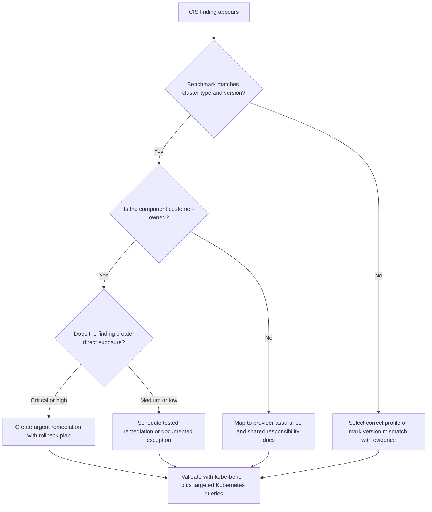

# Module 6.2: CIS Benchmarks

> **Complexity**: `[MEDIUM]` - Technical knowledge
>
> **Time to Complete**: 35-45 minutes
>
> **Prerequisites**: [Module 6.1: Compliance Frameworks](../module-6.1-compliance-frameworks/)
>
> **Scope**: Kubernetes 1.35+ benchmark interpretation, kube-bench triage, managed-service boundaries, remediation evidence, and compliance mapping.

Before you run any Kubernetes commands in this module, set the common KubeDojo shortcut once so examples stay readable. The full command is `kubectl`, and the alias used here is `k`; in an exam or incident bridge, that small habit reduces typing without hiding what tool is being used.

```bash
alias k=kubectl
k version --client
```

## Learning Outcomes

After completing this module, you will be able to apply the benchmark as a practical engineering tool, not just recognize its name on an exam:

1. **Evaluate** CIS Benchmark categories and their coverage of control plane, etcd, node, and policy security in Kubernetes 1.35+ environments.
2. **Assess** benchmark findings by separating exploitable configuration risk from advisory, manual, managed-service, and version-specific findings.
3. **Diagnose** kube-bench output by matching the selected benchmark profile to the cluster ownership model and Kubernetes version.
4. **Design** a practical remediation plan that connects CIS evidence to compliance frameworks, operational change control, and continuous drift detection.

## Why This Module Matters

In 2023, a financial services platform preparing for a PCI audit found a Kubernetes cluster with anonymous kubelet access still reachable from an internal network segment. The first scan looked ordinary: a list of CIS failures, several warnings, and a neat percentage that suggested the environment was "mostly compliant." During the investigation, the team discovered that one failed kubelet authorization control could expose pod metadata, logs, and exec-like surfaces depending on surrounding network controls. The expensive part was not the individual flag change; it was the audit delay, emergency node rotation, evidence cleanup, and customer assurance work that followed.

That kind of failure is why the Center for Internet Security Benchmark matters. It turns a broad phrase like "secure the cluster" into concrete, reviewable expectations for API server flags, etcd TLS, kubelet authentication, RBAC, Pod Security, NetworkPolicy, audit logging, and secret encryption. The benchmark is not a law, and it is not a substitute for threat modeling, but it gives operators and auditors a shared checklist that can be tested repeatedly instead of argued from memory.

KCSA expects you to recognize what CIS Benchmarks are, how kube-bench automates many checks, and how benchmark recommendations relate to broader compliance frameworks. The deeper skill is judgment: knowing when a failed control is urgent, when it is outside your responsibility on a managed service, when it is outdated for Kubernetes 1.35+, and when a remediation should wait for testing because it changes cluster behavior.

## What Is a CIS Benchmark?

The CIS Kubernetes Benchmark is a consensus security guide for configuring Kubernetes components. Think of it as the difference between a vague building code and a fire inspector's checklist: the high-level goal is safety, but the checklist names the doors, alarms, materials, inspections, and evidence that prove the goal is being met. In Kubernetes, those details become flags, file permissions, certificate settings, admission controllers, audit policies, RBAC constraints, and workload policy expectations.

```
┌─────────────────────────────────────────────────────────────┐
│              CIS KUBERNETES BENCHMARK                       │
├─────────────────────────────────────────────────────────────┤
│                                                             │
│  WHAT: Security configuration guidelines for Kubernetes     │
│  BY: Center for Internet Security                          │
│  FORMAT: Prescriptive checks with remediation guidance     │
│                                                             │
│  STRUCTURE:                                                │
│  ├── Control Plane Components                              │
│  ├── etcd                                                  │
│  ├── Control Plane Configuration                          │
│  ├── Worker Nodes                                         │
│  └── Policies                                             │
│                                                             │
│  SCORING:                                                  │
│  ├── Scored - Affects compliance percentage               │
│  └── Not Scored - Recommendations only                    │
│                                                             │
│  PROFILES:                                                 │
│  ├── Level 1 - Basic security (minimal disruption)        │
│  └── Level 2 - Defense in depth (may affect function)     │
│                                                             │
│  VERSIONS:                                                 │
│  • Updated with each Kubernetes release                   │
│  • Managed distributions have specific benchmarks         │
│    (EKS, GKE, AKS, OpenShift)                            │
│                                                             │
└─────────────────────────────────────────────────────────────┘
```

The benchmark is organized around ownership boundaries. Control plane checks ask whether the API server, scheduler, controller manager, and their files are protected. etcd checks focus on encryption, authentication, peer trust, and storage permissions because etcd is the cluster's source of truth. Worker node checks focus on the kubelet because it is the agent that can start containers and report node state. Policy checks focus on the Kubernetes resources that tenants and platform teams create every day, such as Roles, ServiceAccounts, namespaces, Pod Security labels, and NetworkPolicies.

Level 1 and Level 2 are often misunderstood. Level 1 is intended to improve security without major disruption for most environments, while Level 2 adds defense-in-depth controls that may require application testing, node image changes, or exception handling. A Level 2 item is not automatically "better" in every production cluster; it is stronger medicine, and stronger medicine still needs the right diagnosis.

Pause and predict: if a benchmark check says "not scored," should your team ignore it when building a compliance remediation plan? A mature answer is no. "Not scored" usually means the check may require local judgment or may not feed a simple percentage, but auditors and attackers do not care whether your reporting dashboard weighted it cleanly.

## Benchmark Categories and What They Protect

The easiest way to learn the benchmark is to map each category to the failure it prevents. Control plane authentication prevents unauthenticated API access. Authorization prevents authenticated identities from doing everything. Admission control prevents bad objects from entering the cluster after authentication and authorization have succeeded. Audit logging preserves the trail needed to investigate suspicious behavior. Encryption at rest reduces the blast radius if datastore access or backup handling is compromised.

### Control Plane Components

```
┌─────────────────────────────────────────────────────────────┐
│              CONTROL PLANE SECURITY                         │
├─────────────────────────────────────────────────────────────┤
│                                                             │
│  1.1 CONTROL PLANE NODE CONFIGURATION                      │
│  ├── File permissions on component configs                 │
│  ├── Ownership of configuration files                      │
│  └── Secure directory permissions                          │
│                                                             │
│  1.2 API SERVER                                            │
│  ├── Disable anonymous authentication                      │
│  ├── Enable RBAC authorization                            │
│  ├── Disable insecure port                                │
│  ├── Enable admission controllers                          │
│  ├── Configure audit logging                              │
│  ├── Set appropriate request limits                        │
│  └── Enable encryption providers                           │
│                                                             │
│  1.3 CONTROLLER MANAGER                                    │
│  ├── Enable terminated pod garbage collection             │
│  ├── Use service account credentials                      │
│  └── Rotate service account tokens                         │
│                                                             │
│  1.4 SCHEDULER                                             │
│  ├── Disable profiling                                    │
│  └── Use secure authentication                            │
│                                                             │
└─────────────────────────────────────────────────────────────┘
```

The API server receives every normal Kubernetes request, so its controls deserve special attention. Anonymous authentication, weak authorization modes, missing admission controls, and absent audit logs are not cosmetic benchmark findings; they affect who can ask the cluster to do work, which requests are allowed, which objects are rejected, and whether responders can reconstruct events after the fact. In a kubeadm-style cluster, these settings usually live in static pod manifests under `/etc/kubernetes/manifests`; in managed services, the cloud provider owns much of that surface.

> **Stop and think**: Your organization uses EKS (managed Kubernetes). A colleague runs kube-bench with the default (self-managed) benchmark and gets 30 FAIL findings for control plane components. Are these findings valid? Why or why not?

The answer depends on responsibility. On EKS, GKE, and AKS, customers do not edit the hosted API server manifest or etcd flags directly, so a self-managed benchmark can report failures that are not actionable by the customer. Those findings should not become tickets against the platform team without checking the managed-service benchmark profile and the provider's shared-responsibility documentation. The operational mistake is treating a scanner as an authority instead of treating it as evidence that must match the environment.

### etcd

```
┌─────────────────────────────────────────────────────────────┐
│              etcd SECURITY                                  │
├─────────────────────────────────────────────────────────────┤
│                                                             │
│  2.1 PEER COMMUNICATION                                    │
│  ├── Use client certificate authentication               │
│  ├── Encrypt peer communication with TLS                 │
│  ├── Verify peer certificates                            │
│  └── Use unique certificates per member                  │
│                                                             │
│  2.2 CLIENT COMMUNICATION                                  │
│  ├── Require client certificates for API server          │
│  ├── Encrypt client communication with TLS               │
│  ├── Verify client certificates                          │
│  └── Restrict client access                              │
│                                                             │
│  2.3 DATA SECURITY                                         │
│  ├── Secure file permissions (700)                       │
│  ├── Proper ownership (etcd:etcd)                        │
│  └── Enable encryption at rest                           │
│                                                             │
│  KEY CHECKS:                                               │
│  • --cert-file and --key-file are set                    │
│  • --peer-cert-file and --peer-key-file are set          │
│  • --client-cert-auth=true                               │
│  • --peer-client-cert-auth=true                          │
│  • --auto-tls=false                                      │
│                                                             │
└─────────────────────────────────────────────────────────────┘
```

etcd deserves its own category because it stores the cluster state that everyone else depends on. If an attacker can read etcd, they may be able to read Secrets, service account tokens, workload definitions, and configuration history. If an attacker can write to etcd, the API server's normal authorization path can be bypassed. That is why the benchmark emphasizes mutual TLS, certificate validation, restrictive file permissions, and encryption at rest instead of treating etcd as just another internal database.

For KCSA, you do not need to memorize every etcd flag, but you should recognize the pattern. Peer communication protects etcd members from impersonation inside the quorum. Client communication protects access from the API server and administrative clients. Data security protects the files and snapshots left behind on disk or in backup systems. When you assess a finding, ask which path it protects: member-to-member trust, API-server-to-etcd trust, or stored data exposure.

### Worker Nodes

```
┌─────────────────────────────────────────────────────────────┐
│              WORKER NODE SECURITY                           │
├─────────────────────────────────────────────────────────────┤
│                                                             │
│  4.1 KUBELET                                               │
│  ├── Disable anonymous authentication                      │
│  ├── Use webhook authorization                            │
│  ├── Enable client certificate authentication             │
│  ├── Disable read-only port (10255)                       │
│  ├── Enable streaming connection timeouts                 │
│  ├── Protect kernel defaults                              │
│  ├── Set hostname override only if needed                 │
│  └── Enable certificate rotation                          │
│                                                             │
│  4.2 KUBELET CONFIG FILE                                   │
│  ├── File permissions (600)                               │
│  ├── Proper ownership (root:root)                         │
│  └── Disable insecure TLS cipher suites                   │
│                                                             │
│  KEY KUBELET SETTINGS:                                     │
│  --anonymous-auth=false                                   │
│  --authorization-mode=Webhook                             │
│  --client-ca-file=/path/to/ca.crt                        │
│  --read-only-port=0                                       │
│  --protect-kernel-defaults=true                           │
│  --rotate-certificates=true                               │
│                                                             │
└─────────────────────────────────────────────────────────────┘
```

Worker node checks matter because the kubelet sits close to the workloads. A hardened API server does not help enough if the kubelet accepts unauthenticated requests, skips webhook authorization, exposes the read-only port, or runs with unmanaged certificate lifetimes. Node security is also where managed Kubernetes responsibility becomes more mixed: the provider may own parts of the control plane, but customers often choose node images, bootstrap settings, add-ons, DaemonSets, and workload policies.

The kubelet settings also show why remediation has to be tested. Enabling certificate rotation usually reduces operational risk, but changing authorization mode, kernel default protection, or TLS settings can break nodes that were built with inconsistent bootstrap assumptions. A production-grade remediation plan changes one group of settings at a time, drains nodes safely, validates workloads, and keeps rollback steps explicit.

### Policies

```
┌─────────────────────────────────────────────────────────────┐
│              KUBERNETES POLICIES                            │
├─────────────────────────────────────────────────────────────┤
│                                                             │
│  5.1 RBAC AND SERVICE ACCOUNTS                             │
│  ├── Limit use of cluster-admin role                      │
│  ├── Minimize access to secrets                           │
│  ├── Minimize wildcard use in roles                       │
│  ├── Minimize access to pod creation                      │
│  ├── Ensure default SA is not used                        │
│  └── Disable auto-mount of SA tokens                      │
│                                                             │
│  5.2 POD SECURITY STANDARDS                                │
│  ├── Minimize privileged containers                       │
│  ├── Minimize host namespace sharing                      │
│  ├── Minimize running as root                            │
│  ├── Minimize capabilities                                │
│  ├── Do not allow privilege escalation                   │
│  └── Apply Pod Security Standards                        │
│                                                             │
│  5.3 NETWORK POLICIES                                      │
│  ├── Use CNI that supports NetworkPolicy                  │
│  ├── Define default deny policies                         │
│  └── Ensure pods are isolated appropriately              │
│                                                             │
│  5.4 SECRETS MANAGEMENT                                    │
│  ├── Use secrets instead of environment variables         │
│  ├── Enable encryption at rest for secrets               │
│  └── Consider external secrets stores                     │
│                                                             │
└─────────────────────────────────────────────────────────────┘
```

Policy checks are where CIS moves from cluster operators to platform governance. RBAC controls who can do dangerous things. Service account settings reduce accidental credential exposure. Pod Security Standards reduce the chance that a compromised workload can escalate through privileged containers, host namespaces, added Linux capabilities, or root execution. NetworkPolicies reduce lateral movement by making pod-to-pod communication explicit instead of assuming every workload can reach every other workload.

This category also connects most directly to compliance frameworks. PCI DSS, SOC 2, ISO 27001, and similar programs usually do not name every Kubernetes setting, but they require access control, change evidence, least privilege, logging, data protection, and network segmentation. A CIS finding gives you the technical evidence that supports those broader controls. The benchmark does not replace the framework; it helps prove that your Kubernetes implementation can satisfy framework intent.

## Key Recommendations in Kubernetes 1.35+

API server hardening starts with the request path. A request should be authenticated, authorized, admitted or rejected by policy, and recorded well enough for investigation. If any layer is missing, the cluster becomes harder to defend and harder to explain to auditors. CIS recommendations turn that path into settings: disable anonymous auth, use Node and RBAC authorization rather than permissive modes, enable security-relevant admission plugins, configure audit logging, and encrypt sensitive resources at rest.

```
┌─────────────────────────────────────────────────────────────┐
│              API SERVER RECOMMENDATIONS                     │
├─────────────────────────────────────────────────────────────┤
│                                                             │
│  AUTHENTICATION                                            │
│  --anonymous-auth=false                                   │
│  • Disable anonymous access to API                        │
│  • All requests must be authenticated                     │
│                                                             │
│  AUTHORIZATION                                             │
│  --authorization-mode=Node,RBAC                           │
│  • Never use AlwaysAllow                                  │
│  • Use RBAC for role-based access                        │
│  • Node authorization for kubelet                         │
│                                                             │
│  ADMISSION CONTROLLERS                                     │
│  --enable-admission-plugins=NodeRestriction,PodSecurity  │
│  • NodeRestriction - Limit kubelet permissions           │
│  • PodSecurity - Enforce PSS                             │
│  • Other security-relevant controllers                    │
│                                                             │
│  AUDIT LOGGING                                             │
│  --audit-log-path=/var/log/kubernetes/audit.log          │
│  --audit-log-maxage=30                                    │
│  --audit-log-maxbackup=10                                 │
│  --audit-log-maxsize=100                                  │
│  --audit-policy-file=/etc/kubernetes/audit-policy.yaml   │
│                                                             │
│  ENCRYPTION                                                │
│  --encryption-provider-config=/path/to/encryption.yaml   │
│  • Encrypt secrets at rest                               │
│                                                             │
└─────────────────────────────────────────────────────────────┘
```

The important Kubernetes 1.35+ detail is that PodSecurityPolicy is gone and Pod Security Admission is the built-in replacement path. If a scanner tells you to enable PodSecurityPolicy on a modern cluster, the right response is not blind acceptance and not blind dismissal. Confirm the benchmark version, confirm the Kubernetes version, confirm namespace Pod Security labels, and document the finding as not applicable when the benchmark check has fallen behind the platform.

Kubelet hardening follows the same layered model, but the consequences are local to nodes and workloads. Authentication tells the kubelet who is calling. Webhook authorization lets the API server decide whether that caller can perform the requested kubelet action. Disabling the read-only port removes a legacy unauthenticated information path. Certificate rotation reduces the chance that old node credentials linger long after operational ownership has changed.

```
┌─────────────────────────────────────────────────────────────┐
│              KUBELET RECOMMENDATIONS                        │
├─────────────────────────────────────────────────────────────┤
│                                                             │
│  AUTHENTICATION                                            │
│  authentication:                                          │
│    anonymous:                                             │
│      enabled: false                                       │
│    webhook:                                               │
│      enabled: true                                        │
│    x509:                                                  │
│      clientCAFile: /path/to/ca.crt                       │
│                                                             │
│  AUTHORIZATION                                             │
│  authorization:                                           │
│    mode: Webhook                                          │
│  • Use Webhook mode for API server authorization         │
│  • Never use AlwaysAllow                                  │
│                                                             │
│  NETWORK                                                   │
│  readOnlyPort: 0                                          │
│  • Disable unauthenticated read-only port                │
│  • Prevents information disclosure                        │
│                                                             │
│  CERTIFICATES                                              │
│  rotateCertificates: true                                 │
│  serverTLSBootstrap: true                                │
│  • Enable automatic certificate rotation                  │
│  • Ensure certs don't expire unexpectedly                │
│                                                             │
│  SECURITY                                                  │
│  protectKernelDefaults: true                             │
│  • Fail if kernel settings don't match kubelet needs     │
│                                                             │
└─────────────────────────────────────────────────────────────┘
```

Before running this in a real cluster, what output do you expect from `k get nodes -o wide` after replacing a node image with different kubelet defaults? The healthy answer is "all nodes Ready, with the new image only after bootstrap settings match expected kubelet configuration." If you expect a benchmark flag to be safe without checking node readiness, workload restarts, and kubelet logs, you are treating compliance as paperwork instead of engineering.

## Using kube-bench Without Misreading It

kube-bench is the common open-source tool for checking Kubernetes clusters against CIS Benchmark controls. It reads local files, Kubernetes component configuration, and selected cluster information, then reports PASS, FAIL, WARN, and INFO results. It is useful because it makes a large benchmark repeatable, but it is still a scanner. It cannot always know your managed-service boundary, your compensating controls, your accepted exceptions, or whether a version-specific check has become obsolete.

### Running kube-bench

```bash
# Run on master node
kube-bench run --targets master

# Run on worker node
kube-bench run --targets node

# Run specific checks
kube-bench run --targets master --check 1.2.1,1.2.2

# Output as JSON
kube-bench run --targets master --json

# Run as Kubernetes Job
kubectl apply -f https://raw.githubusercontent.com/aquasecurity/kube-bench/main/job.yaml
```

The command block above is intentionally the classic kube-bench example, including the upstream Kubernetes Job manifest URL. In day-to-day KubeDojo examples, prefer `k apply -f ...` after setting the alias, but preserve the upstream command when comparing against vendor documentation or older runbooks. The difference is typing style, not a different API operation.

When kube-bench runs on a node, the selected target matters. A control plane target looks for API server, scheduler, controller manager, and etcd configuration that may only exist on self-managed control plane nodes. A node target looks for kubelet configuration and node-level files. In a managed cluster, a Kubernetes Job may be easier operationally, but the service account, hostPath mounts, and container security context used by the job deserve review before running it in production.

### Interpreting Results

```
┌─────────────────────────────────────────────────────────────┐
│              KUBE-BENCH OUTPUT                              │
├─────────────────────────────────────────────────────────────┤
│                                                             │
│  [INFO] 1 Control Plane Security Configuration             │
│  [INFO] 1.1 Control Plane Node Configuration Files         │
│  [PASS] 1.1.1 Ensure that the API server pod spec file     │
│               permissions are set to 600 or more restrictive│
│  [PASS] 1.1.2 Ensure that the API server pod spec file     │
│               ownership is set to root:root                │
│  [FAIL] 1.2.1 Ensure that the --anonymous-auth argument    │
│               is set to false                              │
│                                                             │
│  REMEDIATION:                                              │
│  1.2.1 Edit the API server pod specification file          │
│  /etc/kubernetes/manifests/kube-apiserver.yaml and set:    │
│  --anonymous-auth=false                                    │
│                                                             │
│  == Summary ==                                             │
│  45 checks PASS                                            │
│  10 checks FAIL                                            │
│  5 checks WARN                                             │
│  0 checks INFO                                             │
│                                                             │
│  SCORING:                                                  │
│  PASS = Compliant with recommendation                     │
│  FAIL = Not compliant, needs remediation                  │
│  WARN = Manual check needed                               │
│  INFO = Informational only                                │
│                                                             │
└─────────────────────────────────────────────────────────────┘
```

The worst way to read that output is as a single percentage. A cluster with one critical failure can be more dangerous than a cluster with several low-risk file-permission deviations, and a WARN can hide a real problem if nobody performs the manual review. Better reporting groups findings by control family, severity, ownership, environment, and remediation status. That is the difference between a compliance dashboard that looks clean and a security program that can actually reduce risk.

The remediation text is also not always a ready-to-run production change. Editing a static pod manifest on a kubeadm control plane can restart the API server. Changing kubelet authorization may affect probes, monitoring agents, or node bootstrap flows that were relying on legacy behavior. Enabling stricter Pod Security labels can reject workloads that previously deployed. The benchmark tells you what good looks like; your change plan decides how to get there without causing an outage.

Scanner output becomes more useful when you normalize it before people start arguing about tickets. A practical normalization pass adds cluster name, environment, Kubernetes version, benchmark profile, target type, finding ID, finding text, result, owner, applicability, severity, and evidence link. That sounds bureaucratic until the second scan arrives and you need to compare whether a failure is new, persistent, remediated, or reintroduced by drift.

For kube-bench JSON output, most teams eventually build a small parser that extracts failed and warning checks into a tracking system. The parser should not assign final severity alone, because severity depends on network exposure, tenant model, provider responsibility, and compensating controls. It can, however, group by section and preserve the benchmark's remediation text. That keeps automation useful while leaving risk decisions to the people who understand the cluster.

Manual review is where many programs lose discipline. A WARN that says "review privileged containers" cannot be closed by saying the scanner did not fail it. Someone must inspect privileged workloads, decide whether each one is required, identify whether Pod Security labels would prevent new privileged pods, and record exceptions for legitimate infrastructure workloads. The manual work is slower, but it is often where the real security posture is discovered.

There is also a subtle difference between remediation evidence and audit evidence. Remediation evidence proves the engineering change happened and worked, such as a config commit, kube-bench rerun, or `k` command output. Audit evidence proves the control is governed, such as an owner, review schedule, exception process, and link to the broader compliance requirement. A mature CIS program keeps both, because passing today's scan does not prove the control will remain healthy next quarter.

## Managed Kubernetes and Shared Responsibility

Managed Kubernetes changes CIS assessment because you no longer own every component. A cloud provider may operate the API server, etcd, scheduler, controller manager, and parts of the control plane network. You still own workload identity, RBAC choices, namespace labels, network policies, node group configuration, add-ons, container images, secrets handling, and application-level controls. Running the wrong benchmark profile confuses those responsibilities and creates noisy evidence.

```
┌─────────────────────────────────────────────────────────────┐
│              MANAGED KUBERNETES BENCHMARKS                  │
├─────────────────────────────────────────────────────────────┤
│                                                             │
│  WHY DIFFERENT?                                            │
│  • Control plane managed by provider                       │
│  • Different configuration options available               │
│  • Shared responsibility model                             │
│                                                             │
│  EKS BENCHMARK                                             │
│  • AWS-specific recommendations                            │
│  • IAM integration                                         │
│  • EKS add-ons security                                   │
│  • kube-bench supports: --benchmark eks-1.0               │
│                                                             │
│  GKE BENCHMARK                                             │
│  • GCP-specific recommendations                            │
│  • Workload Identity                                       │
│  • Binary Authorization                                    │
│  • kube-bench supports: --benchmark gke-1.0               │
│                                                             │
│  AKS BENCHMARK                                             │
│  • Azure-specific recommendations                          │
│  • Azure AD integration                                    │
│  • Azure Policy                                           │
│  • kube-bench supports: --benchmark aks-1.0               │
│                                                             │
│  RESPONSIBILITY:                                           │
│  Provider: Control plane components                        │
│  Customer: Worker nodes, workloads, policies               │
│                                                             │
└─────────────────────────────────────────────────────────────┘
```

The practical workflow is to select the benchmark that matches the platform before interpreting results. For self-managed kubeadm, Talos, RKE2, or similar clusters, control plane and etcd checks are usually in scope for the operating team. For EKS, GKE, and AKS, use the provider-specific benchmark when available, then map any remaining control plane evidence to provider documentation rather than pretending you can edit hosted components directly.

> **Pause and predict**: kube-bench reports a WARN for "Ensure that the admission control plugin PodSecurityPolicy is set." But PodSecurityPolicy was removed in Kubernetes 1.25. Does this mean the benchmark is wrong, or something else?

It usually means the check, selected benchmark, or scanner version does not match the cluster's Kubernetes version. In Kubernetes 1.35+, Pod Security Admission and namespace labels such as `pod-security.kubernetes.io/enforce: restricted` are the relevant built-in mechanism. The finding should be investigated and documented as not applicable only after you verify the version mismatch and confirm that the replacement control is actually configured.

## Remediation Prioritization and Evidence

Prioritization starts with exploitability and blast radius, not with the order of the report. Anonymous API server access, permissive authorization, exposed etcd, and missing audit logs are urgent because they affect the cluster's core trust boundary. Kubelet anonymous auth, read-only port exposure, and missing webhook authorization are high risk because they sit near workloads. Missing NetworkPolicies, broad cluster-admin bindings, and permissive Pod Security posture can become severe when paired with a compromised workload.

```
┌─────────────────────────────────────────────────────────────┐
│              REMEDIATION PRIORITY                           │
├─────────────────────────────────────────────────────────────┤
│                                                             │
│  CRITICAL (Fix immediately):                               │
│  ├── Anonymous auth enabled on API server                 │
│  ├── Insecure port enabled                                │
│  ├── AlwaysAllow authorization mode                       │
│  ├── No audit logging                                     │
│  └── etcd exposed without auth                            │
│                                                             │
│  HIGH (Fix within days):                                   │
│  ├── Kubelet anonymous auth enabled                       │
│  ├── Read-only kubelet port enabled                       │
│  ├── No encryption at rest for secrets                    │
│  ├── Privileged containers allowed                        │
│  └── Missing network policies                             │
│                                                             │
│  MEDIUM (Fix within weeks):                                │
│  ├── File permissions not restrictive                     │
│  ├── Audit log rotation not configured                    │
│  ├── Service account token auto-mount enabled             │
│  └── Certificate rotation not enabled                     │
│                                                             │
│  LOW (Plan for fix):                                       │
│  ├── Informational findings                               │
│  ├── Defense-in-depth recommendations                     │
│  └── Non-security settings                                │
│                                                             │
└─────────────────────────────────────────────────────────────┘
```

Evidence matters because CIS remediation often feeds external compliance programs. A good ticket does not merely say "set anonymous auth false." It records the benchmark version, cluster version, affected nodes or components, current value, desired value, risk rationale, owner, rollout plan, validation command, and exception decision if the control is deferred. Auditors need repeatable evidence; engineers need enough context to avoid making the same change twice or breaking a working system.

Which approach would you choose here and why: one ticket per benchmark failure, or one ticket per remediation theme? For small clusters, one ticket per failure may be acceptable. For real platforms, grouping by theme usually works better because API server flags, kubelet settings, RBAC cleanup, Pod Security rollout, and NetworkPolicy adoption each require different owners, tests, and rollback plans.

```bash
# Inspect namespace Pod Security labels in a Kubernetes 1.35+ cluster.
k get ns --show-labels

# Check whether broad cluster-admin bindings exist.
k get clusterrolebinding -o custom-columns=NAME:.metadata.name,ROLE:.roleRef.name

# Confirm NetworkPolicy objects exist across namespaces.
k get networkpolicy -A
```

These commands do not replace kube-bench. They help you validate the policy-facing parts of a finding and collect human-readable evidence. In a production remediation, pair scanner output with targeted Kubernetes queries, configuration management records, and change logs so the final report tells a coherent story.

Here is a worked example of how that evidence mindset changes the outcome. Imagine kube-bench reports that the API server allows anonymous authentication, the kubelet allows anonymous requests, and several namespaces lack NetworkPolicies. A thin compliance response would open three tickets with copied remediation text and no environment context. A stronger response asks which finding permits direct access to the control plane, which exposes node-local information or actions, which enables lateral movement after compromise, and which teams own the relevant configuration paths.

The API server finding becomes the first escalation because it touches the central request path. The owner is likely the control plane operations team, the evidence comes from the static pod manifest or managed configuration record, and the validation should include a follow-up scan plus a negative test showing unauthenticated requests are rejected. The change plan needs a control plane restart expectation, health checks, and a rollback path because even a correct flag can disrupt access if authentication integrations were misconfigured earlier.

The kubelet finding becomes a node remediation theme rather than a single isolated flag. The platform team should compare node pools, images, bootstrap scripts, and kubelet config files to find whether all nodes share the same issue or only one pool drifted. If only newly scaled nodes fail, the problem is probably in the launch template or bootstrap path. Fixing individual nodes by hand may quiet today's report, but it leaves tomorrow's autoscaling event ready to recreate the same failure.

The NetworkPolicy finding becomes a workload-owner conversation because isolation policy depends on application traffic. A platform team can provide a default-deny baseline and examples, but each service owner must identify legitimate ingress and egress. A rushed blanket policy can break service discovery, metrics scraping, DNS, or database access. That does not make NetworkPolicy optional; it means the remediation plan needs staged namespace rollout, observability during enforcement, and documented exceptions for transitional workloads.

This approach also helps with compliance mapping. The API server and kubelet findings support access-control and system-hardening requirements. NetworkPolicy supports segmentation and least-privilege communication. The scan output proves there was a gap, but the remediation evidence should prove the new state, the owner, the date, the validation method, and the reason any remaining exception is acceptable. That is the difference between "we ran a tool" and "we operate a control."

In real reviews, I like to add one more column to the finding triage spreadsheet: "wrong-benchmark risk." This column asks whether a finding might be invalid because the scanner profile, Kubernetes version, provider model, or runtime distribution does not match the cluster. It prevents teams from burning time on hosted control plane settings, removed features, or checks written for a different distribution. It also forces the reviewer to cite the reason a finding is not applicable instead of simply deleting inconvenient lines.

Another useful column is "remediation coupling." Some findings can be fixed independently, such as a namespace label or a stale clusterrolebinding. Others are coupled to node images, API server restarts, admission policy rollout, or application behavior. Coupled findings need change windows, stakeholder communication, and a rollback path. If you treat them like ordinary tickets, you may pass the benchmark eventually, but you will teach teams to fear security work because it appears as unexplained production risk.

Finally, record what success looks like before the change starts. For a kubelet authorization fix, success may include nodes returning Ready, monitoring DaemonSets continuing to scrape approved endpoints, kube-bench passing the relevant checks, and unauthorized kubelet calls failing. For Pod Security, success may include namespace labels present, known privileged workloads reviewed, and new deployments rejected only where the policy intentionally applies. Success criteria protect engineers from vague remediation and protect auditors from vague evidence.

## Continuous CIS Compliance

A single benchmark run is a snapshot. Clusters drift because nodes are replaced, add-ons are upgraded, bootstrap scripts change, namespaces are created by new teams, and emergency access sometimes becomes permanent access. Continuous compliance means you scan on a schedule, compare against a baseline, alert on meaningful new failures, and route work to the right owner before the next audit becomes a scramble.

```
┌─────────────────────────────────────────────────────────────┐
│              CONTINUOUS CIS COMPLIANCE                      │
├─────────────────────────────────────────────────────────────┤
│                                                             │
│  SCHEDULED SCANNING                                        │
│  apiVersion: batch/v1                                      │
│  kind: CronJob                                            │
│  metadata:                                                 │
│    name: kube-bench-scan                                  │
│  spec:                                                    │
│    schedule: "0 0 * * *"  # Daily                        │
│    jobTemplate:                                           │
│      spec:                                                │
│        template:                                          │
│          spec:                                            │
│            containers:                                    │
│            - name: kube-bench                            │
│              image: aquasec/kube-bench:latest           │
│              args: ["--json"]                            │
│            restartPolicy: Never                          │
│                                                             │
│  INTEGRATION POINTS:                                       │
│  • CI/CD: Scan before cluster changes                     │
│  • Monitoring: Alert on new failures                      │
│  • Reporting: Track compliance over time                  │
│  • Automation: Auto-remediate where safe                  │
│                                                             │
│  DRIFT DETECTION:                                          │
│  • Compare current state to baseline                      │
│  • Alert on configuration changes                         │
│  • Track remediation progress                             │
│                                                             │
└─────────────────────────────────────────────────────────────┘
```

Treat the CronJob diagram as a concept rather than a production-ready manifest. Running kube-bench as a privileged pod with host mounts may be necessary for node inspection, but that same privilege should be reviewed, constrained, and removed if the job is only needed during an assessment window. For continuous scanning, many organizations run checks from a hardened operations namespace, store JSON output in a controlled location, and convert new failures into tickets with severity and ownership labels.

The strongest teams also version their exceptions. If a Level 2 setting is deferred because it breaks a legacy workload, the exception should name the workload, business owner, compensating control, review date, and migration plan. Otherwise "accepted risk" becomes a storage bin for work nobody wants to finish, and the next audit has to rediscover the reasoning from scratch.

Continuous CIS work also needs a promotion path from development clusters to production clusters. If a new baseline is tested only in production, the first surprise happens where it is most expensive. A better pattern is to run the same benchmark profile in a representative non-production cluster, evaluate new findings, update node images and admission policies there first, and then promote the tested configuration through normal release channels. The benchmark becomes part of platform delivery instead of a separate audit ritual.

You should also decide which findings are allowed to fail temporarily during cluster lifecycle events. During a node pool migration, for example, a mixed fleet may show both old and new kubelet settings for a short period. During an admission policy rollout, namespaces may move from warn to audit to enforce. Those transitions should be planned and time-boxed, not hidden from reports. A temporary failure with a change ticket and deadline is very different from a permanent failure nobody owns.

Continuous scanning has a signal-to-noise problem, so alerting rules should focus on new high-risk failures, reintroduced critical controls, and exceptions nearing review deadlines. Alerting on every low-risk finding every day teaches teams to ignore the channel. Reporting should still retain the full detail for audits and trend analysis, but operational alerts should ask for action. The benchmark is a control system; control systems need feedback that humans can actually respond to.

Finally, remember that CIS compliance is one layer in a larger security program. A cluster can pass many benchmark checks while still running vulnerable images, exposing public services unnecessarily, or granting excessive cloud IAM permissions outside Kubernetes. Conversely, a cluster can have a justified benchmark exception because another control reduces the same risk. The right mindset is neither blind scanner obedience nor casual exception culture. Use CIS as a rigorous baseline, then combine it with threat modeling, runtime detection, supply-chain controls, and incident learning.

## From CIS Finding to Compliance Narrative

Compliance frameworks usually speak in control objectives, not Kubernetes flags. They ask whether access is restricted, whether changes are reviewed, whether sensitive data is protected, whether activity is logged, and whether systems are monitored. CIS Benchmarks translate part of that intent into Kubernetes-specific implementation evidence. When you can explain that translation, you help auditors understand the platform and help engineers see why the work matters.

For access control, API server authentication and authorization checks support the claim that users and workloads cannot perform arbitrary actions. RBAC checks support least privilege, especially when wildcard permissions, broad secret access, and unnecessary cluster-admin bindings are reduced. Service account checks support workload identity hygiene by limiting token exposure. The evidence should connect the benchmark result to actual Kubernetes objects and operational ownership, not just to a pasted checklist line.

For data protection, etcd TLS, client certificate authentication, and encryption at rest support the claim that cluster state is protected in transit and at rest. That does not automatically prove application data is safe, but it addresses the Kubernetes control plane data store. If Secrets are also synchronized to an external secrets manager, your narrative should describe which system is authoritative, how rotation works, and how Kubernetes encryption at rest fits into the larger design.

For monitoring and investigation, audit logging checks support the claim that security-relevant API activity can be reconstructed. The benchmark may verify that audit logging is configured, but the compliance narrative should go further: where logs are shipped, who can alter them, how long they are retained, how alerts are derived, and how responders search them during an incident. A log file path is a start, not a complete monitoring control.

For segmentation and workload hardening, Pod Security and NetworkPolicy checks support the claim that tenants and applications have boundaries. Pod Security reduces risky runtime attributes before pods start. NetworkPolicy reduces lateral movement after a workload is running. These controls are especially important in shared clusters, where one team's workload should not quietly become another team's threat path. The narrative should name the cluster tenancy model because a single-team development cluster and a multi-tenant production platform have different risk levels.

For change management, continuous benchmark evidence supports the claim that hardening settings are not one-time heroics. A baseline scan, remediation tickets, approved exceptions, recurring scans, and drift alerts show that the control is operated over time. This is where CIS becomes more than a study topic. It becomes a repeatable loop: define the baseline, measure the cluster, fix or justify gaps, validate the new state, and watch for drift.

When presenting CIS evidence, avoid drowning reviewers in raw output. Start with the control objective, summarize the relevant CIS categories, show current status by severity and owner, then attach detailed scan output for traceability. Engineers can still inspect every line, while non-specialist reviewers can understand whether the platform is improving. That structure is much more useful than a giant report that technically contains the answer but hides the decision.

The same approach helps during incidents. If responders discover that an attacker used a broad service account, a missing NetworkPolicy, or an overly permissive kubelet setting, the CIS baseline gives them a way to ask whether the weakness was already known, recently introduced, or previously accepted. That context affects root cause, customer communication, and follow-up work. Compliance evidence is not only for auditors; done well, it becomes operational memory.

## Patterns & Anti-Patterns

Patterns are the habits that keep CIS work from becoming a noisy spreadsheet exercise. They connect scanner output to ownership, risk, and repeatable operations. Anti-patterns are the shortcuts that look efficient during the first report and become expensive when a provider upgrade, audit request, or incident response exposes the missing reasoning.

| Pattern | When to Use | Why It Works | Scaling Consideration |
|---------|-------------|--------------|-----------------------|
| Match benchmark profile before triage | Every managed or hybrid cluster assessment | Prevents false control-plane findings from becoming impossible tickets | Store cluster type, Kubernetes version, and selected profile with every scan result |
| Group remediation by control family | When findings share an owner or rollout path | Lets teams test API server, kubelet, RBAC, Pod Security, and NetworkPolicy changes coherently | Use separate change windows for disruptive node and admission-control changes |
| Pair scanner evidence with cluster queries | When findings affect policies or workloads | Confirms whether the reported setting matches real operational exposure | Automate evidence collection with read-only commands and attach output to tickets |
| Track exceptions as first-class records | When a control is deferred or not applicable | Keeps compliance honest without forcing unsafe changes | Review exceptions on a schedule and close them when architecture changes |

| Anti-Pattern | What Goes Wrong | Why Teams Fall Into It | Better Alternative |
|--------------|-----------------|------------------------|-------------------|
| Reporting only a pass percentage | Critical findings can hide behind many low-risk passes | Percentages are easy for dashboards and leadership summaries | Report severity, ownership, trend, and exception status alongside any score |
| Applying Level 2 controls blindly | Nodes or workloads can fail after stricter settings land | Stronger controls sound automatically safer | Test Level 2 controls in non-production and document rollout prerequisites |
| Treating WARN as harmless | Manual checks remain unresolved and may hide real exposure | WARN looks less severe than FAIL in scanner output | Assign manual review owners and close each WARN as pass, fail, not applicable, or exception |
| Using self-managed checks on managed services | Teams waste time on settings they cannot change | The default benchmark is easy to run | Select provider-specific CIS guidance and map provider-owned controls separately |

## Decision Framework

Use this framework when a CIS finding appears. It deliberately starts with context before remediation because most bad benchmark programs fail by fixing the wrong thing quickly. Your goal is to decide whether the finding is real, who owns it, how risky it is, what evidence proves the decision, and how to remediate without damaging cluster availability.



| Decision Question | Evidence to Collect | Typical Outcome |
|-------------------|--------------------|-----------------|
| Does the profile match Kubernetes 1.35+ and the cluster provider? | kube-bench version, benchmark name, cluster version, provider docs | Re-run with the right profile or document obsolete checks |
| Is the component self-managed, provider-managed, or shared? | Architecture diagram, service documentation, node ownership records | Assign to platform team, cloud provider evidence, or workload owner |
| Is the control exploitable from a realistic path? | Network reachability, RBAC bindings, kubelet exposure, workload privileges | Severity adjustment and remediation timeline |
| Can remediation disrupt workloads or control plane availability? | Test results, node drain plan, admission dry-run, rollback command | Change window, staged rollout, or deferred exception |
| How will success be proven? | New scan output, `k` query output, config commit, change ticket | Closed finding with evidence attached |

The framework also helps you connect CIS to broader compliance frameworks. A CIS control might support SOC 2 logical access, PCI DSS least privilege, ISO 27001 access control, or internal security baseline requirements. When you write the remediation plan, name that mapping explicitly. It makes the work easier to prioritize and easier to defend during audit review.

The decision framework should be applied again after remediation, not only before it. A finding can move from fail to pass while still leaving behind a weak operational process, such as a manual node patch that is not represented in the golden image. Post-remediation review asks whether the fix is durable, whether the evidence is stored where auditors and responders can find it, and whether the same control can be checked automatically during future platform changes.

Durability is especially important for node controls. If a kubelet setting is corrected through a one-time command on running nodes, the next node replacement may revert it. If the setting is corrected in the machine image, bootstrap configuration, or managed node group template, new nodes inherit the safer baseline. CIS work should therefore prefer source-of-truth changes over instance-level repairs whenever the platform design allows it.

Admission and policy controls have a different durability problem. Namespace labels, RBAC bindings, and NetworkPolicies are Kubernetes objects, so teams may change them during normal application delivery. The sustainable fix is to combine baseline objects, policy-as-code review, and drift detection rather than relying on a quarterly manual scan. A good platform makes the secure path easier than the insecure path by giving teams templates, examples, and feedback before production.

Exception review is the final part of the decision cycle. Some exceptions are legitimate because a workload needs privileged access, a managed provider owns a setting, or a benchmark check has not caught up with Kubernetes 1.35+. Those exceptions should still expire or come up for review. If the reason is still valid, renew it with evidence; if the architecture changed, close the exception and remediate the control. Stale exceptions are often where old risk hides.

For KCSA preparation, practice explaining the "why" behind each branch of the framework. The exam is unlikely to ask you to recite every benchmark control, but it can test whether you know that managed-service profiles differ, that WARN requires manual judgment, that Level 2 can disrupt workloads, and that scanner output must be tied to ownership. If you can reason through those tradeoffs, you can handle unfamiliar CIS scenarios without memorizing an entire PDF. That same reasoning is what makes benchmark work valuable after the exam, when real clusters and real exceptions rarely match a clean operational study guide.

## Did You Know?

- **CIS Benchmarks are consensus-based**: the Center for Internet Security develops them through communities of security practitioners, vendors, and operators rather than a single vendor's private checklist.
- **Kubernetes 1.25 removed PodSecurityPolicy**: modern Kubernetes 1.35+ clusters should use Pod Security Admission and namespace labels instead of trying to enable the removed admission plugin.
- **kube-bench can run as a pod**: node-level checks often require host access, so the convenience of a Kubernetes Job must be balanced against the privilege granted to that job.
- **Level 2 controls may affect functionality**: settings such as stricter kernel default protection or workload confinement can be valuable, but they need testing and documented rollout plans.

## Common Mistakes

| Mistake | Why It Happens | How to Fix It |
|---------|----------------|---------------|
| Running the self-managed benchmark against EKS, GKE, or AKS | The default kube-bench path is easy to run and produces authoritative-looking output | Select the provider-specific benchmark profile, then map provider-owned controls to shared-responsibility evidence |
| Treating all FAIL findings as equal | Scanner summaries make every failed line look similar | Rank findings by exploitability, blast radius, ownership, and whether the control protects authentication, authorization, data, or lateral movement |
| Ignoring WARN findings | Teams assume manual checks are less important than automated failures | Assign a reviewer to close each WARN as pass, fail, not applicable, or documented exception with evidence |
| Enabling Level 2 settings without a rollout test | Defense-in-depth recommendations sound like obvious improvements | Test on non-production nodes or namespaces first, record expected impact, and keep rollback steps ready |
| Reporting only the compliance percentage | Managers ask for a simple score and dashboards reward simple numbers | Report severity groups, new failures, remediated findings, exceptions, and aging alongside any pass-rate trend |
| Forgetting Kubernetes version changes | Benchmark checks can lag behind removed or replaced features | Record Kubernetes and benchmark versions with every scan and document replacements such as Pod Security Admission for removed PSP checks |
| Running continuous scans without ownership routing | Scheduled jobs produce data faster than teams can act on it | Convert new findings into tickets with control family, severity, owner, validation evidence, and target remediation date |

## Quiz

<details>
<summary>Your kube-bench scan on an EKS cluster shows many FAIL findings for API server flags and etcd configuration. A teammate wants to open urgent tickets for every line. What should you check first?</summary>

First check whether the selected benchmark profile matches EKS and whether those components are customer-owned. In EKS, AWS manages the control plane and etcd, so a self-managed benchmark can produce failures that the customer cannot remediate directly. The right action is to rerun or reinterpret the scan with the EKS-specific guidance, then separate provider-owned evidence from customer-owned worker node, RBAC, workload, and policy controls. Opening urgent tickets without that ownership check creates noise and weakens confidence in the compliance program.

</details>

<details>
<summary>A report says the cluster is 90 percent CIS compliant, but the remaining failures include anonymous API server auth and missing audit logging. How would you assess the risk?</summary>

The percentage is not the main risk signal because it weights every check as if it had the same security impact. Anonymous API server auth affects the front door of the cluster, and missing audit logging damages incident response and compliance evidence. I would report those as critical or high-priority findings even if the overall pass rate looks strong. The remediation plan should explain why these failures affect core trust boundaries and should include validation evidence after the fix.

</details>

<details>
<summary>kube-bench warns that PodSecurityPolicy is not enabled on a Kubernetes 1.35 cluster. Should the team accept the risk, enable PSP, or do something else?</summary>

The team should not try to enable PodSecurityPolicy because it was removed in Kubernetes 1.25. The correct response is to verify the benchmark and scanner version, then document the PSP check as not applicable when it is genuinely obsolete for the cluster version. That documentation should include the replacement control, usually Pod Security Admission with namespace labels such as enforce, audit, or warn levels. If Pod Security Admission is not configured, the obsolete PSP finding still points toward a real workload policy gap that needs remediation.

</details>

<details>
<summary>After enabling `protectKernelDefaults: true` on a test node, the kubelet fails to start. What does that tell you about Level 2 controls?</summary>

It shows why Level 2 controls require testing instead of blind rollout. The kubelet refused to run because the node's kernel settings did not match the kubelet's expected defaults, which is exactly the kind of functional impact Level 2 warnings are meant to flag. The next step is to compare the node sysctl configuration with kubelet requirements, update the node image or bootstrap process, and retest before touching production. The control may still be valuable, but the rollout has prerequisites.

</details>

<details>
<summary>A daily kube-bench scan shows three new kubelet failures after an autoscaling event, but no human changed the cluster. What is a likely cause and how should you respond?</summary>

A likely cause is that new nodes joined with a different image, bootstrap script, kubelet configuration, or managed node group setting. Autoscaling can introduce drift when the launch template or node pool differs from the baseline used by existing nodes. The response should compare old and new node configuration, confirm which settings changed, and update the node build process rather than patching individual nodes by hand. The incident should also improve drift detection so future node replacements are checked before they carry workloads.

</details>

<details>
<summary>Your audit team asks how CIS Benchmark findings support a SOC 2 access-control narrative. How would you connect the technical evidence to the framework?</summary>

CIS findings provide concrete Kubernetes evidence for broader access-control claims. RBAC checks show whether permissions are limited, service account checks show whether workload identities are constrained, API server authorization checks show whether requests pass through an authorization layer, and audit logging checks show whether access can be reviewed later. The SOC 2 narrative should not simply paste benchmark IDs; it should explain how each technical control supports least privilege, monitoring, change evidence, and incident response. That mapping turns scanner output into compliance evidence.

</details>

<details>
<summary>A platform team schedules kube-bench as a privileged Kubernetes Job in every cluster. What security concern should they review before calling the design complete?</summary>

They should review the privilege granted to the scanner itself. kube-bench often needs host access to inspect node configuration, so the Job may require hostPath mounts, elevated permissions, or broad visibility that would be dangerous if abused. A good design limits where the Job runs, who can create or modify it, where output is stored, and how long elevated permissions exist. Continuous compliance should not introduce a standing privileged workload without compensating controls and ownership.

</details>

## Hands-On Exercise: Benchmark Analysis

**Scenario**: You receive these kube-bench results from a self-managed Kubernetes 1.35+ cluster. Your job is to prioritize the findings, identify version-specific interpretation issues, and produce a remediation plan that an operations team could execute safely.

```
[FAIL] 1.2.1 Ensure --anonymous-auth is set to false
[FAIL] 1.2.5 Ensure --authorization-mode includes RBAC
[WARN] 1.2.11 Ensure --enable-admission-plugins includes PodSecurityPolicy
[FAIL] 4.2.1 Ensure --anonymous-auth is set to false (kubelet)
[FAIL] 4.2.2 Ensure --authorization-mode is not set to AlwaysAllow
[PASS] 4.2.6 Ensure --read-only-port is set to 0
[FAIL] 5.1.1 Ensure cluster-admin role is only used where required
[WARN] 5.2.1 Minimize privileged containers
[FAIL] 5.7.1 Create NetworkPolicy for each namespace
```

### Tasks

- [ ] Confirm whether the cluster type and Kubernetes version make each finding applicable.
- [ ] Sort the FAIL findings into critical, high, and medium remediation groups.
- [ ] Identify which WARN finding is obsolete for Kubernetes 1.35+ and name the replacement control.
- [ ] Write validation commands using `k` for RBAC, namespace labels, and NetworkPolicy evidence.
- [ ] Create a staged remediation plan with owners, rollout risk, and success criteria.
- [ ] Decide what evidence should be attached to the compliance ticket after remediation.

<details>
<summary>Solution: applicability and priority</summary>

For a self-managed Kubernetes 1.35+ cluster, API server and kubelet findings are generally customer-owned unless the environment has a separate platform provider contract. The PodSecurityPolicy warning is obsolete because PSP was removed in Kubernetes 1.25, so it should be documented as not applicable only after confirming Pod Security Admission is configured. Critical findings are API server anonymous authentication and authorization that lacks RBAC, because they affect the central request path. High findings include kubelet anonymous authentication and AlwaysAllow authorization, while broad cluster-admin usage and missing NetworkPolicies usually become high or medium depending on exposure and tenant model.

</details>

<details>
<summary>Solution: validation commands</summary>

Use targeted commands to supplement kube-bench output. These commands do not prove every control plane flag, but they help validate the policy-facing findings and collect evidence for the remediation ticket.

```bash
k get clusterrolebinding -o custom-columns=NAME:.metadata.name,ROLE:.roleRef.name,SUBJECTS:.subjects[*].name
k get ns --show-labels
k get networkpolicy -A
k auth can-i create pods --as=system:serviceaccount:default:default
```

If the cluster is self-managed, control plane flag validation usually comes from static pod manifests, configuration management, or node-level inspection rather than from the Kubernetes API alone. Attach both scanner output and the relevant configuration evidence so reviewers can trace the finding to the actual setting.

</details>

<details>
<summary>Solution: remediation plan</summary>

**CRITICAL - Fix Today:**

1. **1.2.1 - API server anonymous auth**
   ```yaml
   # /etc/kubernetes/manifests/kube-apiserver.yaml
   - --anonymous-auth=false
   ```
   Risk: Unauthenticated API access

2. **1.2.5 - Authorization mode**
   ```yaml
   - --authorization-mode=Node,RBAC
   ```
   Risk: Possible bypass of authorization

3. **4.2.2 - Kubelet authorization AlwaysAllow**
   ```yaml
   # kubelet config
   authorization:
     mode: Webhook
   ```
   Risk: Kubelet accepts any request

**HIGH - Fix Within Days:**

4. **4.2.1 - Kubelet anonymous auth**
   ```yaml
   authentication:
     anonymous:
       enabled: false
   ```
   Risk: Unauthenticated kubelet access

5. **5.1.1 - Cluster-admin usage**
   - Audit current cluster-admin bindings
   - Remove unnecessary bindings
   - Create role-specific roles
   Risk: Excessive privileges

**MEDIUM - Fix Within Weeks:**

6. **5.7.1 - NetworkPolicy per namespace**
   - Create default deny policies
   - Add explicit allow policies
   Risk: Unrestricted pod communication

7. **5.2.1 - Privileged containers** (WARN)
   - Enable Pod Security Standards
   - Audit privileged pods
   - Migrate to non-privileged
   Risk: Container escape possible

**NOTE:**
- 1.2.11 mentions PodSecurityPolicy which is deprecated
- Modern clusters should use Pod Security Admission instead

**Remediation Order:**
1. Authentication issues (immediate)
2. Authorization issues (same day)
3. RBAC cleanup (this week)
4. Network policies (this week)
5. Pod security (ongoing)

</details>

### Success Criteria

- [ ] The remediation plan distinguishes critical API server findings from workload policy findings.
- [ ] The PodSecurityPolicy warning is handled as a Kubernetes 1.35+ version mismatch with Pod Security Admission evidence.
- [ ] Every remediation item has an owner, validation evidence, and a rollback or exception path.
- [ ] Follow-up scanning is scheduled so new failures are compared against the current baseline.

## Sources

- [CIS Kubernetes Benchmark](https://www.cisecurity.org/benchmark/kubernetes)
- [CIS Benchmarks overview](https://www.cisecurity.org/cis-benchmarks)
- [kube-bench project](https://github.com/aquasecurity/kube-bench)
- [kube-bench Kubernetes Job manifest](https://raw.githubusercontent.com/aquasecurity/kube-bench/main/job.yaml)
- [Kubernetes: Authenticating](https://kubernetes.io/docs/reference/access-authn-authz/authentication/)
- [Kubernetes: Authorization overview](https://kubernetes.io/docs/reference/access-authn-authz/authorization/)
- [Kubernetes: Admission controllers](https://kubernetes.io/docs/reference/access-authn-authz/admission-controllers/)
- [Kubernetes: Auditing](https://kubernetes.io/docs/tasks/debug/debug-cluster/audit/)
- [Kubernetes: Encrypting Secret Data at Rest](https://kubernetes.io/docs/tasks/administer-cluster/encrypt-data/)
- [Kubernetes: Kubelet configuration](https://kubernetes.io/docs/reference/config-api/kubelet-config.v1beta1/)
- [Kubernetes: Pod Security Standards](https://kubernetes.io/docs/concepts/security/pod-security-standards/)
- [Kubernetes: Network Policies](https://kubernetes.io/docs/concepts/services-networking/network-policies/)

## Next Module

[Module 6.3: Security Assessments](../module-6.3-security-assessments/) - Conducting and responding to security assessments by turning scan output, evidence, and ownership into an actionable security review.
