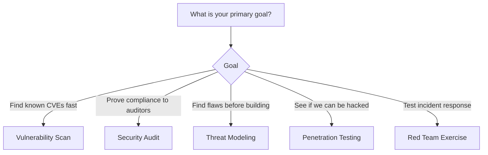

> **Complexity**: `[MEDIUM]` - Conceptual knowledge
>
> **Time to Complete**: 25-30 minutes
>
> **Prerequisites**: [Module 6.2: CIS Benchmarks](../module-6.2-cis-benchmarks/)

---

## What You'll Be Able to Do

After completing this module, you will be able to:

1. **Compare** assessment types: vulnerability scans, penetration tests, security audits, and threat models
2. **Evaluate** Kubernetes security posture using structured assessment methodologies
3. **Assess** findings from security assessments to prioritize remediation by risk
4. **Design** an ongoing security assessment program for Kubernetes environments

---

## Why This Module Matters

> "In 2018, hackers breached Tesla's cloud environment, hijacking their Kubernetes clusters to mine cryptocurrency. The entry point? A Kubernetes dashboard exposed to the internet with no authentication. It's a stark reminder: the average time to detect a cloud misconfiguration is often measured in weeks or months."

Welcome to the final conceptual module of KCSA. Think of building a cluster like building a bank. You can install the best locks (RBAC) and cameras (Audit Logs), but how do you *know* they work? Security assessments evaluate your Kubernetes security posture through systematic analysis, testing, and review. Understanding assessment types and processes helps you identify gaps, prioritize improvements, and demonstrate security to stakeholders.

KCSA tests your understanding of threat modeling, security assessments, and audit processes.

---

## Assessment Types

Different assessments answer different questions. You wouldn't hire a lockpicker to check if your blueprints are correct, just as you wouldn't use a vulnerability scanner to understand your business logic flaws.

| Assessment Type | Purpose | Coverage | Skill Required | Cost | False Positives |
|-----------------|---------|----------|----------------|------|-----------------|
| **Vulnerability Scanning** | Find known CVEs and bad configs | High (automated) | Low | Low | Medium-High |
| **Security Audit** | Verify policy/compliance | Broad | Medium | Medium | Low |
| **Penetration Testing** | Exploit flaws to prove risk | Targeted | High | High | Low |
| **Threat Modeling** | Find design flaws early | Architecture | Medium | Low | N/A |
| **Red Teaming** | Test detection & response | Deep | Very High | Very High | Low |

### Choosing the Right Assessment



> **Pause and predict: Match the Scenario**
> 1. You want to ensure developers aren't running images as root in CI/CD.
> 2. You need to prove to a customer that an attacker can't breach your multitenant cluster.
> 3. You are designing a new microservice and want to find security flaws before coding starts.
> 
> *Answers: 1 = Vulnerability Scanning, 2 = Penetration Testing, 3 = Threat Modeling.*

---

## Threat Modeling

Think of threat modeling like reviewing the architectural blueprints of a bank before pouring the concrete. It is a systematic analysis of potential threats, allowing you to identify and fix design flaws when they are cheapest to address.

### STRIDE Framework

STRIDE is a mnemonic developed at Microsoft that helps you categorize different types of threats.

| Category | What it means | Kubernetes Example | Mitigation |
|----------|---------------|--------------------|------------|
| **S**poofing | Pretending to be someone else | Forging a ServiceAccount token | Strong auth, mTLS |
| **T**ampering | Modifying data or code | Altering a container image | Image signing, read-only root FS |
| **R**epudiation | Denying actions were performed | Deleting audit logs | Immutable audit logging |
| **I**nformation Disclosure | Unauthorized data access | Reading Secrets via API | Secrets encryption, RBAC |
| **D**enial of Service | Making system unavailable | CPU exhaustion by a pod | ResourceQuotas, Limits |
| **E**levation of Privilege | Gaining unauthorized access | Container escape to host | Pod Security Standards |

> **Stop and think**: STRIDE identifies threats but doesn't tell you which are most dangerous. If you applied STRIDE to a Kubernetes ingress controller and found threats in all 6 categories, how would you decide which to address first?
*(Hint: You would assess the Risk by multiplying the Likelihood of the attack by its potential Impact on the business.)*

### Threat Modeling Process

1. **Decompose the System**: Identify components (pods, services), map data flows, and define trust boundaries.
2. **Identify Threats**: Apply STRIDE to each component and document assumptions.
3. **Assess Risks**: Calculate Likelihood × Impact and prioritize findings.
4. **Mitigate**: Implement controls or explicitly accept/transfer the risk.
5. **Validate**: Verify the controls actually work and update the model as the architecture evolves.

---

## Kubernetes Attack Paths

When attackers breach a cluster, they typically follow a predictable lifecycle. Understanding these paths helps you place security controls at critical chokepoints.

1. **External → Initial Access**: 
   - Exposed dashboard (no auth)
   - Vulnerable application (e.g., Log4j)
   - Misconfigured Ingress or compromised credentials
2. **Pod → Lateral Movement**:
   - Using a mounted ServiceAccount token to query the API
   - Scanning the internal network to reach other pods
   - Reading unencrypted secrets from shared volumes
3. **Pod → Privilege Escalation**:
   - Escaping a privileged container to access the underlying host node
   - Abusing RBAC to create a new, privileged pod
4. **Node → Cluster Compromise**:
   - Accessing the Kubelet API to control all pods on that node
   - Stealing node credentials to pivot into the broader cloud environment (AWS/GCP/Azure)
   - Accessing the `etcd` datastore to dump all cluster secrets

> **War Story: The SSRF and the Overprivileged Role**
> In the 2019 Capital One breach, an attacker exploited a Server-Side Request Forgery (SSRF) vulnerability in a web application. The app was running with an overprivileged IAM role (the cloud equivalent of a Kubernetes ServiceAccount). The attacker used the SSRF to query the cloud metadata service, stole the role's credentials, and synced massive amounts of data from S3. 
> *The Lesson:* Initial access (SSRF) combined with an overprivileged identity (blast radius) equals a catastrophic breach. Lateral movement and privilege escalation paths are critical to map out.

> **Stop and think: Trace the Attack Chain**
> An attacker finds an exposed Jenkins dashboard, runs a malicious build job, accesses the pod's default ServiceAccount token, and uses it to read Secrets in the `default` namespace. Which phases of the attack path did they just execute?
> *Answer: External → Initial Access (Exposed dashboard) followed by Pod → Lateral Movement (SA token usage to query the API).*

---

## Penetration Testing

If threat modeling is reviewing the blueprints, penetration testing is hiring a professional locksmith to break into your own building. It involves active exploitation attempts to simulate a real attacker.

### Kubernetes Penetration Testing Scope

| Scope Area | Target Examples | Key Objectives |
|------------|-----------------|----------------|
| **External Testing** | API Server, Ingress, NodePorts | Unauthenticated access, exposed dashboards |
| **Internal Testing** | Pod-to-Pod network, Kubelet API | Lateral movement, SSRF, service discovery |
| **Escalation** | Pod Security, Container Runtime | Container escape, RBAC abuse, host access |
| **Config Review** | RBAC manifests, NetworkPolicies | Find misconfigurations that enable the above |

### Tools of the Trade: kube-hunter

`kube-hunter` is an open-source tool that hunts for security weaknesses in Kubernetes clusters.

```bash
# Remote scanning (from outside cluster)
kube-hunter --remote 10.0.0.1

# Internal scanning (from inside pod)
kube-hunter --pod

# Network scanning
kube-hunter --cidr 10.0.0.0/24

# Active exploitation (use carefully!)
kube-hunter --active

# Output formats
kube-hunter --report json
kube-hunter --report yaml
```

**Example Output:**
```text
Vulnerabilities
------------------------------------------------------
ID      : KHV001
Title   : Exposed API server
Category: Information Disclosure
Severity: Medium
Evidence: https://10.0.0.1:6443
------------------------------------------------------
ID      : KHV005
Title   : Exposed Kubelet API
Category: Remote Code Execution
Severity: High
Evidence: https://10.0.0.2:10250/pods
------------------------------------------------------
```

---

## Security Audits

While a pentest proves what an attacker *can* do, an audit proves that your organization is following its own rules and external compliance frameworks.

### Audit Process

1. **Planning**: Define the scope, identify stakeholders, and gather documentation.
2. **Evidence Gathering**: Review configurations, analyze logs, and run automated tools.
3. **Analysis**: Compare the current state against requirements to identify gaps.
4. **Reporting**: Document findings, executive summaries, and remediation timelines.
5. **Remediation**: Create action plans, implement fixes, and verify closure.

### What Auditors Look For

- [ ] **Access Control**: RBAC follows least privilege; no anonymous API access.
- [ ] **Data Protection**: Secrets are encrypted at rest; TLS is enforced everywhere.
- [ ] **Logging & Monitoring**: Audit logs are enabled, retained securely, and monitored.
- [ ] **Network Security**: Default-deny NetworkPolicies are in place; API server is not public.
- [ ] **Vulnerability Management**: Images are scanned in CI/CD; patching procedures are followed.
- [ ] **Incident Response**: Procedures are documented and evidence preservation is established.

> **Pause and predict**: A penetration test finds that `kube-hunter` can reach the kubelet API from inside a pod. The kubelet has anonymous auth disabled and uses webhook authorization. Is this still a finding, or has the defense worked as intended?
*(Hint: It is still a finding. The defense is working (authentication blocked unauthorized access), but the exposure still exists. The principle of least privilege says pods shouldn't reach infrastructure APIs they don't need.)*

---

## Risk Assessment

Not all vulnerabilities are created equal. You must calculate risk to decide what to fix today, what to fix next sprint, and what to accept.

**RISK = LIKELIHOOD × IMPACT**

* **Likelihood Factors**: Threat actor motivation, attack complexity, existing controls, exposure level.
* **Impact Factors**: Data sensitivity, system criticality, financial and reputational damage.

### The Risk Matrix

| | Low Impact | Medium Impact | High Impact |
|---|---|---|---|
| **High Likelihood** | Medium Risk | High Risk | Critical Risk |
| **Medium Likelihood** | Low Risk | Medium Risk | High Risk |
| **Low Likelihood** | Low Risk | Low Risk | Medium Risk |

**Response SLAs:**
* **Critical**: Immediate action required.
* **High**: Action within days.
* **Medium**: Action within weeks.
* **Low**: Accept the risk or plan for the future.

> **Pause and predict: Calculate the Risk**
> You have three findings:
> 1. A critical CVE in a container image... but it's on an internal backend service with strict NetworkPolicies (High Impact, Low Likelihood).
> 2. The Kubernetes Dashboard is exposed to the internet without a password (High Impact, High Likelihood).
> 3. A developer's read-only kubeconfig is leaked, but it only allows viewing pods in a dev namespace (Low Impact, Medium Likelihood).
> 
> *Where do they fall on the matrix?*
> *Answers: 1 = Medium Risk. 2 = Critical Risk. 3 = Low Risk.*

---

## Remediation Planning

Once you have a prioritized list of risks, you need a plan. For each finding:

1. **Understand**: What is the vulnerability? What is the attack scenario and business impact?
2. **Plan**: What is the fix? Are there dependencies? How will we roll it back if it breaks production?
3. **Implement**: Test the changes in a non-production cluster first, then deploy carefully.
4. **Verify**: Re-test the vulnerability to confirm the fix is effective and check for regressions.
5. **Close**: Document the evidence, update the tracking system, and notify stakeholders.

---

## Security Metrics

You can't manage what you don't measure. Metrics help you track whether your security program is actually improving over time.

### [ Security Posture Dashboard - Example ]

| Critical Vulnerabilities | Mean Time To Remediate (MTTR) | CIS Benchmark Score |
|:---:|:---:|:---:|
| **3** (Down 2 from last week) | **14 Days** (Target: < 7 Days) | **85%** (Up 5% this month) |

**Top Failing Policies (Operational Metrics):**
1. `require-ro-rootfs` (42 violations)
2. `disallow-default-namespace` (15 violations)

**Recent Incidents (Incident Metrics):**
- *Mean Time to Detect (MTTD):* 45 mins 
- *Mean Time to Respond (MTTR):* 2 hours 
- *False Positive Rate:* 12%

> **Stop and think: Which Metric?**
> A new zero-day vulnerability is announced. Your team scrambles to patch it, and it takes 3 weeks to update all clusters. Which operational security metric will this negatively impact the most?
> *Answer: Mean Time To Remediate (MTTR). Tracking MTTR helps justify investments in automated patching and deployment pipelines.*

---

## Worked Example: Threat Modeling the API Server

Before you do it yourself, let's look at how a security engineer actually applies STRIDE to a specific component — the Kubernetes API Server. We don't just list threats; we brainstorm scenarios and evaluate existing controls.

1. **Spoofing**: Can someone pretend to be a valid user? 
   *Scenario*: An attacker steals a developer's kubeconfig file. 
   *Control*: We require OIDC authentication with MFA. (Mitigated).
2. **Tampering**: Can someone alter data? 
   *Scenario*: An attacker intercepts API traffic to change a deployment manifest.
   *Control*: The API server strictly requires TLS for all connections. (Mitigated).
3. **Repudiation**: Can someone do something malicious and deny it? 
   *Scenario*: An admin deletes a production namespace and blames a glitch. 
   *Control*: Kubernetes Audit Logging is enabled and shipped to an immutable SIEM. (Mitigated).
4. **Information Disclosure**: Can someone see things they shouldn't? 
   *Scenario*: A user with read access to the cluster views Secrets. 
   *Control*: RBAC is configured, but developers currently have the `view` cluster role, which exposes some metadata. (Action Item: Review and tighten RBAC).
5. **Denial of Service**: Can someone crash the API? 
   *Scenario*: A misconfigured CI/CD pipeline spams the API server with millions of requests.
   *Control*: API Priority and Fairness (APF) is enabled to rate-limit service accounts. (Mitigated).
6. **Elevation of Privilege**: Can a low-level user gain admin rights? 
   *Scenario*: A user modifies a `ClusterRoleBinding` to give themselves `cluster-admin`.
   *Control*: RBAC explicitly denies `bind` and `escalate` permissions. (Mitigated).

---

## Hands-On Exercise: Threat Model

**Scenario**: Create a simple threat model for this architecture:

```
                    Internet
                        │
                   [Ingress]
                        │
            ┌───────────┴───────────┐
            │                       │
        [Frontend]             [Backend]
            │                       │
            └───────────┬───────────┘
                        │
                   [Database]
                        │
                    Secrets
```

**Apply STRIDE to each component:**

<details markdown="1">
<summary>Threat Model</summary>

**INGRESS:**

| Threat | Example | Mitigation |
|--------|---------|------------|
| S | Fake SSL cert | Valid certs, certificate pinning |
| T | Header injection | WAF, input validation |
| R | No access logs | Enable access logging |
| I | TLS downgrade | Force TLS 1.2+, HSTS |
| D | Request flooding | Rate limiting |
| E | Path traversal | Restrict paths, validate |

**FRONTEND:**

| Threat | Example | Mitigation |
|--------|---------|------------|
| S | Session hijacking | Secure cookies, short sessions |
| T | XSS | CSP, input sanitization |
| R | User denies actions | Audit logging |
| I | Source code exposure | Build optimization |
| D | Resource exhaustion | Resource limits |
| E | SA token abuse | No API access needed |

**BACKEND:**

| Threat | Example | Mitigation |
|--------|---------|------------|
| S | Stolen SA token | Disable auto-mount |
| T | Code injection | Input validation, parameterized queries |
| R | Missing audit trail | Application logging |
| I | Error message exposure | Generic errors |
| D | Query complexity attack | Query limits |
| E | RBAC escalation | Minimal permissions |

**DATABASE:**

| Threat | Example | Mitigation |
|--------|---------|------------|
| S | Credential theft | Rotate credentials, Vault |
| T | Data modification | Integrity constraints |
| R | Data changes | Database audit logs |
| I | SQL injection | Parameterized queries |
| D | Connection exhaustion | Connection pooling |
| E | Privilege escalation | Least privilege DB user |

**SECRETS:**

| Threat | Example | Mitigation |
|--------|---------|------------|
| S | Stolen credentials | Rotate regularly |
| T | Secret modification | RBAC, audit |
| R | Access without logs | Audit logging |
| I | Secret in logs | Scrub logs, don't log secrets |
| D | N/A | N/A |
| E | RBAC to read secrets | Minimal secret access |

**TOP RISKS:**
1. SA token leads to API access → Disable auto-mount
2. Database credentials exposed → Use Vault, rotate
3. No network isolation → NetworkPolicy
4. Missing audit logs → Enable audit logging

</details>

---

## Summary

Security assessments evaluate and improve Kubernetes security:

| Assessment Type | Purpose | Frequency |
|----------------|---------|-----------|
| **Threat Modeling** | Identify attack paths | Design time, major changes |
| **Vulnerability Scan** | Find known issues | Continuous |
| **Penetration Test** | Prove exploitability | Quarterly/annually |
| **Security Audit** | Verify compliance | Annually |

Key practices:
- Use STRIDE for systematic threat identification
- Combine automated and manual testing
- Track findings and remediation progress
- Measure security metrics over time
- Update threat models as systems change

---

## Did You Know?

- **STRIDE was developed at Microsoft** in 1999 and remains one of the most widely used threat modeling frameworks.
- **Penetration testing on managed Kubernetes** requires cloud provider approval. AWS, GCP, and Azure have specific policies about testing their infrastructure.
- **Most security findings are misconfigurations**, not zero-days. Regular configuration assessments find more issues than penetration testing.
- **Threat modeling is most effective early**—it's cheaper to fix security issues during design than after deployment.

---

## Common Mistakes

| Mistake | Why It Hurts | Solution |
|---------|--------------|----------|
| No threat model | Missing risks | Model before building |
| Testing only annually | Gaps accumulate | Continuous assessment |
| Not tracking metrics | Can't measure improvement | Build dashboards |
| Ignoring low findings | Chains to critical | Prioritize and plan all |
| No remediation tracking | Findings stay open | Use tracking system |

---

## Quiz

1. **You're threat-modeling a new microservice that processes customer PII. Using STRIDE, you identify 18 potential threats. Your team has capacity to address 6 before the launch deadline. How do you prioritize, and what do you do about the remaining 12?**
   <details>
   <summary>Answer</summary>
   Prioritize using Risk = Likelihood x Impact: rank each threat by how easily exploitable it is and how severe the consequences are. Focus on: Elevation of Privilege threats first (container escape, RBAC escalation — highest impact), then Information Disclosure for PII data (directly affects compliance and customers), then Spoofing of identity (enables other attacks). For the remaining 12: document them as known residual risks with specific owners and target dates, implement compensating controls where possible (e.g., monitoring to detect threats you can't prevent yet), and add them to the next sprint's backlog. Never treat unaddressed threats as "accepted" without explicit risk acceptance from management with awareness of the consequences.
   </details>

2. **A penetration tester runs kube-hunter from inside a pod and reports: "kubelet API reachable on port 10250." The kubelet has anonymous auth disabled and webhook authorization enabled. The tester marks this as a Medium finding. Your team argues it should be Informational since authentication is required. Who is correct?**
   <details>
   <summary>Answer</summary>
   Both have valid points, but the tester's Medium rating is more appropriate. While the kubelet's authentication prevents unauthorized access, network reachability to the kubelet API is still a finding because: (1) it increases attack surface — any future kubelet CVE (authentication bypass) is exploitable from any pod; (2) an attacker who obtains valid node credentials can access the kubelet; (3) the principle of least privilege says pods shouldn't reach infrastructure APIs they don't need. The defense is working (authentication blocks unauthorized access), but the exposure still exists. Proper remediation: NetworkPolicies blocking pod egress to node IP port 10250. This demonstrates that security assessments evaluate both current exploitability AND potential future risk.
   </details>

3. **Your organization conducts an annual penetration test and a quarterly vulnerability scan. Between assessments, a critical misconfiguration is introduced (default ServiceAccount given cluster-admin). It exists for 4 months before the next pentest finds it. How would you prevent this detection gap?**
   <details>
   <summary>Answer</summary>
   The 4-month gap illustrates why periodic assessments alone are insufficient. Prevention: (1) Continuous policy enforcement — Kyverno/OPA policy blocking cluster-admin bindings to default ServiceAccounts would prevent the misconfiguration from being created; (2) Continuous scanning — daily kube-bench or kubeaudit runs would detect it within 24 hours; (3) Git-based RBAC management — if all RBAC changes require PR review, the misconfiguration would be caught in code review; (4) Audit log alerting — a real-time alert on ClusterRoleBinding creation for cluster-admin would trigger within minutes; (5) Admission webhook — block the creation entirely. The best security programs combine periodic deep assessments (pentests) with continuous automated monitoring to eliminate blind spots between assessments.
   </details>

4. **An auditor asks for evidence that your Kubernetes cluster's access controls are effective. You provide a list of RBAC Roles and RoleBindings. The auditor says this is insufficient. What additional evidence demonstrates that access controls are not just configured but actually working?**
   <details>
   <summary>Answer</summary>
   RBAC configuration shows intent, not effectiveness. Additional evidence needed: (1) Audit logs showing access requests being denied (proves authorization is enforced) and allowed requests matching expected patterns; (2) Access review records showing regular RBAC reviews with specific changes made (outdated bindings removed); (3) Failed authentication logs showing unauthorized attempts are blocked; (4) Test results showing that a user without permissions actually receives "forbidden" errors; (5) Policy engine reports showing blocked admission requests (Kyverno/OPA violation counts); (6) Before/after evidence from a penetration test showing RBAC prevented escalation attempts. Auditors need evidence of control effectiveness over time (operational evidence), not just that controls are configured (design evidence). This is the difference between SOC 2 Type I (design) and Type II (operational effectiveness).
   </details>

5. **After completing a security assessment, you have findings across four categories: 3 Critical, 7 High, 15 Medium, and 25 Low. The total remediation estimate is 6 months of work. Management wants everything fixed in 3 months. How do you negotiate a realistic remediation plan?**
   <details>
   <summary>Answer</summary>
   Present a risk-based remediation plan: (1) Month 1: Fix all 3 Critical findings (these represent imminent compromise risk) and the 3 highest-impact High findings; (2) Month 2: Fix remaining 4 High findings and the 5 highest-risk Medium findings; (3) Month 3: Fix remaining 10 Medium findings with compensating controls for any that can't be completed; (4) Months 4-6: Address Low findings in normal sprint cycles. For findings that can't meet the 3-month deadline: implement compensating controls (monitoring to detect exploitation), document accepted residual risk with management sign-off, and track them on a compliance dashboard. Key negotiation points: Critical/High MUST be fixed within 3 months (regulatory risk), Medium/Low can follow an SLA (30/90 days) rather than a hard deadline. Risk acceptance decisions should come from business leadership, not the security team alone.
   </details>

---

## Congratulations!

You've completed the KCSA curriculum! You've learned:

- Cloud native security fundamentals (4 Cs)
- Kubernetes component security
- Security controls (RBAC, PSS, secrets, network policies)
- Threat modeling and attack surfaces
- Platform security and tooling
- Compliance frameworks and assessments

**Next Steps:**
1. Review areas where you feel less confident
2. Practice with hands-on exercises
3. Take practice exams
4. Schedule your KCSA exam

Good luck with your certification! 

---

[← Back to KCSA Overview](../)