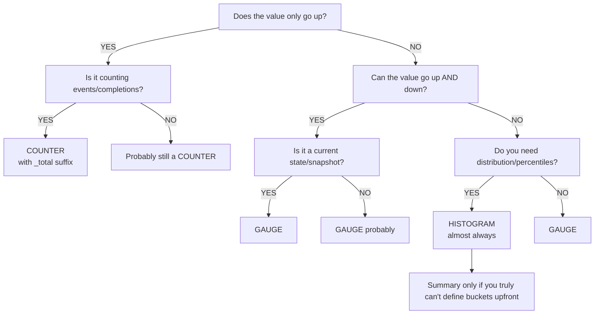

> **PCA Track** | Complexity: `[COMPLEX]` | Time: 45-55 min

## Prerequisites

Before starting this module:
- Prometheus Architecture and Basics
- PromQL Deep Dive and Query Fundamentals
- Observability Instrumentation Principles
- Basic Go, Python, or Java knowledge for client library examples

---

## What You'll Be Able to Do

After completing this module, you will be able to:

1. **Design** a resilient metric strategy by selecting appropriate Prometheus metric types (Counter, Gauge, Histogram) for diverse application workloads.
2. **Implement** best-practice instrumentation in microservices using standard client libraries, preventing label cardinality explosions.
3. **Diagnose** alert fatigue and system noise by evaluating Alertmanager routing trees and inhibition rules.
4. **Compare** and evaluate metric aggregation techniques across distributed architectures to enforce Service Level Objectives (SLOs).

---

## Why This Module Matters

In 2013, Target Corporation suffered a catastrophic data breach that cost the company over $162 million and compromised 40 million credit card accounts. The tragedy? Target's security software had successfully detected the malware and generated critical alerts. However, the security team had been completely overwhelmed by "alert fatigue"—a barrage of daily false positives and minor warnings. Because all alerts looked the same and fired constantly, the critical warnings were ignored until it was too late. 

While that was a security incident, the exact same principle applies to system observability. Instrumentation and alerting are the foundation of site reliability. Bad instrumentation creates metrics nobody can use, or worse, metrics that lie. Bad alerting creates noise that trains your engineering teams to ignore pages.

Consider a large ride-sharing platform that added a custom Prometheus metric to track database latency, proudly naming it `db_query_duration_milliseconds`. Months later, an engineer attempted to combine it with API latency to build a comprehensive Service Level Objective (SLO) dashboard:

```promql
histogram_quantile(0.99,
  sum by (le)(rate(http_request_duration_seconds_bucket[5m]))
)
+
histogram_quantile(0.99,
  sum by (le)(rate(db_query_duration_milliseconds_bucket[5m]))
)
```

The resulting P99 total latency graph spiked to 3,000.2 seconds. It took an agonizing war room session to realize that adding 0.2 seconds to 3,000 milliseconds mathematically works, but semantically creates garbage. Fixing this single naming convention violation required a massive migration across hundreds of microservices.

This module teaches you how to avoid these catastrophic missteps. You will learn to architect precise instrumentation, enforce naming standards, and configure surgical alerts that page humans only when absolutely necessary.

---

## Did You Know?

- **The `node_exporter` project exposes over 1,000 unique hardware and OS metrics** on a typical Linux system out of the box, making it the most ubiquitous exporter in the Prometheus ecosystem.
- **Prometheus handles massive scale:** a single optimized Prometheus server instance can reliably ingest up to 1,000,000 metric samples per second.
- **Target Corporation's 2013 breach, costing $162 million**, was severely exacerbated by alert fatigue; critical warnings were buried under thousands of unactionable notifications.
- **The `_total` suffix on counters was originally optional** in early Prometheus days, but became a strict mandatory requirement when the OpenMetrics standard was finalized.

---

> *Authority Context Hedge*: According to the current authoritative fact ledger, some specific Prometheus client implementations (like the exact behavior of `_info` metrics) and the precise UI workflows for Alertmanager silencing lack direct verification mapping. We present standard open-source Prometheus community practices here, but always verify against your organization's specific Kubernetes deployment (ensure you use Kubernetes 1.35+) and observability stack.

---

## The Four Core Metric Types

### Counter

A counter is a cumulative metric that represents a single monotonically increasing counter whose value can only increase or be reset to zero on restart.

```text
COUNTER: Monotonically increasing value
──────────────────────────────────────────────────────────────

Value over time:
  0 → 1 → 5 → 12 → 30 → 0 → 3 → 15 → 28
                          ↑
                     restart/reset

USE WHEN:
  ✓ Counting events (requests, errors, bytes sent)
  ✓ Counting completions (jobs finished, items processed)
  ✓ Anything that only goes up during normal operation

DON'T USE WHEN:
  ✗ Value can decrease (temperature, queue size)
  ✗ Value represents current state (active connections)

ALWAYS QUERY WITH rate() or increase():
  rate(http_requests_total[5m])      ← per-second rate
  increase(http_requests_total[1h])  ← total in last hour
```

### The Gauge Type

A gauge is a metric that represents a single numerical value that can arbitrarily go up and down.

```text
GAUGE: Current value that can increase or decrease
──────────────────────────────────────────────────────────────

Value over time:
  42 → 38 → 55 → 71 → 63 → 48 → 52

USE WHEN:
  ✓ Current state (temperature, queue depth, active connections)
  ✓ Snapshots (memory usage, disk space, goroutine count)
  ✓ Values that go up AND down

DON'T USE WHEN:
  ✗ Counting events (use Counter)
  ✗ Measuring distributions (use Histogram)

QUERY DIRECTLY (no rate needed):
  node_memory_MemAvailable_bytes     ← current available memory
  kube_deployment_spec_replicas      ← desired replica count
```

### Histogram

A histogram samples observations (usually things like request durations or response sizes) and counts them in configurable buckets. It also provides a sum of all observed values.

```text
HISTOGRAM: Distribution of values in buckets
──────────────────────────────────────────────────────────────

Generates 3 types of series:
  metric_bucket{le="0.1"}   = 24054    ← cumulative count ≤ 0.1s
  metric_bucket{le="0.5"}   = 129389   ← cumulative count ≤ 0.5s
  metric_bucket{le="+Inf"}  = 144927   ← total count (all observations)
  metric_sum                 = 53423.4  ← sum of all observed values
  metric_count               = 144927   ← total number of observations

USE WHEN:
  ✓ Request latency (the primary use case)
  ✓ Response sizes
  ✓ Any distribution where you need percentiles
  ✓ SLO calculations (bucket at your SLO target)

ADVANTAGES:
  ✓ Aggregatable across instances (can sum buckets)
  ✓ Can calculate any percentile after the fact
  ✓ Can compute average (sum / count)

TRADE-OFFS:
  ✗ Fixed bucket boundaries chosen at instrumentation time
  ✗ Each bucket is a separate time series (cardinality cost)
  ✗ Percentile accuracy depends on bucket granularity
```

### Summary

Similar to a histogram, a summary samples observations. While it also provides a total count of observations and a sum of all observed values, it calculates configurable quantiles over a sliding time window.

```text
SUMMARY: Client-computed quantiles
──────────────────────────────────────────────────────────────

Generates series like:
  metric{quantile="0.5"}   = 0.042    ← median
  metric{quantile="0.9"}   = 0.087    ← P90
  metric{quantile="0.99"}  = 0.235    ← P99
  metric_sum                = 53423.4  ← sum of all observed values
  metric_count              = 144927   ← total number of observations

USE WHEN:
  ✓ You need exact quantiles from a single instance
  ✓ You can't choose histogram bucket boundaries upfront
  ✓ Streaming quantile algorithms are acceptable

DON'T USE WHEN (most of the time):
  ✗ You need to aggregate across instances
     (cannot add quantiles meaningfully!)
  ✗ You need flexible percentile calculation at query time
  ✗ You need SLO calculations

PREFER HISTOGRAMS. Summaries exist for legacy reasons.
```

> **Stop and think**: If you want to measure the number of active background workers processing a batch job, which metric type must you use? Could it be a Counter? Why or why not? (Hint: background workers can finish their tasks and spin down, reducing the count).

### Decision Framework: Which Type?

```text
CHOOSING A METRIC TYPE
──────────────────────────────────────────────────────────────

Does the value only go up?
├── YES → Is it counting events/completions?
│         ├── YES → COUNTER (with _total suffix)
│         └── NO  → Probably still a COUNTER
└── NO  → Can the value go up AND down?
          ├── YES → Is it a current state/snapshot?
          │         ├── YES → GAUGE
          │         └── NO  → GAUGE (probably)
          └── Do you need distribution/percentiles?
                    ├── YES → HISTOGRAM (almost always)
                    │         └── Summary only if you truly
                    │             can't define buckets upfront
                    └── NO  → GAUGE
```

**Logical Flow Visualization:**


---

## Client Library Instrumentation

Instrumentation requires modifying your application code to expose metrics on an HTTP endpoint (usually `/metrics`). 

### Go (Reference Implementation)

```go
package main

import (
    "net/http"
    "time"

    "github.com/prometheus/client_golang/prometheus"
    "github.com/prometheus/client_golang/prometheus/promauto"
    "github.com/prometheus/client_golang/prometheus/promhttp"
)

var (
    // Counter: total HTTP requests
    httpRequestsTotal = promauto.NewCounterVec(
        prometheus.CounterOpts{
            Name: "myapp_http_requests_total",
            Help: "Total number of HTTP requests.",
        },
        []string{"method", "status", "path"},
    )

    // Histogram: request latency
    httpRequestDuration = promauto.NewHistogramVec(
        prometheus.HistogramOpts{
            Name:    "myapp_http_request_duration_seconds",
            Help:    "HTTP request latency in seconds.",
            Buckets: []float64{.005, .01, .025, .05, .1, .25, .5, 1, 2.5, 5},
        },
        []string{"method", "path"},
    )

    // Gauge: active connections
    activeConnections = promauto.NewGauge(
        prometheus.GaugeOpts{
            Name: "myapp_active_connections",
            Help: "Number of currently active connections.",
        },
    )
)

func handler(w http.ResponseWriter, r *http.Request) {
    start := time.Now()
    activeConnections.Inc()
    defer activeConnections.Dec()

    // ... handle request ...
    w.WriteHeader(http.StatusOK)

    duration := time.Since(start).Seconds()
    httpRequestsTotal.WithLabelValues(r.Method, "200", r.URL.Path).Inc()
    httpRequestDuration.WithLabelValues(r.Method, r.URL.Path).Observe(duration)
}

func main() {
    http.HandleFunc("/", handler)
    http.Handle("/metrics", promhttp.Handler())
    http.ListenAndServe(":8080", nil)
}
```

### Python

```python
from prometheus_client import Counter, Histogram, Gauge, start_http_server
import time

# Counter: total HTTP requests
REQUEST_COUNT = Counter(
    'myapp_http_requests_total',
    'Total number of HTTP requests.',
    ['method', 'status', 'path']
)

# Histogram: request latency
REQUEST_LATENCY = Histogram(
    'myapp_http_request_duration_seconds',
    'HTTP request latency in seconds.',
    ['method', 'path'],
    buckets=[.005, .01, .025, .05, .1, .25, .5, 1, 2.5, 5]
)

# Gauge: active connections
ACTIVE_CONNECTIONS = Gauge(
    'myapp_active_connections',
    'Number of currently active connections.'
)

def handle_request(method, path):
    ACTIVE_CONNECTIONS.inc()
    start = time.time()

    # ... handle request ...
    status = "200"

    duration = time.time() - start
    REQUEST_COUNT.labels(method=method, status=status, path=path).inc()
    REQUEST_LATENCY.labels(method=method, path=path).observe(duration)
    ACTIVE_CONNECTIONS.dec()

# Start metrics server on port 8000
start_http_server(8000)

# For Flask/FastAPI, use middleware instead:
# from prometheus_flask_instrumentator import Instrumentator
# Instrumentator().instrument(app).expose(app)
```

### Java (Micrometer / simpleclient)

```java
import io.prometheus.client.Counter;
import io.prometheus.client.Histogram;
import io.prometheus.client.Gauge;
import io.prometheus.client.exporter.HTTPServer;

public class MyApp {
    // Counter: total HTTP requests
    static final Counter requestsTotal = Counter.build()
        .name("myapp_http_requests_total")
        .help("Total number of HTTP requests.")
        .labelNames("method", "status", "path")
        .register();

    // Histogram: request latency
    static final Histogram requestDuration = Histogram.build()
        .name("myapp_http_request_duration_seconds")
        .help("HTTP request latency in seconds.")
        .labelNames("method", "path")
        .buckets(.005, .01, .025, .05, .1, .25, .5, 1, 2.5, 5)
        .register();

    // Gauge: active connections
    static final Gauge activeConnections = Gauge.build()
        .name("myapp_active_connections")
        .help("Number of currently active connections.")
        .register();

    public void handleRequest(String method, String path) {
        activeConnections.inc();
        Histogram.Timer timer = requestDuration
            .labels(method, path)
            .startTimer();

        try {
            // ... handle request ...
            requestsTotal.labels(method, "200", path).inc();
        } finally {
            timer.observeDuration();
            activeConnections.dec();
        }
    }

    public static void main(String[] args) throws Exception {
        // Expose metrics on port 8000
        HTTPServer server = new HTTPServer(8000);
    }
}
```

---

## Metric Naming Conventions

### The Rules

```text
PROMETHEUS NAMING CONVENTION