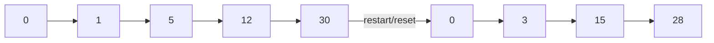
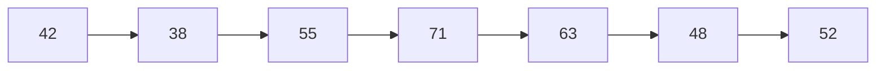
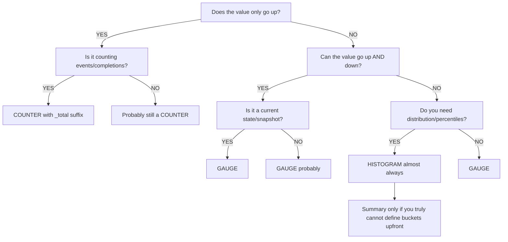
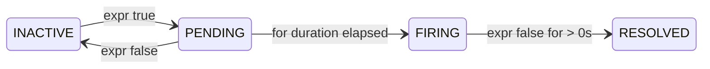

> **PCA Track** | Complexity: `[COMPLEX]` | Time: 45-55 min

## Prerequisites

Before starting this module, ensure you have completed the following prerequisites:
- [Prometheus Module](/platform/toolkits/observability-intelligence/observability/module-1.1-prometheus/) — Review the architecture, metric types, and basic alerting workflows.
- [PromQL Deep Dive](../module-1.1-promql-deep-dive/) — Understand the query fundamentals required to manipulate time-series data.
- [Observability 3.3: Instrumentation Principles](/platform/foundations/observability-theory/module-3.3-instrumentation-principles/) — Master the theoretical concepts behind effective instrumentation.
- Basic Go, Python, or Java knowledge — Required for understanding the client library implementation examples.

---

## What You'll Be Able to Do

After completing this comprehensive module, you will be able to:

1. **Design** a comprehensive instrumentation strategy using Prometheus client libraries, selecting the optimal metric types (counter, gauge, histogram, summary) for varying operational signals.
2. **Evaluate** label cardinality and enforce strict naming conventions to maintain high-performance metric storage and accurate PromQL aggregations.
3. **Diagnose** complex routing failures within Alertmanager configurations to ensure precise, team-specific incident notifications and minimize pager fatigue.
4. **Implement** recording rules and SLO-based alerting pipelines that accurately track error budgets over multi-window timeframes.

---

## Why This Module Matters

In 2018, a leading global e-commerce platform experienced a cascading failure during their peak holiday sale event. Their payment gateway began experiencing elevated latency, which correctly triggered an auto-scaling event. However, the alerting rules were catastrophically misconfigured. A critical alert designed to catch high error rates was missing a `for` duration. When a brief 2-second network blip occurred, the alert fired immediately, simultaneously paging 15 senior engineers. 

In the ensuing chaos, the engineers started debugging the wrong service. The database team had recently added a custom Prometheus metric to track query latency. They were incredibly proud of it and named it `db_query_duration_milliseconds`. It worked perfectly in their local development environments. However, the infrastructure team had subsequently tried to create a unified SLO dashboard combining API latency (measured in seconds using `http_request_duration_seconds`) with this database latency. Their query looked simple and logical:

```promql
histogram_quantile(0.99,
  sum by (le)(rate(http_request_duration_seconds_bucket[5m]))
)
+
histogram_quantile(0.99,
  sum by (le)(rate(db_query_duration_milliseconds_bucket[5m]))
)
```

During the incident, the dashboard's P99 total latency showed an impossible **3,000.2 seconds**. It took 45 minutes of complete confusion before a site reliability engineer realized the fundamental error: one metric was measured in seconds, and the other in milliseconds. The PromQL query was mathematically adding 0.2 seconds of API latency to 3,000 milliseconds of database latency. The mathematical result was technically correct but semantically disastrous. Because the dashboard indicated the payment processor was completely unresponsive, the team aggressively failed over to a cold-standby datacenter. The backup datacenter could not handle the instantaneous surge of cold-start traffic and completely collapsed. The resulting outage lasted four hours and cost the company an estimated $12 million in lost transaction revenue. 

This module matters because instrumentation and alerting form the central nervous system of your Kubernetes clusters. Writing code that simply compiles and executes is insufficient; you must write code that can be safely operated at scale. The Prometheus naming convention exists for exactly this reason: always use base units. By mastering Prometheus client libraries, metric types, and Alertmanager routing, you ensure that when systems fail, your team receives precise, actionable, and mathematically accurate signals.

---

## Did You Know?

- **Prometheus client libraries exist for 15+ languages** — Go, Python, Java, Ruby, Rust, .NET, Erlang, Haskell, and more. The Go library is the original reference implementation, and all other languages strictly follow its established behavioral patterns.
- **Alertmanager was designed around the concept of "routing trees"** — This architecture was heavily inspired by early email routing models. The tree structure allows you to route different alert severities to different engineering teams using a single, cohesive configuration file.
- **The node_exporter binary exposes over 1,200 metrics** — On a typical Linux system, it tracks deep metrics across CPU, memory, disk, network, and filesystem states, making it the most universally deployed exporter in the Kubernetes ecosystem.
- **The `_total` suffix on counters was originally optional** — It officially became mandatory with the adoption of the OpenMetrics standard. While modern Prometheus versions (v2.x) will sometimes append it automatically if missing, explicitly including it in your instrumentation code is a strict best practice.

---

## Core Content 1: The Four Metric Types

Prometheus defines four core metric types. Choosing the correct type is the most critical decision you will make during instrumentation.

### Counter

A counter is a cumulative metric that only monotonically increases. It never decreases, and it only resets to zero when the application process restarts. 



**Use When:**
- Counting distinct events (HTTP requests, error payloads, bytes transmitted).
- Counting task completions (background jobs finished, queue items processed).
- Tracking anything that only goes up during normal, healthy operation.

**Do Not Use When:**
- The value can naturally decrease (room temperature, pending queue size).
- The value represents a current state snapshot (active web socket connections).

Always query a counter using the `rate()` or `increase()` functions. These functions are mathematically designed to detect the zero-resets and seamlessly compensate for them.

```promql
  rate(http_requests_total[5m])      # per-second rate over 5 minutes
  increase(http_requests_total[1h])  # total absolute increase in the last hour
```

### Gauge

A gauge is a snapshot metric that represents a current value. It can freely increase or decrease over time. Think of it like the speedometer in your car.



**Use When:**
- Measuring current operational state (CPU temperature, queue depth, active database connections).
- Taking resource snapshots (memory utilization, disk space consumed, active Go goroutines).
- Tracking any value that naturally fluctuates up and down.

**Do Not Use When:**
- Counting occurrences of events (use a Counter instead).
- Measuring the statistical distribution of events (use a Histogram instead).

You query gauges directly. You never wrap them in a `rate()` function because their absolute value is what matters.

```promql
  node_memory_MemAvailable_bytes     # current available memory
  kube_deployment_spec_replicas      # desired replica count
```

> **Stop and think**: If you are measuring the total number of bytes transferred over a network interface, should you use a Gauge or a Counter? How would a pod restart affect your PromQL `rate()` queries if you chose the wrong metric type?

### Histogram

A histogram samples observations (like request latencies) and categorizes them into configurable numerical buckets. This is essential for calculating Service Level Objectives (SLOs).

```text
Generates 3 types of series per histogram:
  metric_bucket{le="0.1"}   = 24054    # cumulative count ≤ 0.1s
  metric_bucket{le="0.5"}   = 129389   # cumulative count ≤ 0.5s
  metric_bucket{le="+Inf"}  = 144927   # total count (all observations)
  metric_sum                 = 53423.4  # sum of all observed values
  metric_count               = 144927   # total number of observations
```

**Advantages:**
- You can aggregate Histograms across multiple instances by summing the buckets.
- You can dynamically calculate any percentile (P95, P99) at query time.
- You can compute the exact mathematical average by dividing `metric_sum` by `metric_count`.

**Trade-offs:**
- Bucket boundaries are statically defined in the application code.
- Each bucket generates a separate time series, heavily impacting label cardinality.

### Summary

A summary also measures distributions but calculates streaming quantiles directly on the client side.

```text
Generates series like:
  metric{quantile="0.5"}   = 0.042    # median
  metric{quantile="0.9"}   = 0.087    # P90
  metric{quantile="0.99"}  = 0.235    # P99
  metric_sum                = 53423.4  # sum of all observed values
  metric_count              = 144927   # total number of observations
```

You should strongly prefer Histograms. Summaries cannot be mathematically aggregated across multiple instances. Adding the P99 latency of Pod A to the P99 latency of Pod B results in statistical garbage.

### Decision Framework: Which Type?

Follow this structured path to select your metric type:



---

## Core Content 2: Client Library Instrumentation

Implementing Prometheus metrics requires integrating official client libraries into your application code. Below are reference implementations for Go, Python, and Java.

### Go (Reference Implementation)

The Go client library defines the standard that all other languages follow. Notice how we use `promauto` to automatically register the metrics with the default global registry.

```go
package main

import (
    "net/http"
    "time"

    "github.com/prometheus/client_golang/prometheus"
    "github.com/prometheus/client_golang/prometheus/promauto"
    "github.com/prometheus/client_golang/prometheus/promhttp"
)

var (
    // Counter: total HTTP requests
    httpRequestsTotal = promauto.NewCounterVec(
        prometheus.CounterOpts{
            Name: "myapp_http_requests_total",
            Help: "Total number of HTTP requests.",
        },
        []string{"method", "status", "path"},
    )

    // Histogram: request latency
    httpRequestDuration = promauto.NewHistogramVec(
        prometheus.HistogramOpts{
            Name:    "myapp_http_request_duration_seconds",
            Help:    "HTTP request latency in seconds.",
            Buckets: []float64{.005, .01, .025, .05, .1, .25, .5, 1, 2.5, 5},
        },
        []string{"method", "path"},
    )

    // Gauge: active connections
    activeConnections = promauto.NewGauge(
        prometheus.GaugeOpts{
            Name: "myapp_active_connections",
            Help: "Number of currently active connections.",
        },
    )
)

func handler(w http.ResponseWriter, r *http.Request) {
    start := time.Now()
    activeConnections.Inc()
    defer activeConnections.Dec()

    // ... handle request ...
    w.WriteHeader(http.StatusOK)

    duration := time.Since(start).Seconds()
    httpRequestsTotal.WithLabelValues(r.Method, "200", r.URL.Path).Inc()
    httpRequestDuration.WithLabelValues(r.Method, r.URL.Path).Observe(duration)
}

func main() {
    http.HandleFunc("/", handler)
    http.Handle("/metrics", promhttp.Handler())
    http.ListenAndServe(":8080", nil)
}
```

### Python

The Python client offers a clean, declarative syntax. When running Python web applications (like Flask or FastAPI) under a multi-process server like Gunicorn, special multi-process configurations are required to ensure metrics are shared across worker threads.

```python
from prometheus_client import Counter, Histogram, Gauge, start_http_server
import time

# Counter: total HTTP requests
REQUEST_COUNT = Counter(
    'myapp_http_requests_total',
    'Total number of HTTP requests.',
    ['method', 'status', 'path']
)

# Histogram: request latency
REQUEST_LATENCY = Histogram(
    'myapp_http_request_duration_seconds',
    'HTTP request latency in seconds.',
    ['method', 'path'],
    buckets=[.005, .01, .025, .05, .1, .25, .5, 1, 2.5, 5]
)

# Gauge: active connections
ACTIVE_CONNECTIONS = Gauge(
    'myapp_active_connections',
    'Number of currently active connections.'
)

def handle_request(method, path):
    ACTIVE_CONNECTIONS.inc()
    start = time.time()

    # ... handle request ...
    status = "200"

    duration = time.time() - start
    REQUEST_COUNT.labels(method=method, status=status, path=path).inc()
    REQUEST_LATENCY.labels(method=method, path=path).observe(duration)
    ACTIVE_CONNECTIONS.dec()

# Start metrics server on port 8000
start_http_server(8000)

# For Flask/FastAPI, use middleware instead:
# from prometheus_flask_instrumentator import Instrumentator
# Instrumentator().instrument(app).expose(app)
```

### Java (Micrometer / simpleclient)

In the Java ecosystem, Micrometer serves as a vendor-neutral facade (similar to SLF4J for logging) that easily bridges into the Prometheus format.

```java
import io.prometheus.client.Counter;
import io.prometheus.client.Histogram;
import io.prometheus.client.Gauge;
import io.prometheus.client.exporter.HTTPServer;

public class MyApp {
    // Counter: total HTTP requests
    static final Counter requestsTotal = Counter.build()
        .name("myapp_http_requests_total")
        .help("Total number of HTTP requests.")
        .labelNames("method", "status", "path")
        .register();

    // Histogram: request latency
    static final Histogram requestDuration = Histogram.build()
        .name("myapp_http_request_duration_seconds")
        .help("HTTP request latency in seconds.")
        .labelNames("method", "path")
        .buckets(.005, .01, .025, .05, .1, .25, .5, 1, 2.5, 5)
        .register();

    // Gauge: active connections
    static final Gauge activeConnections = Gauge.build()
        .name("myapp_active_connections")
        .help("Number of currently active connections.")
        .register();

    public void handleRequest(String method, String path) {
        activeConnections.inc();
        Histogram.Timer timer = requestDuration
            .labels(method, path)
            .startTimer();

        try {
            // ... handle request ...
            requestsTotal.labels(method, "200", path).inc();
        } finally {
            timer.observeDuration();
            activeConnections.dec();
        }
    }

    public static void main(String[] args) throws Exception {
        // Expose metrics on port 8000
        HTTPServer server = new HTTPServer(8000);
    }
}
```

---

## Core Content 3: Metric Naming Conventions

Failure to adhere to standard naming conventions will severely compromise your ability to write reliable PromQL queries and build shareable Grafana dashboards.

### The Rules

```text
PROMETHEUS NAMING CONVENTION
──────────────────────────────────────────────────────────────

Format: <namespace>_<name>_<unit>_<suffix>

namespace  = application or library name (myapp, http, node)
name       = what is being measured (requests, duration, size)
unit       = base unit (seconds, bytes, meters — NEVER milli/kilo)
suffix     = metric type indicator (_total for counters, _info for info)

GOOD:
  myapp_http_requests_total              ← counter, counts requests
  myapp_http_request_duration_seconds    ← histogram, duration in seconds
  myapp_http_response_size_bytes         ← histogram, size in bytes
  node_memory_MemAvailable_bytes         ← gauge, memory in bytes
  process_cpu_seconds_total              ← counter, CPU time in seconds

BAD:
  myapp_requests                         ← missing unit, missing _total
  http_request_duration_milliseconds     ← use seconds, not milliseconds
  db_query_time_ms                       ← abbreviation, non-base unit
  MyApp_HTTP_Requests                    ← camelCase/PascalCase, use snake_case
  request_latency                        ← vague, missing namespace and unit
```

### Unit Rules Table

You must always serialize metrics in their lowest base mathematical unit.

| Measurement | Base Unit | Suffix | Example |
|-------------|-----------|--------|---------|
| Time/Duration | seconds | `_seconds` | `http_request_duration_seconds` |
| Data size | bytes | `_bytes` | `http_response_size_bytes` |
| Temperature | celsius | `_celsius` | `room_temperature_celsius` |
| Voltage | volts | `_volts` | `power_supply_volts` |
| Energy | joules | `_joules` | `cpu_energy_joules` |
| Weight | grams | `_grams` | `package_weight_grams` |
| Ratios | ratio | `_ratio` | `cache_hit_ratio` |
| Percentages | ratio (0-1) | `_ratio` | Use 0-1, not 0-100 |

### Suffix Rules Table

| Type | Suffix | Example |
|------|--------|---------|
| Counter | `_total` | `http_requests_total` |
| Counter (created timestamp) | `_created` | `http_requests_created` |
| Histogram | `_bucket`, `_sum`, `_count` | `http_request_duration_seconds_bucket` |
| Summary | `_sum`, `_count` | `rpc_duration_seconds_sum` |
| Info metric | `_info` | `build_info{version="1.2.3"}` |
| Gauge | (no suffix) | `node_memory_MemAvailable_bytes` |

### Label Cardinality Best Practices

High cardinality is the most frequent cause of Prometheus cluster failures. Every unique combination of labels generates a distinct time-series array in memory. If you use a `user_id` label across one million users, Prometheus must maintain one million discrete memory structures.

```text
LABEL DO'S AND DON'TS
──────────────────────────────────────────────────────────────

DO:
  ✓ Use labels for dimensions you'll filter/aggregate by
  ✓ Keep cardinality bounded (status codes: ~5 values)
  ✓ Use consistent names: "method" not "http_method" in one
    place and "request_method" in another

DON'T:
  ✗ user_id (millions of values = millions of series)
  ✗ request_id (unbounded, every request creates a series)
  ✗ email (PII + unbounded cardinality)
  ✗ url with path parameters (/users/12345 = unique per user)
  ✗ error_message (free-form text = unbounded)
  ✗ timestamp as label (infinite cardinality)

RULE OF THUMB:
  If a label can have more than ~100 unique values,
  it probably shouldn't be a label.
  Each unique label combination = one time series in memory.
```

---

## Core Content 4: Exporters

Exporters act as translator proxies. They extract metrics from third-party systems that do not natively support the Prometheus `/metrics` format and translate them into something Prometheus can ingest.

### node_exporter (Hardware & OS Metrics)

`node_exporter` is essential for operating system-level visibility. It is typically deployed as a DaemonSet to ensure one instance runs on every Kubernetes worker node.

```bash
# Install via binary
wget https://github.com/prometheus/node_exporter/releases/download/v1.8.1/node_exporter-1.8.1.linux-amd64.tar.gz
tar xvfz node_exporter-*.tar.gz
./node_exporter

# Or via Kubernetes DaemonSet (kube-prometheus-stack includes it)
helm install monitoring prometheus-community/kube-prometheus-stack
```

Here are standard PromQL queries utilizing `node_exporter` data:

```promql
# CPU utilization
1 - avg by (instance)(rate(node_cpu_seconds_total{mode="idle"}[5m]))

# Memory utilization
1 - (node_memory_MemAvailable_bytes / node_memory_MemTotal_bytes)

# Disk space usage
1 - (node_filesystem_avail_bytes{mountpoint="/"} / node_filesystem_size_bytes{mountpoint="/"})

# Network throughput
rate(node_network_receive_bytes_total{device="eth0"}[5m])
rate(node_network_transmit_bytes_total{device="eth0"}[5m])

# Disk I/O
rate(node_disk_read_bytes_total[5m])
rate(node_disk_written_bytes_total[5m])
```

### blackbox_exporter (Probing)

`blackbox_exporter` probes endpoints over the network. It allows you to monitor external services or confirm your application is externally reachable via HTTP, DNS, or TCP.

```yaml
# blackbox-exporter config
modules:
  http_2xx:
    prober: http
    timeout: 5s
    http:
      valid_http_versions: ["HTTP/1.1", "HTTP/2.0"]
      valid_status_codes: [200]
      follow_redirects: true

  http_post_2xx:
    prober: http
    http:
      method: POST

  tcp_connect:
    prober: tcp
    timeout: 5s

  dns_lookup:
    prober: dns
    dns:
      query_name: "kubernetes.default.svc.cluster.local"
      query_type: "A"

  icmp_ping:
    prober: icmp
    timeout: 5s
```

Below is the corresponding `scrape_config` to direct Prometheus to use the blackbox exporter. Notice the complex relabeling configuration required to pass the target URLs.

```yaml
scrape_configs:
  - job_name: 'blackbox-http'
    metrics_path: /probe
    params:
      module: [http_2xx]
    static_configs:
      - targets:
        - https://example.com
        - https://api.myservice.com/health
    relabel_configs:
      # Pass the target URL as a parameter
      - source_labels: [__address__]
        target_label: __param_target
      # Store original target as a label
      - source_labels: [__param_target]
        target_label: instance
      # Point to the blackbox exporter
      - target_label: __address__
        replacement: blackbox-exporter:9115
```

Here are standard queries derived from the probe results:

```promql
# Is the endpoint up?
probe_success{job="blackbox-http"}

# SSL certificate expiry (days)
(probe_ssl_earliest_cert_expiry - time()) / 86400

# HTTP response time
probe_http_duration_seconds

# DNS lookup time
probe_dns_lookup_time_seconds
```

### Other Common Exporters

| Exporter | Purpose | Key Metrics |
|----------|---------|-------------|
| **mysqld_exporter** | MySQL databases | Queries/sec, connections, replication lag |
| **postgres_exporter** | PostgreSQL databases | Active connections, transaction rate, table sizes |
| **redis_exporter** | Redis | Commands/sec, memory usage, connected clients |
| **kafka_exporter** | Apache Kafka | Consumer lag, topic offsets, partition count |
| **nginx_exporter** | Nginx | Active connections, requests/sec, response codes |
| **kube-state-metrics** | Kubernetes objects | Pod status, deployment replicas, node conditions |
| **cadvisor** | Containers | CPU, memory, network per container |

---

## Core Content 5: Alertmanager Deep Dive

Alertmanager handles alerts generated by Prometheus. It deduplicates, groups, and selectively routes alerts to various external receivers like Slack, PagerDuty, or email.

### Alert Lifecycle

Understanding the exact state transitions of an alert expression is critical to writing rules that do not cause false positives.



- **INACTIVE:** The alert expression evaluates to false. Normal operation.
- **PENDING:** The alert expression evaluates to true, but the mandated `for` duration has not yet fully elapsed.
- **FIRING:** The expression has remained true for the entire `for` duration. The alert is successfully routed.
- **RESOLVED:** The expression has returned to false. Alertmanager dispatches a final clearance notification.

> **Pause and predict**: Look at the Alertmanager routing tree diagram below. If an alert with `severity="warning"` and `team="database"` arrives, which receiver will handle it? Will it go to the database team's PagerDuty, or somewhere else?

### Alerting Rules Configuration

The `for` keyword is your primary defense against flapping alerts. Always include rich annotations.

```yaml
groups:
  - name: application-alerts
    rules:
      # HIGH SEVERITY: Service completely down
      - alert: ServiceDown
        expr: up == 0
        for: 1m
        labels:
          severity: critical
          team: platform
        annotations:
          summary: "{{ $labels.job }} is down"
          description: "{{ $labels.instance }} has been unreachable for >1 minute."
          runbook_url: "https://wiki.example.com/runbooks/service-down"

      # HIGH SEVERITY: Error rate spike
      - alert: HighErrorRate
        expr: |
          sum by (service)(rate(http_requests_total{status=~"5.."}[5m]))
          /
          sum by (service)(rate(http_requests_total[5m]))
          > 0.05
        for: 5m
        labels:
          severity: critical
        annotations:
          summary: "High error rate on {{ $labels.service }}"
          description: "Error rate is {{ $value | humanizePercentage }}."

      # MEDIUM SEVERITY: Slow responses
      - alert: HighLatency
        expr: |
          histogram_quantile(0.99,
            sum by (le, service)(rate(http_request_duration_seconds_bucket[5m]))
          ) > 2
        for: 10m
        labels:
          severity: warning
        annotations:
          summary: "High P99 latency on {{ $labels.service }}"
          description: "P99 latency is {{ $value | humanizeDuration }}."

      # LOW SEVERITY: Certificate expiring
      - alert: SSLCertExpiringSoon
        expr: (probe_ssl_earliest_cert_expiry - time()) / 86400 < 30
        for: 1h
        labels:
          severity: warning
        annotations:
          summary: "SSL cert for {{ $labels.instance }} expires in {{ $value | humanize }} days"

      # CAPACITY: Disk filling up
      - alert: DiskSpaceLow
        expr: |
          (node_filesystem_avail_bytes{mountpoint="/"} / node_filesystem_size_bytes{mountpoint="/"})
          < 0.15
        for: 15m
        labels:
          severity: warning
        annotations:
          summary: "Disk space below 15% on {{ $labels.instance }}"

      # SLO-BASED: Error budget burn rate
      - alert: ErrorBudgetBurnRate
        expr: |
          job:http_error_ratio:rate5m > (14.4 * 0.001)
        for: 5m
        labels:
          severity: critical
        annotations:
          summary: "Error budget burning too fast for {{ $labels.job }}"
          description: "At current rate, error budget will be exhausted in <1 hour."
```

### Alertmanager Configuration

The global configuration defines your integration secrets and builds out the foundational routing logic.

```yaml
# alertmanager.yml — complete production example
global:
  resolve_timeout: 5m
  smtp_smarthost: 'smtp.example.com:587'
  smtp_from: 'alertmanager@example.com'
  smtp_auth_username: 'alertmanager'
  smtp_auth_password: '<secret>'
  slack_api_url: 'https://hooks.slack.com/services/T00/B00/xxxx'
  pagerduty_url: 'https://events.pagerduty.com/v2/enqueue'

# TEMPLATES: customize notification format
templates:
  - '/etc/alertmanager/templates/*.tmpl'

# ROUTING TREE: determines where alerts go
route:
  # Default receiver for unmatched alerts
  receiver: 'slack-default'

  # Group alerts by these labels (reduces noise)
  group_by: ['alertname', 'service']

  # Wait before sending first notification for a group
  group_wait: 30s

  # Wait before sending updates to an existing group
  group_interval: 5m

  # Wait before re-sending a firing alert
  repeat_interval: 4h

  # Child routes (evaluated top-to-bottom, first match wins)
  routes:
    # Critical alerts → PagerDuty (wake someone up)
    - match:
        severity: critical
      receiver: 'pagerduty-critical'
      repeat_interval: 1h
      routes:
        # Database team owns DB alerts
        - match:
            team: database
          receiver: 'pagerduty-database'

    # Warning alerts → Slack channel
    - match:
        severity: warning
      receiver: 'slack-warnings'
      repeat_interval: 4h

    # Info alerts → email digest
    - match:
        severity: info
      receiver: 'email-digest'
      group_wait: 10m
      repeat_interval: 24h

    # Regex matching: any alert from staging
    - match_re:
        environment: staging|dev
      receiver: 'slack-staging'
      repeat_interval: 12h

# RECEIVERS: notification targets
receivers:
  - name: 'slack-default'
    slack_configs:
      - channel: '#alerts'
        send_resolved: true
        title: '{{ .Status | toUpper }}: {{ .CommonLabels.alertname }}'
        text: >-
          {{ range .Alerts }}
          *{{ .Labels.alertname }}* ({{ .Labels.severity }})
          {{ .Annotations.description }}
          {{ end }}

  - name: 'pagerduty-critical'
    pagerduty_configs:
      - routing_key: '<pagerduty-integration-key>'
        severity: critical
        description: '{{ .CommonLabels.alertname }}: {{ .CommonAnnotations.summary }}'

  - name: 'pagerduty-database'
    pagerduty_configs:
      - routing_key: '<database-team-key>'
        severity: critical

  - name: 'slack-warnings'
    slack_configs:
      - channel: '#alerts-warnings'
        send_resolved: true

  - name: 'slack-staging'
    slack_configs:
      - channel: '#alerts-staging'
        send_resolved: false

  - name: 'email-digest'
    email_configs:
      - to: 'team@example.com'
        send_resolved: false

# INHIBITION RULES: suppress dependent alerts
inhibit_rules:
  # If a critical alert fires, suppress warnings for the same service
  - source_match:
      severity: critical
    target_match:
      severity: warning
    equal: ['alertname', 'service']

  # If a node is down, suppress all pod alerts on that node
  - source_match:
      alertname: NodeDown
    target_match_re:
      alertname: Pod.*
    equal: ['node']

  # If cluster is unreachable, suppress everything
  - source_match:
      alertname: ClusterUnreachable
    target_match_re:
      alertname: .+
    equal: ['cluster']
```

### Routing Tree Visual

```mermaid
flowchart LR
    Incoming[Incoming Alert:<br/>alertname=HighErrorRate<br/>severity=critical<br/>team=api] --> Root[route root:<br/>receiver: slack-default]
    Root --> Match1{match:<br/>severity=critical}
    Match1 -->|MATCH!| PD_Crit[receiver: pagerduty-critical]
    PD_Crit --> Match1_1{match:<br/>team=database}
    Match1_1 -->|no match| PD_Crit_End[Result: Alert goes to pagerduty-critical<br/>first matching child route]
    Root --> Match2{match:<br/>severity=warning}
    Match2 --> SlackWarn[receiver: slack-warnings]
    Root --> Match3{match:<br/>severity=info}
    Match3 --> EmailDigest[receiver: email-digest]
    Root --> Match4{match_re:<br/>env=staging|dev}
    Match4 --> SlackStaging[receiver: slack-staging]
```

### Inhibition Rules Explained

Inhibition is critical for limiting incident noise. When a root-cause event occurs (like a node failure), you do not want to receive 50 separate pages for every pod that happened to be scheduled on that physical machine.

```text
INHIBITION: Suppressing dependent alerts
──────────────────────────────────────────────────────────────

Scenario: Node goes down → all pods on that node fail

WITHOUT inhibition:
  Alert: NodeDown (node-1)              ← root cause
  Alert: PodCrashLooping (pod-a)        ← symptom
  Alert: PodCrashLooping (pod-b)        ← symptom
  Alert: PodCrashLooping (pod-c)        ← symptom
  Alert: HighErrorRate (service-x)      ← symptom
  = 5 pages for one problem!

WITH inhibition:
  inhibit_rules:
    - source_match: {alertname: NodeDown}
      target_match_re: {alertname: "Pod.*|HighErrorRate"}
      equal: [node]

  Alert: NodeDown (node-1)              ← only this fires
  (all dependent alerts suppressed)
  = 1 page for one problem!
```

### Silences

Silences manually and temporarily mute routing evaluation for alerts that match specific label targets, which is mandatory during scheduled infrastructure maintenance.

```bash
# Create a silence via amtool CLI
amtool silence add \
  --alertmanager.url=http://localhost:9093 \
  --author="jane@example.com" \
  --comment="Planned database maintenance window" \
  --duration=2h \
  service="database" severity="warning"

# List active silences
amtool silence query --alertmanager.url=http://localhost:9093

# Expire (remove) a silence
amtool silence expire --alertmanager.url=http://localhost:9093 <silence-id>
```

---

## Core Content 6: Recording Rules for Alerting

Complex PromQL queries over large time horizons (e.g., a 7-day P99 Histogram calculation) will exhaust your Prometheus CPU or simply timeout. Recording rules allow you to pre-compute these expensive values in the background on a fixed interval, saving the results as entirely new, lightweight time series.

```yaml
groups:
  - name: recording_rules
    interval: 30s
    rules:
      # Pre-compute error ratio per service
      - record: service:http_error_ratio:rate5m
        expr: |
          sum by (service)(rate(http_requests_total{status=~"5.."}[5m]))
          /
          sum by (service)(rate(http_requests_total[5m]))

      # Pre-compute P99 latency per service
      - record: service:http_latency_p99:rate5m
        expr: |
          histogram_quantile(0.99,
            sum by (le, service)(rate(http_request_duration_seconds_bucket[5m]))
          )

      # Pre-compute CPU utilization per node
      - record: node:cpu_utilization:ratio_rate5m
        expr: |
          1 - avg by (node)(rate(node_cpu_seconds_total{mode="idle"}[5m]))

  - name: alerting_rules
    rules:
      # NOW alerting rules can use the pre-computed values
      - alert: HighErrorRate
        expr: service:http_error_ratio:rate5m > 0.05
        for: 5m
        labels:
          severity: critical
        annotations:
          summary: "Error rate {{ $value | humanizePercentage }} on {{ $labels.service }}"

      - alert: HighLatency
        expr: service:http_latency_p99:rate5m > 2
        for: 10m
        labels:
          severity: warning

      - alert: HighCPU
        expr: node:cpu_utilization:ratio_rate5m > 0.9
        for: 15m
        labels:
          severity: warning
```

---

## Common Mistakes

| Mistake | Problem | Solution |
|---------|---------|----------|
| Using milliseconds for duration | Unit mismatch with other metrics | Always use base units: `_seconds`, not `_milliseconds` |
| Counter without `_total` suffix | Violates OpenMetrics standard | Always append `_total` to counter names |
| High-cardinality labels (user_id) | Memory explosion, slow queries | Remove unbounded labels; aggregate at application level |
| Missing `Help` text on metrics | Hard to understand; fails lint checks | Always add descriptive Help strings |
| Alerting without `for` duration | Flapping alerts from transient spikes | Use `for: 5m` minimum for most alerts |
| No inhibition rules | Alert storms during major incidents | Suppress symptoms when root-cause alert fires |
| Silencing without comments | Nobody knows why alerts were muted | Always add author, comment, and expiry |
| Summary instead of Histogram | Cannot aggregate across instances | Use Histogram unless you have a specific reason not to |
| Missing runbook_url in annotations | On-call engineer has no guidance | Always link to a runbook explaining diagnosis/fix |
| Too many receivers | Alert fatigue, nobody reads channels | Consolidate: critical → page, warning → Slack, info → email |

---

## Quiz

<details>
<summary>1. What are the four Prometheus metric types? Give one real-world example for each.</summary>

**Answer**:

1. **Counter**: Monotonically increasing value. Resets on restart.
   - Example: `http_requests_total` — total HTTP requests served

2. **Gauge**: Value that can go up and down.
   - Example: `node_memory_MemAvailable_bytes` — currently available memory

3. **Histogram**: Observations bucketed by value, with cumulative counts.
   - Example: `http_request_duration_seconds` — request latency distribution

4. **Summary**: Client-computed streaming quantiles.
   - Example: `go_gc_duration_seconds` — garbage collection pause duration with pre-computed percentiles

Key distinction: Histograms are aggregatable across instances (sum buckets), Summaries are not (cannot add quantiles). Prefer Histograms in almost all cases.
</details>

<details>
<summary>2. Why does Prometheus use base units (seconds, bytes) instead of human-friendly units (milliseconds, megabytes)?</summary>

**Answer**:

Base units prevent unit mismatch errors when combining metrics. If one team uses `_milliseconds` and another uses `_seconds`, joining or adding these metrics produces nonsensical results.

Specific reasons:
- **Consistency**: All duration metrics are in seconds, so `rate(a_seconds[5m]) + rate(b_seconds[5m])` always works
- **PromQL functions**: `histogram_quantile()` returns values in the metric's unit — if metrics are in seconds, the result is in seconds
- **Grafana handles display**: Grafana can convert seconds to "2.5ms" or "1.3h" for human display. Store in base units, format at display time.
- **OpenMetrics standard**: Requires base units for interoperability across tools

The rule: **store in base units, display in human units**.
</details>

<details>
<summary>3. Explain the Alertmanager routing tree. How does Alertmanager decide which receiver gets an alert?</summary>

**Answer**:

The routing tree is a hierarchy of routes, each with label matchers and a receiver:

1. **Every alert enters at the root route** (the top-level `route:`)
2. **Child routes are evaluated top-to-bottom** — first matching child wins
3. **Matching uses `match` (exact) or `match_re` (regex)** on alert labels
4. **If no child matches**, the alert goes to the root route's receiver
5. **`continue: true`** on a route means "keep checking subsequent siblings even after matching"
6. **Child routes can have their own children** — nesting creates a tree

```mermaid
flowchart TD
    Root[route: receiver=default] --> Match1[match: severity=critical<br/>receiver=pagerduty]
    Match1 --> Match1_1[match: team=db<br/>receiver=pagerduty-db]
    Root --> Match2[match: severity=warning<br/>receiver=slack]
    Root --> Unmatched[(unmatched)<br/>receiver=default]
```

`group_by`, `group_wait`, `group_interval`, and `repeat_interval` control batching:
- `group_by`: Labels to group alerts by (reduces notification count)
- `group_wait`: How long to buffer before sending the first notification
- `group_interval`: Minimum time between updates to a group
- `repeat_interval`: How often to re-send a firing alert
</details>

<details>
<summary>4. What is the difference between inhibition and silencing in Alertmanager?</summary>

**Answer**:

**Inhibition** (automatic, rule-based):
- Suppresses target alerts when a source alert is firing
- Configured in `inhibit_rules` in alertmanager.yml
- Happens automatically — no human action needed
- Example: NodeDown inhibits all PodCrashLooping alerts on that node
- Purpose: Prevent alert storms from cascading failures

**Silencing** (manual, time-based):
- Temporarily mutes alerts matching specific label matchers
- Created via UI or `amtool` CLI
- Requires human action — someone decides to silence
- Has a defined expiry time
- Example: Silence all alerts for `service="database"` during planned maintenance
- Purpose: Suppress known noise during maintenance windows

Key difference: Inhibition is automatic and ongoing (fires whenever the source alert fires). Silencing is manual and temporary (created for a specific time window).
</details>

<details>
<summary>5. You're instrumenting a new microservice. It has an HTTP API and a background job queue. What metrics would you add, with what types and names?</summary>

**Answer**:

**HTTP API metrics:**
```text
myservice_http_requests_total{method, status, path}        — Counter
myservice_http_request_duration_seconds{method, path}      — Histogram
myservice_http_request_size_bytes{method, path}            — Histogram
myservice_http_response_size_bytes{method, path}           — Histogram
myservice_http_active_requests{method}                     — Gauge
```

**Background job metrics:**
```text
myservice_jobs_processed_total{queue, status}              — Counter
myservice_job_duration_seconds{queue}                      — Histogram
myservice_jobs_queued{queue}                               — Gauge (current queue depth)
myservice_job_last_success_timestamp_seconds{queue}        — Gauge
```

**Runtime metrics (auto-exposed by most client libraries):**
```text
process_cpu_seconds_total                                  — Counter
process_resident_memory_bytes                              — Gauge
go_goroutines (if Go)                                      — Gauge
```

Design decisions:
- `path` label should use route patterns (`/users/{id}`), not actual paths (`/users/12345`) to avoid cardinality explosion
- Histogram buckets for HTTP: `[.005, .01, .025, .05, .1, .25, .5, 1, 2.5, 5]`
- Histogram buckets for jobs: `[.1, .5, 1, 5, 10, 30, 60, 300]` (jobs are typically slower)
</details>

<details>
<summary>6. What is the purpose of the `for` field in an alerting rule? What happens if you omit it?</summary>

**Answer**:

The `for` field specifies how long the alert expression must be continuously true before the alert transitions from **pending** to **firing**.

```yaml
- alert: HighErrorRate
  expr: error_rate > 0.05
  for: 5m        # Must be true for 5 minutes before firing
```

**Without `for`** (or `for: 0s`):
- Alert fires immediately when expression is true
- Next evaluation cycle where expression is false → alert resolves
- Causes **alert flapping**: brief spikes trigger and resolve alerts rapidly
- On-call engineers get paged for transient conditions that self-resolve

**With `for: 5m`**:
- Brief spikes (< 5 min) are ignored
- Only sustained problems trigger notifications
- Reduces false positives significantly

**Guidelines**:
- `for: 1m` — Critical infrastructure alerts (ServiceDown)
- `for: 5m` — Error rate and latency alerts
- `for: 15m` — Capacity and resource alerts
- `for: 1h` — Slow-burn problems (certificate expiry, disk growth trends)
</details>

<details>
<summary>7. Scenario: You are tasked with instrumenting a newly developed payment processing microservice. The service executes transactions that can take anywhere from 50ms to 8 seconds to complete. You need to alert if the 99th percentile (P99) transaction time exceeds 3 seconds over a 5-minute window. Which Prometheus metric type must you implement, and how would you configure it to ensure accurate P99 calculations?</summary>

**Answer**:

You must implement a **Histogram**.

To accurately calculate the P99 latency and alert on the 3-second threshold, you need to define custom buckets in your Histogram configuration that precisely cover the expected range and provide high resolution around your Service Level Objective (SLO). If you only use default buckets, you might lack a bucket boundary near 3 seconds (for example, jumping from 1s directly to 5s), making the `histogram_quantile()` estimation highly inaccurate. You should define buckets such as `[0.05, 0.1, 0.5, 1.0, 2.0, 3.0, 4.0, 5.0, 10.0]`. This ensures there is a precise boundary exactly at the 3.0-second mark, giving PromQL the data points necessary to reliably trigger the alert.
</details>

<details>
<summary>8. Scenario: During a severe network partition, your Kubernetes cluster loses connectivity to its primary database backend. Suddenly, 45 different API pods begin crash-looping simultaneously because they cannot authenticate. Your team receives 45 separate PagerDuty notifications for "PodCrashLooping" and one notification for "DatabaseUnreachable". How do you configure Alertmanager to prevent this alert storm in the future?</summary>

**Answer**:

You must configure an **Inhibition Rule** in your `alertmanager.yml` file.

The goal is to mathematically suppress the symptom alerts (the pods crashing) when the root-cause alert (the database being unreachable) is concurrently firing. You create an `inhibit_rules` array block where the `source_match` looks for the `DatabaseUnreachable` alert, and the `target_match_re` looks for the `PodCrashLooping` alerts. You crucially link them using an `equal` parameter on a shared label, such as `environment` or `cluster`, ensuring that a database failure in the staging environment does not accidentally suppress legitimate pod crash alerts in the production environment.
</details>

---

## Hands-On Exercise: Instrument, Export, Alert

In this exercise, you will build a complete end-to-end monitoring pipeline: instrument an application, deploy an exporter, dynamically scrape it, and configure functional alerts.

### Setup

Ensure you are running Kubernetes v1.35 or above.

```bash
# Ensure you have a cluster with Prometheus
# (Use the setup from Module 1's hands-on, or:)
kind create cluster --name pca-lab
helm repo add prometheus-community https://prometheus-community.github.io/helm-charts
helm repo update
helm install monitoring prometheus-community/kube-prometheus-stack \
  --namespace monitoring --create-namespace
```

### Step 1: Deploy a Python App with Custom Metrics

Apply the instrumented application code, which runs an internal Python web server natively exposing standard metric interfaces. Note that we split the original multi-document file into three clear manifests to maintain strict YAML parser compliance.

```yaml
# instrumented-app-configmap.yaml
apiVersion: v1
kind: ConfigMap
metadata:
  name: app-code
  namespace: monitoring
data:
  app.py: |
    from prometheus_client import Counter, Histogram, Gauge, start_http_server
    import random, time, threading

    REQUESTS = Counter('myapp_http_requests_total', 'Total HTTP requests', ['method', 'status'])
    LATENCY = Histogram('myapp_http_request_duration_seconds', 'Request latency',
                        buckets=[.01, .025, .05, .1, .25, .5, 1, 2.5, 5])
    QUEUE_SIZE = Gauge('myapp_queue_size', 'Current items in queue')
    JOBS = Counter('myapp_jobs_processed_total', 'Jobs processed', ['status'])

    def simulate_traffic():
        while True:
            method = random.choice(['GET', 'GET', 'GET', 'POST', 'PUT'])
            latency = random.expovariate(10)  # ~100ms average
            status = '200' if random.random() > 0.03 else '500'
            REQUESTS.labels(method=method, status=status).inc()
            LATENCY.observe(latency)
            time.sleep(0.1)

    def simulate_queue():
        while True:
            QUEUE_SIZE.set(random.randint(0, 50))
            if random.random() > 0.1:
                JOBS.labels(status='success').inc()
            else:
                JOBS.labels(status='failure').inc()
            time.sleep(1)

    if __name__ == '__main__':
        start_http_server(8000)
        threading.Thread(target=simulate_traffic, daemon=True).start()
        threading.Thread(target=simulate_queue, daemon=True).start()
        print("Metrics server running on :8000")
        while True:
            time.sleep(1)
```

```yaml
# instrumented-app-deployment.yaml
apiVersion: apps/v1
kind: Deployment
metadata:
  name: instrumented-app
  namespace: monitoring
spec:
  replicas: 2
  selector:
    matchLabels:
      app: instrumented-app
  template:
    metadata:
      labels:
        app: instrumented-app
    spec:
      containers:
        - name: app
          image: python:3.11-slim
          command: ["sh", "-c", "pip install prometheus_client && python /app/app.py"]
          ports:
            - containerPort: 8000
              name: metrics
          volumeMounts:
            - name: code
              mountPath: /app
      volumes:
        - name: code
          configMap:
            name: app-code
```

```yaml
# instrumented-app-service.yaml
apiVersion: v1
kind: Service
metadata:
  name: instrumented-app
  namespace: monitoring
  labels:
    app: instrumented-app
spec:
  selector:
    app: instrumented-app
  ports:
    - port: 8000
      targetPort: 8000
      name: metrics
```

```bash
kubectl apply -f instrumented-app-configmap.yaml
kubectl apply -f instrumented-app-deployment.yaml
kubectl apply -f instrumented-app-service.yaml
```

### Step 2: Create a ServiceMonitor

The Prometheus Operator uses ServiceMonitors to discover targets dynamically.

```yaml
# servicemonitor.yaml
apiVersion: monitoring.coreos.com/v1
kind: ServiceMonitor
metadata:
  name: instrumented-app
  namespace: monitoring
  labels:
    release: monitoring  # Must match Prometheus selector
spec:
  selector:
    matchLabels:
      app: instrumented-app
  endpoints:
    - port: metrics
      interval: 15s
      path: /metrics
```

```bash
kubectl apply -f servicemonitor.yaml
```

### Step 3: Verify Scraping

```bash
# Port-forward to Prometheus
kubectl port-forward -n monitoring svc/monitoring-kube-prometheus-prometheus 9090:9090
```

Open `http://localhost:9090/targets` and verify `instrumented-app` appears as an active target. Then run these queries in the PromQL interface:

```promql
# Verify metrics are flowing
myapp_http_requests_total

# Request rate
rate(myapp_http_requests_total[5m])

# Error rate
sum(rate(myapp_http_requests_total{status="500"}[5m]))
/ sum(rate(myapp_http_requests_total[5m]))

# P99 latency
histogram_quantile(0.99, sum by (le)(rate(myapp_http_request_duration_seconds_bucket[5m])))

# Queue depth
myapp_queue_size
```

### Step 4: Create Alerting Rules

```yaml
# alerting-rules.yaml
apiVersion: monitoring.coreos.com/v1
kind: PrometheusRule
metadata:
  name: instrumented-app-alerts
  namespace: monitoring
  labels:
    release: monitoring
spec:
  groups:
    - name: instrumented-app
      rules:
        - alert: MyAppHighErrorRate
          expr: |
            sum(rate(myapp_http_requests_total{status=~"5.."}[5m]))
            / sum(rate(myapp_http_requests_total[5m]))
            > 0.05
          for: 2m
          labels:
            severity: warning
          annotations:
            summary: "High error rate on instrumented-app"
            description: "Error rate is {{ $value | humanizePercentage }}"

        - alert: MyAppHighLatency
          expr: |
            histogram_quantile(0.99,
              sum by (le)(rate(myapp_http_request_duration_seconds_bucket[5m]))
            ) > 1
          for: 5m
          labels:
            severity: warning
          annotations:
            summary: "High P99 latency on instrumented-app"

        - record: myapp:http_error_ratio:rate5m
          expr: |
            sum(rate(myapp_http_requests_total{status=~"5.."}[5m]))
            / sum(rate(myapp_http_requests_total[5m]))
```

```bash
kubectl apply -f alerting-rules.yaml
```

### Step 5: Verify Alerts

Open `http://localhost:9090/alerts` and confirm the alert rules are loaded successfully. If the randomized internal simulated error rate briefly exceeds 5%, you should observe `MyAppHighErrorRate` cleanly transition from the Inactive state, to the Pending state, and eventually into the Firing state.

### Success Criteria

You have completed this exercise when you can confidently check off the following:
- [ ] You can view custom application metrics (`myapp_*`) directly in the Prometheus UI.
- [ ] You successfully constructed PromQL queries covering request rate, absolute error rate, and latency percentiles.
- [ ] The ServiceMonitor successfully linked with the Prometheus Operator engine.
- [ ] The custom Alert rules are loaded and passively evaluating.
- [ ] The background Recording rule `myapp:http_error_ratio:rate5m` correctly produces cached mathematical results.

---

## Next Module

Ready to visualize your robust new metrics? In the next module, you will consume these highly-cardinal data structures inside beautiful, interactive dashboards.

[**Continue to Module 1.3: Grafana & Visualization**](/platform/toolkits/observability-intelligence/observability/module-1.3-grafana/)