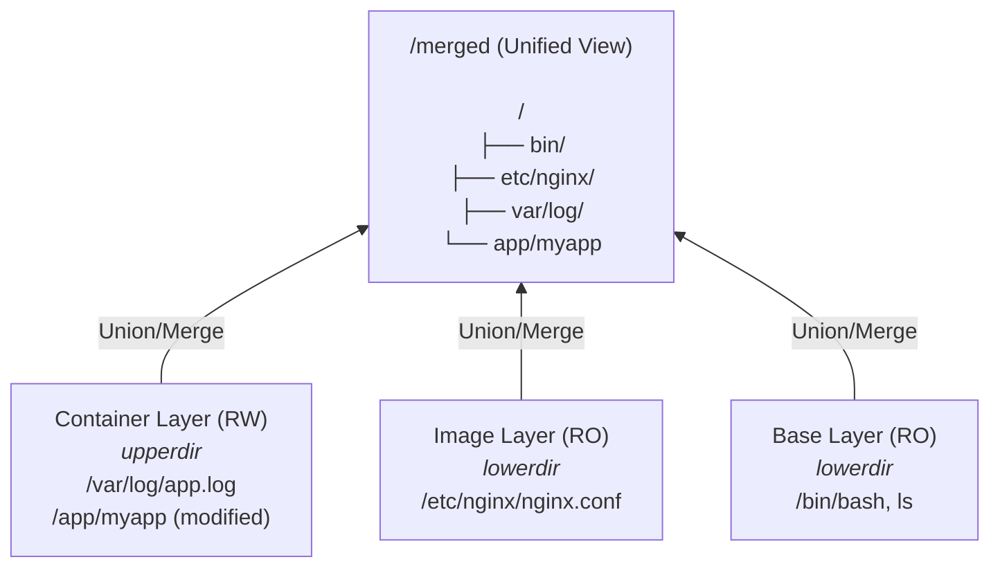
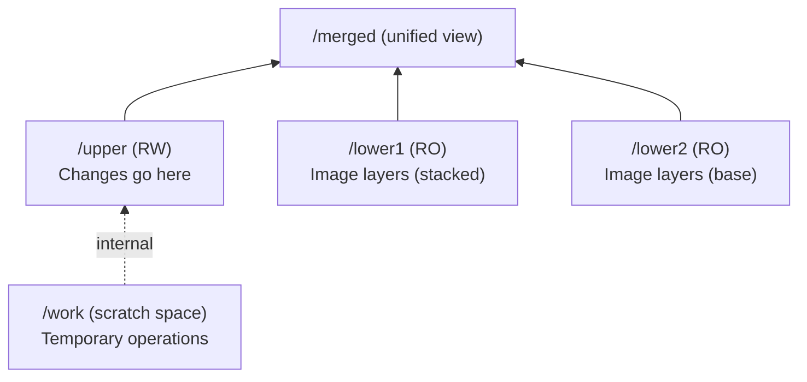
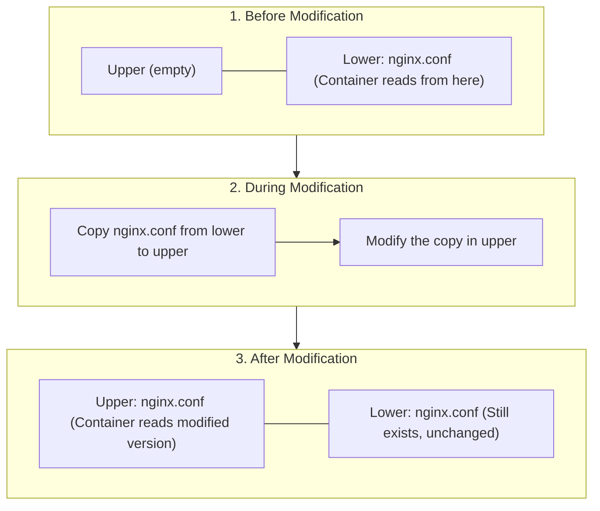
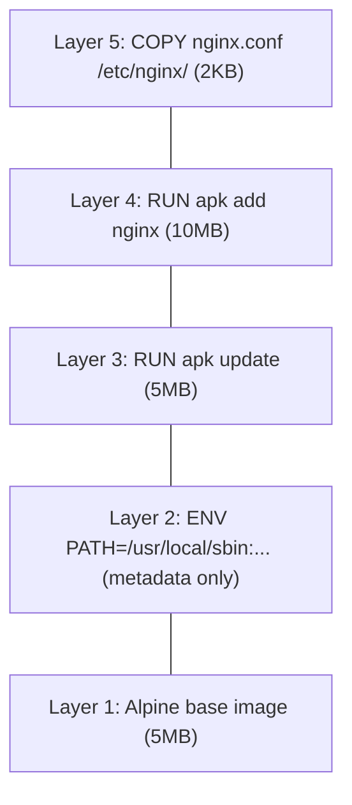
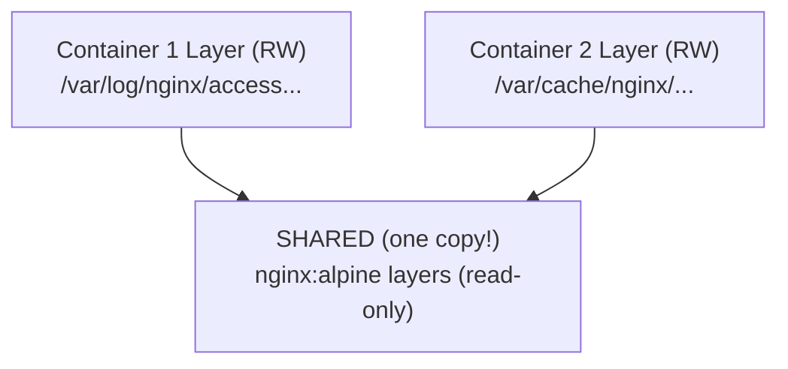

# Module 2.4: Union Filesystems

> **Linux Foundations** | Complexity: `[MEDIUM]` | Time: 45-60 min

## Prerequisites

Before starting this module:
- **Required**: [Module 1.3: Filesystem Hierarchy](/linux/foundations/system-essentials/module-1.3-filesystem-hierarchy/)
- **Required**: [Module 2.1: Linux Namespaces](../module-2.1-namespaces/) (mount namespace concept)
- **Helpful**: Understanding of container images

## What You'll Be Able to Do

After this module, you will be able to use union-filesystem mechanics as an operational debugging tool, not just as background trivia. The outcomes below are written around the same work you will practice in the lab and scenario quiz.
- **Trace** OverlayFS read, write, and delete paths through lowerdir, upperdir, workdir, and merged views.
- **Debug** container storage growth by inspecting writable layers, Docker diffs, storage drivers, and cleanup signals.
- **Compare** OverlayFS, AUFS, btrfs, zfs, devicemapper, and vfs tradeoffs for container runtimes.
- **Design** Dockerfile layer ordering and volume boundaries that reduce rebuild time, disk usage, and copy-on-write penalties.

## Why This Module Matters

A platform team at a payments company once treated container disks as if they were just smaller virtual-machine disks. Their service images looked harmless, and each pod started quickly during testing, but the production rollout placed hundreds of replicas on a small node pool while log files and temporary caches were written into the container filesystem. By the second traffic peak, several nodes reported disk pressure, kubelet evicted healthy pods, and the incident team spent the evening deleting unused images while explaining why a rollout that changed only application code could consume so much local storage.

The real failure was not that containers were unreliable. The failure was that nobody had modeled the storage layer that made containers efficient in the first place. Container runtimes do not normally copy a full image for every running container; they stack read-only image layers and add one writable layer on top. That trick saves disk space and speeds up startup, but it also creates sharp edges when large lower-layer files are modified, when cleanup happens in the wrong Dockerfile layer, or when application data that should live on a volume is written into the ephemeral layer.

Union filesystems are the Linux mechanism behind that tradeoff. They let several directories appear as one directory, which is exactly what a container needs when a reusable image must look writable to a process. In this module you will trace reads, writes, deletes, and image rebuilds through OverlayFS, then use those mechanics to make better operational decisions in Docker, containerd, Podman, and Kubernetes 1.35+ environments. When Kubernetes examples appear later in the curriculum, use the standard short alias `alias k=kubectl` before commands such as `k get pods`; the storage ideas here are the same beneath kubelet and the container runtime.

## The Layering Problem Union Filesystems Solve

Traditional filesystems give a process one directory tree backed by one storage location, but container images are assembled from many filesystem snapshots. A base image might contribute `/bin/sh`, a language runtime layer might add Python or Node.js, a package layer might add system libraries, and the application layer might add `/app`. If every container received a private copy of that whole tree, the host would waste disk space, pull times would grow, and starting a hundred identical replicas would behave like cloning a hundred virtual-machine disks.

A union filesystem solves this by merging several directories into one view. The lower layers are treated as read-only history, the upper layer is the place where new writes land, and the merged view is what the container process sees after the runtime stacks those pieces together. The process opens `/etc/nginx/nginx.conf` as though it were on an ordinary filesystem, but the kernel decides which layer owns the visible file. That decision happens below the application, so most software does not need to know it is running on a union mount.

The important mental model is a transparent stack of paper. The bottom sheets contain the base image, the middle sheets contain package and configuration changes, and the top sheet is the writable container layer. When the process reads, it sees the topmost visible version of the file. When it writes a new file, the file appears on the top sheet. When it modifies a lower file, the kernel copies that file upward and edits the copy, leaving the original lower sheet unchanged for other containers.



This diagram shows why image sharing works. The base and image layers can be reused by many containers because they do not change after the image is pulled. Each running container gets its own writable upperdir, so the runtime can isolate changes without duplicating the expensive lower content. If container A writes `/var/log/app.log`, container B does not see that file unless the runtime explicitly shares a volume or another storage object between them.

| Concept | Description |
|---------|-------------|
| Layer | A directory containing filesystem changes |
| Lower layers | Read-only base layers (image) |
| Upper layer | Read-write container layer |
| Merged view | What the container sees |
| Copy-on-write | Copies file to upper layer when modified |
| Whiteout | Marks deleted files (without removing from lower) |

Notice that a layer is not a mystical container object. It is a filesystem snapshot with rules about how it participates in the stack. Image layers are immutable once the runtime has unpacked them, which is why they are safe to share. The upper layer is mutable, which is why it must belong to one container instance unless the runtime is doing something special. The merged view is not a new copy of the whole tree; it is a kernel-mediated view over the existing directories.

Pause and predict: if a process deletes `/bin/ls` inside a container, what must the upper layer record so the lower image can stay unchanged while the process no longer sees that path? The answer is not that the lower layer is edited, because that would break every other container using the same image. The answer is a whiteout, which is a special marker in the upper layer that tells the merged view to hide the lower file.

Whiteouts are the reason deletion in a union filesystem is more subtle than deletion on an ordinary directory tree. If the lower layer contains a file and the upper layer only removes it from the merged view, the system needs a durable way to remember that removal. A whiteout is that durable memory. It says, in effect, "there may be a lower file here, but this container's view should treat it as deleted." That is why removing package caches in a later Dockerfile layer can hide files without shrinking the earlier layer that still stores the bytes.

A practical example makes the point concrete. Imagine a security team discovers a vulnerable binary in a base image and a developer adds `RUN rm /usr/bin/vulnerable-tool` near the end of the Dockerfile. The resulting container may not show the binary in the merged view, but the bytes can still exist in a lower layer and may still contribute to image size or forensic exposure depending on distribution and registry behavior. The safer fix is to choose a base image or build step that never includes the file, or to remove it before the layer containing it is committed.

This is the first operational lesson of union filesystems: the merged view is what the process sees, but layer history is what the runtime stores. Debugging container storage requires looking at both. A container can look clean from inside while still carrying large lower-layer data, and a small edit from inside the container can create a large writable-layer copy on the host. The rest of the module teaches you to reason across those two views without guessing.

## Trace OverlayFS Anatomy and Lookup Paths

OverlayFS is the Linux union filesystem most container operators encounter today. Docker's `overlay2` storage driver, containerd's overlay snapshotter, and many Podman installations all rely on the same basic kernel feature: mount one or more lower directories, one upper directory, one work directory, and one merged directory. The container process sees the merged directory, while the runtime manages the other directories under paths such as `/var/lib/docker/overlay2` or containerd's snapshot storage.

The mount command is compact, but each option matters. `lowerdir` names the read-only directories that provide the image content. `upperdir` names the writable directory for changes. `workdir` gives OverlayFS scratch space for atomic operations and must be on the same filesystem as the upper directory. The final path is the merged mountpoint. If any of those pieces is missing or placed on an incompatible backing filesystem, the mount fails or behaves poorly under load.

```bash
# Mount command:
mount -t overlay overlay -o \
  lowerdir=/lower1:/lower2, \
  upperdir=/upper, \
  workdir=/work \
  /merged
```



When a lookup happens, OverlayFS searches from the top of the stack downward. If the upperdir has a file at the requested path, that version wins. If the upperdir has a whiteout at that path, the lower file is hidden and the lookup reports that the file is absent. If the upperdir has nothing there, OverlayFS checks the uppermost lower layer, then the next lower layer, until it finds a visible file or reaches the bottom. Directories are merged more carefully because entries from several layers may need to appear side by side.

| Operation | What Happens |
|-----------|--------------|
| **Read** | Return file from highest layer that has it |
| **Write (new file)** | Create in upper layer |
| **Write (existing)** | Copy from lower to upper, then modify (COW) |
| **Delete** | Create "whiteout" file in upper layer |
| **Rename dir** | Complex; may copy entire directory |

The table hides a lot of kernel work, so do not treat it as a performance guarantee. Reading a lower-layer file is usually cheap because no copy is needed. Creating a new upper-layer file is also straightforward. Modifying an existing lower-layer file is where copy-on-write enters, and renaming directories can be expensive because the kernel may need to preserve merged-directory semantics while moving or copying metadata. Those details explain why workloads that write many files into the container layer can feel different from the same workload writing to a normal host directory.

Before running this, what output do you expect after creating `new.txt`, modifying `modify.txt`, and deleting `delete.txt` through the merged directory? If your prediction says the lower directory changes, revise the model before continuing. The lower directory should stay intact because the writable state lives in the upper directory, and deletion should be represented above the lower file rather than by removing the lower file itself.

```bash
# Create directories
mkdir -p /tmp/overlay/{lower,upper,work,merged}

# Add some files to lower
echo "base file" > /tmp/overlay/lower/base.txt
echo "will be modified" > /tmp/overlay/lower/modify.txt
echo "will be deleted" > /tmp/overlay/lower/delete.txt

# Mount overlay
sudo mount -t overlay overlay \
    -o lowerdir=/tmp/overlay/lower,upperdir=/tmp/overlay/upper,workdir=/tmp/overlay/work \
    /tmp/overlay/merged

# View merged filesystem
ls /tmp/overlay/merged/
# Shows: base.txt  delete.txt  modify.txt

# Read from lower layer
cat /tmp/overlay/merged/base.txt
# Output: base file

# Create new file (goes to upper)
echo "new file" > /tmp/overlay/merged/new.txt
ls /tmp/overlay/upper/
# Shows: new.txt

# Modify existing (copy-on-write)
echo "modified content" > /tmp/overlay/merged/modify.txt
ls /tmp/overlay/upper/
# Shows: modify.txt  new.txt

# Delete file (creates whiteout)
rm /tmp/overlay/merged/delete.txt
ls -la /tmp/overlay/upper/
# Shows: delete.txt (whiteout character device)

# Original still exists in lower
ls /tmp/overlay/lower/
# Shows: base.txt  delete.txt  modify.txt

# Cleanup
sudo umount /tmp/overlay/merged
rm -rf /tmp/overlay
```

This manual mount is useful because it strips away container-runtime ceremony. Docker and containerd add IDs, metadata databases, garbage collection, content stores, and snapshot references, but the core behavior is visible in `/tmp/overlay`. If the upper directory contains `new.txt`, you saw a new-file write. If `modify.txt` appears in the upper directory after being edited, you saw a copy-up operation. If the lower directory still contains all three original files after the merged view changed, you saw the isolation that makes shared image layers safe.

A common war story starts with a developer saying, "I changed the file inside the container, but the image did not change." That is expected. A running container's upperdir is not the image; it is a private writable layer attached to that container. Committing the container can turn that state into a new image layer, but ordinary container writes do not mutate the original image. This distinction prevents accidental image corruption, and it also explains why emergency manual edits inside a pod disappear when the workload is recreated.

There are several consequences for debugging. If you enter a container and inspect only the merged view, you know what the process sees, but you do not yet know where the bytes live. If you inspect only `/var/lib/docker/overlay2`, you know what the runtime stores, but you might misread a whiteout or a copied-up file without understanding the merged view. Skilled operators move between those views deliberately: process symptom, merged path, runtime diff, writable layer, backing filesystem capacity, and finally cleanup or image redesign.

## Copy-on-Write, Whiteouts, and Performance Costs

Copy-on-write is the policy that makes a shared lower layer feel writable without being modified. The first write to a lower-layer file triggers a copy-up into the upper layer. After that copy exists, subsequent reads and writes for that path use the upper version. This is excellent for many container workloads because most files are read from the image and only a small number of files change. It is less excellent when the first write touches a very large lower-layer file or when an application repeatedly mutates many files that began in the image.



The lower layer is never modified, ensuring other containers can safely use it. That immutability is the reason a node can run many containers from the same image without multiplying base-image storage. It is also the reason a surprisingly small write can cause a surprisingly large upper-layer allocation. If the edited file is large, the runtime may need to copy the file into the writable layer before applying the edit, even when the logical change is tiny.

Stop and think: if you append a single 1 KB line to a 5 GB log file that lives in a lower image layer, how much disk space might the operation consume in the upper layer? The dangerous answer is "about 1 KB," because the application-level write is only the appended line. The storage answer can be much closer to the full file size because the file must become writable in the upper layer before the change is recorded.

| Operation | Performance |
|-----------|-------------|
| Reading small file | Fast (direct read) |
| Reading large file | Fast (direct read) |
| Writing new small file | Fast (write to upper) |
| Modifying small file | Medium (copy + write) |
| Modifying large file | SLOW (full copy + write) |
| Modifying file frequently | Can be slow (consider volume) |

The best practice follows directly from the table: for frequently modified files, use volumes instead of the container layer. A volume writes to a storage location managed outside the union filesystem view, so the application avoids copy-up semantics for that path and the data can outlive the container. This is why databases, queues, caches with meaningful state, build workspaces, and high-churn temporary directories are usually better served by bind mounts, named volumes, emptyDir volumes, or persistent volumes depending on the environment.

Whiteouts create a second performance and correctness concern. Deleting a lower-layer file from the merged view does not recover the bytes from the lower layer. The upper layer stores a marker that hides the lower file. In a Dockerfile, that means a cleanup command in a later layer can make the final container view look clean while the earlier layer still contributes size. In a running container, it means a deletion can increase upper-layer metadata even though the merged view appears to contain fewer files.

The operational decision is not "never write to the container layer." Many normal containers write a small PID file, create a temporary socket, or update modest application state during startup. The decision is whether the write pattern is cheap, disposable, and local to the container instance. If it is large, frequent, durable, or shared across replicas, the union filesystem is the wrong boundary. Treat the writable layer as scratch space for container-local changes, not as a general-purpose data store.

A real debugging path often begins with disk pressure on a Kubernetes node. The application owner says the pod has no persistent volume and the image is only a few hundred megabytes, but `kubectl describe node` reports local ephemeral storage pressure and kubelet starts evicting pods. With `alias k=kubectl` already set, an operator might use `k get pods` to identify restart patterns, then inspect the runtime with Docker or CRI tooling on the node. The answer is often a writable layer full of logs, package caches, crash dumps, or temporary files that should have been redirected.

The same reasoning helps with security and incident response. If a compromised process writes a tool into `/tmp` inside the container, that tool lives in the upper layer, not the image layer. If it overwrites a lower-layer binary, the upper layer contains the replacement and the lower image still contains the original. If it deletes a lower file, the upper layer contains the hiding marker. Forensics should therefore preserve the writable layer or runtime snapshot before removing the container, otherwise the most useful evidence may disappear with the container instance.

## Container Image Layers and Build Cache Behavior

Container image layers are the build-time counterpart to OverlayFS runtime layers. Each filesystem-changing Dockerfile instruction produces a new layer that records the difference from the previous step. Metadata-only instructions can still affect image metadata and cache keys, but `RUN`, `COPY`, and `ADD` are the common sources of meaningful filesystem changes. When the runtime starts a container, it stacks those unpacked image layers as lowerdirs and adds a fresh writable layer on top.

```bash
docker pull nginx:alpine
```



The total image in this simplified example is about 22 MB, but that number is not the full story. If another image on the node uses the same Alpine base layer, the runtime can store the base once and reference it from both images. If a hundred containers use the same image, the image layers still exist once on disk, while each container adds only its private writable state. That is why image composition and layer reuse matter for density, pull time, and node cache behavior.

```bash
# See layers
docker history nginx:alpine

# Detailed layer info
docker inspect nginx:alpine | jq '.[0].RootFS.Layers'

# Layer storage location
ls /var/lib/docker/overlay2/
```

The commands above reveal different parts of the stack. `docker history` is useful for human review because it maps sizes to Dockerfile instructions. `docker inspect` shows the content-addressed layer identifiers that the image references. The storage directory shows the runtime's local unpacked representation, though it is not meant to be edited by hand. If those views disagree with your expectation, the problem is usually a cache assumption, a Dockerfile instruction order issue, or a misunderstanding about which layer changed.



One hundred containers from `nginx:alpine` do not require one hundred private copies of the image. They require one local copy of the image layers, plus one writable layer per container. Those writable layers may remain tiny if the application writes little state, or they may become the actual capacity problem if the application writes logs, cache files, uploads, or generated artifacts into paths that are not volumes. This is the storage version of a familiar platform rule: shared immutable inputs scale well, private mutable outputs need capacity planning.

Pause and predict: if you change a single line of application code in your source tree, which Dockerfile layers should rebuild if dependencies were copied and installed before the application source? The efficient answer is that the dependency install layer should remain cached, and only the application copy layer plus later dependent layers should rebuild. If your Dockerfile copies the whole source tree before installing dependencies, the same source change invalidates the expensive install step.

```dockerfile
FROM ubuntu:22.04
RUN apt-get update
RUN apt-get install -y python3
RUN apt-get install -y python3-pip
RUN rm -rf /var/lib/apt/lists/*   # Too late! Previous layers have it
```

Each `RUN` creates a layer, so the cleanup in the last layer does not reduce the size of earlier layers. The files from `apt-get update` and package installation were already committed before the final removal command ran. The final layer can hide the cache from the merged view, but it cannot rewrite the historical layer that stored those files. This is the most common first encounter with whiteouts outside a running container.

```dockerfile
FROM ubuntu:22.04
RUN apt-get update && \
    apt-get install -y python3 python3-pip && \
    rm -rf /var/lib/apt/lists/*   # Same layer, so files are never stored
```

Combining update, install, and cleanup into one `RUN` instruction changes the layer economics. The package lists can be removed before the layer is committed, so the committed layer contains the installed packages without preserving the temporary index files. The tradeoff is that very long `RUN` commands can become harder to read, so teams often format them carefully and keep related package operations together rather than blindly merging unrelated setup steps.

```dockerfile
# BAD: Copy code before installing dependencies
# Every code change invalidates pip install layer
FROM python:3.11
COPY . /app                    # Changes frequently
RUN pip install -r /app/requirements.txt  # Reinstalled every time!

# GOOD: Install dependencies first
FROM python:3.11
COPY requirements.txt /app/    # Changes rarely
RUN pip install -r /app/requirements.txt  # Cached!
COPY . /app                    # Only this layer rebuilds
```

Layer ordering is a design decision, not a style preference. Put stable, expensive steps early so they can be reused across builds, and put frequently changing application files later so small changes do not invalidate heavy work. In practice that usually means copying dependency manifests before source code, installing dependencies in a cache-friendly layer, and copying the rest of the application after the dependency step. Multi-stage builds extend the same idea by keeping build tools and intermediate artifacts out of the final runtime image.

```
# .dockerignore
.git
node_modules
__pycache__
*.pyc
.env
*.log
```

A `.dockerignore` file protects the build context before the Dockerfile even starts. Without it, the builder may receive `.git`, local dependency directories, compiled bytecode, environment files, and logs. That slows builds, changes cache keys, and can accidentally place sensitive or irrelevant files into layers. The union filesystem cannot save you from a bad build context; it can only stack the layers the builder produced.

An instructive war story comes from teams that add `rm -rf node_modules` or `rm .env` late in the Dockerfile after accidentally copying the entire repository. The final container may not show those paths, but the layer history can still include the copied files. The better design is to exclude them with `.dockerignore`, copy only what the build needs, and use explicit artifact movement from builder stages into the runtime stage. Layer hygiene is easier when unwanted bytes never enter the layer history.

## Debug Container Storage Growth and Runtime Drivers

Storage drivers are the runtime bridge between image layers, container writable layers, and the host filesystem. Docker calls its OverlayFS driver `overlay2`, containerd often calls the equivalent implementation an overlay snapshotter, and Podman reports its graph driver through its own tooling. The names differ, but the operator question is the same: what mechanism is backing the container's merged view, where does the writable state live, and how does the backing filesystem handle metadata, quotas, and cleanup?

| Driver | Used By | Backing Filesystem |
|--------|---------|-------------------|
| overlay2 | Default | xfs, ext4 |
| btrfs | Some systems | btrfs |
| zfs | Some systems | zfs |
| devicemapper | Legacy RHEL | Any |
| vfs | Testing only | Any |

OverlayFS won in mainstream container operations because it is in the Linux kernel, is broadly supported, and maps well to the immutable-lower plus writable-upper image model. AUFS was important historically, especially in early Docker deployments, but it was not merged into the mainline kernel. btrfs and zfs can provide snapshot capabilities when the host uses those filesystems, but they are less universal. devicemapper was common in older enterprise environments, and `vfs` is simple but slow because it performs full copies rather than efficient union stacking.

```bash
# Docker
docker info | grep "Storage Driver"

# containerd
cat /etc/containerd/config.toml | grep snapshotter

# Podman
podman info | grep graphDriverName
```

Checking the driver is a first step, not a full diagnosis. If Docker reports `overlay2`, you still need to know where Docker stores its root directory, how much free space exists on that filesystem, whether inode exhaustion is possible, and whether the application is writing to the container layer or a mounted volume. If containerd uses an overlay snapshotter under kubelet, you also need to remember that Kubernetes reports ephemeral storage at the pod and node levels while the runtime manages the underlying snapshots.

```bash
# Docker layer storage
ls /var/lib/docker/overlay2/

# Each directory is a layer
# l/ contains shortened symlinks for path length
# diff/ contains actual layer contents
# merged/ is the union view (for running containers)
# work/ is overlay work directory
```

The storage directory is for inspection, not manual surgery. Editing files under `/var/lib/docker/overlay2` can corrupt runtime state because Docker expects its metadata database, layer references, and filesystem contents to agree. Use runtime commands to remove containers, images, and build cache. Inspect paths when you need to learn, confirm a hypothesis, or preserve evidence, but let the runtime perform lifecycle operations.

```bash
# Check container sizes
docker ps -s

# SIZE: Virtual = image + writable layer
# SIZE: Actual writable layer

# Find large files in container
docker exec container-id du -sh /* 2>/dev/null | sort -h | tail -10

# Check what's in writable layer
docker diff container-id
# A = Added
# C = Changed
# D = Deleted
```

The `docker ps -s` output is often misunderstood. The virtual size includes the shared image layers plus the writable layer, so it can look large even when the container is not uniquely consuming that whole amount. The writable size is the more urgent number when diagnosing per-container growth. `docker diff` then tells you which paths were added, changed, or deleted in the writable layer, which is exactly the evidence needed to decide whether the application should use a volume, change log configuration, or rebuild the image with different defaults.

```bash
# See layer sizes
docker history --no-trunc nginx:alpine

# Use dive tool for detailed analysis
# https://github.com/wagoodman/dive
dive nginx:alpine
```

Image-layer analysis and container-layer analysis answer different questions. `docker history` and tools such as `dive` explain why an image is large and which build instructions contributed bytes. `docker diff` and writable-size inspection explain why a running container is growing. Do not use one to answer the other. A beautifully optimized image can still fill a node if the application writes high-volume logs into the writable layer, and a messy image can still run stably if its runtime writes go to appropriate volumes.

```bash
# Docker disk usage
docker system df

# Detailed breakdown
docker system df -v

# Clean up
docker system prune        # Remove unused data
docker system prune -a     # Also remove unused images
docker builder prune       # Clear build cache
```

Cleanup commands should be used with an understanding of references. `docker system prune` removes unused data, while `docker system prune -a` also removes unused images, and `docker builder prune` clears build cache. On a developer laptop that may be fine. On a shared build host or node, aggressive pruning can cause slower future pulls or builds, and deleting the wrong cache at the wrong time can move pressure from disk capacity to network and registry load. The right fix for repeated pressure is usually workload design, image hygiene, node sizing, or kubelet eviction configuration, not a cron job that blindly prunes everything.

In Kubernetes 1.35+ clusters, the same ideas show up as image filesystem pressure, container writable-layer growth, and ephemeral-storage requests and limits. Kubernetes does not change OverlayFS semantics; it schedules and monitors workloads that use a runtime underneath. A pod that writes to `emptyDir` uses node ephemeral storage, a pod that writes inside the container filesystem uses the writable layer, and a pod that writes to a persistent volume uses the configured storage backend. Debugging requires mapping the symptom to the right storage path before changing requests, limits, images, or volume mounts.

There is also a planning lesson for platform teams that operate shared clusters. Image garbage collection, build-cache cleanup, and pod eviction thresholds are cluster-level controls, but the most durable fix often sits in the application contract. A team that states "this path is immutable image content, this path is disposable scratch, and this path is durable state" gives the platform enough information to set requests, limits, volume mounts, and retention rules. Without that contract, every disk-pressure incident becomes a debate over whether the node is undersized or the workload is misbehaving. Clear ownership turns storage alerts from mysteries into fast routing decisions.

When you review a new service, ask for the storage map before the first production rollout. Which files arrive from the image? Which directories can grow after startup? Which writes are expected during normal traffic, and which only appear during debugging or failure? A short design review can prevent a long incident because union filesystems reward clarity about lifetime and ownership. The runtime is excellent at sharing immutable layers, but it cannot infer that an application cache should have a quota, a database needs persistence, or a crash dump should leave the node after collection. Writing those decisions down also helps future responders distinguish intentional scratch growth from a leak, which shortens incidents when the original authors are unavailable.

## Patterns & Anti-Patterns

**Pattern: keep immutable content in image layers and mutable content on volumes.** Use image layers for operating-system packages, language runtimes, application binaries, and static configuration that changes only when you build a new image. Use volumes or explicit ephemeral storage paths for logs, databases, upload directories, caches with meaningful size, and anything that must survive container replacement. This pattern works because it aligns the workload with the union filesystem contract: shared lower layers remain stable, and high-churn data avoids copy-on-write overhead.

**Pattern: order Dockerfile layers by stability and cost.** Place stable, expensive dependency steps before frequently changing application files, and keep cleanup inside the same layer that creates temporary files. This reduces rebuild time because cache keys for expensive layers remain valid when code changes, and it reduces image size because temporary package indexes are removed before the layer is committed. The scaling benefit appears in CI systems where many builds share remote or local cache, not only on individual laptops.

**Pattern: inspect writable growth before pruning.** When a node or workstation runs low on disk, first distinguish shared image size, build cache, stopped containers, and live writable layers. `docker system df`, `docker ps -s`, `docker diff`, and image history answer different parts of that question. This pattern prevents a common operational mistake: deleting caches to make an alert green while leaving the application behavior that created the pressure untouched.

**Anti-pattern: treating the container layer as durable application storage.** Teams fall into this when an application works locally, restarts rarely, and writes to a convenient default path. The failure appears during rescheduling, node replacement, cleanup, or container recreation, when the writable layer is discarded. The better alternative is to classify data by durability and throughput, then mount a volume or external service for anything that matters beyond the life of one container instance.

**Anti-pattern: hiding files in later layers and calling the image optimized.** This happens when a cleanup command appears after the layer that introduced package lists, build artifacts, credentials, or bulky dependencies. The final merged view may look clean, but lower layers can still carry the data. The better alternative is to prevent unwanted files from entering the build context, delete temporary files before the layer commits, and use multi-stage builds to copy only final artifacts into the runtime image.

**Anti-pattern: debugging only from inside the container.** The merged view is necessary, but it can hide whether a path came from the image, the writable layer, a volume, or a whiteout. Teams fall into this because shell access feels concrete and fast during an incident. The better alternative is to pair inside-container inspection with runtime-level evidence such as `docker diff`, writable-size reports, storage-driver configuration, and node filesystem capacity.

## Decision Framework

Start by asking whether the bytes are immutable, disposable, durable, or shared. Immutable bytes belong in image layers because the runtime can reuse them safely across containers and nodes. Disposable bytes can live in the writable layer only when they are modest in size and losing them on container replacement is acceptable. Durable bytes need a volume, database, object store, or another storage service. Shared mutable bytes should almost never rely on a container writable layer because each container instance receives its own upperdir.

Next, ask whether the write pattern is small and occasional or large and frequent. A startup script that writes a short generated config file into the writable layer may be acceptable, even if a cleaner image design would be preferable. A service that appends to multi-gigabyte logs, rewrites package caches, compiles artifacts, or mutates a large embedded dataset should use a volume or a different runtime path. Copy-on-write is optimized for sparse change, not for pretending a shared lower layer is a high-throughput mutable disk.

Then ask whether the problem is build-time size, runtime growth, or node-level cleanup. Build-time size points toward Dockerfile layer order, `.dockerignore`, multi-stage builds, and image history. Runtime growth points toward writable-layer inspection, application paths, log configuration, and volume boundaries. Node-level cleanup points toward unused images, stopped containers, build cache, kubelet garbage collection, and capacity settings. Mixing those categories wastes time because the evidence and fixes differ.

Finally, choose the least surprising mechanism for the next operator. If data must be durable, make the volume visible in the manifest or run command. If image size matters, make the Dockerfile explain why cleanup is in the same layer. If a path is intentionally ephemeral, document that expectation and consider Kubernetes ephemeral-storage requests and limits. Union filesystems are powerful, but the operational goal is not to show cleverness; it is to make the storage lifetime obvious from the configuration.

## Did You Know?

- **OverlayFS merged into the Linux kernel in 2014** with kernel 3.18. Before that, early container stacks often relied on AUFS, which stayed outside the mainline kernel and complicated distribution support.
- **A single image layer can be shared by thousands of containers** on the same host when they reference the same content. The host stores the read-only layer once and gives each container its own thin writable layer.
- **Only filesystem-changing Dockerfile instructions create meaningful filesystem layers** in the final image history. Instructions such as `ENV` and `LABEL` affect metadata and cache behavior, but `RUN`, `COPY`, and `ADD` are the usual sources of stored file changes.
- **The container writable layer is normally discarded with the container instance.** Volumes exist because useful data often needs a lifetime that is independent from the process and the upperdir attached to one container.

## Common Mistakes

| Mistake | Why It Happens | How to Fix It |
|---------|----------------|---------------|
| Splitting package install and cleanup across several `RUN` instructions | The final merged view hides files, so the image looks clean during a shell inspection | Chain update, install, and cleanup in one layer, or use a multi-stage build that copies only final artifacts |
| Copying the whole repository before installing dependencies | The Dockerfile is written in the same order a developer thinks about the project | Copy dependency manifests first, install dependencies, then copy frequently changing application source |
| Writing logs, databases, or caches into the container layer | The default application path works during local testing and the container seems writable | Mount a volume, redirect logs to stdout or a managed path, and set ephemeral-storage expectations |
| Assuming `docker ps -s` virtual size equals unique disk usage | Shared image layers and private writable layers are displayed together | Compare virtual size with writable size, then use `docker diff` and image history for separate evidence |
| Editing files under `/var/lib/docker/overlay2` by hand | The runtime storage directory looks like ordinary directories during an incident | Inspect for learning or evidence, but remove and prune through Docker, containerd, Podman, or kubelet workflows |
| Deleting a sensitive file in a later image layer | The final container no longer shows the file, so the team assumes the layer history is safe | Keep secrets out of the build context, use `.dockerignore`, and avoid copying unwanted files into any layer |
| Treating OverlayFS, volumes, and Kubernetes ephemeral storage as the same thing | All three appear as paths inside the container process | Map each path to its backing mechanism before changing limits, cleanup policy, or application configuration |

## Quiz

<details><summary>Question 1: Your team scales a Node.js deployment to 100 replicas from one 500 MB image, and finance asks whether the node now stores 50 GB of image data. How do you explain the real storage behavior?</summary>

The assumption is wrong because the runtime shares the read-only image layers on each node. It stores one local copy of each referenced layer and gives every running container a private writable layer on top. The unique disk cost starts near the image plus small upperdirs, not the image multiplied by replica count. The warning is that writable layers can still grow independently if the application writes logs, caches, or generated files inside the container filesystem.

</details>

<details><summary>Question 2: A developer appends one line to a 2 GB log file that was baked into a lower image layer, and the writable container size jumps dramatically. What mechanism caused the growth?</summary>

Copy-on-write caused the growth. Because the lower layer is read-only, the runtime cannot append directly to the lower file, so it copies the file into the upper layer and applies the change there. The logical edit is tiny, but the storage operation can require a large copied-up file. The better design is to keep high-churn logs out of image layers and write them to stdout, a volume, or another appropriate storage path.

</details>

<details><summary>Question 3: A pull request claims to optimize an Ubuntu image by running cleanup in a final `RUN rm -rf /var/lib/apt/lists/*` layer, but the image size barely changes. Why did the optimization fail?</summary>

```dockerfile
RUN apt-get update
RUN apt-get install -y curl
RUN rm -rf /var/lib/apt/lists/*
```

The cleanup happened after the package lists were already committed into earlier layers. The final layer can hide those files from the merged view by recording deletions, but it does not rewrite the previous layers that still contain the bytes. To reduce image size, update, install, and cleanup need to happen in the same `RUN` instruction, or the build should use a stage that never copies temporary package data into the final image. This is a layer-history problem, not a shell-inspection problem.

</details>

<details><summary>Question 4: A database container has no volume, the node reboots, the workload is recreated, and the database appears empty. What storage lifetime did the team misunderstand?</summary>

They stored durable data in the container writable layer, which is attached to one container instance rather than to the workload's long-term identity. When the container is removed or recreated, the upperdir can be discarded and a new container starts with a fresh writable layer over the original image. The correct fix is to use a persistent volume or an external database service, depending on the workload. Restart behavior should be tested by deleting and recreating the container, not only by restarting the process inside it.

</details>

<details><summary>Question 5: A build pipeline reinstalls Python dependencies after every one-line code change. Which Dockerfile design issue should you look for first, and why?</summary>

Look for source code being copied before dependency manifests and dependency installation. If `COPY . /app` appears before `RUN pip install -r requirements.txt`, every code change invalidates the install layer because the input to that layer changed. Copying `requirements.txt` first lets the expensive dependency layer stay cached when application code changes. The fix reduces rebuild time without changing application behavior.

</details>

<details><summary>Question 6: A node reports disk pressure, `docker system df` shows build cache, and one live container also has a large writable size. Which evidence should guide cleanup versus workload redesign?</summary>

Use `docker system df` to understand unused images, stopped containers, and build cache, but use `docker ps -s` and `docker diff` to understand live writable-layer growth. Cleanup may reclaim unused data, but a live container with a growing upperdir indicates an application write-path issue. If `docker diff` shows logs, uploads, or caches, redesign the path with volumes, log routing, or application configuration. Treat pruning as immediate relief, not as proof that the workload is fixed.

</details>

<details><summary>Question 7: You are choosing between OverlayFS, btrfs, zfs, devicemapper, and vfs for a general Linux container host. Why is OverlayFS usually the default, and when might another choice appear?</summary>

OverlayFS is usually the default because it is in the mainline Linux kernel, works on common backing filesystems such as xfs and ext4, and fits the image-layer plus writable-layer model well. btrfs and zfs may appear when the host intentionally uses those filesystems and wants their snapshot features. devicemapper is mostly legacy in modern container setups, and vfs is useful for testing or portability but performs full copies. The practical comparison is supportability and operational fit, not only theoretical filesystem features.

</details>

## Hands-On Exercise

### Exploring Union Filesystems

This exercise uses the same progression an operator follows during a real storage investigation. You will first create a manual OverlayFS mount so the mechanics are visible without Docker metadata, then inspect image layers, grow a container writable layer, and compare Dockerfile layer choices. Run these commands on a Linux system where Docker is installed and where you can use `sudo` for the manual mount. If you are on a shared machine, use a disposable VM or lab host because the cleanup steps intentionally remove test images and temporary directories.

#### Task 1: Create a Manual Overlay

```bash
# 1. Create directories
mkdir -p /tmp/overlay-test/{lower,upper,work,merged}

# 2. Add content to lower
echo "original file" > /tmp/overlay-test/lower/readme.txt
mkdir /tmp/overlay-test/lower/subdir
echo "nested file" > /tmp/overlay-test/lower/subdir/nested.txt

# 3. Mount overlay
sudo mount -t overlay overlay \
    -o lowerdir=/tmp/overlay-test/lower,upperdir=/tmp/overlay-test/upper,workdir=/tmp/overlay-test/work \
    /tmp/overlay-test/merged

# 4. Explore
ls -la /tmp/overlay-test/merged/

# 5. Create new file
echo "new content" > /tmp/overlay-test/merged/newfile.txt

# 6. Check upper layer
ls /tmp/overlay-test/upper/
# newfile.txt is here!

# 7. Modify existing file
echo "modified" > /tmp/overlay-test/merged/readme.txt
ls /tmp/overlay-test/upper/
# readme.txt copied here (COW)

# 8. Delete a file
rm /tmp/overlay-test/merged/subdir/nested.txt
ls -la /tmp/overlay-test/upper/subdir/
# Whiteout file created

# 9. Cleanup
sudo umount /tmp/overlay-test/merged
rm -rf /tmp/overlay-test
```

<details><summary>Solution notes for Task 1</summary>

The lower directory should still contain its original files until cleanup removes the whole lab tree. New and modified files should appear in the upper directory because the merged mount routes writes there. The deleted lower file should be hidden from the merged view by upper-layer metadata rather than removed from the lower directory. If the mount fails, verify that the upper and work directories are empty and on the same backing filesystem.

</details>

#### Task 2: Examine Docker Layers

```bash
# 1. Pull an image
docker pull alpine:3.18

# 2. View layers
docker history alpine:3.18

# 3. Inspect layer IDs
docker inspect alpine:3.18 | jq '.[0].RootFS.Layers'

# 4. Find storage location
docker info | grep "Docker Root Dir"

# 5. List overlay directories
sudo ls /var/lib/docker/overlay2/ | head -10
```

<details><summary>Solution notes for Task 2</summary>

`docker history` shows the human-readable build history, while `docker inspect` shows layer digests. The Docker root directory tells you where the runtime stores local image and container state. The `overlay2` directory names are runtime implementation details, so use them for inspection and learning rather than manual edits. If your Docker installation uses a different root directory or driver, record that difference because it changes where you investigate host disk pressure.

</details>

#### Task 3: Container Layer in Action

```bash
# 1. Start container
docker run -d --name test-overlay alpine sleep 3600

# 2. Check initial size
docker ps -s --filter name=test-overlay

# 3. Write to container
docker exec test-overlay sh -c 'dd if=/dev/zero of=/bigfile bs=1M count=50'

# 4. Check size again
docker ps -s --filter name=test-overlay
# SIZE should show ~50MB now

# 5. See what changed
docker diff test-overlay
# Shows: A /bigfile

# 6. Find container layer
CONTAINER_ID=$(docker inspect test-overlay --format '{{.Id}}')
sudo ls /var/lib/docker/overlay2/ | grep -i ${CONTAINER_ID:0:12} || \
    echo "Layer is at: $(docker inspect test-overlay --format '{{.GraphDriver.Data.UpperDir}}')"

# 7. Cleanup
docker rm -f test-overlay
```

<details><summary>Solution notes for Task 3</summary>

The writable size should grow after `/bigfile` is created because the file belongs to the container's upper layer. `docker diff` should report the path as added, which confirms that the growth is runtime state rather than image history. The exact storage directory may not match the shortened container ID because Docker uses its own layer IDs, so the `GraphDriver.Data.UpperDir` output is the more reliable path. Removing the container removes the writable layer attached to this specific instance.

</details>

#### Task 4: Dockerfile Layer Optimization

```bash
# 1. Create bad Dockerfile
mkdir /tmp/dockerfile-test && cd /tmp/dockerfile-test
cat > Dockerfile.bad << 'EOF'
FROM alpine:3.18
RUN apk update
RUN apk add curl
RUN rm -rf /var/cache/apk/*
EOF

# 2. Build and check size
docker build -f Dockerfile.bad -t bad-layers .
docker images bad-layers

# 3. Create good Dockerfile
cat > Dockerfile.good << 'EOF'
FROM alpine:3.18
RUN apk update && apk add curl && rm -rf /var/cache/apk/*
EOF

# 4. Build and compare
docker build -f Dockerfile.good -t good-layers .
docker images | grep layers
# good-layers should be smaller

# 5. Compare layers
docker history bad-layers
docker history good-layers

# 6. Cleanup
docker rmi bad-layers good-layers
rm -rf /tmp/dockerfile-test
```

<details><summary>Solution notes for Task 4</summary>

The bad image keeps package-cache bytes in earlier layers even though the final layer hides them. The good image removes the cache before the layer is committed, so the final image should be smaller or at least show fewer wasted bytes in history. The exact size difference can vary with Docker version and Alpine package metadata, but the layer principle remains the same. Use `docker history` to connect the size difference to the instructions that created each layer.

</details>

### Success Criteria

- [ ] Trace OverlayFS read write delete paths through lowerdir upperdir workdir merged.
- [ ] Debug container storage growth with `docker ps -s`, `docker diff`, storage driver checks, and cleanup signals.
- [ ] Compare OverlayFS AUFS btrfs zfs devicemapper vfs tradeoffs for container runtimes.
- [ ] Design Dockerfile layer ordering and volume boundaries that reduce rebuild time disk usage and copy-on-write penalties.

## Next Module

Next, move to [Module 3.1: TCP/IP Essentials](/linux/foundations/networking/module-3.1-tcp-ip-essentials/) to see how Linux networking underpins container and Kubernetes networking. The same habit you practiced here, mapping an application symptom to the kernel mechanism underneath it, will carry directly into packet routing, interfaces, and network namespaces.

## Sources

- [OverlayFS Documentation](https://www.kernel.org/doc/html/latest/filesystems/overlayfs.html)
- [Docker Storage Drivers](https://docs.docker.com/storage/storagedriver/)
- [Docker OverlayFS Storage Driver](https://docs.docker.com/engine/storage/drivers/overlayfs-driver/)
- [Dockerfile Best Practices](https://docs.docker.com/develop/develop-images/dockerfile_best-practices/)
- [Docker Build Cache Invalidation](https://docs.docker.com/build/cache/invalidation/)
- [Docker System Prune Reference](https://docs.docker.com/reference/cli/docker/system/prune/)
- [Kubernetes Images](https://kubernetes.io/docs/concepts/containers/images/)
- [Kubernetes Volumes](https://kubernetes.io/docs/concepts/storage/volumes/)
- [OCI Image Layer Specification](https://github.com/opencontainers/image-spec/blob/main/layer.md)
- [containerd Snapshotter Documentation](https://github.com/containerd/containerd/blob/main/docs/snapshotters/README.md)
- [Dive - Image Layer Explorer](https://github.com/wagoodman/dive)
